**Volume 43 Cognitive Science for AI**

# Chapter 01. Human Cognition

## 01.00 Overview of Cognitive Science

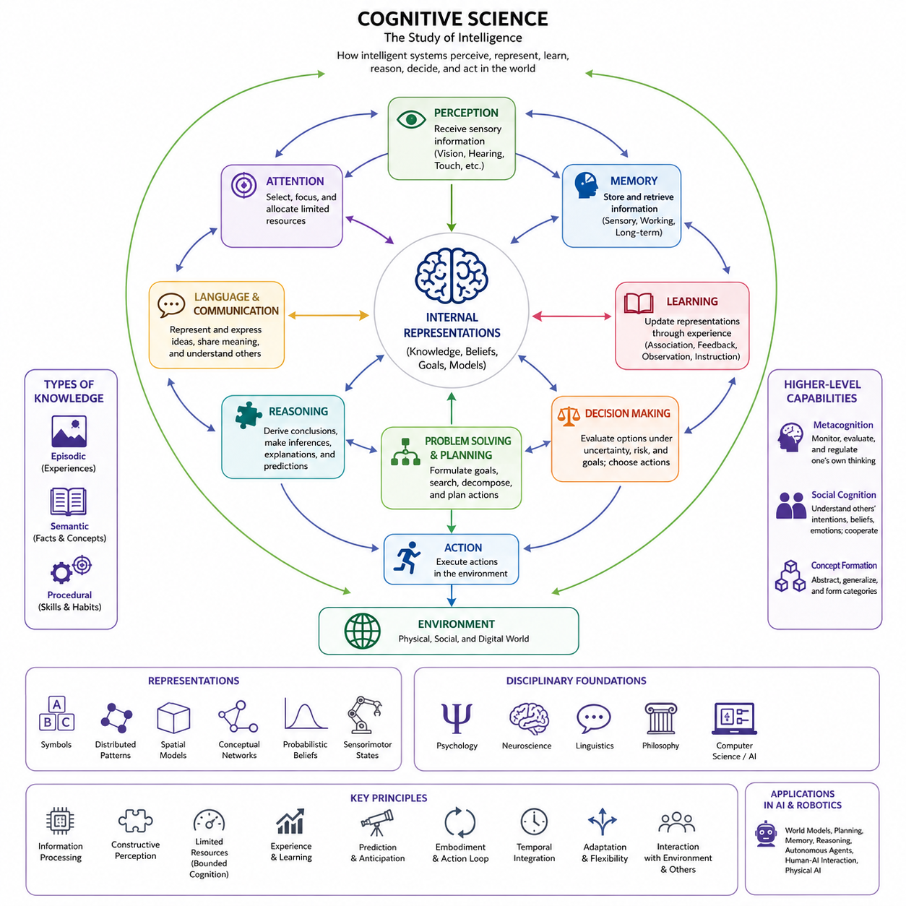{width="7.268055555555556in" height="7.268055555555556in"}

Cognitive science is the interdisciplinary study of how intelligent systems acquire information, transform it into internal representations, use those representations to guide behavior, and adapt through experience. It investigates perception, attention, memory, learning, language, reasoning, decision making, problem solving, and action as interconnected processes rather than isolated abilities.

The field emerged from the recognition that intelligence cannot be adequately explained from a single disciplinary perspective. Psychology contributes experimental models of behavior and mental processes, neuroscience investigates their biological mechanisms, linguistics studies language and meaning, philosophy examines knowledge and mind, while computer science provides computational models capable of implementing and testing theories of cognition.

A central idea in cognitive science is that observable behavior results from internal information-processing mechanisms. Sensory signals are not simply recorded and reproduced. They are selected, organized, interpreted, combined with prior knowledge, and transformed into representations that support prediction and action. Cognition therefore involves continuous interaction between incoming evidence and internally maintained models.

Perception provides one of the clearest examples of this constructive process. Visual, auditory, tactile, and other sensory signals are incomplete and frequently ambiguous, yet humans normally perceive coherent objects, events, spatial relationships, and situations. Cognitive systems resolve this ambiguity by combining sensory evidence with context, expectations, learned regularities, memory, and task-dependent attention.

Attention determines which information receives limited computational and cognitive resources. Because an intelligent organism cannot process every available stimulus with equal depth, attention performs selection, prioritization, and resource allocation. This principle is important for AI because practical systems must similarly determine which tokens, image regions, memories, sensor streams, objects, or candidate actions deserve greater processing.

Memory allows cognition to extend beyond the immediate present. Sensory memory briefly preserves incoming information, working memory maintains information needed for current operations, and long-term memory supports knowledge accumulated across extended experience. Episodic, semantic, and procedural forms of memory further distinguish remembered experiences, generalized knowledge, and learned skills that influence future behavior.

Learning changes internal representations and behavior through experience. Cognitive science examines learning through association, reinforcement, observation, instruction, abstraction, analogy, and repeated interaction with the environment. Human learning is particularly important for AI because people often acquire useful concepts from relatively limited data while transferring previous knowledge to unfamiliar situations and continuously integrating new information.

Reasoning transforms available representations into conclusions, predictions, explanations, or plans. Deductive reasoning derives consequences from rules, inductive reasoning identifies broader regularities from observations, and abductive reasoning searches for plausible explanations. Human reasoning also relies heavily on heuristics, analogy, prior knowledge, uncertainty estimation, and contextual judgment rather than purely formal logical operations.

Problem solving combines representation, search, reasoning, memory, and action selection. A problem can become easier or harder depending on how its states, constraints, goals, and possible operations are represented internally. Humans rarely explore all possible alternatives exhaustively; instead, they use experience, abstraction, decomposition, heuristics, and intermediate goals to restrict the search space and concentrate computation on promising possibilities.

Decision making concerns the selection of actions when multiple alternatives are available. Decisions may depend on expected reward, uncertainty, risk, previous experience, social context, emotional state, and long-term objectives. Cognitive research shows that human decisions are neither perfectly rational nor completely arbitrary, motivating computational models that combine bounded rationality, value estimation, heuristics, and adaptive control.

Language introduces a powerful mechanism for representing and communicating concepts beyond immediate sensory experience. Words and sentences allow humans to describe objects, relations, intentions, hypothetical situations, rules, and abstract ideas. Language is closely connected with memory, conceptual knowledge, reasoning, social interaction, and planning, although cognitive science continues to investigate how linguistic and nonlinguistic representations interact.

Concept formation enables intelligent systems to organize diverse experiences into reusable categories. Humans recognize that different observations may correspond to the same underlying object, property, relation, or event despite variations in appearance and context. Such abstraction supports generalization because knowledge learned from one instance can be applied to other situations sharing relevant structural or semantic characteristics.

Cognitive representations can take several forms, including symbolic structures, distributed patterns, spatial models, conceptual networks, probabilistic beliefs, and sensorimotor states. Different cognitive theories emphasize different representational mechanisms. For AI, this diversity suggests that intelligence may require multiple complementary representations rather than assuming that every cognitive function should operate through a single universal format.

The relationship between symbolic processing and distributed representation has been especially influential. Classical cognitive theories often describe cognition through explicit symbols, rules, and structured operations, while connectionist theories explain cognition through distributed activity across networks of simple processing units. Modern AI increasingly combines these perspectives through neural representations, structured reasoning, external tools, and explicit memory systems.

Cognition is also inherently temporal. Intelligent behavior depends not only on understanding the current state but also on remembering previous states and anticipating possible future states. Humans continuously integrate information over different time scales, ranging from milliseconds of sensory processing to years of accumulated knowledge. This temporal integration provides an important foundation for sequential prediction, planning, and world modeling.

Prediction is therefore closely connected with cognition. An intelligent agent benefits from anticipating what sensory input, environmental change, or behavioral consequence is likely to occur next. Prediction allows discrepancies between expectation and observation to become informative learning signals. This perspective connects cognitive science with predictive processing, generative modeling, model-based reinforcement learning, and modern computational world models.

Cognition should not be understood as a purely passive process occurring independently of action. Perception influences action, action changes the environment, and the resulting sensory consequences provide new evidence for perception and learning. This perception-action loop is especially important in embodied intelligence, where an agent must continuously coordinate sensing, prediction, planning, control, and physical interaction.

Embodied cognition extends this idea by emphasizing that intelligence develops through interaction between the brain, body, environment, and task. Physical structure constrains possible actions, while actions determine which information becomes available to perception. For robotics and Physical AI, this means that cognition cannot always be separated cleanly from morphology, sensor configuration, motor capability, environmental dynamics, and real-time control.

Social cognition adds another dimension to intelligence. Humans interpret facial expressions, gestures, intentions, beliefs, goals, emotions, and social relationships while predicting the behavior of other agents. These capabilities enable cooperation, communication, imitation, teaching, and coordinated action. AI systems interacting with humans increasingly require corresponding mechanisms for intent estimation, perspective taking, communication, and adaptive collaboration.

Metacognition refers to cognition about one\'s own cognitive processes. Humans can sometimes estimate whether they know something, recognize uncertainty, detect errors, reconsider strategies, and allocate additional effort when confidence is low. Comparable capabilities are valuable for AI systems because an intelligent agent should ideally distinguish reliable conclusions from uncertain ones and determine when additional evidence or external assistance is required.

Cognitive science also emphasizes that intelligence operates under constraints. Human working memory is limited, attention is selective, decisions must often be made before all information is available, and computation consumes biological resources. Rather than making cognition ineffective, these constraints encourage efficient strategies such as abstraction, chunking, selective retrieval, hierarchical planning, and approximate reasoning.

This concept of bounded cognition provides a useful contrast with approaches that equate intelligence primarily with increasing computational scale. Human intelligence demonstrates that capable behavior can emerge from selective computation, reusable representations, specialized subsystems, memory, prediction, and adaptive resource allocation. Cognitive science therefore offers principles for designing AI systems that seek efficiency as well as raw computational capacity.

Cognitive architectures attempt to integrate these mechanisms into unified models of intelligent behavior. Instead of modeling perception, memory, reasoning, and action independently, a cognitive architecture specifies how information moves between functional components and how those components cooperate over time. Such architectures provide conceptual precedents for modern AI agents combining foundation models, memory, planning, tools, and environmental interaction.

However, cognitive science should not be treated as a direct engineering blueprint for artificial intelligence. A psychological theory may explain human behavior without specifying an optimal computational implementation, and a successful AI mechanism does not necessarily reproduce human cognition. The productive objective is to identify computational principles that can inspire artificial systems while preserving the distinction between biological explanation and engineering design.

Experimental methods are consequently essential to the field. Researchers use behavioral measurements such as accuracy, reaction time, recall, eye movement, choice patterns, and error distributions to infer underlying cognitive processes. Computational models can then generate predictions that are compared with observations, creating an iterative relationship among theoretical hypotheses, experimental evidence, mathematical models, and simulation.

For AI research, this methodology provides an important lesson: intelligence should be evaluated through behavioral capabilities and failure patterns rather than model size alone. Controlled experiments can reveal whether a system truly generalizes, remembers relevant information, reasons compositionally, adapts to changing conditions, manages uncertainty, or merely exploits statistical regularities contained in its training distribution.

Modern foundation models create new opportunities for interaction between AI and cognitive science. Large language models, multimodal models, generative models, and autonomous agents exhibit behaviors involving representation, contextual learning, retrieval, reasoning, planning, and tool use. These systems provide computational platforms for testing cognitive hypotheses while cognitive theories provide frameworks for analyzing their capabilities and limitations.

At the same time, major differences remain between current AI and human cognition. Humans learn continuously from multimodal embodied experience, maintain persistent goals and memories, operate with limited energy, adapt rapidly to changing environments, and integrate perception with physical and social interaction. Many AI systems instead depend on large offline datasets, fixed training phases, external memory mechanisms, and narrowly defined deployment conditions.

These differences make cognitive science particularly relevant to the development of more general AI systems. Research on working memory can inform context management, studies of attention can inspire selective computation, human learning can motivate continual and few-shot adaptation, cognitive control can influence agent architectures, and research on mental simulation can contribute to planning and predictive world models.

The relationship becomes even more significant for embodied AI and robotics. A robot operating in the physical world must interpret uncertain sensory information, remember relevant events, recognize objects and situations, predict environmental dynamics, choose goals, plan actions, detect failures, and adapt its behavior. These requirements closely correspond to the integrated cognitive functions studied across cognitive science.

World models provide an especially important bridge between cognitive science and modern Physical AI. An internal model can represent entities, relationships, dynamics, uncertainty, and possible future consequences of actions. Rather than reacting only to current observations, an agent equipped with such representations can mentally evaluate alternative futures and select actions according to predicted outcomes before executing them physically.

A complete cognitive perspective therefore moves beyond the simple sequence of perception followed by decision and action. Intelligent behavior emerges from recurrent interaction among perception, attention, memory, representation, learning, prediction, reasoning, planning, decision making, and action. Each process influences the others, creating a continuously updated internal state that connects past experience, present observation, and anticipated futures.

From an AI engineering perspective, cognitive science is valuable not because artificial systems must imitate every detail of human cognition, but because it provides a structured vocabulary for identifying missing capabilities. When an AI system fails, the problem may involve perception, memory, representation, attention, reasoning, uncertainty, planning, adaptation, or coordination among these functions rather than insufficient model capacity alone.

The broader objective is to understand intelligence as an integrated adaptive system. Cognitive science provides theories and experimental evidence about how such integration occurs in humans, while AI provides computational mechanisms for constructing and testing alternative forms of intelligence. Their interaction creates a foundation for increasingly capable agents that can learn, predict, reason, remember, communicate, and act within complex environments.

## 01.01 Perception and Action [w/Code]

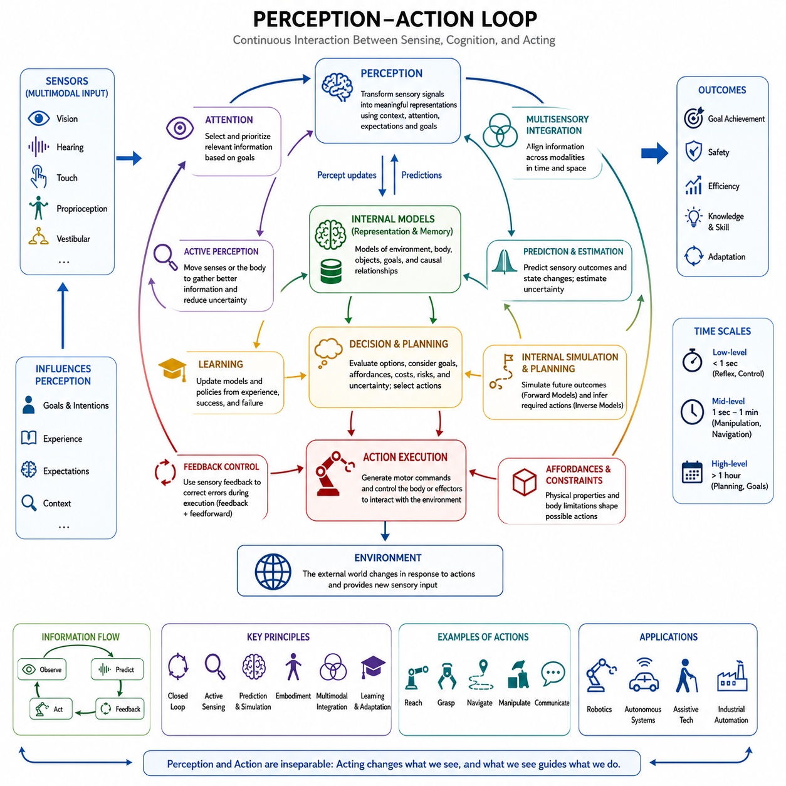{width="7.268055555555556in" height="7.268055555555556in"}

Perception and action are deeply interconnected components of cognition rather than independent stages arranged in a simple linear pipeline. Perception extracts meaningful structure from sensory information, while action changes the environment and determines what information becomes available next. Cognitive systems therefore operate through a continuous perception--action loop in which sensing, interpretation, decision, movement, and feedback repeatedly influence one another.

Perception begins with sensory signals generated by interactions between an organism and its environment. Vision, hearing, touch, proprioception, balance, and other modalities provide different forms of information about objects, events, spatial relationships, and the state of the body. These signals are incomplete and noisy, so cognition must transform them into structured representations that can guide behavior.

Human perception is constructive rather than purely receptive. The brain does not simply reproduce sensory input exactly as it arrives. Instead, perceptual processing combines incoming evidence with previous experience, expectations, context, attention, and task goals. This combination allows a person to recognize meaningful objects and situations even when sensory information is ambiguous, partially occluded, distorted, or rapidly changing.

Visual perception illustrates this principle clearly. Light patterns reaching the eyes must be transformed into representations of edges, surfaces, depth, motion, objects, and spatial relationships. The same retinal image may support several possible interpretations, so perceptual systems use contextual information and learned regularities to infer the most plausible structure of the environment rather than treating perception as direct measurement.

Auditory perception presents a similar challenge. Sound waves contain overlapping signals generated by speech, machines, music, environmental events, and background noise. Cognitive processing separates these sources, identifies relevant patterns, estimates their location, and links them with prior knowledge. Attention further determines which sounds become behaviorally important and which can be ignored during a particular task.

Touch and proprioception provide complementary information about physical interaction and body state. Tactile signals indicate contact, pressure, texture, temperature, and local forces, while proprioception provides information about joint configuration, movement, and body position. These modalities are particularly important for actions requiring precise manipulation because visual information alone may not reveal whether an object has been grasped securely.

Perception is therefore naturally multimodal. Different sensory channels provide partially overlapping but complementary evidence about the same environment. Humans combine vision, hearing, touch, proprioception, and vestibular signals to form more reliable estimates of objects, locations, events, and body state. When one modality becomes unreliable, other modalities can compensate, increasing robustness under uncertain conditions.

Multisensory integration requires information to be aligned across both time and space. A sound must be associated with the object that produced it, tactile feedback must be linked with the body part or tool generating contact, and visual movement must be related to proprioceptive estimates of self-motion. Accurate cognitive representation depends on solving these correspondence problems continuously.

Attention plays an important role in organizing perception for action. An environment may contain far more information than can be processed with equal precision, so cognitive systems selectively allocate processing resources. Task goals influence which objects, locations, sensory modalities, or features receive priority, allowing perception to become specialized for the action currently being prepared or executed.

This relationship means that perception depends partly on intention. A person searching for a door handle, avoiding an obstacle, reading text, or preparing to grasp a cup may observe the same scene differently because each task requires different information. Perception is consequently shaped not only by what exists in the environment but also by what the cognitive system is trying to accomplish.

Action begins with the selection of a behavior that can transform the current situation toward a desired state. Actions can include eye movements, reaching, grasping, walking, speaking, navigation, tool use, or complex sequences involving many coordinated movements. Cognitive control must translate abstract goals into executable commands while considering the body, environment, constraints, risks, and expected consequences.

Motor control operates hierarchically across multiple levels. High-level processes may specify goals such as reaching a location or obtaining an object, intermediate processes determine suitable movement strategies, and lower-level mechanisms regulate muscle activity, posture, force, timing, and trajectory. Feedback continuously corrects deviations between intended and actual movement during execution.

Actions are constrained by affordances, which describe opportunities for behavior that arise from relationships among the agent, objects, and environment. A surface may support walking, a handle may support pulling, a container may support placing objects inside, and a gap may or may not permit passage depending on body size. Perception for action therefore often involves detecting what can be done rather than merely identifying what something is.

Affordances demonstrate why object recognition alone is insufficient for intelligent behavior. Knowing that an object is a cup provides semantic information, but successful interaction requires knowledge about where it can be grasped, whether it is full, how heavy it may be, which orientations are stable, and what movements are safe. Cognitive systems connect semantic understanding with action possibilities and physical constraints.

The perception--action loop becomes especially clear during manipulation. When reaching toward an object, visual perception estimates its location and orientation, motor commands move the arm, proprioception reports limb position, and tactile feedback indicates contact. These observations continually update the movement, allowing the hand to correct its trajectory and adjust grip force until the intended interaction is completed.

Movement itself can also improve perception. Humans turn their heads to localize sounds, move their eyes to inspect visual details, touch surfaces to estimate texture, and reposition objects to reveal hidden structure. Such exploratory actions demonstrate active perception, in which an intelligent agent deliberately acts to obtain better information rather than passively waiting for sensory evidence.

Active perception transforms sensing into a goal-directed process. When uncertainty is high, a cognitive system can choose actions specifically because they reduce uncertainty. Moving closer to an object, changing viewpoint, asking a question, touching an unfamiliar surface, or examining another region of a scene can provide information required for later decisions. Perception thus becomes integrated with information-seeking behavior.

Predictions play an important role throughout this loop. Before executing an action, the cognitive system can estimate its likely sensory and environmental consequences. These predictions provide a reference against which actual observations can be compared. Differences between predicted and observed outcomes indicate that either the environmental model, action plan, or execution process may need to be updated.

Such prediction supports rapid feedback control. If the expected position of a moving object differs from its observed position, movement can be corrected. If an expected tactile signal does not occur during grasping, grip configuration can be adjusted. Perception and action therefore interact not only through complete task cycles but also through continuous prediction and correction at very short time scales.

Internal models make this predictive interaction possible. A cognitive system maintains representations of the environment, body, objects, goals, and causal relationships. These representations allow it to estimate how actions might change future states before physically executing them. Internal simulation therefore provides a bridge between perception, planning, and action and supports goal-directed behavior under uncertainty.

Forward models estimate the sensory or state consequences likely to result from a particular action. Given the current state and a candidate motor command, a forward model predicts what should happen next. Such models allow an agent to anticipate motion, detect unexpected disturbances, and compare intended outcomes with actual feedback during execution.

Inverse models address the complementary problem. Instead of predicting consequences from actions, they estimate which actions are required to achieve a desired state. For example, if an agent wishes to move its hand to a particular location, an inverse model helps determine the motor commands necessary to produce that movement. Effective behavior often requires interaction between forward and inverse computations.

The distinction between feedforward and feedback control is also important. Feedforward control relies on predictions made before an action is completed, enabling rapid responses without waiting for sensory correction. Feedback control uses observations during execution to reduce error. Skilled action generally combines both approaches, using prediction for speed and feedback for robustness.

Learning improves the perception--action relationship through experience. Repeated interaction teaches which sensory patterns correspond to relevant environmental structures, which actions are possible, and which consequences are likely to follow specific behaviors. As experience accumulates, frequently performed actions become more accurate, efficient, and automatic while perception becomes increasingly tuned to task-relevant information.

Sensorimotor learning is particularly important because it connects perception directly with movement consequences. An agent learns not only what objects look like but also how visual changes correspond to self-motion, how tactile patterns correspond to contact conditions, and how motor commands alter body configuration. These learned regularities support calibration, coordination, prediction, and adaptation.

Development provides strong evidence for the importance of sensorimotor interaction. Human perceptual and motor abilities develop together as infants explore their bodies and environments. Reaching, looking, crawling, manipulating objects, and interacting socially generate structured experience from which increasingly sophisticated internal representations emerge. Cognition develops partly through active engagement rather than passive observation alone.

Embodied cognition extends this insight by proposing that cognitive processes depend on the physical characteristics of the body and its interaction with the environment. Body geometry, sensory placement, movement range, strength, and physical constraints influence which actions are possible and which information can be acquired. Intelligence is therefore partly shaped by the embodiment through which perception and action occur.

The environment itself can become part of cognitive processing. Instead of representing every detail internally, humans frequently use external structure to reduce cognitive load. People reposition objects, write notes, arrange tools, look back at information, or use spatial layouts to support memory and reasoning. Action can therefore modify the environment in ways that make subsequent cognition easier.

Perception and action also operate across several temporal scales. Low-level sensorimotor corrections occur within fractions of a second, while activities such as navigation and manipulation unfold across seconds or minutes. Higher-level goals and plans may extend across hours or longer. Cognitive systems must coordinate these scales so that immediate actions remain aligned with broader objectives.

Hierarchical organization helps solve this coordination problem. High-level cognition represents goals and abstract actions, while lower levels manage detailed movement and sensory feedback. A single intention such as preparing a meal may be decomposed into navigation, object search, reaching, grasping, transport, placement, and manipulation, each containing further sensorimotor control processes.

Action selection must also consider uncertainty and risk. Perceptual estimates are rarely perfectly reliable, and actions can have irreversible or dangerous consequences. Cognitive systems therefore balance potential benefits against uncertainty, effort, physical limitations, and safety. When confidence is insufficient, an agent may seek additional information, choose a safer action, or delay commitment.

Failures provide valuable information within the perception--action loop. An unsuccessful grasp, unexpected obstacle, incorrect prediction, or unstable movement generates evidence that existing representations or policies are incomplete. Adaptive cognition uses these discrepancies to modify future perception, planning, and action, turning errors into opportunities for learning rather than treating them only as negative outcomes.

Social interaction creates another form of perception--action coupling. People perceive the expressions, gestures, speech, gaze, and movements of others while simultaneously producing actions that influence subsequent social responses. Communication is therefore inherently interactive, with perception and behavior repeatedly updating predictions about intentions, goals, emotional states, and shared tasks.

Language can also participate directly in action control. Verbal instructions establish goals, constrain behavior, describe objects, or specify action sequences. Spoken feedback can correct ongoing behavior, while internally represented language can support planning and self-regulation. This creates a connection among language, perception, reasoning, and physical action within integrated cognition.

For artificial intelligence, the perception--action relationship is fundamental to autonomous agents. An AI system operating only on static data can perform recognition or prediction without affecting its inputs, but an embodied agent changes the world through its decisions. Each action creates new observations, making the future input distribution partly dependent on the agent\'s own previous behavior.

This closed-loop property changes the engineering problem significantly. Errors in perception can produce incorrect actions, incorrect actions can move the system into unfamiliar states, and those states can produce additional perceptual errors. Robust autonomous systems therefore require continuous state estimation, uncertainty management, feedback, recovery behavior, and mechanisms for detecting when the perception--action loop is becoming unstable.

Robotics provides a direct computational realization of these ideas. Cameras, LiDAR, microphones, tactile sensors, force sensors, encoders, IMUs, and other devices provide multimodal observations. Perception algorithms transform these signals into representations of objects, geometry, motion, localization, affordances, and uncertainty, which planning and control systems then use to select and execute physical actions.

Modern Physical AI increasingly integrates these components with learned representations and foundation models. Perception foundation models can provide semantic and multimodal understanding, while action models or policies translate contextual representations into behavior. Memory, reasoning, planning, and world models can connect these layers, allowing the system to operate over longer horizons than conventional reactive control.

World models are especially relevant because they allow an agent to predict how the environment may evolve under different candidate actions. Instead of selecting behavior only from the current observation, the system can generate or estimate possible future states, compare predicted outcomes, and choose actions that best support its objectives. This resembles the role of internal simulation in cognitive accounts of planning.

However, intelligent perception--action systems must preserve a connection between abstract reasoning and physical feasibility. A high-level model may propose semantically reasonable actions that cannot be executed because of geometry, force limits, collision risk, timing, or hardware constraints. Effective embodied cognition therefore requires continual interaction between abstract knowledge and grounded sensorimotor information.

This grounding problem is one of the central challenges in both cognitive science and AI. Symbols and language must ultimately connect with objects, properties, relationships, actions, and consequences in the environment. Perception supplies this connection from the world to internal representations, while action provides the complementary path from internal goals and decisions back into the world.

The perception--action cycle can therefore be understood as a fundamental computational structure underlying adaptive intelligence. Observation updates internal state, internal state supports prediction and decision, decisions generate actions, actions change both the environment and the agent, and resulting sensory evidence begins the cycle again. Learning modifies every stage as repeated interaction produces increasingly useful representations and policies.

From a cognitive science perspective, this closed loop explains why perception cannot be fully understood without considering behavior, goals, memory, prediction, and embodiment. From an AI perspective, it suggests that increasingly capable autonomous systems should not treat perception, reasoning, and control as isolated modules. Their effectiveness depends on how accurately and efficiently information circulates through the entire loop.

Ultimately, intelligent behavior emerges from coordinated interaction between sensing and doing. Perception provides an actionable interpretation of the current world, while action tests predictions, achieves goals, and creates new evidence. Their continuous coupling enables adaptation, exploration, learning, planning, and purposeful interaction, making the perception--action loop one of the foundational mechanisms linking cognitive science, robotics, embodied AI, and general intelligent systems.

## 01.02 Attention and Awareness [w/Code]

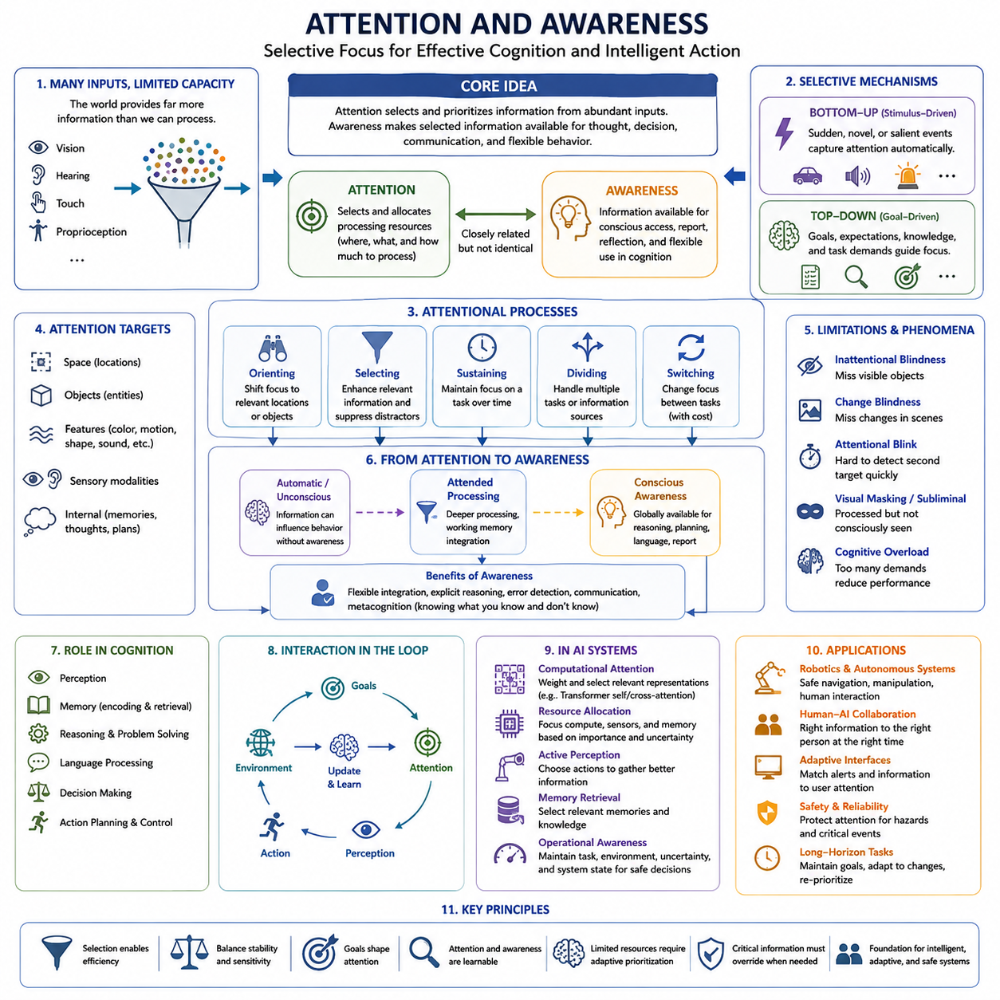{width="7.268055555555556in" height="7.268055555555556in"}

Attention is the cognitive process that selects and prioritizes information for deeper processing when sensory input, memory, and possible actions exceed available resources. At any moment, the environment contains far more information than a person can analyze equally. Attention therefore determines which signals, objects, thoughts, memories, or goals receive processing priority and which remain in the background.

Awareness refers to the information, experiences, or mental states that become available to a person in a form that can influence deliberate judgment, report, reflection, or flexible behavior. Attention and awareness are closely related, but they are not identical. Some information can influence behavior without entering explicit awareness, while some consciously experienced information may receive only weak or temporary attentional priority.

The distinction between attention and awareness is important because cognitive processing occurs at several levels. Sensory systems continuously process large amounts of information without requiring conscious access to every detail. Attention can amplify selected signals and increase their probability of entering awareness, but selection itself can occur before a person consciously recognizes what has been selected.

Selective attention allows the cognitive system to focus on relevant information while reducing interference from competing stimuli. A driver may concentrate on pedestrians and traffic signals while ignoring advertisements, building details, and background conversations. The ignored information still reaches sensory systems, but it receives less processing because current goals establish which information is behaviorally important.

Attention can be directed toward locations, objects, features, sensory modalities, memories, or internal thoughts. Spatial attention prioritizes particular regions of space, object-based attention selects specific entities, and feature-based attention emphasizes properties such as color, motion, orientation, or sound frequency. Cognitive attention can also be directed internally toward memories, plans, imagined events, or reasoning processes.

Bottom-up attention is driven primarily by the characteristics of incoming stimuli. Sudden motion, an unexpected sound, a flashing light, or a novel event can automatically capture processing resources even when it is unrelated to the current task. Such mechanisms are useful because potentially important changes in the environment sometimes require immediate processing before deliberate reasoning can occur.

Top-down attention is guided by goals, expectations, knowledge, and current task requirements. A person looking for a red vehicle will preferentially process visual information matching the expected characteristics of the target. Top-down control therefore shapes perception according to what the cognitive system is trying to achieve rather than relying only on the physical salience of incoming signals.

Effective cognition requires continuous interaction between bottom-up and top-down attention. A system that follows only internal goals could fail to notice unexpected dangers, while a system driven entirely by salient stimuli would be constantly distracted. Intelligent attention therefore balances goal-directed stability with sensitivity to novel or important environmental events.

Sustained attention describes the ability to maintain processing resources on a task over an extended period. Monitoring a display, driving for a long distance, reading technical material, or supervising an automated system requires sustained attention. Performance can gradually decline when tasks are repetitive or cognitively demanding, illustrating that attentional control is constrained by fatigue, motivation, workload, and time.

Divided attention becomes necessary when multiple tasks or information sources must be handled simultaneously. Humans can sometimes distribute resources among concurrent activities, but performance typically deteriorates when tasks compete for similar cognitive mechanisms. Apparent multitasking often consists of rapid switching between tasks rather than truly parallel processing of several complex activities.

Task switching introduces additional cognitive costs. When attention moves from one goal to another, the cognitive system must reconfigure priorities, retrieve different rules, activate relevant representations, and suppress the previous task set. Frequent switching can therefore reduce efficiency and increase errors even when each individual task is relatively simple.

Attention is strongly connected with working memory. Information receiving attentional priority is more likely to be maintained in a temporarily accessible form, while working memory contents can guide attention toward relevant information in the environment. These two mechanisms form a recurrent relationship in which attention determines what enters active processing and working memory helps determine what should be selected next.

Long-term memory also shapes attention through experience. Familiar patterns can be recognized rapidly because previous learning establishes expectations about what matters and where relevant information is likely to appear. Expertise often changes attentional behavior, allowing experienced individuals to notice meaningful structures that novices overlook even when both receive the same sensory information.

Attention can therefore be viewed as a resource-allocation mechanism operating across cognition. It influences perception, memory encoding, retrieval, reasoning, language processing, decision making, and motor preparation. Rather than functioning as an isolated module, attention continuously regulates which representations receive computational resources and which cognitive operations dominate at a particular moment.

The concept of limited attentional capacity explains many characteristic human errors. When processing demand becomes too high, relevant information can be missed even when it is physically visible. Inattentional blindness demonstrates that people may fail to notice an unexpected object when attention is strongly engaged elsewhere, showing that visual availability does not guarantee cognitive awareness.

Change blindness provides another example of attentional limitation. Significant modifications to a scene may go unnoticed when they occur during interruptions, eye movements, or other visual disturbances. These findings suggest that people do not maintain a complete, continuously detailed representation of the visual environment but instead construct task-relevant representations according to attentional demands.

The attentional blink reveals limitations in processing events that occur rapidly over time. When two meaningful targets appear within a short temporal interval, detecting the first can temporarily reduce the probability of consciously identifying the second. This phenomenon suggests that some stages of attentional processing and conscious access have limited temporal capacity.

Awareness adds another level to these questions because not all processed information becomes consciously accessible. Visual masking, subliminal presentation, priming, and other experimental paradigms demonstrate that stimuli can sometimes influence decisions or responses even when participants cannot explicitly report seeing them. Cognitive processing therefore extends beyond the boundaries of conscious experience.

Conscious awareness nevertheless provides important functional advantages. Information that becomes consciously available can often be integrated more flexibly with memory, goals, reasoning, language, and action planning. Awareness can support deliberate comparison among alternatives, explicit error detection, communication of internal states, and adaptation to situations that cannot be handled through familiar automatic responses.

Automatic processing contrasts with controlled processing in this respect. Well-practiced activities can often be performed with little conscious attention because repeated experience has created efficient routines. Reading common words, walking in familiar environments, or executing practiced motor actions may require less deliberate control than unfamiliar tasks requiring active monitoring and flexible reasoning.

Automaticity improves efficiency but can also create errors when environmental conditions change. A familiar response may continue even when it is no longer appropriate. Controlled attention allows the cognitive system to interrupt habitual behavior, reconsider assumptions, and apply a different strategy. Flexible intelligence therefore requires both efficient automatic processes and mechanisms capable of overriding them when necessary.

Awareness is also closely related to confidence and metacognition. A person may not only perceive or remember information but also estimate how reliable that representation is. Such judgments help determine whether additional evidence should be gathered, whether a decision should be delayed, or whether external assistance is required. Awareness can therefore include information about the quality of one\'s own cognitive states.

Several theories attempt to explain how selected information becomes consciously accessible. Global workspace approaches propose that many specialized processes operate partly independently, while selected information can become globally available to multiple cognitive systems. Once information enters this shared workspace, it can influence memory, reasoning, planning, language, and action in a coordinated manner.

According to this perspective, consciousness does not require every internal computation to become globally available. Most perceptual, motor, and memory operations can remain local and specialized. Global access is particularly useful when information must coordinate several systems, resolve conflict, support novel behavior, or remain available for explicit reasoning and communication.

Other approaches emphasize recurrent processing between higher and lower levels of perceptual systems. Initial feedforward processing may rapidly extract information from sensory input, while recurrent interactions refine interpretations through context and feedback. Some theories associate such recurrent integration with perceptual awareness, although the precise relationship between neural processing and subjective experience remains scientifically debated.

Predictive processing offers another useful perspective on attention and awareness. Cognitive systems continuously generate expectations about incoming information and compare those expectations with observed signals. Attention can influence which prediction errors receive greater weight, allowing unexpected or task-relevant discrepancies to update internal models more strongly than signals considered unreliable or irrelevant.

From this viewpoint, attention is not simply a spotlight directed toward an external object. It also regulates the precision assigned to competing sources of information. A highly reliable sensory signal may receive increased weight, while uncertain or noisy evidence receives less. Such mechanisms connect attention with Bayesian inference, uncertainty estimation, and adaptive information integration.

Emotion and motivation strongly influence attentional allocation. Threatening, rewarding, socially relevant, or personally significant stimuli can receive priority even when they are unrelated to an explicit task. This interaction demonstrates that attention reflects not only sensory characteristics and cognitive goals but also estimates of biological, emotional, or motivational importance.

Attention is also linked with action preparation. Objects relevant to an intended action often receive enhanced processing, and planning a movement can change which spatial regions or object features become important. A robot or human preparing to grasp an object, for example, requires information about position, orientation, shape, and affordance rather than equal analysis of every visible property.

This connection supports the idea that attention participates directly in the perception-action loop. Current goals guide attention, attention shapes perception, perception updates internal state, and selected information supports action planning. Actions then change both the environment and the available sensory input, requiring attention to be continuously redistributed as the task evolves.

Social attention introduces additional complexity. Humans are highly sensitive to faces, gaze direction, gestures, speech, emotional expressions, and the actions of other people. Following another person\'s gaze can redirect attention toward relevant objects, while joint attention allows multiple individuals to focus on the same entity and establish a shared reference for communication and collaboration.

Joint attention plays an important role in language learning, teaching, cooperation, and social understanding. Recognizing what another person is attending to provides evidence about goals and intentions. For intelligent AI systems interacting with people, corresponding mechanisms could help determine which object a user refers to, what event requires immediate response, or when human intervention should receive priority.

Attention has become an important concept in artificial intelligence, although computational attention mechanisms should not be assumed to reproduce human attention directly. In neural networks, attention commonly refers to mechanisms that assign different weights to representations, allowing a model to emphasize information judged relevant to the current computation.

Transformer architectures provide a prominent example through self-attention. Each token representation can evaluate relationships with other tokens and construct a new representation weighted by those relationships. This mechanism allows models to capture long-range dependencies and dynamically determine which parts of an input are most relevant, but it remains a mathematical operation rather than a complete model of biological attention.

Cross-attention extends the same principle across different information sources. A language representation may attend to visual features, a robot instruction may attend to detected objects, or a planning representation may attend to relevant memory. Such mechanisms are especially important in multimodal AI because they provide a flexible method for relating information across language, vision, audio, action, and other modalities.

AI attention can also operate through explicit computational selection. An autonomous system may allocate high-resolution perception to a particular region, activate expensive models only when uncertainty increases, or process selected sensors at higher frequency. Attention then becomes an architectural mechanism for managing limited compute, energy, bandwidth, latency, and memory resources.

This resource-management perspective is particularly relevant for edge AI and robotics. A physical robot cannot always run every model at maximum resolution and frequency simultaneously. It may need to prioritize obstacle detection during navigation, manipulation features during grasping, human monitoring during collaboration, or localization signals when position uncertainty increases.

Active perception further links attention with information gathering. An intelligent agent can move a camera, reposition its body, select another sensor, change viewpoint, or approach an uncertain object to obtain better evidence. Attention can therefore determine not only which existing information should be processed but also which future observations should be deliberately acquired.

For AI agents using external tools, attention can be interpreted more broadly as deciding which information source should receive computational focus. An agent may choose whether to inspect a document, retrieve a memory, query a database, call a perception model, perform a calculation, or request human input. This extends attentional control from internal representation weighting to system-level resource orchestration.

Memory systems create another challenge because modern AI agents may have access to enormous quantities of stored information. Efficient cognition requires selecting a small subset that is relevant to the current situation. Retrieval mechanisms, relevance scoring, context management, and working-memory selection can therefore be understood as computational analogues of attentional prioritization.

Awareness is more difficult to translate into AI terminology. Current AI systems can maintain internal representations, report confidence, monitor some of their outputs, and expose selected state information, but these capabilities should not automatically be equated with human conscious experience. Functional monitoring and self-report can be studied computationally without assuming subjective awareness.

A useful engineering interpretation is operational awareness. An autonomous system may maintain explicit representations of its current task, environment, uncertainty, resource state, failures, safety constraints, and interactions with humans. Making this information globally available across planning, control, memory, and communication modules can improve coordinated behavior without making claims about machine consciousness.

Situation awareness provides a practical example. A robot operating around people should maintain an integrated representation of nearby objects, human positions, motion, task status, hazards, available actions, and expected future events. Attention determines which parts of this representation require immediate processing, while system-level awareness supports coordinated decisions across multiple functional components.

Self-awareness can similarly be interpreted carefully in engineering systems as access to representations of one\'s own state. An AI agent may monitor battery level, computational load, sensor health, localization confidence, task progress, model uncertainty, or available capabilities. Such self-monitoring supports more reliable decisions because the agent can modify behavior when its own operating conditions deteriorate.

Attention is therefore closely related to safety. A system that focuses excessively on task completion while neglecting unexpected hazards can behave dangerously. Safety-critical architectures may require protected attentional priorities in which collision risk, human proximity, system faults, or emergency signals can interrupt lower-priority activities regardless of the agent\'s current goal.

Human-AI interaction also requires managing human attention. Interfaces that generate excessive alerts can produce alarm fatigue, causing important information to be ignored. Conversely, an AI system that fails to communicate critical uncertainty may leave a human operator unaware of developing risk. Effective systems must therefore consider both machine attention and the limited attentional capacity of human collaborators.

Adaptive interfaces can support this goal by presenting information according to urgency, context, workload, and user state. Routine information may remain in the background while anomalies are emphasized. However, excessive automation of attentional control can also hide important context, so interface design must balance filtering with transparency and preserve opportunities for human oversight.

Attention and awareness are particularly important for long-horizon autonomous agents. As tasks extend over minutes, hours, or days, the agent must maintain persistent goals while responding appropriately to interruptions and changing circumstances. It must know which information remains relevant, which subtask is currently active, what changed while attention was elsewhere, and when priorities should be reorganized.

Hierarchical attention can help manage such complexity. High-level processes may allocate resources among goals or tasks, intermediate processes select objects or information sources, and low-level mechanisms prioritize features or sensory signals. Hierarchical organization allows an intelligent system to combine long-term goal stability with rapid local responses to unexpected events.

Learning can improve attention by discovering which signals are useful for predicting outcomes. Repeated experience teaches an agent where relevant information tends to occur, which cues indicate danger, and which observations reduce uncertainty. Attention consequently becomes increasingly specialized as the system learns relationships among context, goals, observations, actions, and outcomes.

Poorly learned attention can create systematic failure. If a model repeatedly relies on superficial correlations, it may focus on irrelevant features while ignoring causal information. In robotics, attending to visual appearance without considering geometry could produce unsafe actions. In language systems, emphasizing misleading contextual patterns can result in confident but incorrect reasoning.

Evaluating attention therefore requires more than visualizing attention weights. A model may assign high computational weight to a representation without that representation being causally responsible for the final output. Reliable evaluation should test how behavior changes when information is removed, altered, delayed, or made uncertain, revealing whether the system actually depends on the features it appears to prioritize.

The relationship between attention and awareness ultimately illustrates a broader principle of cognitive science: intelligent systems must selectively organize information rather than process everything equally. Selection provides efficiency, while broader availability allows selected information to coordinate perception, memory, reasoning, planning, and action. Together these mechanisms help transform limited resources into flexible behavior.

For future AI and embodied intelligence, the important lesson is not simply to imitate human attention but to design systems capable of adaptive prioritization. Such systems should allocate computation according to goals, uncertainty, novelty, risk, expected information value, and environmental change while preserving mechanisms that allow critical information to override normal processing.

Attention provides focus, while awareness provides broader access to information needed for coordinated cognition. Their interaction enables an intelligent system to concentrate resources without losing the capacity to reconsider priorities, detect unexpected events, integrate information across functional modules, and adapt behavior. These capabilities form an essential bridge between human cognition, cognitive architectures, autonomous agents, and more general forms of artificial intelligence.

## 01.03 Learning and Adaptation [w/Code]

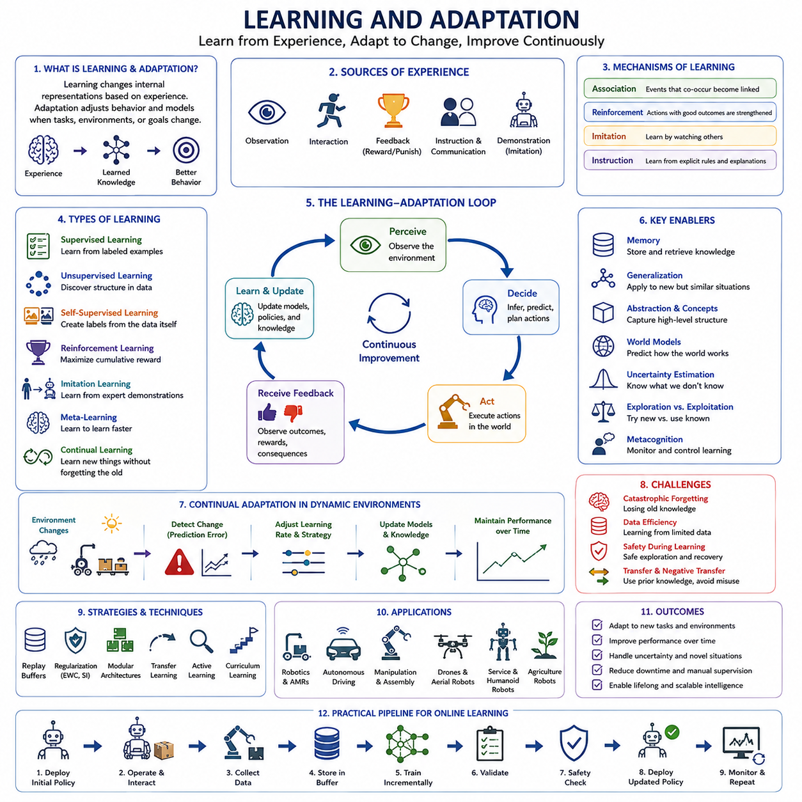{width="7.268055555555556in" height="7.268055555555556in"}

Learning is the process through which a cognitive system changes its internal representations, expectations, skills, or behavior as a consequence of experience. Adaptation refers more specifically to adjusting those learned mechanisms when tasks, environments, goals, or operating conditions change. Together, learning and adaptation allow intelligence to improve over time rather than relying only on fixed responses.

A cognitive system encounters regularities in sensory input, actions, outcomes, and social interaction. Learning extracts useful structure from these experiences and incorporates it into memory, predictive models, concepts, policies, or procedures. The resulting knowledge can influence future perception, attention, reasoning, decision making, and action, creating a continuous relationship between experience and behavior.

Learning can occur through several mechanisms. Association connects events that repeatedly occur together, reinforcement strengthens actions associated with useful outcomes, observation allows knowledge to be acquired from others, and instruction provides explicit information about rules or goals. Cognitive learning also includes abstraction, analogy, concept formation, causal inference, and the reorganization of existing knowledge.

Classical conditioning demonstrates associative learning by showing how a previously neutral stimulus can acquire predictive meaning after repeated pairing with another event. The important principle is not simply behavioral response formation but the ability to learn relationships among events. Such learned predictions allow an organism to anticipate future conditions and prepare appropriate actions before important events occur.

Operant learning emphasizes the consequences of behavior. Actions followed by desirable outcomes tend to become more likely under similar circumstances, while actions associated with undesirable outcomes may become less likely. This mechanism connects behavior with environmental feedback and provides a conceptual foundation for reinforcement learning, where an agent improves a policy according to reward signals generated through interaction.

Reinforcement learning involves more than immediate reward. Intelligent agents often need to estimate how current actions influence outcomes that occur much later. Learning therefore requires assigning credit across time, balancing short-term and long-term consequences, and estimating the expected value of states or actions. These problems are central both to cognitive theories of decision making and computational reinforcement learning.

Exploration is necessary because an agent cannot learn the value of unfamiliar actions without occasionally trying them. Exploitation, in contrast, uses actions already believed to produce good outcomes. Effective adaptation requires balancing exploration and exploitation so that an agent continues gathering useful information without sacrificing excessive performance or safety in situations where reliable knowledge already exists.

Observational learning allows knowledge to be acquired without directly experiencing every possible action and consequence. Humans can learn by watching other people perform tasks, observing successful and unsuccessful strategies, and interpreting the intentions behind demonstrated behavior. This greatly increases learning efficiency because information accumulated by one individual can be transferred socially to others.

Imitation learning provides a computational analogue of this process. Instead of discovering an entire behavior policy through trial and error, an artificial agent can learn from demonstrations provided by humans, experts, or other agents. Demonstrations can supply useful trajectories through complex state spaces, although successful imitation still requires handling situations that were not represented sufficiently in the observed examples.

Instruction further accelerates learning by transmitting structured knowledge directly. Humans can use language to communicate procedures, constraints, concepts, goals, warnings, and explanations that might otherwise require extensive experimentation. The combination of instruction and experience allows cognitive systems to exploit both symbolic knowledge and sensorimotor evidence when adapting to unfamiliar situations.

Learning is closely connected with memory because changes produced by experience must persist long enough to influence future behavior. Working memory temporarily maintains information required during an ongoing learning episode, while long-term memory preserves knowledge across extended periods. Episodic memory records particular experiences, semantic memory captures generalized knowledge, and procedural memory stores learned skills and behavioral routines.

Memory consolidation describes processes through which initially fragile information becomes more stable over time. New experiences may first depend heavily on recently formed representations before becoming integrated with existing knowledge. Consolidation is important because learning should not merely record isolated events; it must organize them into structures that remain useful across future situations.

Generalization allows learning acquired from particular examples to influence behavior in related but previously unseen situations. Without generalization, an intelligent system would need to relearn every variation of every task independently. Effective cognition identifies relevant similarities while ignoring irrelevant differences, allowing knowledge to transfer across objects, environments, viewpoints, people, and task configurations.

Discrimination complements generalization by recognizing when apparently similar situations require different responses. An overly general learner may treat distinct conditions as equivalent, while an overly specific learner may fail to transfer useful knowledge. Intelligent adaptation therefore requires finding representations that preserve distinctions important for behavior while remaining invariant to variations that do not matter.

Concept formation supports this balance by organizing individual experiences into categories and relational structures. A learner can recognize that several visually different objects belong to the same functional class or that different tasks share a common underlying structure. Concepts reduce complexity because rules and predictions can be associated with categories rather than separately memorized for every individual observation.

Abstraction extends learning beyond surface similarity. Instead of memorizing specific sensory patterns, a cognitive system can extract higher-level relationships such as containment, support, causation, sequence, ownership, or goal dependency. Abstract knowledge can transfer across domains because the same relational pattern may occur in environments that look very different at the sensory level.

Transfer learning describes the reuse of previously acquired knowledge when solving a new problem. Knowledge of one language may facilitate learning another, experience with one tool may help in understanding a similar tool, and a robot trained in one environment may reuse navigation representations in another. Transfer improves efficiency when previous knowledge captures structure that remains relevant under new conditions.

Negative transfer occurs when previously learned knowledge is applied where it is no longer appropriate. Familiar strategies can become misleading when environmental dynamics, rules, object properties, or goals change. Adaptation therefore requires mechanisms for detecting mismatches between expectations and observations and reducing reliance on outdated knowledge when necessary.

Prediction error provides one important learning signal. A cognitive system can compare what it expected to happen with what actually occurred. Small errors confirm that existing models remain useful, while systematic errors indicate that some representation or prediction must change. Learning can therefore be understood partly as the continual reduction or interpretation of discrepancies between prediction and experience.

Not all prediction errors should produce equal changes. Sensory observations can be noisy, unusual events may be accidental, and some outcomes may be poorly measured. Adaptive learning must estimate uncertainty and reliability so that strong updates occur when evidence is informative while unstable fluctuations are ignored. This protects learned knowledge from being continually disrupted by random variation.

Bayesian perspectives describe learning as updating beliefs when new evidence arrives. Existing beliefs provide prior expectations, observations contribute likelihood information, and the resulting posterior beliefs combine previous knowledge with current evidence. Although human cognition does not necessarily perform exact Bayesian computation, this framework provides a useful model of adaptive inference under uncertainty.

Learning rate determines how quickly new evidence changes existing knowledge. A high learning rate enables rapid adaptation but can make representations unstable, while a low learning rate preserves previous knowledge but may respond too slowly to real changes. Intelligent systems therefore benefit from adjusting learning rates according to uncertainty, environmental volatility, confidence, and the consequences of error.

Adaptation becomes particularly important in nonstationary environments. If relationships among observations, actions, and outcomes remain constant, knowledge learned previously can remain useful for a long time. In real environments, however, objects move, users change behavior, sensors degrade, goals change, and new situations appear. Cognition must detect these changes and revise its models without rebuilding everything from the beginning.

Continual learning addresses the challenge of acquiring new knowledge throughout the lifetime of a system. Traditional machine learning often separates training from deployment, but biological intelligence continues learning during operation. Continual learning seeks similar capability by allowing models to incorporate new tasks, environments, classes, or experiences while preserving useful knowledge acquired previously.

A major problem in continual learning is catastrophic forgetting. When a neural system is optimized strongly for new data, parameter changes may overwrite representations supporting earlier capabilities. The system can improve on the new task while unexpectedly degrading on old ones. Stable adaptation therefore requires mechanisms that balance plasticity for new learning with stability for previously acquired knowledge.

Replay is one approach for reducing forgetting. Previously encountered examples or representative experiences are stored and revisited during later learning so that new optimization remains constrained by older knowledge. Biological theories of memory consolidation also motivate replay-like mechanisms, particularly the idea that past experiences can be reactivated to strengthen and reorganize long-term representations.

Regularization provides another strategy by restricting changes to parameters considered important for previously learned tasks. Instead of treating every model parameter as equally replaceable, the learner preserves components strongly associated with existing capabilities while allowing other components to adapt more freely. This creates a computational balance between stability and plasticity.

Modular architectures can support continual adaptation by separating reusable capabilities into components. New tasks may activate, combine, or extend existing modules instead of modifying one monolithic representation. Modularity can reduce interference and improve transfer because skills learned in one context may later become building blocks for more complex behavior.

Meta-learning approaches the problem from a different direction by learning how to learn. Instead of optimizing only for performance on individual tasks, a meta-learning system develops representations, initialization parameters, update rules, or strategies that make later adaptation faster. Experience across many tasks can therefore improve the system\'s ability to learn future tasks with relatively little new data.

Few-shot adaptation is particularly important for general intelligence because real systems cannot always collect thousands of labeled examples whenever conditions change. A cognitive learner should ideally use strong prior knowledge and adapt from a small number of demonstrations, observations, corrections, or interactions. This resembles human learning, where existing concepts greatly accelerate acquisition of related skills.

Zero-shot generalization pushes this idea further by applying existing knowledge to situations for which no direct training examples were provided. Language, conceptual representations, compositional reasoning, and foundation models can support such behavior by connecting unfamiliar tasks with known structures. Zero-shot ability is useful, although practical systems must still recognize when their extrapolation is unreliable.

Self-supervised learning provides another route toward efficient adaptation. Instead of depending entirely on manually labeled examples, the system creates learning signals from relationships already present in its observations. Predicting missing information, future states, transformations, correspondences, or relationships can produce useful representations from large amounts of naturally occurring experience.

For embodied agents, temporal prediction provides especially valuable self-supervision. A robot can observe how scenes change after movement, how objects respond to contact, and how sensor measurements evolve through time. Predicting these changes teaches representations of dynamics and causality that can later support navigation, manipulation, planning, anomaly detection, and world modeling.

World models extend learning from direct stimulus-response mappings toward internal models of how environments evolve. An agent learns relationships among states, objects, actions, and future outcomes. By simulating possible consequences internally, the system can evaluate actions before execution, learn from imagined trajectories, and adapt behavior without physically testing every possibility.

Model-based learning can therefore improve data efficiency, but incorrect internal models introduce another risk. Planning performed with an inaccurate world model may generate actions that appear effective in simulation but fail in reality. Adaptation must consequently include mechanisms for continuously comparing predicted and observed outcomes and correcting model errors as real experience accumulates.

Active learning allows an intelligent system to influence which examples it learns from. Instead of accepting observations passively, the learner can seek situations expected to reduce uncertainty most effectively. It may request a label, inspect another viewpoint, conduct an experiment, ask a human for clarification, or select an informative task. Learning thus becomes an information-seeking activity.

Curiosity-driven learning follows a related principle. Novel, uncertain, or surprising situations can generate intrinsic motivation even when no external reward is immediately available. Exploring such situations expands an agent\'s understanding of the environment and may create knowledge useful for later tasks. Curiosity therefore provides a mechanism for autonomous knowledge acquisition before specific needs arise.

Causal learning is particularly valuable for robust adaptation. Statistical correlations may predict outcomes reliably within a familiar environment yet fail when conditions change. Causal knowledge attempts to represent how interventions produce consequences, making it more suitable for reasoning about unfamiliar situations, counterfactual alternatives, and deliberate actions that modify the environment.

Learning also depends on representation quality. If important variables are hidden inside poor representations, adaptation can require large amounts of data. Representations that separate objects, relations, actions, goals, and causal factors allow new knowledge to be incorporated more efficiently. Representation learning and adaptation are therefore tightly connected rather than independent problems.

Human cognition benefits greatly from compositional learning. Existing concepts and skills can be combined to construct new behaviors without learning every combination independently. Someone who understands objects, containers, movement, and spatial relations can understand many new instructions by composing these known elements. Compositionality provides a powerful mechanism for scalable generalization.

Skill learning gradually transforms deliberate behavior into efficient procedures. Early stages of learning may require substantial working memory, attention, and explicit reasoning. With practice, repeated components become faster and more automatic, reducing cognitive load. This frees high-level resources for monitoring goals, adapting to unusual events, and coordinating more complex activities.

However, automaticity introduces a stability-adaptation tradeoff. Highly optimized skills are efficient under familiar conditions but may become difficult to modify when circumstances change. Cognitive flexibility requires detecting when automatic behavior is failing and restoring deliberate control. Adaptation therefore depends not only on learning new routines but also on knowing when established routines should be suspended.

Metacognition contributes to adaptive learning by monitoring the learning process itself. A learner may estimate confidence, recognize uncertainty, detect repeated failure, compare strategies, or decide that more practice is required. Such self-monitoring enables learning resources to be directed toward weaknesses rather than distributed uniformly across information already understood well.

Feedback quality strongly influences adaptation. Clear feedback can identify which components of behavior were successful or incorrect, while delayed, sparse, or ambiguous feedback makes learning more difficult. Humans frequently supplement environmental feedback with instruction and explanation, whereas AI systems may combine rewards, demonstrations, labels, corrective feedback, uncertainty signals, and safety constraints.

Social learning expands the available information even further. Knowledge can be transferred through imitation, language, teaching, correction, collaboration, and cultural artifacts. Humans therefore do not learn only from individual interaction with the physical environment. They inherit accumulated knowledge from other people, dramatically accelerating adaptation across generations and communities.

For AI, human-in-the-loop learning provides a practical form of this interaction. People can supply demonstrations, preferences, corrections, labels, approval, explanations, or interventions when system confidence is low. Selectively requesting human assistance can improve learning efficiency and safety while reducing the burden that would result from continuous supervision.

Learning systems must also consider safety during adaptation. Trial-and-error exploration that is acceptable in simulation may be dangerous when performed by a physical robot, vehicle, or industrial system. Safe learning therefore constrains exploration, monitors uncertainty, limits actions to approved regions, and provides recovery mechanisms when unexpected behavior occurs.

Simulation can reduce this risk by allowing large amounts of experience to be generated without damaging hardware or environments. Agents can explore failures, unusual conditions, rare events, and alternative strategies within virtual environments before deployment. However, differences between simulation and reality require domain adaptation, validation, and continued real-world learning.

Embodiment changes the nature of adaptation because a physical agent learns through its own sensors, actuators, morphology, and interaction possibilities. A manipulation policy cannot be separated entirely from arm geometry, joint limits, force characteristics, gripper design, sensor placement, and latency. Learning must therefore be grounded in the actual capabilities and constraints of the agent.

Sensorimotor adaptation illustrates this principle directly. When a tool changes effective reach, a sensor becomes miscalibrated, or a motor response differs from expectation, an agent can gradually adjust its internal mapping between commands and consequences. Such adaptation allows stable performance despite changes in the body, hardware, environment, or external tools.

Robotics makes continual adaptation an operational requirement. Lighting conditions change, floors become slippery, payloads vary, objects are rearranged, people behave unpredictably, and mechanical characteristics evolve through wear. A robot that cannot update its assumptions may perform well during initial testing yet gradually become unreliable as deployment conditions diverge from training conditions.

Physical AI extends this requirement to systems that combine perception, language, reasoning, world models, planning, and control. Learning can modify representations at several levels, ranging from low-level sensor calibration and motor policies to semantic knowledge and high-level strategies. Successful adaptation therefore requires coordination across multiple learning timescales rather than one uniform update mechanism.

Fast adaptation may occur within seconds or minutes through context, working memory, or temporary parameter changes. Slower learning can update models across hours or days, while long-term consolidation may reorganize knowledge over much longer periods. Separating these timescales helps a system respond quickly without allowing temporary events to destabilize long-established capabilities.

Foundation models provide strong prior representations that can improve adaptation efficiency. A model pretrained across diverse data may already understand many objects, relationships, linguistic concepts, or action patterns before encountering a specific deployment environment. Fine-tuning, prompting, retrieval, adapters, or policy learning can then specialize this general knowledge using relatively limited additional experience.

Yet adaptation of large models must be carefully controlled. Excessive specialization can reduce general capabilities, while insufficient adaptation may leave the system insensitive to local requirements. Parameter-efficient methods, modular updates, external memory, retrieval, and context-based adaptation offer different ways to incorporate new information while reducing destructive modification of foundational knowledge.

Memory-based adaptation can sometimes avoid changing model parameters entirely. New facts, experiences, procedures, or environmental observations can be stored externally and retrieved when relevant. This allows rapid updates and preserves the underlying model, although retrieval quality becomes critical because irrelevant or outdated memories can mislead later reasoning.

Evaluation of learning should measure more than immediate task performance. An adaptive system should be examined for learning speed, data efficiency, generalization, retention of prior skills, robustness to distribution shift, recovery from failure, calibration under uncertainty, and safety during adaptation. Long-term evaluation is essential because some failures appear only after repeated updates.

Adaptation speed must also be considered together with stability. A system that changes rapidly may respond well to genuine environmental shifts but also overreact to noise or malicious input. A highly stable system resists disruption but can remain stuck with obsolete assumptions. Reliable intelligence therefore requires mechanisms that distinguish meaningful change from temporary variation.

The ultimate purpose of learning is not simply to minimize an error measure but to improve future interaction. New representations should make perception more informative, predictions more accurate, decisions more appropriate, and actions more effective. Because each action produces new experience, learning is embedded inside the same perception-action loop that generates the data from which adaptation occurs.

Learning and adaptation therefore form a continual cycle. Experience changes internal models, changed models alter attention and decisions, new decisions produce different actions, and those actions expose the learner to new observations and consequences. Intelligence emerges partly from repeatedly closing this loop while preserving useful knowledge and remaining flexible enough to incorporate unexpected information.

For cognitive science, this cycle explains how relatively stable knowledge can coexist with lifelong behavioral flexibility. For artificial intelligence, it motivates systems that continue improving after deployment rather than remaining fixed at the end of training. Such systems must combine memory, prediction, feedback, uncertainty, transfer, continual learning, and safe exploration within a coherent adaptive architecture.

Future intelligent agents will increasingly need to adapt across tasks, environments, hardware platforms, users, and long operational lifetimes. Their success will depend not only on how much knowledge they initially possess but on how efficiently they can acquire new knowledge without losing old capabilities. Learning and adaptation are therefore fundamental mechanisms connecting cognition, autonomous agents, robotics, Physical AI, and increasingly general forms of intelligence.

## 01.04 Mental Models

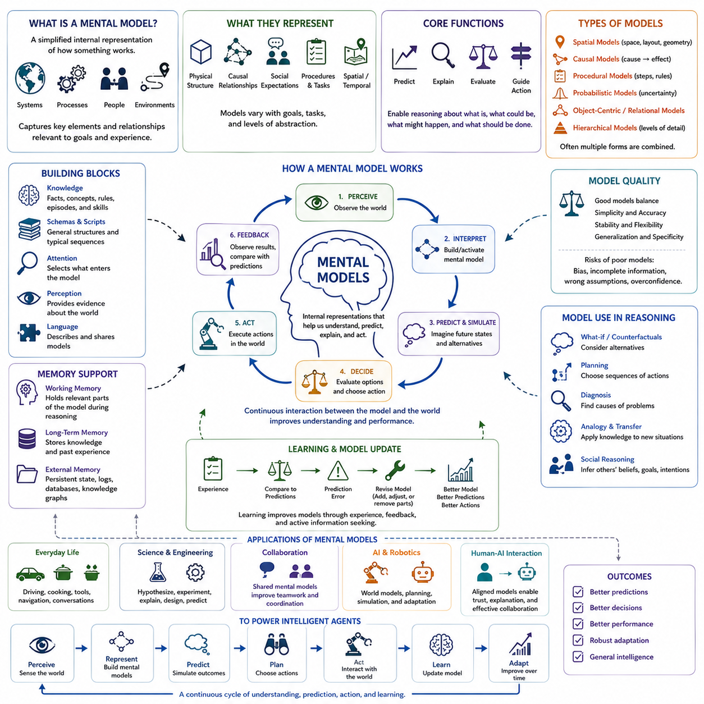{width="7.268055555555556in" height="7.268055555555556in"}

Mental models are internal representations that people use to understand how objects, systems, situations, and other agents behave. They provide simplified structures for interpreting observations, predicting future events, explaining causes, evaluating alternatives, and selecting actions. Rather than storing every detail of reality, cognition constructs useful approximations that capture relationships considered relevant to current goals and experience.

A mental model can represent physical structure, causal relationships, social expectations, task procedures, spatial layouts, or abstract systems. For example, a person may maintain a model of how a door opens, how traffic flows through an intersection, how a software system responds to input, or how another person may react to a decision. The form of the representation depends on the problem being solved.

Mental models differ from isolated facts because they describe relationships among elements. Knowing that a battery stores energy is factual knowledge, while understanding how battery charge, load, temperature, and operating time interact forms a richer model. Such relational structure allows a cognitive system to generate predictions about conditions that have not been observed directly.

Prediction is one of the most important functions of mental models. Once a person has an internal representation of how a system behaves, possible future states can be estimated before acting. A driver predicts how nearby vehicles may move, an engineer predicts how a component may respond to load, and a robot can predict how an object might move when pushed or grasped.

Mental models also support explanation. When an unexpected event occurs, cognition can compare the observation with what the current model predicted and search for a cause of the mismatch. This process allows people to diagnose failures, identify hidden variables, revise assumptions, and construct better explanations. Explanation and prediction therefore reinforce each other within model-based cognition.

These models are necessarily incomplete. The real world contains far more detail than can be represented or processed at once, so cognition compresses reality into manageable structures. A useful mental model preserves information relevant to prediction or action while ignoring less important details. The quality of a model depends not on perfect completeness but on whether its simplifications remain appropriate for the task.

Different tasks can require different models of the same object. A mechanic may represent a vehicle through components, forces, and failure modes, while a driver represents the same vehicle through controls, motion, and road behavior. A passenger may need an even simpler model. Cognition therefore constructs representations according to goals rather than maintaining one universal description of every system.

Mental models can be symbolic, spatial, visual, procedural, probabilistic, or distributed across several representational forms. A route through a building may be represented spatially, a troubleshooting procedure may be represented as conditional steps, and uncertainty about another person\'s intention may be represented probabilistically. Human cognition often combines several forms within the same problem.

Spatial mental models are especially important because many tasks depend on relationships among locations, directions, distances, and objects. People can navigate familiar environments, imagine rotations, reason about containment, and predict movement even when the relevant scene is not currently visible. Such capabilities suggest that cognition maintains internal spatial structures beyond immediate sensory input.

Temporal structure is equally important. Mental models often represent not only what exists but how states change over time. A sequence of actions, a causal process, a conversation, or a machine cycle contains temporal relationships that determine what can happen next. Models that capture transition dynamics support planning because they connect present conditions with possible future states.

Causal mental models represent how interventions or events produce consequences. They differ from simple correlations because they support questions about what would happen if a particular variable were deliberately changed. Causal models therefore enable diagnosis, planning, counterfactual reasoning, scientific explanation, and adaptation when familiar statistical patterns no longer hold.

Counterfactual reasoning depends strongly on mental simulation. A person can consider what might have happened if a different action had been chosen or imagine how a future outcome could change under another condition. These imagined alternatives are useful for learning from mistakes, evaluating plans, assigning responsibility, and comparing strategies without physically executing every possibility.

Mental simulation can be understood as running a mental model forward under hypothetical conditions. The model begins from an assumed state, applies expected relationships or dynamics, and produces one or more possible outcomes. Humans use such simulation when planning a route, assembling an object, anticipating a conversation, solving a mechanical problem, or predicting the consequence of a risky action.

Mental models are closely connected with working memory. During active reasoning, relevant parts of a model must remain accessible while information is manipulated and alternatives are compared. Because working memory is limited, complex systems are often simplified into chunks, hierarchies, or intermediate representations. Good mental models reduce cognitive load by organizing many details into meaningful structures.

Long-term memory provides the knowledge from which mental models are constructed. Previous experiences, concepts, rules, procedures, and episodes supply components that can be retrieved and combined for a current problem. Mental models are therefore often assembled dynamically rather than stored as complete fixed structures. Familiar problems can reuse well-established models, while novel situations require greater construction effort.

Schemas are closely related to mental models. A schema organizes generalized knowledge about a familiar category of situations, such as restaurants, classrooms, meetings, or driving. Mental models can use these schemas as starting structures and then incorporate information specific to the current situation. This allows cognition to form useful expectations rapidly from limited observations.

Scripts represent another related concept, emphasizing typical sequences of events. A person may know that entering a restaurant usually involves being seated, ordering, eating, and paying. Scripts reduce uncertainty by providing expectations about what normally happens next. However, rigid reliance on scripts can create mistakes when actual situations depart from familiar sequences.

Conceptual knowledge also contributes to model construction. Categories and semantic relationships allow cognition to infer properties not explicitly observed. Recognizing an object as a container, tool, vehicle, or living agent activates expectations about possible behaviors and interactions. Mental models therefore connect perception with stored conceptual structure and transform recognition into prediction.

Attention influences which elements enter a mental model. Because only part of available information can be processed deeply, task goals determine which objects, variables, and relationships receive priority. If attention focuses on irrelevant features, the resulting model may omit important causal factors. Model quality consequently depends partly on effective information selection.

Perception provides continuous evidence for updating mental models. Sensory observations are compared with existing expectations, and discrepancies may indicate that the environment changed or that the current representation is inaccurate. This creates a recurring relationship in which models guide perception while perception corrects models. Cognition is therefore both model-driven and evidence-driven.

Prediction error is especially important during model revision. When observed outcomes repeatedly differ from predictions, a cognitive system must decide whether the discrepancy results from noise, an unusual event, or a systematic weakness in the model. Persistent errors can motivate new variables, revised causal assumptions, or different representations capable of explaining previously unexpected behavior.

Learning therefore improves mental models through experience. Repeated interactions reveal regularities among states, actions, and outcomes. The learner gradually discovers which variables matter, which relationships remain stable, and which predictions fail under particular conditions. A good learning system does not merely memorize observations but reorganizes them into models that support future inference and action.

Model revision creates a balance between stability and flexibility. Changing a model after every unexpected observation would make knowledge unstable, while refusing to change established assumptions would prevent adaptation. Intelligent cognition evaluates the reliability, frequency, and importance of conflicting evidence before deciding whether an existing representation should be preserved or modified.

Expertise often depends on acquiring better mental models rather than simply accumulating more facts. Experts recognize deeper structures, anticipate likely failures, identify relevant variables rapidly, and ignore distracting details. Their models allow them to compress complex situations into meaningful patterns, making reasoning faster and more accurate within domains where extensive experience has been acquired.

Novices frequently rely on surface features because they have not yet developed representations of deeper relationships. Two problems that look different may be structurally identical to an expert, while visually similar problems may require different solutions. Learning therefore involves moving from superficial descriptions toward models that capture functional, relational, and causal structure.

Mental models can nevertheless be systematically wrong. People may construct explanations from incomplete evidence, assume incorrect causal relationships, underestimate uncertainty, or preserve intuitive models that conflict with reality. Such misconceptions can remain stable because new observations are sometimes interpreted in ways that protect existing beliefs rather than challenge them.

Confirmation bias can reinforce inaccurate models when attention and memory preferentially select evidence consistent with current expectations. If contradictory information is ignored or explained away, the model becomes increasingly resistant to revision. Reliable reasoning therefore requires actively testing assumptions, searching for disconfirming evidence, and distinguishing predictions generated by competing models.

Uncertainty should consequently be represented as part of a mental model rather than treated as an afterthought. Some relationships may be reliable while others remain speculative. A cognitive system that represents confidence can compare alternatives more effectively and determine when additional information is needed. Explicit uncertainty also reduces the risk of treating incomplete models as certain descriptions of reality.

Multiple models can sometimes coexist for the same situation. When evidence is ambiguous, cognition may maintain several hypotheses rather than selecting one immediately. Additional observations can then increase or decrease support for each possibility. This approach is particularly important in diagnosis, scientific reasoning, perception under uncertainty, and complex social interpretation.

Hierarchical mental models allow complex systems to be represented at several levels of abstraction. A vehicle can be represented as a transportation system, a collection of functional subsystems, or a detailed set of mechanical and electronic components. Higher levels simplify reasoning about goals, while lower levels provide detail when precise diagnosis or control becomes necessary.

Hierarchies also support planning. A high-level goal can be decomposed into subgoals, tasks, and executable actions. Rather than reasoning over every motor command simultaneously, cognition can plan first at an abstract level and refine details only when required. This decomposition greatly reduces the complexity of decision making in long-horizon activities.

Mental models also support analogical reasoning. If two situations share relational structure, a model developed for one can guide understanding of the other even when their surface appearances differ. Analogies are powerful because they transfer organized relationships rather than isolated facts. Scientific discovery, engineering design, education, and everyday reasoning frequently depend on this capability.

Language provides an important mechanism for constructing and communicating mental models. Descriptions can specify objects, relationships, events, causes, constraints, and hypothetical situations that are not directly observable. People can therefore share approximate models through explanation and instruction, allowing knowledge to spread without every individual independently experiencing the underlying situation.

However, language does not fully determine mental representation. A verbal explanation may produce different internal models in different people depending on prior knowledge and experience. Effective communication often requires diagrams, demonstrations, examples, or interaction because these additional forms help align the speaker\'s intended structure with the listener\'s constructed representation.

Shared mental models are especially important in collaborative activity. Members of a team need compatible expectations about goals, roles, system state, procedures, and likely actions of others. Perfectly identical internal representations are unnecessary, but sufficient alignment improves coordination because each participant can predict how others are likely to interpret events and respond.

Failures of shared models can produce coordination errors even when individual participants are competent. If two people interpret responsibilities differently or maintain conflicting assumptions about system status, their individually reasonable actions may interfere with each other. Team communication therefore often serves to synchronize models rather than simply exchange isolated information.

Social cognition itself depends heavily on models of other agents. Humans infer beliefs, intentions, goals, knowledge, emotions, and likely behavior from limited observations. These representations support cooperation, negotiation, teaching, competition, and communication. A person can predict another individual\'s behavior partly by simulating what that individual may know or want.

Theory of mind describes this ability to represent mental states that may differ from one\'s own. Recognizing that another person has incomplete or incorrect information is essential for effective communication and social reasoning. For AI systems, related capabilities may support human-aware planning, instruction following, collaboration, and interpretation of ambiguous requests.

Mental models are closely related to cognitive architectures because an integrated intelligent system needs representations connecting perception, memory, reasoning, decision making, and action. The model serves as an intermediate structure through which observations acquire meaning and possible actions acquire predicted consequences. Without such structure, behavior would rely primarily on direct stimulus-response mappings.

Classical artificial intelligence represented models explicitly through symbols, rules, logical statements, state spaces, and structured knowledge bases. These representations made relationships relatively interpretable and allowed deliberate reasoning over states and actions. Their limitation was that constructing complete symbolic models manually could be difficult in complex, uncertain, or continuously changing environments.

Modern machine learning often represents knowledge implicitly within neural network parameters and distributed embeddings. Such models can capture complex statistical relationships without explicit symbolic specification. However, their internal structure may be difficult to inspect, and implicit representations do not automatically provide reliable causal reasoning, persistent state, or controllable simulation.

Hybrid AI systems attempt to combine learned representations with more explicit structures. Neural networks may perform perception and feature extraction, while graphs, symbolic relations, databases, planners, simulators, or external memories maintain information that requires structured manipulation. Such combinations resemble the idea that cognition can use several representational forms rather than relying on a single mechanism.

Large language models demonstrate sophisticated behavior that sometimes appears compatible with mental-model reasoning. They can describe causal relationships, simulate scenarios, infer intentions, and reason about hypothetical conditions through learned linguistic representations. However, coherent language generation does not guarantee that a persistent, grounded, or causally correct internal model exists behind every response.

For this reason, AI systems increasingly use explicit state representations alongside foundation models. An agent may maintain a structured record of goals, observations, objects, relationships, tool results, uncertainties, and previous actions. This externalized state helps preserve continuity across interactions and reduces reliance on reconstructing the entire situation from language context alone.

World models provide a direct computational counterpart to many functions associated with mental models. A world model represents how relevant aspects of an environment evolve, often conditioned on actions. It can predict future states, generate imagined trajectories, estimate consequences, and support planning. In embodied AI, such models connect perception with decision making over time.

A useful world model does not need to reconstruct every pixel or physical detail. Depending on the task, it may represent objects, semantic relationships, geometry, dynamics, affordances, uncertainty, or latent features. This parallels human mental models, which preserve task-relevant structure while discarding details that contribute little to prediction or action.

Object-centric representations can make these models more compositional. Instead of representing an entire scene as an undifferentiated state, the system represents objects and their properties separately along with relationships among them. Such structure can improve generalization because familiar interaction rules may be reused when known object types appear in new configurations.

Relational models further capture connections such as proximity, support, containment, ownership, communication, or causal influence. Graph representations are useful because nodes can represent entities and edges can represent relationships. Dynamic graphs can then describe how both entities and relationships change as actions and events occur.

For robotics, mental-model-like representations must be grounded in physical constraints. A robot may understand semantically that an object should be moved but must also model its position, size, mass, reachability, collision constraints, and interaction dynamics. Abstract reasoning must therefore connect continuously with geometric and sensorimotor representations.

Affordances provide an important bridge between models and action. Instead of representing only what an object is, an agent represents what actions the object permits under current conditions. A chair may support sitting, a handle may support pulling, and a surface may support placement. These action possibilities depend on relationships between object properties and agent capabilities.

Planning uses models to evaluate candidate actions before execution. If an agent can estimate transitions from current states to future states, it can compare possible sequences according to expected reward, cost, risk, or goal achievement. Planning thus converts a descriptive model of how the world works into a prescriptive mechanism for deciding what should be done.

Model-based reinforcement learning formalizes this relationship computationally. The agent learns or receives a model of state transitions and outcomes, then uses that model to evaluate actions. This can improve data efficiency because hypothetical experiences generated through simulation supplement direct interaction, although planning quality depends strongly on model accuracy.

Model errors can accumulate during long simulations. Small prediction inaccuracies at one step may produce states unlike those encountered during training, causing later predictions to become increasingly unreliable. Practical systems therefore need uncertainty estimates, short-horizon replanning, real-world feedback, and mechanisms for recognizing when simulated trajectories should no longer be trusted.

Active perception can be interpreted as deliberate model improvement. If an agent\'s internal representation is uncertain, it can choose actions whose primary purpose is to obtain better information. Moving a camera, inspecting an occluded region, touching an object, or asking a human question can reduce uncertainty and improve the model before a critical decision is made.

Mental models also help explain situation awareness. An operator or autonomous system needs more than a collection of sensor readings; it needs an integrated representation of what is happening, why it matters, and what is likely to occur next. Situation awareness therefore depends on transforming raw observations into a model containing entities, relationships, goals, hazards, and predicted developments.

Operational awareness in autonomous systems can extend this model to the agent itself. Battery level, sensor reliability, localization confidence, computational capacity, task progress, and hardware condition can be represented alongside external state. An agent that models its own capabilities can choose plans that remain feasible under current operating constraints.

Long-horizon agents require persistent models because tasks may extend beyond the immediate context window or sensory scene. Goals, commitments, intermediate results, unresolved uncertainties, environmental changes, and past decisions must remain available across time. External memory and structured state management can therefore become essential components of artificial mental-model architectures.

Model synchronization becomes necessary when several robots or agents cooperate. Each agent observes only part of the environment, so shared maps, task states, object information, or beliefs may need to be exchanged. Differences between local models must be detected and reconciled carefully because inconsistent representations can produce conflicting actions.

Human-AI collaboration introduces the additional challenge of aligning machine and human mental models. A system may possess information the human operator lacks, while the human may understand contextual constraints unavailable to the AI. Effective interaction requires communicating goals, assumptions, confidence, intentions, and system limitations so that both sides can predict each other\'s behavior.

Explainable AI can partly be understood as supporting this alignment. Explanations help a user construct an appropriate model of why the system produced a recommendation or action. Useful explanations should communicate the factors that materially influenced behavior rather than merely produce plausible narratives, because inaccurate explanations can create misleading mental models of the AI itself.

Interface design is strongly influenced by mental-model theory. Users interact more successfully with systems when interface behavior matches understandable expectations. Inconsistent controls, hidden state changes, or unpredictable automation create incorrect user models and increase error. Good design makes system state, available actions, consequences, and important constraints sufficiently visible.

Digital twins provide an engineering example of explicit external models. A digital twin maintains a computational representation of a physical asset, process, or environment using sensor data, simulation, and system knowledge. Although more formal than ordinary human mental models, it serves a similar purpose by supporting monitoring, prediction, diagnosis, planning, and evaluation of hypothetical interventions.

Simulation environments likewise provide models in which intelligent agents can experiment safely. By varying conditions and actions, agents can explore consequences that would be costly or dangerous to test physically. The usefulness of simulation depends on whether the modeled relationships transfer sufficiently to reality, making model validation and sim-to-real adaptation essential.

Mental models also play an important role in scientific reasoning. Scientists construct models that simplify phenomena while preserving mechanisms relevant to explanation and prediction. Models are evaluated through their predictions and revised when evidence conflicts with them. Scientific reasoning therefore provides a disciplined example of model construction, testing, comparison, and revision.

This perspective suggests an important principle for AI: internal models should be treated as hypotheses rather than unquestionable truth. Representations can be incomplete, outdated, or wrong. Systems that explicitly monitor uncertainty, compare predictions with observations, and revise assumptions are more likely to remain reliable when operating conditions differ from prior experience.

Evaluation of model-based intelligence should therefore examine predictive accuracy, causal validity, calibration, transfer, planning performance, and robustness under distribution change. A model that performs well only on familiar observations may not support reliable intervention. Testing should include novel combinations, counterfactual conditions, unexpected events, and changes in environmental dynamics.

For Physical AI, mental-model concepts become especially important because the system must connect semantic understanding with real physical consequences. A robot may need to understand that a container can hold an object, predict whether the object fits, determine whether the container is reachable, plan a collision-free manipulation, and update its model if the interaction produces an unexpected result.

World models, foundation models, structured memory, causal reasoning, and sensorimotor learning can therefore be viewed as complementary mechanisms for constructing increasingly capable artificial mental models. Foundation models supply broad prior knowledge, world models predict dynamics, memory preserves experience, and perception continually grounds these structures in the current environment.

The goal is not to reproduce human mental models exactly. Human representations are shaped by biological constraints, development, culture, and cognitive biases, whereas engineered systems can use explicit databases, simulators, optimization algorithms, and high-dimensional learned representations unavailable to biological cognition. The useful objective is to preserve the functional principles of structured prediction and adaptive model revision.

A capable intelligent agent should maintain models that are simple enough for efficient inference but rich enough to support reliable prediction and action. It should know which aspects of those models are uncertain, detect when reality diverges from expectation, gather information when necessary, and update representations without discarding useful prior knowledge.

Mental models ultimately connect perception with purposeful behavior. They transform observations into structured interpretations, provide expectations about how states may evolve, support imagined alternatives, and allow actions to be evaluated before execution. Through continuous interaction with memory, attention, learning, reasoning, and feedback, they give cognition a mechanism for operating beyond immediate sensory input.

For cognitive science, mental models help explain how humans reason about systems that are not directly present and how they plan actions before performing them. For artificial intelligence, the same general principle motivates agents with persistent state, world models, simulation, causal structure, and adaptive memory. Such capabilities form a central bridge from reactive computation toward predictive, deliberative, and increasingly general intelligence.

## 01.05 Cognitive Load

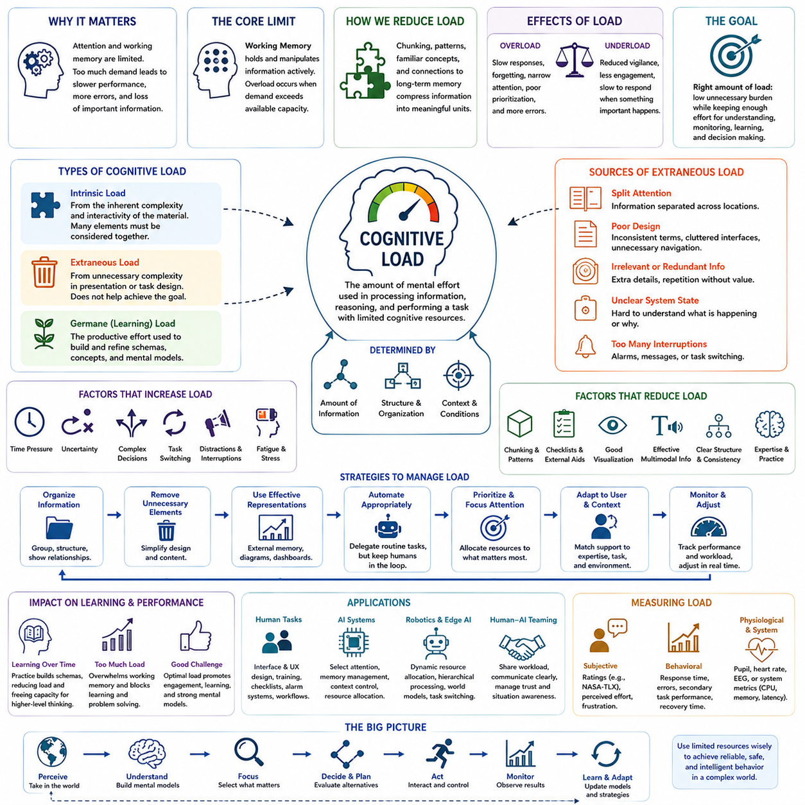{width="7.268055555555556in" height="7.268055555555556in"}

Cognitive load refers to the amount of mental effort required to process information, maintain relevant representations, reason about alternatives, and perform a task. Because attention and working memory are limited, cognitive systems cannot process unlimited information simultaneously. Performance therefore depends not only on task difficulty but also on how efficiently information is represented, organized, and presented.

Working memory is central to cognitive load because it temporarily holds information that is actively used during reasoning and action. When too many elements must be remembered, compared, or manipulated at the same time, working-memory capacity can be exceeded. Errors then become more likely, processing slows, and important information may be lost before it can contribute to a decision or action.

Cognitive load is not determined solely by the amount of information available. The structure of the information also matters. Ten unrelated facts may require more effort than a larger set organized into meaningful patterns. Cognitive systems reduce load by grouping related elements into chunks, using familiar concepts, and connecting new information with knowledge already stored in long-term memory.

Chunking allows several individual elements to be represented as a single meaningful unit. A novice may need to process each component of a technical system independently, while an expert can recognize the same components as one functional subsystem. Expertise therefore effectively expands usable cognitive capacity by compressing many details into structured representations that can be manipulated more efficiently.

Cognitive load theory often distinguishes intrinsic load, extraneous load, and learning-related processing. Intrinsic load arises from the inherent complexity and interdependence of the material itself. Extraneous load results from unnecessary complexity in presentation or task design, while productive processing supports the construction and refinement of useful schemas, concepts, and mental models.

Intrinsic cognitive load depends partly on element interactivity. A task becomes demanding when many pieces of information must be considered together because understanding one element depends on several others. Solving an unfamiliar control problem, for example, may require simultaneous reasoning about system state, constraints, dynamics, goals, and possible actions rather than considering each variable independently.

Expertise can change intrinsic load because information that is highly interactive for a novice may become a single familiar structure for an expert. A complex formula, machine configuration, or software architecture can initially require substantial working-memory resources, but repeated experience allows relationships to become encoded in long-term memory and retrieved as integrated patterns.

Extraneous cognitive load is generated when information is harder to process than necessary. Poorly organized interfaces, inconsistent terminology, irrelevant details, redundant instructions, unnecessary navigation, or scattered information can consume attention without contributing to the actual goal. Good design therefore attempts to remove processing demands that do not improve understanding or performance.

Split attention is a common source of unnecessary load. When related information is separated across several locations, users must repeatedly shift attention and mentally integrate the pieces. A diagram explained on another page, a warning disconnected from the relevant control, or a robot status distributed across several displays can increase effort even when each individual information source is understandable.

Redundancy can also increase cognitive load when multiple representations provide the same information without adding useful clarification. Repeating identical content in text, speech, and graphics may force a user to coordinate unnecessary inputs. However, carefully designed multimodal presentation can reduce load when different modalities provide complementary information rather than competing versions of the same content.

Multimodal processing is useful because visual and auditory information can sometimes distribute demands across partially distinct processing resources. Spoken guidance may accompany visual navigation, for example, without requiring the user to repeatedly look away from the environment. The benefit depends on coordination, timing, relevance, and whether the modalities truly complement each other.

Attention determines which information receives cognitive resources, so attentional demand is closely related to cognitive load. When many signals compete for priority, more effort is required to maintain focus and suppress distraction. Environments containing frequent interruptions, alarms, messages, moving objects, or competing goals can therefore increase load even when the primary task itself remains unchanged.

Task switching creates additional load because the cognitive system must repeatedly change goals, retrieve new rules, activate different representations, and suppress the previous task context. Switching from navigation to communication, then to diagnosis, and back to navigation may consume more resources than completing the same activities sequentially. Frequent interruptions can therefore reduce efficiency and increase recovery time.

Sustained high cognitive load can also degrade situation awareness. When most resources are consumed by immediate task demands, there may be insufficient capacity to monitor the broader environment, anticipate future events, or detect weak warning signals. A person may successfully solve a local problem while becoming unaware of changes occurring elsewhere in the system.

Overload occurs when processing demand exceeds the resources available for effective performance. Typical consequences include slower responses, forgotten information, reduced accuracy, narrow attention, poor prioritization, and simplified decision strategies. Under severe overload, individuals may focus only on the most obvious or urgent cues while neglecting information that would support better long-term decisions.

Underload can also create problems. Tasks that require very little active processing for long periods may reduce vigilance, engagement, and readiness to respond. An operator supervising highly reliable automation may have little to do until an unusual event occurs, yet the sudden transition from low demand to emergency intervention can require rapid reconstruction of situation awareness.

Effective system design therefore seeks an appropriate level of cognitive demand rather than simply minimizing all mental effort. Some processing is necessary for learning, understanding, monitoring, and decision making. The objective is to reduce avoidable burden while preserving the effort required to construct accurate mental models and maintain meaningful engagement with the task.

Learning itself changes cognitive load over time. Early practice often requires conscious attention to individual steps, rules, and relationships. With repeated experience, procedures become more automatic and schemas become more developed. Working-memory demand decreases, allowing attention to shift toward higher-level goals, unusual conditions, and strategic decisions rather than routine operations.

Automation can reduce cognitive load by performing repetitive perception, calculation, monitoring, or control tasks. Navigation assistance, automatic stabilization, anomaly detection, and decision support can free cognitive resources for more complex reasoning. However, poorly designed automation may simply move the burden from continuous control to difficult supervision and occasional high-stakes intervention.

Automation can also produce hidden cognitive costs when users must understand complex system modes, predict automated behavior, or determine when to intervene. If system state is unclear, operators may spend substantial effort reconstructing what the automation is doing and why. Mode confusion demonstrates that reducing physical workload does not necessarily reduce cognitive workload.

Trust influences cognitive load in human-machine interaction. When automation is reliable and understandable, users can delegate appropriate tasks without continuously checking every output. When trust is too low, excessive monitoring wastes attention, while excessive trust can reduce meaningful oversight. Appropriate trust therefore helps allocate limited cognitive resources between automation and human supervision.

Mental models strongly affect cognitive load because a coherent model reduces the effort required to interpret new information. If a system behaves according to understandable principles, users can predict its state and actions without memorizing every detail. Inconsistent behavior forces repeated reconstruction, increasing cognitive demand and making errors more likely.

Interface consistency similarly reduces processing effort. Controls, symbols, terminology, and feedback that follow stable conventions allow users to reuse learned expectations. When identical actions produce different outcomes or similar displays represent unrelated states, additional reasoning is required. Predictability therefore acts as a form of cognitive compression in human-system interaction.

External representations can reduce internal cognitive load by moving information from memory into the environment. Notes, diagrams, dashboards, maps, checklists, labels, and visual indicators allow people to inspect information instead of remembering it. External memory becomes especially valuable when tasks involve many variables, long procedures, or interruptions that make internal maintenance unreliable.

Checklists illustrate this principle by converting a memory-intensive task into a recognition-based process. Rather than recalling every required step, the user can verify visible items sequentially. The advantage is not that the checklist replaces expertise but that it protects working memory from routine demands, leaving more capacity for judgment when unusual conditions arise.

Visualization can also reduce load when spatial relationships, trends, or system structure would otherwise require complex mental reconstruction. A well-designed diagram can make dependencies visible directly, while an appropriate dashboard can reveal status differences without repeated calculation. Poor visualization, however, can increase load if it introduces unnecessary decoration, ambiguous encoding, or excessive density.

Cognitive load is highly dependent on context. The same information may be easy to process in a quiet environment but difficult under time pressure, physical movement, noise, fatigue, or competing tasks. Real-world cognition therefore reflects the interaction between task complexity, environmental conditions, individual expertise, emotional state, and available support mechanisms.

Time pressure increases load because fewer processing cycles are available for information gathering, comparison, and verification. Under severe time constraints, people rely more heavily on heuristics and familiar patterns. Such strategies can be efficient when experience is relevant, but they can also produce errors when the situation differs from previously learned conditions.

Uncertainty adds another form of cognitive demand. When information is incomplete or conflicting, several possible interpretations may need to be maintained simultaneously. The cognitive system must evaluate evidence, update confidence, and determine whether additional information is required. Representing uncertainty clearly can therefore reduce load by preventing users from having to infer reliability indirectly.

Decision complexity increases as the number of alternatives, constraints, and possible consequences grows. Evaluating many options requires maintaining comparisons in working memory and predicting outcomes under uncertainty. Hierarchical decision making reduces this burden by first eliminating broad classes of unsuitable options and then examining a smaller set of promising alternatives in greater detail.

Planning over long horizons creates similar demands because intermediate goals, dependencies, resources, and predicted future states must remain coordinated. Hierarchical planning reduces load by decomposing large goals into manageable subgoals. Instead of considering every possible low-level action at once, cognition can reason at an abstract level and expand details only when necessary.

Cognitive load also affects error detection. When working memory and attention are heavily occupied, fewer resources remain for monitoring one\'s own performance. Errors may therefore continue longer before being noticed. Metacognitive mechanisms that monitor uncertainty, workload, and confidence can help determine when a task should be slowed, simplified, delegated, or supported by additional information.

Stress interacts with cognitive load in complex ways. Moderate arousal can improve focus in some situations, but excessive stress may narrow attention, impair working memory, and promote rigid response patterns. Safety-critical systems should therefore avoid designs that require users to perform unfamiliar, cognitively complex procedures precisely when emergencies already increase stress and uncertainty.

Fatigue similarly reduces available cognitive resources. Long operating periods, sleep loss, repetitive monitoring, and sustained concentration can degrade attention and working memory. A task that is manageable under normal conditions may become effectively overloaded when the operator is fatigued. Cognitive workload assessment should therefore consider how performance changes across time rather than only under ideal conditions.

Individual differences also influence effective capacity. Experience, domain knowledge, age, training, strategy, and familiarity with the interface can change how demanding a task feels. A design optimized only for experts may overwhelm new users, while a system that explains every elementary step may unnecessarily burden experts. Adaptive presentation can help accommodate different levels of knowledge.

Instructional design uses cognitive-load principles to improve learning. Complex material can be segmented into manageable units, unnecessary information can be removed, important relationships can be highlighted, and prerequisites can be introduced before advanced concepts. The goal is to preserve intellectual complexity while reducing presentation demands that interfere with schema construction.

Worked examples can lower load during early learning by showing how a problem is solved rather than requiring novices to search blindly through many possibilities. As expertise develops, assistance can gradually be removed so that learners actively perform more of the reasoning themselves. This transition helps shift knowledge from externally supported procedures toward internalized problem-solving skills.

The expertise-reversal effect demonstrates that support beneficial to novices can become unnecessary or distracting for experts. Detailed explanations may reduce load for beginners but increase redundancy for experienced users. Effective learning systems therefore adapt guidance according to competence rather than assuming that one information format is optimal for everyone.

Cognitive load has direct relevance to cognitive architectures because intelligent systems must also operate under limited computational resources. Although machine limitations differ from biological working-memory limits, artificial agents face constraints involving compute, memory, bandwidth, latency, energy, and context length. Resource allocation therefore becomes an engineering analogue of cognitive-load management.

An AI system that processes every available observation with maximum computational depth may become too slow or energy intensive for real-time operation. Selective attention, hierarchical processing, sparse computation, event-driven sensing, and model routing can reduce unnecessary computation. These mechanisms prioritize information according to relevance, uncertainty, expected value, or safety.

Context management in language-based agents provides another analogy. An agent may possess more stored information than can fit efficiently into the active context used for reasoning. Retrieval systems must therefore select relevant memories, documents, goals, and previous actions. Poor selection can overload the context with irrelevant information and reduce reasoning quality even when more data is technically available.

Long prompts and large memory stores do not automatically improve intelligence. Excessive context can introduce distraction, conflicting information, and retrieval difficulty. Effective AI systems require mechanisms for compression, summarization, hierarchical memory, relevance filtering, and state abstraction so that the active reasoning workspace contains information appropriate to the current task.

Foundation models illustrate another computational tradeoff. Larger models can represent broader knowledge and perform more complex reasoning, but they also require greater memory, energy, and inference time. Practical systems therefore balance model capability with latency and resource constraints, often combining large high-level models with smaller specialized models for frequent or time-critical operations.

For robotics, cognitive-load-like resource management becomes particularly important because sensing, perception, localization, planning, communication, and control must often run simultaneously. An autonomous robot has finite compute and power, so processing all sensors at maximum fidelity may be impossible. Resources must be allocated dynamically according to task phase and environmental conditions.

During normal navigation, a robot may prioritize localization, obstacle detection, and path tracking. During manipulation, computational emphasis can shift toward object pose, depth, tactile feedback, and motion planning. If a safety hazard appears, collision avoidance may override other tasks. Such dynamic prioritization resembles attentional management under limited cognitive capacity.

Edge AI intensifies these constraints because onboard systems operate within strict power, thermal, memory, and latency limits. Efficient architectures may use low-cost models continuously and activate expensive perception or reasoning modules only when uncertainty, novelty, or risk increases. Cognitive-load concepts therefore provide a useful analogy for adaptive computational resource allocation.

World models can reduce computational demand by replacing repeated raw sensory reasoning with compact internal state representations. Instead of reconsidering every pixel or LiDAR point for every decision, the agent may reason over objects, relationships, dynamics, and uncertainties. Such abstraction reduces the effective dimensionality of planning while preserving information relevant to future actions.

However, compression creates risk if important details are discarded. A highly abstract representation may be efficient but fail to capture small obstacles, rare hazards, or physical constraints critical to execution. Intelligent systems therefore require mechanisms for moving between abstraction levels, using coarse representations for broad reasoning and detailed processing when precision becomes necessary.

Hierarchical architectures provide a natural solution. Slow, computationally expensive reasoning can operate at a high level, while fast specialized controllers handle immediate responses. Intermediate layers translate goals into tasks and monitor execution. This separation prevents every decision from requiring full high-level reasoning while preserving the ability to intervene when unexpected conditions arise.

Cognitive load is also important in human-robot interaction. A robot that repeatedly asks unnecessary questions, provides verbose status reports, or generates excessive warnings can consume human attention and reduce overall team performance. Communication should therefore deliver the right information at the right level of detail according to urgency, uncertainty, task phase, and user expertise.

An effective robot should recognize when human cognitive resources are likely to be limited. During emergencies or complex manual operations, additional noncritical requests should be delayed. During low-workload periods, the system can provide explanations, summaries, or planning information. Adaptive interaction treats human attention as a limited shared resource rather than an unlimited communication channel.

Alarm management provides an important practical example. If every minor deviation generates the same alert priority, users may become overwhelmed and begin ignoring notifications. Effective systems classify severity, aggregate related events, suppress redundant alarms, and escalate only when intervention is needed. The objective is to preserve sensitivity to critical events without creating continuous overload.

Shared autonomy can reduce cognitive burden by dividing responsibilities between humans and machines. The autonomous system handles routine sensing and control, while humans provide strategic goals, judgment, or intervention in ambiguous situations. Successful shared autonomy requires clear responsibility boundaries because uncertainty about who controls which function can itself create substantial cognitive load.

Situation-aware assistance can further reduce burden by anticipating what information is likely to be needed next. Instead of presenting every available option, the system can emphasize task-relevant controls, likely hazards, or predicted consequences. Such assistance should remain transparent so that users understand what has been filtered and can access additional detail when required.

Evaluating cognitive load is challenging because it is not directly observable. Researchers use behavioral performance, response time, error rates, secondary-task performance, subjective workload ratings, eye movements, physiological measurements, and other indicators. No single measure captures every aspect, so workload assessment usually benefits from combining multiple forms of evidence.

Subjective workload measures are valuable because individuals can report perceived mental demand, effort, frustration, and time pressure. However, perceived load does not always correspond directly to objective performance. An expert may perform accurately while reporting high effort, or a novice may underestimate task complexity. Evaluation should therefore distinguish experienced difficulty from observable performance degradation.

Behavioral measures provide complementary information. Increased response time, forgotten steps, repeated corrections, narrow search patterns, and higher error frequency may indicate growing load. Secondary-task methods estimate spare capacity by measuring how well a person can respond to an additional simple task while performing the primary activity.

Physiological indicators can provide further evidence but require careful interpretation. Pupil diameter, heart-rate variability, brain activity, or other measurements may correlate with workload under some conditions, yet they are also influenced by emotion, lighting, physical effort, and fatigue. Reliable assessment therefore requires context rather than treating physiological signals as direct measurements of cognitive load.

For AI systems, analogous monitoring can examine GPU utilization, memory pressure, latency, queue lengths, token usage, uncertainty, sensor processing demand, and planning complexity. Such measurements can allow the architecture to reduce resolution, switch models, summarize memory, postpone low-priority tasks, or allocate additional resources before real-time performance degrades.

Adaptive load management can therefore operate as a feedback loop. The system estimates current demand, compares it with available capacity, detects overload risk, changes processing strategy, and monitors whether performance recovers. Human-centered systems can similarly adjust information density, automation level, warning frequency, or task allocation according to estimated operator workload.

The concept of cognitive load ultimately illustrates that intelligence depends not only on possessing information but on controlling how much information is actively processed at a particular moment. Unlimited data without prioritization can reduce rather than improve performance. Efficient cognition requires selection, abstraction, memory organization, automation, and flexible allocation of limited resources.

For cognitive science, cognitive load explains many limitations and strategies observed in attention, working memory, reasoning, learning, and multitasking. For artificial intelligence, the same functional principle motivates selective computation, memory management, hierarchical reasoning, adaptive model activation, and resource-aware planning rather than processing every possible signal equally.

For Physical AI, this principle becomes especially important because robots must coordinate perception, prediction, planning, control, communication, and safety within finite onboard resources while interacting with humans who also have limited attention. Effective systems must therefore manage both computational load and human cognitive load as interconnected parts of the overall intelligence architecture.

The broader objective is not to eliminate cognitive or computational effort but to use limited capacity where it creates the greatest value. Information should be organized so that routine details require minimal resources while uncertainty, novelty, risk, and complex decisions receive deeper processing. Managing cognitive load in this way supports more reliable learning, reasoning, collaboration, adaptation, and intelligent action.

## 01.06 Human Error and Reliability [w/Code]

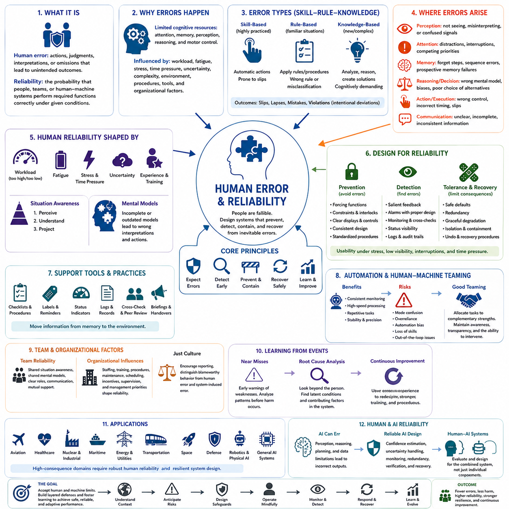{width="7.268055555555556in" height="7.268055555555556in"}

Human error refers to actions, judgments, interpretations, or omissions that lead to outcomes different from what was intended or required. Reliability describes the probability that a person, team, or human-machine system will perform a required function correctly under specified conditions. Cognitive science studies error not simply as individual failure, but as the result of interactions among people, tasks, environments, procedures, tools, and organizational systems.

Human performance is inherently variable because attention, memory, perception, judgment, and motor control operate under limited resources. Even skilled people can make mistakes when information is incomplete, tasks are unfamiliar, workload is high, or environmental conditions change rapidly. Reliability engineering therefore assumes that errors are possible and designs systems so that individual mistakes do not automatically produce serious consequences.

Errors can arise during perception when relevant information is not detected, is misinterpreted, or is confused with similar signals. Poor visibility, ambiguous displays, weak alarms, sensory overload, or divided attention can prevent a person from recognizing important events. Because perception is selective rather than complete, system reliability depends partly on ensuring that critical information is salient, understandable, and available at the correct time.

Attention failures are another major source of error. A person may focus intensely on one problem while failing to notice a different hazard, or may become distracted by interruptions and lose track of the current task. Inattentional blindness, task switching, and competing priorities demonstrate that simply presenting information does not guarantee that it will receive sufficient cognitive processing.

Memory limitations can produce omissions, sequence errors, or incorrect recall. Working memory can maintain only a limited amount of active information, making long procedures and interrupted tasks particularly vulnerable. Prospective memory is also important because people must remember actions that need to be performed later, such as completing a final inspection or restoring a system after maintenance.

External aids reduce memory-related errors by transferring information from internal memory into the environment. Checklists, procedures, labels, status indicators, logs, and automated reminders allow users to recognize required actions rather than recall everything unaided. These tools are especially valuable when tasks are infrequent, complex, interrupted, or performed under time pressure.

Reasoning and decision errors occur when information is interpreted incorrectly or unsuitable alternatives are selected. People may rely on incomplete mental models, underestimate uncertainty, overvalue recent evidence, or choose familiar actions that do not match the current situation. Reliability therefore depends on supporting accurate situation understanding rather than assuming that access to information alone guarantees good decisions.

A useful distinction separates slips and lapses from mistakes. Slips occur when the intended goal is appropriate but execution is incorrect, such as pressing the wrong control. Lapses involve failures of memory, such as forgetting a required step. Mistakes occur when the plan or decision itself is wrong because the situation has been misunderstood or an inappropriate rule has been selected.

Skill-based behavior relies on highly practiced routines that usually require little conscious attention. Such behavior is efficient but vulnerable to slips when similar actions or controls are confused. A person may perform a familiar sequence automatically even though the current situation requires a deviation. Good interface design reduces opportunities for habitual actions to produce unintended effects.

Rule-based behavior occurs when familiar procedures or learned rules are applied to recognized situations. Errors can occur if the wrong rule is selected, if conditions are misclassified, or if a normally useful procedure is applied outside its valid range. Clear criteria, consistent terminology, and feedback about system state help users determine whether a rule remains appropriate.

Knowledge-based behavior becomes necessary when no familiar procedure adequately describes the situation. People must construct a mental model, generate hypotheses, reason about causes, and evaluate possible actions. This mode is flexible but cognitively demanding, making performance more sensitive to workload, uncertainty, expertise, time pressure, and the quality of available information.

Violations differ from unintentional errors because a person deliberately departs from a rule, procedure, or expected practice. Violations may arise from time pressure, poorly designed procedures, conflicting goals, organizational norms, or the belief that a shortcut is necessary to complete the task. Reliability analysis therefore examines why deviations become attractive rather than treating every violation as simple misconduct.

Human reliability is strongly influenced by workload. Excessive cognitive load can narrow attention, slow reasoning, increase memory failures, and encourage simplified strategies. Very low workload can also reduce vigilance and readiness. Reliable system design seeks a manageable operating region where people remain sufficiently engaged without being overwhelmed by unnecessary information or simultaneous demands.

Fatigue can significantly reduce reliability by degrading attention, reaction time, working memory, and judgment. Long shifts, repetitive monitoring, insufficient rest, and sustained mental effort can gradually increase error probability. Because the effects may emerge slowly, operators may not recognize their own performance decline accurately, making organizational scheduling and workload management important safety mechanisms.

Stress and time pressure can modify decision strategies. Moderate urgency may increase focus, while extreme pressure can narrow attention and encourage rapid reliance on familiar responses. In emergencies, people may overlook secondary information, repeat unsuccessful actions, or become fixated on an incorrect diagnosis. Procedures and interfaces should therefore remain usable when cognitive resources are already reduced.

Situation awareness is critical for reliable performance. A person must perceive important elements, understand their significance, and anticipate how the situation may develop. Failures at any of these stages can produce incorrect actions even when technical skills are strong. Reliable systems help users maintain an integrated understanding of system state, hazards, goals, constraints, and expected future changes.

Mental models strongly influence situation awareness because users interpret information through assumptions about how a system works. If a model is incomplete or outdated, normal observations may be misunderstood and abnormal behavior may be explained incorrectly. Transparent system behavior, training, simulation, and meaningful feedback help users construct models that support more accurate prediction.

Interface design can either prevent or create errors. Controls that look similar, hidden system states, inconsistent commands, unclear terminology, or weak feedback increase the probability of incorrect action. Error-resistant interfaces make important distinctions visible, constrain impossible actions where practical, confirm high-risk commands, and provide immediate feedback showing whether intended actions were actually executed.

Forcing functions are design mechanisms that prevent an unsafe action or require specific conditions before an action can proceed. Interlocks, keyed connectors, confirmation sequences, and physical constraints can eliminate certain error paths entirely. Such mechanisms are valuable when the consequence of a mistake is severe and relying solely on memory or attention would be insufficient.

Error tolerance addresses situations where prevention cannot be guaranteed. A resilient system assumes that mistakes will sometimes occur and provides ways to detect, contain, and recover from them. Undo functions, safe defaults, redundancy, graceful degradation, fault isolation, and recovery procedures reduce the probability that a small human error will escalate into a system-level failure.

Feedback is essential for error detection. People need timely information about whether an action was accepted, what state changed, and whether the outcome matches expectations. Delayed or ambiguous feedback allows incorrect assumptions to persist. Effective feedback closes the perception-action loop by making consequences visible enough for users to correct deviations before they become dangerous.

Alarms are intended to attract attention to abnormal conditions, but poorly designed alarm systems can reduce reliability. Excessive alarms create overload and alarm fatigue, while frequent false alarms reduce trust. Effective alarm management prioritizes severity, suppresses redundant notifications, groups related events, and communicates the action or interpretation required rather than simply announcing that something changed.

Automation can improve reliability by performing repetitive calculations, monitoring, stabilization, and control with greater consistency than humans. However, automation also creates new failure modes involving mode confusion, overreliance, poor transparency, and loss of manual skill. Human reliability therefore depends not only on whether automation works, but on whether people understand its state, limits, and expected behavior.

Automation bias occurs when people accept automated recommendations without sufficient independent evaluation. If a system is usually correct, users may stop searching for contradictory evidence. The opposite problem occurs when unreliable automation creates excessive distrust and unnecessary manual verification. Appropriate reliance requires calibrated trust based on understandable system capability and uncertainty.

Out-of-the-loop performance problems can appear when automation handles a task for long periods and suddenly requires human intervention. Operators may have lost detailed situation awareness or may need time to understand what happened before taking control. Reliable automation should therefore maintain meaningful human engagement and provide concise state reconstruction when responsibility must be transferred.

Human-machine teaming can improve reliability when responsibilities are allocated according to complementary strengths. Machines are effective at repetitive monitoring, precise calculation, and high-speed data processing, while humans remain valuable for contextual reasoning, unusual situations, ethical judgment, and flexible goal interpretation. Effective allocation should change dynamically as task conditions and confidence change.

Redundancy can improve reliability when independent people, sensors, models, or procedures verify critical outcomes. However, redundant elements are useful only when failures are not strongly correlated. Two operators using the same incorrect assumption may produce the same error. Diversity of information sources, methods, and perspectives can therefore be more valuable than simple duplication.

Cross-checking is an important team reliability mechanism. A second person can confirm calculations, procedures, or system states before high-risk actions are executed. Effective cross-checking requires clear responsibility and psychological permission to challenge assumptions. If organizational hierarchy discourages questioning, nominal redundancy may exist without providing meaningful protection.

Communication failures frequently contribute to human error. Ambiguous language, incomplete handovers, inconsistent terminology, and unspoken assumptions can cause different people to maintain incompatible mental models. Structured communication techniques improve reliability by explicitly identifying critical information, responsibilities, uncertainties, and confirmation of shared understanding.

Team reliability therefore depends on shared situation awareness and shared mental models. Members do not need identical knowledge, but they should understand overall goals, role boundaries, system state, and expected actions of others. When these representations become misaligned, individually reasonable decisions can combine into unsafe system behavior.

Organizational conditions strongly influence individual reliability. Staffing levels, training quality, maintenance policy, scheduling, incentive structures, supervision, and management priorities shape the environment in which decisions are made. A system that repeatedly places people under conflicting goals or unrealistic deadlines can create predictable conditions for error even when individual workers are highly capable.

The concept of latent conditions captures weaknesses that exist before an accident occurs. Poor procedures, confusing interfaces, inadequate training, deferred maintenance, or organizational communication gaps may remain unnoticed until combined with an active error. Reliability analysis therefore examines the entire chain of contributing conditions instead of searching only for the final person who made a mistake.

A just culture supports reliability by distinguishing intentional reckless behavior from reasonable mistakes and system-induced errors. If every error is punished, people may hide near misses and reduce organizational learning. If all behavior is excused, accountability disappears. Effective safety cultures encourage reporting while maintaining clear standards for deliberate and unacceptable risk-taking.

Near misses are especially valuable because they reveal weaknesses without producing the full consequences of an accident. Analyzing near misses can identify recurring error patterns, poor interfaces, inadequate procedures, and unexpected interactions. Organizations that collect and learn from such events can improve reliability before equivalent failures cause serious harm.

Root-cause analysis should therefore move beyond identifying immediate operator actions. Asking why the action appeared reasonable at the time often reveals missing information, misleading feedback, workload, training limitations, poor procedures, or organizational pressure. Understanding the context of behavior produces more effective corrective actions than simply instructing people to be more careful.

Human reliability analysis attempts to estimate the probability and consequences of human actions within larger technical systems. Methods may examine task complexity, environmental conditions, dependencies, recovery opportunities, and performance-shaping factors. Exact numerical prediction is difficult because human behavior is context dependent, but structured analysis still helps identify high-risk tasks and weak defenses.

Performance-shaping factors include workload, experience, training, interface quality, time pressure, fatigue, environmental conditions, procedure design, teamwork, and organizational support. These factors modify the probability that a task will be performed correctly. Reliability improvement therefore focuses on changing conditions around behavior rather than expecting identical performance under every circumstance.

Training improves reliability when it develops not only procedural memory but also accurate mental models and recovery strategies. Memorizing normal procedures may be insufficient for rare abnormal events. Simulation and scenario-based training allow people to experience unusual conditions, practice diagnosis, recognize failure signatures, and learn how systems behave when standard assumptions no longer apply.

Adaptive expertise is particularly valuable in complex systems. Routine expertise enables efficient execution under familiar conditions, while adaptive expertise allows people to recognize when familiar procedures are inadequate and construct new solutions. Reliable organizations need both capabilities because excessive dependence on fixed procedures can become dangerous when situations fall outside anticipated scenarios.

Checklists and procedures should support cognition rather than replace judgment. Overly detailed procedures can become difficult to use under pressure, while vague procedures provide insufficient guidance. Effective procedures organize critical steps, decision points, warnings, and verification actions while leaving appropriate flexibility for conditions that cannot be predicted completely.

Error recovery is an essential component of reliability because many mistakes are reversible if detected early. Systems should make errors visible, preserve safe states, and provide straightforward recovery paths. Training should also include recovery rather than focusing only on perfect execution, because operators who understand how to recognize and correct deviations can prevent escalation.

Resilience extends reliability beyond preventing expected failures. A resilient system can monitor changing conditions, respond to unexpected events, recover from disruption, and adapt its behavior while preserving essential functions. Human flexibility is often central to resilience because people can reinterpret goals and improvise when predefined procedures or automated responses become inadequate.

For artificial intelligence, human error research offers important lessons about designing reliable autonomous systems. AI models also operate with incomplete information, limited computational resources, uncertain predictions, and imperfect internal representations. Reliability therefore requires confidence estimation, failure detection, redundancy, feedback, recovery mechanisms, and monitoring rather than assuming that high benchmark accuracy guarantees safe operation.

AI systems can produce errors analogous to human perceptual or reasoning failures. A perception model may miss an object, a language model may infer an incorrect relationship, or a planner may choose an unsafe action because its world model is inaccurate. Reliable architecture should detect when uncertainty increases and prevent uncertain outputs from directly becoming high-risk actions.

Human-AI systems introduce coupled failure modes in which machine errors influence human decisions and human behavior influences machine performance. An incorrect AI recommendation may become more dangerous if an operator trusts it excessively, while poor human input may cause a model to operate outside its intended conditions. Reliability must therefore be evaluated at the combined system level.

Explainability can support reliability when it helps users understand important evidence, uncertainty, assumptions, and system limitations. Explanations should improve the user\'s mental model rather than merely justify an output after the fact. When explanations are plausible but disconnected from actual system behavior, they can increase rather than reduce the risk of inappropriate trust.

For robotics and Physical AI, reliability is inseparable from the perception-action loop. A small sensing error can affect localization, planning, control, and physical interaction, producing new observations that further amplify the initial mistake. Closed-loop monitoring, safety constraints, collision checking, uncertainty-aware planning, and rapid recovery are therefore essential for preventing error propagation.

Physical interaction also makes consequences more immediate. A conversational error may be corrected with another message, while an incorrect robot motion can damage equipment or injure a person. Physical AI therefore requires layered safeguards in which learned models operate within geometric, dynamic, operational, and safety constraints that remain effective even when high-level reasoning is incorrect.

World models can improve reliability by allowing an agent to predict consequences before execution, but incorrect models can also create confident planning errors. Reliable agents should compare predicted and observed outcomes continuously, track model uncertainty, shorten planning horizons when confidence decreases, and return to safer behavior when the environment falls outside learned assumptions.

Human oversight remains important for many high-consequence autonomous systems, but oversight must itself be designed realistically. A human cannot reliably monitor hundreds of low-value events while remaining ready for an extremely rare emergency. Effective supervision requires prioritization, meaningful alerts, transparent state information, and sufficient time for the operator to understand and respond.

Reliability should therefore be considered as an architectural property rather than an attribute of a single component. Sensors, software, AI models, interfaces, procedures, operators, organizations, and recovery mechanisms collectively determine whether a system continues functioning safely. Improving only one element may have little effect if other parts continue creating predictable failure paths.

Evaluation should include nominal performance, abnormal conditions, rare events, degraded sensors, conflicting information, interruptions, workload changes, and recovery after error. Systems that perform perfectly in routine conditions may remain fragile when assumptions are violated. Reliability testing must therefore intentionally explore situations where humans and machines are likely to become confused or uncertain.

The central principle is that error cannot be eliminated completely from complex intelligent systems. The practical objective is to reduce error probability, detect deviations early, prevent propagation, support recovery, and learn from failures. Reliable systems accept human and machine limitations as design constraints rather than assuming that perfect attention, memory, reasoning, or prediction can always be achieved.

For cognitive science, human error reveals how perception, attention, memory, mental models, workload, and decision making interact under realistic constraints. For AI engineering, the same lessons motivate architectures built around uncertainty, monitoring, redundancy, graceful degradation, and recovery. Reliability emerges when cognition, technology, procedures, and organizational design work together to manage inevitable variability.

For future autonomous and Physical AI systems, the strongest approach is therefore not to replace supposedly unreliable humans with supposedly perfect machines. Both humans and artificial systems have characteristic strengths and failure modes. High reliability is achieved by understanding these limitations, allocating responsibility appropriately, and designing layered systems in which errors are detected, contained, corrected, and converted into opportunities for learning.

## 01.07 Cognition vs Intelligence

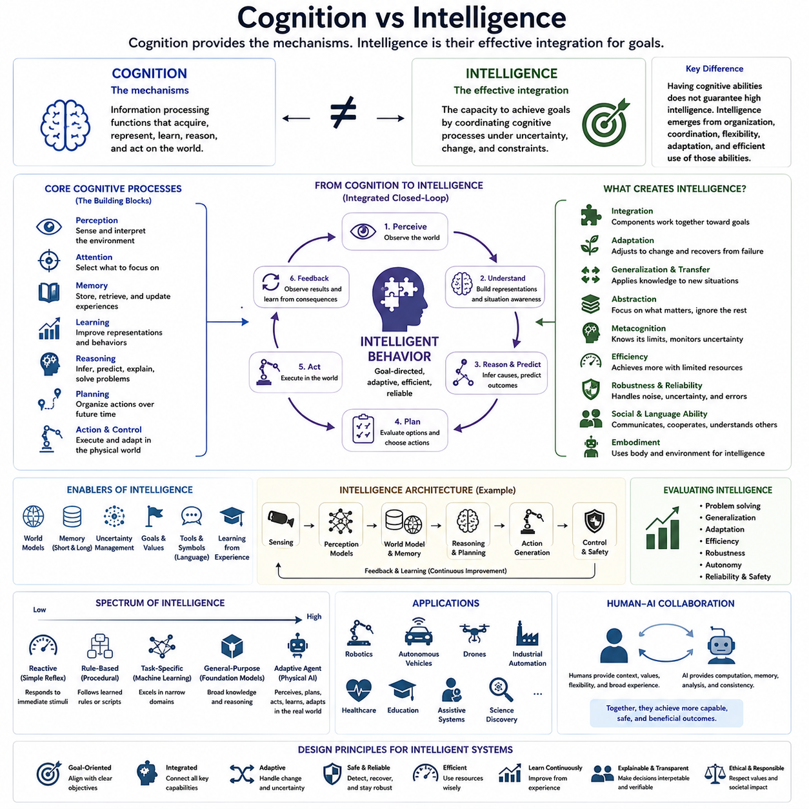{width="7.268055555555556in" height="7.268055555555556in"}

Cognition refers to the collection of processes through which an agent acquires information, represents the world, remembers experience, directs attention, learns patterns, reasons about situations, makes decisions, and controls action. Intelligence is a broader functional capacity describing how effectively these cognitive processes are coordinated to achieve goals, solve problems, adapt to change, and operate successfully under uncertainty.

The distinction is important because possessing cognitive mechanisms does not automatically imply high intelligence. A system may perceive objects, store memories, or follow learned rules while remaining unable to integrate these abilities effectively when circumstances change. Intelligence emerges from the organization, coordination, flexibility, and adaptive use of cognitive capabilities rather than from the mere presence of individual cognitive functions.

Cognition can therefore be viewed as the machinery of information processing, while intelligence describes the quality and effectiveness of its integrated operation. Perception, attention, memory, learning, reasoning, planning, and action provide functional components. Intelligence depends on whether these components cooperate to produce behavior that remains useful across different tasks, environments, constraints, and levels of uncertainty.

Perception is a cognitive process that transforms sensory signals into representations useful for understanding the environment. Intelligence determines how effectively those representations are connected with goals, memory, prediction, and action. Recognizing an obstacle is cognitive processing, but understanding whether it should be avoided, moved, ignored, investigated, or used as part of a task requires broader intelligent integration.

Attention provides another example of the distinction. Cognitive systems can selectively allocate processing resources toward particular signals, objects, or tasks. Intelligent behavior requires deciding what deserves attention according to goals, uncertainty, risk, novelty, and expected value. Effective intelligence therefore involves not merely attending, but allocating limited cognitive resources strategically as circumstances change.

Memory allows past information and experience to influence current processing. However, intelligence requires more than storing large quantities of information. An intelligent system must retrieve relevant knowledge at the appropriate moment, distinguish useful memories from irrelevant ones, combine previous experience with current observations, and revise stored knowledge when new evidence contradicts earlier assumptions.

Learning is a fundamental cognitive capability through which behavior or internal representations change with experience. Intelligence depends on the efficiency, generality, and stability of this adaptation. A system that learns one narrow task through enormous amounts of data may possess learning capability, but a more intelligent system should transfer knowledge, adapt from limited evidence, and preserve useful previous abilities.

Reasoning transforms representations into conclusions, explanations, predictions, or decisions. Cognitive mechanisms may perform logical, probabilistic, causal, spatial, analogical, or heuristic reasoning. Intelligence is reflected in the ability to select appropriate reasoning strategies, recognize when assumptions are uncertain, combine multiple forms of evidence, and revise conclusions when the environment produces unexpected results.

Problem solving demonstrates how cognition becomes integrated intelligence. Solving a novel problem may require perceiving relevant features, retrieving prior knowledge, constructing a mental model, generating alternatives, predicting consequences, selecting actions, observing results, and correcting errors. Intelligence is expressed through the coordinated execution of this complete cycle rather than through any single stage alone.

Planning extends cognition across future time. A cognitive system can represent goals and possible actions, while intelligent planning requires evaluating dependencies, constraints, uncertainty, resources, risks, and future consequences. More capable intelligence can reason over longer horizons while preserving flexibility, revising plans when assumptions change instead of rigidly following previously selected sequences.

Decision making connects cognition directly with action. A system may understand several alternatives but still perform poorly if it cannot select actions appropriately. Intelligence therefore includes the ability to balance objectives, costs, rewards, safety, uncertainty, and available resources. The quality of decisions becomes one observable expression of how effectively underlying cognitive processes are integrated.

Adaptation is one of the strongest characteristics distinguishing intelligence from fixed information processing. A calculator performs sophisticated computation but does not normally reorganize its behavior when environmental conditions change. An intelligent agent should detect when existing strategies become ineffective, identify the source of failure, modify its internal representations or policies, and improve future behavior.

Generalization is similarly important. Cognition can support recognition or behavior within familiar conditions, while intelligence requires extending learned structure beyond exact previous examples. An agent demonstrates stronger intelligence when it identifies deeper relationships that remain useful across new objects, environments, tasks, or combinations rather than memorizing superficial patterns.

Transfer learning illustrates this principle computationally. Knowledge developed for one problem can accelerate learning or improve performance in another related problem. Effective transfer indicates that internal representations capture reusable structure. Intelligence therefore depends partly on whether knowledge is organized in forms that support recombination and adaptation rather than remaining isolated within individual tasks.

Abstraction enables cognitive systems to ignore unnecessary details and reason about general structure. A robot can represent a specific chair through pixels and geometry, but higher-level cognition may represent it as furniture, an obstacle, a support surface, or an object with particular affordances. Intelligence requires selecting the abstraction level appropriate to the current goal.

Hierarchical representation allows intelligence to operate across multiple levels of abstraction. High-level cognition can reason about missions, goals, and strategies, while lower levels manage tasks, trajectories, motor commands, and sensor feedback. Intelligence depends on coordinating these levels so that abstract intentions can become executable actions and physical outcomes can update higher-level reasoning.

Cognitive flexibility describes the ability to change representations, strategies, or goals when circumstances require it. A system may be highly optimized for one procedure but perform poorly when the situation falls outside expected conditions. Intelligence requires recognizing such mismatch and shifting from routine processing toward exploration, diagnosis, learning, or alternative strategies.

Metacognition extends cognition by allowing an agent to reason about its own cognitive processes. Humans can sometimes estimate whether they understand a problem, whether a memory is uncertain, or whether additional information is required. Artificial systems can implement analogous functions through confidence estimation, uncertainty monitoring, self-evaluation, verification, and resource management.

Metacognitive capability contributes strongly to reliable intelligence because intelligent behavior requires knowing when not to trust an internal conclusion. A system that produces accurate answers most of the time but cannot recognize unfamiliar conditions may fail dangerously. Monitoring uncertainty allows an agent to gather additional evidence, request assistance, choose safer actions, or postpone decisions.

Intelligence therefore includes effective management of uncertainty. Real environments rarely provide complete information, and observations may be noisy, delayed, contradictory, or ambiguous. Cognitive processes generate interpretations from available evidence, while intelligent systems maintain alternative hypotheses, estimate confidence, seek information actively, and adjust behavior according to the consequences of being wrong.

Creativity can also be understood as an advanced integration of cognitive mechanisms. Memory supplies previous concepts, abstraction identifies transferable structure, imagination generates combinations, reasoning evaluates possibilities, and learning preserves useful discoveries. Intelligence appears when these processes generate solutions that are both novel and appropriate rather than merely producing random variation.

Social cognition introduces another dimension. Humans represent the intentions, beliefs, knowledge, emotions, and expected behavior of other people. Intelligence in social environments requires using these representations to communicate, cooperate, negotiate, teach, coordinate, or compete. The ability to model other agents extends cognition beyond understanding physical objects toward understanding interactive minds.

Language provides a powerful cognitive medium for representing and communicating abstract relationships. It supports reasoning about events that are distant, hypothetical, invisible, or impossible to experience directly. Linguistic capability contributes to intelligence when language becomes connected with memory, perception, reasoning, planning, social understanding, and action rather than operating only as isolated symbol manipulation.

Embodied cognition emphasizes that cognition is not necessarily separated from the body and environment. Perception and action continuously influence each other, and physical interaction can simplify reasoning. Humans often solve problems by moving objects, changing viewpoints, writing notes, or manipulating external structures rather than performing every computation internally.

From this perspective, intelligence can emerge partly from effective interaction between brain, body, and environment. A robot does not need a perfect internal representation of every physical detail if sensing and feedback allow continuous correction. Intelligent behavior can therefore combine internal models with active perception, environmental structure, physical compliance, and closed-loop control.

Cognitive efficiency is another important dimension of intelligence. Two systems may solve the same problem, but one may require dramatically more computation, memory, data, energy, or time. Intelligence is often associated with achieving useful performance under limited resources. Efficient representation, selective attention, abstraction, reuse of knowledge, and hierarchical processing contribute to this efficiency.

Human intelligence operates under severe biological limitations. Working memory is limited, sensory processing is selective, reasoning can be biased, and learning requires time. Yet humans achieve flexible behavior through mechanisms such as chunking, external memory, abstraction, language, social learning, tool use, and cultural knowledge. Intelligence therefore cannot be understood simply as unlimited computational capacity.

Expertise demonstrates how cognitive organization can improve apparent intelligence within a domain. Experts recognize meaningful patterns, retrieve appropriate knowledge rapidly, predict likely outcomes, and ignore irrelevant details. Their advantage often comes from better structured representations and more efficient cognitive processing rather than from fundamentally larger working-memory capacity.

Intelligence is nevertheless broader than expertise. An expert can perform exceptionally within a familiar domain while struggling in unrelated situations. General intelligence requires the ability to acquire new competencies, transfer concepts, reason across domains, adapt strategies, and operate when established knowledge is incomplete. Breadth and adaptability therefore complement depth of expertise.

Cognition and intelligence also differ in how they are evaluated. Individual cognitive functions can be measured through perception accuracy, memory capacity, reaction time, learning rate, or reasoning performance. Intelligence requires broader evaluation across problem solving, generalization, adaptation, planning, transfer, efficiency, robustness, autonomy, and the ability to combine capabilities across changing conditions.

Traditional intelligence tests attempt to measure common factors underlying performance across multiple cognitive tasks. However, intelligence in real environments includes dimensions difficult to capture through isolated tests, such as practical adaptation, social interaction, long-term planning, physical competence, creativity, uncertainty management, and the ability to recover from unexpected failure.

Artificial intelligence makes the cognition-intelligence distinction particularly important. A machine can possess highly capable modules for vision, language, planning, or control without functioning as a generally intelligent agent. Intelligence requires these components to share relevant representations, coordinate goals, maintain persistent state, learn from outcomes, and adapt their operation across time.

Classical AI often represented cognition through explicit symbols, rules, search procedures, and knowledge structures. Such systems could demonstrate strong reasoning within carefully defined domains but frequently lacked robust perception and adaptation. Their limitations showed that sophisticated reasoning alone is insufficient when intelligence must operate in complex, uncertain, continuously changing environments.

Machine learning shifted emphasis toward cognition acquired from data. Neural networks learned representations for perception, prediction, language, and control without requiring every rule to be programmed manually. This greatly expanded artificial cognitive capability, but specialized learned models can still remain narrow if they cannot transfer knowledge, reason about unfamiliar conditions, or coordinate with broader goals.

Deep learning demonstrates that powerful cognitive functions can emerge from distributed representations. Vision systems classify objects, speech systems recognize language, and control policies map observations to actions. Yet high performance on a benchmark does not necessarily indicate broad intelligence. A system may succeed statistically while lacking causal understanding, persistent memory, planning, or robust adaptation.

Foundation models broaden artificial cognition by learning reusable representations from large and diverse datasets. A single model may support language understanding, visual interpretation, reasoning, generation, or multimodal interaction across many tasks. This represents a major movement from task-specific cognition toward more general capabilities, although broad competence still differs from fully integrated intelligence.

Large language models provide a clear example. They can summarize, translate, reason, generate plans, explain concepts, and interact through language. These abilities reflect extensive learned cognitive structure. However, reliable autonomous intelligence additionally requires persistent goals, grounded perception, long-term memory, environmental feedback, uncertainty handling, action execution, and mechanisms for learning from consequences.

Multimodal foundation models extend cognition by connecting language with images, audio, video, sensor data, and other modalities. This improves the ability to construct richer representations of situations. Intelligence increases further when multimodal perception is connected to prediction and action, allowing an agent not only to describe what it observes but also to decide what should happen next.

Agentic AI adds goal-directed operation to foundation-model capabilities. An agent can maintain objectives, select tools, execute actions, inspect results, and continue across multiple steps. This begins to transform passive cognitive capability into active intelligence because the system becomes responsible for managing a perception-reasoning-action loop rather than generating isolated responses.

Memory is essential for this transition. Without persistent memory, an agent may repeatedly reconstruct context and fail to accumulate useful experience across long tasks. Structured memory allows goals, decisions, observations, failures, preferences, environmental states, and learned procedures to persist. Intelligence requires retrieving and updating this information selectively rather than storing everything without organization.

World models provide another important bridge from cognition toward intelligence. They represent how relevant aspects of an environment change over time, often conditioned on actions. By predicting possible future states, an agent can mentally or computationally simulate consequences before acting. This enables planning, counterfactual reasoning, risk assessment, and more efficient learning.

A world model alone is not intelligence. It provides predictive cognitive structure, but an intelligent system must determine which futures matter, evaluate them according to goals, select actions, observe real outcomes, and revise the model when predictions fail. Intelligence therefore emerges from the closed-loop integration of world modeling with perception, planning, action, learning, and feedback.

Reinforcement learning contributes another component by connecting actions with consequences and objectives. An agent learns policies that improve expected outcomes through interaction. When combined with world models, reinforcement learning can evaluate imagined trajectories as well as direct experience. This creates a computational framework for adaptive decision making but still requires reliable representations and safety constraints.

Physical AI makes the difference between cognition and intelligence especially visible. A robot may recognize objects and understand instructions yet remain unable to complete a physical task reliably. Intelligent physical behavior requires localization, geometry, dynamics, affordances, motion planning, control, uncertainty handling, safety, and continuous feedback to operate together.

Embodied intelligence therefore depends on grounding abstract cognition in physical reality. The concept "cup" is insufficient for manipulation unless the system can estimate where the cup is, whether it can be reached, how it can be grasped, how much force is appropriate, what obstacles exist, and whether the observed motion matches the predicted result.

Perception foundation models can provide rich semantic understanding, while action foundation models can supply reusable behavior patterns. Neither alone constitutes complete robotic intelligence. A broader architecture must connect perception, world state, memory, world models, task reasoning, action generation, low-level control, and safety monitoring within a continuous closed-loop system.

Intelligence in robotics also requires temporal integration. Decisions cannot be based only on isolated sensor frames because actions unfold over time and modify future observations. The robot must maintain state, track moving entities, estimate dynamics, remember previous interactions, predict future conditions, and revise plans continuously as the physical world changes.

Real-time constraints distinguish embodied intelligence from many offline cognitive tasks. A theoretically excellent plan is useless if it is generated after the robot must already have acted. Intelligence therefore includes matching computational complexity to available time. Fast reactive mechanisms, medium-horizon prediction, and slower strategic reasoning may need to operate simultaneously at different levels.

Edge computing makes this resource problem explicit. Robots have finite GPU performance, memory, battery capacity, communication bandwidth, and thermal limits. Intelligent architectures should allocate computation according to current needs rather than running every model at maximum complexity continuously. Resource-aware intelligence becomes essential when cognition must operate inside a physical machine.

On-premise or cloud computing can extend cognitive capability by providing larger models, fleet-level learning, long-term analysis, or computationally expensive optimization. However, network latency and availability prevent remote computation from replacing all onboard intelligence. Practical Physical AI therefore benefits from hierarchical intelligence distributed across real-time edge systems and more powerful external infrastructure.

Multi-agent systems extend intelligence from individual cognition toward collective coordination. Each robot may maintain local perception and goals while sharing maps, tasks, observations, or learned information with others. Collective intelligence emerges when agents coordinate efficiently, avoid duplicated effort, resolve conflicting plans, and use distributed information to improve group performance.

Human-AI collaboration introduces another form of distributed intelligence. Humans contribute contextual understanding, values, flexible judgment, and broad experience, while machines provide computation, memory, monitoring, and large-scale pattern processing. Effective collaboration requires both sides to maintain sufficiently aligned models of goals, responsibilities, uncertainty, and system state.

Reliability is essential when evaluating intelligence because capability without dependable behavior may have limited practical value. An intelligent system should recognize uncertainty, detect failures, preserve safe operation, recover from errors, and request assistance when necessary. Knowing the limits of a cognitive capability is often as important as maximizing its nominal performance.

Robustness describes the ability to maintain useful performance when conditions vary. Cognitive systems trained under narrow distributions may fail when lighting, terrain, language, objects, or user behavior changes. More capable intelligence should identify distribution shifts, adapt representations, use alternative strategies, and avoid confidently applying assumptions that no longer match reality.

Autonomy is related to intelligence but should not be treated as identical to it. A simple thermostat can operate autonomously with minimal intelligence, while a powerful reasoning system may remain under human control. Higher autonomy increases the range of decisions delegated to the system, whereas intelligence determines how competently those decisions can be made.

Agency adds persistent goal-directed behavior. An agent selects actions that influence the environment and evaluates progress toward objectives. Intelligent agency requires maintaining goals over time, resolving conflicts, adapting plans, managing resources, learning from outcomes, and distinguishing between actions that are possible, desirable, safe, and necessary.

Consciousness should also be distinguished from cognition and intelligence. Cognitive processing and intelligent behavior do not automatically establish subjective awareness. Humans combine cognition, intelligence, and conscious experience, but engineering systems can perform sophisticated perception, reasoning, learning, and planning without demonstrating that they possess human-like subjective experience.

This distinction prevents unnecessary confusion in discussions of advanced AI. Increasing model size, reasoning performance, autonomy, or multimodal capability can improve functional intelligence without answering philosophical questions about consciousness. Engineering evaluation should therefore focus on observable capabilities, limitations, reliability, adaptation, and consequences unless subjective experience is specifically under investigation.

A useful architectural perspective is to view cognition as a collection of interacting functional layers. Perception constructs representations, attention allocates resources, memory preserves information, learning modifies models, reasoning transforms knowledge, prediction estimates futures, planning organizes actions, and control executes behavior. Intelligence describes how effectively the entire architecture achieves goals across changing conditions.

Under this perspective, intelligence is not located in one neural network, algorithm, or module. It is a system-level property emerging from coordination among components. A highly capable perception model cannot compensate completely for poor planning, and sophisticated reasoning cannot produce reliable physical behavior if sensing, control, memory, or safety mechanisms are inadequate.

The same principle explains why increasing model scale alone may not produce proportional increases in practical intelligence. Larger models can improve representation and reasoning, but complete agents still require memory architectures, tool use, world models, feedback loops, planning mechanisms, safety constraints, and interfaces with physical or digital environments.

Future AI systems are therefore likely to become increasingly modular and hierarchical even when foundation models provide broad shared representations. Specialized perception, prediction, planning, control, verification, and memory mechanisms can operate around general models. Intelligence will depend on orchestration among these components as much as on the capability of the largest model.

Cognitive science provides useful guidance because biological intelligence demonstrates how multiple imperfect mechanisms can cooperate effectively. Human perception is incomplete, memory is fallible, reasoning is biased, and attention is limited, yet humans compensate through learning, external tools, communication, social cooperation, abstraction, prediction, and adaptive control.

Artificial intelligence does not need to reproduce human cognition exactly. Machines can use high-dimensional memory, precise computation, large databases, simulation, distributed processing, and sensor modalities unavailable to humans. However, principles such as selective attention, hierarchical organization, prediction, feedback, uncertainty management, and adaptation remain valuable for constructing effective intelligence.

The distinction between cognition and intelligence ultimately shifts attention from individual capabilities toward integration. Cognition provides mechanisms for knowing, representing, learning, reasoning, and acting. Intelligence describes the ability to organize those mechanisms into coherent, adaptive, efficient, and goal-directed behavior across situations that cannot all be anticipated in advance.

For Physical AI, this distinction becomes a practical architecture principle. Perception models, language models, world models, memory systems, planners, controllers, and safety modules provide cognitive capabilities. Intelligence emerges when these components share state, predict consequences, coordinate decisions, learn from physical feedback, manage limited resources, and maintain reliable behavior in changing environments.

The long-term objective is therefore not simply to build machines with more cognitive functions, but to construct systems capable of integrating those functions across perception, prediction, reasoning, learning, planning, and action. As integration improves, artificial systems can progress from specialized cognitive tools toward adaptive agents capable of increasingly general, reliable, and physically grounded intelligence.

## 01.08 Implications for AI [w/Code]

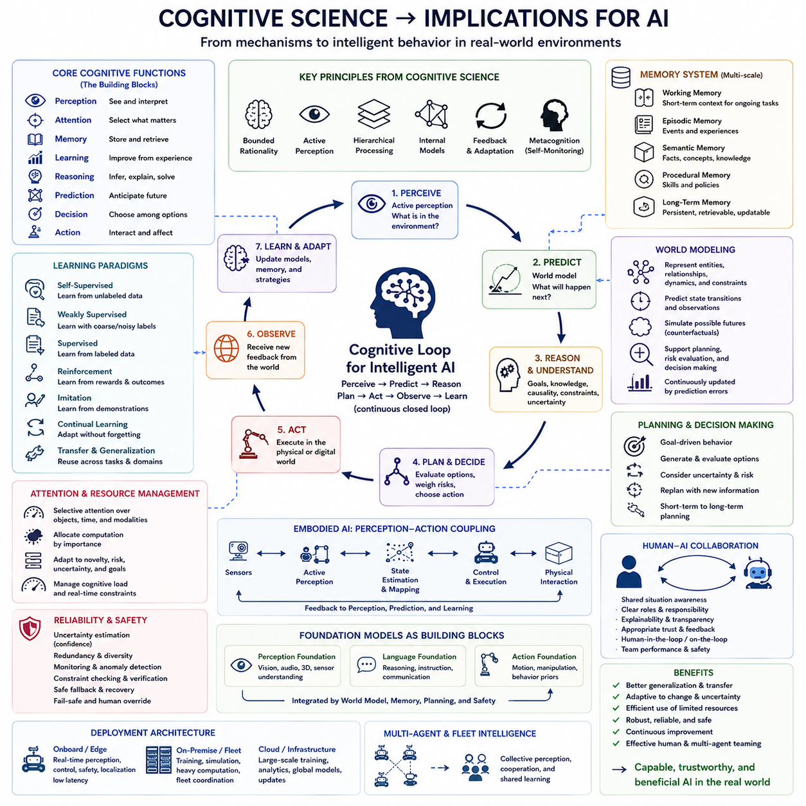{width="7.268055555555556in" height="7.268055555555556in"}

Cognitive science has major implications for artificial intelligence because it provides models of how intelligent agents perceive, attend, remember, learn, reason, predict, decide, and act under limited resources. Rather than treating intelligence as a single algorithm, cognitive science suggests that capable AI emerges from the coordinated interaction of multiple functions operating continuously within an environment.

One important implication is that perception should not be treated as passive recognition. Biological cognition actively selects information according to goals, expectations, uncertainty, and possible actions. AI systems similarly benefit when perception is connected with task context, memory, prediction, and action, allowing the system to determine not only what exists in the environment but also what information currently matters.

Attention provides a mechanism for managing limited computational resources. Real environments contain more information than any practical system can process at maximum resolution simultaneously. AI architectures can therefore use selective attention to prioritize relevant objects, spatial regions, sensor streams, memories, or reasoning steps according to goals, uncertainty, novelty, risk, and expected information value.

This principle is especially important for embodied and real-time AI. A robot processing multiple cameras, LiDAR, radar, audio, proprioception, and other sensor streams cannot always allocate equal computation to every signal. Adaptive attention allows processing capacity to move toward pedestrians, obstacles, manipulation targets, unusual events, or uncertain regions while reducing unnecessary computation elsewhere.

Memory is another central implication. Intelligent behavior requires more than processing the current input because present situations are often understandable only in relation to previous observations and actions. AI systems therefore need mechanisms for short-term context, episodic experience, semantic knowledge, procedural skills, and long-term information that can be retrieved and updated according to current goals.

Working memory provides a useful model for maintaining information required during an ongoing task. An artificial agent may need to remember temporary goals, intermediate reasoning results, recently observed objects, unresolved uncertainties, or steps already completed. Without such state, complex behavior can fragment into disconnected reactions even when individual perception and reasoning modules are highly capable.

Long-term memory enables knowledge accumulation across tasks and operating periods. Instead of repeatedly solving equivalent problems from the beginning, an AI system can preserve useful representations, successful strategies, environmental knowledge, and previous failures. Effective memory architecture must also support retrieval, consolidation, updating, forgetting, and conflict resolution rather than simply storing unlimited data.

Learning from experience is a fundamental requirement for adaptive AI. Cognitive science shows that learning occurs through multiple mechanisms, including association, prediction, reinforcement, imitation, abstraction, and interaction. Artificial systems can similarly combine supervised learning, weakly supervised learning, self-supervised learning, reinforcement learning, imitation learning, and continual learning according to available data and operational objectives.

Self-supervised learning is particularly important because intelligent agents encounter enormous amounts of unlabeled experience. Images, video, audio, robot trajectories, sensor sequences, and interaction histories contain structural information even when explicit labels are unavailable. Predicting missing information, future states, relationships, or transformations allows useful representations to emerge from the data itself.

Weakly supervised learning provides another practical strategy when precise annotation is expensive. Coarse labels, incomplete annotations, automatically generated descriptions, event metadata, task outcomes, or noisy human feedback can guide representation learning without requiring exhaustive manual labeling. This is especially valuable for robotics, where large-scale physical interaction data is difficult and expensive to annotate precisely.

Continual learning follows naturally from cognitive adaptation. Real intelligent systems cannot assume that training ends permanently before deployment. Environments, users, tasks, hardware, policies, and operating conditions change over time. AI therefore requires mechanisms that incorporate new knowledge while protecting important previous capabilities from catastrophic forgetting.

Transfer and generalization are essential because intelligence cannot depend on collecting a new dataset for every possible situation. Cognitive systems reuse concepts and strategies across related problems. Artificial intelligence should similarly learn representations that capture reusable structure, allowing knowledge acquired from one environment, robot platform, object category, or task to accelerate adaptation to another.

Abstraction provides the foundation for such transfer. Raw sensory data contains enormous detail, but intelligent decisions often depend on higher-level structure such as objects, relationships, affordances, intentions, constraints, and causal dependencies. AI architectures should therefore construct representations at multiple levels, moving from sensor features toward semantic, relational, task-oriented, and predictive world representations.

Hierarchical cognition suggests hierarchical AI architectures. Low-level processes can manage rapid sensor interpretation and motor control, intermediate processes can represent objects and local tasks, and higher levels can manage goals, strategies, long-term planning, and reasoning. Different levels may operate at different frequencies, allowing rapid reaction and slower deliberation to coexist within the same intelligent system.

This is particularly relevant for Physical AI, where millisecond-level control cannot wait for computationally expensive high-level reasoning. Fast control loops can stabilize motion and respond to immediate hazards, while medium-level systems perform localization, perception, and trajectory planning. Slower cognitive layers can reason about missions, future scenarios, task priorities, and long-term adaptation.

Mental models suggest that AI systems require internal representations of how their environments behave. Recognizing the current state is insufficient when actions have future consequences. An intelligent agent should represent entities, relationships, dynamics, constraints, and possible transitions so that it can anticipate how the world may change before committing to an action.

World models provide a computational implementation of this principle. A world model estimates how relevant environmental states evolve through time and how actions influence those transitions. By predicting possible futures, an AI agent can compare alternative actions, evaluate risks, simulate outcomes, and choose behavior using predicted consequences rather than relying entirely on reactive mappings.

For robotics, world models can integrate information from cameras, LiDAR, radar, IMU, GNSS, joint states, force sensors, maps, and previous actions into a temporally coherent representation. The objective is not necessarily to reconstruct every physical detail, but to preserve the information required for prediction, planning, control, interaction, and safety.

Prediction is therefore a central component of intelligent cognition. Humans constantly anticipate motion, consequences, intentions, and environmental changes. AI systems can similarly predict future observations, object trajectories, occupancy, agent behavior, task outcomes, or latent states. Prediction converts perception from a description of the present into a basis for reasoning about possible futures.

Prediction errors can also become learning signals. When the observed future differs from the predicted future, the discrepancy indicates that some part of the internal representation, dynamics model, or assumption is incomplete. Continuous comparison between prediction and observation can therefore support adaptation and improve the world model during long-term operation.

Causal reasoning extends prediction beyond statistical correlation. An intelligent system should ideally distinguish events that merely occur together from relationships in which actions or conditions actually influence outcomes. Causal representations can improve intervention planning, transfer across environments, explanation, and robustness when superficial statistical patterns change.

Counterfactual reasoning further expands intelligent decision making. An agent can ask what might happen if a different action were selected or if some condition changed. Combined with a world model, counterfactual simulation allows multiple candidate futures to be evaluated without physically executing every possibility, improving planning efficiency and reducing unnecessary risk.

Planning becomes more powerful when prediction, memory, goals, and uncertainty are integrated. Rather than generating a fixed action sequence, an intelligent planner can maintain alternatives, evaluate predicted consequences, monitor execution, and revise its plan when observations differ from expectations. Planning therefore becomes a continuous closed-loop cognitive process rather than a one-time computation.

Cognitive science also emphasizes bounded rationality. Intelligent agents operate with limited time, information, memory, and computational resources, so perfectly optimal decisions are often impossible. Practical AI should therefore seek sufficiently good decisions within available constraints rather than assuming unlimited computation. This principle is especially important for real-time autonomous systems.

Resource-aware intelligence can dynamically allocate computation according to task importance. A routine situation may require only lightweight perception and control, while an unusual or high-risk event may justify activating larger models, additional sensors, longer reasoning, or external computational resources. Such adaptive computation can improve both efficiency and reliability.

Cognitive load has direct implications for AI architecture. If too many tasks compete for the same computational resources, latency can increase and critical functions may be delayed. Intelligent systems therefore need scheduling, prioritization, memory management, model selection, and graceful degradation mechanisms that preserve essential capabilities when computational demand exceeds available capacity.

Human error research provides another important lesson. Intelligent systems should not be designed under the assumption that individual components will always be correct. Sensors fail, models misclassify, memories become inconsistent, predictions become inaccurate, and planners can choose inappropriate actions. Reliability must therefore emerge from architecture-level detection, containment, verification, and recovery.

Redundancy can reduce dependence on individual components. Multiple sensors, models, algorithms, or reasoning pathways can provide independent evidence about important states. However, effective redundancy requires diversity because identical components trained on similar data may fail in similar ways. Reliability improves when complementary information sources expose different failure modes.

Uncertainty estimation is essential for managing such failures. An AI system should distinguish between outputs supported by strong evidence and outputs produced under unfamiliar or ambiguous conditions. Confidence estimates can influence whether the system acts immediately, gathers more information, activates additional models, reduces speed, requests human assistance, or enters a safe operating mode.

Metacognition suggests that advanced AI should monitor its own reasoning and performance. Artificial metacognitive mechanisms can evaluate confidence, detect contradictions, estimate whether additional information is needed, compare alternative reasoning paths, and verify outputs before high-consequence actions. Intelligence therefore includes mechanisms for evaluating cognition rather than merely executing it.

This leads naturally to self-monitoring architectures. An autonomous system can compare predicted and observed states, track performance metrics, detect distribution shifts, identify abnormal sensor behavior, and estimate whether its current policy remains valid. Such monitoring provides a foundation for graceful degradation and safe adaptation when normal assumptions fail.

Error recovery should be considered a primary capability rather than an exceptional procedure. Real-world AI will inevitably encounter unexpected objects, unusual terrain, sensor degradation, communication loss, incorrect predictions, and incomplete instructions. Systems should therefore preserve safe states, maintain recovery options, and learn how to return from errors instead of assuming flawless execution.

Resilience extends this concept by emphasizing continued operation under disruption. A resilient AI system can detect changing conditions, reorganize resources, switch strategies, reduce functionality when necessary, and restore capabilities after failure. For Physical AI, resilience may involve changing sensors, reducing speed, replanning routes, switching controllers, or transferring selected tasks to another robot or human operator.

Human-AI interaction is strongly influenced by cognitive science. Users construct mental models of AI systems based on observed behavior, explanations, interfaces, and previous experience. If system behavior is unpredictable or hidden, users may develop incorrect expectations. Transparent state information and consistent interaction therefore help humans understand what the AI knows, intends, and cannot reliably determine.

Trust should be calibrated rather than maximized. Excessive trust can lead users to accept incorrect recommendations, while insufficient trust prevents useful automation from being used effectively. AI systems should communicate confidence, limitations, uncertainty, and reasons for important decisions in ways that support appropriate reliance rather than creating an artificial impression of certainty.

Explainability is most useful when it supports human cognition. Explanations should reveal information relevant to decisions, such as evidence, constraints, uncertainty, alternatives, or expected consequences. Extremely detailed explanations can increase cognitive load, while oversimplified explanations can hide important limitations. Effective explanation therefore depends on the user\'s task and information needs.

Human attention should also be treated as a limited resource. Autonomous systems that continuously produce low-value alerts can overwhelm operators and make important events harder to detect. Intelligent alerting should prioritize urgency, uncertainty, consequence, and required intervention, allowing human attention to be concentrated where it provides the greatest benefit.

Shared situation awareness becomes important when humans and AI cooperate. Both sides should maintain compatible representations of goals, system state, responsibilities, constraints, and expected next actions. When these representations diverge, humans may expect the AI to act while the AI waits for human input, or both may perform conflicting actions.

Human-AI teaming therefore requires explicit responsibility allocation. Some functions are well suited to machine computation, monitoring, memory, and pattern recognition, while humans remain valuable for contextual judgment, ethical interpretation, unusual situations, and goal revision. Responsibilities may also change dynamically depending on confidence, workload, environmental complexity, and system condition.

Embodied cognition has profound implications for robotics. Intelligence does not need to exist entirely inside an abstract reasoning module because physical interaction itself can provide information. A robot can move a camera to resolve ambiguity, touch an object to estimate its properties, reposition itself to improve geometry, or manipulate the environment to simplify a task.

This principle motivates active perception. Instead of passively accepting available observations, an intelligent robot chooses actions that improve future sensing. It may move toward an uncertain region, change viewpoint, illuminate an object, reposition a manipulator, or request another sensor measurement. Perception and action therefore become mutually dependent components of cognition.

Affordances provide another useful concept. Objects are not represented only by appearance but also by possible interactions. A handle affords pulling, a flat surface may afford placement, and an opening may afford passage if the robot\'s geometry permits it. Representing affordances connects semantic perception directly with planning and physical action.

Sensorimotor learning similarly connects perception with control. Rather than learning visual representations independently from behavior, an agent can learn how observations change as a consequence of its own actions. This creates representations grounded in interaction and may improve the ability to predict controllable aspects of the environment.

Foundation models can benefit from these cognitive principles. Perception foundation models can provide broad semantic representations, language foundation models can support reasoning and communication, and action foundation models can encode reusable behavior. Their greatest value emerges when they become components of a larger architecture rather than isolated universal solutions.

A perception foundation model can identify objects, scenes, relationships, and semantic concepts, but task-specific adaptation remains necessary. Fine-tuning, adapters, prompt conditioning, or task-specific heads can connect broad pretrained representations to particular sensors, environments, robots, and operational requirements while avoiding the cost of training every capability from the beginning.

Action foundation models can similarly provide general motion or manipulation priors learned across large collections of robot experience. A new robot may adapt these representations to its morphology, actuator limits, payload, sensors, and task requirements. This can reduce the amount of platform-specific training needed while preserving reusable behavioral knowledge.

However, foundation models should not replace deterministic safety mechanisms where physical consequences are severe. Learned models can generate candidate interpretations, predictions, plans, or actions, while independent constraints verify collision risk, joint limits, stability, speed, force, reachable space, and other safety conditions before execution.

World models can connect perception and action foundation models. Perception models provide semantic and geometric state information, the world model predicts how that state may evolve, and action models generate candidate behaviors. A planner can then evaluate predicted consequences and select actions while safety mechanisms enforce physical and operational constraints.

This architecture creates a continuous loop from sensing to representation, prediction, reasoning, planning, action, observation, and learning. Each action changes the environment and produces new sensory evidence. The new evidence updates the world state and tests previous predictions, allowing the system to continuously correct itself rather than relying on a static sequence of decisions.

Reinforcement learning can operate within this loop by associating actions and predicted futures with long-term objectives. Model-based reinforcement learning can use world-model simulations to evaluate many trajectories without executing all of them physically. This improves data efficiency and can reduce the cost and risk associated with learning directly through real-world trial and error.

Imitation learning can provide an efficient initial behavioral prior. Human demonstrations contain information about perception, task decomposition, movement, correction, and strategy. AI systems can learn from these demonstrations and later improve through self-supervised learning, reinforcement learning, simulation, or real-world experience rather than beginning entirely from random exploration.

Simulation is especially valuable for Physical AI because physical data collection is expensive and potentially dangerous. Large numbers of scenarios can be generated to train perception, prediction, planning, and control. However, simulation cannot perfectly reproduce reality, making domain randomization, real-world fine-tuning, adaptation, and continuous validation necessary.

Cognitive development suggests another useful direction for AI. Humans do not begin with expert-level competence but gradually acquire increasingly complex abilities through interaction. Artificial agents may similarly benefit from curricula in which basic perception and control are learned first, followed by object interaction, task composition, planning, social coordination, and increasingly autonomous behavior.

Curriculum learning can reduce the difficulty of complex tasks by organizing experience according to increasing complexity. Earlier capabilities become foundations for later learning. In robotics, navigation, localization, obstacle avoidance, manipulation, semantic reasoning, and mission planning can be progressively integrated rather than trained as one enormous problem from the beginning.

Development also highlights the importance of exploration. An intelligent agent should sometimes gather information even when no immediate reward is available. Curiosity, novelty detection, information gain, and uncertainty reduction can provide intrinsic objectives that encourage the system to discover useful structure before it becomes necessary for a specific task.

Social learning can further accelerate artificial intelligence. Robots and AI agents do not need to learn everything independently if they can learn from humans or other agents. Demonstrations, corrections, language instructions, shared maps, fleet experience, and transferred models can distribute knowledge across a population and dramatically reduce repeated learning.

Fleet learning is particularly important for robotics. Individual robots can collect local experience while centralized or on-premise infrastructure aggregates data, trains improved models, evaluates failures, and distributes validated updates. This creates a cycle in which experience from many robots contributes to the improvement of each individual robot.

Such architectures naturally divide intelligence between edge and external computation. Real-time perception, safety, localization, control, and immediate planning should remain available onboard, while computationally intensive training, fleet analysis, large-scale simulation, long-term memory consolidation, and large foundation models may operate on on-premise or cloud infrastructure.

This division resembles hierarchical cognition because different computational layers operate over different timescales and responsibilities. Edge systems manage immediate interaction, on-premise systems coordinate multiple robots and provide heavier reasoning, and larger infrastructure can support long-term learning and global optimization. Intelligence becomes distributed across a computational ecosystem.

Multi-agent cognition expands this architecture further. Robots can share observations, maps, task states, predictions, and learned representations. One robot\'s experience with a hazard or environmental change can inform others before they encounter it directly. Collective intelligence therefore emerges through communication, coordination, and shared learning rather than simply increasing the capability of each robot independently.

Language can serve as an interface between cognitive modules as well as between humans and AI. Natural-language representations can describe goals, constraints, observations, plans, explanations, and failures. However, physical systems should ground language in sensor observations and executable actions so that linguistic reasoning remains connected to the actual state of the environment.

Multimodal AI is particularly important for this grounding. Language, vision, audio, geometry, motion, proprioception, and physical interaction provide complementary information. Combining them allows AI systems to build richer representations than any single modality can provide and supports reasoning that connects semantic meaning with spatial and physical constraints.

The distinction between cognition and intelligence implies that simply increasing the performance of individual AI models is insufficient. A system may have excellent vision, language, prediction, and control components but still behave poorly if information cannot move effectively between them. System architecture and orchestration therefore become central problems in advanced AI engineering.

Shared representations can reduce fragmentation between components. A common world state can provide perception, memory, prediction, planning, and control with consistent information about relevant entities, relationships, uncertainty, and goals. However, the representation should support multiple levels of abstraction because different modules require different spatial, temporal, and semantic detail.

Temporal representation is particularly important. Intelligence must connect past observations, current state, and possible futures. Short-term dynamics support immediate control, medium-horizon predictions support local planning, and long-term models support strategy and mission reasoning. Multiple temporal scales may therefore need to coexist within the same world-model architecture.

The future of AI is likely to depend increasingly on closed-loop systems rather than isolated models. A model that generates one prediction or response performs a cognitive function, while an intelligent agent must observe consequences, maintain state, update beliefs, correct errors, and continue pursuing goals. Feedback transforms static capability into adaptive behavior.

For Physical AI, this means that intelligence should be designed around repeated cycles of perception, world-state estimation, prediction, reasoning, planning, action, verification, and learning. The architecture must remain connected to physical reality at every cycle so that internal representations are continually corrected by actual sensor evidence and interaction outcomes.

Safety must be integrated into this loop rather than added only after intelligent behavior has been generated. Risk estimation, uncertainty monitoring, constraint checking, fallback behaviors, emergency stopping, and human intervention mechanisms should operate continuously. More capable cognition increases the range of possible actions, making reliable safety architecture even more important.

Ethical and social considerations also become increasingly significant as AI receives greater autonomy. Intelligent systems may make decisions affecting people, resources, access, safety, and privacy. Cognitive capability alone does not determine appropriate goals. Human values, legal constraints, organizational policies, accountability, and governance must therefore shape how intelligence is deployed.

The broader implication is that artificial intelligence should be understood as a system-level discipline. Models remain essential, but intelligence emerges from the interaction among models, memory, sensors, tools, goals, world representations, planning, feedback, learning, safety mechanisms, humans, and computational infrastructure.

Cognitive science therefore offers more than biological inspiration. It provides architectural principles for building AI systems that operate under uncertainty and limited resources: selective attention, structured memory, predictive internal models, hierarchical processing, adaptive learning, metacognition, active perception, feedback, error recovery, and coordinated perception-action loops.

These principles become increasingly important as AI moves from digital prediction toward autonomous interaction with the physical world. Physical AI must not only recognize and reason but also predict consequences, manage computational resources, understand uncertainty, act safely, recover from mistakes, learn continuously, and cooperate with humans and other machines.

The long-term implication for AI is a transition from isolated task models toward integrated cognitive architectures. Foundation models can provide broad reusable capabilities, world models can provide predictive understanding, memory can preserve experience, planners can organize future behavior, and action models can connect decisions to the environment. Their coordinated operation produces increasingly capable intelligent agents.

Ultimately, progress toward more general artificial intelligence is likely to depend less on a single universal algorithm than on the successful integration of complementary cognitive capabilities. Intelligence emerges when perception, memory, learning, prediction, reasoning, planning, action, metacognition, and safety form a continuous adaptive system that can pursue goals reliably while learning from its interaction with the world.

## 01.09 Internal Representations and Cognitive State [w/Code]

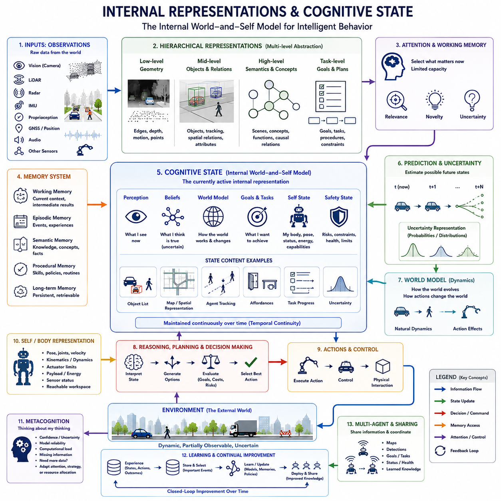{width="7.268055555555556in" height="7.268055555555556in"}

Internal representations are the information structures through which a cognitive system encodes aspects of itself, its environment, its goals, and its ongoing interaction with the world. Rather than responding directly to raw sensory inputs, an intelligent agent transforms observations into internal states that can support memory, prediction, reasoning, planning, decision making, and action across time.

A cognitive state describes the currently active configuration of information within such a system. It may include perceived objects, spatial relationships, current goals, task context, remembered events, predictions, uncertainty, attention priorities, emotional or motivational variables in biological agents, and planned actions. Cognitive state therefore represents more than sensory input at a particular instant.

The distinction between observation and internal representation is fundamental. An observation contains information directly available through sensors, while an internal representation is constructed through interpretation. A camera provides pixels, for example, but an intelligent system may represent those pixels as a person, vehicle, doorway, obstacle, manipulable object, or task-relevant entity depending on context.

Representations allow cognitive systems to operate on information that is no longer physically present. A person can reason about an object seen several minutes earlier, and a robot can continue navigating toward a destination temporarily hidden behind an obstacle. Internal state therefore provides continuity across gaps in perception and enables cognition to extend beyond immediate sensory stimulation.

Internal representations can exist at multiple levels of abstraction. Low-level representations may encode edges, textures, depth, motion, forces, or geometric features. Intermediate representations may describe objects, surfaces, trajectories, and spatial relationships. Higher-level representations can encode concepts, goals, intentions, causal relationships, task structures, and possible future situations.

This hierarchical organization is important because different cognitive operations require different forms of information. Motor control may depend on precise positions, velocities, and forces, while mission planning may require semantic concepts such as destination, priority, risk, or task completion. Intelligent systems must therefore maintain representations appropriate to several spatial, temporal, and semantic scales.

Representations may also be symbolic, distributed, continuous, discrete, or hybrid. Classical cognitive architectures often use explicit symbols and structured relationships, whereas neural networks commonly encode information as distributed numerical vectors. Modern AI increasingly combines these approaches so that continuous learned representations can interact with structured concepts, constraints, memory, and planning mechanisms.

Distributed representations are powerful because a large number of related properties can be encoded within high-dimensional patterns. Neural networks can learn representations that capture semantic similarity, geometry, temporal structure, or behavioral relevance without requiring every concept to be manually specified. Such representations support generalization by allowing similar situations to share internal structure.

Explicit representations remain useful when relationships must be interpreted, manipulated, verified, or communicated. Graphs, maps, object lists, scene structures, task states, rules, and symbolic constraints can make important information directly accessible to planning and reasoning. Hybrid cognitive architectures can therefore combine neural representations with explicit structures according to functional requirements.

The quality of an internal representation depends on whether it preserves information useful for future cognition and action. A representation does not need to reproduce every detail of the external world. Instead, it should retain the features necessary for relevant decisions, predictions, interactions, and safety while discarding unnecessary complexity that would consume computational resources.

This principle is closely related to abstraction. A robot navigating through a building may not need detailed visual textures of every wall, but it must represent free space, obstacles, doors, destinations, moving agents, and navigation constraints. For manipulation, however, detailed geometry, orientation, surface properties, and grasp affordances may become essential.

Task-dependent representation means that the same environment can be encoded differently according to the current objective. A table may be represented as an obstacle during navigation, as a support surface during object placement, or as a target structure during inspection. Cognitive state therefore reflects the interaction between environmental information and current goals rather than representing the world independently of purpose.

Attention influences which information enters and remains active within cognitive state. Because processing capacity is limited, cognitive systems cannot maintain every available detail with equal precision. Attention prioritizes representations according to relevance, novelty, uncertainty, expected value, danger, and current goals, allowing limited computational resources to focus on information that matters most.

Working memory maintains representations that are temporarily important for ongoing cognition. It can preserve intermediate reasoning results, recently observed events, temporary goals, instructions, unresolved questions, and partial plans. Without working memory, a cognitive system would repeatedly lose context and would struggle to execute tasks requiring multiple dependent steps.

Long-term memory complements working memory by preserving information beyond the current task. Semantic memory can store concepts and general knowledge, episodic memory can preserve specific experiences, and procedural memory can represent learned skills or policies. Cognitive state can retrieve relevant information from these memory systems and integrate it with current observations.

Memory retrieval is therefore an active component of state construction. The internal state of an intelligent agent is determined not only by what it currently perceives but also by what previous knowledge becomes activated. Two agents observing the same situation may construct different cognitive states because their experiences, expectations, goals, and learned representations differ.

Temporal representation is essential because intelligent behavior unfolds through time. Cognitive state should not be interpreted as an isolated snapshot but as part of a continuously evolving sequence. Previous states influence current interpretation, current actions influence future observations, and predictions connect present representations with possible future states.

State estimation provides a computational framework for maintaining this continuity. Because observations are incomplete and noisy, an agent estimates the underlying state of the environment by combining current sensor measurements with previous state estimates and models of how the world changes. This allows information to remain coherent even when individual observations are uncertain or temporarily unavailable.

Probabilistic state estimation explicitly represents uncertainty. Instead of assuming that every object position, classification, or environmental condition is known exactly, the system can maintain probability distributions, confidence values, or alternative hypotheses. This enables downstream reasoning and planning to consider both what is believed and how reliable that belief is.

Uncertainty is therefore part of cognitive state rather than merely an error associated with perception. An intelligent agent should know when an object classification is ambiguous, localization confidence is low, a prediction is unreliable, or a remembered fact may be outdated. Representing uncertainty allows behavior to change appropriately when knowledge is incomplete.

Belief state is a useful concept for environments that cannot be observed completely. A belief state represents the agent\'s current estimate of possible world states based on observations, memory, actions, and prior knowledge. Planning can then operate over these beliefs rather than assuming access to a perfectly known external state.

This is particularly important in partially observable environments. A robot may lose sight of a pedestrian behind a vehicle, but the pedestrian should not immediately disappear from its internal representation. The robot can maintain a belief about the person\'s likely position and motion until new evidence confirms, updates, or removes that hypothesis.

Prediction extends cognitive state into the future. Once an agent has an internal representation of the current situation, it can estimate how objects, agents, and environmental conditions may evolve. Predicted states allow the system to evaluate possible consequences before actions are physically executed and form an important foundation for intelligent planning.

A world model provides the dynamics that connect cognitive states across time. It describes or learns how the represented world changes naturally and how actions modify those changes. The combination of current cognitive state and world dynamics enables an agent to simulate future trajectories rather than reacting only after events have already occurred.

World models do not necessarily need to predict raw sensory data directly. For many intelligent tasks, prediction within a compact latent representation may be more efficient. A latent world model can encode task-relevant structure and predict how this representation changes, reducing the computational burden associated with generating complete high-resolution future observations.

However, latent representations introduce an important design challenge. If compression removes information that later becomes important, prediction and planning may fail even when the latent model is internally consistent. Representation learning must therefore balance compactness with preservation of information required for control, safety, generalization, and future tasks.

Predictive representations can be learned through self-supervised learning. An agent can learn useful internal structure by predicting future observations, masked information, temporal relationships, object motion, state transitions, or the effects of actions. This allows large quantities of unlabeled interaction data to contribute directly to the development of cognitive representations.

Prediction errors provide a mechanism for updating internal state and learned models. When expected observations differ from actual observations, the system receives evidence that its state estimate, dynamics model, assumptions, or predictions may be incorrect. The discrepancy can trigger state correction, model adaptation, attention shifts, or additional information gathering.

This creates a continuous cycle in which representation and prediction refine each other. Internal state generates expectations about future observations, the environment produces actual observations, and differences between expectation and reality modify the state. Cognitive representation is therefore dynamic rather than a static database describing the world.

Action must also be represented within cognitive state. An intelligent system needs information about what it is currently doing, what actions were recently executed, what actions are available, and what consequences are expected from them. Without action history, changes in observation may be difficult to distinguish between external events and effects caused by the agent itself.

Representing action enables agency and causal learning. When an agent knows which intervention it performed and observes the resulting state transition, it can learn relationships between actions and consequences. This is fundamentally different from learning only correlations between passively observed events and supports more reliable planning and control.

Goals are another essential component of cognitive state. The same perceived situation can lead to different actions depending on the objective. Representing goals allows perception, attention, memory retrieval, prediction, and planning to become task-directed rather than generic. Goals can also be hierarchical, ranging from long-term missions to immediate control objectives.

Task state describes progress within an ongoing activity. It can include completed subtasks, current procedures, remaining requirements, dependencies, constraints, and expected next steps. Maintaining task state is essential for long-horizon behavior because an agent must know not only where it is physically located but also where it is within the logical structure of the task.

Plans can themselves become internal representations. A plan may encode intended future actions, dependencies, alternative branches, checkpoints, and expected outcomes. During execution, observations can be compared with the expected plan state so that deviations are detected and replanning can occur when necessary.

Cognitive state may therefore include representations of the past, present, and future simultaneously. Memory provides information about previous states and actions, perception estimates the present, and prediction represents possible future states. Planning connects these temporal regions by selecting actions intended to transform the present toward desired future conditions.

Spatial representations are particularly important for embodied agents. Robots may maintain metric maps, topological maps, occupancy grids, voxel representations, point clouds, object-centric maps, semantic maps, or bird\'s-eye-view representations. Different forms provide different tradeoffs between geometric precision, semantic richness, computational efficiency, and planning utility.

Object-centric representations organize cognitive state around persistent entities rather than raw sensor measurements. An object can maintain identity, location, geometry, semantic category, velocity, uncertainty, properties, and interaction history across time. Such representations help reasoning systems understand that observations from different moments may refer to the same physical entity.

Scene graphs extend this idea by explicitly representing relationships among entities. Objects can be connected through spatial, semantic, functional, or causal relationships such as inside, near, supporting, blocking, attached to, moving toward, or belonging to. Graph representations provide useful structure for reasoning about complex environments containing many interacting elements.

Affordance representations describe possible interactions between an agent and entities in the environment. A surface may support placement, an object may be graspable, a doorway may permit passage, and a button may afford pressing. Affordances connect perception with action by representing not merely what something is but what can potentially be done with it.

For Physical AI, this transition from object recognition to affordance understanding is particularly important. A robot completing real tasks must reason about reachability, manipulability, traversability, support, collision, stability, and physical constraints. Cognitive state therefore needs representations that connect semantic understanding with geometry and dynamics.

Body representation is also necessary for embodied intelligence. A robot must represent its own configuration, dimensions, joint states, actuator limits, payload, velocity, energy state, sensor status, and reachable workspace. Intelligent behavior depends on understanding not only the external world but also the capabilities and limitations of the body interacting with it.

This self-representation supports capability-aware planning. A route that is traversable for one robot may be impossible for another because of width, ground clearance, turning radius, payload, traction, or energy limitations. Similarly, a manipulation action must be evaluated relative to reach, force capability, joint limits, and current configuration.

Internal representations should therefore include both world state and self-state. The interaction between them determines which actions are possible. An obstacle has meaning partly in relation to the robot\'s geometry, and an object is graspable only relative to the manipulator\'s capabilities. Intelligent state representation is inherently relational rather than purely environmental.

Multi-modal representation becomes necessary when information originates from different sensors and information sources. Vision provides appearance and semantics, LiDAR provides geometry, radar provides motion information, IMU provides inertial dynamics, GNSS provides global position, and proprioceptive sensors describe the robot\'s internal physical state.

Sensor fusion combines these modalities into representations that are more useful than isolated measurements. Fusion may occur at raw-data, feature, object, state, or decision levels. The appropriate strategy depends on synchronization, uncertainty, computational resources, sensor characteristics, and the requirements of downstream prediction and planning.

A shared world state can provide a common interface between perception, memory, world modeling, planning, and control. Instead of each module independently reconstructing the environment, relevant information can be maintained within a consistent state representation. This reduces fragmentation and allows changes discovered by one subsystem to become available to others.

However, a single representation format may not be sufficient for every cognitive function. High-frequency control requires compact numerical states, while semantic reasoning may require object and relationship structures. Long-term memory may require compressed episodic representations, while planning may need predicted trajectories. Effective architectures therefore support coordinated representations at multiple levels.

Representation alignment becomes important when several models operate together. A perception model, language model, world model, planner, and action model may encode information differently. Interfaces must translate or align these representations so that semantic meaning, spatial relationships, uncertainty, and temporal context remain consistent across components.

Foundation models provide powerful pretrained representation spaces. Vision and multimodal foundation models can encode semantic relationships learned from large datasets, while language models provide representations of concepts, instructions, and abstract knowledge. These models can significantly enrich cognitive state when their representations are grounded in current sensory and physical information.

Perception foundation models can transform raw sensory observations into reusable semantic features. Instead of training every robot perception capability from the beginning, pretrained representations can be adapted to recognize task-relevant entities and relationships. Fine-tuning or specialized heads can connect general representations with specific sensors, environments, and operational objectives.

Language foundation models can contribute high-level representations of goals, instructions, procedures, constraints, and conceptual relationships. However, language representations should not be treated as equivalent to physical state. A statement about the environment must be connected with current sensor evidence and world-state estimates before it can safely guide physical action.

Action foundation models provide representations of reusable behavior patterns. Motion sequences, manipulation skills, navigation behaviors, and interaction strategies can be encoded in forms that transfer across tasks or platforms. These action representations become most useful when conditioned on current cognitive state, robot capability, goals, and predicted consequences.

World models provide the temporal bridge among these representations. They can receive the current state constructed from perception and memory, incorporate candidate actions, and estimate future states. The planner can then compare these predicted futures with goals and constraints, turning internal representation into a basis for deliberate decision making.

The cognitive state should also represent safety-relevant variables explicitly. Collision probability, stability margins, localization confidence, sensor health, communication status, energy reserve, environmental hazards, and operational constraints may influence whether an otherwise desirable action is acceptable. Safety cannot depend solely on implicit features hidden within learned representations.

Explicit safety state supports independent verification. A learned planner may propose an action, while a safety layer checks whether predicted trajectories satisfy physical, operational, and regulatory constraints. Maintaining safety information separately from task objectives reduces the risk that optimization toward performance accidentally suppresses critical safety considerations.

Metacognitive state represents information about the system\'s own cognitive processes. It can include confidence, uncertainty, detected contradictions, model reliability, computational load, missing information, and whether additional reasoning is required. This allows an intelligent system to modify how it thinks rather than only what action it selects.

For example, high uncertainty in perception may cause the system to gather additional sensor information, while disagreement between models may trigger verification. High computational load may cause lower-priority processing to be postponed. Metacognitive state therefore supports adaptive allocation of attention, computation, memory, and reasoning resources.

Cognitive state can also include estimates of novelty and familiarity. Situations similar to previous experience may be handled using established policies, while unfamiliar states may require cautious behavior, exploration, additional sensing, or human assistance. Novelty detection provides an important mechanism for avoiding confident operation outside the system\'s learned experience.

Distribution-shift detection extends this concept to deployed AI. A model trained under particular environmental conditions may encounter new weather, terrain, objects, sensors, or operational patterns. Detecting that current inputs differ significantly from training experience allows the system to reduce confidence and activate adaptation or fallback mechanisms.

Internal state is therefore central to reliability. Many failures occur not because a system lacks an appropriate action but because it has an incorrect representation of the situation. A robot may plan perfectly relative to an inaccurate map or incorrectly estimated object position. Improving state estimation can therefore be as important as improving planning algorithms.

State consistency should be monitored across time and modalities. If camera perception indicates an object at one location while LiDAR indicates another, the disagreement should not simply be hidden through averaging. The system should represent the conflict, estimate possible causes, and determine whether recalibration, additional observation, or conservative behavior is required.

Time synchronization is essential for maintaining coherent multimodal cognitive state. Sensor measurements collected at different times can create false spatial relationships when objects or the robot are moving. Accurate timestamps, synchronization, motion compensation, and state propagation are therefore fundamental requirements for reliable sensor fusion and world representation.

For mobile robots, localization forms a core component of cognitive state because nearly every spatial relationship depends on the estimated robot pose. Localization uncertainty propagates into mapping, object tracking, path planning, and manipulation. A reliable cognitive architecture should therefore represent not only estimated pose but also confidence and possible localization failure.

Mapping extends state beyond the immediate sensor horizon. A map stores persistent spatial information that allows the agent to reason about locations not currently visible. Semantic and object-level maps can additionally preserve information about what exists in those locations, transforming mapping from geometric memory into a component of long-term cognitive representation.

Dynamic environments require cognitive state to distinguish persistent structure from temporary change. Buildings and fixed infrastructure may remain stable, while people, vehicles, movable objects, weather conditions, and temporary obstacles change continuously. Different update rates and memory policies are therefore appropriate for different components of the world representation.

Tracking provides temporal identity for dynamic entities. Instead of treating every sensor detection as a new object, tracking maintains hypotheses about which observations correspond to the same entity over time. This enables velocity estimation, trajectory prediction, behavioral interpretation, and more stable planning around moving agents.

Agent representations can include more than physical state. In environments containing humans or other robots, cognitive state may include estimated goals, intentions, likely trajectories, communication status, and expected behavior. These representations support socially aware navigation, cooperation, negotiation, and multi-agent planning.

Multi-agent systems introduce distributed cognitive state. Each agent has local observations and internal representations, while shared information can create a broader collective state. Communication allows robots to exchange maps, detected hazards, task progress, predictions, or learned knowledge, extending cognition beyond the sensory range and experience of any individual agent.

A shared fleet state can support coordination at a higher level. It may represent robot locations, capabilities, battery levels, assigned tasks, environmental conditions, congestion, and mission progress. Fleet-level reasoning can then allocate work and resources while individual robots maintain detailed local states required for real-time control.

Edge and on-premise architectures can divide cognitive state according to latency and scope. The robot should maintain the state required for immediate perception, safety, control, and local planning, while on-premise systems can maintain broader fleet state, long-term memory, large-scale maps, historical data, and computationally expensive predictive models.

The division must preserve autonomy during communication loss. Critical cognitive state should remain available onboard so that a robot can continue safe operation even when external infrastructure becomes temporarily unavailable. External systems should enhance intelligence without becoming a single point of failure for essential real-time behavior.

State compression becomes important when cognitive information must be communicated between robots or computational layers. Transmitting every raw sensor stream is often inefficient. Compact representations containing relevant objects, features, events, uncertainties, and state changes can reduce bandwidth while preserving information required for coordination and reasoning.

Event-based representation can further improve efficiency. Instead of continuously transmitting unchanged state, systems can communicate meaningful changes such as a newly detected obstacle, localization degradation, task completion, unexpected behavior, or a significant prediction error. This mirrors selective attention by prioritizing information according to cognitive relevance.

Persistent cognitive state enables continual learning because experience can be connected across time. The system can store important observations, decisions, predictions, outcomes, and errors for later analysis. Training processes can then identify recurring failures, improve representations, update world models, and distribute validated improvements back to deployed agents.

Not every experience should be stored permanently. Intelligent memory management requires deciding which events are novel, informative, uncertain, successful, dangerous, or representative enough to preserve. Selective memory reduces storage requirements while increasing the value of the data retained for future learning and evaluation.

Experience replay can use stored cognitive trajectories for learning. Sequences containing states, actions, predictions, rewards, and outcomes can be sampled later to improve policies or world models. Particularly important failures and rare events can receive greater attention because they may contain more useful information than routine successful operation.

Representation stability is important during continual learning. If internal representations change dramatically whenever a model is updated, memories, planners, and downstream modules may become incompatible. Continual learning architectures therefore need mechanisms that permit improvement while maintaining sufficient consistency across versions and protecting important previous knowledge.

Representation versioning can help manage this problem in deployed systems. Models, maps, schemas, and learned state encodings can be associated with explicit versions so that compatibility can be tested before updates are distributed. This is especially important for fleets where robots may temporarily operate with different software or model revisions.

Evaluation of cognitive representations should focus on their usefulness rather than only their visual or mathematical elegance. A good representation should improve prediction, planning, generalization, adaptation, reliability, and efficient action. It should preserve necessary information, expose uncertainty, support updates, and remain computationally practical for the target platform.

For Physical AI, representation quality can be evaluated through closed-loop performance. The relevant question is not merely whether an internal state reconstructs the environment accurately, but whether the robot can use that state to navigate, manipulate, predict, recover from errors, and complete tasks safely under changing real-world conditions.

This leads to the concept of action-relevant representation. Information is valuable when it helps distinguish states that require different actions or predict different consequences. Two visually different situations may be equivalent for a task, while two visually similar situations may require completely different behavior because of hidden physical or semantic constraints.

Predictive representation follows a similar principle. A useful state should contain enough information to estimate important future changes. If two observations appear similar but lead to different future outcomes, the representation should preserve whatever variables explain that difference. World-model learning can therefore shape representations around dynamics rather than appearance alone.

Causal representation goes further by encoding variables that explain how interventions affect outcomes. This can improve generalization when environmental correlations change because the system relies on relationships that remain meaningful under intervention. Causal state representations are particularly valuable when an autonomous agent must deliberately modify its environment.

Internal representation and cognitive state ultimately form the interface between sensing and intelligent behavior. Sensors provide observations, but cognition requires those observations to become persistent, structured, uncertain, predictive, goal-conditioned, and action-relevant information. The quality of this transformation strongly determines the quality of subsequent reasoning and control.

In an integrated AI architecture, perception updates the cognitive state, memory enriches it with previous knowledge, attention prioritizes relevant information, the world model predicts future states, reasoning interprets alternatives, planning selects actions, control changes the environment, and new observations correct the representation. Intelligence emerges through the continuous operation of this closed loop.

For advanced Physical AI, the cognitive state can therefore be understood as a continuously updated internal world-and-self model. It combines semantic meaning, geometry, dynamics, memory, uncertainty, goals, task progress, robot capability, safety constraints, and possible futures into representations that support action in real time.

The long-term objective is not to create a perfect digital copy of reality but to construct internal representations that are sufficiently accurate, compact, adaptable, and action-relevant for intelligent behavior. As AI systems become more autonomous, the ability to maintain coherent cognitive state across perception, memory, prediction, reasoning, and action will become one of the central foundations of reliable machine intelligence.

## 01.10 Prediction and Anticipation [w/Code]

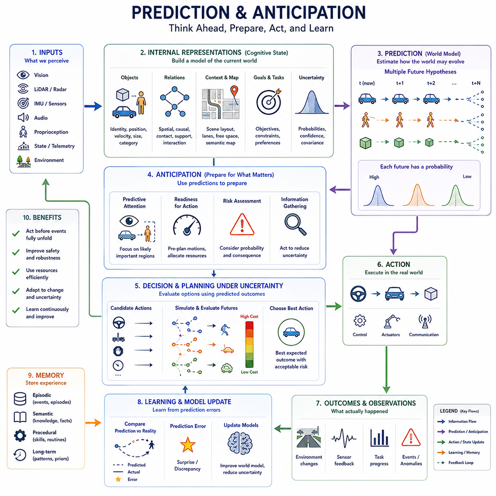{width="7.268055555555556in" height="7.268055555555556in"}

Prediction is the cognitive process of estimating what is likely to happen next from current observations, prior knowledge, internal representations, and learned regularities. Anticipation extends prediction by preparing cognition and action for expected future conditions. Together, they allow intelligent agents to act before events fully unfold instead of responding only after changes have already occurred.

Prediction is fundamental because the sensory world is continuously changing and information always arrives with some delay. A moving object may change position before its current state has been completely processed, and an action may require time before its effect becomes visible. Cognitive systems therefore benefit from estimating future states so that perception and behavior remain aligned with dynamic environments.

Anticipation transforms prediction into preparation. If a person expects a vehicle to enter an intersection, attention can shift toward the possible conflict area and motor responses can be prepared in advance. The same principle applies to artificial agents, where predicted events can change sensing priorities, planning, resource allocation, and safety behavior before the expected event occurs.

Prediction depends on internal representations that summarize relevant aspects of the current situation. These representations may include object locations, velocities, semantic categories, goals, environmental constraints, uncertainty, previous actions, and relationships among entities. A richer and more accurate cognitive state generally provides a stronger foundation for estimating how the situation may evolve.

Temporal continuity is therefore essential. Prediction cannot rely only on isolated observations because many future states depend on trends that become visible only across time. Tracking an object\'s previous positions, for example, provides information about velocity and acceleration that cannot be inferred reliably from a single measurement. Memory and state estimation consequently contribute directly to predictive cognition.

Short-term prediction supports immediate perception and control. Estimating where a moving object will be a fraction of a second later allows an agent to compensate for sensor and control latency. Humans perform such anticipation naturally during reaching, catching, walking, and driving, while autonomous systems use similar principles for tracking, collision avoidance, and trajectory control.

Medium-horizon prediction supports planning over several seconds or minutes. A mobile robot may estimate how pedestrians, vehicles, doors, or obstacles will change while it approaches them. These predictions allow the planner to choose routes and actions that remain feasible when the robot reaches future locations rather than optimizing only for the current geometry.

Long-term anticipation operates over larger timescales and involves increasingly abstract representations. Instead of predicting exact trajectories, an intelligent system may estimate future task states, resource demands, environmental conditions, or likely intentions. Long-horizon prediction therefore often moves from detailed physical dynamics toward probabilistic, semantic, and strategic expectations.

Different prediction horizons require different levels of accuracy. Short-horizon physical predictions can often be relatively precise because fewer unknown events can intervene. Uncertainty generally increases as the prediction horizon extends because small errors accumulate and unobserved decisions or environmental changes can alter future trajectories. Intelligent systems should explicitly represent this growth in uncertainty.

Prediction should therefore rarely be treated as a single deterministic future. Complex environments usually permit multiple plausible developments. A pedestrian may continue walking, slow down, stop, or change direction. Maintaining several possible future trajectories allows planning systems to evaluate alternatives rather than becoming overconfident in one predicted outcome.

Probability provides a useful way to represent these alternatives. Instead of predicting that one future definitely will occur, a cognitive system can assign different likelihoods to several outcomes. Decisions can then consider both the probability and consequence of each possibility, allowing low-probability but high-risk events to influence behavior appropriately.

Prediction and uncertainty are closely connected because a useful prediction should communicate not only what is expected but also how strongly it is believed. Confidence can depend on observation quality, familiarity, model reliability, environmental variability, and prediction horizon. Systems that hide uncertainty may make precise-looking predictions that encourage unsafe decisions.

Anticipation also depends on expected consequences rather than probability alone. A highly probable but harmless event may require little attention, while an unlikely collision may require immediate preparation. Intelligent anticipation therefore combines likelihood, consequence, urgency, and available response time when determining which predicted futures deserve processing priority.

Prediction is strongly linked with attention. Expectations can guide attention toward locations, objects, or signals likely to become important. At the same time, unexpected observations can capture attention because they violate current predictions. This creates a dynamic interaction in which prediction directs sensing and surprising sensory evidence causes predictions to be revised.

Predictive attention can improve efficiency because computational resources do not need to be distributed uniformly. If an autonomous robot predicts that a pedestrian may enter its path, additional perception resources can be allocated to that region. Conversely, stable and well-understood parts of the environment may require less frequent or less detailed processing.

Active perception extends this relationship further. When predictions remain uncertain, an agent can perform actions specifically to improve future estimation. Moving to a different viewpoint, activating another sensor, approaching an object, or slowing down may reveal information that distinguishes competing hypotheses. Prediction therefore helps determine not only what to expect but also what should be sensed next.

Internal models provide the mechanisms required for such forecasting. A model encodes regularities describing how states change through time and how actions influence those transitions. When the current state and a candidate action are provided, the model can estimate possible next states, creating a computational bridge between perception, prediction, planning, and action.

Forward models are a classic example. A forward model predicts the sensory or state consequences that should result from a particular action. When a motor command is issued, the cognitive system can estimate the expected change before feedback arrives. This supports rapid control and allows unexpected deviations to be detected when actual observations differ from predictions.

Predictive control relies heavily on this idea. Instead of reacting only to current error, a controller estimates how the system will evolve and selects actions according to predicted future states. This can improve stability and performance in systems where delay, momentum, or dynamic constraints make purely reactive correction insufficient.

Model predictive control provides a formal engineering example. The controller evaluates candidate action sequences over a limited future horizon, predicts their consequences using a system model, selects an appropriate action, and then repeats the process after new observations arrive. Continuous replanning reduces the impact of prediction errors because the model is repeatedly corrected by reality.

Human cognition uses similar closed-loop prediction even though the underlying biological computation differs. During movement, people continuously anticipate expected visual, tactile, and proprioceptive consequences. Differences between prediction and actual feedback allow rapid correction, making skilled action a repeated sequence of forecasting, observation, comparison, and adjustment.

Prediction error is therefore a central signal in cognition. When reality differs from expectation, the discrepancy indicates that the current state estimate, model, assumption, or action may be inaccurate. Prediction errors can trigger attention, learning, replanning, or corrective control depending on their size, reliability, context, and potential consequences.

Not every prediction error should lead to major learning. Sensors contain noise, rare events occur by chance, and measurements can be temporarily unreliable. Intelligent systems must determine whether an unexpected observation reflects random variation or a meaningful change in the underlying environment. Uncertainty estimation helps prevent unstable adaptation to insignificant errors.

Repeated systematic errors provide stronger evidence that a model should be updated. If an agent continually predicts that a surface provides strong traction but repeatedly observes wheel slip, the internal dynamics representation is likely incomplete. Continual comparison of predicted and observed outcomes therefore allows world models to improve through operational experience.

Predictive processing offers a broader cognitive perspective in which the system continuously generates expectations and compares them with incoming sensory evidence. Perception then involves both bottom-up sensory information and top-down predictions. The internal model proposes what is likely to be observed, while prediction errors identify where additional processing or model revision is required.

This perspective does not imply that perception should ignore sensory data in favor of expectations. Excessive reliance on prior beliefs can produce systematic errors when the environment changes. Reliable cognition requires an appropriate balance between predictions derived from previous experience and evidence supplied by current observations.

The weighting between expectation and evidence can depend on estimated precision. Reliable sensory information should strongly influence the current state, while noisy measurements may deserve less weight. Similarly, a highly reliable predictive model can stabilize interpretation when observations are temporarily incomplete, but its influence should decrease when operating conditions differ from learned experience.

Prediction and memory are also deeply connected. Episodic memory provides examples of what happened in similar previous situations, semantic memory provides generalized knowledge, and procedural memory provides learned expectations about action consequences. These forms of memory can constrain predictions and reduce the amount of inference required in familiar circumstances.

Experience-based prediction can be extremely efficient. An expert driver, technician, or operator may anticipate likely problems from subtle patterns that a novice does not recognize. Expertise therefore includes not only faster perception but better expectations about what events are likely to occur and which early signals indicate future outcomes.

However, learned expectations can also create bias. A system may predict familiar outcomes even when the current situation differs in important ways. Overreliance on previous patterns can cause rare but critical events to be overlooked. Robust prediction therefore requires novelty detection and mechanisms for reducing confidence when observations fall outside familiar distributions.

Distribution-shift detection is especially important for deployed AI. A prediction model trained in particular environments may encounter unfamiliar weather, terrain, objects, behavior patterns, or hardware conditions. Detecting such shifts allows the system to reduce prediction confidence, increase sensing, activate alternative models, or move into a conservative operating mode.

World models provide a general framework for learned prediction in artificial intelligence. They represent how relevant aspects of the world evolve and how agent actions influence that evolution. A world model can operate on raw sensory observations, structured objects, semantic representations, or compact latent states depending on the requirements of the task.

Pixel-level prediction attempts to generate future visual observations directly. This can preserve rich information but may require substantial computational resources and may waste capacity predicting appearance details irrelevant to action. In many Physical AI systems, more abstract predictive representations can provide better efficiency by focusing on geometry, objects, motion, and task-relevant state.

Latent prediction addresses this problem by forecasting changes within a learned internal representation. Instead of generating complete future images, the model predicts how compact features will evolve. This approach can support efficient planning if the latent state contains the variables needed to distinguish future outcomes relevant to behavior.

Object-centric prediction provides another useful representation. Individual objects can maintain identity, position, velocity, semantic category, attributes, and uncertainty. The prediction system estimates how each entity may change and interact with others. Such structure can support more interpretable reasoning and improve transfer across scenes containing familiar types of objects in new arrangements.

Relational prediction focuses on interactions among entities. A moving vehicle may influence a pedestrian, an object may be supported by a table, or one robot may block another\'s route. Graph-based world models can represent these relationships explicitly and predict how both object states and relationships change through actions and environmental events.

Physical dynamics are particularly important for embodied prediction. An autonomous system may need to estimate velocity, acceleration, friction, collision response, stability, load transfer, contact, or force. Pure semantic understanding cannot replace these physical variables when future safety depends on how objects and machines actually move.

Semantic prediction complements physical dynamics by estimating changes in higher-level meaning. A person may be approaching a doorway, a robot may be completing a delivery, or a vehicle may be preparing to turn. These events cannot always be described adequately through geometry alone. Combining semantic and physical prediction produces richer anticipation.

Intent prediction is necessary when other intelligent agents influence the environment. Humans and robots do not move only according to passive physics; their actions reflect goals and decisions. Estimating likely intentions can improve prediction of future trajectories, although such estimates should remain probabilistic because another agent\'s internal goals cannot be observed directly.

Social anticipation enables intelligent systems to prepare for cooperative or conflicting behavior. A service robot can anticipate that a person may reach for an object, while an autonomous vehicle can estimate whether another road user may yield or proceed. Such predictions support safer and more natural interaction when combined with conservative uncertainty handling.

Prediction in multi-agent environments becomes more difficult because the actions of one agent can influence the decisions of another. Future states are therefore interactive rather than independent. Multi-agent prediction models may need to represent possible reactions, negotiation, coordination, or competition among several agents simultaneously.

This creates recursive prediction problems. An agent may predict what another agent will do while the other agent is also reacting to the first agent\'s expected behavior. Practical systems usually simplify this complexity using limited horizons, learned interaction patterns, game-theoretic approximations, or conservative safety assumptions.

Counterfactual prediction allows an agent to evaluate futures associated with actions that have not yet been executed. The system can ask what would happen if it moved left instead of right, slowed down, waited, grasped a different location, or assigned a task to another robot. This capability is fundamental to deliberate planning.

Simulation provides a practical environment for counterfactual prediction. A model can generate many hypothetical trajectories faster or more safely than they could be explored physically. In robotics, simulated futures can be used to estimate collisions, task completion, energy use, navigation efficiency, manipulation success, and other action consequences.

The reliability of counterfactual reasoning depends on model accuracy. A simulation may produce plausible but incorrect futures when it encounters states outside its training experience. Planning systems should therefore track model confidence and avoid relying heavily on long simulated trajectories when uncertainty becomes large.

Model error tends to accumulate with prediction horizon. Small errors in position, dynamics, or interaction can produce larger deviations after several prediction steps. This motivates receding-horizon approaches in which the agent predicts a limited future, performs only part of the plan, obtains new observations, and then predicts again.

Receding-horizon prediction is particularly suitable for Physical AI because physical environments provide frequent feedback. Rather than relying on one long open-loop forecast, the robot repeatedly updates its world state and replans. This combines predictive intelligence with reactive robustness and reduces dependence on perfect long-term models.

Hierarchical prediction can further manage complexity. Low-level models predict fast physical dynamics, intermediate models predict object interactions and local task progression, and high-level models anticipate mission states or strategic outcomes. Different models can therefore operate at different temporal resolutions while exchanging relevant information.

Multi-timescale prediction reflects the structure of intelligent behavior. Millisecond or sub-second predictions may support stabilization, several-second predictions may support obstacle avoidance and manipulation, and minute-level predictions may support task scheduling. Longer strategic horizons may operate over much more abstract states than immediate physical control.

Prediction frequency should also vary according to environmental dynamics. Slowly changing regions do not need to be predicted at the same rate as fast-moving objects. Event-driven prediction can allocate computational resources when significant changes, uncertainty, or risk appear, improving efficiency on resource-constrained systems.

This is important for edge AI because onboard compute, memory, energy, bandwidth, and thermal capacity are limited. A robot cannot continuously run every predictive model at maximum fidelity. Lightweight prediction can operate routinely while computationally expensive models activate when situations become complex, novel, or safety critical.

Foundation models can contribute broad prior knowledge to predictive systems. Vision and multimodal models can identify objects and relationships, while language models can provide knowledge about typical events and task structures. Such priors can help interpret context before sufficient platform-specific experience has been collected.

However, foundation-model knowledge should be grounded in current observations. A language model may know that pedestrians commonly cross at a crosswalk, but the physical system must still detect the actual pedestrian, estimate position and motion, and assess local conditions. Generic expectations cannot substitute for real-time state estimation.

Perception foundation models can support prediction by producing semantic and geometric representations that persist across time. These representations can feed tracking and world-model components rather than being used only for frame-level recognition. Fine-tuning can adapt them to the specific sensors, environments, and object classes relevant to deployment.

Action foundation models can contribute predictions about likely action consequences or reusable behavior patterns. If trained across many interactions, they may encode priors about manipulation, locomotion, or navigation. These priors must still be conditioned on the current robot morphology, state, payload, environment, and safety constraints.

World models can connect perception and action foundation models through predicted state transitions. Perception establishes what exists, candidate actions specify possible interventions, and the world model estimates their consequences. A planner then compares these futures according to goals, risk, uncertainty, energy, time, and other constraints.

Reinforcement learning can use prediction to improve decision making. Model-free reinforcement learning learns behavior largely from direct experience, whereas model-based reinforcement learning uses a predictive model to evaluate possible future outcomes. The latter can improve data efficiency because many candidate trajectories can be examined without physical execution.

Imagined experience generated by world models can supplement real experience during learning. An agent can simulate candidate actions and use predicted outcomes to improve its policy. However, imagined learning should be constrained by model confidence because inaccurate simulated states can reinforce behavior that performs well only inside the learned model.

Self-supervised learning is well suited to predictive models because temporal data naturally provides learning targets. Given present observations, the system can predict future representations, object motion, sensor measurements, or action outcomes. The actual future later becomes the training signal, reducing dependence on manually labeled predictive datasets.

Robot fleets create particularly large opportunities for predictive learning. Each robot produces sequences of observations, actions, predictions, and outcomes. These trajectories can be aggregated to identify systematic errors, rare situations, and environmental patterns. Improved predictive models can then be validated and distributed back to the fleet.

Prediction is closely related to anomaly detection. If an observation differs strongly from the expected state, the event may represent a sensor fault, environmental change, unexpected agent behavior, or system failure. Prediction-based anomaly detection identifies unusual events according to their deviation from learned temporal expectations.

For maintenance and reliability, anticipation can extend beyond immediate navigation and control. A robot can monitor motor current, vibration, temperature, battery behavior, and other signals to predict component degradation. Predictive maintenance allows service to occur before a failure disrupts operation and provides another practical use of cognitive anticipation.

Task-level anticipation can similarly predict delays, resource shortages, or mission failure. A fleet management system may estimate that a robot will not complete an assignment before its battery reaches a minimum reserve or that congestion will delay multiple robots. Such predictions allow proactive task reassignment rather than reactive recovery.

Energy prediction is important for mobile robots because future actions depend on remaining operational capacity. An agent can estimate energy consumption for routes, payloads, terrain, compute demand, or manipulation tasks. Planning can then consider whether enough energy remains to complete the task and reach a charging location safely.

Safety prediction requires special treatment because rare events may carry severe consequences. Collision probability, stability risk, human proximity, braking distance, and failure trajectories may need explicit predictive models. Safety systems should evaluate worst-case or conservative possibilities rather than relying only on the most probable predicted future.

Reachability analysis provides another form of safety anticipation. Instead of predicting one likely trajectory, the system estimates a set of states that an object, vehicle, or robot could possibly reach within a future interval. Such sets can support conservative collision checking when exact behavior of other agents is uncertain.

Planning under uncertainty therefore combines predicted outcomes with risk management. The lowest expected cost action is not always appropriate if it has a small probability of catastrophic failure. Risk-sensitive planning can penalize dangerous tails of the predicted distribution and prefer actions with safer future state ranges.

Anticipation also changes communication. A cooperative robot may inform a human about an expected problem before intervention becomes urgent. Instead of reporting only current faults, it can communicate predicted delays, uncertain object states, likely path conflicts, or declining energy reserves, allowing the human to prepare or modify the task.

Human-AI collaboration benefits when predictions are interpretable at the level needed for decisions. A user may not need raw probability distributions but should understand which future event is expected, why it matters, how uncertain the estimate is, and what actions remain available. Prediction communication should therefore avoid both false precision and unnecessary complexity.

Trust in prediction should remain calibrated. Highly confident forecasts that repeatedly fail cause inappropriate actions, while excessively conservative predictions can make autonomous systems inefficient or unusable. Calibration measures whether stated confidence corresponds to actual predictive accuracy and is therefore essential for reliable deployment.

Prediction evaluation should consider more than average numerical error. Different applications require trajectory accuracy, event detection, probability calibration, horizon-dependent error, rare-event recall, safety performance, computational latency, and downstream planning effectiveness. A model useful for one purpose may be unsuitable for another even if overall prediction loss is similar.

Closed-loop evaluation is especially important for robotics. A small prediction error may have little effect if replanning corrects it quickly, while another seemingly small error may direct the robot into a dangerous state. Predictive models should therefore be evaluated by how they influence actual planning, control, safety, and task completion.

Robustness testing should intentionally include unusual and changing conditions. New object types, sensor degradation, sudden motion, difficult weather, altered friction, communication loss, or unexpected human behavior can reveal whether predictions remain reliable outside nominal operation. Such tests also help determine when fallback strategies are required.

Anticipatory systems should know when prediction is unnecessary. Excessive forecasting wastes computation and may introduce complexity into situations adequately handled by simple reactive control. Intelligent architecture should allocate prediction depth according to the value that future information provides for the current decision.

Reactive and predictive mechanisms are therefore complementary rather than competing approaches. Reactive control provides rapid responses to immediate observations, while predictive processing allows preparation for expected future conditions. Strong autonomous systems combine both, using anticipation where delay and consequences matter while preserving fast feedback for unmodeled events.

The relationship between prediction and action ultimately forms a closed loop. The agent predicts future states, chooses an action based on those predictions, executes the action, observes what actually happens, measures prediction error, and updates its internal state or model. Each cycle provides new evidence that improves subsequent anticipation.

For cognitive science, this loop explains how organisms operate successfully despite delayed, noisy, and incomplete sensory information. Prediction allows cognition to remain ahead of events rather than constantly lagging behind them. Anticipation converts expectations into prepared attention, decision, and action, enabling more efficient and adaptive interaction.

For artificial intelligence, prediction transforms models from passive recognizers into components of goal-directed agents. Memory provides temporal context, state estimation defines the present, world models estimate possible futures, planners evaluate alternatives, and feedback corrects predictions. These mechanisms together support increasingly deliberate and adaptive intelligence.

For Physical AI, prediction and anticipation are foundational because every physical action consumes time and changes the future environment. Robots must anticipate motion, interaction, task progress, energy, uncertainty, and safety while maintaining real-time feedback. Predictive capability therefore links perception, world modeling, planning, control, continual learning, and reliable autonomous behavior.

The long-term objective is not perfect forecasting, which is impossible in complex partially observable worlds, but useful anticipation under uncertainty. An intelligent agent should predict the futures that matter, represent multiple possibilities when necessary, understand how confidence changes with horizon, gather information when uncertain, and continuously correct its expectations through real-world feedback.

## 01.11 Perception Action Loop [w/Code]

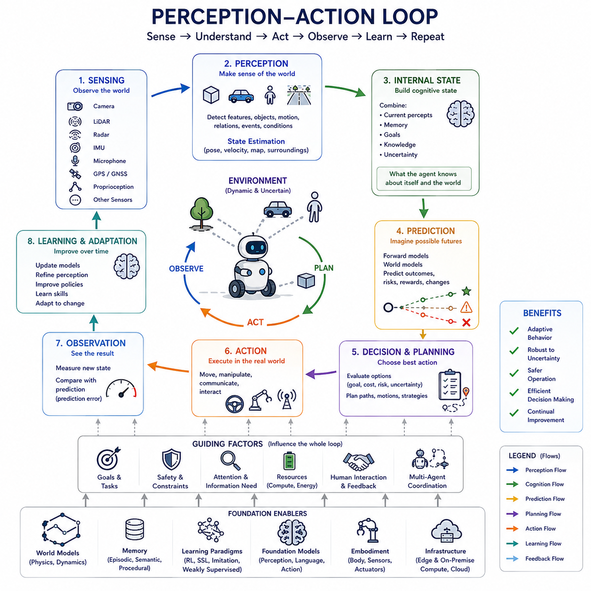{width="7.268055555555556in" height="7.268055555555556in"}

The perception-action loop describes the continuous process through which an intelligent agent senses its environment, constructs an internal understanding of the current situation, selects an appropriate action, executes that action, and observes the resulting changes. Perception and action are therefore not independent functions but mutually dependent components of an ongoing closed-loop interaction with the world.

Traditional descriptions of intelligent systems sometimes present perception as a one-way pipeline in which sensory information is processed first and action is produced afterward. Real cognition is more dynamic. Every action changes either the environment, the agent, or the relationship between them, creating new sensory information that immediately becomes the input for the next cycle of perception and decision making.

The loop begins with sensing. Biological organisms use vision, hearing, touch, proprioception, and other sensory systems, while robots may use cameras, LiDAR, radar, ultrasonic sensors, microphones, IMUs, GNSS, force sensors, encoders, and internal telemetry. These sensors provide incomplete and noisy observations rather than a perfect description of the external world.

Raw sensor measurements must therefore be transformed into representations that are useful for behavior. Perception identifies features, objects, surfaces, motion, spatial relationships, events, and environmental conditions. For an embodied agent, perception also includes estimating its own position, orientation, velocity, configuration, physical condition, and relationship to surrounding entities.

Perception is task dependent. The same sensory observation can have different meanings according to the current goal. A chair may be represented as an obstacle during navigation, a target object during manipulation, a landmark during localization, or an available place to sit for a human. Perception therefore organizes sensory information according to behavioral relevance rather than simply reconstructing every physical detail.

Internal state connects perception with action. The system combines current observations with memory, previous state estimates, goals, uncertainty, and knowledge about the environment. This cognitive state provides a more stable representation than individual sensor measurements and allows the agent to continue reasoning when objects are temporarily occluded or measurements become unreliable.

State estimation is particularly important because sensory observations rarely reveal everything required for action. A mobile robot may not directly observe its exact global position, the intention of a nearby pedestrian, or the friction of the ground. It must estimate these hidden variables using current measurements, previous observations, models, and accumulated experience.

Uncertainty should remain part of this state rather than being discarded during perception. Object classifications may be ambiguous, localization may have limited accuracy, and sensor measurements may disagree. Representing confidence and alternative hypotheses allows the action system to choose cautious behavior when the perceptual state is uncertain.

Attention determines which parts of the sensory environment receive additional processing. Because perception and computation are limited, the agent cannot analyze every signal with equal detail. Goals, novelty, uncertainty, predicted risk, and task relevance can guide attention toward the information most likely to influence upcoming decisions.

Action can also guide perception. A robot may rotate its camera toward an uncertain object, move around an obstacle to obtain another viewpoint, approach a marker to improve localization, or slow down to collect more reliable sensor data. Such active perception demonstrates that sensing is not merely passive reception but can be deliberately shaped by behavior.

This interaction creates a perception-action cycle in which perception determines what actions appear possible while action determines what can be perceived next. The agent continuously changes its sensory conditions through movement and interaction. Intelligent behavior therefore emerges from repeated coupling between sensing, interpretation, decision, movement, and new observation.

Affordances provide an important bridge between perception and action. An affordance represents what actions the environment allows relative to the agent\'s capabilities. A doorway affords passage if the robot fits through it, a handle may afford grasping if it is reachable, and a surface may afford traversal if its geometry and friction are compatible with the robot.

Affordances are relational rather than purely properties of objects. A step that is traversable for a legged robot may be an obstacle for a low-clearance wheeled platform. An object that one manipulator can lift may exceed another robot\'s payload. Perception-action systems must therefore interpret the environment relative to body morphology, capability, and current operating state.

Body representation is consequently a fundamental part of the loop. An embodied system must know its dimensions, joint configuration, velocity, actuator limits, payload, energy state, sensor status, reachable workspace, and other physical constraints. Without self-state information, environmental perception cannot reliably determine which actions are feasible.

Goals further shape the relationship between perception and action. The system does not simply detect everything and then decide what to do. Current objectives influence which objects are important, which relationships require attention, and which sensory details can be ignored. Goal-directed perception reduces unnecessary processing and connects sensory understanding directly with purposeful behavior.

Memory provides temporal continuity across successive perception-action cycles. Working memory can maintain recent observations, temporary goals, unresolved uncertainties, and partial plans, while long-term memory provides previous experiences, semantic knowledge, and learned skills. Current perception can therefore be interpreted using information acquired before the present moment.

The previous action is also important for interpreting the next observation. If a robot commanded a forward movement, the subsequent change in camera or LiDAR measurements should partly reflect that motion. Knowledge of executed actions helps distinguish changes caused by the agent itself from changes caused independently by the environment.

This principle is related to forward models. A forward model predicts how the agent and environment should change when a particular action is executed. The expected sensory or state consequence can be generated before actual feedback arrives, allowing the system to anticipate the result of its own behavior.

When actual observations match predicted consequences, the system gains evidence that its state estimate and dynamics model are reasonable. When observations differ substantially from predictions, the resulting prediction error indicates that something unexpected occurred. The discrepancy may arise from model error, environmental change, sensor problems, action failure, or incorrect state estimation.

Prediction error therefore closes an important learning loop. Unexpected outcomes can trigger additional attention, state correction, replanning, or model adaptation. Instead of treating errors only as failures, an intelligent system can use them as information about where its understanding of the world or its own capabilities needs improvement.

Feedback control represents the fastest form of the perception-action loop. Sensors measure the current state, the controller compares it with a desired state, and actuators generate corrective actions. New measurements reveal the effect of those actions, allowing the controller to repeatedly reduce error. This process may operate hundreds or thousands of times per second.

Higher-level cognitive loops operate at slower timescales. Object perception, navigation planning, manipulation planning, task reasoning, and mission management may update over milliseconds, seconds, or longer intervals. Intelligent systems therefore contain multiple nested perception-action loops operating simultaneously at different temporal and functional levels.

At the lowest level, motor control maintains stability, force, velocity, or position. At an intermediate level, motion planning controls trajectories and interactions with nearby objects. At higher levels, task planning determines what should be accomplished next. Each layer receives feedback and modifies behavior according to its own representation and time horizon.

These loops should not be understood as completely separate. Higher-level goals constrain lower-level actions, while lower-level feedback can force higher-level plans to change. A mission planner may request movement to a destination, but local perception may detect an obstacle that requires trajectory modification or even a complete reconsideration of the mission plan.

Reactive behavior is one important component of this architecture. Reactive control maps current observations to immediate actions with minimal internal prediction. Such mechanisms are useful when fast responses are required, such as emergency stopping, collision avoidance, balance correction, or maintaining safe distance from a moving obstacle.

Purely reactive systems, however, may struggle when actions have delayed consequences or when temporary decisions affect future possibilities. A robot that only reacts to immediate obstacles may enter a dead end or choose a route that later becomes impossible. Prediction and planning extend the perception-action loop beyond the current moment.

Predictive behavior uses an internal model to estimate future states before an action is executed. The agent can compare several candidate actions according to their predicted consequences. This allows behavior to consider future collision risk, energy consumption, task progress, stability, interaction outcomes, or other criteria that cannot be determined from the current observation alone.

Model predictive control provides a clear example of predictive perception-action coupling. The system observes its current state, predicts several possible future trajectories, selects an action, executes only part of the planned sequence, observes the new state, and plans again. Repeated feedback prevents the controller from depending on a perfectly accurate long-term prediction.

This receding-horizon principle is particularly suitable for physical systems because real environments continually provide new evidence. Instead of committing to a long open-loop plan, an autonomous robot can repeatedly revise its behavior as new observations become available. Prediction provides foresight while feedback provides robustness to unexpected changes.

World models extend this principle by learning how relevant aspects of the environment evolve. A world model can predict how objects move, how physical interactions unfold, how tasks progress, and how actions change future states. It therefore provides an internal simulation mechanism connecting perception, cognition, planning, and action.

The world model receives a representation of the current state rather than necessarily operating directly on raw sensor data. This representation may contain geometry, objects, semantic relationships, motion, uncertainty, robot state, and task context. Candidate actions can then be applied to this state to generate possible future developments.

Latent world models perform prediction in compressed learned representations. Instead of generating complete future camera images or LiDAR scans, they predict changes in features relevant to behavior. This can substantially reduce computational requirements, although the latent state must preserve information required for safe planning and control.

Object-centric world models organize prediction around persistent entities. Each object can maintain identity, position, velocity, semantic category, physical properties, and uncertainty. Predicting object-level transitions can provide an interpretable connection between perception and planning, particularly when interactions among multiple entities are important.

Action selection converts perceived and predicted possibilities into behavior. The system may evaluate candidate actions according to expected task success, safety, time, energy, comfort, uncertainty, or other objectives. The selected action represents the system\'s current judgment about how the world should be changed to move toward the desired state.

Decision making under uncertainty is necessary because perception and prediction are never perfect. A planner should consider both expected outcomes and confidence in those outcomes. An action with excellent predicted performance may be inappropriate if the underlying perception is unreliable or if a low-probability failure would have severe consequences.

Risk-sensitive behavior therefore becomes part of the perception-action loop. When uncertainty or potential consequences increase, the system can reduce speed, increase safety distance, gather additional information, request human assistance, or choose a more conservative action. Behavior itself becomes a mechanism for managing uncertainty.

Information gathering can even become an explicit action objective. An agent may temporarily choose an action that does not directly advance the task but improves knowledge needed for later decisions. Moving to inspect an occluded region or testing contact with a surface can reduce uncertainty and enable safer subsequent behavior.

This creates a distinction between actions that change the world and actions that primarily improve knowledge about the world, although many actions accomplish both. Active sensing, exploration, and experimentation are therefore natural extensions of the perception-action loop rather than separate cognitive processes.

Learning modifies the loop across longer timescales. Every interaction produces sequences of observations, internal states, actions, and outcomes. These experiences can be used to improve perception models, state estimators, world models, planners, control policies, and representations of the agent\'s own capabilities.

Reinforcement learning directly connects action and consequence. The agent performs actions, receives resulting states and rewards, and gradually learns which behaviors produce desirable outcomes. This learning process is inherently closed loop because the policy changes the distribution of future observations from which additional learning occurs.

Model-based reinforcement learning adds explicit prediction. Instead of learning only which action tends to produce reward, the system learns a model of state transitions and can simulate candidate futures. This can improve data efficiency because many possible actions can be evaluated internally without physically executing each one.

Self-supervised learning can improve perception and world models using the natural temporal structure of interaction data. Current observations can be used to predict future features, object motion, masked information, or action consequences. The future observations produced by the perception-action loop automatically provide training targets without requiring complete manual labeling.

Weakly supervised learning can complement this process when partial, noisy, coarse, or indirectly generated labels are available. Operational logs, task outcomes, human corrections, robot events, map information, or existing detectors can provide imperfect supervision. Combining such signals with self-supervised temporal learning can reduce the cost of creating large robotic datasets.

Imitation learning introduces human demonstrations into the loop. A robot observes how a human or expert system maps perceived situations to actions and learns to reproduce similar behavior. Demonstrations can provide strong initial policies, particularly for complex tasks where random exploration would be inefficient or unsafe.

However, imitation alone may fail when the robot encounters states that were rarely present in demonstrations. Once its action differs slightly from the demonstrated trajectory, subsequent observations can move outside the training distribution. Closed-loop evaluation and corrective demonstrations are therefore important for robust imitation learning.

Continual learning extends adaptation throughout the operational lifetime of the system. New environments, objects, tasks, hardware configurations, and failure cases generate experiences that can improve future behavior. The perception-action loop becomes not only a mechanism for immediate control but also the primary source of data for long-term intelligence development.

Experience should be stored selectively. Routine successful behavior may require little retention, while novel events, large prediction errors, human interventions, safety incidents, rare objects, and unusual environmental conditions may be especially valuable. Event-driven memory can preserve informative experiences without storing every raw sensor stream indefinitely.

Episodic memory can retain specific interaction sequences, including what the agent perceived, what it believed, what action it selected, and what actually occurred. These episodes can later support debugging, learning, reasoning, and retrieval of similar previous situations when the agent encounters new problems.

Semantic memory can extract generalized knowledge from many episodes. Repeated interactions may teach the system that certain surfaces are slippery, particular locations become congested, or specific object types require special handling. Such knowledge influences future perception and action without requiring the original experiences to be replayed every time.

Procedural memory stores learned skills and action patterns. Navigation maneuvers, grasping strategies, docking procedures, recovery behaviors, and manipulation routines can become reusable capabilities. Perception identifies when a skill is appropriate, while feedback continuously adapts its execution to the current environment.

Foundation models can enrich multiple stages of the perception-action loop. Perception foundation models provide reusable semantic representations, language models contribute task knowledge and instruction understanding, and action foundation models provide transferable behavior priors. These components can reduce the amount of platform-specific learning required from the beginning.

Perception foundation models are particularly useful for converting high-dimensional sensor data into meaningful representations. Pretrained visual or multimodal encoders can identify objects, scenes, relationships, and semantic features. Task-specific heads or fine-tuning can then adapt these representations to the robot\'s sensors and operating environment.

Language foundation models can translate human instructions into goals, constraints, task structures, or candidate plans. However, language-generated interpretations must remain grounded in the current physical state. A language model may propose what should happen, but perception and world-state estimation must determine what is actually possible and safe.

Action foundation models can provide reusable policies or motion representations learned from large collections of robot interactions. Their output should be conditioned on current perception, robot morphology, capability, and task context. Closed-loop feedback remains essential because an action prior learned elsewhere cannot perfectly predict the current physical environment.

The combination of perception, world models, and action models creates a powerful architecture for Physical AI. Perception estimates the current world and self-state, the world model predicts possible consequences, and the action model generates feasible behavior. Planning selects among these possibilities while continuous feedback corrects errors during execution.

Multi-modal perception strengthens this architecture because different sensors provide complementary information. Cameras provide appearance and semantics, LiDAR provides geometry, radar contributes robust motion measurements, IMUs provide inertial state, GNSS supplies global positioning, and proprioceptive sensors describe the robot\'s physical condition.

Sensor fusion integrates these observations into a coherent state. Accurate synchronization is essential because measurements captured at different times may describe different physical configurations. Motion compensation, calibration, timestamp alignment, and uncertainty modeling therefore directly affect the quality of the subsequent actions.

Poor perception can produce poor action even when the planner itself is mathematically correct. A perfectly optimized trajectory based on an incorrect obstacle location is still dangerous. Reliability of the perception-action loop therefore depends on maintaining accurate, timely, and uncertainty-aware state estimates.

Likewise, poor action execution can corrupt perception. Wheel slip, actuator error, mechanical deformation, vibration, or unexpected contact can cause the actual robot state to differ from the commanded state. Proprioceptive feedback and state estimation must detect these differences so that the internal representation remains aligned with physical reality.

Calibration is therefore not a one-time concern. Sensor extrinsics, actuator response, wheel parameters, payload distribution, and other system characteristics can change during operation. Monitoring prediction errors and cross-sensor consistency can reveal when calibration has degraded enough to affect perception-action performance.

Safety requires dedicated loops operating alongside task behavior. Emergency stopping, collision monitoring, stability checks, joint limits, speed restrictions, geofencing, and other safety mechanisms should not depend entirely on high-level learned reasoning. Independent feedback pathways can provide deterministic protection when learned components behave unexpectedly.

A safety supervisor can evaluate proposed actions before execution and monitor actual behavior afterward. If perception confidence decreases, communication fails, localization becomes unreliable, or predicted risk exceeds an acceptable threshold, the supervisor can restrict actions or transition the robot to a safer operating state.

Human interaction adds another feedback channel. A human can provide instructions, corrections, demonstrations, approvals, or emergency intervention. The robot\'s actions also provide information to the human, who observes its behavior and updates expectations. Human-robot interaction therefore forms a coupled perception-action loop involving multiple intelligent participants.

Intent communication can make this loop safer and more understandable. A robot can signal its planned direction, expected action, uncertainty, or need for assistance before moving. Humans can then anticipate robot behavior rather than reacting only after motion begins, reducing ambiguity in shared environments.

Multi-agent robotic systems contain interacting perception-action loops. Each robot perceives the environment and other agents, selects actions, and changes the state observed by everyone else. Coordination therefore requires reasoning not only about static obstacles but about the likely behavior and goals of other autonomous agents.

Shared information can extend perception beyond the range of individual robots. Fleet members may exchange detected obstacles, maps, task progress, localization information, or environmental changes. A shared world representation can improve coordination while local onboard perception continues to provide the low-latency information required for immediate safety.

Fleet-level planning creates a slower perception-action loop above individual robots. The fleet system observes robot states, task demand, congestion, energy levels, and mission progress, then reallocates tasks or modifies routes. The resulting robot behavior changes the fleet state, producing new information for the next coordination cycle.

Edge computing is particularly important for the fastest parts of these loops. Immediate perception, state estimation, safety monitoring, motion planning, and control should remain close to the physical robot because network latency or communication loss can make remote dependence unsafe.

On-premise computing can support slower and broader cognitive functions. Large world models, fleet optimization, long-term memory, dataset management, model training, global map maintenance, and complex reasoning can operate using shared infrastructure. The architecture can therefore distribute cognition according to latency, computational demand, and operational scope.

Communication between edge and on-premise systems should use meaningful state representations when possible rather than continuously transmitting every raw sensor stream. Objects, trajectories, events, uncertainties, task states, and selected sensor segments can provide efficient summaries while raw data can be retained when required for learning or forensic analysis.

Autonomy should degrade gracefully when communication is lost. A robot that depends on remote intelligence for every decision may become unsafe or unusable during network interruption. Essential perception-action functions should remain onboard, while external computation enhances capability without becoming mandatory for immediate safe operation.

The perception-action loop is also closely related to embodiment. Intelligence in a physical agent is constrained and shaped by the body through which it acts. Sensor placement determines what can be observed, actuator configuration determines what can be changed, and mechanical design influences which control and perception problems must be solved computationally.

Better mechanical design can simplify cognition. Stable locomotion, predictable steering, appropriate sensor placement, sufficient traction, and accurate actuators reduce uncertainty and control difficulty. Physical AI should therefore treat mechanical, electrical, sensing, computational, and cognitive architecture as parts of one integrated system.

Conversely, intelligent control can compensate for some physical limitations. Perception can identify difficult terrain, prediction can estimate slip or instability, and planning can choose safer trajectories. The boundary between mechanical capability and computational intelligence is therefore flexible, with each influencing the requirements placed on the other.

The loop also provides a useful framework for understanding cognitive load in artificial systems. Computational resources are finite, so not every perception, prediction, and planning process can operate at maximum complexity simultaneously. Attention and task priority determine where processing resources should be allocated.

Adaptive computation can modify the depth of reasoning according to the situation. Routine navigation in a stable corridor may require lightweight processing, while a crowded intersection or complex manipulation task may activate richer perception, longer prediction horizons, and more detailed planning. Computational effort becomes part of the control strategy.

Event-driven architectures can further improve efficiency. Instead of recomputing every representation continuously, significant changes such as new obstacles, prediction errors, task transitions, localization degradation, or safety warnings can trigger additional processing. This allows the cognitive system to concentrate resources where new information is most valuable.

The perception-action loop therefore includes both external and internal feedback. External feedback describes how the environment changed after an action, while internal feedback describes changes in confidence, computational load, memory, prediction quality, and model reliability. Both influence what the agent should do next.

Metacognition can supervise these internal conditions. A system may recognize that its perception is uncertain, its world model is operating outside familiar conditions, or its planner cannot find a safe solution. Instead of blindly continuing, it can gather information, simplify the task, invoke another model, request assistance, or stop.

Such behavior is especially important in open-world environments where not every situation can be anticipated during development. Robust autonomy does not require the system to know everything. It requires the system to recognize when its current knowledge is insufficient and to choose actions that preserve safety while reducing uncertainty.

Evaluation of perception-action systems should therefore use closed-loop testing rather than evaluating components only in isolation. High object-detection accuracy does not guarantee good navigation, and low trajectory prediction error does not automatically guarantee safe control. The important measure is how component performance affects actual behavior.

Simulation provides a scalable environment for closed-loop evaluation. Robots can interact with diverse scenarios, experience failures, and test alternative actions without physical risk. Simulation is particularly useful for rare events, although differences between simulation and reality must be considered when transferring learned behavior.

Real-world testing remains essential because physical interaction exposes effects that are difficult to model completely. Sensor noise, mechanical wear, lighting changes, friction, vibration, human unpredictability, communication problems, and unexpected environmental structure reveal weaknesses that may remain hidden in simulation.

Digital twins can connect simulation with operational systems by maintaining virtual representations of robots and environments. Real sensor data can update the digital state, while simulation can evaluate possible actions or maintenance conditions. This creates another feedback pathway between physical operation and predictive computation.

Data collected from real perception-action cycles can continuously improve the digital model. Conversely, improved simulation and learned models can generate better policies for deployment. The physical system and its computational representation can therefore co-evolve through repeated observation, modeling, testing, and action.

For cognitive science, the perception-action loop emphasizes that cognition is not simply internal information processing separated from behavior. Perception is shaped by possible action, action changes perception, and cognition develops through repeated interaction between organism and environment. Intelligence is therefore deeply connected with embodiment and feedback.

For artificial intelligence, the same principle shifts emphasis from static input-output prediction toward interactive agents. A model operating on a fixed dataset does not experience the consequences of its predictions, whereas an autonomous agent changes the future data it will receive through its own actions. This makes closed-loop learning fundamentally different from passive inference.

For robotics and Physical AI, the perception-action loop provides the core architecture connecting sensors, internal representations, world models, planning, control, memory, and learning. Every autonomous capability ultimately participates in this cycle by helping the robot understand its current situation, determine what to do, execute behavior, and interpret what happens next.

Advanced systems will increasingly combine several loops rather than rely on a single monolithic model. Fast deterministic safety and control loops can coexist with learned perception, predictive world models, foundation models, deliberative planning, fleet intelligence, and continual learning. Their coordination determines the overall quality of autonomous behavior.

The objective is therefore not merely to create better perception or more sophisticated action policies independently. The goal is to create a coherent system in which perception provides action-relevant state, action actively improves perception when necessary, prediction anticipates consequences, feedback corrects errors, and learning continuously improves the entire interaction cycle.

A mature perception-action architecture ultimately behaves as a continuously adapting closed-loop intelligence system. It senses the world and itself, constructs a cognitive state, predicts possible futures, selects goal-directed actions, monitors physical outcomes, detects discrepancies, updates knowledge, and immediately begins the cycle again. Through this repeated coupling of perception and action, an autonomous agent can progressively achieve more robust, adaptive, and reliable behavior in the real world.
