**Volume 43 Cognitive Science for AI**

# Chapter 02. Memory and Attention

## 02.00 Memory System Overview

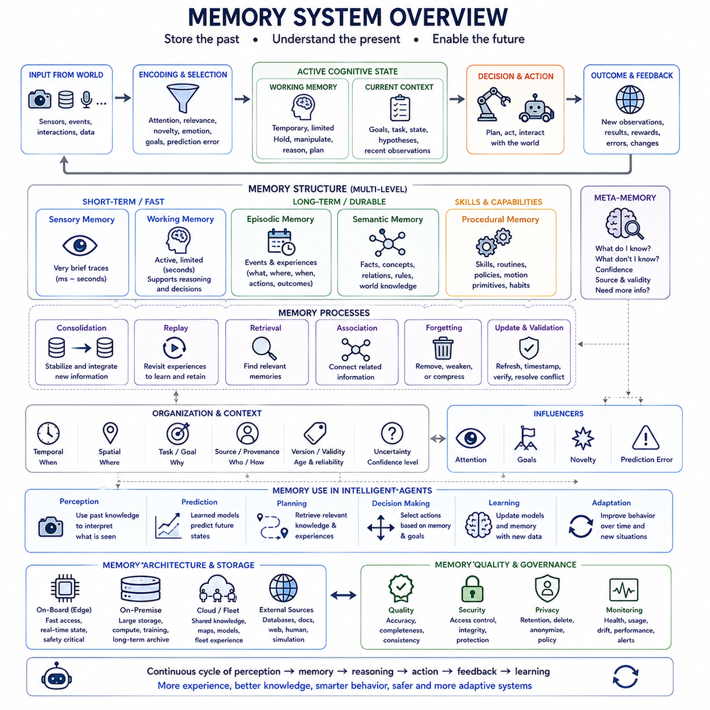{width="7.268055555555556in" height="7.268055555555556in"}

기억(Memory)은 정보, 경험, 지식, 목표, 학습된 기술이 처음 접한 순간을 넘어 지속될 수 있도록 하는 인지 시스템(Cognitive System)입니다. 기억을 통해 지능형 에이전트(Intelligent Agent)는 과거 사건을 현재 상황 및 미래 행동과 연결할 수 있습니다. 기억이 없다면 지각과 추론은 매 순간 현재에서 다시 시작해야 하므로 학습, 계획, 정체성, 장기 적응 능력이 크게 제한됩니다.

기억 시스템(Memory System)은 하나의 저장 메커니즘이 아니라 여러 형태의 유지(Retention)와 검색(Retrieval)을 포함하는 협력적 아키텍처입니다. 인간 인지는 짧게 유지되는 감각 흔적, 일시적인 작업 기억, 장기 의미 지식, 일화적 경험, 절차적 기술을 구분합니다. 인공 시스템은 컨텍스트 버퍼(Context Buffer), 데이터베이스, 임베딩(Embedding), 로그, 학습된 파라미터, 구조화된 상태, 외부 저장장치를 사용하여 이와 유사한 기능을 구현할 수 있습니다.

기억은 들어오는 정보를 유지 가능한 형태로 변환하는 과정인 부호화(Encoding)에서 시작됩니다. 모든 관찰이 지속적인 기억으로 저장되는 것은 아닙니다. 주의(Attention), 관련성, 새로움(Novelty), 정서적 중요성, 반복, 작업 목표, 예측 오류(Prediction Error)는 어떤 정보가 더 깊게 처리될지를 결정합니다. 따라서 효과적인 기억은 저장이 이루어지기 이전의 선택 과정에 크게 의존합니다.

감각 기억(Sensory Memory)은 자극이 발생한 후 매우 짧은 시간 동안 정보를 유지합니다. 시각, 청각, 기타 감각 흔적은 원래 신호가 사라진 후에도 잠시 사용할 수 있으며, 이를 통해 인지는 짧은 시간적 간격을 넘어 정보를 통합할 수 있습니다. 이러한 일시적 지속성은 눈의 움직임, 간헐적 신호, 환경의 움직임, 센싱과 상위 수준 처리 사이의 지연에도 불구하고 안정적인 지각을 지원합니다.

작업 기억(Working Memory)은 현재의 추론과 행동에 적극적으로 필요한 정보를 유지합니다. 임시 목표, 중간 계산 결과, 최근 관찰, 지시사항, 가설, 부분적인 계획 등을 저장할 수 있습니다. 작업 기억의 용량에는 한계가 있기 때문에 지능적 행동을 위해서는 어떤 정보를 활성 상태로 유지하고 어떤 정보를 제거, 압축 또는 장기 저장소로 이전할지를 우선순위에 따라 결정해야 합니다.

작업 기억은 단순한 수동적 버퍼(Passive Buffer)로만 이해해서는 안 됩니다. 그 안에 유지된 정보는 추론 과정에서 조작, 비교, 재정렬, 결합 또는 변환될 수 있습니다. 문제를 해결할 때 인지는 장기 기억에서 지식을 검색하고, 관련 요소를 작업 기억에 배치하고, 대안을 비교하며, 의사결정이 만들어질 때까지 활성 상태를 점진적으로 갱신할 수 있습니다.

장기 기억(Long-Term Memory)은 수분에서 수년에 이르는 훨씬 긴 기간 동안 정보를 보존합니다. 이는 학습이 일시적인 현상에 머무르지 않고 누적될 수 있도록 하는 지식과 경험의 기반을 제공합니다. 장기 기억을 통해 지능형 에이전트는 익숙한 상황을 인식하고, 이전에 성공한 전략을 재사용하며, 반복되는 사건을 예상하고, 과거에 경험한 실수를 반복하지 않을 수 있습니다.

서술 기억(Declarative Memory)은 사실 또는 경험으로 표현할 수 있는 정보를 포함합니다. 일반적으로 의미 기억(Semantic Memory)과 일화 기억(Episodic Memory)으로 구분됩니다. 의미 기억은 개념, 범주, 관계, 언어, 규칙, 세계 구조에 관한 일반화된 지식을 저장하며, 일화 기억은 특정한 문맥에 위치한 개별 사건에 대한 정보를 보존합니다.

의미 기억은 해당 지식을 처음 습득했던 정확한 경험을 기억하지 않고도 지식을 사용할 수 있도록 합니다. 사람은 금속이 전기를 전도한다는 사실을 알고 있으면서도 그 사실을 처음 배웠던 수업을 기억하지 못할 수 있습니다. AI에서는 지식 그래프(Knowledge Graph), 사전학습 모델 표현, 데이터베이스, 문서, 구조화된 개념 저장소가 이와 관련된 의미 기억 기능을 수행할 수 있습니다.

일화 기억은 무엇이 발생했는지, 어디에서 발생했는지, 언제 발생했는지, 그리고 어떤 행동과 결과가 관련되었는지와 같은 특정 경험의 정보를 유지합니다. 일화 기억은 특정 성공과 실패로부터 학습하는 것을 지원합니다. 자율 로봇의 하나의 에피소드에는 센서 상태, 작업 문맥, 선택된 행동, 예측, 인간 개입, 최종 결과가 포함될 수 있습니다.

절차 기억(Procedural Memory)은 학습된 기술, 루틴, 행동 패턴을 표현합니다. 어떤 절차가 충분히 학습되면 의식적인 추론을 통해 모든 개별 단계를 다시 구성하지 않고도 실행할 수 있습니다. 운전, 타이핑, 파지, 도킹, 익숙한 내비게이션 기동과 같은 행동은 상황을 조정된 행동으로 효율적으로 연결하는 절차적 표현에 의존할 수 있습니다.

절차 기억은 반복적으로 수행되는 추론을 재사용 가능한 능력으로 변환함으로써 인지 부하(Cognitive Load)를 감소시킵니다. 전문가는 모든 저수준 행동을 매번 처음부터 의식적으로 유도하지 않습니다. 마찬가지로 인공 에이전트도 정책(Policy), 모션 프리미티브(Motion Primitive), 기술(Skill), 제어기, 작업 루틴을 보존하고 지각을 통해 적절한 상황이 인식되면 이를 활성화할 수 있습니다.

기억 공고화(Memory Consolidation)는 최근 습득한 정보를 보다 안정적인 장기 표현으로 변환하는 과정을 의미합니다. 새로운 경험은 초기에는 불안정하고 일시적인 문맥에 강하게 의존할 수 있습니다. 반복, 재생(Replay), 추상화, 오프라인 처리를 통해 중요한 정보는 기존 지식과 통합되고 간섭에 더 강한 형태로 보존될 수 있습니다.

공고화는 원시 경험(Raw Experience)과 일반화된 지식(Generalized Knowledge)이 동일하지 않기 때문에 중요합니다. 로봇은 문과 수천 번 상호작용할 수 있지만 장기 학습에서는 일반적인 기하학, 개폐 동작, 실패 조건, 상호작용 전략과 같은 재사용 가능한 구조를 추출해야 합니다. 공고화는 개별 에피소드를 원래 사례를 넘어 미래 상황에서도 사용할 수 있는 지식으로 변환합니다.

재생(Replay)은 공고화와 학습을 위한 하나의 메커니즘을 제공합니다. 이전에 저장된 경험을 이후 학습 과정에서 다시 사용함으로써 새로운 데이터가 추가되는 동안에도 중요한 기존 정보가 유지될 수 있습니다. 인공 지속학습(Continual Learning)에서 리플레이 버퍼(Replay Buffer)는 새롭게 수집된 데이터와 과거 경험을 함께 학습시켜 치명적 망각(Catastrophic Forgetting)을 줄이는 데 도움을 줍니다.

검색(Retrieval)은 저장된 정보를 다시 활성화하여 사용할 수 있도록 만드는 과정입니다. 성공적인 기억 시스템에는 단순한 보존 이상의 기능이 필요합니다. 필요할 때 접근할 수 없는 저장 정보는 실질적인 가치가 거의 없기 때문입니다. 따라서 검색은 적절한 인덱싱(Indexing), 단서(Cue), 유사도 측정, 문맥, 관련성 평가, 현재 상태와 저장된 지식 사이의 관계에 의존합니다.

문맥(Context)은 검색에 강한 영향을 미칩니다. 유사한 장소, 작업, 객체, 목표 또는 사건과 연결된 기억은 해당 조건이 다시 나타날 때 더 쉽게 검색될 수 있습니다. 인공 시스템도 의미적 유사성(Semantic Similarity), 시간적 근접성, 공간적 위치, 작업 유형, 로봇 식별자, 환경 상태, 예측 관련성에 따라 정보를 검색함으로써 동일한 원리를 활용할 수 있습니다.

연상 기억(Associative Memory)은 서로 관련된 표현을 연결하여 하나의 정보가 다른 정보를 활성화할 수 있도록 합니다. 익숙한 도구를 보는 것만으로 그 기능, 관련 절차, 이전 실패 사례, 적절한 안전 주의사항에 대한 지식이 활성화될 수 있습니다. AI에서는 벡터 임베딩(Vector Embedding)과 그래프 관계(Graph Relationship)를 이용하여 정확한 키워드 일치 없이도 관련 정보를 검색할 수 있습니다.

기억 검색은 너무 많은 정보를 활성화하면 추론 과정에 부담을 줄 수 있기 때문에 선택적이어야 합니다. 시스템에 수백만 개의 경험이 저장되어 있어도 특정 의사결정에 필요한 것은 그중 일부에 불과합니다. 따라서 지능형 검색(Intelligent Retrieval)은 정보가 활성 인지 상태로 들어가기 전에 관련성 필터링, 순위화, 요약, 경우에 따라 계층적 검색을 수행해야 합니다.

망각(Forgetting)은 항상 결함을 의미하지 않습니다. 유용한 기억 시스템은 오래되었거나, 중복되거나, 신뢰할 수 없거나, 더 이상 관련되지 않은 정보를 제거하거나 약화하거나 압축하거나 우선순위를 낮출 수 있어야 합니다. 무제한적인 정보 축적은 검색 속도를 낮추고 기억 간 충돌을 증가시킬 수 있습니다. 따라서 선택적 망각(Selective Forgetting)은 효율성, 적응성, 일관된 지식 유지에 기여합니다.

간섭(Interference)은 기억들이 서로 경쟁하거나 서로를 왜곡할 때 발생합니다. 새로운 정보가 오래된 정보를 검색하기 어렵게 만들 수 있으며, 이전 지식이 새로운 경험의 해석에 영향을 줄 수도 있습니다. 인공 학습 시스템에서도 모델 업데이트가 이전 표현을 덮어쓰거나 검색 시스템이 현재 조건과 충돌하는 오래된 정보를 제공하는 유사한 문제가 발생합니다.

치명적 망각은 신경망에서 발생하는 극단적인 형태의 간섭입니다. 모델을 새로운 작업이나 환경에 강하게 학습시키면 파라미터 변화로 인해 이전에 학습한 능력이 손상될 수 있습니다. 재생, 정규화(Regularization), 모듈형 적응(Modular Adaptation), 파라미터 효율적 미세조정(Parameter-Efficient Tuning), 외부 기억(External Memory) 등의 지속학습 방법은 새로운 학습을 허용하면서 중요한 기존 지식을 보존하려고 합니다.

기억의 정확성 역시 중요합니다. 저장된 정보는 불완전하거나 왜곡되거나 오래되거나 서로 일관되지 않을 수 있습니다. 인간의 기억은 과거 경험을 완벽하게 재생하기보다 재구성합니다. 인공 기억 시스템 역시 잘못된 라벨, 오래된 지도, 서로 충돌하는 로그, 폐기된 절차를 포함할 수 있습니다. 따라서 신뢰성을 위해서는 신뢰도, 타임스탬프(Timestamp), 출처(Provenance), 버전 관리(Versioning), 검증 메커니즘이 필요합니다.

시간 정보(Temporal Information)는 현재 지식과 과거 정보를 구분하는 데 특히 중요합니다. 로봇은 과거에 특정 경로가 비어 있었다는 사실을 기억할 수 있지만 현재도 동일하다고 보장할 수는 없습니다. 따라서 기억에는 언제 생성되었는지, 마지막으로 확인되었는지, 갱신되었는지 또는 무효화되었는지를 포함하여 저장된 정보의 수명을 추론할 수 있도록 해야 합니다.

공간적 문맥(Spatial Context)도 체화 에이전트의 기억을 구성하는 데 사용할 수 있습니다. 지도, 객체 위치, 환경 사건, 운영 이력을 장소에 따라 인덱싱할 수 있습니다. 로봇이 특정 위치로 다시 돌아오면 장애물, 조명, 위치 추정의 어려움, 혼잡, 이전 실패에 관한 관련 기억을 검색하여 현재 행동을 개선할 수 있습니다.

기억과 예측(Prediction)은 깊게 연결되어 있습니다. 과거 경험은 미래 사건을 추정하는 데 필요한 통계적 및 인과적 구조를 제공합니다. 기억된 궤적으로 학습된 월드 모델(World Model)은 객체나 환경이 어떻게 변화할지를 예측할 수 있으며, 일화 검색은 현재와 유사한 과거 상황의 사례를 제공할 수 있습니다. 따라서 예측은 부분적으로 시스템이 무엇을 기억하고 그 경험을 어떻게 구성했는지에 의존합니다.

예측 오류는 무엇을 기억해야 하는지에도 영향을 줍니다. 예상과 일치하는 일상적인 사건은 새로운 정보가 거의 없을 수 있지만 놀라운 결과는 현재 월드 모델의 약점을 보여줄 수 있습니다. 따라서 지능형 기억 시스템은 새로움, 불확실성, 이상 현상(Anomaly), 인간 개입, 희귀 사건, 예측 결과와 실제 관찰 사이의 큰 차이에 더 높은 저장 우선순위를 부여할 수 있습니다.

주의와 기억은 양방향으로 상호작용합니다. 주의는 어떤 정보가 더 깊게 부호화되는지를 결정하고, 기억은 이전 경험상 중요했던 신호로 주의를 유도합니다. 특정 표면에서 휠 슬립(Wheel Slip)을 경험한 로봇은 유사한 지형을 다시 만났을 때 접지력 관련 지표에 더 많은 주의를 할당할 수 있습니다.

목표 역시 유사한 방식으로 기억에 영향을 줍니다. 현재 목표와 관련된 정보가 더 쉽게 검색되며, 동일한 환경이라도 작업이 달라지면 서로 다른 기억이 활성화될 수 있습니다. 유지보수 로봇, 내비게이션 로봇, 검사 로봇은 운영 우선순위가 다르기 때문에 동일한 물리적 위치에서도 서로 다른 정보를 검색할 수 있습니다.

기억은 멘탈 모델(Mental Models)의 형성에 직접 기여합니다. 시스템이 어떻게 동작하는지에 대한 내부 모델은 축적된 지식과 경험을 통해 구성됩니다. 반복적인 관찰을 통해 상태, 행동, 객체, 결과 사이의 관계가 부호화됩니다. 이러한 표현은 모든 의사결정을 원시 센서 데이터에서 다시 해결하지 않고도 설명, 예측, 계획, 적응을 가능하게 합니다.

기억은 시간에 걸쳐 인지 상태(Cognitive State)를 유지하는 데에도 필수적입니다. 에이전트는 현재 상황을 해석하기 위해 최근 관찰, 이전 행동, 해결되지 않은 불확실성, 현재 목표를 기억해야 합니다. 시간적 연속성이 없다면 각각의 센서 프레임은 독립적인 사건처럼 보이며 장기적인 추론은 매우 어려워집니다.

지속 상태(Persistent State)와 영구 기억(Permanent Memory)은 서로 다릅니다. 어떤 정보는 작업이 활성화된 동안에만 유지되어야 하지만 다른 정보는 세션, 임무 또는 시스템 재시작 이후에도 보존되어야 합니다. 효과적인 아키텍처는 의도된 수명에 따라 임시 상태, 세션 기억, 일화 이력, 지속적인 의미 지식, 학습된 모델 파라미터를 구분합니다.

계층적 기억(Hierarchical Memory)은 이러한 여러 시간 규모에 걸쳐 정보를 구성할 수 있습니다. 빠른 기억은 즉각적인 제어를 위해 최근 상태를 저장하고, 중간 기억은 작업과 에피소드를 지원하며, 장기 기억은 일반화된 지식과 중요한 이력을 보존합니다. 각 계층은 서로 다른 저장 형식, 갱신 속도, 용량, 검색 전략을 사용할 수 있습니다.

로보틱스에서 빠른 기억(Fast Memory)은 추적과 예측에 필요한 수초 정도의 센서 및 상태 이력을 유지할 수 있습니다. 작업 기억(Task Memory)은 수분 또는 수시간 동안 임무 진행 상황, 최근 상호작용, 로컬 지도 갱신을 유지할 수 있습니다. 장기 기억은 수개월의 배포 기간에 걸쳐 환경 지도, 객체 지식, 실패 사례, 학습된 동역학, 절차를 유지할 수 있습니다.

기억 아키텍처는 계산 자원과도 상호작용합니다. 모든 과거 정보를 전체 해상도로 유지하는 것은 저장공간, 대역폭, 검색 비용이 계속 증가하기 때문에 현실적으로 어려운 경우가 많습니다. 유용한 정보를 보존하면서 시스템에 과부하가 발생하지 않도록 압축(Compression), 요약(Summarization), 이벤트 선택, 계층적 인덱싱, 표현 학습(Representation Learning)이 필요합니다.

원시 데이터(Raw Data)와 추상 기억(Abstract Memory)은 서로 다른 목적을 제공합니다. 원시 카메라, 라이다, 오디오, 텔레메트리 기록은 이후 분석과 재학습에 가치가 있지만, 실시간 인지는 일반적으로 객체, 이벤트, 상태, 궤적, 의미 요약과 같은 압축된 표현을 사용하는 것이 효과적입니다. 따라서 지능 시스템에는 보관용 데이터와 행동 지향적 기억(Action-Oriented Memory)이 모두 필요합니다.

이벤트 기반 기억(Event-Based Memory)은 의미 있는 변화가 발생할 때 정보를 저장함으로써 효율성을 향상시킵니다. 예상하지 못한 장애물, 인간 개입, 작업 실패, 안전 경고, 위치 추정 손실, 새로운 객체, 큰 예측 오류가 기억 생성을 유발할 수 있습니다. 반대로 변화가 거의 없는 일상적인 운영은 전체 세부 데이터를 저장하는 대신 통계적으로 요약할 수 있습니다.

기억의 가치는 미래 학습 효용(Future Learning Utility)에 따라 평가할 수도 있습니다. 한 번만 발생한 희귀한 실패는 영구적으로 보존할 가치가 있을 수 있지만 수백만 개의 동일한 성공적인 내비게이션 프레임은 추가적인 정보 가치가 제한적입니다. 우선순위 기억(Prioritized Memory)을 사용하면 미래 모델 개선 가능성이 높은 경험에 데이터 수집을 집중할 수 있습니다.

일화 궤적(Episodic Trajectories)은 지각, 의사결정, 행동, 결과 사이의 시간적 관계를 보존하기 때문에 자율 학습에 특히 유용합니다. 저장된 궤적은 단순히 실패가 발생했다는 사실뿐 아니라 실패 이전에 시스템의 내부 상태가 어떻게 변화했는지를 보여줄 수 있습니다. 이를 통해 원인이 지각, 예측, 계획, 제어 또는 상호작용 중 어디에서 시작되었는지를 분석할 수 있습니다.

경험 재생(Experience Replay)은 이러한 궤적을 이용하여 정책과 월드 모델을 개선할 수 있습니다. 학습 과정에서는 정보 가치에 따라 성공, 실패, 희귀, 불확실한 에피소드를 선택하여 샘플링할 수 있습니다. 이전 경험을 새로운 데이터와 함께 재생함으로써 최근 관찰만이 학습을 지나치게 지배하는 것을 방지하면서 시스템을 개선할 수 있습니다.

의미론적 추상화(Semantic Abstraction)는 많은 에피소드에 걸쳐 수행할 수 있습니다. 반복적인 상호작용을 통해 어느 위치에서 혼잡이 발생하는지, 어떤 지형에서 슬립이 발생하는지, 어떤 객체를 탐지하기 어려운지, 어떤 파지 전략이 신뢰할 수 있는지와 같은 일반 규칙을 발견할 수 있습니다. 이러한 규칙은 모든 개별 에피소드를 검색하지 않고 일반화된 지식으로 저장할 수 있습니다.

기억은 불확실성도 표현해야 합니다. 기억된 객체 위치가 대략적일 수 있고, 학습된 규칙이 특정 조건에서만 적용될 수 있으며, 오래된 지도의 신뢰성이 낮을 수도 있습니다. 신뢰도와 유효 조건(Validity Conditions)을 함께 저장하면 추론 시스템이 확인된 지식과 잠정적인 과거 정보를 구분할 수 있습니다.

출처 정보(Provenance)는 기억이 어디에서 생성되었는지를 나타냅니다. 지식은 직접적인 센서 관찰, 인간의 지시, 다른 로봇, 시뮬레이션, 외부 데이터베이스 또는 학습 모델에서 얻을 수 있습니다. 정보원마다 신뢰성, 최신성, 현재 환경과의 관련성이 다르기 때문에 출처는 해당 정보를 얼마나 신뢰해야 하는지에 영향을 줄 수 있습니다.

기억이 변화하는 AI 모델과 상호작용할 때 버전 관리가 중요합니다. 한 지각 모델에서 생성한 특징 표현은 이후 버전의 모델과 호환되지 않을 수 있습니다. 따라서 지도, 임베딩, 정책, 스키마(Schema), 저장된 잠재 상태에는 명시적인 버전 정보를 포함하여 시스템 업데이트가 기존 기억을 암묵적으로 무효화하지 않도록 해야 합니다.

멀티에이전트 시스템(Multi-Agent Systems)에서는 기억 일관성(Memory Consistency)이 더욱 복잡해집니다. 여러 로봇이 동일한 객체나 위치를 관찰하면서 서로 충돌하는 정보를 생성할 수 있습니다. 공유 기억(Shared Memory)에는 동기화, 충돌 해결, 신뢰도 가중치, 타임스탬프, 출처 추적, 어떤 정보가 협력 행동을 안내해야 하는지에 대한 합의 메커니즘이 필요합니다.

플릿 기억(Fleet Memory)은 개별 로봇 하나만으로는 얻을 수 없는 지식을 제공할 수 있습니다. 여러 로봇의 경험을 통합하여 공유 지도, 위험 데이터베이스, 환경 통계, 실패 라이브러리, 학습 모델을 만들 수 있습니다. 따라서 새롭게 배치된 로봇도 해당 상황을 직접 경험하기 전부터 플릿이 축적한 경험의 이점을 활용할 수 있습니다.

엣지(Edge)와 온프레미스(On-Premise) 아키텍처는 자연스럽게 서로 다른 기억 역할을 지원합니다. 온보드 기억(Onboard Memory)은 즉각적인 자율 운용에 필요한 최근 상태와 정보를 저장합니다. 온프레미스 인프라는 각 로봇에 모두 저장하기 어려운 대규모 일화 아카이브, 플릿 지식, 모델 이력, 학습 데이터셋, 장기 의미 기억을 보존할 수 있습니다.

통신이 손실되더라도 중요한 기억은 사용할 수 있어야 합니다. 로봇은 현재 작업, 안전 상태, 로컬 지도, 최근 관찰, 복구 절차, 필수 지식을 온보드에 유지해야 합니다. 외부 기억은 성능을 향상시킬 수 있지만 실시간 안전 행동이 지속적인 네트워크 연결에 완전히 의존해서는 안 됩니다.

검색 증강 시스템(Retrieval-Augmented Systems)은 대규모 외부 기억을 파운데이션 모델(Foundation Models)과 연결하는 실용적인 방법을 제공합니다. 모든 사실이나 과거 경험을 모델 파라미터 내부에 저장하는 대신 관련 정보를 동적으로 검색하여 추론 과정에서 모델에 제공할 수 있습니다. 이를 통해 전체 모델을 재학습하지 않고도 기억을 갱신할 수 있습니다.

외부 기억은 안정적인 추론 능력과 빠르게 변화하는 지식을 분리하는 데에도 도움을 줍니다. 파운데이션 모델은 광범위한 사전 이해를 제공하고, 데이터베이스, 지도, 문서, 로그, 일화 저장소는 현재 운영 정보를 유지할 수 있습니다. 이러한 분리는 지역 정보가 변화할 때마다 대규모 모델을 반복적으로 미세조정해야 하는 필요성을 줄입니다.

언어 모델(Language Models)은 대화 컨텍스트만으로는 일시적이고 제한적이기 때문에 구조화된 기억의 도움을 크게 받을 수 있습니다. 지속적인 목표, 이전 결정, 사용자 지시, 작업 진행 상태, 도구 실행 결과, 중요한 사건을 외부에 저장하고 관련될 때 검색할 수 있습니다. 이를 통해 장기간 수행되는 작업과 반복적인 상호작용에서 연속성을 지원할 수 있습니다.

그러나 검색 품질(Retrieval Quality)은 매우 중요합니다. 관련이 없거나 잘못된 기억을 제공하면 기반 모델의 성능이 뛰어나더라도 추론 품질이 저하될 수 있습니다. 따라서 기억 시스템은 검색된 정보가 중요한 의사결정에 영향을 주기 전에 의미적 관련성, 시간적 유효성, 출처 신뢰성, 작업 문맥, 신뢰도를 평가해야 합니다.

월드 모델은 또 다른 형태의 학습된 기억(Learned Memory)을 나타냅니다. 월드 모델의 파라미터는 상태가 시간에 따라 어떻게 변화하고 행동이 결과에 어떤 영향을 주는지에 대한 규칙성을 부호화합니다. 각각의 상태 전이를 개별적으로 저장하는 대신 많은 경험을 예측 구조(Predictive Structure)로 압축하여 이전에 정확히 경험하지 않았던 상태에 대해서도 기대를 생성할 수 있습니다.

파운데이션 모델 역시 대규모 사전학습 과정에서 습득한 압축된 통계적 지식을 포함합니다. 이러한 파라미터형 기억(Parametric Memory)은 개별 학습 사례를 직접 검색하기 어렵다는 점에서 명시적인 일화 저장과 다릅니다. 파라미터형 기억과 외부 기억의 차이를 이해하는 것은 지식을 빠르게 갱신하고 추적 가능성(Traceability)을 유지해야 하는 시스템 설계에서 중요합니다.

파라미터형 기억은 광범위한 일반화에 효율적이지만 특정 정보만 선택적으로 수정하기는 어렵습니다. 외부 기억은 갱신하고 검사하기 쉽지만 신뢰할 수 있는 검색 메커니즘에 의존합니다. 하이브리드 아키텍처(Hybrid Architecture)는 학습 모델을 일반 지식에 사용하고 외부 기억을 현재 사실, 에피소드, 지도, 작업 상태, 빠르게 변화하는 정보에 사용함으로써 두 방식을 결합할 수 있습니다.

행동 파운데이션 모델(Action Foundation Models)은 여러 작업과 로봇에 걸쳐 공유되는 절차 기억의 한 형태로 볼 수 있습니다. 대규모 경험에서 습득한 재사용 가능한 움직임 또는 상호작용 패턴을 부호화합니다. 이후 작업별 적응(Task-Specific Adaptation)을 통해 이러한 일반적인 행동 사전지식을 특정 로봇의 형태, 센서, 페이로드, 운영 제약조건과 연결할 수 있습니다.

지각 파운데이션 모델(Perception Foundation Models)은 객체, 장면, 언어, 시각적 개념 사이의 광범위한 관계를 부호화함으로써 의미 기억의 한 형태를 제공합니다. 새로운 환경에서 인식을 가속할 수 있지만 실제 현재 상태를 결정하려면 여전히 현재 센서 관찰이 필요합니다. 사전 지식은 지각을 강화하지만 현실에서 얻은 증거를 대체해서는 안 됩니다.

기억과 메타인지(Metacognition)도 서로 연결되어 있습니다. 시스템은 관련 지식이 존재하는지, 검색된 기억이 서로 충돌하는지, 정보가 오래되었는지, 추가적인 증거가 필요한지를 모니터링해야 합니다. 기억의 한계를 인식하면 불완전한 지식만으로 확신을 가지고 추론하는 대신 외부 정보원을 검색하거나, 새로운 관찰을 수집하거나, 도움을 요청할 수 있습니다.

따라서 기억 실패(Memory Failure)는 적응적 행동을 유발해야 합니다. 필요한 지도를 사용할 수 없다면 로봇은 탐색할 수 있고, 이전 지시를 신뢰성 있게 검색할 수 없다면 확인을 요청할 수 있습니다. 저장된 지식이 현재 센서 정보와 충돌한다면 오래된 정보를 무조건 사용하는 대신 최신 증거를 우선하고 기존 기억을 검토 대상으로 표시할 수 있습니다.

기억은 처음 저장된 이후 오랜 시간이 지나도 미래 행동에 영향을 미칠 수 있기 때문에 보안(Security)은 중요한 문제입니다. 손상되거나 악의적이거나 잘못 신뢰된 기억은 지속적인 오류를 발생시킬 수 있습니다. 따라서 자율 또는 안전 중요 환경에서 사용되는 기억 시스템에는 접근 제어, 검증, 출처 관리, 무결성 검사(Integrity Checking), 통제된 갱신 절차가 중요합니다.

저장된 경험에 사람, 장소, 대화 또는 행동에 관한 정보가 포함되어 있다면 개인정보 보호(Privacy) 역시 기억 설계에 영향을 줍니다. 시스템은 운영상 필요한 정보만 유지하고 적절한 보존, 삭제, 접근, 익명화(Anonymization) 정책을 적용해야 합니다. 지능적인 기억 관리는 무엇을 기억할 것인지뿐 아니라 무엇을 기억하지 않아야 하는지를 결정하는 과정도 포함합니다.

기억 시스템의 평가는 유지 성능, 검색 정확도, 관련성, 지연시간, 갱신 능력, 망각 동작, 충돌 정보에 대한 강건성, 이후 의사결정에 미치는 영향을 함께 검토해야 합니다. 정보를 정확하게 저장하더라도 중요한 추론 과정에서 관련 없는 정보를 검색한다면 더 작지만 잘 구성된 기억 시스템보다 성능이 낮을 수 있습니다.

폐루프 평가(Closed-Loop Evaluation)는 피지컬 AI(Physical AI)에서 특히 중요합니다. 기억은 궁극적으로 내비게이션, 조작, 예측, 작업 완료, 복구, 적응을 향상시켜야 합니다. 저장된 경험의 가치는 얼마나 많은 정보를 보존했는지가 아니라 그 정보가 더 나은 미래 행동을 가능하게 하는지에 의해 결정됩니다.

기억은 지각(Perception)과 학습(Learning) 사이의 연결 고리를 형성합니다. 지각은 현재 관찰을 구조화된 정보로 변환하고, 기억은 그중 중요한 요소를 보존하며, 학습은 여러 경험에 걸쳐 재사용 가능한 패턴을 추출합니다. 이렇게 학습된 지식은 다시 미래 지각을 해석하는 방식에 영향을 주어 지속적인 피드백 관계를 형성합니다.

기억은 학습과 계획(Planning) 사이에도 연결 고리를 제공합니다. 계획에는 목표, 제약조건, 이전 행동, 환경 구조, 예상 결과에 대한 지식이 필요합니다. 관련 경험과 일반화된 지식을 검색함으로써 에이전트는 모든 문제를 완전히 새로운 문제처럼 처음부터 해결하지 않고 미래 가능성을 평가할 수 있습니다.

인지과학(Cognitive Science)의 관점에서 기억은 제한된 즉각적 처리 능력에도 불구하고 지능이 시간에 걸쳐 연속성을 유지할 수 있는 방법을 설명합니다. 과거 경험은 현재의 해석과 미래 행동에 영향을 미치도록 계속 사용할 수 있습니다. 따라서 기억은 정체성, 학습, 전문성, 예측, 추론, 의사소통, 그리고 생애 전체에 걸친 지식 축적을 지원합니다.

인공지능(Artificial Intelligence)의 관점에서 기억은 부차적인 저장 기능이 아니라 핵심 아키텍처 구성요소가 되고 있습니다. 현대적인 에이전트는 점점 더 길고 복잡한 작업을 수행하기 위해 단기 컨텍스트, 지속 상태, 일화 기록, 의미 지식, 절차 기술, 검색 메커니즘, 모델 파라미터, 외부 데이터베이스를 필요로 합니다.

피지컬 AI에서 기억은 추가적으로 변화하는 물리적 현실에 그라운딩(Grounding)되어야 합니다. 지도는 오래되고, 로봇 하드웨어는 변경되며, 객체 위치는 이동하고, 환경 조건은 달라집니다. 따라서 기억은 현재 관찰과 지속적으로 비교되어야 하며 저장된 지식이 실제 세계와 더 이상 일치하지 않을 경우 갱신되어야 합니다.

성숙한 기억 아키텍처(Memory Architecture)는 궁극적으로 선택적 부호화(Selective Encoding), 계층적 저장(Hierarchical Storage), 문맥 기반 검색(Contextual Retrieval), 공고화, 통제된 망각(Controlled Forgetting), 불확실성, 출처 정보, 지속학습을 결합합니다. 가치 있는 것은 보존하고, 관련된 것은 검색하며, 변화한 것은 갱신하고, 오래되거나 신뢰할 수 없는 정보가 현재 의사결정을 지배하지 못하도록 합니다.

장기적인 목표는 무제한 저장(Unlimited Storage)이 아니라 유용한 지속성(Useful Persistence)입니다. 지능형 에이전트는 세계가 변화할 때 적응할 수 있는 능력을 유지하면서 미래 행동을 개선하는 데 필요한 경험, 지식, 기술, 목표, 실패를 충분히 기억해야 합니다. 기억은 지각, 추론, 행동, 피드백, 학습, 그리고 점점 더 신뢰할 수 있는 지능으로 이어지는 지속적인 순환을 지원할 때 가장 큰 가치를 갖습니다.

## 02.01 Sensory Memory

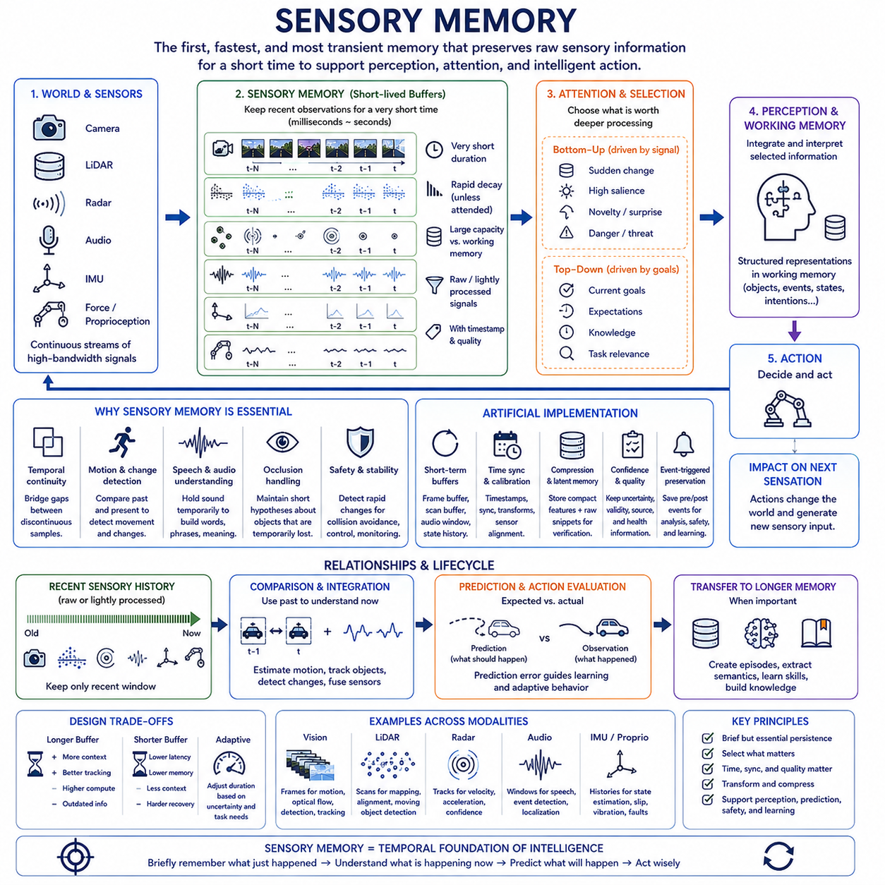{width="7.268055555555556in" height="7.268055555555556in"}

감각 기억(Sensory Memory)은 인간 기억 시스템에서 가장 초기이면서 가장 일시적인 단계로, 원래의 자극이 사라진 이후에도 들어온 감각 정보를 매우 짧은 시간 동안 보존합니다. 이는 외부 세계와 상위 인지 과정(Higher Cognitive Processes) 사이에 일시적인 연속성을 제공하여 감각 신호가 지속적으로 변화하고, 사라지고, 다시 나타나는 상황에서도 지각(Perception)이 안정적으로 유지되도록 합니다.

환경은 인지가 의식적으로 처리할 수 있는 양보다 훨씬 많은 감각 정보를 지속적으로 생성합니다. 빛은 눈에 도달하고, 소리는 귀에 도달하며, 압력은 피부를 자극하고, 근육과 관절의 신호는 신체 구성(Body Configuration)을 설명합니다. 감각 기억은 이러한 신호의 일부를 잠시 보존하고, 이후 주의(Attention)가 어떤 정보를 더 깊이 처리할지를 결정합니다.

감각 기억은 일반적인 장기 저장(Long-Term Storage)과 근본적으로 다릅니다. 그 목적은 경험을 수분, 수일, 수년 동안 보존하는 것이 아니라 지각 시스템이 시간에 걸쳐 정보를 통합할 수 있을 만큼 짧게 표현을 유지하는 것입니다. 대부분의 감각 흔적(Sensory Traces)은 주의나 작업 관련성(Task Relevance)에 의해 선택되지 않으면 빠르게 사라집니다.

이러한 일시적 지속성은 물리적 센싱이 본질적으로 불연속적이기 때문에 중요합니다. 눈은 빠른 도약안구운동(Saccades)을 수행하고, 객체는 일시적으로 가려지며, 소리는 변화하는 음향 패턴으로 도착하고, 신체 움직임은 감각 입력을 계속 변화시킵니다. 감각 기억은 이러한 중단 사이를 연결하여 인지가 비교적 연속적이고 일관된 세계를 경험하도록 합니다.

시각 감각 기억(Visual Sensory Memory)은 일반적으로 도상 기억(Iconic Memory)과 관련됩니다. 도상 기억은 자극이 사라진 이후에도 시각 정보를 잠시 보존하며, 형태, 위치, 방향, 밝기, 공간적 배열과 같은 특징을 유지할 수 있습니다. 지속 시간은 매우 짧지만 연속적인 시각 샘플이 하나의 통합된 지각 경험에 기여하기에는 충분합니다.

도상 기억은 무기한 자세히 들여다볼 수 있는 사진처럼 작동하지 않습니다. 정보는 빠르게 감쇠하고 일부만 이후의 인지 처리에 전달됩니다. 따라서 주의는 일시적인 시각 표현에서 어떤 요소가 더 안정적인 작업 기억(Working Memory) 표현으로 전달될지를 결정하는 중요한 선택 메커니즘으로 작동합니다.

청각 감각 기억(Auditory Sensory Memory)은 일반적으로 잔향 기억(Echoic Memory)과 관련됩니다. 음향 정보는 실제 소리가 끝난 후에도 짧은 시간 동안 이용 가능하며, 일반적으로 시각 감각 흔적보다 더 오래 지속됩니다. 이를 통해 청각 시스템은 음소, 단어, 음조, 환경 소리, 시간적 패턴의 연속을 의미 있는 구조로 통합할 수 있습니다.

잔향 기억은 청각 정보가 시간에 따라 전개되기 때문에 특히 중요합니다. 하나의 문장은 완전한 공간 패턴처럼 동시에 지각될 수 없습니다. 뒤의 소리가 도착하는 동안 앞의 소리가 일시적으로 유지되어야 합니다. 이러한 짧은 음향 지속성은 연속 정보를 단어, 문장, 멜로디, 인식 가능한 사건으로 결합할 수 있게 합니다.

다른 감각 양식도 일시적인 보존 형태를 가집니다. 촉각 감각 기억(Haptic Sensory Memory)은 접촉, 압력, 진동, 질감, 물리적 접촉과 관련된 정보를 잠시 유지할 수 있습니다. 고유수용감각(Proprioceptive)과 전정감각(Vestibular) 정보는 신체 구성, 움직임, 방향, 균형을 짧게 표현하여 환경과 상호작용하는 동안 물리적 상태에 대한 연속적인 인식을 지원합니다.

따라서 감각 기억은 하나의 단일한 버퍼라기보다 감각 양식별 임시 표현(Modality-Dependent Temporary Representations)의 집합으로 이해해야 합니다. 서로 다른 감각 시스템은 서로 다른 샘플링 속도, 시간 해상도, 지속 시간을 가집니다. 각 기억 흔적의 특성은 해당 감각 양식의 물리적 특성과 계산 요구사항을 반영합니다.

감각(Sensation)과 감각 기억의 관계는 지각과 밀접하게 연결됩니다. 센서 또는 생물학적 수용기(Receptors)는 먼저 물리적 자극에 반응하지만, 지각을 위해서는 이러한 신호가 의미 있는 구조로 조직되어야 합니다. 감각 기억은 여러 샘플을 비교하고, 통합하고, 필터링하고, 해석할 수 있는 짧은 시간 창(Temporal Window)을 제공합니다.

시간적 통합(Temporal Integration)은 약간 다른 시점에 도착한 정보가 동일한 지각 사건에 기여할 수 있도록 합니다. 움직이는 객체는 망막에 지속적으로 변화하는 패턴을 만들지만, 인지는 일반적으로 서로 무관한 이미지들의 연속이 아니라 하나의 지속적인 객체로 인식합니다. 짧은 감각 표현은 지각 시스템이 정체성, 위치, 방향, 움직임을 추정하는 동안 연속성을 유지하도록 합니다.

공간적 통합(Spatial Integration)도 중요합니다. 시각 정보는 하나의 완벽하게 안정된 관찰이 아니라 여러 번의 안구 움직임을 통해 획득될 수 있습니다. 감각 지속성은 주의가 다른 곳으로 이동하는 동안 최근 관찰된 공간적 특징을 잠시 유지합니다. 이후 상위 인지 과정은 이러한 조각을 더 일관된 주변 장면 표현으로 결합할 수 있습니다.

주의는 어떤 감각 흔적이 더 깊은 인지 처리로 전달될지를 결정합니다. 대부분의 감각 정보는 의식적으로 접근 가능해지거나 작업 기억에 들어가지 못한 채 사라집니다. 현재 목표, 예상하지 못한 변화, 높은 현저성(Salience), 위험, 새로움, 학습된 관련성과 연결된 신호는 주의를 끌어 추가 처리를 받을 가능성이 높습니다.

이러한 선택적 전환은 인지 시스템이 과부하되는 것을 방지합니다. 감각 환경에는 방대한 정보가 존재하지만 작업 기억의 용량은 제한되어 있습니다. 감각 기억은 적극적으로 조작할 수 있는 양보다 많은 정보를 잠시 유지하고, 주의는 그중 작은 일부를 의식적 추론과 의사결정을 위해 선택하는 병목(Bottleneck) 역할을 합니다.

상향식 주의(Bottom-Up Attention)는 감각 신호 자체의 특성에 의해 유발될 수 있습니다. 갑작스러운 움직임, 예상하지 못한 소리, 강한 섬광, 큰 진동, 갑작스러운 접촉은 자동으로 처리 자원을 끌어올 수 있습니다. 이러한 메커니즘은 현재의 의도적 목표와 직접 관련되지 않더라도 잠재적으로 중요한 환경 변화를 탐지하는 데 유용합니다.

하향식 주의(Top-Down Attention)는 목표, 기대, 기존 지식에 의해 유도됩니다. 특정 객체를 찾을 때 관련 시각 특징이 더 높은 처리 우선순위를 받을 수 있습니다. 특정 경보를 기다릴 때 청각 시스템은 예상되는 패턴에 더 민감해질 수 있습니다. 따라서 기억과 작업 문맥은 어떤 감각 정보가 초기의 일시적 표현을 넘어 유지될지를 결정합니다.

예측(Prediction) 역시 감각 처리를 형성합니다. 인지 시스템은 다음에 어떤 감각 신호가 나타날지에 대한 기대를 지속적으로 생성합니다. 들어오는 정보는 이러한 예측과 비교될 수 있으며, 예상되는 신호는 효율적으로 처리하고 예상과 다른 차이에는 추가 주의를 할당할 수 있습니다. 감각 기억은 이러한 비교에 필요한 최근 시간적 문맥을 제공합니다.

따라서 예측 오류(Prediction Error)는 일시적인 정보가 더 중요하게 보존될지를 결정할 수 있습니다. 일상적인 시각 패턴은 추가 처리 없이 사라질 수 있지만 예상하지 못한 객체 움직임은 주의와 더 깊은 부호화를 유발할 수 있습니다. 새로움과 놀라움(Surprise)은 감각 사건의 정보 가치를 효과적으로 증가시킵니다.

감각 기억은 변화 탐지(Change Detection)도 지원합니다. 어떤 것이 변했다는 것을 판단하려면 직전 상태가 무엇이었는지에 대한 정보가 필요합니다. 이전 감각 상태의 짧은 표현을 현재 관찰과 비교함으로써 위치, 외형, 소리, 접촉, 움직임의 변화를 탐지할 수 있습니다.

움직임 지각(Motion Perception)은 명확한 사례를 제공합니다. 속도나 방향을 추정하려면 하나의 순간적 관찰만 분석해서는 충분하지 않고 시간에 걸쳐 감각 정보를 비교해야 합니다. 일시적인 시각 흔적은 지각 메커니즘이 객체의 연속된 위치를 연결하고 일관된 움직임을 추론할 수 있게 합니다.

감각 기억은 음성 지각(Speech Perception)에도 유사하게 기여합니다. 개별 음향 요소는 순차적으로 도착하며 물리적 환경에서는 거의 즉시 사라집니다. 잔향 지속성은 이전 요소를 잠시 유지하여 청각 시스템이 음성 패턴, 단어 경계, 문장 구조, 화자 특성, 의미를 인식할 수 있게 합니다.

감각 기억의 지속 시간은 계산 기능과 밀접하게 관련됩니다. 감각 흔적이 즉시 사라지면 지각은 분절되고 불안정해질 수 있습니다. 반대로 적절한 감쇠 없이 너무 오래 유지되면 오래된 신호가 현재 관찰을 방해할 수 있습니다. 따라서 빠른 감쇠(Decay)는 시간적 연속성과 환경 변화에 대한 반응성 사이의 균형을 제공합니다.

감쇠는 감각 기억의 정의적 특성 중 하나입니다. 정보는 주의를 받거나 다른 표현으로 변환되지 않으면 빠르게 이용 가능성을 잃습니다. 이러한 감쇠를 단순한 실패로 볼 필요는 없습니다. 오래된 감각 세부사항이 축적되는 것을 방지하고 인지 시스템이 환경의 최신 상태에 반응하도록 하기 때문입니다.

간섭(Interference)은 감각 흔적이 더 빠르게 사라지도록 할 수 있습니다. 새로운 시각 또는 청각 정보는 최근 저장된 정보를 덮어쓰거나, 마스킹하거나, 경쟁할 수 있습니다. 빠르게 변화하는 환경에서는 최신 관찰이 오래된 관찰보다 행동에 더 관련성이 높기 때문에 이러한 대체가 현재 상태의 정확한 표현을 유지하는 데 유리할 수 있습니다.

감각 기억과 작업 기억은 밀접하게 관련되지만 기능적으로 구분됩니다. 감각 기억은 비교적 원시적이거나 가볍게 처리된 정보를 매우 짧게 보존하는 반면, 작업 기억은 선택되고 점점 더 구조화된 정보를 능동적 추론을 위해 유지합니다. 주의와 지각적 해석은 이 두 수준 사이의 중요한 전환을 제공합니다.

예를 들어 시각 장면은 처음에 풍부하지만 빠르게 사라지는 감각 표현을 만들 수 있습니다. 주의는 그 장면에서 움직이는 사람을 선택하고, 지각은 그 개체를 보행자로 식별하며, 작업 기억은 이후 보행자의 위치, 방향, 추정 의도, 현재 작업과의 관련성과 같은 정보를 유지할 수 있습니다.

이러한 변환은 기억이 점차 더 추상화된다는 것을 보여줍니다. 초기 감각 기억은 신호 수준의 특성을 보존할 수 있지만, 이후의 인지 단계에서는 점점 객체, 관계, 사건, 의미, 목표를 표현합니다. 추상화는 행동에 가장 유용한 정보를 유지하면서 활성 상태로 보존해야 하는 정보의 양을 줄입니다.

따라서 감각 기억은 정보 압축(Information Compression)과 밀접하게 관련됩니다. 외부 세계는 고차원의 신호를 생성하지만 지능적 행동은 모든 측정값을 보존할 필요가 거의 없습니다. 지각 처리는 일시적인 감각 흔적에서 중요한 구조를 추출하고 압축된 표현을 작업 기억이나 장기 기억 시스템으로 전달합니다.

동일한 원리는 인공지능(Artificial Intelligence)과 로보틱스(Robotics)에 강한 시사점을 가집니다. 로봇은 카메라, 라이다, 레이더, 마이크, IMU, 힘 센서, 엔코더, 기타 장치로부터 높은 대역폭의 스트림을 지속적으로 수신합니다. 모든 과거 측정값을 무기한 처리하면 막대한 계산, 대역폭, 저장공간이 필요하지만 즉각적 행동에는 추가 가치가 제한적일 수 있습니다.

따라서 인공 감각 기억(Artificial Sensory Memory)은 최근 센서 관찰을 유지하는 짧은 시간 버퍼(Temporal Buffer)로 구현할 수 있습니다. 카메라 프레임, 포인트 클라우드(Point Clouds), 레이더 탐지값, 관성 측정값, 관절 상태, 오디오 구간을 밀리초에서 수초 동안 유지하여 지각 알고리즘이 각각의 관찰을 독립적으로 처리하지 않고 시간적 관계를 분석할 수 있도록 합니다.

프레임 버퍼(Frame Buffer)는 인공 시각 감각 기억의 단순한 예입니다. 현재 카메라 이미지 하나만 처리하는 대신 최근 여러 프레임을 유지합니다. 이를 통해 움직임 추정(Motion Estimation), 옵티컬 플로우(Optical Flow), 객체 추적(Object Tracking), 시간 필터링, 비디오 이해(Video Understanding), 단일 이미지로는 신뢰성 있게 추론하기 어려운 변화 탐지가 가능해집니다.

라이다 시스템 역시 최근 포인트 클라우드를 유지할 수 있습니다. 여러 스캔을 추정된 로봇 움직임에 따라 정렬하고 결합하면 기하학적 이해를 개선할 수 있습니다. 일시적인 스캔 이력은 이동 객체를 식별하고, 측정 잡음을 줄이고, 속도를 추정하고, 희소 관찰을 보완하고, 표면이 잠시 가려졌을 때도 인식을 유지하는 데 도움을 줍니다.

레이더 감각 기억(Radar Sensory Memory)은 동적 객체 추적에 특히 유용합니다. 개별 레이더 측정은 잡음, 불확실한 데이터 연관(Data Association), 간헐적 탐지를 포함할 수 있습니다. 최근 관찰을 유지하면 필터링과 추적 알고리즘이 단일 측정값 대신 시간에 따른 위치, 속도, 가속도, 신뢰도를 추정할 수 있습니다.

IMU 측정값은 본질적으로 시간적 통합을 필요로 합니다. 가속도와 각속도는 시간에 따른 변화와 함께 해석되어야 의미가 있습니다. 짧은 이력은 필터링, 움직임 추정, 진동 분석, 이상 탐지(Anomaly Detection), 카메라·라이다·휠 엔코더·GNSS와의 센서 융합(Sensor Fusion)을 지원합니다.

오디오 처리 역시 일시적 감각 버퍼의 이점을 얻습니다. 음성 인식, 음향 사건 탐지, 음원 위치 추정, 화자 식별은 순간적인 단일 샘플이 아니라 소리의 시퀀스를 필요로 합니다. 짧은 오디오 윈도(Audio Window)는 최근 음향 구조를 이후 해석을 위해 유지한다는 점에서 잔향 기억과 유사한 역할을 수행합니다.

로봇 고유수용감각(Proprioception) 역시 유사한 시간적 연속성을 필요로 합니다. 엔코더 위치, 모터 전류, 관절 토크, 휠 속도, 배터리 신호, 온도, 액추에이터 피드백은 지속적으로 변화합니다. 최근 이력은 단일 측정값만으로는 확인하기 어려운 슬립, 충돌, 기계적 저항, 불안정성, 비정상 진동, 액추에이터 성능 저하를 드러낼 수 있습니다.

인공 감각 기억은 시간 관계가 멀티센서 지각(Multi-Sensor Perception)의 핵심이므로 타임스탬프(Timestamp)를 보존해야 합니다. 카메라, 라이다, 레이더, IMU, GNSS, 액추에이터 측정값은 서로 다른 주기와 지연시간으로 도착할 수 있습니다. 정확한 타임스탬프를 사용하면 시스템이 어떤 관찰들이 대략 동일한 물리적 시점을 나타내는지 재구성할 수 있습니다.

따라서 시간 동기화(Time Synchronization)는 핵심적인 공학 요구사항이 됩니다. 정확한 동기화가 없으면 로봇이나 주변 객체가 측정 사이에 이동하기 때문에 최근 센서 기억을 결합하면서 잘못된 관계를 만들 수 있습니다. 하드웨어 트리거(Hardware Triggering), 정밀 시계, 정밀 시간 프로토콜(PTP), 타임스탬프 보정, 움직임 보상(Motion Compensation)은 시간적 일관성을 유지하는 데 도움을 줍니다.

보정(Calibration)도 동일하게 중요합니다. 서로 다른 센서 양식의 일시적인 관찰은 좌표 관계가 정확히 알려져 있지 않으면 올바르게 융합할 수 없습니다. 카메라 이미지, 라이다 포인트, 레이더 탐지, 로봇 상태는 최근 이력을 하나의 일관된 표현으로 결합하기 전에 호환되는 기준 좌표계(Reference Frame)로 변환되어야 합니다.

감각 기억은 부분 관측(Partial Observability) 상황에서 특히 유용합니다. 로봇은 장애물에 의한 가림(Occlusion), 제한된 센서 시야각(Field of View), 환경 조건에 따른 성능 저하 때문에 모든 관련 객체를 계속 관찰할 수 없습니다. 최근 감각 흔적은 직접 관찰에서 사라진 개체에 대한 임시 가설을 유지할 수 있도록 합니다.

객체 추적은 일시적 탐지를 지속적인 단기 개체(Persistent Short-Term Entity)로 변환합니다. 보행자가 한 카메라 프레임에서 탐지된 후 장애물 뒤로 잠시 사라졌다가 다시 나타날 수 있습니다. 시간 기억은 정체성을 유지하고 예상 움직임을 추정하며 새 관찰을 이전에 탐지한 객체와 연결할 수 있게 합니다.

이 과정은 감각 기억에서 인지 상태(Cognitive State)로 이동하는 중요한 전환을 나타냅니다. 원시 관찰은 정체성, 위치, 속도, 의미 범주, 신뢰도, 이력을 가진 지속적 객체 수준 표현으로 변환됩니다. 시스템은 더 이상 해당 개체에 대해 추론하기 위해 모든 픽셀이나 포인트를 유지할 필요가 없습니다.

멀티모달 융합(Multi-Modal Fusion)은 일시적인 센서 흔적을 통합된 상태로 더욱 변환합니다. 카메라는 객체를 보행자로 식별하고, 라이다는 정확한 기하학을 제공하며, 레이더는 상대 속도를 추정할 수 있습니다. 최근 측정값을 결합하면 개별 센서만으로는 얻기 어려운 더 풍부한 표현을 만들 수 있습니다.

인공 감각 기억의 길이는 작업과 센서 특성에 따라 달라져야 합니다. 고속 모터 제어에는 몇 밀리초의 이력만 필요할 수 있고, 객체 추적에는 수초가 필요할 수 있으며, 음향 이해에는 더 긴 시간 창이 필요할 수 있습니다. 유용한 지속 시간은 관찰 대상 동역학에 따라 결정되므로 보편적으로 최적의 버퍼 길이는 존재하지 않습니다.

더 긴 감각 버퍼는 더 많은 시간적 문맥을 제공하지만 계산 비용을 증가시키고 오래된 정보를 유지할 가능성도 높입니다. 짧은 버퍼는 지연시간과 메모리 요구를 줄이지만 느린 동역학을 추정하거나 일시적 가림에서 복구하는 데 필요한 정보를 잃을 수 있습니다. 따라서 기억 지속 시간은 정확도, 지연시간, 계산량, 반응성 사이의 공학적 트레이드오프(Tradeoff)입니다.

적응형 기억 지속 시간(Adaptive Memory Duration)은 이러한 트레이드오프를 개선할 수 있습니다. 일상적인 운용에서는 짧은 이력을 사용하고, 불확실하거나 비정상적인 사건에서는 일시적으로 유지 시간을 늘릴 수 있습니다. 객체가 가려지거나, 위치 추정 신뢰도가 낮아지거나, 안전 사건이 발생하면 분석과 복구를 위해 더 긴 센서 이력을 보존할 수 있습니다.

이벤트 트리거 감각 기억(Event-Triggered Sensory Memory)도 저장 요구량을 줄일 수 있습니다. 지속적으로 동작하는 순환 버퍼(Circular Buffer)는 정상 운용 중에는 가장 최근 관찰만 유지합니다. 중요한 사건이 발생하면 사건 전후 몇 초의 데이터를 보존하여 디버깅, 안전 분석, 미래 학습에 사용할 수 있는 압축된 에피소드로 만들 수 있습니다.

이러한 사건 이전 이력(Pre-Event History)은 고장의 원인이 고장 자체가 명확해지기 전에 발생하는 경우가 많기 때문에 특히 중요합니다. 로봇이 갑자기 충돌하거나, 위치 추정을 잃거나, 예상하지 못하게 정지했을 때 최근 감각 기억을 보면 누락 탐지, 휠 슬립, 센서 성능 저하, 예상하지 못한 인간 움직임, 제어 불안정이 앞서 발생했는지를 확인할 수 있습니다.

따라서 감각 기억은 관측 가능성(Observability)과 추적 가능성(Traceability)에 기여합니다. 최근 원시 또는 중간 관찰을 유지하면 엔지니어가 시스템이 사건을 어떻게 해석했는지를 재구성할 수 있습니다. 최종 행동만으로는 특정 의사결정이 왜 발생했는지 알 수 없는 경우가 많기 때문에 자율 시스템 검증에서 중요합니다.

단기 감각 데이터는 자기지도학습(Self-Supervised Learning)을 위한 학습 자료로도 활용할 수 있습니다. 연속된 관찰은 자연스럽게 시간적 관계를 포함합니다. 모델은 완전한 수작업 라벨링 없이도 미래 프레임, 마스킹된 특징, 객체 움직임, 자기 움직임(Ego-Motion), 센서 간 대응관계, 행동으로 발생하는 변화를 예측하며 학습할 수 있습니다.

시간적 일관성(Temporal Consistency)은 강력한 자기지도 신호를 제공합니다. 한 프레임에서 식별된 객체는 다음 프레임의 인접 위치에 나타난 객체와 관련될 가능성이 높습니다. 시점 변화, 움직임, 조명 변화, 센서 잡음에도 안정적으로 유지되는 특징은 감각 기억에 저장된 최근 관찰을 비교하여 학습할 수 있습니다.

교차 양식 예측(Cross-Modal Prediction)은 이러한 접근을 확장할 수 있습니다. 카메라 관찰로 라이다 구조를 예측하거나, 시각적 움직임을 IMU 측정과 비교하거나, 레이더 움직임으로 객체 추적을 제약할 수 있습니다. 감각 기억은 이러한 관계를 학습할 수 있는 동기화된 멀티모달 시퀀스를 보존합니다.

약지도학습(Weakly Supervised Learning)은 최근 감각 시퀀스와 연결된 불완전한 라벨을 추가적으로 활용할 수 있습니다. 로봇 이벤트, 인간 수정, 내비게이션 결과, 작업 성공 여부, 지도 정보, 기존 탐지기는 대략적인 지도 신호를 제공할 수 있습니다. 이러한 신호를 시간적 일관성과 결합하면 대규모 운영 데이터에서 유용한 표현을 학습할 수 있습니다.

감각 기억은 예측형 월드 모델(Predictive World Models)에 필요한 즉각적인 역사적 문맥도 제공합니다. 미래를 예측하려면 현재 상태 하나만 보는 것보다 최근 움직임을 이해해야 하는 경우가 많습니다. 최근 상태 여러 개를 이용하면 모델은 미래 변화 예측 전에 속도, 가속도, 상호작용 추세, 시간 의존성을 추정할 수 있습니다.

피지컬 AI(Physical AI)에서는 월드 상태 추정(World-State Estimation)에 일반적으로 시간적 문맥을 포함해야 함을 의미합니다. 단일 카메라 프레임은 객체가 어디에 있는지를 보여줄 수 있지만 시퀀스는 객체가 어떻게 움직이는지를 보여줍니다. 단일 힘 측정은 접촉 여부를 나타낼 수 있지만 시퀀스는 접촉력이 증가하는지, 안정적인지, 진동하는지, 위험한 수준에 접근하는지를 보여줄 수 있습니다.

트랜스포머 기반 아키텍처(Transformer-Based Architectures)는 최근 감각 토큰(Sensory Tokens)의 시퀀스를 시간적 문맥으로 사용할 수 있습니다. 순환 신경망(Recurrent Neural Networks)과 상태공간 모델(State-Space Models)은 이전 관찰의 압축된 요약을 유지할 수 있습니다. 시간 합성곱(Temporal Convolution), 어텐션 메커니즘, 메모리 토큰, 학습된 잠재 상태는 모든 원시 측정값을 유지하지 않고도 감각 이력을 표현하는 서로 다른 방법을 제공합니다.

잠재 감각 기억(Latent Sensory Memory)은 최근 관찰을 학습된 내부 표현으로 압축합니다. 활성 추론을 위해 전체 해상도 프레임이나 포인트 클라우드를 저장하는 대신 인코더(Encoder)가 이를 압축된 특징으로 변환할 수 있습니다. 이러한 특징은 메모리 대역폭과 계산 요구를 크게 줄이면서 작업 관련 시간 정보를 유지할 수 있습니다.

그러나 압축은 안전과 행동에 중요한 정보를 보존해야 합니다. 과도한 추상화는 작은 장애물, 비정상 움직임, 약한 접촉 신호, 기타 드물지만 중요한 세부사항을 제거할 수 있습니다. 따라서 시스템은 일상적인 추론에는 압축된 잠재 기억을 사용하면서 검증 또는 복구를 위해 짧은 원시 데이터 버퍼를 함께 유지할 수 있습니다.

감각 기억은 지각-행동 루프(Perception-Action Loop)와 강하게 상호작용합니다. 행동은 다음에 수신하게 될 감각 정보를 변화시킵니다. 로봇이 카메라를 회전시키고, 속도를 변경하고, 장애물 주변으로 이동하고, 객체를 파지하거나, 표면에 접촉하면 그 결과로 새로운 관찰이 생성되며 이전 감각 흔적과 비교할 수 있습니다.

이 비교를 통해 시스템은 행동이 예상한 결과를 만들었는지 판단할 수 있습니다. 조향 명령이 로봇을 회전시켜야 하는데 시각, 관성, 엔코더 이력이 거의 움직임을 나타내지 않는다면 그 차이는 휠 슬립, 기계적 걸림, 액추에이터 고장, 잘못된 상태 추정을 의미할 수 있습니다.

순방향 모델(Forward Models)은 행동에서 예상되는 감각 결과를 예측할 수 있습니다. 이 예측은 이후 감각 기억과 비교되고 현실이 기대와 다를 경우 오류 신호를 생성합니다. 이를 통해 감각 기억, 예측, 행동 모니터링, 학습이 직접적으로 연결됩니다.

능동적 지각(Active Perception)은 이러한 관계를 더욱 명확하게 보여줍니다. 감각 증거가 모호하면 에이전트는 미래 관찰을 개선하기 위해 의도적으로 행동할 수 있습니다. 객체에 더 가까이 이동하거나, 관점을 바꾸거나, 어두운 영역에 조명을 비추거나, 속도를 줄이거나, 매니퓰레이터를 재배치할 수 있습니다. 감각 기억은 이러한 행동 전후에 수집된 관찰을 통합합니다.

기억 품질(Memory Quality)에는 신뢰도와 불확실성이 포함되어야 합니다. 최근 관찰이라고 해서 반드시 정확한 것은 아닙니다. 센서는 잡음이 많거나, 포화되거나, 가려지거나, 잘못 보정되거나, 설계 범위를 벗어난 조건에서 작동할 수 있습니다. 따라서 가능하다면 일시적인 표현은 품질 지표(Quality Indicators)를 함께 보존해야 합니다.

신뢰도 인식 감각 기억(Confidence-Aware Sensory Memory)은 이후 지각 과정이 관찰에 적절한 가중치를 적용하도록 합니다. 조명이 나쁜 상황에서는 잡음이 많은 카메라 관찰보다 명확한 라이다 탐지가 더 큰 영향을 줄 수 있으며, 안개나 먼지가 심한 환경에서는 레이더의 중요성이 증가할 수 있습니다. 기억의 상대적 가치는 환경 조건에 따라 변할 수 있습니다.

시스템은 관찰 시각(Observation Time)과 처리 시각(Processing Time)도 구분해야 합니다. 측정값은 실제로 획득된 시점보다 늦게 수신되거나 처리될 수 있습니다. 고속 로봇에서는 작은 지연시간 차이도 큰 공간 오류를 만들 수 있습니다. 따라서 가능하면 감각 기억 아키텍처는 물리적인 획득 시각을 기준으로 데이터를 구성해야 합니다.

메모리 버퍼는 데이터 손실과 불규칙한 샘플링(Irregular Sampling)도 고려해야 합니다. 센서는 프레임을 놓칠 수 있고, 네트워크는 패킷을 지연시킬 수 있으며, 계산 부하는 처리 주기를 불규칙하게 만들 수 있습니다. 강건한 시간 모델은 샘플이 항상 일정한 간격으로 들어온다고 잘못 가정하지 않고 누락된 관찰을 인식해야 합니다.

감각 기억은 안전(Safety)에 직접적인 시사점을 가집니다. 충돌 회피, 비상 제동, 안정성 제어, 인간 인식 내비게이션은 최근 관찰에서 빠른 변화를 탐지해야 하는 경우가 많습니다. 적절한 짧은 이력을 유지하면 단일 측정값이 정적 임계값을 넘기 전에 접근하는 위험을 탐지할 수 있습니다.

안전 시스템은 상위 AI 구성요소와 독립된 감각 버퍼를 사용할 수도 있습니다. 결정론적 제어기는 학습형 지각 모델이 지연되거나 사용할 수 없는 경우에도 최근 거리, 속도, 힘, 안정성 측정값을 유지할 수 있습니다. 이러한 분리는 안전 중요 행동에 추가적인 회복탄력성(Resilience)을 제공합니다.

인간-로봇 상호작용(Human-Robot Interaction) 역시 단기 감각 연속성에 의존합니다. 제스처, 시선, 음성, 움직임, 협업 행동을 이해하려면 시간에 걸쳐 관찰을 통합해야 합니다. 하나의 인간 자세는 모호할 수 있지만 짧은 시퀀스는 사람이 접근하고 있는지, 가리키는지, 멈추는지, 물체를 건네는지, 주의를 알리는지를 보여줄 수 있습니다.

따라서 감각 기억은 의도 추정(Intent Estimation)에도 기여할 수 있습니다. 사람, 차량, 다른 로봇의 최근 궤적은 예상되는 미래 행동에 대한 증거를 제공합니다. 이러한 추정은 작업 기억이나 월드 모델로 전달되어 더 긴 시간 범위의 예측 및 계획에 사용될 수 있습니다.

멀티에이전트 로보틱스(Multi-Agent Robotics)에서는 감각 기억을 다른 로봇으로부터 받은 관찰과 결합할 수 있습니다. 로컬 관찰은 즉각적인 증거를 제공하고, 공유 탐지는 로컬 시야를 넘어 인식을 확장할 수 있습니다. 서로 다른 에이전트의 관찰은 지연과 불확실성이 다를 수 있기 때문에 시간 정렬과 출처 추적(Source Tracking)이 필수적입니다.

엣지 컴퓨팅(Edge Computing)은 원시 센서 스트림의 대역폭이 매우 높고 즉각적인 처리가 지연시간에 민감하기 때문에 대부분의 인공 감각 기억을 구현하기에 자연스러운 위치입니다. 최근 카메라 프레임, 포인트 클라우드, 레이더 반사, 고유수용 데이터를 지각, 상태 추정, 예측, 안전을 위해 로봇 가까이에 유지하는 것이 일반적으로 적절합니다.

온프레미스 시스템(On-Premise Systems)은 모든 원시 관찰을 지속적으로 받는 대신 선택된 감각 구간을 수신할 수 있습니다. 중요한 에피소드, 실패, 이상 현상, 인간 개입, 대표적인 학습 샘플을 장기 저장 및 모델 개선을 위해 전송할 수 있습니다. 이를 통해 일시적 운영 기억과 지속적인 학습 아카이브를 분리할 수 있습니다.

따라서 감각 기억에서 일화 기억(Episodic Memory)으로의 전환은 이벤트 기반으로 이루어질 수 있습니다. 대부분의 최근 센서 흔적은 순환 버퍼가 진행하면서 사라지지만 중요한 사건이 발생하면 관련 시간 구간을 보존합니다. 이후 작업 상태, 로봇 상태, 행동 이력, 예측, 결과를 결합하여 의미 있는 에피소드를 구성할 수 있습니다.

이러한 과정은 인지적 공고화(Cognitive Consolidation)와 유사합니다. 고대역폭의 일시적 정보는 지속적으로 생성되지만 그중 일부만 지속 기억으로 전환됩니다. 새로움, 관련성, 불확실성, 실패, 인간 개입, 학습 가치에 따른 선택을 사용하면 장기 저장소가 반복적인 운영 데이터로 과부하되는 것을 막을 수 있습니다.

감각 버퍼에는 이미지, 음성, 위치 정보, 사람에 대한 관찰이 포함될 수 있기 때문에 개인정보 보호(Privacy)와 보안(Security) 역시 고려해야 합니다. 짧게 유지되는 데이터라 하더라도 응용 분야와 운영 환경에 따라 접근 제어, 보존 정책, 암호화, 익명화, 전송 제한이 필요할 수 있습니다.

인공 감각 기억의 평가는 저장 용량만을 고려해서는 안 됩니다. 중요한 지표에는 시간적 범위(Temporal Coverage), 동기화 정확도, 검색 지연시간, 정보 손실, 압축 품질, 누락 샘플에 대한 강건성, 지각 정확도 향상 정도, 폐루프 행동에 미치는 영향이 포함됩니다.

가장 적절한 평가는 작업 의존적입니다. 객체 추적용 버퍼는 정체성 유지와 움직임 추정을 얼마나 개선하는지를 기준으로 평가해야 하고, 로봇 제어용 버퍼는 안정성, 반응성, 고장 탐지를 얼마나 향상시키는지를 기준으로 평가해야 합니다. 기억의 품질은 궁극적으로 행동에 얼마나 기여하는지에 의해 정의됩니다.

감각 기억은 지능 시스템이 모든 정보를 동일한 기간 동안 기억할 필요가 없다는 인지 아키텍처의 더 넓은 원리를 보여줍니다. 정보마다 유용한 수명이 다릅니다. 원시 감각 세부사항은 밀리초 또는 수초 동안 가치가 있을 수 있지만, 추출된 객체, 사건, 규칙, 학습된 기술은 훨씬 더 오래 유용할 수 있습니다.

계층적 기억 시스템(Hierarchical Memory System)은 이러한 차이를 이용하여 정보를 점진적으로 변환합니다. 원시 관찰은 일시적인 감각 기억에 들어가고, 선택된 정보는 활성 작업 기억이 되며, 의미 있는 사건은 일화 기억으로 전환될 수 있고, 반복되는 패턴은 의미 지식(Semantic Knowledge)이 되며, 성공적인 행동은 절차 기술(Procedural Skills)로 발전할 수 있습니다.

인지과학(Cognitive Science)의 관점에서 감각 기억은 빠르게 변화하는 물리적 신호에서 어떻게 연속적으로 보이는 지각이 형성될 수 있는지를 설명합니다. 즉각적인 감각과 상위 인지 처리 사이의 시간적 연결 고리를 제공하여 주의와 지각이 어떤 정보를 이후 처리할 가치가 있는지 판단할 시간을 확보합니다.

인공지능(Artificial Intelligence)의 관점에서 감각 기억은 시간적 문맥(Temporal Context)의 중요성을 강조합니다. 지능적 지각은 입력을 항상 서로 독립적인 샘플로 취급해서는 안 됩니다. 최근 이력은 단일 관찰에서 볼 수 없는 움직임, 인과관계, 연속성, 이상 현상, 행동 결과를 드러낼 수 있습니다.

로보틱스와 피지컬 AI에서 감각 기억은 물리적 센싱과 인지 상태를 연결하는 첫 번째 시간 계층을 형성합니다. 센서 융합, 추적, 상태 추정, 능동적 지각, 예측, 제어, 안전 모니터링, 월드 모델링(World Modeling), 학습에 필요한 최근 증거를 제공합니다.

성숙한 감각 기억 아키텍처(Sensory-Memory Architecture)는 짧게 유지되는 멀티모달 버퍼, 정확한 동기화, 불확실성 인식, 선택적 주의, 시간적 통합, 이벤트 탐지, 압축, 상위 기억 시스템으로의 통제된 전달을 결합합니다. 목적은 단순히 최근 데이터를 보존하는 것이 아니라 지능적 해석에 필요한 적절한 시간적 증거를 유지하는 것입니다.

궁극적으로 감각 기억은 지능형 에이전트가 세계를 서로 단절된 스냅샷의 연속이 아니라 연속적인 과정으로 경험할 수 있게 합니다. 방금 감지한 내용을 잠시 유지하고, 현재 감지 중인 내용과 비교하고, 의미 있는 정보를 선택적으로 다음 단계로 전달함으로써 감각 기억은 지각, 예측, 추론, 행동, 적응형 지능(Adaptive Intelligence)이 발전할 수 있는 시간적 기반을 제공합니다.

## 02.02 Working Memory [w/Code]

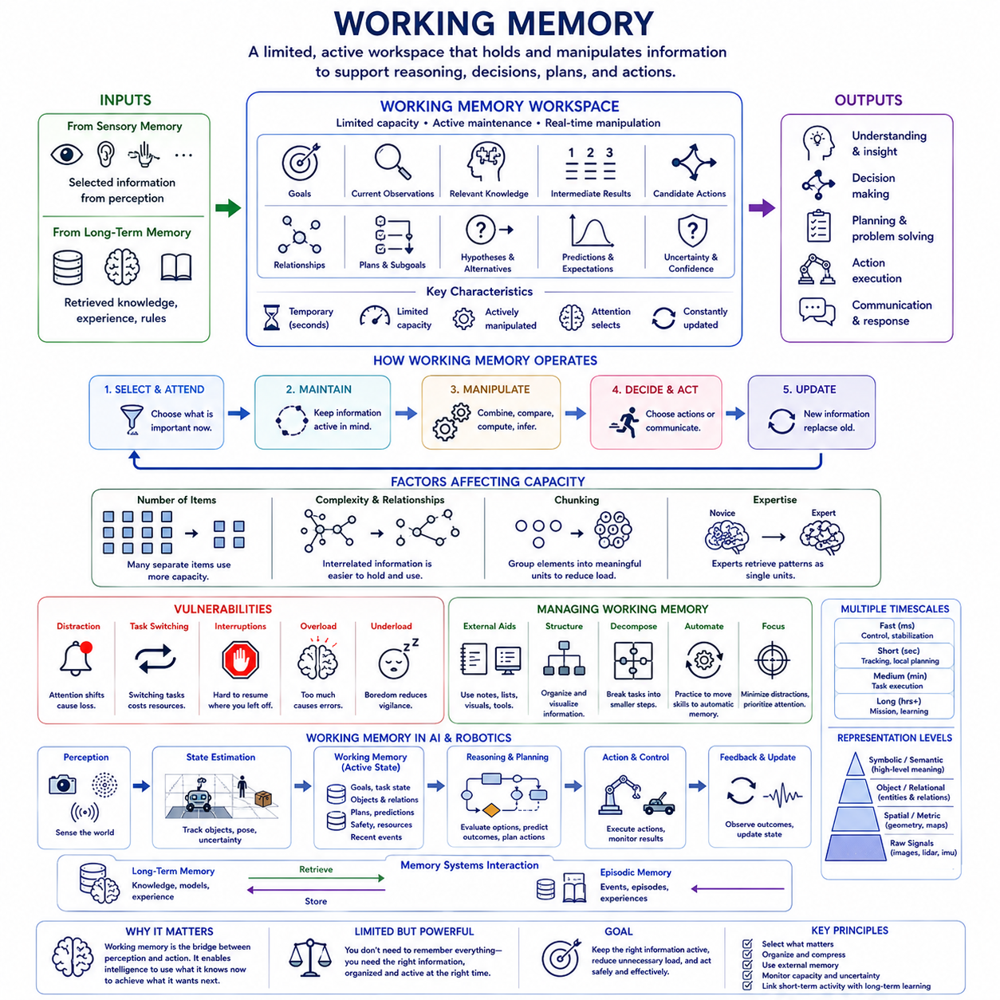{width="7.268055555555556in" height="7.268055555555556in"}

작업 기억(Working Memory)은 현재 진행 중인 추론, 의사결정, 문제 해결, 이해, 행동에 필요한 정보를 일시적으로 유지하면서 능동적으로 조작하는 인지 시스템(Cognitive System)입니다. 수동적인 저장소와 달리 현재 목표, 최근 관찰, 검색된 지식, 중간 결과, 가능한 행동을 하나의 제한된 정신적 작업 공간(Mental Workspace)에서 결합하고 실시간으로 갱신하는 기능을 수행합니다.

작업 기억은 즉각적인 지각(Perception)과 장기 지식(Long-Term Knowledge)을 연결합니다. 감각 처리에서 선택된 정보는 작업 기억으로 들어올 수 있으며, 장기 기억(Long-Term Memory)에서 관련 개념과 경험을 검색하여 동일한 활성 작업 공간에 배치할 수도 있습니다. 이러한 통합을 통해 모든 관련 정보를 영구적으로 활성 상태로 유지하지 않고도 과거 지식을 이용하여 현재 상황을 해석할 수 있습니다.

작업 기억의 용량(Capacity)은 제한되어 있습니다. 상대적으로 적은 양의 정보만 동시에 유지하고 조작할 수 있으며, 이를 초과하면 수행 성능이 저하되기 시작합니다. 이러한 제한은 복잡한 작업에 필요한 모든 정보에 접근할 수 있는 경우에도 추론, 학습, 멀티태스킹(Multitasking), 의사결정에 강한 영향을 미칩니다.

작업 기억의 제한은 단순히 개별 항목의 개수만으로 결정되지 않습니다. 항목의 복잡성과 항목 사이의 관계도 중요합니다. 서로 관련이 없는 여러 요소는 의미 있는 구조로 조직된 더 많은 정보보다 오히려 더 많은 용량을 사용할 수 있습니다. 따라서 인지 효율성(Cognitive Efficiency)은 정보가 어떻게 그룹화되고 표현되며 기존 지식과 연결되는지에 크게 의존합니다.

청킹(Chunking)은 작업 기억의 부담을 줄이는 하나의 방법을 제공합니다. 여러 개별 요소의 관계가 이미 이해되어 있다면 이를 하나의 의미 있는 단위로 결합할 수 있습니다. 초보자는 여러 기술 파라미터를 각각 별도로 처리할 수 있지만 전문가는 이를 하나의 익숙한 서브시스템(Subsystem)으로 인식할 수 있습니다. 청킹은 정보를 효과적으로 압축하여 활성 상태로 유지할 수 있는 유용한 구조의 양을 증가시킵니다.

따라서 전문성(Expertise)은 생물학적 한계 자체를 반드시 변화시키지 않으면서도 작업 기억의 기능적 용량을 변화시킵니다. 잘 발달된 장기 지식을 이용하면 복잡한 패턴을 개별 세부사항으로부터 다시 구성하지 않고 통합된 단위로 검색할 수 있습니다. 이를 통해 전문가는 비정상적인 조건, 전략, 예측, 의사결정에 더 많은 활성 용량을 사용할 수 있습니다.

작업 기억은 선택된 정보만 활성 상태로 유지될 수 있기 때문에 주의(Attention)와 밀접하게 관련됩니다. 주의는 어떤 관찰, 기억, 목표, 사고가 처리 우선순위를 받을지를 결정합니다. 주의가 서로 경쟁하는 작업 사이에서 반복적으로 전환되면 작업 기억의 내용이 감쇠하거나, 다른 정보로 대체되거나, 많은 비용을 들여 다시 구성해야 할 수 있습니다.

작업 전환(Task Switching)은 이러한 취약성을 잘 보여줍니다. 각각의 작업은 고유한 활성 목표, 규칙, 중간 결과, 관련 문맥을 필요로 합니다. 작업을 전환하면 일부 정보를 비활성화하고 다른 구성을 다시 활성화해야 합니다. 따라서 개별 작업 자체가 비교적 단순하더라도 빈번한 작업 전환은 인지 자원을 소비합니다.

중단(Interruption)은 작업에 해결되지 않은 중간 상태가 포함되어 있을 때 특히 큰 영향을 줄 수 있습니다. 복잡한 계산이나 절차를 수행하는 도중 중단된 사람은 다시 돌아왔을 때 정확히 어느 단계까지 완료했는지 기억하지 못할 수 있습니다. 외부 메모, 체크리스트(Checklist), 가시적인 작업 상태, 인터페이스 표시를 사용하면 중단 이후 작업 기억을 재구성해야 하는 부담을 줄일 수 있습니다.

작업 기억은 일시적인 목표도 지원합니다. 다단계 작업(Multi-Step Task)을 수행하는 동안 최종 목표는 활성 상태로 유지되고, 중간 하위 목표(Subgoal)는 생성되고 완료된 후 다른 목표로 교체될 수 있습니다. 이러한 목표 계층이 없다면 행동은 서로 분리된 개별 동작으로 파편화될 수 있습니다. 따라서 목표 상태를 유지하는 것은 계획과 현재 행동이 의도한 결과에 계속 기여하는지를 평가하는 데 필수적입니다.

중간 추론 결과(Intermediate Reasoning Results) 역시 작업 기억의 중요한 내용입니다. 문제를 해결할 때 추가 정보를 처리하면서 가정, 부분 계산 결과, 가능한 설명, 아직 해결되지 않은 대안을 유지해야 할 수 있습니다. 이러한 임시 표현은 현재 의사결정에만 필요하다면 장기 기억으로 전환될 필요가 없습니다.

작업 기억은 관계 정보(Relational Information)도 유지합니다. 지능적 추론은 개별 객체를 기억하는 것뿐 아니라 객체들이 어떻게 연결되어 있는지를 표현해야 하는 경우가 많습니다. 시스템은 하나의 객체가 다른 객체를 막고 있거나, 어떤 작업이 이전 단계에 의존하거나, 사람이 출입구 방향으로 움직이거나, 하나의 가설이 다른 가설과 충돌한다는 사실을 유지해야 할 수 있습니다.

이러한 관계 기능은 계획(Planning)에서 특히 중요합니다. 계획기는 목표, 자원, 제약조건, 행동, 예상 결과 사이의 의존관계를 유지해야 합니다. 너무 많은 관계를 동시에 고려해야 하면 계획이 어려워집니다. 계층적 분해(Hierarchical Decomposition)는 특정 수준에서 추론하면서 다른 수준의 불필요한 세부사항을 숨김으로써 이러한 부담을 감소시킵니다.

정신적 시뮬레이션(Mental Simulation)은 작업 기억에 크게 의존합니다. 사람이 가능한 미래 결과를 상상할 때 현재 환경에 실제로 존재하지 않는 내부 표현을 일시적으로 구성하고 조작합니다. 대안적인 행동의 결과를 평가할 수 있을 만큼 가상의 상태를 활성 상태로 유지하여 여러 행동을 비교할 수 있습니다.

따라서 예측(Prediction)은 작업 기억에 상당한 부담을 줍니다. 현재 상태, 이전 움직임, 후보 행동, 예상되는 미래 상태, 불확실성(Uncertainty), 작업 목표를 서로 조정된 상태로 유지해야 할 수 있습니다. 효율적인 예측 인지는 상세한 원시 감각 정보가 활성 용량을 빠르게 초과하기 때문에 일반적으로 압축된 상태 표현(Compressed State Representation)을 필요로 합니다.

언어 이해(Language Comprehension)는 또 다른 명확한 사례입니다. 문장의 의미는 이전에 등장한 단어, 문법적 관계, 문맥, 이후에 나올 내용에 대한 기대에 의존하는 경우가 많습니다. 작업 기억은 이러한 요소를 일시적으로 보존하여 순차적으로 들어오는 언어를 서로 관련 없는 단어의 집합이 아니라 일관된 구조로 해석할 수 있도록 합니다.

대화(Conversation)도 활성 문맥 기억(Active Contextual Memory)에 의존합니다. 화자와 청자는 현재 주제, 최근 발언, 해결되지 않은 참조 관계, 가정, 의사소통 목표를 유지해야 합니다. 요약이나 구조화 없이 너무 많은 정보가 누적되면 대화의 일관성을 유지하기 어려워집니다.

수학적 및 논리적 추론(Mathematical and Logical Reasoning)도 작업 기억에 의존합니다. 연산을 수행하는 동안 변수, 전제, 중간 변환 결과, 제약조건에 계속 접근할 수 있어야 합니다. 종이, 다이어그램, 방정식, 소프트웨어 도구와 같은 외부 표현(External Representation)은 정보를 인지 시스템 외부에 저장하여 내부 부담을 감소시킵니다.

이는 분산 인지(Distributed Cognition)의 중요성을 보여줍니다. 환경이 외부 기억(External Memory)의 역할을 수행할 수 있다면 작업 기억 내부에 모든 활성 정보를 저장할 필요가 없습니다. 메모, 디스플레이, 대시보드, 지도, 라벨, 시각화는 정보를 지속적으로 정신적으로 유지하지 않고도 필요할 때 확인할 수 있도록 합니다.

외부 기억은 복잡한 기술 작업에서 특히 유용합니다. 로봇의 문제를 분석하는 엔지니어는 로그, 그래프, 다이어그램, 상태 디스플레이를 이용하여 시스템 상태에 대한 정보를 보존할 수 있습니다. 그러면 작업 기억은 모든 개별 측정값을 기억하는 대신 관계와 의사결정에 집중할 수 있습니다.

작업 기억은 인지 부하(Cognitive Load)와 밀접하게 관련됩니다. 인지 부하는 제한된 처리 용량에 가해지는 요구를 의미하며, 작업 기억은 이러한 제한된 자원의 핵심 부분을 구성합니다. 작업 요구가 활성 용량을 초과하면 오류, 누락, 느린 추론, 단순화된 전략, 상황 인식(Situation Awareness)의 저하가 발생할 수 있습니다.

본질적 작업 복잡성(Intrinsic Task Complexity)은 여러 상호의존적 요소를 함께 고려해야 하기 때문에 이러한 부하에 영향을 줍니다. 혼잡한 환경에서 내비게이션 결정을 수행하려면 로봇 상태, 움직이는 장애물, 경로 제약조건, 예측 궤적, 안전 여유, 임무 목표를 동시에 표현해야 할 수 있습니다.

외재적 복잡성(Extraneous Complexity)은 성능 향상에 기여하지 않으면서 추가적인 부담을 만들 수 있습니다. 잘못 구성된 인터페이스, 일관되지 않은 용어, 분산된 정보, 불필요한 세부사항, 중복 디스플레이는 사용자가 실제 작업보다 정보 통합에 작업 기억 자원을 사용하도록 합니다. 좋은 설계는 이러한 불필요한 요구를 줄입니다.

작업 기억 과부하(Working-Memory Overload)는 주의 범위를 좁히는 경우가 많습니다. 너무 많은 정보가 처리를 위해 경쟁하면 인지는 가장 현저하거나 긴급한 요소에 집중하고 약한 신호를 무시할 수 있습니다. 그 결과 즉각적인 문제가 활성 작업 공간을 지배하면서 더 넓은 환경 문맥을 잃어 상황 인식이 감소할 수 있습니다.

반대로 과소부하(Underload)도 문제를 일으킬 수 있습니다. 장시간 동안 능동적인 처리가 거의 필요하지 않으면 경계 수준(Vigilance)이 떨어지고 중요한 문맥이 즉시 사용할 수 있는 상태로 유지되지 않을 수 있습니다. 이는 사람이 정상적인 자동화 운용을 감시하다가 드물게 발생하는 비정상 상황에서 갑자기 개입해야 하는 고도 자동화 시스템에서 흔히 발생합니다.

자동화(Automation)는 반복적인 계산, 모니터링, 제어를 수행하여 작업 기억 부담을 감소시킬 수 있습니다. 그러나 동시에 운영자를 활성 인지 루프(Active Cognitive Loop)에서 제외할 수도 있습니다. 개입이 필요해지면 사용자는 시스템 상태를 빠르게 재구성해야 하므로 갑작스럽고 심각한 작업 기억 부담이 발생할 수 있습니다.

따라서 효과적인 자동화는 상태 재구성(State Reconstruction)을 지원해야 합니다. 디스플레이는 시스템이 무엇을 하고 있는지, 왜 그렇게 하고 있는지, 최근 무엇이 변경되었는지, 어떤 결정이 보류 중인지를 요약할 수 있습니다. 이를 통해 인간 운영자는 제어권 전환이나 비정상 상황에서 필요한 작업 기억 문맥을 더 빠르게 재구성할 수 있습니다.

작업 기억은 불확실성과도 상호작용합니다. 여러 가능한 해석을 유지하려면 하나의 확정된 상태를 유지하는 것보다 더 많은 활성 용량이 필요합니다. 어떤 객체가 여러 범주에 속할 가능성이 있거나 사건에 여러 원인이 존재할 수 있다면 각각의 가설과 이를 뒷받침하는 증거가 작업 기억 자원을 사용할 수 있습니다.

따라서 많은 대안이 여전히 가능할 때 확률적 추론(Probabilistic Reasoning)은 상당한 부담을 줄 수 있습니다. 계층적 필터링, 신뢰도 순위화(Confidence Ranking), 선택적 가설 유지(Selective Hypothesis Maintenance)는 가장 관련성 높은 가능성만 활성 상태로 유지하고 가능성이 낮은 대안은 외부 기억이나 장기 기억에 보존하여 부담을 줄일 수 있습니다.

메타인지(Metacognition)는 작업 기억 사용을 조절하는 데 도움을 줍니다. 인지 시스템은 자신이 과부하 상태인지, 정보가 누락되었는지, 추가적인 외부 지원이 필요한지를 모니터링할 수 있습니다. 제한된 용량을 인식하면 단순화, 메모 작성, 정보 검색, 작업 분해, 낮은 우선순위 활동의 일시적 연기 등을 수행할 수 있습니다.

작업 기억은 장기 기억과 분리되어 있지 않습니다. 장기 기억에서 정보를 검색하면 개념, 규칙, 절차, 이전 경험이 제공되어 활성 작업 공간을 빠르게 변화시킬 수 있습니다. 반대로 작업 기억에서 반복적으로 처리된 정보는 학습에 기여하고 궁극적으로 장기 지식의 일부가 될 수 있습니다.

따라서 학습(Learning)은 부분적으로 작업 기억의 가용성에 의존합니다. 표면적인 세부사항을 이해하는 데 모든 용량을 사용하면 더 깊은 관계와 스키마(Schema)를 구성할 자원이 거의 남지 않습니다. 교육 설계(Instructional Design)는 불필요한 처리를 줄이고 작업 기억이 의미 있는 구조에 집중할 수 있도록 정보를 조직함으로써 학습을 개선할 수 있습니다.

반복(Repetition)은 정보를 일시적으로 안정화하는 데 도움을 줄 수 있지만 의미 있는 조직화가 일반적으로 더 강력합니다. 기존 지식과 연결된 정보는 서로 관련 없는 임의의 정보보다 효과적으로 유지하고 조작할 수 있습니다. 따라서 단순한 암기보다 이해가 작업 기억의 부담을 줄이는 경우가 많습니다.

작업 기억은 정보가 관계와 문맥을 형성할 수 있을 만큼 충분히 오래 유지되도록 하여 일화 기억(Episodic Memory)으로의 부호화(Encoding)를 지원합니다. 사건은 무엇이 발생했는지뿐 아니라 어디에서 발생했는지, 어떤 목표가 활성화되어 있었는지, 어떤 행동이 수행되었는지, 어떤 결과가 뒤따랐는지를 연결할 때 더 유용해집니다.

또한 반복된 경험을 비교할 수 있도록 하여 의미 학습(Semantic Learning)을 지원합니다. 관련 특징을 활성 상태로 유지하면서 여러 에피소드의 유사점과 차이점을 식별할 수 있습니다. 시간이 지나면서 이러한 비교는 각각의 경험을 모두 기억하지 않고도 사용할 수 있는 일반화된 개념과 규칙을 형성하는 데 도움을 줍니다.

절차 학습(Procedural Learning)은 점진적으로 작업 기억에 대한 의존도를 감소시킬 수 있습니다. 새로운 기술을 처음 학습할 때는 각각의 단계에 의식적인 주의가 필요할 수 있습니다. 연습을 통해 행동 시퀀스가 자동화되면 활성 감독을 덜 필요로 하게 되고, 작업 기억은 더 높은 수준의 모니터링, 적응, 전략에 사용할 수 있습니다.

이러한 의도적 처리(Deliberate Processing)에서 자동화 처리(Automated Processing)로의 전환은 숙련된 수행이 쉽게 보이는 이유 중 하나입니다. 실제 작업은 여전히 복잡할 수 있지만 반복적으로 수행되는 많은 연산이 절차 기억(Procedural Memory)으로 이동합니다. 이후 작업 기억은 예상하지 못한 사건, 새로운 제약조건, 유연한 추론이 필요한 상황에 집중할 수 있습니다.

인공지능(Artificial Intelligence)에서 작업 기억은 직접적인 아키텍처적 대응 개념을 가집니다. AI 에이전트(AI Agent)는 현재 작업에 필요한 목표, 최근 관찰, 중간 추론 결과, 검색된 지식, 도구 실행 결과, 해결되지 않은 질문, 후보 행동 등을 포함하는 활성 상태(Active State)를 필요로 합니다.

언어 기반 AI(Language-Based AI)에서는 활성 컨텍스트 윈도(Context Window)가 부분적으로 작업 기억의 역할을 수행합니다. 컨텍스트에 배치된 정보는 현재 추론에 영향을 줄 수 있으며, 그 밖의 정보는 검색이 필요할 수 있습니다. 컨텍스트의 크기는 유한하므로 효과적인 에이전트는 무엇을 활성 상태로 유지하고, 요약하고, 검색하고, 제거할지를 결정해야 합니다.

더 큰 컨텍스트 윈도만으로 작업 기억 문제가 사라지는 것은 아닙니다. 지나치게 많은 컨텍스트는 주의 분산, 충돌, 중복, 검색 어려움을 만들 수 있습니다. 따라서 지능적인 컨텍스트 관리(Intelligent Context Management)는 단순히 더 많은 정보를 추가하면 추론이 항상 개선된다고 가정하는 대신 관련성 필터링과 압축을 필요로 합니다.

구조화된 작업 기억(Structured Working Memory)은 활성 정보를 명시적인 범주로 조직하여 AI 성능을 향상시킬 수 있습니다. 목표, 계획, 제약조건, 관찰, 불확실성, 보류 중인 행동, 검증된 사실을 하나의 비구조적 시퀀스에 모두 포함하는 대신 별도로 유지할 수 있습니다. 이는 모호성을 줄이고 상태를 더 쉽게 갱신하도록 합니다.

스크래치패드형 표현(Scratchpad-Like Representation)은 또 다른 인공적 대응 개념입니다. 문제를 해결하는 동안 중간 계산, 가설, 부분 계획, 기호 변환을 임시로 저장할 수 있습니다. 작업이 완료되면 이러한 임시 정보 대부분은 지속 기억으로 전환하지 않고 제거할 수 있습니다.

외부 도구 사용(External Tool Use)은 AI의 실질적인 작업 기억 용량을 크게 확장할 수 있습니다. 데이터베이스, 검색 시스템, 계산기, 지도, 코드 실행, 파일을 이용하여 활성 모델 컨텍스트 외부에 정보를 보존할 수 있습니다. 에이전트는 현재 추론 단계에 필요한 정보만 검색하고 조작합니다.

검색 증강 생성(Retrieval-Augmented Generation)은 이러한 아키텍처의 한 사례입니다. 대규모 지식 저장소는 외부에 유지하고 시스템은 관련된 소수의 문서나 기억만 활성 컨텍스트로 검색합니다. 기반 계산 메커니즘은 다르지만 인간의 장기 기억과 작업 기억 사이의 상호작용과 유사한 기능적 구조를 가집니다.

지속 기억(Persistent Memory)과 작업 기억은 서로 구분되어야 합니다. 지속 기억은 세션이나 작업을 넘어 정보를 저장하지만 작업 기억은 현재 적극적으로 관련된 정보만 포함합니다. 선택 과정 없이 두 기억을 혼합하면 추론 과정이 과부하되고 오래되거나 관련 없는 정보가 현재 의사결정에 영향을 줄 수 있습니다.

AI의 작업 기억은 불확실성과 출처(Provenance)도 표현해야 합니다. 활성 상태의 사실은 센서, 인간의 지시, 데이터베이스, 다른 모델, 이전 예측에서 생성될 수 있습니다. 출처와 신뢰도를 유지하면 에이전트가 어떤 정보에 더 높은 가중치를 부여하고 어떤 주장을 추가로 검증해야 하는지를 판단할 수 있습니다.

로보틱스(Robotics)에서 작업 기억은 현재 운용에 필요한 활성 인지 상태(Active Cognitive State)로 이해할 수 있습니다. 여기에는 로봇 자세(Robot Pose), 주변 객체, 추적 중인 에이전트, 로컬 지도 구조, 현재 작업, 최근 행동, 계획된 궤적, 예상 위험, 위치 추정 신뢰도, 에너지 상태, 관련 안전 제약조건이 포함될 수 있습니다.

새로운 센서 관찰이 들어오면 이러한 활성 상태는 지속적으로 갱신되어야 합니다. 일부 정보는 오래되어 제거해야 하고 새로운 사건은 작업 공간에 추가되어야 합니다. 따라서 로봇의 작업 기억은 정적인 저장 블록이 아니라 동적 상태 관리 시스템(Dynamic State-Management System)입니다.

객체 추적(Object Tracking)은 로봇 작업 기억을 지원하는 하나의 메커니즘입니다. 탐지를 서로 독립적으로 처리하는 대신 주변 개체의 활성 표현을 시간에 걸쳐 유지합니다. 정체성, 위치, 속도, 의미 범주, 불확실성, 최근 상호작용 이력을 계획에 사용할 수 있는 상태로 유지할 수 있습니다.

로컬 월드 모델(Local World Model)은 또 다른 작업 기억 표현을 제공합니다. 점유 상태(Occupancy), 기하학, 객체, 의미적 관계, 예측 움직임, 불확실성을 이용하여 현재 관련된 환경을 요약할 수 있습니다. 이러한 표현은 원시 센서 측정값을 구조 없이 모아 놓은 것보다 행동 결정에 훨씬 유용합니다.

작업 상태(Task State) 역시 활성 상태로 유지되어야 합니다. 다단계 임무를 수행하는 로봇은 어떤 하위 작업이 완료되었는지, 현재 어떤 행동이 실행 중인지, 어떤 의존관계가 남아 있는지, 어떤 조건이 성공이나 실패를 나타내는지를 알고 있어야 합니다. 이러한 상태가 없다면 장기 작업이 반복적으로 다시 시작되거나 잘못된 단계가 실행될 수 있습니다.

현재 계획(Current Plans) 역시 작업 기억의 한 형태입니다. 계획된 경로, 조작 시퀀스, 대안 행동, 체크포인트, 예상 결과를 실행이 진행되는 동안 활성 상태로 유지할 수 있습니다. 피드백을 통해 계획이 계속 유효한지 또는 일부를 교체해야 하는지를 결정합니다.

안전 상태(Safety State)는 활성 작업 공간에 명시적으로 표현되어야 합니다. 충돌 위험, 위치 추정 품질, 센서 상태, 힘 제한, 안정성 여유, 통신 상태, 에너지 잔량은 현재 허용할 수 있는 행동에 영향을 줄 수 있습니다. 안전 정보는 암묵적인 학습 특징에만 의존해서는 안 됩니다.

피지컬 AI(Physical AI)의 작업 기억은 여러 시간 규모(Time Scales)에 걸쳐 동작해야 합니다. 고주파 제어는 최근 수 밀리초의 상태만 필요할 수 있고, 로컬 예측은 수초의 이력을 사용할 수 있으며, 작업 추론은 수분의 문맥을 필요로 할 수 있습니다. 따라서 하나의 균일한 기억 표현이 모든 수준에 최적일 가능성은 낮습니다.

계층적 작업 기억(Hierarchical Working Memory)은 이러한 문제를 해결할 수 있습니다. 빠른 수치 상태는 제어를 지원하고, 객체 수준 상태는 로컬 계획을 지원하며, 기호적 또는 의미적 상태는 임무 추론을 지원할 수 있습니다. 이러한 표현은 서로 다른 갱신 주기로 동작하면서 필요한 정보를 교환할 수 있습니다.

고주파 제어기(High-Frequency Controller)는 전체 임무 이력을 필요로 하지 않습니다. 목표 속도, 현재 움직임, 액추에이터 상태, 안전 제한만 필요할 수 있습니다. 반대로 임무 계획기(Mission Planner)는 모든 IMU 샘플을 필요로 하지 않습니다. 추상화 수준과 시간 규모에 따라 기억을 분리하면 불필요한 계산 부하를 방지할 수 있습니다.

월드 모델(World Models)은 예측이 현재 활성 상태에서 시작되기 때문에 작업 기억과 직접적으로 상호작용합니다. 미래 시뮬레이션의 품질은 작업 공간이 관련 객체, 관계, 동역학, 목표, 불확실성을 얼마나 정확하게 표현하는지에 의존합니다. 월드 모델 자체가 뛰어나더라도 작업 상태가 불완전하면 예측 품질이 낮아질 수 있습니다.

예측은 예상되는 미래 상태를 추가하여 작업 기억을 변경할 수도 있습니다. 따라서 활성 작업 공간에는 현재 상태 추정과 단기 미래 예측(Short-Horizon Prediction)이 동시에 포함될 수 있습니다. 계획기는 행동을 선택하기 전에 이러한 미래 상태를 목표 및 제약조건과 비교할 수 있습니다.

행동 실행(Action Execution)은 다시 세계를 변화시키고 새로운 관찰은 활성 상태를 갱신합니다. 이를 통해 작업 기억이 지각, 예측, 의사결정, 행동, 피드백 사이에서 지속적으로 변화하는 인터페이스 역할을 수행하는 순환 구조가 형성됩니다.

센서 융합(Sensor Fusion)은 카메라, 라이다, 레이더, IMU, GNSS, 고유수용감각 및 기타 관찰을 통합하여 이러한 상태를 구성하는 데 기여합니다. 그 결과는 단순히 병합된 데이터 스트림이 아니라 이후 추론이 효율적으로 사용할 수 있는 작업 관련 세계 및 로봇 상태 표현이어야 합니다.

시간 동기화(Temporal Synchronization)는 작업 기억이 일관된 현재 상태를 표현해야 하기 때문에 필수적입니다. 서로 다른 시점에 획득된 센서 측정값은 서로 다른 물리적 상태를 나타낼 수 있습니다. 따라서 정보를 결합하기 전에 타임스탬프 정렬(Timestamp Alignment), 움직임 보상(Motion Compensation), 상태 전파(State Propagation)가 필요합니다.

작업 기억은 필요한 경우 상태의 경과 시간(State Age)도 보존해야 합니다. 어떤 변수는 빠르게 갱신되지만 다른 변수는 최근에 관찰되지 않았을 수 있습니다. 수초 동안 가려져 있던 추적 객체를 방금 직접 관찰된 객체와 동일한 신뢰도로 취급해서는 안 됩니다.

주의는 로봇 작업 기억에서 어떤 부분에 더 상세한 처리를 수행할지를 동적으로 결정할 수 있습니다. 계획된 경로 근처의 객체, 불확실한 장애물, 사람, 조작 대상, 탐지된 이상 현상은 더 풍부한 상태 표현을 받을 수 있고 관련성이 낮은 배경 영역은 압축된 상태로 유지할 수 있습니다.

이를 통해 적응형 계산 부하 관리(Adaptive Computational Load Management)가 가능해집니다. 전체 환경을 항상 최대 해상도로 표현하는 대신 로봇은 작업 관련성, 불확실성, 위험에 따라 작업 기억과 계산 자원을 할당합니다. 활성 상태는 환경 표현인 동시에 자원 할당 메커니즘(Resource Allocation Mechanism)이 됩니다.

엣지 컴퓨팅(Edge Computing)은 대부분의 실시간 로봇 작업 기억을 유지하기에 자연스러운 위치입니다. 즉각적인 제어, 안전, 지각, 로컬 계획에 필요한 정보는 외부 통신을 사용할 수 없는 상황에서도 낮은 지연시간으로 접근할 수 있어야 합니다.

온프레미스 시스템(On-Premise Systems)은 플릿 조정(Fleet Coordination)을 위한 더 광범위한 공유 작업 상태를 유지할 수 있습니다. 로봇 위치, 작업 할당, 교통 상황, 공유 장애물, 임무 상태, 자원 가용성을 개별 로봇 제어보다 느린 시간 규모로 동작하는 플릿 수준 작업 공간에 통합할 수 있습니다.

이를 통해 중첩된 작업 기억 시스템(Nested Working-Memory Systems)을 구성할 수 있습니다. 각각의 로봇은 로컬 활성 상태를 유지하고 플릿 관리자는 더 넓은 공유 상태를 유지합니다. 관련성에 따라 정보가 두 계층 사이에서 이동하면서 로컬 자율성과 집단적 협력 행동이 동시에 가능해집니다.

멀티에이전트 시스템(Multi-Agent Systems)은 활성 상태에 다른 에이전트에 대한 예측까지 포함되기 때문에 추가적인 복잡성을 가집니다. 로봇은 다른 에이전트의 위치, 속도, 예상 목표, 통신 상태, 미래 행동을 유지해야 할 수 있습니다. 이러한 표현은 자원을 사용하며 상호작용이 변화함에 따라 지속적으로 갱신되어야 합니다.

인간-로봇 상호작용(Human-Robot Interaction)도 일시적인 공유 문맥(Shared Context)을 필요로 합니다. 로봇은 최근 지시, 대화상의 참조, 인간 행동, 작업 기대사항, 해결되지 않은 요청을 기억해야 합니다. 이러한 문맥은 일관된 상호작용을 가능하게 하고 사람이 동일한 정보를 반복해서 설명해야 하는 필요성을 줄입니다.

언어 파운데이션 모델(Language Foundation Models)은 목표, 절차, 제약조건, 작업 설명과 같은 상위 수준의 작업 상태를 표현하는 데 도움을 줄 수 있습니다. 그러나 이러한 표현이 실제 세계의 행동에 영향을 주기 전에 현재 센서에서 얻어진 물리적 상태에 그라운딩(Grounding)되어야 합니다.

지각 파운데이션 모델(Perception Foundation Models)은 작업 기억에 의미 객체(Semantic Objects)와 관계를 제공할 수 있습니다. 저수준 특징만 유지하는 대신 사람, 팔레트, 출입구, 차량, 위험 요소, 조작 대상과 같은 표현을 제공할 수 있습니다. 작업별 적응(Task-Specific Adaptation)을 통해 이러한 광범위한 표현을 로봇의 실제 환경과 연결할 수 있습니다.

행동 파운데이션 모델(Action Foundation Models)은 작업 상태를 이용하여 적절한 행동을 선택하거나 생성할 수 있습니다. 출력은 현재 객체, 로봇 능력, 목표, 안전 제약조건, 예상 결과에 따라 달라져야 합니다. 따라서 작업 기억은 일반적인 행동 지식을 상황별 행동으로 변환하는 조건 문맥(Conditioning Context)을 제공합니다.

대규모 모델에 제공하는 컨텍스트는 선택적이어야 합니다. 모든 센서 사건, 지도 요소, 과거 에피소드, 운영 로그를 파운데이션 모델에 제공하는 것은 계산적으로 비효율적이며 인지적 잡음을 증가시킬 수 있습니다. 구조화된 작업 기억은 현재 추론 작업에 필요한 정보만 노출해야 합니다.

모델 라우팅(Model Routing)은 이러한 접근을 지원할 수 있습니다. 경량 모델은 일상적인 상태를 처리하고, 작업 기억이 새로움, 모호성, 정보 충돌, 복잡한 계획 요구를 나타낼 때 더 강력한 파운데이션 모델을 호출할 수 있습니다. 이를 통해 계산 노력(Computational Effort)을 인지적 요구 수준에 비례하여 할당할 수 있습니다.

로봇에서 작업 기억 과부하는 과도한 지연시간, 메모리 압박, 처리 대기열, 갱신 주기 저하의 형태로 나타날 수 있습니다. 너무 많은 지각, 추적, 예측, 추론 프로세스가 동시에 경쟁하면 상태 정보가 실제 행동을 실행하기 전에 오래된 정보가 될 수 있습니다.

따라서 자원 모니터링(Resource Monitoring)도 활성 상태의 일부가 되어야 합니다. GPU 사용률, 메모리 사용량, 처리 지연, 센서 대기열, 네트워크 상태, 전력 가용성은 어떤 인지 프로세스를 활성 상태로 유지할지에 영향을 줄 수 있습니다. 자원이 제한되면 시스템은 해상도를 줄이거나 낮은 우선순위 작업을 연기할 수 있습니다.

사용 가능한 용량이 감소할 때는 점진적 성능 저하(Graceful Degradation)가 중요합니다. 모든 구성요소가 예측할 수 없게 느려지도록 하는 대신 안전, 위치 추정, 제어, 핵심 지각 기능을 유지하면서 선택적인 의미 추론, 시각화, 로깅, 장기 예측을 감소시킬 수 있습니다.

따라서 작업 기억은 인공 에이전트의 메타인지와 밀접하게 연결됩니다. 시스템은 외부 환경의 상태뿐 아니라 자체 추론 과정의 상태도 파악해야 합니다. 불확실성, 과부하, 누락 정보, 서로 충돌하는 가설은 모두 인지 과정이 어떻게 진행될지에 영향을 줄 수 있습니다.

서로 다른 정보원이 작업 기억에 호환되지 않는 정보를 제공할 때 충돌 탐지(Conflict Detection)는 특히 중요합니다. 카메라 지각은 하나의 객체 범주를 나타내고 다른 모델은 다른 해석을 제시할 수 있습니다. 시스템은 이를 즉시 잘못된 확신으로 통합하지 않고 의견 불일치를 유지할 수 있어야 합니다.

이후 검증 과정(Verification Processes)을 통해 중요한 충돌을 해결할 수 있습니다. 추가 센싱, 대안 모델, 외부 데이터, 인간 지원을 요청할 수 있습니다. 작업 기억은 더 신뢰할 수 있는 결론에 도달할 때까지 서로 경쟁하는 증거를 임시로 유지하는 공간을 제공합니다.

작업 기억은 오류 복구(Error Recovery)도 지원합니다. 행동이 실패하면 시스템은 무엇이 변경되었는지를 판단하기 위해 최근 상태, 의도한 행동, 예상 결과, 실제 결과에 접근할 수 있어야 합니다. 이러한 문맥이 없다면 복구는 추측에 의존하게 됩니다.

도킹을 시도했지만 실패한 로봇은 접근 자세, 위치 추정 신뢰도, 센서 측정값, 명령된 움직임, 접촉 정보, 이전 보정 내용을 기억해야 할 수 있습니다. 이러한 활성 표현은 진단을 지원하고 두 번째 시도가 첫 번째 시도와 의미 있게 달라질 수 있도록 합니다.

사건이 미래 학습에 충분히 중요해지면 선택된 작업 기억의 내용을 일화 기억으로 전달할 수 있습니다. 생성된 에피소드에는 원시 센서 데이터뿐 아니라 문맥, 행동, 예측, 결과, 불확실성, 인간 개입이 포함될 수 있습니다.

이러한 전환은 모든 임시 추론 세부사항이 영구 기억으로 저장되는 것을 방지하면서 장기적 가치가 있는 정보는 보존합니다. 따라서 작업 기억은 일시적인 지각과 지속적인 학습 사이에서 중요한 필터링 단계(Filtering Stage)로 작동합니다.

이후 유사한 상황이 발생하면 일화 기억은 관련 정보를 다시 작업 기억으로 전달할 수 있습니다. 검색 시스템은 관련된 이전 경험을 식별하고 그중 현재 작업 공간에 가장 유용한 요소만 제공합니다. 이러한 순환적 상호작용은 과거 경험이 현재 추론을 형성하면서도 작업 기억을 과부하시키지 않도록 합니다.

의미 기억(Semantic Memory)도 동일한 방식으로 일반화된 지식을 제공합니다. 전체 과거 에피소드를 검색하는 대신 학습된 규칙, 개념, 객체 속성, 환경 관계를 활성화할 수 있습니다. 작업 기억은 이러한 지식을 현재 관찰과 결합하여 문맥 의존적인 의사결정을 생성합니다.

절차 기억은 재사용 가능한 행동과 기술을 제공합니다. 활성 상태가 이미 학습된 기술을 사용할 조건과 일치하면 해당 절차를 호출할 수 있습니다. 작업 기억은 실행을 계속 모니터링하고 적응이 필요한 편차를 유지합니다.

지속학습(Continual Learning)은 작업 기억이 사용하는 표현을 점진적으로 변화시킬 수 있습니다. 새로운 환경과 작업에서는 새로운 객체, 관계, 불확실성, 작업 변수를 활성 상태의 일부로 추가해야 할 수 있습니다. 따라서 아키텍처는 계획, 제어, 기억에서 사용하는 인터페이스를 손상시키지 않으면서 진화할 수 있어야 합니다.

따라서 표현 안정성(Representation Stability)이 중요합니다. 모델 업데이트가 활성 특징의 의미를 크게 변화시키면 이후 구성요소가 예측할 수 없는 방식으로 동작할 수 있습니다. 공유 스키마(Shared Schema), 명시적인 상태 정의, 버전 관리(Versioning), 호환성 시험을 통해 이러한 위험을 줄일 수 있습니다.

작업 기억 시스템의 평가는 단순한 저장 용량보다 성공적인 추론과 행동에 얼마나 기여하는지를 중심으로 이루어져야 합니다. 관련 지표에는 검색 지연시간, 상태 정확도, 문맥 유지, 과부하 상황의 동작, 중단 이후 복구, 계산 비용, 이후 의사결정에 미치는 영향이 포함됩니다.

인간 인지에서는 동시에 유지해야 하는 정보의 양과 복잡성이 증가할 때 수행 성능이 어떻게 변화하는지를 실험적으로 평가하는 경우가 많습니다. 인공 시스템에서는 이와 유사하게 센서 부하, 작업 복잡성, 컨텍스트 크기, 추적 객체 수, 계획 깊이, 사용 가능한 계산 자원을 변화시키면서 평가할 수 있습니다.

폐루프 평가(Closed-Loop Evaluation)는 피지컬 AI에서 특히 중요합니다. 활성 상태는 변화하는 조건에서도 로봇이 올바르게 행동할 수 있도록 해야 합니다. 작업 기억 표현이 구조적으로 우수해 보이더라도 갱신 속도가 느리거나 안전에 중요한 변수를 누락한다면 실제적인 가치는 제한됩니다.

강건성 시험(Robustness Testing)에는 중단, 센서 손실, 통신 장애, 충돌 정보, 과부하, 예상하지 못한 객체, 빠른 작업 전환이 포함되어야 합니다. 이러한 조건을 통해 활성 상태가 안전하지 않은 행동을 발생시키지 않으면서 유지, 재구성 또는 단순화될 수 있는지를 확인할 수 있습니다.

좋은 작업 기억 아키텍처는 관측 가능성(Observability)도 지원해야 합니다. 엔지니어는 시스템 행동을 진단할 때 중요한 활성 목표, 상태 추정값, 불확실성, 계획, 최근 사건을 확인할 수 있어야 합니다. 작업 상태가 완전히 불투명하면 실패 원인을 이해하고 검증하기 어렵습니다.

인지과학(Cognitive Science)의 관점에서 작업 기억은 제한된 인지 자원으로도 어떻게 복잡한 추론이 가능한지를 설명합니다. 지능은 사용 가능한 모든 사실을 동시에 활성 상태로 유지할 필요가 없습니다. 대신 현재 목표에 따라 관련 정보를 선택하고, 압축하고, 검색하고, 조작하고, 교체합니다.

인공지능의 관점에서 작업 기억은 지각, 장기 기억, 추론, 도구, 계획, 행동 사이의 활성 인터페이스(Active Interface)가 됩니다. 효과적인 에이전트는 어떤 정보가 즉각적인 접근성을 가져야 하고 어떤 정보가 현재 계산 작업 공간 외부에 남아 있어야 하는지를 결정하는 메커니즘을 필요로 합니다.

로보틱스와 피지컬 AI의 관점에서 작업 기억은 지능적 행동에 필요한 지속적으로 갱신되는 운영 세계-자기 상태(Operational World-and-Self State)로 이해할 수 있습니다. 이는 물리적 행동의 시간적 제약조건 안에서 멀티모달 센싱, 객체 추적, 기억, 예측, 작업 상태, 안전, 계획, 제어를 연결합니다.

성숙한 작업 기억 아키텍처(Mature Working-Memory Architecture)는 제한된 활성 용량, 구조화된 상태, 계층적 추상화, 선택적 주의, 외부 기억, 불확실성 표현, 자원 인식(Resource Awareness), 장기 기억과의 통제된 상호작용을 결합합니다. 목적은 모든 정보를 활성 상태로 유지하는 것이 아니라 적절한 정보를 적절한 시점에 활성 상태로 유지하는 것입니다.

궁극적으로 작업 기억은 지능이 매 순간 일관성을 유지하며 작동하도록 합니다. 방금 발생한 사건과 현재 발생하는 사건, 그리고 다음에 발생해야 할 행동을 연결하는 데 필요한 즉각적인 문맥을 보존합니다. 제한된 활성 작업 공간 안에서 지각, 기억, 추론, 예측, 행동을 조정함으로써 적응적이고 목표 지향적인 인지(Adaptive and Goal-Directed Cognition)를 가능하게 하는 핵심 기반 중 하나를 제공합니다.

## 02.03 Short Term Memory [w/Code]

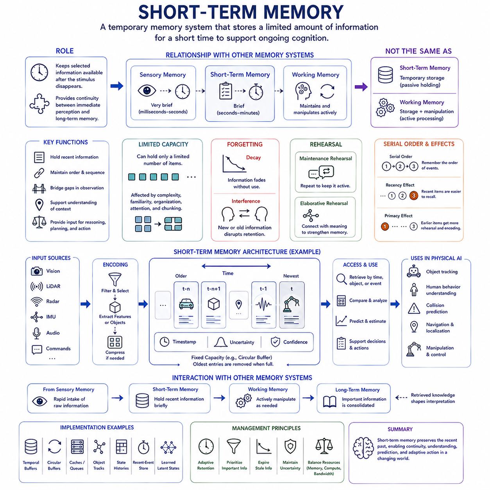{width="7.268055555555556in" height="7.268055555555556in"}

단기 기억(Short-Term Memory)은 정보가 지각되거나 검색된 이후 비교적 짧은 시간 동안 제한된 양의 정보를 유지하는 임시 기억 시스템(Temporary Memory System)입니다. 이는 즉각적인 감각 경험과 더 지속적인 기억 형태 사이에 연속성을 제공하며, 원래의 자극이 물리적으로 더 이상 존재하지 않더라도 최근 정보를 일정 시간 동안 사용할 수 있도록 합니다.

감각 기억(Sensory Memory)은 들어오는 감각 흔적을 밀리초에서 수초 정도 유지하지만, 단기 기억은 선택된 정보를 그보다 더 긴 시간 동안 유지합니다. 그러나 반복(Rehearsal)이나 추가적인 처리가 없다면 이러한 정보 역시 일시적으로만 접근할 수 있습니다. 단기 기억의 목적은 영구 저장이 아니라 현재 인지 과정에서 여전히 관련될 가능성이 있는 정보를 짧은 기간 동안 유지하는 것입니다.

단기 기억은 작업 기억(Working Memory)과 밀접하게 관련되지만 두 개념은 동일하지 않습니다. 단기 기억은 주로 일시적인 저장을 강조하는 반면, 작업 기억은 일시적인 유지뿐 아니라 능동적인 조작(Active Manipulation)을 포함합니다. 전화번호를 잠시 기억하는 것은 단기 저장의 예이고, 숫자의 순서를 재배열하거나 계산에 사용하는 것은 작업 기억의 기능을 필요로 합니다.

이러한 구분은 정보가 항상 능동적으로 조작될 필요는 없기 때문에 인지 아키텍처(Cognitive Architecture)를 설계할 때 유용합니다. 최근 관찰한 위치, 지시, 식별자, 객체 상태 또는 중간 결과와 같은 정보는 지속적인 추론 자원을 소비하지 않고도 필요할 때까지 일시적으로 유지될 수 있습니다.

단기 기억의 용량(Capacity)은 제한되어 있습니다. 인간 인지는 무제한의 서로 관련 없는 요소를 동시에 유지할 수 없으며 정보량이 증가할수록 수행 성능이 저하됩니다. 실질적인 용량은 정보의 복잡성, 친숙성, 조직화 정도, 주의(Attention), 그리고 개별 요소를 더 큰 의미 단위로 묶을 수 있는지에 따라 달라집니다.

청킹(Chunking)은 단기 기억의 실질적 유지 능력을 크게 향상시킬 수 있습니다. 익숙한 패턴을 구성하는 여러 요소를 서로 독립적인 항목으로 유지하는 대신 하나의 의미 있는 단위로 표현할 수 있습니다. 이는 기억의 근본적인 한계를 제거하지는 않지만, 기존 지식을 이용하여 정보를 더 적은 인지 자원으로 표현할 수 있도록 합니다.

단기 기억과 주의의 관계는 특히 중요합니다. 정보가 원래의 감각 흔적이 사라진 후에도 접근 가능한 상태로 남으려면 일반적으로 일정 수준의 선택 과정이 필요합니다. 주의를 받은 정보는 유지될 가능성이 높아지며, 주의를 받지 못하거나 다른 정보와 경쟁하는 정보는 감쇠하거나 다른 정보로 대체될 가능성이 높습니다.

반복(Rehearsal)은 단기 정보의 이용 가능 시간을 늘릴 수 있습니다. 이름, 숫자, 지시, 시퀀스를 반복하면 표현을 새롭게 활성화하여 망각을 늦출 수 있습니다. 반복은 정보를 실제로 소리 내어 말하는 외현적 형태일 수도 있고, 마음속에서 반복하거나 검토하는 내적 형태일 수도 있습니다.

단순 유지 반복(Maintenance Rehearsal)은 반드시 더 깊은 이해를 형성하지 않더라도 정보를 유지하는 데 도움을 줍니다. 정교화 반복(Elaborative Rehearsal)은 새로운 정보를 기존의 개념, 관계, 경험과 연결합니다. 이러한 연결은 추가적인 검색 경로를 제공하기 때문에 정교한 처리는 일반적으로 더 지속적인 장기 학습(Long-Term Learning)에 기여할 가능성이 높습니다.

감쇠(Decay)는 단기 망각을 설명하는 하나의 개념입니다. 정보가 다시 활성화되거나 사용되지 않으면 시간이 지나면서 접근 가능성이 감소할 수 있습니다. 실제 망각의 메커니즘은 단순한 시간 타이머보다 복잡하지만, 제한된 시간 동안의 지속성은 단기 기억을 더 오래 유지되는 기억과 구분하는 중요한 특징입니다.

간섭(Interference) 역시 망각에서 중요한 역할을 합니다. 새로운 정보는 이미 유지되고 있는 정보와 경쟁하거나 기존 정보를 대체할 수 있습니다. 특히 서로 유사한 항목들은 표현이 겹치기 때문에 서로 간섭하기 쉽고, 검색이 어려워지거나 서로 다른 기억의 요소가 혼동될 수 있습니다.

순행 간섭(Proactive Interference)은 이전에 저장된 정보가 새로운 정보의 유지 또는 검색을 방해할 때 발생합니다. 예를 들어 비밀번호나 절차가 변경되었음에도 이전 비밀번호나 절차가 반복적으로 떠오를 수 있습니다. 이전 표현이 충분히 활성화되어 있어 새로운 표현과 경쟁하는 것입니다.

역행 간섭(Retroactive Interference)은 새롭게 습득한 정보가 이전에 유지되던 정보를 방해할 때 발생합니다. 비슷한 지시를 연속해서 여러 번 받은 후 가장 최근 지시는 기억하지만 이전 지시의 세부사항은 혼란스러울 수 있습니다. 빠르게 변화하는 운영 환경에서는 이러한 형태의 간섭이 자주 발생할 수 있습니다.

따라서 단기 기억은 단순히 저장 기간뿐 아니라 표현들 사이의 경쟁에도 영향을 받습니다. 중요한 정보라도 그 이후 유사한 정보가 많이 입력되면 빠르게 잊힐 수 있으며, 반대로 독특하거나 잘 구조화된 정보는 상대적으로 더 오래 접근 가능한 상태를 유지할 수 있습니다.

최신성 효과(Recency Effect)는 일시적 기억의 중요성을 보여줍니다. 일련의 항목을 기억하도록 요청하면 마지막 부분에 제시된 요소들이 최근 기억 상태에 남아 있기 때문에 상대적으로 잘 기억되는 경우가 많습니다. 즉각적인 회상 전에 다른 방해 과제가 들어가면 이러한 효과는 감소할 수 있습니다.

반면 초두 효과(Primacy Effect)는 초기에 제시된 항목이 더 많은 반복 기회와 장기 기억 부호화 기회를 가질 수 있다는 점과 관련되는 경우가 많습니다. 초두 효과와 최신성 효과를 함께 보면 하나의 시퀀스를 기억하는 과정에 서로 다른 시간 규모의 여러 기억 과정이 참여할 수 있음을 알 수 있습니다.

순서 정보(Serial Order)는 단기 기억의 또 다른 중요한 특성입니다. 많은 작업에서는 어떤 요소가 있었는지만 기억하는 것으로 충분하지 않고 발생 순서도 기억해야 합니다. 언어, 지시, 움직임 시퀀스, 수치 연산, 절차 작업에서는 필요한 요소를 모두 기억하더라도 순서를 잃으면 실패할 수 있습니다.

시간적 문맥(Temporal Context)은 이러한 순서를 보존하는 데 도움을 줍니다. 정보는 상대적인 위치, 시점, 주변 사건과의 관계와 함께 표현될 수 있습니다. 이를 통해 인지는 무엇이 먼저 발생했는지, 무엇이 가장 최근에 발생했는지, 어떤 사건 뒤에 무엇이 이어졌는지를 구분할 수 있습니다.

단기 기억은 서로 다른 형태의 정보를 포함할 수 있습니다. 언어 정보는 음운적 표현(Phonological Representation)에 크게 의존할 수 있으며, 시각 정보는 공간적 또는 시각적 특성을 통해 유지될 수 있습니다. 작업에 따라 의미적 의미(Semantic Meaning), 운동 패턴(Motor Patterns), 기타 표현 형태도 영향을 줄 수 있습니다.

음운적 유사성(Phonological Similarity)은 언어적 단기 기억에서 혼동을 증가시킬 수 있습니다. 서로 비슷하게 들리는 요소가 포함된 시퀀스는 구별되는 음향 구조를 가진 요소보다 정확하게 유지하기 어렵습니다. 이는 임시 언어 저장이 소리 구조의 영향을 받는 형태로 정보를 표현한다는 것을 보여줍니다.

시각 및 공간 단기 기억(Visual and Spatial Short-Term Memory)은 형태, 위치, 방향, 색상, 객체 배열, 움직임 패턴을 일시적으로 유지합니다. 이를 통해 주의나 시선이 다른 영역으로 이동한 이후에도 최근 관찰한 공간 관계를 일정 시간 동안 사용할 수 있습니다.

이러한 능력은 동적 환경(Dynamic Environment)과 상호작용할 때 필수적입니다. 사람은 시선을 돌린 뒤에도 객체가 어디에 있었는지를 잠시 기억할 수 있으며, 움직이던 객체가 일시적으로 가려져도 최근 위치를 유지할 수 있습니다. 이러한 짧은 지속성은 지각과 행동의 연속성에 기여합니다.

단기 기억은 정보가 순차적으로 들어오는 상황에서 특히 중요합니다. 음성 언어, 내비게이션 지시, 조립 절차, 인간 시연(Human Demonstration)은 시간에 걸쳐 전개됩니다. 뒤의 요소를 해석하려면 앞서 제시된 요소가 충분한 시간 동안 접근 가능한 상태로 남아 있어야 합니다.

언어 이해(Language Comprehension)는 이러한 필요성을 잘 보여줍니다. 문장 앞부분에서 등장한 단어는 문법적·의미적 관계를 구성하기 위해 일정 시간 동안 유지되어야 합니다. 이전 정보가 즉시 사라진다면 긴 문장이나 복잡한 지시를 이해하기 어려워집니다.

대화 역시 최근 발언과 참조 관계를 유지하기 위해 단기 기억에 의존합니다. 누군가 "첫 번째 상자 다음에 저것을 옮겨라"라고 말한다면 듣는 사람은 "저것"과 "첫 번째 상자"가 무엇을 의미하는지 알기 위해 최근 문맥을 유지해야 합니다. 따라서 일시적 기억은 문맥적 일관성(Contextual Coherence)에 직접적으로 기여합니다.

내비게이션도 최근 기억에 의존합니다. 사람이나 로봇이 앞으로 이동한 후 교차로에서 좌회전하고 특정 랜드마크 근처에서 정지하라는 지시를 받을 수 있습니다. 이러한 지시는 해당 조건이 실제로 나타날 때까지 접근 가능한 상태로 유지되어야 합니다.

단기 기억은 일시적인 관찰 공백을 연결할 수 있습니다. 객체가 다른 객체 뒤로 사라지거나, 사람이 잠시 카메라 시야 밖으로 이동하거나, 통신 패킷이 지연될 수 있습니다. 최근 상태를 유지하면 다시 나타난 대상을 완전히 새로운 대상으로 처리하지 않고 연속성을 유지할 수 있습니다.

이러한 연결 기능은 부분 관측(Partial Observability) 환경에서 특히 중요합니다. 지능형 에이전트는 모든 순간에 환경의 전체 상태를 관찰할 수 없습니다. 최근 관찰은 현재 보이지 않지만 여전히 관련성이 높을 가능성이 있는 변수에 대한 증거를 제공합니다.

따라서 단기 기억은 상태 추정(State Estimation)을 지원할 수 있습니다. 현재 관찰 하나만으로는 모호할 수 있지만 최근 관찰과 결합하면 가능한 해석의 범위를 줄일 수 있습니다. 이전 위치, 속도, 방향, 정체성, 상호작용 이력은 현재 상태를 이해하는 데 중요한 문맥을 제공합니다.

이 부분에서 단기 기억과 작업 기억의 경계가 특히 중요해집니다. 최근 상태를 저장하고 있는 것 자체는 단기 기억의 기능이지만, 이를 새로운 관찰과 능동적으로 비교하고 미래 상태를 예측하거나 행동을 결정하는 데 사용하면 작업 기억의 처리가 수행됩니다.

따라서 두 시스템은 완전히 독립적인 구조보다 긴밀하게 결합된 시스템으로 이해하는 것이 적절합니다. 단기 저장은 능동적 인지에 필요한 정보를 제공하고, 작업 기억 연산은 어떤 정보가 계속 관련성이 있는지, 어떻게 변환해야 하는지, 더 오래 유지할 필요가 있는지를 결정합니다.

단기 기억은 장기 기억과도 지속적으로 상호작용합니다. 친숙성과 기존 지식은 임시 정보를 어떻게 부호화하고 조직할지에 영향을 줍니다. 의미 있는 패턴은 장기 지식이 새로운 정보를 통합할 구조를 제공하기 때문에 더 효율적으로 표현할 수 있습니다.

정보는 단기 유지 상태에서 장기 저장으로 이동할 수도 있습니다. 반복, 의미 있는 연관, 정서적 중요성, 작업 관련성, 성공적인 활용, 반복 검색은 일시적인 정보가 더 지속적인 기억으로 형성될 가능성을 높일 수 있습니다.

그러나 단기 기억에 있는 모든 정보가 영구적으로 저장되어야 하는 것은 아닙니다. 일상적인 감각 및 인지 정보 대부분은 짧은 기간만 유용합니다. 모든 일시적 세부사항을 기억하면 불필요한 저장공간을 사용하고 이후 검색을 어렵게 할 수 있습니다. 따라서 망각은 중요한 정보 관리 기능을 수행합니다.

선택적 공고화(Selective Consolidation)는 어떤 임시 정보가 더 오래 보존될 가치가 있는지를 결정합니다. 새롭거나 중요한 사건, 중요한 의사결정, 예상하지 못한 결과, 오류, 보상, 실패, 현재 목표와 밀접하게 관련된 정보는 반복적인 일상 관찰보다 지속 기억으로 전환될 가치가 높습니다.

이러한 원리는 인공지능(Artificial Intelligence)에 직접 적용할 수 있습니다. AI 시스템은 수초 또는 수분 동안 유용하지만 영구적으로 저장할 필요는 없는 정보를 지속적으로 접합니다. 단기 기억은 즉각적인 입력 처리와 지속적인 지식 사이에 중간 계층을 제공합니다.

인공 단기 기억(Artificial Short-Term Memory)은 버퍼(Buffer), 큐(Queue), 캐시(Cache), 임시 데이터베이스, 최근 상태 이력, 컨텍스트 저장소(Context Store), 학습된 잠재 표현(Learned Latent Representation) 등을 사용하여 구현할 수 있습니다. 구체적인 구현은 정보 유형, 필요한 유지 기간, 계산 자원, 작업 특성에 따라 달라집니다.

단순한 시간 버퍼(Temporal Buffer)는 가장 최근의 관찰을 일정 기간 동안 유지할 수 있습니다. 새로운 정보가 들어오면 오래된 정보가 제거됩니다. 이를 통해 최근 문맥을 유지하면서 저장량이 무한하게 증가하지 않는 이동 시간 창(Moving Temporal Window)을 구성할 수 있습니다.

순환 버퍼(Circular Buffer)는 지속적인 센서 스트림에 특히 유용합니다. 고정된 크기의 메모리를 할당하고, 버퍼가 가득 차면 새로운 관찰이 가장 오래된 항목을 덮어씁니다. 이를 통해 예측 가능한 자원 사용량을 유지하면서 항상 가장 최근의 이력에 접근할 수 있습니다.

단기 기억이 항상 원시 데이터(Raw Data)를 보존할 필요는 없습니다. 센서 관찰은 유지되기 전에 특징, 객체, 사건, 상태 변수로 변환될 수 있습니다. 압축(Compression)은 이후 추론에 가장 관련성 높은 정보를 보존하면서 저장 및 계산 요구량을 줄입니다.

예를 들어 로봇은 모든 카메라 프레임의 모든 픽셀을 유지할 필요가 없을 수 있습니다. 대신 추적 중인 객체, 위치, 속도, 분류, 신뢰도, 최근 궤적을 일시적으로 유지할 수 있습니다. 검증이나 복구를 위해 원시 프레임은 더 짧은 버퍼에 함께 유지할 수 있습니다.

라이다(LiDAR) 데이터도 유사한 방식으로 처리할 수 있습니다. 최근 포인트 클라우드(Point Cloud)를 초기에는 정합(Registration)과 움직임 추정에 사용하고, 이후 관련 기하학 정보를 로컬 점유 상태(Local Occupancy), 표면, 장애물, 객체 수준 표현으로 변환할 수 있습니다.

레이더(Radar) 관찰은 개별 탐지값 대신 짧은 트랙(Track) 형태로 유지할 수 있습니다. 최근 여러 측정을 보존하면 개별 레이더 반사값의 불확실성을 줄이면서 속도와 궤적을 추정할 수 있습니다.

IMU 정보는 가속도와 각속도가 시간에 따른 통합과 비교를 통해 의미를 갖기 때문에 최근 시간 이력이 필요합니다. 짧은 버퍼는 필터링, 상태 추정, 진동 분석, 움직임 분류, 갑작스러운 동적 변화 탐지를 지원합니다.

오디오 시스템 역시 임시 저장을 필요로 합니다. 음성 인식(Speech Recognition)과 음향 사건 탐지(Acoustic Event Detection)는 고립된 소리 샘플보다 시퀀스에 의존합니다. 단기 오디오 기억은 단어, 명령, 경보, 기계음, 환경 사건을 식별하는 데 필요한 충분한 문맥을 제공합니다.

로보틱스에서는 단기 기억이 로봇 자세(Pose), 속도, 가속도, 조향각, 휠 속도, 액추에이터 상태, 배터리 상태, 위치 추정 신뢰도와 같은 최근 로봇 상태를 유지할 수 있습니다. 이러한 이력은 단일 순간 상태만으로는 발견하기 어려운 추세와 변화를 식별하는 데 도움을 줍니다.

객체 수준 단기 기억(Object-Level Short-Term Memory)은 추적에 필수적입니다. 객체가 탐지되면 시스템은 정체성, 위치, 속도, 분류, 불확실성, 관찰 이력을 포함하는 임시 트랙을 생성할 수 있습니다. 객체가 모든 센서 주기에서 탐지되지 않더라도 트랙은 일정 기간 유지됩니다.

트랙 만료(Track Expiration)는 망각과 유사한 기능을 합니다. 객체가 적절한 기간 동안 관찰되지 않으면 해당 표현은 결국 제거되거나 다른 기억 구조로 이전되어야 합니다. 오래된 트랙을 무기한 유지하면 현재 환경에 대해 잘못된 가정을 생성할 수 있습니다.

만료 기간은 객체 동역학과 작업 요구사항에 따라 달라져야 합니다. 빠르게 움직이는 차량은 관찰되지 않을 때 신속하게 불확실성이 증가해야 하지만, 정적인 인프라 객체는 훨씬 더 오랫동안 유효한 정보로 유지할 수 있습니다.

따라서 임시 정보가 오래될수록 신뢰도(Confidence)는 감소해야 합니다. 단기 기억은 방금 관찰한 상태와 수초 전에 관찰한 상태를 동일한 신뢰도로 취급해서는 안 됩니다. 시간 의존적 불확실성(Time-Dependent Uncertainty)은 이러한 차이를 표현하는 체계적인 방법을 제공합니다.

타임스탬프(Timestamp)는 인공 단기 기억에 필수적입니다. 모든 관찰이나 상태는 언제 획득되거나 추정되었는지에 대한 정보를 유지해야 합니다. 시간 정보가 없다면 시스템은 시퀀스를 정확히 재구성하거나, 동역학을 추정하거나, 저장된 정보가 여전히 관련성이 있는지 판단하기 어렵습니다.

멀티모달 시스템(Multimodal System)에서는 시간 동기화(Time Synchronization)가 특히 중요합니다. 카메라, 라이다, 레이더, IMU, GNSS, 마이크, 액추에이터 피드백은 서로 다른 주기로 동작합니다. 임시 기억은 서로 다른 센서 관찰을 올바르게 연계할 수 있도록 시간적 관계를 보존해야 합니다.

멀티모달 단기 기억(Multimodal Short-Term Memory)은 공통 시간 기준을 중심으로 정보를 구성할 수 있습니다. 이후 서로 다른 센서의 최근 관찰을 시간, 객체 정체성, 공간 영역, 사건을 기준으로 검색할 수 있습니다. 이는 센서 융합과 시간적 추론의 기반을 제공합니다.

센서 융합(Sensor Fusion)은 일시적인 멀티모달 관찰을 더 안정적인 단기 상태로 변환할 수 있습니다. 카메라의 의미 정보, 라이다의 기하학, 레이더의 속도, GNSS의 위치, IMU의 움직임 정보는 동일 환경에 대한 상호보완적인 증거를 제공할 수 있습니다.

단기 기억은 움직임 보상(Motion Compensation)도 지원합니다. 로봇이 이동하는 동안 서로 다른 시점에 센서 관찰이 획득되었다면 최근 자세 이력을 이용하여 융합 전에 공통 기준 시점으로 변환할 수 있습니다.

피지컬 AI(Physical AI)에서는 이러한 기능이 필수적입니다. 지능적 행동은 지속적으로 변화하는 물리적 세계에서 발생하기 때문입니다. 각각의 관찰을 독립적으로 처리하는 시스템은 시간적 연속성을 잃고 움직임, 상호작용, 인과관계, 증가하는 위험을 신뢰성 있게 추정하기 어렵습니다.

단기 기억은 변화를 인식하는 데 필요한 최소한의 과거 문맥을 제공합니다. 어떤 것이 이동했는지, 가속했는지, 사라졌는지, 접근하고 있는지, 상태가 변했는지를 판단하려면 이전 관찰과의 비교가 필요합니다.

충돌 예측(Collision Prediction)은 실용적인 사례입니다. 현재 거리만으로는 위험을 판단하기 어려울 수 있지만 상대 거리의 짧은 이력은 빠르게 접근하는 상황을 보여줄 수 있습니다. 상대 속도와 충돌까지 남은 시간(Time to Collision)의 추정은 직접적으로 시간 정보에 의존합니다.

인간 행동 이해(Human Behavior Understanding) 역시 최근 이력을 필요로 합니다. 하나의 신체 자세는 모호할 수 있지만 시퀀스를 보면 걷기, 정지, 손 뻗기, 가리키기, 넘어짐, 접근 등의 행동을 식별할 수 있습니다. 임시 유지 기능은 독립적인 관찰을 의미 있는 행동 패턴으로 변환합니다.

인간 의도 추정(Intent Estimation) 역시 최근 궤적, 시선 방향, 제스처, 상호작용 이력의 도움을 받을 수 있습니다. 이러한 짧은 이력은 사람이 다음에 무엇을 할 가능성이 높은지에 대한 예측으로 변환될 수 있습니다.

조작 작업(Manipulation Tasks)은 접촉 및 객체 상태에 대한 임시 기억을 필요로 합니다. 로봇은 방금 객체를 파지했는지, 접촉력이 증가했는지, 객체가 조금 미끄러졌는지, 이전 파지 시도가 실패했는지를 기억해야 할 수 있습니다.

이러한 이력이 없다면 수정 행동(Corrective Action)을 수행하기 어렵습니다. 로봇은 현재 상태 이전에 무엇이 발생했는지에 대한 표현이 없기 때문에 동일한 실패 행동을 반복해서 수행할 수 있습니다.

따라서 단기 기억은 오류 복구(Error Recovery)에 직접적으로 기여합니다. 최근 관찰, 행동, 예측, 결과를 비교하면 실행이 기대에서 벗어난 이유를 판단할 수 있습니다.

모바일 로봇이 예상하지 못하게 정지한 경우 최근 이력을 분석하여 장애물 탐지, 휠 슬립(Wheel Slip), 위치 추정 불확실성, 통신 지연, 모터 한계, 안전 개입 중 무엇이 정지 이전에 발생했는지를 확인할 수 있습니다.

이러한 정보는 반드시 영구적으로 유지될 필요가 없습니다. 상황이 해결되면 대부분의 세부 정보는 제거할 수 있으며, 학습이나 진단 관점에서 충분히 중요한 사건인 경우에만 일화 기억(Episodic Memory)으로 공고화할 수 있습니다.

이벤트 트리거 보존(Event-Triggered Preservation)은 이러한 전환을 위한 효율적인 메커니즘을 제공합니다. 지속적으로 작동하는 단기 버퍼가 최근 이력을 유지하고 있다가 중요한 사건이 발생하면 사건 전후의 관련 시간 구간을 지속 저장소에 복사할 수 있습니다.

이 메커니즘은 실패의 원인이 실제 실패가 인식되기 이전에 발생하는 경우가 많기 때문에 특히 유용합니다. 사건 이전 문맥(Pre-Event Context)을 보존하면 엔지니어나 학습 시스템이 비정상적인 결과로 이어진 시퀀스를 재구성할 수 있습니다.

따라서 단기 기억은 온라인 지능(Online Intelligence)과 오프라인 학습(Offline Learning)을 동시에 지원할 수 있습니다. 운용 중에는 즉각적인 지각과 행동을 지원하고, 선택된 임시 이력은 이후 모델 개선을 위한 학습 사례로 전환될 수 있습니다.

자기지도학습(Self-Supervised Learning)은 이러한 시간적 시퀀스를 활용할 수 있습니다. 연속적인 관찰은 연속성, 움직임, 대응 관계, 인과관계와 같은 자연스러운 시간적 구조를 포함합니다. 모델은 최근 이력을 기반으로 이후 관찰을 예측함으로써 유용한 표현을 학습할 수 있습니다.

미래 상태 예측(Future-State Prediction)은 월드 모델(World Model)과 특히 관련됩니다. 모델은 최근 상태의 짧은 시퀀스를 입력으로 받아 다음에 어떤 일이 발생할지를 학습할 수 있습니다. 이러한 최근 시퀀스는 하나의 스냅샷만으로는 신뢰성 있게 추론하기 어려운 동역학 정보를 제공합니다.

예를 들어 하나의 이미지는 차량이 어디에 있는지를 보여주지만 여러 최근 관찰은 차량의 방향과 속도를 보여줍니다. 로봇 관절 상태의 시퀀스는 움직임의 추세를 나타내지만 단일 관절 자세만으로는 해당 관절이 정지해 있는지 빠르게 움직이는지를 알 수 없습니다.

따라서 단기 기억은 예측형 월드 모델(Predictive World Model)의 중요한 입력 계층을 형성합니다. 최근 지각, 로봇 상태, 행동, 환경 변화는 미래 상태 생성을 위한 압축된 시간 문맥으로 부호화될 수 있습니다.

상태공간 모델(State-Space Model)은 최근 이력을 요약하는 은닉 상태(Hidden State)를 유지하여 이러한 개념을 구현할 수 있습니다. 순환 신경망(Recurrent Neural Network)도 이전 단계의 정보를 전달하며, 트랜스포머(Transformer)는 최근 토큰 시퀀스에 명시적으로 어텐션(Attention)을 적용할 수 있습니다.

시간 합성곱 네트워크(Temporal Convolution Network)는 고정된 최근 관찰 윈도를 처리하는 또 다른 접근법입니다. 각 아키텍처는 서로 다른 방법으로 단기 이력을 표현하지만, 모두 현재 계산이 하나의 관찰에만 제한되지 않도록 시간에 걸쳐 정보를 보존하는 것을 목표로 합니다.

학습된 잠재 기억(Learned Latent Memory)은 고차원 센서 스트림의 최근 이력을 압축된 내부 상태로 표현할 수 있습니다. 이러한 표현은 움직임, 객체 정체성, 상호작용, 기타 작업 관련 시간 구조를 보존하면서 계산 요구량을 줄일 수 있습니다.

그러나 학습 기반 압축에는 드물지만 안전에 중요한 정보를 잃을 위험이 있습니다. 평균적 성능을 기준으로 최적화된 잠재 표현이 작은 장애물, 비정상적인 소리, 약한 접촉 사건, 예상하지 못한 움직임 패턴을 제거할 수 있습니다.

하이브리드 기억 아키텍처(Hybrid Memory Architecture)는 이러한 위험을 줄일 수 있습니다. 로봇은 일상적인 추론에는 압축된 잠재 또는 객체 수준 단기 기억을 사용하고, 안전 검증, 디버깅, 이벤트 트리거 보존을 위해 더 짧은 원시 데이터 버퍼를 함께 유지할 수 있습니다.

기억 지속 시간(Memory Duration)은 시스템 동역학에 맞게 선택해야 합니다. 밀리초 수준의 이력은 모터 제어에 충분할 수 있지만 객체 추적, 충돌 예측, 인간 행동 해석에는 수초의 이력이 필요할 수 있습니다.

더 긴 작업 수준 상호작용은 수십 초 또는 수분 동안 임시 문맥을 필요로 할 수 있습니다. 하나의 저장소가 모든 지속 시간을 담당하도록 하기보다 계층적 단기 기억(Hierarchical Short-Term Memory)을 이용하여 여러 시간 해상도를 유지할 수 있습니다.

빠른 계층은 최근의 상세한 측정값을 유지하고, 중간 계층은 객체 궤적과 로컬 사건을 유지하며, 느린 계층은 작업 진행 및 최근 상호작용 문맥을 유지할 수 있습니다. 정보가 계층 사이를 이동하면서 오래된 정보는 점차 더 압축된 형태가 될 수 있습니다.

이러한 시간적 계층은 정보 추상화(Information Abstraction)와 유사합니다. 최신의 원시 관찰은 높은 세부 수준을 가지지만 유효 기간이 짧고, 오래된 정보는 주로 의미 있는 요약 형태로 유지됩니다. 따라서 시간적 거리가 증가할수록 시스템은 세부사항을 줄일 수 있습니다.

이러한 구성은 엣지 컴퓨팅(Edge Computing)에 유용합니다. 대역폭이 높은 원시 센서 정보는 짧은 기간 동안 로봇에 유지하고, 압축된 객체 상태, 사건, 요약은 훨씬 적은 메모리와 통신 대역폭을 사용하여 더 오래 유지할 수 있습니다.

엣지 기반 단기 기억은 회복탄력성(Resilience)도 향상시킵니다. 외부 서버와의 통신이 사용할 수 없는 상황에서도 로봇은 객체 추적, 움직임 추정, 최근 지시 해석, 로컬 계획을 계속 수행할 수 있습니다.

온프레미스 컴퓨팅(On-Premise Computing)은 여러 로봇으로부터 선택된 단기 요약을 받을 수 있습니다. 이를 통해 모든 원시 센서 스트림을 지속적으로 전송하지 않고도 플릿 수준 협업(Fleet-Level Coordination)을 수행할 수 있습니다.

플릿 시스템(Fleet System)은 최근 로봇 위치, 계획된 경로, 교통 충돌, 작업 상태, 공유 장애물, 충전 상태, 통신 품질을 유지할 수 있습니다. 이는 더 넓은 공간 및 시간 규모에서 동작하는 집단 단기 기억(Collective Short-Term Memory)이 됩니다.

멀티에이전트 단기 기억(Multi-Agent Short-Term Memory)에서는 정보의 최신성과 일관성이 중요한 문제가 됩니다. 다른 로봇에서 수신한 정보는 도착 시점에 이미 지연되어 있을 수 있습니다. 따라서 수신 시스템은 원격 정보를 현재의 절대적인 사실로 취급하지 않고 타임스탬프와 불확실성을 함께 유지해야 합니다.

통신 장애 역시 기억 인식 행동(Memory-Aware Behavior)을 필요로 합니다. 공유 정보가 지나치게 오래되면 신뢰도를 낮추고, 새로운 정보를 요청하거나, 오래된 상태에 계속 의존하지 않고 로컬 지각으로 전환해야 합니다.

단기 기억은 최근 지시와 상호작용 문맥을 유지하여 인간-로봇 협업(Human-Robot Collaboration)을 지원할 수 있습니다. 로봇이 여러 개의 연관된 명령을 받으면 요청한 작업을 일관되게 수행할 수 있도록 해당 명령의 순서와 관계를 충분한 시간 동안 유지해야 합니다.

최근 인간의 수정(Correction)도 일시적으로 활성 상태로 유지할 수 있습니다. 운영자가 로봇 경로를 수정하거나 제안된 행동을 거부했다면, 수정 문맥이 즉시 사라져 로봇이 동일한 선택을 다시 반복해서는 안 됩니다.

언어 기반 로봇(Language-Enabled Robot)은 참조 표현, 명령, 확인, 해결되지 않은 질문을 위해 단기 대화 기억(Short-Term Conversational Memory)을 필요로 합니다. 그러나 모든 대화 세부사항을 영구적인 개인 또는 운영 기억으로 저장할 필요는 없습니다.

따라서 선택적 유지(Selective Retention)는 효율성뿐 아니라 개인정보 보호(Privacy)를 위해서도 중요합니다. 임시 상호작용 정보는 더 이상 필요하지 않을 때 제거하고, 명시적으로 가치가 있거나 허용된 정보만 지속 기억으로 이전할 수 있습니다.

인공 단기 기억에는 접근 정책(Access Policies)도 포함되어야 합니다. 서로 다른 서브시스템은 최근 이력의 서로 다른 부분을 필요로 하며, 모든 임시 데이터 스트림에 무제한 접근하도록 하면 불필요한 보안 및 계산 위험을 만들 수 있습니다.

기억 자원이 제한되어 있을 때는 우선순위 설정(Prioritization)이 중요합니다. 안전 중요 상태, 위치 추정 이력, 주변 동적 객체, 활성 작업 정보, 최근 운영자 명령은 가치가 낮은 배경 관찰보다 더 높은 유지 우선순위를 가질 수 있습니다.

적응형 유지(Adaptive Retention)는 기억의 지속 시간을 동적으로 변경할 수 있습니다. 일상적인 정보는 빠르게 만료시키고, 불확실하거나 새롭거나 위험하거나 작업에 중요한 정보는 더 오래 유지할 수 있습니다.

새로움 탐지(Novelty Detection)는 이러한 적응을 수행하는 한 가지 방법을 제공합니다. 현재 관찰이 최근 기대와 크게 다르면 시스템은 분석을 위해 더 긴 이력을 일시적으로 보존할 수 있습니다.

불확실성도 유사한 행동을 유발할 수 있습니다. 위치 추정 신뢰도가 떨어지거나 객체 분류가 불안정해지면 최근 관찰을 더 많이 유지하여 모호성을 해결하는 데 활용할 수 있습니다.

위험 민감 기억 정책(Risk-Sensitive Memory Policy)은 사람, 장애물, 기계적 스트레스, 안전 개입, 아차 충돌(Near-Collision)과 관련된 정보를 일반적인 배경 정보보다 더 오랫동안 보존할 수 있습니다.

따라서 단기 기억 관리는 관련성, 최신성(Freshness), 불확실성, 계산 비용, 대역폭, 저장공간, 개인정보 보호, 미래 학습 가치(Future Learning Value)를 함께 고려하는 최적화 문제로 볼 수 있습니다.

AI 에이전트(AI Agent)의 경우 단기 기억은 최근 도구 호출(Tool Calls), 관찰, 사용자 지시, 중간 출력, 해결되지 않은 작업을 유지할 수도 있습니다. 이러한 정보는 모든 임시 세부사항을 지속 기억으로 저장하지 않고도 여러 추론 단계에 걸쳐 연속성을 제공합니다.

요약(Summarization)은 임시 문맥이 무한정 증가하는 것을 방지할 수 있습니다. 정보가 오래될수록 상세한 기록을 결정, 제약조건, 해결되지 않은 문제, 중요한 결과를 보존하는 압축된 요약으로 교체할 수 있습니다.

이를 통해 이동형 추상화 메커니즘(Sliding Abstraction Mechanism)을 구성할 수 있습니다. 가장 최신 정보는 상세하게 유지되고, 어느 정도 시간이 지난 정보는 구조화된 상태로 바뀌며, 더 오래되었지만 여전히 관련성이 있는 정보는 압축된 문맥 요약으로 유지됩니다.

동일한 원리를 로봇 월드 모델에도 적용할 수 있습니다. 최근 센서 프레임은 직접 보존하고, 최근 객체 궤적은 파라미터화된 형태로 표현하며, 더 오래된 로컬 사건은 의미론적 상태 변화(Semantic State Changes)로 요약할 수 있습니다.

기억 검색은 최신성만이 아니라 관련성에 따라 이루어져야 합니다. 가장 최근의 사건이 항상 가장 유용한 것은 아닙니다. 반복적인 실패를 경험하는 로봇은 몇 초 전의 관련 없는 사건보다 몇 분 전에 발생했던 유사한 실패를 검색하는 것이 더 유용할 수 있습니다.

이는 단기 기억과 일화 기억 사이의 상호작용을 의미합니다. 최근 사건은 직접 접근 가능한 상태로 유지하고, 오래되었지만 관련 있는 경험은 현재 상황과의 유사성이 높을 때 지속 저장소에서 검색할 수 있습니다.

단기 기억은 이러한 검색의 통합 지점(Integration Point)이 될 수 있습니다. 현재 관찰과 최근 이력은 현재 문맥을 정의하고, 검색된 에피소드(Episode)는 추론과 행동 선택에 유용한 추가적인 과거 증거를 제공합니다.

성숙한 피지컬 AI 아키텍처는 하나의 구분되지 않은 기억 저장소 대신 감각 기억, 단기 기억, 작업 기억, 일화 기억, 의미 기억(Semantic Memory), 절차 기억(Procedural Memory)이 서로 상호작용하는 여러 계층을 포함할 수 있습니다.

감각 기억은 높은 대역폭의 입력 신호를 매우 짧은 시간 동안 보존합니다. 단기 기억은 선택된 최근 정보를 유지합니다. 작업 기억은 현재 추론에 필요한 정보를 능동적으로 조작합니다.

일화 기억은 중요한 경험을 저장하고, 의미 기억은 일반화된 지식을 유지하며, 절차 기억은 재사용 가능한 기술과 행동 패턴을 보존합니다. 정보는 주의, 관련성, 학습 가치, 작업 요구사항에 따라 이러한 계층 사이를 이동할 수 있습니다.

이러한 시스템들 사이의 경계는 완전히 고정된 것이 아니라 기능적입니다. 최근의 객체 궤적은 처음에는 임시 감각 이력으로 존재하다가 단기 트랙으로 변환되고, 충돌 추론이 필요하면 작업 기억으로 들어가며, 아차 충돌이 발생하면 이후 일화 기록의 일부가 될 수 있습니다.

모든 표현을 하나의 고정된 저장 범주에 배치하는 것보다 이러한 동적인 정보 이동이 더 중요합니다. 지능적인 기억 아키텍처는 정보가 얼마나 오랫동안 유용한지와 어떤 인지 연산이 그 정보에 접근해야 하는지에 따라 정보를 관리해야 합니다.

따라서 인공 단기 기억의 평가는 유지 정확도(Retention Accuracy), 시간적 범위, 검색 지연시간, 자원 소비, 간섭에 대한 강건성, 오래된 정보 처리, 이후 작업에 대한 기여도를 검토해야 합니다.

추적 성능 평가는 임시 기억이 가림 상황에서 객체 정체성을 얼마나 잘 유지하는지를 시험할 수 있습니다. 내비게이션 실험은 최근 상태 이력이 움직임 예측과 장애물 회피를 얼마나 향상시키는지를 평가할 수 있습니다.

실패 복구 시험(Failure-Recovery Test)은 최근 문맥이 실패한 행동 이후 시스템이 문제를 진단하고 적응할 수 있게 하는지를 평가할 수 있습니다. 통신 손실 시험은 외부 정보를 사용할 수 없는 상황에서 로컬 단기 기억이 자율 운용을 얼마나 잘 지원하는지를 평가할 수 있습니다.

기억 스트레스 시험(Memory Stress Testing)은 객체 수, 센서 주기, 이벤트, 작업, 경쟁 정보원의 수를 의도적으로 증가시켜야 합니다. 강건한 아키텍처는 임시 저장 또는 계산 용량이 한계에 가까워지더라도 불안정해지지 않고 예측 가능한 방식으로 성능이 저하되어야 합니다.

관측 가능성(Observability)도 필수적입니다. 엔지니어는 현재 어떤 정보가 유지되고 있는지, 언제 관찰되었는지, 시스템이 얼마나 신뢰하고 있는지, 언제 만료될 예정인지를 확인할 수 있어야 합니다. 이를 통해 시간 추론과 실패 진단이 훨씬 쉬워집니다.

인지과학(Cognitive Science)의 관점에서 단기 기억은 즉각적인 감각 자극이 종료된 이후에도 정보를 영구적으로 저장하지 않고 일정 시간 사용할 수 있는 방법을 설명합니다. 이는 시간의 간격을 연결하는 일시적 다리를 형성하여 연속성, 시퀀스 이해, 비교, 이후 인지 처리를 위한 준비를 지원합니다.

인공지능의 관점에서 단기 기억은 모델이 고립된 입력이 아니라 시퀀스를 기반으로 작동할 수 있도록 최근 문맥을 제공합니다. 시간 추론, 상태 추정, 예측, 문맥 기반 상호작용, 일시적 정보에서 지속 지식으로의 선택적 전환을 지원합니다.

로보틱스와 피지컬 AI의 관점에서 단기 기억은 움직임을 이해하고, 객체 정체성을 유지하고, 일시적인 관찰 손실을 견디고, 행동 결과를 평가하고, 위험을 예측하고, 실패에서 복구하고, 지각과 제어를 조정하는 데 필요한 최근 이력을 보존합니다.

성숙한 단기 기억 아키텍처(Short-Term Memory Architecture)는 제한된 유지 기간, 타임스탬프, 불확실성, 적응형 만료(Adaptive Expiration), 시간 동기화, 압축, 우선순위 설정, 멀티모달 통합, 이벤트 트리거 보존, 작업 기억 및 장기 기억과의 통제된 상호작용을 결합합니다.

목표는 모든 최근 세부사항을 가능한 한 오랫동안 보존하는 것이 아닙니다. 필요한 정보가 유용한 기간 동안만 유지되도록 하면서 관련 없는 정보는 자원을 소비하거나 새로운 상태를 방해하기 전에 사라지도록 하는 것이 목표입니다.

궁극적으로 단기 기억은 지능 시스템에 즉각적인 과거와의 연속성을 제공합니다. 관찰된 순간을 넘어 선택된 정보를 잠시 보존함으로써 시간에 걸친 지각을 연결하고, 지속적으로 변화하는 환경에서 일관된 추론, 예측, 학습, 적응 행동(Adaptive Action)에 필요한 역사적 문맥을 제공합니다.

## 02.04 Long Term Memory [w/Code]

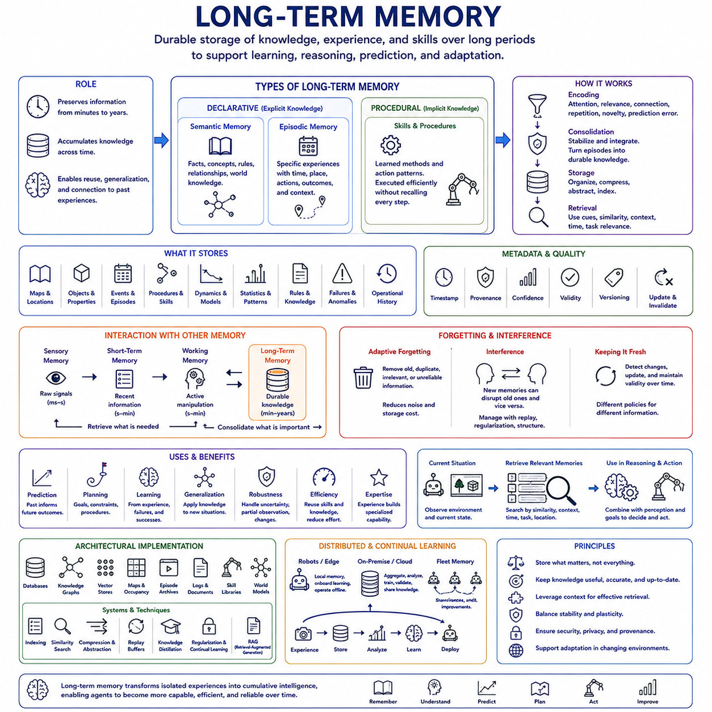{width="7.268055555555556in" height="7.268055555555556in"}

장기 기억(Long-Term Memory)은 정보, 지식, 경험, 학습된 기술을 수분에서 수년에 이르는 장기간 동안 보존하는 인지 시스템(Cognitive System)입니다. 이를 통해 지능형 에이전트(Intelligent Agent)는 시간에 따라 지식을 축적하고, 익숙한 상황을 인식하며, 성공적인 전략을 재사용하고, 현재의 사건을 훨씬 이전에 습득한 정보와 연결할 수 있습니다.

감각 기억(Sensory Memory)과 단기 기억(Short-Term Memory)과 달리 장기 기억은 즉각적인 정보 유지보다 지속적인 보존을 목적으로 합니다. 장기 저장소(Long-Term Storage)에 들어간 정보는 원래의 문맥이 사라진 이후에도 계속 사용할 수 있습니다. 그 유용성은 얼마나 많은 정보를 저장하는가뿐 아니라 필요한 순간에 정보를 얼마나 정확하고 효율적으로 검색할 수 있는가에 달려 있습니다.

장기 기억은 하나의 균일한 저장소가 아닙니다. 서로 다른 종류의 정보를 보존하는 기능적으로 구분된 여러 기억 형태를 포함합니다. 서술 기억(Declarative Memory)은 명시적으로 표현할 수 있는 사실과 경험을 지원하며, 절차 기억(Procedural Memory)은 모든 단계를 의식적인 추론으로 다시 구성하지 않고도 실행할 수 있는 학습된 기술과 행동 패턴을 보존합니다.

서술 기억은 일반적으로 의미 기억(Semantic Memory)과 일화 기억(Episodic Memory)으로 구분됩니다. 의미 기억은 개념, 범주, 언어, 규칙, 관계, 세계의 구조에 대한 일반화된 지식을 포함합니다. 일화 기억은 특정 시간, 장소, 목표, 행동, 결과와 연관된 구체적인 경험을 보존합니다.

의미 기억은 지식을 처음 학습한 정확한 사건과 독립적으로 사용할 수 있도록 합니다. 사람은 교통 신호가 어떻게 작동하는지를 알고 있으면서도 그 규칙을 처음 접했던 순간을 기억하지 못할 수 있습니다. 따라서 일반화(Generalization)는 반복된 경험을 다양한 미래 상황에서 사용할 수 있는 재사용 가능한 지식으로 변환합니다.

일화 기억은 문맥이 포함된 경험(Contextualized Experience)을 유지합니다. 하나의 에피소드(Episode)에는 무엇이 발생했는지, 어디에서 발생했는지, 언제 발생했는지, 에이전트가 무엇을 판단했는지, 어떤 행동을 선택했는지, 어떤 결과가 뒤따랐는지가 포함될 수 있습니다. 이러한 기억은 비정상적인 성공, 실패, 개입, 이상 현상, 예상하지 못한 사건으로부터 학습하는 데 특히 중요합니다.

절차 기억은 행동을 수행하는 학습된 방법을 표현합니다. 반복적인 연습을 통해 의식적으로 수행하던 시퀀스가 재사용 가능한 절차로 변환되면 기술은 점차 효율적으로 수행될 수 있습니다. 내비게이션 기동, 조작 루틴, 도킹 행동, 운동 조정, 복구 전략은 반복적인 고수준 추론의 필요성을 감소시키는 절차 지식(Procedural Knowledge)이 될 수 있습니다.

장기 기억은 들어오는 정보를 지속적인 저장에 적합한 표현으로 변환하는 부호화(Encoding)에 의존합니다. 정보가 주의를 받고, 기존 지식과 연결되고, 반복적으로 사용되거나, 큰 예측 오류(Prediction Error)를 발생시키거나, 현재 목표 및 미래 행동에 높은 관련성을 가질수록 장기 기억으로 부호화될 가능성이 높아집니다.

부호화는 경험의 모든 세부사항을 보존할 필요가 없습니다. 효과적인 기억은 추상화(Abstraction)와 압축(Compression)에 의존하는 경우가 많습니다. 시스템은 미래 예측, 추론, 행동에 거의 기여하지 않는 중복 감각 세부사항은 제거하면서 중요한 객체, 관계, 의사결정, 결과, 불확실성을 보존할 수 있습니다.

기억 공고화(Memory Consolidation)는 새롭게 습득한 정보를 안정화하고 기존 지식과 통합합니다. 새로운 기억은 초기에는 최근 문맥에 크게 의존할 수 있지만 반복적인 사용, 재생(Replay), 추상화, 오프라인 처리(Offline Processing)를 통해 더 지속적이고 다양한 상황에 적용할 수 있는 표현으로 변환될 수 있습니다.

공고화는 개별 에피소드를 의미 지식(Semantic Knowledge)으로 변환하는 데도 도움을 줍니다. 유사한 객체, 환경, 실패, 상호작용을 반복적으로 경험하면 공통 구조를 발견할 수 있습니다. 기억 시스템은 개별 사례만 저장하는 대신 새로운 조건에도 적용할 수 있는 일반화된 개념, 규칙, 동역학(Dynamics), 기대를 학습할 수 있습니다.

재생(Replay)은 장기 기억을 강화하는 중요한 메커니즘입니다. 이전에 저장된 경험을 이후 학습 과정에서 다시 사용하면 새로운 정보를 통합하면서도 중요한 기존 지식을 유지할 수 있습니다. 인공 지속학습(Continual Learning) 시스템에서는 모델 업데이트 과정에서 치명적 망각(Catastrophic Forgetting)을 감소시키기 위해 재생 버퍼(Replay Buffer)를 사용하는 경우가 많습니다.

검색(Retrieval)은 저장된 지식을 현재의 인지 과정에서 사용할 수 있도록 합니다. 장기 기억은 관련 정보가 적절한 순간에 접근될 수 있을 때만 유용합니다. 따라서 효과적인 검색에는 인덱싱(Indexing), 유사도 검색(Similarity Search), 문맥 단서(Contextual Cue), 시간 및 공간 관계, 작업 관련성, 신뢰도, 그리고 여러 기억 저장소를 대상으로 하는 계층적 검색이 필요할 수 있습니다.

검색은 현재 문맥의 영향을 크게 받습니다. 특정 위치, 객체, 작업, 목표 또는 환경 조건이 관련 기억을 활성화할 수 있습니다. 인공 시스템은 의미적 유사성(Semantic Similarity), 공간적 위치, 시간, 로봇 식별자, 운영 상태, 사건 유형, 현재 문제에 대한 예상 관련성을 기준으로 기억을 검색할 수 있습니다.

연상 기억(Associative Memory)은 서로 관련된 정보가 다른 정보를 활성화할 수 있도록 합니다. 익숙한 객체를 탐지하면 해당 객체의 속성, 가능한 상호작용, 이전 실패, 안전 제약조건, 유용한 절차에 대한 지식을 검색할 수 있습니다. 그래프 구조(Graph Structure)와 벡터 임베딩(Vector Embedding)은 이러한 연관 관계를 표현하는 실용적인 인공 메커니즘을 제공합니다.

모든 정보를 무기한 저장하면 새로운 문제가 발생하기 때문에 장기 기억은 선택적이어야 합니다. 과도한 정보 축적은 저장 요구량, 검색 비용, 중복성, 기억 사이의 충돌을 증가시킵니다. 따라서 지능형 시스템은 어떤 정보를 지속적으로 보존하고 어떤 정보를 만료, 압축 또는 요약할 것인지를 결정하는 메커니즘이 필요합니다.

따라서 망각(Forgetting)은 단순히 해로운 현상이 아니라 적응적인 기능이 될 수 있습니다. 오래되거나 중복되고 신뢰할 수 없으며 현재와 관련성이 낮은 정보는 현재의 추론을 방해할 수 있습니다. 통제된 망각(Controlled Forgetting)은 미래의 의사결정과 학습에 중요한 정보를 보호하면서 불필요한 잡음을 줄여 유용한 지식 기반을 유지하도록 합니다.

간섭(Interference)은 여러 기억이 서로 경쟁할 때 발생합니다. 새롭게 학습한 정보는 이전 정보를 검색하기 어렵게 만들 수 있으며 기존 지식은 새로운 상황의 해석을 편향시킬 수 있습니다. 신경망 시스템(Neural System)에서는 새로운 데이터에 지나치게 공격적으로 적응하면 이전에 학습한 능력이 손상되어 치명적 망각이 발생할 수도 있습니다.

지속학습은 중요한 기존 능력을 파괴하지 않으면서 새로운 지식을 습득하는 문제를 해결하려고 합니다. 재생, 정규화(Regularization), 모듈형 적응(Modular Adaptation), 파라미터 효율적 튜닝(Parameter-Efficient Tuning), 지식 증류(Knowledge Distillation), 외부 기억(External Memory)은 장기 학습 과정에서 안정성(Stability)과 가소성(Plasticity)의 균형을 유지하는 데 도움을 줄 수 있습니다.

장기 기억은 처음 저장될 당시 정확했더라도 시간이 지나면서 오래된 정보가 될 수 있습니다. 경로가 변경되거나 객체가 이동하고 절차가 수정되거나 로봇 하드웨어가 변경될 수 있습니다. 따라서 신뢰할 수 있는 기억에는 타임스탬프(Timestamp), 유효 조건(Validity Condition), 출처(Provenance), 신뢰도(Confidence), 저장 지식과 현재 관찰의 충돌을 탐지하는 메커니즘이 필요합니다.

시간 메타데이터(Temporal Metadata)는 역사적 정보와 현재의 사실을 구분하도록 합니다. 기억된 조건을 자동으로 영구적인 사실로 취급해서는 안 됩니다. 시스템은 정보가 언제 생성되고, 마지막으로 관찰되고, 확인되고, 업데이트되거나 무효화되었는지를 추적하여 오래된 지식의 신뢰도를 적절하게 감소시킬 수 있습니다.

출처는 기억이 어디에서 생성되었는지를 기록합니다. 정보는 직접적인 센서 관찰, 인간의 지시, 시뮬레이션(Simulation), 다른 로봇, 외부 데이터베이스 또는 학습된 모델에서 생성될 수 있습니다. 출처 추적(Source Tracking)을 통해 정보원의 신뢰성, 최신성, 관련성에 따라 서로 다른 신뢰 수준을 적용할 수 있습니다.

장기 기억은 예측(Prediction)과 밀접하게 연결됩니다. 과거 경험은 미래 결과를 추정할 수 있는 규칙성을 제공합니다. 의미 지식은 일반적인 행동을 설명하고, 일화 검색(Episodic Retrieval)은 현재와 유사한 과거 상황의 구체적인 사례를 제공할 수 있습니다. 월드 모델(World Model)은 많은 기억된 상태 전이를 예측 동역학(Predictive Dynamics)으로 압축할 수 있습니다.

예측 오류는 어떤 정보가 장기 기억에 들어갈지를 결정하는 데 영향을 줄 수 있습니다. 기대와 일치하는 반복적인 사건은 많은 장기 저장이 필요하지 않을 수 있지만 예상하지 못한 결과는 현재 모델의 약점을 보여줍니다. 따라서 높은 새로움(Novelty), 불확실성, 실패, 인간 개입, 희귀 사건, 큰 예측 오류는 더 높은 공고화 우선순위를 가질 수 있습니다.

장기 기억은 계획(Planning)도 지원합니다. 계획에는 목표, 제약조건, 환경 구조, 절차, 예상 결과, 이전 경험에 대한 지식이 필요합니다. 지속적인 기억이 없다면 모든 문제를 이전에 한 번도 경험하지 않았던 것처럼 처음부터 해결해야 하므로 효율성과 적응성이 크게 감소합니다.

정신 모델(Mental Model)은 부분적으로 장기 지식에서 형성됩니다. 반복적인 관찰과 행동을 통해 에이전트는 시스템이 어떻게 동작하고, 어떤 변수가 중요하며, 특정 개입 뒤에 어떤 결과가 발생하는지를 학습할 수 있습니다. 이러한 내부 모델은 설명, 예측, 반사실적 추론(Counterfactual Reasoning), 효율적인 의사결정을 지원합니다.

장기 기억은 작업 기억(Working Memory)과 지속적으로 상호작용합니다. 필요한 경우 관련 사실, 에피소드, 절차를 지속 저장소에서 활성 작업 공간(Active Workspace)으로 검색합니다. 작업 기억은 이를 현재의 지각, 목표, 불확실성, 중간 추론 결과와 결합하여 현재의 의사결정을 안내합니다.

정보는 반대 방향으로도 이동할 수 있습니다. 작업 기억의 내용 가운데 학습 가치가 높은 정보는 장기 저장을 위해 선택될 수 있습니다. 이를 통해 일시적인 인지 과정이 새로운 지속 지식을 생성하고, 지속 지식이 이후의 인지 과정에 다시 영향을 주는 순환 구조가 형성됩니다.

계층적 기억 아키텍처(Hierarchical Memory Architecture)는 정보의 유효 기간과 추상화 수준에 따라 기억을 구성할 수 있습니다. 감각 기억은 원시 신호를 잠시 유지하고, 단기 기억은 최근 상태를 보존하며, 작업 기억은 현재 정보를 능동적으로 조작하고, 장기 기억은 지속적인 에피소드, 개념, 규칙, 절차를 유지합니다.

로보틱스(Robotics)에서 장기 기억은 지속 지도(Persistent Map), 객체 지식, 환경 통계, 운영 이력, 실패 사례, 학습된 동역학, 내비게이션 패턴, 조작 기술, 유지보수 정보, 작업 절차 등을 포함할 수 있습니다. 이러한 기억을 통해 로봇은 매번 초기화된 시스템처럼 행동하지 않고 반복적인 배치 경험을 통해 점진적으로 향상될 수 있습니다.

지속적 공간 기억(Persistent Spatial Memory)은 모바일 로봇에서 특히 중요합니다. 장기 지도는 현재 센서 범위를 넘어서는 구조적 정보를 보존할 수 있습니다. 의미 지도(Semantic Map)는 위치, 객체, 작업 구역, 위험 요소, 도킹 영역, 충전 위치, 이전에 관찰한 환경 조건에 대한 정보도 추가로 저장할 수 있습니다.

그러나 실제 물리 환경이 변화하면 지속 지도도 업데이트되어야 합니다. 고정 인프라는 장기간 유효할 수 있지만 이동 가능한 객체, 임시 장애물, 운영 구역은 빠르게 변화할 수 있습니다. 따라서 장기 기억은 정보 유형에 따라 서로 다른 업데이트 및 만료 정책(Update and Expiration Policy)을 적용해야 합니다.

객체 기억(Object Memory)은 반복적으로 등장하는 물리적 객체에 대한 정보를 보존할 수 있습니다. 로봇은 객체 식별자, 일반적인 위치, 형상, 의미 범주, 상호작용 이력, 취급 요구사항을 기억할 수 있습니다. 이를 통해 이후 동일한 객체를 만났을 때 완전한 불확실성에서 시작하지 않고 기존 지식을 활용할 수 있습니다.

장기 기억은 하나의 관찰만으로 추론하기 어려운 학습된 속성도 보존할 수 있습니다. 특정 표면에서 반복적으로 낮은 마찰이 발생하거나, 특정 객체가 깨지기 쉽거나, 특정 시간대에 출입구가 혼잡하거나, 특정 도킹 위치에서 위치 추정 오류가 반복된다는 사실을 기억할 수 있습니다.

이러한 축적 지식은 많은 물리적 속성이 반복적인 상호작용을 통해서만 발견된다는 점에서 피지컬 AI(Physical AI)에 중요한 이점을 제공합니다. 시스템은 환경이 어떻게 보이는지만 학습하는 것이 아니라 환경이 어떻게 동작하며 자신의 신체가 환경과 어떻게 상호작용하는지도 점진적으로 학습합니다.

일화 기억은 로봇 실패 분석(Robot Failure Analysis)에 특히 유용합니다. 저장된 에피소드에는 센서 상태, 세계 상태, 선택된 계획, 예상 결과, 실행 행동, 시스템 신뢰도, 안전 개입, 최종 결과가 포함될 수 있습니다. 이를 통해 엔지니어나 학습 시스템은 실패가 어떤 과정으로 발생했는지를 재구성할 수 있습니다.

희귀 사건(Rare Event)은 많은 양의 일상적인 운용 데이터보다 높은 학습 가치를 가질 수 있기 때문에 특별한 관심이 필요합니다. 아차 충돌(Near Collision), 비정상적인 지형, 센서 장애, 인간 개입, 파지 실패, 예상하지 못한 위치 추정 손실은 한 번만 발생하더라도 지속적인 보존 가치가 있을 수 있습니다.

의미 기억은 이러한 여러 에피소드로부터 추출할 수 있습니다. 반복적인 실패를 분석하면 특정 센서가 신뢰성을 잃는 조건, 특정 경로가 위험해지는 조건, 특정 조작 전략의 성능이 낮아지는 조건에 대한 일반적인 규칙을 발견할 수 있습니다. 이후 모든 원래 에피소드를 검색하지 않고도 이러한 규칙을 미래 행동에 활용할 수 있습니다.

절차 기억은 로봇에게 재사용 가능한 기술(Skill)을 제공합니다. 내비게이션, 도킹, 파지, 검사, 복구, 조작 절차는 정책(Policy), 모션 프리미티브(Motion Primitive), 제어기(Controller), 행동 트리(Behavior Tree), 스킬 그래프(Skill Graph), 학습된 행동 모델 등으로 표현할 수 있습니다. 익숙한 상황에서는 이러한 절차를 통해 능동적인 계획 부담을 줄일 수 있습니다.

파운데이션 모델(Foundation Model)은 부분적으로 파라미터화된 장기 기억(Parameterized Long-Term Memory)의 형태로 이해할 수도 있습니다. 대규모 사전학습(Pretraining)은 언어, 시각, 객체, 행동, 개념에 대한 통계적 관계를 모델 파라미터에 압축합니다. 이러한 지식은 광범위한 일반화를 지원하지만 선택적으로 업데이트하기 어렵다는 특징이 있습니다.

외부 기억은 이를 보완하는 기능을 제공합니다. 데이터베이스, 지식 그래프(Knowledge Graph), 벡터 저장소(Vector Store), 지도, 로그, 문서, 일화 아카이브(Episodic Archive)는 모델과 독립적으로 업데이트할 수 있습니다. 검색 증강 아키텍처(Retrieval-Augmented Architecture)는 파라미터 지식과 빠르게 변화하거나 추적 가능성이 필요한 외부 저장 정보를 결합합니다.

이러한 구분은 자율 시스템에서 중요합니다. 일반적인 지식은 파운데이션 모델 내부에 유지할 수 있지만 현재 지도, 로봇별 경험, 작업 절차, 규정, 환경 사건, 운영 이력은 직접 검사하고 수정할 수 있는 외부 기억에 유지하는 것이 적합할 수 있습니다.

검색 증강 생성(Retrieval-Augmented Generation, RAG)은 장기 외부 지식과 언어 모델(Language Model)을 연결하는 실용적인 메커니즘을 제공합니다. 모든 최신 사실을 모델 파라미터 내부에 부호화하는 대신 필요할 때 관련 정보를 검색하여 추론을 위한 문맥으로 제공할 수 있습니다.

이러한 아키텍처에서는 검색 품질(Retrieval Quality)이 매우 중요합니다. 기반 모델이 강력하더라도 잘못되거나 오래되었거나 관련성이 낮은 기억을 검색하면 추론 품질이 저하될 수 있습니다. 따라서 검색 시스템은 의미적 관련성, 최신성, 신뢰도, 출처, 작업 문맥, 현재 관찰과의 호환성을 함께 고려해야 합니다.

장기 기억은 월드 모델도 지원할 수 있습니다. 상태, 행동, 결과를 포함하는 저장된 궤적(Trajectory)은 동역학 학습을 위한 학습 데이터가 됩니다. 학습된 월드 모델은 반복적인 경험을 미래 조건에서 어떤 일이 발생할 가능성이 높은지를 예측하는 표현으로 압축합니다.

따라서 월드 모델과 일화 기억은 상호보완적인 지식 형태를 제공합니다. 일화 기억은 구체적인 경험을 보존하고 월드 모델은 일반화된 상태 전이 구조를 학습합니다. 새로운 사건이 발생하면 에이전트는 학습된 동역학과 유사한 과거 에피소드 검색을 함께 사용하여 가능한 결과를 추론할 수 있습니다.

플릿 학습(Fleet Learning)은 장기 기억을 개별 로봇을 넘어 확장합니다. 여러 로봇의 경험을 공유 지도, 환경 통계, 실패 데이터베이스, 작업 지식, 개선된 모델로 통합할 수 있습니다. 새롭게 배치된 로봇은 해당 조건을 직접 경험하기 전부터 플릿이 축적한 지식을 활용할 수 있습니다.

공유 플릿 기억(Shared Fleet Memory)은 서로 다른 로봇이 상충하는 상태를 관찰할 수 있기 때문에 충돌 해결(Conflict Resolution)이 필요합니다. 정보를 잘못된 하나의 상태로 무조건 통합하지 않도록 타임스탬프, 출처 로봇의 식별 정보, 신뢰도, 위치 정보를 함께 저장해야 합니다.

엣지(Edge)와 온프레미스(On-Premise) 아키텍처는 장기 기억의 역할을 자연스럽게 분리할 수 있습니다. 로봇은 필수적인 로컬 지식과 절차를 온보드(Onboard)에 유지하고, 온프레미스 인프라는 더 큰 일화 아카이브, 공유 플릿 지식, 데이터셋, 지도, 모델 이력, 학습 산출물을 저장할 수 있습니다.

통신이 끊어지더라도 핵심 장기 지식은 사용할 수 있어야 합니다. 외부 서버를 사용할 수 없다는 이유만으로 로봇이 필수 안전 규칙, 로컬 지도, 복구 절차, 캘리브레이션(Calibration) 정보, 현재 임무 지식을 잃어서는 안 됩니다.

온프레미스 기억은 더 큰 저장공간과 공유 학습 기능을 제공하여 지능을 확장할 수 있습니다. 선택된 로봇 경험을 업로드하고 플릿 전체에서 분석하여 개선된 모델이나 지식으로 공고화하고 검증한 후 다시 개별 로봇에 배포할 수 있습니다.

따라서 장기 기억은 지속학습 순환(Continual-Learning Cycle)의 일부가 됩니다. 실제 운용은 경험을 생성하고, 중요한 사건은 저장되며, 에피소드가 분석되고, 일반화된 지식이나 모델이 업데이트되고, 검증된 개선 사항이 이후의 로봇 행동에 영향을 줍니다.

로봇 플릿은 막대한 양의 데이터를 생성할 수 있기 때문에 선택적 데이터 유지(Selective Data Retention)가 필수적입니다. 모든 카메라 프레임, 포인트 클라우드, 오디오 스트림, 텔레메트리 값을 영구적으로 저장하는 것은 일반적으로 현실적이지 않습니다. 미래 학습, 디버깅, 안전, 규정 준수 가치에 따라 중요한 사건과 대표적인 샘플을 보존해야 합니다.

계층적 저장(Hierarchical Storage)은 이러한 규모 문제를 관리하는 데 도움을 줄 수 있습니다. 최근의 가치 높은 원시 데이터는 일시적으로 유지하고, 선택된 에피소드는 중간 수준의 세부사항으로 보관하며, 오래된 지식은 의미 요약, 통계, 학습된 모델, 절차 규칙으로 압축할 수 있습니다.

모델과 표현이 발전함에 따라 기억 버전 관리(Memory Versioning)가 중요해집니다. 이전 모델에서 생성된 임베딩, 지도, 객체 스키마(Object Schema), 정책, 잠재 상태(Latent State)가 새로운 구성요소와 직접 호환되지 않을 수 있습니다. 명시적인 버전 정보를 통해 시스템 업데이트 과정에서 마이그레이션(Migration)과 호환성 검사를 수행할 수 있습니다.

장기 기억은 정보가 처음 저장된 이후 오랫동안 자율 행동에 영향을 줄 수 있기 때문에 보안(Security)이 중요합니다. 악의적이거나 손상되었거나 잘못 신뢰된 지식은 지속적인 오류를 발생시킬 수 있습니다. 따라서 접근 제어(Access Control), 무결성 검사(Integrity Checking), 출처 검증, 통제된 업데이트, 감사 추적(Audit Trail)이 중요합니다.

개인정보 보호(Privacy) 역시 어떤 정보가 지속적인 기억으로 저장되어야 하는지에 영향을 줍니다. 로봇 관찰에는 사람, 대화, 위치, 행동 또는 기타 민감한 정보가 포함될 수 있습니다. 장기 보존은 운영 요구사항에 의해 정당화되는 정보로 제한하고 적절한 삭제 및 접근 정책을 적용해야 합니다.

메타인지(Metacognition)는 장기 기억의 품질을 모니터링할 수 있습니다. 지능형 시스템은 필요한 지식이 존재하지 않거나, 서로 충돌하거나, 오래되었거나, 불확실한 상황을 인식해야 합니다. 이후 추가적인 증거를 검색하거나 인간의 입력을 요청하고 현재 센싱에 더 크게 의존하거나 의사결정의 신뢰도를 낮출 수 있습니다.

기억 검색 실패(Retrieval Failure)는 행동에 영향을 주어야 합니다. 저장된 지도를 신뢰할 수 없다면 로봇은 탐색 또는 로컬 센싱으로 전환할 수 있습니다. 절차가 오래되었다면 시스템은 이를 무조건 실행하지 않아야 합니다. 신뢰할 수 있는 자율성은 기억된 지식의 한계를 인식하는 능력을 필요로 합니다.

장기 기억 평가는 유지 정확도(Retention Accuracy), 검색 품질, 업데이트 능력, 간섭에 대한 저항성, 망각 동작, 출처, 시간적 유효성, 계산 비용, 이후 추론과 행동에 대한 기여도를 고려해야 합니다.

피지컬 AI에서는 폐루프 평가(Closed-Loop Evaluation)가 필수적입니다. 기억된 경험이 내비게이션, 조작, 예측, 안전, 복구, 작업 완료, 적응을 향상시킬 때 기억 시스템은 실제적인 가치를 갖습니다. 단순한 저장 용량만으로는 유용한 지능을 평가할 수 없습니다.

장기 기억은 전문화(Specialization)와 전문성(Expertise)에도 기여합니다. 특정 환경이나 작업에서 반복적인 경험을 축적하면 인식, 예측, 행동을 개선하는 패턴이 형성됩니다. 전문적인 행동은 관련 지식을 처음부터 다시 계산하지 않고 효율적으로 검색할 수 있기 때문에 부분적으로 가능해집니다.

동시에 장기 기억은 단순한 암기(Memorization)가 아니라 일반화를 지원해야 합니다. 목표는 이전 경험을 그대로 재현하는 것이 아니라 환경이 변화하더라도 사용할 수 있는 전이 가능한 개념, 규칙, 동역학, 기술을 추출하는 것입니다.

인지과학(Cognitive Science)의 관점에서 장기 기억은 지능이 생애에 걸쳐 지식을 어떻게 축적하는지를 설명합니다. 일시적인 경험을 지속적인 구조로 변환하여 원래 사건에 직접 접근할 수 없는 상황에서도 과거의 학습이 현재의 해석과 미래의 행동을 안내하도록 합니다.

인공지능의 관점에서 장기 기억은 모델 파라미터를 보완하는 핵심 아키텍처 계층으로 발전하고 있습니다. 지속적인 외부 지식, 일화 경험, 의미 저장소, 절차 기술, 검색 시스템은 지능형 에이전트가 장시간의 작업, 여러 세션, 반복적인 배치 환경에서도 일관되게 동작할 수 있도록 합니다.

로보틱스와 피지컬 AI의 관점에서 장기 기억은 물리적 경험을 시간에 걸쳐 연결하는 연속성을 제공합니다. 로봇은 장소, 객체, 동역학, 실패, 사람, 작업, 자신의 능력에 대해 학습한 내용을 보존하면서 이러한 지식을 변화하는 현실 세계의 조건과 지속적으로 비교할 수 있습니다.

성숙한 장기 기억 아키텍처(Long-Term Memory Architecture)는 선택적 부호화(Selective Encoding), 공고화, 일화 및 의미 저장, 절차 지식, 문맥 기반 검색(Contextual Retrieval), 불확실성, 출처, 버전 관리, 통제된 망각, 지속학습, 그리고 현재 현실과 기억을 검증하는 명시적인 메커니즘을 결합합니다.

목표는 과거를 무제한으로 보존하는 것이 아닙니다. 미래 행동을 향상시키는 지식과 경험을 유지하면서 오래되거나 신뢰할 수 없거나 불필요한 정보는 제거하거나 수정할 수 있어야 합니다. 장기 기억은 적응을 방해하는 것이 아니라 적응을 지원할 때 진정한 가치를 갖습니다.

궁극적으로 장기 기억은 지능형 에이전트가 자신의 경험으로 인해 이전과 다른 존재가 될 수 있도록 합니다. 중요한 사건을 보존하고, 일반화된 지식을 추출하고, 재사용 가능한 기술을 학습하고, 필요한 순간에 관련 정보를 검색함으로써 개별적인 상호작용을 누적 지능(Cumulative Intelligence)으로 변환하며 시간이 지날수록 더욱 높은 능력, 효율성, 신뢰성을 갖도록 합니다.

## 02.05 Episodic Memory [w/Code]

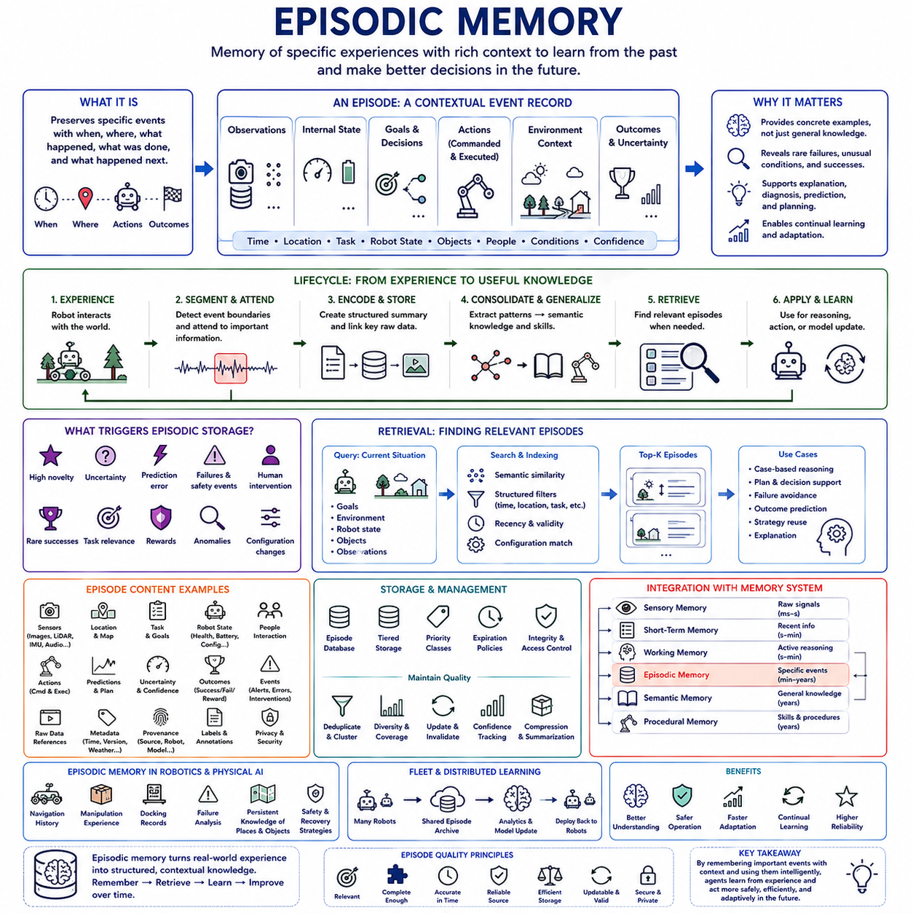{width="7.268055555555556in" height="7.268055555555556in"}

일화 기억(Episodic Memory)은 개인적으로 또는 운영 과정에서 경험한 사건을 시간적, 공간적, 상황적, 행동적 문맥과 함께 보존하는 기억 시스템입니다. 일반화된 지식과 달리 일화 기억은 특정 사건을 표현하므로 지능형 에이전트(Intelligent Agent)가 무엇이 발생했는지, 어디에서 발생했는지, 언제 발생했는지, 어떤 행동을 수행했는지, 어떤 결과가 뒤따랐는지를 기억할 수 있도록 합니다.

하나의 에피소드(Episode)는 단순한 사건 기록 이상입니다. 감각 관찰(Sensory Observation), 내부 상태(Internal State), 목표, 의사결정, 행동, 환경 조건, 불확실성(Uncertainty), 결과를 하나의 일관된 문맥 표현(Contextual Representation)으로 결합합니다. 이러한 구조를 통해 이후의 추론은 사건 자체뿐 아니라 그 사건이 발생한 조건까지 재구성할 수 있습니다.

일화 기억은 일반화된 사실보다 구체적인 경험을 보존한다는 점에서 의미 기억(Semantic Memory)과 다릅니다. 의미 기억은 특정 표면이 일반적으로 미끄럽다는 지식을 포함할 수 있지만, 일화 기억은 특정 위치에서 특정 날씨와 페이로드(Payload) 조건 아래 로봇이 미끄러졌던 구체적인 사건을 보존할 수 있습니다.

이러한 구분이 중요한 이유는 일반화된 지식과 개별 경험이 서로 다른 종류의 증거를 제공하기 때문입니다. 의미 지식은 광범위한 추론을 지원하지만 일화 기억은 일반화된 규칙만으로는 충분히 포착하기 어려운 비정상적인 조건, 희귀 실패, 예외적인 성공, 문맥 의존적 행동을 보여주는 구체적인 사례를 제공합니다.

일화 기억은 단기 기억(Short-Term Memory)과도 다릅니다. 단기 기억은 최근 정보를 일시적으로 유지하지만, 일화 기억은 미래의 학습, 추론, 진단, 행동에 가치가 있기 때문에 선택된 사건을 더 오랫동안 보존합니다. 사건은 최근 상태 이력으로 시작할 수 있으며 충분히 중요하다고 판단되면 이후 지속적인 에피소드로 전환될 수 있습니다.

따라서 단기 정보에서 일화 기억으로의 전환은 선택적으로 이루어집니다. 대부분의 일상적인 관찰은 영구적으로 보존할 필요가 없습니다. 높은 새로움(Novelty), 불확실성, 예측 오류(Prediction Error), 작업 관련성, 인간 개입, 실패, 보상, 안전 중요성을 가진 사건은 일화 기억으로 공고화(Consolidation)될 가능성이 더 높습니다.

주의(Attention)는 경험의 일부만 상세하게 처리되기 때문에 일화 부호화(Episodic Encoding)에 영향을 줍니다. 현재 목표, 예상하지 못한 변화, 큰 결과, 해결되지 않은 불확실성과 관련된 정보는 지속적인 에피소드의 일부가 될 가능성이 높습니다. 이를 통해 기억이 반복적이고 가치가 낮은 운영 데이터로 과부하되는 것을 방지할 수 있습니다.

문맥(Context)은 일화 기억을 정의하는 핵심 특성입니다. 사건은 무엇이 발생했는지만이 아니라 주변 조건까지 보존할 때 더 유용해집니다. 시간, 위치, 환경, 작업, 활성 목표, 로봇 구성, 주변 객체, 인간의 개입, 시스템 신뢰도는 모두 이후 사건을 어떻게 해석해야 하는지를 결정할 수 있습니다.

시간적 문맥(Temporal Context)은 에피소드를 경험의 시퀀스 안에서 구성할 수 있도록 합니다. 하나의 실패 사건은 바로 이전에 발생한 사건을 모르면 의미를 이해하기 어려울 수 있습니다. 이전 행동, 센서 변화, 경고, 상태 전이(State Transition)를 기억하면 결과가 시간에 따라 어떻게 전개되었는지를 재구성할 수 있습니다.

공간적 문맥(Spatial Context)은 에피소드가 어디에서 발생했는지를 제공합니다. 체화 에이전트(Embodied Agent)에서는 환경의 특성이 특정 장소에서 반복되는 경우가 많기 때문에 위치가 관련성에 큰 영향을 줄 수 있습니다. 로봇은 좁은 복도, 어려운 도킹 구역, 미끄러운 경사로, 위치 추정 성능이 저하되는 구역과 관련된 이전 에피소드를 해당 위치에 다시 접근할 때 검색할 수 있습니다.

작업 문맥(Task Context)도 동일하게 중요합니다. 동일한 물리 환경이라도 에이전트가 무엇을 수행하려 했는지에 따라 서로 다른 일화적 의미를 가질 수 있습니다. 내비게이션 중 로봇이 정지했다면 실패일 수 있지만 검사 절차 중 동일한 정지 상태는 작업 성공을 나타낼 수 있습니다.

목표 문맥(Goal Context)은 특정 행동이 왜 선택되었는지를 설명하는 데 도움을 줍니다. 의도한 목표를 알지 못하면 이후 분석에서 행동을 잘못 해석할 수 있습니다. 따라서 목표와 하위 목표(Subgoal)가 의사결정과 결과에 실질적으로 영향을 주었다면 일화 기억은 이를 함께 보존해야 합니다.

행동 이력(Action History)은 또 다른 핵심 구성요소입니다. 에피소드는 이상적으로 어떤 행동이 명령되었고, 실제로 어떤 행동이 실행되었으며, 환경이 이에 어떻게 반응했는지를 보존해야 합니다. 의도한 행동과 실제 행동 사이의 차이는 액추에이터 고장, 제어 오류, 예상하지 못한 접촉, 잘못된 상태 추정을 보여줄 수 있습니다.

예측 이력(Prediction History)은 일화 기억을 더욱 풍부하게 만들 수 있습니다. 시스템이 안전한 궤적을 예측했지만 실제로 충돌 위험이 발생했다면 그 차이는 중요한 정보입니다. 예측 결과와 실제 결과를 함께 저장하면 이후 분석에서 문제가 지각, 월드 모델링(World Modeling), 계획, 실행 중 어디에서 발생했는지를 판단할 수 있습니다.

불확실성도 에피소드의 일부가 되어야 합니다. 최종 결정만 기억하고 당시 얼마나 불확실했는지를 보존하지 않는다면 중요한 진단 정보를 잃게 됩니다. 신뢰도(Confidence), 대안 가설(Alternative Hypotheses), 센서 품질, 모델 간 불일치(Model Disagreement)는 당시 특정 선택이 왜 합리적으로 보였는지를 설명하는 데 도움을 줍니다.

따라서 일화 기억은 설명 가능성(Explanation)을 지원합니다. 지능형 에이전트에게 왜 특정 방식으로 행동했는지를 질문하면 관련 에피소드는 관찰 상태, 목표, 가정, 예측, 선택된 행동, 결과를 제공할 수 있습니다. 이는 현재 모델만을 사용하여 사후적으로 설명을 재구성하는 것보다 더 많은 정보를 제공합니다.

인간의 기억은 경험을 완벽하게 기록하는 장치가 아니며, 인공 일화 기억도 모든 것을 최대 세밀도로 보존할 필요는 없습니다. 목표는 과도한 저장 비용을 발생시키지 않으면서 이후 검색, 학습, 진단, 의사결정을 지원할 만큼 충분한 문맥 증거를 유지하는 것입니다.

따라서 압축(Compression)이 필요합니다. 원시 센서 데이터(Raw Sensor Data)는 객체, 사건, 궤적, 상태 변화, 의미 라벨(Semantic Label)로 요약할 수 있습니다. 다만 안전 분석, 디버깅, 미래 모델 학습에 고해상도 증거가 필요한 경우 중요한 원시 데이터 구간은 함께 보존할 수 있습니다.

하이브리드 일화 표현(Hybrid Episodic Representation)은 구조화된 요약과 선택된 원시 데이터 참조를 함께 사용할 수 있습니다. 예를 들어 아차 충돌(Near-Collision) 에피소드는 의미적 설명, 관련 객체 트랙(Object Track), 로봇 상태, 예측 오류, 사건 주변의 짧고 동기화된 카메라 및 라이다(LiDAR) 구간을 함께 저장할 수 있습니다.

사건 경계(Event Boundary)는 하나의 에피소드가 어디에서 시작하고 끝나는지를 결정합니다. 지속적인 운영 과정에서 경험은 자연스럽게 명확히 구분된 단위로 들어오지 않습니다. 시스템은 작업 완료, 실패, 인간 개입, 환경 변화, 큰 예측 오류와 같은 의미 있는 전환을 식별해야 합니다.

작업 구조(Task Structure)는 자연스러운 경계를 제공할 수 있습니다. 배송 시작과 완료, 파지 시도, 도킹 절차, 검사 단계, 내비게이션 구간은 각각 하나의 에피소드를 정의할 수 있습니다. 이러한 경계는 각 기억이 일관된 행동 단위와 연결되기 때문에 이후 검색을 더 의미 있게 만듭니다.

예상하지 못한 사건 역시 추가적인 경계를 만들 수 있습니다. 갑작스러운 충돌 경고, 위치 추정 손실(Localization Loss), 통신 장애, 인간 개입, 객체 미끄러짐(Object Slip)은 비정상 조건을 독립적으로 분석할 수 있도록 진행 중인 작업을 별도의 에피소드로 분리할 이유가 될 수 있습니다.

사건 분할(Event Segmentation)은 내부 상태 변화나 예측 오류를 기반으로 학습될 수도 있습니다. 현재 모델이 들어오는 관찰을 더 이상 설명하지 못할 때 이러한 불연속성은 새로운 사건이 시작되었음을 의미할 수 있습니다. 이는 일화 기억 형성을 예측 처리(Predictive Processing)와 연결합니다.

일화 기억에는 검색, 참조, 비교, 갱신을 위해 식별자(Identifier)가 필요합니다. 각 에피소드에는 고유 식별자와 함께 시간, 위치, 작업, 로봇, 소프트웨어 버전, 모델 버전, 관련 환경 조건을 설명하는 메타데이터(Metadata)를 포함할 수 있습니다.

메타데이터는 장기적인 사용 가능성을 위해 매우 중요합니다. 이전 지각 모델(Perception Model)로 수집한 에피소드는 시스템 업그레이드 이후 다른 방식으로 해석해야 할 수 있습니다. 모델, 센서, 캘리브레이션(Calibration), 구성 버전은 과거 행동을 이해하는 데 필요한 중요한 문맥을 제공합니다.

출처(Provenance)는 에피소드 안의 정보가 어디에서 생성되었는지를 설명합니다. 일부 요소는 직접 센서에서, 다른 요소는 인간 주석(Human Annotation), 시뮬레이션, 다른 로봇, 외부 데이터베이스, 추론된 모델 상태에서 생성될 수 있습니다. 이러한 정보원을 추적하면 이후 추론 과정에서 신뢰성을 평가할 수 있습니다.

일화 기억 검색(Episodic Memory Retrieval)은 흔히 유사성(Similarity)에서 시작됩니다. 현재 상황을 의미 내용, 객체 구성, 환경 조건, 작업 유형, 위치, 로봇 상태, 관찰된 실패 패턴을 기준으로 저장된 에피소드와 비교할 수 있습니다. 유사한 과거 사건은 현재 행동에 유용한 지침을 제공할 수 있습니다.

유사성이 완벽하게 일치할 필요는 없습니다. 로봇은 객체가 다르더라도 기하학, 접촉 패턴, 힘 동작이 유사한 경우 이전의 파지 실패를 검색할 수 있습니다. 유용한 검색은 모든 표면적 세부사항을 일치시키는 것이 아니라 그 아래에 존재하는 구조를 식별하는 데 달려 있습니다.

벡터 임베딩(Vector Embedding)은 유사성 기반 에피소드 검색을 구현하는 하나의 방법입니다. 에피소드를 중요한 의미 및 문맥 특징을 요약하는 수치 표현으로 부호화할 수 있습니다. 현재 상태 역시 동일하게 부호화하여 대규모 일화 아카이브에서 근사 최근접 검색(Approximate Nearest-Neighbor Search)을 수행할 수 있습니다.

구조화된 인덱싱(Structured Indexing)은 이를 보완합니다. 의미적 유사도 검색을 수행하기 전에 시간, 위치, 작업, 객체 유형, 로봇, 실패 모드, 환경 조건, 소프트웨어 버전으로 에피소드를 필터링할 수 있습니다. 구조화 검색과 벡터 검색을 결합하면 정확도를 향상시킬 수 있습니다.

검색 관련성은 최신성과 유효성도 고려해야 합니다. 수년 전의 유사한 사건이라도 로봇 하드웨어, 소프트웨어, 환경 조건이 크게 변했다면 유용성이 낮을 수 있습니다. 따라서 일화 검색은 유사성뿐 아니라 시간 및 구성 호환성(Configuration Compatibility)을 함께 가중하는 것이 유리합니다.

검색된 에피소드는 현재 추론에 여러 방식으로 영향을 줄 수 있습니다. 성공한 전략의 사례, 이전 실패에 대한 경고, 예상 결과에 대한 추정, 대안 행동, 현재 상황이 비정상적이라는 증거를 제공할 수 있습니다.

사례 기반 추론(Case-Based Reasoning)은 일화 기억과 밀접하게 관련됩니다. 모든 문제를 일반화된 규칙만으로 처음부터 해결하는 대신 유사한 이전 사례를 검색하고, 그 해결책을 현재 문맥에 맞게 수정하며, 이전 결과가 현재에도 적용될 가능성이 있는지를 평가할 수 있습니다.

이 접근은 희귀한 조건 조합을 일반 모델에 충분히 반영하기 어려운 환경에서 특히 유용합니다. 구체적인 에피소드는 많은 경험이 평균적인 행동으로 압축될 때 사라질 수 있는 비정상적인 상호작용을 보존할 수 있습니다.

그러나 이전 행동을 무조건 복사하는 것은 위험합니다. 유사한 에피소드 사이에도 중요한 숨겨진 변수(Hidden Variable)가 다를 수 있습니다. 따라서 검색은 추론을 지원해야지 이를 대체해서는 안 됩니다. 현재 센싱, 불확실성, 로봇 능력, 안전 제약조건을 통해 과거 전략이 현재에도 유효한지를 판단해야 합니다.

일화 기억은 유사한 상황이 과거에 어떻게 전개되었는지에 대한 경험적 사례를 제공함으로써 예측(Prediction)을 지원할 수 있습니다. 현재 상태가 이전에 휠 슬립, 충돌 위험, 위치 추정 실패, 성공적인 복구로 이어진 에피소드와 유사하다면 해당 에피소드는 가능한 미래 결과에 대한 증거를 제공합니다.

따라서 월드 모델(World Model)과 일화 기억은 상호보완적입니다. 월드 모델은 일반화된 동역학을 제공하고 일화 기억은 구체적인 역사적 사례를 제공합니다. 에이전트는 일반 예측에는 월드 모델을 사용하고 유사한 실제 경험이 해당 예측을 뒷받침하거나 반박하는지를 일화 검색을 통해 확인할 수 있습니다.

예측 오류는 특히 가치가 높은 일화 정보입니다. 예상 결과와 실제 결과의 큰 차이는 현재 모델이 중요한 요소를 포착하지 못했다는 의미입니다. 이러한 에피소드는 시스템 이해의 한계를 직접 보여주기 때문에 이후 분석을 위해 높은 우선순위로 보존할 수 있습니다.

따라서 이상 탐지(Anomaly Detection)는 일화 저장을 유발할 수 있습니다. 현재 행동이 학습된 기대에서 크게 벗어나면 시스템은 이후 조사를 위해 주변 문맥을 보존할 수 있습니다. 이를 통해 어렵고 정보 가치가 높은 학습 사례를 자동으로 수집할 수 있습니다.

실패는 일화 기억의 명확한 후보이지만 성공적인 사건도 중요합니다. 희귀한 성공적 복구, 효율적인 경로 선택, 강건한 파지, 비정상적인 인간 협력은 보존하고 재사용할 가치가 있는 전략을 포함할 수 있습니다.

따라서 균형 잡힌 일화 아카이브(Episodic Archive)는 긍정적 결과와 부정적 결과를 모두 포함해야 합니다. 실패만 포함된 기억은 위험을 과대평가할 수 있고 성공 사례만 포함된 기억은 중요한 위험을 무시할 수 있습니다. 다양한 결과의 사례를 함께 사용할 때 비교 검색의 가치가 높아집니다.

인간 개입(Human Intervention)은 특히 정보 가치가 높습니다. 운영자가 시스템을 수정했다는 것은 자율 추론이 충분하지 않았거나 추가적인 문맥 지식이 필요했다는 의미입니다. 개입 전후 에피소드는 지각, 계획, 안전, 작업 이해에서의 부족한 부분을 보여줄 수 있습니다.

시연(Demonstration) 역시 일화적으로 저장할 수 있습니다. 인간이 수행한 작업 시퀀스에는 관찰, 행동, 수정, 결과가 포함될 수 있습니다. 이러한 에피소드는 이후 모방학습(Imitation Learning), 기술 습득(Skill Acquisition), 작업 분해(Task Decomposition), 인간과 로봇 행동 비교에 활용할 수 있습니다.

일화 기억은 이전 환경과 작업의 사례를 보존하여 지속학습(Continual Learning)을 지원합니다. 새로운 데이터로 모델을 갱신할 때 선택된 과거 에피소드를 재생하면 치명적 망각을 감소시키고 이전에 학습한 상황에 대한 성능을 유지할 수 있습니다.

재생(Replay)은 모든 에피소드를 동일하게 취급할 필요가 없습니다. 희귀하고, 오류가 크고, 안전에 중요하거나, 대표성이 높은 사례는 더 높은 샘플링 우선순위를 받을 수 있습니다. 우선순위 재생(Prioritized Replay)은 정보 가치가 높은 경험에 학습을 집중하여 효율성을 향상시킵니다.

에피소드 다양성(Episode Diversity)도 중요합니다. 거의 동일한 사건을 반복적으로 저장하면 많은 용량을 사용하면서 새로운 지식은 거의 추가되지 않습니다. 군집화(Clustering)나 유사도 탐지를 이용하여 중복 에피소드를 식별하고 모든 사건 대신 대표 사례를 보존할 수 있습니다.

기억 공고화는 일화 아카이브를 이용하여 의미 지식을 추출할 수 있습니다. 많은 에피소드가 동일한 패턴을 보여주면 일반화된 규칙을 생성하거나 월드 모델 파라미터를 갱신할 수 있습니다. 따라서 일화 경험은 의미 학습 및 예측 학습의 원천이 됩니다.

일반화 이후에도 일부 원시 에피소드는 근거 자료(Supporting Evidence)로 유지할 수 있습니다. 이는 일반화된 지식이 예외를 숨길 수 있기 때문에 중요합니다. 대표적인 원본 에피소드를 유지하면 추적 가능성(Traceability)을 제공하고 학습된 규칙이 불완전한 것으로 밝혀졌을 때 다시 평가할 수 있습니다.

일화 기억은 절차 학습(Procedural Learning)에도 기여합니다. 반복적으로 성공한 행동 시퀀스는 재사용 가능한 기술을 보여줄 수 있습니다. 빈번하게 성공하는 도킹 시퀀스는 매번 개별 에피소드를 검색할 필요 없이 궁극적으로 절차 정책(Procedural Policy)으로 변환될 수 있습니다.

이는 정보가 여러 기억 시스템 사이를 이동한다는 것을 보여줍니다. 감각 기억과 단기 기억은 최근 경험을 포착하고, 작업 기억(Working Memory)은 이를 해석하고 행동하며, 일화 기억은 중요한 사건을 보존하고, 의미 기억은 일반 지식을 추출하며, 절차 기억은 재사용 가능한 행동을 형성합니다.

인공지능에서는 구조화된 데이터베이스, 문서 저장소, 벡터 데이터베이스(Vector Database), 이벤트 로그(Event Log), 궤적 아카이브(Trajectory Archive), 특화 기억 서비스를 이용하여 일화 기억을 구현할 수 있습니다. 선택은 규모, 검색 요구사항, 데이터 유형, 지연시간 제약조건에 따라 달라집니다.

구조화된 에피소드 스키마(Structured Episode Schema)는 일관성을 향상시킬 수 있습니다. 시간 범위, 작업 식별자, 세계 상태, 로봇 상태, 목표, 관찰, 행동, 예측, 불확실성, 결과, 안전 사건, 인간 개입, 원시 센서 구간에 대한 링크를 필드로 포함할 수 있습니다.

스키마는 미래 모델이 처음에는 중요하지 않다고 생각했던 정보를 필요로 할 수 있기 때문에 확장 가능해야 합니다. 지나치게 경직된 표현은 AI 아키텍처가 발전할 때 과거 에피소드를 사용할 수 없게 만들 위험이 있습니다.

원시 데이터 참조(Raw Data Reference)는 이러한 문제를 완화할 수 있습니다. 구조화된 요약에서 미래에 중요한 변수를 누락하더라도 일부 원시 증거를 보존하면 개선된 모델로 다시 처리할 수 있습니다.

저장 정책(Storage Policy)은 에피소드의 중요도를 반영해야 합니다. 일상적인 성공은 압축된 요약만 필요할 수 있지만 안전 사고는 상세한 센서 데이터를 보존할 가치가 있습니다. 여러 유지 등급(Retention Class)을 사용하면 학습 가치와 저장 비용 사이의 균형을 맞출 수 있습니다.

에피소드에도 만료 정책(Expiration Policy)을 적용할 수 있습니다. 환경과 하드웨어가 변화하면서 일부 운영 사건은 가치가 낮아질 수 있지만 규정, 안전, 희귀 실패 기록은 더 오래 보존해야 할 수 있습니다. 따라서 장기 아카이브에는 통제된 유지 및 삭제 기능이 필요합니다.

일화 기억에는 갱신과 무효화(Update and Invalidation) 메커니즘도 필요합니다. 이후 증거를 통해 에피소드의 라벨이나 해석이 잘못되었음이 확인되면 오류가 미래 검색에 계속 영향을 주도록 두지 않고 메타데이터를 수정해야 합니다.

신뢰도는 전체 에피소드와 개별 필드 모두에 연결할 수 있습니다. 작업 결과는 높은 확실성으로 알려져 있지만 추정 원인은 불확실할 수 있습니다. 이러한 차이를 보존하면 미래 추론에서 가설을 확립된 사실처럼 취급하는 것을 방지할 수 있습니다.

로보틱스에서 일화 기억은 물리적 상호작용이 복잡한 인과 체인(Causal Chain)을 만들기 때문에 특히 가치가 있습니다. 하나의 내비게이션 실패에는 센서 가림, 위치 추정 드리프트(Localization Drift), 부정확한 예측, 제어 지연, 휠 슬립, 환경 기하학이 동시에 관련될 수 있습니다.

전체 시퀀스를 보존하면 시스템 수준의 진단이 가능합니다. 각 구성요소 로그에서는 모든 모듈이 정상 범위에서 동작한 것으로 나타날 수 있지만 구성요소 사이의 상호작용이 여전히 안전하지 않거나 비효율적인 결과를 만들었을 수 있습니다.

따라서 피지컬 AI는 동기화된 멀티모달 일화 기록(Synchronized Multimodal Episodic Record)의 이점을 크게 얻습니다. 카메라, 라이다, 레이더(Radar), IMU, GNSS, 액추에이터 상태, 제어 명령, 월드 모델 예측, 작업 상태를 시간적으로 정렬하여 하나의 일관된 물리적 과정을 나타내야 합니다.

정확한 타임스탬프(Timestamp)는 이를 위해 필수적입니다. 센서 스트림과 행동이 잘못 정렬되면 이후 재구성에서 잘못된 인과 해석이 발생할 수 있습니다. 따라서 시간 동기화(Time Synchronization)는 실시간 지각에서뿐 아니라 기억 품질에서도 중요합니다.

로봇 자기 상태(Self-State)도 환경 상태와 함께 저장해야 합니다. 페이로드, 에너지 수준, 액추에이터 상태, 소프트웨어 모드, 안전 상태, 구성은 동일한 환경이 서로 다른 시점에 다른 결과를 만든 이유를 설명할 수 있습니다.

환경 문맥(Environmental Context)에는 날씨, 조명, 지형, 네트워크 상태, 군중 밀도, 기타 운영 변수가 포함될 수 있습니다. 이러한 요소는 에피소드가 이후 검색에서 얼마나 유용한지를 크게 좌우할 수 있습니다.

위치 기반 일화 기억(Location-Based Episodic Memory)은 모바일 로봇에서 특히 유용합니다. 위치 추정 문제, 혼잡, 접지력 손실, 인간 상호작용이 반복적으로 발생한 구역에 접근하면 관련 에피소드를 검색하여 사전에 행동을 조정할 수 있습니다.

객체 기반 일화 기억(Object-Based Episodic Memory)은 반복적으로 등장하는 개체와의 상호작용 이력을 축적할 수 있습니다. 로봇은 특정 객체 또는 자산과 관련된 이전 취급 시도, 검사 결과, 실패를 기억할 수 있습니다.

인간 중심 에피소드(Human-Centered Episode)는 협업을 지원할 수 있습니다. 이전 지시, 수정, 시연, 상호작용 결과는 적절한 개인정보 보호(Privacy) 및 권한 조건 아래에서 향후 유사한 요청을 해석하는 데 도움을 줄 수 있습니다.

일화 기억은 사람과 사건에 대한 상세 기록을 포함할 수 있으므로 개인정보 보호가 특히 중요합니다. 시스템은 필요한 것보다 더 많은 개인 정보를 저장하지 않아야 하며 응용 분야에 적합한 유지, 접근, 익명화(Anonymization), 삭제 정책을 적용해야 합니다.

일화 기록을 조작하면 미래 행동까지 바뀔 수 있기 때문에 보안(Security)도 중요합니다. 악의적으로 삽입된 실패 또는 성공 사례는 검색과 학습을 왜곡할 수 있습니다. 무결성 검사(Integrity Check), 인증된 출처, 접근 제어, 감사 추적(Audit Trail)은 기억 품질을 보호하는 데 도움을 줍니다.

멀티에이전트 시스템(Multi-Agent System)은 로컬 일화 기억과 공유 일화 기억을 모두 유지할 수 있습니다. 각각의 로봇은 상세한 지역 경험을 보존하고 중요한 에피소드는 플릿 수준 아카이브(Fleet-Level Archive)에 업로드하여 다른 로봇도 해당 경험을 활용할 수 있도록 합니다.

공유 일화 기억에는 신중한 정규화(Normalization)가 필요합니다. 서로 다른 로봇은 서로 다른 센서, 구성, 소프트웨어 버전, 좌표계를 사용할 수 있습니다. 에피소드를 플랫폼 사이에서 의미 있게 비교하기 위해서는 메타데이터와 변환 규칙이 필요합니다.

플릿 수준의 에피소드 검색은 개별 로봇만으로는 충분한 빈도로 경험하지 못하는 패턴을 발견할 수 있습니다. 여러 로봇에 분산되어 발생한 희귀 실패를 통합하면 통계적으로 의미 있는 패턴이 될 수 있습니다.

따라서 일화 기억은 플릿 학습(Fleet Learning)의 중요한 구성요소가 됩니다. 여러 로봇의 운영 경험을 수집하고, 필터링하고, 비교하고, 일반화하여 전체 플릿의 모델이나 절차를 개선하는 데 사용할 수 있습니다.

엣지(Edge)와 온프레미스(On-Premise) 시스템은 일화 기억 기능을 분담할 수 있습니다. 온보드 시스템은 단기 이벤트 버퍼와 최근 로컬 에피소드를 유지하고, 온프레미스 인프라는 대규모 아카이브를 저장하고, 에피소드 간 분석을 수행하고, 모델 재학습을 지원할 수 있습니다.

통신이 불가능한 상황에서도 로봇은 중요한 최근 에피소드를 로컬에 유지해야 합니다. 즉각적인 복구는 원격 검색을 기다리지 않고 직전의 실패 행동이나 최근 환경 변화를 기억하는 것에 의존할 수 있습니다.

이벤트 트리거 업로드(Event-Triggered Upload)는 네트워크 부하를 줄일 수 있습니다. 일상적인 운영 데이터는 로컬에 유지하거나 요약하고, 중요한 실패, 이상 현상, 인간 개입, 대표적인 학습 사례만 중앙 저장소로 전송할 수 있습니다.

일화 기억은 디지털 트윈(Digital Twin)도 지원할 수 있습니다. 실제 환경에서 발생한 에피소드는 가상 모델을 실제 운영 동작으로 갱신할 수 있으며, 시뮬레이션은 기록된 사건을 재현하여 원인을 조사하거나 대안 행동을 평가할 수 있습니다.

시뮬레이션에서 에피소드를 재생하면 반사실적 분석(Counterfactual Analysis)이 가능합니다. 엔지니어나 AI 시스템은 로봇이 더 일찍 감속했거나, 다른 경로를 선택했거나, 다른 파지 방법을 사용했거나, 다른 센서를 활성화했다면 어떤 일이 발생했을지를 평가할 수 있습니다.

반사실적 평가는 일화 기억을 단순한 과거 기록에서 능동적인 학습 자원으로 변화시킵니다. 저장된 실제 사건이 기준선(Baseline)이 되고, 시뮬레이션은 물리적 위험을 다시 경험하지 않고도 대안적인 의사결정을 탐색할 수 있습니다.

일화 기억은 오프라인 강화학습(Offline Reinforcement Learning)도 지원할 수 있습니다. 기록된 상태-행동-결과 궤적을 이용하면 정책(Policy)이 물리 환경과 지속적으로 상호작용하지 않고도 경험으로부터 학습할 수 있습니다.

그러나 에피소드 데이터셋은 이를 생성한 행동 정책을 반영한다는 점에 주의해야 합니다. 중요한 행동이 거의 시도되지 않았다면 해당 결과에 대한 증거도 거의 존재하지 않을 수 있습니다. 학습 시스템은 이러한 커버리지 한계(Coverage Limitation)를 인식해야 합니다.

따라서 에피소드 선택은 학습 행동에 영향을 줍니다. 일상적인 성공 사례가 지나치게 많으면 희귀 실패에 대비하지 못할 수 있고, 비정상 사건이 지나치게 많으면 지나치게 보수적인 정책이 만들어질 수 있습니다. 균형 잡힌 큐레이션(Curation)이 필요합니다.

새로움 점수(Novelty Score)는 어떤 에피소드를 선택할지를 결정하는 데 도움을 줄 수 있습니다. 기존 기억과 크게 다른 사건은 익숙한 사건의 추가 사례보다 새로운 정보 가치가 더 클 수 있습니다. 따라서 시스템은 표현이 부족한 경험에 우선적으로 저장 공간을 할당할 수 있습니다.

커버리지 분석(Coverage Analysis)은 경험이 부족한 영역을 식별할 수 있습니다. 일화 아카이브에 특정 지형, 페이로드, 날씨 조건, 상호작용 유형의 데이터가 부족하다면 향후 탐색이나 데이터 수집에서 해당 영역을 목표로 할 수 있습니다.

이는 일화 기억을 능동학습(Active Learning)과 연결합니다. 시스템은 이미 무엇을 경험했는지 기억하는 것뿐 아니라 어떤 종류의 경험이 아직 부족하며 추가로 획득할 가치가 있는지를 판단하는 데 아카이브를 사용할 수 있습니다.

실시간 시스템에서는 검색 지연시간(Retrieval Latency)이 중요합니다. 일부 일화 검색은 즉각적인 의사결정을 지원하므로 매우 빠르게 수행되어야 하지만, 더 깊은 아카이브 분석은 오프라인으로 수행할 수 있습니다. 기억 아키텍처는 운영 검색(Operational Retrieval)과 장기 분석 검색을 구분해야 합니다.

압축된 임베딩과 메타데이터 인덱스는 빠른 후보 에피소드 검색을 지원할 수 있습니다. 이후 더 상세한 원시 데이터는 실제로 필요할 때만 로드하여 지연시간과 대역폭을 줄일 수 있습니다.

일화 기억은 인간 운영자에게 설명을 제공하는 데도 사용할 수 있습니다. 로봇이 유사한 이전 상황에서 휠 슬립이 발생했기 때문에 감속했다고 보고할 때 관련 에피소드를 제시하면 의사결정에 대한 구체적인 역사적 증거를 제공할 수 있습니다.

그러나 설명은 단순한 유사성을 확정적인 인과관계처럼 표현해서는 안 됩니다. 유사한 에피소드가 동일한 결과가 다시 발생한다는 것을 증명하지는 않습니다. 시스템은 유사도, 신뢰도, 현재 상황과 과거 상황의 중요한 차이를 함께 전달해야 합니다.

메타인지(Metacognition)는 일화 검색을 감독할 수 있습니다. 에이전트는 검색된 사례가 현재 행동에 영향을 주기 전에 충분히 유사한지, 최신인지, 신뢰할 수 있는지, 현재 구성과 호환되는지를 평가할 수 있습니다.

관련된 에피소드가 없다면 시스템은 상황이 안전하거나 익숙하다고 가정하지 않고 경험이 부족하다는 사실을 인식해야 합니다. 기억의 부재 자체가 주의를 강화하고, 센싱을 확대하거나, 인간 감독을 요청해야 한다는 신호가 될 수 있습니다.

서로 충돌하는 에피소드도 중요한 정보를 제공합니다. 유사한 상황이 숨겨진 변수 때문에 서로 다른 결과를 만들 수 있습니다. 하나의 기억을 임의로 선택하는 대신 여러 에피소드를 비교하여 결과 차이를 설명하는 문맥 변수를 식별할 수 있습니다.

이러한 비교는 인과 이해(Causal Understanding)를 향상시킬 수 있습니다. 예를 들어 높은 페이로드와 젖은 노면 조건에서만 휠 슬립이 발생했다면 서로 다른 에피소드의 대비를 통해 어떤 변수가 중요한지 각 에피소드 하나만 분석할 때보다 명확하게 발견할 수 있습니다.

따라서 일화 기억은 개입(Intervention), 결과, 문맥을 함께 보존함으로써 인과 학습(Causal Learning)에 기여합니다. 에이전트는 서로 다른 행동과 조건에서 어떤 결과가 발생했는지를 비교하여 어떤 요소가 결과에 영향을 미쳤는지를 추정할 수 있습니다.

일화 기억의 품질은 검색 관련성, 문맥 완전성(Contextual Completeness), 시간 정확도, 저장 효율성, 다양성, 갱신 능력, 학습과 의사결정에 대한 기여도를 기준으로 평가해야 합니다.

진단 가치(Diagnostic Value)도 중요한 지표입니다. 에피소드는 가능한 모든 신호를 무기한 저장하지 않고도 엔지니어가 실패를 이해할 수 있을 만큼 충분한 시스템 상태를 재구성할 수 있어야 합니다.

학습 시스템에서는 일화 재생이 일반화 성능을 향상시키는지, 치명적 망각을 감소시키는지, 희귀 사건 성능을 높이는지, 월드 모델 정확도를 향상시키는지를 평가할 수 있습니다.

계획 분야에서는 유사 에피소드를 검색했을 때 일반화된 모델만 사용하는 경우와 비교하여 작업 성공률이 향상되고, 위험이 감소하고, 복구 시간이 단축되는지를 평가할 수 있습니다.

피지컬 AI에서는 폐루프 시험(Closed-Loop Testing)이 필수적입니다. 일화 기억은 이전 경험이 미래 행동을 실제로 더 좋은 방향으로 변화시킬 때 가치가 있습니다. 로봇은 이미 알려진 실패를 반복하지 않고, 검증된 복구 전략을 재사용하며, 익숙한 패턴이 다시 나타날 때 더 빠르게 적응해야 합니다.

아키텍처는 오래된 에피소드에 부적절하게 의존하는 것도 방지해야 합니다. 저장된 경험이 현재 현실과 충돌한다면 현재 지각과 안전 검사가 우선적인 기준으로 작동해야 합니다.

따라서 일화 기억은 의심할 수 없는 절대적 사실이 아니라 경험에서 얻은 증거(Evidence from Experience)로 이해하는 것이 적절합니다. 구체적인 역사적 사례를 통해 현재 인지를 풍부하게 하지만 항상 검증, 불확실성, 문맥적 해석의 대상이 되어야 합니다.

인지과학(Cognitive Science)의 관점에서 일화 기억은 일반화된 지식과 독립적으로 특정 과거 사건이 현재 사고에 어떤 영향을 줄 수 있는지를 설명합니다. 경험의 시간적·상황적 구조를 보존하고 회상, 비교, 계획, 상상, 학습을 지원합니다.

인공지능(Artificial Intelligence)의 관점에서 일화 기억은 에이전트에게 지속적인 상호작용 이력을 제공합니다. 사례 기반 추론, 검색 증강 의사결정(Retrieval-Augmented Decision Making), 지속학습, 설명, 이상 분석, 작업과 세션에 걸친 적응을 가능하게 합니다.

로보틱스(Robotics)와 피지컬 AI의 관점에서 일화 기억은 물리적 운용을 재사용 가능한 학습 자원으로 변화시킵니다. 중요한 상호작용은 실행 후 사라지는 대신 지각, 상태, 행동, 예측, 불확실성, 결과를 포함하는 구조화된 기록으로 보존됩니다.

성숙한 일화 기억 아키텍처(Episodic-Memory Architecture)는 사건 분할, 선택적 부호화, 동기화된 멀티모달 문맥, 구조화된 메타데이터, 불확실성, 출처, 유사성 검색, 우선순위 재생, 통제된 유지, 의미 기억·절차 기억·월드 모델 학습과의 상호작용을 결합합니다.

목표는 모든 순간을 영구적으로 기록하는 것이 아닙니다. 반복적이고 가치가 낮은 사건은 사라지도록 하면서 미래의 이해, 예측, 복구, 계획, 안전, 적응을 개선할 수 있는 문맥적 경험을 보존하는 것이 목표입니다.

궁극적으로 일화 기억은 지능형 에이전트가 특정 경험으로부터 학습하되 그 경험에 갇히지 않도록 합니다. 중요한 사건을 문맥과 함께 기억하고, 현재와 비교하며, 반복되는 패턴을 더 광범위한 지식과 기술로 변환함으로써 일화 기억은 개별적인 경험을 점차 더 정보가 풍부하고 신뢰할 수 있는 지능으로 전환합니다.

## 02.06 Semantic Memory [w/Code]

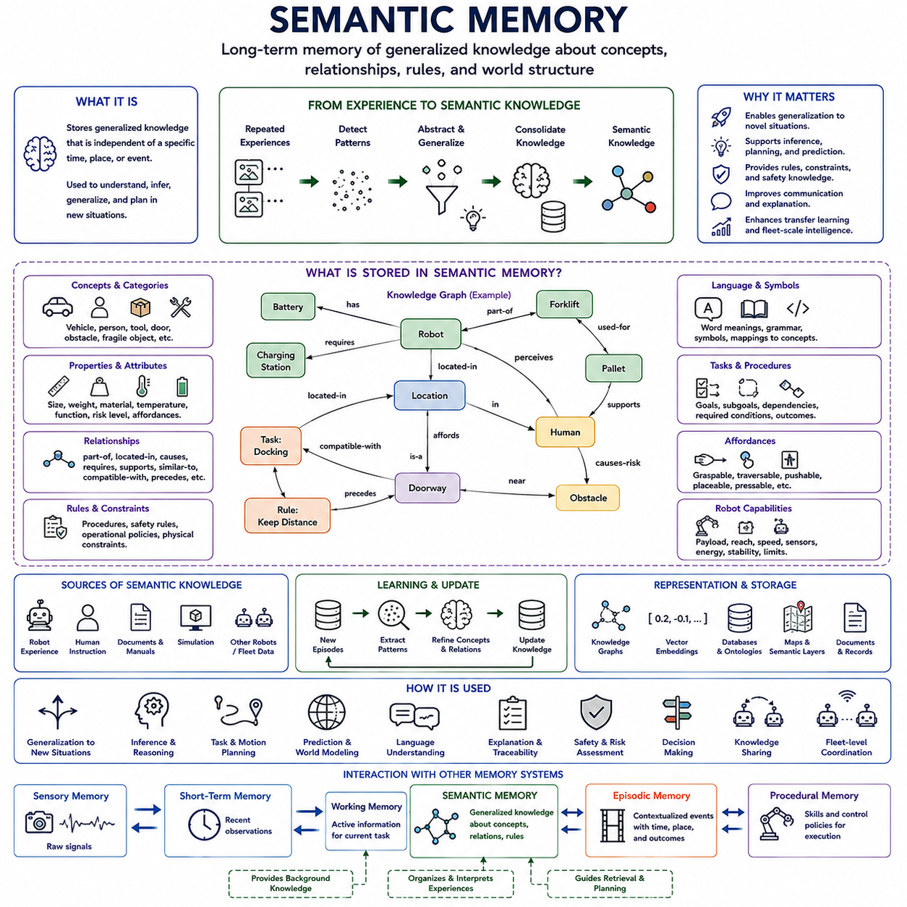{width="7.268055555555556in" height="7.268055555555556in"}

의미 기억(Semantic Memory)은 개념(Concept), 범주(Category), 속성(Property), 언어(Language), 규칙(Rule), 관계(Relationship), 그리고 세계의 구조(Structure of the World)에 대한 일반화된 지식을 보존하는 장기 기억 시스템(Long-Term Memory System)입니다. 특정 사건에 대한 기억과 달리 의미 기억은 해당 지식이 언제, 어디에서, 어떤 경험을 통해 처음 습득되었는지를 정확하게 기억하지 않고도 지식을 사용할 수 있도록 합니다.

의미 지식(Semantic Knowledge)은 반복적인 경험, 교육, 관찰, 의사소통, 추론을 통해 점진적으로 형성됩니다. 개별적인 경험은 처음에는 일화 기억(Episodic Memory)으로 저장될 수 있지만, 여러 에피소드에서 반복되는 패턴을 추출할 수 있습니다. 추상화(Abstraction)와 공고화(Consolidation)를 통해 구체적인 경험은 이전에 정확히 동일한 형태로 경험하지 않은 상황에도 적용할 수 있는 일반화된 표현(Generalized Representation)으로 변화합니다.

따라서 의미 기억과 일화 기억의 구분은 완전히 분리된 것이라기보다 기능적인 차이입니다. 일화 기억은 문맥화된 사건(Contextualized Event)을 보존하는 반면 의미 기억은 이러한 사건들에서 공통적인 구조를 추출합니다. 로봇은 특정 도킹 실패를 일화적으로 기억할 수 있으며, 의미 기억은 이후 특정 노면이나 위치 추정 조건에서 도킹 정확도가 저하된다는 일반화된 규칙을 표현할 수 있습니다.

의미 기억은 지능형 시스템(Intelligent System)이 서로 다른 상황 사이의 동등성(Equivalence)을 인식할 수 있도록 합니다. 두 객체는 색상, 크기, 위치, 외형이 서로 다르더라도 동일한 개념적 범주에 속할 수 있습니다. 범주 수준의 구조(Category-Level Structure)를 표현함으로써 의미 기억은 정확한 감각적 유사성을 넘어서는 일반화를 지원하고 모든 개별 사례를 암기해야 하는 의존성을 감소시킵니다.

개념 형성(Concept Formation)은 의미 기억의 핵심 기능 가운데 하나입니다. 하나의 개념은 여러 사례가 공유하는 특성을 요약하면서 관련성이 낮은 차이를 무시합니다. 차량(Vehicle), 출입구(Doorway), 사람(Person), 도구(Tool), 장애물(Obstacle), 충전소(Charging Station), 깨지기 쉬운 객체(Fragile Object)와 같은 개념은 인지가 많은 관찰을 관리 가능하고 재사용 가능한 구조로 구성할 수 있도록 합니다.

범주는 계층적(Hierarchical)으로 구성할 수 있습니다. 로봇은 어떤 객체를 차량으로 표현하고, 더 구체적으로는 차륜형 차량(Wheeled Vehicle), 더욱 구체적으로는 지게차(Forklift)로 표현할 수 있습니다. 계층적 구성은 작업에 따라 서로 다른 추상화 수준에서 추론할 수 있도록 하여 불필요한 세부사항은 줄이면서 필요할 때 더욱 구체적으로 구분할 수 있는 능력을 유지합니다.

의미 기억은 개념과 연결된 속성(Property)도 표현합니다. 하나의 범주는 일반적인 형상, 기능, 재료, 행동, 위치, 위험, 행동 유도성(Affordance)과 연결될 수 있습니다. 이러한 속성을 통해 에이전트는 새롭게 관찰한 객체의 모든 특성을 직접 측정하기 전에도 해당 객체에 관한 유용한 정보를 추론할 수 있습니다.

개념 사이의 관계도 동일하게 중요합니다. 지식은 개별적인 개체(Entity)뿐 아니라 부분 관계(Part-of), 위치 관계(Located-in), 인과 관계(Causes), 요구 관계(Requires), 지원 관계(Supports), 차단 관계(Blocks), 포함 관계(Contains), 선행 관계(Precedes), 유사 관계(Similar-to), 호환 관계(Compatible-with) 등을 포함합니다. 이러한 관계를 통해 의미 기억은 고립된 라벨이 아니라 구조화된 지식(Structured Knowledge)을 표현할 수 있습니다.

지식 그래프(Knowledge Graph)는 이러한 구조를 인공적으로 표현하는 실용적인 방법을 제공합니다. 개념을 노드(Node)로, 관계를 엣지(Edge)로 표현하여 명시적인 탐색과 추론을 수행할 수 있습니다. 예를 들어 로봇은 하나의 구조화된 지식 네트워크 안에서 배터리(Battery)를 에너지 저장, 충전 요구사항, 온도 한계, 안전 조건, 유지보수 절차와 연결할 수 있습니다.

의미 기억은 언어 지식(Linguistic Knowledge)도 지원합니다. 단어의 의미, 문법적 관계, 기술 용어, 기호(Symbol), 언어와 개념 사이의 매핑(Mapping)은 모두 일반화된 지식의 형태입니다. 이를 통해 언어는 즉각적인 지각 범위를 넘어서는 추상적 정보를 전달하는 인터페이스로 사용될 수 있습니다.

언어를 통해 에이전트가 직접 경험하지 않은 지식도 제공할 수 있습니다. 로봇은 물리적인 상호작용 없이 문서나 인간의 지시를 통해 특정 재료가 깨지기 쉽거나 특정 구역이 제한 구역이라는 사실을 학습할 수 있습니다. 의미 기억은 외부에서 제공된 이러한 사실을 센서와 경험으로부터 획득한 지식과 통합할 수 있습니다.

그러나 외부에서 획득한 지식이 물리적인 행동에 영향을 줄 경우 현실 세계에 기반(Grounding)되어야 합니다. 언어 설명에서 어떤 객체가 무겁다고 표현하더라도 로봇은 이를 들어 올리기 전에 현재의 센서 증거와 자신의 신체 능력 정보를 확인해야 합니다. 의미 지식은 지각과 추론을 강화하지만 현실 세계의 상태 추정(State Estimation)을 대체해서는 안 됩니다.

의미 기억은 추상화와 밀접하게 관련되어 있습니다. 원시 관찰(Raw Observation)에는 막대한 세부정보가 포함되지만 대부분의 작업에는 그중 일부만 필요합니다. 추상화는 추론에 유용한 규칙성을 보존하면서 부수적인 차이를 제거하여 지식을 효율적으로 검색하고 재사용할 수 있을 정도로 압축합니다.

좋은 추상화는 작업과 관련된 중요한 차이(Task-Relevant Distinction)를 보존해야 합니다. 두 표면이 시각적으로 유사하더라도 하나는 미끄럽고 다른 하나는 높은 접지력을 제공한다면 이를 동일하게 취급하는 표현은 위험할 수 있습니다. 따라서 의미 기억은 예측, 제어, 안전, 작업 결과에 영향을 주는 차이를 유지해야 합니다.

이러한 요구사항으로 인해 의미 지식은 부분적으로 행동 의존적(Action-Dependent)이 됩니다. 시각 인식에 유용한 범주만으로는 조작이나 내비게이션에 충분하지 않을 수 있습니다. 조작 시스템은 파지 가능(Graspable), 변형 가능(Deformable), 날카로움(Sharp), 지지 표면(Support Surface)과 같은 개념이 필요할 수 있으며 모바일 로봇은 주행 가능(Traversable), 협소함(Narrow), 불안정함(Unstable), 동적 장애물(Dynamic Obstacle)과 같은 개념이 필요할 수 있습니다.

따라서 행동 유도성(Affordance)은 중요한 의미적 관계입니다. 이는 에이전트와 환경 개체 사이에서 가능한 행동을 설명합니다. 손잡이는 파지를 가능하게 하고, 복도는 통과를 가능하게 하며, 표면은 객체 배치를 가능하게 하고, 버튼은 에이전트의 신체와 능력에 따라 누르는 행동을 가능하게 할 수 있습니다.

행동 유도성 지식(Affordance Knowledge)은 순수하게 객체 중심적인 것이 아니라 관계적(Relational)입니다. 한 로봇이 통과할 수 있는 출입구가 다른 로봇에게는 너무 좁을 수 있습니다. 따라서 피지컬 AI(Physical AI)의 의미 기억은 환경 개념을 신체 크기, 페이로드(Payload), 도달 가능성(Reachability), 안정성(Stability), 기타 자기 상태(Self-State) 정보와 연결해야 합니다.

의미 기억은 규칙과 제약조건(Constraint)도 포함합니다. 규칙은 운영 절차, 물리적 관계, 안전 요구사항, 작업 논리를 설명할 수 있습니다. 예를 들어 사람과 최소 거리를 유지하거나, 에너지가 특정 임계값 이하로 감소하기 전에 충전하거나, 특정 검사 절차 전에 캘리브레이션(Calibration)을 수행해야 한다는 규칙이 포함될 수 있습니다.

규칙은 명시적(Explicit)이거나 통계적으로 학습될 수 있습니다. 명시적인 규칙은 해석 가능성(Interpretability)과 결정론적 제약조건(Deterministic Constraint)을 제공하고, 학습된 의미적 연관성(Learned Semantic Association)은 사람이 직접 정의하기 어려울 정도로 복잡한 패턴을 포착할 수 있습니다. 하이브리드 시스템(Hybrid System)은 기호적 규칙(Symbolic Rule)과 학습된 표현을 결합하여 유연성과 제어 가능성을 함께 확보할 수 있습니다.

의미 기억은 알려진 관계를 이용하여 새로운 결론을 도출할 수 있기 때문에 추론(Inference)을 지원합니다. 객체가 깨지기 쉽고 어떤 절차가 큰 충격을 발생시킨다는 사실을 알고 있다면, 해당 객체와 절차의 정확한 조합을 이전에 경험하지 않았더라도 그 절차가 적합하지 않을 가능성이 높다고 추론할 수 있습니다.

이러한 추론은 직접적인 경험에 대한 의존성을 감소시킵니다. 지능형 에이전트는 배치 전에 가능한 모든 구성을 경험할 수 없습니다. 일반화된 의미 구조를 이용하면 알려진 범주와 관계를 새로운 사례로 전이(Transfer)할 수 있으며, 이는 확장 가능한 지능(Scalable Intelligence)을 가능하게 하는 핵심 메커니즘 가운데 하나입니다.

따라서 의미 기억은 계획(Planning)을 강력하게 지원합니다. 계획기는 객체가 무엇인지, 어떤 행동이 가능한지, 어떤 제약조건이 적용되는지, 어떤 결과가 발생할 가능성이 높은지에 대한 지식을 필요로 합니다. 의미 지식은 이러한 배경 구조를 제공하여 매 작업마다 기본적인 관계를 다시 발견할 필요가 없도록 합니다.

작업 지식(Task Knowledge)은 의미 기억의 중요한 구성요소입니다. 절차는 목표, 하위 목표(Subgoal), 필요 조건, 의존성(Dependency), 예상 결과로 표현할 수 있습니다. 개별 실행 방식이 달라지더라도 작업의 일반화된 구조는 안정적으로 유지되어 미래 행동을 안내할 수 있습니다.

이는 기술을 효율적으로 실행하는 방법을 저장하는 절차 기억(Procedural Memory)과 다릅니다. 의미 기억은 도킹에 정렬(Alignment), 접근(Approach), 최종 위치 결정(Final Positioning), 검증(Verification)이 필요하다는 사실을 표현할 수 있으며, 절차 기억은 이러한 단계를 실제로 수행하는 학습된 제어 행동을 포함합니다.

따라서 의미 기억과 절차 기억은 서로 보완합니다. 의미 지식은 작업이 무엇을 의미하고 어떤 조건이 중요한지를 설명하며, 절차 지식은 이를 실행하기 위한 재사용 가능한 행동을 제공합니다. 작업 기억(Working Memory)은 현재 상황에 따라 두 종류의 기억을 결합할 수 있습니다.

의미 기억은 일화 기억과도 지속적으로 상호작용합니다. 구체적인 경험은 일반화된 지식을 갱신할 수 있으며, 의미 지식은 새로운 에피소드가 어떻게 해석되는지에 영향을 줍니다. 새로운 사건은 기존 개념과 기대가 그 의미를 형성하기 때문에 완전히 독립적으로 이해되는 경우가 거의 없습니다.

반복되는 에피소드는 의미적 관계를 강화할 수 있습니다. 많은 경험에서 특정 바닥 재료가 높은 페이로드 조건에서 휠 슬립(Wheel Slip)을 발생시킨다면 시스템은 이러한 패턴을 지형, 페이로드, 접지력(Traction) 조건 사이의 의미 지식으로 일반화할 수 있습니다.

서로 모순되는 에피소드는 의미 지식을 약화시키거나 더욱 정교하게 만들 수 있습니다. 어떤 규칙이 특정 온도나 날씨 조건에서만 적용된다면 새로운 경험을 통해 숨겨진 문맥을 발견할 수 있습니다. 따라서 의미 학습은 모든 일반화된 명제를 보편적 사실로 취급하기보다 개념과 관계를 점진적으로 정교화할 수 있어야 합니다.

의미 지식이 항상 절대적인 것은 아니므로 불확실성(Uncertainty)이 중요합니다. 어떤 규칙은 특정 환경에서는 매우 신뢰할 수 있지만 다른 환경에서는 약한 근거만 가질 수 있습니다. 신뢰도(Confidence), 적용 조건(Applicability Condition), 출처 정보, 근거 증거를 사용하면 의미적 믿음이 행동에 얼마나 강하게 영향을 주어야 하는지를 판단할 수 있습니다.

출처(Provenance)는 지식이 어떻게 획득되었는지를 구분하는 데 특히 중요합니다. 의미적 사실은 반복적인 로봇 경험, 인간 전문가, 기술 문서, 시뮬레이션, 다른 로봇으로부터 생성될 수 있습니다. 이러한 정보원의 신뢰성과 적용 범위는 크게 다를 수 있습니다.

시간적 유효성(Temporal Validity)도 중요합니다. 의미 기억은 일화 기억보다 일반적으로 안정적이지만 일반화된 지식 역시 오래될 수 있습니다. 절차가 변경되고, 지도가 수정되며, 하드웨어 능력이 발전하고, 운영 정책이 갱신될 수 있습니다. 따라서 의미 지식에는 버전 관리(Versioning)와 갱신 메커니즘이 필요합니다.

지식 수정(Knowledge Revision)은 안정성(Stability)과 가소성(Plasticity)을 모두 유지해야 합니다. 의미 표현이 너무 쉽게 변화하면 신뢰할 수 있는 지식이 불안정해집니다. 반대로 너무 느리게 변화하면 시스템이 적응하지 못합니다. 지속학습(Continual Learning)은 기존 개념을 보존하면서 의미 있는 새로운 증거를 통합하는 균형을 유지해야 합니다.

의미 지식이 신경망 모델(Neural Model)의 파라미터에 저장될 경우 치명적 망각(Catastrophic Forgetting)이 중요한 문제가 됩니다. 새로운 환경이나 범주에 대한 미세조정(Fine-Tuning)은 이전에 학습한 표현을 손상시킬 수 있습니다. 재생(Replay), 정규화(Regularization), 모듈형 어댑터(Modular Adapter), 외부 지식 저장소(External Knowledge Store)는 새로운 정보를 추가하면서 기존 지식을 유지하는 데 도움을 줄 수 있습니다.

의미 기억은 파라미터형(Parametric)과 외부형(External) 형태로 존재할 수 있습니다. 파라미터 기억(Parametric Memory)은 학습된 모델 가중치(Model Weight)에 부호화되며, 외부 의미 기억은 데이터베이스, 지식 그래프, 벡터 저장소(Vector Store), 지도, 문서, 구조화된 온톨로지(Ontology)에 저장될 수 있습니다. 각각은 일반화, 갱신 가능성, 추적 가능성에서 서로 다른 장점을 제공합니다.

파라미터 의미 기억은 빠른 패턴 인식과 광범위한 일반화를 지원합니다. 파운데이션 모델(Foundation Model)은 시각, 언어, 개념 정보 사이의 광범위한 관계를 부호화할 수 있습니다. 그러나 대규모 모델 내부의 특정 사실 하나를 변경하는 것은 어려울 수 있으며 다른 부분에 의도하지 않은 영향을 줄 수도 있습니다.

외부 의미 기억은 검사, 수정, 버전 관리, 검증이 더 쉽습니다. 로봇은 대규모 신경망 모델을 다시 학습하지 않고도 지도 항목, 객체 속성, 규칙, 작업 절차를 갱신할 수 있습니다. 이후 검색 메커니즘(Retrieval Mechanism)을 통해 필요한 외부 지식을 추론 모델에 제공할 수 있습니다.

하이브리드 아키텍처(Hybrid Architecture)는 이러한 장점을 결합합니다. 파운데이션 모델은 광범위한 사전 지식(Prior Knowledge)을 제공하고 외부 의미 저장소는 현재 운영 사실, 로봇별 개념, 환경 지식, 작업 절차, 안전 규칙을 유지합니다. 검색을 통해 현재 추론 문맥에 필요한 지식을 제공할 수 있습니다.

따라서 검색 품질(Retrieval Quality)은 매우 중요합니다. 대규모 의미 저장소도 올바른 개념과 관계를 효율적으로 검색할 수 없다면 유용하지 않습니다. 검색에는 키워드, 그래프 탐색(Graph Traversal), 구조화 필터(Structured Filter), 벡터 유사도(Vector Similarity), 공간적 문맥, 작업 문맥 또는 이러한 방법의 조합을 사용할 수 있습니다.

의미적 유사도(Semantic Similarity)는 현재 관찰이 저장된 용어와 정확하게 일치하지 않더라도 검색을 가능하게 합니다. 이전 사례에서 다른 지형 라벨을 사용했더라도 자갈길을 만났을 때 불안정한 지면에 관한 지식을 검색할 수 있습니다. 학습된 임베딩(Embedding)은 이러한 광범위한 개념적 유사성을 표현할 수 있습니다.

메타데이터를 사용할 수 있다면 구조화 필터링(Structured Filtering)을 통해 정확도를 향상시킬 수 있습니다. 유사도 검색을 수행하기 전에 로봇 유형, 환경, 작업, 센서 구성, 소프트웨어 버전, 안전 등급을 기준으로 지식을 필터링할 수 있습니다. 이를 통해 개념적으로 관련되어 있지만 운영상 호환되지 않는 지식이 검색 결과를 지배하는 것을 방지할 수 있습니다.

작업 기억은 검색된 의미 지식을 실제로 적용하는 즉각적인 작업 공간(Immediate Workspace)으로 기능합니다. 전체 지식 기반 가운데 특정 순간에 필요한 것은 일부에 불과합니다. 따라서 효과적인 인지는 전체 의미 저장소를 불러오는 것이 아니라 관련 개념과 규칙을 선택적으로 활성화하는 데 의존합니다.

주의(Attention)는 이러한 활성화를 안내할 수 있습니다. 내비게이션 작업에서는 지도 토폴로지(Map Topology), 주행 가능성(Traversability), 장애물 범주, 교통 규칙을 검색할 수 있으며, 검사 작업에서는 결함 범주(Defect Category), 구성요소 관계, 허용 오차 범위(Tolerance Range), 보고 요구사항을 활성화할 수 있습니다.

의미 기억은 예측에도 기여합니다. 객체 범주, 물리적 속성, 일반적인 행동, 인과 관계에 관한 지식은 가능한 미래 상태를 제한할 수 있습니다. 보행자(Pedestrian), 지게차, 문, 굴러가는 객체는 각각 예상되는 움직임과 상호작용이 서로 다릅니다.

월드 모델(World Model)은 순수한 기하학적 정보 이상의 예측을 위해 의미 정보를 통합할 수 있습니다. 어떤 개체가 단순한 이동 점이 아니라 사람이라는 사실을 알면 가능한 미래 행동의 범위가 달라집니다. 따라서 의미 상태(Semantic State)는 동역학(Dynamics)과 의도 예측(Intent Prediction)에 중요한 문맥을 제공합니다.

반대로 월드 모델 학습은 의미 지식을 정교화할 수 있습니다. 반복되는 상태 전이(State Transition)를 통해 객체와 환경이 실제로 어떻게 행동하는지를 알 수 있습니다. 여러 궤적에서 관찰되는 패턴은 이동 가능(Movable), 불안정(Unstable), 미끄러움(Slippery), 차단됨(Obstructed), 빈번한 혼잡(Frequently Congested), 조작 어려움(Difficult to Manipulate)과 같은 일반화된 개념으로 발전할 수 있습니다.

의미 기억은 인과 관계(Causal Relationship)도 부호화할 수 있습니다. 에이전트는 페이로드 증가가 가속도를 감소시키고, 젖은 노면이 슬립 확률을 증가시키며, 센서 가림(Sensor Occlusion)이 위치 추정 신뢰도를 감소시킨다는 사실을 학습할 수 있습니다. 인과적 의미 지식(Causal Semantic Knowledge)은 익숙한 조건에서만 적용되는 단순한 상관관계보다 더 신뢰성 높은 전이를 지원합니다.

피지컬 AI에서는 자율 시스템이 세계에 의도적으로 개입하기 때문에 인과 구조(Causal Structure)가 특히 중요합니다. 로봇은 관찰 사이의 통계적 연관성뿐 아니라 자신의 행동이 객체, 사람, 자신의 신체, 환경에 어떤 영향을 미치는지를 알아야 합니다.

의미 지도(Semantic Map)는 중요한 로봇 응용 분야입니다. 전통적인 기하 지도(Geometric Map)는 자유 공간과 장애물을 표현하지만 의미 지도는 공간 유형, 객체 식별 정보, 교통 구역, 충전 영역, 위험 구역, 운영 제한과 같은 의미를 추가합니다.

장기 의미 매핑(Long-Term Semantic Mapping)을 통해 로봇은 단순한 좌표가 아니라 장소의 의미를 바탕으로 추론할 수 있습니다. 특정 위치는 일반적인 혼잡도, 노면 상태, 허용 행동, 위치 추정 품질, 충전 가능성, 이전 작업 이력과 연결될 수 있습니다.

의미 객체 기억(Semantic Object Memory)은 반복적으로 등장하는 범주와 자산에 대한 일반화된 지식을 보존할 수 있습니다. 하나의 객체 범주는 기하학, 예상 위치, 조작 요구사항, 검사 기준, 위험 수준, 호환 가능한 도구에 관한 정보를 포함할 수 있습니다.

로봇의 능력에 관한 지식 역시 의미적으로 표현해야 합니다. 최대 페이로드, 회전 반경(Turning Radius), 경사 한계(Slope Limit), 도달 범위(Reach Envelope), 배터리 예비량(Battery Reserve), 센서 범위, 환경 허용 범위(Environmental Tolerance)와 같은 개념은 어떤 작업과 행동 유도성이 유효한지를 결정합니다.

이를 통해 능력 인식 추론(Capability-Aware Reasoning)이 가능해집니다. 물리적 제약조건 때문에 한 로봇에게 가능한 작업이 다른 로봇에게는 불가능할 수 있습니다. 따라서 의미 기억은 환경의 가능성을 에이전트와 독립적으로 표현하는 것이 아니라 작업 요구사항과 로봇별 능력을 연결해야 합니다.

멀티에이전트 시스템(Multi-Agent System)은 공유 의미 기억(Shared Semantic Memory)의 이점을 얻을 수 있습니다. 로봇들은 원시 센서 데이터만 교환하는 대신 장애물, 위치, 작업, 위험, 절차에 관한 일반화된 지식을 교환할 수 있습니다. 공유 의미 정보는 통신 대역폭을 감소시키고 플릿 수준의 협업을 지원합니다.

여러 로봇이 서로 다른 환경과 조건에서 경험을 제공하므로 플릿 학습(Fleet Learning)은 의미 지식을 강화할 수 있습니다. 하나의 로봇에서는 너무 희귀해서 발견하기 어려운 패턴도 전체 플릿의 관찰을 통합하면 명확하게 나타날 수 있습니다.

그러나 공유 지식에는 정규화(Normalization)가 필요합니다. 서로 다른 로봇은 다른 라벨, 좌표계, 센서, 작업 스키마를 사용할 수 있습니다. 플랫폼 사이에서 개념이 호환되는 의미를 가지도록 하기 위해 공통 온톨로지(Common Ontology) 또는 변환 계층(Translation Layer)이 필요합니다.

따라서 대규모 로봇 시스템에서는 온톨로지 설계(Ontology Design)가 중요합니다. 온톨로지는 개념, 관계, 제약조건, 계층적 범주를 정의합니다. 잘 설계된 온톨로지는 지각, 계획, 기억, 플릿 협업, 인간 상호작용에서 사용할 수 있는 공통 언어를 제공합니다.

그러나 새로운 개념이 등장할 때 경직된 온톨로지는 한계가 될 수 있습니다. 피지컬 AI는 이전에 보지 못한 객체와 작업이 등장할 수 있는 개방 환경(Open Environment)에서 동작합니다. 따라서 의미 아키텍처는 사전에 정의된 범주뿐 아니라 확장성, 불확실성, 학습된 개념을 지원해야 합니다.

파운데이션 모델은 유연한 의미 표현을 위한 하나의 방법을 제공합니다. 비전-언어 모델(Vision-Language Model)은 다양한 감각 관찰과 언어 설명을 공유 임베딩 공간(Shared Embedding Space)에 매핑하여 모든 범주를 수동으로 정의하지 않고도 새로운 개념을 기존 지식과 연결할 수 있습니다.

언어 모델(Language Model)은 의미 설명, 작업 규칙, 문서, 검색된 지식을 기반으로 추론할 수도 있습니다. 추상적인 목표와 구조화된 개념을 연결하는 데 도움을 줄 수 있지만, 로봇을 제어하기 전에 출력 결과를 명시적인 상태, 신뢰할 수 있는 데이터베이스, 물리적 제약조건과 비교하여 검증해야 합니다.

지각 파운데이션 모델(Perception Foundation Model)은 감각 관찰에서 객체, 장면, 관계, 속성을 식별하여 의미 기억을 구성할 수 있습니다. 반복적인 관찰은 이후 환경에 대한 보다 안정적인 지식으로 공고화될 수 있습니다.

행동 파운데이션 모델(Action Foundation Model)은 의미 문맥을 사용하여 관련 기술(Skill)을 선택할 수 있습니다. 깨지기 쉬움, 좁음, 이동 가능, 무거움, 사람이 존재함, 제한됨과 같은 개념은 기본적인 기하학이 유사하더라도 적절한 행동 패턴을 변화시킬 수 있습니다.

따라서 의미 기억은 지각, 언어, 예측, 계획, 행동을 연결하는 인터페이스 역할을 합니다. 서로 다른 구성요소가 생성하는 표현에 공통된 의미를 제공하고 원시 센서 값만이 아니라 개념을 이용하여 서로 정보를 교환할 수 있도록 합니다.

이러한 공유 표현(Shared Representation)은 시스템 모듈성(System Modularity)에 유용합니다. 지각 모듈이 팔레트(Pallet)를 식별하면 계획기는 팔레트 운송을 추론하고, 안전 시스템은 팔레트 관련 제약조건을 적용하며, 조작 모듈은 공통 의미 식별자를 이용하여 팔레트 취급 절차를 검색할 수 있습니다.

구성요소 사이의 의미 일관성(Semantic Consistency)을 모니터링해야 합니다. 서로 다른 모듈이 동일한 용어를 서로 다른 의미로 사용하면 시스템 행동이 예측 불가능해질 수 있습니다. 따라서 복잡한 AI 아키텍처에서는 공유 스키마, 인터페이스 정의, 버전 관리, 검증이 필수적입니다.

지식 충돌(Knowledge Conflict)은 조용히 하나의 결론으로 통합하기보다 명시적으로 유지해야 합니다. 한 센서는 객체를 이동 가능하다고 분류하지만 다른 모델은 고정되어 있다고 판단할 수 있습니다. 의미 기억은 추가 증거가 불일치를 해결할 때까지 서로 경쟁하는 가설과 각각의 신뢰도를 함께 보존할 수 있습니다.

메타인지(Metacognition)는 의미 지식의 품질을 감독할 수 있습니다. 시스템은 필요한 개념이 누락되었는지, 지식이 오래되었는지, 검색된 규칙이 충돌하는지, 자율 행동을 수행하기에 신뢰도가 너무 낮은지를 판단할 수 있습니다.

의미 지식이 충분하지 않으면 에이전트는 추가 정보를 수집할 수 있습니다. 객체를 검사하거나, 문서를 검색하거나, 다른 로봇에 질의하거나, 인간의 도움을 요청하거나, 안전한 탐색 행동(Exploratory Action)을 수행할 수 있습니다. 따라서 지식의 부족(Knowledge Gap)은 행동에 직접적인 영향을 줄 수 있습니다.

의미 기억은 설명 가능성도 지원합니다. 로봇은 무엇을 탐지했는지만이 아니라 상황을 어떻게 분류했는지, 어떤 규칙을 적용했는지, 어떤 지식이 의사결정에 영향을 주었는지를 전달할 수 있습니다. 명시적인 개념은 기술적 추론을 운영자가 더 쉽게 이해하도록 합니다.

의미적 결론이 이를 뒷받침하는 에피소드, 관찰, 문서, 규칙과 연결될 때 추적 가능성이 강화됩니다. 엔지니어는 특정 표면이 왜 고위험으로 분류되었는지 또는 특정 작업이 특정 로봇과 호환되지 않는다고 판단한 이유를 조사할 수 있습니다.

의미 기억은 수많은 미래 의사결정에 영향을 줄 수 있기 때문에 보안(Security)이 중요합니다. 손상된 지식, 악의적인 라벨, 잘못된 규칙은 여러 작업에 걸쳐 전파될 수 있습니다. 따라서 접근 제어(Access Control), 검증, 출처, 감사 로그(Audit Log), 신뢰할 수 있는 갱신 메커니즘이 중요합니다.

의미 지식이 사람, 행동 패턴, 위치에 관한 정보를 포함할 경우 개인정보 보호(Privacy)를 고려해야 합니다. 시스템은 운영에 필요한 일반화된 지식과 불필요한 개인 프로파일링(Personal Profiling)을 구분하고 적절한 보존 및 접근 정책을 적용해야 합니다.

의미 학습(Semantic Learning)은 우연한 상관관계(Accidental Correlation)를 보편적인 사실로 부호화하지 않아야 합니다. 제한된 경험에서 생성된 지식은 환경적 편향(Environmental Bias)을 반영할 수 있습니다. 커버리지 분석(Coverage Analysis)과 다양한 데이터는 일반화된 개념이 실제로 강건한지를 판단하는 데 도움을 줍니다.

시뮬레이션(Simulation)은 객체, 환경, 상호작용을 통제된 방식으로 변화시켜 에이전트에 의미 지식을 제공할 수 있습니다. 그러나 물리적 속성과 행동이 모델링된 가정과 다를 수 있으므로 시뮬레이션에서 획득한 개념은 실제 세계의 경험을 통해 검증해야 합니다.

디지털 트윈(Digital Twin)은 자산과 환경의 구조화된 의미 표현을 제공할 수 있습니다. 로봇은 디지털 설명을 현재 관찰 및 일화 이력과 결합하여 의미 기억을 설계 정보와 실제 운영 현실 모두에 연결할 수 있습니다.

의미 기억은 예지 정비(Predictive Maintenance)도 지원할 수 있습니다. 진동, 온도, 전류, 사용 패턴, 고장 사이의 일반화된 관계는 현재 진단 신호를 해석하는 데 도움을 주는 의미 지식으로 발전할 수 있습니다.

작업 최적화(Task Optimization) 역시 축적된 의미 패턴의 이점을 얻습니다. 특정 경로가 혼잡해지고, 특정 객체를 더 느리게 취급해야 하며, 특정 조건에서 에너지 소비가 증가한다는 지식은 새로운 문제가 실제로 발생하기 전에 계획에 영향을 줄 수 있습니다.

의미 기억은 지식을 여러 로봇 사이에 전이해야 할 때 특히 유용합니다. 지형, 객체 취급, 안전에 관한 일반화된 규칙은 각 플랫폼의 능력에 맞게 조정하면 여러 로봇에 적용할 수 있지만 원시 일화 경험은 특정 플랫폼에 강하게 의존할 수 있습니다.

일반 지식과 특정 경험을 분리할 수 있는 이러한 능력은 의미 기억을 확장 가능한 플릿 지능(Scalable Fleet Intelligence)의 핵심 메커니즘으로 만듭니다. 개별 경험은 하나의 로봇 안에 고립되지 않고 여러 에이전트에 도움이 되는 지식으로 변환될 수 있습니다.

의미 기억의 평가는 단순한 사실 회상(Factual Recall) 이상의 요소를 측정해야 합니다. 중요한 평가 항목에는 개념 정확도(Conceptual Accuracy), 관계 일관성(Relationship Consistency), 일반화, 검색 관련성, 갱신 가능성, 불확실성 보정(Uncertainty Calibration), 간섭 저항성(Resistance to Interference), 후속 의사결정에 대한 기여도가 포함됩니다.

일반화 시험(Generalization Testing)은 알려진 개념의 새로운 사례와 익숙한 관계의 새로운 조합을 시스템에 제공해야 합니다. 유용한 의미 표현은 학습 사례와 정확하게 일치하지 않더라도 그 아래의 구조를 인식할 수 있어야 합니다.

추론 시험(Reasoning Test)은 저장된 관계가 유효한 추론을 지원하는지를 평가할 수 있습니다. 시스템이 어떤 객체가 깨지기 쉽고 특정 행동이 큰 충격을 포함한다는 사실을 알고 있다면 해당 정확한 조합의 저장 사례가 없어도 위험 증가를 올바르게 추론해야 합니다.

피지컬 AI에서는 폐루프 평가(Closed-Loop Evaluation)가 특히 중요합니다. 의미 기억은 그 지식이 실제 물리 세계에서 내비게이션, 조작, 안전, 예측, 작업 실행, 적응을 개선할 때만 실질적인 가치를 가집니다.

잘못된 의미 정보(Incorrect Semantics)는 확신을 가진 부적절한 행동을 만들 수 있기 때문에 의미 정보의 부재보다 더 위험할 수 있습니다. 따라서 시스템은 모든 관찰을 확정적인 하나의 범주로 강제하기보다 알려짐(Known), 불확실함(Uncertain), 알 수 없음(Unknown), 모순됨(Contradictory)을 구분해야 합니다.

성숙한 의미 기억 아키텍처(Semantic-Memory Architecture)는 개념 형성, 계층적 범주, 관계, 규칙, 행동 유도성, 불확실성, 출처, 문맥 기반 검색(Contextual Retrieval), 외부 지식 저장소, 파라미터 모델, 지속학습, 일화 기억 및 절차 기억과의 연결을 결합합니다.

또한 지속적인 수정(Continuous Revision)을 지원해야 합니다. 새로운 경험은 새로운 개념을 추가하거나, 속성을 정교화하거나, 잘못된 연관성을 약화시키거나, 신뢰할 수 있는 규칙을 강화하거나, 예외를 발견할 수 있습니다. 의미 기억은 증거가 축적됨에 따라 발전하면서도 여전히 유효한 안정적인 지식을 보존해야 합니다.

인지과학(Cognitive Science)의 관점에서 의미 기억은 지식이 어떻게 특정 에피소드와 독립적인 형태로 변화하는지를 설명합니다. 생명체가 개념, 언어, 관계, 규칙을 학습했던 모든 경험을 매번 다시 재구성하지 않고도 이를 이해하고 사용할 수 있도록 합니다.

인공지능(Artificial Intelligence)의 관점에서 의미 기억은 통계적 모델 파라미터를 보완하는 구조화되고 일반화된 지식을 제공합니다. 검색, 추론, 설명, 계획, 언어 상호작용, 월드 모델링, 여러 작업과 세션에 걸친 지속적인 지식 활용을 지원합니다.

로보틱스(Robotics)와 피지컬 AI의 관점에서 의미 기억은 반복적인 물리적 경험을 객체, 장소, 행동, 능력, 위험, 환경 관계에 대한 재사용 가능한 이해로 변환합니다. 이를 통해 로봇은 모든 상황을 서로 무관한 센서 값의 집합으로 취급하지 않고 의미를 기반으로 추론할 수 있습니다.

궁극적으로 의미 기억은 지능이 개별 사건을 기억하는 단계에서 세계의 일반적인 구조를 이해하는 단계로 발전하도록 합니다. 경험으로부터 개념, 관계, 규칙, 행동 유도성을 추출하고 이를 외부 지식과 통합함으로써 에이전트가 변화하는 환경에서 더욱 효과적으로 일반화하고, 예측하고, 계획하고, 의사소통하고, 적응할 수 있도록 합니다.

## 02.07 Procedural Memory [w/Code]

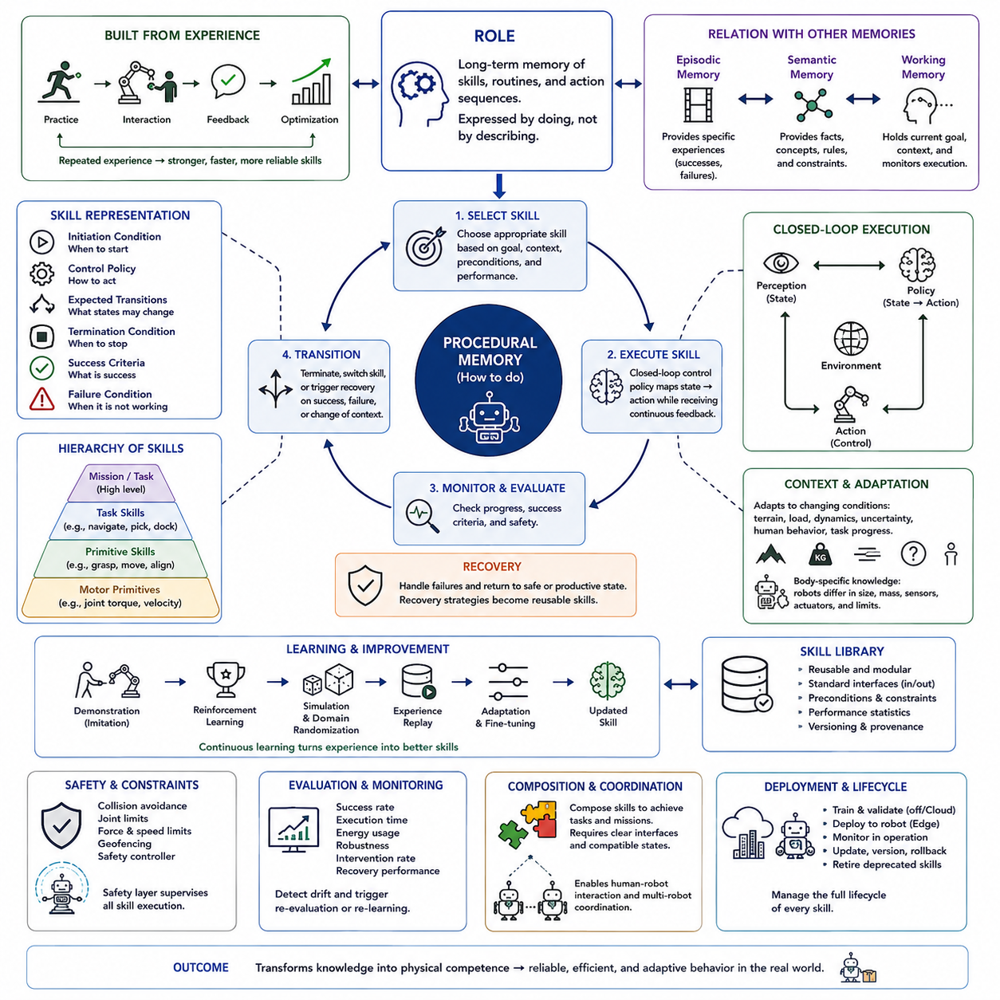{width="7.268055555555556in" height="7.268055555555556in"}

절차 기억(Procedural Memory)은 행동(Action), 기술(Skill), 루틴(Routine), 그리고 조정된 행동 시퀀스(Coordinated Sequence of Behavior)를 수행하는 방법에 관한 지식을 보존하는 장기 기억 시스템(Long-Term Memory System)입니다. 사실과 개념을 표현하는 의미 기억(Semantic Memory)과 달리 절차 기억은 주로 실행(Execution)을 통해 나타납니다. 에이전트(Agent)는 행동 수행 방법을 단순히 설명하는 것이 아니라 실제 행동을 성공적으로 수행함으로써 절차 지식(Procedural Knowledge)을 보여줍니다.

절차 지식은 반복적인 연습, 상호작용, 피드백(Feedback), 최적화(Optimization)를 통해 발달합니다. 처음에는 의식적인 추론(Deliberate Reasoning)이 필요한 복잡한 행동도 점차 재사용 가능한 기술(Reusable Skill)로 변화할 수 있습니다. 경험이 축적되면서 불필요한 의사결정은 감소하고 유용한 행동 패턴은 강화되며, 실행은 더욱 빠르고 일관되면서 작업 기억(Working Memory)의 집중적인 처리에 대한 의존성이 감소합니다.

의식적 제어(Deliberate Control)에서 숙련된 실행(Skilled Execution)으로의 이러한 전환은 절차 학습(Procedural Learning)의 기본적인 특징입니다. 초보자는 작업의 모든 단계를 의식적으로 추론할 수 있지만 숙련자는 동일한 시퀀스의 상당 부분을 자동으로 실행할 수 있습니다. 자동화(Automation)는 인지 부하(Cognitive Load)를 감소시키고 주의와 추론 자원이 예상하지 못한 상황이나 상위 수준 목표에 집중할 수 있도록 합니다.

절차 기억을 단순한 고정 명령 시퀀스로 이해해서는 안 됩니다. 유용한 기술은 변화하는 감각 조건(Sensory Condition)에 지속적으로 대응할 수 있어야 합니다. 보행, 파지, 주행, 도킹(Docking), 객체 조작에는 지각(Perception), 신체 상태(Body State), 환경 동역학(Environmental Dynamics), 불확실성(Uncertainty), 작업 진행 상태에 따른 지속적인 조정이 필요합니다.

이러한 이유로 절차 기억은 개방 루프 스크립트(Open-Loop Script)보다 폐루프 정책(Closed-Loop Policy)의 형태를 가지는 경우가 많습니다. 정책(Policy)은 관찰과 내부 상태를 행동으로 매핑하면서 환경으로부터 지속적으로 피드백을 받습니다. 따라서 동일한 기술이라도 환경 조건이 변화하면 서로 다른 세부 운동 명령(Motor Command)을 생성할 수 있습니다.

절차적 표현(Procedural Representation)은 여러 추상화 수준에서 존재할 수 있습니다. 저수준 절차는 토크(Torque), 속도(Velocity), 자세(Posture), 접촉력(Contact Force)을 제어할 수 있으며, 상위 수준 절차는 접근, 파지, 들어 올리기, 내비게이션, 도킹, 검사, 복구, 충전과 같은 행동을 표현할 수 있습니다. 계층적 구성(Hierarchical Organization)은 복잡한 행동을 재사용 가능한 구성요소로 조립할 수 있도록 합니다.

기술 계층(Skill Hierarchy)은 의사결정의 복잡성을 감소시킵니다. 지능형 에이전트는 처음부터 모든 액추에이터 명령(Actuator Command)을 계획하는 대신 적절한 상위 수준 기술을 선택하고 해당 절차 제어기(Procedural Controller)가 세부 행동을 생성하도록 할 수 있습니다. 이를 통해 전략적 추론(Strategic Reasoning)과 지속적인 실행을 분리할 수 있습니다.

하나의 기술은 시작 조건(Initiation Condition), 제어 정책(Control Policy), 예상 상태 전이(Expected State Transition), 종료 조건(Termination Condition), 성공 기준(Success Criteria), 실패 조건(Failure Condition)으로 표현할 수 있습니다. 이러한 요소는 기술을 언제 적용해야 하는지, 어떻게 동작해야 하는지, 언제 목표를 완료했는지, 언제 다른 행동으로 제어권을 넘겨야 하는지를 정의합니다.

선행 조건(Precondition)은 특정 상황에서 효과적인 절차가 다른 상황에서는 부적절할 수 있기 때문에 특히 중요합니다. 파지 기술은 객체가 도달 범위 안에 있어야 할 수 있고, 도킹 절차는 충분한 위치 추정 신뢰도(Localization Confidence)를 필요로 하며, 고속 내비게이션 행동은 충분한 가시성과 장애물 여유 공간을 요구할 수 있습니다.

종료 조건은 절차가 무한히 지속되는 것을 방지합니다. 내비게이션 기술은 웨이포인트(Waypoint)에 도달하면 종료될 수 있고, 파지는 안정적인 접촉이 확인되면 종료될 수 있으며, 복구 절차는 로봇이 안전 상태(Safe State)로 복귀하면 종료될 수 있습니다. 명확한 종료 논리는 조합 가능성(Composability)과 시스템 수준의 신뢰성을 향상시킵니다.

실패 조건도 동일하게 중요합니다. 절차 기억은 성공적인 실행뿐 아니라 기술이 더 이상 정상적으로 진행되지 않는다는 신호도 표현해야 합니다. 과도한 힘, 반복적인 위치 추정 손실(Localization Loss), 액추에이터 포화(Actuator Saturation), 예상하지 못한 접촉, 진행 정체 등이 발생하면 실행을 중단하고 복구 행동으로 전환할 수 있습니다.

복구 행동(Recovery Behavior) 자체도 절차 지식이 될 수 있습니다. 반복적인 경험을 통해 로봇은 국소 내비게이션 함정(Local Navigation Trap)에서 탈출하거나, 실패한 파지를 복구하거나, 도킹 정렬 오류를 수정하거나, 위치 추정을 복원하기 위한 재사용 가능한 전략을 학습할 수 있습니다. 이를 통해 실패가 고립된 사건으로 남는 것이 아니라 미래 행동을 개선하는 경험이 됩니다.

절차 기억은 운동 학습(Motor Learning)과 밀접하게 관련됩니다. 반복적인 실행을 통해 제어 파라미터(Control Parameter)는 신체와 환경의 물리적 특성에 적응할 수 있습니다. 시스템이 자신의 행동 결과를 경험하면서 타이밍(Timing), 힘, 궤적(Trajectory), 협응(Coordination), 피드백 게인(Feedback Gain)을 점진적으로 개선할 수 있습니다.

따라서 신체 특화 지식(Body-Specific Knowledge)은 많은 절차에서 핵심적입니다. 하나의 로봇에서 학습된 기술은 질량, 크기, 액추에이터 동역학, 관절 한계(Joint Limit), 센서, 페이로드 용량이 다른 로봇으로 직접 전이되지 않을 수 있습니다. 절차 지식은 흔히 체화(Embodiment)와 현재 구성(Configuration)을 조건으로 고려해야 합니다.

이러한 특성은 절차 기억을 보다 추상적인 의미 지식(Semantic Knowledge)과 구분합니다. 의미 기억은 상자를 파지할 수 있다는 사실을 표현할 수 있지만, 절차 기억은 상자에 접근하고, 정렬하고, 접촉을 형성하고, 힘을 조절하고, 들어 올리고, 조작 과정에서 안정화하기 위해 필요한 실제 제어 전략을 포함합니다.

일화 기억(Episodic Memory) 역시 절차 기억과 다릅니다. 일화 기록(Episodic Record)은 어제 수행된 특정 성공적인 파지를 객체, 위치, 행동 시퀀스, 결과와 함께 보존할 수 있습니다. 절차 학습은 이러한 많은 에피소드에서 반복적으로 성공한 패턴을 추출하여 재사용 가능한 파지 기술로 변환할 수 있습니다.

따라서 일화 기억과 절차 기억 사이의 관계는 강한 발달적 특성을 가집니다. 개별 경험은 행동과 결과의 사례를 제공하고, 절차 학습은 반복되는 패턴을 정책으로 공고화(Consolidation)하여 매번 이전 에피소드를 명시적으로 검색하지 않고도 실행할 수 있도록 합니다.

성공적인 에피소드는 절차 지식을 강화할 수 있으며 실패한 에피소드는 적응이 필요한 조건을 보여줍니다. 도킹 제어기(Docking Controller)가 높은 페이로드에서 반복적으로 오버슈트(Overshoot)를 발생시킨다면 시스템은 접근 속도, 제동 동작, 제어 게인을 조정하여 미래 실행의 신뢰성을 높일 수 있습니다.

의미 기억은 절차가 무엇을 의미하는지, 언제 사용해야 하는지, 어떤 제약조건이 적용되는지에 관한 지식을 제공합니다. 절차 기억은 이를 실제로 실행하는 능력을 제공합니다. 두 기억 시스템은 개념적 이해(Conceptual Understanding)와 물리적 능력(Physical Competence)을 연결합니다.

작업 기억은 활성 행동 중 이러한 시스템을 조정합니다. 현재 목표, 작업 상태, 관련 관찰, 선택된 기술, 즉각적인 실행 문맥(Execution Context)을 유지합니다. 절차 기억은 행동을 생성하고 작업 기억은 결과 행동이 현재 목표와 계속 일치하는지를 모니터링할 수 있습니다.

자동화된 실행이 비정상적인 조건을 만날 때 주의(Attention)가 특히 중요해집니다. 절차의 일상적인 부분은 높은 수준의 처리가 거의 필요하지 않을 수 있지만 예상하지 못한 장애물, 비정상적인 힘, 불확실한 지각, 충돌하는 목표가 나타나면 주의를 재배치하고 의식적인 추론을 시작할 수 있습니다.

따라서 절차 자동화가 감독(Supervision)을 제거해서는 안 됩니다. 고도로 숙련된 기술이라도 절차의 기본 가정이 위반되는 비정상 상황을 탐지하고 상위 수준 추론, 안전 논리(Safety Logic), 인간 운영자에게 제어권을 전달할 수 있는 메커니즘이 필요합니다.

절차 기억은 제어 정책, 상태 머신(State Machine), 행동 트리(Behavior Tree), 모션 프리미티브(Motion Primitive), 궤적 라이브러리(Trajectory Library), 기술 그래프(Skill Graph), 강화학습 정책(Reinforcement-Learning Policy), 신경망(Neural Network), 또는 이러한 접근법의 조합으로 표현할 수 있습니다. 적절한 표현 방식은 작업의 복잡성, 변화 가능성, 안전 요구사항, 학습 특성에 따라 달라집니다.

유한 상태 머신(Finite-State Machine)은 상태와 전이를 정의하여 명시적인 절차 구조를 제공합니다. 작업 진행 과정이 비교적 예측 가능하고 해석 가능성이 중요한 경우 유용합니다. 그러나 환경 변화와 행동 복잡성이 증가하면 대규모 상태 머신은 유지보수가 어려워질 수 있습니다.

행동 트리는 재사용 가능한 행동, 조건, 폴백 행동(Fallback Behavior), 시퀀스를 구성하는 모듈형 대안을 제공합니다. 결정론적인 작업 논리와 학습된 기술을 결합할 수 있으며 복잡한 로봇 행동에서 해석 가능성과 조합 가능성을 유지해야 할 때 유용합니다.

모션 프리미티브는 재사용 가능한 움직임 패턴을 표현합니다. 로봇은 모든 궤적을 독립적으로 생성하는 대신 이전에 학습한 프리미티브를 서로 다른 목표, 위치, 속도, 환경 제약조건에 맞게 조정할 수 있습니다. 이를 통해 계획 복잡성을 줄이고 실행 효율성을 높일 수 있습니다.

동적 운동 프리미티브(Dynamic Movement Primitive)는 궤적 구조를 부호화하면서 타이밍과 목표 상태의 적응을 허용할 수 있습니다. 이러한 표현은 일반적인 움직임 패턴은 유지하면서 정확한 공간적 또는 시간적 실행 형태를 변화시켜야 할 때 특히 유용합니다.

기술 라이브러리(Skill Library)는 절차를 재사용 가능한 행동 모듈로 구성합니다. 각 기술은 표준화된 입력, 출력, 선행 조건, 종료 기준, 성능 정보를 제공할 수 있습니다. 상위 수준 계획기는 기술 내부의 제어 구현을 이해하지 않고도 이러한 기술을 조합할 수 있습니다.

복잡한 작업에는 기술 조합(Skill Composition)이 필수적입니다. 하나의 배송 임무는 위치 추정, 내비게이션, 장애물 회피, 도킹, 페이로드 전달, 검증, 복귀 행동을 요구할 수 있습니다. 절차 기억은 이러한 능력을 더 큰 행동 구조로 결합할 수 있도록 합니다.

조합을 위해서는 기술 사이의 신뢰할 수 있는 인터페이스가 필요합니다. 하나의 절차가 생성한 최종 상태는 다음 절차가 요구하는 조건을 만족해야 합니다. 인터페이스가 제대로 정의되지 않으면 각각의 기술이 독립적으로 정상 작동하더라도 전체 시스템에서는 실패할 수 있습니다.

의미 작업 모델(Semantic Task Model)은 목표와 기술 사이의 의존성을 설명하여 이러한 조합을 조정하는 데 도움을 줄 수 있습니다. 계획기는 무엇이 수행되어야 하는지를 결정하고 절차 기억은 필요한 각 상태 전이를 달성하기 위한 실행 가능한 행동을 제공합니다.

강화학습(Reinforcement Learning)은 절차 지식을 습득하는 또 다른 방법을 제공합니다. 에이전트는 환경과 상호작용하고 보상(Reward) 또는 비용(Cost)을 통해 피드백을 받으면서 정책을 학습합니다. 성공적인 행동 패턴은 선택될 가능성이 높아지고 비효율적이거나 위험한 행동은 억제됩니다.

강화학습은 최적 행동을 사람이 직접 정의하기 어려운 경우 특히 중요합니다. 복잡한 보행(Locomotion), 조작, 접촉 중심 상호작용(Contact-Rich Interaction), 적응형 내비게이션은 지각과 제어 사이의 관계가 너무 복잡하여 명시적인 규칙만으로 표현하기 어려울 수 있습니다.

그러나 실제 물리 세계에서 직접 절차를 학습하는 것은 비용이 많이 들고 위험할 수 있습니다. 탐색(Exploration)은 장비를 손상시키거나 안전하지 않은 상황을 만들 수 있습니다. 시뮬레이션, 오프라인 학습(Offline Learning), 시연(Demonstration), 제약된 탐색(Constrained Exploration), 안전 제어기(Safety Controller)를 이용하면 이러한 위험을 줄일 수 있습니다.

모방학습(Imitation Learning)은 시연으로부터 절차를 학습할 수 있도록 합니다. 인간 운영자, 전문가 제어기, 기존에 학습된 로봇이 성공적인 행동의 사례를 제공할 수 있습니다. 학습 시스템은 관찰된 상태와 시연된 행동 사이의 매핑을 재현하도록 학습합니다.

시연은 무작위 탐색이 아니라 유용한 행동 사례에서 학습을 시작할 수 있기 때문에 학습 속도를 높일 수 있습니다. 그러나 시연만으로 모든 교란이나 실패 조건을 포함하기는 어렵기 때문에 추가적인 적응과 폐루프 학습(Closed-Loop Learning)이 필요할 수 있습니다.

오프라인 강화학습(Offline Reinforcement Learning)은 물리 환경과 지속적으로 상호작용하지 않고 저장된 궤적을 이용하여 절차를 개선할 수 있습니다. 따라서 상태, 행동, 보상, 결과를 포함하는 일화 아카이브(Episodic Archive)는 절차 학습의 중요한 데이터 자원이 될 수 있습니다.

시뮬레이션은 대규모 절차 학습 경험을 생성할 수 있습니다. 로봇은 다양한 무작위 조건에서 보행, 조작, 내비게이션, 복구를 연습할 수 있습니다. 도메인 랜덤화(Domain Randomization)는 기하학, 마찰, 질량, 센싱, 지연시간, 외란(Disturbance)의 변화에 정책을 노출할 수 있습니다.

시뮬레이션 동역학은 물리적 현실을 완벽하게 재현할 수 없기 때문에 시뮬레이션-실세계 전이(Simulation-to-Real Transition)는 여전히 어려운 문제입니다. 따라서 시뮬레이션에서 학습된 절차는 제한 없는 실제 운영에 적용하기 전에 현실 세계의 관찰을 이용하여 검증하고 적응해야 합니다.

월드 모델(World Model)은 후보 행동의 결과를 예측함으로써 절차 학습을 지원할 수 있습니다. 에이전트는 물리적인 시행착오에만 의존하지 않고 내부적으로 가능한 행동 시퀀스를 평가하고 예측 결과를 이용하여 정책을 개선할 수 있습니다.

절차 기억과 월드 모델은 서로 다른 기능을 수행하지만 상호보완적입니다. 월드 모델은 상태가 어떻게 변화할 수 있는지를 예측하고 절차 기억은 해당 상태에 영향을 주기 위한 재사용 가능한 전략을 제공합니다. 계획은 두 시스템을 함께 사용하여 원하는 결과를 달성할 가능성이 높은 행동을 선택할 수 있습니다.

예측 오류(Prediction Error)는 절차 적응(Procedural Adaptation)을 유도할 수 있습니다. 특정 행동이 지속적으로 예상과 다른 결과를 만든다면 시스템은 제어 정책을 수정하거나 해당 기술을 적용해야 하는 조건 자체를 다시 검토할 수 있습니다.

따라서 절차 지식은 경험과 함께 발전합니다. 하나의 기술이 로봇의 전체 운영 수명 동안 동일하게 유지될 필요는 없습니다. 하드웨어, 페이로드, 마모(Wear), 환경, 작업 요구사항의 변화에 따라 지속적인 캘리브레이션과 적응이 필요할 수 있습니다.

지속적인 절차 학습(Continual Procedural Learning)은 안정성-가소성 문제(Stability-Plasticity Problem)를 발생시킵니다. 새로운 학습은 이전에 신뢰할 수 있었던 기술을 파괴하지 않으면서 행동을 개선해야 합니다. 신경망 정책을 새로운 작업이나 환경에 미세조정하면 기존 능력을 잃는 치명적 망각(Catastrophic Forgetting)이 발생할 수 있습니다.

대표적인 경험을 재생(Replay)하면 이러한 문제를 감소시킬 수 있습니다. 이전에 성공했거나 안전에 중요한 궤적을 새로운 학습 과정에 포함하여 갱신된 절차가 기존 조건과 새로운 운영 조건 모두에서 능력을 유지하도록 할 수 있습니다.

모듈형 정책(Modular Policy) 역시 간섭(Interference)을 감소시킬 수 있습니다. 모든 행동을 하나의 단일 신경망에 강제로 통합하는 대신 서로 다른 기술, 어댑터(Adapter), 전문가(Expert), 파라미터 부분집합(Parameter Subset)이 각 작업에 특화되면서 필요한 공통 표현을 공유할 수 있습니다.

전문가 혼합(Mixture-of-Experts) 아키텍처는 문맥에 따라 특화된 절차 모듈을 선택할 수 있습니다. 서로 다른 전문가는 지형 유형, 페이로드 범위, 조작 범주, 운영 모드를 처리하고 게이팅 메커니즘(Gating Mechanism)이 현재 행동에 어떤 전문 지식을 적용할지를 결정할 수 있습니다.

절차 기억은 성능 통계(Performance Statistics)도 표현해야 합니다. 성공률, 실행 시간, 에너지 소비, 인간 개입 빈도, 불확실성, 실패 모드는 특정 조건에서 기술이 얼마나 신뢰할 수 있는지를 나타냅니다.

이러한 통계는 기술 선택(Skill Selection)을 지원합니다. 동일한 목표를 달성할 수 있는 여러 절차가 있다면 시스템은 속도, 안전성, 에너지 효율, 신뢰도, 예상 성공 확률을 기준으로 선택할 수 있습니다.

문맥 의존적 기술 선택(Context-Dependent Skill Selection)이 중요한 이유는 모든 상황에서 최적인 단일 절차가 존재하는 경우가 드물기 때문입니다. 빠른 내비게이션 정책은 비어 있는 복도에서는 적합할 수 있지만 사람 주변이나 위치 추정 조건이 좋지 않은 환경에서는 보수적인 정책이 더 적합합니다.

불확실성은 기술 선택뿐 아니라 실행에도 영향을 주어야 합니다. 불확실한 지각 상태에서 작동하는 절차는 속도를 낮추고, 관찰 빈도를 증가시키고, 더 큰 안전 여유(Safety Margin)를 유지하거나, 되돌릴 수 없는 행동을 수행하기 전에 추가 센싱을 요청할 수 있습니다.

안전 제약조건(Safety Constraint)은 절차 실행에 직접 통합할 수 있습니다. 학습된 정책은 충돌 회피, 관절 한계, 힘 제한, 속도 제한, 지오펜싱(Geofencing), 인증된 안전 제어기가 설정한 범위 안에서 동작할 수 있습니다.

이러한 계층형 아키텍처(Layered Architecture)는 행동 최적화와 타협할 수 없는 안전 요구사항을 분리합니다. 학습된 절차는 작업을 효율적으로 수행하는 방법을 결정할 수 있지만 독립적인 안전 메커니즘은 중요한 제약조건을 위반하는 행동을 방지합니다.

인간 개입(Human Intervention)은 유용한 절차적 피드백으로 취급해야 합니다. 운영자가 로봇의 행동을 오버라이드(Override)한다면 선택된 기술, 제어 행동, 종료 논리가 부적절했음을 의미할 수 있습니다. 이러한 개입은 향후 개선을 위한 학습 사례가 될 수 있습니다.

교정 시연(Corrective Demonstration)은 실패 경계(Failure Boundary) 근처에서 행동을 어떻게 변화시켜야 하는지를 보여주기 때문에 특히 가치가 있습니다. 인간은 전체 작업을 다시 시연하는 대신 기존 절차의 어려운 부분만 선택적으로 수정할 수 있습니다.

절차 기억은 선호 정보(Preference Information)도 포함할 수 있습니다. 두 절차가 모두 성공하더라도 부드러움(Smoothness), 편안함, 효율성, 상호작용 품질에서 차이가 있을 수 있습니다. 인간 피드백을 통해 운영 기대에 더 적합한 행동을 선택할 수 있습니다.

협동 로보틱스(Collaborative Robotics)에서는 절차가 인간 행동을 고려해야 합니다. 물체 전달(Handover), 공동 조작, 추종, 검사, 협력 운송에는 사람을 정적인 장애물로 취급하는 것이 아니라 인간의 움직임, 의도, 타이밍, 불확실성에 적응하는 정책이 필요합니다.

따라서 사회적으로 적절한 행동(Socially Appropriate Behavior)도 절차 지식이 될 수 있습니다. 적절한 거리 유지, 양보, 의도 표시, 대기, 사람 주변에서의 속도 조절 등을 재사용 가능한 상호작용 기술로 학습할 수 있습니다.

내비게이션은 계층적 절차 기억의 명확한 사례입니다. 저수준 제어기는 바퀴 움직임을 조절하고, 로컬 정책(Local Policy)은 장애물을 회피하며, 내비게이션 기술은 경로를 추종하고, 복구 행동은 위치 추정이나 계획 실패를 처리하며, 임무 수준 절차(Mission-Level Procedure)는 목적지와 작업 목표를 조정합니다.

조작(Manipulation) 역시 여러 절차 수준을 필요로 합니다. 관절 제어기는 움직임을 생성하고, 파지 정책은 접촉을 형성하며, 조작 기술은 객체를 이동시키고, 작업 절차는 이러한 기술을 적재, 조립, 검사, 도구 사용과 같은 완전한 작업으로 구성합니다.

4족 보행 로봇(Legged Robot)의 보행은 체화 의존성이 매우 높은 사례입니다. 안정적인 보행 절차는 지형, 접촉, 신체 방향, 외란, 페이로드에 대응하면서 많은 관절을 조정해야 합니다. 학습된 절차는 명시적인 기호적 추론(Symbolic Reasoning)만으로 관리하기 어려운 동적 관계를 효과적으로 포착합니다.

절차 기억은 적응형 센서 행동(Adaptive Sensor Behavior)도 지원할 수 있습니다. 로봇은 지각이 불확실해질 때 카메라 위치를 변경하고, 시점을 바꾸고, 스캐닝 패턴을 조정하거나, 추가 센서를 활성화하는 절차를 학습할 수 있습니다.

따라서 능동 지각(Active Perception)은 센싱과 행동을 연결합니다. 절차는 단순히 주어진 관찰을 해석하는 것이 아니라 객체에 접근하고, 주변을 회전하고, 조명을 조정하는 것처럼 미래 관찰을 개선하는 행동까지 포함합니다.

절차에는 통신 행동(Communication Action)도 포함될 수 있습니다. 로봇은 실행 가능한 행동 전략의 일부로 확인을 요청하고, 진행 상황을 보고하고, 통행을 협상하고, 지원을 요청하거나, 다른 로봇과 작업 정보를 교환할 수 있습니다.

멀티로봇 시스템(Multi-Robot System)은 에이전트 사이의 절차적 협응(Procedural Coordination)을 필요로 합니다. 기술에는 대형 이동(Formation Movement), 협력 운송(Cooperative Transport), 분산 검사(Distributed Inspection), 작업 인계(Task Handoff), 자원 공유, 협력 탐색 등이 포함될 수 있습니다.

플릿 수준 절차 학습(Fleet-Level Procedural Learning)은 여러 로봇에서 성공적인 전략을 식별할 수 있습니다. 여러 플랫폼에서 수집된 경험을 통해 어떤 절차가 강건한지, 어떤 부분에 플랫폼별 적응이 필요한지를 파악할 수 있습니다.

공유 절차 지식(Shared Procedural Knowledge)은 체화의 차이를 고려해야 합니다. 소형 실내 AMR에서 학습된 기동 방식이 대형 실외 플랫폼에는 적합하지 않을 수 있습니다. 따라서 절차에는 어떤 플랫폼과 운영 조건에서 유효한지를 설명하는 능력 메타데이터(Capability Metadata)가 필요합니다.

공통 구조를 플랫폼별 제어에서 분리하면 기술 전이(Skill Transfer)가 가능합니다. 상위 수준 도킹 절차는 여러 로봇으로 전이할 수 있으며, 저수준 모션 제어는 각 플랫폼의 크기, 액추에이터, 동역학에 맞게 적응할 수 있습니다.

파운데이션 모델(Foundation Model)은 이러한 전이를 지원하는 일반화된 행동 표현(Generalized Action Representation)을 제공할 수 있습니다. 비전-언어-행동 모델(Vision-Language-Action Model)은 관찰, 명령, 의미 개념, 행동을 연결하여 절차 지식이 작업과 체화 사이에서 일반화될 가능성을 제공합니다.

그러나 물리 제어에 사용되는 파운데이션 모델의 출력은 강력한 현실 기반화(Grounding)와 검증이 필요합니다. 언어적으로 타당한 행동이라도 기하학, 동역학, 액추에이터 한계, 안전 제약조건을 위반할 수 있습니다. 따라서 절차 실행은 실시간 물리 상태와 지속적으로 연결되어야 합니다.

로봇 파운데이션 모델(Robot Foundation Model)은 상위 수준 기술 생성기(High-Level Skill Generator)로 사용하고, 결정론적 또는 특화된 제어기가 안전에 중요한 저수준 행동을 실행할 수 있습니다. 이러한 하이브리드 구성은 광범위한 일반화 능력과 예측 가능한 물리 제어를 결합합니다.

절차 기억은 엣지(Edge)와 온프레미스(On-Premise) 시스템 사이에 분산될 수 있습니다. 실시간 기술은 통신의 불안정성에 의존할 수 없기 때문에 일반적으로 로봇에서 직접 실행되어야 합니다. 계산량이 많은 학습, 기술 분석, 정책 최적화, 플릿 학습은 외부 인프라에서 수행할 수 있습니다.

이러한 분리는 운영 회복탄력성(Operational Resilience)에 중요합니다. 중앙 서버와 연결되지 않은 상황에서도 로봇은 필수적인 내비게이션, 안전, 조작, 복구 절차를 자체적으로 유지해야 합니다.

갱신된 절차는 검증 후 온프레미스 인프라에서 엣지 시스템으로 배포할 수 있습니다. 운영자가 어떤 로봇이 어떤 기술 구현을 실행하고 있는지 알 수 있도록 버전 관리(Version Management)가 필수적입니다.

절차 출처(Procedural Provenance)는 기술이 어떻게 생성되고 검증되었는지를 기록해야 합니다. 하나의 절차는 수동 엔지니어링(Manual Engineering), 인간 시연, 시뮬레이션 학습, 강화학습, 플릿 경험 또는 이러한 방법의 조합으로 만들어질 수 있습니다.

안전과 관련된 기술에는 검증 증거(Validation Evidence)가 함께 제공되어야 합니다. 시험 환경, 운영 범위, 알려진 한계, 실패 사례, 성능 지표를 통해 특정 절차가 특정 배치 환경에 적합한지를 판단할 수 있습니다.

따라서 절차 기억에는 수명주기 관리(Lifecycle Management)가 필요합니다. 기술은 생성되고, 시험되고, 배포되고, 모니터링되고, 갱신되고, 폐기(Deprecated)되며, 새로운 버전의 성능이 좋지 않은 경우 이전 버전으로 롤백(Rollback)될 수도 있습니다.

실제 세계의 데이터 분포가 변화하기 때문에 배포 이후에도 지속적인 모니터링이 필요합니다. 처음에는 높은 신뢰성을 보이던 절차도 하드웨어가 마모되고, 환경이 변화하고, 작업 조건이 달라지면 성능이 저하될 수 있습니다.

성능 드리프트(Performance Drift)는 재평가 또는 재학습을 유발할 수 있습니다. 인간 개입 빈도의 증가, 실행 시간 증가, 예측 오류 증가, 반복적인 아차 실패(Near-Failure)는 절차가 현재 운영 조건과 더 이상 적합하지 않음을 나타낼 수 있습니다.

디지털 트윈(Digital Twin)은 절차 시험을 위해 로봇 구성과 환경을 재현함으로써 이러한 수명주기를 지원할 수 있습니다. 갱신된 정책은 실제 시스템에 배포하기 전에 기록된 시나리오를 대상으로 평가할 수 있습니다.

시뮬레이션에서의 일화 재생(Episodic Replay)은 특히 유용한 회귀 시험(Regression Testing)을 제공합니다. 이전에 발생했던 실패와 어려운 상황을 재구성하여 새로운 절차 버전이 이미 해결된 문제를 다시 발생시키지 않는지를 검증할 수 있습니다.

반사실적 시뮬레이션(Counterfactual Simulation)은 동일한 에피소드에서 여러 대안 절차를 비교할 수 있습니다. 엔지니어나 학습 시스템은 다른 궤적, 제어기, 복구 전략, 타이밍 결정이 더 좋은 결과를 만들었을지를 평가할 수 있습니다.

절차 평가는 단순한 작업 완료 여부 이상을 측정해야 합니다. 중요한 지표에는 성공 확률, 실행 시간, 궤적 효율, 에너지 소비, 안전 여유, 부드러움, 인간 개입 빈도, 강건성(Robustness), 복구 성능이 포함됩니다.

강건성 시험(Robustness Testing)은 정상 운영 범위를 벗어나는 외란과 조건을 도입해야 합니다. 센서 노이즈, 통신 지연, 마찰 변화, 페이로드 변화, 이동 장애물, 액추에이터 열화, 위치 추정 불확실성을 이용하여 현실적인 변화에서도 기술이 신뢰성을 유지하는지를 확인할 수 있습니다.

일반화 시험(Generalization Testing)은 절차가 학습 분포(Training Distribution)를 넘어 작동하는지를 판단합니다. 조작 정책은 새로운 객체 사례를 처리할 수 있어야 하고 내비게이션 정책은 완전한 재학습 없이 익숙하지 않은 환경 구조에서도 작동할 수 있어야 합니다.

조합 평가(Compositional Evaluation)는 개별적으로 성공적인 기술을 결합했을 때도 신뢰성을 유지하는지를 확인합니다. 실패는 가정, 좌표계, 상태 정의, 타이밍 기대가 일치하지 않는 기술 경계(Skill Boundary)에서 자주 발생합니다.

절차 기억은 본질적으로 행동에 관한 것이기 때문에 폐루프 시험(Closed-Loop Testing)이 필수적입니다. 절차의 표현이 합리적으로 보이는지만으로 평가할 수 없으며 변화하는 물리 조건과 상호작용하면서 적절한 행동을 반복적으로 생성하는지를 확인해야 합니다.

절차 기억의 설명 가능성(Explainability)은 사실 지식에 대한 설명과 다릅니다. 시스템은 어떤 기술을 선택했는지, 왜 해당 기술을 적용할 수 있다고 판단했는지, 어떤 조건이 상태 전이를 유발했는지, 왜 실행이 중단되었는지, 어떤 복구 절차를 선택했는지를 설명할 필요가 있습니다.

구조화된 기술 표현(Structured Skill Representation)은 이러한 설명을 더 쉽게 만듭니다. 명시적인 선행 조건, 목표, 종료 기준, 성능 통계는 내부 제어 의사결정을 해석하기 어려운 신경망 정책을 보완할 수 있습니다.

절차 기억은 인지 효율성(Cognitive Efficiency)에도 기여합니다. 신뢰할 수 있는 기술이 확보되면 상위 수준 인지는 익숙한 제어 문제를 반복적으로 해결할 필요가 없습니다. 계획은 개별 액추에이터 명령 대신 의미 있는 행동 단위(Behavioral Unit)를 대상으로 수행할 수 있습니다.

이러한 행동 압축(Behavioral Compression)은 의미 기억의 추상화와 유사합니다. 의미적 추상화(Semantic Abstraction)는 반복되는 경험을 개념과 관계로 압축하고, 절차적 추상화(Procedural Abstraction)는 반복되는 행동 시퀀스를 재사용 가능한 기술로 압축합니다.

기술의 신뢰성이 높아질수록 더욱 복잡한 행동 계층(Behavioral Hierarchy)을 형성할 수 있습니다. 기본적인 모션 프리미티브는 조작 및 내비게이션 기술을 지원하고, 이러한 기술은 작업 절차를 지원하며, 작업 절차는 다시 임무와 장시간 자율 운영(Long-Duration Autonomous Operation)을 지원합니다.

따라서 상위 수준 지능(Higher-Level Intelligence)은 부분적으로 신뢰할 수 있는 풍부한 절차 라이브러리에 의존합니다. 시스템이 의사결정을 안정적이고 조정되며 문맥에 민감한 물리 행동으로 변환할 수 없다면 추론 능력만으로는 피지컬 AI를 구현하기에 충분하지 않습니다.

인지과학(Cognitive Science)의 관점에서 절차 기억은 반복적인 연습이 모든 행동을 명시적인 추론으로 다시 구성하지 않고도 효율적으로 실행할 수 있는 기술을 어떻게 형성하는지를 설명합니다. 자동성(Automaticity), 운동 협응(Motor Coordination), 습관 형성(Habit Formation), 학습된 행동 루틴을 지원합니다.

인공지능(Artificial Intelligence)의 관점에서 절차 기억은 정책, 기술, 제어기, 행동 구조, 학습된 행동 패턴의 형태로 지속적인 실행 가능 지식(Executable Knowledge)을 제공합니다. 이를 통해 반복적인 작업에서 지각과 추론을 효율적인 행동으로 연결할 수 있습니다.

로보틱스(Robotics)와 피지컬 AI의 관점에서 절차 기억은 축적된 물리적 수행 능력(Physical Competence)을 표현합니다. 로봇이 자신의 신체와 환경 상태에 지속적으로 적응하면서 어떻게 이동하고, 조작하고, 내비게이션하고, 상호작용하고, 복구하고, 협응해야 하는지를 포착합니다.

성숙한 절차 기억 아키텍처(Procedural-Memory Architecture)는 계층적 기술, 폐루프 정책, 선행 조건, 종료 및 실패 조건, 복구 행동, 체화 정보, 불확실성, 안전 제약조건, 성능 모니터링, 지속학습, 버전 관리, 일화 기억·의미 기억·작업 기억과의 상호작용을 결합합니다.

절차 기억의 목적은 단순히 궤적을 암기하는 것이 아닙니다. 목표는 문맥에 지속적으로 반응하고, 관련 상황으로 일반화하며, 자신의 한계를 탐지하고, 추가적인 경험이 확보됨에 따라 개선될 수 있는 재사용 가능한 행동 지식(Reusable Behavioral Knowledge)을 보존하는 것입니다.

궁극적으로 절차 기억은 지식을 수행 능력(Competence)으로 변환합니다. 의미 기억은 지능형 에이전트에게 객체, 관계, 규칙, 목표가 무엇을 의미하는지를 알려주고, 일화 기억은 이전에 어떤 일이 발생했는지를 기억하게 합니다. 절차 기억은 효과적으로 행동하는 학습된 능력을 제공함으로써 지각, 예측, 추론, 의도를 물리 세계와의 신뢰할 수 있는 상호작용으로 전환합니다.

## 02.08 Attention Mechanisms [w/Code]

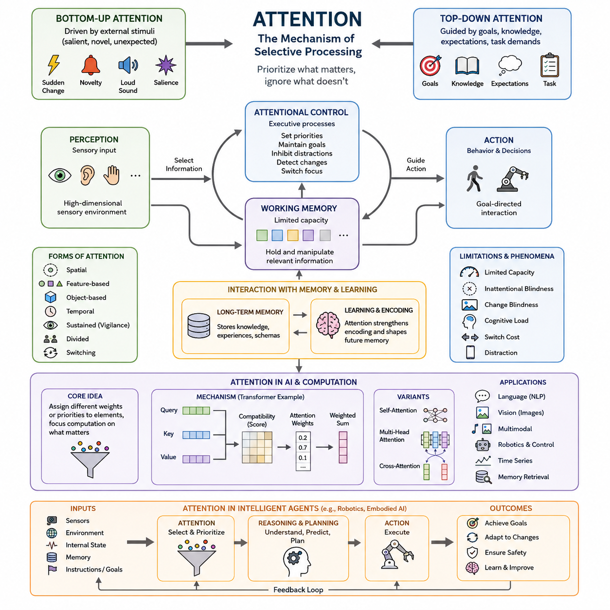{width="7.268055555555556in" height="7.268055555555556in"}

주의(Attention)는 지능형 시스템이 제한된 처리 자원(Processing Resources)을 현재 중요한 정보에 배분할 수 있도록 하는 기본적인 인지 메커니즘(Cognitive Mechanism)입니다. 인간의 감각 시스템(Sensory Systems)은 세부적으로 처리할 수 있는 양보다 훨씬 많은 시각, 청각, 촉각 및 내부 정보를 지속적으로 받아들입니다. 따라서 주의는 일부 신호를 강조하고 다른 신호를 억제하거나 처리를 연기하는 동적인 선택 과정(Dynamic Selection Process)으로 작동합니다.

주의(Attention)는 하나의 독립된 기능으로 이해해서는 안 됩니다. 주의는 지각(Perception), 작업 기억(Working Memory), 장기 기억(Long-Term Memory), 목표(Goals), 기대(Expectations), 감정(Emotion), 행동(Action)과 지속적으로 상호작용합니다. 사람이 무엇을 알아차리는가는 작업 기억에 무엇이 들어가는지에 영향을 주며, 작업 기억에 이미 유지되고 있는 정보는 이후의 주의를 유도할 수 있습니다. 따라서 주의는 입력 선택 메커니즘(Input-Selection Mechanism)이면서 지속적인 인지 제어 루프(Cognitive Control Loop)의 구성 요소입니다.

유용한 구분 가운데 하나는 상향식 주의(Bottom-Up Attention)와 하향식 주의(Top-Down Attention)입니다. 상향식 주의는 갑작스러운 움직임, 밝기, 새로움, 예상하지 못한 소리 또는 급격한 환경 변화와 같은 입력 자극(Incoming Stimuli)의 특성에 의해 주로 유도됩니다. 이러한 신호는 현재 목표와 관련이 없더라도 처리 자원을 자동으로 끌어올 수 있습니다. 이 메커니즘은 의도적인 추론(Deliberate Reasoning) 없이도 잠재적으로 중요한 사건에 빠르게 대응하도록 합니다.

하향식 주의(Top-Down Attention)는 내부 목표(Internal Goals), 기대(Expectations), 사전 지식(Prior Knowledge), 작업 요구사항(Task Requirements)에 의해 유도됩니다. 특정 물체를 찾거나, 특정 이름을 듣기 위해 집중하거나, 계기에서 비정상적인 수치를 감시하는 사람은 관련 정보에 대한 처리를 의도적으로 강화합니다. 따라서 하향식 주의는 내부 목표를 어떤 감각 및 인지 표현이 우선적으로 처리되어야 하는지를 결정하는 우선순위로 변환함으로써 지각과 실행 제어(Executive Control)를 연결합니다.

상향식 과정(Bottom-Up Process)과 하향식 과정(Top-Down Process)은 일반적으로 독립적으로 작동하기보다 동시에 작동합니다. 운전자는 의도적으로 전방 도로를 관찰하면서도 갑자기 도로에 진입하는 보행자에게 자동으로 주의를 빼앗길 수 있습니다. 효과적인 인지는 목표 지향적 집중(Goal-Directed Focus)을 유지하면서 예상하지 못한 사건에도 민감하게 대응하는 균형을 필요로 합니다. 지나친 하향식 필터링은 중요한 신호를 놓치게 할 수 있으며, 지나친 자극 주도적 포착(Stimulus-Driven Capture)은 지속적인 목표 지향 행동을 어렵게 만들 수 있습니다.

선택적 주의(Selective Attention)는 경쟁하는 정보를 억제하면서 특정 정보를 우선적으로 처리하는 능력을 의미합니다. 대표적인 사례로는 시끄러운 환경에서 하나의 대화에 집중하거나 여러 방해 요소 가운데 목표 물체를 시각적으로 찾는 상황이 있습니다. 선택된다는 것이 반드시 주의를 받지 못한 정보가 전혀 처리되지 않는다는 의미는 아닙니다. 다양한 이론에서는 필터링이 여러 처리 단계에서 서로 다른 깊이로 발생할 수 있다고 설명합니다.

초기 선택 이론(Early-Selection Theories)은 주의가 지각 처리의 비교적 초기 단계에서 정보를 필터링하여 선택된 신호가 더욱 깊은 분석을 받도록 하고 경쟁하는 입력을 제한한다고 설명합니다. 후기 선택 이론(Late-Selection Theories)은 최종적인 선택이 어떤 정보가 의식적 보고나 행동에 영향을 미치는지를 결정하기 전에 상당한 의미 처리(Semantic Processing)가 이루어질 수 있다고 봅니다. 현대적 관점에서는 일반적으로 작업 요구, 지각 부하(Perceptual Load), 기대, 사용 가능한 인지 자원에 따라 주의 선택이 유연하게 이루어진다고 봅니다.

공간적 주의(Spatial Attention)는 특정 위치와 관련된 정보를 우선적으로 처리합니다. 사람은 눈을 해당 위치로 움직이지 않고도 시각 공간(Visual Space)의 특정 영역에 주의를 집중할 수 있습니다. 이러한 명시적 방향 전환(Overt Orientation)과 은밀한 주의(Covert Attention)의 차이는 주의 선택을 단순히 물리적인 센서 방향으로만 설명할 수 없음을 보여줍니다. 내부 인지 메커니즘은 선택된 공간 영역에서 발생하는 정보의 처리 우선순위를 증가시킬 수 있습니다.

특징 기반 주의(Feature-Based Attention)는 색상, 방향, 형태, 움직임, 음높이 또는 기타 지각적 특성에 따라 작동합니다. 예를 들어 빨간색 물체를 찾는 경우 전체 시야에서 빨간색 특징에 대한 처리가 강화될 수 있습니다. 객체 기반 주의(Object-Based Attention)는 이러한 원리를 확장하여 주의가 일관된 지각 객체(Perceptual Object)를 선택할 수 있으며, 선택된 객체에 속하는 여러 특성이 함께 강화된 처리를 받을 수 있다고 설명합니다.

지속적 주의(Sustained Attention)는 경계(Vigilance)라고도 하며 장시간 동안 주의 상태를 유지하는 능력을 의미합니다. 이러한 능력은 계기 감시, 제품 검사, 자율 시스템 감독 또는 안전 중요 환경(Safety-Critical Environment)의 관찰과 같이 관련 사건이 드물거나 예측하기 어려운 상황에서 중요합니다. 장기간의 경계 작업에서는 인지 자원, 동기, 각성 수준(Arousal), 기대가 시간에 따라 변화하기 때문에 일반적으로 수행 성능이 감소할 수 있습니다.

분할 주의(Divided Attention)는 인지 자원을 여러 작업이나 정보 흐름에 분배해야 하는 상황과 관련됩니다. 인간은 특히 하나 이상의 작업이 충분히 숙련된 경우 여러 활동을 어느 정도 동시에 조정할 수 있습니다. 그러나 동시 작업은 지각, 작업 기억, 의사결정 또는 반응 선택(Response Selection) 자원을 두고 경쟁하는 경우가 많습니다. 따라서 겉으로 보이는 멀티태스킹(Multitasking)은 실제로 높은 수준의 인지 처리가 완전히 병렬적으로 이루어지는 것보다 빠른 작업 전환(Task Switching)인 경우가 많습니다.

주의 전환(Attentional Switching)은 인지가 작업, 목표, 표현 또는 환경적 대상 사이를 이동할 수 있도록 합니다. 동적인 환경에서는 이러한 전환이 필요하지만 일반적으로 전환 비용(Switching Cost)이 발생합니다. 이전 작업 구성을 억제하고 새로운 구성을 활성화해야 하기 때문에 전환 직후의 수행은 느려지거나 정확성이 감소할 수 있습니다. 따라서 각각의 전환이 빠르게 보이더라도 빈번한 전환은 전체적인 효율성을 감소시킬 수 있습니다.

작업 기억(Working Memory)과 주의(Attention)는 정보를 유지하려면 간섭(Interference)으로부터 선택적으로 보호해야 하는 경우가 많기 때문에 밀접하게 연결되어 있습니다. 주의는 작업 기억 내부의 특정 표현을 우선시하여 추론이나 행동에 더욱 쉽게 활용되도록 할 수 있습니다. 반대로 작업 기억의 내용은 지각을 유도하는 주의 템플릿(Attentional Template)을 형성할 수 있습니다. 예를 들어 기억된 목표의 특징은 그 내부 표현과 일치하는 환경적 특징을 우선적으로 처리하도록 시각 시스템을 편향시킬 수 있습니다.

주의는 학습(Learning)과 기억 형성(Memory Formation)에도 영향을 미칩니다. 지속적이고 의미 있는 주의를 받은 정보는 약하게 처리된 정보보다 일반적으로 지속적인 기억으로 부호화(Encoding)될 가능성이 높습니다. 주의는 관련된 연관 관계를 강화하고, 입력 정보를 기존 지식을 중심으로 조직하며, 경험의 어떤 측면이 이후에 접근 가능해질지를 결정할 수 있습니다. 따라서 기억은 부호화 과정에서 인지 시스템이 무엇을 중요하다고 판단했는지에 의해 부분적으로 형성됩니다.

주의(Attention)와 의식(Consciousness)의 관계는 이론적으로 복잡합니다. 주의를 받은 정보는 흔히 의식적으로 접근 가능해지지만 주의와 자각(Awareness)은 동일한 개념이 아닙니다. 일부 정보는 명시적인 자각에 들어오지 않고도 행동에 영향을 줄 수 있으며, 의식적 경험에는 현재 주의의 직접적인 초점이 아닌 요소가 포함될 수도 있습니다. 따라서 인지과학(Cognitive Science)에서는 일반적으로 주의를 의식 그 자체와 동일시하기보다 처리의 우선순위를 결정하는 메커니즘으로 봅니다.

주의는 처리 용량(Processing Capacity)에 의해 제한됩니다. 지각적 또는 인지적 요구가 충분히 높아지면 부차적인 정보에 대한 수행 능력이 감소합니다. 인지 부하(Cognitive Load)는 실질적인 주의 영역을 좁히고 예상하지 못한 신호를 놓칠 가능성을 증가시킬 수 있습니다. 이러한 한계는 주의가 다른 곳에 강하게 집중되어 명확하게 보이는 사건조차 의식적으로 감지하지 못하는 부주의 맹시(Inattentional Blindness)와 같은 현상을 설명합니다.

변화 맹시(Change Blindness)는 주의의 한계를 보여주는 또 다른 현상입니다. 변화가 시각적 단절 중에 발생하거나 현재 주의의 초점 밖에서 발생하면 사람은 장면의 상당히 큰 변화조차 감지하지 못할 수 있습니다. 이러한 결과는 지각이 반드시 환경 전체에 대한 완전하고 지속적으로 상세한 표현을 유지하는 것은 아니라는 점을 보여줍니다. 오히려 인지는 작업과 관련된 표현을 구성하고 필요한 경우 주의를 이용하여 추가적인 세부 정보를 획득하는 것으로 볼 수 있습니다.

따라서 주의 제어(Attentional Control)는 신뢰할 수 있는 행동을 위해 필수적입니다. 실행 과정(Executive Processes)은 우선순위를 설정하고, 목표를 유지하고, 방해 요소를 억제하고, 중요한 변화를 감지하며, 상황에 따라 처리 방향을 변경해야 합니다. 이러한 제어는 정적인 것이 아니라 동적입니다. 목표, 불확실성, 환경 조건 및 내부 상태가 변화하면 인지 자원이 현재 요구사항에 맞도록 주의 배분도 함께 변화해야 합니다.

예측(Prediction)은 주의에 영향을 미치는 또 다른 중요한 요소입니다. 인지 시스템은 무엇이 발생할 가능성이 있는지, 관련 정보가 어디에 나타날 수 있는지, 어떤 사건을 즉시 처리해야 하는지에 대한 기대를 지속적으로 형성합니다. 예상된 신호는 시스템이 이미 준비되어 있기 때문에 효율적으로 처리될 수 있지만, 예상하지 못한 사건은 상당한 예측 오류(Prediction Error)를 발생시키는 경우 강한 주의 반응을 유발할 수 있습니다. 따라서 주의와 예측은 밀접하게 상호작용합니다.

지각-행동(Perception-Action) 과정에서 주의는 어떤 환경 상태(Environmental State)가 행동에 중요한지를 결정하는 데 도움을 줍니다. 에이전트(Agent)는 관찰 가능한 모든 객체에 대해 동일하게 상세한 표현을 필요로 하지 않습니다. 대신 작업 목표가 어떤 객체, 관계, 위험 요소, 기회 및 시간적 변화에 상세한 처리가 필요한지를 결정합니다. 따라서 주의는 고차원 감각 환경(High-Dimensional Sensory Environment)을 의사결정과 행동을 지원할 수 있는 관리 가능한 작업 지향적 표현(Task-Oriented Representation)으로 변환하는 데 기여합니다.

이러한 원리는 체화 지능(Embodied Intelligence)에서 특히 중요합니다. 복잡한 환경을 이동하는 모바일 에이전트(Mobile Agent)는 처리 자원을 장애물, 인간, 랜드마크, 내비게이션 단서, 조작 가능한 객체, 비정상적인 사건 또는 내부 시스템 상태 가운데 어디에 집중할지를 지속적으로 결정해야 합니다. 에이전트가 이동함에 따라 우선순위는 매우 짧은 시간 안에도 변경될 수 있습니다. 따라서 주의는 지각-추론-행동 루프(Perception-Reasoning-Action Loop) 내부의 적응형 자원 배분(Adaptive Resource Allocation)으로 해석할 수 있습니다.

주의 메커니즘(Attention Mechanisms)은 인공지능(Artificial Intelligence)에서도 중요하지만 생물학적 주의(Biological Attention)와 계산적 주의(Computational Attention)를 동일한 개념으로 취급해서는 안 됩니다. AI에서 주의는 일반적으로 입력 또는 내부 표현의 요소에 서로 다른 가중치나 우선순위를 부여하는 메커니즘을 의미합니다. 이를 통해 모델은 모든 표현에 동일한 영향을 부여하기보다 현재 계산에 더 유용한 정보에 집중할 수 있습니다.

신경망 주의(Neural Attention)는 고정 크기 표현(Fixed-Size Representation)이 정보 병목(Information Bottleneck)을 발생시키기 때문에 시퀀스 모델링(Sequence Modeling)에서 특히 중요해졌습니다. 전체 입력 시퀀스를 하나의 표현으로 압축하는 대신 주의 메커니즘은 모델이 출력을 생성하면서 서로 다른 입력 요소를 동적으로 참조하도록 합니다. 이러한 계산은 각각의 처리 단계에서 어떤 표현이 가장 크게 기여해야 하는지를 결정하는 학습 가능한 방법을 제공합니다.

일반적인 계산적 공식화에서는 쿼리(Query), 키(Key), 값(Value)을 사용합니다. 쿼리는 시스템이 현재 무엇을 찾고 있는지를 나타내고, 키는 매칭에 사용할 수 있는 정보를 설명하며, 값은 검색하거나 결합할 수 있는 정보를 포함합니다. 쿼리와 각 키 사이의 호환성(Compatibility)을 계산하여 주의 점수(Attention Score)를 생성하고, 이를 정규화하여 가중치를 얻습니다. 이후 해당 값들의 가중 결합을 통해 문맥 의존적 표현(Context-Dependent Representation)이 형성됩니다.

자기 주의(Self-Attention)는 동일한 표현 시퀀스 내부의 요소들 사이에 이러한 메커니즘을 적용합니다. 각각의 요소는 학습된 관련성에 따라 다른 요소의 정보를 동적으로 통합할 수 있습니다. 이를 통해 정보가 모든 중간 상태를 순차적으로 통과하지 않아도 멀리 떨어진 위치 사이에 직접적인 상호작용이 가능해집니다. 그 결과 자기 주의는 트랜스포머(Transformer) 아키텍처와 현대 파운데이션 모델(Foundation Models)의 핵심 구성 요소가 되었습니다.

다중 헤드 주의(Multi-Head Attention)는 서로 다른 학습된 투영(Learned Projection)을 이용하여 여러 주의 연산을 수행함으로써 이러한 메커니즘을 확장합니다. 서로 다른 헤드는 지역적 의존성, 장거리 연관성, 구조적 패턴, 의미적 호환성 또는 문맥적 상호작용과 같은 상호 보완적인 관계를 포착할 수 있습니다. 각 헤드의 출력은 더 풍부한 표현으로 결합됩니다. 그러나 각 헤드의 기능은 최적화 과정에서 나타나므로 명시적인 인간 인지 모듈로 해석해서는 안 됩니다.

계산적 주의(Computational Attention)의 개념은 언어를 넘어 확장되었습니다. 비전 모델(Vision Models)은 이미지 패치, 영역, 객체 또는 공간 특징에 주의를 배분할 수 있습니다. 멀티모달 모델(Multimodal Models)은 텍스트, 이미지, 오디오, 비디오 및 기타 감각 표현 사이의 관계를 형성할 수 있습니다. 로봇 시스템(Robotic Systems)은 현재 목표와 환경 조건에 따라 객체, 공간 영역, 시간적 사건, 센서 채널 또는 작업 관련 상태에 우선순위를 부여할 수 있습니다.

시간적 주의(Temporal Attention)는 지능형 시스템이 긴 이력(Long History)을 처리할 때 특히 중요합니다. 모든 과거 관측이 현재 상태를 추정하거나 미래 사건을 예측하는 데 동일하게 유용한 것은 아닙니다. 주의 메커니즘은 인과적 또는 문맥적으로 여전히 중요한 과거 사건에 더 큰 영향을 부여하고 중복된 관측의 기여도를 낮출 수 있습니다. 이는 주의, 기억, 시간적 문맥(Temporal Context), 상태 추정(State Estimation)을 연결하는 중요한 역할을 합니다.

교차 주의(Cross-Attention)는 또 다른 유용한 계산 패턴입니다. 하나의 표현이 쿼리를 제공하고 다른 표현이 키와 값을 제공하여 서로 다른 정보 소스가 선택적으로 상호작용하도록 합니다. 예를 들어 멀티모달 인지(Multimodal Cognition)에서는 언어 표현이 시각 특징을 질의하거나 작업 지시가 감각 정보의 선택을 유도할 수 있습니다. 이러한 메커니즘은 생물학적 대응 관계가 완전하지는 않지만 목표 지향적 주의(Goal-Directed Attention)에 대한 계산적 유사성을 제공합니다.

주의는 지능형 아키텍처(Intelligent Architecture) 내부에서 정보 흐름(Information Flow)을 제어하는 메커니즘으로도 이해할 수 있습니다. 지각 시스템은 수천 개의 후보 특징을 생성하고, 기억에는 방대한 과거 정보가 존재하며, 추론 과정은 여러 가설을 생성할 수 있습니다. 모든 정보를 동일한 우선순위로 처리하는 것은 계산적으로 비효율적입니다. 주의는 현재 의사결정에 영향을 미칠 가능성이 높은 표현에 계산 자원을 동적으로 집중시키는 방법을 제공합니다.

이러한 해석은 지속적 기억(Persistent Memory)을 갖는 AI 에이전트에서 더욱 중요해집니다. 에이전트는 장기간에 걸쳐 대화, 관측, 계획, 도구 실행 결과, 환경 상태 및 일화적 기록(Episodic Records)을 축적할 수 있습니다. 검색(Retrieval)만으로는 그 결과 발생하는 정보 선택 문제를 해결할 수 없습니다. 시스템은 현재 문맥에서 어떤 기억에 주의를 기울여야 하는지, 어떤 기억을 비활성 상태로 유지해야 하는지, 어떤 기억을 추론을 위한 작업 문맥(Working Context)으로 가져와야 하는지를 결정해야 합니다.

따라서 주의(Attention)와 기억(Memory)은 상호 보완적인 메커니즘입니다. 기억은 시간이 지나도 어떤 정보가 사용 가능한 상태로 남는지를 결정하고, 주의는 특정 순간에 어떤 정보가 실제로 영향력을 갖게 되는지를 결정합니다. 기억이 없다면 주의는 주로 현재 이용 가능한 신호에 제한됩니다. 반대로 효과적인 주의가 없다면 대규모 기억 시스템은 관련 없는 정보로 추론 과정을 압도할 수 있습니다. 지능적 행동에는 저장, 검색, 우선순위 설정 및 능동적 처리의 조정이 필요합니다.

주의는 불확실성(Uncertainty)과도 상호작용합니다. 신뢰도(Confidence)가 높고 환경 조건이 안정적이라면 처리 자원을 현재 작업에 집중할 수 있습니다. 그러나 불확실성이 증가하면 시스템은 주의 분포(Attentional Distribution)를 확대하고, 추가적인 감각 증거를 조사하고, 대안적인 기억을 검색하거나, 경쟁하는 가설을 다시 검토해야 할 수 있습니다. 따라서 적응형 주의(Adaptive Attention)는 변화하는 불확실성 수준에서 지능적인 자원 관리에 기여할 수 있습니다.

안전 중요 AI(Safety-Critical AI)에서는 예상된 정보에 지나치게 집중하지 않도록 주의 메커니즘을 설계해야 합니다. 가장 가능성이 높은 신호에만 최적화된 시스템은 드물지만 심각한 결과를 초래할 수 있는 사건을 무시할 수 있습니다. 따라서 강건한 주의 메커니즘(Robust Attention Mechanism)은 목표 지향적 우선순위 설정과 함께 새로움, 이상 현상, 위험 요소 및 예상하지 못한 상태 전이(State Transition)를 감지하는 기능을 결합해야 합니다. 이는 인간 인지에서 하향식 제어와 상향식 주의 포착 사이의 균형과 유사합니다.

피지컬 AI(Physical AI)와 로보틱스(Robotics)에서 주의는 지각, 내부 상태, 기억, 예측, 계획 및 행동을 연결할 수 있습니다. 로봇은 주행 중에는 주변 인간을 우선적으로 처리하고, 작업 수행 중에는 조작 가능한 객체에 집중하며, 이동 중에는 불안정한 지형을 우선시하고, 고장 감지 과정에서는 비정상적인 센서 패턴을 강조할 수 있습니다. 관련된 주의의 초점은 로봇의 목표와 예측된 미래 상태에 따라 변화하므로 주의는 체화된 인지 제어(Embodied Cognitive Control)의 동적 구성 요소가 됩니다.

미래의 지능형 시스템은 계층적 주의(Hierarchical Attention)를 점점 더 적극적으로 활용할 수 있습니다. 낮은 수준에서는 감각 특징과 즉각적인 사건을 우선적으로 처리하고, 중간 수준에서는 객체와 공간적 관계를 선택하며, 높은 수준에서는 목표, 기억, 계획 및 예측된 결과를 우선시할 수 있습니다. 이러한 계층적 구성은 하나의 균일한 주의 과정에 의존하지 않고 제한된 계산 자원을 여러 시간적 및 표현적 규모에 걸쳐 분배할 수 있도록 합니다.

궁극적으로 주의(Attention)는 지능적 자원 배분(Intelligent Resource Allocation)의 일반적인 원리로 이해할 수 있습니다. 생물학적 인지는 감각 정보, 기억 및 가능한 행동의 양이 사용 가능한 처리 능력을 초과하기 때문에 주의를 사용합니다. 인공 시스템 역시 문맥 창(Context Window), 센서 스트림(Sensor Streams), 기억, 멀티모달 표현(Multimodal Representations), 행동 공간(Action Spaces)이 커짐에 따라 유사한 문제에 직면합니다. 따라서 효과적인 지능은 단순히 정보를 보유하는 것뿐 아니라 지금 어떤 정보를 처리해야 하는지를 결정하는 능력에 의존합니다.

이러한 관점에서 주의(Attention)는 인지(Cognition)와 현대 AI 아키텍처(Modern AI Architecture)를 연결하는 중요한 다리를 형성합니다. 인간에게서 주의는 제한된 인지 용량 아래에서 지각, 작업 기억, 학습, 예측 및 행동을 조정합니다. 인공 시스템에서는 토큰(Token), 특징(Feature), 모달리티(Modality), 기억(Memory), 상태(State)에 걸쳐 선택적인 계산을 가능하게 합니다. 생물학적 구현과 계산적 구현 사이에는 중요한 차이가 있지만, 두 경우 모두 지능은 현재 순간에 어떤 정보가 가장 중요한지를 지속적으로 결정해야 한다는 동일한 근본적 요구사항을 보여줍니다.

## 02.09 Selectivity and Focus [w/Code]

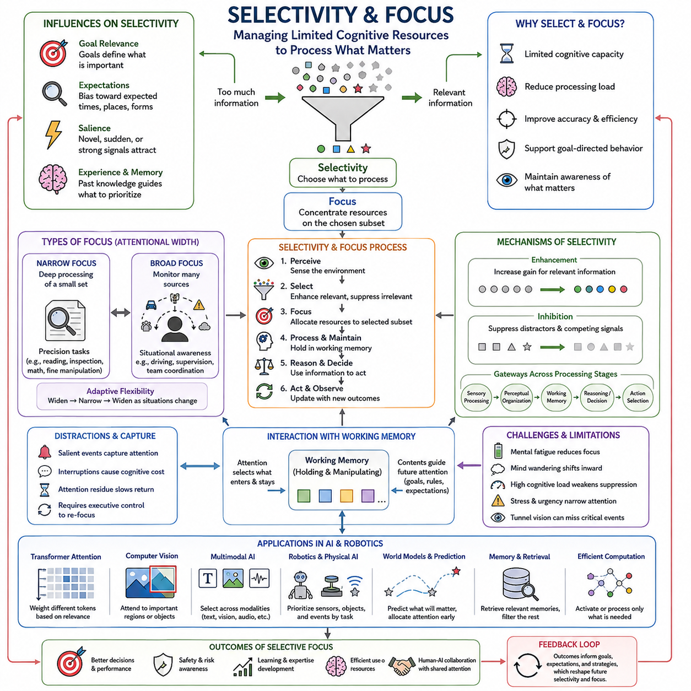{width="7.268055555555556in" height="7.268055555555556in"}

선택성(Selectivity)과 집중(Focus)은 지능형 시스템이 동시에 이용 가능한 모든 신호를 동일한 깊이로 처리할 수 없기 때문에 주의(Attention)의 핵심적인 특성입니다. 환경은 지속적으로 서로 경쟁하는 객체, 소리, 기억, 목표 및 가능한 행동을 제공합니다. 선택적 주의(Selective Attention)는 인지 시스템이 현재 작업과 관련된 정보를 우선적으로 처리하면서 덜 유용하거나 방해가 되는 정보의 영향을 감소시킬 수 있도록 합니다.

집중(Focus)은 제한된 정보, 표현 또는 활동에 인지 자원(Cognitive Resources)을 집중시키는 것을 의미합니다. 집중된 상태는 선택된 내용의 처리 우선순위를 높이고 해당 작업의 정확도, 속도 및 일관성을 향상시키는 경우가 많습니다. 그러나 집중이 강해질수록 주변 정보에 대한 세부적인 처리는 감소하므로 집중과 환경 인식(Environmental Awareness) 사이에는 중요한 상충 관계(Tradeoff)가 존재합니다.

따라서 선택성(Selectivity)은 인지 자원이 제한되어 있기 때문에 필요합니다. 인간의 지각(Perception)은 많은 양의 감각 정보를 등록할 수 있지만 특정 순간에 상세하게 분석되거나 작업 기억(Working Memory)에 들어갈 수 있는 정보는 그중 일부에 불과합니다. 선택 메커니즘(Selection Mechanisms)은 어떤 신호를 더 깊게 처리하고 어떤 신호를 약하게 표현하거나 일시적으로 무시하거나 자동으로 처리할지를 결정하여 이러한 계산 부담을 줄입니다.

선택 과정(Selectivity Process)은 인지의 여러 단계에서 작동할 수 있습니다. 선택은 초기 감각 처리(Early Sensory Processing)에서 시작하여 지각적 조직화(Perceptual Organization) 과정에서도 지속되고, 어떤 표현이 작업 기억에 들어갈지를 결정하며, 이후 추론(Reasoning), 의사결정(Decision Making), 행동 선택(Action Selection)에도 영향을 줄 수 있습니다. 따라서 주의는 단순히 인지의 입구에 배치된 필터가 아니라 인지 시스템 전체에서 처리를 조절할 수 있는 분산된 메커니즘(Distributed Mechanism)입니다.

작업 관련성(Task Relevance)은 주의 선택(Attentional Selection)을 결정하는 가장 강력한 요인 가운데 하나입니다. 사람이 명확한 목표를 가지고 있으면 해당 목표와 관련된 정보가 더 높은 우선순위를 갖게 됩니다. 예를 들어 특정 고장 표시를 찾는 기술자는 해당 고장과 관련된 신호에 더욱 민감해집니다. 따라서 내부 목표(Internal Goals)는 어떤 정보를 관련성이 높은 것으로 취급해야 하는지를 정의함으로써 지각을 형성합니다.

기대(Expectations) 역시 선택성에 영향을 미칩니다. 인지 시스템이 중요한 정보가 특정 위치, 시간 또는 특정한 형태로 나타날 것이라고 예측하면 이러한 예상 조건에 대한 처리가 강화될 수 있습니다. 이러한 준비는 일반적으로 탐지 효율(Detection Efficiency)을 향상시키지만 중요한 사건이 예상된 패턴 밖에서 발생하는 경우에는 사각지대(Blind Spots)를 만들어낼 수도 있습니다.

현저성(Salience)은 선택의 또 다른 기준을 제공합니다. 매우 두드러지는 자극, 갑작스러운 변화, 강한 대비, 움직임, 특이한 소리 또는 새로운 사건은 현재 목표와 관계없이 주의를 끌 수 있습니다. 이러한 자극 주도적 선택성(Stimulus-Driven Selectivity)은 예상하지 못한 사건이 기회나 위협을 의미할 수 있기 때문에 유용합니다. 그러나 현저하지만 관련성이 없는 신호 역시 진행 중인 작업을 방해하고 지속적인 수행 성능을 저하시킬 수 있습니다.

따라서 효과적인 집중은 목표 주도적 우선순위(Goal-Driven Priorities)와 자극 주도적 우선순위(Stimulus-Driven Priorities) 사이의 지속적인 경쟁을 필요로 합니다. 인지 시스템은 불필요한 방해로부터 중요한 목표를 보호하면서도 예상하지 못한 사건이 중요해질 경우 주의를 전환할 수 있는 충분한 유연성을 유지해야 합니다. 안정적인 행동은 환경을 완전히 무시하거나 모든 새로운 자극에 반응하는 것이 아니라 지속성과 재지향(Reorientation) 사이의 적응적인 균형을 유지하는 데 달려 있습니다.

주의 집중(Attentional Focus)은 좁거나 넓게 형성될 수 있습니다. 좁은 집중(Narrow Focus)은 처리 자원을 소수의 객체나 특징에 집중시켜 상세한 분석과 정밀한 제어를 가능하게 합니다. 넓은 집중(Broad Focus)은 처리를 더욱 넓게 분배하여 여러 사건이나 관계에 대한 민감성을 높입니다. 적절한 주의 범위(Attentional Width)는 작업, 불확실성, 환경 복잡성 및 주변 정보를 놓쳤을 때의 결과에 따라 달라집니다.

좁은 집중(Narrow Focus)은 작업에 정밀성이 요구될 때 유리합니다. 세부적인 문서를 읽거나, 부품을 검사하거나, 수학 문제를 해결하거나, 작은 물체를 조작하는 작업은 집중된 처리의 도움을 받습니다. 이러한 경우 관련 없는 정보는 수행을 방해할 수 있습니다. 강한 선택은 내부 표현(Internal Representations)을 안정시키고 선택된 대상에 대한 더 깊은 분석을 지원합니다.

넓은 집중(Broad Focus)은 상황 인식(Situational Awareness)이 필요한 경우 중요해집니다. 운전, 자율 기계 감독, 익숙하지 않은 지형에서의 이동 또는 여러 사람과의 협업에서는 여러 정보 소스를 동시에 관찰해야 합니다. 이러한 상황에서 지나치게 좁은 주의는 주된 작업을 올바르게 수행하고 있더라도 중요한 변화를 놓치게 할 수 있습니다.

따라서 주의 범위를 변경하는 능력은 인지적 유연성(Cognitive Flexibility)의 중요한 형태입니다. 시스템은 넓은 범위의 모니터링으로 시작한 후 관련 사건이 발견되면 집중 범위를 좁히고, 해당 사건이 해결된 이후 다시 주의를 넓힐 수 있습니다. 이러한 동적인 조정(Dynamic Adjustment)을 통해 처리 자원을 변화하는 환경의 정보 요구에 맞출 수 있습니다.

선택적 집중(Selective Focus)은 작업 기억(Working Memory)과 강하게 연결되어 있습니다. 주의를 받는 정보는 작업 기억에 들어가거나 활성 상태로 유지될 가능성이 높아지며, 이를 통해 추론과 행동에 영향을 줄 수 있습니다. 동시에 작업 기억의 내용은 목표, 대상 특징, 규칙 또는 기대를 유지하여 이후의 주의를 유도할 수 있습니다. 이에 따라 내부 기억 상태와 외부 정보 선택 사이에 피드백 관계(Feedback Relationship)가 형성됩니다.

방해 자극 억제(Distractor Suppression)는 선택성의 중요한 구성 요소입니다. 효과적인 주의는 관련 정보를 강화하는 것뿐 아니라 관련 없는 자극의 영향력을 감소시키는 과정도 포함합니다. 시끄러운 환경에서 집중하는 사람은 경쟁하는 소리를 억제해야 하며, 시각 탐색 시스템(Visual Search System)은 목표와 일치하지 않는 객체에 대한 반응을 줄여야 합니다. 따라서 선택은 강화(Enhancement)와 억제(Inhibition)를 모두 통해 이루어집니다.

억제(Inhibition)는 방해 자극이 매우 현저하거나 습관적인 반응과 강하게 연관되어 있을 때 특히 중요합니다. 익숙한 알림음, 움직이는 광고 또는 감정적으로 중요한 자극은 자동으로 주의를 끌 수 있습니다. 집중을 유지하려면 이러한 경쟁 반응을 억제하고 현재 목표로 주의를 복원할 수 있는 실행 메커니즘(Executive Mechanisms)이 필요합니다.

방해 자극 억제의 효율성은 인지 부하(Cognitive Load)의 영향을 받습니다. 작업 기억과 실행 자원(Executive Resources)이 이미 과도하게 사용되고 있으면 관련 없는 정보를 억제하는 능력이 감소할 수 있습니다. 그러면 방해 자극이 지각과 의사결정에 더 큰 영향을 미칠 수 있습니다. 따라서 높은 인지 부하는 기억 용량뿐 아니라 주의 집중의 안정성도 감소시킵니다.

집중(Focus)은 시간에 따라서도 변화합니다. 장시간 지속되는 작업에서는 집중 상태가 항상 일정하게 유지될 수 없습니다. 주의는 피로(Fatigue), 동기(Motivation), 각성 수준(Arousal), 작업 난이도, 환경 자극 및 내부 사고에 따라 변동할 수 있습니다. 이러한 변동으로 관련 정보가 일시적으로 덜 효과적으로 처리될 수 있으며, 반복적이거나 감시 중심의 작업에서는 오류 발생 가능성이 증가합니다.

마음 방황(Mind Wandering)은 작업 중심 주의가 감소하는 하나의 형태입니다. 마음 방황이 발생하면 인지 자원이 외부에서 정의된 작업에서 내부적으로 생성된 생각, 기억, 상상된 상황 또는 미래 계획으로 이동합니다. 이는 현재 작업의 수행 능력을 감소시킬 수 있지만, 내부 지향적 주의(Internally Directed Attention)는 창의성, 계획, 자전적 성찰(Autobiographical Reflection), 문제 해결에도 도움을 줄 수 있습니다.

따라서 선택적 집중은 외부 또는 내부를 향할 수 있습니다. 외부 주의(External Attention)는 감각 정보와 환경 사건을 강조하는 반면, 내부 주의(Internal Attention)는 기억, 개념, 상상된 장면, 목표 또는 중간 추론 상태를 우선적으로 처리할 수 있습니다. 복잡한 인지는 상황을 관찰하고, 관련 지식을 회상하고, 대안을 추론한 후 다시 환경으로 주의를 돌리는 것처럼 이러한 모드 사이를 빈번하게 전환해야 합니다.

집중(Focus)과 의식적 자각(Conscious Awareness)의 관계 역시 중요합니다. 강하게 주의를 받은 정보는 의식적인 처리에 더욱 쉽게 접근할 수 있는 반면 약하게 주의를 받은 신호는 명시적 자각의 외부에 남을 수 있습니다. 그러나 일부 조건에서는 주의를 받지 않은 정보도 행동에 영향을 줄 수 있습니다. 따라서 선택은 처리된 정보와 처리되지 않은 정보 사이에 절대적인 경계를 만드는 것이 아니라 처리 우선순위(Processing Priority)를 변화시키는 것으로 이해해야 합니다.

주의 포착(Attentional Capture)은 자극이 자동으로 우선순위를 획득하는 경우에 발생합니다. 갑작스러운 움직임, 큰 소리, 감정적으로 중요한 신호 및 예상하지 못한 변화가 이러한 현상을 자주 발생시킵니다. 빠른 대응이 필요한 경우에는 유용하지만 빈번한 중단(Interruptions)은 인지적 비용을 발생시킵니다. 시스템이 기존 작업에서 이탈하고, 방해 사건을 처리한 후, 이전의 주의 상태를 다시 구성해야 하기 때문입니다.

중단 이후 원래 작업으로 복귀하는 과정은 항상 즉각적으로 이루어지지 않습니다. 인지 시스템에는 이전 작업 또는 방해 작업 상태의 일부가 남아 후속 수행에 영향을 주는 주의 잔여(Attention Residue)가 발생할 수 있습니다. 깊은 추론이 필요한 복잡한 작업은 관련된 정신적 문맥(Mental Context)을 다시 구성하는 과정에서 시간과 작업 기억 자원을 소비하기 때문에 반복적인 중단에 특히 민감합니다.

이러한 특성은 많은 고수준 인지(High-Level Cognition)에서 지속적인 집중이 필수적인 이유를 설명합니다. 문제 해결, 설계, 프로그래밍, 과학적 추론 및 계획은 상호 연결된 표현을 장시간 유지해야 하는 경우가 많습니다. 빈번한 주의 전환은 이러한 표현을 방해하여 중요한 관계, 가정 또는 중간 결론이 활성 처리(Active Processing)에서 사라지도록 할 수 있습니다.

선택적 주의(Selective Attention)는 학습에도 영향을 미칩니다. 학습자가 작업과 관련된 특징에 집중하면 해당 특징과 결과 사이의 연관 관계가 강화될 수 있습니다. 반대로 주의가 다른 곳에 집중되어 있으면 중요한 관계를 충분히 학습하지 못할 수 있습니다. 따라서 학습 시스템은 단순히 정보에 노출되는 것뿐 아니라 해당 정보의 어떤 차원이 충분한 처리를 받는지에도 의존합니다.

전문성(Expertise)은 선택성의 패턴을 변화시킵니다. 전문가는 어떤 신호가 진단적으로 중요한지를 알고 있기 때문에 초보자보다 주의를 효율적으로 배분할 수 있습니다. 이용 가능한 모든 정보를 동일하게 조사하는 대신 소수의 의미 있는 패턴에 빠르게 집중할 수 있습니다. 따라서 전문가의 우수한 수행 능력은 더 많은 지식뿐 아니라 어떤 정보를 선택해야 하는지에 대한 효과적인 제어 능력에서도 비롯됩니다.

초보자(Novices)는 관련 정보와 관련 없는 정보를 아직 구별하지 못하기 때문에 주의를 덜 효율적으로 배분하는 경우가 많습니다. 시각적으로 두드러지지만 중요하지 않은 특징에 집중하거나 너무 많은 세부 정보를 동시에 처리하려고 할 수 있습니다. 학습이 진행되면 주의 전략(Attentional Strategies)이 더욱 구조화되어 예측적 또는 기능적 가치가 높은 특징에 인지 자원을 집중할 수 있게 됩니다.

선택성(Selectivity)은 의사결정(Decision Making)에서도 중요한 역할을 합니다. 복잡한 의사결정에는 많은 변수가 포함될 수 있지만 실제 결과에 중요한 영향을 미치는 것은 그중 일부일 수 있습니다. 효과적인 인지는 이러한 변수를 식별하고 그에 따라 추론 자원을 배분해야 합니다. 선택이 잘못되면 너무 많은 변수를 고려하는 정보 과부하(Information Overload) 또는 중요한 증거를 무시하는 과도한 단순화(Oversimplification)가 발생할 수 있습니다.

불확실성(Uncertainty)은 최적의 집중 수준을 변화시킬 수 있습니다. 불확실성이 낮으면 시스템은 관련된 소수의 정보에 자신 있게 집중할 수 있습니다. 반면 불확실성이 높으면 현재의 표현이 불완전하거나 잘못되었을 가능성이 있으므로 더욱 폭넓은 정보 수집이 필요할 수 있습니다. 따라서 지능적인 주의(Intelligent Attention)는 신뢰도(Confidence)와 환경의 예측 가능성에 따라 선택성의 정도를 조절해야 합니다.

위협(Threat)과 긴급성(Urgency) 역시 주의를 좁힐 수 있습니다. 스트레스가 높은 조건에서는 인지 처리가 가장 즉각적인 위험 원인에 강하게 집중될 수 있습니다. 이는 중요한 사건에 대한 반응을 가속할 수 있지만 대안적인 선택이나 부차적인 위험에 대한 인식을 감소시킬 수 있습니다. 따라서 안전 중요 시스템(Safety-Critical Systems)은 높은 작업 부하와 시간 압박에서 주의 범위의 축소가 판단에 미치는 영향을 고려해야 합니다.

인간-기계 상호작용(Human-Machine Interaction)에서는 인터페이스 설계(Interface Design)가 선택성과 집중에 강한 영향을 미칠 수 있습니다. 중요한 정보는 과도한 시각적 또는 청각적 경쟁을 발생시키지 않으면서 쉽게 구별될 수 있어야 합니다. 너무 많은 경고, 표시기, 창 또는 메시지가 동시에 주의를 요구하면 사용자가 우선순위 정보를 식별하기 어려워집니다. 따라서 효과적인 인터페이스는 관련성과 긴급성에 따라 정보를 조직하여 선택적인 처리를 지원합니다.

경보 설계(Alarm Design)는 이러한 특성을 보여주는 대표적인 사례입니다. 경보가 지나치게 빈번하거나 우선순위가 제대로 설정되지 않으면 사용자가 경보를 무시하기 시작하는 경보 피로(Alarm Fatigue)가 발생할 수 있습니다. 반대로 경보가 지나치게 약하면 중요한 사건을 놓칠 수 있습니다. 따라서 인터페이스는 신호의 강도가 해당 사건의 중요성과 필요한 대응 수준에 합리적으로 대응하도록 주의의 계층 구조(Hierarchy of Attention)를 지원해야 합니다.

선택성(Selectivity)과 집중(Focus)의 원리는 인공지능(Artificial Intelligence)에도 적용됩니다. 현대 AI 시스템은 수많은 토큰(Token), 특징(Feature), 객체(Object), 센서 측정값(Sensor Measurements), 기억(Memory), 후보 행동(Candidate Actions)을 포함하는 대규모 입력 공간을 처리하는 경우가 많습니다. 모든 요소를 동일하게 관련된 것으로 처리하면 계산적으로 비효율적일 뿐 아니라 의사결정 품질도 저하될 수 있습니다. 선택적 메커니즘을 이용하면 현재 작업에 가장 크게 기여하는 정보에 계산을 집중할 수 있습니다.

트랜스포머 주의(Transformer Attention)는 선택적 처리의 하나의 계산적 구현입니다. 주의 점수(Attention Scores)는 표현 사이의 관계를 추정하고 서로 다른 요소가 다른 요소에 얼마나 강하게 영향을 미쳐야 하는지를 결정합니다. 생성된 가중치를 통해 모델은 일부 정보를 강조하면서 다른 정보의 기여도를 감소시킬 수 있습니다. 이는 학습 가능한 문맥 의존적 선택(Context-Dependent Selection)의 한 형태를 제공합니다.

그러나 계산적 주의(Computational Attention)가 인간의 집중을 직접적으로 재현한다고 가정해서는 안 됩니다. 트랜스포머 주의는 주로 표현에 가중치를 부여하기 위한 수학적 메커니즘인 반면 인간의 주의는 지각, 기억, 실행 제어(Executive Control), 동기, 자각 및 행동을 포함합니다. 두 시스템의 유사성은 동일한 내부 메커니즘보다는 선택적 처리(Selective Processing)라는 일반적인 원리에 있습니다.

컴퓨터 비전(Computer Vision)에서는 이미지 영역, 객체, 공간적 특징 또는 시간적 프레임에 대해 선택성이 작동할 수 있습니다. 시각적 추론(Visual Reasoning)을 수행하는 모델은 전체 이미지를 균일하게 처리하는 대신 작업과 관련된 객체를 포함하는 영역에 처리를 집중할 수 있습니다. 이와 유사한 접근 방법을 비디오에도 적용하여 특정 프레임이나 움직임 패턴에 우선순위를 부여할 수 있습니다.

멀티모달 시스템(Multimodal Systems)은 각각의 모달리티 내부뿐 아니라 모달리티 사이에서도 선택성을 필요로 합니다. 텍스트, 이미지, 오디오, 깊이(Depth), 움직임 및 기타 신호는 모든 작업에서 동일한 정보 가치를 제공하지 않습니다. 따라서 시스템은 특정 문맥에서 어떤 모달리티에 더 큰 영향을 부여할지를 결정하면서 환경 조건이 변화하면 우선순위를 전환할 수 있는 능력을 유지해야 합니다.

이러한 원리는 로보틱스(Robotics)에서 특히 중요합니다. 로봇은 카메라, 라이다(LiDAR), 레이더(Radar), 마이크, 촉각 센서(Tactile Sensors), 위치 추정 시스템(Localization Systems), 내부 진단(Internal Diagnostics)으로부터 지속적인 데이터 스트림을 받을 수 있습니다. 모든 센서를 항상 최대 복잡도로 처리하는 것은 비효율적일 수 있습니다. 선택적 처리를 통해 현재 행동에 가장 관련된 센서와 환경 영역을 우선적으로 처리할 수 있습니다.

예를 들어 주행(Navigation) 중에는 주변 장애물, 보행자, 지형 경계 및 위치 추정 랜드마크(Localization Landmarks)에 주의를 집중할 수 있습니다. 조작(Manipulation) 과정에서는 객체 형상(Object Geometry), 접촉 지점(Contact Points), 말단 장치 상태(End-Effector State), 힘 정보(Force Information)로 집중이 이동할 수 있습니다. 고장 진단(Fault Diagnosis) 과정에서는 외부 장면보다 내부 센서 측정값과 비정상적인 시스템 동작이 더욱 중요해질 수 있습니다.

따라서 피지컬 AI(Physical AI)는 작업 의존적 집중(Task-Dependent Focus)을 필요로 합니다. 동일한 로봇이 주행, 상호작용, 조작, 통신, 검사 및 자기 모니터링(Self-Monitoring)을 번갈아 수행할 수 있습니다. 각각의 모드는 서로 다른 정보 우선순위를 생성합니다. 효과적인 체화 시스템(Embodied System)은 목표, 환경 조건 및 예측된 미래 상태가 변화함에 따라 지속적으로 주의를 재구성해야 합니다.

월드 모델(World Models)은 가까운 미래에 환경의 어떤 부분이 중요해질 가능성이 높은지를 예측함으로써 선택적 집중을 더욱 지원할 수 있습니다. 로봇이 움직이는 객체가 자신의 경로를 가로지를 가능성이 있다고 예측하면 즉각적인 충돌 위험이 발생하기 전부터 처리 자원을 해당 객체로 이동시킬 수 있습니다. 따라서 예측은 주의를 단순한 반응적 선택(Reactive Selection)에서 선제적 자원 배분(Anticipatory Resource Allocation)으로 확장할 수 있습니다.

기억(Memory) 역시 지능형 에이전트(Intelligent Agents)의 집중을 유도할 수 있습니다. 이전에 학습한 경험은 특정 상황에서 어떤 신호가 중요한지를 알려줄 수 있습니다. 에이전트가 익숙한 문맥을 만나면 관련 기억을 검색하고 이를 이용하여 현재의 지각을 편향시킬 수 있습니다. 이에 따라 기억이 주의를 유도하고, 주의가 새로운 관측을 결정하며, 새로운 관측이 다시 기억을 업데이트하는 루프가 형성됩니다.

장기간 작동하는 자율 에이전트(Long-Term Autonomous Agents)는 축적되는 기억의 규모가 매우 커질 수 있기 때문에 추가적인 선택 문제에 직면합니다. 저장된 경험 가운데 현재 작업에 유용한 것은 극히 일부일 수 있습니다. 따라서 검색 메커니즘(Retrieval Mechanisms)은 주의 우선순위와 함께 작동하여 관련 기억이 활성 추론 문맥(Active Reasoning Context)에 들어가도록 하면서 관련 없는 과거 정보가 시스템을 압도하지 않도록 해야 합니다.

선택적 계산(Selective Computation)은 효율성도 향상시킬 수 있습니다. 대규모 AI 시스템은 모델의 일부만 활성화하거나, 선택된 토큰만 처리하거나, 특정 이미지 영역만 분석하거나, 제한된 수의 기억만 검색하는 메커니즘을 사용할 수 있습니다. 이러한 기술은 아키텍처적으로 서로 다르지만 추정된 관련성에 따라 계산 자원을 배분한다는 공통된 목적을 가지고 있습니다.

계층적 선택성(Hierarchical Selectivity)은 이러한 과정을 여러 수준에 걸쳐 구성할 수 있습니다. 저수준 메커니즘은 감각 특징을 선택하고, 중간 수준 메커니즘은 객체나 사건을 우선적으로 처리하며, 고수준 메커니즘은 목표, 가설, 계획 또는 기억을 선택할 수 있습니다. 이러한 구조를 통해 지능형 시스템은 모든 구성 요소가 전체 정보 공간을 처리하지 않고도 복잡성을 관리할 수 있습니다.

그러나 집중(Focus)은 필요할 때 되돌릴 수 있어야 합니다. 하나의 해석에 지나치게 강하게 고정된 시스템은 현재 모델과 모순되는 증거를 무시할 수 있습니다. 따라서 강건한 인지(Robust Cognition)는 주의를 다시 넓히고, 대안을 재검토하며, 예상하지 못한 정보를 감지할 수 있는 메커니즘을 필요로 합니다. 효과적인 집중은 안정성과 함께 조건이 변화했을 때 기존 집중에서 이탈할 수 있는 능력을 결합합니다.

이러한 요구사항은 탐색과 활용(Exploration and Exploitation)의 관계와 밀접하게 연결됩니다. 활용(Exploitation)은 이미 유용하다고 판단된 정보에 자원을 집중하는 반면 탐색(Exploration)은 대안을 발견하거나 변화를 감지하기 위해 처리 범위를 확대합니다. 지능적인 선택성은 특히 불확실하거나 비정상적 환경(Nonstationary Environments)에서 이 두 가지 모드 사이의 균형을 유지해야 합니다.

메타인지적 제어(Meta-Cognitive Control)는 이러한 균형을 조절하는 데 도움을 줄 수 있습니다. 자신의 신뢰도, 불확실성 또는 오류 가능성을 추정할 수 있는 시스템은 이에 따라 주의 전략을 조정할 수 있습니다. 높은 신뢰도는 집중된 처리를 지원할 수 있으며, 낮은 신뢰도는 더 넓은 관찰, 추가적인 기억 검색 또는 대안적인 해석의 검토를 유발할 수 있습니다.

안전 중요 AI(Safety-Critical AI)에서는 지나치게 최적화된 집중이 실패 모드(Failure Modes)를 만들어낼 수 있기 때문에 선택적 메커니즘을 신중하게 설계해야 합니다. 일반적인 패턴을 우선하도록 학습된 시스템은 드물지만 위험한 사건의 중요성을 낮게 평가할 수 있습니다. 따라서 신뢰할 수 있는 시스템은 예상하지 못한 위험이 발생했을 때 정상적인 집중 상태를 중단할 수 있도록 이상 탐지(Anomaly Detection), 불확실성 모니터링(Uncertainty Monitoring), 중복 센싱(Redundant Sensing) 또는 기타 메커니즘을 필요로 합니다.

인간-AI 협업(Human-AI Collaboration) 역시 주의의 공동 관리에 의존합니다. AI 시스템은 사용자가 관련 정보를 식별하고, 대규모 정보 공간을 요약하고, 경고의 우선순위를 결정하며, 이상 현상을 강조하도록 지원할 수 있습니다. 그러나 잘못 설계된 지원 시스템은 인간의 집중을 부적절하게 조작하거나 지나치게 좁힐 수 있습니다. 따라서 주의 지원은 단순히 최대한 강하게 관심을 끄는 것이 아니라 전체적인 상황 이해를 향상시키는 방향으로 설계되어야 합니다.

궁극적으로 선택성(Selectivity)과 집중(Focus)은 인지적 및 계산적 복잡성(Cognitive and Computational Complexity)을 제어하는 일반적인 메커니즘을 제공합니다. 인간과 인공 시스템 모두 무제한의 정보를 동일한 정밀도로 처리할 수 없습니다. 지능은 무엇이 관련되어 있는지를 식별하고, 가장 높은 가치를 제공하는 영역에 자원을 집중하며, 간섭을 억제하고, 새로운 증거가 요구할 때 집중의 대상을 변경하는 능력에 의존합니다.

이러한 관점에서 선택성(Selectivity)은 단순히 유한한 처리 용량으로 인해 발생하는 제한이 아닙니다. 선택성은 조직화된 인지(Organized Cognition)를 가능하게 만드는 근본적인 능력이기도 합니다. 어떤 정보가 상세한 처리를 받아야 하고 어떤 정보가 배경에 남아 있어도 되는지를 결정함으로써 주의는 압도적으로 복잡한 환경을 관리 가능한 내부 표현(Internal Representation)으로 변환합니다.

집중(Focus)은 지각, 추론, 기억, 예측 및 행동이 일관성 있게 작동할 수 있을 만큼 충분한 시간 동안 선택된 정보를 유지함으로써 이러한 선택을 보완합니다. 선택성과 집중은 함께 대규모의 감각 정보와 내부 정보 흐름을 구조화되고 목표 지향적인 인지(Goal-Directed Cognition)로 변환합니다. 인간 인지와 인공지능 모두에서 지능적인 행동은 단순히 정보에 접근할 수 있는 능력뿐 아니라 지금 무엇이 중요해야 하는지를 지속적으로 결정하는 능력에 달려 있습니다.

## 02.10 Memory in LLM and Agents [w/Code]

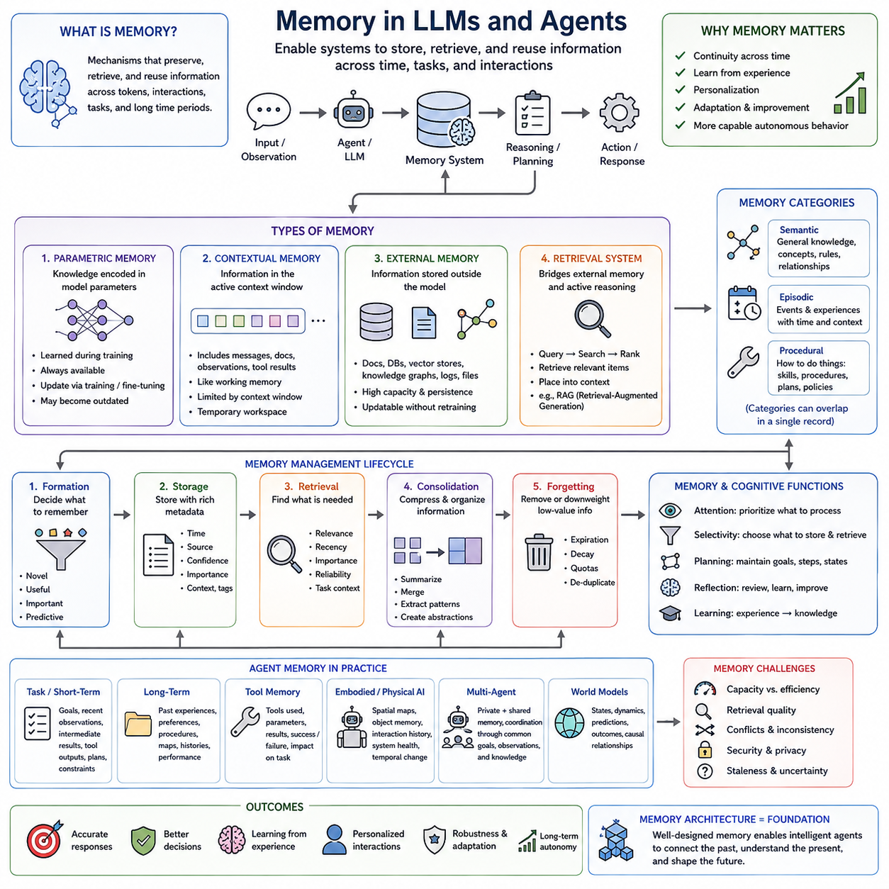{width="7.268055555555556in" height="7.268055555555556in"}

대규모 언어 모델(Large Language Models, LLMs)과 지능형 에이전트(Intelligent Agents)에서 기억(Memory)은 토큰(Token), 상호작용(Interactions), 작업(Tasks), 그리고 장기간의 운영에 걸쳐 정보를 보존하고 검색하며 재사용하는 메커니즘을 의미합니다. 인간의 기억과 달리 LLM은 일반적으로 경험을 하나의 지속적으로 접근 가능한 저장소에 유지하지 않습니다. LLM에서 나타나는 기억은 학습된 모델 파라미터(Learned Model Parameters), 활성 문맥(Active Context), 외부 저장소(External Storage), 검색 시스템(Retrieval Systems), 에이전트 관리 상태(Agent-Managed State) 등 여러 메커니즘의 결합으로 형성됩니다.

LLM 기반 시스템을 분석할 때 지식(Knowledge)과 기억(Memory)을 구분하는 것은 중요합니다. 학습 과정에서 인코딩된 지식은 모델 파라미터 전체에 분산되어 있으며 대규모 데이터셋에서 학습된 통계적 규칙성을 반영합니다. 운영적인 의미에서 기억은 일반적으로 추론(Inference)이나 상호작용 과정에서 보존되었다가 나중에 다시 사용할 수 있는 정보를 의미합니다. 이러한 메커니즘은 지속성(Persistence), 접근성(Accessibility), 용량(Capacity), 업데이트 속도(Update Speed), 계산 비용(Computational Cost)에서 서로 다릅니다.

파라미터 기억(Parametric Memory)은 신경망의 학습된 가중치(Learned Weights) 내부에 암묵적으로 표현된 정보입니다. 사전학습(Pretraining) 과정에서 모델은 수십억 개의 파라미터를 조정하여 언어적 패턴, 개념, 관계, 절차 및 일부 사실적 지식이 내부 표현(Internal Representations)에 포함되도록 합니다. 이러한 정보는 명시적인 데이터베이스 조회 없이도 이후의 출력에 영향을 줄 수 있지만, 개별 사실을 단순한 기억 레코드(Memory Record)처럼 분리하는 것은 일반적으로 어렵습니다.

파라미터 기억(Parametric Memory)은 모델 자체에 통합되어 있기 때문에 추론 과정에서 즉시 사용할 수 있다는 장점이 있습니다. 그러나 이를 업데이트하려면 일반적으로 추가 학습, 미세조정(Fine-Tuning) 또는 다른 파라미터 수정 기법이 필요합니다. 또한 외부 세계가 변화하면 정보가 오래되어 부정확해질 수 있습니다. 따라서 새로운 관측, 사건, 사용자 지시 또는 변화하는 환경 상태를 지속적으로 반영해야 하는 에이전트에서는 파라미터 기억만으로 충분하지 않습니다.

문맥 기억(Contextual Memory)은 모델의 활성 문맥 창(Active Context Window) 내부에 포함된 정보입니다. 이전 메시지, 지시사항, 검색된 문서, 관측 결과, 중간 추론 정보 및 도구 실행 결과(Tool Results)가 모두 이 문맥의 일부가 될 수 있습니다. 모델은 이후 출력을 생성할 때 이러한 토큰을 사용하므로 문맥 창은 영구적인 기억 저장소라기보다 일시적인 계산 작업 공간(Computational Workspace)과 유사한 역할을 합니다.

문맥 기억(Contextual Memory)은 현재 처리에 즉시 접근할 수 있는 정보를 제공한다는 기능적 측면에서 작업 기억(Working Memory)과 유사합니다. 그러나 이러한 유사성을 문자 그대로 해석해서는 안 됩니다. 인간의 작업 기억에는 생물학적인 주의(Biological Attention)와 인지 제어(Cognitive Control) 메커니즘이 포함되지만 LLM은 계산 아키텍처 내부의 표현을 처리합니다. 유용한 공통점은 두 시스템 모두 진행 중인 추론과 의사결정을 위해 제한된 활성 정보를 제공한다는 것입니다.

문맥 기억의 용량은 모델의 문맥 창(Context Window)과 매우 큰 문맥을 효율적으로 사용하는 현실적인 어려움에 의해 제한됩니다. 모델이 기술적으로 매우 긴 문맥을 지원하더라도 모든 과거 정보를 문맥 내부에 넣는 것이 항상 최적의 방법은 아닙니다. 관련 없는 정보는 계산 비용을 증가시키고, 간섭(Interference)을 발생시키며, 중요한 증거를 가리고, 정보 선택을 더욱 어렵게 만들 수 있습니다.

따라서 기억 관리(Memory Management)는 단순히 문맥 길이를 증가시키는 것 이상의 기능을 필요로 합니다. 지능형 시스템은 어떤 정보를 활성 상태로 유지하고, 어떤 정보를 요약하며, 어떤 정보를 외부에 저장하고, 무엇을 제거하며, 나중에 무엇을 다시 검색할 것인지를 결정해야 합니다. 이로 인해 기억은 수동적인 저장 문제가 아니라 주의(Attention) 및 선택성(Selectivity)과 밀접하게 연결된 능동적인 정보 관리 문제로 전환됩니다.

외부 기억(External Memory)은 모델의 파라미터와 활성 문맥 외부에 정보를 저장하는 메커니즘을 제공합니다. 문서, 데이터베이스, 벡터 저장소(Vector Stores), 지식 그래프(Knowledge Graphs), 구조화된 레코드, 이벤트 로그(Event Logs), 파일 및 전문 기억 서비스가 모두 이러한 목적으로 사용될 수 있습니다. 외부 저장소는 문맥 창보다 훨씬 큰 용량과 지속성을 제공하면서 기본 모델을 다시 학습하지 않고도 정보를 업데이트할 수 있습니다.

검색(Retrieval)은 외부 기억과 활성 추론(Active Reasoning)을 연결합니다. 정보가 필요하면 시스템은 질의(Query)를 생성하고 하나 이상의 기억 저장소를 검색하며 후보 레코드의 순위를 결정한 후 선택된 정보를 모델의 작업 문맥(Working Context)에 배치합니다. 검색 증강 생성(Retrieval-Augmented Generation, RAG)은 정보 검색과 언어 생성을 결합하여 모델 파라미터에 영구적으로 인코딩되지 않은 정보도 응답 생성에 사용할 수 있도록 하는 대표적인 방법입니다.

저장된 정보를 필요할 때 올바르게 찾을 수 없다면 그 정보의 가치는 크게 감소하기 때문에 검색 품질(Retrieval Quality)은 매우 중요합니다. 효과적인 검색은 표현 품질(Representation Quality), 인덱싱(Indexing), 메타데이터(Metadata), 질의 생성(Query Formulation), 유사도 측정(Similarity Measures), 순위 결정(Ranking), 필터링(Filtering), 문맥적 관련성(Contextual Relevance)에 의존합니다. 따라서 기억 시스템에는 저장뿐 아니라 선택 메커니즘도 필요합니다. 검색 능력이 부족한 대규모 기억은 잘 조직된 소규모 기억보다 오히려 낮은 성능을 보일 수 있습니다.

에이전트의 의미 기억(Semantic Memory)은 특정한 하나의 사건에 종속되지 않는 일반화된 지식을 표현할 수 있습니다. 개념, 관계, 규칙, 환경 속성, 학습된 절차, 사용자 정의 사실 및 안정적인 작업 지식을 이러한 형태로 저장할 수 있습니다. 의미 기억을 통해 에이전트는 개별 경험에서 동일한 지식을 반복적으로 재구성하지 않고 여러 상황에서 정보를 재사용할 수 있습니다.

일화 기억(Episodic Memory)은 시간 및 문맥 정보와 연결된 특정 경험이나 사건을 표현합니다. 에이전트는 특정 시간에 작업을 시도했다는 사실, 특정 전략이 실패했다는 사실, 특정 위치에서 장애물이 나타났다는 사실 또는 사용자가 이전에 특정 결과를 요청했다는 사실을 기억할 수 있습니다. 일화 기억은 현재 상황을 관련된 과거 경험과 비교할 수 있도록 하므로 경험으로부터의 학습(Learning from Experience)을 지원합니다.

절차 기억(Procedural Memory)은 기능적으로 행동이나 절차를 수행하는 방법에 관한 지식을 의미합니다. AI 에이전트에서는 학습된 정책(Learned Policies), 모델 파라미터, 실행 가능한 도구(Executable Tools), 워크플로(Workflows), 계획(Plans), 기술(Skills) 또는 저장된 행동 시퀀스(Action Sequences)로 표현될 수 있습니다. 단순한 사실 기록과 달리 절차 지식은 시스템이 작업을 수행하는 방식에 영향을 줍니다. 따라서 에이전트 아키텍처는 무엇이 사실인지를 나타내는 정보와 어떤 작업을 어떻게 수행해야 하는지를 나타내는 정보를 구분할 수 있습니다.

이러한 기억 범주는 엄격한 아키텍처 요구사항이라기보다 유용한 개념적 추상화(Conceptual Abstractions)입니다. 하나의 저장된 레코드에 의미적, 일화적, 절차적 정보가 동시에 포함될 수 있습니다. 마찬가지로 하나의 학습된 모델 파라미터를 명시적인 기억 항목 하나로 쉽게 분류할 수도 없습니다. 이러한 범주는 서로 다른 보존 기간(Retention Period), 검색 전략, 업데이트 메커니즘 및 접근 정책을 필요로 하는 시스템을 설계할 때 가장 유용합니다.

단기 에이전트 기억(Short-Term Agent Memory)은 일반적으로 현재 작업이나 상호작용에 필요한 정보를 유지합니다. 현재 목표, 최근 관측, 중간 결과, 도구 출력, 해결되지 않은 질문, 임시 계획 및 활성 제약조건(Active Constraints)이 포함될 수 있습니다. 이러한 상태는 작업의 일관성을 유지할 수 있을 만큼 안정적이어야 하면서 에이전트가 새로운 정보를 수신하거나 행동을 수행함에 따라 지속적으로 업데이트되어야 합니다.

장기 에이전트 기억(Long-Term Agent Memory)은 현재 상호작용이나 작업을 넘어 정보를 보존합니다. 이전 경험, 학습된 선호도, 환경 지도(Environmental Maps), 완료된 계획, 반복되는 절차, 과거 수행 기록 또는 이전 운영 과정에서 획득한 지식을 포함할 수 있습니다. 장기 기억은 장기간 운영하면서 성능을 개선하거나 개인화된 행동을 제공하거나 자율적으로 동작해야 하는 지속형 에이전트(Persistent Agents)에서 특히 중요합니다.

기억 레코드(Memory Record)는 내용만으로 구성되는 것이 아닙니다. 유용한 레코드에는 타임스탬프(Timestamps), 출처 정보(Source Information), 신뢰도(Confidence), 중요도(Importance), 관계(Relationships), 작업 식별자(Task Identifiers), 공간적 문맥(Spatial Context), 접근 권한(Access Permissions) 및 기타 메타데이터가 포함될 수 있습니다. 메타데이터를 통해 에이전트는 최근 정보와 오래된 정보, 직접 관측과 추론된 결론, 높은 신뢰도의 기록과 불확실한 기록, 특정 작업 정보와 광범위하게 재사용할 수 있는 지식을 구별할 수 있습니다.

따라서 기억 형성(Memory Formation)은 능동적인 과정입니다. 에이전트는 어떤 관측을 저장할 가치가 있는지 그리고 어떤 형태로 표현할지를 결정해야 합니다. 모든 토큰, 센서 측정값, 중간 계산 및 행동을 무기한 기록하면 막대한 저장 공간이 필요하고 검색 잡음(Retrieval Noise)이 증가합니다. 선택적 기억 형성(Selective Memory Formation)은 새롭거나 유용하거나 중요하거나 예측력이 있거나 미래 의사결정에 도움이 될 가능성이 높은 정보를 보존하려고 합니다.

기억 통합(Memory Consolidation)은 세부적인 단기 기록을 더욱 압축되고 지속적인 표현으로 변환할 수 있습니다. 여러 상호작용을 반복되는 패턴으로 요약하거나 여러 관측을 하나의 안정적인 사실로 결합하거나 완료된 작업 이력을 재사용 가능한 교훈으로 압축할 수 있습니다. 기억 통합은 장기간 가치가 유지될 것으로 예상되는 정보를 보존하면서 중복성을 감소시킵니다.

요약(Summarization)은 기억 압축(Memory Compression)을 위한 실용적인 메커니즘 가운데 하나입니다. 긴 대화나 작업 이력을 목표, 결정사항, 결과, 해결되지 않은 문제 및 중요한 제약조건을 포함하는 짧은 표현으로 변환할 수 있습니다. 그러나 요약 과정에서는 필연적으로 일부 정보가 제거됩니다. 따라서 기억 아키텍처는 압축과 현재에는 사소해 보이는 세부 정보가 나중에 중요해질 가능성 사이에서 균형을 유지해야 합니다.

망각(Forgetting)은 반드시 기억 시스템의 실패를 의미하지 않습니다. 인지 시스템과 계산 시스템 모두에서 가치가 낮은 정보에 대한 접근성을 제거하거나 감소시키면 효율성이 향상될 수 있습니다. 인공 에이전트는 만료 정책(Expiration Policies), 관련성 임계값(Relevance Thresholds), 저장 용량 제한(Storage Quotas), 중복 제거(Duplicate Removal), 중요도 감소(Importance Decay) 등을 적용할 수 있습니다. 제어된 망각(Controlled Forgetting)은 과거 정보가 무한히 축적되어 현재 더 중요한 정보와 경쟁하는 것을 방지합니다.

최근성(Recency)은 변화하는 환경의 현재 상태를 최근 사건이 더 잘 설명할 수 있기 때문에 중요한 검색 신호가 되는 경우가 많습니다. 그러나 최근성만으로는 충분하지 않습니다. 오래된 경험이라도 최근의 관련 없는 사건보다 현재 문제에 훨씬 관련성이 높을 수 있습니다. 따라서 효과적인 기억 검색은 시간적 정보와 함께 의미적 관련성, 작업 문맥, 중요도, 신뢰성 및 경우에 따라 인과 관계(Causal Relationships)를 결합합니다.

기억(Memory)과 주의(Attention)는 매우 밀접하게 연결되어 있습니다. 기억은 어떤 정보가 시간에 걸쳐 사용 가능한 상태로 유지되는지를 결정하고, 주의는 특정 순간에 사용 가능한 정보 가운데 무엇이 처리 우선순위를 갖는지를 결정합니다. 방대한 기억을 보유하고도 주의 기능이 부족한 에이전트는 지나치게 많은 관련 없는 정보를 검색할 수 있습니다. 반대로 정교한 주의 기능을 갖추더라도 저장되지 않았거나 접근할 수 없게 된 정보는 복구할 수 없습니다.

기억과 선택성(Selectivity)도 마찬가지로 연결되어 있습니다. 저장 이전에 시스템은 어떤 경험을 기억으로 만들 것인지를 선택합니다. 검색 과정에서는 저장된 기억 가운데 어떤 기억을 활성 문맥으로 가져올지를 선택합니다. 추론 과정에서는 주의가 검색된 정보 가운데 어떤 정보가 가장 큰 영향을 미칠지를 결정합니다. 따라서 기억 관리는 단일한 저장 작업이 아니라 반복적인 선택 단계로 구성됩니다.

에이전트 기억(Agent Memory)은 계획(Planning)과도 밀접하게 관련됩니다. 계획을 수행하려면 시스템이 목표, 제약조건, 중간 상태, 이전 행동 및 예상되는 미래 결과를 유지해야 합니다. 행동을 실행하면 그 결과로 발생한 관측이 에이전트의 상태를 업데이트해야 합니다. 기억은 이러한 시퀀스 전반에 연속성을 제공하여 각각의 의사결정이 독립적으로 수행되는 것이 아니라 이전에 발생한 사건을 기반으로 이루어지도록 합니다.

도구 사용 에이전트(Tool-Using Agents)는 도구와의 상호작용에 대한 기억도 필요합니다. 시스템은 어떤 도구를 호출했는지, 어떤 파라미터를 사용했는지, 어떤 결과가 반환되었는지, 작업이 성공했는지, 그리고 해당 결과가 전체 작업에 어떤 영향을 주었는지를 기억해야 할 수 있습니다. 이러한 상태가 없다면 반복되거나 서로 모순되는 행동이 발생할 수 있습니다. 따라서 도구 사용 이력(Tool History)은 에이전트의 일화 기억과 절차 기억의 일부가 될 수 있습니다.

기억은 에이전트가 이전 행동과 결과를 검토할 수 있도록 하여 성찰(Reflection)을 지원합니다. 시스템은 예상 결과와 실제 관측 결과를 비교하고, 오류를 식별하고, 교훈을 추출하고, 미래 계획을 수정할 수 있습니다. 기억에 성공적인 결과뿐 아니라 실패, 불확실성, 수정 과정 및 특정 전략이 성공하거나 실패한 조건까지 보존될 때 성찰은 더욱 유용해집니다.

이는 경험 기반 적응(Experience-Based Adaptation)의 기반을 형성합니다. 유사한 작업을 반복적으로 수행하는 에이전트는 관련된 과거 경험을 검색하여 모든 문제를 처음부터 다시 해결하지 않을 수 있습니다. 성공적인 전략은 재사용하고 실패한 접근 방법은 억제하거나 수정할 수 있습니다. 따라서 기억은 개별 상호작용 사이에 시간적 연속성(Temporal Continuity)을 제공하고 장기적인 행동 개선을 가능하게 합니다.

다중 에이전트 시스템(Multi-Agent Systems)은 추가적인 기억 요구사항을 발생시킵니다. 개별 에이전트는 개인 기억(Private Memory)을 보유하면서 공동 목표, 관측, 계획 또는 환경 지식을 포함하는 공유 기억(Shared Memory)에 기여할 수 있습니다. 공유 기억은 협업 능력을 향상시킬 수 있지만 일관성, 동기화(Synchronization), 출처 추적(Provenance), 접근 권한, 충돌 및 특정 정보를 어떤 에이전트가 업데이트해야 하는지와 관련된 문제를 발생시킵니다.

기억 출처 추적(Memory Provenance)은 에이전트가 여러 출처의 정보를 결합할 때 특히 중요합니다. 저장된 정보는 직접 관측, 사용자 지시, 다른 에이전트, 외부 문서, 센서 또는 추론된 결론에서 발생할 수 있습니다. 출처를 기록하면 이후의 추론 과정에서 신뢰성을 평가하고 모순을 해결할 수 있습니다. 출처 정보가 없다면 잘못된 정보가 충분한 근거를 가진 지식과 구별되지 않을 수 있습니다.

동적인 시스템에서는 상충하는 기억(Conflicting Memories)이 불가피하게 발생합니다. 에이전트가 동일한 객체의 서로 다른 상태를 설명하는 두 개의 관측을 저장하거나 서로 다른 출처로부터 모순된 정보를 받을 수 있습니다. 강건한 아키텍처(Robust Architectures)는 기억을 영구적으로 참인 문장의 집합으로 취급하기보다 버전 관리(Versioning), 타임스탬프, 신뢰도 추정, 증거 관계 및 새로운 정보가 제공될 때 믿음(Beliefs)을 업데이트하는 메커니즘을 지원해야 합니다.

기억 보안(Memory Security)과 개인정보 보호(Privacy) 역시 중요합니다. 지속적 기억에는 민감한 사용자 정보, 운영 기록, 독점적 지식(Proprietary Knowledge) 또는 환경 관측이 포함될 수 있습니다. 따라서 에이전트에는 무엇을 저장할 수 있는지, 누가 접근할 수 있는지, 얼마나 오랫동안 유지할 것인지, 언제 삭제해야 하는지를 제어하는 정책이 필요합니다. 장기 기억은 시스템의 능력을 향상시키지만 동시에 정보 거버넌스(Information Governance)에 대한 책임도 증가시킵니다.

체화 에이전트(Embodied Agents)와 피지컬 AI(Physical AI)에서 기억은 언어를 넘어 확장됩니다. 로봇에는 공간 기억(Spatial Memory), 객체 기억(Object Memory), 상호작용 이력, 작업 이력, 시스템 상태 기록(System-Health Records), 환경 변화에 대한 시간적 모델이 필요할 수 있습니다. 로봇은 객체가 이전에 어디에서 관측되었는지, 어떤 경로가 막혀 있었는지, 어떤 조작 전략이 성공했는지 또는 특정 환경이 시간에 따라 어떻게 변화했는지를 기억할 수 있습니다.

공간 기억(Spatial Memory)은 모바일 로봇(Mobile Robots)에서 특히 중요합니다. 지도(Maps)는 위치, 랜드마크, 장애물, 이동 가능 영역(Traversable Regions), 의미적 속성(Semantic Properties)에 대한 지속적인 표현을 제공합니다. 그러나 환경은 정적이지 않습니다. 효과적인 로봇 기억은 비교적 안정적인 구조와 동적 객체 및 일시적인 조건을 구분하여 오래된 관측이 현재의 주행 의사결정을 잘못 지배하지 않도록 해야 합니다.

객체 중심 기억(Object-Centric Memory)은 여러 관측에 걸쳐 개체(Entity)에 대한 정보를 유지할 수 있습니다. 각 센서 프레임을 독립적으로 처리하는 대신 에이전트는 객체의 정체성, 속성, 위치, 관계 및 상호작용 이력을 포함하는 지속적인 표현을 유지할 수 있습니다. 이러한 기억은 객체 영속성(Object Permanence)에 대한 추론을 지원하고 행동이 객체의 현재 모습뿐 아니라 이전에 해당 객체에 어떤 일이 발생했는지를 기반으로 결정되도록 합니다.

시간적 기억(Temporal Memory)은 변화에 대한 이해를 지원합니다. 속도, 반복되는 행동, 인과적 시퀀스(Causal Sequences), 성능 저하(Degradation), 장기적인 환경 패턴 등 많은 중요한 특성은 단일 관측만으로 추론할 수 없습니다. 에이전트는 시간에 따른 이력을 유지함으로써 추세를 식별하고 일시적인 변동과 지속적인 상태 변화를 구분할 수 있습니다.

월드 모델(World Models)은 상태가 어떻게 변화하고 행동이 미래 상태에 어떤 영향을 미치는지를 표현함으로써 이러한 개념을 확장합니다. 기억은 현재 상태 추정(Current State Estimates)과 예측을 형성할 수 있는 과거 관측을 제공합니다. 이후 월드 모델은 이러한 표현을 사용하여 가능한 결과를 예측할 수 있습니다. 따라서 고급 자율 에이전트에서는 기억, 예측(Prediction), 계획(Planning)이 긴밀하게 결합된 시스템을 형성합니다.

체화 에이전트에는 다중 시간 규모 기억(Multi-Timescale Memory)도 필요할 수 있습니다. 밀리초 단위의 센서 이력은 운동 추정(Motion Estimation)과 제어를 지원할 수 있고, 수초 또는 수분 동안의 경험은 지역 계획(Local Planning)을 지원할 수 있으며, 수시간 또는 수일의 경험은 작업 적응(Task Adaptation)을 지원할 수 있습니다. 수개월 동안 저장된 경험은 장기 학습(Long-Term Learning)을 지원할 수 있습니다. 이러한 모든 시간 규모에 하나의 균일한 기억 메커니즘을 사용하는 것은 최적이 아닐 가능성이 높습니다.

계층적 기억 아키텍처(Hierarchical Memory Architectures)는 기능, 시간 규모, 추상화 수준 또는 접근성에 따라 정보를 분리하여 이러한 문제를 해결합니다. 즉각적인 센서 버퍼(Sensor Buffers)는 저수준 제어를 지원하고, 활성 작업 기억(Active Task Memory)은 추론을 지원하며, 일화 저장소(Episodic Stores)는 경험을 보존하고, 의미 저장소(Semantic Stores)는 일반화된 지식을 유지할 수 있습니다. 정보는 선택, 통합, 검색 및 망각을 통해 이러한 계층 사이를 이동할 수 있습니다.

기억은 불확실성(Uncertainty)과도 상호작용해야 합니다. 저장된 정보가 항상 정확한 것은 아니며 관측 정보가 오래되어 현재 상황과 맞지 않을 수도 있습니다. 따라서 지능형 기억 시스템은 신뢰도를 표현하고 검색된 정보가 언제 검증을 필요로 하는지를 판단할 수 있어야 합니다. 신뢰도가 낮으면 에이전트는 새로운 관측을 수집하거나 추가적인 출처를 확인하거나 불확실한 기억만을 근거로 되돌릴 수 없는 결정을 내리는 것을 피할 수 있습니다.

검색(Retrieval) 자체도 하나의 의사결정 문제로 볼 수 있습니다. 에이전트는 언제 검색이 필요한지, 어떤 기억 저장소를 검색할지, 몇 개의 레코드를 가져올지, 그리고 검색된 증거가 충분한지를 결정해야 합니다. 지나친 검색은 지연 시간(Latency)과 문맥 크기를 증가시키는 반면 부족한 검색은 충분한 정보를 활용하지 못한 추론을 발생시킬 수 있습니다. 적응형 검색(Adaptive Retrieval)은 이러한 비용 사이의 균형을 맞추려고 합니다.

기억 아키텍처(Memory Architecture)는 계산 효율성에도 영향을 줍니다. 자주 필요한 정보는 빠르게 접근할 수 있는 저장소에 유지하고, 사용 빈도가 낮은 기록은 더 큰 외부 저장소에 배치할 수 있습니다. 요약된 정보는 긴 과거 기간을 대표하고 필요한 경우에만 세부 기록을 검색할 수 있습니다. 이러한 계층형 설계(Layered Designs)는 용량, 지연 시간 및 접근성 사이를 절충한다는 일반적인 원리에서 컴퓨터 기억 계층(Computer Memory Hierarchies)과 유사합니다.

대규모 에이전트 시스템은 장기적으로 수년 동안의 운영 기억을 유지하게 될 수도 있습니다. 이러한 규모에서 기억은 단순히 계속 증가하는 대화 기록이 될 수 없습니다. 시스템에는 인덱싱, 통합, 수명주기 관리(Lifecycle Management), 버전 관리, 출처 추적, 접근 제어 및 현재 지식과 과거 지식을 구별하는 메커니즘이 필요합니다. 따라서 지속적 지능(Persistent Intelligence)은 모델 자체의 능력만큼이나 기억 아키텍처에 의존합니다.

기억은 개인화(Personalization)의 성격도 변화시킵니다. 상호작용에 걸쳐 적절한 정보를 유지할 수 있는 에이전트는 반복적으로 발생하는 요구사항에 맞추어 의사소통, 워크플로, 추천 및 지원 방식을 조정할 수 있습니다. 그러나 개인화는 선택적이고 제어 가능한 형태로 유지되어야 합니다. 시스템은 모든 과거 세부 정보가 계속 관련성이 있다고 가정해서는 안 되며, 지속적인 기억이 저장 정보에 대한 사용자의 제어권을 침해해서도 안 됩니다.

LLM과 에이전트 기억(Agent Memory)의 결합은 무상태 생성(Stateless Generation)에서 지속적 인지 시스템(Persistent Cognitive Systems)으로의 전환을 만들어냅니다. 무상태 모델은 주로 현재 제공된 정보에 기반하여 응답하지만 기억을 사용하는 에이전트는 현재 작업을 이전 상호작용, 축적된 지식, 외부 기록, 환경 이력 및 학습된 절차와 연결할 수 있습니다. 이러한 연속성은 점점 더 높은 수준의 자율 행동(Autonomous Behavior)을 구현하기 위해 필수적입니다.

미래의 기억 시스템은 더욱 구조화되고, 멀티모달(Multimodal)이며, 계층적이고, 적응적인 형태로 발전할 가능성이 높습니다. 단순히 텍스트 임베딩(Text Embeddings)만을 저장하는 대신 에이전트는 언어, 이미지, 공간 지도, 객체, 행동, 사건, 인과 관계, 예측 및 결과를 서로 연결한 표현을 유지할 수 있습니다. 서로 다른 기억 유형은 작업 요구사항에 따라 접근되고 학습된 검색 및 주의 메커니즘에 의해 조정될 수 있습니다.

따라서 LLM과 에이전트에서 기억(Memory)은 하나의 단일 구성 요소가 아니라 하나의 아키텍처(Architecture)로 이해해야 합니다. 모델 파라미터, 문맥 창, 외부 데이터베이스, 검색 시스템, 일화 기록, 의미 지식, 절차 기술, 요약 정보 및 환경 상태는 각각 서로 다른 형태의 지속성(Persistence)을 제공할 수 있습니다. 이러한 구성 요소의 가치는 정보가 저장소와 활성 추론 사이를 얼마나 효과적으로 이동하는지에 따라 결정됩니다.

궁극적으로 기억(Memory)은 지능형 에이전트에 시간적 연속성을 제공합니다. 기억을 통해 이전 정보가 현재의 해석에 영향을 주고, 현재 경험이 미래의 행동을 변화시키며, 긴 행동 시퀀스가 지속적인 목표와 연결될 수 있습니다. 기억이 주의(Attention), 선택성(Selectivity), 예측(Prediction), 계획(Planning)과 결합되면 개별적인 모델 응답은 지식을 축적하고, 경험으로부터 학습하며, 장기간의 상호작용에 걸쳐 적응할 수 있는 일관된 행동(Coherent Behavior)으로 발전할 수 있습니다.

## 02.11 Temporal Context and State Persistence [w/Code]

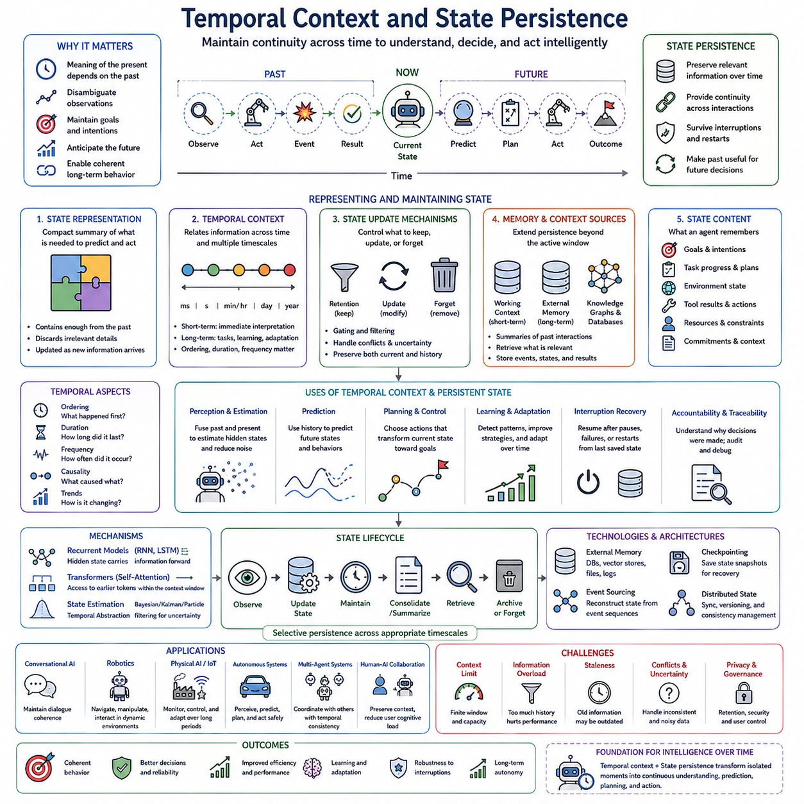{width="7.268055555555556in" height="7.268055555555556in"}

시간적 문맥(Temporal Context)은 정보, 사건, 행동 및 내부 상태가 시간에 걸쳐 어떻게 서로 연결되는지를 나타내는 표현입니다. 지능적 행동(Intelligent Behavior)은 현재 관측만으로 결정되는 경우가 드뭅니다. 현재 상황의 의미는 이전에 무엇이 발생했는지에 따라 달라지는 경우가 많기 때문입니다. 따라서 시스템은 현재 조건을 해석하고, 변화를 인식하고, 목표를 유지하며, 다음에 발생할 가능성이 있는 사건을 예측할 수 있도록 충분한 과거 정보를 보존해야 합니다.

상태 지속성(State Persistence)은 인지 시스템(Cognitive System) 또는 인공 시스템(Artificial System)이 관련 정보를 최초로 관측한 순간 이후에도 유지할 수 있는 능력을 의미합니다. 지속성이 없다면 각각의 새로운 입력이 사실상 시스템을 초기화하여 모든 상황을 독립적으로 해석하도록 만들게 됩니다. 지속적인 상태(Persistent State)는 이전 관측, 의사결정, 의도 및 결과가 이후의 처리와 행동에 영향을 줄 수 있도록 하여 연속성을 제공합니다.

시간적 문맥(Temporal Context)과 상태 지속성(State Persistence)은 밀접하게 관련되어 있지만 개념적으로는 서로 다릅니다. 시간적 문맥은 시간에 걸친 정보 사이의 관계를 설명하는 반면, 상태 지속성은 이러한 관계를 계속 사용할 수 있도록 표현을 유지하는 것과 관련됩니다. 시스템은 시간적 구조를 명시적으로 모델링하지 않고도 상태를 유지할 수 있지만, 정교한 시간적 추론(Temporal Reasoning)을 위해서는 지속적인 표현과 이러한 표현이 어떻게 변화하는지를 이해하는 메커니즘이 모두 필요합니다.

모호한 관측(Ambiguous Observations)을 해석할 때 시간적 문맥의 중요성이 명확하게 나타납니다. 움직이는 객체의 단일 이미지만으로는 전체 궤적(Trajectory)을 파악할 수 없지만 연속된 관측을 사용하면 방향과 속도를 추정할 수 있습니다. 마찬가지로 하나의 센서 측정값이 비정상적으로 보이더라도 그 상태가 일시적인지, 반복되는지 또는 점진적으로 악화되는지는 알 수 없습니다. 과거 문맥은 고립된 관측을 의미 있는 시간적 패턴(Temporal Patterns)으로 변환합니다.

인간 인지(Human Cognition)는 시간적 연속성(Temporal Continuity)에 크게 의존합니다. 지각(Perception)은 짧은 시간 간격에 걸쳐 정보를 통합하고, 작업 기억(Working Memory)은 진행 중인 작업에 필요한 정보를 유지하며, 일화 기억(Episodic Memory)은 경험을 보존하고, 장기 지식(Long-Term Knowledge)은 현재 사건의 해석에 영향을 줍니다. 이러한 메커니즘을 통해 인간은 세계를 서로 관련 없는 순간들의 집합이 아니라 연속적인 시퀀스로 경험할 수 있습니다.

시간적 문맥은 여러 시간 규모(Multiple Timescales)에서 작동할 수 있습니다. 밀리초 단위의 정보는 청각 지각과 운동 추정(Motion Estimation)에 중요할 수 있고, 수초 단위의 정보는 대화와 즉각적인 행동에 중요할 수 있으며, 수분 또는 수시간은 작업 진행 상태를 정의할 수 있습니다. 수일에서 수년에 걸친 정보는 학습과 장기 적응(Long-Term Adaptation)을 형성할 수 있습니다. 따라서 지능형 시스템은 서로 다른 시간 해상도(Temporal Resolution)의 문맥을 유지하는 다양한 메커니즘을 필요로 합니다.

단기 시간적 문맥(Short-Term Temporal Context)은 즉각적인 해석과 제어를 지원합니다. 최근 관측은 움직임, 변화, 상호작용 및 인과적 진행에 관한 정보를 제공합니다. 언어에서는 이전 토큰(Token)이 이후 표현의 의미를 결정합니다. 로보틱스(Robotics)에서는 최근 센서 측정값이 속도와 움직임을 추정하는 데 도움을 줍니다. 계획(Planning)에서는 최근 행동이 작업의 어떤 부분이 이미 완료되었는지를 나타냅니다.

더 긴 시간적 문맥(Longer Temporal Context)은 장시간에 걸친 활동의 연속성을 지원합니다. 복잡한 작업을 수행하는 에이전트(Agent)는 최초 목표, 이전에 이루어진 결정, 중간 결과, 실행 과정에서 발견된 제약조건 및 아직 해결되지 않은 문제를 기억해야 할 수 있습니다. 이러한 정보가 활성 상태에서 사라지면 에이전트는 행동을 반복하거나 이전 결정과 모순되는 행동을 하거나 최초 목표와의 정렬을 잃을 수 있습니다.

상태(State)는 미래 행동을 예측하거나 제어하는 데 필요한 정보를 압축하여 표현한 것으로 이해할 수 있습니다. 이상적인 시스템에서는 현재 상태가 과거의 관련 정보를 충분히 포함하므로 전체 과거 시퀀스를 반복적으로 처리하지 않고도 미래를 추론할 수 있습니다. 따라서 상태 표현(State Representation)은 원시 이력(Raw History)과 효율적인 의사결정 사이를 연결하는 역할을 합니다.

상태 표현의 품질은 어떤 정보를 보존하고 어떤 정보를 제거하는지에 따라 달라집니다. 지나치게 작은 상태는 중요한 과거 의존성(Historical Dependencies)을 누락할 수 있으며, 모든 정보를 유지하는 상태는 계산 비용이 커지고 사용하기 어려워질 수 있습니다. 따라서 효과적인 상태 구성(State Construction)은 과거 정보를 미래의 추론과 행동에 계속 관련되는 정보로 선택적으로 압축해야 합니다.

이러한 원리는 순환 신경망(Recurrent Neural Networks)에서 나타납니다. 순환 신경망에서는 새로운 입력이 들어올 때마다 은닉 상태(Hidden State)가 반복적으로 업데이트됩니다. 은닉 상태는 이전 처리 단계의 정보를 현재 계산으로 전달합니다. 기존의 순환 아키텍처가 매우 긴 의존성을 처리하는 데 어려움을 겪을 수 있지만, 이러한 구조는 순차적 지능(Sequential Intelligence)이 정보를 시간에 따라 전달하는 메커니즘을 필요로 한다는 기본적인 개념을 보여줍니다.

장단기 기억(Long Short-Term Memory, LSTM) 네트워크와 게이트 순환 아키텍처(Gated Recurrent Architectures)는 정보의 유지, 업데이트 및 망각을 제어하여 시간적 지속성을 향상시킵니다. 게이팅 메커니즘(Gating Mechanisms)은 이전 상태 정보 가운데 무엇을 계속 유지하고 새로운 정보 가운데 무엇을 내부 표현에 반영할지를 결정합니다. 이러한 아키텍처는 효과적인 시간 처리가 단순한 정보 보존이 아니라 제어된 상태 업데이트(Controlled State Updating)에 의존한다는 것을 보여줍니다.

트랜스포머(Transformer) 아키텍처는 시간적 문맥에 다른 방식으로 접근합니다. 하나의 순환 은닉 상태에 주로 의존하는 대신 자기 주의(Self-Attention)를 통해 사용 가능한 시퀀스 내부의 요소들을 직접 연결할 수 있습니다. 토큰은 문맥 창(Context Window) 내부의 이전 토큰 표현에 접근할 수 있으므로 비교적 먼 위치 사이의 관계를 모델링할 수 있습니다. 따라서 문맥 자체가 중요한 형태의 임시 상태(Temporary State)가 됩니다.

그러나 트랜스포머 문맥 창(Transformer Context Window)의 용량은 유한합니다. 상호작용이 사용 가능한 문맥보다 길어지면 초기 정보에 직접 접근할 수 없게 될 수 있습니다. 이러한 한계에 도달하기 전에도 지나치게 큰 문맥은 관련 없는 정보를 증가시키고 계산 요구량을 높일 수 있습니다. 따라서 지속형 시스템(Persistent Systems)은 계속 증가하는 토큰 시퀀스를 단순히 유지하는 것 이상의 메커니즘을 필요로 합니다.

요약(Summarization)은 상세한 과거 이력이 지나치게 커질 때 시간적 연속성을 유지할 수 있습니다. 이전 상호작용을 중요한 목표, 결정, 사건, 제약조건 및 해결되지 않은 문제를 포함하는 표현으로 압축할 수 있습니다. 이렇게 생성된 요약은 활성 문맥에 유지하면서 세부 기록은 다른 저장소에 보관할 수 있습니다. 이를 통해 반복적으로 처리해야 하는 과거 정보의 양을 줄이면서 연속성을 유지할 수 있습니다.

외부 기억(External Memory)은 활성 문맥 창을 넘어 상태 지속성을 확장하는 또 다른 메커니즘입니다. 과거 상호작용, 작업 상태, 관측, 계획 및 사건을 데이터베이스, 파일, 벡터 저장소(Vector Stores), 지식 그래프(Knowledge Graphs) 또는 전문 기억 시스템에 저장할 수 있습니다. 현재 상황에서 활성 문맥에 더 이상 존재하지 않는 정보가 필요하면 관련 레코드를 다시 검색할 수 있습니다.

지속적 에이전트 상태(Persistent Agent State)는 단순한 대화 이력(Conversation History)과 다릅니다. 대화 이력은 무엇이 전달되었는지를 기록하지만 에이전트 상태에는 현재 목표, 작업 진행 상태, 환경 조건, 도구 실행 결과(Tool Results), 사용 가능한 자원, 계획, 약속 및 내부 변수도 포함될 수 있습니다. 자율 에이전트(Autonomous Agent)는 현재 무엇이 사실이고 무엇을 앞으로 수행해야 하는지에 대한 운영적 표현(Operational Representation)을 필요로 합니다.

작업 상태(Task State)는 다단계 행동(Multi-Step Behavior)에서 특히 중요합니다. 복잡한 목표에는 완료된 단계, 현재 수행 중인 단계, 대기 중인 의존성, 실패, 대안 계획 및 완료 조건이 포함될 수 있습니다. 이러한 구조를 유지하면 에이전트가 중단 이후 작업을 다시 시작할 수 있고 이미 완료된 작업을 불필요하게 반복하는 것을 방지할 수 있습니다.

상태 지속성은 중단 복구(Interruption Recovery)도 지원합니다. 실제 시스템에서는 일시 정지, 통신 장애, 전원 재시작, 소프트웨어 재시작 또는 계산 프로세스 사이의 전환이 자주 발생할 수 있습니다. 중요한 상태가 임시 기억에만 존재하면 이러한 중단으로 작업의 연속성이 사라질 수 있습니다. 체크포인팅(Checkpointing)과 영구 저장(Persistent Storage)을 이용하면 시스템이 운영 상태를 재구성하고 적절한 지점에서 작업을 계속할 수 있습니다.

따라서 지속 상태(Persistent State)는 일시적 정보(Transient Information)와 지속적 정보(Durable Information)를 구별해야 합니다. 일부 값은 밀리초 동안만 유용하지만 다른 값은 수시간, 수일 또는 시스템 재시작 이후에도 유지되어야 합니다. 모든 상태 변수를 동일하게 취급하는 것은 비효율적입니다. 계층적 상태 관리(Hierarchical State Management)는 시간 규모, 중요도, 변동성 및 미래 활용 가능성에 따라 서로 다른 보존 정책(Retention Policies)을 적용할 수 있습니다.

시간적 순서(Temporal Ordering)는 또 다른 기본적인 요구사항입니다. 두 사건이 발생했다는 사실만 아는 것으로 충분하지 않은 경우가 많습니다. 시스템은 어떤 사건이 먼저 발생했는지, 두 사건 사이에 얼마나 많은 시간이 있었는지, 특정 사건이 다른 사건 이후 반복적으로 발생했는지를 알아야 할 수 있습니다. 타임스탬프(Timestamps), 시퀀스 식별자(Sequence Identifiers), 이벤트 그래프(Event Graphs), 시간 관계(Temporal Relations)를 이용하여 프로세스와 인과성을 추론하는 데 필요한 순서 정보를 보존할 수 있습니다.

지속 시간(Duration) 역시 중요합니다. 많은 상태는 얼마나 오랫동안 지속되는지에 따라 의미가 달라집니다. 순간적인 센서 급등은 잡음일 수 있지만 동일한 값이 수분 동안 지속되면 실제 고장을 나타낼 수 있습니다. 사람이 잠시 로봇 주변에 서 있는 것과 계획된 경로를 지속적으로 점유하는 것은 서로 다른 상황입니다. 따라서 시간적 추론은 사건의 발생뿐 아니라 지속성(Persistence)도 표현해야 합니다.

빈도(Frequency)와 반복성(Recurrence)은 추가적인 시간 정보를 제공합니다. 반복되는 사건은 개별 관측에서는 발견할 수 없는 패턴을 보여줄 수 있습니다. 몇 시간마다 비정상적인 진동이 발생하는 기계, 특정 작업 단계에서 반복적으로 실패하는 에이전트 또는 예측 가능한 시간에 나타나는 장애물은 내부적인 구조를 나타낼 수 있습니다. 지속적인 이력(Persistent Histories)을 통해 이러한 반복 패턴을 탐지할 수 있습니다.

시간적 문맥은 인과 추론(Causal Reasoning)에도 필수적입니다. 두 변수가 상관관계를 갖는다는 이유만으로 일반적으로 인과성을 확립할 수는 없지만 원인은 결과보다 먼저 발생해야 하므로 시간적 순서는 중요한 증거를 제공합니다. 에이전트는 행동과 결과의 이력을 사용하여 특정 개입(Intervention)이 특정 상태 전이(State Transition)를 일관되게 발생시키는지를 평가할 수 있습니다.

따라서 행동 이력(Action History)은 에이전트 상태의 중요한 구성 요소입니다. 에이전트는 환경이 현재 어떻게 보이는지만이 아니라 이전에 어떤 행동을 수행했는지도 알아야 하는 경우가 많습니다. 동일한 관측이라도 에이전트가 특정 행동을 이미 시도했는지, 해당 행동이 성공했는지, 그리고 어떤 결과가 뒤따랐는지에 따라 서로 다른 대응이 필요할 수 있습니다.

도구 사용 에이전트(Tool-Using Agents)는 지속적인 행동 상태(Persistent Action State)의 이점을 특히 크게 얻을 수 있습니다. 에이전트가 외부 도구를 호출하고, 요청을 전송하고, 파일을 수정하고, 명령을 실행하거나 다른 시스템과 통신하는 경우 이러한 작업의 기록을 유지해야 합니다. 그렇지 않으면 문맥 손실로 인해 중복 실행, 일관되지 않은 업데이트 또는 이미 완료된 작업에 대한 잘못된 가정이 발생할 수 있습니다.

시간적 문맥은 대화의 일관성(Conversational Coherence)도 지원합니다. 대명사, 참조, 약속, 수정사항, 선호도 및 해결되지 않은 질문은 이전 상호작용에 의존하는 경우가 많습니다. 이러한 이력을 잃어버린 언어 에이전트(Language Agent)는 개별적으로는 그럴듯한 문장을 생성하더라도 전체 대화에 걸쳐 일관된 행동을 유지하지 못할 수 있습니다.

장시간 실행되는 에이전트(Long-Running Agents)는 개별 대화를 넘어서는 연속성을 필요로 합니다. 지속형 시스템은 수주 또는 수개월에 걸쳐 사용자, 기계 또는 환경과 상호작용할 수 있습니다. 관련된 장기 관계를 유지하면서 현재 정보와 과거 정보를 구별해야 합니다. 이를 위해서는 원시 상호작용 로그를 무기한 축적하는 방식이 아니라 기억 수명주기 관리(Memory Lifecycle Management)가 필요합니다.

정보가 변화하는 경우 시간적 유효성(Temporal Validity)이 중요해집니다. 어떤 정보는 저장될 당시에는 정확했지만 현재 세계를 더 이상 올바르게 설명하지 못할 수 있습니다. 따라서 지속형 시스템은 정보를 시간, 버전(Version), 신뢰도(Confidence) 또는 유효 조건(Validity Conditions)과 연결해야 합니다. 검색 과정에서는 정보가 의미적으로 관련되는지뿐 아니라 현재 시점에도 시간적으로 적절한지를 고려해야 합니다.

상태 업데이트(State Updates)는 상충하는 관측도 처리해야 합니다. 로봇은 복도가 비어 있다고 기억하고 있었지만 이후 해당 복도가 막혀 있음을 관측할 수 있습니다. 새로운 관측은 과거 기록을 반드시 삭제하지 않으면서 운영 상태를 업데이트해야 합니다. 현재 상태(Current State)와 상태 이력(State History)을 모두 유지하면 시스템은 현재 조건에 따라 행동하면서 해당 조건이 어떻게 변화했는지도 추론할 수 있습니다.

현재 상태와 과거 상태(Historical State)의 구분은 동적 환경(Dynamic Environments)에서 매우 중요합니다. 현재 상태는 시스템이 지금 무엇이 사실이라고 판단하는지를 나타내고, 과거 상태는 이전에 무엇이 사실이라고 판단하거나 관측했는지를 기록합니다. 이 둘을 혼동하면 오래된 정보가 현재의 의사결정에 잘못된 영향을 줄 수 있습니다.

실제 환경 상태를 직접 관측할 수 없는 경우에는 상태 추정(State Estimation)이 필요합니다. 센서는 부분적이고 잡음이 있으며 때로는 서로 모순되는 증거를 제공합니다. 시스템은 현재 관측과 이전 추정값을 결합하여 실제 상태에 대한 더욱 신뢰할 수 있는 표현을 추론해야 합니다. 따라서 시간적 연속성은 단순히 기억뿐 아니라 지각 자체의 성능도 향상시킬 수 있습니다.

확률적 상태 추정(Probabilistic State Estimation)은 가능한 상태에 대한 불확실성을 표현하고 새로운 증거가 들어올 때 이를 업데이트함으로써 이러한 개념을 형식화합니다. 베이지안 필터링(Bayesian Filtering), 칼만 필터링(Kalman Filtering), 파티클 필터링(Particle Filtering) 및 관련 기법은 이전 상태 추정과 관측 및 전이 모델(Transition Models)을 함께 사용하여 변화하는 시스템에 대한 믿음(Beliefs)을 유지합니다.

부분 관측 환경(Partially Observable Environments)에서는 상태 지속성이 특히 중요합니다. 에이전트가 특정 순간에 환경의 일부만 관측할 수 있다면 객체가 센서 범위를 벗어난 이후에도 이전 관측 정보가 계속 필요할 수 있습니다. 기억을 사용하면 에이전트는 관측되지 않는 정보가 존재하지 않게 되었다고 가정하는 대신 숨겨져 있거나 일시적으로 관측되지 않는 개체에 대한 믿음을 유지할 수 있습니다.

객체 영속성(Object Permanence)은 간단한 사례입니다. 로봇이 상자가 다른 객체 뒤에 놓이는 것을 관측했다면 상자가 더 이상 보이지 않는다고 해서 사라졌다고 가정해서는 안 됩니다. 지속적인 객체 표현(Persistent Object Representations)은 일시적인 가림(Occlusion) 동안에도 객체의 정체성, 추정 위치, 속성 및 불확실성을 유지할 수 있습니다.

체화 지능(Embodied Intelligence)에서는 공간적 지속성(Spatial Persistence)과 시간적 지속성이 자연스럽게 상호작용합니다. 로봇은 공간을 이동하는 동시에 환경은 시간에 따라 변화합니다. 따라서 지도(Maps)는 객체와 영역이 어디에 위치하는지뿐 아니라 해당 표현이 여전히 유효한지도 나타내야 합니다. 고정 인프라, 이동 가능한 가구, 사람, 차량, 임시 장애물 및 기상 조건은 서로 매우 다른 지속성 특성을 가집니다.

동적 지도(Dynamic Maps)는 공간 개체를 시간적 속성과 연결할 수 있습니다. 하나의 영구적으로 유효한 환경 표현을 저장하는 대신 시스템은 안정적인 지도 구성 요소와 동적 계층(Dynamic Layers) 또는 시간 의존적 객체 상태(Time-Dependent Object States)를 함께 유지할 수 있습니다. 이를 통해 내비게이션 시스템은 장기적인 구조와 일시적인 환경 조건을 구별할 수 있습니다.

피지컬 AI(Physical AI)는 행동의 물리적 결과가 계산 종료 이후에도 지속되기 때문에 특히 강력한 시간적 상태 관리(Temporal State Management)를 필요로 합니다. 로봇이 객체를 이동시키거나, 문을 열거나, 기계 설정을 변경하거나, 물품을 전달하면 환경 자체가 변화합니다. 에이전트의 내부 상태가 이러한 변화를 반영하지 않으면 이후의 추론이 오래된 세계 표현을 기반으로 이루어질 수 있습니다.

시간적 문맥은 움직임 예측(Motion Prediction)도 가능하게 합니다. 보행자, 차량, 로봇 또는 조작되는 객체의 미래 위치는 최근 궤적과 상호작용 이력에 의존합니다. 현재 위치만으로는 충분하지 않습니다. 과거 상태는 속도, 가속도, 행동 추세 및 문맥적 단서를 제공하여 미래 움직임을 예측하는 데 도움을 줄 수 있습니다.

월드 모델(World Models)은 근본적으로 시간적 상태 전이(Temporal State Transitions)에 의존합니다. 월드 모델은 현재 상태가 가능한 미래 상태로 어떻게 변화하는지를 표현하며, 이러한 변화는 행동을 조건으로 할 수 있습니다. 과거 시퀀스는 이러한 전이 동역학(Transition Dynamics)에 대한 증거를 제공합니다. 상태 지속성은 예측이 고립된 관측이 아니라 계속 변화하는 표현을 기반으로 이루어지도록 합니다.

예측(Prediction)은 시간적 문맥을 미래 방향으로 확장합니다. 과거 관측은 현재 상태를 구성하고, 현재 상태는 미래 조건에 대한 추정을 지원합니다. 따라서 지능적 행동은 기억된 과거(Remembered Past), 추정된 현재(Estimated Present), 예측된 미래(Predicted Future)를 연결하는 시간적 연쇄(Temporal Chain)를 따라 작동합니다.

계획(Planning)은 이러한 시간적 연쇄를 이용하여 가능한 행동을 평가합니다. 에이전트는 서로 다른 행동이 현재 상태를 어떻게 변화시킬 수 있는지 그리고 그 결과로 나타나는 미래 상태가 목표를 만족시키는지를 고려합니다. 따라서 계획에는 지속적인 목표, 현재 상태 추정, 행동 이력, 예측 모델 및 목표 달성 여부를 판단하는 기준이 필요합니다.

계층적 계획(Hierarchical Planning)은 여러 시간 범위(Temporal Horizons)를 도입합니다. 저수준 제어(Low-Level Control)는 밀리초 또는 수초의 미래를 추론할 수 있고, 지역 계획(Local Planning)은 수십 초 또는 수분을 고려할 수 있으며, 전략적 계획(Strategic Planning)은 수시간, 수일 또는 그 이상의 기간까지 확장될 수 있습니다. 지속 상태는 모든 구성 요소가 전체 이력을 처리하도록 하지 않으면서 각 수준에 적절한 정보를 제공해야 합니다.

시간적 추상화(Temporal Abstraction)는 이러한 복잡성을 감소시킬 수 있습니다. 모든 저수준 관측을 개별적으로 표현하는 대신 시스템은 시퀀스를 사건, 행동, 에피소드(Episodes), 단계(Phases) 또는 작업으로 구성할 수 있습니다. 긴 모터 명령 시퀀스를 하나의 조작 행동으로 표현하거나 수많은 내비게이션 업데이트를 하나의 완료된 경로 구간으로 표현할 수 있습니다. 그러면 고수준 추론(High-Level Reasoning)은 이러한 추상화를 기반으로 작동할 수 있습니다.

이벤트 기반 기억(Event-Based Memory)은 연속적인 상태 표현을 보완합니다. 일부 정보는 변화하는 수치 상태로 자연스럽게 표현되지만 다른 정보는 작업 시작, 객체 탐지, 도구 실패, 목표 변경 또는 배송 완료와 같은 이산 사건(Discrete Events)으로 기록하는 것이 더욱 효율적입니다. 상태 표현과 이벤트 표현을 결합하면 시간적 행동을 더욱 풍부하게 표현할 수 있습니다.

상태 지속성은 분기되는 가능성(Branching Possibilities)도 고려해야 합니다. 불확실한 사건이 발생하기 전에는 여러 미래 상태가 가능할 수 있습니다. 따라서 계획 및 예측 시스템은 하나의 결정론적 미래(Deterministic Future)가 아니라 여러 대안 가설 또는 궤적을 유지할 수 있습니다. 새로운 관측이 들어오면 가능성이 낮은 가설의 비중은 감소하고 더 일관된 가설의 신뢰도는 증가할 수 있습니다.

불확실성(Uncertainty)은 상태 정보와 함께 지속되어야 합니다. 객체의 위치가 불확실한데 추정 좌표만 저장하면 잘못된 확신(False Confidence)을 발생시킬 수 있습니다. 이상적인 지속 상태는 불확실성, 증거 품질(Evidence Quality), 출처 정보를 함께 유지하여 이후의 추론 과정에서 새로운 관측이 필요한지를 판단할 수 있도록 해야 합니다.

시간적 문맥은 성능 저하(Degradation)와 장기적인 추세(Long-Term Trends)도 발견할 수 있습니다. 시스템은 특정 순간에는 정상적으로 보이면서도 수주 또는 수개월 동안 점진적으로 변화할 수 있습니다. 지속적인 운영 이력(Operational Histories)을 이용하면 에이전트가 배터리 성능 감소, 기계 진동 증가, 센서 드리프트(Sensor Drift), 반복적인 소프트웨어 장애 또는 작업 완료 시간의 변화를 탐지할 수 있습니다.

이러한 특성으로 인해 시간적 지속성은 예지 정비(Predictive Maintenance)에 유용합니다. 지능형 시스템은 현재 측정값을 과거 기준선(Historical Baselines) 및 추세와 비교하여 고정된 임계값을 초과하기 전에 초기 고장 징후를 식별할 수 있습니다. 따라서 현재 데이터의 의미는 이전 상태와의 관계를 통해 부분적으로 결정됩니다.

다중 에이전트 시스템(Multi-Agent Systems) 역시 시간적 조정(Temporal Coordination)을 필요로 합니다. 서로 다른 에이전트는 서로 다른 시간에 사건을 관측하고, 통신 지연을 경험하며, 환경에 대해 부분적으로 일치하지 않는 관점을 유지할 수 있습니다. 공유 타임스탬프, 동기화된 시계(Synchronized Clocks), 이벤트 순서, 상태 버전(State Versions), 업데이트 프로토콜을 이용하면 일관된 공유 표현을 구축하는 데 도움을 줄 수 있습니다.

분산 상태(Distributed State)는 일관성 문제를 발생시킵니다. 하나의 에이전트가 정보를 업데이트하는 동안 다른 에이전트는 이전 버전을 기반으로 계속 작동할 수 있습니다. 시스템은 강한 동기화(Strong Synchronization)가 필요한 상황과 일시적인 불일치를 허용할 수 있는 상황을 결정해야 합니다. 이러한 상충 관계는 통신 대역폭, 지연 시간, 강건성(Robustness), 협업 성능에 영향을 줍니다.

시간적 상태는 인간-AI 협업(Human-AI Collaboration)에서도 중요합니다. 사용자는 시스템이 이전 결정사항을 기억하고, 진행 중인 작업을 유지하고, 완료된 행동을 인식하며, 중단 이후에도 연속성을 유지하기를 기대합니다. 이미 제공된 정보를 반복적으로 요구하거나 설정된 제약조건을 잊는 시스템은 인간 협력자의 인지적 작업 부하를 증가시킵니다.

그러나 지속 상태(Persistent State)는 신중한 거버넌스(Governance)를 필요로 합니다. 모든 과거 세부 정보가 무기한 접근 가능한 상태로 남아 있어야 하는 것은 아닙니다. 보존 정책은 관련성, 개인정보 보호(Privacy), 보안(Security), 운영 요구사항 및 사용자 제어(User Control)를 반영해야 합니다. 따라서 시간적 연속성은 적절한 망각(Forgetting) 및 삭제(Deletion)와 균형을 이루어야 합니다.

시간적 지속성의 설계는 하나의 수명주기(Lifecycle)로 볼 수 있습니다. 정보가 관측되고, 현재 상태에 통합되고, 관련성이 있는 동안 유지되며, 유용한 경우 장기 표현으로 통합(Consolidation)되고, 조건이 변화하면 업데이트되고, 필요할 때 검색되며, 최종적으로 보관(Archive)되거나 망각됩니다. 각각의 단계는 이후 추론의 신뢰성에 영향을 줍니다.

어느 한 단계에서의 실패도 시간적 일관성(Temporal Coherence)을 방해할 수 있습니다. 누락된 관측은 불완전한 상태를 만들고, 잘못된 업데이트는 오류를 전파하며, 과도한 보존은 오래된 정보를 유지하고, 부실한 검색은 관련된 이력을 찾지 못하게 하며, 지나친 망각은 필요한 연속성을 파괴할 수 있습니다. 따라서 강건한 에이전트는 명시적인 상태 검증(State Validation) 및 복구(Recovery) 메커니즘을 필요로 합니다.

체크포인팅(Checkpointing)은 실용적인 신뢰성 메커니즘 가운데 하나입니다. 중요한 작업 상태를 주기적으로 저장하여 에이전트가 장애 또는 중단 이후 복구할 수 있도록 합니다. 체크포인트(Checkpoint)에는 현재 목표, 완료된 행동, 대기 중인 작업, 관련 기억 참조, 환경 상태 및 도구 실행 상태가 포함될 수 있습니다. 복구 과정에서는 이를 이용하여 일관된 운영 문맥을 재구성할 수 있습니다.

이벤트 소싱(Event Sourcing)은 기록된 사건의 시간순 시퀀스로부터 상태를 재구성하는 또 다른 접근 방법입니다. 최신 상태만 저장하는 대신 시스템은 해당 상태를 만들어낸 변화들을 보존합니다. 이를 통해 추적 가능성(Traceability)을 확보하고 과거 상태를 재구성할 수 있지만, 긴 이벤트 이력을 효율적으로 처리하려면 스냅샷(Snapshots)이나 통합이 필요할 수 있습니다.

시간적 추적 가능성(Temporal Traceability)은 안전 중요 시스템(Safety-Critical Systems)과 책임성이 요구되는 시스템에서 특히 중요합니다. 에이전트가 중요한 의사결정을 내렸을 때 개발자나 운영자는 당시 어떤 정보가 이용 가능했는지, 어떤 상태를 사실이라고 판단했는지, 어떤 행동이 해당 결정에 선행했는지, 환경이 어떻게 반응했는지를 확인해야 할 수 있습니다. 지속적인 시간 기록은 이러한 분석을 지원합니다.

따라서 시간적 문맥(Temporal Context), 기억(Memory), 주의(Attention)는 함께 작동해야 합니다. 기억은 시간에 걸쳐 정보를 보존하고, 시간적 표현(Temporal Representation)은 사건과 상태 사이의 관계를 조직하며, 주의는 이러한 이력 가운데 현재 처리에 가장 관련성이 높은 부분을 결정합니다. 이러한 메커니즘 가운데 어느 하나만으로는 완전한 시간적 지능(Temporal Intelligence)을 제공할 수 없습니다.

선택성(Selectivity) 역시 중요합니다. 무제한적인 지속성은 현실적이지도 바람직하지도 않기 때문입니다. 시스템은 미래 예측, 계획, 학습, 책임성 또는 복구를 지원하는 정보를 보존하면서 중복되거나 오래된 세부 정보를 감소시켜야 합니다. 따라서 지능적 지속성(Intelligent Persistence)은 모든 과거를 완전하게 보존하는 것이 아니라 선택적 지속성(Selective Persistence)으로 이해해야 합니다.

고급 에이전트(Advanced Agents)는 궁극적으로 자신의 시간적 상태를 관리하는 방법 자체를 학습할 수 있습니다. 어떤 정보가 장기적으로 유용할 가능성이 높은지를 추정하고, 언제 체크포인트를 생성해야 하는지 결정하고, 과거 정보가 언제 오래되어 더 이상 유효하지 않은지를 판단하며, 적절한 시간 해상도를 동적으로 선택할 수 있습니다. 그러면 상태 관리(State Management) 자체가 에이전트의 학습된 인지 제어(Learned Cognitive Control)의 일부가 됩니다.

체화 에이전트(Embodied Agents)에서 이러한 적응형 상태 관리(Adaptive State Management)는 지각, 기억, 월드 모델링(World Modeling), 계획 및 제어를 하나의 연속적인 루프로 연결할 수 있습니다. 관측은 현재 상태를 업데이트하고, 지속적 기억은 관련된 과거 정보를 제공하며, 월드 모델은 미래의 상태 전이를 예측하고, 계획은 행동을 선택하며, 물리적 결과는 다시 새로운 관측을 생성하여 상태를 업데이트합니다.

이러한 루프는 시간적 문맥이 자율 지능(Autonomous Intelligence)의 근본적인 요소인 이유를 보여줍니다. 지능은 하나의 순간에 존재하는 정보만을 기반으로 작동하지 않습니다. 현재가 과거로부터 어떻게 형성되었는지, 과거의 어떤 요소가 여전히 관련성이 있는지, 현재의 행동이 세계를 어떻게 변화시키는지, 그리고 그 결과 어떤 미래 상태가 나타날 가능성이 있는지를 이해해야 합니다.

따라서 시간적 문맥(Temporal Context)과 상태 지속성(State Persistence)은 시간에 걸쳐 일관된 지능(Coherent Intelligence)을 구현하는 데 필요한 연속성을 제공합니다. 이들은 고립된 관측을 시퀀스로, 시퀀스를 상태와 사건으로, 과거 상태를 예측 지식(Predictive Knowledge)으로, 예측을 목표 지향적 행동(Goal-Directed Action)으로 변환합니다. LLM 에이전트(LLM Agents), 로보틱스(Robotics), 피지컬 AI(Physical AI)에서 지속적인 시간 상태(Persistent Temporal State)는 기억, 적응, 계획, 월드 모델링 및 장기 자율성(Long-Term Autonomy)을 위한 핵심 기반을 형성합니다.

## 02.12 Memory Consolidation and Replay [w/Code]

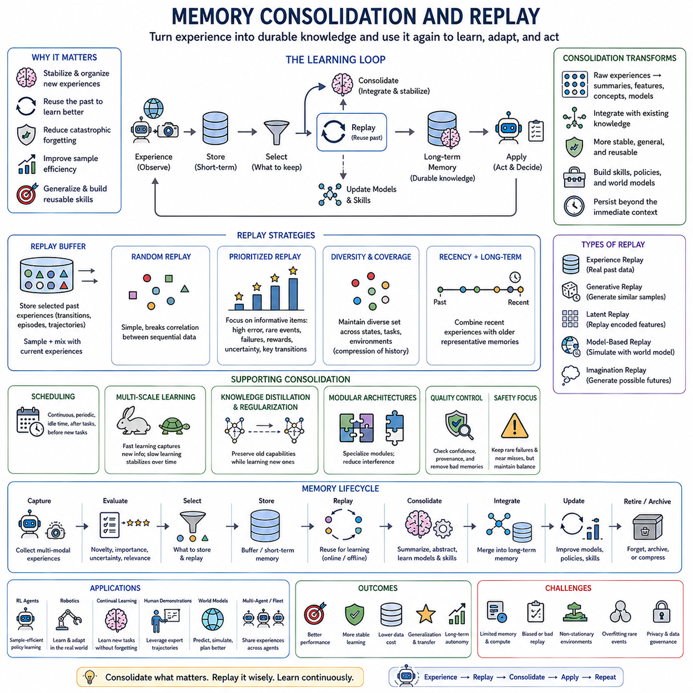{width="7.268055555555556in" height="7.268055555555556in"}

기억 통합(Memory Consolidation)은 새롭게 획득한 정보를 보다 안정적이고 조직화되며 재사용 가능한 표현으로 변환하는 과정입니다. 초기 경험은 세부적이고 단편적이며 중복적일 수 있고 특정 문맥에 강하게 연결되어 있을 수 있습니다. 기억 통합은 이러한 경험에서 유용한 구조를 점진적으로 추출하여 정보가 즉각적인 상황을 넘어 유지되고 향후 추론, 학습, 예측 및 행동을 지원할 수 있도록 합니다.

재현(Replay)은 이전에 경험한 사건, 상태, 행동 또는 표현을 원래 발생 시점 이후에 다시 활성화하는 보완적인 메커니즘입니다. 시스템은 현재의 관측 흐름에서만 학습하는 대신 선택된 과거 경험을 다시 불러와 학습에 재사용할 수 있습니다. 따라서 재현은 중요한 정보가 시스템에 여러 차례 영향을 줄 수 있도록 하여 경험의 실질적인 가치를 증가시킵니다.

기억 통합(Memory Consolidation)과 재현(Replay)은 재현이 기억 통합에 필요한 정보를 제공할 수 있기 때문에 밀접하게 연결되어 있습니다. 과거 경험을 반복적으로 재활성화하면 학습 시스템은 유용한 표현을 강화하고, 반복되는 패턴을 식별하며, 새로운 지식을 기존 지식과 통합하고, 개별 관측에 대한 의존성을 감소시킬 수 있습니다. 기억 통합은 무엇이 지속적인 지식으로 남을지를 결정하고, 재현은 이러한 변환을 반복적으로 수행할 기회를 제공합니다.

인간 인지(Human Cognition)에서 기억 통합은 일반적으로 시간이 지남에 따라 기억이 안정화되고 재구성되는 과정과 관련됩니다. 새롭게 획득한 경험은 초기에는 일시적인 신경 표현(Neural Representations)에 크게 의존하지만 이후의 처리를 통해 이러한 경험의 일부가 더욱 분산된 지식 구조로 통합될 수 있습니다. 수면(Sleep), 휴식(Rest), 반복적인 검색(Retrieval), 후속 경험은 모두 기억이 안정되고 재구성되는 방식에 영향을 줄 수 있습니다.

생물학적 시스템(Biological Systems)의 재현은 인공지능(Artificial Intelligence)에 중요한 개념적 모델을 제공합니다. 이전 경험과 관련된 신경 활동 패턴은 원래 사건이 더 이상 발생하지 않는 상황에서도 다시 활성화될 수 있습니다. 이러한 재활성화는 과거 경험이 최초 경험 순간을 넘어 신경 적응(Neural Adaptation)에 영향을 주도록 함으로써 학습과 기억 조직화를 지원하는 것으로 여겨집니다.

인공 학습 시스템(Artificial Learning Systems)도 이와 유사한 문제에 직면합니다. 데이터가 순차적으로 들어오는 경우 시스템은 최근 정보에 강하게 적응하면서 이전 데이터에서 학습한 표현을 약화시킬 수 있습니다. 이러한 문제는 전체 과거 데이터셋을 반복적으로 다시 학습하지 않으면서 장기간에 걸쳐 새로운 능력을 획득해야 하는 지속 학습(Continual Learning)에서 특히 중요합니다.

치명적 망각(Catastrophic Forgetting)은 새로운 정보를 학습하는 과정에서 이전에 획득한 능력이 크게 손상되는 현상입니다. 신경망(Neural Networks)은 동일한 파라미터가 여러 작업이나 표현에 동시에 기여할 수 있기 때문에 이러한 문제에 특히 취약합니다. 새로운 작업을 위해 파라미터를 업데이트하면 이전 작업에 중요했던 구조가 덮어써져 기존에 학습된 지식의 성능이 저하될 수 있습니다.

재현(Replay)은 치명적 망각을 감소시키는 가장 실용적인 접근 방법 가운데 하나입니다. 새로운 정보를 학습하는 동안 시스템은 과거 경험에서 선택된 대표적인 샘플도 다시 학습할 수 있습니다. 이러한 재현 샘플은 모델이 이전 지식을 다시 참조하도록 하고 새로운 학습이 이미 확립된 표현을 완전히 지배하지 않도록 파라미터 업데이트를 제약합니다.

경험 재현(Experience Replay)은 선택된 과거 경험을 재현 버퍼(Replay Buffer)에 저장합니다. 이후 학습 과정에서 이 버퍼로부터 샘플을 선택하여 현재 경험과 혼합합니다. 따라서 모델은 가장 최근의 관측만이 아니라 현재 정보와 과거 정보를 모두 포함하는 분포에서 학습합니다. 이러한 원리는 강화학습(Reinforcement Learning), 지속 학습, 로보틱스(Robotics), 적응형 에이전트(Adaptive Agents)에서 광범위하게 활용될 수 있습니다.

재현 버퍼는 일반적으로 모든 경험을 무기한 보존할 수 없습니다. 장시간 실행되는 시스템은 수백만 또는 수십억 개의 관측, 행동, 상호작용 및 상태 전이(State Transitions)를 생성할 수 있습니다. 따라서 기억 용량, 저장 대역폭(Storage Bandwidth), 학습 비용 때문에 선택적 보존(Selective Retention)이 필요합니다. 재현 시스템의 설계는 경험을 어떻게 저장하는지뿐 아니라 어떤 경험을 지속적으로 접근 가능한 상태로 유지할 가치가 있는지를 결정해야 합니다.

무작위 재현(Random Replay)은 특정 샘플에 높은 우선순위를 부여하지 않고 저장된 경험을 선택합니다. 이 방법은 단순하며 연속적인 관측 사이의 상관관계를 감소시키는 데 도움을 줄 수 있습니다. 강화학습에서는 과거 전이(Transitions)를 무작위로 샘플링함으로써 현재 정책(Policy)이 생성한 시간적으로 인접한 경험만 반복 학습하는 것보다 안정적인 학습 분포를 형성할 수 있습니다.

우선순위 재현(Prioritized Replay)은 특히 유용하다고 판단되는 경험에 더 높은 샘플링 확률을 부여합니다. 큰 예측 오류(Prediction Errors), 예상하지 못한 결과, 희귀 사건, 실패, 보상(Rewards), 불확실성 또는 중요한 상태 전이와 관련된 샘플은 더 높은 우선순위를 받을 수 있습니다. 모든 경험이 미래 학습에 동일하게 기여하지 않으므로 재현 자원을 더 큰 가치를 제공하는 경험에 집중한다는 원리입니다.

그러나 지나친 우선순위화(Excessive Prioritization)는 학습 분포를 왜곡할 수 있습니다. 비정상적이거나 오류가 큰 경험을 지나치게 자주 재현하면 시스템이 일반적인 행동을 충분히 학습하지 못하고 희귀 사례에 과적합(Overfitting)될 수 있습니다. 따라서 효과적인 재현은 중요도와 다양성(Diversity)의 균형을 유지하여 중요한 사건과 환경의 전반적인 구조를 모두 표현할 필요가 있습니다.

다양성은 기억 통합에서 특히 중요합니다. 거의 동일한 경험을 반복적으로 재현하면 추가적으로 얻을 수 있는 정보가 제한되지만, 더 적은 수의 대표 경험이 상태, 작업, 환경 및 결과의 넓은 범위를 포괄할 수 있습니다. 따라서 기억 선택은 시스템이 과거 경험의 가장 유용하고 정보량이 높은 범위를 보존하려는 압축 문제(Compression Problem)로 볼 수 있습니다.

저수지 샘플링(Reservoir Sampling)은 지속적으로 증가하는 데이터 스트림에서 대표 샘플을 유지하는 하나의 전략입니다. 최근 관측만 저장하는 대신 시스템은 전체 이력에 걸쳐 경험을 확률적으로 유지합니다. 이를 통해 제한된 기억이 최신 데이터에 지나치게 지배되는 현상을 줄이고 초기 학습 단계의 사례도 보존할 수 있습니다.

그러나 동적 환경(Dynamic Environments)에서는 최근성(Recency) 역시 중요합니다. 최근 경험이 매우 오래된 관측보다 현재의 운영 조건을 더 정확하게 설명할 수 있기 때문입니다. 따라서 유용한 재현 시스템은 최근 경험과 오래된 대표 기억을 결합할 수 있습니다. 이러한 균형을 통해 시스템은 과거 조건에서 획득한 능력을 완전히 잊지 않으면서 환경 변화에 적응할 수 있습니다.

기억 통합은 여러 추상화 수준(Levels of Abstraction)에서 발생할 수 있습니다. 초기에는 원시 관측(Raw Observations)을 보존할 수 있지만 장기 기억에 항상 완전한 원본 데이터가 필요한 것은 아닙니다. 여러 경험을 요약, 프로토타입(Prototypes), 개념, 학습된 특징, 정책, 환경 모델 또는 재사용 가능한 기술(Skills)로 변환할 수 있습니다. 따라서 기억 통합은 저장 용량을 감소시키면서 보존되는 지식의 일반성을 증가시킬 수 있습니다.

의미적 통합(Semantic Consolidation)은 반복적인 경험을 일반화된 지식으로 변환합니다. 에이전트가 서로 다른 상황에서 유사한 관계를 반복적으로 관측하면 이러한 경험을 통해 특정 에피소드 하나에 종속되지 않는 더욱 추상적인 표현을 형성할 수 있습니다. 이러한 추상화를 통해 개별 사건에서 획득한 지식을 다양한 미래 문맥에서 재사용할 수 있습니다.

일화적 통합(Episodic Consolidation)은 개별적인 세부 정보가 계속 중요한 특정 경험을 보존합니다. 실패, 특이한 사건, 성공적인 전략, 중요한 상호작용 또는 안전 중요 상황(Safety-Critical Situations)은 희귀하더라도 장기적으로 보존할 가치가 있을 수 있습니다. 따라서 지능형 기억 시스템은 일반화된 의미 지식과 선택된 고가치 에피소드(High-Value Episodes)를 함께 유지하는 것이 유리합니다.

절차적 통합(Procedural Consolidation)은 반복적으로 성공한 행동을 재사용 가능한 절차나 기술로 변환합니다. 초기에는 많은 추론을 요구하던 시퀀스가 점차 더 압축된 정책, 워크플로(Workflow) 또는 행동 패턴으로 표현될 수 있습니다. 이를 통해 반복 작업에 필요한 계산 노력을 줄이고 고수준 추론이 개별 저수준 행동이 아니라 학습된 기술을 기반으로 작동할 수 있습니다.

재현은 성공적인 행동 시퀀스를 반복적으로 시스템에 제공함으로써 절차 학습(Procedural Learning)을 지원할 수 있습니다. 에이전트는 상태, 행동 및 결과 사이의 관계를 강화하고 점진적으로 정책을 개선할 수 있습니다. 실패한 행동 시퀀스 역시 위험한 상태, 잘못된 가정 또는 피해야 할 전략에 관한 유용한 정보를 제공하는 경우 재현할 수 있습니다.

강화학습(Reinforcement Learning)은 환경과의 상호작용에 높은 비용이 발생하고 경험이 시간적으로 강하게 상관될 수 있기 때문에 경험 재현을 광범위하게 사용합니다. 하나의 전이(Transition)는 일반적으로 상태(State), 행동(Action), 보상(Reward), 다음 상태(Next State), 종료 정보(Termination Information)를 포함합니다. 이러한 전이를 저장하면 학습 알고리즘은 각각의 파라미터 업데이트를 위해 새로운 물리적 또는 시뮬레이션 경험을 생성하지 않고도 이전 상호작용을 재사용할 수 있습니다.

로보틱스에서는 이러한 재사용을 통해 데이터 효율성(Data Efficiency)을 크게 향상시킬 수 있습니다. 물리적 상호작용은 시간, 에너지, 하드웨어 수명 및 운영 자원을 소비하며 일부 경험에는 위험도 포함될 수 있습니다. 이전에 수집된 로봇 궤적(Robot Trajectories)을 재현하면 실제 환경에서 모든 행동을 물리적으로 반복하지 않고도 학습 알고리즘이 추가적인 학습 가치를 얻을 수 있습니다.

오프라인 강화학습(Offline Reinforcement Learning)은 학습 중 환경과 지속적으로 상호작용할 필요 없이 이전에 수집된 데이터셋으로부터 학습함으로써 이러한 원리를 확장합니다. 과거 로봇 궤적, 인간 시연(Human Demonstrations), 원격조작 데이터(Teleoperation Data), 생산 로그(Production Logs), 시뮬레이션 경험은 모두 재현 가능한 행동 지식의 원천이 될 수 있습니다. 데이터셋의 품질과 범위는 학습 가능한 능력에 큰 영향을 줍니다.

인간 시연은 자율 탐색(Autonomous Exploration)만으로는 발견하는 데 오랜 시간이 걸릴 수 있는 작업 전략을 포함하기 때문에 특히 가치 있는 기억이 될 수 있습니다. 시연을 재현하면 에이전트가 유용한 행동 패턴을 학습하고 어려운 상태에서 회복하며 성공적인 작업 구조를 이해하도록 도울 수 있습니다. 시연 재현은 자율적으로 생성된 경험과 결합하여 에이전트가 초기 사례를 넘어 점진적으로 능력을 확장하도록 할 수도 있습니다.

재현은 저장된 원시 데이터를 직접 다시 사용하는 방식으로만 이루어질 필요는 없습니다. 생성적 재현(Generative Replay)은 학습된 생성 모델(Generative Model)을 사용하여 이전에 경험한 데이터와 유사한 사례를 생성합니다. 모든 과거 샘플을 유지하는 대신 시스템은 이전 데이터의 모델을 학습한 후 과거 분포를 근사하는 합성 사례(Synthetic Examples)를 생성할 수 있습니다.

생성적 재현은 대규모 물리적 기억 버퍼에 대한 의존성을 감소시킬 수 있지만 그 효과는 생성 모델의 품질에 따라 달라집니다. 생성된 샘플이 중요한 세부 정보를 점진적으로 잃거나 편향되면 재현 과정이 왜곡된 표현을 강화할 수 있습니다. 따라서 생성적 기억(Generative Memory)은 저장 효율성과 원래 경험에 대한 충실도(Fidelity) 사이의 상충 관계를 발생시킵니다.

잠재 표현 재현(Latent Replay)은 완전한 원시 관측 대신 중간 표현(Intermediate Representations)을 저장합니다. 예를 들어 에이전트는 신경망 일부에서 생성된 인코딩 특징(Encoded Features)을 보존하고 이후 학습에서 이러한 특징을 재현할 수 있습니다. 이를 통해 기억 요구량과 계산 비용을 감소시킬 수 있지만 특징 인코더(Feature Encoder)가 변화하면 오래된 잠재 표현이 현재 모델과 호환되지 않을 수 있습니다.

모델 기반 재현(Model-Based Replay)은 학습된 환경 동역학 모델(Environment Dynamics Model)을 사용하여 경험을 생성하거나 재구성합니다. 시스템이 서로 다른 행동에 따라 상태가 어떻게 변화하는지를 예측할 수 있다면 이전에 관측된 전이를 시뮬레이션하거나 타당한 대안을 생성할 수 있습니다. 이에 따라 재현은 월드 모델링(World Modeling), 예측(Prediction), 계획(Planning)과 밀접하게 연결됩니다.

월드 모델(World Model)은 단순한 과거 경험의 재구성보다 더 많은 기능을 제공할 수 있습니다. 알려진 상태에서 가능한 미래로 확장되는 상상 궤적(Imagined Trajectories)을 생성할 수 있습니다. 이러한 상상된 경험은 정책 학습, 의사결정 평가 및 대안 탐색에 사용할 수 있으며 모든 가능성을 물리적으로 실행할 필요가 없습니다. 따라서 재현은 과거를 기억하는 기능에서 가능한 미래를 계산적으로 탐색하는 기능으로 확장될 수 있습니다.

이러한 구분은 경험 재현(Experience Replay)과 상상 재현(Imagination Replay)이라는 두 가지 개념으로 이어집니다. 경험 재현은 실제로 발생한 사건을 재사용하는 반면 상상 재현은 학습된 모델에서 타당한 상태나 궤적을 생성합니다. 두 방식을 결합하면 에이전트는 실제 경험을 학습의 기준으로 유지하면서 모델 기반 시뮬레이션을 사용하여 학습 과정에서 고려하는 상황의 범위를 확장할 수 있습니다.

상상 재현의 정확성은 매우 중요합니다. 비현실적인 상태 전이를 생성하는 월드 모델은 정책에 잘못된 행동을 학습시킬 수 있습니다. 긴 상상 궤적에서는 오류가 누적되어 실제 환경과 크게 다른 상태가 생성될 수 있습니다. 따라서 모델 기반 재현에는 불확실성 추정(Uncertainty Estimation), 실제 데이터에 대한 검증 및 예측 범위(Prediction Horizon)의 신중한 제어가 필요합니다.

재현 스케줄링(Replay Scheduling)은 기억 통합이 언제 수행될지를 결정합니다. 시스템은 학습 중 지속적으로 재현하거나, 유휴 시간에 주기적으로 수행하거나, 작업 완료 이후 수행하거나, 성능 저하가 탐지되었을 때 수행하거나, 상당히 새로운 작업을 학습하기 전에 수행할 수 있습니다. 서로 다른 스케줄은 즉각적인 적응, 계산 부하 및 기존 능력 보존 사이에서 서로 다른 상충 관계를 형성합니다.

유휴 계산(Idle Computation)은 기억 통합을 수행할 수 있는 유용한 기회를 제공합니다. 자율 시스템에는 센서는 계속 작동하지만 높은 우선순위의 행동이 필요하지 않은 시간이 있을 수 있습니다. 이러한 기간을 이용하여 시간 중요 제어(Time-Critical Control)를 방해하지 않으면서 기억을 재구성하고, 중요한 에피소드를 재현하고, 모델을 업데이트하고, 과거 기록을 압축하며, 미래 운영을 위한 지식을 준비할 수 있습니다.

수면 영감 학습 아키텍처(Sleep-Inspired Learning Architectures)는 온라인 상호작용(Online Interaction)과 오프라인 통합(Offline Consolidation) 단계를 분리하여 이러한 개념을 확장합니다. 온라인 운영에서는 시스템이 지각, 행동 및 빠른 적응을 강조합니다. 오프라인 단계에서는 경험을 재현하고, 느린 모델을 업데이트하고, 기억을 재구성하며, 새롭게 획득한 지식을 장기 표현과 통합할 수 있습니다.

빠른 학습 시스템(Fast Learning System)과 느린 학습 시스템(Slow Learning System)은 또 다른 유용한 프레임워크를 제공합니다. 빠른 학습 구성 요소는 새로운 경험을 신속하게 포착할 수 있지만 불안정하거나 특정 상황에 지나치게 특화될 수 있습니다. 느린 구성 요소는 반복되는 정보를 점진적으로 더욱 일반적이고 안정적인 표현으로 통합할 수 있습니다. 재현은 선택된 경험을 느린 학습 과정에 반복적으로 제공하여 서로 다른 시간 규모 사이에서 정보를 전달합니다.

이러한 분리는 안정성-가소성 딜레마(Stability-Plasticity Dilemma)를 해결하는 데 도움을 줄 수 있습니다. 가소성(Plasticity)은 시스템이 새로운 정보를 빠르게 학습하도록 하지만 안정성(Stability)은 기존 지식을 보존합니다. 가소성이 지나치게 높으면 망각이 발생하고 안정성이 지나치게 높으면 적응할 수 없습니다. 기억 통합과 재현은 시간에 걸쳐 이러한 경쟁적인 요구사항 사이의 균형을 조절하는 메커니즘을 제공합니다.

지식 증류(Knowledge Distillation) 역시 기억 통합을 지원할 수 있습니다. 이전 버전의 모델은 과거 입력 또는 현재 입력에 대한 목표 출력을 제공하고 새로운 모델은 추가적인 정보를 학습할 수 있습니다. 업데이트된 시스템은 새로운 능력을 통합하면서 이전 모델 행동의 중요한 특성을 유지하도록 유도됩니다. 따라서 증류는 지속적인 적응 과정에서 기능적 지식을 보존하는 또 다른 메커니즘을 제공합니다.

정규화 기반 지속 학습(Regularization-Based Continual Learning)은 이전 작업에 중요한 것으로 판단되는 파라미터의 변화를 제한하여 재현을 보완합니다. 재현은 과거 행동의 사례를 제공하고 정규화(Regularization)는 파괴적인 파라미터 이동을 제한합니다. 두 접근 방법을 결합하면 하나의 메커니즘만 사용하는 것보다 망각에 대한 더 강력한 보호를 제공할 수 있습니다.

모듈형 아키텍처(Modular Architectures)는 기억 통합을 위한 또 다른 전략을 제공합니다. 모든 지식을 하나의 공유 파라미터 집합에 강제로 저장하는 대신 서로 다른 모듈이 작업, 환경, 기술 또는 모달리티(Modality)에 특화될 수 있습니다. 재현은 공유 표현을 언제 업데이트하고 특화된 지식을 언제 분리된 상태로 유지할지를 결정하는 데 도움을 주어 서로 관련 없는 능력 사이의 간섭을 감소시킬 수 있습니다.

기억 통합은 충돌 해결(Conflict Resolution)도 필요로 합니다. 환경이 변화했거나 이전 관측이 잘못되었거나 에이전트가 실제 예외 상황을 경험한 경우 새로운 경험이 과거 지식과 모순될 수 있습니다. 기억 통합은 모든 과거 정보를 무조건 보존해서는 안 됩니다. 시스템은 새로운 증거가 잡음인지, 국지적인 예외인지, 아니면 장기 지식을 업데이트해야 하는 실제 변화인지를 판단해야 합니다.

시간 정보(Temporal Information)는 이러한 충돌을 해결하는 데 도움을 줍니다. 최근 증거는 환경이 변화했음을 나타낼 수 있고 반복적인 오래된 경험은 이전의 안정적인 조건을 설명할 수 있습니다. 타임스탬프(Timestamps), 반복성, 신뢰도, 출처 품질(Source Quality), 환경 문맥을 이용하면 기억을 통합하거나, 버전별로 관리하거나, 영향력을 감소시키거나, 서로 다른 문맥 의존적 지식으로 분리하여 보존할지를 결정할 수 있습니다.

잘못된 경험이 저장되고 반복적으로 재사용되면 기억 재현은 오류까지 강화할 수 있습니다. 잘못된 상태 추정, 손상된 센서 기록, 부정확한 인간 지시 또는 잘못 해석된 정책 정보가 재현을 통해 더 큰 영향력을 갖게 될 수 있습니다. 따라서 경험을 장기 표현에 반복적으로 통합하기 전에 기억 품질 관리(Memory Quality Control)가 필수적입니다.

가능하다면 신뢰도(Confidence)와 출처 추적(Provenance)을 재현 가능한 기억과 함께 보존해야 합니다. 시스템은 경험이 직접 센싱(Direct Sensing), 시뮬레이션, 인간 시연, 다른 에이전트, 추론된 정보 또는 생성 데이터(Generated Data) 중 어디에서 비롯되었는지 알아야 합니다. 이러한 출처는 기억 통합 과정에서 서로 다른 신뢰 수준과 학습 가중치를 필요로 할 수 있습니다.

안전 중요 사건(Safety-Critical Events)은 특별한 처리가 필요합니다. 드문 충돌, 근접 사고(Near Misses), 제어 불안정(Control Instabilities), 센서 고장 또는 예상하지 못한 인간과의 상호작용은 전체 경험 가운데 극히 작은 비율을 차지하지만 매우 중요한 정보를 포함할 수 있습니다. 선택적 재현을 이용하면 정상적인 성공 운영이 데이터셋 대부분을 차지하더라도 이러한 사건이 학습 과정에서 지속적으로 표현되도록 할 수 있습니다.

동시에 정상적인 문맥을 충분히 제공하지 않고 실패 사례만 반복적으로 강조하면 지나치게 보수적인 행동이 생성될 수 있습니다. 위험한 상황을 과도하게 학습한 로봇은 실제로 안전한 조건에서도 유용한 행동을 회피할 수 있습니다. 따라서 균형 잡힌 기억 통합은 안전 중요 예외와 정상적인 성공 운영의 대표적인 사례를 모두 보존해야 합니다.

피지컬 AI(Physical AI)에서는 기억 통합 과정에서 멀티모달 경험(Multimodal Experience)을 통합해야 합니다. 하나의 로봇 에피소드에는 카메라 이미지, 라이다(LiDAR), 레이더(Radar), 오디오(Audio), 고유수용감각(Proprioception), 힘 측정(Force Measurements), 위치 추정(Localization), 행동, 보상, 언어 지시 및 시스템 진단(System Diagnostics)이 포함될 수 있습니다. 재현은 에이전트가 지각, 행동 및 물리적 결과 사이의 관계를 학습할 수 있도록 이러한 모달리티 사이의 의미 있는 정렬을 유지해야 합니다.

멀티모달 재현에서는 시간 동기화(Temporal Synchronization)가 매우 중요합니다. 센서 스트림은 서로 다른 주파수로 작동하며 통신 또는 처리 지연이 발생할 수 있습니다. 재현되는 정보의 시간 정렬이 잘못되면 학습 시스템은 특정 행동을 잘못된 관측과 연결하거나 결과를 잘못된 선행 사건과 연결할 수 있습니다. 따라서 정확한 타임스탬프와 동기화는 기억 품질의 일부가 됩니다.

로봇 플릿(Robot Fleets)은 분산 재현(Distributed Replay)의 기회를 제공합니다. 여러 로봇이 수집한 경험을 공유 학습 자원으로 통합할 수 있습니다. 한 로봇이 경험한 특이한 실패 또는 성공적인 적응 사례가 다른 모든 로봇이 동일한 상황을 직접 경험하지 않아도 다른 로봇의 성능 향상에 활용될 수 있습니다.

플릿 기억 통합(Fleet Consolidation)은 로봇마다 서로 다른 하드웨어, 소프트웨어 버전, 센서 구성, 페이로드(Payload), 환경 또는 운영 정책을 사용할 수 있기 때문에 추가적인 문제를 발생시킵니다. 따라서 공유 기억에는 각각의 경험이 어떤 조건에서 생성되었는지를 설명하는 메타데이터가 필요합니다. 재현 과정에서는 모든 궤적이 동일하게 전이 가능하다고 가정하지 않고 도메인 차이(Domain Differences)를 고려해야 합니다.

다중 에이전트 시스템(Multi-Agent Systems) 역시 선택된 에피소드와 학습된 지식을 교환할 수 있습니다. 전체 이력을 공유하는 대신 에이전트는 높은 가치의 경험, 발견된 전략, 실패 사례 또는 통합된 의미 지식을 전달할 수 있습니다. 이를 통해 통신 요구량을 감소시키면서 집단 경험(Collective Experience)을 개별 에이전트의 행동 개선에 활용할 수 있습니다.

재현은 지능형 에이전트의 장기 개인화(Long-Term Personalization)도 지원할 수 있습니다. 중요한 과거 상호작용을 다시 활용하여 이미 확립된 선호도, 워크플로 또는 목표와의 일관성을 유지할 수 있습니다. 그러나 한때 유용했던 정보가 나중에는 관련성이 없어지거나 오래되거나 더 이상 보존하기에 적절하지 않을 수 있으므로 개인 정보의 지속적인 재현에는 신중한 제어가 필요합니다.

장시간 실행되는 에이전트에서 기억 통합은 일회성 작업이 아니라 지속적인 수명주기(Continuous Lifecycle)로 이해해야 합니다. 경험은 획득되고, 평가되고, 선택되고, 저장되고, 재현되고, 요약되고, 통합되고, 업데이트되며, 최종적으로 망각되거나 보관됩니다. 환경, 작업 및 목표가 변화함에 따라 기억의 상대적인 중요성도 시간에 따라 변화할 수 있습니다.

따라서 망각(Forgetting)은 성공적인 기억 통합의 일부입니다. 중복되거나 오래되었거나 신뢰도가 낮거나 더 이상 유용하지 않은 기억은 제거하거나 검색 확률을 낮출 수 있습니다. 제어된 망각이 없다면 재현 버퍼와 장기 저장소의 비용과 잡음이 지속적으로 증가하여 실제로 중요한 경험을 식별하는 능력이 감소할 수 있습니다.

재현 빈도(Replay Frequency) 역시 시간에 따라 감소할 수 있습니다. 새롭게 획득한 정보는 안정화될 때까지 빈번한 재현이 필요할 수 있지만 이미 충분히 확립된 지식은 가끔씩만 강화하면 될 수 있습니다. 성능이 다시 감소하기 시작하면 재현 빈도를 증가시킬 수 있습니다. 적응형 스케줄링(Adaptive Scheduling)을 통해 현재의 망각 위험에 따라 계산 자원을 배분할 수 있습니다.

기억 통합의 평가는 새로운 지식의 획득(Acquisition)과 기존 지식의 유지(Retention)를 모두 측정해야 합니다. 새로운 작업을 빠르게 학습하지만 기존 능력을 파괴하는 시스템은 지속 학습에 성공한 것이 아닙니다. 반대로 기존 행동을 완벽하게 보존하지만 새로운 지식을 획득할 수 없다면 충분한 가소성이 없는 것입니다. 따라서 평가는 학습 속도, 유지, 전이(Transfer), 간섭(Interference), 장기 성능을 함께 고려해야 합니다.

역방향 전이(Backward Transfer)는 새로운 작업을 학습하는 것이 이전에 학습한 작업의 성능에 어떤 영향을 미치는지를 측정합니다. 부정적인 역방향 전이는 망각을 나타내고, 긍정적인 역방향 전이는 새로운 학습이 기존 능력까지 향상시키는 경우에 발생합니다. 순방향 전이(Forward Transfer)는 이전 지식이 새로운 작업을 더욱 효율적으로 학습하도록 지원하는 정도를 측정합니다. 효과적인 기억 통합은 기존 지식의 유지와 유익한 전이를 모두 지원하는 것이 이상적입니다.

재현은 하나의 좁은 문맥에서 경험을 반복하는 대신 다양한 상황에서 기억을 선택할 때 일반화(Generalization)를 촉진할 수 있습니다. 서로 다른 환경, 객체, 작업 및 결과의 경험을 다시 활용함으로써 시스템은 공통 구조를 식별하고 우연적인 세부 정보에 대한 의존성을 감소시킬 수 있습니다. 이에 따라 기억 통합은 경험으로부터 불변 특성(Invariants)을 추출하는 메커니즘이 됩니다.

기억(Memory), 재현(Replay), 월드 모델(World Models)의 관계는 고급 자율 시스템(Advanced Autonomous Systems)에서 점점 더 중요해집니다. 기억은 이전 상호작용의 증거를 제공하고, 재현은 이러한 증거를 학습 과정에서 반복적으로 사용할 수 있도록 하며, 월드 모델은 시간적 관계를 예측 가능한 동역학(Predictive Dynamics)으로 조직합니다. 이들이 결합되면 에이전트는 단순히 무엇이 발생했는지만이 아니라 상태가 어떻게 그리고 왜 변화하는 경향이 있는지도 학습할 수 있습니다.

계획(Planning)은 이렇게 통합된 지식을 사용하여 미래 행동을 평가할 수 있습니다. 에이전트는 모든 상황을 완전히 새로운 문제로 취급하는 대신 관련된 과거 경험을 검색하고, 재현을 통해 형성된 일반화된 지식을 적용하며, 월드 모델을 통해 가능한 결과를 시뮬레이션할 수 있습니다. 따라서 기억은 단순한 과거 기록 저장소가 아니라 의사결정 과정의 능동적인 구성 요소가 됩니다.

성숙한 피지컬 AI 아키텍처(Mature Physical AI Architecture)는 즉각적인 센서 버퍼(Immediate Sensor Buffers), 단기 일화 기억(Short-Term Episodic Memory), 우선순위 재현 저장소(Prioritized Replay Storage), 의미적 장기 기억(Semantic Long-Term Memory), 학습된 기술(Learned Skills), 예측 월드 모델(Predictive World Models)을 결합할 수 있습니다. 정보는 새로움(Novelty), 중요도, 불확실성, 반복성, 작업 관련성 및 예상 미래 가치에 따라 이러한 계층 사이를 이동할 수 있습니다.

이러한 아키텍처는 지속 학습 루프(Continuous Learning Loop)를 형성합니다. 물리적 상호작용이 경험을 생성하고, 선택적 기억이 중요한 에피소드를 보존하며, 재현이 이를 다시 활용하고, 기억 통합이 지속 가능한 지식을 추출합니다. 업데이트된 모델은 이후의 지각과 행동을 변화시키고, 새로운 물리적 결과가 다시 추가 경험을 생성합니다. 지능은 고립된 학습 사건이 아니라 반복적인 순환을 통해 발전합니다.

따라서 기억 통합(Memory Consolidation)과 재현(Replay)은 일시적인 경험(Temporary Experience)과 지속적인 능력(Persistent Capability)을 연결하는 다리를 제공합니다. 이러한 메커니즘을 통해 지능형 시스템은 지속적으로 적응하면서 가치 있는 지식을 보존하고, 치명적 망각을 감소시키며, 데이터 효율성을 향상시키고, 희귀 사건으로부터 학습하며, 반복적인 경험을 일반화된 표현과 재사용 가능한 기술로 변환할 수 있습니다.

LLM 에이전트(LLM Agents), 로보틱스(Robotics), 월드 모델(World Models), 피지컬 AI(Physical AI)에서 이러한 메커니즘은 장기 자율성(Long-Term Autonomy)의 핵심 기반입니다. 경험을 통합할 수 없는 에이전트는 이미 경험한 것을 반복적으로 다시 학습해야 하며, 중요한 기억을 재현할 수 없는 에이전트는 새로운 정보가 들어올 때 기존 능력을 잃을 수 있습니다. 효과적인 지능은 새로운 경험을 획득하는 능력과 이미 학습한 것을 보존하고, 재구성하고, 다시 활용하는 능력을 모두 필요로 합니다.
