**Volume 43 Cognitive Science for AI**

# Chapter 03. Reasoning and Problem Solving

## 03.00 Reasoning Overview

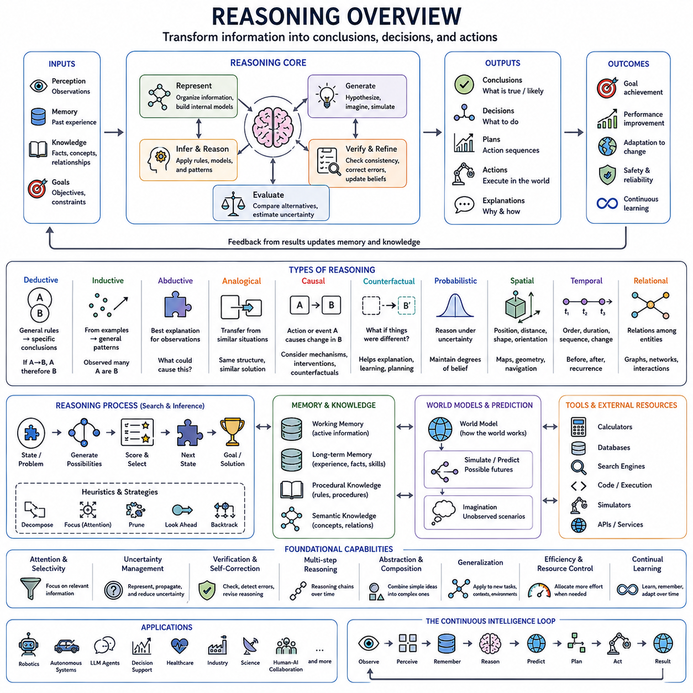{width="7.268055555555556in" height="7.268055555555556in"}

추론(Reasoning)은 정보를 결론, 의사결정, 설명, 예측 또는 행동으로 변환하는 인지적·계산적 과정(Cognitive and Computational Process)입니다. 단순히 저장된 지식(Knowledge)을 검색하는 것과 달리 추론 시스템(Reasoning System)은 사용 가능한 증거를 내부 표현(Internal Representations), 관계, 제약조건 및 목표와 결합하여 최초 입력에 명시적으로 제공되지 않았던 정보를 도출합니다.

추론은 지각(Perception), 기억(Memory), 지식(Knowledge), 계획(Planning), 행동(Action) 사이에서 중심적인 위치를 차지합니다. 지각은 환경에 대한 관측을 제공하고, 기억은 이전 경험에서 관련된 정보를 보존하며, 지식은 개념과 관계를 제공합니다. 추론은 이러한 자원을 통합하여 상황을 해석하고, 불확실성을 해결하고, 대안을 비교하며, 다음에 무엇을 해야 하는지를 결정합니다.

인간의 추론(Human Reasoning)은 다양한 추상화 수준(Levels of Abstraction)에서 작동합니다. 단순한 추론은 하나의 조건이 다른 조건을 의미한다는 사실을 인식하는 정도일 수 있지만, 복잡한 추론은 수많은 사실을 통합하고, 경쟁하는 가설을 평가하고, 결과를 예상하며, 다단계 해결책을 구성해야 할 수 있습니다. 구체적인 관측과 추상적인 개념 사이를 이동하는 능력을 통해 추론은 즉각적인 의사결정과 장기적인 전략적 사고를 모두 지원합니다.

연역적 추론(Deductive Reasoning)은 일반적인 규칙이나 전제(Premises)에서 시작하여 논리적으로 도출되는 결론을 생성합니다. 전제가 정확하고 추론 과정이 타당하다면 결과로 도출된 결론 역시 반드시 정확해야 합니다. 따라서 연역은 시스템이 신뢰할 수 있는 규칙, 형식적 제약조건(Formal Constraints), 수학적 관계 또는 명시적으로 정의된 논리 구조를 가지고 있을 때 유용합니다.

귀납적 추론(Inductive Reasoning)은 개별적인 관측으로부터 보다 광범위한 패턴이나 일반화를 도출한다는 점에서 반대 방향으로 작동합니다. 시스템은 반복되는 사례를 관측하고 이를 설명할 가능성이 높은 규칙을 추론할 수 있습니다. 연역과 달리 귀납적 결론은 미래 관측에 의해 반박될 수 있으므로 논리적으로 보장되지 않습니다. 그럼에도 귀납은 경험으로부터 학습하고 데이터에서 규칙성을 발견하는 데 근본적인 역할을 합니다.

귀추적 추론(Abductive Reasoning)은 관측에 대해 가장 타당한 설명을 찾으려고 합니다. 동일한 증거를 여러 원인이 생성할 수 있는 경우 시스템은 대안 가설(Alternative Hypotheses)을 평가하고 사용 가능한 정보를 가장 잘 설명하는 하나 이상의 설명을 선택합니다. 진단(Diagnosis), 과학적 발견, 고장 분석(Fault Analysis), 지각 및 일상적인 상황 해석은 이러한 형태의 추론에 자주 의존합니다.

유추적 추론(Analogical Reasoning)은 익숙한 상황에서 사용된 관계 또는 해결 패턴을 구조적으로 유사한 새로운 상황에 전이합니다. 여기에서 중요한 요소는 반드시 표면적인 유사성이 아니라 내부 관계 사이의 대응입니다. 이러한 구조적 유사성을 인식하는 에이전트(Agent)는 모든 문제를 처음부터 완전히 해결하는 대신 이전에 성공했던 추론 전략을 재사용할 수 있습니다.

인과 추론(Causal Reasoning)은 한 요인의 변화가 다른 요인의 변화에 기여하는 관계에 초점을 맞춥니다. 두 변수가 함께 변화하더라도 하나가 다른 하나를 발생시키지 않을 수 있으므로 상관관계(Correlation)만으로는 충분하지 않습니다. 인과 추론은 행동이나 사건이 결과에 어떻게 영향을 줄 수 있는지 판단하기 위해 시간적 순서, 개입(Interventions), 메커니즘, 대안 설명 및 반사실적 가능성(Counterfactual Possibilities)을 고려합니다.

반사실적 추론(Counterfactual Reasoning)은 특정 조건, 사건 또는 행동이 달랐다면 어떤 일이 발생했을지를 질문합니다. 이를 통해 지능형 시스템은 실제로 관측되지 않았던 대안을 평가할 수 있습니다. 반사실적 추론은 설명, 실패로부터의 학습, 정책 평가, 계획 및 특정 행동이 관측된 결과의 원인이었는지를 이해하는 데 유용합니다.

확률적 추론(Probabilistic Reasoning)은 정보가 불완전하거나, 불확실하거나, 잡음이 있거나, 모호한 상황을 다룹니다. 모든 명제를 단순히 참 또는 거짓으로 표현하는 대신 시스템은 가능한 설명이나 미래 상태에 대해 서로 다른 믿음의 정도(Degrees of Belief)를 유지할 수 있습니다. 이후 새로운 증거를 이용하여 이러한 믿음을 수정함으로써 불확실성이 점진적으로 감소함에 따라 의사결정을 조정할 수 있습니다.

베이지안 추론(Bayesian Reasoning)은 새로운 증거가 제공될 때 믿음을 업데이트하기 위한 형식적 프레임워크를 제공합니다. 사전 지식(Prior Knowledge)은 관측된 증거의 가능도(Likelihood)와 결합되어 업데이트된 사후 믿음(Posterior Belief)을 생성합니다. 지능형 시스템이 항상 명시적인 베이지안 계산을 수행하는 것은 아니지만 증거에 따라 믿음을 수정한다는 원리는 불확실한 상황에서 강건한 추론(Robust Reasoning)을 수행하는 데 근본적으로 중요합니다.

상식 추론(Commonsense Reasoning)은 일반적인 상황을 해석하는 데 필요한 광범위한 배경 지식을 다룹니다. 인간은 객체가 일시적으로 가려져도 계속 존재하고, 지지되지 않은 객체는 떨어질 수 있으며, 용기는 객체를 담을 수 있고, 사람은 의도를 가지며, 행동에는 일반적으로 결과가 따른다는 사실을 자연스럽게 이해합니다. 이러한 지식은 공유된다고 가정되어 명시되지 않는 경우가 많기 때문에 인공 시스템에서 상식 추론을 구현하기는 어렵습니다.

공간 추론(Spatial Reasoning)은 객체 또는 영역 사이의 위치, 거리, 방향, 형상, 포함 관계, 연결성 및 관계를 이해하는 것을 의미합니다. 이는 내비게이션(Navigation), 조작(Manipulation), 매핑(Mapping), 장면 이해(Scene Understanding), 기하학적 계획 및 물리적 상호작용을 지원합니다. 체화 지능(Embodied Intelligence)에서는 공간 추론이 센서에서 얻은 연속적인 기하학적 표현과 기호적 관계(Symbolic Relationships)를 결합하는 경우가 많습니다.

시간적 추론(Temporal Reasoning)은 시간에 걸친 사건과 상태 사이의 관계를 다룹니다. 시스템은 어떤 사건이 다른 사건보다 먼저 또는 나중에 발생했는지, 특정 상태가 얼마나 오랫동안 지속되었는지, 패턴이 반복되는지, 현재 상태가 이전 상태로부터 어떻게 형성되었는지를 판단해야 할 수 있습니다. 시간적 추론은 경험을 의미 있는 시퀀스와 전이로 조직하여 기억과 예측을 연결합니다.

관계 추론(Relational Reasoning)은 각각의 개체를 독립적으로 고려하기보다 개체 사이의 상호작용에 초점을 맞춥니다. 객체는 공간적, 기능적, 의미적, 사회적 또는 인과적 관계를 통해 연결될 수 있습니다. 그래프 표현(Graph Representations)은 노드(Node)가 개체를 표현하고 엣지(Edge)가 관계를 표현할 수 있으므로 복잡하게 상호 연결된 정보 네트워크에서 추론하는 데 특히 유용합니다.

조합적 추론(Compositional Reasoning)은 단순한 개념과 연산을 결합하여 더욱 복잡한 결론을 구성합니다. 어려운 문제는 종종 더 작은 구성 요소로 분해한 후 각각의 결과를 다시 결합하여 해결할 수 있습니다. 에이전트가 객체, 조건, 목표 및 환경의 가능한 모든 조합에 대해 암기된 해결책에 의존할 수 없기 때문에 이러한 특성은 확장 가능한 지능(Scalable Intelligence)에 필수적입니다.

다단계 추론(Multi-Step Reasoning)은 결론에 도달하기 전에 여러 개의 중간 변환을 필요로 한다는 점에서 이러한 원리를 확장합니다. 각 단계는 이전 단계에서 생성된 정보에 의존할 수 있으며 이를 통해 추론 연쇄(Reasoning Chain)가 형성됩니다. 초기 단계에서 발생한 오류가 이후 단계로 전파될 수 있기 때문에 신뢰성 높은 성능을 위해서는 중간 상태 관리(Intermediate State Management)와 검증(Verification)이 중요합니다.

따라서 추론은 작업 기억(Working Memory)에 크게 의존합니다. 문제를 해결하는 동안 중간 결론, 해결되지 않은 대안, 제약조건, 목표 및 관련 증거가 계속 사용 가능한 상태로 유지되어야 합니다. 이러한 표현이 너무 일찍 사라지면 시스템은 계산을 반복하거나 이전의 제약조건을 위반하거나 앞선 추론과 일치하지 않는 결론을 생성할 수 있습니다.

장기 기억(Long-Term Memory) 역시 이전 경험, 사실적 지식, 절차 및 학습된 관계를 제공하여 추론을 지원합니다. 검색(Retrieval)은 이러한 기억 가운데 어떤 부분이 현재 문제에 사용 가능한 상태가 될지를 결정합니다. 따라서 효과적인 추론에는 단순히 지식을 보유하는 것뿐 아니라 적절한 시점에 적절한 지식을 검색하는 능력이 필요합니다.

주의(Attention)와 선택성(Selectivity)은 어떤 정보가 처리 우선순위를 받을지를 결정합니다. 실제 환경과 대규모 정보 공간에는 동시에 고려할 수 있는 것보다 훨씬 많은 데이터가 존재합니다. 추론 시스템은 현재 목표와 관련된 증거에 집중하면서 방해 요소를 억제해야 합니다. 필요한 모든 정보가 기술적으로 존재하더라도 잘못된 선택으로 인해 추론이 실패할 수 있습니다.

추론은 가능한 상태, 설명, 계획 또는 해결책의 공간을 탐색하는 검색 과정(Search Process)으로 볼 수 있습니다. 각각의 추론 단계는 규칙, 학습된 패턴, 휴리스틱(Heuristics) 또는 모델 예측에 따라 하나의 표현에서 다른 표현으로 이동합니다. 효율적인 추론은 모든 대안을 철저하게 평가하지 않고 유망한 가능성에 주의를 집중할 수 있도록 탐색 공간(Search Space)을 감소시켜야 합니다.

휴리스틱(Heuristics)은 거대한 추론 공간을 탐색하기 위한 실용적인 지름길을 제공합니다. 최적의 해결책을 보장하는 대신 어떤 가능성이 유용할 확률이 높은지를 추정합니다. 인간의 추론도 휴리스틱에 자주 의존하며 인공 시스템 역시 탐색, 계획, 최적화 및 의사결정에서 유사한 원리를 사용합니다. 이러한 효율성은 때때로 체계적인 오류를 발생시키는 대가를 수반합니다.

명시적 기호 추론(Explicit Symbolic Reasoning)은 개념과 관계를 기호, 규칙, 논리 표현, 그래프 또는 구조화된 프로그램으로 표현합니다. 규칙이 명확하게 정의된 경우 이 접근 방법은 해석 가능한 추론 단계와 강력한 보장을 제공할 수 있습니다. 그러나 복잡한 실제 환경의 많은 개념은 불확실하고, 연속적이며, 모호하거나 데이터로부터 학습되므로 완전한 기호 표현을 구성하기는 어렵습니다.

신경망 추론(Neural Reasoning)은 사례로부터 학습된 분산 수치 표현(Distributed Numerical Representations)을 통해 지식과 변환을 표현합니다. 신경망은 모든 규칙을 명시적으로 프로그래밍하지 않고도 패턴을 인식하고 복잡한 관계를 근사할 수 있습니다. 그러나 내부 추론 과정을 해석하기 어려울 수 있으며 학습 데이터와 크게 다른 상황에서는 신뢰성 높은 체계적 추론(Systematic Reasoning)이 여전히 어려운 문제입니다.

신경-기호 추론(Neuro-Symbolic Reasoning)은 신경망 접근법과 기호적 접근법의 장점을 결합하려고 합니다. 신경망 구성 요소는 지각과 불확실한 데이터를 처리하고 기호적 또는 구조화된 구성 요소는 명시적 관계, 제약조건 및 논리 연산을 지원할 수 있습니다. 이러한 조합은 고차원 센서 정보와 구조화된 추론 및 검증 가능한 의사결정을 연결해야 하는 시스템에 유용합니다.

대규모 언어 모델(Large Language Models, LLMs)은 학습된 추론 능력(Learned Reasoning Capability)의 또 다른 형태를 보여줍니다. 대규모 텍스트와 기타 데이터로 학습하면서 이러한 모델은 개념, 관계, 절차 및 추론 패턴의 통계적 표현을 획득합니다. 문제를 입력하면 설명, 연역, 계획, 계산 또는 문제 해결 절차와 유사한 시퀀스를 생성할 수 있습니다.

그러나 유창한 언어 생성(Fluent Language Generation)을 자동으로 신뢰할 수 있는 추론으로 해석해서는 안 됩니다. 모델은 잘못된 가정, 누락된 제약조건 또는 근거 없는 정보를 기반으로 하면서도 일관성 있어 보이는 설명을 생성할 수 있습니다. 따라서 추론의 품질은 언어적 유창성만이 아니라 결론의 정확성과 이를 뒷받침하는 증거의 일관성을 기준으로 평가해야 합니다.

구조화된 프롬프팅(Structured Prompting)은 모델이 복잡한 작업을 분해하고, 관련 정보를 식별하고, 대안을 고려하거나, 중간 결과를 검증하도록 유도함으로써 추론을 향상시킬 수 있습니다. 보다 일반적인 원리는 복잡한 문제의 경우 최초 입력으로부터 최종 답을 직접 생성하려 하기보다 명시적인 중간 표현(Intermediate Representations)을 생성하면 해결하기 쉬워질 수 있다는 것입니다.

추론은 외부 도구(External Tools)를 사용할 수도 있습니다. 계산기, 데이터베이스, 검색 시스템, 시뮬레이터(Simulators), 코드 실행 환경, 최적화 솔버(Optimization Solvers), 전문 모델은 내부적으로 재현하기 어렵거나 신뢰성이 낮은 능력을 제공할 수 있습니다. 지능형 에이전트는 문제 자체뿐 아니라 언제 도구가 필요한지 그리고 도구의 결과를 이후 의사결정에 어떻게 반영할지도 추론해야 합니다.

도구 증강 추론(Tool-Augmented Reasoning)은 내부 추론과 외부 계산 사이의 루프를 형성합니다. 에이전트는 문제를 해석하고, 도구를 선택하고, 적절한 요청을 구성하고, 반환된 결과를 관측하고, 내부 상태를 업데이트한 다음 추론을 계속합니다. 따라서 도구 사용은 단일 모델의 파라미터를 넘어 추론 능력을 확장하고 지능을 외부 정보 및 계산 자원과 연결합니다.

검증(Verification)은 신뢰성 높은 추론의 핵심 구성 요소입니다. 시스템은 결론이 알려진 제약조건을 만족하는지, 계산이 내부적으로 일관되는지, 증거가 주장을 뒷받침하는지 또는 대안적인 추론 경로가 유사한 결과를 생성하는지를 확인할 수 있습니다. 추론 연쇄가 길어지고 오류의 결과가 중요해질수록 검증의 중요성은 더욱 증가합니다.

검증 과정에서 불일치 또는 실패가 발견되면 자기 수정(Self-Correction)이 이루어질 수 있습니다. 시스템은 이전 가정을 다시 검토하고, 추가 정보를 검색하고, 다른 가설을 탐색하거나, 새로운 해결 경로를 구성할 수 있습니다. 효과적인 자기 수정을 위해서는 기존 접근 방법이 어디에서 그리고 왜 실패했는지를 이해할 수 있도록 이전 추론 시도에 대한 충분한 정보를 유지해야 합니다.

불확실한 상황에서의 추론은 여러 가설을 동시에 유지해야 하는 경우가 많습니다. 증거가 불완전한 상태에서 하나의 해석에 너무 일찍 확정하면 심각한 오류가 발생할 수 있습니다. 강건한 시스템은 대안적인 설명을 보존하고 서로 다른 신뢰 수준을 부여하며 추가 관측이 제공될 때 이를 업데이트할 수 있습니다.

의사결정(Decision Making)은 추론을 행동 선택(Action Selection)으로 변환합니다. 여러 결론이 논리적으로 또는 확률적으로 타당할 수 있지만 에이전트는 어떤 행동이 자신의 목표를 가장 잘 만족시키는지를 결정해야 합니다. 이를 위해 예측을 목표, 비용, 보상, 위험, 제약조건 및 불확실성과 결합해야 합니다. 따라서 추론은 의사결정을 평가하기 위한 정보적 기반을 제공합니다.

계획(Planning)은 추론을 미래의 행동 시퀀스로 확장합니다. 에이전트는 다음 행동 하나만 선택하는 대신 행동이 환경을 어떻게 변화시키고 그러한 변화가 이후의 가능성에 어떤 영향을 주는지를 고려합니다. 계획에는 현재 상태, 가능한 행동, 목표, 제약조건 및 예상 상태 전이(Expected State Transitions)의 표현이 필요합니다.

월드 모델(World Models)은 이러한 추론에 필요한 예측 구조(Predictive Structure)를 제공합니다. 월드 모델은 행동이 미래 조건에 어떤 영향을 주는지를 포함하여 상태가 시간에 따라 어떻게 변화할 수 있는지를 표현합니다. 에이전트는 물리적으로 행동하기 전에 이 모델을 사용하여 가능한 궤적을 평가할 수 있으므로 이전에 관측된 결과에만 의존하지 않고 시뮬레이션된 결과를 추론에 포함할 수 있습니다.

따라서 모델 기반 추론(Model-Based Reasoning)은 과거 경험과 미래 가능성을 연결할 수 있습니다. 과거 관측은 월드 모델을 구축하거나 업데이트하는 데 도움을 주고, 현재 상태는 시작 조건을 제공하며, 시뮬레이션된 전이는 후보 미래(Candidate Futures)를 생성합니다. 추론 시스템은 이러한 미래를 비교하고 예상 목표와 제약조건에 따라 행동을 선택합니다.

상상(Imagination)은 현재 관측되지 않는 가능한 상태나 궤적을 생성하는 계산적 과정으로 해석할 수 있습니다. 에이전트는 대안 행동, 환경 변화, 객체 상호작용 또는 작업 결과를 시뮬레이션할 수 있습니다. 이러한 상상된 가능성을 통해 자원을 투입하거나 되돌릴 수 없는 물리적 행동을 수행하기 전에 여러 시나리오를 탐색할 수 있습니다.

체화 추론(Embodied Reasoning)은 결론이 물리적 현실과 일치해야 하기 때문에 추가적인 어려움을 발생시킵니다. 로봇은 추상적인 언어 관계만으로 판단할 수 없으며 기하학(Geometry), 동역학(Dynamics), 마찰(Friction), 질량(Mass), 도달 가능성(Reachability), 불확실성, 액추에이터 한계(Actuator Limits), 센서 오류 및 환경 변화를 고려해야 합니다. 추론은 행동이 가져오는 물리적 결과에 기반해야 합니다.

물리 추론(Physical Reasoning)은 객체와 시스템이 물리적 제약조건 아래에서 어떻게 행동하는지를 다룹니다. 에이전트는 지지(Support), 충돌(Collision), 움직임, 힘(Force), 안정성(Stability), 포함 관계, 변형(Deformation) 또는 상호작용에 대해 추론할 수 있습니다. 일부 관계는 경험을 통해 학습할 수 있고 다른 관계는 물리 모델, 시뮬레이션 또는 구조화된 제약조건으로 표현할 수 있습니다.

행동유도성 추론(Affordance Reasoning)은 객체나 환경이 어떤 행동을 가능하게 하는지에 초점을 맞춥니다. 손잡이는 당기기를 가능하게 하고, 평평한 표면은 객체 배치를 지원하며, 열린 공간은 이동을 가능하게 할 수 있습니다. 행동유도성(Affordances)은 객체가 무엇인지뿐 아니라 현재 조건에서 에이전트가 해당 객체와 어떻게 상호작용할 수 있는지를 표현하여 지각과 행동을 연결합니다.

로봇 조작(Robotic Manipulation)은 지각, 기하학, 작업 목표 및 동역학을 포괄하는 추론을 요구합니다. 로봇은 관련 객체를 식별하고, 자세(Pose)를 추정하고, 파지점 또는 접촉점을 선택하고, 도달 가능성을 평가하고, 충돌을 회피하고, 상호작용 결과를 예측하며, 실행을 모니터링해야 합니다. 각각의 단계는 이후 추론을 제약하는 정보를 생성합니다.

내비게이션(Navigation) 역시 현재 위치, 목적지, 주행 가능성(Traversability), 장애물, 불확실성 및 다른 에이전트의 예상 움직임을 고려하는 추론을 필요로 합니다. 지역 관측(Local Observations)은 지도 및 이전 경험과 통합되어야 합니다. 환경 조건이 변화하면 추론 시스템은 계획을 지속적으로 수정해야 합니다.

계층적 추론(Hierarchical Reasoning)은 서로 다른 추상화 수준을 분리하여 이러한 복잡성을 관리하는 데 도움을 줍니다. 고수준 추론은 어떤 작업을 수행할지를 결정하고, 중간 수준 추론은 전략을 선택하며, 저수준 추론은 구체적인 움직임이나 제어 행동을 결정할 수 있습니다. 추상적인 목표가 물리적 실행과 연결되도록 정보가 각 수준 사이를 이동합니다.

시간적 계층(Temporal Hierarchy)도 마찬가지로 중요합니다. 일부 의사결정은 밀리초 단위에서 이루어지고 다른 의사결정은 수초, 수분, 수시간 또는 그 이상의 기간을 고려합니다. 저수준 제어는 즉각적인 외란에 빠르게 대응해야 하지만 전략적 추론은 장기적인 결과를 고려할 수 있습니다. 따라서 정교한 에이전트에는 여러 시간 범위(Temporal Horizons)에서 작동하는 추론 메커니즘이 필요합니다.

다중 에이전트 추론(Multi-Agent Reasoning)은 다른 에이전트의 믿음, 의도, 능력 및 행동까지 고려합니다. 시스템은 다른 로봇, 사람 또는 소프트웨어 에이전트가 자신의 행동에 어떻게 반응할지를 예측해야 할 수 있습니다. 협업에는 공유 목표, 통신, 작업 할당(Task Allocation), 충돌, 의존성 및 참여자 사이에 분산된 불완전한 정보에 대한 추론이 필요합니다.

사회적 추론(Social Reasoning)은 이러한 문제를 인간 행동까지 확장합니다. 인간은 항상 단순한 결정론적 규칙에 따라 행동하지 않으며 의도가 직접 관측되지 않을 수 있습니다. 사람 주변에서 작동하는 지능형 시스템은 행동을 신중하게 해석하고, 불확실성을 유지하고, 사회적 제약조건을 준수하며, 예측이 잘못되었을 때 행동을 수정해야 합니다.

추론의 품질은 기반 표현(Underlying Representations)의 품질에 크게 의존합니다. 지각이 객체를 잘못 식별하거나, 기억이 오래된 정보를 검색하거나, 상태 추정에서 중요한 제약조건이 누락되면 논리적으로 일관된 추론 과정도 잘못된 결과를 생성할 수 있습니다. 추론만으로 신뢰할 수 없는 입력을 무한히 보완할 수는 없습니다.

따라서 불확실성(Uncertainty)은 추론 과정 전체에 걸쳐 전파되어야 합니다. 불확실한 증거에서 도출된 결론을 신뢰성 높은 관측에서 도출된 결론과 동일한 수준으로 확신해서는 안 됩니다. 불확실성을 유지하면 에이전트가 언제 추가 센싱, 검색, 검증 또는 인간의 도움이 필요한지를 판단할 수 있습니다.

추론 시스템은 사용 가능한 정보가 충분하지 않은 시점을 탐지하는 메커니즘도 필요로 합니다. 불확실성이나 무지(Ignorance)를 인식하는 것은 근거 없이 확신하는 결론을 생성하는 것보다 더 가치 있을 수 있습니다. 에이전트는 추가 관측을 수집하거나, 기억을 검색하거나, 외부 지식을 확인하거나, 도구를 사용하거나, 핵심 증거가 확보될 때까지 결정을 연기할 수 있습니다.

학습(Learning)과 추론(Reasoning)은 상호적인 관계를 형성합니다. 학습은 경험으로부터 표현, 모델, 개념 및 정책을 구축하고 추론은 이러한 학습된 구조를 사용하여 새로운 문제를 해결합니다. 추론 결과는 다시 새로운 경험을 생성하여 미래의 학습을 변화시킬 수 있으며, 이를 통해 지식 획득과 지식 활용 사이에 지속적인 순환이 형성됩니다.

기억 통합(Memory Consolidation)과 재현(Replay)은 이러한 순환을 강화합니다. 중요한 경험을 보존하고 다시 활용함으로써 추론 패턴, 성공적인 전략, 실패 및 환경 관계를 시간에 따라 더욱 안정적으로 만들 수 있습니다. 재현된 경험은 이후 더욱 정확한 추론과 계획을 지원하는 모델을 개선할 수 있습니다.

지속적 추론(Continual Reasoning)은 새로운 상황에 적응하면서 유용한 능력을 보존해야 합니다. 장기간 운영되는 동안 환경, 작업, 도구 및 목표가 변화할 수 있습니다. 따라서 추론 아키텍처는 기존 지식을 유지할 수 있을 만큼 안정적이면서 새로운 증거와 전략을 통합할 수 있을 만큼 유연해야 합니다.

시스템의 능력이 증가할수록 추론 효율성(Reasoning Efficiency)은 더욱 중요해집니다. 복잡한 환경에서 가능한 모든 추론이나 미래 궤적을 철저하게 탐색하는 것은 계산적으로 불가능합니다. 지능형 시스템은 일상적인 의사결정에는 빠른 근사를 사용하고 불확실성, 새로움, 위험 또는 복잡성이 추가적인 계산을 정당화하는 경우 더 깊은 추론을 수행하도록 계산 자원을 선택적으로 배분해야 합니다.

이는 적응형 추론 깊이(Adaptive Reasoning Depth)라는 개념으로 이어집니다. 단순한 상황에는 직접적인 패턴 인식이나 검색만 필요할 수 있지만 익숙하지 않거나 중요한 결과를 초래하는 문제에는 문제 분해, 시뮬레이션, 검증 및 여러 대안의 비교가 필요할 수 있습니다. 따라서 유능한 에이전트는 각각의 문제에 얼마나 많은 추론 노력을 배분할지를 조절해야 합니다.

추론은 정확성(Correctness), 일관성(Consistency), 강건성(Robustness), 효율성(Efficiency), 일반화(Generalization), 보정(Calibration), 행동에 대한 유용성 등을 통해 평가할 수 있습니다. 익숙한 벤치마크 문제는 해결하지만 작은 환경 변화에도 실패하는 시스템은 제한적인 추론 일반성을 가진 것으로 볼 수 있습니다. 따라서 평가는 추론이 작업, 문맥, 표현 및 운영 조건 사이에서 전이되는지를 확인해야 합니다.

피지컬 AI(Physical AI)에서 추론 평가는 궁극적으로 물리적 결과(Physical Outcomes)를 포함해야 합니다. 기호적으로는 올바르게 보이는 계획이라도 로봇이 안전하게 실행할 수 없다면 충분하지 않습니다. 성공 여부는 추론이 물리적 제약조건, 불확실성, 안전 요구사항, 자원 제한 및 환경 동역학을 준수하면서 목표를 달성하는 행동을 생성하는지에 따라 결정됩니다.

따라서 고급 자율 시스템(Advanced Autonomous Systems)의 아키텍처는 추론을 지속적인 지각-기억-예측-행동 루프(Perception-Memory-Prediction-Action Loop) 내부에 배치합니다. 센서는 관측을 제공하고, 지각은 구조화된 표현을 생성하며, 기억은 관련된 과거 정보를 제공하고, 추론은 현재 상황을 해석하며, 월드 모델은 가능한 미래를 예측하고, 계획은 대안을 평가하며, 제어(Control)는 선택된 행동을 실행합니다.

실행은 다시 물리적 또는 정보적 환경을 변화시켜 새로운 관측을 생성합니다. 이러한 관측은 시스템의 상태를 업데이트하고, 예측이 정확했는지를 보여주며, 학습을 위한 추가 경험을 제공합니다. 따라서 추론은 고립된 계산이 아니라 지속적인 상호작용 루프 내부에서 반복적으로 수행되는 과정입니다.

지능형 시스템의 자율성이 증가함에 따라 추론은 언어, 비전(Vision), 공간 표현, 시간 이력, 물리 동역학, 도구 출력, 목표 및 학습된 경험을 점점 더 통합해야 합니다. 멀티모달 추론(Multimodal Reasoning)을 통해 서로 다른 출처의 증거를 각각 독립적으로 처리하는 대신 공유된 상황 이해를 형성하도록 상호 제약할 수 있습니다.

고급 추론 아키텍처(Advanced Reasoning Architectures)는 신경망 표현, 구조화된 기억, 기호적 제약조건, 탐색, 확률적 추론, 월드 모델, 시뮬레이션, 외부 도구 및 학습된 정책을 결합할 수 있습니다. 일반적인 자율 지능에 필요한 모든 능력을 하나의 메커니즘만으로 제공하기는 어렵습니다. 이러한 요소의 통합을 통해 서로 다른 형태의 추론이 상호 보완적으로 작동할 수 있습니다.

따라서 추론은 지식과 목적 지향적 행동(Purposeful Behavior)을 연결하는 변환 계층(Transformation Layer)으로 이해할 수 있습니다. 지각은 현재 무엇이 발생하는 것으로 보이는지를 판단하고, 기억은 이전에 무엇이 발생했는지를 제공하며, 예측은 다음에 무엇이 발생할 수 있는지를 추정합니다. 추론은 이러한 요소를 통합하여 그것이 무엇을 의미하고 어떤 가능성을 더 검토해야 하는지를 결정합니다.

LLM 에이전트(LLM Agents), 로보틱스(Robotics), 피지컬 AI(Physical AI)에서 추론은 궁극적으로 반응형 행동(Reactive Behavior)에서 숙고형 자율성(Deliberative Autonomy)으로의 전환을 지원합니다. 지능형 에이전트는 현재 입력에 직접 반응하는 수준을 넘어 상태를 유지하고, 증거를 평가하고, 대안을 고려하고, 결과를 예상하고, 가정을 검증하며, 지속적인 목표에 따라 행동을 선택해야 합니다.

따라서 점점 더 강력한 추론 시스템의 개발은 단순히 더 큰 모델이나 더 많은 계산 능력에만 의존하지 않습니다. 신뢰성 높은 추론에는 적절한 표현, 기억, 주의, 불확실성 관리, 검증, 예측 모델, 도구 사용 및 외부 현실에 대한 그라운딩(Grounding)이 필요합니다. 이러한 메커니즘이 결합되어 학습된 정보를 일관된 의사결정과 적응형 행동(Adaptive Behavior)으로 변환합니다.

결과적으로 추론(Reasoning)은 지능형 시스템을 구성하는 핵심 능력 가운데 하나입니다. 추론은 과거 경험, 현재 관측 및 가능한 미래를 하나의 통합된 해석 및 의사결정 과정으로 연결합니다. 기억(Memory), 학습(Learning), 월드 모델(World Models), 계획(Planning), 행동(Action)과 통합될 때 추론은 에이전트가 단순히 정보를 아는 수준에서 벗어나 관계를 이해하고, 문제를 해결하며, 변화하는 환경에서 지능적으로 행동할 수 있도록 합니다.

## 03.01 Deductive Reasoning [w/Code]

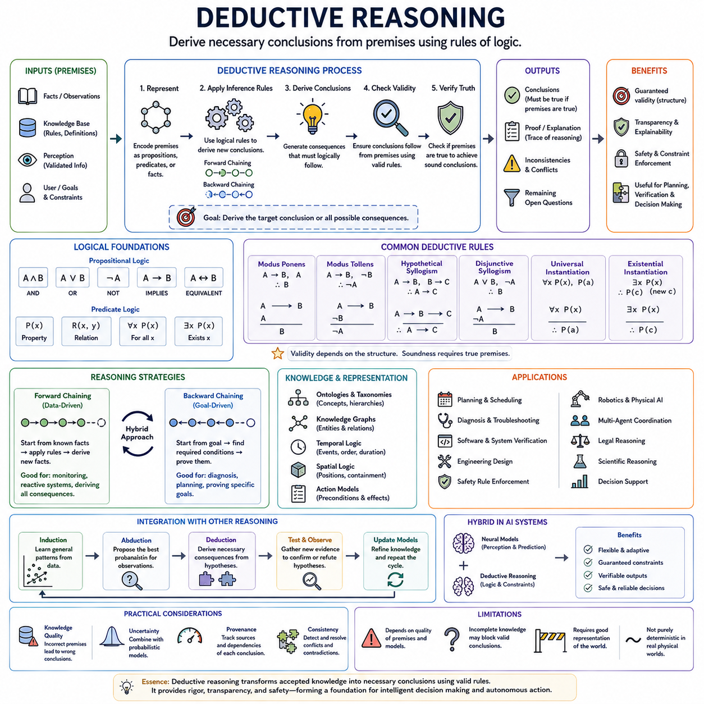{width="7.268055555555556in" height="7.268055555555556in"}

연역적 추론(Deductive Reasoning)은 논리적 타당성(Logical Validity)을 보존하는 규칙에 따라 전제(Premises)로부터 결론을 도출하는 추론의 한 형태입니다. 이는 받아들여진 명제로부터 반드시 따라오는 결과를 향해 진행됩니다. 전제가 참이고 논리 구조가 타당하다면 결론은 거짓일 수 없으며, 이러한 특성으로 인해 연역은 엄밀한 추론과 형식적 의사결정 과정(Formal Decision Processes)에서 중요한 역할을 합니다.

연역의 핵심적인 특성은 확률(Probability)이 아니라 필연성(Necessity)입니다. 귀납적 논증(Inductive Argument)은 유사한 관측이 반복적으로 발생했기 때문에 어떤 결론이 가능성이 높다고 제시할 수 있지만, 타당한 연역적 논증은 전제가 받아들여진다면 결론이 반드시 따라야 한다는 것을 확립합니다. 이러한 차이 때문에 연역은 명시적 제약조건, 규칙, 정의 또는 수학적 관계에 따라 정확성이 결정되는 상황에서 특히 유용합니다.

연역적 논증(Deductive Argument)은 일반적으로 하나 이상의 전제와 결론으로 구성됩니다. 전제는 출발 정보를 제공하고 논리적 관계는 무엇을 정당하게 추론할 수 있는지를 결정합니다. 따라서 추론은 임의적인 새로운 사실을 생성하는 것이 아니라 전제와 이를 해석하는 규칙의 조합에 이미 내포되어 있는 결과를 명시적으로 드러냅니다.

전형적인 연역 구조 가운데 하나는 삼단논법(Syllogism)입니다. 일반적인 명제는 특정 범주의 모든 구성원이 어떤 속성을 가진다고 규정하고, 다른 명제는 특정 개체가 그 범주에 속한다는 것을 확립할 수 있습니다. 그러면 결론은 해당 속성을 그 개체에 부여합니다. 여기서 중요한 것은 주제 자체가 아니라 범주 소속과 함의(Implication)를 연결하는 재사용 가능한 논리 구조입니다.

연역적 타당성(Deductive Validity)은 전제의 사실적 진실성보다 논증의 구조와 관련됩니다. 하나 이상의 전제가 사실적으로 잘못되어 있더라도 논증 자체는 논리적으로 타당할 수 있습니다. 타당성이란 모든 전제가 참이면서 결론이 거짓인 상황이 존재할 수 없음을 의미합니다. 논리적 형식과 사실적 정확성을 구분하는 것은 연역을 이해하는 데 근본적으로 중요합니다.

건전성(Soundness)은 여기에 또 하나의 요구조건을 추가합니다. 연역적 논증은 논리적으로 타당하면서 전제가 실제로 참일 때 건전합니다. 따라서 건전한 추론(Sound Reasoning)은 올바른 추론 구조와 신뢰할 수 있는 입력 정보를 모두 필요로 합니다. 완벽하게 타당한 추론 과정도 부정확한 관측, 오래된 지식 또는 잘못된 가정에서 시작하면 현실에 대해 잘못된 결론을 생성할 수 있습니다.

이러한 구분은 인공지능(Artificial Intelligence)에서 특히 중요합니다. AI 시스템은 지각(Perception), 기억(Memory), 데이터베이스(Database) 또는 사용자가 제공한 정보에 논리 규칙을 정확하게 적용하더라도 기반 정보 자체가 잘못되었다면 운영적으로 잘못된 결론에 도달할 수 있습니다. 따라서 신뢰성 높은 연역 시스템은 추론 규칙을 적용하는 메커니즘뿐 아니라 전제를 검증하는 메커니즘도 필요로 합니다.

명제 논리(Propositional Logic)는 연역적 추론을 위한 하나의 형식적 기반을 제공합니다. 명제는 진릿값(Truth Values)을 가질 수 있는 문장으로 표현되고 논리 연산자는 명제 사이의 관계를 설명합니다. 논리곱(Conjunction), 논리합(Disjunction), 부정(Negation), 함의(Implication), 동치(Equivalence)를 이용하면 단순한 명제로부터 복잡한 표현을 구성하고 결론을 도출하기 위한 형식적 규칙을 정의할 수 있습니다.

함의(Implication)는 연역에서 특히 중요합니다. 규칙은 개념적으로 "조건 A가 성립하면 조건 B가 따른다"라고 표현할 수 있습니다. A가 성립했을 때 전건 긍정(Modus Ponens)이라는 패턴을 통해 B를 추론할 수 있습니다. 이러한 단순한 구조는 규칙 기반 시스템, 수학적 증명, 진단 논리, 소프트웨어 검증, 계획 제약조건 및 자동 추론(Automated Reasoning)에서 반복적으로 나타납니다.

또 다른 중요한 패턴은 후건 부정(Modus Tollens)입니다. 규칙이 A가 B를 함의한다고 명시하고 증거가 B가 거짓임을 확립한다면, 해당 규칙이 표현하는 가정 아래에서 시스템은 A가 거짓이라고 결론 내릴 수 있습니다. 이는 연역이 조건에서 결과로 전방향으로 정보를 전달할 뿐 아니라 부정과 관련된 논리적으로 정당한 관계를 통해서도 정보를 전파할 수 있음을 보여줍니다.

표면적으로 유사해 보이는 모든 추론이 타당한 것은 아닙니다. 예를 들어 A가 B를 함의한다는 사실을 알고 B를 관측했다고 해서 반드시 A가 성립하는 것은 아닙니다. 다른 조건도 B를 발생시킬 수 있기 때문입니다. 일반적으로 후건 긍정의 오류(Affirming the Consequent)라고 불리는 이러한 오류는 연역적 추론이 의미적인 그럴듯함에만 의존하는 것이 아니라 논리 구조를 정확하게 고려해야 한다는 점을 보여줍니다.

술어 논리(Predicate Logic)는 개체, 속성, 변수 및 관계를 표현함으로써 명제 추론을 확장합니다. 전체 문장을 하나의 분할 불가능한 명제로 취급하는 대신 객체가 특정 속성을 가지거나 두 객체가 어떤 관계에 참여하는 구조를 표현할 수 있습니다. 이후 한정자(Quantifiers)를 사용하여 도메인의 모든 구성원 또는 일부 구성원에 대해 추론할 수 있습니다.

전칭 한정(Universal Quantification)은 지정된 조건을 만족하는 모든 개체에 적용되는 규칙을 표현합니다. 존재 한정(Existential Quantification)은 최소 하나의 개체가 특정 조건을 만족한다는 주장을 표현합니다. 이러한 메커니즘을 통해 술어 논리는 단순한 명제 논리보다 훨씬 높은 표현력을 제공하며 객체, 범주, 속성 및 관계에 관한 구조화된 지식을 표현할 수 있습니다.

연역적 추론은 알려진 표현을 새로운 표현으로 변환하는 추론 규칙(Inference Rules)을 통해 구현할 수 있습니다. 추론 엔진(Reasoning Engine)은 조건이 충족된 규칙을 반복적으로 식별하고 이를 적용하여 알려진 결론의 집합을 확장합니다. 이러한 과정은 원하는 결론에 도달하거나 더 이상 유용한 추가 추론을 생성할 수 없을 때까지 계속될 수 있습니다.

전방향 연쇄(Forward Chaining)는 사용 가능한 사실에서 시작하여 해당 사실과 조건이 일치하는 규칙을 반복적으로 적용합니다. 새롭게 추론된 결론은 추가적인 사실이 되고 다시 다른 규칙을 활성화할 수 있습니다. 이 접근 방법은 새로운 관측이 자동으로 결과를 발생시켜야 하거나 현재 사용 가능한 정보로부터 지원되는 모든 결론을 시스템이 발견해야 할 때 유용합니다.

후방향 연쇄(Backward Chaining)는 목표 결론에서 시작하여 해당 결론이 성립하기 위해 어떤 조건이 참이어야 하는지를 탐색합니다. 이러한 조건은 하위 목표(Subgoals)가 되고 시스템은 이를 성립시키는 사실이나 규칙을 재귀적으로 검색합니다. 이 접근 방법은 추론 목표가 명확하고 지식 기반(Knowledge Base)의 가능한 모든 결과를 평가하는 것이 비효율적일 때 유용합니다.

전방향 추론과 후방향 추론은 함께 사용할 수도 있습니다. 시스템은 관측으로부터 즉시 관련된 사실을 도출하기 위해 전방향 추론을 사용하면서 특정 목표, 진단 또는 의사결정을 조사하기 위해 후방향 탐색을 사용할 수 있습니다. 하이브리드 전략(Hybrid Strategies)은 불필요한 계산을 감소시키면서 중요한 환경 변화에 빠르게 대응하는 능력을 유지할 수 있습니다.

연역은 자연스럽게 탐색(Search)과 상호작용합니다. 복잡한 문제에서는 수많은 추론 시퀀스가 가능할 수 있지만 그 가운데 실제 목표 결론에 기여하는 것은 일부에 불과합니다. 따라서 추론 시스템에는 어떤 규칙을 적용하고, 어떤 중간 명제를 조사하며, 언제 특정 추론 분기를 중단할 것인지를 선택하는 전략이 필요합니다.

휴리스틱(Heuristics)은 개별 추론 규칙의 논리적 타당성을 변경하지 않으면서 연역적 탐색을 안내할 수 있습니다. 예를 들어 시스템은 현재 목표와 밀접하게 관련된 규칙을 우선하거나, 더 짧은 증명 경로를 선호하거나, 사용할 수 없는 정보를 요구하는 분기를 나중으로 미룰 수 있습니다. 휴리스틱은 계산 효율성에 영향을 주고 기반 추론 규칙은 결과 결론이 논리적으로 정당한지를 결정합니다.

증명 구성(Proof Construction)은 구조화된 형태의 연역적 추론입니다. 증명은 받아들여진 전제, 공리(Axioms), 정의 또는 이전에 확립된 결과에서 시작하여 목표 명제가 얻어질 때까지 타당한 변환을 적용합니다. 각각의 중간 단계에는 정당화가 필요하므로 최종 결론을 명시적인 논리적 의존성의 연쇄를 통해 출발점까지 추적할 수 있습니다.

증명 검증(Proof Verification)은 증명을 발견하는 것보다 쉬울 수 있습니다. 타당한 단계의 시퀀스를 찾는 과정에는 상당한 탐색, 창의성 또는 계산 자원이 필요할 수 있지만 제안된 시퀀스가 정해진 규칙을 따르는지 확인하는 것은 상대적으로 단순할 수 있습니다. 이러한 비대칭성은 후보 해결책을 생성한 후 별도의 메커니즘을 통해 검증하는 AI 시스템에서 중요합니다.

자동 정리 증명(Automated Theorem Proving)은 형식적 연역 추론에 계산적 방법을 적용합니다. 정리 증명기(Theorem Prover)는 공리, 정의 및 목표 명제를 입력받아 형식적으로 정의된 추론 규칙을 사용하여 증명을 탐색합니다. 이러한 시스템은 지식과 목표를 형식 언어(Formal Language)로 정확하게 표현할 수 있을 때 연역을 기계적으로 수행할 수 있음을 보여줍니다.

제약조건 만족(Constraint Satisfaction)은 연역과 밀접하게 관련됩니다. 문제는 변수, 가능한 값 및 어떤 조합이 허용되는지를 지정하는 제약조건으로 정의될 수 있습니다. 논리적 추론은 불가능한 할당을 제거하고 남은 제약조건에서 결과를 도출할 수 있습니다. 스케줄링, 구성(Configuration), 계획, 회로 설계, 검증 및 자원 할당(Resource Allocation)은 이러한 형태의 추론을 자주 사용합니다.

연역적 추론은 소프트웨어 및 시스템 검증(Software and System Verification)에서도 중요합니다. 요구사항은 특정 조건에서 반드시 만족해야 하는 속성으로 표현할 수 있고 형식적 방법(Formal Methods)은 설계가 해당 속성을 만족하는지를 판단합니다. 선택된 사례만 테스트하는 방식에 전적으로 의존하지 않고 형식 모델이 충분한 경우 전체 가능한 시스템 상태 범주에 걸쳐 속성을 확립할 수 있습니다.

규칙 기반 전문가 시스템(Rule-Based Expert Systems)은 연역적 AI의 실용적인 역사적 사례를 제공합니다. 도메인 지식은 명시적인 조건-행동 또는 조건-결론 규칙으로 표현되고 추론 엔진은 특정 사례를 설명하는 사실에 이러한 규칙을 적용합니다. 결론에 도달하는 규칙의 시퀀스를 확인할 수 있기 때문에 이러한 시스템은 투명한 설명을 제공할 수 있습니다.

그러나 규칙 기반 시스템은 확장성 문제(Scalability Challenges)에 직면합니다. 실제 환경에는 예외, 불확실한 관측, 불완전한 지식, 변화하는 조건 및 많은 상호작용 변수가 존재합니다. 필요한 모든 규칙을 수동으로 정의하기는 어려우며 개별적으로 합리적인 규칙도 예상하지 못한 방식으로 상호작용할 수 있습니다. 따라서 순수한 연역만으로는 많은 개방형 지능 문제(Open-World Intelligence Problems)를 해결하기 어렵습니다.

연역적 추론은 일반적으로 추론에 필요한 정보가 적절한 형태로 표현되어 있다고 가정합니다. 그러나 지각은 명확한 논리적 사실보다 불확실한 수치 추정치를 생성하는 경우가 많습니다. 예를 들어 비전 시스템(Vision System)은 객체가 사람이라고 절대적으로 확정하기보다 사람일 확률이 높다고 추정할 수 있습니다. 따라서 불확실한 지각과 이산적인 연역을 연결하기 위한 추가 메커니즘이 필요합니다.

이러한 상황에서는 확률적 추론(Probabilistic Reasoning)이 연역을 보완할 수 있습니다. 확률 모델은 관측이나 가설에 대한 불확실성을 추정하고 연역 규칙은 관련 조건이 충분히 확립되었을 때 반드시 유지되어야 하는 관계를 강제할 수 있습니다. 따라서 하이브리드 시스템은 모든 정보를 절대적인 참 또는 거짓으로 강제하지 않고 불확실한 증거와 명시적 제약조건을 결합할 수 있습니다.

연역은 상식 추론(Commonsense Reasoning)과도 상호작용합니다. 형식 논리는 명시적으로 표현된 사실에서 결과를 도출할 수 있지만 일반적인 추론은 명시되지 않는 방대한 배경 지식에 의존합니다. 시스템은 형식적인 연역 연쇄가 유용해지기 전에 객체, 사람, 공간, 시간, 의도 또는 물리적 행동에 대한 암묵적인 가정을 추론해야 할 수 있습니다.

따라서 지식 표현(Knowledge Representation)은 핵심적인 문제입니다. 동일한 현실 상황도 서로 다른 세부 수준으로 표현할 수 있으며 선택된 표현은 어떤 연역이 쉬워지고 어떤 연역이 어려워지는지를 결정합니다. 유용한 표현은 현재 문제와 관련된 관계를 명확하게 드러내면서 추론 공간을 불필요하게 확대하는 세부 정보는 줄입니다.

온톨로지(Ontologies)는 개념을 범주, 속성 및 관계로 조직하여 연역을 지원할 수 있습니다. 하나의 범주가 다른 범주의 하위 유형(Subtype)으로 정의되면 논리적으로 적절한 경우 상위 범주와 연관된 속성이 특수화된 범주로 전달될 수 있습니다. 따라서 구조화된 의미 지식(Structured Semantic Knowledge)은 개념 계층 전반에 걸친 자동 추론을 가능하게 합니다.

지식 그래프(Knowledge Graphs) 역시 연역적 추론을 위한 관계 구조를 제공할 수 있습니다. 개체는 노드로 표현되고 관계는 엣지로 표현되며 규칙은 기존 패턴에서 추가적인 엣지나 속성을 추론할 수 있습니다. 이러한 추론은 직접 저장되지 않았지만 그래프 구조와 도메인 규칙으로부터 도출되는 암묵적인 관계를 발견할 수 있습니다.

시간적 연역(Temporal Deduction)은 시간에 걸친 사건과 상태에 논리적 관계를 적용합니다. 하나의 프로세스가 완료된 이후에만 다른 프로세스가 시작될 수 있고 첫 번째 프로세스가 아직 완료되지 않았다면 두 번째 프로세스의 시작은 금지될 수 있습니다. 시간적 제약조건은 추론 시스템이 타당한 행동 시퀀스를 도출하고 스케줄 충돌을 탐지하며 관측된 사건 순서가 알려진 요구사항과 일치하는지를 판단하도록 합니다.

공간적 연역(Spatial Deduction)은 명시적인 기하학적 또는 관계적 제약조건을 적용합니다. 객체 A가 컨테이너 B 내부에 있고 컨테이너 B가 영역 C 내부에 있다면 관련 포함 모델에 따라 시스템은 A 역시 C 내부에 있다고 추론할 수 있습니다. 유사한 추론은 내비게이션, 장면 이해, 조작 및 공간 관계의 구조화된 해석을 지원할 수 있습니다.

인과 규칙(Causal Rules)은 인과 관계가 이미 확립된 경우 연역에 참여할 수 있습니다. 검증된 시스템 모델이 특정 제어 조건이 지정된 가정 아래에서 정의된 상태 전이를 반드시 발생시킨다고 규정한다면 에이전트는 행동의 결과를 연역할 수 있습니다. 이러한 연역의 신뢰성은 해당 가정이 실제 환경에서도 계속 유효한지에 따라 달라집니다.

이러한 한계는 피지컬 AI(Physical AI)에서 특히 중요합니다. 물리적 환경은 완전히 결정론적인 경우가 드물고 모델은 현실의 근사치입니다. 마찰, 페이로드(Payload) 변화, 센서 잡음, 액추에이터 불확실성, 지형 조건 및 인간 행동이 가정을 위반할 수 있습니다. 연역적 추론은 알려진 제약조건을 강제할 수 있지만 물리적 예측에는 형식 논리와 함께 확률적 모델 또는 학습 모델이 필요한 경우가 많습니다.

로봇은 안전 규칙(Safety Rules)을 위해 연역을 효과적으로 사용할 수 있습니다. 사람이 존재하는 동안 제한 구역 진입이 금지되고 지각 시스템이 사람의 존재를 신뢰성 있게 확인했다면 계획 시스템은 해당 구역에 진입하는 궤적을 제거할 수 있습니다. 명시적 논리 제약조건은 학습된 정책이 다른 행동을 선호하더라도 특정 행동을 방지할 수 있다는 점에서 가치가 있습니다.

작업 추론(Task Reasoning)도 연역의 도움을 받을 수 있습니다. 조작 작업은 특정 행동이 시작되기 전에 선행 조건(Prerequisite Conditions)을 요구할 수 있습니다. 객체를 운반하기 전에 먼저 파지해야 하고 목적지에 배치하기 전에 운반해야 한다면 이러한 관계는 타당한 작업 시퀀스를 제약하는 논리적 의존성을 정의합니다.

계획 시스템(Planning Systems)은 행동을 전제조건(Preconditions)과 효과(Effects)를 통해 표현하는 경우가 많습니다. 전제조건은 행동을 적용하기 위해 무엇이 이미 참이어야 하는지를 지정하고 효과는 실행 이후 무엇이 참 또는 거짓이 되는지를 설명합니다. 연역적 추론은 현재 어떤 행동이 유효한지와 후보 행동이 세계의 논리적 표현을 어떻게 변화시키는지를 판단할 수 있습니다.

이는 연역과 상태 전이 추론(State Transition Reasoning) 사이에 밀접한 관계를 형성합니다. 현재의 기호 상태(Symbolic State)와 알려진 행동 모델이 주어지면 시스템은 다음 상태의 일부를 도출할 수 있습니다. 이를 반복적으로 적용하면 계획기는 가능한 미래 시퀀스를 구성하고 목표 상태에 논리적으로 도달할 수 있는지를 판단할 수 있습니다.

월드 모델(World Models)은 이 과정을 순수한 기호적 전이를 넘어 확장할 수 있습니다. 학습 기반 또는 물리 기반 모델은 불확실한 연속적 변화를 예측하고 연역적 제약조건은 어떤 예측 상태가 논리적으로 허용되거나 안전한지를 결정할 수 있습니다. 이러한 조합을 통해 에이전트는 유연한 예측을 사용하면서도 위반해서는 안 되는 엄격한 요구사항을 유지할 수 있습니다.

따라서 연역은 신경망 또는 생성 시스템(Generative Systems)을 위한 검증 계층(Verification Layer)으로 기능할 수 있습니다. 신경망 모델이 후보 계획, 가설, 설계 또는 답변을 생성한 후 논리 규칙을 이용하여 필요한 제약조건이 충족되는지를 확인할 수 있습니다. 후보 생성은 유연하고 데이터 중심적으로 유지하면서 검증은 일관되지 않은 출력을 제거하기 위한 명시적인 구조를 제공합니다.

대규모 언어 모델(Large Language Models, LLMs)은 학습 데이터에 논리적 설명, 수학, 프로그래밍, 논증 및 문제 해결의 많은 사례가 포함되어 있기 때문에 연역적 추론과 유사한 텍스트를 생성할 수 있습니다. 특히 관련 관계가 프롬프트에 명확하게 표현되어 있는 경우 함의를 식별하고 다단계 해결책을 구성할 수 있습니다.

그럼에도 언어 모델이 형식적 타당성(Formal Validity)을 자동으로 보장하는 것은 아닙니다. 생성된 추론 시퀀스에는 발견되지 않은 모순이 포함되거나, 함의 방향을 뒤집거나, 근거 없는 가정을 추가하거나, 필요한 조건을 누락할 수 있습니다. 따라서 엄밀한 연역이 필요한 응용에서는 모델 출력을 명시적 규칙, 형식적 도구, 실행 가능한 테스트 또는 다른 검증 메커니즘을 통해 확인해야 합니다.

구조화된 중간 표현(Structured Intermediate Representations)은 신뢰성을 향상시킬 수 있습니다. AI 시스템은 제한 없는 자연어만으로 추론하는 대신 문제를 명제, 술어, 그래프, 방정식, 제약조건, 프로그램 또는 계획 연산자(Planning Operators)로 변환할 수 있습니다. 이후 이러한 구조화된 형태에서 연역 연산을 수행하면 모호성을 감소시키고 더욱 강력한 검증을 가능하게 할 수 있습니다.

도구 사용(Tool Use)은 연역적 추론을 더욱 강화합니다. 언어 기반 에이전트는 수학적 증명 확인, 기호 대수(Symbolic Algebra), 제약조건 해결, 프로그램 실행, 데이터베이스 질의 또는 형식 검증을 전문 시스템에 위임할 수 있습니다. 이후 에이전트는 내부적으로 생성한 텍스트에 전적으로 의존하지 않고 검증된 출력을 더 광범위한 추론 과정에 통합합니다.

연역적 추론이 여러 단계에 걸쳐 수행될 때 기억(Memory)은 필수적입니다. 시스템은 전제, 중간 결론, 해결되지 않은 하위 목표, 가정 및 의존성을 보존해야 합니다. 이전 조건을 잃어버리면 이후 추론이 일관성을 잃을 수 있으며 가정을 확립된 사실과 혼동하면 타당해 보이지만 적절한 근거가 없는 결론을 생성할 수 있습니다.

출처 추적(Provenance)은 각각의 명제가 어디에서 비롯되었는지를 기록하여 이러한 문제를 해결하는 데 도움을 줍니다. 명제는 직접 관측, 사용자 지시, 데이터베이스, 이전 추론, 시뮬레이션 또는 외부 도구에서 비롯될 수 있습니다. 출처를 추적하면 어떤 결론이 불확실하거나 오래된 전제에 의존하는지를 판단할 수 있으며 이후 설명과 검증도 지원할 수 있습니다.

진리 유지 시스템(Truth Maintenance Systems)은 믿음 사이의 의존성을 기록함으로써 이러한 개념을 확장합니다. 전제가 변경되거나 철회되면 이에 의존하는 결론을 자동으로 다시 검토할 수 있습니다. 이전 조건에서 타당했던 연역이 세계가 변화한 이후에는 더 이상 적용되지 않을 수 있으므로 이러한 기능은 동적 환경에서 중요합니다.

고전적 연역(Classical Deduction)은 일반적으로 단조적(Monotonic)입니다. 즉, 하나의 결론이 도출되면 새로운 전제를 추가하더라도 기존 결론이 무효화되지 않습니다. 그러나 현실 세계의 추론은 새로운 정보가 예외를 드러내거나 기존 가정을 뒤집을 수 있기 때문에 비단조적(Non-Monotonic)인 경우가 많습니다. 따라서 지능형 시스템은 엄격한 논리적 결과와 잠정적인 가정에 의존하는 결론을 구분하는 메커니즘이 필요합니다.

기본 추론(Default Reasoning)은 예외를 허용하면서 일반적인 기대를 처리하는 한 가지 방법을 제공합니다. 시스템은 반대되는 증거가 나타나지 않는 한 일반적인 속성이 성립한다고 가정할 수 있습니다. 이러한 추론은 실용적인 환경에서 유용하지만 추가 정보가 나타나면 결론을 철회해야 할 수 있으므로 엄격한 고전적 연역과는 다릅니다.

연역은 전제의 타당성에 대한 명시적인 불확실성으로부터도 이점을 얻을 수 있습니다. 전제와 결론 사이의 논리적 관계는 확실할 수 있지만 전제 자체는 불확실할 수 있습니다. 추론의 타당성과 전제의 신뢰도(Premise Confidence)를 분리하면 AI 시스템은 특정 가정 아래에서 결론이 필연적으로 따른다고 표현하면서도 해당 가정이 의심의 여지 없이 참이라고 주장하지 않을 수 있습니다.

설명 가능성(Explainability)은 구조화된 연역의 중요한 장점입니다. 결론을 전제 및 추론 규칙과 연결할 수 있으므로 시스템은 결론에 도달한 이유를 보여주는 추적 정보를 제공할 수 있습니다. 이는 엔지니어링, 진단, 안전, 법률, 과학적 추론 및 인간이 의사결정을 검토해야 하는 다른 환경에서 유용합니다.

설명은 관측된 사실, 가정, 도출된 결론 및 외부 제약조건을 구분해야 합니다. 이러한 구분이 없다면 추론 과정은 엄밀해 보이면서도 실제로는 근거 없는 전제를 숨길 수 있습니다. 따라서 고품질 연역 시스템은 추론 단계의 시퀀스뿐 아니라 각 단계에서 사용된 정보의 상태와 출처도 명확하게 제시해야 합니다.

시스템 관계가 명시적으로 알려져 있는 경우 연역적 추론은 고장 진단(Fault Diagnosis)에 기여할 수 있습니다. 특정 구성 요소의 상태가 특정 관측 조건을 반드시 의미한다면 측정된 증거를 사용하여 일치하지 않는 가설을 제거하거나 논리적 결과를 식별할 수 있습니다. 복잡한 물리 시스템에서는 다중 고장과 센서 잡음이 결정론적 관계를 약화시키므로 연역과 확률적 진단을 결합하는 경우가 많습니다.

엔지니어링 설계(Engineering Design) 역시 연역적 제약조건에 크게 의존합니다. 치수, 인터페이스, 하중, 전기적 한계, 통신 프로토콜, 안전 여유(Safety Margins), 호환성 요구사항은 제안된 설계가 반드시 만족해야 하는 관계를 형성합니다. 추론 시스템은 비용이 높은 시뮬레이션이나 물리적 시험을 수행하기 전에 이러한 제약조건을 사용하여 불가능한 구성을 제거할 수 있습니다.

자율 로봇(Autonomous Robots)에서 연역적 추론은 여러 수준에서 작동할 수 있습니다. 고수준 논리는 임무 규칙과 작업 의존성을 강제하고, 중간 수준 논리는 계획과 자원 할당을 제약하며, 저수준 안전 논리는 운영 범위(Operating Envelopes)를 위반하는 명령을 금지할 수 있습니다. 학습 구성 요소가 불확실한 지각과 예측을 처리하는 동안 연역은 명시적인 요구사항을 보존할 수 있습니다.

다중 에이전트 시스템(Multi-Agent Systems)은 추가적인 연역 관계를 포함합니다. 작업 의존성, 통신 프로토콜, 접근 권한, 공유 자원 제약조건 및 협업 규칙을 형식적으로 표현할 수 있습니다. 에이전트는 어떤 행동이 허용되는지, 어떤 작업이 다른 작업보다 먼저 수행되어야 하는지, 다른 에이전트의 약속이 사용 가능한 선택지를 언제 변화시키는지를 도출할 수 있습니다.

연역적 추론은 오류가 비대칭적인 결과를 갖는 상황에서 특히 가치가 있습니다. 안전 중요 응용(Safety-Critical Applications)에서는 의무적인 제약조건을 위반하는 행동을 방지할 수 있다면 일부 실행 가능한 행동을 거부하는 것이 허용될 수 있습니다. 형식적 규칙은 보다 유연한 학습 및 계획 메커니즘 주변에 보호 경계(Protective Boundary)를 형성할 수 있습니다.

그러나 연역 자체만으로는 자신의 전제가 현실을 적절하게 설명하고 있는지를 판단할 수 없습니다. 논리적으로 완벽한 안전 규칙도 시스템이 관련 위험을 인식하지 못하거나 규칙에서 중요한 물리적 조건을 누락했다면 효과가 없습니다. 따라서 신뢰할 수 있는 자율성은 연역이 센싱(Sensing), 상태 추정(State Estimation), 모델 검증 및 지속적인 모니터링과 연결되어야 합니다.

효율적인 연역 시스템은 추론 자원을 선택적으로 배분합니다. 일상적인 결과는 즉시 도출할 수 있고 비용이 높은 증명 탐색은 위험도가 높거나 모호한 상황에 집중할 수 있습니다. 주의(Attention), 관련성 추정(Relevance Estimation), 이전 결과의 캐싱(Caching), 계층적 지식 구성 및 전문 솔버(Specialized Solvers)를 이용하여 계산 비용을 줄일 수 있습니다.

이전에 확립된 연역 결과를 저장하여 재사용할 수도 있습니다. 동일한 안정적 관계에서 동일한 결론이 반복적으로 도출된다면 시스템은 매번 전체 증명을 다시 구성하는 대신 결과를 검색할 수 있습니다. 따라서 기억 통합(Memory Consolidation)은 자주 반복되는 추론 패턴을 더욱 효율적인 재사용 가능 지식으로 변환할 수 있습니다.

동시에 캐시된 결론(Cached Conclusions)에는 의존성 추적이 필요합니다. 기반 규칙, 가정, 소프트웨어 버전, 환경 상태 또는 구성이 변경되면 오래된 결론은 더 이상 타당하지 않을 수 있습니다. 따라서 지속적으로 작동하는 추론 시스템은 도출된 지식을 해당 지식이 성립했던 조건과 함께 연결해야 합니다.

연역은 귀납(Induction)과 귀추(Abduction)가 통합될 때 특히 강력해집니다. 귀납은 데이터에서 일반적인 패턴을 학습하고, 귀추는 관측에 대한 타당한 설명을 제안하며, 연역은 이러한 가설에서 검증 가능한 결과(Testable Consequences)를 도출할 수 있습니다. 이후 새로운 관측은 제안된 설명을 강화하거나 약화시키거나 거부할 수 있으며, 이를 통해 보다 광범위한 과학적·지능적 추론 순환이 형성됩니다.

예를 들어 에이전트는 반복되는 물리적 행동을 관측하고 귀납적으로 후보 규칙을 학습할 수 있습니다. 비정상적인 사건이 발생하면 귀추적 추론을 통해 이러한 차이를 설명하는 가설을 생성할 수 있습니다. 이후 연역은 각각의 가설이 정확할 경우 추가적으로 어떤 관측이 발생해야 하는지를 도출하여 에이전트가 능동적으로 증거를 수집하고 대안들을 구별하도록 할 수 있습니다.

이러한 통합은 월드 모델(World Models)과 매우 밀접하게 관련됩니다. 학습된 동역학(Learned Dynamics)은 경험에서 일반화된 예측을 제공하고 연역적 제약조건은 반드시 성립해야 하거나 절대로 성립해서는 안 되는 관계를 인코딩합니다. 에이전트는 월드 모델을 통해 가능한 미래를 시뮬레이션하고 연역을 이용하여 작업, 논리, 물리 또는 안전 제약조건을 위반하는 미래를 제거할 수 있습니다.

따라서 연역적 추론을 현대 머신러닝(Modern Machine Learning)과 분리된 독립적인 대안으로 보아서는 안 됩니다. 연역의 가장 큰 가치는 신경망 모델이 지각과 학습된 표현을 제공하고, 기억이 경험을 제공하며, 월드 모델이 동역학을 예측하고, 형식적 추론이 명시적 관계와 제약조건을 강제하는 더 큰 아키텍처의 구성 요소로 사용될 때 나타날 수 있습니다.

이러한 아키텍처에서 연역은 받아들여진 지식을 논리적으로 필연적인 결과로 변환하는 메커니즘을 제공합니다. 작업 의존성을 조직하고, 생성된 계획을 검증하고, 안전 조건을 강제하고, 불일치를 식별하고, 의사결정을 설명하며, 구조화된 지식을 목적 지향적 행동(Purposeful Action)과 연결할 수 있습니다.

LLM 에이전트(LLM Agents), 로보틱스(Robotics), 피지컬 AI(Physical AI)에서 장기적인 과제는 연역의 정밀성과 불확실한 현실 환경에서 요구되는 적응성을 결합하는 것입니다. 순수한 논리 추론은 많은 지각 및 물리적 문제에 지나치게 경직되어 있고, 순수한 통계적 추론은 중요한 제약조건을 보장하지 못할 수 있습니다. 하이브리드 추론(Hybrid Reasoning)은 두 접근 방법의 장점을 결합할 수 있는 경로를 제공합니다.

궁극적으로 연역적 추론(Deductive Reasoning)은 지능적 행동에 엄밀성(Rigor)을 제공합니다. 특정 전제와 규칙이 받아들여졌을 때 무엇이 반드시 따라야 하는지를 확립함으로써 가정과 의존성을 명시적으로 드러냅니다. 신뢰성 높은 지각, 기억, 불확실성 추정, 학습, 검증, 계획 및 월드 모델과 통합될 때 연역은 신뢰할 수 있는 추론과 자율적 의사결정(Autonomous Decision Making)을 위한 강력한 기반이 됩니다.

## 03.02 Inductive Reasoning [w/Code]

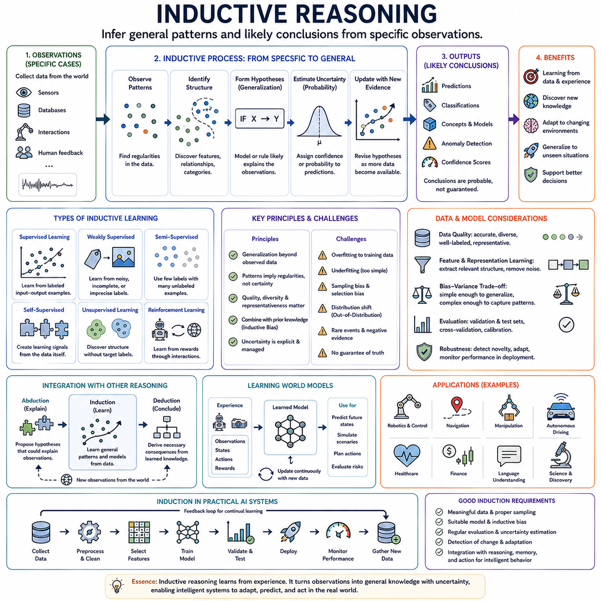{width="7.268055555555556in" height="7.268055555555556in"}

귀납적 추론(Inductive Reasoning)은 관측, 사례 또는 개별적인 경험을 이용하여 더 광범위한 패턴, 일반 원리 또는 가능성이 높은 결론을 추론하는 방식입니다. 연역(Deduction)과 달리 귀납은 결론이 반드시 참이라는 것을 보장하지 않습니다. 대신 이전에 관측된 사례에서 축적된 증거를 기반으로 무엇이 참일 가능성이 높은지를 추정합니다.

귀납의 기본적인 방향은 구체적인 관측에서 일반화(Generalization)로 이동합니다. 유사한 조건에서 비슷한 결과가 반복적으로 나타나면 추론 시스템은 그 이면에 일정한 규칙성(Regularity)이 존재한다고 추론할 수 있습니다. 이러한 능력을 통해 지능형 시스템은 환경에 대한 모든 규칙을 사전에 명시적으로 정의하지 않고도 유용한 구조를 발견할 수 있습니다.

유한한 관측 집합만으로는 일반적으로 보편적인 규칙을 절대적으로 확정할 수 없기 때문에 귀납적 결론(Inductive Conclusions)은 본질적으로 불확실합니다. 수천 개의 일관된 사례가 존재하더라도 다음 관측이 동일한 패턴을 따른다는 것을 논리적으로 보장할 수는 없습니다. 따라서 귀납은 타당한 연역에서 나타나는 논리적 필연성 대신 서로 다른 수준의 신뢰도를 가진 결론을 생성합니다.

이러한 불확실성이 귀납을 본질적으로 약하거나 신뢰할 수 없는 추론으로 만드는 것은 아닙니다. 실용적인 지식의 상당 부분은 경험에서 안정적인 규칙성을 인식하는 데 의존합니다. 인간은 반복적인 경험을 통해 객체, 환경, 사람, 언어 및 물리적 과정에 대한 기대를 학습합니다. 인공지능 역시 데이터를 이용하여 개별 학습 사례를 넘어 일반화할 수 있는 통계적 관계를 추론합니다.

따라서 일반화(Generalization)는 귀납적 추론의 핵심 목표 가운데 하나입니다. 시스템은 학습에 사용된 관측을 단순히 암기해서는 안 됩니다. 새로운 상황에서도 유용하게 적용될 수 있는 패턴을 추출해야 합니다. 성공적인 일반화를 위해서는 특정 데이터셋의 우연한 특성이 아니라 의미 있는 구조를 나타내는 관계를 식별해야 합니다.

귀납의 단순한 형태 가운데 하나는 열거적 귀납(Enumerative Induction)으로, 동일한 속성을 지지하는 반복적인 관측을 이용하여 더 광범위한 규칙을 추론합니다. 특정 범주의 많은 사례가 하나의 특성을 보인다면 시스템은 그 특성이 해당 범주에서 일반적이라고 추론할 수 있습니다. 이러한 추론의 강도는 관측의 수량, 다양성, 품질 및 대표성에 따라 달라집니다.

통계적 귀납(Statistical Induction)은 표본 데이터로부터 모집단의 속성을 추정함으로써 이러한 개념을 확장합니다. 모든 구성원이 동일한 특성을 가진다고 주장하는 대신 시스템은 분포, 빈도, 확률, 기대값 또는 상관관계를 추정할 수 있습니다. 이는 불완전한 관측으로부터 추론하면서 불확실성을 명시적으로 표현하기 위한 수학적 기반을 제공합니다.

표본의 품질(Sampling Quality)은 귀납적 결론에 큰 영향을 줍니다. 대규모 데이터셋이라도 표본이 중요한 사례를 체계적으로 제외하거나 특정 조건을 과도하게 포함하면 잘못된 일반화를 생성할 수 있습니다. 따라서 거의 동일한 조건에서 수집된 유사한 사례의 수를 단순히 증가시키는 것보다 대표성 있는 관측을 확보하는 것이 더 중요할 수 있습니다.

선택 편향(Selection Bias)은 관측 데이터가 최종적으로 결론이 적용될 환경을 대표하지 못할 때 발생합니다. 주로 양호한 조건에서 학습된 시스템은 어려운 환경에서 실패하는 패턴을 추론할 수 있습니다. 따라서 강건한 귀납(Robust Induction)을 위해서는 데이터가 어떻게 수집되고, 필터링되고, 라벨링되고, 분포되는지를 세심하게 고려해야 합니다.

귀납적 추론은 패턴 인식(Pattern Recognition)과 밀접하게 관련됩니다. 감각 신호, 언어, 행동 또는 시스템 측정값에서 반복되는 구조는 기반 범주와 관계의 존재를 암시할 수 있습니다. 패턴 인식은 반복되는 구성을 식별하고, 귀납은 이러한 규칙성을 더 광범위한 예측, 개념, 규칙 또는 모델을 지지하는 증거로 해석합니다.

개념 학습(Concept Learning)은 귀납의 또 다른 중요한 형태입니다. 지능형 시스템은 사례를 관측하고 특정 개념의 구성원과 비구성원을 구분하는 표현을 개발합니다. 학습된 개념은 하나의 명시적인 속성이 아니라 여러 특징의 조합에 의존할 수 있으며, 이를 통해 이전 사례와 표면적으로 다른 새로운 사례도 인식할 수 있습니다.

머신러닝(Machine Learning)은 넓은 의미에서 데이터로부터 수행되는 계산적 귀납(Computational Induction)으로 이해할 수 있습니다. 학습 알고리즘은 사례를 입력받아 예측이나 의사결정에 유용한 관계를 포착하도록 모델을 조정합니다. 결과 모델은 모든 사례를 독립적으로 저장하는 단순한 데이터베이스가 아니라 관측을 생성한 과정에 대한 일반화된 가설을 표현합니다.

지도 학습(Supervised Learning)은 입력-출력 사례로부터 귀납을 수행합니다. 학습 데이터는 관측과 함께 목표 라벨 또는 값을 제공하고 모델은 이전에 보지 못한 입력에 대해 목표를 예측하는 매핑을 학습합니다. 분류(Classification), 회귀(Regression), 객체 인식, 고장 진단 및 다양한 AI 작업이 이러한 기본적인 귀납 구조를 사용합니다.

약지도 학습(Weakly Supervised Learning)은 불완전하거나, 부정확하거나, 잡음이 있거나, 거친 수준으로만 제공되는 라벨에서 귀납을 수행합니다. 시스템은 불완전한 지도 정보에도 불구하고 유용한 내부 구조를 추론해야 합니다. 상세한 라벨링에는 많은 비용이 들지만 부분적으로 유용한 대규모 데이터를 비교적 쉽게 수집할 수 있는 경우 이 접근 방법이 유용합니다.

준지도 학습(Semi-Supervised Learning)은 비교적 적은 양의 라벨 데이터와 더 많은 양의 비라벨 데이터를 결합합니다. 라벨이 있는 사례는 명시적인 작업 지침을 제공하고 비라벨 관측은 입력 분포의 추가적인 구조를 보여줍니다. 효과적인 귀납은 두 정보원을 함께 활용하여 제한적인 라벨만으로 학습하는 것보다 더 높은 일반화 성능을 가진 표현을 구성합니다.

자기지도 학습(Self-Supervised Learning)은 데이터 자체의 구조에서 학습 신호를 생성합니다. 시스템은 가려진 부분, 미래 관측, 서로 다른 뷰(View) 사이의 관계 또는 표현 사이의 변환을 예측할 수 있습니다. 이러한 예측 작업은 모든 학습 사례에 사람이 직접 라벨을 지정하지 않고도 재사용 가능한 규칙성을 추론하도록 모델을 유도합니다.

비지도 학습(Unsupervised Learning) 역시 일반적인 목표 라벨 없이 구조를 탐색합니다. 군집화(Clustering), 차원 축소(Dimensionality Reduction), 밀도 추정(Density Estimation), 표현 학습(Representation Learning)은 범주, 다양체(Manifolds), 잠재 변수(Latent Variables) 또는 반복적인 패턴을 발견할 수 있습니다. 발견된 구조는 이후 추론, 예측, 이상 탐지 또는 지도 학습을 지원할 수 있습니다.

일반화된 결론에는 일반적으로 불확실성이 존재하기 때문에 귀납은 확률적 추론(Probabilistic Reasoning)과 깊게 연결됩니다. 모델은 어떤 사건이 반드시 발생한다고 주장하기보다 이전 관측을 기반으로 사건이 발생할 가능성을 추정할 수 있습니다. 확률은 신뢰도를 표현하고 추가 증거가 제공될 때 기대를 업데이트하기 위한 언어를 제공합니다.

베이지안 귀납(Bayesian Induction)은 가설을 증거가 축적됨에 따라 확률이 변화하는 불확실한 가능성으로 취급합니다. 사전 믿음(Prior Beliefs)은 초기 기대를 표현하고, 관측 데이터는 증거를 제공하며, 사후 믿음(Posterior Beliefs)은 경쟁 가설의 업데이트된 가능성을 나타냅니다. 이 프레임워크는 귀납에 기존 가정과 새롭게 관측된 정보가 모두 관여한다는 사실을 명시적으로 보여줍니다.

모델 선택(Model Selection)은 동일한 관측을 설명할 수 있는 서로 다른 가설이 많기 때문에 핵심적인 귀납 문제입니다. 매우 복잡한 모델은 학습 데이터에 매우 잘 맞으면서 의미 있는 구조 대신 잡음을 학습할 수 있습니다. 더 단순한 모델은 학습 데이터를 완벽하게 설명하지 못하더라도 더 잘 일반화할 수 있습니다. 따라서 귀납적 추론은 설명력과 복잡성 사이의 균형을 필요로 합니다.

이러한 균형은 여러 가설이 사용 가능한 증거를 비슷하게 설명한다면 일반적으로 더 단순한 설명을 선호하는 오컴의 원리(Occam\'s Principle)와 밀접하게 관련됩니다. 단순성이 진실을 보장하는 것은 아니지만 지나친 복잡성은 다시 나타나지 않을 우연한 세부 사항까지 모델이 재현하도록 만들 수 있습니다. 머신러닝의 정규화(Regularization)는 이와 유사한 선호를 계산적으로 구현합니다.

과적합(Overfitting)은 모델이 학습 사례를 지나치게 구체적으로 학습하여 새로운 데이터에 일반화하지 못할 때 발생합니다. 모델은 학습 과정에서는 매우 높은 정확도를 보이지만 실제 배포에서는 성능이 크게 떨어질 수 있습니다. 과적합은 성공적인 귀납을 이미 경험한 관측을 얼마나 잘 설명하는지만으로 평가할 수 없다는 점을 보여줍니다.

과소적합(Underfitting)은 그 반대의 문제를 나타냅니다. 모델이 너무 단순하거나 충분히 학습되지 않아 데이터의 중요한 규칙성을 포착하지 못할 수 있습니다. 그 결과 익숙한 사례와 새로운 사례 모두에서 낮은 성능을 나타냅니다. 효과적인 귀납에는 의미 있는 구조를 포착할 만큼 충분한 표현 능력을 가지면서 불필요한 변화에 지나치게 민감하지 않은 모델이 필요합니다.

검증 데이터(Validation Data)는 학습된 패턴이 학습 관측을 넘어 일반화되는지를 추정하는 데 도움을 줍니다. 별도의 테스트 세트(Test Set)는 이전에 보지 못한 사례에 대한 성능을 추가적으로 평가합니다. 이러한 절차는 귀납의 핵심 요구조건을 실제로 구현합니다. 유용한 일반화라면 가설 구성에 직접 참여하지 않은 증거에서도 계속 작동해야 합니다.

분포 이동(Distribution Shift)은 더욱 어려운 문제를 발생시킵니다. 홀드아웃 데이터(Held-Out Data)에 잘 일반화된 모델이라도 실제 배포 조건이 학습 분포와 다르면 실패할 수 있습니다. 환경, 센서, 하드웨어, 사용자, 작업, 날씨, 조명 또는 운영 절차의 변화는 이전에 학습된 관계를 약화시킬 수 있습니다.

따라서 분포 외 추론(Out-of-Distribution Reasoning)에는 새로운 관측이 기존 경험과 크게 다른 시점을 인식하는 능력이 필요합니다. 시스템은 이전의 귀납적 결론을 동일한 신뢰도로 자동 적용해서는 안 됩니다. 새로운 상황의 탐지는 추가 센싱, 모델 적응, 인간 검토, 시뮬레이션 또는 더욱 보수적인 의사결정 전략을 유발할 수 있습니다.

귀납적 추론에는 관련 특징(Relevant Features)을 식별하는 과정도 포함됩니다. 원시 관측에는 막대한 정보가 포함될 수 있지만 관심 대상 속성을 예측하는 정보는 일부에 불과합니다. 특징 선택(Feature Selection)과 표현 학습은 관련 없는 변화를 억제하면서 유용한 구조를 분리하려고 합니다. 더 좋은 표현은 일반적으로 더 강력한 일반화로 직접 이어집니다.

심층 신경망(Deep Neural Networks)은 원시 데이터를 여러 계층의 학습된 특징으로 변환하여 계층적 표현 학습(Hierarchical Representation Learning)을 수행합니다. 초기 표현은 국소적인 패턴을 포착하고 이후 표현은 점점 더 추상적인 관계를 인코딩할 수 있습니다. 학습을 통해 이러한 표현은 이미지, 언어, 오디오, 센서 신호 및 멀티모달 데이터에 대한 귀납적 일반화를 지원합니다.

대규모 언어 모델(Large Language Models, LLMs) 역시 근본적으로 대규모 귀납에 의존합니다. 학습 과정에서 방대한 언어적·개념적 관계를 접하고 새로운 시퀀스를 예측하고 생성할 수 있는 통계적 규칙성을 학습합니다. 이들의 행동은 가능한 모든 프롬프트에 대해 사람이 명시적으로 작성한 규칙을 저장한 것이 아니라 학습 데이터에서 추출한 일반화된 패턴을 반영합니다.

이러한 모델은 많은 추론 구조 자체가 데이터에서 반복되는 패턴이기 때문에 추론처럼 보이는 능력을 나타낼 수 있습니다. 설명, 연역, 유추, 계산, 계획 및 논증이 일반적으로 어떻게 구성되는지를 학습할 수 있습니다. 그러나 통계적 일반화가 생성된 모든 추론 시퀀스의 논리적 또는 사실적 정확성을 보장하는 것은 아닙니다.

따라서 귀납과 연역(Deduction)은 상호 보완적인 능력을 제공합니다. 귀납은 관측으로부터 후보 규칙이나 모델을 발견할 수 있고 연역은 이러한 규칙과 전제가 받아들여지면 필연적인 결과를 도출할 수 있습니다. 지능형 시스템은 데이터에서 관계를 귀납적으로 학습한 후 이를 이후의 추론 과정에서 구조화된 지식으로 사용할 수 있습니다.

귀추(Abduction) 역시 귀납과 밀접하게 상호작용합니다. 예상하지 못한 관측이 나타나면 귀추적 추론은 이를 설명할 수 있는 가설을 제안할 수 있습니다. 이후 여러 사례에서 반복되는 증거를 통해 이러한 가설을 귀납적으로 강화하거나 약화시킬 수 있습니다. 시간이 지나면서 타당한 설명은 관측을 지속적으로 성공적으로 예측할 경우 안정적인 일반화 모델로 발전할 수 있습니다.

과학적 추론(Scientific Reasoning)은 세 가지 과정을 자주 결합합니다. 관측은 귀납을 통해 패턴을 제시하고, 귀추를 통해 이를 설명하는 가설을 제안하며, 연역을 통해 해당 가설이 정확하다면 발생해야 하는 예측을 도출합니다. 이후 실험을 통해 새로운 증거를 생성하여 가설을 수정하거나, 거부하거나, 강화할 수 있습니다.

인과적 귀납(Causal Induction)은 통계적 연관성을 넘어 원인과 결과를 반영할 가능성이 있는 관계를 추론하려고 합니다. 숨겨진 변수나 공통 원인이 관측된 패턴을 생성할 수 있기 때문에 반복적인 상관관계만으로는 충분하지 않습니다. 개입(Intervention), 시간적 구조, 통제된 실험 및 인과적 가정은 인과 관계에 대해 더 강력한 증거를 제공할 수 있습니다.

시간적 귀납(Temporal Induction)은 시퀀스에서 반복되는 규칙성을 발견합니다. 반복적인 전이를 통해 상태가 시간에 따라 어떻게 변화하는 경향이 있는지를 파악할 수 있으며 최근 이력에서 미래 상태를 예측할 수 있습니다. 시계열 예측(Time-Series Forecasting), 행동 예측, 장비 모니터링, 언어 모델링 및 로봇 동역학 학습은 모두 시간적 규칙성에 의존합니다.

공간적 귀납(Spatial Induction)은 위치, 형상, 영역, 객체 및 환경 사이에서 반복되는 관계를 학습합니다. 로봇은 어떤 기하학적 구성이 일반적으로 주행 가능한 지형, 안정적인 파지 표면, 장애물 또는 이동 통로를 나타내는지를 학습할 수 있습니다. 이러한 일반화된 공간 관계는 이전에 정확히 경험하지 못한 환경에서 의사결정을 지원합니다.

관계적 귀납(Relational Induction)은 개별 특징보다 개체 사이의 패턴에 초점을 맞춥니다. 시스템은 객체 사이의 특정 관계가 상호작용이나 결과를 예측한다는 사실을 발견할 수 있습니다. 그래프 신경망(Graph Neural Networks)과 관계 모델(Relational Models)은 연결성, 위상 구조, 계층 또는 상호작용 구조에 의존하는 패턴을 학습하기 위한 메커니즘을 제공합니다.

유추적 추론(Analogical Reasoning)은 반복적인 구조적 유사성이 새로운 사례에 대한 기대를 지원한다는 점에서 부분적으로 귀납적 과정으로 해석할 수 있습니다. 동일한 특징에만 의존하는 대신 시스템은 이전 상황과 현재 상황이 공유하는 관계 패턴을 식별합니다. 이를 통해 표면적 형태는 다르지만 더 깊은 구조를 공유하는 작업 사이에서 경험을 전이할 수 있습니다.

귀납적 전이(Inductive Transfer)는 재사용 가능한 지능에서 핵심적입니다. 하나의 도메인에서 학습된 지식은 다른 도메인의 학습을 가속하는 표현, 사전 지식 또는 전략을 제공할 수 있습니다. 전이 학습(Transfer Learning), 사전학습 모델(Pretrained Models), 파운데이션 모델(Foundation Models), 퓨샷 적응(Few-Shot Adaptation)은 이전 데이터에서 학습한 패턴이 원래의 문맥을 넘어 유용할 수 있다는 원리를 활용합니다.

퓨샷 학습(Few-Shot Learning)은 소수의 새로운 사례만으로 일반화하는 능력을 강조합니다. 강력한 사전 표현(Prior Representations)은 새로운 개념이나 작업을 추론하기 위해 필요한 추가 증거의 양을 줄입니다. 이는 광범위한 이전 경험을 통해 제한된 시연만으로도 새로운 범주나 절차를 습득하는 인간의 학습과 유사합니다.

지속 학습(Continual Learning)은 지능형 시스템의 운영 수명 전체에 걸쳐 귀납을 확장합니다. 새로운 관측은 기존 모델을 수정할 수 있는 증거를 지속적으로 제공합니다. 시스템은 유용한 새로운 패턴을 통합하면서 이전에 학습한 능력을 보존하고 치명적 망각(Catastrophic Forgetting)과 내부 표현의 통제되지 않는 드리프트(Drift)를 방지해야 합니다.

기억(Memory)은 지속적인 귀납에서 중요한 역할을 합니다. 대표적인 경험을 저장하고 모델 업데이트 과정에서 재현(Replay)함으로써 새로운 관측을 통합하면서 기존 지식을 보존하는 데 도움을 줄 수 있습니다. 현재 상황이 불확실하거나 새로운 패턴이 이전에도 나타났는지를 판단해야 하는 경우 기억은 비교할 사례도 제공합니다.

기억 통합(Memory Consolidation)은 반복적인 경험을 더욱 안정적인 일반화 지식으로 변환합니다. 모든 관측을 동일한 중요도로 유지하는 대신 시스템은 반복되는 구조를 식별하여 개념, 모델, 프로토타입(Prototype) 또는 정책(Policy)으로 압축할 수 있습니다. 이러한 과정은 일화적 경험(Episodic Experience)을 의미 기억(Semantic Memory) 및 장기적인 추론 능력과 연결합니다.

귀납적 추론은 월드 모델 학습(World Model Learning)에도 필수적입니다. 월드 모델은 환경이 어떻게 변화하고, 객체가 어떻게 상호작용하며, 행동이 미래 상태에 어떤 영향을 미치는지를 설명하는 규칙성을 추론해야 합니다. 가능한 모든 물리적 상황에 대해 이러한 관계를 수동으로 정의할 수 없기 때문에 관측과 상호작용을 통한 학습이 근본적으로 필요합니다.

로봇은 센서 관측, 내부 상태, 행동 및 그 결과로 발생한 환경 변화를 포함하는 시퀀스를 수집할 수 있습니다. 귀납 학습은 이러한 시퀀스를 이용하여 전이 동역학(Transition Dynamics)을 추정할 수 있습니다. 이후 학습된 모델은 후보 행동을 고려할 때 발생할 가능성이 높은 미래 상태를 예측하여 실제 물리적 실행 이전의 계획을 지원할 수 있습니다.

월드 상태가 카메라, 라이다(LiDAR), 레이더(Radar), 마이크, 촉각 센서, 관성 측정 장치(Inertial Measurement Unit, IMU), 위성항법시스템(Global Navigation Satellite System, GNSS), 관절 인코더 및 기타 센서를 통해 관측될 때 멀티모달 귀납(Multimodal Induction)이 중요해집니다. 각 모달리티(Modality)는 환경에 대한 부분적인 증거를 제공하며 학습은 모달리티별 규칙성과 여러 모달리티가 공유하는 관계를 모두 식별해야 합니다.

교차 모달 일관성(Cross-Modal Consistency)은 강력한 학습 신호를 제공할 수 있습니다. 시각적 움직임은 관성 측정값과 대응할 수 있고, 객체의 기하학은 카메라와 라이다 사이에서 정렬될 수 있으며, 명령된 로봇 움직임은 고유수용성(Proprioceptive) 관측과 외부 관측에서 관련된 변화를 발생시켜야 합니다. 이러한 관계는 대규모 자기지도 및 약지도 학습을 지원할 수 있습니다.

피지컬 AI(Physical AI)는 귀납적 추론이 실제 상호작용에 기반해야 합니다. 로봇은 이전 경험을 바탕으로 어떤 표면이 주행 가능하고, 객체가 파지 가능하며, 움직임이 안전하다고 추론할 수 있지만 이러한 결론은 여전히 물리적 현실에 대한 가설입니다. 상호작용은 학습된 기대를 확인하고, 개선하거나, 반박하는 새로운 증거를 제공합니다.

행동유도성 학습(Affordance Learning)은 명확한 사례입니다. 로봇은 관측과 상호작용을 통해 객체의 속성, 환경적 문맥, 가능한 행동 및 그 결과 사이의 관계를 학습할 수 있습니다. 단순히 객체의 범주를 인식하는 것을 넘어 특정한 물리적 조건에서 해당 객체를 이용하여 무엇을 할 수 있을 가능성이 높은지를 학습합니다.

로봇 내비게이션(Robot Navigation) 역시 귀납에 의존합니다. 경험을 통해 어떤 지형의 외관이 안정적인 주행과 연결되는지, 어떤 환경 구조가 장애물을 예측하는지, 서로 다른 표면이 움직임에 어떤 영향을 주는지를 파악할 수 있습니다. 이러한 학습 관계는 복잡한 실외 환경에서 기하학적 지도와 명시적 물리 모델을 보완할 수 있습니다.

조작 시스템(Manipulation Systems)은 파지 성공, 접촉 행동, 객체 동역학 및 행동 결과를 귀납적으로 학습할 수 있습니다. 대규모 시연(Demonstrations)이나 자율 상호작용 데이터를 이용하면 수동으로 인코딩하기 어려운 패턴을 발견할 수 있습니다. 이후 학습된 예측을 이용하여 후보 행동 선택을 안내하고 안전하지 않거나 효과가 낮은 시행 횟수를 줄일 수 있습니다.

시뮬레이션(Simulation)은 귀납적 데이터를 제공하는 또 다른 원천입니다. 물리 로봇보다 가상 환경에서 훨씬 저렴하고 안전하게 대량의 궤적(Trajectories)을 생성할 수 있습니다. 시뮬레이션에서 학습된 모델은 광범위한 규칙성을 학습할 수 있지만 시뮬레이션과 현실의 차이로 인해 심투리얼 갭(Sim-to-Real Gap)이 발생하며 이를 해결해야 합니다.

도메인 랜덤화(Domain Randomization)는 다양한 시뮬레이션 조건에 모델을 노출하여 일반화를 향상시키려고 합니다. 외관, 조명, 마찰, 질량, 기하학, 센서 잡음 및 기타 파라미터를 학습 사례마다 변화시킬 수 있습니다. 목적은 모델이 제한적인 시뮬레이션 세부 사항에 지나치게 의존하는 것을 방지하고 더욱 전이 가능한 표현을 학습하도록 하는 것입니다.

시뮬레이션은 모든 물리 현상을 완벽하게 재현할 수 없기 때문에 실제 데이터(Real-World Data)는 여전히 필요합니다. 시뮬레이션 관측과 실제 관측을 결합하면 데이터 규모와 현실 기반성(Grounding)을 동시에 확보할 수 있습니다. 이때 귀납은 두 도메인에서 안정적으로 유지되는 패턴을 식별하면서 실제 운영에 중요한 차이에 적응하는 과정이 됩니다.

능동 학습(Active Learning)은 시스템이 어떤 증거를 받을 것인지에 영향을 줄 수 있도록 합니다. 고정된 데이터셋을 수동적으로 받아들이는 대신 에이전트는 어떤 관측의 라벨이나 결과가 특히 유용한지를 식별합니다. 이후 인간에게 라벨링을 요청하거나, 실험을 수행하거나, 안전한 행동을 실행하거나, 불확실성을 줄일 수 있는 영역을 탐색할 수 있습니다.

능동 탐색(Active Exploration)은 이러한 원리를 체화 에이전트(Embodied Agents)로 확장합니다. 로봇은 더 나은 관측 시점을 확보하기 위해 의도적으로 이동하거나, 객체의 특성을 파악하기 위해 조작하거나, 통제된 상호작용을 통해 가설을 시험할 수 있습니다. 시스템이 생성할 것으로 예상되는 정보의 가치에 따라 행동을 선택한다는 점에서 추론과 학습이 서로 결합됩니다.

귀납적 신뢰도(Inductive Confidence)는 관측의 수뿐 아니라 다양성과 독립성에도 의존해야 합니다. 거의 동일한 수천 개의 사례보다 서로 크게 다른 환경과 조건을 포함하는 더 작은 데이터 집합이 더 강력한 증거를 제공할 수 있습니다. 따라서 데이터셋 다양성(Dataset Diversity)은 강건한 피지컬 AI를 구현하는 데 매우 중요합니다.

희귀 사건(Rare Events)은 중요한 실패가 일반적인 학습 데이터를 지배할 만큼 자주 발생하지 않기 때문에 큰 문제를 제기합니다. 그러나 안전 중요 시스템은 이러한 사건에 대해서도 추론해야 합니다. 자연 관측만으로 충분하지 않은 경우 목표 지향적 데이터 수집, 시뮬레이션, 합성 데이터 생성(Synthetic Generation), 이상 사례 마이닝(Anomaly Mining), 명시적 안전 제약조건을 이용하여 일반적인 귀납을 보완할 수 있습니다.

부정적 증거(Negative Evidence) 역시 중요합니다. 성공 사례만으로 학습하면 어떤 행동이 가능한지에 대해 지나치게 낙관적인 결론을 생성할 수 있습니다. 실패한 파지, 차단된 경로, 불안정한 지형, 잘못된 예측 및 안전하지 않은 구성은 이전에 성공했던 패턴이 더 이상 적용되지 않는 경계와 조건에 대한 정보를 제공합니다.

귀납 편향(Inductive Bias)은 학습기가 관측된 데이터를 넘어 일반화할 수 있도록 하는 가정을 의미합니다. 가능한 가설 가운데 어떤 선호도도 없다면 유한한 관측은 무수히 많은 설명과 양립할 수 있습니다. 신경망 아키텍처, 정규화, 국소성(Locality) 가정, 대칭성(Symmetry), 시간적 연속성, 물리적 제약조건 및 사전학습 표현은 모두 귀납 편향을 제공합니다.

적절한 귀납 편향은 학습 효율성을 크게 향상시킬 수 있습니다. 합성곱 아키텍처(Convolutional Architectures)는 공간적 국소성을 활용하고, 그래프 네트워크(Graph Networks)는 관계 구조를 활용하며, 등변 모델(Equivariant Models)은 특정 변환에 대한 관계를 보존합니다. 물리적 제약조건 역시 알려진 역학과 일치하는 해결책을 선호하도록 모델을 유도하여 유용한 행동을 학습하는 데 필요한 데이터의 양을 줄일 수 있습니다.

잘못된 귀납 편향은 체계적인 실패를 발생시킬 수 있습니다. 모델은 의도한 현상을 표현하지 않으면서도 학습 라벨을 예측하는 배경 텍스처, 센서 인공물(Sensor Artifacts), 데이터셋 특유의 상관관계 또는 기타 지름길에 의존할 수 있습니다. 이러한 지름길 학습(Shortcut Learning)은 배포 환경이 변화하기 전까지 발견되지 않을 수 있습니다.

해석 가능성(Interpretability)은 어떤 패턴이 귀납적 결론을 뒷받침하는지를 식별하는 데 도움을 줄 수 있습니다. 특징 기여도(Feature Attribution), 개념 분석, 반사실적 테스트(Counterfactual Testing), 대표 사례 및 모델 프로빙(Model Probing)을 이용하여 모델이 의미 있는 증거에 의존하는지 아니면 의도하지 않은 상관관계에 의존하는지를 확인할 수 있습니다. 학습된 결론이 고위험 행동에 영향을 주는 경우 해석은 특히 중요합니다.

보정(Calibration)은 예측된 신뢰도가 실제 신뢰성과 일치하는지를 의미합니다. 약 90퍼센트의 신뢰도를 보고하는 모델이라면 이상적으로 유사한 예측들에서 약 그 정도의 빈도로 정확해야 합니다. 적절한 보정은 이후의 추론 및 계획 시스템이 위험과 불확실성을 균형 있게 고려하면서 학습된 예측을 보다 적절하게 사용할 수 있도록 합니다.

귀납적 결론은 논리적으로 보장되지 않기 때문에 검증(Verification)이 여전히 필요합니다. 학습 모델은 가능성이 높은 상태, 분류 또는 궤적을 제안하고 외부 검사는 엄격한 제약조건이 만족되는지를 판단할 수 있습니다. 통계적 예측과 연역적 검증(Deductive Verification)을 결합하면 높은 신뢰도를 가진 학습 오류가 안전하지 않은 행동으로 이어지는 일부 상황을 방지할 수 있습니다.

이러한 결합은 자율 시스템(Autonomous Systems)에서 특히 중요합니다. 귀납 모델은 명시적인 규칙을 구축하기 어려운 복잡한 지각과 예측을 처리하고 연역적 제약조건은 안전 경계, 임무 요구사항 및 논리적 의존성을 강제할 수 있습니다. 결과적으로 이러한 아키텍처는 적응성과 중요 조건에 대한 명시적인 제어를 결합합니다.

월드 모델(World Models)은 귀납, 예측 및 추론이 자연스럽게 만나는 지점을 제공합니다. 귀납 학습은 경험으로부터 환경 동역학(Environmental Dynamics)의 표현을 구축합니다. 학습된 모델은 가능한 미래를 예측하고, 추론은 이러한 미래를 평가하며, 계획은 행동을 선택합니다. 이후 새로운 실행 데이터가 다시 학습 과정으로 전달되어 모델을 지속적으로 개선합니다.

이는 폐쇄형 학습-추론-행동 루프(Closed Learning-Reasoning-Action Loop)를 형성합니다. 관측은 증거를 제공하고, 귀납은 일반화된 지식을 업데이트하며, 예측은 미래 상태를 추정하고, 추론은 대안을 비교하며, 행동은 환경을 변화시키고, 그 결과 발생하는 관측은 추가적인 증거를 제공합니다. 지능은 하나의 고립된 추론 메커니즘이 아니라 이러한 과정 사이의 반복적인 상호작용을 통해 형성됩니다.

따라서 귀납의 품질은 전체 데이터 생명주기(Data Lifecycle)에 의존합니다. 센서 보정, 동기화, 데이터 선택, 주석 품질, 전처리, 저장, 샘플링, 학습, 검증, 배포 모니터링 및 피드백은 모두 AI 시스템이 학습하는 결론에 영향을 줍니다. 이러한 파이프라인의 초기 단계에서 발생한 오류는 이후 모델에 내재화될 수 있습니다.

장기간 운영되는 자율 에이전트에서 귀납적 추론은 세계가 변화한다는 사실도 인식해야 합니다. 이전에 신뢰할 수 있었던 패턴도 환경, 하드웨어, 작업, 사람 또는 운영 절차가 변화하면 더 이상 유효하지 않을 수 있습니다. 따라서 학습된 관계가 현실을 계속 정확하게 예측하는지를 판단하기 위한 지속적인 모니터링이 필요합니다.

모델 적응(Model Adaptation)은 오래된 관계를 업데이트할 수 있지만 통제되지 않는 적응은 새로운 위험을 발생시킵니다. 새로운 데이터에는 잡음, 편향, 적대적 정보 또는 일시적인 비정상 상태가 포함될 수 있습니다. 따라서 강건한 지속 귀납(Robust Continual Induction)을 위해서는 어떤 경험이 장기 지식을 수정해야 하는지와 기존 모델에 어느 정도 영향을 주어야 하는지를 결정하는 메커니즘이 필요합니다.

인간의 지식은 귀납에 유용한 사전 정보(Priors)와 제약조건을 제공할 수 있습니다. 엔지니어링 원리, 도메인 규칙, 안전 요구사항, 온톨로지 및 물리 모델을 이용하여 학습이 시작되기 전에 가설 공간(Hypothesis Space)을 제한할 수 있습니다. 이를 통해 데이터에 대한 부담을 줄이고 잘 확립된 제약조건과 모순되는 관계를 모델이 채택하는 것을 방지할 수 있습니다.

동시에 귀납 학습은 인간이 명시적으로 예상하지 못했던 관계를 발견할 수 있습니다. 대규모 데이터셋에는 수동으로 식별하기 어려운 변수 사이의 미묘한 상호작용이 포함될 수 있습니다. 이러한 발견 능력은 귀납의 주요 강점 가운데 하나이며 현대 데이터 중심 인공지능(Data-Driven Artificial Intelligence)에서 귀납이 핵심적인 역할을 하는 이유입니다.

따라서 목표는 구조화된 추론을 통계적 학습으로 대체하거나 학습을 수동으로 정의된 논리로 대체하는 것이 아닙니다. 고급 지능형 시스템은 두 접근 방법 모두에서 이점을 얻습니다. 귀납은 경험에서 규칙성을 발견하고, 연역은 필연적인 결과를 도출하며, 귀추는 설명 가능한 가설을 생성하고, 확률적 추론은 여러 대안 사이의 불확실성을 관리합니다.

LLM 에이전트(LLM Agents), 로보틱스(Robotics), 피지컬 AI(Physical AI)에서 귀납적 추론은 경험을 재사용 가능한 지식으로 변환하는 메커니즘을 제공합니다. 반복적인 관측은 이전에 정확히 경험하지 못한 상황에서도 행동을 안내할 수 있는 표현, 기대, 예측 모델, 개념 및 정책으로 변환됩니다.

신뢰할 수 있는 귀납에는 단순히 대규모 데이터셋만 필요한 것이 아닙니다. 대표성 있고 다양한 증거, 적절한 귀납 편향, 강건한 검증, 불확실성 추정, 분포 이동 탐지, 기억, 지속적인 적응 및 중요한 예측을 외부 현실과 비교하여 검증하는 메커니즘이 필요합니다.

궁극적으로 귀납적 추론(Inductive Reasoning)은 지능형 시스템이 명시적으로 제공된 정보를 넘어설 수 있도록 합니다. 관측에서 규칙성을 식별하고 이러한 규칙성을 새로운 상황으로 일반화함으로써 에이전트는 환경이 일반적으로 어떻게 행동하는지를 학습하고, 가능성이 높은 결과를 예상하며, 경험을 통해 내부 모델을 점진적으로 개선할 수 있습니다.

지각(Perception), 기억(Memory), 연역(Deduction), 귀추(Abduction), 월드 모델(World Models), 계획(Planning), 검증(Verification), 행동(Action)과 통합될 때 귀납은 적응형 지능(Adaptive Intelligence)을 위한 근본적인 메커니즘이 됩니다. 이는 축적된 경험과 미래 예측을 연결하며 자율 시스템이 관측을 변화하는 세계에 대한 점점 더 유용한 지식으로 지속적으로 변환할 수 있도록 합니다.

## 03.03 Abductive Reasoning [w/Code]

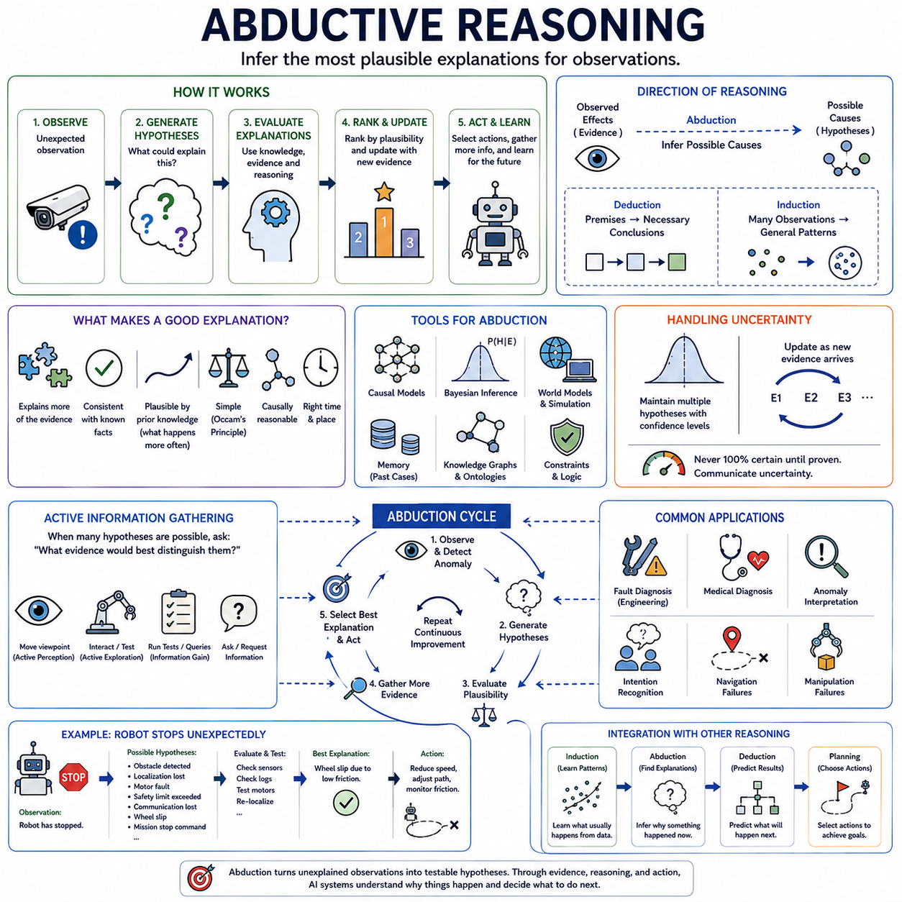{width="7.268055555555556in" height="7.268055555555556in"}

귀추적 추론(Abductive Reasoning)은 관측, 사건 또는 예상하지 못한 상태에 대해 가장 그럴듯한 설명을 찾는 추론 방식입니다. 확립된 전제로부터 필연적인 결론을 도출하거나 반복된 사례에서 일반적인 패턴을 추론하는 대신, 귀추는 증거에서 출발하여 관측된 현상을 합리적으로 설명할 수 있는 근본 원인, 가설 또는 상황이 무엇인지를 탐색합니다.

귀추의 기본적인 방향은 관측된 결과에서 가능한 원인으로 이동합니다. 지능형 시스템이 예상하지 못한 상태를 발견하면 해당 상태를 발생시킬 수 있는 하나 이상의 가설을 생성할 수 있습니다. 서로 다른 여러 원인이 유사한 관측 결과를 만들어낼 수 있기 때문에 이렇게 생성된 설명이 논리적으로 반드시 정확하다고 보장할 수는 없습니다.

이러한 특성은 귀추를 연역(Deduction) 및 귀납(Induction)과 구분합니다. 연역은 받아들여진 전제로부터 무엇이 반드시 따라오는지를 판단하고, 귀납은 반복적인 관측에서 일반적인 패턴을 발견합니다. 반면 귀추는 현재 이용 가능한 증거를 설명하기 위해 무엇이 발생했을 가능성이 있는지 또는 어떤 숨겨진 조건이 존재할 가능성이 있는지를 질문합니다.

귀추적 추론은 흔히 최선의 설명으로의 추론(Inference to the Best Explanation)이라고 설명됩니다. 목표는 논리적으로 가능한 모든 가설을 단순히 생성하는 것이 아니라 증거를 가장 잘 설명하는 가설을 식별하는 것입니다. 개연성(Plausibility), 단순성(Simplicity), 일관성(Consistency), 사전 지식(Prior Knowledge), 인과 관계(Causal Relationships), 설명 범위(Explanatory Coverage) 등이 어떤 가설을 선호할지 결정하는 데 영향을 줄 수 있습니다.

귀추적 추론 과정은 일반적으로 현재의 지식 상태만으로 직접 설명할 수 없는 관측이 발생할 때 시작됩니다. 시스템은 예상했던 상태와 실제 발생한 상태 사이의 불일치(Discrepancy)를 탐지합니다. 이러한 예측 오류(Prediction Error) 또는 이상(Anomaly)은 하나 이상의 후보 설명을 필요로 하는 추론 문제를 생성합니다.

따라서 가설 생성(Hypothesis Generation)은 귀추의 핵심 구성 요소입니다. 시스템은 관측 결과를 발생시킬 수 있는 조건을 찾기 위해 자신의 지식, 기억(Memory), 모델 및 이전 경험을 탐색해야 합니다. 개방형 환경(Open Environments)에서는 가능한 설명의 수가 매우 많아질 수 있으므로 효율적인 가설 생성이 중요합니다.

유용한 가설은 불필요한 가정을 추가하지 않으면서 관련 관측을 설명해야 합니다. 하나의 세부 사항만 설명하면서 많은 추가 가정을 요구하는 가설보다 여러 증거를 동시에 설명하는 가설이 일반적으로 더 매력적입니다. 이러한 선호는 귀추적 추론을 설명적 경제성(Explanatory Economy)의 원리와 연결합니다.

오컴의 원리(Occam\'s Principle)는 경쟁하는 여러 가설이 사용 가능한 증거를 비슷한 수준으로 설명하는 경우 더 단순한 설명을 선호하도록 귀추적 가설 선택을 안내할 수 있습니다. 단순성이 설명의 정확성을 증명하는 것은 아니지만, 추론 시스템이 과도한 가정을 이용하여 개별 관측에 맞춘 불필요하게 복잡한 설명을 만드는 것을 방지할 수 있습니다.

사전 지식(Prior Knowledge)도 귀추적 개연성에 영향을 줍니다. 여러 설명이 하나의 관측과 양립할 수 있다면 시스템은 유사한 상황에서 자주 발생하는 것으로 알려진 원인을 선호할 수 있습니다. 이것이 확실성을 의미하지는 않지만 축적된 경험을 이용하여 현재 문맥에서 가능성이 높은 가설을 우선적으로 탐색할 수 있습니다.

확률(Probability)은 귀추적 가설 사이의 불확실성을 표현하기 위한 자연스러운 프레임워크를 제공합니다. 시스템은 하나의 설명을 즉시 선택하는 대신 서로 다른 신뢰도를 가진 여러 가능성을 유지할 수 있습니다. 이후 새로운 증거가 추가되면 각각의 후보에 대한 확률을 증가시키거나 감소시키면서 하나의 설명이 행동에 충분한 수준으로 지지될 때까지 평가할 수 있습니다.

베이지안 추론(Bayesian Reasoning)은 이러한 과정을 형식적으로 해석할 수 있는 방법을 제공합니다. 사전 확률(Prior Probabilities)은 새로운 증거를 관측하기 전에 각 가설이 얼마나 그럴듯했는지를 나타내고, 우도(Likelihoods)는 각 가설이 관측된 증거를 얼마나 잘 예측하는지를 나타내며, 사후 확률(Posterior Probabilities)은 증거가 반영된 이후 업데이트된 믿음을 표현합니다. 따라서 귀추는 확률적 가설 평가(Probabilistic Hypothesis Evaluation)의 형태로 수행될 수 있습니다.

인과 지식(Causal Knowledge)은 설명이 일반적으로 어떤 사건이 왜 발생했는지를 다루기 때문에 귀추적 추론에서 특히 중요합니다. 시스템이 숨겨진 조건이 어떻게 관측 가능한 결과를 생성하는지를 설명하는 인과 모델(Causal Model)을 가지고 있다면 관측된 결과에서 가능한 원인을 향해 역방향으로 추론할 수 있습니다. 따라서 인과 모델은 진단과 설명을 위한 강력한 구조를 제공합니다.

그러나 상관관계(Correlation)만으로 반드시 타당한 설명을 제공할 수 있는 것은 아닙니다. 두 사건이 하나가 다른 하나를 발생시키기 때문이 아니라 공통된 다른 원인을 공유하기 때문에 함께 자주 나타날 수 있습니다. 따라서 신뢰할 수 있는 귀추에는 진정한 설명과 표면적인 연관성을 구분할 수 있는 인과 구조, 시간 정보, 개입(Interventions), 도메인 지식 및 물리적 제약조건이 도움이 됩니다.

시간적 관계(Temporal Relationships)는 귀추적 가설을 강력하게 제한할 수 있습니다. 일반적으로 제안된 원인은 그것이 설명하려는 결과보다 먼저 발생해야 하지만 지연되거나 지속되는 효과는 이러한 관계를 복잡하게 만들 수 있습니다. 사건의 발생 시점, 지속 시간, 순서 및 동기화(Synchronization)는 관측 증거와 표면적으로 양립하는 가설 가운데 일부를 제거할 수 있습니다.

공간적 관계(Spatial Relationships)도 유사한 제약조건을 제공합니다. 물리적 원인은 일반적으로 관측된 사건에 실제로 영향을 줄 수 있는 위치에 존재해야 합니다. 따라서 기하학, 거리, 연결성, 가시성, 접촉, 포함 관계 및 접근 가능성은 로보틱스(Robotics), 지각(Perception), 내비게이션(Navigation), 물리적 진단에서 후보 설명의 수를 줄일 수 있습니다.

귀추는 정보가 불완전할 때 특히 중요합니다. 실제 시스템에서는 관련된 모든 변수를 직접 관측하는 것이 거의 불가능합니다. 센서는 부분적인 관측만 제공하고 내부 상태는 숨겨질 수 있으며 외부 프로세스를 직접 측정하지 못할 수도 있습니다. 귀추적 추론은 지능형 시스템이 관측 가능한 증거를 설명할 수 있는 잠재 조건(Latent Conditions)을 추론하도록 합니다.

따라서 잠재 상태 추정(Latent-State Estimation)은 부분적으로 귀추적 추론으로 해석할 수 있습니다. 에이전트는 측정값을 관측하고 해당 측정값을 가장 그럴듯하게 생성했을 숨겨진 상태를 추론합니다. 추적(Tracking), 위치 추정(Localization), 객체 상태 추정(Object-State Estimation), 의도 인식(Intention Recognition), 고장 진단(Fault Diagnosis)은 모두 관측 가능한 결과에서 관측되지 않는 기반 조건을 추론하는 과정을 포함합니다.

의료 진단(Medical Diagnosis)은 익숙한 개념적 사례입니다. 증상은 관측이고 질병이나 생리적 상태는 가능한 설명입니다. 여러 상태가 유사한 증상을 발생시킬 수 있으므로 진단에는 추가적인 증거, 사전 확률, 검사, 인과 지식 및 전체 상황과의 일관성을 이용하여 가설을 비교하는 과정이 필요합니다.

엔지니어링 고장 진단(Engineering Fault Diagnosis)도 유사한 구조를 가집니다. 비정상적인 온도, 진동, 전류 소비, 통신 오류 또는 성능 저하는 여러 구성 요소의 고장을 의미할 수 있습니다. 진단 시스템은 후보 고장을 생성하고 어떤 고장 또는 고장의 조합이 관측된 증상을 가장 잘 설명하는지를 판단합니다.

모델 기반 진단(Model-Based Diagnosis)은 시스템이 정상적으로 어떻게 동작해야 하는지에 대한 명시적인 설명을 이용하여 이 과정을 형식화할 수 있습니다. 관측된 동작이 예측된 동작과 다르면 추론 시스템은 이러한 불일치를 설명할 수 있는 구성 요소, 가정 또는 환경 조건의 실패를 식별합니다. 따라서 진단은 모델과 관측 사이의 불일치에 대한 설명을 찾는 귀추적 탐색이 됩니다.

잔차 신호(Residual Signals)는 이러한 시스템에서 유용하게 사용됩니다. 잔차는 예상된 동작과 측정된 동작 사이의 차이를 나타냅니다. 서로 다른 고장 모드는 특징적인 잔차 패턴을 생성할 수 있으며, 진단 과정은 이러한 편차를 후보 원인으로 역매핑할 수 있습니다. 이후 추가적인 측정을 통해 경쟁하는 설명을 구분할 수 있습니다.

귀추는 과학적 발견(Scientific Discovery)의 기본적인 요소이기도 합니다. 연구자는 기존 이론으로 충분히 설명되지 않는 현상을 관측하고 이를 설명할 수 있는 새로운 가설을 제안합니다. 이러한 가설은 이후 시험할 수 있는 예측을 생성하며, 이를 통해 귀추, 연역, 실험 및 귀납 사이의 반복적인 관계가 형성됩니다.

이러한 순환에서 귀추는 가능한 설명을 제안하고, 연역(Deduction)은 그 설명이 정확할 경우 나타나야 하는 결과를 도출하며, 실험은 새로운 관측을 생성합니다. 이후 귀납(Induction)은 반복되는 증거를 평가하여 제안된 관계가 여러 사례에 걸쳐 일반화되는지를 판단합니다. 과학적 추론은 이러한 여러 추론 방식의 상호작용을 통해 형성됩니다.

따라서 많은 상황에서 귀추와 연역은 개념적으로 반대 방향으로 작동합니다. 인과 모델은 원인에서 결과를 연역적으로 예측할 수 있고 귀추적 추론은 관측된 결과에서 가능한 원인을 추론할 수 있습니다. 관계가 전방향 및 역방향 추론에 적합한 형태로 표현되어 있다면 동일한 모델이 두 가지 연산을 모두 지원할 수 있습니다.

이러한 양방향 사용(Bidirectional Use)은 지능형 에이전트에게 중요합니다. 계획 과정에서는 에이전트가 행동이 무엇을 발생시킬 것인지를 예측하기 위해 전방향으로 추론할 수 있습니다. 진단 과정에서는 바람직하지 않은 결과로부터 어떤 이전 상태나 행동이 이를 발생시켰는지를 식별하기 위해 역방향으로 추론할 수 있습니다. 두 방향 모두 적응적 행동에 기여합니다.

귀추와 귀납도 밀접하게 연결됩니다. 귀추는 개별 관측에 대한 후보 설명을 생성할 수 있고 귀납은 유사한 설명 관계가 많은 경험에서 반복적으로 성립하는지를 평가할 수 있습니다. 하나의 특이한 사건을 설명하기 위해 처음 생성된 가설도 충분한 증거가 축적되면 일반화된 지식의 일부가 될 수 있습니다.

기억(Memory)은 귀추적 추론을 크게 향상시킵니다. 이전의 일화는 유사한 관측이 발생했던 상황과 결국 어떤 원인이 확인되었는지에 대한 사례를 제공합니다. 에이전트는 유사한 경험을 검색하여 매번 제한 없는 탐색에서 진단을 시작하는 대신 후보 가설의 우선순위를 정할 수 있습니다.

일화 기억(Episodic Memory)은 특이한 상황에서 특히 가치가 있습니다. 희귀한 고장이나 환경 조건은 발생 빈도가 낮기 때문에 통계적 모델에서 강하게 표현되지 않을 수 있습니다. 대표적인 일화를 유지하면 유사한 사건이 다시 발생했을 때 에이전트가 그 유사성을 인식하고 그렇지 않았다면 놓쳤을 설명을 생성할 수 있습니다.

의미 기억(Semantic Memory)은 더욱 일반화된 설명 지식을 제공합니다. 특정 증상의 일반적인 원인, 물리적 제약조건, 구성 요소의 의존성, 객체 속성 또는 작업 규칙과 같은 관계를 저장할 수 있습니다. 귀추적 추론은 이러한 구조화된 지식을 현재의 증거와 결합하여 그럴듯한 설명을 구성합니다.

작업 기억(Working Memory)은 활성화된 가설, 증거, 모순, 해결되지 않은 질문 및 중간 추론 상태를 유지하기 위해 필요합니다. 복잡한 진단에는 새로운 정보가 들어오면서 중요도가 변화하는 여러 경쟁 가설이 포함될 수 있습니다. 이러한 의존성을 잃어버리면 시스템은 이미 거부된 가설을 반복해서 검토하거나 중요한 증거를 놓칠 수 있습니다.

주의(Attention)와 선택적 집중(Selective Focus)은 귀추의 계산 비용을 제어하는 데 도움을 줍니다. 모든 관측이 동일한 정보를 제공하는 것은 아니며 가능한 모든 설명을 상세하게 평가할 필요도 없습니다. 추론 시스템은 이상 상태, 높은 진단 가치를 가진 증거, 현재 문제와 강하게 연결된 가설을 우선적으로 처리할 수 있습니다.

여러 설명이 가능할 때는 가설 순위화(Hypothesis Ranking)가 필요합니다. 순위 기준에는 확률, 인과적 개연성, 설명 범위, 단순성, 알려진 제약조건과의 일관성, 이전 사례와의 유사성 및 가정을 통해 보충해야 하는 정보의 양 등이 포함될 수 있습니다.

설명 범위(Explanatory Coverage)는 하나의 가설이 사용 가능한 증거를 얼마나 많이 설명하는지를 나타냅니다. 여러 독립적인 관측을 동시에 설명하는 가설은 하나의 증상만 설명하는 가설보다 설득력이 높을 수 있습니다. 그러나 거의 모든 결과에 맞출 수 있을 정도로 지나치게 유연하다는 이유만으로 광범위한 설명을 선호해서는 안 됩니다.

따라서 구체성(Specificity)은 설명 범위와 함께 중요합니다. 관측된 증거를 정확하게 예측하는 설명은 거의 모든 가능한 결과와 양립할 수 있는 설명보다 강력할 수 있습니다. 지나치게 유연한 가설은 반증하거나 다른 대안과 구분하기 어렵기 때문에 설명적 가치가 낮을 수 있습니다.

일관성 검사(Consistency Checking)는 확립된 증거나 제약조건과 모순되는 가설을 제거합니다. 제안된 설명이 처음에는 그럴듯하게 보이더라도 추가적인 센서 측정, 시간적 관계, 물리적 한계 또는 작업 규칙을 고려하면 불가능한 것으로 판단될 수 있습니다. 따라서 제약조건 전파(Constraint Propagation)는 가설 공간을 크게 줄일 수 있습니다.

모순(Contradictions)은 그 자체로 새로운 귀추적 질문을 생성할 수 있습니다. 신뢰할 수 있는 모델은 하나의 상태를 예측하지만 관측은 다른 상태를 나타낸다면 시스템은 모델이 잘못되었는지, 센서가 고장 났는지, 환경이 변화했는지 또는 모델에 포함되지 않은 사건이 발생했는지를 판단해야 합니다. 귀추는 이러한 충돌을 조사하기 위한 구조화된 메커니즘을 제공합니다.

따라서 정보 수집(Information Gathering)은 귀추적 추론의 능동적인 구성 요소입니다. 여러 가설이 현재 증거를 설명할 수 있다면 에이전트는 어떤 추가 관측이 가설을 가장 효과적으로 구분할 수 있는지를 질문할 수 있습니다. 정보를 요청하거나, 다른 센서를 확인하거나, 시험을 수행하거나, 더 좋은 관측 위치로 이동하거나, 안전한 진단 행동을 실행할 수 있습니다.

정보 가치(Value of Information)는 이러한 과정을 안내할 수 있습니다. 하나의 측정 결과가 경쟁 가설 사이의 신뢰도를 크게 변화시킬 수 있다면 해당 측정은 높은 가치를 가집니다. 지능형 에이전트는 모든 데이터를 무차별적으로 수집하는 대신 불확실성을 가장 효율적으로 감소시킬 것으로 예상되는 관측을 선택할 수 있습니다.

능동 지각(Active Perception)은 이러한 개념을 센싱에 적용합니다. 로봇은 관측된 장애물이 실제로 존재하는지 판단하기 위해 카메라 위치를 변경하거나, 더 정확한 깊이 정보를 얻기 위해 객체에 접근하거나, 시각적 이상이 조명 때문에 발생했는지를 확인하기 위해 조명을 변경할 수 있습니다. 지각은 수동적인 입력 과정이 아니라 의도적인 추론 행동이 됩니다.

체화 에이전트(Embodied Agents)는 환경과 물리적으로 상호작용하여 이 과정을 더욱 확장할 수 있습니다. 로봇이 객체가 고정되어 있는지 이동 가능한지 확신하지 못한다면 제어된 힘을 가하고 반응을 관측할 수 있습니다. 그 결과로 얻은 증거는 객체의 물리 상태에 관한 가설을 구분하며 행동 자체가 실험으로 기능할 수 있음을 보여줍니다.

반사실적 추론(Counterfactual Reasoning)은 가설 평가를 지원할 수 있습니다. 시스템은 후보 원인이 발생하지 않았다면 무엇이 관측되었을지 또는 다른 조건이 존재했다면 어떤 결과가 나타났을지를 질문합니다. 예측된 반사실적 결과와 실제 증거를 비교하면 제안된 설명이 실제로 인과적 관련성을 가지는지를 판단하는 데 도움을 줄 수 있습니다.

시뮬레이션(Simulation)은 복잡한 물리 시스템에서 귀추적 가설을 평가하기 위한 실용적인 메커니즘을 제공합니다. 서로 다른 후보 설명으로 시뮬레이션의 초기 상태를 설정한 후 예측 결과를 실제 관측과 비교할 수 있습니다. 측정된 증거와 가장 일치하는 동작을 생성하는 가설은 더 강한 지지를 받습니다.

월드 모델(World Models)은 이러한 능력을 크게 확장합니다. 월드 모델은 상태, 객체, 에이전트 및 행동이 시간에 따라 어떻게 변화하는지를 표현합니다. 예상하지 못한 관측이 주어지면 에이전트는 현재 상태를 발생시킬 수 있었던 잠재 상태나 사건을 개념적으로 역방향 탐색하고 이후 전방향 시뮬레이션을 통해 해당 설명을 검증할 수 있습니다.

이는 귀추-예측 루프(Abductive-Predictive Loop)를 형성합니다. 에이전트는 가능한 설명을 생성하고, 월드 모델을 이용하여 해당 설명에서 예상되는 결과를 예측하고, 이러한 예측을 추가 관측과 비교한 후 신뢰도를 업데이트합니다. 이러한 과정이 반복되면서 가설 공간은 점진적으로 좁아집니다.

월드 모델은 여러 추상화 수준에서 설명을 지원할 수도 있습니다. 저수준 가설은 마찰, 접촉, 액추에이터 토크 또는 센서 잡음에 관한 것일 수 있고, 고수준 가설은 내비게이션 차단, 작업 실패, 인간의 개입 또는 환경 변화에 관한 것일 수 있습니다. 계층적 추론(Hierarchical Reasoning)은 서로 다른 수준의 이러한 설명을 연결합니다.

피지컬 AI(Physical AI)는 고장이 지각, 계산, 통신, 기계, 제어, 환경 또는 작업 해석에서 발생할 수 있기 때문에 이러한 계층적 귀추로부터 특히 큰 이점을 얻습니다. 매우 다른 내부 원인이 유사한 외부 동작을 발생시킬 수 있으므로 단일 계층의 진단만으로는 충분하지 않습니다.

예를 들어 이동 로봇(Mobile Robot)이 예상하지 못하게 정지했다면 장애물을 감지했거나, 위치 추정 신뢰도를 잃었거나, 안전 임계값을 초과했거나, 모터 고장이 발생했거나, 통신이 끊겼거나, 과도한 휠 슬립(Wheel Slip)이 발생했거나, 임무 수준의 정지 명령을 받았을 수 있습니다. 정지했다는 관측만으로는 원인을 식별할 수 없습니다.

귀추 시스템은 로봇 텔레메트리(Robot Telemetry), 센서 관측, 소프트웨어 상태, 임무 이력, 환경 정보 및 이전 고장 패턴을 결합하여 이러한 설명의 순위를 결정할 수 있습니다. 이후 안전한 복구를 위해 어떤 불확실성을 우선적으로 해결해야 하는지에 따라 추가적인 진단 시험을 선택할 수 있습니다.

자율 복구(Autonomous Recovery)는 정확한 귀추에 의존합니다. 로봇은 수정 행동을 선택하기 전에 고장이 발생한 이유를 이해해야 합니다. 하위 시스템 재시작은 소프트웨어 고장을 해결할 수 있지만 실제 원인이 기계적 손상이나 환경적 장애물이라면 효과가 없거나 위험할 수 있습니다.

조작(Manipulation)에서도 유사한 사례가 나타납니다. 파지 실패는 잘못된 객체 위치 추정, 부적절한 파지 형상, 부족한 마찰, 예상하지 못한 객체 질량, 액추에이터 한계, 충돌 또는 부정확한 힘 추정 때문에 발생할 수 있습니다. 귀추는 이러한 경쟁 설명을 분리하여 다음 시도에서 적절한 수정이 이루어지도록 합니다.

내비게이션 실패(Navigation Failures) 역시 설명적 추론을 필요로 합니다. 계획된 궤적에서 벗어난 원인은 휠 슬립, 위치 추정 드리프트(Localization Drift), 부정확한 지도, 이동 장애물, 제어기 오류 또는 지형 변형일 수 있습니다. 가장 그럴듯한 원인을 식별하면 동일한 실패 명령을 반복하는 대신 목표 지향적인 수정이 가능합니다.

인간-로봇 상호작용(Human-Robot Interaction)은 의도와 믿음에 관한 가설을 포함합니다. 로봇은 사람의 움직임이나 지시를 관측하고 이를 가장 잘 설명하는 의도를 추론할 수 있습니다. 의도는 숨겨진 내부 상태이기 때문에 이러한 추론은 본질적으로 귀추적이며 여러 해석이 가능할 때 불확실성을 유지해야 합니다.

언어 이해(Language Understanding)에도 유사한 과정이 포함됩니다. 청자는 어떤 문장이 생성된 이유를 가장 잘 설명하는 문맥, 의도, 생략된 정보 또는 암시된 관계를 추론하지 않으면 문장의 의미를 정확하게 파악하기 어려울 수 있습니다. 대규모 언어 모델(Large Language Models, LLMs)은 불완전한 프롬프트를 해석할 때 이러한 형태의 암묵적인 설명 추론을 자주 수행합니다.

LLM 에이전트(LLM Agents)는 하나의 답변이나 행동을 즉시 선택하기 전에 여러 후보 설명을 생성하여 귀추적 추론을 더욱 명시적으로 사용할 수 있습니다. 하나의 해석에 즉시 확정적으로 의존하는 대신 여러 대안 가설을 유지하고 이들을 구분할 수 있는 증거를 탐색할 수 있습니다.

그러나 제한 없는 가설 생성은 환각(Hallucination)의 위험을 발생시킵니다. 언어 모델은 언어적으로 일관되어 보이지만 실제 증거로 뒷받침되지 않는 설명을 생성할 수 있습니다. 따라서 귀추적 추론은 무엇이 가능한지, 무엇이 그럴듯한지, 무엇이 실제 사용 가능한 관측에 의해 뒷받침되는지를 구분해야 합니다.

증거 기반화(Evidence Grounding)는 필수적입니다. 각각의 가설은 이를 지지하는 관측, 가설에 필요한 가정, 가설과 모순되는 증거 및 검증을 위해 추가로 필요한 정보와 연결되어야 합니다. 이러한 구조는 추론 과정을 더욱 투명하게 만들고 성급하게 하나의 결론으로 확정하는 것을 줄입니다.

출처 추적(Provenance Tracking)은 각각의 증거가 어디에서 왔는지를 기록함으로써 신뢰성을 더욱 향상시킵니다. 보정된 센서, 인간의 보고, 과거 데이터베이스, 시뮬레이션, 학습 모델 및 추론된 상태에서 얻은 정보는 서로 다른 신뢰도를 가질 수 있습니다. 귀추적 신뢰도는 이러한 차이를 반영해야 합니다.

최선의 현재 설명도 잘못될 수 있기 때문에 불확실성 추정(Uncertainty Estimation)은 특히 중요합니다. 강건한 시스템은 하나의 가설이 다른 가설보다 압도적으로 우세한지 또는 여러 대안이 여전히 그럴듯한지를 표현해야 합니다. 이를 통해 계획 및 제어 메커니즘은 진단 불확실성에 따라 행동을 조정할 수 있습니다.

안전 중요 시스템(Safety-Critical Systems)은 불확실성이 높은 상태에서 보수적인 추론을 요구할 수 있습니다. 가장 가능성이 높은 하나의 설명만을 기반으로 행동하는 대신 여러 그럴듯한 가설 모두에서 안전하게 유지되는 행동을 선택할 수 있습니다. 이러한 접근 방법은 귀추를 강건한 계획(Robust Planning) 및 위험 인식 의사결정(Risk-Aware Decision Making)과 연결합니다.

다중 가설 추론(Multi-Hypothesis Reasoning)은 증거가 빠르게 변화할 수 있는 동적 환경에서 유용합니다. 여러 설명을 유지하면 새로운 정보가 도착했을 때 효율적으로 업데이트할 수 있습니다. 대안을 너무 일찍 제거하면 처음 선호했던 가설이 나중에 잘못된 것으로 밝혀졌을 때 복구가 어려워질 수 있습니다.

그러나 탐색 공간이 통제되지 않고 증가하는 것을 방지하려면 가설 가지치기(Hypothesis Pruning)가 필요합니다. 가능성이 매우 낮거나, 일관되지 않거나, 중복되거나, 관련성이 낮은 설명은 제거하면서 의미 있는 지지를 받는 대안은 유지할 수 있습니다. 효율적인 가지치기는 계산 가능성과 성급한 확신을 방지하는 것 사이의 균형을 유지합니다.

계층적 가설 공간(Hierarchical Hypothesis Spaces)은 효율성을 더욱 향상시킬 수 있습니다. 센서 고장, 기계 고장, 환경적 원인 또는 소프트웨어 원인과 같은 광범위한 설명 범주를 먼저 평가할 수 있습니다. 이후 충분한 지지를 받는 범주 내부에서만 세부적인 가설을 탐색합니다.

지식 그래프(Knowledge Graphs)는 개체, 사건, 증상, 원인 및 제약조건 사이의 관계를 표현하여 귀추적 탐색을 지원할 수 있습니다. 관측된 노드는 연결된 후보 설명을 활성화할 수 있고 그래프 구조는 증거와 가능한 원인을 연결하는 경로를 제공합니다. 순위화 메커니즘은 더 강한 관계적 증거가 뒷받침하는 설명을 우선할 수 있습니다.

온톨로지(Ontologies)는 범주 수준의 제약조건을 제공할 수 있습니다. 특정 증상이 특정 하위 시스템에 속한 구성 요소에서만 발생할 수 있다면 온톨로지는 그에 따라 탐색 공간을 제한합니다. 따라서 구조화된 도메인 지식(Structured Domain Knowledge)은 귀추를 더욱 효율적이고 해석 가능하게 만듭니다.

신경망 모델(Neural Models)은 복잡한 관측과 가능성이 높은 잠재 원인 사이의 연관성을 학습하여 귀추에 기여할 수 있습니다. 예를 들어 모델은 수동으로 인코딩하기 어려운 고차원 센서 데이터에서 진단 표현(Diagnostic Representations)을 학습할 수 있습니다. 이러한 예측은 의심 없이 받아들이는 최종 결론이 아니라 후보 가설로 사용할 수 있습니다.

신경-기호 아키텍처(Neuro-Symbolic Architectures)는 학습 기반 가설 생성과 기호적 검증(Symbolic Verification)을 결합할 수 있습니다. 신경망 구성 요소는 잡음이 있는 관측에서 그럴듯한 설명을 식별하고, 기호 규칙은 알려진 제약조건, 시스템 구조, 안전 요구사항 또는 인과 관계와의 일관성을 검사합니다. 이러한 결합은 두 접근 방법의 상호 보완적인 강점을 활용합니다.

생성 모델(Generative Models) 역시 숨겨진 조건으로부터 관측이 어떻게 발생할 수 있는지를 모델링하기 때문에 귀추를 지원할 수 있습니다. 모델이 잠재 상태에서 예상 관측을 생성할 수 있다면 추론은 생성된 출력이 실제 증거와 유사한 잠재 변수(Latent Variables)를 탐색할 수 있습니다. 설명은 생성 과정에 대한 역문제(Inverse Problem)가 됩니다.

이러한 관계는 현대적인 월드 모델(World Models)에서 특히 중요합니다. 생성형 또는 예측형 월드 모델은 숨겨진 상태와 행동에 따라 가능한 환경 궤적을 표현할 수 있습니다. 귀추적 추론은 이러한 잠재 가능성을 탐색하여 어떤 과거 또는 현재 상태가 관측 결과를 가장 그럴듯하게 설명하는지를 판단할 수 있습니다.

예측 오류(Prediction Errors)는 이러한 과정에 지속적인 신호를 제공합니다. 월드 모델이 관측을 정확하게 예측하면 현재의 상태 추정은 계속 그럴듯한 것으로 유지됩니다. 예측 오류가 크게 증가하면 시스템은 환경 변화, 센서 고장, 모델 한계 또는 예상하지 못한 외부 사건에 대한 대안 가설을 생성할 수 있습니다.

지속적인 예측 오류는 모델 자체가 적응해야 한다는 것을 의미할 수도 있습니다. 귀추는 먼저 불일치가 일시적인 잡음, 특정 고장, 새로운 환경 또는 체계적인 모델 오류 가운데 무엇으로 더 잘 설명되는지를 판단할 수 있습니다. 이러한 구분은 모든 예상하지 못한 사건이 즉시 장기 학습 지식을 변경하는 것을 방지합니다.

따라서 지속 학습(Continual Learning)은 귀추와 밀접하게 상호작용합니다. 새로운 관측은 설명 가설을 생성하고 반복되는 증거는 이러한 가설을 평가하며 충분히 지지되는 설명은 결국 시스템의 일반화된 모델을 수정할 수 있습니다. 귀추는 무엇이 변화했을 가능성이 있는지를 식별하고 귀납은 그 변화가 안정적인 새로운 패턴인지를 판단합니다.

기억 통합(Memory Consolidation)은 이러한 과정에서 발견된 중요한 설명을 보존할 수 있습니다. 많은 진단이 필요했던 희귀 고장을 증상, 가설, 시험, 확인된 원인 및 성공적인 복구 행동을 연결하는 구조화된 일화로 저장할 수 있습니다. 이후 유사한 사건이 발생하면 훨씬 효율적으로 진단할 수 있습니다.

사례 기반 추론(Case-Based Reasoning)은 이러한 원리를 직접적으로 사용합니다. 새로운 문제를 이전에 해결된 사례와 비교하고 유사한 상황과 연결된 설명을 현재 문맥에 맞게 적용합니다. 과거 경험에 관련 사례가 포함되어 있다면 이를 통해 탐색 복잡성을 감소시킬 수 있습니다.

귀추는 이상 상태 해석(Anomaly Interpretation)도 지원합니다. 이상 탐지(Anomaly Detection)는 어떤 현상이 예상된 동작과 다르다는 사실을 식별할 수 있지만 왜 다른지는 반드시 설명하지 못합니다. 귀추적 추론은 탐지된 불일치를 후보 원인으로 변환하여 이상 인식을 실제 행동으로 연결할 수 있는 진단 지식으로 전환합니다.

귀추적 추론의 품질은 기반 모델의 품질에 크게 의존합니다. 누락된 인과 관계는 올바른 가설이 생성되는 것을 방해할 수 있고 잘못된 모델은 거짓 설명을 매우 그럴듯하게 보이도록 만들 수 있습니다. 따라서 개방형 시스템은 알려진 가설 가운데 어느 것도 정확하지 않을 가능성을 허용해야 합니다.

이러한 환경에서는 미확인 원인(Unknown Cause) 범주가 중요할 수 있습니다. 모든 관측을 기존 설명에 강제로 맞추는 대신 시스템은 설명 범위가 충분하지 않다는 것을 인식하고 추가적인 조사를 요구할 수 있습니다. 이는 새로운 발견을 지원하고 불완전한 지식 기반에 대한 과도한 확신을 방지합니다.

설명 가능성(Explainability)은 추론의 목적 자체가 설명이기 때문에 귀추와 자연스럽게 연결됩니다. 유용한 설명은 제안된 원인을 식별하고, 어떤 관측을 설명하는지 보여주며, 경쟁 가설을 제시하고, 불확실성을 설명하며, 해당 설명을 확인하거나 거부할 수 있는 증거가 무엇인지 제시해야 합니다.

이러한 형태의 설명은 인간과의 협업에서 특히 중요합니다. 엔지니어, 운영자, 임상의, 과학자 및 사용자는 단순히 무언가 잘못되었다는 예측 이상의 정보를 필요로 하는 경우가 많습니다. 가능성이 높은 원인이 무엇인지, 시스템이 왜 그렇게 판단했는지, 다음에 무엇을 확인해야 하는지를 이해할 필요가 있습니다.

자율 에이전트(Autonomous Agents)에서 귀추적 추론은 지각을 이해(Understanding)와 연결합니다. 원시 관측은 숨겨진 상태, 의도, 원인, 고장 및 환경 조건에 관한 증거가 됩니다. 이렇게 추론된 설명은 이후 계획, 정보 수집, 복구 및 미래 학습에 영향을 줍니다.

따라서 성숙한 추론 아키텍처는 귀추만을 독립적으로 사용하지 않습니다. 지각(Perception)은 증거를 제공하고, 기억(Memory)은 이전 경험을 제공하며, 귀추(Abduction)는 설명을 생성하고, 연역(Deduction)은 그 결과를 예측하며, 귀납(Induction)은 반복되는 패턴을 평가하고, 확률적 추론(Probabilistic Reasoning)은 경쟁하는 대안 사이의 불확실성을 관리합니다.

월드 모델(World Models)은 이러한 과정들을 연결하는 공유 구조를 제공합니다. 월드 모델은 숨겨진 상태와 관측 가능한 상태가 어떻게 변화하는지를 설명하여 전방향 예측(Forward Prediction)과 역방향 설명(Backward Explanation)을 가능하게 합니다. 이후 계획(Planning)은 예측된 결과와 추론된 원인을 모두 이용하여 목표를 달성하면서 불확실성과 위험을 줄이는 행동을 선택할 수 있습니다.

피지컬 AI(Physical AI)에서 이러한 통합은 중요한 적응 루프(Adaptive Loop)를 형성합니다. 로봇은 물리적 세계를 관측하고, 불일치를 탐지하고, 설명 가설을 생성하고, 센싱이나 행동을 통해 가설을 시험하고, 자신의 상태와 월드 모델을 업데이트하고, 대응 행동을 선택한 후 그 결과로부터 다시 학습합니다.

이러한 루프는 사전에 정의된 규칙만으로 가능한 모든 상황을 다룰 수 없는 새로운 환경에서 특히 중요합니다. 지능형 로봇은 예상이 어긋났을 때 단순히 실패를 보고하는 대신 실패가 왜 발생했는지를 조사하고 어떤 추가적인 증거나 행동이 필요한지를 판단할 수 있습니다.

신뢰할 수 있는 귀추에는 체계적인 불확실성 관리(Disciplined Uncertainty)가 필요합니다. 가장 그럴듯한 설명이 반드시 참인 것은 아니며 시스템은 자신의 믿음을 수정할 수 있어야 합니다. 강력한 증거는 신뢰도를 증가시키고, 모순되는 증거는 이를 감소시키며, 관측이 축적됨에 따라 완전히 새로운 가설이 필요해질 수도 있습니다.

궁극적으로 귀추적 추론(Abductive Reasoning)은 지능형 시스템이 결과에서 가능한 원인을 향해 추론할 수 있는 메커니즘을 제공합니다. 설명되지 않은 관측을 구조화된 가설로 변환하고 이러한 가설을 평가하고, 시험하고, 개선하며, 이후의 의사결정을 안내하는 데 사용할 수 있도록 합니다.

귀납(Induction), 연역(Deduction), 기억(Memory), 인과 모델(Causal Models), 확률적 추론(Probabilistic Inference), 능동 지각(Active Perception), 시뮬레이션(Simulation), 월드 모델(World Models), 계획(Planning), 지속 학습(Continual Learning)과 통합될 때 귀추는 적응형 지능(Adaptive Intelligence)의 근본적인 구성 요소가 됩니다. 이를 통해 AI 시스템은 단순히 무엇이 발생하고 있는지를 인식하는 것을 넘어 왜 그것이 발생하고 있을 가능성이 있는지를 조사하고 다음에 어떤 증거를 수집해야 하는지를 결정할 수 있습니다.

## 03.04 Analogical Reasoning [w/Code]

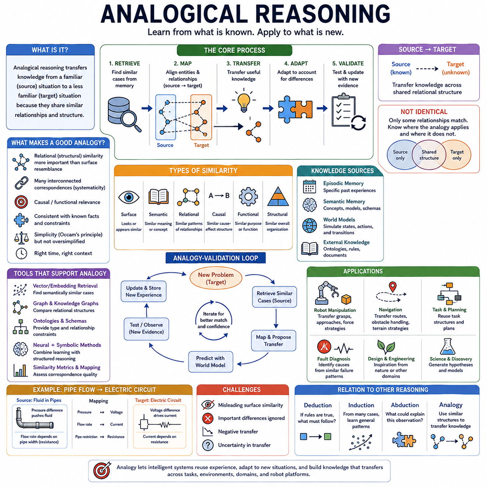{width="7.268055555555556in" height="7.268055555555556in"}

유추적 추론(Analogical Reasoning)은 익숙한 상황, 객체, 시스템 또는 문제에 대한 지식을 의미 있는 구조를 공유하는 다른 상황으로 전이하는 추론 방식입니다. 두 사례가 완전히 동일할 필요는 없으며, 유추는 서로 다른 도메인 사이에서 대응되는 관계를 식별하고 이러한 관계를 이용하여 덜 익숙한 사례의 속성, 설명, 예측 또는 가능한 해결책을 추론합니다.

유추적 추론의 기본 과정에는 원천(Source)과 목표(Target)가 포함됩니다. 원천 도메인(Source Domain)은 이미 유용한 지식을 가지고 있는 상황이고, 목표 도메인(Target Domain)은 이해하거나 해결해야 하는 상황입니다. 추론은 원천의 요소 및 관계와 목표의 요소 및 관계 사이의 대응을 식별한 후 관련 지식을 해당 매핑(Mapping)을 통해 전이함으로써 수행됩니다.

유용한 유추는 표면적인 유사성(Surface Resemblance)보다 관계적 유사성(Relational Similarity)에 더 크게 의존합니다. 두 객체는 외관이 매우 다르더라도 유사한 인과적, 기능적 또는 구조적 관계에 참여할 수 있습니다. 반대로 외관이 비슷한 객체라도 내부 메커니즘이 다르면 서로 다른 방식으로 행동할 수 있습니다. 따라서 효과적인 유추적 추론은 단순한 시각적 또는 언어적 유사성이 아니라 더 깊은 조직적 대응을 탐색합니다.

구조 매핑(Structural Mapping)은 이러한 과정을 이해하기 위한 개념적 프레임워크를 제공합니다. 하나의 도메인에 존재하는 개별 개체는 다른 도메인의 대응 개체와 정렬되지만 가장 중요한 매핑은 일반적으로 이러한 개체 사이의 관계를 포함합니다. 인과 연쇄, 계층 구조, 제약조건, 상호작용 및 의존성과 같은 고차원 구조가 유추가 신뢰성 있는 추론을 지원할 수 있는지를 결정하는 경우가 많습니다.

예를 들어 전기 회로를 흐르는 전류는 파이프 내부를 흐르는 유체와 비교될 수 있습니다. 전압(Voltage)은 압력 차이(Pressure Difference), 전류(Current)는 유량(Flow Rate), 저항(Resistance)은 흐름에 대한 제한과 대응될 수 있습니다. 실제 물리 현상은 서로 다르지만 관계적 구조는 특정 전기적 동작을 이해하는 직관적인 프레임워크를 제공합니다.

유추적 추론을 정확한 동등성(Exact Equivalence)과 혼동해서는 안 됩니다. 원천과 목표는 일반적으로 구조의 일부만 공유합니다. 유추 관계에서 실제로 대응되는 속성은 전이할 수 있지만 관련 없는 속성까지 함께 전이된다고 가정해서는 안 됩니다. 따라서 유추가 어디까지 유효하고 어디서부터 더 이상 유효하지 않은지를 인식하는 것은 유추 자체를 발견하는 것만큼 중요합니다.

유사성 평가(Similarity Assessment)는 유추적 추론에서 가장 먼저 해결해야 하는 문제 가운데 하나입니다. 지능형 시스템은 이전 사례가 현재 문제에 유용할 만큼 충분히 관련되어 있는지를 판단해야 합니다. 유사성은 물리적 속성, 기능, 인과 메커니즘, 시간적 패턴, 공간 배열, 목표, 제약조건, 행동 또는 이러한 요소들의 조합을 포함할 수 있습니다.

표면적 유사성(Surface Similarity)은 외관이나 설명이 유사한 객체를 쉽게 검색할 수 있기 때문에 계산적으로 편리합니다. 그러나 표면적 유사성은 잘못된 유추를 생성할 수도 있습니다. 강력한 추론은 외관은 다르지만 현재 목표에 중요한 더 깊은 기능적 또는 관계적 구조를 공유하는 사례를 인식할 수 있어야 합니다.

의미적 유사성(Semantic Similarity)은 정확한 단어가 다르더라도 의미가 관련된 사례를 식별하여 검색 성능을 향상시킬 수 있습니다. 현대 AI 시스템의 학습된 표현(Learned Representations)은 의미적으로 관련된 개념들을 임베딩 공간(Embedding Space)에서 가까이 위치시킬 수 있으므로 단순한 키워드 일치보다 개념적 유사성을 기반으로 이전 사례를 검색할 수 있습니다.

관계적 유사성(Relational Similarity)은 한 단계 더 나아가 개체 사이의 상호작용 패턴을 비교합니다. 포식자가 먹이를 추적하는 상황, 보안 시스템이 침입자를 추적하는 상황, 로봇이 이동하는 목표를 따라가는 상황은 서로 다른 개체를 포함하지만 유사한 추적 및 추격 구조를 가질 수 있습니다. 이러한 대응은 매우 다른 도메인 사이에서도 계획 전략의 전이를 지원할 수 있습니다.

인과적 유사성(Causal Similarity)은 인과 관계가 표면적 외관이 달라져도 유지되는 경우가 많기 때문에 특히 중요합니다. 두 시스템이 동일한 기반 인과 메커니즘 때문에 비슷하게 반응한다면 단순한 관측 유사성에 의한 전이보다 더 강력한 예측을 제공할 수 있습니다.

기능적 유추(Functional Analogy)는 구성 요소나 시스템이 무엇을 수행하는지에 초점을 맞춥니다. 생물학적 관절과 로봇 관절은 재료와 구현 방식은 크게 다르지만 제한된 운동을 가능하게 하고, 힘을 전달하며, 관절 구조를 형성한다는 기능적 측면에서는 비교할 수 있습니다. 따라서 기능적 대응은 엔지니어링 설계와 생체모방 추론(Biomimetic Reasoning)을 지원할 수 있습니다.

유추적 추론은 종종 기억(Memory)으로부터의 검색으로 시작됩니다. 새로운 문제가 나타나면 시스템은 현재 상황과 유사한 과거 경험, 개념, 모델 또는 해결된 사례를 검색합니다. 에이전트가 수많은 잠재적 기억을 보유할 수 있기 때문에 효율적인 검색은 중요합니다.

일화 기억(Episodic Memory)은 유추의 원천이 될 수 있는 구체적인 과거 경험을 제공합니다. 어려운 지형을 만난 로봇은 비슷한 형상, 휠 슬립(Wheel Slip) 또는 제어 불안정(Control Instability)을 포함했던 이전 경험을 검색할 수 있습니다. 해당 경험은 어떤 행동이 성공했고, 어떤 행동이 실패했으며, 어떤 환경적 특징이 중요했는지를 알려줄 수 있습니다.

의미 기억(Semantic Memory)은 더 일반화된 원천 지식을 제공합니다. 특정 하나의 경험을 검색하는 대신 특정 시스템 범주가 어떻게 동작하는지를 설명하는 개념 모델을 검색할 수 있습니다. 이를 통해 유추적 추론은 개별 에피소드뿐 아니라 추상 개념 사이에서도 작동할 수 있습니다.

작업 기억(Working Memory)은 원천과 목표 사이의 대응 관계를 일시적으로 유지하는 역할을 합니다. 여러 후보 매핑을 동시에 보존하면서 어떤 관계가 일치하고 어떤 관계가 충돌하는지를 평가해야 할 수 있습니다. 복잡한 유추는 안정적인 매핑이 형성되기 전까지 여러 단계의 비교를 필요로 할 수 있습니다.

주의(Attention)는 어떤 특징과 관계를 비교 과정에서 우선해야 하는지를 결정합니다. 하나의 목표 상황은 중요하지 않은 여러 측면에서 많은 이전 사례와 비슷할 수 있습니다. 선택적 주의(Selective Attention)는 현재 목표와 관련된 특성을 강조하면서 예측적 또는 설명적 가치가 낮은 유사성을 억제할 수 있습니다.

유망한 원천이 검색되면 시스템은 원천과 목표 구성 요소 사이의 매핑을 설정해야 합니다. 이 매핑은 어떤 개체, 관계, 행동 및 결과가 대응되는지를 정의합니다. 일관된 매핑은 개별 요소를 국소적 유사성만으로 독립적으로 연결하는 것이 아니라 중요한 관계 구조를 보존해야 합니다.

일대일 대응(One-to-One Correspondence)은 하나의 원천 요소가 서로 양립할 수 없는 여러 목표 요소에 연결되면 모호성이 발생하기 때문에 일반적으로 바람직합니다. 그러나 현실 세계에서는 하나의 원천 구성 요소가 여러 개의 목표 구성 요소로 이루어진 하위 시스템에 대응하는 등 서로 다른 세분화 수준(Granularity)을 가진 유추도 가능합니다. 따라서 유연한 계층적 표현(Hierarchical Representations)이 유용합니다.

체계성(Systematicity)도 중요한 원리입니다. 서로 연결된 관계의 시스템을 보존하는 유추는 고립된 일치에 기반한 유추보다 일반적으로 더 강합니다. 서로를 지지하는 여러 대응 관계가 존재한다면 동일한 기반 조직이 두 도메인에 존재한다는 증거가 더 강해집니다.

매핑 이후에는 유추적 추론(Analogical Inference)을 통해 원천의 지식을 목표로 전이합니다. 원천에서는 알려져 있지만 목표에서는 알려지지 않은 관계가 대응되는 경우 시스템은 해당 관계가 목표에서도 성립할 것이라는 가설을 세울 수 있습니다. 이것은 논리적으로 보장된 결론이 아니라 후보 예측(Candidate Prediction)을 생성합니다.

따라서 전이된 지식은 검증되어야 합니다. 두 도메인 사이의 차이가 매력적인 유추를 무효화할 수 있습니다. 물리적 규모, 재료 특성, 환경 조건, 센서 특성, 시간 동역학, 운영 제약조건은 모두 하나의 상황에서 다른 상황으로의 전이를 제한할 수 있습니다.

따라서 유추적 추론에는 본질적으로 불확실성이 존재합니다. 강력한 구조적 일치는 신뢰도를 높이지만 전이된 결론의 정확성을 증명하지는 않습니다. 지능형 시스템은 유추를 하나의 가설을 지지하는 증거로 표현하고 관측이 이를 반박할 경우 추론을 수정할 수 있어야 합니다.

확률(Probability)은 전이된 결론의 신뢰도를 표현하는 데 사용할 수 있습니다. 시스템은 유사도 측정, 과거 성공률, 도메인 지식, 현재 증거 등을 결합하여 원천에서 얻은 예측이 목표에서도 성립할 가능성을 추정할 수 있습니다. 이를 통해 유추적 추론은 더 광범위한 확률적 추론(Probabilistic Reasoning)과 연결됩니다.

유추적 추론과 귀납(Induction)은 밀접하게 관련되어 있지만 서로 다릅니다. 귀납은 여러 관측을 일반화하여 더 광범위한 패턴을 발견하는 반면, 유추는 구조화된 특정 사례 사이에서 지식을 전이하는 경우가 많습니다. 그러나 반복적으로 성공한 유추적 전이는 더 넓은 상황 범주에 관한 귀납적 일반화를 지지하는 증거가 될 수 있습니다.

유추는 연역(Deduction)과도 상호작용합니다. 원천-목표 매핑이 후보 규칙이나 속성을 제안하면 연역적 추론은 이러한 전이된 가정이 참일 경우 어떤 결과가 따라야 하는지를 도출할 수 있습니다. 이후 관측을 이러한 결과와 비교하여 유추가 계속 유효한지를 평가할 수 있습니다.

귀추적 추론(Abductive Reasoning)은 설명을 생성하기 위해 유추를 활용할 수 있습니다. 익숙하지 않은 사건이 발생했을 때 시스템은 관계 구조가 유사한 과거 사례를 검색하고 유사한 기반 원인이 새로운 관측을 설명할 수 있다고 제안할 수 있습니다. 이 유추는 이후 실제 증거를 통해 검증해야 하는 후보 설명을 제공합니다.

과학적 추론(Scientific Reasoning)은 역사적으로 유추에 크게 의존해 왔습니다. 연구자는 잘 이해되는 시스템에서 얻은 모델을 이용해 익숙하지 않은 현상을 해석하는 경우가 많습니다. 유추는 메커니즘, 실험 설계, 수학적 공식, 가설 등을 제안할 수 있지만 전이된 아이디어가 받아들여지는 설명이 되기 위해서는 과학적 검증이 필요합니다.

엔지니어링 설계(Engineering Design) 역시 유추적 전이에 크게 의존합니다. 기존 메커니즘, 아키텍처, 재료, 제어 전략 또는 시스템 구성이 새로운 설계 문제의 해결책에 영감을 줄 수 있습니다. 엔지니어는 검증된 원리를 재사용하면서 새로운 응용에 맞게 치수, 인터페이스, 운영 조건 및 제약조건을 조정하는 경우가 많습니다.

설계 유추(Design Analogy)는 동일한 기술 도메인 내부에서도 발생할 수 있고 매우 다른 도메인 사이에서도 발생할 수 있습니다. 하나의 차량 서스펜션 개념이 다른 차량 설계에 영향을 줄 수 있고 생물학적 구조가 로봇 메커니즘에 영감을 줄 수도 있습니다. 서로 다른 분야 사이의 유추는 목표 도메인에서 일반적이지 않은 조직 원리를 전이하기 때문에 특히 새로운 해결책을 생성할 수 있습니다.

사례 기반 추론(Case-Based Reasoning)은 이와 밀접하게 관련된 접근 방법을 형식화합니다. 새로운 문제를 이전에 해결한 사례와 비교하고, 하나 이상의 관련 사례를 검색하고, 해당 해결책을 새로운 상황에 맞게 수정한 후 결과를 평가합니다. 성공적으로 해결된 새로운 사례는 이후의 재사용을 위해 다시 저장될 수 있습니다.

적응(Adaptation)은 과거 해결책을 수정 없이 그대로 적용할 수 있는 경우가 드물기 때문에 필수적입니다. 시스템은 검색된 해결책에서 어떤 부분이 계속 유효하고 어떤 부분은 목표 조건의 차이 때문에 변경해야 하는지를 결정해야 합니다. 이러한 특성은 유추적 추론이 단순한 복사보다 훨씬 정교한 과정임을 보여줍니다.

실패 사례(Failure Cases) 역시 가치 있는 유추 원천이 될 수 있습니다. 이전 실패는 피해야 할 조건의 조합을 보여줄 수 있습니다. 새로운 상황에서 유사한 구조가 발견되면 에이전트는 성공적인 행동 대신 경고, 제약조건 또는 진단적 기대를 전이할 수 있습니다.

부정적 유추(Negative Analogies)는 중요한 차이를 식별하는 데 도움을 줄 수 있습니다. 시스템은 현재 문제와 과거 사례가 여러 측면에서 유사하지만 이전 결과에 핵심적이었던 하나의 관계에서는 다르다는 것을 인식할 수 있습니다. 이러한 차이를 발견하면 부적절한 지식 전이를 방지하고 추론의 신뢰성을 향상시킬 수 있습니다.

반례(Counterexamples) 역시 유추의 경계를 드러내기 때문에 유용합니다. 전이된 규칙이 특정 조건에서 실패한다면 이러한 실패는 원천과 목표 사이에서 어떤 관계가 보존되지 않았는지를 보여줍니다. 이후 추론 시스템은 유추가 적용되는 조건에 대한 표현을 개선할 수 있습니다.

표현 품질(Representation Quality)은 유추적 추론에 큰 영향을 줍니다. 지식이 원시 감각 특징으로만 표현되면 외관은 다르지만 구조적으로 유사한 상황을 관련 없는 것으로 판단할 수 있습니다. 객체, 관계, 행동, 인과 의존성 및 목표를 포함하는 표현은 더 깊은 유추 매핑을 쉽게 발견하도록 합니다.

그래프 표현(Graph Representations)은 노드(Node)가 개체나 상태를 표현하고 엣지(Edge)가 관계를 표현할 수 있기 때문에 특히 적합합니다. 유추적 추론은 서로 다른 상황에서 비슷한 서브그래프(Subgraphs) 또는 관계 패턴을 탐색할 수 있습니다. 그래프 신경망(Graph Neural Networks)은 이러한 구조적 비교를 지원하는 표현을 학습할 수 있습니다.

지식 그래프(Knowledge Graphs)는 개념, 개체, 속성 및 관계를 연결하여 또 다른 유용한 구조를 제공합니다. 추론 시스템은 유사한 관계 경로나 패턴을 식별하고 이를 이용하여 도메인 사이의 매핑을 제안할 수 있습니다. 온톨로지(Ontologies)는 호환 가능한 범주와 관계 유형을 정의하여 매핑을 추가적으로 제약할 수 있습니다.

신경 임베딩(Neural Embeddings)은 대규모 기억에서 효율적인 검색을 지원합니다. 경험, 문서, 상황 또는 개념을 벡터로 인코딩하고 근사 유사도 검색(Approximate Similarity Search)을 이용하여 후보 유추를 빠르게 찾을 수 있습니다. 그러나 임베딩 유사성만으로 구조적 대응이 보장되는 것은 아니므로 추가적인 추론이 필요할 수 있습니다.

하이브리드 아키텍처(Hybrid Architecture)는 신경망 검색과 기호적 또는 구조적 매핑을 결합할 수 있습니다. 신경망 모델은 잠재적으로 관련된 원천 사례를 효율적으로 식별하고 기호적 메커니즘은 관계적 일관성, 인과적 호환성 및 제약조건을 평가할 수 있습니다. 이러한 조합은 확장성과 해석 가능성을 함께 제공할 수 있습니다.

대규모 언어 모델(Large Language Models, LLMs)은 언어에 방대한 사례, 비교, 은유, 설명 및 반복되는 관계 구조가 포함되어 있기 때문에 상당한 유추 능력을 자연스럽게 나타냅니다. 새로운 문제가 주어지면 LLM은 학습 과정이나 현재 문맥에서 접한 패턴과의 유사성을 인식할 수 있습니다.

문맥 내 학습(In-Context Learning)은 프롬프트의 사례가 입력과 출력 사이의 관계를 보여줄 때 유추적 행동을 나타낼 수 있습니다. 모델은 사례를 해석하고 암묵적인 변환 또는 작업 구조를 추론한 후 동일한 관계를 새로운 입력에 적용합니다. 이는 시연(Demonstrations)에서 목표 문제로 관계를 전이하는 유추적 과정과 유사합니다.

퓨샷 학습(Few-Shot Learning) 역시 소수의 사례에서 전이 가능한 구조를 추출하는 데 의존합니다. 강력한 사전학습 표현(Pretrained Representations)을 가진 모델은 많은 파라미터 업데이트 없이도 시연 사이의 관계를 식별하고 새로운 사례에 확장할 수 있습니다. 따라서 유추는 빠른 적응(Rapid Adaptation)에 기여합니다.

사고 과정형 추론(Chain-of-Thought-Like Reasoning)에서도 복잡한 문제를 더 단순하고 익숙한 문제와 비교하는 유추적 분해가 나타날 수 있습니다. 추론 과정은 먼저 익숙한 구조를 해결한 다음 해당 해결책을 원래 문제의 문맥으로 다시 매핑할 수 있습니다. 이러한 분해는 낯선 작업의 복잡성을 감소시킬 수 있습니다.

그러나 언어 모델은 잘못된 유추(False Analogies)를 생성할 수도 있습니다. 언어적 유사성 때문에 실제로 관련 없는 개념이 구조적으로 동등한 것처럼 보일 수 있으며 그럴듯한 서술이 중요한 차이를 숨길 수 있습니다. 따라서 신뢰할 수 있는 AI 시스템은 전이된 관계가 실제 증거와 제약조건에 의해 지지되는지를 검증하는 메커니즘이 필요합니다.

피지컬 AI(Physical AI)에서는 물리 시스템이 언어적 그럴듯함만으로 동작할 수 없기 때문에 현실 기반성(Grounding)이 특히 중요합니다. 두 로봇, 환경 또는 작업 사이의 유추는 물리적 행동에 사용되기 전에 기하학, 동역학, 질량, 마찰, 액추에이터 한계, 센싱, 에너지, 시간 및 안전 제약조건을 만족해야 합니다.

로봇 학습(Robot Learning)은 유추적 전이를 활용할 수 있는 많은 기회를 제공합니다. 하나의 객체에서 학습한 조작 전략은 유사한 기하학 또는 행동유도성(Affordances)을 가진 다른 객체에 적용될 수 있습니다. 하나의 환경에서 학습한 내비게이션 전략은 비교 가능한 공간 구조를 가진 다른 환경으로 전이될 수 있습니다.

행동유도성 추론(Affordance Reasoning)은 본질적으로 유추적입니다. 익숙하지 않은 객체가 익숙한 도구와 유사한 구조적 및 기능적 속성을 가지고 있다면 로봇은 관련 행동이 가능하다고 추론할 수 있습니다. 이 추론은 탐색 행동을 안내하고 이후 물리적 상호작용을 통해 예상한 행동유도성이 실제로 유효한지를 판단할 수 있습니다.

조작 작업(Manipulation Tasks)은 접근 방향, 접촉 구성, 파지 유형, 힘 프로파일(Force Profile), 움직임 시퀀스와 같은 관계 구조를 전이할 수 있습니다. 성공적인 조작에 중요한 관계가 충분히 유사하다면 목표 객체가 원천 객체와 동일할 필요는 없습니다.

내비게이션(Navigation)은 서로 다른 환경 구성 사이의 유추를 사용할 수 있습니다. 복도, 교차로, 출입구, 경사로, 개방 공간, 장애물은 위치에 따라 시각적으로 다르지만 동일한 내비게이션 구조를 가질 수 있습니다. 로봇은 익숙한 공간 구성에서 학습한 계획 기대를 새로운 환경에 전이할 수 있습니다.

지형 추론(Terrain Reasoning) 역시 이전 경험을 이용할 수 있습니다. 경사, 표면 텍스처, 휠 슬립, 하중의 특정 조합이 이동성에 어떤 영향을 주는지를 학습한 로봇은 새로운 지형을 과거 상황과 비교할 수 있습니다. 유추적 검색은 추가적인 지역 적응이 이루어지기 전에 초기 제어 전략을 제공할 수 있습니다.

로봇 고장 진단(Robot Fault Diagnosis)은 실패 경험 사이의 유추를 활용할 수 있습니다. 현재의 진동, 전류 소비, 온도, 운동 오류 패턴이 이전의 액추에이터 문제와 유사하다면 이전 사례를 이용해 가능성이 높은 원인과 진단 시험을 제안할 수 있습니다. 실제 운영 조건이 정확히 동일하지 않아도 이러한 전이가 가능할 수 있습니다.

다중 로봇 시스템(Multi-Robot Systems)에서는 작업이나 기능 구조가 겹치는 경우 서로 다른 플랫폼 사이에서 경험을 전이할 수 있습니다. 하나의 로봇에서 얻은 내비게이션 경험은 치수나 센서가 다른 다른 로봇에도 유용할 수 있으며, 이를 위해서는 일반적인 작업 구조와 플랫폼 특화 요소를 분리한 표현이 필요합니다.

플랫폼 간 전이(Cross-Platform Transfer)를 위해서는 차이에 대한 명시적인 인식이 필요합니다. 휠베이스, 페이로드(Payload), 액추에이터 출력, 센서 배치, 지연 시간, 계산 능력 및 동적 한계는 외관상 비슷한 상황의 의미를 변화시킬 수 있습니다. 따라서 유추적 추론은 원천 지식을 목표 플랫폼의 특성에 맞게 변환하는 적응 모델(Adaptation Models)을 포함해야 합니다.

시뮬레이션(Simulation)은 실제 로봇으로 전이할 수 있는 대규모 원천 경험을 제공합니다. 실제 상황을 유사한 상태나 상호작용을 포함하는 시뮬레이션 궤적과 매칭할 수 있습니다. 검색된 시뮬레이션은 후보 예측 또는 행동을 제공할 수 있지만 심투리얼 갭(Sim-to-Real Gap)은 직접적인 전이를 제한합니다.

도메인 랜덤화(Domain Randomization)는 시뮬레이션 원천 사례의 다양성을 증가시켜 실제 상황과 유용하게 대응하는 사례가 존재할 가능성을 높일 수 있습니다. 기하학, 조명, 마찰, 질량, 센서 잡음 및 기타 속성을 다양화하면 전이 가능한 관계를 학습할 수 있는 더 넓은 경험 라이브러리를 구성할 수 있습니다.

월드 모델(World Models)은 상태, 관계, 행동 및 전이를 표현하기 때문에 유추적 추론의 강력한 기반이 될 수 있습니다. 정확한 관측이 다르더라도 서로 다른 궤적 내부에서 비슷한 패턴을 비교할 수 있습니다. 이를 통해 유추는 정적 외관뿐 아니라 예측 동역학(Predicted Dynamics)을 기반으로 작동할 수 있습니다.

월드 모델은 경험을 잠재 상태(Latent States)와 행동의 시퀀스로 인코딩할 수 있습니다. 새로운 상황이 나타나면 시스템은 관계적 또는 동적 구조가 유사한 궤적을 기억에서 검색할 수 있습니다. 검색된 궤적은 이후 발생할 가능성이 높은 상황과 후보 행동을 제안할 수 있습니다.

시간적 유추(Temporal Analogy)는 변화하는 상황을 예측하는 데 특히 유용합니다. 두 상황이 서로 다른 객체에서 시작되더라도 유사한 상태 전이 시퀀스를 따를 수 있습니다. 공유되는 전이 패턴을 인식하면 에이전트는 이전 경험을 기반으로 다음에 발생할 사건을 예상할 수 있습니다.

공간적 유추(Spatial Analogy)는 배치와 기하학적 관계를 비교합니다. 로봇은 절대적인 크기나 방향이 달라도 두 환경이 동일한 내비게이션 구조를 가진다는 사실을 인식할 수 있습니다. 이동(Translation), 회전(Rotation), 스케일링(Scaling), 좌표 정규화(Coordinate Normalization)와 같은 변환을 통해 기반 대응 관계를 드러낼 수 있습니다.

계층적 유추(Hierarchical Analogy)는 서로 다른 추상화 수준에서의 전이를 가능하게 합니다. 저수준에서는 센서 패턴이나 모터 행동을 비교하고 고수준에서는 객체 상호작용, 하위 작업, 임무 구조 또는 전략적 목표를 비교할 수 있습니다. 고수준 유추는 구현 세부 사항에 덜 의존하기 때문에 더 넓게 전이되는 경우가 많습니다.

작업 수준 유추(Task-Level Analogies)는 계획을 지원할 수 있습니다. 복잡한 임무는 수행 순서의 제약, 자원 요구사항 또는 의존성 측면에서 과거에 완료한 임무와 유사할 수 있습니다. 이전 계획은 새로운 환경과 사용 가능한 자원에 따라 수정할 수 있는 구조적 템플릿을 제공합니다.

기술 재사용(Skill Reuse)도 동일한 원리를 따릅니다. 새로운 작업이 기존에 학습한 기술과 유사한 하위 문제를 포함하고 있다면 이전 행동을 재사용 가능한 구성 요소로 활용할 수 있습니다. 모든 행동을 처음부터 학습하는 대신 새로운 작업의 관계 구조에 따라 기존 기술을 조합하고 수정할 수 있습니다.

유추 기반 계획(Analogical Planning)은 탐색 복잡성을 크게 감소시킬 수 있습니다. 이전 계획이 이미 구조적으로 유사한 문제를 해결했다면 에이전트는 전체 행동 공간을 처음부터 탐색하는 대신 그 계획을 출발점으로 사용할 수 있습니다. 이후 계획은 원천과 목표가 다른 부분을 수정하는 데 집중할 수 있습니다.

유추적 추론은 전이 학습(Transfer Learning)에도 기여합니다. 하나의 도메인에서 학습된 모델은 다른 도메인에서 유용한 특징, 정책 또는 표현을 제공할 수 있습니다. 중요한 구조가 공유될 때 전이가 성공하며, 표면적 유사성 뒤에 중요한 차이가 숨겨져 있으면 부정적 전이(Negative Transfer)가 발생할 수 있습니다.

부정적 전이는 중요한 위험 요소입니다. 원천 도메인에서 유용했던 지식이 잘못된 매핑 때문에 목표 도메인의 성능을 오히려 저하시킬 수 있습니다. 따라서 시스템은 모든 유사성을 전이의 근거로 사용하는 대신 전이 가능성(Transferability)을 평가하고 전이된 지식을 검증해야 합니다.

불확실성 추정(Uncertainty Estimation)은 이러한 위험을 줄일 수 있습니다. 구조적 대응이 약하거나 불완전하면 전이된 예측의 신뢰도를 낮게 설정해야 합니다. 에이전트는 추가적인 증거를 수집하거나, 안전한 탐색 행동을 수행하거나, 유추에 대한 신뢰도가 낮을 때 더욱 보수적인 추론으로 전환할 수 있습니다.

능동 학습(Active Learning)은 원천 사례가 실제로 적용되는지를 판단하는 데 가장 중요한 목표 속성에 대한 정보를 요청함으로써 유추 매핑을 개선할 수 있습니다. 모든 차이를 시험하는 대신 전이 결론의 유효성에 가장 크게 영향을 주는 관계를 우선적으로 확인할 수 있습니다.

능동 지각(Active Perception)은 이러한 전략의 물리적 형태입니다. 로봇은 익숙하지 않은 객체가 알려진 조작 전략에 필요한 구조적 특성을 실제로 공유하는지를 확인하기 위해 관측 위치를 변경하거나 추가적인 깊이, 촉각 또는 힘 정보를 수집할 수 있습니다.

능동 실험(Active Experimentation)은 전이된 가설을 직접 시험할 수 있습니다. 유추를 통해 특정 객체가 어떤 행동을 지원할 것으로 예상된다면 로봇은 위험이 낮은 상호작용을 수행하고 결과를 관측할 수 있습니다. 성공적인 증거는 매핑에 대한 신뢰도를 높이고 실패는 원천과 목표가 어디에서 다른지를 보여줍니다.

지속 학습(Continual Learning)은 시간이 지나면서 유추 능력을 향상시킬 수 있습니다. 성공하거나 실패한 각각의 전이는 어떤 유사성이 실제로 의미 있는지에 관한 정보를 제공합니다. 에이전트는 축적된 경험을 기반으로 검색 기준, 매핑 규칙, 표현 및 적응 메커니즘을 개선할 수 있습니다.

기억 통합(Memory Consolidation)은 반복적으로 성공한 유추를 일반화된 개념으로 변환할 수 있습니다. 서로 다른 많은 상황이 동일한 관계 구조를 공유한다면 시스템은 더 이상 각각의 전이를 독립된 유추로 처리할 필요가 없습니다. 공통 구조 자체가 재사용 가능한 스키마(Schema), 모델 또는 추상 규칙으로 발전할 수 있습니다.

스키마(Schemas)는 여러 경험으로부터 추출된 일반화된 관계 패턴을 표현합니다. 스키마는 포함(Containment), 지지(Support), 추격(Pursuit), 운반(Transport), 조립(Assembly), 인과 시퀀스와 같은 공통 구조를 설명할 수 있습니다. 새로운 상황은 개별 과거 에피소드가 아니라 이러한 추상 구조와 직접 매칭될 수 있습니다.

이러한 발전 과정은 유추와 귀납(Induction)을 연결합니다. 처음에는 유추적 추론이 사례 사이에서 지식을 전이하지만 반복되는 대응 관계가 더 광범위한 규칙성을 드러낼 수 있습니다. 귀납은 이러한 규칙성을 일반화된 지식으로 통합하고, 그 지식은 이후 새로운 유추적 추론의 원천이 됩니다.

유추는 기존 도메인의 경계를 넘어 해결책을 전이할 수 있기 때문에 창의성(Creativity)에도 기여할 수 있습니다. 생물학, 교통, 통신 또는 사회 조직의 메커니즘이 관계적으로 유사한 문제를 가진 로보틱스나 AI 분야의 해결책에 영감을 줄 수 있습니다.

창의적인 유추(Creative Analogy)는 거리(Distance)와 관련성(Relevance)의 균형을 필요로 합니다. 매우 유사한 원천은 쉽게 적용할 수 있지만 점진적인 해결책을 생성하는 경우가 많고, 먼 도메인은 혁신적인 아이디어를 제공할 수 있지만 잘못된 매핑의 위험도 높아집니다. 효과적인 추론은 넓게 탐색하면서 구조적 제약조건을 유지해야 합니다.

인간의 교육에서도 같은 이유로 유추를 자주 사용합니다. 익숙한 개념은 익숙하지 않은 개념을 이해하기 위한 인지적 발판(Cognitive Scaffolding)을 제공합니다. 좋은 유추는 새로운 개념을 이해하는 데 필요한 관계를 보존하면서 오해를 만들 수 있는 차이도 명확하게 설명합니다.

설명 가능한 AI(Explainable AI)는 의사결정을 설명하기 위해 유추를 활용할 수 있습니다. 시스템은 현재 상황과 관계 구조가 유사한 과거 사례를 식별하고 현재 사례가 이들과 어떻게 대응되는지를 설명할 수 있습니다. 이러한 설명은 직관적일 수 있지만 유사성은 단순한 외형적 유사성이 아니라 의미 있는 구조를 기반으로 해야 합니다.

유추적 설명은 반례와 함께 사용할 때 특히 유용합니다. 하나의 결과를 생성한 유사 사례와 중요한 관계 하나가 달라 다른 결과를 생성한 또 다른 사례를 함께 보여주면 어떤 요인이 시스템의 추론에 영향을 주었는지를 보다 명확하게 설명할 수 있습니다.

안전 중요 유추적 추론(Safety-Critical Analogical Reasoning)은 추가적인 검증을 필요로 합니다. 이전 사례에서 성공했다고 해서 새로운 물리적 문맥에서도 안전하다는 보장은 없습니다. 전이된 전략을 실행하기 전에 엄격한 제약조건, 충돌 검사(Collision Checks), 동역학적 한계, 불확실성 범위, 안전 규칙 및 경우에 따라 인간의 승인이 필요할 수 있습니다.

물리적 제약조건(Physical Constraints)은 중요한 필터를 제공합니다. 보존 법칙(Conservation Laws), 액추에이터 한계, 안정성 요구사항, 기하학적 실행 가능성 또는 재료 특성을 위반하는 유추는 표면적으로 아무리 유사하더라도 거부해야 합니다. 이를 통해 학습 기반 유추와 명시적인 엔지니어링 지식을 연결할 수 있습니다.

인과 모델(Causal Models)은 전이된 관계가 알려진 메커니즘과 일치하는지를 확인하는 또 다른 필터를 제공합니다. 두 상황이 외관상 비슷하더라도 인과 구조가 다르면 유추는 잘못된 결과를 예측할 수 있습니다. 따라서 인과적 일관성(Causal Consistency)은 전이의 신뢰성을 향상시킵니다.

월드 모델 시뮬레이션(World-Model Simulation)은 물리적으로 실행하기 전에 후보 유추를 검증할 수 있습니다. 전이된 전략을 추정된 목표 상태에서 평가하고 예측된 결과를 목표와 안전 제약조건에 비교할 수 있습니다. 시뮬레이션에서 실패하면 추가적인 적응이나 다른 원천 사례가 필요하다는 것을 알 수 있습니다.

이를 통해 유추-예측-검증 루프(Analogy-Prediction-Validation Loop)가 형성됩니다. 에이전트는 구조적으로 유사한 경험을 검색하고, 현재 상황에 매핑하고, 후보 지식을 전이하고, 월드 모델을 통해 결과를 예측하고, 해당 예측을 제약조건이나 관측과 비교하여 검증한 후 전이를 수정하거나 거부합니다.

실제 실행 이후에는 결과가 새로운 증거를 제공합니다. 성공적인 전이는 구조적 대응에 대한 신뢰도를 높이고 실패는 누락된 차이를 식별합니다. 이렇게 생성된 경험은 기억에 저장되어 향후 검색과 매핑을 개선하는 데 사용할 수 있습니다.

장기간 동작하는 피지컬 AI 시스템에서는 이러한 루프를 통해 재사용 가능한 경험이 점진적으로 축적됩니다. 서로 다른 환경, 페이로드, 작업 및 플랫폼에서 작동하는 로봇은 반복되는 구조를 식별하고 모든 상황을 독립적으로 다시 학습하는 대신 지식을 전이할 수 있습니다.

플릿 학습(Fleet Learning)은 이러한 원리를 여러 로봇으로 확장합니다. 하나의 플랫폼에서 수집한 경험이 다른 로봇의 후보 유추 원천이 될 수 있습니다. 공유 표현은 공통 구조를 식별하고 플랫폼별 적응은 하드웨어, 센서, 동역학 및 운영 한계의 차이를 반영합니다.

따라서 유추적 추론은 이기종 로봇 플랫폼(Heterogeneous Robot Platforms) 사이를 연결하는 데 도움을 줄 수 있습니다. 바퀴형 로봇과 보행 로봇은 저수준 이동 동역학을 공유하지 않더라도 경로 선택, 장애물 평가, 탐색, 검사 또는 작업 할당과 같은 고수준 임무 구조는 공유할 수 있습니다.

추상화 수준(Abstraction Level)은 무엇을 전이할 수 있는지를 결정합니다. 저수준 모터 명령은 플랫폼 특화적일 수 있지만 의미 지도(Semantic Maps), 객체 관계, 위험 평가, 작업 그래프(Task Graphs), 임무 전략은 더 넓게 전이될 수 있습니다. 따라서 올바른 추상화 수준을 선택하는 것은 플랫폼 간 유추에서 핵심적인 요소입니다.

LLM 기반 에이전트(LLM-Based Agents)는 설명, 계획, 로그 및 구조화된 기억을 대상으로 이러한 과정을 지원할 수 있으며 전문화된 지각 시스템과 월드 모델은 물리적 현실 기반성을 처리할 수 있습니다. 언어 모델은 유추를 제안할 수 있지만 실제 운영 가능성은 센서 증거와 물리 모델을 통해 판단해야 합니다.

강건한 아키텍처(Robust Architecture)는 기억 검색, 표현 학습, 관계 매핑, 인과 모델, 월드 모델 예측, 불확실성 추정 및 검증을 결합할 수 있습니다. 각각의 구성 요소는 제한 없는 유추가 가진 서로 다른 약점을 보완하고 직관적인 유사성을 신뢰할 수 있는 전이 지식으로 변환하도록 지원합니다.

궁극적으로 유추적 추론(Analogical Reasoning)은 지능형 시스템이 새로운 문제를 만났을 때 이미 알고 있는 것을 활용할 수 있도록 합니다. 모든 익숙하지 않은 문제를 독립적으로 해결하는 대신 시스템은 축적된 지식에서 현재 상황을 안내할 수 있는 관계 구조를 탐색합니다.

유추적 추론의 효과는 적절한 원천 사례를 선택하고, 표면적 유사성보다 깊은 유사성을 식별하고, 일관된 매핑을 구성하고, 전이된 지식을 적응시키고, 중요한 차이를 인식하고, 불확실성을 추정하며, 예측을 증거와 제약조건에 대해 검증하는 능력에 달려 있습니다.

연역(Deduction), 귀납(Induction), 귀추(Abduction), 기억(Memory), 주의(Attention), 인과 추론(Causal Reasoning), 월드 모델(World Models), 시뮬레이션(Simulation), 계획(Planning), 지속 학습(Continual Learning)과 통합될 때 유추는 적응형 지능(Adaptive Intelligence)을 위한 강력한 메커니즘이 됩니다. 이는 과거 경험을 익숙하지 않은 상황과 연결하고 작업, 환경, 도메인 및 로봇 플랫폼 사이에서 지식이 이동할 수 있도록 합니다.

고급 AI 에이전트(Advanced AI Agents)와 피지컬 AI(Physical AI)에서 유추적 추론은 고립된 경험을 재사용 가능한 지능(Reusable Intelligence)으로 전환하는 경로를 제공합니다. 반복되는 관계 구조를 인식하고 차이를 존중하면서 지식을 전이함으로써 자율 시스템은 더 빠르게 학습하고, 더 유연하게 추론하고, 불필요한 탐색을 줄이며, 물리적 세계에서 문제를 해결하는 방식에 대한 점점 더 일반적인 모델을 구축할 수 있습니다.

## 03.05 Causal Reasoning [w/Code]

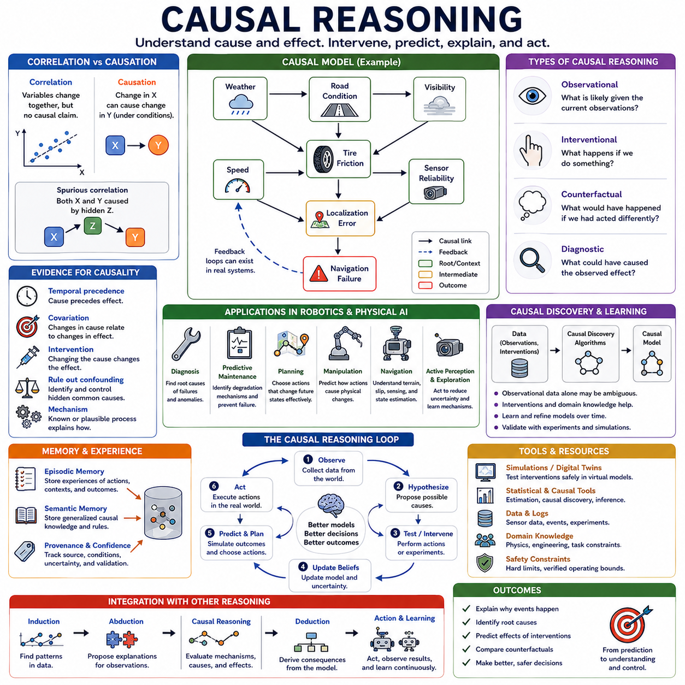{width="7.268055555555556in" height="7.268055555555556in"}

인과 추론(Causal Reasoning)은 사건, 상태, 행동 또는 변수가 다른 사건이나 상태의 변화를 어떻게 발생시키는지를 이해하는 과정입니다. 이는 두 현상이 함께 발생한다는 사실을 인식하는 것을 넘어 하나의 요인을 실제로 변화시켰을 때 다른 요인이 영향을 받는지를 질문합니다. 이러한 구분을 통해 지능형 시스템은 결과를 설명하고, 개입 효과를 예측하며, 고장을 진단하고, 세계를 의도적으로 변화시키는 행동을 선택할 수 있습니다.

상관관계(Correlation)와 인과관계(Causation)의 차이는 매우 중요합니다. 두 변수는 하나가 다른 하나의 원인이기 때문에 강하게 상관될 수도 있지만, 둘 모두 공통 원인(Common Cause)의 영향을 받거나 단순히 우연히 관계가 나타날 수도 있습니다. 따라서 인과 추론은 겉으로 보이는 관계가 실제 영향 메커니즘을 나타내는지를 판단하기 위해 통계적 연관성 이상의 추가적인 구조를 필요로 합니다.

인과관계(Causal Relationship)는 일반적으로 방향성(Direction)을 가집니다. 변수 A가 변수 B의 원인이라면 특정 조건에서 A의 변화가 B에 영향을 줄 수 있지만 B의 변화가 반드시 동일한 방식으로 A에 영향을 주는 것은 아닙니다. 이러한 방향성은 인과 모델(Causal Models)을 대칭적인 유사성 관계와 구분하며 행동의 결과를 예측하거나 관측된 사건의 원인을 식별할 때 핵심적인 역할을 합니다.

시간적 순서(Temporal Order)는 일반적으로 원인이 결과보다 먼저 발생해야 하기 때문에 인과성을 판단하는 데 유용한 증거를 제공합니다. 하나의 사건 이후에 다른 사건이 발생한다면 이러한 순서는 인과 가설(Causal Hypothesis)을 지지할 수 있습니다. 그러나 연속적으로 발생한 두 사건도 숨겨진 공통 요인에 의해 연결될 수 있으므로 시간적 선행성(Temporal Precedence)만으로 인과관계를 확정할 수는 없습니다.

교란(Confounding)은 관측되지 않았거나 통제되지 않은 변수가 잠재적 원인과 관측된 결과 모두에 영향을 줄 때 발생합니다. 이로 인해 첫 번째 변수가 실제 원인이 아닌데도 인과적인 것처럼 보일 수 있습니다. 따라서 교란 요인(Confounders)을 식별하고 통제하는 것은 과학 실험, 통계 분석, 의료 연구, 로보틱스(Robotics), 관측 데이터에서 관계를 학습하는 시스템에서 매우 중요합니다.

개입(Intervention)은 수동적인 관측보다 더 강력한 인과적 증거를 제공합니다. 시스템은 단순히 A와 B가 함께 변화하는 것을 관찰하는 대신 A를 의도적으로 변화시키고 B가 예상한 방식으로 변화하는지를 확인합니다. 이를 통해 실제 영향에 의해 생성된 관계와 공통 원인이나 선택 효과(Selection Effects)로 인해 나타난 관계를 구분할 수 있습니다.

관측(Observation)과 개입(Intervention)의 구분은 인과 추론(Causal Inference)의 핵심입니다. 하나의 변수가 특정 값을 가진다는 것을 관측하는 것은 자연적으로 발생하는 조건에서 어떤 일이 일어나는지를 알려줍니다. 반면 개입은 해당 값을 생성하는 기반 프로세스를 변화시킵니다. 따라서 개입 이후의 분포는 일반적인 상관관계만으로 예측한 것과 크게 다를 수 있습니다.

반사실적 추론(Counterfactual Reasoning)은 특정 사건이나 행동이 달랐다면 어떤 일이 발생했을지를 질문함으로써 인과 분석을 확장합니다. 결과를 관측한 후 시스템은 의심되는 원인이 존재하지 않았더라도 동일한 결과가 발생했을지를 고려할 수 있습니다. 반사실은 설명, 책임 분석, 정책 평가, 고장 진단, 성공과 실패로부터의 학습을 지원합니다.

유용한 인과 모델(Causal Model)은 변수들과 이들이 서로 어떻게 영향을 미치는지를 설명하는 방향성 관계를 함께 표현합니다. 방향 그래프(Directed Graphs)는 노드(Node)가 변수나 상태를 나타내고 방향성 엣지(Directed Edges)가 인과적 의존성을 나타내는 일반적인 표현입니다. 이러한 그래프는 가정을 명확하게 하고 개입, 교란, 매개(Mediation), 간접 효과에 관한 추론을 지원합니다.

인과 그래프(Causal Graphs)는 엣지가 단순한 통계적 유사성이 아니라 메커니즘에 대한 방향성 가정을 표현한다는 점에서 일반적인 상관관계 네트워크와 다릅니다. 이러한 추가적인 의미를 통해 시스템은 특정 변수를 능동적으로 변화시키면 어떤 일이 발생하는지, 어떤 변수를 통제해야 하는지, 어떤 경로를 통해 효과가 전달되는지를 질문할 수 있습니다.

직접 원인(Direct Causes)과 간접 원인(Indirect Causes)은 구분되어야 합니다. 하나의 변수는 결과에 직접 영향을 줄 수도 있고 하나 이상의 중간 변수를 통해 영향을 줄 수도 있습니다. 이러한 중간 변수를 일반적으로 매개 변수(Mediators)라고 합니다. 매개 관계를 이해하면 개입이 효과를 가지는지뿐 아니라 어떤 메커니즘을 통해 그 효과가 발생하는지도 설명할 수 있습니다.

여러 원인이 하나의 결과에 동시에 기여할 수도 있습니다. 예를 들어 로봇 내비게이션 실패(Robot Navigation Failure)는 위치 추정 오류(Localization Error), 휠 슬립(Wheel Slip), 지형 조건(Terrain Conditions), 제어 지연(Control Delay)이 함께 영향을 미쳐 발생할 수 있습니다. 따라서 인과 추론은 모든 관측 결과에 하나의 고유한 원인만 존재한다고 가정하지 않고 상호작용하는 여러 원인을 다룰 수 있어야 합니다.

하나의 원인이 여러 결과를 발생시킬 수도 있습니다. 전원 하위 시스템(Power Subsystem)의 고장은 액추에이터 성능을 감소시키고, 통신 오류를 증가시키며, 비정상적인 진단 신호를 발생시킬 수 있습니다. 공통 원인(Shared Cause)을 인식하면 각각의 증상을 독립적으로 처리하는 것보다 더 일관된 설명을 생성할 수 있습니다.

인과 연쇄(Causal Chains)는 하나의 사건이 다른 상태를 변화시키고 그 상태가 다시 추가적인 상태를 변화시키는 연속적인 과정을 설명합니다. 이러한 연쇄는 행동의 결과가 여러 중간 전이를 거친 후에 나타날 수 있기 때문에 동적 시스템(Dynamic Systems)에서 특히 중요합니다. 인과 연쇄를 이해하면 지연된 효과를 예측하고 어느 지점에서 개입하는 것이 가장 효과적인지를 식별할 수 있습니다.

피드백 루프(Feedback Loops)는 결과가 이후 다시 자신의 원인에 영향을 줄 수 있기 때문에 인과 추론을 복잡하게 만듭니다. 온도가 제어기 동작을 변화시키고, 이것이 액추에이터 부하를 변화시키며, 다시 온도에 영향을 줄 수 있습니다. 따라서 동적 시스템에서는 정적 변수 사이의 단순한 비순환 관계보다 시간에 따른 프로세스를 표현하는 인과 모델이 필요한 경우가 많습니다.

구조적 인과 모델(Structural Causal Models)은 변수가 직접적인 원인과 관측되지 않은 교란의 함수에 의해 생성되는 형식적 프레임워크를 제공합니다. 이러한 모델은 관측 예측, 개입 효과 추정, 서로 다른 가상 조건에서의 반사실적 대안 평가라는 세 가지 중요한 형태의 추론을 지원합니다.

관측적 추론(Observational Reasoning)은 자연적으로 관측된 변수에 관한 증거가 주어졌을 때 무엇이 참일 가능성이 높은지를 질문합니다. 개입적 추론(Interventional Reasoning)은 변수를 의도적으로 특정 값으로 강제했을 때 어떤 일이 발생하는지를 질문합니다. 반사실적 추론(Counterfactual Reasoning)은 특정 사례에서 개입이 달랐다면 어떤 일이 발생했을지를 질문하며 점점 더 높은 수준의 인과 분석을 제공합니다.

인과 발견(Causal Discovery)은 데이터로부터 인과 구조를 추론하려는 과정입니다. 통계적 의존성, 시간 관계, 개입, 도메인 지식(Domain Knowledge), 데이터 생성 과정에 관한 가정이 모두 증거가 될 수 있습니다. 그러나 관측 데이터만으로는 여러 인과 구조가 동일하게 설명될 수 있기 때문에 인과 발견은 상관관계를 발견하는 것보다 근본적으로 더 어렵습니다.

실험 데이터(Experimental Data)는 특정 변수를 조작했을 때 시스템이 어떻게 반응하는지를 보여주므로 이러한 모호성을 줄일 수 있습니다. 무작위 실험(Randomized Experiments)은 무작위 할당을 통해 체계적인 교란을 감소시킬 수 있기 때문에 강력합니다. 그러나 실제 시스템에서는 실험이 비싸거나, 위험하거나, 윤리적으로 허용되지 않거나, 물리적으로 불가능할 수 있습니다.

개입이 제한된 경우 사전 지식(Prior Knowledge)은 특히 중요해집니다. 엔지니어링 원리, 물리 법칙, 도메인 전문 지식, 시스템 아키텍처, 생물학적 메커니즘 또는 작업 제약조건은 가능한 인과 모델의 범위를 제한할 수 있습니다. 학습된 통계 구조와 알려진 메커니즘을 결합하면 데이터만 사용하는 것보다 더 신뢰할 수 있는 인과 추론이 가능해집니다.

인과 추론은 귀추적 추론(Abductive Reasoning)과 밀접하게 관련됩니다. 귀추는 관측에서 시작하여 가능한 설명을 제안하고, 인과 지식은 이러한 설명이 실제로 관측된 결과를 발생시킬 수 있는지를 판단합니다. 따라서 인과 구조는 귀추적 가설의 우선순위를 정하고 시간적, 물리적 또는 메커니즘적으로 불가능한 설명을 제거하는 데 도움을 줍니다.

연역적 추론(Deductive Reasoning)은 확립된 인과 모델 위에서 작동할 수 있습니다. 인과 규칙과 필요한 조건이 받아들여지면 시스템은 개입으로부터 발생할 결과를 도출할 수 있습니다. 연역은 모델 내부에서 논리적 전파를 제공하며, 인과적 가정은 추론된 관계가 실제 세계의 메커니즘과 대응되는지를 결정합니다.

귀납적 추론(Inductive Reasoning)은 데이터에서 반복적으로 나타나는 관계를 학습하는 데 기여합니다. 반복된 관측은 후보 인과 구조를 제안할 수 있지만 귀납만으로 인과성을 보장할 수는 없습니다. 예측적 연관성에서 더 강한 인과적 결론으로 이동하려면 일반적으로 개입, 반사실적 검증, 메커니즘 지식 및 명시적인 인과 가정이 필요합니다.

따라서 인과 추론은 더 광범위한 추론 시스템과 자연스럽게 통합됩니다. 귀납(Induction)은 규칙성을 발견하고, 귀추(Abduction)는 설명을 생성하며, 연역(Deduction)은 결과를 도출하고, 인과 추론(Causal Reasoning)은 이러한 과정들을 영향 메커니즘을 중심으로 조직합니다. 이들이 결합되면 에이전트는 패턴 인식을 넘어 설명과 목적 있는 개입으로 발전할 수 있습니다.

기억(Memory)은 상태, 행동 및 결과의 이력을 보존함으로써 인과 추론을 지원합니다. 반복된 경험을 통해 시스템은 서로 다른 조건에서 발생한 사건을 비교하고 여러 에피소드에 걸쳐 안정적으로 유지되는 관계를 식별할 수 있습니다. 시간적 기억이 없다면 하나의 사건이 지속적으로 다른 사건에 선행하고 영향을 미치는지를 판단하기 어렵습니다.

일화 기억(Episodic Memory)은 개별적인 개입 경험이 집계된 통계에서 보이지 않는 인과 정보를 보여줄 수 있기 때문에 가치가 있습니다. 로봇은 특정 제어 조정이 특정 지형 조건에서 휠 슬립을 감소시켰던 경험을 기억할 수 있습니다. 이후 유사한 상황에서 해당 경험을 가능한 인과관계에 대한 증거로 검색할 수 있습니다.

의미 기억(Semantic Memory)은 반복된 경험으로부터 추출된 일반화된 인과 지식을 보존할 수 있습니다. 과도한 휠 슬립이 위치 추정 신뢰도를 감소시킨다거나 페이로드(Payload) 증가가 제동 거리(Braking Distance)를 변화시킨다는 관계는 하나의 특정 에피소드를 넘어 계획에 활용할 수 있는 재사용 가능한 지식입니다.

기억 출처 추적(Memory Provenance)도 중요합니다. 통제된 실험에서 추론된 인과관계와 소수의 상관된 관측에서 추론된 관계에 동일한 신뢰도를 부여해서는 안 됩니다. 인과 지식의 출처, 조건, 불확실성 및 검증 이력을 기록하면 약한 가설이 확립된 메커니즘으로 잘못 취급되는 것을 방지할 수 있습니다.

시간적 문맥(Temporal Context)은 또 하나의 중요한 기반을 제공합니다. 인과적 효과는 서로 다른 시간 지연을 가지고 나타날 수 있으므로 시스템은 의미 있는 관계를 식별하기 위해 관측을 정확하게 정렬해야 합니다. 잘못된 동기화는 실제로 이전 사건이 생성한 결과를 현재 행동과 연결하여 거짓 인과관계를 만들 수 있습니다.

로보틱스에서는 센서가 서로 다른 주파수로 작동하고 서로 다른 지연 시간을 가집니다. 카메라 프레임, 라이다(LiDAR) 스캔, 관성 측정 장치(Inertial Measurement Unit, IMU) 측정값, 모터 명령, 힘 센서 및 제어기 상태를 시간적으로 정렬해야 행동과 결과 사이의 인과관계를 신뢰성 있게 추정할 수 있습니다.

인과 추론은 상태 추정(State Estimation)에서도 특히 중요합니다. 여러 관측이 존재할 때 인과 모델은 어떤 숨겨진 상태가 이러한 관측을 생성할 수 있는지를 판단할 수 있습니다. 이는 잠재 변수(Latent Variables)가 센서 측정과 시스템 전이에 어떻게 영향을 미치는지에 관한 구조적 지식을 추가함으로써 확률적 필터링(Probabilistic Filtering)을 보완합니다.

진단(Diagnosis)은 가장 명확한 응용 분야 가운데 하나입니다. 지능형 시스템은 비정상적인 동작을 관측하고 어떤 구성 요소 상태 또는 환경 조건이 이를 발생시켰는지를 추론합니다. 인과 모델은 일차적인 고장(Primary Faults)과 이차적인 증상(Secondary Symptoms)을 구분하고 경쟁하는 설명을 구별할 수 있는 변수에 진단 시험을 집중하도록 합니다.

진단 시스템은 증상 전파(Symptom Propagation)를 서로 독립적인 고장으로 잘못 판단하지 않아야 합니다. 하나의 전기적 문제가 여러 통신 및 제어 이상을 생성할 수 있습니다. 인과 연쇄를 인식하면 모든 하위 증상을 각각 처리하는 대신 근본 원인(Root Cause)에 수리 노력을 집중할 수 있습니다.

근본 원인 분석(Root-Cause Analysis)은 본질적으로 인과적입니다. 이는 어떤 상위 조건이 관측된 고장을 발생시켰으며 해당 조건을 제거하면 재발을 방지할 수 있는지를 질문합니다. 유용한 근본 원인은 증거를 설명하고, 알려진 메커니즘에 부합하고, 고장보다 먼저 발생하며, 결과를 변화시킬 수 있는 개입을 지원해야 합니다.

예지 정비(Predictive Maintenance) 역시 인과 추론의 도움을 받을 수 있습니다. 통계 모델은 고장이 발생할 가능성을 예측할 수 있지만 인과 분석은 어떤 열화 메커니즘(Degradation Mechanism)이 그 원인인지를 설명할 수 있습니다. 정비 행동은 고장과 단순히 상관되는 변수가 아니라 미래 신뢰성을 실제로 변화시킬 수 있는 원인을 대상으로 해야 하기 때문에 이러한 구분은 중요합니다.

인과 추론은 행동이 환경에 대한 개입이기 때문에 계획(Planning)도 향상시킵니다. 계획기는 특정 행동과 통계적으로 연관된 상태만을 추정하는 것이 아니라 각각의 행동을 실행했을 때 미래 상태가 어떻게 변화하는지를 추정해야 합니다. 이를 위해서는 행동 조건부 상태 전이(Action-Conditioned State Transitions)에 대한 모델이 필요합니다.

월드 모델(World Models)은 행동이 환경 동역학(Environmental Dynamics)에 어떻게 영향을 주는지를 표현할 때 자연스럽게 인과 추론을 지원합니다. 유용한 월드 모델은 일반적으로 다음에 어떤 일이 발생하는지만 예측하는 것이 아니라 에이전트의 행동으로 발생한 변화와 다른 에이전트, 환경 동역학 또는 숨겨진 교란에 의해 발생한 변화를 구분해야 합니다.

행동 조건부 예측(Action-Conditioned Prediction)은 초기 형태의 인과 구조를 제공합니다. 동일한 현재 상태에서 서로 다른 후보 행동을 시뮬레이션하여 각각의 결과를 추정할 수 있습니다. 이러한 대안을 비교하면 에이전트는 환경을 원하는 미래 상태로 이동시키는 개입을 선택할 수 있습니다.

반사실적 월드 모델 추론(Counterfactual World-Model Reasoning)은 실제 발생한 상황과 다른 행동을 선택했다면 발생했을 가능성이 있는 상황을 비교함으로써 한 단계 더 발전합니다. 실패 이후 에이전트는 대안적인 결정을 시뮬레이션하고 다른 행동이 해당 결과를 피할 가능성이 있었는지를 판단할 수 있습니다. 이를 통해 모든 대안을 실제로 반복하지 않고도 경험에서 학습할 수 있습니다.

그러나 반사실의 신뢰성은 모델의 정확성에 의존합니다. 월드 모델이 관련 동역학을 제대로 표현하지 못한다면 가상 대안은 잘못된 결론을 만들 수 있습니다. 따라서 반사실적 결론은 불확실성을 유지해야 하며 새로운 현실 세계의 증거가 확보될 때마다 검증되어야 합니다.

피지컬 AI(Physical AI)는 지각, 행동 및 물리적 결과를 연결하는 인과 모델을 필요로 합니다. 로봇은 힘을 가하면 객체가 움직일 수 있고, 조향을 변경하면 궤적이 변화하며, 페이로드가 가속도에 영향을 주고, 지형이 접지력에 영향을 주며, 센서 배치가 관측 가능한 정보에 영향을 준다는 관계를 이해해야 합니다. 이러한 관계는 목적 있는 물리적 상호작용의 기반을 제공합니다.

물리적 인과성(Physical Causality)은 순수한 기호 관계가 아니라 연속적인 형태를 가지는 경우가 많습니다. 힘, 속도, 에너지, 마찰, 질량, 컴플라이언스(Compliance), 기하학이 결과에 정량적으로 영향을 줍니다. 따라서 로보틱스의 인과 추론은 학습된 모델과 수치 동역학(Numerical Dynamics), 물리 시뮬레이터(Physics Simulators), 제어 모델(Control Models)을 결합하는 경우가 많습니다.

행동유도성(Affordances)도 인과적으로 이해할 수 있습니다. 적절한 조건에서 특정 행동을 적용했을 때 의미 있는 효과가 발생할 것으로 예상된다면 해당 객체는 그 행동을 지원한다고 볼 수 있습니다. 손잡이(Handle)는 당기는 상호작용이 객체의 상태를 인과적으로 변화시킬 수 있기 때문에 당기기(Pulling)를 지원합니다. 이는 객체 지각을 가능한 개입과 직접 연결합니다.

조작(Manipulation)은 모터 명령과 객체 결과 사이의 인과 연쇄를 추론해야 합니다. 관절 움직임은 엔드 이펙터 자세(End-Effector Pose)를 변화시키고, 접촉은 힘을 발생시키며, 힘은 객체를 이동시키거나 변형하고, 이러한 변화는 이후의 관측에 다시 영향을 줍니다. 따라서 조작 계획은 후보 개입이 물리 시스템을 통해 어떻게 전파되는지를 예측해야 합니다.

내비게이션(Navigation) 역시 인과관계에 의존합니다. 조향 명령은 바퀴 운동에 영향을 주고, 지형은 접지력에 영향을 주며, 접지력은 차량의 실제 이동에 영향을 주고, 이동은 위치 추정 관측을 변화시킵니다. 이러한 인과 연결 가운데 하나가 모델의 예상과 달라질 때 실패가 발생할 수 있습니다.

인과 추론은 위치 추정 문제(Localization Problem)와 이동성 문제(Mobility Problem)를 구분하는 데 도움을 줄 수 있습니다. 명령된 바퀴 움직임은 발생하지만 실제 외부 이동이 없다면 휠 슬립이 원인일 수 있습니다. 반대로 실제 이동은 정상적이지만 추정 위치가 벗어난다면 센싱 또는 상태 추정 문제가 원인일 수 있습니다. 서로 다른 인과 설명은 서로 다른 복구 행동을 필요로 합니다.

능동 지각(Active Perception)은 정보 획득 과정에 대한 인과적 개입으로 볼 수 있습니다. 로봇은 관측 가능한 정보를 변화시키기 위해 자신의 위치, 카메라 방향, 조명 또는 센싱 구성을 의도적으로 변경합니다. 이때 목적은 단순한 이동이 아니라 센싱 과정을 제어하여 불확실성을 감소시키는 것입니다.

능동 실험(Active Experimentation)은 이 개념을 확장합니다. 로봇은 알려지지 않은 물리적 관계를 학습하기 위해 의도적으로 안전한 행동을 수행할 수 있습니다. 객체가 움직일 수 있는지를 확인하기 위해 밀어보거나, 접지력을 평가하기 위해 속도를 변경하거나, 구성 요소가 정상적으로 반응하는지를 확인하기 위해 작은 액추에이터 명령을 시험할 수 있습니다.

이러한 실험은 학습을 수동적 관측에서 인과적 탐색(Causal Exploration)으로 변화시킵니다. 에이전트는 환경에 대한 여러 가능한 모델을 구분할 수 있는 결과를 만들어내는 개입을 선택합니다. 행동이 즉각적인 작업 보상뿐 아니라 정보 가치(Informational Value)를 기준으로 선택되기 때문에 학습 효율성을 크게 향상시킬 수 있습니다.

강화학습(Reinforcement Learning) 역시 에이전트가 행동의 결과로부터 학습한다는 점에서 인과 추론과 연결됩니다. 일반적인 강화학습은 인과 메커니즘을 명시적으로 표현하지 않고도 정책(Policy)을 학습할 수 있지만 인과 모델은 환경이 변화할 때 전이성, 해석 가능성, 샘플 효율성 및 강건성을 향상시킬 수 있습니다.

상관관계에 기반하여 학습된 정책은 중요하지 않은 환경 특성이 변하면 실패할 수 있습니다. 반면 보다 인과적인 특징에 기반한 정책은 표면적 외관이 변화하더라도 메커니즘이 유지되는 경우가 많기 때문에 더 안정적으로 작동할 가능성이 있습니다. 따라서 인과 표현 학습(Causal Representation Learning)은 환경의 안정적인 요인에 더 가깝게 대응하는 내부 변수를 학습하려고 합니다.

인과적 불변성(Causal Invariance)은 일반화에서 특히 중요합니다. 실제 메커니즘으로 생성된 관계는 다른 변수 사이의 상관관계가 변화하더라도 여러 환경에서 안정적으로 유지될 수 있습니다. 불변 메커니즘을 식별하면 AI 시스템은 전이 가능한 지식과 특정 데이터셋에만 존재하는 지름길(Shortcuts)을 구분할 수 있습니다.

도메인 시프트(Domain Shift)는 이러한 장점을 보여줍니다. 비전 모델은 학습 과정에서 특정 배경 패턴이 객체와 자주 함께 나타났기 때문에 둘을 연관시킬 수 있습니다. 배경이 변화하면 이러한 상관관계는 사라집니다. 객체의 실제 구조와 더 밀접하게 연결된 특징을 학습한 시스템은 더 높은 일반화 성능을 가질 가능성이 있습니다.

인과 표현 학습(Causal Representation Learning)은 의미 있는 생성 요인(Generative Factors)을 반영하는 잠재 변수를 발견하려고 합니다. 이러한 표현을 사용하면 모델은 임의의 통계적 특징보다 계획에 더 유용한 수준에서 객체, 행동, 환경 및 개입을 추론할 수 있습니다.

객체 중심 표현(Object-Centric Representations)은 이러한 목적에 적합합니다. 객체는 지속적인 정체성, 속성, 관계 및 행동에 대한 반응을 유지할 수 있습니다. 인과 월드 모델(Causal World Model)은 객체 사이의 상호작용이 어떻게 상태 전이를 생성하는지를 설명함으로써 예측을 보다 구조화하고 다른 상황으로 전이하기 쉽게 만들 수 있습니다.

관계적 인과 모델(Relational Causal Models)은 여러 개체 사이의 상호작용을 표현하여 이러한 개념을 확장합니다. 로보틱스에서는 하나의 객체 움직임이 다른 객체와의 접촉에 의해 결정될 수 있고 인간의 행동은 로봇의 위치와 작업 문맥에 영향을 받을 수 있습니다. 그래프 기반 모델(Graph-Based Models)은 이러한 의존성을 표현하고 다양한 수의 개체에 대한 추론을 지원할 수 있습니다.

다중 에이전트 환경(Multi-Agent Environments)은 다른 에이전트들도 세계에 개입하기 때문에 추가적인 인과적 복잡성을 가집니다. 로봇은 자신의 행동으로 발생한 변화와 인간, 다른 로봇 또는 외부 시스템에 의해 발생한 변화를 구분해야 합니다. 정확한 원인 귀속(Attribution)은 예측, 협력, 책임 판단 및 학습에 필요합니다.

사회적 인과 추론(Social Causal Reasoning)은 의도와 믿음이 숨겨진 변수이기 때문에 특히 어렵습니다. 사람의 행동은 목표, 기대, 의사소통 및 환경 문맥에 영향을 받을 수 있습니다. 따라서 지능형 시스템은 행동의 상관관계를 결정적인 인과 규칙으로 해석하기보다 불확실성을 유지해야 합니다.

대규모 언어 모델(Large Language Models, LLMs)은 인과관계를 설명하는 방대한 언어적 지식과 일반적으로 알려진 메커니즘을 포함하고 있습니다. 따라서 그럴듯한 인과 설명을 생성할 수 있지만 언어적 개연성이 인과적 타당성을 보장하지는 않습니다. 외부 증거나 구조화된 추론이 결론을 제약하지 않는다면 익숙한 상관관계를 인과관계처럼 설명할 수 있습니다.

LLM 에이전트(LLM Agents)는 인과적 주장을 명시적인 증거, 시간 정보, 외부 데이터, 시뮬레이션 또는 도메인 모델과 연결할 때 더 신뢰성 있게 작동할 수 있습니다. 구조화된 표현을 사용하면 제한 없는 자연어 설명에만 의존하는 대신 관측 변수, 후보 원인, 교란 요인, 개입 및 결과를 구분할 수 있습니다.

도구(Tools)는 인과 추론을 추가적으로 지원할 수 있습니다. 통계 분석, 인과 발견 알고리즘(Causal Discovery Algorithms), 시뮬레이터, 데이터베이스, 실험 로그, 디지털 트윈(Digital Twins), 과학 계산은 LLM이나 에이전트가 텍스트만으로 신뢰성 있게 추론하기 어려운 증거를 제공할 수 있습니다. 에이전트는 이러한 자원을 더 광범위한 추론 과정의 일부로 조정할 수 있습니다.

디지털 트윈은 물리 시스템의 가상 표현에서 후보 개입을 시험할 수 있기 때문에 엔지니어링에서 특히 유용합니다. 엔지니어나 자율 에이전트는 실제 시스템을 즉시 변경하지 않고도 파라미터를 수정하고, 고장을 재현하고, 가설을 비교하고, 예상되는 결과를 평가할 수 있습니다.

그러나 시뮬레이션이 자동으로 인과성을 확립하는 것은 아닙니다. 시뮬레이터 자체가 특정 가정을 포함하고 있기 때문에 이러한 가정이 부정확하면 개입 결과가 현실로 전이되지 않을 수 있습니다. 따라서 시뮬레이션은 실제 물리적 관측에 대해 보정(Calibration) 및 검증(Validation)되어야 하며 모델 충실도(Model Fidelity)에 관한 불확실성도 명시적으로 유지해야 합니다.

인과 추론과 불확실성(Uncertainty)은 함께 작동해야 합니다. 인과 그래프는 가능한 메커니즘을 정의하고 확률 모델은 변수, 파라미터 및 경쟁하는 구조에 관한 불확실성을 표현할 수 있습니다. 이를 통해 에이전트는 무엇이 결과를 발생시킬 수 있는지와 해당 설명을 얼마나 신뢰해야 하는지를 함께 추론할 수 있습니다.

불확실성이 높은 경우 에이전트는 정보 수집 행동(Information-Gathering Actions)을 선택할 수 있습니다. 진단 시험, 센서 측정, 통제된 개입 또는 추가 관측을 통해 인과 가설에 대한 불확실성을 얼마나 감소시킬 수 있는지를 고려하여 다음 행동을 선택할 수 있습니다.

정보 가치(Value of Information)는 이러한 시험을 선택하기 위한 하나의 원리를 제공합니다. 서로 다른 측정 결과가 어떤 인과 설명이나 행동을 선택할 것인지에 의미 있는 변화를 가져온다면 해당 측정은 높은 가치를 가집니다. 따라서 지능형 진단은 가설 형성, 목표 지향적 관측, 믿음 업데이트(Belief Update), 개입의 반복적인 순환 과정이 됩니다.

안전 중요 시스템(Safety-Critical Systems)은 잘못된 인과 가정이 위험한 행동으로 이어질 수 있기 때문에 특별한 주의가 필요합니다. 시스템이 두 변수가 서로 연관되어 있다는 것을 정확하게 예측하더라도 인과 방향을 잘못 가정하면 효과가 없는 개입을 선택할 수 있습니다. 따라서 고위험 인과적 의사결정은 일반적인 예측적 연관성보다 더 강한 검증을 요구합니다.

엄격한 안전 제약조건(Hard Safety Constraints)은 인과 모델을 보완할 수 있습니다. 모델이 특정 개입이 성능을 향상시킬 것으로 예측하더라도 명시적인 규칙을 통해 검증된 운영 한계를 벗어나는 행동을 금지할 수 있습니다. 이는 적응형 인과 예측과 알려진 위험에 대한 결정론적 보호를 결합합니다.

인과 추론은 설명 가능성(Explainability)도 향상시킬 수 있습니다. 단순히 특정 특징이 존재했기 때문에 모델이 고장을 예측했다고 설명하는 대신 특정 상위 조건이 중간 변화를 발생시키고 이것이 결국 관측된 고장을 만들어낸 과정을 설명할 수 있습니다. 이러한 인과적 설명은 수정 행동을 결정하는 데 더 유용합니다.

설명은 확립된 원인(Established Causes)과 후보 원인(Candidate Causes)을 구분해야 합니다. 증거가 하나의 가설을 강하게 지지하더라도 반드시 완전히 증명하는 것은 아닙니다. 불확실성을 명시하면 진단 결과가 실제 데이터와 모델이 정당화하는 수준보다 더 확실하게 보이는 것을 방지할 수 있습니다.

인과 지식은 지속 학습(Continual Learning)을 통해 발전할 수 있습니다. 새로운 개입과 결과는 기존 인과관계를 강화하거나 약화시키거나 수정하는 증거를 제공합니다. 그러나 시스템은 하나의 잡음성 사건 때문에 안정적인 모델을 변경해서는 안 됩니다. 따라서 반복적인 증거와 신뢰도 기반 업데이트(Confidence-Aware Updating)가 중요합니다.

기억 통합(Memory Consolidation)은 반복되는 인과 경험을 안정적인 지식으로 변환할 수 있습니다. 여러 에피소드에서 특정 조건이 유사한 상황에서 지속적으로 결과를 변화시키는 것이 확인되면 시스템은 중요한 예외와 문맥적 조건을 보존하면서 해당 관계를 재사용 가능한 인과 모델로 통합할 수 있습니다.

리플레이(Replay)는 중요한 전이, 개입, 실패 및 반사실적 비교를 다시 학습함으로써 인과 학습을 강화할 수 있습니다. 희귀하지만 중요한 사건은 일반적인 경험에 학습에 필요한 사례가 충분하지 않을 수 있기 때문에 우선순위 리플레이(Prioritized Replay)의 대상이 될 수 있습니다.

플릿 학습(Fleet Learning)은 여러 로봇 사이에서 인과 경험을 공유할 수 있도록 합니다. 하나의 플랫폼에서 특정 지형 특성이 휠 슬립을 증가시키거나 특정 구성 요소 상태가 특정 고장 패턴을 발생시킨다는 사실을 발견하면 이러한 지식을 공유하여 각각의 로봇이 동일한 관계를 독립적으로 다시 발견해야 하는 필요성을 줄일 수 있습니다.

그러나 플랫폼 사이의 인과적 전이(Causal Transfer)는 하드웨어, 센서, 동역학, 페이로드 및 제어 아키텍처의 차이를 고려해야 합니다. 하나의 플랫폼에서 인과적이었던 관계가 다른 플랫폼에서는 효과의 크기가 달라지거나 사라질 수도 있습니다. 따라서 전이 가능성을 판단하기 위해 메타데이터와 플랫폼 모델이 필요합니다.

계층적 인과 추론(Hierarchical Causal Reasoning)은 서로 다른 수준의 메커니즘을 분리할 수 있습니다. 저수준 모델은 힘, 액추에이터 동역학 또는 센서 효과를 설명하고 고수준 모델은 작업 실패, 임무 진행 또는 인간 상호작용을 설명할 수 있습니다. 하나의 수준에서 발생한 원인은 다른 수준의 결과로 전파될 수 있습니다.

이러한 계층 구조는 의미 있는 설명이 여러 규모를 연결하는 경우가 많은 피지컬 AI에서 특히 중요합니다. 임무 실패는 계획 결정에서 시작되어 특정 궤적을 생성하고, 해당 궤적이 접지력이 낮은 지형을 만나고, 휠 슬립이 발생하고, 위치 추정이 손상되며, 결국 안전 정지(Safety Stop)가 발생하는 과정으로 이어질 수 있습니다.

이러한 의존성을 추적하면 시스템은 즉각적인 촉발 요인(Immediate Trigger)과 더 깊은 기여 원인(Contributing Cause)을 구분할 수 있습니다. 안전 정지는 마지막 사건일 수 있지만 근본 원인은 지형으로 인한 슬립이나 부적절한 경로 선택일 수 있습니다. 서로 다른 수준의 설명은 서로 다른 수정 행동을 지원합니다.

계획은 계층적 인과 모델을 이용하여 즉각적인 효과뿐 아니라 이후의 결과까지 평가할 수 있습니다. 특정 경로가 국소적으로는 효율적으로 보이더라도 이후 슬립, 에너지 손실, 위치 추정 불확실성 또는 임무 실패의 가능성을 증가시킬 수 있습니다. 인과 예측은 이러한 간접적인 효과를 드러낼 수 있습니다.

따라서 장기 예측 월드 모델(Long-Horizon World Models)은 시간에 걸친 인과 구조를 보존해야 합니다. 현재 행동이 여러 중간 상태를 통해 먼 미래의 결과에 어떻게 영향을 미치는지를 표현할 수 없다면 단기 예측 정확도만으로는 충분하지 않을 수 있습니다. 시간적 추상화(Temporal Abstraction)는 이러한 장기 인과 연쇄를 효율적으로 표현하는 데 도움을 줄 수 있습니다.

인과 추론은 자율 학습 목표(Autonomous Learning Objectives)에도 기여합니다. 에이전트는 단순히 보상만을 추구하는 것이 아니라 세계의 메커니즘에 관한 정보를 탐색할 수 있습니다. 호기심 기반(Curiosity-Driven) 또는 실험 지향적 행동은 미래의 계획을 향상시킬 수 있는 알려지지 않은 관계를 개입을 통해 밝혀내는 상황으로 향할 수 있습니다.

이 과정은 로봇을 수동적인 예측기(Passive Predictor)에서 능동적인 과학적 에이전트(Active Scientific Agent)로 변화시킵니다. 로봇은 관측하고, 가설을 형성하고, 개입하고, 결과를 측정하고, 모델을 업데이트하며, 그 결과로 얻은 지식을 미래의 의사결정에 적용합니다. 이러한 행동은 인과 추론을 지속 학습 및 월드 모델 개발과 밀접하게 연결합니다.

따라서 성숙한 월드 모델은 단순한 다음 상태 예측(Next-State Prediction) 이상의 기능을 지원해야 합니다. 객체, 잠재 상태, 행동, 교란, 시간적 의존성, 불확실성 및 개입 효과를 충분히 표현하여 예측적, 개입적 및 반사실적 질문에 답할 수 있어야 합니다.

예측적 질문(Predictive Questions)은 현재 프로세스에서 다음에 어떤 일이 발생할 가능성이 높은지를 묻습니다. 개입적 질문(Interventional Questions)은 에이전트가 무언가를 의도적으로 변화시키면 어떤 일이 발생하는지를 묻습니다. 반사실적 질문(Counterfactual Questions)은 특정 과거 상황에서 다른 행동을 선택했다면 어떤 일이 발생했을지를 묻습니다. 이러한 능력은 월드 모델이 자율 추론에 제공하는 유용성을 점진적으로 확장합니다.

귀납(Induction), 귀추(Abduction), 연역(Deduction), 인과 추론(Causal Reasoning)의 통합은 강력한 추론 순환을 형성합니다. 귀납은 반복되는 패턴을 발견하고, 귀추는 설명을 제안하며, 인과 추론은 가능한 메커니즘을 구조화하고, 연역은 관측이나 개입을 통해 시험할 수 있는 결과를 도출합니다.

이 과정에서 생성된 증거는 기억과 학습된 모델을 업데이트하여 지속적인 루프를 형성합니다. 새로운 경험은 시스템의 인과 구조에 대한 이해를 변화시키고, 개선된 인과 모델은 더 정확한 예측과 개입을 지원하며, 이러한 개입은 다시 세계에 관한 새로운 증거를 생성합니다.

LLM 에이전트, 로보틱스 및 피지컬 AI에서 인과 추론은 패턴을 인식하는 단계에서 제어 가능한 메커니즘을 이해하는 단계로 발전하는 중요한 전환을 의미합니다. 예측 시스템은 무엇이 발생할 가능성이 높은지를 추정하지만 인과 시스템은 에이전트가 다르게 행동했을 때 무엇이 변화하는지를 판단하려고 합니다.

이러한 차이는 자율 시스템이 실제로 행동하기 위해 존재한다는 점에서 매우 중요합니다. 상관관계와 인과적 영향을 구분하지 못하는 에이전트는 환경을 정확하게 예측하면서도 효과가 없는 개입을 선택할 수 있습니다. 목적 있는 행동을 위해서는 어떤 변수를 실제로 조작하여 미래 결과를 변화시킬 수 있는지를 이해해야 합니다.

신뢰할 수 있는 인과 추론에는 대표성 있는 데이터, 시간적 문맥, 가능한 경우의 개입, 도메인 지식, 불확실성 추정, 기억, 물리적 현실 기반성(Physical Grounding), 지속적인 검증이 필요합니다. 복잡한 개방형 환경에서 하나의 통계적 패턴만으로 신뢰할 수 있는 인과 모델을 확립할 수는 없습니다.

인과 추론을 지각(Perception), 기억(Memory), 능동 실험(Active Experimentation), 월드 모델(World Models), 시뮬레이션(Simulation), 계획(Planning), 검증(Verification), 제어(Control)와 통합하면 지능형 시스템은 관측된 결과를 설명하고, 근본 원인을 식별하고, 개입 효과를 예측하고, 반사실적 대안을 비교하며, 미래 상태를 의도적으로 변화시킬 수 있습니다.

궁극적으로 인과 추론(Causal Reasoning)은 이해(Understanding)와 행위 능력(Agency)을 연결합니다. 관측을 영향 관계에 대한 모델로 변환하고 이러한 모델을 목적 있는 개입으로 전환합니다. 고급 자율 AI(Advanced Autonomous AI)와 피지컬 AI(Physical AI)에서 이러한 능력은 세계가 어떻게 작동하는지를 학습하고, 결과가 왜 발생했는지를 이해하며, 더 나은 미래 상태를 신뢰성 있게 만들어낼 수 있는 행동을 결정하기 위한 근본적인 기반입니다.

## 03.06 Problem Representation [w/Code]

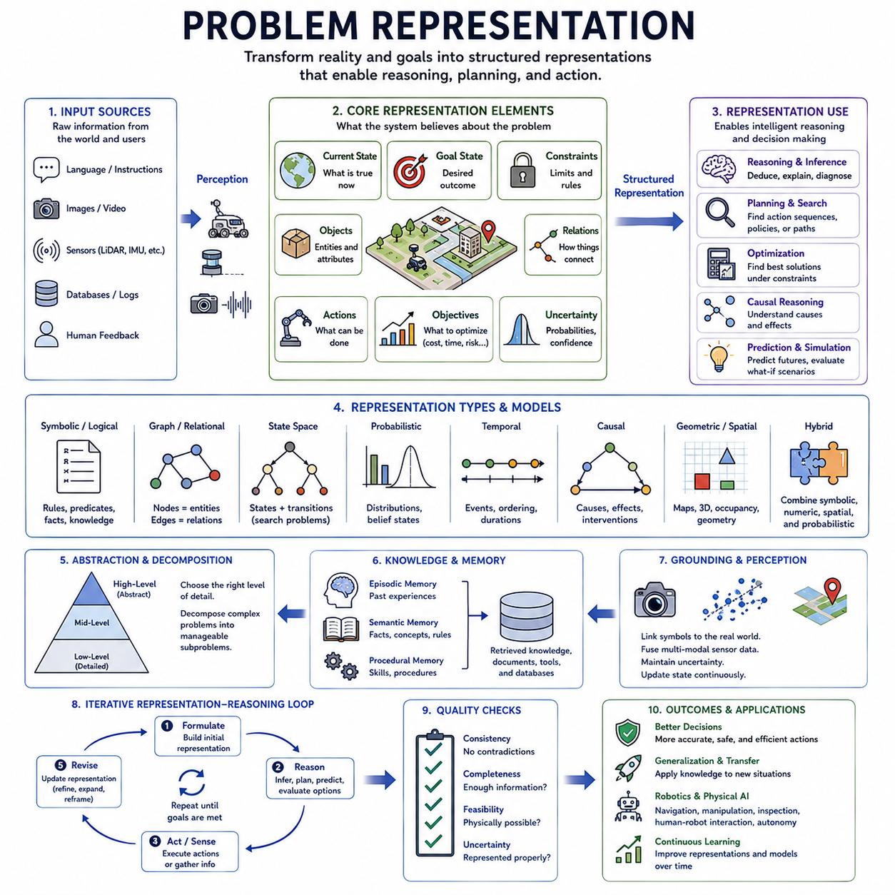{width="7.268055555555556in" height="7.268055555555556in"}

문제 표현(Problem Representation)은 상황, 질문, 목표 또는 과제를 추론 시스템이 이해하고 조작할 수 있는 내부 구조로 변환하는 과정입니다. 문제를 해결하기 전에 지능형 에이전트는 어떤 개체가 존재하는지, 어떤 관계가 중요한지, 현재 상태가 무엇인지, 어떤 결과를 원하는지, 그리고 어떤 제약조건이 가능한 해결책을 제한하는지를 결정해야 합니다.

문제 표현의 품질은 추론의 품질에 강한 영향을 미칩니다. 매우 강력한 추론 알고리즘이라도 문제가 잘못되었거나, 불완전하거나, 부적절한 추상화 수준으로 표현되면 실패할 수 있습니다. 반대로 잘 구조화된 표현은 어려운 문제를 더 단순한 탐색, 추론, 최적화 또는 계획 문제로 변환할 수 있습니다.

따라서 문제 표현은 지각(Perception)과 추론(Reasoning) 사이의 인터페이스 역할을 합니다. 언어, 이미지, 센서, 데이터베이스 또는 인간의 지시에서 얻은 원시 관측은 체계적인 추론이 시작되기 전에 의미 있는 개념, 변수, 상태, 관계, 제약조건 및 목표로 변환되어야 합니다.

첫 번째 단계는 문제 경계(Problem Boundary)를 식별하는 경우가 많습니다. 현실 세계의 상황에는 막대한 양의 정보가 존재하지만 현재 목표와 관련된 정보는 그중 일부에 불과합니다. 표현은 추론 문제 내부에 포함되어야 하는 변수와 일시적으로 무시할 수 있는 배경 세부사항을 구분해야 합니다.

문제 경계는 반드시 영구적인 것은 아닙니다. 새로운 증거가 이전에 무시했던 요인이 중요하다는 사실을 보여줄 수 있으며, 이에 따라 표현을 확장해야 할 수 있습니다. 따라서 지능형 추론은 최초의 문제 정식화가 항상 정확하다고 가정하기보다 수정 가능한 표현을 사용할 때 더 효과적입니다.

현재 상태(Current State)는 추론이 시작되는 시점에 무엇이 참이라고 믿는지를 설명합니다. 여기에는 관측된 사실, 추정 변수, 객체 구성, 시스템 조건, 사용 가능한 자원, 이전 행동 및 불확실성이 포함될 수 있습니다. 동적 환경에서는 새로운 관측이 들어올 때마다 현재 상태가 지속적으로 업데이트됩니다.

목표 상태(Goal State)는 추론 과정이 도달하려는 조건을 설명합니다. 목표는 로봇을 지정된 위치로 이동시키는 것처럼 명확할 수도 있고, 검사를 안전하고 효율적으로 완료하는 것처럼 추상적일 수도 있습니다. 복잡한 시스템은 주 목표, 보조 목표, 안전 요구사항을 동시에 유지할 수 있습니다.

목표는 계층적(Hierarchical)일 수도 있습니다. 임무 수준의 목표는 작업, 하위 작업, 기술, 개별 행동으로 분해될 수 있습니다. 계층적 표현은 모든 고수준 의사결정에서 모든 저수준 행동을 동시에 고려하지 않고 적절한 수준에서 추론할 수 있도록 하여 복잡성을 줄입니다.

제약조건(Constraints)은 유효한 해결책이 반드시 만족해야 하는 조건을 정의합니다. 여기에는 물리적 한계, 논리적 요구사항, 시간 제약, 자원 가용성, 안전 규칙, 법적 요구사항, 기하학적 실행 가능성, 통신 제한, 에너지 용량 또는 작업 사이의 의존성이 포함될 수 있습니다.

엄격한 제약조건(Hard Constraints)은 위반할 수 없지만, 완화 가능한 제약조건(Soft Constraints)은 다른 목표와 절충할 수 있는 선호를 나타냅니다. 로봇은 위험 구역 진입은 절대 금지될 수 있지만 더 짧은 경로를 단지 선호할 수 있습니다. 이러한 구분은 최적화 과정에서 성능 향상을 위해 필수 요구사항이 희생되는 것을 방지합니다.

목적 함수(Objectives)는 유효한 해결책들 가운데 무엇을 최적화해야 하는지를 설명합니다. 일반적인 목적에는 시간, 에너지, 비용, 위험, 불확실성 또는 거리의 최소화와 생산성, 정보 획득량, 신뢰성, 커버리지 또는 작업 성공률의 최대화가 포함됩니다. 실제 문제의 상당수는 하나의 목적이 아니라 여러 경쟁 목표를 포함합니다.

다목적 표현(Multi-Objective Representation)은 이러한 절충을 명시적으로 다룰 수 있게 합니다. 로봇은 에너지를 많이 소비하지만 빠른 경로와 더 느리지만 안전 여유가 큰 경로 사이에서 선택해야 할 수 있습니다. 표현은 이러한 경쟁 요소를 너무 일찍 하나의 단순한 수치로 축소하지 않고 보존해야 합니다.

행동(Actions)은 에이전트가 실행할 수 있는 변화를 표현합니다. 각 행동에는 실행 가능한 조건을 설명하는 전제조건(Preconditions)과 상태가 어떻게 변화하는지를 설명하는 효과(Effects)가 포함될 수 있습니다. 행동을 명시적으로 표현하면 정적인 세계 설명을 여러 미래를 탐색할 수 있는 의사결정 문제로 전환할 수 있습니다.

행동 표현(Action Representation)은 자율 시스템에서 특히 중요합니다. 추론은 의사결정과 결과를 연결해야 하기 때문입니다. 상태만 표현하고 가능한 개입을 표현하지 않는 시스템은 앞으로 무엇이 일어날지는 예측할 수 있지만 결과를 어떻게 변화시킬지는 체계적으로 결정하기 어렵습니다.

상태 공간 표현(State-Space Representation)은 문제를 행동 또는 전이로 연결된 가능한 상태들의 집합으로 모델링합니다. 문제 해결은 초기 상태에서 목표를 만족하는 상태로 이동하는 경로를 탐색하는 과정이 됩니다. 이러한 표현은 계획, 로보틱스, 게임, 스케줄링, 고전적 인공지능에서 널리 사용됩니다.

변수의 수가 증가하면 상태 공간의 크기는 매우 빠르게 증가할 수 있습니다. 각각의 변수가 여러 가능한 값을 가진다면 그 조합으로 인해 엄청난 수의 상태가 생성됩니다. 따라서 효과적인 표현은 관련 정보를 보존하면서 불필요한 차원을 피하도록 구성되어야 합니다.

추상화(Abstraction)는 복잡성을 제어하기 위한 가장 중요한 도구 가운데 하나입니다. 모든 물리적 세부사항을 표현하는 대신 시스템은 현재 의사결정에 필요한 정보를 보존하는 고수준 개념으로 상황을 설명할 수 있습니다. 적절한 추상화는 탐색 공간을 줄이고 추론 효율성을 향상시킵니다.

그러나 지나친 추상화는 올바른 의사결정에 필요한 정보를 제거할 수 있습니다. 내비게이션 계획기가 복도를 단순히 주행 가능하다고 표현하더라도 로봇 폭, 페이로드, 바닥 마찰 또는 회전 반경이 실제 안전한 통과 여부를 결정한다면 이 표현은 충분하지 않습니다.

따라서 적절한 추상화 수준은 문제에 따라 달라집니다. 고수준 임무 계획은 방, 목적지, 작업, 자원에 대해 추론할 수 있지만 저수준 모션 계획은 기하학, 속도, 가속도, 충돌 경계 및 액추에이터 제약조건을 필요로 합니다.

계층적 표현(Hierarchical Representations)은 여러 추상화 수준을 동시에 유지할 수 있게 합니다. 고수준 노드는 전체 작업을 나타내고 하위 수준은 하위 작업, 궤적, 제어기 명령 또는 물리적 상호작용을 설명할 수 있습니다. 더 세부적인 정보가 필요하면 추론은 이러한 수준 사이를 이동할 수 있습니다.

분해(Decomposition)는 추상화와 밀접하게 관련됩니다. 복잡한 문제를 독립적이거나 순차적으로 해결하기 쉬운 작은 하위 문제로 나눌 수 있습니다. 효과적인 분해는 상호작용이 충분히 제한된 경계를 식별하여 국소적인 추론 결과가 유용하게 유지되도록 합니다.

잘못된 분해는 하위 문제 사이에 숨겨진 의존성을 만들 수 있습니다. 공유 자원, 시간 제약, 물리적 상호작용 또는 공통 목표를 무시하면 각각의 구성 요소를 독립적으로 해결해도 서로 호환되지 않는 결과가 발생할 수 있습니다. 따라서 표현은 중요한 하위 문제 간 관계를 보존해야 합니다.

객체(Objects)는 또 다른 유용한 표현 단위입니다. 객체 중심 표현(Object-Centric Representations)은 지속적인 개체와 그 속성, 상태, 능력 및 관계를 기술합니다. 이 구조는 로봇, 사람, 도구, 장애물, 기계, 컨테이너 및 조작 가능한 객체가 포함된 환경을 표현하는 데 자연스럽습니다.

관계(Relations)는 개체들이 어떻게 연결되어 있는지를 설명합니다. 예를 들어 내부에 있음, 위에 있음, 근처에 있음, 연결됨과 같은 공간 관계, 지지함 또는 제어함과 같은 기능 관계, 소유함, 요청함, 의존함과 같은 사회적 또는 조직적 관계가 있습니다. 이러한 관계는 고립된 객체 속성보다 더 많은 추론 가치를 제공하는 경우가 많습니다.

그래프 표현(Graph Representations)은 관계 중심의 문제를 자연스럽게 표현합니다. 노드는 객체, 상태, 위치, 작업, 개념 또는 사건을 나타낼 수 있고, 엣지(Edges)는 관계, 의존성, 전이 또는 인과 연결을 나타낼 수 있습니다. 따라서 많은 계획 및 추론 문제를 그래프 탐색 또는 그래프 추론 문제로 정식화할 수 있습니다.

지식 그래프(Knowledge Graphs)는 개체들을 의미적 관계로 연결하여 관계 표현을 확장합니다. 이는 불완전한 문제를 해석하고, 개념을 연결하고, 참조를 해결하며, 관련 제약조건 또는 가능한 행동을 식별하는 배경 지식을 제공할 수 있습니다.

논리적 표현(Logical Representations)은 명제(Propositions), 술어(Predicates), 변수, 한정자(Quantifiers), 규칙을 이용하여 문제를 설명합니다. 관계와 제약조건을 명확히 표현할 수 있고 정확한 결론이 필요한 경우 유용합니다. 논리 표현은 가정을 검사하고 검증하기도 쉽습니다.

기호적 표현(Symbolic Representations)은 조합적 구조(Compositional Structure)를 제공합니다. 개념을 더 큰 표현으로 결합할 수 있기 때문에 과거에 정확히 관측되지 않았던 관계도 표현할 수 있습니다. 이는 체계적인 추론을 지원하고 복잡한 문제 구조를 조작하기 쉽게 만듭니다.

수치적 표현(Numerical Representations)은 위치, 속도, 힘, 확률, 온도, 에너지, 비용, 시간과 같은 연속적인 값을 포함하는 문제에 필수적입니다. 최적화, 제어, 추정, 물리 시뮬레이션은 일반적으로 수치 상태 변수 위에서 작동합니다.

따라서 많은 실제 문제는 기호 정보와 수치 정보를 결합하는 하이브리드 표현(Hybrid Representations)을 필요로 합니다. 예를 들어 로봇은 문이 닫혀 있다는 사실은 기호적으로 표현하면서 위치, 방향, 크기, 열림 각도, 필요한 조작 힘은 수치적으로 표현할 수 있습니다.

상태에 불확실성이 존재한다면 확률적 표현(Probabilistic Representations)이 필요합니다. 하나의 해석을 확실한 사실로 가정하는 대신 가능한 상태들에 대한 분포나 신뢰도를 표현할 수 있습니다. 이는 관측이 잡음이 있거나, 불완전하거나, 모호하거나, 서로 모순될 때 특히 중요합니다.

믿음 상태(Belief States)는 에이전트가 실제 세계 상태에 직접 접근한다고 가정하는 대신 현재 세계에 대해 무엇을 믿고 있는지를 표현합니다. 하나의 믿음 상태는 여러 가능한 구성에 확률을 부여할 수 있으며 새로운 증거가 들어오면 업데이트됩니다.

부분 관측성(Partial Observability)은 로보틱스에서 믿음 표현을 필수적으로 만듭니다. 로봇은 모든 위치, 객체 속성, 인간의 의도 또는 환경 조건을 직접 관측할 수 없습니다. 따라서 숨겨진 변수에 대한 불확실성을 유지하면서 불완전한 증거를 기반으로 추론해야 합니다.

시간적 표현(Temporal Representation)은 상태가 어떻게 변화하는지에 관한 정보를 추가합니다. 현재 상황의 의미가 이전 사건, 행동 이력, 속도, 추세, 지연 또는 예상 미래 전이에 의존한다면 하나의 정적 스냅샷만으로는 충분하지 않습니다.

사건(Events)은 이산적인 변화를 나타내고 프로세스(Processes)는 시간에 걸쳐 진행되는 변화를 나타냅니다. 상태, 사건, 프로세스를 구분하면 추론 시스템은 순간적인 전이와 연속적인 동역학을 모두 표현할 수 있습니다.

시간적 순서(Temporal Ordering)는 의존성을 식별하는 데도 도움을 줍니다. 일부 행동은 다른 행동보다 먼저 수행되어야 하고, 일부 자원은 앞선 작업이 완료된 이후에만 사용할 수 있으며, 일부 효과는 지연된 후 나타납니다. 따라서 스케줄링과 계획은 명시적인 시간 관계에 의존합니다.

인과적 표현(Causal Representation)은 하나의 변수 변화가 다른 변수에 어떻게 영향을 미치는지를 설명합니다. 인과 구조를 포함하면 문제를 단순한 패턴 매칭에서 개입에 대한 추론 문제로 변환할 수 있습니다. 시스템은 어떤 변수가 관련되는지만이 아니라 어떤 행동이 실제로 원하는 변화를 만들 수 있는지를 질문할 수 있습니다.

인과 그래프(Causal Graphs)는 진단 또는 개입 문제에서 특히 유용합니다. 하나의 관측된 실패가 여러 상위 조건으로부터 발생할 수 있다면 표현은 후보 원인을 조직하고 어떤 시험이나 개입이 이들을 구분할 수 있는지를 예측할 수 있습니다.

따라서 문제 표현과 인과 추론(Causal Reasoning)은 밀접하게 상호작용합니다. 표면적인 관측만으로 표현된 문제는 효과적인 행동에 필요한 메커니즘을 숨길 수 있습니다. 원인, 결과, 매개 변수, 가능한 개입을 표현하면 추론을 안내하는 더 깊은 구조가 드러납니다.

유추적 추론(Analogical Reasoning)도 표현에 의존합니다. 두 문제는 표면적으로는 달라 보이더라도 동일한 관계 구조를 공유할 수 있습니다. 적절한 추상화 수준에서 표현하면 하나의 도메인에서 사용한 해결책을 다른 도메인으로 전이할 수 있습니다.

예를 들어 공장의 기계를 스케줄링하는 문제와 로봇을 검사 작업에 할당하는 문제는 서로 다른 개체를 포함하지만 자원, 우선순위, 의존성, 마감시간이라는 공통 제약 구조를 가질 수 있습니다. 관계적 표현은 이러한 공통 구조를 드러내어 추론 전략의 재사용을 지원합니다.

따라서 표현은 어떤 유사성이 드러날지를 결정합니다. 원시 감각 표현이나 언어 표현은 표면적인 차이를 강조할 수 있지만 추상적인 관계 표현은 겉으로 무관해 보이는 문제 사이의 구조적 동등성(Structural Equivalence)을 드러낼 수 있습니다.

언어(Language)는 유연하지만 모호한 문제 표현입니다. 인간은 자연스럽게 언어를 통해 목표, 제약조건, 가정, 예외, 선호, 문맥을 표현합니다. 대규모 언어 모델(Large Language Models, LLMs)은 이러한 설명을 해석할 수 있지만 신뢰성 높은 추론을 위해서는 언어 정보를 보다 명시적인 내부 구조로 변환해야 하는 경우가 많습니다.

자연어 지시에는 인간이 암묵적으로 가정하는 정보가 자주 생략됩니다. 예를 들어 "패키지를 안전하게 옮겨라"라는 요청에는 어떤 패키지인지, 어디로 이동할 것인지, 안전 거리, 최대 가속도, 금지 구역, 우선순위, 완료 조건이 무엇인지 명시되지 않을 수 있습니다.

따라서 추론 시스템은 해결책을 결정하기 전에 누락된 변수와 가정을 식별해야 합니다. 명확화(Clarification)는 충분히 완전한 문제 모델을 구성하기 위해 필요한 정보를 능동적으로 획득하는 과정이므로 문제 표현의 일부로 볼 수 있습니다.

모호성(Ambiguity)은 여러 후보 표현을 생성할 수 있습니다. 하나의 해석을 너무 일찍 선택하기보다 지능형 에이전트는 추가 문맥이 대안을 제거할 때까지 여러 가설을 유지할 수 있습니다. 이는 잘못된 초기 해석에 대한 성급한 확정 때문에 발생하는 실패를 줄여줍니다.

대규모 언어 모델은 비구조화된 언어를 구조화된 설명으로 변환하는 데 특히 효과적입니다. 텍스트에서 개체, 관계, 요구사항, 제약조건, 목표, 후보 행동을 추출하여 계획, 스키마(Schemas), 그래프, 표 또는 도구 입력 형태로 변환할 수 있습니다.

그러나 LLM이 생성한 표현에는 원래 정보에 근거하지 않은 가정이 포함될 수 있습니다. 신뢰성 높은 시스템은 명시적으로 제시된 사실과 추론된 가정, 검색된 배경 지식, 생성된 가설을 구분해야 합니다.

그라운딩(Grounding)은 기호적 또는 언어적 표현을 실제 세계의 관측과 연결합니다. 피지컬 AI(Physical AI)에서 "문", "장애물", "자유 공간", "무거운 객체"와 같은 개념은 결국 센서 측정과 물리적으로 의미 있는 속성에 연결되어야 합니다.

그라운딩이 없다면 표현은 언어적으로는 일관적이어도 운영에는 사용할 수 없을 수 있습니다. 로봇은 "장애물"이라는 기호적 개념을 모션 계획에 적용하기 전에 실제 기하학, 위치, 불확실성, 충돌 위험과 연결해야 합니다.

따라서 지각은 문제 정식화(Problem Formulation)에 직접 참여합니다. 객체 탐지, 분할(Segmentation), 깊이 추정, 위치 추정, 매핑, 음성 인식, 힘 센싱 및 기타 지각 과정은 어떤 개체와 속성이 추론에 사용 가능하게 되는지를 결정합니다.

센서 융합(Sensor Fusion)은 여러 모달리티(Modality)의 정보를 결합하여 더 완전한 표현을 구축합니다. 카메라는 의미 정보를 제공하고, 라이다(LiDAR)는 기하학 정보를 제공하며, 관성 측정 장치(Inertial Measurement Unit, IMU)는 운동 정보를 제공하고, 위성항법시스템(Global Navigation Satellite System, GNSS)은 전역 위치를 제공할 수 있습니다. 이들을 통합하면 단일 센서보다 풍부한 상태 표현을 얻을 수 있습니다.

표현은 센싱 과정에서 발생하는 불확실성도 유지해야 합니다. 객체 위치나 위치 추정 결과를 정확한 값처럼 취급하면 이후 계획에서 오류가 발생할 수 있습니다. 신뢰도(Confidence), 공분산(Covariance), 확률 또는 경계가 있는 불확실성(Bounded Uncertainty)을 사용하여 추정 품질을 추론 모듈에 전달할 수 있습니다.

월드 모델(World Models)은 환경이 현재 어떻게 구성되어 있고 어떻게 변화하는지를 구조적으로 표현합니다. 객체, 공간 관계, 시간 상태, 행동, 동역학, 불확실성, 예측된 미래를 하나의 공통 프레임워크로 통합할 수 있습니다.

따라서 월드 모델은 자율 에이전트의 핵심 문제 표현으로 기능할 수 있습니다. 현재 상태는 추정된 세계를 설명하고, 목표는 원하는 미래 조건을 설명하며, 행동은 개입을 정의하고, 학습된 또는 물리 기반 동역학은 가능한 전이를 설명합니다.

잠재 표현(Latent Representations)은 고차원 관측을 더 낮은 차원의 내부 상태로 압축할 수 있습니다. 이미지, 포인트 클라우드(Point Clouds), 오디오, 센서 이력에는 방대한 원시 데이터가 포함되지만 특정 의사결정에는 대부분이 필요하지 않을 수 있습니다. 학습된 인코더(Encoders)는 예측이나 제어에 유용한 압축 특징을 추출할 수 있습니다.

그러나 압축 과정에서는 작업 관련 정보를 반드시 보존해야 합니다. 단순히 재구성(Reconstruction)을 잘하도록 최적화된 잠재 표현은 행동과 무관한 시각 세부사항은 유지하면서 작지만 안전에 중요한 특성을 잃을 수 있습니다. 따라서 표현 학습은 이후의 추론 목표와 정렬되어야 합니다.

작업 조건부 표현(Task-Conditioned Representation)은 현재 목표에 중요한 정보를 강조하여 이 문제를 해결합니다. 동일한 환경도 내비게이션, 검사, 조작, 진단, 인간 상호작용에 따라 서로 다른 표현이 필요할 수 있습니다.

주의 메커니즘(Attention Mechanisms)은 표현 내부에서 관련 정보를 동적으로 선택할 수 있습니다. 모든 특징을 동일하게 처리하는 대신 시스템은 현재 의사결정에 영향을 줄 가능성이 높은 객체, 변수, 기억 또는 관계에 계산 자원을 집중할 수 있습니다.

선택적 표현(Selective Representation)은 추론 복잡성을 줄입니다. 로봇이 객체를 어떻게 파지할지를 계획한다면 먼 지역의 지도 정보는 일시적으로 중요하지 않을 수 있지만 객체 형상, 그리퍼 자세, 접촉 표면, 주변 장애물은 매우 중요해집니다.

기억(Memory)은 현재 관측에 존재하지 않는 정보를 제공합니다. 이전 상태, 행동, 실패, 성공적인 전략, 환경 변화, 학습된 규칙이 모두 실질적인 문제 표현의 일부가 될 수 있습니다.

일화 기억(Episodic Memory)은 현재 상황이 어떻게 형성되었는지에 관한 문맥을 복원할 수 있습니다. 로봇이 차단된 경로를 관측했을 때 해당 장애물이 최근 사람에 의해 이동되었다는 사실을 기억한다면 장애물이 영구적인지에 대한 예측이 달라질 수 있습니다.

의미 기억(Semantic Memory)은 객체 속성, 작업 규칙, 물리적 관계, 운영 절차에 대한 일반화된 지식을 제공합니다. 이러한 지식은 매 에피소드마다 기본적인 사실을 다시 학습하지 않고도 문제 표현에서 구조적 역할을 수행할 수 있습니다.

절차 기억(Procedural Memory)은 재사용 가능한 기술과 행동 패턴을 제공합니다. 현재 문제가 알려진 작업 범주에 속한다고 표현되면 모든 행동 시퀀스를 처음부터 구성하는 대신 적절한 절차를 검색할 수 있습니다.

따라서 문제 표현은 어떤 기억이 검색되는지를 결정합니다. 현재 문제를 부적절한 특징으로 인코딩하면 관련 없는 경험을 검색할 수 있습니다. 더 나은 표현은 현재 상황과 유용한 과거 에피소드 사이의 의미 있는 유사성을 드러냅니다.

검색 증강 생성(Retrieval-Augmented Generation, RAG)은 문서, 매뉴얼, 로그, 데이터베이스 또는 이전 경험을 검색하여 LLM의 작업 표현을 확장할 수 있습니다. 검색된 정보는 제약조건을 명확하게 하고, 누락된 사실을 제공하며, 도메인 특화 절차를 추가하는 문맥으로 사용될 수 있습니다.

외부 도구(External Tools)도 표현을 확장할 수 있습니다. 계산기는 수치 결과를 제공하고, 시뮬레이터는 물리적 결과를 보여주며, 데이터베이스는 사실적 상태 정보를 제공하고, 매핑 시스템은 공간 구조를 제공할 수 있습니다. 도구 사용은 처음에 사용 불가능했던 정보를 추론에 포함할 수 있는 변수로 변환합니다.

따라서 문제 표현은 추론이 시작되기 전에 완전히 끝나는 과정이 아닐 수 있습니다. 추론이 누락된 정보를 드러내고, 검색이나 측정을 유발하며, 표현을 수정한 후 다시 추론이 계속될 수 있습니다. 문제 표현과 추론은 엄격한 순차 파이프라인이 아니라 반복적인 과정입니다.

이 반복 과정은 정식화(Formulate), 추론(Reason), 점검(Inspect), 수정(Revise), 재추론(Reason Again)으로 설명할 수 있습니다. 초기 표현이 예비 추론을 지원하고, 그 결과 불일치나 누락 변수가 드러나면 시스템은 표현을 업데이트한 후 문제가 충분히 구체화될 때까지 이 과정을 반복합니다.

재구성(Reframing)은 강력한 표현 수정 방법입니다. 어려운 문제도 다른 방식으로 표현하면 쉬워질 수 있습니다. 내비게이션 문제는 그래프 탐색 문제로, 자원 할당은 최적화 문제로, 진단은 인과 그래프에 대한 추론 문제로 표현할 수 있습니다.

서로 다른 정식화는 서로 다른 해결 방법을 드러냅니다. 문제의 계산 구조를 인식하면 모든 상황에 하나의 일반적인 추론 전략을 적용하는 대신 적절한 알고리즘을 선택할 수 있습니다.

제약조건 만족 문제(Constraint Satisfaction Problems)는 변수, 가능한 값, 변수 사이의 제약조건으로 표현됩니다. 해결책은 필수 제약조건을 모두 만족하는 값의 할당입니다. 스케줄링, 구성, 자원 할당, 많은 계획 문제가 이러한 방식으로 정식화될 수 있습니다.

최적화 문제(Optimization Problems)는 제약조건에 목적 함수를 추가합니다. 여러 실행 가능한 해결책이 존재할 수 있고 추론 과정은 성능 기준을 가장 잘 만족하는 해결책을 찾습니다. 로보틱스에서는 궤적 생성, 제어, 위치 추정, 자원 할당, 시스템 설계에 최적화가 널리 사용됩니다.

탐색 문제(Search Problems)는 후보 상태와 전이로 표현됩니다. 휴리스틱(Heuristics)은 어떤 상태가 유망한지를 추정하여 모든 가능성을 탐색하지 않도록 합니다. 휴리스틱의 효과는 표현이 목표를 향한 진전에 관련된 정보를 얼마나 잘 드러내는지에 크게 의존합니다.

계획 문제(Planning Problems)는 행동, 전제조건, 효과, 목표, 경우에 따라 비용이나 확률을 명시적으로 표현합니다. 계획은 현재 상태를 원하는 상태로 변화시키면서 제약조건을 만족하는 행동 시퀀스 또는 정책을 탐색합니다.

불확실성 아래의 의사결정 문제(Decision Problems Under Uncertainty)는 확률과 효용(Utilities)을 필요로 합니다. 에이전트는 결정론적인 전이를 가정하는 대신 가능한 결과를 평가해야 합니다. 기대 효용(Expected Utility), 위험, 정보 획득량, 신뢰도가 모두 표현의 구성 요소가 될 수 있습니다.

부분 관측 의사결정 문제(Partially Observable Decision Problems)는 숨겨진 상태에 대한 믿음을 유지하면서 이를 더욱 확장합니다. 행동은 물리적 환경을 변화시키는 동시에 에이전트의 상태 이해를 향상시키는 정보도 제공할 수 있습니다.

행동의 이러한 이중 역할은 피지컬 AI에서 중요합니다. 로봇은 목적지로 이동하면서 동시에 카메라 가시성 또는 위치 추정 신뢰도를 높이는 궤적을 선택할 수 있습니다. 따라서 문제 표현은 작업 진행과 정보 획득을 모두 포함해야 합니다.

다중 에이전트 문제(Multi-Agent Problems)는 다른 에이전트, 공유 자원, 통신, 의도, 책임 및 가능한 상호작용에 대한 표현을 필요로 합니다. 미래 상태가 단지 추론하는 에이전트의 행동만으로 결정되는 것이 아니라 다른 에이전트도 독립적으로 세계에 영향을 주기 때문입니다.

인간-로봇 상호작용(Human-Robot Interaction)은 선호, 사회적 규범, 의사소통 신호, 의도에 대한 불확실성, 안전 여유를 추가합니다. 표현은 물리적 기하학뿐 아니라 협업 행동에 필요한 행동적·문맥적 정보도 포함해야 합니다.

로보틱스의 문제 표현은 기하학적, 의미적, 동적, 인과적, 작업 수준의 정보를 함께 결합해야 하는 경우가 많습니다. 순수한 기하학 지도는 단순한 충돌 회피에는 충분할 수 있지만 어떤 영역이 제한 구역인지, 문이 열릴 수 있는지, 인간이 우선권을 가지는지를 이해하기에는 부족합니다.

의미 지도(Semantic Maps)는 공간 표현에 객체와 영역의 의미를 추가합니다. 위치를 복도, 작업 공간, 충전소, 적재 구역, 위험 구역 또는 인간 접근 구역 등으로 정의할 수 있습니다. 이를 통해 계획은 기하학뿐 아니라 운영 지식도 반영할 수 있습니다.

위상 지도(Topological Maps)는 정밀한 거리와 형상보다 연결성을 표현합니다. 대규모 환경을 의미 있는 장소와 연결 관계로 축약할 수 있으므로 고수준 계획에 유용합니다. 실제 정밀 운동이 필요할 때만 세부적인 메트릭 기하학(Metric Geometry)을 사용할 수 있습니다.

조감도 표현(Bird\'s-Eye View, BEV Representations)은 여러 카메라와 라이다 정보를 로봇이나 차량 주변의 공통 공간 좌표계로 통합할 수 있습니다. 이를 통해 객체, 차선, 장애물, 주행 가능 영역, 지역 운동 관계를 표현하기 편리합니다.

복셀 표현(Voxel Representations)은 공간 추론을 3차원으로 확장합니다. 점유 공간, 자유 공간, 객체 기하학, 지형 구조 및 불확실성을 표현할 수 있지만 해상도와 표현 공간이 증가할수록 계산 비용도 매우 빠르게 증가합니다.

장면 그래프(Scene Graphs)는 탐지된 객체들을 공간적, 기능적, 의미적 관계로 연결하는 또 다른 유용한 표현입니다. 지각을 서로 독립적인 객체 탐지들의 집합으로 취급하는 대신 추론이 수행되는 구조화된 상황 전체를 표현합니다.

작업 그래프(Task Graphs)는 행동이나 하위 작업 사이의 의존성을 표현합니다. 노드는 작업을 설명하고 엣지는 순서, 전제조건, 자원, 동기화 관계를 나타냅니다. 조립, 검사, 물류, 제조 및 복잡한 로봇 임무에서 이러한 그래프가 유용합니다.

임무 수준 표현(Mission-Level Representations)은 작업 그래프에 지도, 자원 상태, 로봇 능력, 마감시간, 우선순위, 안전 제약조건을 결합할 수 있습니다. 이를 통해 자율 시스템은 무엇을 해야 하는지, 어디에서 해야 하는지, 어떤 플랫폼이 수행해야 하는지를 동시에 추론할 수 있습니다.

다중 로봇 시스템(Multi-Robot Systems)은 능력 인식 표현(Capability-Aware Representation)을 필요로 합니다. 로봇마다 페이로드 제한, 센서, 매니퓰레이터, 이동 방식, 배터리 용량, 계산 자원이 다를 수 있습니다. 이러한 차이가 명시적으로 표현되어야 의미 있는 작업 할당(Task Allocation)이 가능합니다.

플랫폼 특화 제약조건(Platform-Specific Constraints)도 중요합니다. 소형 바퀴형 로봇에게 가능한 경로가 중량 플랫폼에는 불가능할 수 있고, 보행 로봇이 통과할 수 있는 지형이 바퀴형 시스템에는 적합하지 않을 수 있습니다. 표현은 환경 속성과 플랫폼 능력을 연결해야 합니다.

따라서 피지컬 AI는 행동유도성 기반 표현(Affordance-Based Representations)에서 큰 이점을 얻을 수 있습니다. 객체나 지형이 무엇인지뿐 아니라 특정 에이전트에게 어떤 행동을 가능하게 하는지를 표현합니다. 주행 가능성(Traversability), 파지 가능성(Graspability), 밀기 가능성(Pushability), 지지 가능성(Support), 도달 가능성(Reachability), 검사 가능성(Inspectability)이 이에 해당합니다.

행동유도성(Affordances)은 객체에 내재된 고정 속성이 아니라 관계적(Relational)입니다. 하나의 계단이 어떤 로봇에게는 통과 가능하지만 다른 로봇에게는 불가능할 수 있고, 하나의 객체가 특정 매니퓰레이터에는 파지 가능하지만 다른 매니퓰레이터에는 너무 클 수 있습니다. 따라서 표현은 객체 속성과 에이전트 능력을 연결해야 합니다.

안전(Safety)은 사후 고려사항이 아니라 명시적으로 표현되어야 합니다. 위험 구역, 충돌 여유, 속도 제한, 안정성 한계, 불확실성 임계값, 인간 근접 규칙, 비상 조건은 모두 문제 내부의 형식적 제약조건으로 포함될 수 있습니다.

위험 표현(Risk Representation)은 발생 확률과 결과의 심각성을 함께 고려하여 안전 추론을 확장합니다. 발생 확률이 낮더라도 결과가 매우 심각하다면 강하게 회피해야 할 수 있습니다. 따라서 자율 계획은 기대 성능과 허용 가능한 위험을 구분해야 합니다.

현재 관측을 넘어 추론할 때 불확실성과 위험은 더욱 중요해집니다. 예측 범위(Prediction Horizon)가 길어질수록 일반적으로 미래 상태에 대한 불확실성이 커집니다. 불확실한 장기 예측에 크게 의존하는 계획은 추가적인 센싱이나 더 보수적인 행동을 필요로 할 수 있습니다.

월드 모델 기반 계획(World-Model Planning)은 하나의 결정론적 궤적이 아니라 여러 후보 미래를 표현할 수 있습니다. 서로 다른 행동은 서로 다른 예측 분기를 만들고 환경 불확실성은 각 분기에서 추가적인 가능한 결과를 생성할 수 있습니다.

이러한 표현은 구조화된 미래 상태 공간(Structured Future-State Space)과 유사합니다. 계획은 가능한 미래 전반에 걸쳐 기대되는 진행, 위험, 불확실성, 자원 소비, 안전을 평가하여 행동을 선택합니다.

반사실적 표현(Counterfactual Representation)은 결과가 이미 발생한 이후 다른 행동을 선택했다면 어떤 일이 발생했을지를 비교할 수 있습니다. 실제 이력과 함께 다른 결정에 따른 가상의 분기를 표현할 수 있습니다.

이러한 표현은 실패로부터의 학습(Learning from Failure)을 지원합니다. 단순히 행동이 실패했다는 사실만 저장하는 대신 실패가 발생한 조건, 인과 요인, 대안 행동, 예상 결과까지 표현하여 왜 실패했으며 앞으로 어떻게 피할 수 있는지를 학습할 수 있습니다.

따라서 표현은 지속 학습(Continual Learning)의 핵심입니다. 새로운 경험은 단순히 더 많은 원시 데이터를 추가하는 것이 아니라 미래 문제를 정식화하는 데 사용되는 범주, 관계, 제약조건, 인과 모델, 추상화 및 작업 스키마를 개선할 수 있습니다.

반복되는 경험은 공통 문제 구조를 나타내는 스키마(Schemas)를 생성할 수 있습니다. 로봇은 도킹(Docking), 장애물 통과, 검사, 적재, 인간 상호작용, 위치 추정 실패 복구 등에 대한 일반화된 스키마를 발전시킬 수 있습니다.

스키마는 새로운 상황을 이미 알려진 구조의 변형으로 표현할 수 있기 때문에 추론 부담을 줄입니다. 시스템은 현재 객체, 파라미터, 제약조건 및 목표만 채우면서 이전에 학습한 조직 패턴을 재사용할 수 있습니다.

그러나 스키마 재사용은 유연해야 합니다. 새로운 상황이 과거 표현에 포함된 가정을 위반할 수 있습니다. 에이전트는 모든 새로운 문제를 부적절한 익숙한 구조에 강제로 맞추기보다 불일치를 탐지하고 스키마를 수정해야 합니다.

표현 오류(Representation Errors)는 모든 후속 추론이 잘못된 정식화 위에서 논리적으로 일관되게 진행될 수 있기 때문에 추론 오류보다 더 위험할 수도 있습니다. 지도에서 중요한 장애물이 누락되었다면 완벽한 계획기조차 안전하지 않은 경로를 생성할 수 있습니다.

따라서 검증(Verification)은 추론 결과뿐 아니라 표현 자체도 검사해야 합니다. 필요한 변수가 포함되어 있는지, 제약조건이 일관되는지, 단위가 호환되는지, 시간 정보가 동기화되었는지, 불확실성이 표현되었는지, 가정이 증거에 의해 지지되는지를 확인할 수 있습니다.

일관성 검사(Consistency Checking)는 계획 이전에 모순을 식별할 수 있습니다. 두 센서가 서로 양립할 수 없는 상태를 보고하거나, 두 요구사항이 충돌하거나, 요청된 마감시간이 물리적 한계 때문에 불가능할 수 있습니다. 이러한 문제를 조기에 발견하면 불가능한 정식화에 불필요한 추론을 수행하는 것을 방지합니다.

완전성 검사(Completeness Checking)는 필요한 의사결정을 내리기에 충분한 정보가 있는지를 묻습니다. 완전한 지식은 거의 불가능하지만 누락된 정보가 선택할 행동을 실질적으로 변화시킬 가능성이 있는지는 판단할 수 있어야 합니다.

누락된 정보가 중요하다면 에이전트는 질문하고, 문서를 검색하고, 데이터베이스를 조회하고, 측정을 수행하거나, 정보 획득 행동을 실행할 수 있습니다. 따라서 문제 표현은 능동적인 정보 수집을 직접적으로 안내합니다.

표현 품질(Representation Quality)은 세부사항의 양이 아니라 실제 유용성으로 평가할 수 있습니다. 좋은 표현은 올바른 의사결정을 지원할 만큼 충분한 정보를 포함하면서 불필요한 복잡성을 제외합니다. 더 상세한 표현이 항상 더 좋은 것은 아닙니다.

효율성을 위해서는 선택적 충실도(Selective Fidelity)가 필요합니다. 의사결정에 강한 영향을 주는 변수에는 높은 정밀도를 할당하고 중요도가 낮은 요소는 추상적으로 유지할 수 있습니다. 이는 계산 자원과 응답 시간이 제한된 실시간 로보틱스에서 특히 중요합니다.

적응형 표현(Adaptive Representation)은 필요에 따라 충실도를 동적으로 변화시킬 수 있습니다. 로봇은 장거리 경로 계획에서는 거친 지도를 사용하다가 장애물, 도킹 스테이션, 인간 또는 조작 대상 근처에서는 밀집된 기하학적 지각으로 전환할 수 있습니다.

이러한 다중 해상도 접근(Multi-Resolution Approach)은 계층적 추론과 유사합니다. 모든 상황을 하나의 범용 표현으로 처리하는 대신 서로 다른 수준이 협력합니다. 고수준 구조는 전체 조직을 제공하고 세부적인 지역 모델은 정밀한 실행을 지원합니다.

LLM 기반 에이전트(LLM-Based Agents)는 인간의 목표를 구조화된 작업으로 변환하고, 관련 기억과 도구를 선택하고, 제약조건을 조직하고, 기호적·언어적·수치적 표현 사이에서 결과를 변환하는 표현 조정기(Representation Coordinator) 역할을 수행할 수 있습니다.

이후 전문화된 모델(Specialized Models)은 자신의 도메인에 적합한 표현 위에서 작동할 수 있습니다. 비전 모델은 이미지를 처리하고, 기하학 모델은 공간 구조를 처리하며, 월드 모델은 동역학을 예측하고, 최적화기는 수치 문제를 해결하며, 제어기는 물리적 행동을 실행합니다.

따라서 전체 시스템은 표현 상호운용성(Representation Interoperability)에서 큰 이점을 얻습니다. 정보가 모듈 사이에서 이동할 때 의미가 손실되지 않아야 합니다. 객체 식별자, 좌표계, 타임스탬프, 단위, 불확실성, 의미 라벨, 인과 관계는 변환 과정에서도 일관되게 유지되어야 합니다.

공통 월드 상태(Common World State)는 이러한 상호운용성을 제공할 수 있습니다. 서로 다른 지각 및 추론 모듈이 출처 추적(Provenance)과 신뢰도를 유지하면서 공유된 구조적 표현을 업데이트하거나 조회할 수 있습니다. 이를 통해 계획과 의사결정을 위한 일관된 기반을 형성할 수 있습니다.

고급 AI에서 핵심 문제는 단순히 더 많은 정보를 저장하는 것이 아니라 현재 추론 작업에 적합한 표현을 구성하는 것입니다. 지능은 무엇이 중요하고, 무엇을 무시할 수 있으며, 무엇이 불확실하고, 문제 요소들이 어떻게 서로 관계되는지를 결정하는 능력을 필요로 합니다.

피지컬 AI에서는 표현이 측정 가능한 물리적 현실과 연결되어야 하기 때문에 이 문제가 더욱 어렵습니다. 잘못된 가정은 결국 기하학, 동역학, 에너지 한계, 센서 불확실성, 환경 변화 또는 안전 제약조건과 충돌하게 됩니다.

따라서 문제 표현(Problem Representation)은 지각, 기억, 추론, 계획, 월드 모델링(World Modeling), 행동을 연결합니다. 관측과 지시를 계산적으로 조작 가능한 구조화된 상태, 목표, 관계, 제약조건, 행동, 불확실성 및 목적 함수로 변환합니다.

이후 추론 과정은 이러한 구조를 이용하여 탐색하고, 추론하고, 최적화하고, 시뮬레이션하고, 비교하고, 진단하고, 계획할 수 있습니다. 결과는 새로운 믿음, 예측 상태, 발견된 제약조건, 수정된 목표 또는 추가 질문의 형태로 다시 표현에 반영됩니다.

이를 통해 지속적인 표현-추론-행동 루프(Representation-Reasoning-Action Loop)가 형성됩니다. 에이전트는 문제의 모델을 구성하고, 해당 모델에서 추론하며, 행동하거나 정보를 수집하고, 결과를 관측한 후 다음 의사결정 전에 표현을 다시 업데이트합니다.

궁극적으로 문제 표현은 지능형 시스템이 실제로 어떤 문제를 해결하고 있다고 믿는지를 결정합니다. 에이전트가 무엇인가를 해결하고, 설명하고, 최적화하고, 제어하기 전에 원하는 결과와 관련된 구조를 보존하는 표현을 먼저 구성해야 합니다.

따라서 고급 추론(Advanced Reasoning)은 더 좋은 알고리즘뿐 아니라 더 좋은 정식화(Formulations)에 의존합니다. 목표, 상태, 관계, 제약조건, 행동, 불확실성, 시간적 문맥, 인과 구조 및 물리적 그라운딩이 적절하게 표현되면 복잡한 문제를 더 이해하기 쉽고, 탐색 가능하며, 예측 가능하고, 해결 가능한 형태로 만들 수 있습니다.

자율 AI(Autonomous AI)와 피지컬 AI(Physical AI)에서 효과적인 문제 표현은 신뢰할 수 있는 지능을 위한 기반을 제공합니다. 이는 원시 경험을 행동 가능한 구조(Actionable Structure)로 변환하고 지각, 기억, 추론, 월드 모델, 계획 및 제어가 무엇을 해결해야 하는지에 대한 공유된 이해를 바탕으로 함께 작동할 수 있도록 합니다.

## 03.07 Search and Planning [w/Code]

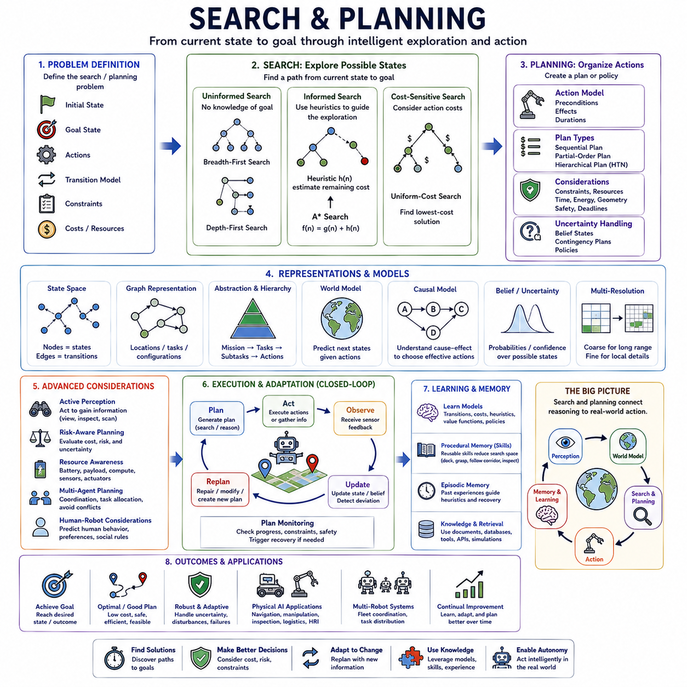{width="7.268055555555556in" height="7.268055555555556in"}

탐색(Search)과 계획(Planning)은 지능형 시스템이 현재 상태(Current State)에서 원하는 목표(Goal)를 향해 이동할 수 있도록 하는 기본적인 추론 과정입니다. 탐색은 가능한 상태, 행동 또는 해결책을 조사하고, 계획은 선택된 행동을 실행 가능한 순서 또는 정책(Policy)으로 구성합니다. 이 두 과정은 문제 표현(Problem Representation)을 목적 지향적인 의사결정(Purposeful Decision Making)으로 변환합니다.

탐색 문제(Search Problem)는 일반적으로 초기 상태(Initial State), 가능한 행동(Action)의 집합, 전이 규칙(Transition Rules), 목표 조건(Goal Conditions), 그리고 경우에 따라 행동 비용(Action Cost)을 포함합니다. 이러한 요소들은 각 상태가 문제의 가능한 구성을 나타내고 각 전이가 사용 가능한 행동에 의해 발생하는 변화를 나타내는 상태 공간(State Space)을 정의합니다.

상태 공간 탐색(State-Space Search)은 초기 상태에서 목표 상태(Goal State)로 이어지는 경로를 발견하기 위해 이러한 구조를 탐색합니다. 단순한 문제에서는 가능한 모든 상태를 체계적으로 조사할 수 있습니다. 그러나 실제 AI와 로보틱스(Robotics) 응용에서는 가능성의 수가 지수적으로 증가할 수 있으므로 효율적인 탐색 전략(Search Strategies)이 필수적입니다.

비정보 탐색(Uninformed Search) 방법은 목표 위치에 대한 추가적인 지식을 사용하지 않고 상태 공간을 탐색합니다. 너비 우선 탐색(Breadth-First Search)은 상태를 단계별로 확장하고, 깊이 우선 탐색(Depth-First Search)은 개별 분기를 더 깊이 따라갑니다. 이러한 방법은 중요한 기초를 제공하지만 상태 공간이 커지면 비효율적일 수 있습니다.

비용 민감 탐색(Cost-Sensitive Search)은 서로 다른 행동이 서로 다른 시간, 에너지, 거리, 비용 또는 기타 자원을 필요로 할 수 있다는 점을 고려합니다. 균일 비용 탐색(Uniform-Cost Search)은 누적 비용에 따라 대안을 확장하여 단순히 전이 횟수가 가장 적은 해결책이 아니라 낮은 비용의 해결책을 찾도록 합니다.

정보 탐색(Informed Search)은 휴리스틱 정보(Heuristic Information)를 이용하여 효율성을 향상시킵니다. 휴리스틱(Heuristic)은 특정 상태가 얼마나 유망한지 또는 목표에 도달하기까지 얼마나 많은 노력이 남아 있는지를 추정합니다. 계산을 더 유망한 대안으로 유도함으로써 휴리스틱 탐색은 조사해야 하는 상태의 수를 크게 줄일 수 있습니다.

A\* 탐색(A\* Search)은 초기 상태에서 현재까지 누적된 비용과 목표까지 남은 비용에 대한 휴리스틱 추정값을 결합합니다. 이러한 균형을 통해 이미 이루어진 진행과 앞으로 필요한 예상 노력을 모두 고려할 수 있습니다. 적절한 휴리스틱 특성이 주어지면 A\*는 많은 구조화된 탐색 문제에서 최적의 해결책을 효율적으로 찾을 수 있습니다.

휴리스틱 품질(Heuristic Quality)은 탐색 성능에 큰 영향을 미칩니다. 약한 휴리스틱은 충분한 방향성을 제공하지 못하여 알고리즘이 불필요한 대안을 많이 탐색하게 합니다. 유용한 휴리스틱은 문제의 의미 있는 구조를 포착하면서도 계산 비용이 충분히 낮아야 하며, 휴리스틱 자체의 계산 비용이 탐색 효율성의 이점을 상쇄해서는 안 됩니다.

계획(Planning)은 행동과 그 결과를 명시적으로 추론함으로써 탐색을 확장합니다. 계획 문제(Planning Problem)는 일반적으로 현재 상태, 원하는 목표, 사용 가능한 행동, 행동의 전제조건(Action Preconditions), 예상 효과(Expected Effects), 관련 제약조건(Constraints)을 설명합니다. 계획기는 어떤 행동을 어떤 순서로 실행해야 하는지를 결정합니다.

행동 전제조건(Action Preconditions)은 행동이 수행되기 전에 반드시 참이어야 하는 조건을 정의합니다. 효과(Effects)는 행동 실행 이후 세계가 어떻게 변화하는지를 설명합니다. 이러한 구조를 통해 계획기는 특정 행동의 적용 가능성을 판단하고 해당 행동이 표현된 상태를 목표에 가까워지거나 멀어지도록 어떻게 변화시키는지를 예측할 수 있습니다.

순차 계획(Sequential Planning)은 순서가 정해진 행동 시퀀스를 생성합니다. 이는 작업이 특정 순서로 수행되어야 하거나 이후 행동이 이전 행동의 결과에 의존하는 경우에 적합합니다. 더 복잡한 시스템에서는 서로 독립적인 활동이 자원이 허용하는 경우 동시에 수행될 수 있도록 부분 순서 계획(Partial-Order Plans)을 생성할 수도 있습니다.

계층적 계획(Hierarchical Planning)은 고수준 목표를 더 작은 작업(Task)과 하위 작업(Subtask)으로 분해하여 복잡성을 줄입니다. 시설 검사와 같은 임무는 내비게이션(Navigation), 위치 추정(Localization), 센싱(Sensing), 검사(Inspection), 보고(Reporting), 복구(Recovery) 활동으로 나눌 수 있습니다. 각각의 작업은 실행 가능한 행동이 얻어질 때까지 다시 세분화할 수 있습니다.

계층적 작업 네트워크(Hierarchical Task Network, HTN) 접근법은 추상적인 작업을 실제 운영 절차로 어떻게 분해할 수 있는지에 대한 지식을 표현합니다. 이를 통해 계획기는 이론적으로 가능한 모든 행동 조합을 탐색하는 대신 도메인 지식(Domain Knowledge)을 재사용할 수 있으므로 구조화된 현실 세계의 작업에서 계획을 더욱 실용적으로 수행할 수 있습니다.

제약조건 기반 계획(Planning Under Constraints)은 시간, 에너지, 페이로드(Payload), 통신, 기하학, 자원 가용성 및 안전과 같은 제한을 고려해야 합니다. 계획은 행동이 논리적으로 유효할 뿐 아니라 이러한 제한 안에서 물리적으로 실행 가능해야 의미가 있습니다. 따라서 제약조건 검사는 계획 과정의 탐색 전반에 걸쳐 함께 수행됩니다.

자원 인식 계획(Resource-Aware Planning)은 자율 로봇에서 특히 중요합니다. 배터리 용량, 계산 부하, 센서 가용성, 액추에이터 한계, 임무 지속시간 및 충전 기회는 어떤 계획이 실행 가능한지를 결정할 수 있습니다. 가장 짧은 경로라도 지나치게 많은 에너지를 소비하거나 허용할 수 없는 위험을 만든다면 최선의 경로가 아닐 수 있습니다.

시간 계획(Temporal Planning)은 행동의 지속시간과 시간적 관계를 명시적으로 표현합니다. 일부 행동은 동시에 수행될 수 있지만 다른 행동은 엄격한 순서를 요구합니다. 따라서 동적 환경을 위한 계획을 구성할 때 마감시간(Deadlines), 대기시간, 동기화 요구사항 및 지연된 효과를 고려해야 합니다.

현실의 환경은 거의 항상 비결정적(Non-Deterministic)입니다. 동일한 행동도 센서 잡음, 불확실한 지형, 이동 객체, 하드웨어 편차 또는 인간 행동 때문에 서로 다른 결과를 생성할 수 있습니다. 따라서 불확실성 하의 계획(Planning Under Uncertainty)은 하나의 확정된 전이를 가정하는 대신 여러 가능한 미래 상태를 고려합니다.

믿음 상태(Belief State)는 현재 세계에 대한 불확실성을 표현할 수 있습니다. 하나의 가정된 상태에서 계획하는 대신 시스템은 서로 다른 신뢰도 또는 확률을 가진 여러 가능한 상태에 대해 추론합니다. 새로운 관측이 들어오면 믿음 상태를 업데이트할 수 있으며 이에 따라 계획도 변경될 수 있습니다.

우발 계획(Contingency Planning)은 가능한 결과에 대비하여 대체 행동을 준비합니다. 하나의 고정된 행동 시퀀스만 생성하는 대신 예상 조건이 변했을 때 무엇을 해야 하는지를 설명하는 여러 분기를 계획할 수 있습니다. 이를 통해 자율 행동은 외란, 고장 및 불완전한 정보에 더욱 강건해집니다.

정책 기반 계획(Policy-Based Planning)은 상태 또는 믿음 상태를 행동에 직접 매핑함으로써 이러한 개념을 일반화합니다. 하나의 궤적만 지정하는 대신 정책은 다양한 상황에서 에이전트가 어떻게 대응해야 하는지를 정의합니다. 이는 환경이 계속 변화하는 동안 반복적인 의사결정을 수행해야 할 때 유용합니다.

탐색과 계획은 문제 표현(Problem Representation)과 밀접하게 연결되어 있습니다. 선택된 표현은 어떤 상태를 탐색할 수 있는지, 어떤 행동을 고려할 수 있는지, 어떤 제약조건을 적용할 수 있는지를 결정합니다. 잘못된 표현은 불필요하게 큰 탐색 공간을 만들거나 중요한 해결 구조를 숨길 수 있습니다.

추상화(Abstraction)는 특정 추론 수준에서 필요하지 않은 세부사항을 제거하여 계획의 복잡성을 줄일 수 있습니다. 이동 로봇은 먼저 위상 지도(Topological Map)를 사용하여 영역 사이의 경로를 계획하고, 이후 선택된 경로 주변에서만 세부 기하학 정보를 이용하여 정밀한 궤적을 계산할 수 있습니다.

다중 해상도 계획(Multi-Resolution Planning)은 이러한 원리를 체계적으로 적용합니다. 거친 표현(Coarse Representation)은 효율적인 장거리 추론을 지원하고, 세밀한 표현(Fine Representation)은 정밀한 지역 의사결정을 지원합니다. 이러한 수준 사이를 전환하면 자율 시스템은 계산 효율성과 물리적 실행 정확도의 균형을 유지할 수 있습니다.

탐색은 그래프(Graph)에서도 수행될 수 있습니다. 위치, 작업, 구성 또는 추상 상태를 노드(Node)로 표현하고 실행 가능한 전이를 엣지(Edge)로 표현할 수 있습니다. 그래프 탐색(Graph Search) 알고리즘은 거리, 비용, 위험 또는 기타 평가 기준에 따라 경로나 행동 시퀀스를 식별합니다.

모션 계획(Motion Planning)은 연속적이거나 고차원의 구성 공간(Configuration Space)에 탐색을 적용합니다. 로봇은 운동학적(Kinematic) 및 동역학적(Dynamic) 제약조건을 만족하면서 구성 사이의 충돌 없는 움직임을 찾아야 합니다. 상태 공간을 명시적으로 모두 열거하기 어려운 경우 샘플링 기반(Sampling-Based) 또는 최적화 기반(Optimization-Based) 방법이 자주 사용됩니다.

궤적 계획(Trajectory Planning)은 운동이 시간에 따라 어떻게 변화하는지를 고려하여 기하학적 모션 계획을 확장합니다. 속도, 가속도, 액추에이터 한계, 안정성, 에너지 소비 및 동적 장애물이 최종 궤적에 영향을 줄 수 있습니다. 따라서 목표는 단순히 경로를 찾는 것이 아니라 실제 실행 가능한 운동을 생성하는 것입니다.

작업 계획(Task Planning)과 모션 계획(Motion Planning)은 함께 작동해야 하는 경우가 많습니다. 작업 계획기는 로봇이 객체를 집어야 한다고 결정할 수 있고, 모션 계획기는 필요한 파지(Grasp)와 궤적이 물리적으로 실행 가능한지를 결정합니다. 모션 수준에서 실패하면 작업 계획기가 다른 전략을 선택해야 할 수 있습니다.

이러한 상호작용은 통합 작업 및 모션 계획(Integrated Task and Motion Planning)의 필요성을 만듭니다. 기호적 의사결정(Symbolic Decisions)과 기하학적 실행 가능성(Geometric Feasibility)을 함께 평가하여 고수준 계획이 물리적 현실에 기반하도록 합니다. 이러한 통합은 조작, 이동 조작(Mobile Manipulation), 물류 및 복잡한 피지컬 AI(Physical AI) 시스템에서 특히 중요합니다.

계획은 지각(Perception)과도 상호작용합니다. 일부 행동은 환경을 직접 변화시키기보다 정보를 획득하기 위해 수행됩니다. 로봇은 가시성을 개선하거나, 가려진 영역을 검사하거나, 다른 각도에서 객체를 스캔하거나, 위치 추정 불확실성을 줄이기 위해 랜드마크에 접근할 수 있습니다.

이러한 과정을 능동 지각(Active Perception)이라고 합니다. 이 경우 탐색에는 미래 의사결정을 얼마나 개선할 수 있는지에 따라 가치가 결정되는 정보 획득 행동(Information-Gathering Actions)이 포함됩니다. 따라서 계획은 작업 진행뿐 아니라 이후 추론에 사용할 수 있는 정보의 품질까지 최적화할 수 있습니다.

인과 추론(Causal Reasoning)은 단순히 결과와 상관관계가 있는 행동과 실제로 변화를 발생시키는 개입(Intervention)을 구분함으로써 계획을 강화합니다. 인과 모델(Causal Model)은 계획기가 후보 행동이 미래 상태에 어떤 영향을 미치는지를 추정하고 원하는 목표를 달성하기 위해 어떤 변수를 조작해야 하는지를 식별하도록 도와줍니다.

월드 모델(World Models)은 예측 기반 계획(Predictive Planning)을 위한 더 넓은 기반을 제공합니다. 현재 상태와 후보 행동이 주어지면 월드 모델은 가능한 미래 상태를 추정할 수 있습니다. 계획기는 이러한 예측된 미래를 비교하여 더 높은 보상, 더 낮은 위험 또는 더 높은 작업 완료 가능성을 가진 행동을 선택할 수 있습니다.

모델 기반 계획(Model-Based Planning)은 행동하기 전에 이러한 예측을 반복적으로 사용하여 대안을 평가합니다. 관측에서 행동으로 직접 연결되는 매핑만 학습하는 대신 에이전트는 내부적으로 후보 미래를 시뮬레이션합니다. 이러한 능력은 익숙하지 않은 상황에서 과거에 암기한 정책 이상의 추론이 필요할 때 적응성을 향상시킬 수 있습니다.

장기 계획(Long-Horizon Planning)은 예측 거리가 증가할수록 불확실성과 분기 수가 증가하기 때문에 추가적인 어려움을 가집니다. 작은 모델링 오류도 여러 전이를 거치면서 누적될 수 있습니다. 따라서 효과적인 시스템은 장기적인 전략 목표와 새로운 관측을 이용해 반복적으로 갱신되는 단기 계획을 결합합니다.

이동 지평 계획(Receding-Horizon Planning)은 이러한 원리를 따릅니다. 시스템은 미래의 여러 단계를 계획하지만 계획의 초기 일부만 실행합니다. 이후 새로운 상태를 관측하고 다시 계획합니다. 지속적인 재계획(Replanning)은 부정확한 장기 예측에 대한 의존성을 줄이고 변화하는 환경에 적응하도록 합니다.

기억(Memory)은 이전 해결책, 실패 및 유용한 중간 상태를 보존하여 탐색을 향상시킬 수 있습니다. 유사한 문제가 나타나면 시스템은 처음부터 다시 탐색하는 대신 과거의 성공적인 계획을 검색할 수 있습니다. 이전의 실패 역시 우선순위를 낮추거나 피해야 하는 탐색 분기를 식별하는 데 사용할 수 있습니다.

절차 기억(Procedural Memory)은 탐색 공간을 줄이는 재사용 가능한 기술(Skills)을 제공합니다. 계획기는 모든 저수준 모터 명령을 고려하는 대신 도킹(Docking), 파지(Grasping), 복도 추종, 검사 수행과 같은 고수준 절차를 선택할 수 있습니다. 각각의 절차는 이전에 학습된 행동 구조를 내부에 포함합니다.

일화 기억(Episodic Memory)은 특정 상황에서 특정 계획이 어떻게 작동했는지에 대한 사례를 제공합니다. 이러한 경험은 휴리스틱 평가를 안내하고, 문맥 의존적인 위험을 발견하며, 현재 실행 상황이 과거의 성공 또는 실패와 유사할 때 복구 전략을 제공할 수 있습니다.

따라서 탐색과 계획은 학습(Learning)을 통해 개선될 수 있습니다. 휴리스틱, 행동 모델, 전이 확률, 비용 추정, 작업 분해 및 정책은 모두 경험으로부터 학습될 수 있습니다. 반복적인 상호작용을 통해 환경의 유용한 구조가 드러날수록 계획 시스템은 점진적으로 더 효율적으로 발전할 수 있습니다.

강화학습(Reinforcement Learning)은 순차적 의사결정(Sequential Decision Making)에 대한 또 다른 접근법을 제공합니다. 실행 시점마다 모든 해결책을 명시적으로 탐색하는 대신 에이전트는 반복 경험으로부터 정책 또는 가치 함수(Value Functions)를 학습할 수 있습니다. 탐색, 계획, 강화학습은 서로 경쟁하는 방법이 아니라 결합하여 사용할 수도 있습니다.

가치 함수(Value Functions)는 상태나 행동의 예상 장기 이익을 추정하여 탐색을 안내할 수 있습니다. 학습된 모델은 전이를 예측할 수 있고 계획은 이러한 예측을 사용하여 대안적인 시퀀스를 평가할 수 있습니다. 이러한 통합은 경험 기반 학습과 미래 결과에 대한 숙고적 추론(Deliberative Reasoning)을 결합합니다.

몬테카를로 트리 탐색(Monte Carlo Tree Search, MCTS)은 미래 가능성을 선택적으로 탐색 트리(Search Tree)로 구성합니다. 후보 행동은 반복적인 시뮬레이션을 통해 평가되며 계산 자원은 점차 더 유망한 분기에 집중됩니다. 이 접근법은 대규모 의사결정 공간에서 탐색과 예측 시뮬레이션이 어떻게 협력할 수 있는지를 보여줍니다.

대규모 언어 모델 에이전트(Large Language Model Agents)는 목표를 분해하고, 후보 단계를 생성하고, 도구를 선택하고, 중간 결과에 따라 계획을 수정함으로써 의미적 또는 작업 수준에서 계획을 수행할 수 있습니다. 이러한 유연성은 행동과 제약조건이 주로 언어로 설명되는 개방형 작업에서 유용합니다.

그러나 언어로 생성된 계획(Language-Generated Plans)을 자동으로 실행 가능한 계획으로 간주해서는 안 됩니다. LLM은 물리적 제약조건, 자원 제한, 소프트웨어 인터페이스 또는 안전 요구사항을 위반하는 행동을 제안할 수 있습니다. 따라서 신뢰할 수 있는 에이전트 아키텍처는 외부 모델, 도구, 규칙 또는 환경 피드백을 사용하여 제안된 계획을 검증합니다.

도구 사용(Tool Use) 자체도 계획 문제로 표현할 수 있습니다. 데이터베이스 검색, API 호출, 계산 실행, 문서 검색, 센서 조회 또는 로봇 제어 실행은 각각 전제조건, 비용, 예상 출력 및 가능한 실패 상태를 가진 행동으로 모델링할 수 있습니다.

다중 에이전트 시스템(Multi-Agent Systems)에서는 다른 에이전트의 행동이 미래 상태에 영향을 주기 때문에 계획이 더욱 복잡해집니다. 로봇들은 경로를 조정하고, 작업을 할당하고, 자원을 공유하고, 간섭을 피하고, 동작을 동기화해야 할 수 있습니다. 계획기는 협력 가능성과 잠재적인 충돌을 모두 표현해야 합니다.

플릿 계획(Fleet Planning)은 이러한 개념을 서로 다른 특성을 가진 로봇 집단으로 확장합니다. 작업 할당은 로봇의 능력, 페이로드, 배터리 상태, 위치, 센서 구성, 가용성 및 임무 우선순위를 고려해야 합니다. 전역 최적화(Global Optimization)는 작업을 분배하고 지역 계획기(Local Planners)는 각 플랫폼에 특화된 실행을 담당할 수 있습니다.

인간-로봇 환경(Human-Robot Environments)은 또 다른 수준의 불확실성을 추가합니다. 인간의 움직임, 의도, 선호 및 사회적 규범은 어떤 행동이 적절한지에 영향을 줍니다. 안전한 계획은 충분한 안전 여유를 유지하고, 가능한 인간 행동을 예측하며, 관측된 행동이 예상과 다를 때 계획을 수정해야 합니다.

안전 인식 계획(Safety-Aware Planning)은 계획이 생성된 후에만 안전을 평가하는 대신 안전을 명시적인 제약조건 또는 목표로 취급합니다. 충돌 위험, 안정성, 금지 구역, 속도 제한, 불확실성 임계값 및 비상 행동을 후보 계획 평가에 직접 통합할 수 있습니다.

위험 인식 탐색(Risk-Aware Search)은 예상 비용뿐 아니라 불확실성과 바람직하지 않은 결과의 심각성도 평가합니다. 경로가 약간 더 길더라도 충돌, 위치 추정 실패, 에너지 고갈 또는 통신 손실의 가능성이 크게 낮다면 해당 경로를 선택할 수 있습니다.

피지컬 AI는 여러 수준에서 동시에 계획해야 합니다. 임무 계획(Mission Planning)은 무엇을 달성해야 하는지를 결정하고, 작업 계획(Task Planning)은 어떤 작업이 필요한지를 결정하며, 모션 계획(Motion Planning)은 실행 가능한 움직임을 결정하고, 제어(Control)는 궤적을 액추에이터 명령으로 변환합니다.

피드백(Feedback)은 실행 과정에서 이러한 수준을 연결합니다. 센서는 행동의 결과를 관측하고, 상태 추정(State Estimation)은 세계 표현을 업데이트하며, 계획기는 현재 계획이 여전히 유효한지를 판단합니다. 조건이 변화하면 시스템은 계획을 수정하거나, 교체하거나, 새롭게 생성할 수 있습니다.

따라서 계획 모니터링(Plan Monitoring)은 계획 생성만큼 중요합니다. 자율 에이전트는 예상했던 중간 상태가 실제로 발생하고 있는지를 판단해야 합니다. 예상과의 차이는 환경 변화, 모델 오류, 하드웨어 고장 또는 잘못된 가정을 의미할 수 있으며 재계획이 필요할 수 있습니다.

복구 계획(Recovery Planning)은 이러한 편차를 처리합니다. 실패가 발생했다고 즉시 임무를 포기하는 대신 시스템은 진행을 다시 시작할 수 있는 대체 상태를 탐색할 수 있습니다. 복구에는 행동 재시도, 다른 경로 선택, 도구 변경, 지원 요청 또는 안전 상태로의 복귀가 포함될 수 있습니다.

궁극적으로 탐색과 계획은 추론을 체계적인 행동으로 변환합니다. 탐색은 가능한 대안을 평가하고, 계획은 선택된 대안을 시간적으로 연결하며, 지각은 최신 증거를 제공하고, 기억은 과거 경험을 제공하며, 월드 모델은 행동이 미래 상태를 어떻게 변화시킬 수 있는지를 추정합니다.

따라서 자율 AI(Autonomous AI)와 피지컬 AI에서 신뢰할 수 있는 지능은 단순히 그럴듯한 행동을 생성하는 것 이상을 요구합니다. 시스템은 대안을 탐색하고, 비용과 위험을 평가하고, 제약조건을 준수하고, 결과를 예측하고, 실행을 모니터링하며, 세계가 변화함에 따라 계획을 지속적으로 수정해야 합니다.

문제 표현(Problem Representation), 인과 추론(Causal Reasoning), 기억(Memory), 지각(Perception), 학습(Learning), 월드 모델(World Models), 최적화(Optimization), 제어(Control)와 통합될 때 탐색과 계획(Search and Planning)은 지능형 에이전트가 목표를 실행 가능한 행동으로 변환하고 현재의 세계를 원하는 미래 상태(Desired Future State)를 향해 점진적으로 변화시키는 핵심 메커니즘을 제공합니다.

## 03.08 Heuristics and Biases [w/Code]

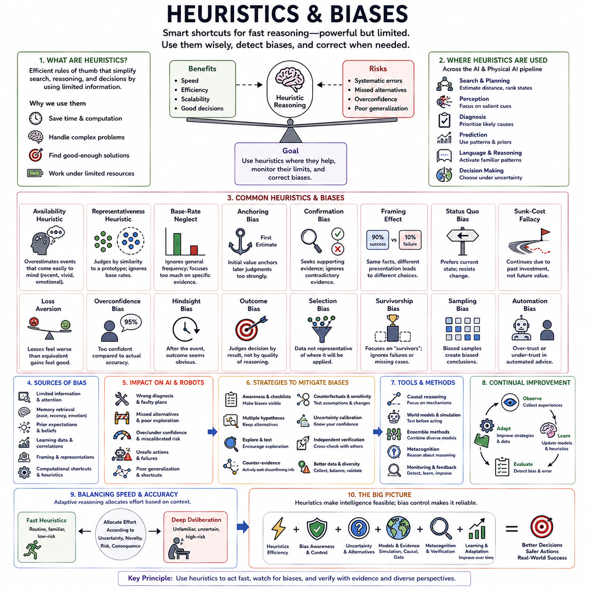{width="7.268055555555556in" height="7.268055555555556in"}

휴리스틱(Heuristics)은 필요한 정보와 계산량을 줄여 어려운 판단, 탐색, 의사결정을 단순화하는 효율적인 추론 전략입니다. 지능형 시스템은 가능한 모든 대안을 평가하는 대신 선택된 단서, 근사 규칙, 과거 경험 또는 학습된 패턴을 활용하여 제한된 시간과 자원 안에서 충분히 유용한 결론에 도달합니다.

휴리스틱은 완전 탐색적 추론(Exhaustive Reasoning)이 계산적으로 불가능한 경우가 많기 때문에 필수적입니다. 현실의 문제는 막대한 상태 공간(State Space), 불확실한 관측, 불완전한 지식, 엄격한 응답 시간 제한을 포함할 수 있습니다. 따라서 실용적인 추론 시스템은 완벽한 최적화와 속도, 효율성, 수용 가능한 의사결정 품질 사이에서 절충하는 방법이 필요합니다.

휴리스틱은 유망한 가능성으로 주의를 유도하는 지름길(Shortcut)로 이해할 수 있습니다. 탐색(Search)과 계획(Planning)에서는 목표까지 남은 거리를 추정할 수 있고, 진단에서는 가능성이 높은 원인을 우선시할 수 있습니다. 지각(Perception)에서는 중요한 특징에 처리를 집중하고, 언어 추론에서는 현재 문맥과 관련된 익숙한 패턴을 활성화할 수 있습니다.

휴리스틱 자체가 본질적으로 비합리적이거나 잘못된 것은 아닙니다. 많은 휴리스틱은 환경의 규칙성(Regularities)을 활용하기 때문에 매우 효과적인 해결책을 제공합니다. 휴리스틱의 기본 가정이 실제 문제 구조와 일치한다면 단순화된 추론으로도 훨씬 많은 계산을 요구하는 완전 탐색에 가까운 결과를 얻을 수 있습니다.

문제는 휴리스틱이 신뢰할 수 있는 조건을 벗어나 적용될 때 발생합니다. 일반적으로 잘 작동하는 지름길이라도 중요한 변수를 무시하면 판단을 체계적으로 왜곡할 수 있습니다. 이처럼 더 적절한 추론에서 반복적으로 벗어나는 현상을 일반적으로 인지 편향(Cognitive Biases)이라고 하지만, 유용한 휴리스틱과 해로운 편향 사이의 경계는 문맥에 크게 의존합니다.

편향(Bias)은 정보가 선택되고, 해석되고, 기억되고, 평가되는 방식에 영향을 미치는 체계적인 경향을 의미합니다. 무작위 오류(Random Error)와 달리 편향은 판단을 반복적으로 특정 방향으로 유도합니다. 편향은 제한된 정보, 사전 기대, 감정적 요인, 학습된 상관관계, 표현 방식 또는 계산적 지름길에서 발생할 수 있습니다.

가용성 휴리스틱(Availability Heuristic)은 관련 사례가 얼마나 쉽게 떠오르는지에 따라 가능성이나 중요도를 판단합니다. 최근에 발생했거나, 생생하거나, 감정적으로 중요하거나, 자주 언급되는 사건은 실제보다 더 발생 가능성이 높은 것처럼 보일 수 있습니다. 따라서 쉽게 접근 가능한 기억이 통계적으로 대표적이지 않더라도 기억 접근성(Memory Accessibility)이 판단에 영향을 줍니다.

AI 에이전트(AI Agent)에서도 최근 검색된 기억이 추론을 지배할 때 이와 유사한 현상이 발생할 수 있습니다. 로봇이 최근 여러 차례 위치 추정(Localization) 실패를 경험했다면 현재 증거가 휠 슬립(Wheel Slip), 장애물 또는 제어 실패를 가리키고 있더라도 새로운 내비게이션 문제의 원인으로 위치 추정을 지나치게 우선시할 수 있습니다.

대표성 휴리스틱(Representativeness Heuristic)은 어떤 상황이 익숙한 범주나 원형(Prototype)과 얼마나 유사한지를 기준으로 판단합니다. 이는 빠른 분류를 지원하지만 유사성이 반드시 동일한 확률이나 원인을 의미하지는 않습니다. 발생 빈도, 문맥 또는 대안적 설명과 같은 중요한 정보가 무시될 수 있습니다.

기저율 무시(Base-Rate Neglect)는 구체적이거나 생생한 증거가 일반적인 통계적 발생 빈도보다 더 큰 비중을 차지할 때 발생합니다. 희귀한 고장 유형이 현재 증상과 매우 유사하더라도 일부 증상이 비슷한 일반적인 고장이 실제로는 더 가능성이 높을 수 있습니다. 따라서 신뢰성 높은 진단은 사례별 증거와 사전 확률(Prior Probabilities)을 함께 고려해야 합니다.

앵커링(Anchoring)은 최초의 값, 가설, 추정치 또는 해석이 이후의 추론에 지나치게 큰 영향을 미치는 현상입니다. 이후의 증거가 판단을 수정하더라도 그 수정이 충분하지 않은 경우가 많습니다. 따라서 처음 제안된 진단, 경로, 일정, 비용 추정 또는 해석이 이후 대안 탐색을 제한할 수 있습니다.

앵커링은 초기 계획을 생성한 후 반복적으로 수정하는 AI 에이전트에서 특히 중요합니다. 수정 과정이 최초 제안과 지나치게 가까운 범위에서 이루어진다면 시스템은 근본적으로 다른 해결책을 탐색하지 못할 수 있습니다. 서로 독립적인 대안을 의도적으로 생성하면 최초 표현에 대한 과도한 의존을 줄일 수 있습니다.

확증 편향(Confirmation Bias)은 기존 믿음을 지지하는 증거를 찾고, 해석하고, 기억하는 데 집중하면서 반대되는 정보에는 충분한 주의를 기울이지 않는 경향입니다. 하나의 가설이 선택되면 추론은 경쟁하는 설명이 증거에 더 잘 부합하는지를 검증하기보다 선택된 가설을 입증하는 방향으로 집중될 수 있습니다.

진단 시스템은 반증 증거(Disconfirming Evidence)를 적극적으로 탐색함으로써 확증 편향을 줄일 수 있습니다. 의심되는 고장을 지지하는 관측만 찾는 대신 해당 가설이 맞다면 어떤 측정값이 나타나야 하는지, 그리고 어떤 측정값이 다른 설명을 강하게 지지하는지를 식별할 수 있습니다.

프레이밍 효과(Framing Effects)는 동일한 문제라도 정보가 어떻게 제시되는지에 따라 서로 다른 판단을 생성하는 현상입니다. 어떤 결과를 성공 확률로 표현할 때와 동일한 결과를 실패 확률로 표현할 때 서로 다른 반응이 나타날 수 있습니다. 따라서 기본 사실이 동일하더라도 표현(Representation)이 추론에 영향을 미칩니다.

따라서 문제 표현(Problem Representation)은 프레이밍 편향(Framing Bias)에 대응하는 주요 방법 가운데 하나입니다. 자연어 설명을 명시적인 상태, 확률, 비용, 제약조건 및 목적(Objectives)으로 변환하면 겉으로는 서로 다른 선택들이 실제로 수학적 또는 논리적으로 동일한 경우를 발견할 수 있습니다.

현상 유지 편향(Status Quo Bias)은 대안이 더 나은 결과를 제공할 수 있음에도 기존 상태를 유지하려는 경향입니다. 자율 시스템에서는 재계획(Replanning)에 계산적 또는 운영적 비용이 있기 때문에 현재 계획을 계속 유지하려는 유사한 경향이 나타날 수 있습니다. 안정성은 중요하지만 지나친 변화 저항은 악화되는 전략을 계속 유지하게 만들 수 있습니다.

매몰 비용 효과(Sunk-Cost Effect)는 회수할 수 없는 과거 투자가 미래 의사결정에 영향을 미치는 현상입니다. 계획기는 이미 상당한 시간이나 에너지를 사용했다는 이유로 비효율적인 경로나 작업을 계속할 수 있습니다. 합리적인 계획은 과거 비용보다 현재 시점에서 계속 진행할 때의 예상 미래 가치와 가능한 대안의 가치를 비교해야 합니다.

손실 회피(Loss Aversion)는 동일한 크기의 이익보다 손실을 더 크게 평가하는 경향입니다. 공학 시스템에서는 안전 실패의 결과가 성능 향상의 이익보다 훨씬 심각할 수 있으므로 결과를 비대칭적으로 평가하는 것이 반드시 잘못된 것은 아닙니다. 중요한 것은 이러한 비대칭성이 통제되지 않은 편향이 아니라 명시적인 위험 요구사항(Risk Requirements)을 반영하는지 여부입니다.

과신(Overconfidence)은 판단에 대한 신뢰도가 이용 가능한 증거가 뒷받침하는 실제 신뢰성보다 높은 경우 발생합니다. AI 시스템에서도 모델 확률, 생성된 설명 또는 예측이 실제 정확도보다 더 확실하게 표현될 때 유사한 문제가 발생할 수 있습니다. 따라서 신뢰성 높은 의사결정을 위해 보정(Calibration)이 필수적입니다.

신뢰도 보정(Confidence Calibration)은 표현된 신뢰도와 경험적으로 확인된 정확성을 일치시킵니다. 약 90퍼센트의 신뢰도가 부여된 예측이 실제로는 60퍼센트만 정확하다면 시스템은 과신하고 있는 것입니다. 보정된 불확실성(Calibrated Uncertainty)은 이후 계획기가 언제 행동하고, 추가 정보를 수집하고, 지원을 요청해야 하는지를 결정하는 데 도움을 줍니다.

사후 확신 편향(Hindsight Bias)은 결과가 발생한 이후 해당 결과가 이전부터 더 쉽게 예측 가능했던 것처럼 보이게 하는 현상입니다. 로봇 고장이 발생한 이후에는 이전의 경고 신호가 명확했던 것처럼 보일 수 있지만 실제 발생 전에는 모호했을 수 있습니다. 학습 시스템은 최종 결과를 알고 과거를 재구성하기보다 사건 이전에 실제로 이용 가능했던 정보를 보존해야 합니다.

결과 편향(Outcome Bias)은 의사결정 당시 이용 가능했던 추론의 품질보다 최종 결과를 중심으로 의사결정을 평가하는 현상입니다. 불확실성 아래에서 올바른 의사결정도 때때로 나쁜 결과를 만들 수 있고, 잘못된 의사결정이 우연히 성공할 수도 있습니다. 따라서 의사결정 평가는 추론 과정의 품질과 실제 결과를 모두 고려해야 합니다.

선택 편향(Selection Bias)은 관측된 데이터가 결론이 실제 적용될 환경을 대표하지 못할 때 발생합니다. 주로 맑은 날씨, 평탄한 지형 또는 성공한 임무 데이터로 학습된 로봇은 실제 배치 조건에 대해 잘못된 기대를 형성할 수 있습니다. 따라서 데이터 수집 전략(Data Collection Strategy)은 추론 신뢰성에 직접적인 영향을 줍니다.

생존자 편향(Survivorship Bias)은 관측 가능한 상태로 남은 사례에 분석이 집중되고 실패하거나 누락된 사례는 무시되는 관련 문제입니다. 학습 기록에 성공한 임무만 포함되고 실패한 실행 기록이 자주 제거된다면 시스템은 운영 위험을 과소평가하고 비현실적으로 낙관적인 성능 모델을 학습할 수 있습니다.

표본 편향(Sampling Bias)은 전체 AI 파이프라인(AI Pipeline)을 통해 전파될 수 있습니다. 편향된 데이터는 학습된 표현, 예측, 휴리스틱, 그리고 궁극적으로 행동에 영향을 줍니다. 모델 크기를 증가시키는 것만으로 이 문제가 자동으로 해결되지는 않으며, 오히려 강력한 모델이 편향된 규칙성을 더욱 정확하게 학습할 수도 있습니다.

자동화 편향(Automation Bias)은 인간이 자동화 시스템이 생성한 권고를 지나치게 신뢰할 때 발생합니다. 반대로 부적절한 불신 때문에 타당한 자동화 권고를 거부하는 문제도 발생할 수 있습니다. 따라서 효과적인 인간-AI 협업(Human-AI Collaboration)은 검증된 시스템 능력과 불확실성을 기반으로 한 보정된 신뢰(Calibrated Trust)를 필요로 합니다.

AI 시스템 자체도 학습 데이터, 보상 함수(Reward Functions), 시뮬레이션 환경, 인간 피드백 및 평가 기준에서 편향을 물려받을 수 있습니다. 모델은 벤치마크 데이터에서는 좋은 성능을 보이는 상관관계를 학습하지만 실제 배치 환경이 변화하면 실패할 수 있습니다. 따라서 편향은 전체 학습 및 의사결정 파이프라인에서 검토되어야 합니다.

지름길 학습(Shortcut Learning)은 모델이 의도한 기본 구조가 아니라 라벨과 상관관계를 가지는 특징을 이용하여 학습 과제를 해결할 때 발생합니다. 비전 시스템은 객체 자체의 속성보다 배경 패턴에 의존할 수 있고, 로봇 정책은 학습 환경을 벗어나면 사라지는 환경적 단서에 의존할 수 있습니다.

인과 추론(Causal Reasoning)은 개입과 환경 변화에서도 의미를 유지하는 관계에 집중함으로써 이러한 지름길에 대한 의존성을 줄일 수 있습니다. 안정적인 메커니즘과 연결된 특징은 우연한 상관관계보다 전이 가능성이 높은 경우가 많습니다. 따라서 인과 구조(Causal Structure)는 통계적 패턴 인식(Statistical Pattern Recognition)을 보완하는 중요한 요소입니다.

휴리스틱과 편향은 주의(Attention)와 밀접하게 연결되어 있습니다. 제한된 계산 능력 때문에 선택적 처리가 필요하지만 주의는 일부 증거를 강조하면서 다른 관련 정보를 억제할 수 있습니다. 따라서 추론을 효율적으로 만드는 동일한 메커니즘이 체계적인 사각지대(Systematic Blind Spots)를 만들 수도 있습니다.

기억(Memory)도 이와 유사한 절충 관계를 만듭니다. 자주 검색되거나, 감정적으로 두드러지거나, 최근에 발생했거나, 강하게 강화된 경험은 접근하기 어려운 증거보다 추론에 더 큰 영향을 줄 수 있습니다. 따라서 검색 정책(Retrieval Policies)은 하나의 기준이 자동으로 지배하지 않도록 관련성, 다양성, 신뢰성 및 최신성을 함께 고려해야 합니다.

일화 기억(Episodic Memory)은 지나치게 일반화된 규칙에 대한 구체적인 반례(Counterexamples)를 제공하여 편향을 발견하는 데 도움을 줄 수 있습니다. 현재 휴리스틱이 특정 지형을 항상 주행 가능하다고 판단하더라도 유사한 조건에서 실패했던 과거 에피소드가 있다면 중요한 예외를 발견하고 더 세부적인 추론을 시작할 수 있습니다.

의미 기억(Semantic Memory)은 일반화된 통계, 인과 관계, 운영 한계 및 알려진 예외를 보존할 수 있습니다. 일화적 사례와 일반화된 지식을 결합하면 추론 시스템이 어느 한쪽에만 의존하지 않고 구체적인 경험과 더 광범위한 증거 사이에서 균형을 유지할 수 있습니다.

탐색 알고리즘(Search Algorithms)은 조합적 복잡성(Combinatorial Complexity)을 관리하기 위해 의도적으로 휴리스틱을 사용합니다. 휴리스틱 평가 함수(Heuristic Evaluation Function)는 후보 상태의 순위를 정하여 유망한 분기를 먼저 탐색하도록 합니다. 이는 탐색 공간의 특정 영역에 계산적 편향을 만들지만 좋은 해결책을 효율적으로 찾을 가능성을 높인다면 유용한 편향입니다.

따라서 핵심 문제는 추론에 편향이 존재하는지 여부가 아니라 그 편향이 적절하고, 가시적이며, 수정 가능한지 여부입니다. 모든 유한한 추론 시스템은 주의와 계산을 선택적으로 할당해야 합니다. 유용한 귀납적 편향(Inductive Bias)은 학습과 추론을 가능하게 하지만 부적절한 편향은 시스템을 체계적으로 잘못된 결론으로 유도합니다.

탐험(Exploration)은 휴리스틱에 대한 지나친 의존을 방지하는 하나의 방법입니다. 현재 가장 유망한 행동만 항상 선택하는 계획기는 더 나은 대안을 발견하지 못할 수 있습니다. 일정 수준의 탐험을 유지하면 시스템이 불확실한 가능성을 시험하고 부정확한 가정을 수정할 수 있습니다.

여러 가설(Multiple Hypotheses)을 생성하는 것도 또 다른 대응 방법입니다. 진단에서는 여러 후보 원인을 유지하고, 계획에서는 여러 경로를 비교하며, 언어 추론에서는 대안적인 해석을 유지할 수 있습니다. 가설의 다양성은 초기의 한 가지 실수가 이후의 모든 추론을 지배할 가능성을 줄여줍니다.

반사실적 추론(Counterfactual Reasoning)은 결론이 하나의 가정에 지나치게 의존하는지를 검사할 수 있습니다. 시스템은 의심되는 원인이 존재하지 않는다면, 다른 관측이 제공된다면, 또는 다른 행동을 선택했다면 의사결정이 어떻게 변화할지를 질문할 수 있습니다. 결과가 크게 변한다면 추론이 취약하다는 것을 나타낼 수 있습니다.

민감도 분석(Sensitivity Analysis)도 입력, 확률, 비용 또는 가정이 변화할 때 결론이 어떻게 달라지는지를 조사합니다. 합리적인 파라미터 변화에서도 효과를 유지하는 계획은 좁은 추정 조건에서만 성공하는 계획보다 강건합니다. 이는 불확실성을 완전히 제거할 수 없는 상황에서 특히 중요합니다.

편향 완화(Debiasing)는 명시적인 체크리스트(Checklists)나 추론 규칙을 사용할 수도 있습니다. 시스템은 기저율을 고려했는지, 반대 증거를 검토했는지, 여러 대안을 생성했는지, 불확실성이 보정되었는지, 현재 결론이 근거 없는 가정에 의존하는지를 확인할 수 있습니다.

독립 검증(Independent Verification)은 결과의 영향이 큰 의사결정에서 중요합니다. 두 번째 모델, 알고리즘, 시뮬레이션, 센서 모달리티(Sensor Modality) 또는 인간 검토자가 서로 다른 증거나 표현을 사용하여 동일한 문제를 평가할 수 있습니다. 부분적으로 독립적인 방법들이 동일한 결론에 도달한다면 동일한 가정으로 반복 추론하는 것보다 더 강한 근거를 제공합니다.

앙상블 추론(Ensemble Reasoning)은 여러 모델이나 가설을 사용하여 하나의 특정 표현에 대한 의존성을 줄입니다. 서로 다른 아키텍처나 학습 이력을 가진 모델들이 비슷한 결론에 도달한다면 신뢰도를 높일 수 있습니다. 반대로 의견 불일치는 불확실성을 나타내며 추가 센싱, 탐색 또는 인간 검토를 유발할 수 있습니다.

월드 모델(World Models)은 휴리스틱 기반 의사결정을 검증하는 또 다른 메커니즘을 제공합니다. 에이전트는 유망한 행동을 즉시 실행하는 대신 가능한 결과를 시뮬레이션할 수 있습니다. 후보 계획은 물리적으로 실행되기 전에 목표 진행, 안전, 에너지, 불확실성 및 실패 모드(Failure Modes)를 기준으로 평가될 수 있습니다.

시뮬레이션(Simulation)은 시뮬레이터 자체에 부정확한 가정이 포함될 수 있으므로 편향을 완전히 제거하지는 못합니다. 시뮬레이션-현실 차이(Sim-to-Real Differences)는 예상 결과를 체계적으로 왜곡할 수 있습니다. 따라서 시뮬레이션 결과는 실제 세계의 관측, 불확실성 추정 및 지속적인 모델 검증과 함께 사용해야 합니다.

피지컬 AI(Physical AI)에서는 의사결정이 물리적 결과를 발생시키기 때문에 휴리스틱의 품질이 특히 중요합니다. 언어 오류는 잘못된 텍스트를 생성할 수 있지만 계획 오류는 충돌, 불안정성, 에너지 낭비, 임무 실패 또는 위험한 상호작용으로 이어질 수 있습니다. 따라서 휴리스틱 효율성은 검증 및 안전 제약조건과 균형을 이루어야 합니다.

로봇은 일상적인 상황에서는 빠른 휴리스틱 추론(Fast Heuristic Reasoning)을 사용하고 불확실성, 새로움 또는 위험이 증가할 때 더 깊은 추론(Deeper Reasoning)을 호출할 수 있습니다. 이를 통해 모든 의사결정에 동일한 계산량을 사용하는 대신 문제의 난이도와 결과의 중요성에 따라 계산 자원을 할당하는 계층적 아키텍처(Layered Architecture)를 구성할 수 있습니다.

이러한 적응형 추론(Adaptive Reasoning)은 빠른 처리와 숙고적 처리(Deliberative Processing) 사이의 전환과 유사합니다. 익숙하고 위험이 낮은 상황에서는 학습된 정책이나 저장된 절차를 사용할 수 있지만, 익숙하지 않거나 안전이 중요한 상황에서는 탐색, 시뮬레이션, 인과 분석, 추가 센싱 또는 인간 감독(Human Supervision)을 활성화할 수 있습니다.

메타인지(Metacognition)는 시스템이 자신의 추론 과정 자체에 대해 추론할 수 있도록 하여 이러한 접근법을 확장합니다. 에이전트는 현재 표현이 불완전한지, 신뢰도가 낮은지, 휴리스틱이 신뢰하기 어려운지 또는 추가 계산이 의사결정을 개선할 가능성이 있는지를 추정할 수 있습니다.

메타인지 제어기(Metacognitive Controller)는 추론 자원을 동적으로 할당할 수 있습니다. 충분히 좋은 해결책이 확보되면 탐색을 종료하고, 위험이 높으면 계획을 확장하며, 불확실성이 크면 더 많은 증거를 검색하고, 진행이 정체되면 다른 전략으로 전환할 수 있습니다.

편향 탐지(Bias Detection)는 지속 학습(Continual Learning)의 일부가 될 수 있습니다. 특정 조건에서 하나의 휴리스틱이 반복적으로 실패하면 시스템은 해당 문맥을 기록하고 이후의 의사결정 규칙을 수정할 수 있습니다. 따라서 경험은 작업 지식뿐 아니라 어떤 추론 전략을 언제 신뢰하거나 신뢰하지 않아야 하는지에 대한 지식도 향상시킵니다.

리플레이(Replay)는 중요한 실패, 아차 사고(Near Misses), 예상하지 못한 결과를 다시 검토함으로써 이러한 과정을 강화할 수 있습니다. 원래의 예측과 실제 결과를 비교하면 어떤 가정, 표현 또는 휴리스틱이 오류를 발생시켰는지를 식별할 수 있으며 향후 추론을 개선하기 위한 학습 사례를 제공할 수 있습니다.

플릿 학습(Fleet Learning)은 여러 로봇에 걸쳐 편향 탐지를 확장할 수 있습니다. 하나의 플랫폼이나 환경에서 신뢰할 수 있는 것처럼 보이는 휴리스틱이 다른 조건에서는 체계적으로 실패할 수 있습니다. 서로 다른 조건에서 얻은 경험을 통합하면 안정적인 원리와 플랫폼 또는 환경에 특화된 지름길을 구분하는 데 도움이 됩니다.

그러나 공유 학습(Shared Learning)은 공통된 편향을 전파할 수도 있습니다. 모든 로봇이 동일하게 잘못된 모델이나 학습 데이터를 사용한다면 플릿 규모의 배치는 오류를 줄이기보다 확대할 수 있습니다. 따라서 데이터, 환경, 모델 및 검증 절차의 다양성(Diversity)은 여전히 중요합니다.

인간 피드백(Human Feedback)은 자동 평가가 놓치는 오류를 식별할 수 있지만 인간의 판단 역시 휴리스틱과 편향을 포함합니다. 인간 참여형 시스템(Human-in-the-Loop Systems)은 인간의 수정이 자동적으로 편향이 없다고 가정해서는 안 됩니다. 신뢰성 높은 학습은 기계가 생성한 신호와 인간이 제공한 신호를 모두 비판적으로 검토해야 합니다.

LLM 에이전트(LLM Agents)에서는 개방형 문제에 가능한 해석, 행동 및 지식 출처가 너무 많아 모든 가능성을 완전히 평가할 수 없으므로 휴리스틱 추론이 불가피합니다. 에이전트는 제한된 문맥과 계산 자원 안에서 관련 문맥, 기억, 도구, 가설 및 계획을 선택해야 합니다.

따라서 신뢰성 높은 LLM 에이전트는 사실과 가정을 분리하고, 대안적 해석을 유지하고, 외부 증거를 검색하고, 계산을 검증하고, 계획을 비교하고, 불확실성을 보정하며, 전문 도구나 인간 검토가 필요한 상황을 인식하는 구조화된 메커니즘에서 이점을 얻습니다.

휴리스틱은 수동으로 설계하는 것뿐 아니라 학습할 수도 있습니다. 경험을 통해 어떤 탐색 상태, 행동, 기억 또는 전략이 유망한지를 추정하는 모델을 학습할 수 있습니다. 학습된 휴리스틱(Learned Heuristics)은 명시적으로 설계하기 어려운 복잡한 패턴을 포착할 수 있지만 그 신뢰성은 여전히 학습 분포(Training Distribution)와 검증에 의존합니다.

하이브리드 시스템(Hybrid Systems)은 학습된 휴리스틱과 기호적 제약조건(Symbolic Constraints), 인과 모델, 물리 시뮬레이션, 최적화 및 안전 규칙을 결합할 수 있습니다. 학습 구성 요소는 속도와 유연성을 제공하고 구조화된 구성 요소는 휴리스틱 오류의 결과를 줄이는 검증과 경계를 제공합니다.

따라서 자율 추론(Autonomous Reasoning)의 목표는 휴리스틱을 제거하는 것이 아닙니다. 선택적 지름길이 없다면 많은 현실 세계의 문제는 사실상 불가능한 수준의 계산량을 요구합니다. 목표는 휴리스틱이 효과적인 상황에서는 이를 활용하면서 더 깊은 추론이 필요한 조건을 탐지하는 것입니다.

강건한 시스템(Robust System)은 언제 근사가 충분하고 언제 정밀성이 중요한지를 판단할 수 있어야 합니다. 익숙한 자유 공간에서의 일상적인 내비게이션은 빠른 휴리스틱 의사결정을 허용할 수 있지만 인간 근처에서 작동하거나, 무거운 객체를 조작하거나, 중요한 고장을 진단할 때는 훨씬 강력한 검증이 필요할 수 있습니다.

궁극적으로 휴리스틱과 편향은 지능(Intelligence)의 근본적인 특성을 보여줍니다. 추론은 제한된 정보, 제한된 시간, 제한된 계산 자원 아래에서 이루어집니다. 지능적 행동은 무엇을 처리하고, 무엇을 무시하고, 무엇을 가정하며, 각각의 가능성을 얼마나 깊이 조사할지를 선택하는 능력을 필요로 합니다.

주의(Attention), 기억(Memory), 탐색(Search), 인과 추론(Causal Reasoning), 월드 모델(World Models), 불확실성 추정(Uncertainty Estimation), 메타인지(Metacognition), 검증(Verification), 지속 학습(Continual Learning)과 통합될 때 휴리스틱은 효율적인 방향성을 제공하며, 편향 제어 메커니즘(Bias-Control Mechanisms)은 이러한 효율성이 체계적인 오류로 변하는 것을 방지합니다.

따라서 자율 AI(Autonomous AI)와 피지컬 AI(Physical AI)의 성숙한 추론은 빠른 근사(Fast Approximation)와 숙고적 수정(Deliberate Correction)을 모두 필요로 합니다. 휴리스틱은 복잡한 환경을 계산적으로 관리 가능한 수준으로 만들고, 편향 인식, 불확실성, 대안 가설, 시뮬레이션, 증거 수집 및 검증은 이러한 지름길이 현실과 정렬되고 신뢰할 수 있는 행동으로 이어지도록 합니다.

## 03.09 Human vs AI Reasoning

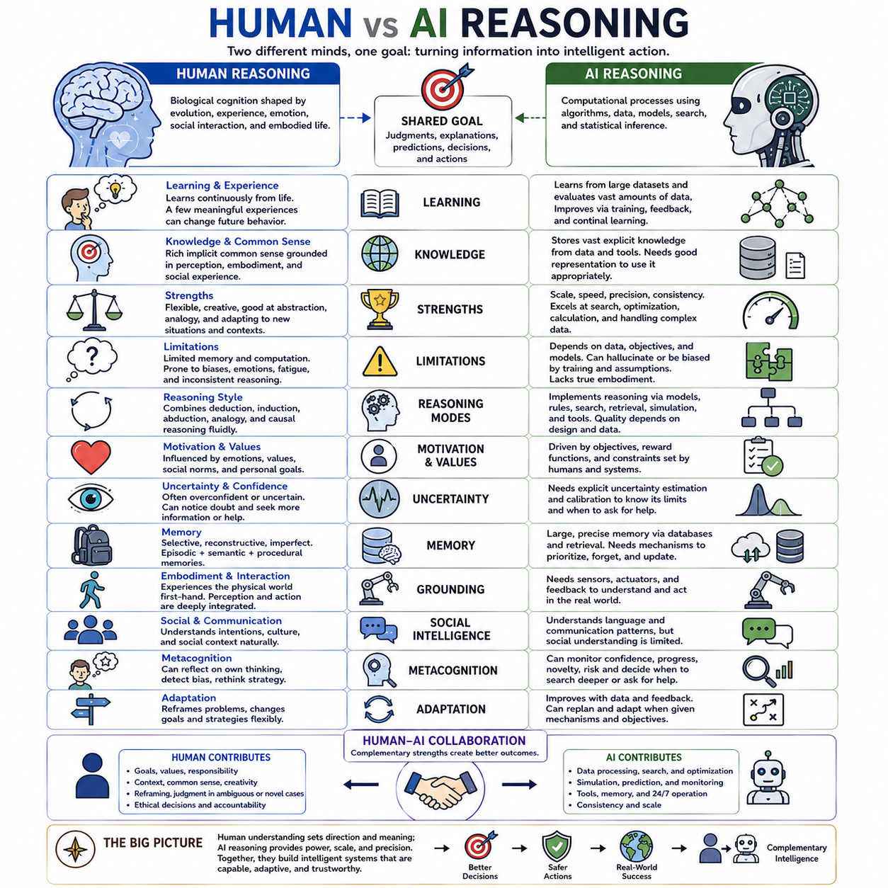{width="7.268055555555556in" height="7.268055555555556in"}

인간 추론(Human Reasoning)과 AI 추론(AI Reasoning)은 정보를 판단, 설명, 예측, 의사결정 및 행동으로 변환한다는 일반적인 목적을 공유하지만, 이를 달성하는 메커니즘은 근본적으로 다릅니다. 인간은 지각, 기억, 감정, 경험, 사회적 상호작용 및 체화된 삶(Embodied Life)에 의해 형성된 생물학적 인지를 통해 추론하는 반면, AI 시스템은 계산적 표현, 학습된 파라미터, 알고리즘, 탐색 및 통계적 추론을 통해 추론합니다.

인간 추론은 진화와 평생 학습(Lifelong Learning)을 통해 발달한 인지 아키텍처(Cognitive Architecture) 안에서 작동합니다. 지각(Perception), 주의(Attention), 작업 기억(Working Memory), 장기 기억(Long-Term Memory), 언어, 감정 및 운동 경험이 지속적으로 상호작용합니다. 인간은 이러한 과정을 명시적으로 분리하는 경우가 드물며, 추론은 이들의 결합된 활동에서 나타나고 개인의 과거 경험, 현재 문맥, 동기 및 신체적 경험에 강하게 영향을 받습니다.

AI 추론은 부호화된 정보(Encoded Information)를 대상으로 작동하는 계산 과정(Computational Processes)을 통해 구현됩니다. 현대 신경망 모델은 대규모 데이터셋에서 표현과 관계를 학습하고, 기호 시스템(Symbolic Systems)은 명시적인 규칙과 구조를 조작합니다. 고급 AI 에이전트는 언어 모델, 탐색, 기억, 검색(Retrieval), 계획, 외부 도구, 월드 모델(World Models) 및 피드백 메커니즘을 결합하여 더욱 복잡한 추론 과정을 구성할 수 있습니다.

인간은 제한된 작업 기억을 가지고 있으며 엄청난 수의 대안을 동시에 검토할 수 없습니다. 따라서 추상화(Abstraction), 주의, 휴리스틱(Heuristics), 사전 지식 및 패턴 인식(Pattern Recognition)에 크게 의존합니다. 이러한 한계는 인지 편향(Cognitive Biases)을 발생시킬 수 있지만, 동시에 가능한 모든 해석이나 결과를 완전히 계산하지 않고도 인간이 신속하게 유용한 의사결정을 내릴 수 있도록 합니다.

컴퓨터는 일반적인 인간의 인지 능력을 크게 초과하는 규모의 구조화된 정보를 처리하고 비교할 수 있습니다. AI는 대규모 탐색 공간을 반복적으로 평가하고, 수치 최적화(Numerical Optimization)를 수행하며, 방대한 기록을 검색하고, 일관된 계산 절차를 유지할 수 있습니다. 그러나 표현, 학습 데이터, 목적, 가정 또는 모델이 부적절하다면 계산 규모가 크다는 사실만으로 올바른 추론이 보장되지는 않습니다.

인간 추론은 체화된 경험(Embodied Experience)에 강하게 기반합니다. 무게, 거리, 위험, 노력, 균형, 통증 및 물리적 상호작용과 같은 개념은 평생 축적된 감각 및 운동 경험과 연결되어 있습니다. 이러한 기반은 인간에게 물리적 세계에 대한 직관적인 기대를 제공하며, 이를 언어나 정적인 데이터셋만으로 완전히 재현하는 것은 어렵습니다.

많은 AI 시스템은 이와 달리 데이터셋을 통해 간접적으로 지식을 획득합니다. 언어 모델은 중력, 충돌 또는 조작을 물리적으로 직접 경험하지 않고도 이를 설명할 수 있습니다. 피지컬 AI(Physical AI)는 학습과 추론을 카메라, 라이다(LiDAR), 힘 센서(Force Sensors), 고유수용감각(Proprioception), 행동, 환경 피드백, 시뮬레이션 및 물리적 세계와의 반복적인 상호작용에 연결함으로써 이러한 격차를 줄이고자 합니다.

인간은 추상화와 유추(Analogy)를 사용하여 서로 다른 상황 사이에서 지식을 전이하는 능력이 뛰어납니다. 사람은 새로운 문제를 접했을 때 표면적인 세부사항이 크게 다르더라도 그 기본 구조가 이전 경험과 유사하다는 것을 인식할 수 있습니다. 이러한 능력은 사례가 부족하고 정확한 규칙이 이전에 학습되지 않은 상황에서도 유연한 문제 해결을 가능하게 합니다.

AI 시스템도 특히 광범위하고 다양한 데이터로 사전학습(Pretraining)된 경우 유추적 전이(Analogical Transfer)를 수행할 수 있습니다. 그러나 새로운 상황이 학습 분포(Training Distribution)와 미묘하지만 중요한 방식으로 달라질 경우 일반화(Generalization)에 실패할 수 있습니다. 겉으로 보이는 개념적 이해가 환경 변화나 비정상적인 조건 조합에서는 유지되지 않는 통계적 규칙성에 의존할 수도 있습니다.

인간의 상식(Common Sense)은 객체, 사람, 의도, 물리적 행동, 사회적 기대 및 일상적인 인과관계에 관한 방대한 암묵적 지식(Implicit Knowledge)을 통합합니다. 이러한 지식의 상당 부분은 명시적인 규칙으로 표현하기 어렵습니다. 인간은 이를 공식적인 교육만으로 배우는 것이 아니라 관찰, 상호작용, 언어 및 경험을 통해 점진적으로 습득하기 때문입니다.

AI는 한 개인이 보유할 수 있는 것보다 훨씬 광범위한 명시적 정보를 축적할 수 있지만, 정보를 보유하는 것과 이를 적절하게 적용하는 것은 서로 다릅니다. 시스템은 관련된 사실을 검색하고도 그것이 언제 중요한지, 얼마나 신뢰할 수 있는지 또는 물리적·문맥적 제약조건과 어떻게 상호작용하는지를 인식하지 못할 수 있습니다. 따라서 추론에는 지식 저장뿐 아니라 적절한 문제 표현(Problem Representation)이 필요합니다.

인간은 연역적 추론(Deductive Reasoning), 귀납적 추론(Inductive Reasoning), 귀추적 추론(Abductive Reasoning), 유추적 추론(Analogical Reasoning) 및 인과 추론(Causal Reasoning)을 유연하게 결합합니다. 경험으로부터 일반적인 패턴을 추론하고, 관측에 대한 가장 그럴듯한 설명을 제안하고, 현재 상황을 과거 사례와 비교한 다음, 특정 결론이 가정으로부터 논리적으로 도출되는지를 검증할 수 있습니다. 이러한 추론 방식은 서로 분리되어 작동하기보다 상호작용하는 경우가 많습니다.

AI 시스템 역시 서로 다른 계산 메커니즘을 통해 동일한 광범위한 추론 유형을 구현할 수 있습니다. 연역은 기호 규칙이나 제약된 생성(Constrained Generation)을 사용할 수 있고, 귀납은 통계적 학습에서 나타날 수 있으며, 귀추는 후보 설명의 순위를 결정할 수 있습니다. 유추는 표현 유사성에 의존할 수 있고, 인과 추론은 명시적 인과 모델, 학습된 동역학(Learned Dynamics) 또는 개입 기반 증거를 활용할 수 있습니다.

인간의 중요한 장점 가운데 하나는 적응적 문제 정식화(Adaptive Problem Formulation)입니다. 인간은 질문을 재해석하고, 추상화 수준을 변경하고, 특정 가정이 부적절하다는 것을 발견하거나, 원래 문제가 잘못 정의되었다고 판단할 수 있습니다. 강력한 추론은 주어진 문제를 해결하는 능력보다 실제로 해결해야 하는 문제에 대한 더 나은 표현을 발견하는 능력에 좌우되는 경우가 많습니다.

AI는 특히 언어 모델이 도구 및 반복적 추론(Iterative Reasoning)과 결합되면서 문제를 재정식화하는 능력이 점차 향상되고 있습니다. 그러나 AI는 모호성, 모순, 누락된 정보, 근거 없는 가정 또는 생성된 계획과 외부 현실 사이의 충돌을 명시적으로 탐지하는 메커니즘이 없다면 잘못된 표현 안에서도 자신 있게 추론을 계속할 수 있습니다.

인간 추론은 감정, 동기, 가치, 피로, 스트레스 및 사회적 관계의 영향을 받습니다. 이러한 영향은 오류를 발생시킬 수 있지만 우선순위를 설정하고 빠르게 평가하는 메커니즘도 제공합니다. 두려움은 위험에 주의를 집중시키고, 호기심은 탐험(Exploration)을 촉진하며, 공감(Empathy)은 순수한 수치 최적화만으로 자연스럽게 재현하기 어려운 방식으로 다른 사람과 관련된 의사결정에 영향을 줄 수 있습니다.

AI는 인간의 의미에서 생물학적 감정을 경험하지 않지만 감정적 언어, 선호, 우선순위 및 보상 신호(Reward Signals)를 모델링할 수 있습니다. AI의 목적은 아키텍처, 학습, 지시, 최적화 기준 및 운영 제약조건을 통해 결정됩니다. 따라서 AI의 의사결정이 인간이나 물리적 환경에 영향을 미치는 경우 가치 정렬(Value Alignment)과 목적 명세(Objective Specification)가 핵심 문제가 됩니다.

인간은 시간과 인지 자원이 제한되어 있기 때문에 휴리스틱을 자주 사용합니다. 가용성(Availability), 대표성(Representativeness), 앵커링(Anchoring), 확증 효과(Confirmation Effects)는 판단을 왜곡할 수 있지만, 휴리스틱 추론은 빠르고 효과적인 의사결정에도 기여합니다. 따라서 인간 지능은 불확실성이나 결과의 중요성이 증가할 때 효율적인 근사와 느린 숙고(Deliberation) 사이의 균형에 의존합니다.

AI 추론 역시 계산적 지름길(Computational Shortcuts)을 사용합니다. 학습된 정책, 근사 탐색(Approximate Search), 주의, 검색 순위(Retrieval Ranking), 압축된 표현 및 휴리스틱 평가 함수는 계산량을 줄입니다. 이러한 메커니즘은 학습된 상관관계, 검색 패턴, 초기 생성 결과 또는 모델의 가정이 일부 가능성을 체계적으로 강조하고 다른 가능성을 억제할 때 AI 고유의 편향을 만들 수 있습니다.

인간의 신뢰도(Confidence)는 실제 정확성과 적절하게 보정되지 않는 경우가 많습니다. 사람은 잘못된 믿음에 대해 매우 확신하거나 올바른 결론에 대해서도 불확실할 수 있습니다. 경험과 피드백은 보정을 향상시킬 수 있지만 인지 편향은 여전히 중요합니다. 그럼에도 인간은 자신의 불확실성을 인식하면 조언을 구하고, 의사결정을 연기하고, 증거를 추가로 수집하거나, 결론을 의도적으로 재검토할 수 있습니다.

AI 시스템도 명시적인 불확실성 관리(Uncertainty Management)를 필요로 합니다. 유창한 설명은 실제 근거가 약한 경우에도 높은 확신을 가진 것처럼 보일 수 있습니다. 따라서 신뢰성 높은 AI 추론은 보정된 확률, 대안 가설, 외부 증거 검색, 독립 검증, 시뮬레이션, 도구 사용 및 인간 검토나 추가 정보가 필요한 상황을 인식하는 메커니즘을 활용할 수 있습니다.

인간은 비교적 적은 수의 의미 있는 경험에서도 지속적으로 학습합니다. 단 한 번의 위험한 사건, 예상하지 못한 실패 또는 성공적인 전략도 미래 행동을 크게 변화시킬 수 있습니다. 일화 기억(Episodic Memory)은 구체적인 경험을 보존하고, 의미 기억(Semantic Memory)은 지식을 일반화하며, 절차 기억(Procedural Memory)은 숙고적 추론의 필요성을 줄이는 재사용 가능한 기술을 점진적으로 발달시킵니다.

AI 학습은 전통적으로 대규모 학습 데이터셋과 분리된 학습 및 배치(Deployment) 단계에 의존해 왔지만 이러한 경계는 변화하고 있습니다. 기억 기반 에이전트(Memory-Enabled Agents), 지속 학습(Continual Learning), 온라인 적응(Online Adaptation), 강화학습(Reinforcement Learning) 및 경험 리플레이(Experience Replay)를 통해 시스템은 배치 이후에도 새로운 정보를 보존하고 모든 능력을 처음부터 다시 구축하지 않으면서 행동을 개선할 수 있습니다.

인간의 기억은 선택적이고, 재구성적이며, 불완전합니다. 사람은 세부사항을 잊고, 사건을 왜곡하며, 문맥에 따라 기억을 검색하지만 이러한 선택성은 불필요한 정보로 인지가 압도되는 것을 방지하기도 합니다. 기억 공고화(Memory Consolidation)는 모든 감각 관측을 동일한 중요도로 보존하기보다 경험으로부터 유용한 패턴을 추출합니다.

AI 기억은 정보를 훨씬 높은 정밀도로 보존할 수 있지만 모든 것을 저장하면 검색과 관련성(Relevance)의 문제가 발생합니다. 따라서 효과적인 AI 에이전트는 무엇을 저장할지 선택하고, 반복 정보를 통합하고, 관련성에 따라 기억의 우선순위를 정하고, 오래된 내용을 제거하며, 현재 추론 과제에 필요한 올바른 증거를 검색하는 메커니즘을 필요로 합니다.

인간은 물리적 메커니즘에 익숙한 경우 인과 추론에 특히 효과적입니다. 인간은 상관관계를 관측하는 것과 어떤 효과를 발생시키기 위해 의도적으로 변수를 변경하는 것을 구분할 수 있습니다. 그러나 우연한 일치, 제한된 증거 또는 기존 믿음으로부터 잘못된 원인을 추론할 수도 있으므로 직관적인 인과 추론이 강력하더라도 자동적으로 신뢰할 수 있는 것은 아닙니다.

AI는 통계 분석, 통제된 실험, 인과 그래프(Causal Graphs), 시뮬레이션 및 대규모 데이터 비교를 통해 직관적 인과 추론을 보완할 수 있습니다. 그러나 순수한 관측 기반 머신러닝(Observational Machine Learning) 역시 상관관계와 인과관계를 혼동할 수 있습니다. 따라서 강건한 AI 추론은 학습된 패턴을 개입, 물리적 지식, 도메인 제약조건 및 명시적인 인과 구조와 결합하는 것이 유리합니다.

탐색(Search)은 인간과 AI 추론 사이의 또 다른 차이를 보여줍니다. 인간은 엄청난 수의 대안을 모두 열거하는 경우가 드물며, 대신 경험을 이용하여 소수의 가능성 높은 후보에 빠르게 집중합니다. 컴퓨터는 훨씬 큰 공간을 탐색할 수 있지만 충분히 복잡한 문제에서는 완전 탐색이 여전히 불가능하기 때문에 인간과 AI 모두 표현과 휴리스틱에 의존해야 합니다.

계획(Planning) 역시 서로 보완적인 강점을 보여줍니다. 인간은 불완전한 설명으로부터 유연한 고수준 계획을 구성하고 상황 변화에 따라 이를 수정할 수 있습니다. AI는 시간, 자원 제약조건, 경로, 비용 및 대안적 행동 시퀀스를 체계적으로 평가할 수 있습니다. 하이브리드 계획(Hybrid Planning)은 인간의 전략적 이해와 계산 기반 최적화 및 지속적인 기계 모니터링을 결합할 수 있습니다.

대규모 언어 모델(Large Language Models)은 학습된 통계적 지식과 유연한 언어 기반 표현을 결합하는 새로운 추론 방식을 제공합니다. 문제를 분해하고, 대안을 비교하고, 가설을 생성하고, 관계를 설명하고, 도구 사용을 조정할 수 있습니다. 광범위한 의미적 영역에서 강력한 추론 능력을 제공하지만 환각(Hallucination), 근거 없는 가정, 일관되지 않은 중간 상태 및 약한 물리적 기반(Physical Grounding)에 취약할 수 있습니다.

도구 증강 AI(Tool-Augmented AI)는 이러한 약점의 일부를 보완할 수 있습니다. 검색 시스템은 최신 정보를 제공하고, 계산기는 수치적 정확성을 보장하며, 데이터베이스는 신뢰할 수 있는 기록을 제공하고, 시뮬레이터는 물리적 결과를 평가하며, 전문 모델은 지각이나 최적화를 처리합니다. AI 에이전트는 이러한 전문 추론 자원을 선택하고 통합하는 조정자(Coordinator) 역할을 수행할 수 있습니다.

피지컬 AI는 인간과 유사한 추론과 기계 추론이 특히 중요하게 융합되는 영역입니다. 로봇은 불확실한 환경을 지각하고, 시간적 문맥(Temporal Context)을 유지하고, 경험을 기억하고, 목표를 이해하고, 결과를 예측하고, 행동을 계획하고, 실행을 모니터링하고, 실제 물리적 제약조건 아래에서 실패로부터 복구해야 합니다.

순수한 디지털 AI와 달리 피지컬 AI는 잘못된 추론의 결과를 즉각적으로 물리적 세계에서 받습니다. 잘못된 가정은 충돌, 불안정성, 에너지 손실, 조작 실패 또는 위험한 인간 상호작용을 발생시킬 수 있습니다. 따라서 그라운딩(Grounding), 불확실성 추정, 월드 모델링(World Modeling), 안전 제약조건, 검증 및 피드백은 선택적인 개선 요소가 아니라 추론의 필수 구성 요소가 됩니다.

인간은 자연스럽게 지각과 행동을 폐루프(Closed Loop)로 통합합니다. 행동하고, 결과를 관측하고, 기대를 업데이트하며, 즉시 행동을 조정합니다. 자율 로봇도 이에 대응하는 지각-추론-행동 루프(Perception-Reasoning-Action Loop)를 필요로 하며, 센싱은 세계 상태를 갱신하고, 추론은 행동을 선택하며, 제어는 이를 실행하고, 피드백은 미래의 의사결정을 지속적으로 수정합니다.

월드 모델은 인간의 정신 모델(Mental Models)이 수행하는 중요한 기능과 유사한 내부 예측 구조를 AI에 제공할 수 있습니다. 현재 관측에만 반응하는 대신 시스템은 서로 다른 행동에 따라 환경이 어떻게 변화할지를 추정하고, 물리적으로 행동하기 전에 여러 가능한 미래를 비교할 수 있습니다.

인간의 정신적 시뮬레이션(Mental Simulation)은 유연하지만 정밀도와 규모에 한계가 있습니다. 계산 기반 월드 모델은 많은 예측 궤적과 수치 변수를 평가할 수 있지만 예측은 모델 정확도에 의존합니다. 따라서 학습된 월드 모델을 물리 방정식, 실제 관측, 불확실성 및 지속적인 수정과 결합하면 더욱 신뢰할 수 있는 예측 추론(Predictive Reasoning)을 구성할 수 있습니다.

메타인지(Metacognition)는 인간과 AI를 비교하는 또 하나의 중요한 영역입니다. 인간은 때때로 자신이 혼란스럽거나, 편향되어 있거나, 불확실하거나, 부적절한 전략을 사용하고 있음을 인식할 수 있습니다. 이러한 자기 모니터링(Self-Monitoring)은 완벽하지 않지만 추론 속도를 늦추고, 가정을 재검토하고, 추가 정보를 찾거나, 다른 사람에게 도움을 요청할 수 있도록 합니다.

AI 메타인지(AI Metacognition)는 신뢰도, 일관성, 새로움(Novelty), 위험, 진행 상태 및 자원 사용량을 명시적으로 모니터링하는 방식으로 구현할 수 있습니다. 추론 제어기(Reasoning Controller)는 언제 빠른 추론으로 충분한지, 언제 더 깊은 탐색이 필요한지, 언제 추가 센싱을 수행해야 하는지 또는 언제 의사결정을 인간 운영자에게 이관해야 하는지를 결정할 수 있습니다.

따라서 미래의 가장 강력한 시스템은 인간 추론이나 AI 추론 가운데 어느 하나에만 전적으로 의존하지 않을 가능성이 높습니다. 인간은 문맥적 이해, 가치, 책임, 창의적 재구성(Creative Reframing), 사회적 인식 및 체화된 상식을 제공하고, AI는 계산 규모, 기억 용량, 빠른 검색, 체계적 탐색, 시뮬레이션, 최적화 및 지속적인 모니터링을 제공합니다.

인간-AI 협업(Human-AI Collaboration)은 책임을 이러한 상호보완적 강점에 맞게 배분할 때 가장 효과적입니다. AI는 대안을 생성하고, 대규모 데이터셋을 분석하고, 결과를 시뮬레이션하고, 패턴을 탐지하고, 복잡한 시스템을 모니터링할 수 있습니다. 인간은 목표를 설정하고, 의미를 평가하고, 모호한 가치 문제를 해결하고, 예외적인 상황을 판단하며, 중요한 의사결정에 대한 책임(Accountability)을 유지할 수 있습니다.

AI 에이전트가 더욱 풍부한 기억, 멀티모달 지각(Multimodal Perception), 월드 모델, 지속 학습, 인과 추론 및 물리적 상호작용을 획득함에 따라 인간과 AI 사이의 구분은 일부 영역에서 덜 명확해질 수 있습니다. 그럼에도 계산적 추론과 생물학적 인지는 서로 다른 강점, 한계, 실패 모드(Failure Modes) 및 그라운딩 방식을 가진 서로 다른 시스템으로 남습니다.

이러한 차이를 이해하는 것은 신뢰성 높은 자율 AI(Autonomous AI)와 피지컬 AI를 설계하는 데 필수적입니다. 목표는 단순히 인간의 추론을 재현하거나 이를 계산으로 대체하는 것이 아니라 각각의 문제에 어떤 추론 메커니즘이 적합한지를 식별하고 그 약점을 어떻게 탐지하고, 수정하고, 보완할 것인지를 결정하는 것이어야 합니다.

성숙한 지능형 아키텍처(Mature Intelligent Architecture)는 빠른 학습 기반 추론, 숙고적 탐색, 인과 모델, 기억, 시뮬레이션, 계획, 불확실성 추정, 메타인지 제어(Metacognitive Control), 외부 도구 및 인간 감독을 결합할 수 있습니다. 이러한 통합을 통해 새로움, 불확실성, 물리적 위험 또는 의사결정의 중요성이 증가할 때 추론의 깊이도 함께 증가하도록 만들 수 있습니다.

인간 대 AI 추론(Human vs AI Reasoning)은 궁극적으로 생물학적 지능과 계산 지능 사이의 경쟁만을 의미하지 않습니다. 이는 제한된 자원 안에서 지식을 표현하고, 경험으로부터 학습하고, 불확실성을 관리하고, 결과를 예측하며, 행동을 선택하는 두 가지 근본적으로 다른 접근법을 비교하는 것입니다.

미래의 자율 시스템을 위한 가장 생산적인 방향은 인간의 판단과 기계 추론이 서로를 강화하는 상호보완적 지능(Complementary Intelligence)입니다. 인간의 이해는 목표와 가치를 안내하고, AI는 분석, 예측, 탐색 및 실행 능력을 확장함으로써 어느 한쪽만을 사용하는 것보다 더 높은 능력, 적응성, 투명성 및 신뢰성을 갖춘 시스템을 구성할 수 있습니다.

## 03.10 LLM Reasoning Comparison [w/Code]

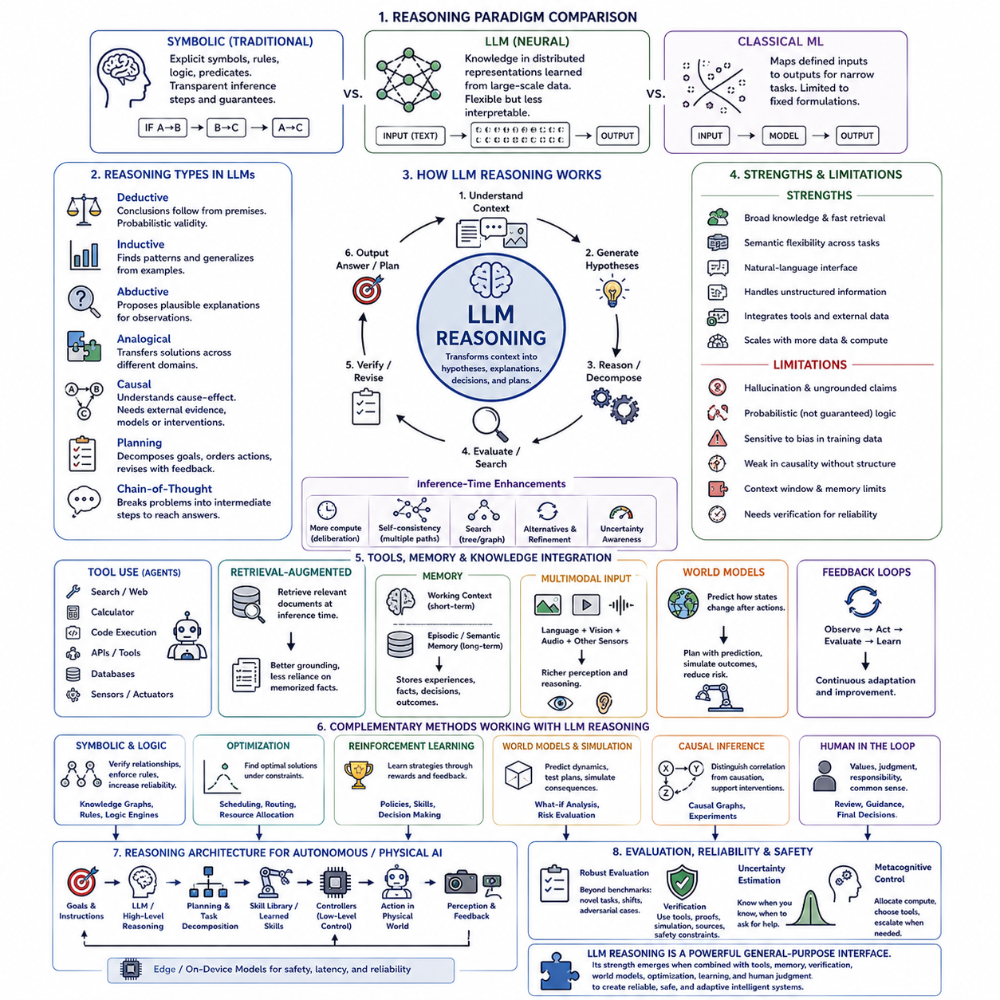{width="7.268055555555556in" height="7.268055555555556in"}

대규모 언어 모델 추론(Large Language Model Reasoning)은 LLM이 언어적 및 멀티모달 문맥(Multimodal Context)을 중간 표현, 가설, 설명, 의사결정 또는 행동 계획으로 변환하는 능력을 의미합니다. 명시적인 논리 규칙을 중심으로 구축된 고전적 추론 시스템과 달리, LLM 추론은 주로 대규모 사전학습(Large-Scale Pretraining)을 통해 획득한 학습된 통계적 표현에서 나타나며 이후 지시 튜닝(Instruction Tuning), 강화학습(Reinforcement Learning) 및 기타 정렬 방법(Alignment Methods)을 통해 조정됩니다.

전통적인 기호 추론(Symbolic Reasoning)은 명시적인 기호, 규칙, 술어(Predicates) 및 논리적 관계를 통해 지식을 표현합니다. 연역 시스템(Deductive Systems)은 미리 정의된 추론 절차에 따라 이러한 구조를 조작하므로 개별 추론 단계를 비교적 투명하게 확인할 수 있습니다. 반면 LLM은 지식을 분산 신경 표현(Distributed Neural Representations)에 부호화하여 여러 영역에서 유연한 추론을 가능하게 하지만 내부 계산 경로를 직접 해석하기는 훨씬 어렵습니다.

통계적 머신러닝(Statistical Machine Learning)은 또 다른 비교 기준을 제공합니다. 기존 분류 모델이나 회귀 모델은 일반적으로 정의된 입력을 비교적 좁은 작업의 특정 출력으로 매핑합니다. LLM은 훨씬 광범위한 표현 공간에서 작동하며 각 추론 작업마다 별도의 모델을 학습하지 않고도 문제를 동적으로 정식화하고, 설명을 생성하고, 대안을 비교하고, 개념적 연관성을 검색하고, 구조화된 응답을 생성할 수 있습니다.

LLM 추론은 트랜스포머 아키텍처(Transformer Architecture)와 그 주의 메커니즘(Attention Mechanisms)의 영향을 크게 받습니다. 주의는 모델이 각각의 새로운 토큰을 생성할 때 이용 가능한 문맥의 서로 다른 부분에서 정보를 선택적으로 결합할 수 있도록 합니다. 이는 멀리 떨어진 개념 사이의 관계를 지원하지만, 추론은 여전히 문맥 창(Context Window), 학습된 파라미터, 그리고 모델이 사용할 수 있는 외부 기억이나 도구에 표현된 정보의 제약을 받습니다.

LLM 추론의 주요 강점 가운데 하나는 의미적 유연성(Semantic Flexibility)입니다. 동일한 모델이 자연어 상호작용을 통해 연역, 귀납, 귀추, 유추, 분류, 설명, 계획, 요약 및 문제 분해를 수행할 수 있습니다. 전통적인 시스템은 이러한 기능을 위해 별도의 표현이나 알고리즘이 필요한 경우가 많지만, LLM은 공통된 언어 기반 인터페이스를 사용하여 이러한 기능 사이를 전환할 수 있습니다.

연역적 추론(Deductive Reasoning)은 결론이 전제로부터 논리적으로 도출되어야 합니다. 기호 논리 시스템(Symbolic Logic Systems)은 전제와 규칙이 올바르게 지정되었을 때 추론 규칙을 통해 유효한 변환을 보장할 수 있기 때문에 이에 자연스럽게 적합합니다. LLM도 많은 연역적 작업을 성공적으로 수행할 수 있지만 생성 과정이 확률적이므로 답변이 일관되고 언어적으로 설득력 있어 보인다는 이유만으로 논리적 타당성이 보장되지는 않습니다.

귀납적 추론(Inductive Reasoning)은 LLM에 비교적 자연스럽습니다. LLM의 학습 자체가 방대한 데이터셋에서 규칙성을 발견하는 과정에 크게 의존하기 때문입니다. LLM은 사례에서 패턴, 범주, 경향 및 가능성 높은 연속성을 추론할 수 있습니다. 그러나 학습된 상관관계에는 학습 데이터의 편향이나 우연한 특성이 반영될 수 있으므로 강력한 패턴 인식을 자동적으로 신뢰할 수 있는 인과적 또는 보편적 지식으로 해석해서는 안 됩니다.

귀추적 추론(Abductive Reasoning)은 관측에 대해 그럴듯한 설명을 식별하는 과정입니다. LLM은 광범위한 사전학습을 통해 사건, 증상, 원인 및 설명 사이의 다양한 관계에 노출되므로 여러 후보 설명을 생성하는 데 효과적입니다. 그러나 충분한 증거 없이도 그럴듯한 설명을 생성할 수 있다는 약점이 있으므로 정확성이 중요한 경우 외부 검증이나 구조화된 가설 검증(Hypothesis Testing)이 필요합니다.

유추적 추론(Analogical Reasoning)은 LLM이 강점을 보일 수 있는 또 다른 영역입니다. 분산 표현은 서로 다른 영역 사이의 유사성을 인식할 수 있게 하여 표면적으로 다른 문제 사이에서도 개념이나 해결 구조를 전이할 수 있도록 합니다. 그러나 모델이 중요한 인과적, 수학적 또는 물리적 차이를 무시하고 표면적 유사성을 강조하면 유추는 잘못된 방향으로 이어질 수 있습니다.

인과 추론(Causal Reasoning)은 더욱 어려운 과제를 제시합니다. LLM은 텍스트에서 학습한 인과관계를 설명할 수 있고 적절한 구조가 제공되면 개입(Intervention)에 대해 추론할 수도 있지만, 텍스트상의 연관성만으로 인과관계를 확립할 수는 없습니다. 신뢰성 높은 인과 추론에는 인과 그래프(Causal Graphs), 실험, 개입, 물리 모델, 시간적 증거 또는 언어적 개연성을 넘어 설명을 제약하는 월드 모델(World Models)이 도움이 됩니다.

사고 사슬 형태의 추론(Chain-of-Thought-Style Reasoning)은 복잡한 작업을 최종 답변에 도달하기 전에 중간 단계로 분해할 수 있음을 보여줍니다. 분해(Decomposition)는 어려운 변환을 더 작은 추론 연산으로 분산시키기 때문에 성능을 향상시킬 수 있습니다. 그러나 생성된 중간 추론을 모델 내부의 실제 신경 계산 과정을 충실하게 설명하는 것으로 보거나 모든 중간 주장이 올바르다는 증거로 자동 해석해서는 안 됩니다.

어려운 문제에 더 많은 추론 시점 계산(Inference-Time Computation)을 할당하면 추론 품질이 향상될 수 있습니다. 시스템은 처음 생성된 해결책을 즉시 받아들이는 대신 대안을 생성하고, 후보 답변을 평가하고, 탐색을 수행하고, 중간 결과를 검증하거나, 이전 가정을 수정할 수 있습니다. 이러한 광범위한 접근법은 테스트 시점 계산(Test-Time Computation), 숙고(Deliberation) 또는 추론 시점 스케일링(Inference-Time Scaling)과 같은 개념으로 설명됩니다.

자기 일관성 방법(Self-Consistency Methods)은 하나의 생성 결과에만 의존하지 않고 여러 번의 추론 시도를 활용합니다. 독립적으로 생성된 여러 해결 경로가 동일한 결론으로 수렴한다면 신뢰도를 높일 수 있습니다. 반대로 결과가 일치하지 않으면 모호성이나 불안정성을 나타내며 추가 추론을 수행할 수 있습니다. 이는 앙상블 추론(Ensemble Reasoning)과 유사하지만 모델 오류가 서로 상관되어 있을 수 있으므로 결과의 일치만으로 정확성을 보장할 수는 없습니다.

탐색(Search)은 LLM 추론을 선형적인 토큰 생성 이상의 과정으로 확장할 수 있습니다. 추론 시스템은 여러 가설, 부분 해결책, 계획 또는 해석을 탐색하고 어떤 분기에 추가 계산을 할당할 가치가 있는지를 평가할 수 있습니다. 따라서 트리 기반(Tree-Based) 또는 그래프 기반(Graph-Based) 추론 구조는 하나의 연속적인 텍스트 생성보다 더욱 체계적인 탐색을 제공할 수 있습니다.

계획(Planning)은 LLM 추론의 유연성과 한계를 동시에 보여줍니다. LLM은 고수준 목표를 작업으로 분해하고, 의존성을 식별하고, 행동 시퀀스를 제안하며, 피드백을 받은 후 계획을 수정할 수 있습니다. 그러나 언어로 생성된 계획은 전문 계획기, 시뮬레이터, 도구 또는 환경 피드백을 통해 검증하지 않으면 자원, 시간, 기하학, 소프트웨어 또는 물리적 제약조건을 위반할 수 있습니다.

도구 사용(Tool Use)은 LLM 추론 시스템의 능력을 크게 변화시킵니다. 에이전트는 내부 파라미터에만 의존하는 대신 문서를 검색하고, 데이터베이스를 조회하고, 계산을 수행하고, 코드를 실행하고, API를 호출하고, 검색 시스템을 이용하고, 전문 모델을 활용하거나, 센서와 상호작용할 수 있습니다. 이 경우 추론은 어떤 정보나 계산이 필요한지를 결정하고 외부 능력을 조정하는 과정으로 확장됩니다.

검색 증강 생성(Retrieval-Augmented Generation)은 일부 형태의 지식 저장과 추론을 분리합니다. 관련 외부 정보를 추론 시점에 검색하여 모델의 문맥에 삽입할 수 있습니다. 이는 파라미터에 기억된 지식에 대한 의존성을 줄이고 사실적 기반(Factual Grounding)을 향상시킬 수 있지만, 관련성이 낮거나 불완전하거나 잘못된 증거가 이후 추론을 잘못된 방향으로 이끌 수 있으므로 검색 품질이 중요합니다.

기억 기반 LLM 에이전트(Memory-Enabled LLM Agents)는 상호작용과 시간에 걸쳐 추론을 확장합니다. 작업 문맥(Working Context)은 즉각적인 정보를 유지할 수 있고, 외부의 일화 기억(Episodic Memory) 또는 의미 기억(Semantic Memory)은 과거 경험, 사실, 의사결정 및 결과를 저장할 수 있습니다. 지나치게 많거나 잘못된 순위의 기억은 모델을 방해할 수 있고 부족한 기억은 필요한 문맥을 제거할 수 있으므로 효과적인 추론에는 선택적인 기억 검색이 필요합니다.

인간 추론(Human Reasoning)과 비교하면 LLM 추론은 정보의 폭, 검색 속도, 언어적 변환 및 계산 확장성에서 중요한 장점을 가집니다. 모델은 많은 문서를 비교하고, 구조화된 지시를 유지하고, 대안을 빠르게 생성하며, 여러 기술 영역의 지식을 통합할 수 있습니다. 이러한 능력은 LLM을 범용 추론 인터페이스이자 복잡한 정보 처리 워크플로를 조정하는 시스템으로 유용하게 만듭니다.

인간은 체화된 상식(Embodied Common Sense), 실제 경험, 사회적 이해, 책임, 가치 판단 및 익숙하지 않은 물리적 상황에 대한 적응적 해석에서 중요한 장점을 유지합니다. 인간의 추론은 지속적인 지각과 행동에도 깊게 연결되어 있습니다. 텍스트만을 처리하는 LLM은 무게, 마찰, 위험, 노력, 공간적 제약 및 물리적 결과를 직접 경험하지 못합니다.

멀티모달 LLM(Multimodal LLMs)은 언어를 이미지, 비디오, 오디오 및 기타 감각 표현과 통합하여 이러한 격차의 일부를 줄입니다. 더욱 풍부한 관측에 대해 추론하고 언어적 개념을 지각적 증거와 연결할 수 있습니다. 그러나 멀티모달 지각만으로는 행동이 환경을 변화시키고 그 결과를 장기간 학습해야 하는 지속적인 체화된 상호작용(Persistent Embodied Interaction)과 동일하지 않습니다.

피지컬 AI(Physical AI)는 LLM 추론을 이러한 체화된 환경으로 확장합니다. LLM 또는 멀티모달 파운데이션 모델(Multimodal Foundation Model)은 목표를 해석하고, 임무를 분해하고, 의미적 문맥에 대해 추론하며, 기술(Skills)을 조정할 수 있습니다. 동시에 지각 모델, 위치 추정 시스템, 모션 계획기(Motion Planners), 제어기 및 안전 메커니즘은 물리적 현실에 기반한 실행을 담당합니다. 따라서 추론은 더 큰 자율 아키텍처 안의 하나의 계층이 됩니다.

월드 모델은 후보 행동 이후 상태가 어떻게 변화할지를 명시적으로 예측함으로써 LLM 추론을 보완할 수 있습니다. 언어 추론은 의미적 구조와 고수준 계획에 유용하고, 월드 모델은 환경 동역학(Environmental Dynamics)에 대한 예측 표현을 제공합니다. 이들을 결합하면 에이전트는 어떤 행동이 언어적으로 적절한지를 넘어 실제로 어떤 물리적 미래가 발생할 가능성이 높은지를 평가할 수 있습니다.

기호 추론도 이와 유사하게 LLM을 보완할 수 있습니다. 형식적 제약조건(Formal Constraints), 지식 그래프(Knowledge Graphs), 논리 엔진(Logic Engines) 및 규칙 시스템은 확률적 생성에만 의존해서는 안 되는 관계를 검증할 수 있습니다. 하이브리드 신경-기호 아키텍처(Hybrid Neuro-Symbolic Architectures)는 신경 모델의 유연성과 학습된 표현을 명시적인 기호 구조의 정밀성 및 해석 가능성과 결합하고자 합니다.

최적화 알고리즘(Optimization Algorithms)은 또 다른 상호보완적 능력을 제공합니다. LLM은 목적을 정식화하고, 변수를 식별하고, 제약조건을 해석하거나, 결과를 설명할 수 있으며, 수학적 최적화는 체계적으로 해결책을 탐색할 수 있습니다. 이러한 역할 분담은 일정 계획, 경로 결정, 자원 할당, 기하학 또는 수치적 최적성과 제약조건 만족이 중요한 영역에서 유용합니다.

강화학습(Reinforcement Learning)은 추론을 순차적인 의사결정과 그 결과에 연결합니다. 에이전트는 보상과 피드백을 통해 어떤 전략, 도구 호출, 계획 또는 행동이 더 나은 결과를 생성하는지를 학습할 수 있습니다. 피지컬 AI에서는 강화학습이 언어 수준 추론 아래에서 제어 정책(Control Policies)이나 기술을 학습하고, LLM 수준의 계획기가 이를 재사용 가능한 절차로 호출할 수 있습니다.

추론과 기억의 구분은 LLM 시스템에서 특히 중요합니다. 모델이 현재 증거에서 답을 도출했기 때문이 아니라 학습 중 관련 패턴을 기억했기 때문에 정확하게 답할 수도 있습니다. 반대로 실제 추론 능력이 있더라도 필요한 지식이 없다면 실패할 수 있습니다. 따라서 신뢰성 높은 평가는 지식 회상(Knowledge Recall), 추론(Inference), 일반화(Generalization) 및 도구 기반 검증을 구분해야 합니다.

벤치마크 성능(Benchmark Performance)만으로는 추론 능력을 완전히 측정하지 못할 수 있습니다. 모델은 데이터셋의 패턴, 익숙한 템플릿 또는 학습 데이터의 오염(Contamination)을 활용할 수 있습니다. 더욱 엄격한 평가는 새로운 조합, 분포 변화(Distribution Shifts), 적대적 사례(Adversarial Cases), 반사실적 질문, 다단계 제약조건 및 중간 의사결정이 관측 가능한 결과를 만드는 상호작용 환경을 필요로 합니다.

환각(Hallucination)은 LLM 추론의 가장 중요한 한계 가운데 하나입니다. 생성 과정은 그럴듯한 연속성을 추구하기 때문에 모델이 근거 없는 사실, 설명, 인용 또는 가정을 생성할 수 있습니다. 유창한 언어는 이러한 불확실성을 감출 수 있습니다. 따라서 현실에 기반한 추론(Grounded Reasoning)은 검색된 증거, 알려진 제약조건, 추론, 예측 및 추측을 구분하는 메커니즘을 필요로 합니다.

따라서 검증(Verification)은 신뢰성 높은 LLM 추론의 핵심입니다. 수학적 답변은 계산기나 코드로 확인할 수 있고, 사실적 주장은 권위 있는 출처와 비교할 수 있으며, 계획은 시뮬레이션에서 시험할 수 있고, 물리적 행동은 안전 시스템에 의해 제한될 수 있습니다. 독립적인 검증 방법을 사용할 수 있다면 LLM을 유일한 권위로 간주해서는 안 됩니다.

불확실성 추정(Uncertainty Estimation)은 신뢰성을 위한 또 다른 계층을 제공합니다. 시스템은 강한 증거를 가진 익숙한 문제와 근거가 약한 새로운 상황을 구분해야 합니다. 불확실성이 높으면 위험 수준과 관계없이 동일한 추론 절차를 계속 사용하는 대신 추가 검색, 더 깊은 탐색, 대안 가설, 시뮬레이션, 전문 도구 또는 인간 검토를 활성화할 수 있습니다.

메타인지 제어(Metacognitive Control)는 이러한 메커니즘을 조정할 수 있습니다. 추론 에이전트는 진행이 이루어지고 있는지, 증거가 충돌하는지, 신뢰도가 충분한지, 도구 사용이 필요한지 또는 계산을 계속해야 하는지를 모니터링할 수 있습니다. 이를 통해 복잡성, 새로움, 불확실성 또는 결과의 중요성이 증가할수록 계산 노력을 증가시키는 적응형 추론 과정(Adaptive Reasoning Process)을 구성할 수 있습니다.

따라서 서로 다른 LLM 추론 아키텍처는 모델 크기나 벤치마크 정확도만으로 비교해서는 안 됩니다. 중요한 비교 기준에는 문맥 용량(Context Capacity), 기억, 도구 통합, 계획 깊이, 탐색 능력, 불확실성 처리, 검증, 멀티모달 그라운딩(Multimodal Grounding), 월드 모델 통합, 지속적 적응(Continual Adaptation), 계산 비용, 지연시간(Latency) 및 외부 제약조건 아래에서 안전하게 작동하는 능력이 포함됩니다.

소형 모델(Smaller Models)은 지연시간, 에너지 소비, 개인정보 보호 또는 엣지 배치(Edge Deployment)가 중요한 경우 장점을 가질 수 있습니다. 대형 모델(Larger Models)은 일반적으로 더 광범위한 표현과 강력한 범용 능력을 제공하지만 더 많은 계산 자원을 요구합니다. 에이전트 아키텍처는 단순한 작업에는 효율적인 모델을 사용하고 어려운 문제는 더 강력한 추론 자원으로 단계적으로 전환하도록 추론을 여러 모델에 분산할 수 있습니다.

이러한 원리는 엣지 AI(Edge AI)와 피지컬 AI에서 특히 중요합니다. 로봇은 통신이 지연되거나, 사용할 수 없거나, 안전하지 않을 수 있으므로 항상 원격 계산에 의존할 수 없습니다. 로컬 모델은 즉각적인 지각, 안전 및 일상적인 의사결정을 처리하고, 더 큰 엣지 또는 온프레미스(On-Premise) 모델은 심층적인 의미 추론, 임무 계획, 기억 검색 및 플릿 수준 조정(Fleet-Level Coordination)을 수행할 수 있습니다.

계층적 추론(Hierarchical Reasoning)은 이러한 수준을 연결할 수 있습니다. 고수준 LLM 추론은 목표를 해석하고 작업을 선택하며, 중간 수준 계획기는 실행 가능한 행동을 결정하고, 학습된 기술은 재사용 가능한 행동을 실행하며, 저수준 제어기는 실시간 물리적 안정성을 유지합니다. 실행이 실패하면 피드백이 상위 계층으로 전달되어 더 높은 추론 계층이 가정을 수정하거나 대안 전략을 선택할 수 있습니다.

모든 문제에 최적인 단일 추론 방법은 존재하지 않습니다. 기호 추론은 논리적 정밀성을 제공하고, 최적화는 수학적 구조를 제공하며, 강화학습은 경험 기반 행동 정책을 제공하고, 월드 모델은 예측 동역학(Predictive Dynamics)을 제공하며, LLM은 광범위한 의미적 추론과 유연한 인터페이스를 제공합니다. 이들을 결합하면 어느 하나의 방법만으로는 제공할 수 없는 능력을 구성할 수 있습니다.

따라서 LLM 추론의 미래는 독립적인 언어 모델보다 점점 더 통합된 아키텍처(Integrated Architectures)를 중심으로 발전할 가능성이 높습니다. 기억, 검색, 도구, 탐색, 검증, 인과 모델, 시뮬레이션, 월드 모델, 강화학습, 멀티모달 지각 및 물리적 피드백은 LLM을 단순한 텍스트 생성기에서 지속적인 추론 및 행동 시스템의 핵심 구성 요소 가운데 하나로 변화시킬 수 있습니다.

자율 AI(Autonomous AI)와 피지컬 AI에서 가장 중요한 비교는 궁극적으로 어떤 추론 패러다임이 보편적으로 우월한지를 결정하는 것이 아닙니다. 핵심 질문은 불확실성, 추상화, 예측, 최적화 및 제어의 각 수준을 어떤 메커니즘이 담당해야 하는지, 그리고 안전성과 일관성을 유지하면서 이러한 메커니즘 사이에서 정보가 어떻게 이동해야 하는지입니다.

성숙한 LLM 추론 아키텍처(Mature LLM Reasoning Architecture)는 의미적 유연성과 구조화된 검증(Structured Verification)을 결합해야 합니다. 언어 모델은 목표를 해석하고, 가설을 생성하고, 지식을 구성하고, 자원을 조정할 수 있으며, 전문 계산 시스템은 사실을 검증하고, 정확한 수치를 계산하고, 물리적 결과를 예측하고, 제약조건을 적용하며, 행동을 실행할 수 있습니다.

LLM 추론은 논리, 탐색, 계획, 최적화, 인과 추론, 월드 모델링(World Modeling) 또는 인간 판단을 완전히 대체하는 기술이라기보다 강력한 범용 추론 인터페이스(General-Purpose Reasoning Interface)로 이해하는 것이 적절합니다. 가장 큰 잠재력은 이러한 상호보완적 메커니즘이 추론하고, 검증하고, 학습하고, 행동하며, 지속적으로 적응할 수 있는 하나의 통합 아키텍처로 결합될 때 나타납니다.

## 03.11 Counterfactual Reasoning [w/Code]

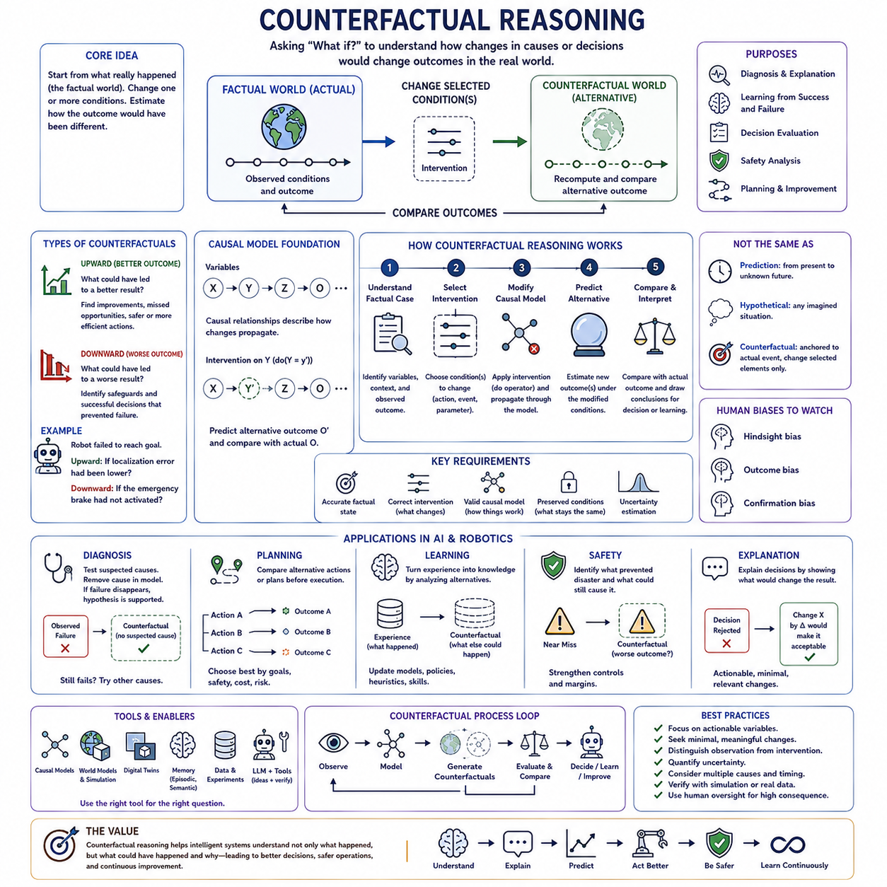{width="7.268055555555556in" height="7.268055555555556in"}

반사실적 추론(Counterfactual Reasoning)은 이전의 어떤 조건, 사건, 의사결정 또는 행동이 달라졌다면 관측된 결과가 어떻게 달라졌을지를 고려하는 과정입니다. 단순히 무엇이 발생했는지 또는 무엇이 발생할지를 묻는 것이 아니라, "만약 X가 발생하지 않았다면 어떻게 되었을까?"와 같은 질문을 제기하고 실제 세계(Actual World)를 가상의 대안 세계(Hypothetical Alternative Worlds)와 비교합니다.

이러한 추론 방식은 의미 있는 반사실을 구성하려면 변화가 시스템을 통해 어떻게 전파되는지에 대한 가정이 필요하기 때문에 인과 추론(Causal Reasoning)과 밀접하게 연결됩니다. 하나의 변수를 변경했을 때 다른 변수가 변화할 것으로 예상한다면 추론 시스템은 이들을 연결하는 인과 메커니즘(Causal Mechanism)에 대한 암묵적 또는 명시적 모델을 필요로 합니다. 단순한 통계적 상관관계만으로는 신뢰할 수 있는 반사실적 결론을 얻기에 충분하지 않은 경우가 많습니다.

반사실(Counterfactual)은 기준 상태를 제공하는 실제 상황(Factual Situation)에서 시작합니다. 추론 시스템은 다른 관련 요소를 가능한 한 유지하면서 선택된 조건을 변경합니다. 이후 생성된 가상의 상태를 정신적, 수학적 또는 계산적 모델을 통해 전개하여 최종 결과가 실제로 관측된 결과와 어떻게 달라질지를 추정합니다.

예를 들어 로봇이 목적지에 도달하지 못한 경우, 시스템은 위치 추정 불확실성(Localization Uncertainty)이 특정 임계값 이하로 유지되었다면 임무가 성공했을지를 질문할 수 있습니다. 또한 휠 슬립(Wheel Slip), 장애물 탐지, 통신 손실, 경로 선택 또는 부족한 배터리 용량과 관련된 대안적 설명을 고려하고 각각의 요인을 변경했을 때 나타나는 결과를 비교할 수 있습니다.

반사실적 추론은 일반적인 예측(Prediction)과 다릅니다. 예측은 일반적으로 현재에서 아직 알려지지 않은 미래를 향해 진행하는 반면, 반사실적 분석(Counterfactual Analysis)은 이미 알려진 과거의 결과에서 시작하여 과거의 대안적 버전을 구성하는 경우가 많습니다. 따라서 이 작업은 단순한 미래 예측이 아니라 이미 관측된 시퀀스 안에서 조건을 변경했을 때의 결과를 추정하는 과정입니다.

또한 반사실적 추론은 순수한 가설적 추론(Hypothetical Reasoning)과도 다릅니다. 가설적 질문은 어떠한 상상된 상황이라도 설명할 수 있지만, 반사실은 일반적으로 실제 사건이나 상태를 기준으로 하여 그중 선택된 요소만 변경합니다. 실제 증거와의 이러한 연결은 반사실적 추론을 진단, 설명, 실패로부터의 학습 및 과거 의사결정 평가에 특히 유용하게 만듭니다.

인과 모델(Causal Models)은 반사실적 추론을 위한 형식적 기반을 제공합니다. 변수는 시스템의 관련 속성을 표현할 수 있고, 인과관계는 하나의 변수가 다른 변수에 어떻게 영향을 미치는지를 설명할 수 있습니다. 선택된 변수에 개입(Intervention)하고 그 변화를 모델 전체에 전파함으로써 추론 시스템은 수정된 조건에서의 대안적 결과를 추정할 수 있습니다.

개입은 두 변수가 서로 연관되어 있다는 관측만으로는 하나의 변수를 의도적으로 변경했을 때 어떤 일이 발생할지를 확립할 수 없기 때문에 중요합니다. 따라서 반사실적 추론은 관측(Observation)과 개입을 구분함으로써 이점을 얻습니다. 이러한 구분은 AI 시스템이 우연한 상관관계를 원하는 변화를 신뢰성 있게 발생시킬 수 있는 메커니즘으로 잘못 해석하는 것을 방지하는 데 도움이 됩니다.

구조적 인과 모델(Structural Causal Models)은 변수들이 원인으로부터 어떻게 생성되는지를 설명하는 방정식을 사용하여 이러한 관계를 표현할 수 있습니다. 실제 상황이 식별되면 선택된 방정식이나 입력을 수정하여 개입을 표현할 수 있습니다. 이후 모델은 원래 사례와 관련된 정보를 유지하면서 그 결과로 발생하는 대안적 상태를 계산합니다.

반사실적 추론은 일반적으로 관측된 상황을 이해하고, 선택된 인과 조건을 변경하며, 그 변경의 결과를 예측하는 세 가지 개념적 연산을 포함합니다. 신뢰성 높은 추론을 위해서는 각 단계가 현실에 기반해야 합니다. 실제 상태를 잘못 이해하거나, 부적절한 개입을 선택하거나, 부정확한 인과 모델을 사용하면 잘못된 반사실적 결론이 생성될 수 있습니다.

인간 추론(Human Reasoning)은 의사결정을 평가할 때 자연스럽게 반사실을 사용합니다. 실패한 행동 이후 사람은 다른 경로를 선택했거나, 더 일찍 행동했거나, 추가 정보를 수집했거나, 특정 가정을 피했다면 결과가 개선되었을지를 생각할 수 있습니다. 이러한 성찰은 관측된 결과를 당시 선택할 수 있었던 대안적 행동과 연결하기 때문에 학습을 지원합니다.

그러나 인간의 반사실적 추론은 인지 편향(Cognitive Biases)에 취약합니다. 사후 확신 편향(Hindsight Bias)은 결과를 알고 난 이후 성공적인 대안이 처음부터 명확했던 것처럼 보이게 할 수 있고, 결과 편향(Outcome Bias)은 불리한 결과가 발생했다는 이유로 당시에는 합리적이었던 의사결정을 부정적으로 평가하게 만들 수 있습니다. 따라서 반사실적 평가는 의사결정의 품질과 불확실성 또는 우연에 의해 부분적으로 발생한 결과를 구분해야 합니다.

상향 반사실(Upward Counterfactuals)은 더 좋은 결과를 만들어냈을 대안을 상상합니다. 이는 개선점, 놓친 기회, 더 안전한 행동 또는 더욱 효율적인 전략을 식별하는 데 유용합니다. 실패한 임무로부터 학습하는 로봇은 더 이른 재계획(Replan), 낮은 속도, 다른 경로 또는 추가적인 센서 관측이 성공 가능성을 높였을 것이라고 판단할 수 있습니다.

하향 반사실(Downward Counterfactuals)은 더 나쁜 결과를 만들어낼 수 있었던 대안을 고려합니다. 이를 통해 어떤 안전장치나 성공적인 의사결정이 실패를 방지했는지를 확인할 수 있습니다. 로봇이 비상 제어기(Emergency Controller)의 감속으로 충돌을 피했다면, 시스템은 해당 개입이 없었을 때 어떤 일이 발생했을지를 분석하고 그 안전 메커니즘이 인과적으로 중요했음을 인식할 수 있습니다.

반사실적 설명(Counterfactual Explanations)은 AI의 의사결정을 더욱 이해하기 쉽게 만들 수 있습니다. 시스템은 단순히 특정 행동이 거부되었다고 보고하는 대신, 다른 의사결정이 선호되기 위해 어떤 관련 조건이 변경되어야 하는지를 식별할 수 있습니다. 이러한 설명은 모델의 의사결정을 실제로 변경 가능한 변수와 연결하여 사용자가 서로 다른 결과 사이의 경계를 이해하도록 돕습니다.

예를 들어 자율 시스템은 예측된 배터리 잔량이 요구되는 안전 여유(Safety Margin)보다 낮기 때문에 특정 경로가 거부되었다고 설명할 수 있습니다. 반사실적 설명은 다른 관련 제약조건이 그대로 유지되는 상황에서 사용 가능한 에너지가 충분히 증가하거나 예상 에너지 소비가 감소한다면 해당 경로가 허용될 수 있다고 설명할 수 있습니다.

반사실적 설명은 의미 있게 변경할 수 있는 변수에 집중해야 합니다. 불가능하거나, 관련성이 없거나, 제어할 수 없는 변경을 제안하는 것은 실질적인 가치가 거의 없습니다. 따라서 실행 가능한 반사실(Actionable Counterfactuals)은 에이전트가 영향을 줄 수 있는 변수, 환경에 의해 결정되는 변수, 그리고 가능한 개입으로 취급해서는 안 되는 고정된 속성을 구분합니다.

최소 반사실(Minimal Counterfactuals)은 결과를 변경할 수 있는 가장 작은 의미 있는 변화를 찾습니다. 여러 요소를 동시에 수정하는 설명은 해석하기 어려울 수 있기 때문에 이러한 접근법이 유용합니다. 하나의 센서 신뢰도 임계값(Sensor Confidence Threshold)을 변경하는 것만으로 의사결정 전환을 설명할 수 있다면 환경, 로봇 구성 및 임무 전체를 변경하는 것보다 더 유용한 설명이 될 수 있습니다.

그러나 동일한 목표를 달성할 수 있는 여러 대안적 경로가 존재하는 경우에는 다중 반사실(Multiple Counterfactuals)이 필요할 수 있습니다. 실패한 조작 작업은 파지 자세(Grasp Pose), 접근 방향, 힘 제한(Force Limit), 객체 추정 또는 로봇 위치를 변경하여 개선할 수 있습니다. 이러한 대안을 비교하면 계획기는 어떤 개입이 가장 실행 가능하고, 안전하며, 효율적인지를 식별할 수 있습니다.

반사실적 추론은 의심되는 원인이 관측된 실패에 필수적인지를 질문함으로써 진단을 강화할 수 있습니다. 모델에서 의심되는 고장을 제거했을 때 실패가 사라진다면 해당 가설을 지지하는 근거가 강화됩니다. 반사실 조건에서도 실패가 계속된다면 다른 요인 또는 여러 요인의 조합이 더 적절한 설명을 제공할 수 있습니다.

이러한 접근법은 여러 고장이 유사한 증상을 발생시키는 경우 특히 유용합니다. 패턴 매칭(Pattern Matching)은 가능성 있는 후보를 식별할 수 있지만, 반사실적 분석은 각각의 후보가 관측된 시퀀스를 어떻게 변화시킬지를 평가합니다. 따라서 진단은 유사성 기반 인식에서 경쟁하는 설명에 대한 인과적 검증(Causal Testing)으로 발전합니다.

반사실적 추론은 계획(Planning)도 지원합니다. 행동을 실행하기 전에 계획기는 서로 다른 선택에 의해 생성되는 후보 미래를 비교할 수 있습니다. 이러한 대안들은 관측된 과거가 아니라 미래에 관한 것이지만 기본 원리는 동일합니다. 즉, 행동이나 조건을 변경하고 그 결과로 상태 궤적(State Trajectory)이 어떻게 달라지는지를 추정합니다.

월드 모델(World Models)은 이러한 과정을 위한 중요한 계산 메커니즘을 제공합니다. 현재 상태의 표현이 주어지면 월드 모델은 서로 다른 행동을 시뮬레이션하고 가능한 미래 상태를 예측할 수 있습니다. 추론 시스템은 목표 달성, 안전, 에너지 소비, 불확실성, 시간 또는 기타 임무 기준에 따라 이러한 궤적을 비교할 수 있습니다.

학습된 월드 모델(Learned World Model)은 수작업으로 정의된 물리 방정식에만 의존하지 않고 경험으로부터 반사실적 궤적(Counterfactual Trajectories)을 생성할 수 있습니다. 이를 통해 완전한 해석 모델(Analytical Model)을 구축하기 어려운 복잡한 환경에서도 추론이 가능해집니다. 그러나 반사실적 추론의 신뢰성은 학습된 동역학(Learned Dynamics)이 제안된 개입에서도 정확하게 유지되는지에 크게 의존합니다.

분포 변화(Distribution Shift)는 반사실적 시나리오가 학습 경험과 크게 다를 때 특히 중요합니다. 모델은 익숙한 행동을 정확하게 예측하면서도 지형, 속도, 페이로드(Payload), 날씨 또는 고장의 비정상적인 조합을 시뮬레이션하도록 요구받으면 예측할 수 없는 결과를 생성할 수 있습니다. 따라서 충분한 학습 근거가 없는 영역의 반사실적 예측에는 불확실성 추정(Uncertainty Estimation)이 함께 사용되어야 합니다.

시뮬레이션(Simulation)은 반사실적 분석을 위한 또 다른 환경을 제공할 수 있습니다. 엔지니어는 기록된 사건을 재생하면서 선택된 파라미터, 제어기 설정, 센서 조건, 환경 변수 또는 행동을 변경할 수 있습니다. 시뮬레이션 결과를 원래 사건과 비교하면 위험한 대안을 실제 하드웨어에서 즉시 시험하지 않고도 잠재적인 개선점을 발견할 수 있습니다.

디지털 트윈(Digital Twins)은 물리 시스템과 그 운영 조건에 대한 계산적 표현을 유지함으로써 이러한 접근법을 확장할 수 있습니다. 과거 센서 데이터를 사용하여 실제 상태를 초기화한 후, 대안적인 유지보수 행동, 운영 파라미터, 경로, 하중 또는 제어 전략을 실제 시스템에 적용하기 전에 평가할 수 있습니다.

반사실적 추론은 에이전트가 행동의 결과로부터 학습한다는 점에서 강화학습(Reinforcement Learning)과 밀접하게 관련됩니다. 일반적인 경험은 실제로 선택된 행동에 대한 정보를 제공하지만, 반사실적 추론은 선택되지 않은 행동을 수행했다면 어떤 일이 발생했을지를 질문합니다. 신뢰성 높은 모델을 사용할 수 있다면 이러한 대안을 추정하여 학습 효율을 향상시킬 수 있습니다.

경험 리플레이(Experience Replay)는 실패, 성공 및 아차 사고(Near Misses)를 저장하여 이후의 반사실적 분석에 활용할 수 있습니다. 학습 시스템은 원래의 상태 전이(State Transition)를 단순히 재생하는 대신 유사한 상태에서 다른 행동을 수행했을 경우를 검토하고 예측된 결과를 비교할 수 있습니다. 이를 통해 저장된 경험을 미래 정책(Policy)을 개선하기 위한 더욱 풍부한 정보원으로 변환할 수 있습니다.

따라서 기억(Memory)은 반사실적 추론에서 중요합니다. 일화 기억(Episodic Memory)은 대안적 시나리오를 구성할 수 있는 상세한 실제 사례를 제공하고, 의미 기억(Semantic Memory)은 관계와 제약조건에 관한 일반화된 지식을 제공합니다. 절차 기억(Procedural Memory)은 에이전트가 실제로 사용할 수 있는 현실적인 대안을 정의하는 재사용 가능한 기술을 제공합니다.

반사실적 추론은 일부 형태의 편향(Bias)을 줄이는 데에도 기여할 수 있습니다. 하나의 설명에 고정된 시스템은 그 설명이 사실이 아니라면 어떤 결과가 예상되는지를 의도적으로 질문할 수 있습니다. 확증 편향(Confirmation Bias)은 선호하는 가설과 모순되는 대안을 구성하고 경쟁하는 가능성을 구분할 수 있는 관측을 식별함으로써 완화될 수 있습니다.

민감도 분석(Sensitivity Analysis)은 반사실적 추론과 관련되어 있지만 동일하지는 않습니다. 민감도 분석은 종종 상세한 인과적 해석 없이 파라미터가 변화함에 따라 출력이 어떻게 달라지는지를 조사합니다. 반면 반사실적 추론은 일반적으로 특정 실제 사례, 인과적 개입(Causal Intervention), 그리고 그 개입으로부터 발생하는 대안적 결과를 더욱 강조합니다.

LLM은 언어가 대안적 상황을 유연하게 표현할 수 있기 때문에 반사실적 가설(Counterfactual Hypotheses)을 효과적으로 생성할 수 있습니다. 변경된 가정, 대안적 행동, 가능한 결과 및 설명을 제안할 수 있습니다. 이러한 능력은 아이디어 생성과 고수준 추론에 유용하지만 언어적 개연성(Linguistic Plausibility)만으로 제안된 대안이 물리적 또는 인과적으로 타당하다는 것을 보장할 수는 없습니다.

도구 증강 LLM 에이전트(Tool-Augmented LLM Agents)는 제안된 대안을 전문 시스템으로 전달함으로써 반사실적 추론의 신뢰성을 향상시킬 수 있습니다. 시뮬레이터는 물리적 결과를 평가하고, 계획기는 실행 가능성을 검증하며, 계산기는 수치적 영향을 확인하고, 데이터베이스는 사실적 제약조건을 제공하며, 인과 모델은 가정된 개입이 구조적으로 의미가 있는지를 판단할 수 있습니다.

피지컬 AI(Physical AI)에서 반사실적 추론은 여러 계층에서 작동할 수 있습니다. 임무 수준에서는 대안적인 목표나 작업 시퀀스를 비교하고, 내비게이션 수준에서는 경로와 속도를 비교할 수 있습니다. 조작 수준에서는 파지와 궤적을 비교하며, 제어 수준에서는 외란(Disturbances)이나 고장에 대한 대안적 대응을 평가할 수 있습니다.

안전 공학(Safety Engineering)은 반사실적 분석으로부터 특히 큰 이점을 얻습니다. 아차 사고 이후 시스템은 어떤 안전장치가 사고를 방지했는지, 그리고 어떤 대안적 조건이 사고를 발생시킬 수 있었는지를 질문할 수 있습니다. 이를 통해 안전 여유, 위험한 사건 조합, 취약한 보호 메커니즘 및 미래 위험을 줄일 수 있는 개입 지점을 식별할 수 있습니다.

반사실적 안전 분석(Counterfactual Safety Analysis)은 물리적 실패가 하나의 독립된 사건보다 여러 요인의 상호작용으로 발생하는 경우가 많기 때문에 동시에 작용하는 여러 원인을 고려해야 합니다. 센서 성능 저하, 통신 지연, 낮은 위치 추정 정확도, 과도한 속도 및 환경 불확실성이 각각 독립적으로는 실패를 발생시키지 않더라도 결합되면 위험을 만들 수 있습니다.

시간적 추론(Temporal Reasoning)은 개입의 시점에 따라 효과가 달라질 수 있기 때문에 필수적입니다. 1초 일찍 제동하면 충돌을 방지할 수 있지만 임계 시점을 지난 후 동일한 행동을 수행하면 효과가 없을 수 있습니다. 따라서 반사실 모델은 원인을 시간과 무관한 연관관계로 취급하지 않고 사건 순서, 지연, 지속시간 및 상태 지속성(State Persistence)을 보존해야 합니다.

반사실적 추론은 예상하지 못한 결과를 구조화된 학습 기회로 변환함으로써 지속 학습(Continual Learning)에 기여할 수 있습니다. 예측과 현실이 다를 때 시스템은 사건을 재구성하고, 대안적 개입을 식별하고, 그 결과를 추정하며, 이에 따라 모델, 휴리스틱(Heuristics), 정책 또는 계획 규칙을 업데이트할 수 있습니다.

플릿 학습(Fleet Learning)은 이러한 과정을 여러 로봇으로 확장할 수 있습니다. 서로 다른 플랫폼, 환경, 페이로드 또는 센서 구성에서 관측된 유사한 사건은 인과 가설(Causal Hypotheses)을 평가하기 위한 자연스러운 변화를 제공합니다. 공유된 반사실적 분석은 어떤 전략이 여러 시스템에서 일반화되고 어떤 전략이 특정 플랫폼 조건에 의존하는지를 밝혀낼 수 있습니다.

메타인지(Metacognition)는 추가적인 계산 비용을 감수하면서 반사실적 추론을 수행할 가치가 있는 시점을 결정할 수 있습니다. 일상적이고 위험이 낮은 행동은 광범위한 대안 세계 분석을 필요로 하지 않을 수 있지만, 새롭거나 불확실하거나 비용이 높거나 안전에 중요한 의사결정은 더 깊은 반사실 탐색, 시뮬레이션, 인과 검증 또는 인간 검토를 활성화할 수 있습니다.

고려되는 변수와 개입이 증가하면 가능한 반사실 세계(Counterfactual Worlds)의 수가 빠르게 증가합니다. 따라서 모든 대안을 완전하게 평가하는 것은 일반적으로 불가능합니다. 계산을 현실적이고 결과에 중요한 대안에 집중시키기 위해서는 휴리스틱, 인과 구조, 관련성 순위(Relevance Ranking), 위험 추정 및 목표 정보가 필요합니다.

신뢰성 높은 반사실적 추론은 일관성(Consistency)도 요구합니다. 대안 세계는 선택된 개입과 그 인과적 결과에 의해 정당화되는 방식으로만 실제 세계와 달라져야 합니다. 관련이 없는 변수를 임의로 변경하면 매력적인 이야기를 생성할 수는 있지만 해당 개입이 실제로 무엇을 변화시켰을지에 대한 의미 있는 설명은 제공하지 못합니다.

이러한 요구사항은 AI가 생성하는 설명에서 특히 중요합니다. 원하는 결론을 얻기 위해 반사실이 여러 가정을 암묵적으로 변경해서는 안 됩니다. 개입, 유지되는 조건, 인과적 의존성(Causal Dependencies), 불확실성 및 예측 결과를 명시적으로 식별하면 추론을 더욱 쉽게 검토하고 검증할 수 있습니다.

반사실적 결론이 중대한 결과를 초래하는 의사결정에 영향을 미칠 때는 인간 감독(Human Oversight)이 여전히 중요합니다. 엔지니어, 운영자 또는 도메인 전문가는 제안된 개입이 현실적인지, 인과 모델에서 중요한 메커니즘이 누락되었는지, 그리고 시뮬레이션 가정이 실제 운영 조건을 반영하는지를 평가할 수 있습니다.

반사실적 추론은 궁극적으로 설명, 예측, 학습 및 의사결정(Decision Making)을 연결합니다. 대안을 고려하여 결과를 설명하고, 실패와 성공으로부터 추가 정보를 추출하여 학습을 개선하며, 가능한 결과를 비교하여 계획을 지원하고, 바람직하지 않은 결과가 발생할 수 있는 조건을 식별하여 안전성을 강화합니다.

자율 AI(Autonomous AI)와 피지컬 AI에서 반사실적 추론의 가장 큰 가치는 인과 모델, 기억, 월드 모델, 시뮬레이션, 불확실성 추정, 계획, 강화학습, 검증 및 피드백과 통합될 때 나타납니다. 이러한 메커니즘을 결합하면 에이전트는 단순히 무엇이 발생했는지를 인식하는 수준을 넘어 무엇이 발생할 수도 있었으며 그 이유가 무엇인지를 이해하는 방향으로 발전할 수 있습니다.

따라서 성숙한 지능형 시스템(Mature Intelligent System)은 실제 세계뿐만 아니라 신중하게 구성된 대안 세계에 대해서도 추론할 수 있어야 합니다. 실제 경험과 타당한 반사실 세계를 비교함으로써 시스템은 인과적 지렛점(Causal Leverage Points)을 식별하고, 선택하지 못했던 행동을 평가하며, 미래 계획을 개선하고, 안전 가정을 검증하고, 행동이 세계를 어떻게 변화시키는지에 대한 이해를 지속적으로 정교화할 수 있습니다.

## 03.12 Mental Simulation [w/Code]

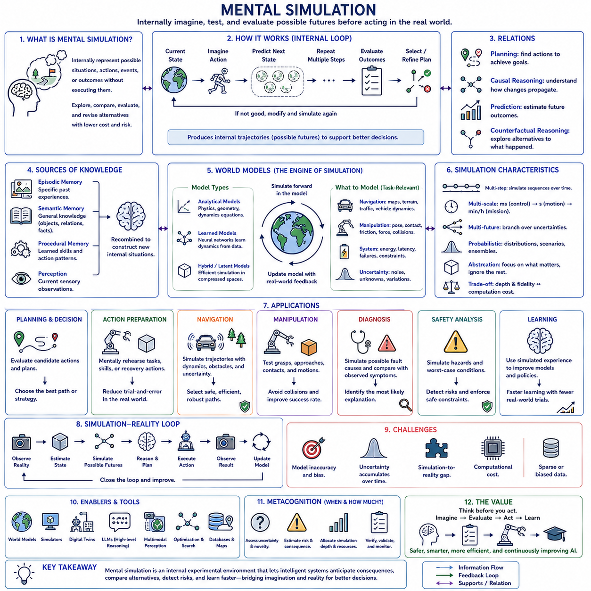{width="7.268055555555556in" height="7.268055555555556in"}

정신적 시뮬레이션(Mental Simulation)은 가능한 상황, 행동, 사건 또는 결과를 외부 세계에서 즉시 실행하지 않고 내부적으로 표현하는 인지 과정(Cognitive Process)입니다. 이를 통해 지능형 시스템은 실제 행동을 실행하기 전에 어떤 일이 발생할 수 있는지를 탐색할 수 있으며, 물리적 또는 운영적 비용을 낮춘 상태에서 여러 대안을 상상하고, 비교하고, 평가하고, 수정할 수 있는 내부 공간을 형성합니다.

인간의 정신적 시뮬레이션은 지각(Perception), 기억(Memory), 공간 추론(Spatial Reasoning), 인과 지식(Causal Knowledge), 상상(Imagination) 및 과거 경험(Prior Experience)을 활용합니다. 사람은 익숙하지 않은 건물 내부를 이동하거나, 물체를 조작하거나, 비상 상황에 대응하거나, 복잡한 작업을 수행하는 과정을 정신적으로 연습할 수 있습니다. 이러한 시뮬레이션은 정확한 물리 계산인 경우는 드물지만 가능한 상태와 결과에 대한 유용한 근사치를 제공합니다.

정신적 시뮬레이션은 하나의 미래 결과만을 추정하는 것이 아니라 서로 상호작용하는 사건들의 시퀀스(Sequence)를 표현할 수 있다는 점에서 단순한 예측(Prediction)과 다릅니다. 추론 주체는 초기 상태를 상상하고, 행동을 적용하고, 그 결과 상태를 추정한 다음, 여러 단계에 걸쳐 이 과정을 계속할 수 있습니다. 이를 통해 실제 행동 시퀀스를 실행하기 전에 검토할 수 있는 내부 궤적(Internal Trajectory)을 생성합니다.

이 과정은 계획(Planning)과 밀접하게 관련됩니다. 계획은 목표를 달성할 수 있는 행동을 식별하고, 정신적 시뮬레이션은 그러한 행동이 어떻게 전개될지를 평가합니다. 따라서 후보 계획(Candidate Plan)은 실제 실행이 시작되기 전에 내부적으로 실행될 수 있습니다. 시뮬레이션된 궤적에서 장애물, 과도한 비용, 위험한 조건 또는 목표 달성 실패가 발견되면 계획을 수정하거나 거부할 수 있습니다.

정신적 시뮬레이션은 인과 추론(Causal Reasoning)과도 강하게 연결됩니다. 상상된 행동의 결과를 예측하려면 변화가 시스템을 통해 어떻게 전파되는지를 이해해야 합니다. 로봇이 속도를 높이거나, 방향을 변경하거나, 물체를 이동하거나, 힘을 가하는 경우 유용한 시뮬레이션은 단순히 해당 행동을 이전에 관측된 결과와 연결하는 것을 넘어 이러한 개입이 이후 상태에 어떻게 영향을 미치는지를 표현해야 합니다.

반사실적 추론(Counterfactual Reasoning)은 관측된 사건의 대안을 다루는 특수한 형태의 시뮬레이션으로 이해할 수 있습니다. 정신적 시뮬레이션은 과거의 대안, 현재의 가능성 및 미래 시나리오를 모두 검토할 수 있기 때문에 더 광범위합니다. 반사실적 추론이 다른 행동을 했다면 어떤 일이 발생했을지를 묻는다면, 전망적 시뮬레이션(Prospective Simulation)은 지금 특정 행동을 선택하면 어떤 일이 발생할 수 있는지를 질문합니다.

기억은 시뮬레이션을 구성하는 데 필요한 많은 정보를 제공합니다. 일화 기억(Episodic Memory)은 구체적인 과거 경험을 제공하고, 의미 기억(Semantic Memory)은 객체와 관계에 관한 일반화된 지식을 제공하며, 절차 기억(Procedural Memory)은 학습된 행동 패턴을 제공합니다. 정신적 시뮬레이션은 이러한 저장된 요소들을 재조합하여 정확히 동일한 형태로 경험한 적이 없는 상황도 구성할 수 있습니다.

이러한 재조합은 일반화(Generalization)를 지원합니다. 지능형 에이전트는 알려진 객체, 동역학(Dynamics), 제약조건 및 행동을 새로운 내부 시나리오로 조합할 수 있다면 가능한 모든 상황을 직접 경험할 필요가 없습니다. 경사면, 미끄러운 표면, 무거운 페이로드(Payload) 및 회전 행동을 각각 학습한 로봇은 이들의 정확한 조합을 실제로 경험하기 전에 이러한 조건을 결합하여 시뮬레이션할 수 있습니다.

인간의 정신적 시뮬레이션은 정밀한 수치 모델링보다 추상화(Abstraction)에 의존하는 경우가 많습니다. 사람은 미분방정식을 명시적으로 풀지 않고도 무거운 물체는 정지시키기 어렵거나 좁은 경로에서는 움직임이 제한될 수 있다고 예상할 수 있습니다. 이러한 근사적 추론(Approximate Reasoning)은 계산적으로 효율적이지만 정확한 물리량이나 익숙하지 않은 동역학이 중요해지면 실패할 수 있습니다.

명시적인 모델을 사용할 수 있는 경우 계산 시뮬레이션(Computational Simulation)은 더 높은 수치적 정밀성을 제공할 수 있습니다. 운동 방정식(Equations of Motion), 기하학, 충돌 모델, 에너지 모델, 제어 동역학(Control Dynamics) 및 환경 제약조건을 체계적으로 평가할 수 있습니다. 이러한 시뮬레이션은 속도, 시간, 힘, 여유 공간 또는 안정성의 작은 차이가 행동의 성공 여부를 결정하는 공학 영역에서 특히 중요합니다.

완전한 해석 모델(Analytical Models)을 사용할 수 없는 경우 학습 기반 시뮬레이션(Learned Simulation)은 또 다른 접근법을 제공합니다. 신경망은 관측과 행동으로부터 상태가 어떻게 변화하는지를 학습한 다음 후보 행동에 따른 미래 상태를 예측할 수 있습니다. 이러한 학습된 동역학(Learned Dynamics)은 수작업으로 모델링하기 어려운 복잡한 상호작용을 표현할 수 있지만, 신뢰성은 학습 범위와 일반화 성능에 크게 의존합니다.

월드 모델(World Models)은 자율 AI(Autonomous AI)의 정신적 시뮬레이션을 위한 핵심 기반을 제공합니다. 월드 모델은 미래 상태가 어떻게 변화할지를 예측하기에 충분한 수준으로 환경, 에이전트, 객체, 관계 및 동역학의 여러 측면을 표현합니다. 현재 상태와 후보 행동이 주어지면 모델은 추론 및 계획 시스템이 평가할 수 있는 하나 이상의 미래 상태를 추정합니다.

월드 모델이 반드시 현실의 모든 세부사항을 재구성해야 하는 것은 아닙니다. 효과적인 시뮬레이션을 위해서는 의사결정과 관련된 정보를 표현해야 합니다. 내비게이션(Navigation)에서는 시각적 질감보다 기하학, 주행 가능성(Traversability), 이동 객체, 위치 추정 불확실성 및 차량 동역학이 중요할 수 있습니다. 조작에서는 객체 자세, 접촉, 마찰, 힘, 도달 가능성(Reachability) 및 충돌 관계가 더욱 중요할 수 있습니다.

이러한 선택적 표현(Selective Representation)은 물리적 세계 전체를 완전하게 시뮬레이션하는 것이 계산적으로 불가능하기 때문에 중요합니다. 따라서 지능형 시뮬레이션은 추상화에 의존합니다. 모델은 중요한 결과에 영향을 미치는 변수를 유지하면서 현재 작업에 거의 영향을 미치지 않는 세부사항을 압축하거나 무시해야 하며, 이를 통해 충실도(Fidelity)와 계산 효율성 사이의 균형을 형성합니다.

정신적 시뮬레이션은 여러 시간 척도(Temporal Scales)에서 작동할 수 있습니다. 제어기는 안정성을 유지하기 위해 몇 분의 1초 앞을 예측할 수 있고, 모션 계획기(Motion Planner)는 수초 동안의 움직임을 시뮬레이션할 수 있으며, 임무 계획기(Mission Planner)는 수분 또는 수시간에 걸친 작업 진행을 고려할 수 있습니다. 서로 다른 예측 지평(Prediction Horizons)은 서로 다른 표현, 불확실성 및 추상화 수준을 요구합니다.

단기 지평 시뮬레이션(Short-Horizon Simulation)은 불확실성이 축적될 시간이 제한적이므로 비교적 상세한 물리 상태를 유지할 수 있습니다. 장기 지평 시뮬레이션(Long-Horizon Simulation)은 작은 예측 오류가 시간에 따라 전파되면서 점점 더 불확실해집니다. 따라서 먼 미래를 추론할 때는 고수준 표현, 확률적 미래(Probabilistic Futures), 주기적인 재계획(Periodic Replanning) 및 피드백이 특히 중요합니다.

하나의 결정론적 궤적(Deterministic Trajectory)이 발생할 것이라고 가정하기보다 여러 미래를 시뮬레이션해야 하는 경우가 많습니다. 센서 불확실성, 환경 변화, 인간 행동, 기계적 편차 및 불완전한 지식은 동일한 행동에서도 서로 다른 결과를 발생시킬 수 있습니다. 확률적 시뮬레이션(Probabilistic Simulation)은 분포, 대안 분기 또는 예측 궤적의 앙상블을 통해 이러한 불확실성을 표현합니다.

시나리오 분기(Scenario Branching)를 사용하면 에이전트는 중요한 대안적 전개를 검토할 수 있습니다. 이동 로봇은 보행자가 계속 전진하는 미래, 정지하는 미래, 그리고 로봇의 진행 경로를 가로지르는 미래를 각각 시뮬레이션할 수 있습니다. 계획기는 하나의 예측만을 최적화하는 대신 여러 개연성 있는 시나리오에서 안전성을 유지하는 행동을 선택할 수 있습니다.

시뮬레이션 깊이(Simulation Depth)는 계산 비용과 균형을 이루어야 합니다. 더 많은 행동, 더 긴 지평 및 더 많은 불확실성 분기를 탐색하면 의사결정 품질이 향상될 수 있지만 계산량도 빠르게 증가합니다. 탐색 전략, 휴리스틱(Heuristics), 학습된 가치 함수(Learned Value Functions), 위험 추정 및 계층적 계획(Hierarchical Planning)을 이용하여 최종 의사결정에 가장 큰 영향을 미칠 가능성이 있는 대안에 시뮬레이션 자원을 집중할 수 있습니다.

인간도 어렵거나 결과가 중요한 상황에 더 많은 정신적 노력을 할당하는 유사한 전략을 사용합니다. 일상적인 행동에는 의식적인 시뮬레이션이 거의 필요하지 않을 수 있지만, 익숙하지 않거나 위험한 작업에서는 가능한 결과를 의도적으로 연습하게 됩니다. 이는 불확실성, 새로움(Novelty), 복잡성 및 위험이 증가할수록 추론 깊이를 증가시키는 적응형 아키텍처(Adaptive Architecture)를 제안합니다.

정신적 리허설(Mental Rehearsal)은 행동 준비에 특히 유용합니다. 운동선수, 운영자 및 숙련된 작업자는 실제 실행 전에 시퀀스를 정신적으로 연습할 수 있습니다. AI에서도 이에 대응하는 메커니즘을 통해 실제 실행 전에 작업 절차, 모션 시퀀스, 도구 사용 또는 복구 전략을 내부적으로 평가함으로써 실제 세계의 시행착오를 통해 모든 실패 모드를 발견해야 하는 필요성을 줄일 수 있습니다.

로봇 조작(Robotic Manipulation)은 이러한 능력의 중요성을 잘 보여줍니다. 물체를 파지하기 전에 로봇은 접근 방향, 파지 구성(Grasp Configurations), 충돌, 도달 가능성, 예상 접촉 및 파지 이후의 움직임을 시뮬레이션할 수 있습니다. 위험하거나 실행 불가능한 것으로 보이는 후보 행동은 모터가 실제로 이를 실행하기 전에 제거하고, 가능성이 높은 후보에는 더욱 상세한 평가를 수행할 수 있습니다.

자율 내비게이션(Autonomous Navigation) 역시 시뮬레이션으로부터 큰 이점을 얻습니다. 로봇은 차량 동역학, 장애물, 지형, 이동 에이전트, 위치 추정 불확실성 및 에너지 요구량을 고려하면서 지도상에서 후보 궤적을 예측할 수 있습니다. 단순히 기하학적 거리만으로 경로를 선택하는 대신 예상되는 물리적 및 운영적 결과를 비교할 수 있습니다.

피지컬 AI(Physical AI)에서는 시뮬레이션이 실제 세계의 피드백(Real-World Feedback)과 지속적으로 연결되어야 합니다. 매우 정확한 내부 모델도 환경이 변화하고 모델이 불완전하기 때문에 결국 현실과 차이가 발생합니다. 따라서 로봇은 환경을 반복적으로 관측하고, 상태 추정(State Estimate)을 갱신하고, 가능한 행동을 시뮬레이션하고, 선택된 행동을 실행하고, 결과를 관측하며, 필요할 때 재계획해야 합니다.

이를 통해 상상과 경험 사이에 폐루프 관계(Closed-Loop Relationship)가 형성됩니다. 시뮬레이션은 가능한 미래를 제안하고, 물리적 상호작용은 실제로 무엇이 발생하는지를 보여줍니다. 예측 결과와 관측 결과의 차이는 시간이 지남에 따라 동역학 모델, 불확실성 추정, 계획 휴리스틱 및 표현을 개선할 수 있는 학습 신호(Learning Signals)를 제공합니다.

따라서 예측 오류(Prediction Error)는 단순한 시뮬레이션 실패가 아니라 중요한 정보원이 됩니다. 물체가 예상과 다르게 움직이거나 차량이 예측보다 더 많이 미끄러지는 경우 이러한 차이는 누락되었거나 부정확한 지식을 나타냅니다. 지속적인 오류는 모델 적응(Model Adaptation), 새로운 데이터 수집, 파라미터 추정 또는 미래 시뮬레이션에 사용되는 표현의 변경을 유발할 수 있습니다.

경험 리플레이(Experience Replay)는 이러한 학습 과정을 강화할 수 있습니다. 기록된 성공, 실패 및 아차 사고(Near Misses)를 재구성하여 다른 행동이나 모델 가정을 적용해 다시 시뮬레이션할 수 있습니다. 시스템은 실제 결과와 시뮬레이션된 대안을 비교하여 위험한 상황을 실제로 반복하지 않고도 과거 경험으로부터 추가적인 학습 기회를 생성할 수 있습니다.

시뮬레이션은 강화학습(Reinforcement Learning)과도 밀접하게 연결됩니다. 모델 프리 강화학습(Model-Free Reinforcement Learning)은 경험으로부터 직접 행동 가치를 학습하는 반면, 모델 기반 강화학습(Model-Based Reinforcement Learning)은 모델을 사용하여 미래 상태와 보상을 예측합니다. 정신적 시뮬레이션은 에이전트가 실제 행동을 선택하기 전에 상상된 경험(Imagined Experience)을 평가할 수 있기 때문에 모델 기반 접근법과 자연스럽게 대응합니다.

이는 물리적 상호작용이 비용이 높고, 느리거나, 위험한 경우가 많기 때문에 샘플 효율성(Sample Efficiency)을 향상시킬 수 있습니다. 로봇이 모든 내비게이션 전략, 충돌 시나리오, 파지 실패 또는 제어 구성을 실제 세계에서 시험하는 것은 현실적으로 불가능합니다. 내부 시뮬레이션은 많은 후보 경험을 평가하면서 가장 정보 가치가 높거나 반드시 필요한 경우에만 실제 실험을 수행하도록 할 수 있습니다.

그러나 시뮬레이션 경험은 모델이 충분히 정확할 때에만 유용합니다. 모델 편향(Model Bias)은 에이전트가 실제 환경에서 성공하는 전략이 아니라 시뮬레이터의 오류를 이용하는 전략을 학습하게 만들 수 있습니다. 이러한 문제는 특히 학습된 정책이 시뮬레이션이 충분히 검증되지 않은 영역에서 새로운 행동을 발견할 때 중요해집니다.

시뮬레이션-현실 격차(Simulation-to-Reality Gap)는 시뮬레이션 환경과 실제 물리 환경 사이의 차이를 의미합니다. 기하학, 마찰, 센서 노이즈, 지연시간(Latency), 액추에이터 응답, 지형 변형, 날씨, 인간 행동 및 기타 많은 요인이 불완전하게 표현될 수 있습니다. 따라서 강건한 시스템(Robust Systems)은 시뮬레이션을 현실의 절대적인 표현이 아니라 근사치로 취급해야 합니다.

도메인 랜덤화(Domain Randomization)는 학습 과정에서 파라미터를 변화시켜 제한적인 시뮬레이션 가정에 대한 의존성을 줄일 수 있습니다. 하나의 고정된 마찰계수, 조명 조건, 센서 노이즈 수준 또는 페이로드만 경험하는 대신 에이전트는 다양한 가능성 범위에서 학습합니다. 이러한 변화에서도 효과적인 정책은 실제 환경으로 더욱 안정적으로 전이될 가능성이 높습니다.

디지털 트윈(Digital Twins)은 보다 시스템 특화된 형태의 시뮬레이션을 제공합니다. 디지털 트윈은 특정 물리 자산, 로봇, 시설 또는 프로세스에 대해 지속적으로 변화하는 계산적 표현을 유지하려고 합니다. 실제 센서 데이터로 모델을 갱신하고, 실제 개입이 이루어지기 전에 대안적 운영 조건, 유지보수 행동, 임무 계획 또는 고장을 평가할 수 있습니다.

정신적 시뮬레이션은 계획뿐만 아니라 진단(Diagnosis)도 지원할 수 있습니다. 관측된 고장이 주어지면 시스템은 후보 고장 메커니즘을 시뮬레이션하고 어떤 메커니즘이 관측된 증상을 재현하는지를 판단할 수 있습니다. 이는 귀추적 추론(Abductive Reasoning)과 예측 모델링(Predictive Modeling)을 결합하는 것으로, 가능한 원인을 제안하고 그 결과를 시뮬레이션한 다음 실제 관측과 비교합니다.

안전 분석(Safety Analysis)은 또 다른 주요 응용 분야입니다. 자율 시스템은 위험한 행동과 환경 조건의 조합을 실제 발생 전에 시뮬레이션할 수 있습니다. 충돌 위험, 불안정성, 부족한 정지 거리, 에너지 고갈, 위험한 조작 또는 위치 추정 상실을 예측 궤적에서 탐지하여 위험한 행동을 거부하는 데 활용할 수 있습니다.

시뮬레이션 기반 안전(Simulation-Based Safety)은 예측 모델 자체가 틀릴 수 있기 때문에 명시적인 제약조건과 결합되어야 합니다. 하드 리밋(Hard Limits), 비상 제어기(Emergency Controllers), 충돌 회피, 속도 제한, 중복성(Redundancy) 및 인간 감독(Human Oversight)은 시뮬레이션이 중요한 위험을 예측하지 못했을 때 추가적인 보호를 제공합니다. 따라서 안전이 하나의 내부 모델에만 의존해서는 안 됩니다.

LLM은 의미적 및 전략적 수준에서 정신적 시뮬레이션에 기여할 수 있습니다. LLM은 시나리오를 구성하고, 관련 변수를 식별하고, 후보 행동을 생성하고, 가능한 결과를 설명하고, 대안 전략을 비교할 수 있습니다. 광범위한 지식은 고수준 추론에 유용하지만 언어 기반 시뮬레이션(Language-Based Simulation)만으로 정확한 기하학, 동역학, 시간 또는 물리적 제약조건을 유지하지 못할 수 있습니다.

도구 증강 LLM 에이전트(Tool-Augmented LLM Agents)는 의미적 추론을 전문 시뮬레이터, 계획기, 최적화 시스템, 데이터베이스 및 월드 모델과 연결하여 이러한 한계의 일부를 극복할 수 있습니다. LLM은 시나리오를 정식화하고 무엇을 평가해야 하는지를 결정하며, 전문 계산 도구는 제안된 미래가 물리적, 수학적 또는 운영적으로 실행 가능한지를 판단할 수 있습니다.

멀티모달 모델(Multimodal Models)은 추론을 이미지, 비디오, 깊이 정보, 오디오, 지도 및 센서 관측에 기반하게 함으로써 이러한 연결을 더욱 강화합니다. 에이전트는 텍스트만으로 미래를 상상하는 대신 현재의 지각 상태(Current Perceptual States)를 기반으로 시뮬레이션을 구성할 수 있습니다. 이는 공간적 관계와 지속적으로 변화하는 환경에 의존하여 의사결정을 수행하는 로봇에서 특히 중요합니다.

생성 모델(Generative Models)은 구조화된 상태 변수뿐만 아니라 가능한 미래 관측을 표현할 수 있습니다. 모델은 현재 관측과 행동을 조건으로 미래 비디오 프레임, 점유 표현(Occupancy Representations), 궤적 또는 잠재 상태(Latent States)를 생성할 수 있습니다. 이러한 생성적 시뮬레이션(Generative Simulation)은 풍부한 환경 변화를 표현할 수 있지만 시각적 사실성(Visual Realism)만으로 물리적으로 올바른 동역학을 보장하지는 않습니다.

잠재 월드 모델(Latent World Models)은 압축된 표현 공간에서 시뮬레이션을 수행하여 계산 비용을 줄입니다. 미래의 모든 단계에서 완전한 고해상도 감각 관측을 생성하는 대신 시스템은 작업과 관련된 정보를 포함하는 압축된 잠재 상태를 예측합니다. 이후 계획과 가치 추정(Value Estimation)을 이러한 상태에서 더욱 효율적으로 수행할 수 있습니다.

계층적 시뮬레이션(Hierarchical Simulation)은 여러 표현을 결합할 수 있습니다. 고수준 모델은 임무 진행과 의미적 사건을 시뮬레이션하고, 중간 수준 모델은 궤적과 상호작용을 예측하며, 저수준 모델은 상세한 차량 또는 매니퓰레이터 동역학을 평가할 수 있습니다. 어떤 의사결정에 더 높은 정밀도가 필요한지에 따라 계산을 서로 다른 수준 사이에서 이동시킬 수 있습니다.

메타인지(Metacognition)는 언제 그리고 어느 정도 깊이로 시뮬레이션을 수행할지를 조절할 수 있습니다. 시스템은 현재 상황이 익숙한지, 불확실성이 높은지, 예측 결과들이 서로 불일치하는지, 실패 결과가 심각한지를 평가할 수 있습니다. 이러한 신호는 의사결정에 할당되는 시나리오 수, 예측 지평의 길이, 모델 충실도 및 검증 노력(Verification Effort)을 결정할 수 있습니다.

정신적 시뮬레이션은 상상된 상태가 이전에 관측된 시퀀스에만 제한되지 않기 때문에 창의성(Creativity)과 문제 해결(Problem Solving)도 지원합니다. 기존 지식을 새로운 구성으로 재조합하여 에이전트가 기존과 다른 전략을 탐색할 수 있습니다. 그러나 목적이 자유로운 상상이 아니라 신뢰할 수 있는 행동이라면 창의적 시뮬레이션은 인과적, 논리적 및 물리적 일관성에 의해 제약되어야 합니다.

자율 AI에서 시뮬레이션은 추론과 행동 사이의 연결 고리를 형성합니다. 추론은 가설과 계획을 제안하고, 시뮬레이션은 그 예상 결과를 드러내며, 실제 실행은 이러한 예측이 정확했는지를 보여주는 증거를 제공합니다. 이러한 순환을 통해 에이전트는 자신이 무엇을 알고 있는지만이 아니라 자신의 의사결정 결과를 얼마나 효과적으로 예측하는지도 개선할 수 있습니다.

피지컬 AI에서는 지능이 실제 동역학, 제한된 에너지, 불확실한 센싱, 물리적 안전 제약조건 및 되돌리기 어려운 결과 아래에서 작동해야 하기 때문에 이러한 능력이 더욱 근본적으로 중요합니다. 행동하기 전에 여러 미래를 내부적으로 평가할 수 있는 에이전트는 불필요한 실험을 줄이고 더 나은 기대 결과(Expected Outcomes)를 제공하는 행동을 선택할 수 있습니다.

따라서 성숙한 피지컬 AI 아키텍처(Mature Physical AI Architecture)는 지각, 기억, 인과 추론, 월드 모델, 시뮬레이션, 탐색, 계획, 불확실성 추정, 강화학습, 제어 및 피드백을 하나의 지속적인 루프로 통합할 수 있습니다. 현재 관측이 상태를 설정하고, 내부 모델이 가능한 미래를 생성하며, 추론이 이를 평가하고, 선택된 행동이 새로운 증거를 만들어냅니다.

정신적 시뮬레이션은 궁극적으로 지능을 순수한 반응적 행동(Reactive Behavior)에서 예측적 행동(Anticipatory Behavior)으로 변화시킵니다. 결과가 발생한 뒤 기다렸다가 대응하는 대신, 지능형 시스템은 실제 사건이 발생하기 전에 가능한 상황을 내부적으로 근사 경험할 수 있습니다. 이러한 능력은 준비, 회피, 최적화, 설명, 학습 및 적응을 지원합니다.

정신적 시뮬레이션의 장기적인 중요성은 지능을 위한 내부 실험 환경(Internal Experimental Environment)으로서의 역할에 있습니다. 무엇이 발생할 수 있는지, 무엇이 실패할 수 있는지, 어떤 대안 행동을 사용할 수 있는지, 그리고 세계가 어떻게 반응할지를 반복적으로 질문함으로써 자율 AI는 학습된 지식을 전망적 이해(Prospective Understanding)로 전환하고, 이러한 이해를 더욱 안전하고 높은 능력을 갖춘 의사결정에 활용할 수 있습니다.

## 03.13 Decision Making under Uncertainty [w/Code]

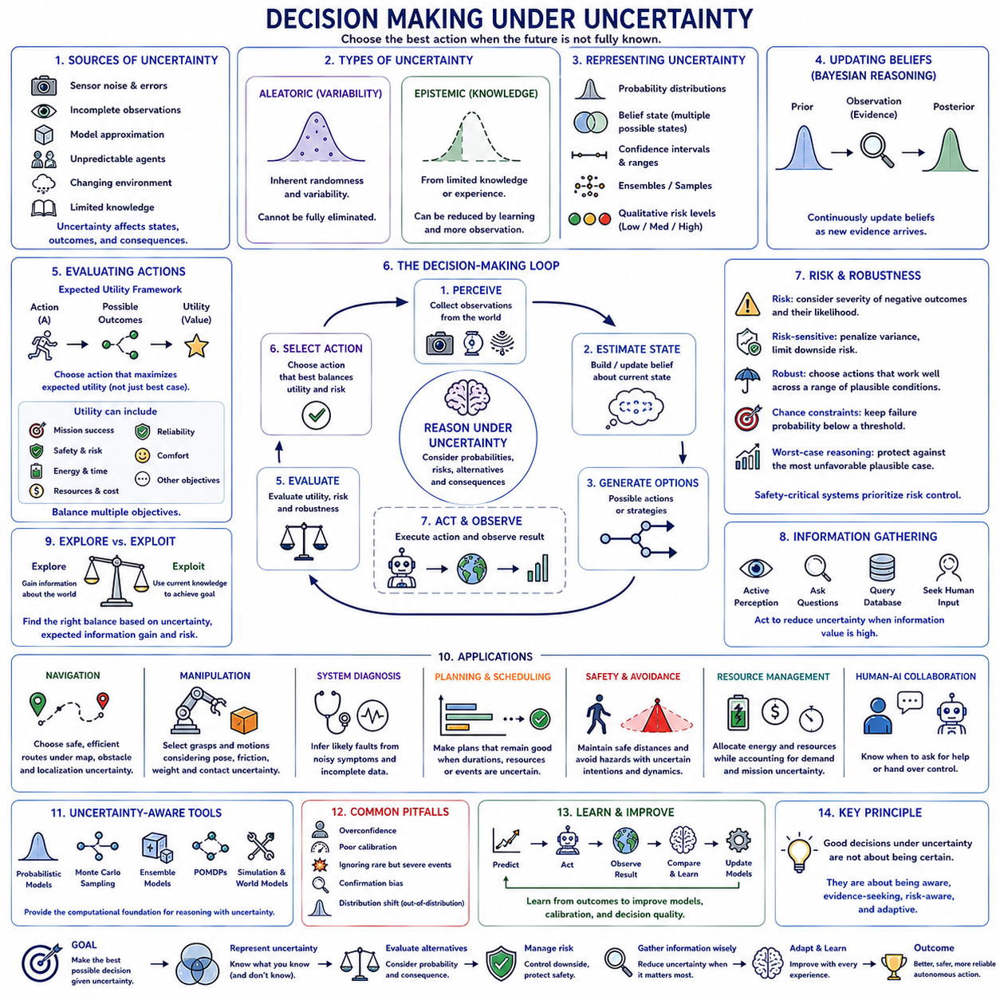{width="7.268055555555556in" height="7.268055555555556in"}

불확실성 하의 의사결정(Decision Making under Uncertainty)은 현재 상태, 미래 결과, 환경 조건 또는 행동의 결과를 완전한 확신을 가지고 알 수 없는 상황에서 행동을 선택하는 과정입니다. 지능형 에이전트(Intelligent Agents)는 완벽한 정보 아래에서 작동하는 경우가 거의 없으므로 효과적인 의사결정을 위해서는 기대 결과뿐만 아니라 불확실성(Uncertainty), 위험(Risk), 불완전한 관측(Incomplete Observations) 및 대안적 가능성(Alternative Possibilities)도 함께 고려해야 합니다.

불확실성은 다양한 원인에서 발생할 수 있습니다. 센서에는 노이즈(Sensor Noise)가 포함될 수 있고, 관측은 불완전할 수 있으며, 모델은 현실을 불완전하게 근사할 수 있고, 다른 에이전트는 예측하기 어렵게 행동할 수 있으며, 미래의 환경 조건도 변화할 수 있습니다. 따라서 의사결정 시스템은 무엇이 알려져 있고, 무엇이 추정되며, 무엇이 아직 알려지지 않았는지, 그리고 각각의 불확실성이 최종 결과에 얼마나 큰 영향을 줄 수 있는지를 구분해야 합니다.

우연적 불확실성(Aleatoric Uncertainty)은 환경에 내재된 무작위성(Randomness)이나 변동성(Variability)에서 발생합니다. 센서 노이즈, 예측하기 어려운 보행자의 움직임, 변화하는 날씨 또는 지형 상호작용의 편차 등이 이에 해당합니다. 이러한 불확실성은 근본적인 과정을 충분히 이해하더라도 계속 존재하는 변동성을 반영하기 때문에 더 많은 데이터를 수집하는 것만으로 항상 제거할 수 있는 것은 아닙니다.

인식론적 불확실성(Epistemic Uncertainty)은 세계 또는 모델에 대한 불완전한 지식에서 발생합니다. 로봇은 익숙하지 않은 객체, 알려지지 않은 지형, 부족한 학습 데이터 또는 이전 경험의 범위를 벗어난 운영 조건을 마주할 수 있습니다. 우연적 불확실성과 달리 인식론적 불확실성은 추가 관측, 학습, 탐색(Exploration), 모델 개선 또는 외부 정보를 통해 줄일 수 있는 경우가 많습니다.

의사결정은 현재 상태(Current State)에 대한 표현에서 시작합니다. 관측이 불완전하기 때문에 에이전트는 현실에 대한 하나의 정확한 설명을 가정하는 대신 믿음 상태(Belief State)를 유지해야 할 수 있습니다. 믿음 상태는 여러 가능한 상태를 각각의 확률 또는 신뢰 수준과 함께 표현하여 실제 상황을 직접적으로 결정할 수 없는 경우에도 추론을 계속할 수 있도록 합니다.

베이지안 추론(Bayesian Reasoning)은 새로운 증거가 제공될 때 믿음을 갱신하는 체계적인 프레임워크를 제공합니다. 사전 믿음(Prior Beliefs)은 기존 지식을 나타내고, 관측은 새로운 증거를 제공하며, 사후 믿음(Posterior Beliefs)은 갱신된 해석을 나타냅니다. 이를 통해 지능형 시스템은 초기 추정을 영구적으로 올바른 것으로 취급하지 않고 새로운 정보에 따라 지속적으로 이해를 수정할 수 있습니다.

확률(Probability)은 불확실성을 표현하는 유용한 언어를 제공하지만 모든 불확실성에 정확한 확률을 부여할 수 있는 것은 아닙니다. 충분히 이해되지 않은 상황에서는 신뢰 구간(Confidence Intervals), 가능성 범위(Possibility Ranges), 앙상블(Ensembles), 정성적 위험 범주(Qualitative Risk Categories) 또는 대안 가설(Alternative Hypotheses)이 더 적절한 표현을 제공할 수 있습니다. 핵심 목적은 정당화되지 않은 수치적 정밀성 뒤에 불확실성을 숨기지 않고 그대로 유지하는 것입니다.

기대 효용 이론(Expected Utility Theory)은 불확실한 대안 중 하나를 선택하기 위한 고전적인 프레임워크를 제공합니다. 각각의 가능한 행동은 서로 다른 확률과 가치를 가진 여러 결과를 생성할 수 있습니다. 에이전트는 이러한 결과의 확률 가중 효용(Probability-Weighted Utility)을 평가하고, 가능한 최상의 결과만을 가진 행동을 선택하는 대신 기대 효용을 최대화하는 행동을 선택합니다.

효용(Utility)은 즉각적인 보상만을 의미하지 않습니다. 임무 성공(Mission Success), 안전, 에너지 소비, 시간, 편의성, 자원 사용, 신뢰성 및 기타 목표를 포함할 수 있습니다. 자율 시스템(Autonomous Systems)에서 의사결정 품질은 하나의 수치 변수만을 최적화하기보다 여러 경쟁 기준을 결합하고 더 넓은 운영 결과를 고려하는 능력에 의해 결정되는 경우가 많습니다.

위험은 불확실성과 다릅니다. 불확실성이 무엇을 알지 못하는가에 관한 것이라면, 위험은 불확실한 결과와 관련된 잠재적 결과(Potential Consequences)를 고려합니다. 두 행동이 유사한 기대 성능을 가지더라도 실패의 결과는 크게 다를 수 있습니다. 따라서 안전 필수 시스템(Safety-Critical System)은 치명적인 결과의 발생 확률이나 심각도를 크게 줄일 수 있다면 약간 비효율적인 행동을 선호할 수 있습니다.

위험 민감 의사결정(Risk-Sensitive Decision Making)은 불리한 결과에 더 큰 중요성을 부여함으로써 일반적인 기대값 최적화(Expected-Value Optimization)를 수정합니다. 시스템은 분산(Variance)에 페널티를 부여하거나, 심각한 손실의 확률을 제한하거나, 최악 조건 성능(Worst-Case Performance)을 최적화하거나, 높은 확률로 안전 제약조건이 유지되도록 요구할 수 있습니다. 이러한 전략은 평균 성능만으로 충분하지 않은 경우 중요합니다.

위험 허용 수준(Risk Tolerance)은 상황에 따라 달라집니다. 비어 있는 공간을 저속으로 이동하는 창고 로봇은 사람이나 고가 장비 주변에서 작동하는 로봇보다 더 높은 계획 불확실성을 허용할 수 있습니다. 따라서 의사결정 정책(Decision Policies)은 임무 중요도, 환경 조건, 불확실성 수준, 행동의 가역성(Reversibility), 그리고 가능한 실패의 심각도에 따라 적응해야 합니다.

결과가 심각한 경우 보수적 추론(Conservative Reasoning)이 유용하지만 지나친 보수성은 유용한 행동 자체를 방해할 수 있습니다. 모든 불확실한 상황에서 행동을 거부하는 자율 시스템은 안전할 수 있지만 운영적으로는 효과적이지 않습니다. 따라서 지능형 의사결정은 주의와 진행 사이의 균형을 유지하면서 관리 가능한 불확실성을 수용하고, 더 강력한 보호나 인간 개입이 필요한 조건을 식별해야 합니다.

정보 가치(Value of Information)는 추가적인 관측이 그 비용을 지불할 만큼 가치가 있는지를 결정하기 위한 프레임워크를 제공합니다. 행동을 선택하기 전에 에이전트는 추가 카메라 시점, 라이다(LiDAR) 스캔, 데이터베이스 조회, 진단 시험 또는 인간 확인이 불확실성을 크게 줄일 수 있는지를 판단할 수 있습니다. 이 경우 정보 수집 자체가 의사결정 과정에서 의도적으로 선택되는 하나의 행동이 됩니다.

능동 지각(Active Perception)은 이러한 원리를 센싱(Sensing)에 적용합니다. 로봇은 이용 가능한 관측을 수동적으로 받아들이는 대신 센서를 움직이고, 시점을 변경하고, 객체에 접근하고, 특정 영역을 조명하거나, 자신의 위치를 변경하여 더 유용한 데이터를 획득할 수 있습니다. 따라서 가장 좋은 즉각적인 행동은 최종 목표를 직접적으로 진전시키는 행동이 아니라 지식을 개선하는 행동일 수도 있습니다.

탐색과 활용(Exploration and Exploitation)은 또 다른 중요한 상충관계를 나타냅니다. 활용은 현재 지식에 따라 가장 좋은 것으로 보이는 행동을 선택하고, 탐색은 미래 의사결정에 유용한 정보를 발견할 가능성이 있는 행동을 선택합니다. 지능형 시스템은 즉각적인 성능을 일시적으로 희생하면서 환경에 대해 더 많은 것을 학습하는 것이 언제 가치가 있는지를 결정해야 합니다.

이러한 상충관계는 강화학습(Reinforcement Learning)의 핵심입니다. 현재 가장 좋다고 추정되는 행동만을 항상 선택하는 에이전트는 더 뛰어난 대안을 발견하지 못할 수 있고, 지나친 탐색은 자원을 낭비하고 불필요한 위험을 만들 수 있습니다. 효과적인 전략은 불확실성, 예상 정보 이득(Expected Information Gain), 이용 가능한 경험 및 안전 제약조건에 따라 탐색 수준을 조정합니다.

부분 관측 환경(Partially Observable Environments)에서는 불확실성이 특히 중요해집니다. 로봇은 임무와 관련된 모든 장애물, 의도, 시스템 상태 또는 환경 변수를 직접 관측하지 못할 수 있습니다. 부분 관측 마르코프 의사결정 과정(Partially Observable Markov Decision Processes, POMDP)은 완전한 세계 상태를 항상 사용할 수 있다고 가정하는 대신 믿음 상태와 행동-관측 시퀀스(Action-Observation Sequences)를 사용하여 이러한 상황을 표현합니다.

시간적 불확실성(Temporal Uncertainty)은 결과가 시간에 걸쳐 전개되기 때문에 의사결정을 더욱 복잡하게 만듭니다. 즉각적으로 유리해 보이는 행동이 미래 문제를 발생시킬 수 있고, 일시적인 비용을 감수하는 것이 장기적으로 더 나은 결과를 가능하게 할 수도 있습니다. 따라서 의사결정 시스템은 지연된 효과, 변화하는 불확실성, 미래 관측 및 이후 의사결정을 수정할 수 있는 기회를 고려해야 합니다.

가역성(Reversibility)은 불확실한 의사결정에서 중요한 속성입니다. 정보가 부족할 때는 되돌릴 수 없는 결정보다 미래의 선택 가능성을 유지하는 행동이 선호될 수 있습니다. 로봇은 신뢰도가 향상될 때까지 속도를 줄이고, 추가적인 안전거리를 유지하고, 조작을 지연하거나, 복구 기회가 더 많은 경로를 선택할 수 있습니다.

정신적 시뮬레이션(Mental Simulation)은 행동하기 전에 불확실한 대안을 평가하는 데 도움이 될 수 있습니다. 시스템은 서로 다른 가정과 행동 아래에서 여러 가능한 미래를 상상하거나 계산적으로 시뮬레이션할 수 있습니다. 하나의 결정론적 결과를 예측하는 대신 가능한 궤적의 분포나 분기를 비교하고 여러 개연성 있는 미래에서 적절하게 작동하는 행동을 식별할 수 있습니다.

월드 모델(World Models)은 이러한 능력을 위한 계산적 기반을 제공합니다. 월드 모델은 후보 행동에 따라 환경 상태가 어떻게 변화할 수 있는지를 예측하고, 불확실성 추정(Uncertainty Estimates)은 이러한 예측을 어느 정도 신뢰해야 하는지를 나타냅니다. 이후 계획 시스템은 예상되는 미래 상태뿐만 아니라 해당 예측을 생성하는 모델의 신뢰성도 함께 고려할 수 있습니다.

몬테카를로 방법(Monte Carlo Methods)은 가능한 상태, 외란(Disturbances), 행동 또는 모델 파라미터를 반복적으로 샘플링하여 불확실한 결과를 근사합니다. 모든 가능성을 해석적으로 계산하는 대신 시스템은 많은 수의 시뮬레이션된 미래를 생성하고 그 분포를 조사합니다. 이를 통해 기대 성능, 실패 확률, 변동성 및 발생 가능성은 낮지만 중요한 결과를 추정할 수 있습니다.

앙상블 모델(Ensemble Models)은 불확실성을 추정하는 또 다른 접근법을 제공합니다. 여러 모델이 독립적으로 미래 상태나 결과를 예측하고 이들 사이의 불일치는 인식론적 불확실성을 나타낼 수 있습니다. 높은 일치도는 신뢰도를 높일 수 있고, 큰 불일치는 추가 센싱, 보수적인 계획, 더 깊은 시뮬레이션 또는 인간 검토를 활성화할 수 있습니다.

반사실적 추론(Counterfactual Reasoning)은 대안적 행동이나 가정 아래에서 결과가 어떻게 달라지는지를 검토함으로써 불확실한 의사결정을 지원합니다. 의사결정 이후 시스템은 다른 행동을 선택했다면 더 좋은 결과가 발생했을지를 질문할 수 있습니다. 의사결정 이전에도 유사한 추론을 통해 가상의 개입을 비교하고 어떤 변수가 성공 또는 실패에 가장 큰 영향을 미치는지를 식별할 수 있습니다.

강건한 의사결정(Robust Decision Making)은 가정이 불완전하더라도 효과적으로 작동하는 행동을 찾습니다. 하나의 추정된 미래만을 대상으로 최적화하는 대신 강건한 계획(Robust Planning)은 다양한 개연성 있는 조건을 평가합니다. 지형, 위치 추정, 페이로드, 동역학 또는 환경 행동의 불확실성에서도 계속 작동할 수 있다면 예측 성능이 약간 낮은 행동이 더 선호될 수 있습니다.

최악 조건 추론(Worst-Case Reasoning)은 가장 불리하지만 가능한 조건을 평가하는 더욱 강력한 형태의 강건성을 제공합니다. 이는 안전 필수 시스템에서 유용할 수 있지만 비현실적으로 비관적인 최악 조건은 지나치게 보수적인 행동을 발생시킬 수 있습니다. 따라서 실제 시스템에서는 임의의 극단 조건이 아니라 현실적으로 발생 가능한 조건을 표현하도록 불확실성 집합(Uncertainty Sets)을 신중하게 정의해야 합니다.

확률 제약조건(Chance Constraints)은 제한적인 불확실성을 허용하면서 위험을 제한하는 또 다른 방법을 제공합니다. 계획기는 충돌 확률이 지정된 임계값보다 낮도록 요구하거나, 충분히 높은 신뢰도로 에너지 예비량이 최소 수준 이상을 유지하도록 요구할 수 있습니다. 이를 통해 허용할 수 없는 결과의 확률을 명시적으로 제어하면서 최적화를 수행할 수 있습니다.

다목적 의사결정(Multi-Objective Decisions)은 각 목표마다 서로 다른 예측 신뢰도와 결과를 가질 수 있기 때문에 불확실성 아래에서 더욱 어려워집니다. 로봇은 이동 시간, 에너지, 위치 추정 품질, 지형 위험, 인간과의 거리 및 임무 우선순위 사이에서 균형을 맞춰야 할 수 있습니다. 이러한 변수 가운데 하나의 불확실성이 증가하거나 감소하면 선호되는 해결책도 달라질 수 있습니다.

인간의 불확실성 하 의사결정은 종종 휴리스틱(Heuristics)에 의존합니다. 이러한 지름길은 완전한 분석이 불가능할 때 빠른 결정을 가능하게 하지만 과신(Overconfidence), 앵커링(Anchoring), 가용성 편향(Availability Bias) 또는 손실 회피(Loss Aversion)와 같은 편향을 발생시킬 수 있습니다. AI 시스템도 학습 데이터, 모델 가정, 탐색 전략 또는 잘못 보정된 신뢰도 추정으로부터 유사한 편향을 가질 수 있습니다.

따라서 보정(Calibration)이 중요합니다. 시스템이 90%의 신뢰도를 보고한다면 이상적으로는 비교 가능한 사례 전체에서 약 90% 정도 정확해야 합니다. 잘못된 보정은 위험한 과신이나 불필요한 주의를 발생시킬 수 있습니다. 보정 방법과 운영 모니터링(Operational Monitoring)은 보고된 신뢰도를 실제로 관측된 신뢰성과 일치시키는 데 도움을 줍니다.

분포 외 탐지(Out-of-Distribution Detection)는 또 다른 안전장치를 제공합니다. 관측이 학습 경험과 크게 다르면 일반적인 신뢰도 추정이 신뢰할 수 없게 될 수 있습니다. 새로운 상황이나 분포 변화(Distribution Shift)를 탐지하면 시스템은 학습된 모델을 신뢰하기 어려운 상황임을 인식하고 대체 행동(Fallback Behavior), 추가 센싱, 속도 감소 또는 인간 감독을 활성화할 수 있습니다.

피지컬 AI(Physical AI)에서는 잘못된 의사결정이 물리적 결과를 발생시키기 때문에 불확실성 관리가 특히 중요합니다. 위치 추정 오차, 지형 불확실성, 센서 성능 저하, 액추에이터 편차, 이동하는 사람, 통신 지연 및 불완전한 동역학이 서로 상호작용할 수 있습니다. 로봇은 실시간 제약조건을 만족하고 안전한 행동을 유지하면서 이러한 불확실성에 대해 추론해야 합니다.

자율 내비게이션(Autonomous Navigation)은 이를 명확하게 보여주는 예입니다. 로봇은 서로 다른 거리, 지형 조건, 위치 추정 품질, 장애물 불확실성 및 에너지 비용을 가진 여러 가능한 경로를 선택할 수 있습니다. 불확실성으로 인해 지연, 이동 불능, 충돌 또는 부족한 에너지 예비량이 발생할 확률이 높다면 가장 짧은 경로가 최선의 선택이 아닐 수 있습니다.

로봇 조작(Manipulation)에서도 유사한 문제가 발생합니다. 객체 자세(Object Pose), 마찰, 질량 분포, 접촉 조건 및 파지 안정성(Grasp Stability)이 불확실할 수 있습니다. 로봇은 추정된 불확실성과 실패의 결과에 따라 기대 성공률이 가장 높은 파지를 선택하거나, 추가 관측을 수행하거나, 탐색적 접촉 행동(Probing Action)을 실행하거나, 이동 속도를 낮추거나, 더욱 보수적인 궤적을 선택할 수 있습니다.

계층적 의사결정(Hierarchical Decision Making)은 불확실성 관리를 여러 수준에 분산할 수 있습니다. 저수준 제어기(Low-Level Controllers)는 빠른 외란을 처리하고, 모션 계획기는 지역적 궤적 불확실성을 관리하며, 임무 계획기는 장기적인 대안을 평가하고, 고수준 추론 시스템은 의미적 목표와 운영 우선순위를 고려합니다. 각 계층에는 해당 시간 척도와 책임에 적합한 불확실성 표현이 필요합니다.

LLM은 대안, 가정, 부족한 정보, 가능한 결과 및 관련 지식을 식별함으로써 불확실한 의사결정에 기여할 수 있습니다. 그러나 언어적 신뢰도(Linguistic Confidence)는 보정된 확률(Calibrated Probability)과 동일하지 않습니다. 따라서 결과의 영향이 큰 의사결정에서는 LLM 추론을 외부 증거, 수치 모델, 시뮬레이션, 검증 및 전문적인 불확실성 추정과 연결해야 합니다.

도구 증강 AI 에이전트(Tool-Augmented AI Agents)는 데이터베이스 조회, 문서 검색, 계산 수행, 센서 관측 요청, 시뮬레이션 실행 또는 전문 모델 활용을 통해 능동적으로 불확실성을 줄일 수 있습니다. 이 경우 추론 문제에는 중요한 행동을 선택하기 전에 어떤 도구가 가장 효율적으로 불확실성을 줄일 수 있는지를 결정하는 과정도 포함됩니다.

메타인지(Metacognition)는 어느 정도의 추론이 필요한지를 결정하는 감독 메커니즘을 제공합니다. 시스템은 불확실성, 위험, 모델 간 불일치, 새로움 및 의사결정의 결과를 모니터링할 수 있습니다. 일상적인 상황에서는 빠른 추론을 사용하고, 익숙하지 않거나 안전에 중요한 상황에서는 더 깊은 탐색, 다중 시뮬레이션, 추가 검증 또는 인간 운영자에게의 상향 전달(Escalation)을 활성화할 수 있습니다.

따라서 의사결정 신뢰도(Decision Confidence)는 계산 노력에 영향을 미쳐야 합니다. 증거가 강하고 결과의 영향이 제한적인 경우 광범위한 분석은 추가적인 가치가 거의 없을 수 있습니다. 반대로 불확실성이 높고 실패 비용이 큰 경우 시뮬레이션, 정보 수집, 대안 생성 및 검증에 추가 계산 자원을 할당하면 의사결정 품질을 크게 향상시킬 수 있습니다.

불확실성 모델 자체도 틀릴 수 있기 때문에 결과로부터의 학습(Learning from Outcomes)이 필수적입니다. 실행 후 시스템은 예측된 확률 및 결과와 실제 발생한 결과를 비교해야 합니다. 반복적인 불일치는 잘못된 보정, 누락된 변수, 부정확한 동역학 또는 분포 변화를 나타낼 수 있으며 모델 개선을 위한 신호를 제공합니다.

경험 리플레이(Experience Replay)는 불확실한 의사결정과 그 결과를 저장하여 이후 분석에 활용할 수 있습니다. 성공한 행동, 실패, 아차 사고(Near Misses), 신뢰도 추정, 관측 및 대안 계획을 검토하여 의사결정 과정이 위험을 적절하게 표현했는지를 판단할 수 있습니다. 이를 통해 모든 교훈을 물리적 실험을 통해 반복적으로 다시 학습하지 않고도 지속적인 개선을 지원할 수 있습니다.

플릿 학습(Fleet Learning)은 불확실성 추정을 여러 에이전트로 확장할 수 있습니다. 서로 다른 환경에서 작동하는 로봇들은 지형, 센서, 고장, 인간 행동 및 시스템 성능에 관한 다양한 증거를 생성합니다. 이러한 경험을 통합하면 확률 추정을 개선하고 하나의 로봇만으로는 발견하기 어려운 불확실성 패턴을 식별할 수 있습니다.

안전 아키텍처(Safety Architectures)는 확률적 추론에만 전적으로 의존해서는 안 됩니다. 잘 보정된 모델도 예상하지 못한 방식으로 실패할 수 있습니다. 하드 제약조건(Hard Constraints), 중복 센서(Redundant Sensors), 비상 정지(Emergency Stopping), 안전 운영 영역(Safe Operating Envelopes), 독립 모니터(Independent Monitors) 및 인간 개입은 불확실한 추론이나 학습 모델이 잘못된 결론을 생성할 때 추가적인 보호를 제공합니다.

따라서 불확실성 하의 의사결정은 단순히 가장 가능성이 높은 결과를 선택하는 것 이상을 요구합니다. 성숙한 시스템은 대안적 상태를 표현하고, 신뢰도를 추정하고, 결과를 평가하고, 가치가 있을 때 추가 정보를 수집하고, 여러 미래를 시뮬레이션하고, 위험을 제어하고, 복구 가능성을 유지하고, 익숙하지 않은 조건을 탐지하며, 예측과 현실 사이의 차이로부터 학습해야 합니다.

자율 AI와 피지컬 AI에서 이러한 능력은 지각(Perception), 확률적 상태 추정(Probabilistic State Estimation), 기억(Memory), 인과 추론(Causal Reasoning), 월드 모델, 정신적 시뮬레이션, 계획, 강화학습, 불확실성 추정, 검증(Verification), 제어(Control) 및 피드백(Feedback)을 통해 통합될 수 있습니다. 이들은 함께 지식이 불완전한 상황에서도 적응성을 유지하는 의사결정 루프(Decision Loop)를 형성합니다.

목표는 불확실성을 제거하는 것이 아닙니다. 실제 환경에는 항상 알려지지 않은 요소, 변동성 및 불완전한 정보가 존재하기 때문입니다. 핵심 목표는 불확실성을 추론 시스템에 명확하게 드러내고, 하나의 예측 뒤에 이를 무시하거나 숨기는 대신 확률과 결과의 심각성 모두가 의사결정에 적절하게 반영되도록 하는 것입니다.

성숙한 지능형 에이전트(Mature Intelligent Agent)는 어떤 행동이 가장 좋아 보이는지만 아는 것이 아니라 그 결론이 얼마나 신뢰할 수 있는지, 무엇이 잘못될 수 있는지, 어떤 추가 정보가 도움이 되는지, 그리고 언제 책임을 다른 시스템이나 인간에게 넘겨야 하는지도 알아야 합니다. 따라서 불확실성 하의 의사결정은 지능을 단순한 확신 기반 예측에서 위험 인식(Risk-Aware), 증거 탐색(Evidence-Seeking), 그리고 적응적 행동(Adaptive Action)으로 발전시킵니다.
