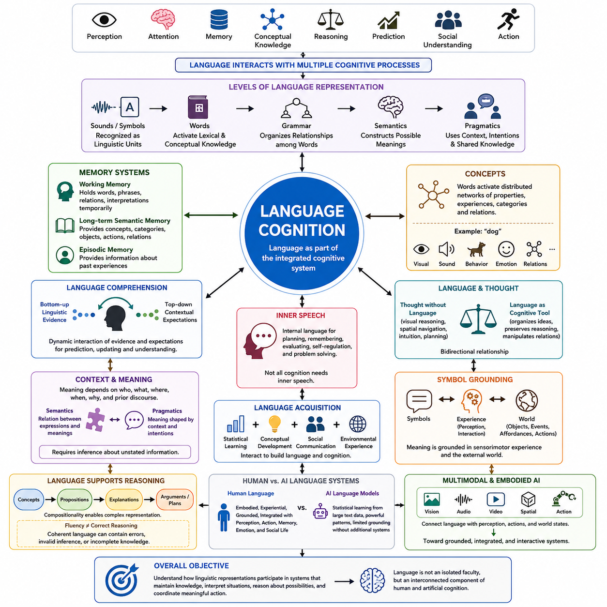
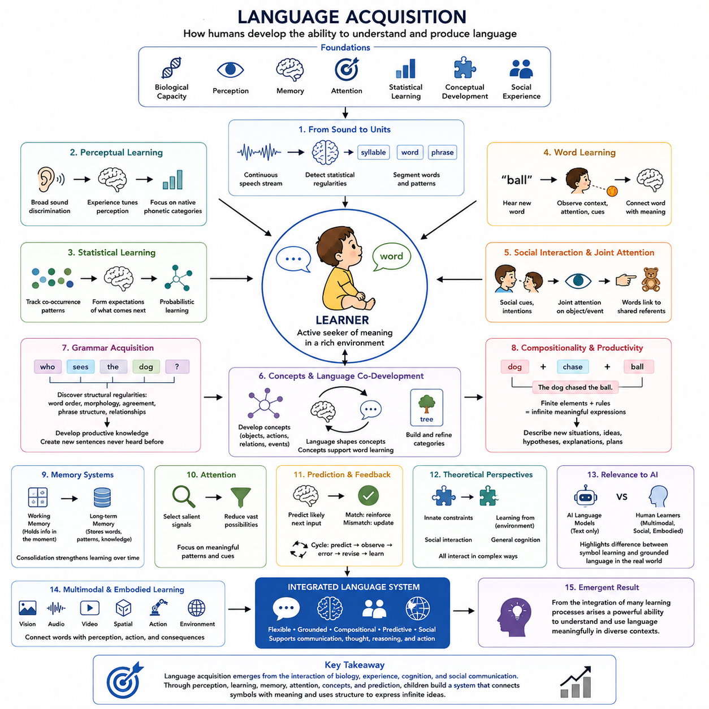
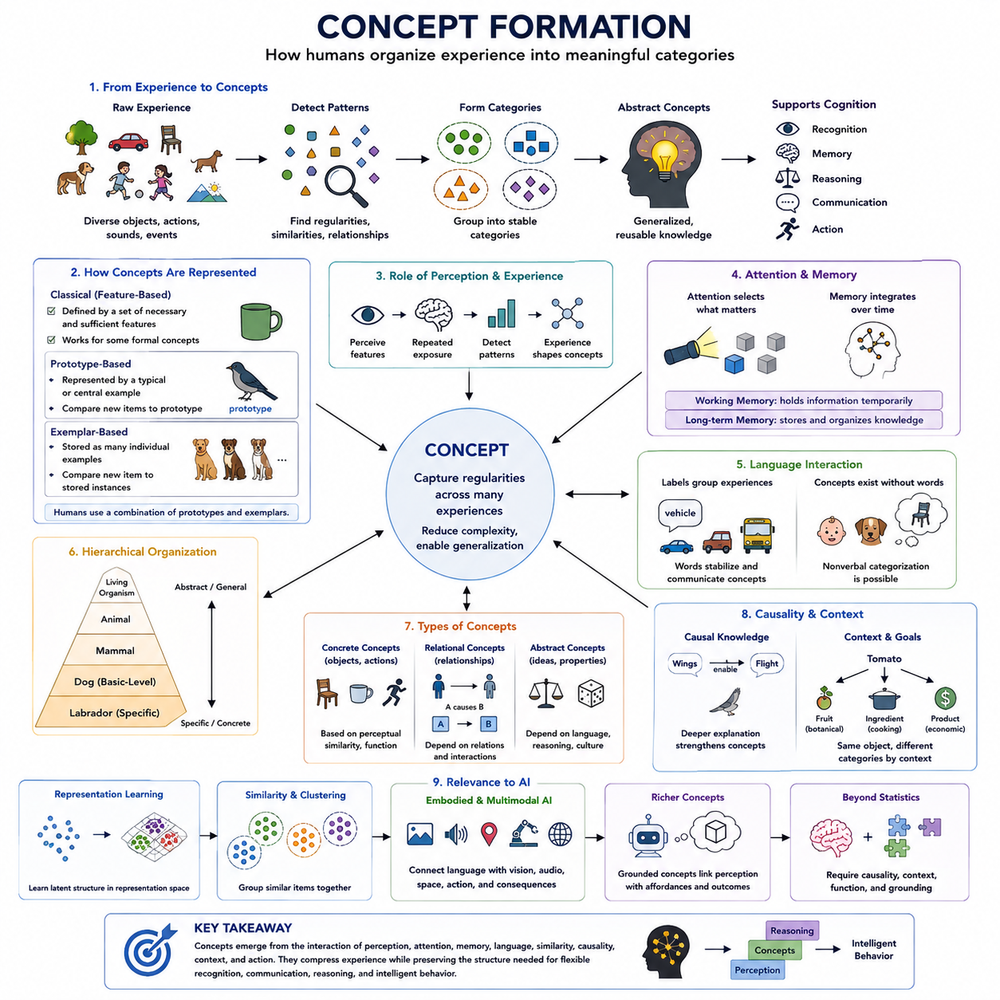
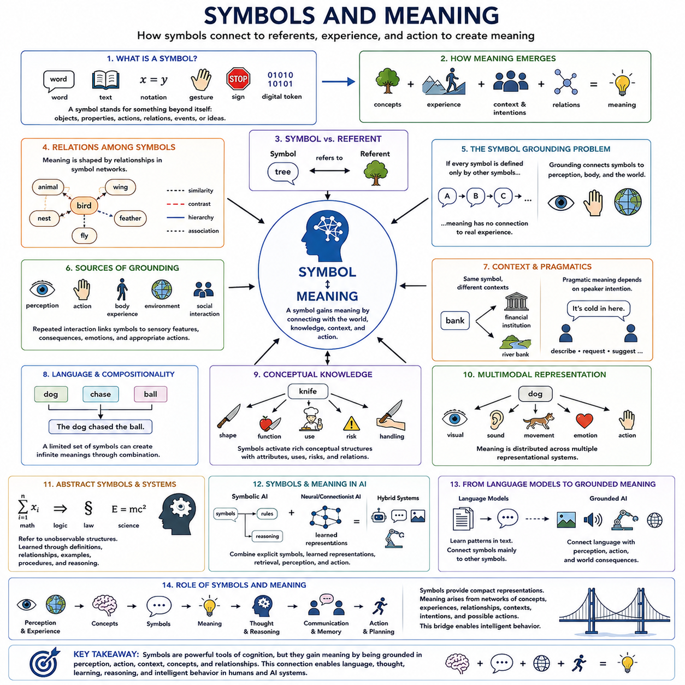
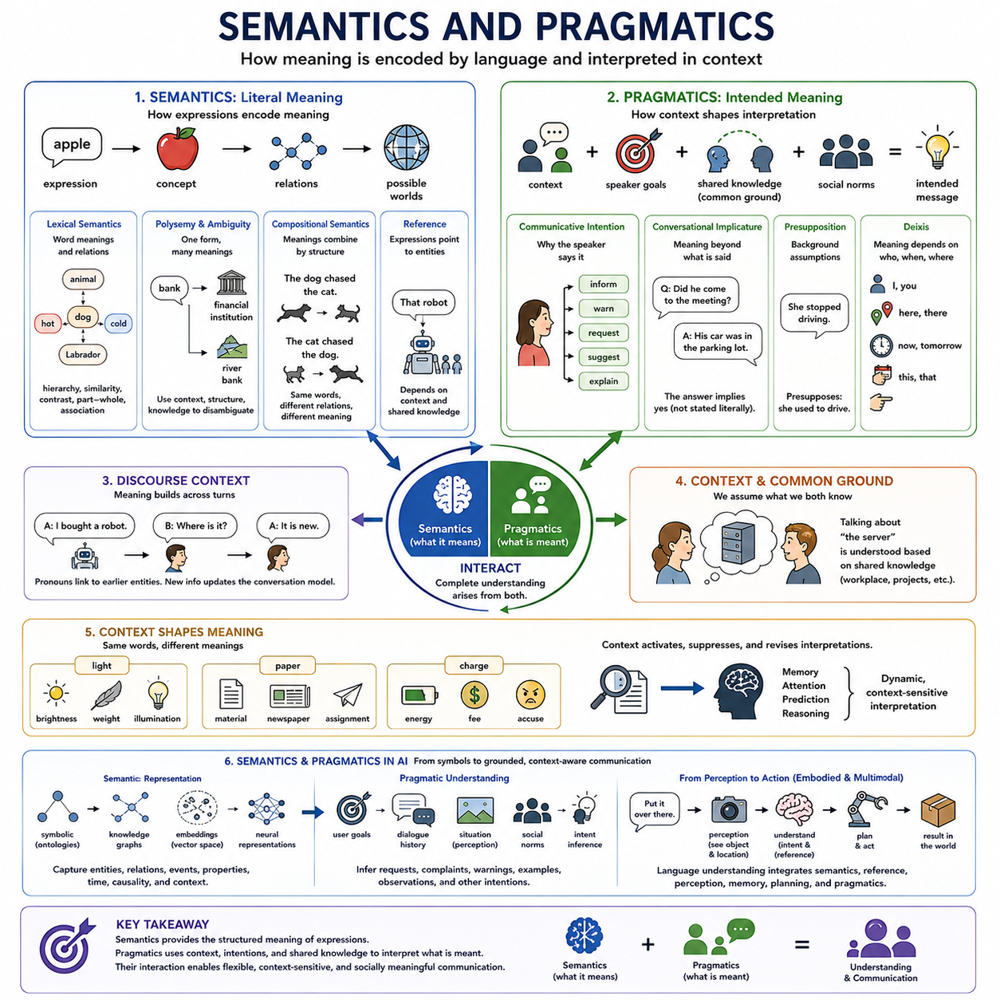
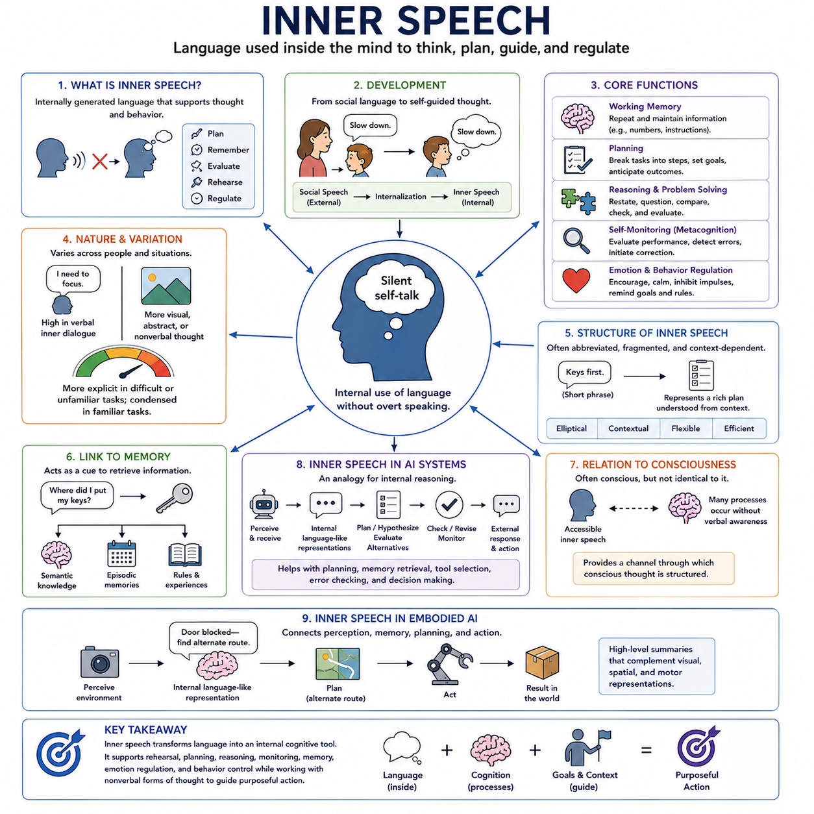
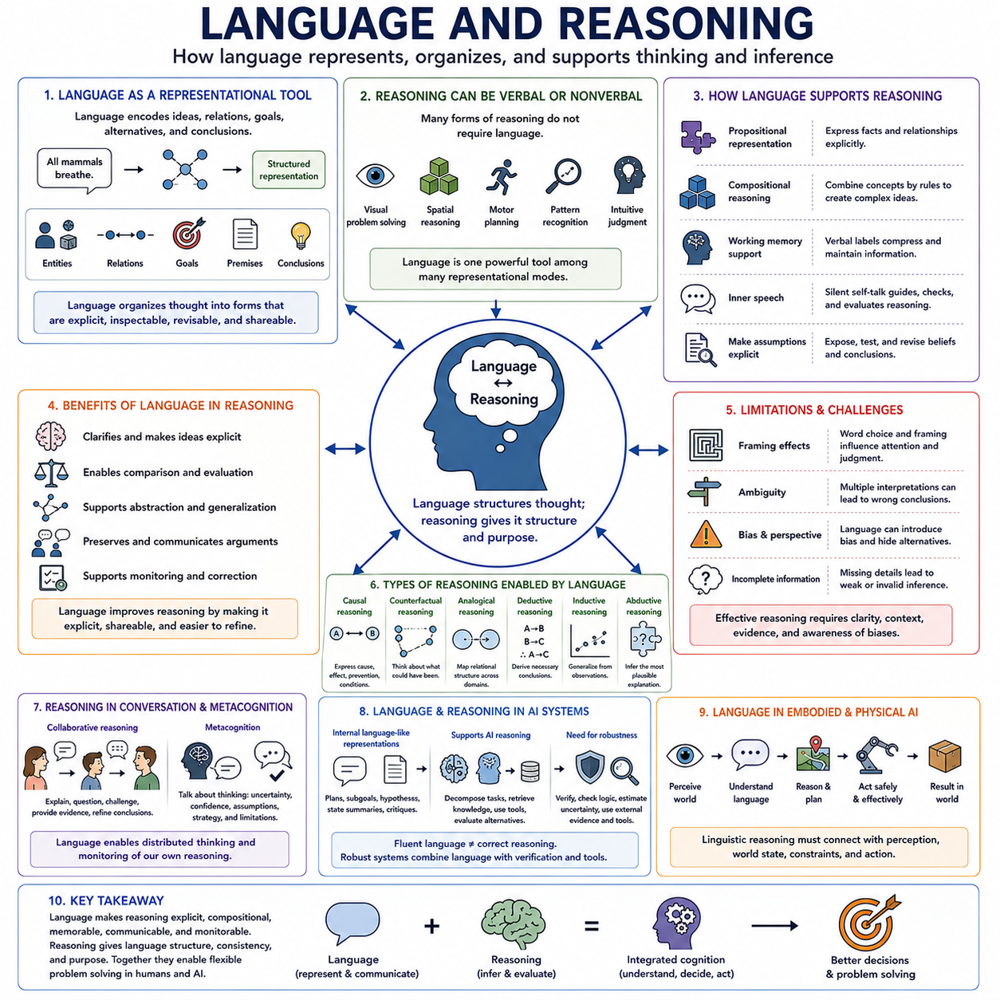
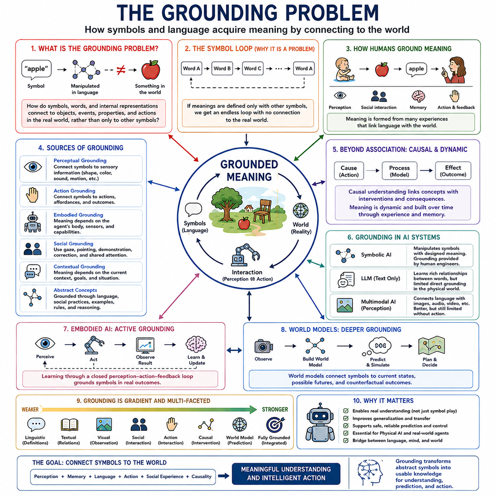
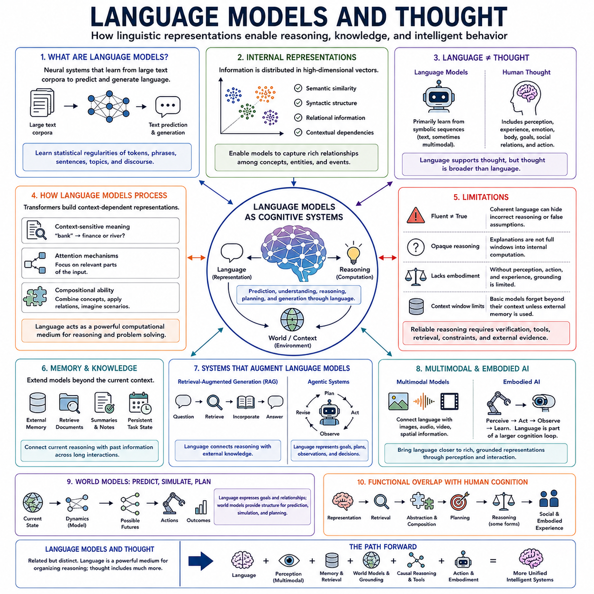
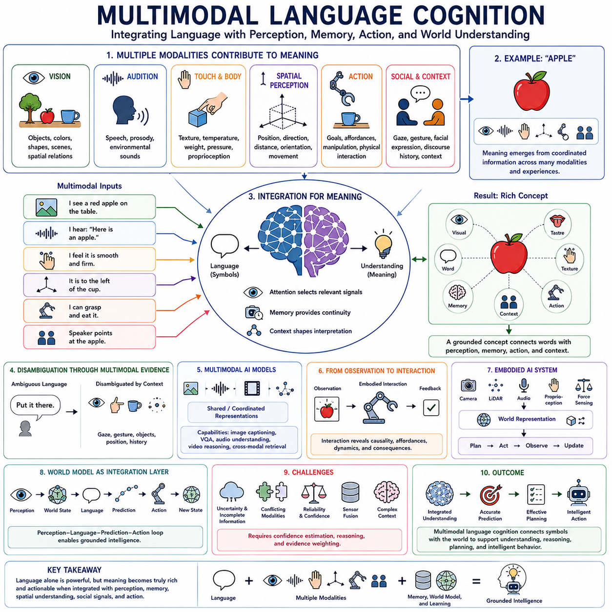

**Volume 43 Cognitive Science for AI**

# Chapter 04. Language and Thought

## 04.00 Language Cognition Overview

{width="7.268055555555556in" height="7.268055555555556in"}

언어 인지(Language Cognition)는 인간이 더 넓은 인지 시스템(Cognitive System)의 일부로서 언어(Language)를 습득하고, 표상하며, 이해하고, 생성할 수 있도록 하는 정신적 과정(Mental Processes)을 의미합니다. 언어는 단순히 단어를 교환하기 위한 메커니즘이 아닙니다. 언어는 지각(Perception), 기억(Memory), 주의(Attention), 개념적 지식(Conceptual Knowledge), 추론(Reasoning), 예측(Prediction), 사회적 이해(Social Understanding), 행동(Action)과 지속적으로 상호작용하며, 언어적 표현(Linguistic Expressions)을 통해 직접적인 경험뿐 아니라 추상적인 사고(Abstract Thought)까지 표상할 수 있도록 합니다.

인간의 언어(Human Language)는 서로 상호작용하는 여러 수준의 표상(Representation)을 통해 작동합니다. 소리(Sounds)나 시각적 기호(Visual Symbols)는 의미 있는 언어 단위(Linguistic Units)로 인식되고, 단어는 어휘적 지식(Lexical Knowledge)과 개념적 지식(Conceptual Knowledge)을 활성화하며, 문법적 구조(Grammatical Structures)는 단어 사이의 관계를 조직하고, 의미적 해석(Semantic Interpretation)은 가능한 의미를 구성합니다. 이후 화용적 과정(Pragmatic Processes)은 발화(Utterance)를 화자, 상황, 이전 담화, 공유 지식(Shared Knowledge), 의사소통 의도(Communicative Intention)와 연결하여 문맥(Context)에서 표현이 무엇을 의미하는지 결정합니다.

따라서 언어 이해(Language Comprehension)는 단순히 기호의 연속을 해독하는 것 이상의 과정을 포함합니다. 인지 시스템(Cognitive System)은 새롭게 입력되는 언어 정보(Linguistic Information)를 기대(Expectations) 및 이전에 습득한 지식과 지속적으로 결합합니다. 인간은 글을 읽거나 말을 들을 때 가능성이 높은 단어, 의미, 문장 구조를 예상하면서 새로운 정보가 입력됨에 따라 이러한 예측을 수정합니다. 따라서 이해(Comprehension)는 상향식 언어 증거(Bottom-up Linguistic Evidence)와 하향식 문맥적 기대(Top-down Contextual Expectations)가 상호작용하는 동적 과정(Dynamic Process)으로 이해할 수 있습니다.

기억(Memory)은 이러한 과정에 필수적인 기반 구조(Infrastructure)를 제공합니다. 작업 기억(Working Memory)은 문장이나 담화(Discourse)가 처리되는 동안 단어, 구절, 관계, 중간 해석(Intermediate Interpretations)을 일시적으로 유지합니다. 장기 의미 기억(Long-term Semantic Memory)은 개념, 범주, 객체, 행동, 관계에 관한 지식을 제공하며, 일화 기억(Episodic Memory)은 과거 경험에 관한 정보를 제공할 수 있습니다. 따라서 언어 인지(Language Cognition)는 독립된 하나의 언어 저장소에 의존하는 것이 아니라 여러 기억 시스템(Memory Systems)에 대한 조정된 접근(Coordinated Access)에 의존합니다.

개념(Concepts)은 언어(Language)와 사고(Thought)를 연결하는 중요한 다리 역할을 합니다. 일반적으로 단어는 고립된 상징적 객체(Symbolic Object)로 기능하지 않으며, 대신 관련된 속성, 경험, 범주, 관계로 구성된 분산된 네트워크(Distributed Network)를 활성화할 수 있습니다. 예를 들어 "개(Dog)"라는 개념은 시각적 형태, 움직임, 소리, 행동, 정서적 연관성(Emotional Associations), 의미적 관계(Semantic Relations)를 포함할 수 있습니다. 따라서 언어적 의미(Linguistic Meaning)는 부분적으로 기호(Symbols)와 연결된 개념적 구조(Conceptual Structures)에 의존합니다.

언어(Language)와 사고(Thought)의 관계는 양방향적(Bidirectional)이며 인지과학(Cognitive Science)의 핵심 문제로 남아 있습니다. 시각적 추론(Visual Reasoning), 공간 탐색(Spatial Navigation), 운동 계획(Motor Planning), 다양한 형태의 직관적 판단(Intuitive Judgment)에서 확인할 수 있듯이 명시적인 언어 표현 없이도 사고는 발생할 수 있습니다. 동시에 언어는 복잡한 아이디어를 조직하고, 추론의 중간 상태(Intermediate Reasoning States)를 유지하며, 범주를 설정하고, 관계를 보다 쉽게 조작하도록 도울 수 있습니다. 따라서 언어는 의사소통 시스템(Communication System)이면서 동시에 인지 도구(Cognitive Tool)로 기능할 수 있습니다.

내적 언어(Inner Speech)는 이러한 언어의 인지적 역할(Cognitive Role)을 특히 명확하게 보여줍니다. 인간은 계획을 세우거나, 지시를 기억하거나, 여러 대안을 평가하거나, 행동을 조절하거나, 어려운 문제를 해결하는 과정에서 내부적으로 생성된 언어를 자주 사용합니다. 이러한 내부 언어화(Internal Verbalization)는 모호한 표상을 보다 명시적인 구조로 변환하여 이를 검토하고 조작할 수 있도록 합니다. 그러나 모든 인지적 작동(Cognitive Operation)이 내적 언어를 필요로 하는 것은 아니며, 인지는 시각적, 공간적, 감각운동적(Sensorimotor), 정서적 및 기타 비언어적 표상(Nonlinguistic Representations)에도 크게 의존합니다.

의미(Meaning)는 또한 문맥(Context)에 강하게 의존합니다. 동일한 문장이라도 누가 말하는지, 이전에 어떤 일이 발생했는지, 참여자들이 무엇을 알고 있는지, 그리고 어떤 목표를 추구하는지에 따라 서로 다른 정보를 전달할 수 있습니다. 의미론(Semantics)은 언어 표현과 그 의미 사이의 관계를 설명하는 반면, 화용론(Pragmatics)은 문맥과 의사소통 의도(Communicative Intention)에 의해 의미가 어떻게 형성되는지를 다룹니다. 따라서 효과적인 언어 인지(Language Cognition)를 위해서는 명시적으로 표현되지 않은 정보에 대한 추론(Inference)이 필요합니다.

경험(Experience)에 대한 이러한 의존성은 기호 접지 문제(Symbol Grounding Problem)로 직접 연결됩니다. 언어적 기호(Linguistic Symbols)는 다른 기호들과 계속해서 연결될 수 있지만, 인간에게서 의미는 궁극적으로 언어를 지각(Perception), 신체적 상호작용(Bodily Interaction), 행동(Action), 사회적 경험(Social Experience), 외부 세계(External World)와 연결합니다. 인간은 무거움(Heavy), 깨지기 쉬움(Fragile), 가까움(Near), 뜨거움(Hot), 떨어짐(Falling)과 같은 개념을 물리적 상황에 대한 경험을 통해 부분적으로 이해합니다. 따라서 접지된 인지(Grounded Cognition)는 상징적 표상(Symbolic Representations)과 감각운동 경험(Sensorimotor Experience)의 관계를 강조합니다.

언어 습득(Language Acquisition)은 이러한 능력이 통계적 학습(Statistical Learning), 개념 발달(Conceptual Development), 기억(Memory), 주의(Attention), 사회적 의사소통(Social Communication), 환경적 경험(Environmental Experience)의 상호작용을 통해 어떻게 형성되는지를 보여줍니다. 어린이는 음성에서 규칙성을 발견하는 동시에 객체, 행동, 의도, 범주, 사회적 관계를 학습합니다. 따라서 언어 발달(Language Development)은 단순히 어휘와 문법 규칙을 암기하는 과정이 아니라 보다 광범위한 인지 발달(Cognitive Development)과 긴밀하게 연결되어 있습니다.

언어(Language)는 복잡한 관계를 표현할 수 있는 조합적 구조(Compositional Structures)를 제공함으로써 추론(Reasoning)을 지원합니다. 개별 개념은 명제(Propositions)로 결합되고, 명제는 설명(Explanations)으로 구성되며, 설명은 확장된 논증(Arguments)이나 계획(Plans)으로 발전할 수 있습니다. 이러한 조합적 능력(Compositional Capability)을 통해 제한된 어휘만으로도 매우 다양한 상황을 표현할 수 있습니다. 그러나 언어적 유창성(Linguistic Fluency)이 올바른 추론을 보장하는 것은 아니며, 일관성 있게 보이는 표현이라도 잘못된 가정, 타당하지 않은 추론(Invalid Inference), 불완전한 지식을 나타낼 수 있습니다.

이러한 관찰은 인간 인지(Human Cognition)와 인공 언어 시스템(Artificial Language Systems)을 비교할 때 특히 중요합니다. 현대 언어 모델(Language Models)은 대규모 언어 데이터에서 강력한 통계적 표상(Statistical Representations)을 학습하고 문맥에 민감한 시퀀스를 매우 유연하게 생성할 수 있습니다. 내부 표상(Internal Representations)은 다양한 의미적·관계적 규칙성을 포착하지만, 언어적 예측(Linguistic Prediction)만을 지속적인 경험, 지각, 행동, 체화된 상호작용(Embodied Interaction)을 포함하는 인간 인지의 전체 구조와 자동적으로 동일시해서는 안 됩니다.

멀티모달 인공지능(Multimodal Artificial Intelligence)은 언어를 이미지, 오디오, 비디오, 공간 정보(Spatial Information), 기타 감각 표상(Sensory Representations)과 연결함으로써 이러한 차이의 일부를 줄입니다. 체화된 시스템(Embodied Systems)은 언어적 지시를 환경 상태(Environmental State), 물리적 행동(Physical Actions), 그리고 그 결과와 연결함으로써 이러한 관계를 더욱 확장합니다. 인지적 관점에서 이러한 전환은 언어가 다른 텍스트 기호뿐 아니라 관찰 가능한 객체, 사건, 행동 가능성(Affordances), 행동, 변화하는 세계 상태(World States)와 연결된다는 점에서 중요합니다.

따라서 언어 인지(Language Cognition)는 인지과학(Cognitive Science)과 인공지능(Artificial Intelligence)을 연결하는 중요한 개념적 다리(Conceptual Bridge)를 제공합니다. 인간의 언어는 기호(Symbols), 개념(Concepts), 기억(Memory), 예측(Prediction), 문맥(Context), 추론(Reasoning), 경험(Experience)이 하나의 통합된 인지 과정(Integrated Cognitive Process)에서 어떻게 상호작용할 수 있는지를 보여줍니다. 따라서 인공지능의 더 깊은 목표는 단순히 유창한 문장을 생성하는 것이 아니라 언어적 표상이 지식을 유지하고, 상황을 해석하며, 가능성을 추론하고, 의미 있는 행동을 조정하는 시스템에 어떻게 참여할 수 있는지를 이해하는 것입니다.

이러한 광범위한 프레임워크(Framework)에 대한 이해는 언어 습득(Language Acquisition), 개념 형성(Concept Formation), 기호와 의미(Symbols and Meaning), 의미론과 화용론(Semantics and Pragmatics), 내적 언어(Inner Speech), 언어 기반 추론(Language-based Reasoning), 기호 접지(Symbol Grounding), 언어 모델(Language Models), 멀티모달 인지(Multimodal Cognition)를 살펴보기 위한 기초를 제공합니다. 이러한 주제들은 언어가 독립된 능력이라기보다 서로 연결된 인지 아키텍처(Cognitive Architecture)의 한 구성 요소임을 보여주며, 인간 지능(Human Intelligence)과 점점 더 높은 능력을 갖추어 가는 인공 시스템(Artificial Systems)을 함께 연구하기 위한 중요한 관점을 제공합니다.

## 04.01 Language Acquisition [w/Code]

{width="7.268055555555556in" height="7.268055555555556in"}

언어 습득(Language Acquisition)은 인간이 언어(Language)를 이해하고 생성하는 능력을 발달시키는 과정입니다. 이 과정은 생애 초기부터 시작되며 생물학적 능력(Biological Capacities), 지각(Perception), 기억(Memory), 주의(Attention), 통계적 학습(Statistical Learning), 개념 발달(Conceptual Development), 사회적 경험(Social Experience)의 상호작용을 통해 형성됩니다. 학습자는 단순히 단어와 문법 규칙을 암기하는 것이 아니라 언어적 패턴을 의미, 의도, 객체, 사건, 행동과 연결하는 시스템을 점진적으로 구축합니다.

영아(Infants)는 명확하게 분리된 단어와 문장이 아니라 연속적인 소리의 흐름(Continuous Stream of Sounds)으로 언어를 접합니다. 따라서 초기의 중요한 과제 가운데 하나는 음성 분절(Speech Segmentation), 즉 의미 있는 언어 단위가 어디에서 시작되고 끝나는지를 발견하는 것입니다. 반복적인 노출을 통해 학습자는 어떤 소리가 자주 함께 나타나는지와 같은 통계적 규칙성(Statistical Regularities)에 민감해지며, 이를 통해 연속적인 감각 입력에서 가능한 단어 경계와 반복되는 패턴을 발견합니다.

지각 학습(Perceptual Learning)은 이러한 초기 발달에서 중요한 역할을 합니다. 영아는 처음에는 주변에서 사용되는 언어에서 중요하지 않을 수도 있는 구별을 포함하여 매우 다양한 음성(Speech Sounds)을 구별할 수 있습니다. 경험이 축적되면서 지각은 자주 접하는 음성적 범주(Phonetic Categories)에 점차 맞추어집니다. 따라서 언어 습득(Language Acquisition)은 의사소통에 유용한 차이에 대한 민감성을 유지하면서 환경적 노출(Environmental Exposure)이 지각적 표상(Perceptual Representations)을 어떻게 변화시킬 수 있는지를 보여줍니다.

통계적 학습(Statistical Learning)은 개별적인 음성 수준을 넘어 확장됩니다. 학습자는 음절, 단어, 문법적 구성(Grammatical Constructions), 언어 요소 사이의 관계에 존재하는 규칙성을 암묵적으로 발견합니다. 자주 등장하는 패턴은 점차 예측 가능해지고, 이를 통해 인지 시스템(Cognitive System)은 다음에 무엇이 나타날 가능성이 높은지에 대한 기대를 형성합니다. 따라서 언어 학습은 축적된 경험이 가능한 해석을 점진적으로 제한하는 지속적인 확률적 학습(Probabilistic Learning)의 과정으로 이해할 수 있습니다.

단어 학습(Word Learning)은 언어적 기호(Linguistic Symbols)를 개념(Concepts)과 연결해야 하는 문제를 제시합니다. 새로운 단어를 들으면서 주변 환경을 관찰하더라도 동시에 여러 객체, 속성, 행동, 관계가 존재하기 때문에 그 단어의 의미가 하나로 결정되지는 않습니다. 학습자는 반복적인 관찰, 주의, 문맥적 단서(Contextual Cues), 기존의 개념적 지식(Conceptual Knowledge), 다른 사람과의 상호작용을 통해 이러한 모호성(Ambiguity)을 점진적으로 해결합니다. 따라서 어휘 발달(Vocabulary Growth)은 언어적 정보와 비언어적 정보 모두에 의존합니다.

사회적 인지(Social Cognition)는 언어 습득(Language Acquisition) 과정에서 특히 강력한 지침을 제공합니다. 학습자는 말을 해석할 때 다른 사람의 시선 방향(Gaze Direction), 몸짓(Gestures), 정서적 표현(Emotional Expressions), 대화의 타이밍(Conversational Timing), 의사소통 의도(Communicative Intentions)를 관찰합니다. 다른 사람이 익숙하지 않은 객체를 가리키면서 새로운 단어를 말한다면 공유된 주의(Shared Attention)는 그 표현이 가질 수 있는 의미의 범위를 제한할 수 있습니다. 따라서 언어 학습은 언어적 시퀀스에 대한 수동적 노출만으로 이루어지는 것이 아니라 사회적 상호작용(Social Interaction)에 근본적으로 내재되어 있습니다.

공동 주의(Joint Attention)는 언어, 지각, 사회적 이해가 어떻게 조정되는지를 보여줍니다. 두 사람은 동일한 객체나 사건에 주의를 기울이면서 서로의 주의가 공유되고 있다는 사실을 인식할 수 있습니다. 이를 통해 단어를 외부 세계의 지시 대상(Referents)과 연결할 수 있는 구조화된 학습 상황이 형성됩니다. 이러한 상호작용은 반복되는 감각적 패턴이었던 언어적 기호(Linguistic Symbols)를 객체, 속성, 행동, 의도, 사건과 연결된 의사소통적 표상(Communicative Representations)으로 변화시키는 데 도움을 줍니다.

개념 발달(Conceptual Development)과 언어 습득(Language Acquisition)은 지속적으로 서로에게 영향을 미칩니다. 어린이는 객체, 행위자, 행동, 공간적 관계, 수량, 인과적 사건에 대한 범주를 발달시키는 동시에 이러한 개념을 지칭하는 단어를 학습합니다. 기존 개념은 새로운 단어를 쉽게 해석하도록 돕고, 언어적 표지(Linguistic Labels)는 개념적 범주를 안정화하고 구별하며 재구성하는 데 도움을 줄 수 있습니다. 따라서 언어와 개념적 지식(Conceptual Knowledge)은 서로 상호작용하는 표상 시스템(Representational Systems)으로 함께 발달합니다.

문법 습득(Grammar Acquisition)은 언어 요소가 어떻게 결합될 수 있는지를 결정하는 구조적 규칙성(Structural Regularities)을 발견하는 과정입니다. 학습자는 점차 어순(Word Order), 형태론적 패턴(Morphological Patterns), 일치 관계(Agreement), 구 구조(Phrase Structure), 문장 구성 요소 사이의 관계에 민감해집니다. 학습자는 이전에 들었던 문장을 단순히 재생하는 것이 아니라 익숙한 요소들을 조합하여 이전에 한 번도 접하지 않았을 수 있는 표현을 만들어낼 수 있는 생산적 지식(Productive Knowledge)을 발달시킵니다.

이러한 생산성(Productivity)은 조합성(Compositionality)의 중요성을 보여줍니다. 제한된 수의 단어와 구조적 원리를 이용하여 매우 많은 수의 의미 있는 표현을 생성할 수 있습니다. 따라서 학습자는 개별 형태와 의미 사이의 연관성뿐 아니라 표상을 체계적으로 결합하는 메커니즘도 습득해야 합니다. 이러한 관계를 학습하면 언어는 익숙하지 않은 상황, 가상의 사건, 설명, 계획, 추상적 아이디어를 표현할 수 있는 유연한 표상 시스템(Flexible Representational System)이 됩니다.

기억(Memory)은 여러 시간 척도(Time Scales)에 걸쳐 언어 습득을 지원합니다. 작업 기억(Working Memory)은 즉각적인 처리 과정에서 소리, 단어, 구조적 관계를 일시적으로 유지하며, 장기 기억(Long-term Memory)은 어휘, 의미적 관계, 문법적 패턴, 축적된 언어 경험을 보존합니다. 반복적인 노출은 유용한 표상을 강화하고 기억 공고화(Memory Consolidation)는 시간이 지나면서 지식을 안정화할 수 있습니다. 따라서 언어 학습은 일시적인 처리(Temporary Processing)와 지속적인 표상(Persistent Representation)의 연속적인 상호작용에 의존합니다.

주의(Attention)는 언어 및 환경적 정보의 흐름 가운데 어떤 부분이 학습을 위해 충분히 처리될지를 결정합니다. 두드러진 소리, 반복되는 표현, 새로운 객체, 사회적 단서(Social Cues), 과제와 관련된 정보(Task-relevant Information)는 주의를 끌어 더 강한 학습 신호(Learning Signals)가 될 수 있습니다. 인지 자원(Cognitive Resources)은 제한되어 있기 때문에 선택적 주의(Selective Attention)는 언어적 형태와 의미 사이에 존재할 수 있는 방대한 연관성의 공간을 보다 작은 수의 가능성 높은 관계로 축소하도록 도와줍니다.

언어적 지식(Linguistic Knowledge)이 발달하면서 예측(Prediction) 역시 점점 더 중요해집니다. 경험이 많은 학습자는 앞선 문맥을 이용하여 가능성이 높은 소리, 단어, 문법 구조, 의미를 예상합니다. 예측이 새롭게 입력되는 정보와 일치하면 기존 표상이 강화될 수 있으며, 예측이 실패하면 그 차이가 기대를 수정하기 위한 신호가 될 수 있습니다. 따라서 언어 습득은 예측(Prediction), 관찰(Observation), 오류(Error), 표상 수정(Representational Revision)이 반복되는 적응적 순환(Adaptive Cycle)으로 이해할 수 있습니다.

서로 다른 이론적 관점(Theoretical Perspectives)은 이러한 발달의 배후에 있는 서로 다른 메커니즘을 강조합니다. 일부 접근법은 선천적 생물학적 제약(Innate Biological Constraints)과 특수화된 언어 능력을 강조하는 반면, 다른 접근법은 환경의 통계적 특성, 사회적 상호작용, 일반적인 인지 메커니즘(General Cognitive Mechanisms), 또는 이러한 요소들의 조합을 강조합니다. 현대 인지과학(Cognitive Science)은 이들을 서로 배타적인 설명으로 다루기보다 생물학적 준비성(Biological Preparedness), 학습, 경험, 개념적 지식, 의사소통이 어떻게 상호작용하는지를 점점 더 중요하게 연구합니다.

언어 습득(Language Acquisition)은 현대 학습 시스템이 표상(Representation), 예측(Prediction), 접지(Grounding), 일반화(Generalization)라는 유사한 문제를 다룬다는 점에서 인공지능(Artificial Intelligence)과 특히 관련이 있습니다. 언어 모델(Language Models)은 대규모 텍스트 말뭉치(Text Corpora)에서 광범위한 통계적 규칙성을 학습할 수 있지만, 인간 학습자는 지각, 사회적 상호작용, 물리적 경험, 의도적 의사소통을 포함하는 더욱 풍부한 신호를 받습니다. 이러한 비교는 언어적 기호 사이의 관계를 학습하는 것과 경험되는 세계 안에서 언어를 학습하는 것의 차이를 보여줍니다.

멀티모달 인공지능(Multimodal AI)과 체화된 인공지능(Embodied AI)은 더욱 풍부한 형태의 언어 학습으로 발전하기 위한 가능한 연결 경로를 제공합니다. 언어 입력이 이미지, 오디오, 비디오, 공간 상태(Spatial States), 행동, 환경적 결과(Environmental Consequences)와 결합되면 모델은 텍스트 간 예측(Text-to-text Prediction)을 넘어서는 관계를 학습할 수 있습니다. 로봇 시스템(Robotic Systems)은 접근(Approach), 잡기(Grasp), 무거움(Heavy), 장애물(Obstacle), 뒤쪽(Behind)과 같은 단어를 감각운동 경험(Sensorimotor Experience) 및 환경에서 관찰되는 변화와 연결함으로써 이 과정을 더욱 확장할 수 있습니다.

인지적 관점(Cognitive Perspective)에서 언어 습득(Language Acquisition)은 지능적 행동(Intelligent Behavior)이 하나의 고립된 메커니즘이 아니라 여러 학습 과정의 통합을 통해 어떻게 형성될 수 있는지를 보여줍니다. 지각(Perception)은 패턴을 식별하고, 주의(Attention)는 관련 신호를 선택하며, 기억(Memory)은 경험을 보존하고, 통계적 학습(Statistical Learning)은 규칙성을 추출합니다. 개념(Concepts)은 의미를 조직하고, 사회적 인지(Social Cognition)는 의도를 파악하며, 예측(Prediction)은 해석을 안내합니다. 이들의 상호작용을 통해 유연하고 접지된 언어 시스템(Grounded Linguistic System)이 점진적으로 형성됩니다.

따라서 언어 습득(Language Acquisition)에 대한 이해는 인지과학(Cognitive Science)과 인공지능(Artificial Intelligence) 모두에 중요한 기반을 제공합니다. 이는 기호(Symbols)가 개념 및 경험과 어떻게 연결될 수 있는지, 구조적 규칙성이 조합적 일반화(Compositional Generalization)를 어떻게 지원하는지, 그리고 예측과 상호작용을 통해 학습이 어떻게 지속될 수 있는지를 보여줍니다. 이러한 원리는 더 넓은 지능 아키텍처(Intelligence Architecture) 안에서 개념 형성(Concept Formation), 의미론(Semantics), 화용론(Pragmatics), 기호 접지(Symbol Grounding), 언어 모델(Language Models), 멀티모달 언어 인지(Multimodal Language Cognition)를 연구하기 위한 기반을 제공합니다.

## 04.02 Concept Formation [w/Code]

{width="7.268055555555556in" height="7.268055555555556in"}

개념 형성(Concept Formation)은 인간이 경험(Experiences)을 의미 있는 범주(Categories)로 조직하여 인식(Recognition), 기억(Memory), 추론(Reasoning), 의사소통(Communication), 행동(Action)을 지원할 수 있도록 하는 인지 과정(Cognitive Process)입니다. 개념(Concept)은 하나의 객체나 사건만을 나타내는 것이 아니라 여러 경험에서 공통적으로 나타나는 규칙성(Regularities)을 포착합니다. 동물(Animal), 도구(Tool), 위험(Danger), 움직임(Movement)과 같은 개념을 형성함으로써 인지는 복잡한 세계를 반복해서 활용할 수 있는 구조로 단순화합니다.

개념(Concepts)은 외형적 특성이 서로 다르더라도 인지 시스템(Cognitive System)이 다양한 사례를 동일한 범주(Category)의 구성원으로 처리할 수 있도록 합니다. 사람은 색상, 크기, 재료, 형태가 서로 다른 수많은 의자를 모두 의자로 인식할 수 있습니다. 이러한 능력은 중요하지 않은 차이는 무시하면서 관련된 유사성(Similarities)을 식별하는 것에 의존하며, 이를 통해 이미 경험한 구체적인 사례를 넘어 일반화(Generalization)할 수 있습니다.

초기의 이론들은 개념(Concepts)을 정의적 특징(Defining Features)의 집합으로 설명하는 경우가 많았습니다. 이러한 고전적 관점(Classical View)에 따르면 어떤 대상이 특정 범주에 속하는지는 필수적인 속성들의 집합을 가지고 있는지에 따라 결정됩니다. 이러한 표상은 일부 형식적 개념(Formal Concepts)을 설명하는 데 효과적이지만, 많은 자연적 범주(Natural Categories)는 완전히 명확한 경계를 가지지 않습니다. 일상적인 범주는 엄격한 정의보다는 정도의 차이, 유연성, 문맥(Context)의 영향을 받는 경우가 많습니다.

원형 이론(Prototype Theory)은 전형적이거나 중심적인 사례를 중심으로 범주 표상(Category Representation)을 설명합니다. 예를 들어 새(Bird)에 대한 엄격한 정의를 저장하는 대신, 인간은 깃털, 날개, 비행과 같이 자주 경험하는 특징을 기반으로 추상적인 표상(Abstract Representation)을 형성할 수 있습니다. 새로운 사례는 이러한 원형(Prototype)과 비교될 수 있으며, 그 결과 일반적인 특징을 적게 공유하는 특이한 구성원보다 매우 전형적인 구성원을 더 쉽게 인식할 수 있습니다.

사례 기반 이론(Exemplar-based Theories)은 범주가 기억된 개별 사례(Individual Examples)를 통해 표상된다는 다른 메커니즘을 제안합니다. 새로운 객체는 하나의 추상적인 원형과 비교되는 것이 아니라 이전에 경험한 여러 사례와 비교되어 분류됩니다. 실제 인간 인지(Human Cognition)는 원형과 유사한 요약 정보와 구체적인 사례 기억(Exemplar Memories)을 함께 사용할 수 있으며, 이를 통해 효율적인 일반화와 특이하거나 문맥에 의존하는 사례에 대한 민감성을 동시에 확보할 수 있습니다.

개념 형성(Concept Formation)은 지각적 경험(Perceptual Experience)에 크게 의존합니다. 객체, 행동, 소리, 공간적 관계, 사건에 반복적으로 노출되면 안정적인 범주로 묶을 수 있는 패턴이 나타납니다. 형태, 움직임, 기능, 상호작용의 유사성이 유용한 신호를 제공할 수 있습니다. 그러나 개념은 목표(Goals), 사전 지식(Prior Knowledge), 언어(Language), 사회적 학습(Social Learning), 인과적 이해(Causal Understanding)의 영향도 받기 때문에 지각만으로 충분하지는 않습니다.

주의(Attention)는 범주 학습(Category Learning) 과정에서 경험의 어떤 특징이 중요하게 처리되는지를 결정합니다. 학습자가 특정 차원에 반복적으로 주의를 기울이면 해당 차원은 형성되는 개념의 핵심 요소가 될 수 있습니다. 예를 들어 어떤 객체를 구별할 때는 색상이 중요하지만 다른 객체에서는 중요하지 않을 수 있으며, 기능이나 움직임이 더 중요한 특징이 될 수도 있습니다. 따라서 개념 형성은 관찰 가능한 모든 속성을 동일하게 처리하는 것이 아니라 선택적 학습(Selective Learning)을 포함합니다.

기억(Memory)은 개념이 시간에 따라 발달하는 데 필요한 연속성(Continuity)을 제공합니다. 개별 경험은 저장되고 비교되며 이전 지식과 점진적으로 통합됩니다. 의미 기억(Semantic Memory)은 범주와 관계에 관한 일반화된 정보를 보존하고, 일화 기억(Episodic Memory)은 특정 경험을 유지하여 기존 개념을 수정하거나 풍부하게 만들 수 있습니다. 반복적인 경험을 통해 개념적 지식(Conceptual Knowledge)은 더욱 안정화되는 동시에 새로운 정보에 따라 수정될 수 있는 능력을 유지합니다.

언어(Language)는 경험을 공유된 상징적 표상(Symbolic Representations) 아래 묶을 수 있는 언어적 표지(Labels)를 제공함으로써 개념 형성과 밀접하게 상호작용합니다. 이동수단(Vehicle), 감정(Emotion), 용기(Container)와 같은 단어를 학습하면 서로 다른 경험을 하나의 공통된 범주로 조직하도록 촉진할 수 있습니다. 그러나 영아, 동물, 비언어적 추론(Nonverbal Reasoning)에서도 의미 있는 범주화가 나타나기 때문에 개념이 전적으로 단어에 의존하는 것은 아닙니다.

그럼에도 언어적 표지(Linguistic Labels)는 개념적 경계(Conceptual Boundaries)를 재구성할 수 있습니다. 서로 다른 언어는 다른 언어 체계에서 상대적으로 덜 두드러지는 구별을 강조할 수 있으며, 이름을 부여하는 것은 특정 범주를 기억하고 의사소통하기 쉽게 만들 수 있습니다. 따라서 언어는 개념을 안정화하고 관계를 강조하며, 구성원이 지각적으로 직접 존재하지 않는 경우에도 추상적인 범주를 조작할 수 있도록 하는 인지 도구(Cognitive Tool)의 역할을 합니다.

개념(Concepts)은 또한 계층적 관계(Hierarchical Relationships)를 통해 조직됩니다. 하나의 특정 객체는 래브라도(Labrador), 개(Dog), 포유류(Mammal), 동물(Animal), 생명체(Living Organism)와 같이 여러 추상화 수준(Levels of Abstraction)에 동시에 속할 수 있습니다. 기본 수준 범주(Basic-level Categories)는 구체성과 일반성 사이에서 효율적인 균형을 제공하는 경우가 많으며, 더 넓거나 좁은 개념은 과제에 따라 세부적인 인식과 추상적 추론(Abstract Reasoning) 사이를 유연하게 이동할 수 있도록 합니다.

관계적 개념(Relational Concepts)과 추상적 개념(Abstract Concepts)은 개념 형성이 단순한 객체 분류를 훨씬 넘어선다는 사실을 보여줍니다. 원인(Cause), 소유권(Ownership), 공정성(Fairness), 거리(Distance), 위험(Risk), 의도(Intention), 확률(Probability)과 같은 개념은 눈에 보이는 물리적 특징만으로 표상될 수 없습니다. 이러한 개념은 관계, 반복되는 패턴, 사회적 경험, 언어, 추론에 의존합니다. 따라서 인간의 개념적 지식은 구체적인 현상과 비구체적인 현상 모두에 대한 구조화된 표상(Structured Representations)을 포함합니다.

인과적 지식(Causal Knowledge)은 서로 다른 속성들이 왜 함께 나타나는지를 설명함으로써 개념을 크게 강화할 수 있습니다. 새에게 날개가 있다는 사실을 단순히 반복적으로 암기하는 것보다 날개가 비행을 가능하게 하기 때문에 새가 날개를 가진다는 관계를 이해하는 것이 더욱 풍부한 표상(Richer Representation)을 제공합니다. 인과 구조(Causal Structure)에 기반한 개념은 단순한 통계적 유사성에만 의존하지 않고 관찰 가능한 특징들을 더 깊은 관계를 중심으로 조직하기 때문에 보다 효과적으로 일반화할 수 있습니다.

개념적 범주(Conceptual Categories)는 문맥(Context)과 목표(Goals)에도 민감합니다. 동일한 객체라도 사람이 무엇을 하려고 하는지에 따라 다르게 범주화될 수 있습니다. 토마토(Tomato)는 식물학적으로는 과일(Fruit), 실제 요리에서는 식재료(Cooking Ingredient), 경제적으로는 상품(Product)으로 처리될 수 있습니다. 이러한 유연성은 개념이 항상 고정된 상징적 용기(Symbolic Containers)가 아니라 과제 요구(Task Demands)에 따라 재구성될 수 있는 동적인 표상(Dynamic Representations)임을 보여줍니다.

인공지능(Artificial Intelligence)에서 개념 형성은 표상 학습(Representation Learning), 군집화(Clustering), 임베딩(Embeddings), 분류(Classification), 추상화(Abstraction)와 밀접하게 관련됩니다. 신경망 시스템(Neural Systems)은 유사한 입력이 표상 공간(Representation Space)의 서로 관련된 영역에 위치하도록 잠재 구조(Latent Structures)를 학습할 수 있습니다. 그러나 강건한 개념에는 인과 구조, 문맥 민감성(Context Sensitivity), 멀티모달 접지(Multimodal Grounding), 기능적 지식(Functional Knowledge)도 필요할 수 있기 때문에 통계적 유사성만으로 인간과 같은 개념적 이해가 보장되는 것은 아닙니다.

멀티모달 인공지능(Multimodal AI)과 체화된 인공지능(Embodied AI)은 언어를 시각(Vision), 오디오(Audio), 공간 정보(Spatial Information), 행동(Action), 환경적 결과(Environmental Consequences)와 연결하여 더욱 풍부한 개념을 학습할 수 있는 메커니즘을 제공합니다. 로봇(Robot)은 형태, 크기, 위치, 성공적인 행동, 실패한 시도, 그 결과 발생한 상태 변화를 관찰하면서 잡을 수 있음(Graspable)이라는 보다 접지된 개념(Grounded Concept)을 발달시킬 수 있습니다. 이러한 개념은 지각을 행동 가능성(Affordances)과 연결하여 예측, 계획, 제어에 직접 활용될 수 있습니다.

개념 형성(Concept Formation)은 지각(Perception)과 고차원 인지(Higher-level Cognition)를 연결하는 다리를 제공합니다. 원시적인 감각 경험(Raw Sensory Experiences)은 범주로 조직되고, 범주는 의미 기억(Semantic Memory)을 지원하며, 개념적 관계(Conceptual Relationships)는 언어와 추론을 위한 구조를 제공합니다. 지능 시스템(Intelligent Systems)에서 세부적인 관찰을 재사용 가능한 추상화(Reusable Abstractions)로 변환하는 과정은 한 상황에서 획득한 지식이 다른 상황의 해석과 행동을 안내하도록 한다는 점에서 필수적입니다.

따라서 개념 형성(Concept Formation)을 이해하는 것은 지능(Intelligence)이 유연한 행동에 필요한 구조를 잃지 않으면서 경험을 어떻게 압축하는지를 설명하는 데 도움이 됩니다. 개념은 지각(Perception), 주의(Attention), 기억(Memory), 언어(Language), 유사성(Similarity), 인과적 지식(Causal Knowledge), 문맥(Context), 행동(Action)의 상호작용을 통해 형성됩니다. 이러한 메커니즘은 인간과 인공지능 모두에서 기호와 의미(Symbols and Meaning), 의미론(Semantics), 추론(Reasoning), 접지(Grounding), 그리고 점점 더 구조화된 내부 표상(Internal Representations)의 발달을 위한 기반을 제공합니다.

## 04.03 Symbols and Meaning [w/Code]

{width="7.268055555555556in" height="7.268055555555556in"}

기호(Symbols)는 그 자체를 넘어 다른 무언가를 나타내는 표상 요소(Representational Elements)입니다. 말로 표현된 단어, 문자로 기록된 기호, 수학적 표기(Mathematical Notation), 몸짓(Gesture), 교통 표지(Traffic Sign), 디지털 토큰(Digital Token)은 객체, 속성, 행동, 관계, 사건 또는 추상적 아이디어를 가리킬 때 기호로 기능할 수 있습니다. 기호를 사용하면 인지는 현재 지각(Perception)에 직접 주어진 것뿐 아니라 부재하는 것, 가상적인 것, 일반화된 것, 상상된 것까지 표상할 수 있습니다.

의미(Meaning)는 기호가 개념(Concepts), 경험(Experiences), 문맥(Contexts), 의도(Intentions), 관계(Relationships)와 연결될 때 형성됩니다. 예를 들어 "나무(Tree)"라는 단어는 단순히 소리의 패턴이나 문자 자체만으로 의미를 갖는 것이 아닙니다. 그 의미는 시각적 형태, 생물학적 지식, 환경적 경험, 범주 구성원 관계(Category Membership), 언어적 관계(Linguistic Relationships)와 학습된 연관성에 의존합니다. 따라서 의미는 기호의 물리적 형태만으로 환원될 수 없습니다.

기호(Symbol)와 지시 대상(Referent)의 구분은 매우 중요합니다. 기호는 표상을 전달하는 수단(Representational Vehicle)이며, 지시 대상은 그 기호가 가리키는 객체, 사건 또는 개념입니다. 서로 다른 기호가 동일한 대상을 가리킬 수 있으며, 동일한 기호도 문맥에 따라 서로 다른 것을 나타낼 수 있습니다. 따라서 인간 인지는 기호 자체뿐 아니라 기호를 적절한 해석과 연결하는 대응 관계(Mapping Relationships)도 학습해야 합니다.

언어(Language)는 인간이 사용할 수 있는 가장 강력한 상징 체계(Symbolic Systems) 가운데 하나를 제공합니다. 단어는 구체적인 객체를 나타낼 수 있을 뿐 아니라 관계, 의도, 가능성, 감정, 원인, 규칙, 추상적 범주(Abstract Categories)를 표현할 수도 있습니다. 언어적 기호는 조합적(Compositional)으로 결합될 수 있기 때문에 제한된 어휘만으로도 매우 광범위한 의미를 생성할 수 있습니다. 이러한 특성은 언어를 의사소통, 기억, 추론, 계획, 지식 전달을 위한 유연한 시스템으로 만듭니다.

기호(Symbols)는 다른 기호와의 관계를 통해서도 의미를 획득합니다. 예를 들어 "새(Bird)"라는 단어는 동물(Animal), 날개(Wing), 비행(Flight), 둥지(Nest), 깃털(Feather)과 같은 개념과 연결됩니다. 이러한 의미적 관계(Semantic Relationships)는 유사성(Similarity), 대조(Contrast), 계층(Hierarchy), 연관성(Association)에 의해 의미가 부분적으로 결정되는 네트워크를 형성합니다. 따라서 상징 체계는 외부 객체와의 직접적인 연결뿐 아니라 표상들 사이의 내부 관계를 통해서도 구조를 형성합니다.

그러나 기호를 오직 다른 기호를 통해 정의하면 근본적인 문제가 발생합니다. 모든 단어의 의미를 추가적인 단어만으로 설명한다면 실제 경험(Actual Experience)과의 연결을 확립하지 못한 채 해석이 무한히 계속될 수 있습니다. 이러한 문제에서 기호 접지 문제(Symbol Grounding Problem)가 제기되며, 이는 상징적 표상(Symbolic Representations)이 궁극적으로 지각(Perception), 행동(Action), 신체적 경험(Bodily Experience), 외부 세계(External World)와 어떻게 연결되는지를 묻습니다.

접지(Grounding)는 기호와 감각 또는 운동 경험(Sensory or Motor Experience) 사이의 반복적인 상호작용을 통해 형성될 수 있습니다. "뜨겁다(Hot)"라는 단어를 배우는 어린이는 따뜻한 물체, 성인의 경고, 신체 감각, 회피 행동(Avoidance Behavior)을 함께 경험할 수 있습니다. 시간이 지나면서 이 기호는 지각적 특징, 예상되는 결과, 정서적 반응(Emotional Responses), 적절한 행동과 연결됩니다. 따라서 의미는 고립된 언어적 연관성에 머무르지 않고 더 넓은 인지 네트워크(Cognitive Network)에 포함됩니다.

지각(Perception)은 상징적 표상을 세계에서 관찰 가능한 속성과 연결함으로써 의미 형성에 기여합니다. 시각적 외형, 소리, 질감(Texture), 움직임, 공간적 위치(Spatial Position), 기타 감각적 특징은 단어와 개념의 해석을 지원할 수 있습니다. 그러나 많은 의미는 지각만으로 완전히 도출될 수 없습니다. 정의(Justice), 소유권(Ownership), 확률(Probability), 의무(Obligation), 의도(Intention)와 같은 추상적 개념은 감각적 경험뿐 아니라 관계적, 사회적, 언어적, 추론적 지식(Inferential Knowledge)을 필요로 합니다.

행동(Action)은 의미의 또 다른 중요한 차원을 제공합니다. 잡을 수 있음(Graspable), 움직일 수 있음(Movable), 위험함(Dangerous), 열 수 있음(Openable), 도달할 수 있음(Reachable)과 같은 개념은 특정 환경에서 행위자(Agent)가 무엇을 할 수 있는지와 밀접하게 관련됩니다. 이러한 행동 가능성은 흔히 행동 유도성(Affordances)으로 설명됩니다. 따라서 의미는 어떤 대상이 어떻게 보이는지만이 아니라 그것과 어떻게 상호작용할 수 있으며 서로 다른 행동으로 어떤 결과가 발생할 수 있는지도 포함할 수 있습니다.

문맥(Context)은 상징적 해석(Symbolic Interpretation)에 강한 영향을 미칩니다. 여러 의미를 가진 단어는 언어적 문맥과 사전 지식(Prior Knowledge), 상황적 정보를 결합하여 이해됩니다. 예를 들어 "은행(Bank)"이라는 단어는 금융 기관(Financial Institution)을 의미할 수도 있고 강둑(River Bank)을 의미할 수도 있습니다. 주변 단어, 현재의 목표, 물리적 환경, 대화의 이력(Conversational History)은 의도된 해석을 결정하는 데 도움을 줍니다. 따라서 의미는 하나의 상징적 형태에 영구적으로 고정된 것이 아니라 동적(Dynamic)입니다.

화용적 의미(Pragmatic Meaning)는 의사소통 의도(Communicative Intention)를 포함함으로써 문자 그대로의 의미적 내용(Literal Semantic Content)을 넘어섭니다. 예를 들어 "여기는 춥다(It is cold in here)"라는 문장은 온도를 설명하는 것일 수도 있고, 창문을 닫아 달라는 요청이거나 난방을 켜자는 제안일 수도 있습니다. 이러한 표현을 이해하려면 화자가 특정 상황에서 왜 그 표현을 사용했는지 추론해야 합니다. 따라서 기호는 문자적 의미, 문맥, 공유 지식(Shared Knowledge), 사회적 의도(Social Intention)의 상호작용을 통해 해석됩니다.

개념적 지식(Conceptual Knowledge)은 기호에 내부적인 인지 구조(Cognitive Structure)를 제공합니다. 하나의 기호가 개념을 활성화하면 관련된 속성, 범주, 기억, 기대, 인과적 관계(Causal Relationships)도 함께 활성화될 수 있습니다. 예를 들어 "칼(Knife)"의 의미에는 형태, 재료, 절단 기능(Cutting Function), 일반적인 사용법, 관련 위험, 적절한 취급 방법이 포함될 수 있습니다. 따라서 풍부한 의미(Rich Meaning)는 단순한 일대일 기호-객체 대응이 아니라 구조화된 개념적 표상(Structured Conceptual Representations)에 의존합니다.

의미(Meaning)는 여러 표상 시스템(Representational Systems)에 분산될 수도 있습니다. 하나의 개념은 언어적, 시각적, 공간적, 청각적, 정서적, 운동적 요소를 동시에 포함할 수 있습니다. 익숙한 동물을 기억할 때 그 동물의 이름, 외형, 소리, 움직임, 과거의 상호작용이 함께 활성화될 수 있습니다. 이러한 멀티모달 표상(Multimodal Representation)은 정보가 서로 다른 감각 채널을 통해 들어오거나 하나의 양식(Modality)을 일시적으로 사용할 수 없는 상황에서도 인간의 개념이 의미를 유지할 수 있는 이유를 설명하는 데 도움을 줍니다.

추상적 기호(Abstract Symbols)는 인지가 직접적인 경험을 넘어설 수 있는 능력을 보여줍니다. 수학적 표기(Mathematical Notation), 논리 연산자(Logical Operators), 법적 범주(Legal Categories), 과학적 변수(Scientific Variables)는 직접 지각할 수 없는 구조를 나타내는 경우가 많습니다. 이러한 기호의 의미는 정의, 관계, 사례, 절차, 반복적인 추론을 통해 학습됩니다. 일단 확립되면 이러한 상징 체계는 모든 기반 경험을 매번 다시 구성하지 않고도 복잡한 구조를 효율적으로 조작할 수 있도록 합니다.

인공지능(Artificial Intelligence)에서 기호와 의미는 역사적으로 상징주의적 방법(Symbolic Methods)과 연결주의적 방법(Connectionist Methods)을 통해 접근되어 왔습니다. 고전적 상징 인공지능(Classical Symbolic AI)은 명시적인 토큰, 논리적 규칙(Logical Rules), 구조화된 관계를 이용하여 지식을 표현했습니다. 반면 현대의 신경망 시스템(Neural Systems)은 데이터로부터 분산 표상(Distributed Representations)을 학습합니다. 이러한 접근법은 의미의 서로 다른 측면을 포착하며, 더욱 발전된 시스템은 명시적인 상징 구조와 학습된 표상, 검색(Retrieval), 지각, 행동을 결합할 수 있습니다.

대규모 언어 모델(Large Language Models)은 상징적 시퀀스(Symbolic Sequences)로부터 의미를 학습하는 것의 강력함과 한계를 동시에 보여줍니다. 방대한 데이터셋에서 언어적 패턴을 예측함으로써 이러한 모델은 의미적 및 관계적 규칙성(Semantic and Relational Regularities)에 대한 풍부한 표상을 획득합니다. 그러나 추가적인 양식이나 상호작용이 제공되지 않는다면 텍스트 기반 학습(Text-based Learning)은 주로 기호를 다른 기호와 연결합니다. 이러한 차이는 언어적 능력(Linguistic Competence)과 접지된 이해(Grounded Understanding)를 비교할 때 핵심적인 의미를 갖습니다.

멀티모달 인공지능(Multimodal AI)은 언어를 이미지, 오디오, 비디오, 공간 정보(Spatial Information), 기타 감각 데이터(Sensory Data)와 연결함으로써 상징적 의미를 확장합니다. 체화된 인공지능(Embodied AI)은 기호를 행동 및 환경적 결과(Environmental Consequences)와 연결하여 접지를 더욱 확장합니다. "상자 뒤로 이동하라(Move Behind the Box)"라는 명령을 학습하는 로봇은 언어 구조를 공간 지각, 계획(Planning), 이동(Movement), 그 결과 발생하는 상태 변화(State Changes)와 연결함으로써 보다 작동 가능한 형태의 의미(Operational Meaning)를 형성할 수 있습니다.

따라서 기호와 의미(Symbols and Meaning)는 언어(Language), 사고(Thought), 기억(Memory), 지각(Perception), 행동(Action)을 연결하는 핵심적인 다리를 형성합니다. 기호는 압축된 표상 구조(Compact Representational Structures)를 제공하며, 의미는 기호와 연결된 개념, 경험, 관계, 문맥, 가능한 행동의 네트워크에서 형성됩니다. 이러한 관계를 이해하는 것은 인간의 언어를 설명하는 데 필수적이며, 패턴 인식(Pattern Recognition)을 넘어 접지되고 문맥에 민감한 인지(Grounded and Context-sensitive Cognition)로 발전하는 인공지능 시스템을 설계하는 데에도 중요합니다.

## 04.04 Semantics and Pragmatics [w/Code]

{width="7.268055555555556in" height="7.268055555555556in"}

의미론(Semantics)은 언어적 표현(Linguistic Expressions)이 의미를 어떻게 부호화하고 조직하는지를 다루며, 화용론(Pragmatics)은 화자와 청자가 문맥(Context)을 이용하여 그러한 표현이 전달하려는 내용을 어떻게 해석하는지를 다룹니다. 이 두 영역은 언어 이해가 단순히 단어와 문법을 인식하는 것 이상을 요구하는 이유를 설명합니다. 인간의 의사소통은 표현과 개념 사이의 비교적 안정적인 관계뿐 아니라 상황, 목표, 공유 지식(Shared Knowledge), 사회적 기대(Social Expectations)에 의해 형성되는 유연한 해석에도 의존합니다.

의미 처리(Semantic Processing)는 단어와 문장을 개념(Concepts), 범주(Categories), 속성(Properties), 관계(Relations), 가능한 세계 상태(Possible States of the World)와 연결합니다. 예를 들어 "사과(Apple)"라는 단어는 과일, 형태, 맛, 색상, 음식, 생물학적 범주에 관한 지식을 활성화할 수 있습니다. 문장의 의미는 이러한 개념적 요소들이 어떻게 결합되는지에 따라 결정됩니다. 따라서 의미론은 언어적 형태가 객체, 행동, 속성, 사건, 관계를 표현할 수 있도록 하는 구조화된 표상(Structured Representations)을 제공합니다.

어휘 의미론(Lexical Semantics)은 개별 단어의 의미와 단어 사이의 관계에 초점을 맞춥니다. 단어들은 유사성(Similarity), 대립(Opposition), 계층(Hierarchy), 부분-전체 구조(Part--Whole Structure), 연관성(Association)을 통해 서로 관련될 수 있습니다. 동물(Animal), 개(Dog), 래브라도(Labrador)는 계층적 관계를 형성하며, 뜨거움(Hot)과 차가움(Cold)은 대립 관계를 나타냅니다. 이러한 관계는 의미 기억(Semantic Memory)을 조직하고 기존의 개념적 구조를 이용하여 새로운 언어 정보를 해석할 수 있도록 합니다.

많은 단어는 다의성(Polysemy)을 가지며, 이는 하나의 언어적 형태가 서로 관련되거나 관련되지 않은 여러 의미를 표현할 수 있음을 의미합니다. "은행(Bank)"은 금융 기관(Financial Institution)이나 강둑(River Bank)을 의미할 수 있으며, "머리(Head)"는 신체 부위, 지도자, 또는 물체의 윗부분을 나타낼 수 있습니다. 인간의 언어 이해는 어휘 지식(Lexical Knowledge)을 문장 구조, 담화 이력(Discourse History), 상황 정보(Situational Information), 가장 가능성 높은 해석에 대한 기대와 결합하여 이러한 모호성(Ambiguity)을 해결합니다.

조합적 의미론(Compositional Semantics)은 개별 요소의 의미가 결합되어 더 큰 의미를 생성하는 방법을 설명합니다. "개(Dog)", "쫓았다(Chased)", "고양이(Cat)"의 의미는 이들 사이의 문법적 관계에 따라 서로 다르게 기여합니다. "개가 고양이를 쫓았다(The Dog Chased the Cat)"와 "고양이가 개를 쫓았다(The Cat Chased the Dog)"는 동일한 단어를 포함하지만 서로 다른 사건을 표현합니다. 따라서 의미 해석(Semantic Interpretation)은 어휘뿐 아니라 언어 구조가 개념 사이의 관계를 어떻게 조직하는지에도 의존합니다.

지시(Reference)는 언어적 표현을 현실 세계 또는 가상의 담화(Imagined Discourse)에 존재하는 개체나 상황과 연결합니다. 대명사(Pronouns), 이름(Names), 기술 표현(Descriptions), 지시 표현(Demonstratives)은 무엇을 가리키는지 식별하기 위해 문맥적 정보(Contextual Information)에 의존하는 경우가 많습니다. 예를 들어 "저 로봇(That Robot)"이라는 표현은 공유된 지각적 또는 대화적 문맥이 필요합니다. 따라서 지시는 의미 표상(Semantic Representation)과 화용적 해석(Pragmatic Interpretation)이 완전히 분리된 시스템이 아니라 서로 상호작용한다는 것을 보여줍니다.

화용론(Pragmatics)은 문장의 문자적 의미(Literal Sentence Meaning)만으로 의도된 메시지를 완전히 결정할 수 없을 때 필수적입니다. 화자가 "문이 열려 있다(The Door Is Open)"라고 말하는 것은 단순히 사실을 전달하는 것일 수도 있고, 보안에 대해 경고하거나, 누군가에게 문을 닫아 달라고 요청하거나, 방이 추운 이유를 설명하는 것일 수도 있습니다. 청자는 대화 상황, 화자의 목표, 이전 상호작용, 참여자들이 공유한다고 가정되는 지식을 고려하여 의도된 해석을 추론합니다.

따라서 의사소통 의도(Communicative Intention)는 화용적 해석(Pragmatic Interpretation)의 핵심입니다. 인간은 일반적으로 발화(Utterances)를 고립된 문자열로 처리하지 않으며, 상대방이 특정 순간에 왜 특정 표현을 선택했는지를 추론합니다. 이를 위해서는 다른 사람의 믿음(Beliefs), 목표(Goals), 지식(Knowledge), 의도(Intentions)를 포함하는 마음의 모델(Models of Other Minds)이 필요합니다. 따라서 화용적 언어 이해는 사회적 인지(Social Cognition), 마음 이론(Theory of Mind), 추론(Inference), 예측(Prediction)과 밀접하게 연결됩니다.

대화 함축(Conversational Implicature)은 명시적으로 언급되지 않았지만 의사소통을 통해 전달되는 정보를 설명합니다. 누군가가 동료가 회의에 참석했는지를 질문했을 때 "그의 차가 주차장에 있었다(His Car Was in the Parking Lot)"라는 답을 받는다면, 이 응답은 참석 사실을 문자 그대로 진술하지 않지만 참석했을 가능성을 암시할 수 있습니다. 이러한 해석은 화자가 일반적으로 관련성 있고 유용한 정보를 제공한다는 가정에 의존하며, 청자는 이를 통해 명시적인 의미 내용을 넘어 추가적인 의미를 추론합니다.

전제(Presuppositions)는 암묵적 의미(Implicit Meaning)의 또 다른 사례를 제공합니다. "그녀는 운전을 그만두었다(She Stopped Driving)"라는 문장은 이 정보를 직접적으로 주장하지 않더라도 일반적으로 그녀가 이전에는 운전을 했다는 사실을 전제로 합니다. 따라서 언어적 표현은 청자가 해석 과정에 포함시키는 배경적 가정(Background Assumptions)을 도입할 수 있습니다. 이러한 가정을 이해하려면 문법적 구조와 공유된 문맥 지식(Shared Contextual Knowledge) 모두에 대한 민감성이 필요합니다.

직시(Deixis)는 의미가 참여자의 위치와 관점(Perspective)에 어떻게 의존하는지를 보여줍니다. "나(I)", "당신(You)", "여기(Here)", "저기(There)", "지금(Now)", "내일(Tomorrow)", "이것(This)", "저것(That)"과 같은 표현은 누가 말하고 있는지, 발화가 언제 이루어지는지, 참여자가 어디에 있는지를 알지 못하면 완전히 해석할 수 없습니다. 따라서 화용적 이해는 언어를 행위자(Agents), 시간(Time), 공간(Space), 주의(Attention)와 연결하는 현재 의사소통 상태(Current Communicative State)의 표상을 필요로 합니다.

담화 문맥(Discourse Context)은 여러 문장과 대화 순서(Conversational Turns)에 걸쳐 의미가 축적될 수 있도록 합니다. 대명사는 몇 문장 전에 소개된 개체를 가리킬 수 있으며, 이후의 진술이 앞선 문장의 해석을 수정할 수도 있습니다. 따라서 효과적인 이해를 위해서는 이전 담화에 대한 기억, 현재 활성화된 개체와 주제의 유지, 새로운 정보가 입력될 때 공유된 대화 모델(Shared Conversational Model)을 지속적으로 갱신하는 과정이 필요합니다.

공통 기반(Common Ground)이라고도 설명되는 공유 지식(Shared Knowledge)은 해석에 강한 영향을 미칩니다. 화자는 청자가 이미 알고 있다고 생각하는 모든 내용을 명시적으로 설명하지 않아도 되기 때문에 의사소통은 효율적으로 이루어질 수 있습니다. 두 동료가 "서버(The Server)"에 대해 이야기할 때 공유된 업무 환경을 바탕으로 어떤 시스템을 의미하는지 즉시 이해할 수 있습니다. 따라서 화용적 추론(Pragmatic Inference)은 참여자들이 서로 공유하고 있다고 판단되는 정보를 추정하는 과정에 부분적으로 의존합니다.

문맥(Context)은 어떤 의미적 구별(Semantic Distinctions)이 중요한지도 변화시킬 수 있습니다. "라이트(Light)"라는 단어는 주변의 대화 내용에 따라 밝기(Brightness), 무게(Weight), 또는 물리적인 광원(Source of Illumination)을 의미할 수 있습니다. 인간 인지는 문맥적 증거가 변화함에 따라 가능한 해석을 빠르게 활성화하고, 억제하며, 수정합니다. 따라서 의미는 사용과 독립적으로 검색되는 고정된 사전 항목(Dictionary Entry)이 아니라 동적으로 구성되는 표상(Dynamically Constructed Representation)으로 이해할 수 있습니다.

의미론(Semantics)과 화용론(Pragmatics)은 기억(Memory), 주의(Attention), 예측(Prediction), 추론(Reasoning)과 상호작용합니다. 의미 기억(Semantic Memory)은 개념적 지식을 제공하고, 주의는 관련 단서를 우선적으로 처리하며, 작업 기억(Working Memory)은 활성화된 해석을 유지하고, 예측 메커니즘(Predictive Mechanisms)은 가능성이 높은 의미를 예상합니다. 의도된 메시지를 불완전한 증거로부터 추론해야 할 때는 추론이 필요합니다. 따라서 언어 이해는 독립된 의미 모듈 하나가 아니라 여러 인지 과정의 조정을 통해 형성됩니다.

인공지능(Artificial Intelligence)에서 의미 표상(Semantic Representation)은 상징적 구조(Symbolic Structures), 온톨로지(Ontologies), 지식 그래프(Knowledge Graphs), 임베딩(Embeddings), 신경망 표상(Neural Representations)을 통해 연구되어 왔습니다. 현대 언어 모델(Language Models)은 많은 의미적 유사성과 문맥적 의존성을 포착하는 통계적 관계를 학습합니다. 그러나 강건하게 의미를 표상하기 위해서는 표면적인 단어 동시 출현(Word Co-occurrence)에만 의존하기보다 개체, 관계, 사건, 시간 구조(Temporal Structure), 인과적 지식(Causal Knowledge), 문맥을 구별할 수 있어야 합니다.

화용론(Pragmatics)은 적절한 해석이 사용자의 목표(User Goals), 대화 이력, 사회적 관습(Social Conventions), 상황적 문맥, 추론된 의도에 의존하는 경우가 많기 때문에 인공지능에 추가적인 과제를 제시합니다. 인공지능 비서(AI Assistant)는 하나의 진술이 요청(Request), 불만(Complaint), 경고(Warning), 가상의 사례(Hypothetical Example), 단순한 관찰(Observation) 가운데 무엇인지를 판단해야 할 수 있습니다. 따라서 성공적인 상호작용을 위해서는 문맥을 유지하고 현재의 의사소통 상황에 유용한 해석을 선택해야 합니다.

멀티모달 시스템(Multimodal Systems)과 체화된 시스템(Embodied Systems)은 언어를 지각(Perception) 및 행동(Action)과 연결함으로써 더욱 풍부한 화용적 문맥(Pragmatic Context)을 제공할 수 있습니다. "그것을 저쪽에 놓아라(Put It Over There)"라는 말을 듣는 로봇은 의도된 객체를 식별하고, 지시된 위치를 추론하며, 요청된 행동을 이해하고, 이를 안전하게 실행해야 합니다. 이러한 명령은 의미 표상, 지시 대상 해결(Reference Resolution), 공간 지각(Spatial Perception), 주의, 기억, 계획(Planning), 화용적 추론이 함께 작동해야 할 수 있음을 보여줍니다.

따라서 의미론과 화용론(Semantics and Pragmatics)은 언어적 의미(Language Meaning)의 상호 보완적인 두 가지 차원을 보여줍니다. 의미론은 표현, 개념, 가능한 상황 사이의 구조화된 관계를 제공하고, 화용론은 이러한 구조를 화자, 청자, 목표, 문맥, 공유 지식에 맞추어 조정합니다. 이들의 상호작용을 통해 인간과 지능 시스템(Intelligent Systems)은 문자 그대로의 언어적 형태를 넘어 유연하고, 문맥에 민감하며(Context-sensitive), 사회적으로 의미 있는 의사소통(Socially Meaningful Communication)을 수행할 수 있습니다.

## 04.05 Inner Speech [w/Code]

{width="7.268055555555556in" height="7.268055555555556in"}

내적 언어(Inner Speech)는 실제로 소리를 내어 말하지 않고 내부적으로 생성되는 언어 사용을 의미합니다. 사람들은 계획을 세우거나, 기억하거나, 평가하거나, 연습하거나, 행동을 조절하는 과정에서 이를 조용한 자기 대화(Silent Self-talk)로 경험하는 경우가 많습니다. 내적 언어는 언어적 표상(Linguistic Representations)이 진행 중인 인지 과정의 일부가 되도록 하며, 외부 언어를 사고를 조직하고 목표를 유지하며 행동을 안내할 수 있는 내부적 도구(Internal Tool)로 변환합니다.

내적 언어(Inner Speech)는 부분적으로 사회적 언어(Social Language)로부터 발달합니다. 어린 시절 보호자나 다른 사람과 이루어지는 언어적 상호작용은 점차 내면화(Internalization)되어 외부에서 제공되던 지시가 자기 주도적 인지 제어(Self-directed Cognitive Control)로 전환됩니다. 처음에는 다른 사람으로부터 "천천히 해(Slow Down)" 또는 "다시 확인해(Check Again)"라는 말을 듣던 어린이가 이후에는 비슷한 지침을 내부적으로 생성할 수 있습니다. 따라서 언어는 의사소통 시스템뿐 아니라 자기 조절(Self-regulation)을 위한 메커니즘이 됩니다.

내적 언어의 주요 기능 가운데 하나는 작업 기억(Working Memory)에서 정보를 유지하는 것입니다. 사람은 전화번호, 지시사항, 순서 또는 익숙하지 않은 단어를 짧은 시간 동안 활성 상태로 유지하기 위해 조용히 반복할 수 있습니다. 이러한 시연 과정(Rehearsal Process)은 다른 인지적 연산(Cognitive Operations)이 이루어지는 동안 정보를 일시적으로 유지하도록 지원합니다. 따라서 내적 언어는 빠르게 사라질 수 있는 언어 정보를 반복적으로 활성화함으로써 언어적 작업 기억(Verbal Working Memory)과 밀접하게 상호작용합니다.

계획(Planning)은 내적 언어가 사용되는 또 다른 중요한 영역입니다. 행동하기 전에 사람들은 가능한 단계들을 내부적으로 설명하거나, 여러 대안을 비교하거나, 결과를 예상하거나, 수행하려는 행동을 미리 연습하는 경우가 많습니다. 이러한 내부 언어 구조(Internal Verbal Structures)는 복잡한 과제를 더 작고 관리 가능한 구성 요소로 변환할 수 있습니다. 중간 목표(Intermediate Goals)를 명시적으로 표상함으로써 내적 언어는 작업 순서를 유지하고 진행 상황을 점검하며 중요한 단계를 잊을 가능성을 줄이는 데 도움을 줍니다.

내적 언어는 추론(Reasoning)과 문제 해결(Problem Solving)도 지원할 수 있습니다. 어려운 문제를 해결할 때 가정을 조용히 다시 표현하거나, 질문을 구성하거나, 관계를 확인하거나, 가능한 결론을 평가하는 것이 도움이 되는 경우가 많습니다. 언어화(Verbalization)는 암묵적 표상(Implicit Representations)을 보다 명시적으로 만들어 검토하기 쉽게 할 수 있습니다. 그러나 시각적, 공간적, 수학적, 직관적, 감각운동적(Sensorimotor) 사고도 내적 언어 없이 작동할 수 있기 때문에 추론이 전적으로 언어에 의존하는 것은 아닙니다.

자기 점검(Self-monitoring)은 내부 언어와 밀접하게 연결되어 있습니다. 사람은 "이것은 틀렸다(That Was Wrong)", "다른 방법을 시도해 보자(Try Another Way)", "이것은 확실하지 않다(This Seems Uncertain)"와 같은 표현을 내부적으로 사용하여 자신의 수행을 평가할 수 있습니다. 이러한 내부 피드백(Internal Feedback)은 의도한 결과와 실제 결과 사이의 불일치를 발견하고 수정을 시작할 수 있도록 합니다. 따라서 내적 언어는 인지가 자신의 현재 처리 과정 일부를 표상하고 평가하도록 함으로써 메타인지(Metacognition)에 참여합니다.

감정 및 행동 조절(Emotion and Behavioral Regulation)에도 내적 언어가 관여할 수 있습니다. 내부적인 언어적 진술은 지속적인 노력을 격려하거나, 충동적인 행동을 억제하거나, 스트레스 상황을 재해석하거나, 규칙과 장기 목표(Long-term Goals)를 상기시키는 데 사용될 수 있습니다. 이것이 감정이 주로 언어적인 현상이라는 의미는 아니지만, 언어는 감정적 해석과 행동 제어(Behavioral Control)에 영향을 줄 수 있는 구조화된 메커니즘을 제공합니다. 따라서 자기 지향적 언어(Self-directed Speech)는 즉각적인 충동과 숙고된 행동(Deliberate Action) 사이를 중재할 수 있습니다.

내적 언어는 사람과 상황에 따라 상당한 차이를 보입니다. 어떤 사람들은 빈번하고 상세한 내부 대화(Internal Dialogue)를 경험한다고 보고하는 반면, 다른 사람들은 시각적 심상(Visual Imagery), 추상적 표상(Abstract Representations), 비언어적 사고(Nonverbal Thought)에 더 크게 의존합니다. 동일한 사람에게서도 익숙한 과제를 수행할 때는 내적 언어가 매우 압축된 형태로 나타날 수 있으며, 어렵거나 익숙하지 않은 문제에서는 더욱 명시적으로 나타날 수 있습니다. 따라서 내부 언어는 여러 가지 사용 가능한 표상 방식(Representational Modes) 가운데 하나의 인지 전략으로 이해해야 합니다.

내적 언어의 구조는 일반적인 구어(Spoken Language)의 구조와 다를 수 있습니다. 화자와 청자가 동일한 인지 시스템(Cognitive System)이기 때문에 내부 표현에는 항상 완전한 문법적 문장이나 명시적인 지시 표현(Explicit References)이 필요하지 않습니다. 예를 들어 "열쇠 먼저(Keys First)"라는 짧은 표현은 문맥을 통해 이해되는 훨씬 풍부한 계획을 나타낼 수 있습니다. 따라서 내적 언어는 축약되고, 단편적이며, 문맥 의존적(Context-dependent)일 수 있으면서도 인지를 효과적으로 안내할 수 있습니다.

내적 언어는 기억 인출(Memory Retrieval)과도 상호작용합니다. 내부적으로 생성된 단어나 구절은 의미 지식(Semantic Knowledge), 일화 기억(Episodic Memories), 규칙, 과거 경험을 활성화하는 단서(Cues)로 기능할 수 있습니다. 예를 들어 어떤 위치를 기억할 때 주요 지형지물(Landmarks)의 이름을 조용히 떠올리거나 과거 사건과 관련된 언어적 설명을 재구성할 수 있습니다. 따라서 언어는 현재 목표(Current Goals)를 서로 다른 기억 시스템에 저장된 정보와 연결하는 인출 경로(Retrieval Pathways)를 제공할 수 있습니다.

내적 언어와 의식(Consciousness)의 관계는 복잡합니다. 내부적 언어화(Internal Verbalization)는 흔히 의식적으로 접근할 수 있기 때문에 숙고적 사고(Deliberate Thought)와 밀접하게 관련된 것처럼 보입니다. 그러나 많은 인지 과정은 언어적 자각(Verbal Awareness) 없이 발생하며, 일부 내부 언어 처리 역시 부분적으로 무의식적인 상태로 남아 있을 수 있습니다. 따라서 내적 언어 자체를 의식과 동일한 것으로 간주해서는 안 되지만, 의식적 인지가 구조화되는 과정을 비교적 쉽게 접근할 수 있도록 하는 중요한 통로를 제공할 수 있습니다.

인공지능(Artificial Intelligence)에서 내적 언어는 외부 응답이나 행동을 생성하기 전에 중간 표상(Intermediate Representations)을 생성하는 시스템의 내부 추론 과정(Internal Reasoning Processes)을 이해하기 위한 유사 개념을 제공합니다. 인공지능 에이전트(AI Agent)는 이후의 의사결정을 조정하기 위해 내부적인 과제 설명, 계획, 가설, 비판(Critiques), 상태 요약(State Summaries)을 생성할 수 있습니다. 이러한 메커니즘은 인간 내적 언어의 일부 기능과 유사하지만, 인공적인 중간 표상을 자동적으로 주관적 경험(Subjective Experience)으로 해석해서는 안 됩니다.

언어 모델(Language Models)과 에이전트형 시스템(Agentic Systems)은 내부 처리(Internal Processing)와 외부 의사소통(External Communication)을 분리함으로써 이점을 얻을 수 있습니다. 내부 표상은 계획, 도구 선택(Tool Selection), 기억 인출, 오류 확인(Error Checking), 대안 평가(Alternative Evaluation)를 지원할 수 있는 반면, 외부 출력은 간결하고 과제 중심적으로 유지될 수 있습니다. 이러한 아키텍처적 구분(Architectural Distinction)은 문제 해결에 사용되는 모든 중간 표상이 최종적으로 전달되는 응답의 일부가 될 필요는 없다는 중요한 인지 원리를 반영합니다.

체화된 인공지능(Embodied AI)에서는 내부적으로 생성된 언어와 유사한 표상(Language-like Representations)이 지각(Perception), 계획(Planning), 기억(Memory), 행동(Action)을 연결하는 데 도움을 줄 수 있습니다. 예를 들어 로봇은 "문이 막힘---대체 경로 탐색(Door Blocked---Find Alternate Route)"과 같은 압축된 내부 설명을 유지하여 지각된 상태를 수정된 계획과 연결할 수 있습니다. 이러한 표상은 기하학적, 시각적, 운동적 표상(Geometric, Visual, and Motor Representations)을 대체하는 것이 아니라 이를 보완하는 고수준 인지 요약(High-level Cognitive Summaries)으로 기능할 수 있습니다.

따라서 내적 언어(Inner Speech)는 언어가 개인 사이의 의사소통뿐 아니라 인지 내부에서도 어떻게 기능할 수 있는지를 보여줍니다. 내적 언어는 시연(Rehearsal), 계획(Planning), 추론(Reasoning), 자기 점검(Self-monitoring), 기억 인출(Memory Retrieval), 감정 조절(Emotional Regulation), 행동 제어(Behavioral Control)를 지원하면서 비언어적 표상(Nonverbal Representations)과 상호작용합니다. 인지과학(Cognitive Science)과 인공지능에서 이는 내부의 상징적 또는 언어 유사 구조(Symbolic or Language-like Structures)가 목표를 유지하고, 중간 상태를 조직하며, 대안을 평가하고, 목적 지향적 행동(Purposeful Action)을 안내하는 데 어떻게 기여할 수 있는지를 보여줍니다.

## 04.06 Language and Reasoning [w/Code]

{width="7.268055555555556in" height="7.268055555555556in"}

언어와 추론(Language and Reasoning)은 밀접하게 연결되어 있습니다. 언어(Language)는 전제(Premises), 관계(Relationships), 대안(Alternatives), 목표(Goals), 결론(Conclusions)을 표상하기 위한 구조화된 시스템을 제공하기 때문입니다. 사람들은 복잡한 문제를 명시적으로 표현하고, 중간 상태(Intermediate States)를 유지하며, 가능성을 비교하고, 논증(Arguments)을 전달하기 위해 단어와 문장을 자주 사용합니다. 언어 자체가 추론을 만들어내는 것은 아니지만, 인지적 연산(Cognitive Operations)을 검토하고 수정하며 공유하기 쉬운 형태로 조직할 수 있습니다.

추론(Reasoning)은 언어 없이도 이루어질 수 있습니다. 시각적 문제 해결(Visual Problem Solving), 공간 탐색(Spatial Navigation), 운동 계획(Motor Planning), 패턴 인식(Pattern Recognition), 직관적 판단(Intuitive Judgment)은 비언어적 표상(Nonverbal Representations)에 의존하는 경우가 많습니다. 사람은 그 과정을 말로 설명하지 않고도 물체를 정신적으로 회전시키거나 움직임을 예상할 수 있습니다. 따라서 언어는 사고의 유일한 기반이라기보다 더 넓은 추론 시스템 안에서 사용되는 강력한 표상 도구(Representational Tool) 가운데 하나로 이해해야 합니다.

언어가 제공하는 중요한 기능 가운데 하나는 명제적 표상(Propositional Representation)입니다. 언어적 표현은 "모든 포유류는 호흡한다(All Mammals Breathe)" 또는 "문이 잠겨 있다(The Door Is Locked)"와 같은 진술을 부호화하여 개체와 속성 사이의 관계를 명시적으로 표상할 수 있습니다. 이러한 명제(Propositions)는 함의(Implication), 부정(Negation), 논리곱(Conjunction), 조건적 추론(Conditional Reasoning)과 같은 논리 구조를 통해 연결될 수 있습니다. 따라서 언어는 직접 관찰할 수 없는 관계를 포함하는 추상적 추론(Abstract Reasoning)에 특히 유용합니다.

언어는 또한 조합적 추론(Compositional Reasoning)을 지원합니다. 복잡한 아이디어는 문법적 및 의미적 규칙(Grammatical and Semantic Rules)에 따라 단순한 개념들을 결합하여 구성할 수 있습니다. 하나의 문장은 누가 행동했는지, 무엇이 영향을 받았는지, 사건이 언제 발생했는지, 어떤 조건에서 발생했는지를 표상할 수 있습니다. 이러한 요소들을 체계적으로 재조합할 수 있기 때문에 언어는 완전한 경험의 형태로 이전에 접한 적이 없는 새로운 상황에 대해서도 추론할 수 있도록 합니다.

작업 기억(Working Memory)은 언어적 부호화(Linguistic Encoding)를 통해 이점을 얻을 수 있습니다. 언어적 표지는 복잡한 정보를 관리 가능한 단위로 압축할 수 있기 때문입니다. 객체나 사건의 모든 지각적 세부사항을 유지하는 대신, 인지는 더 큰 개념 구조를 활성화하는 짧은 표현을 사용할 수 있습니다. 이러한 압축(Compression)은 인지 부하(Cognitive Load)를 줄이고 다단계 추론(Multi-step Reasoning)을 수행하는 동안 가정, 목표, 중간 결론을 유지하기 쉽게 만들 수 있습니다.

내적 언어(Inner Speech)는 언어가 추론 과정에 직접 참여할 수 있도록 하는 메커니즘을 제공합니다. 사람들은 질문을 조용히 다시 구성하거나, 대안을 나열하거나, 제약 조건(Constraints)을 스스로 상기시키거나, 하나의 결론이 이전 정보로부터 타당하게 도출되는지를 평가하는 경우가 많습니다. 이러한 자기 지향적 언어(Self-directed Language)는 내부적인 추론 상태(Reasoning States)의 연속을 형성할 수 있습니다. 그러나 내적 언어는 일반적으로 시각적, 공간적, 정서적, 개념적 표상과 상호작용하며 이를 대체하지는 않습니다.

언어는 가정(Assumptions)을 명시적으로 만들어 추론을 향상시킬 수 있습니다. 암묵적인 믿음(Implicit Belief)은 언어적으로 표현되어 검토되기 전까지 인식되지 않을 수 있습니다. 주장이 언어로 표상되면 일관성(Consistency)을 비교하고, 반례(Counterexamples)를 통해 검토하며, 증거가 변화할 때 수정할 수 있습니다. 이러한 명시성(Explicitness)은 논증의 구조를 검토해야 하는 과학적 추론(Scientific Reasoning), 법적 논증(Legal Argument), 기술적 분석(Technical Analysis), 협력적 문제 해결(Collaborative Problem Solving)에서 중요합니다.

동시에 언어는 추론에 편향(Biases)을 도입할 수도 있습니다. 문제가 어떤 방식으로 표현되는지에 따라 어떤 특징에 주의를 기울이고 어떤 대안이 더 가능성 있게 보이는지가 달라질 수 있습니다. 동일한 결과라도 서로 다른 방식으로 설명하면 기본적인 사실이 동일한 경우에도 서로 다른 판단이 나타날 수 있습니다. 따라서 언어적 프레이밍(Linguistic Framing)은 언어가 단순히 추론을 전달하는 것이 아니라 추론이 작동하는 인지적 표상(Cognitive Representation) 자체를 형성할 수 있음을 보여줍니다.

모호성(Ambiguity)은 또 다른 어려움의 원인이 됩니다. 단어가 여러 의미를 가질 수 있고 관계가 충분히 명시되지 않을 수 있기 때문에 하나의 문장이 여러 가지 해석을 허용할 수 있습니다. 초기 해석이 잘못되면 이후의 추론이 내부적으로는 일관성을 유지하면서도 부적절한 결론에 도달할 수 있습니다. 따라서 효과적인 추론을 위해서는 의미적 모호성 해소(Semantic Disambiguation), 문맥적 해석(Contextual Interpretation), 그리고 경우에 따라 추론을 시작하기 전의 명시적인 확인(Explicit Clarification)이 필요합니다.

언어는 원인(Cause), 결과(Consequence), 예방(Prevention), 가능 조건(Enabling Conditions), 반사실적 대안(Counterfactual Alternatives)과 같은 관계를 표현할 수 있기 때문에 인과적 추론(Causal Reasoning)에 특히 유용합니다. "센서가 고장 나면 로봇이 정지할 수 있다(If the Sensor Fails, the Robot May Stop)"와 같은 문장은 가능한 결과에 대해 검증할 수 있는 의존 관계를 표상합니다. 따라서 언어 구조는 관찰된 사건을 인과적 가설(Causal Hypotheses)로 변환하고 설명, 예측(Prediction), 개입(Intervention)을 지원할 수 있습니다.

반사실적 추론(Counterfactual Reasoning) 역시 표상의 유연성(Representational Flexibility)에 크게 의존합니다. 언어는 "도로가 막히지 않았다면 차량은 더 일찍 도착했을 것이다(If the Road Had Been Clear, the Vehicle Would Have Arrived Earlier)"와 같이 현재 사실이 아닌 상황을 표현할 수 있습니다. 이러한 표현을 통해 실제 사건과 상상된 대안(Imagined Alternatives)을 비교할 수 있습니다. 이러한 추론은 실패로부터의 학습, 책임 판단, 미래 행동 계획, 가능한 의사결정의 평가를 지원합니다.

유추적 추론(Analogical Reasoning)은 언어적 설명이 중요하지 않은 표면적 세부사항을 무시하면서 관계적 구조(Relational Structure)를 강조할 수 있기 때문에 언어로부터 도움을 받을 수 있습니다. 외형적으로 매우 다른 두 상황도 제한된 자원을 둘러싼 경쟁이나 피드백(Feedback)을 통한 제어와 같은 동일한 추상적 관계를 공유할 수 있습니다. 이러한 구조에 이름을 부여함으로써 언어는 익숙한 영역의 지식을 익숙하지 않은 문제로 전이(Transfer)하고 보다 일반적인 형태의 추상화(Abstraction)를 수행하도록 돕습니다.

대화 속 추론(Reasoning in Conversation)은 사회적 차원(Social Dimension)을 추가합니다. 화자들은 주장을 설명하고, 가정을 반박하거나 검토하며, 증거를 요청하고, 다른 참여자의 반응에 따라 결론을 수정합니다. 대화를 통해 추론은 전적으로 개인 내부에 머무르지 않고 여러 사람에게 분산될 수 있습니다. 따라서 언어는 부분적인 지식, 서로 다른 관점, 중간 결론을 교환하고 통합할 수 있도록 하여 협력적 지능(Collaborative Intelligence)을 지원합니다.

메타인지(Metacognition) 역시 언어의 지원을 받을 수 있습니다. 사람들은 "확실하지 않다(I Am Not Sure)" 또는 "이 결론은 저 가정에 의존한다(This Conclusion Depends on That Assumption)"와 같은 표현을 사용하여 불확실성(Uncertainty), 확신(Confidence), 혼란(Confusion), 추가 증거의 필요성을 설명할 수 있습니다. 이러한 표현은 추론 과정 자체를 평가의 대상으로 만들 수 있습니다. 따라서 언어는 추론의 품질을 점검하고, 한계를 인식하며, 문제 해결 전략을 의도적으로 조정하도록 지원할 수 있습니다.

인공지능(Artificial Intelligence)에서 언어와 추론의 관계는 현대 언어 모델(Language Models)과 에이전트형 시스템(Agentic Systems)의 핵심적인 주제입니다. 대규모 언어 모델(Large Language Models)은 중간 언어 표상(Intermediate Linguistic Representations)을 생성하고, 대안을 비교하며, 과제를 분해하고, 구조화된 설명을 생성할 수 있습니다. 이러한 능력은 언어와 유사한 표상이 복잡한 계산을 조정할 수 있음을 보여주지만, 유창한 언어 출력(Fluent Verbal Output)을 모든 내부 추론이 정확하다는 증거로 자동적으로 간주해서는 안 됩니다.

언어 모델(Language Models)은 신뢰할 수 있는 추론 대신 통계적 패턴 완성(Statistical Pattern Completion)에 의존할 경우 추론 오류(Reasoning Errors)를 생성할 수 있습니다. 응답은 일관성 있게 보이면서도 잘못된 가정, 누락된 제약 조건, 타당하지 않은 논리적 단계에 의존할 수 있습니다. 따라서 강건한 인공지능 추론(Robust AI Reasoning)을 위해서는 언어 생성에만 의존하지 않고 검증(Verification), 검색(Retrieval), 도구 사용(Tool Use), 구조화된 상태 표상(Structured State Representation), 불확실성 추정(Uncertainty Estimation), 외부 증거(External Evidence)와의 상호작용을 위한 메커니즘이 필요합니다.

에이전트형 인공지능(Agentic AI)은 언어를 고수준 제어 표상(High-level Control Representation)으로 사용할 수 있습니다. 에이전트(Agent)는 사용자의 목표를 하위 목표(Subgoals)로 변환하고, 과제 설명을 유지하며, 관련 기억을 검색하고, 관찰 결과를 평가하며, 압축된 언어 상태(Compact Linguistic States)를 이용하여 계획을 갱신할 수 있습니다. 이러한 표상은 지각, 검색, 계산, 행동을 담당하는 전문화된 모듈(Specialized Modules)을 조정할 수 있습니다. 따라서 언어는 서로 다른 인지 및 계산 과정 사이를 연결하는 인터페이스(Interface)가 됩니다.

체화된 인공지능(Embodied AI)과 피지컬 인공지능(Physical AI)에서 언어 기반 추론(Language-based Reasoning)은 궁극적으로 세계 상태(World State) 및 행동(Action)과 연결되어야 합니다. "깨지기 쉬운 상자를 장애물 주위로 이동시켜라(Move the Fragile Package Around the Obstacle)"라는 명령을 해석하는 로봇은 의미적 이해(Semantic Understanding)를 지각, 공간 추론(Spatial Reasoning), 행동 유도성(Affordances), 안전 제약(Safety Constraints), 동작 계획(Motion Planning)과 결합해야 합니다. 내부 표상이 물리적 환경의 조건과 결과에 접지(Grounded)되지 않는다면 언어적 추론만으로는 충분하지 않습니다.

따라서 언어와 추론(Language and Reasoning)은 상호 보완적인 관계를 가집니다. 언어는 다양한 형태의 추론을 명시적이고, 조합 가능하며, 기억하기 쉽고, 전달 가능하며, 점검하기 쉬운 형태로 만들어 주고, 추론은 언어적 표상에 구조, 일관성, 목적을 제공합니다. 이들의 상호작용은 언어가 기억(Memory), 지각(Perception), 인과적 지식(Causal Knowledge), 불확실성(Uncertainty), 행동(Action)과 통합될 때 가장 강력해지며, 이를 통해 유연한 문제 해결(Flexible Problem Solving)이 가능한 더 넓은 인지 시스템(Cognitive System)을 형성합니다.

## 04.07 Grounding Problem [w/Code]

{width="7.268055555555556in" height="7.268055555555556in"}

접지 문제(Grounding Problem)는 기호(Symbols), 단어(Words), 내부 표상(Internal Representations)이 단순히 다른 기호들과 연결되는 것을 넘어 실제 세계(World)와 연결된 의미(Meaning)를 어떻게 획득하는지를 묻는 문제입니다. 어떤 시스템이 언어 안에서 "사과(Apple)"라는 단어를 올바르게 조작할 수 있다고 하더라도, 그것만으로는 그 기호가 시각적 외형, 맛, 촉감, 행동 또는 실제 사과와 어떻게 연결되는지를 설명할 수 없습니다. 접지(Grounding)는 표상(Representation)과 경험된 현실(Experienced Reality) 사이의 연결을 다룹니다.

의미(Meaning)를 오직 상징적 관계(Symbolic Relationships)를 통해 정의할 때 접지 문제는 더욱 명확하게 나타납니다. 하나의 단어 의미를 전적으로 다른 단어들을 이용하여 설명하고, 다시 그 단어들을 추가적인 기호들로 설명한다면 시스템은 끝없이 이어지는 정의의 네트워크(Network of Definitions)에 빠질 수 있습니다. 이러한 관계는 내부적으로 일관성을 가질 수 있지만, 그것만으로 외부의 객체, 사건, 속성 또는 행동과의 연결이 자동적으로 형성되는 것은 아닙니다.

인간 인지(Human Cognition)는 언어(Language)를 지각(Perception), 기억(Memory), 행동(Action), 감정(Emotion), 사회적 상호작용(Social Interaction)과 연결함으로써 순환적인 기호 정의만으로 의미를 구성하는 문제를 피합니다. "빨강(Red)"을 배우는 어린이는 색이 있는 표면, 언어적 표지(Verbal Labels), 다른 사람의 주의, 범주적 대비(Category Contrasts)를 반복적으로 경험합니다. 시간이 지나면서 단어는 지각적 패턴(Perceptual Patterns)과 개념적 지식(Conceptual Knowledge)에 연결됩니다. 따라서 의미는 하나의 상징적 정의에 저장되는 것이 아니라 여러 형태의 경험에 걸쳐 분산됩니다.

지각적 접지(Perceptual Grounding)는 기호를 감각 정보(Sensory Information)와 연결합니다. 형태, 색상, 소리, 움직임, 질감, 거리, 위치를 나타내는 단어들은 시각적, 청각적, 촉각적, 공간적 경험에서 반복적으로 나타나는 패턴과 연결될 수 있습니다. 예를 들어 "구르기(Rolling)"라는 접지된 개념(Grounded Concept)은 구르기가 무엇인지 설명하는 언어적 문장만이 아니라 관찰된 운동 궤적(Motion Trajectories)과 객체 상태의 변화(Object Changes)를 포함할 수 있습니다.

행동 접지(Action Grounding)는 의미에 또 다른 중요한 차원을 추가합니다. 많은 개념은 행위자(Agent)가 객체에 대해 무엇을 할 수 있는지, 그리고 그 결과 환경(Environment)이 어떻게 변화하는지와 관련되어 있습니다. 잡을 수 있음(Graspable), 움직일 수 있음(Movable), 열 수 있음(Openable), 깨지기 쉬움(Fragile), 위험함(Dangerous)과 같은 의미는 가능한 상호작용과 그 결과를 포함합니다. 행동을 통해 기호는 세계에 대한 수동적인 설명에 머무르지 않고 행동 유도성(Affordances), 제어 정책(Control Policies), 성공, 실패, 결과와 연결됩니다.

체화된 인지(Embodied Cognition)는 의미가 행위자의 능력과 물리적 형태(Physical Form)에 의존할 수 있다는 점을 강조하면서 이러한 개념을 확장합니다. "도달할 수 있음(Reachable)"이라는 개념은 어린이, 성인, 이동 로봇(Mobile Robot), 로봇 매니퓰레이터(Robotic Manipulator)에게 서로 다를 수 있습니다. 이들의 신체와 행동 범위(Action Ranges)가 서로 다르기 때문입니다. 따라서 접지는 부분적으로 행위자 상대적(Agent-relative)이며, 의미 있는 표상은 센서(Sensors), 액추에이터(Actuators), 체화(Embodiment), 상호작용 가능성에 의존할 수 있습니다.

사회적 상호작용(Social Interaction) 역시 접지에 기여합니다. 인간은 물리적 세계를 관찰하는 것뿐 아니라 시선(Gaze), 가리키기(Pointing), 시연(Demonstrations), 교정(Correction), 공동 주의(Shared Attention), 언어적 설명(Linguistic Explanation)을 통해 의미를 학습합니다. 두 사람이 동일한 객체에 함께 주의를 기울일 때 말로 표현된 표지는 공유된 지시 대상(Shared Referent)과 연결될 수 있습니다. 따라서 사회적 접지(Social Grounding)는 기호가 환경의 어떤 부분을 나타내려는 것인지에 대한 모호성(Ambiguity)을 해결하는 데 도움을 줍니다.

문맥(Context)은 접지를 고정된 것이 아니라 동적인 것으로 만듭니다. "라이트(Light)"의 의미는 현재 상황에 따라 밝기(Brightness), 가벼운 무게(Low Weight), 또는 물리적 광원(Physical Illumination Source)을 의미할 수 있습니다. 따라서 접지된 해석(Grounded Interpretation)을 위해서는 저장된 개념적 연관성(Conceptual Associations)을 현재 활성화된 환경, 담화 이력(Discourse History), 목표(Goals), 과제 요구(Task Demands)와 결합해야 합니다. 의미는 사전 지식(Prior Knowledge)과 현재 상호작용 상태 모두를 바탕으로 재구성됩니다.

추상적 개념(Abstract Concepts)은 직접적으로 관찰 가능한 감각적 특징과 대응하지 않을 수 있기 때문에 더욱 어려운 접지 문제를 만듭니다. 공정성(Fairness), 소유권(Ownership), 확률(Probability), 의무(Obligation), 민주주의(Democracy)와 같은 개념은 언어, 관계, 사회적 관행(Social Practices), 사례, 규칙, 반복적인 추론(Reasoning)을 통해 학습됩니다. 따라서 이러한 개념의 접지는 하나의 감각 양식(Sensory Modality)에 연결되기보다 사회적, 개념적, 언어적, 경험적 구조 전반에 분산될 수 있습니다.

접지(Grounding)는 인과적 이해(Causal Understanding)도 포함합니다. 시스템은 불(Fire)과 열(Heat)이 자주 함께 나타나는 것을 관찰할 수 있지만, 불이 온도 변화를 어떻게 일으키며 어떤 행동이 그 결과를 변화시킬 수 있는지를 표상할 때 더욱 강한 이해가 형성됩니다. 인과 관계(Causal Relationships)는 개념을 개입(Interventions)과 결과(Consequences)에 연결하여 접지된 표상이 설명(Explanation), 예측(Prediction), 반사실적 추론(Counterfactual Reasoning), 계획(Planning)을 지원할 수 있도록 합니다.

접지는 반복적인 경험을 통해 발달하기 때문에 기억(Memory)이 필수적입니다. 일화 기억(Episodic Memory)은 특정 경험을 보존하고, 의미 기억(Semantic Memory)은 여러 상황에서 나타나는 규칙성을 통합합니다. 지각적, 언어적, 사회적, 행동 관련 증거가 축적되면서 개념은 점점 안정적으로 형성됩니다. 동시에 새로운 경험은 기존 개념의 경계(Boundaries)를 수정할 수 있으며, 이는 접지가 일회적인 연관 형성이 아니라 지속적인 학습 과정(Ongoing Learning Process)임을 보여줍니다.

접지 문제(Grounding Problem)는 인공지능(Artificial Intelligence)에서 특히 중요합니다. 고전적 상징 인공지능(Classical Symbolic AI)은 명시적인 기호와 논리적 관계(Logical Relations)를 효과적으로 조작할 수 있었지만, 일반적으로 이러한 기호의 의미는 인간 설계자(Human Designers)가 부여했습니다. 신경망 시스템(Neural Systems)은 데이터에서 분산 표상(Distributed Representations)을 학습하지만, 패턴 사이의 통계적 유사성(Statistical Similarity)이 이러한 표상이 외부 세계의 의미 있는 개체나 상호작용에 대응한다는 것을 자동적으로 보장하지는 않습니다.

대규모 언어 모델(Large Language Models)은 이러한 차이를 특히 명확하게 보여줍니다. 이러한 모델은 텍스트(Text)로부터 광범위한 의미적 및 관계적 구조(Semantic and Relational Structure)를 학습하고 매우 유연하게 언어를 사용할 수 있습니다. 그러나 텍스트는 기본적으로 언어적 기호들 사이의 관계를 제공합니다. 추가적인 지각적, 상호작용적, 환경적 채널(Perceptual, Interactive, or Environmental Channels)이 없다면 모델의 표상은 물리적 속성, 행동, 현실 세계의 결과에 대한 직접적인 접지가 제한될 수 있습니다.

멀티모달 학습(Multimodal Learning)은 언어를 이미지, 오디오, 비디오, 깊이 정보(Depth), 공간 정보(Spatial Information), 기타 감각 신호와 연결하여 접지를 향상시킵니다. 모델은 "컵(Cup)"이라는 단어를 시각적 사례와 연결하고 언어적 표상과 지각적 표상 사이의 관계를 학습할 수 있습니다. 이를 통해 의미는 텍스트를 넘어 확장되지만, 관찰 중심의 멀티모달 학습만으로는 행동(Action), 인과성(Causality), 변화하는 환경 상태(Changing Environmental States)에 대한 이해가 여전히 제한될 수 있습니다.

체화된 인공지능(Embodied AI)은 능동적인 상호작용(Active Interaction)을 통해 접지를 더욱 확장합니다. 로봇(Robot)은 객체를 지각하고, 행동을 실행하고, 그 결과 발생하는 상태 변화(State Change)를 관찰한 다음 내부 표상(Internal Representation)을 갱신할 수 있습니다. 따라서 객체가 깨지기 쉽다(Fragile)는 것을 학습하는 과정에는 실패한 잡기(Failed Grasps), 힘 측정(Force Measurements), 시각적으로 관찰되는 손상, 안전 규칙(Safety Rules), 이후의 행동 수정(Behavioral Adjustment)이 포함될 수 있습니다. 접지는 수동적인 데이터 연관이 아니라 닫힌 지각--행동--학습 루프(Perception--Action--Learning Loop)의 일부가 됩니다.

월드 모델(World Models)은 개체(Entities), 상태(States), 동역학(Dynamics), 행동(Actions), 예측된 결과(Predicted Consequences)를 하나의 통합된 내부 모델(Unified Internal Model) 안에 표상함으로써 더욱 깊은 형태의 접지를 제공할 수 있습니다. 접지된 기호는 현재의 관찰뿐 아니라 가능한 미래 상태(Future States)와 반사실적 결과(Counterfactual Outcomes)에도 연결될 수 있습니다. 이를 통해 개념은 예측, 계획, 위험 평가(Risk Evaluation), 의사결정(Decision Making)에 직접 참여할 수 있습니다.

접지(Grounding)를 시스템이 완전히 가지고 있거나 전혀 가지고 있지 않은 이분법적 속성(Binary Property)으로 간주해서는 안 됩니다. 표상은 서로 다른 정도(Degrees)와 서로 다른 양식(Modalities)을 통해 접지될 수 있습니다. 하나의 개념은 정의를 통해 언어적으로 접지(Linguistically Grounded)되고, 이미지를 통해 시각적으로 접지(Visually Grounded)되며, 상호작용을 통해 사회적으로 접지(Socially Grounded)되거나, 행동을 통해 물리적으로 접지(Physically Grounded)될 수 있습니다. 더욱 발전된 시스템은 여러 형태의 접지를 하나의 통합된 표상(Unified Representation)으로 결합할 수 있습니다.

피지컬 인공지능(Physical AI)에서 접지 문제(Grounding Problem)는 실질적인 공학적 요구사항(Engineering Requirement)이 됩니다. 로봇은 "젖은 바닥을 피하라(Avoid the Wet Floor)"와 같은 지시를 언어 이해(Language Understanding), 시각적 또는 촉각적 증거(Visual or Tactile Evidence), 공간 상태(Spatial State), 위험 추정(Risk Estimation), 내비게이션(Navigation), 그에 따른 행동과 연결해야 합니다. 내부 표상이 안전한 예측과 제어(Safe Prediction and Control)를 지원할 수 있을 정도로 환경과 신뢰성 있게 대응할 때 의미는 실제 행동에 유용하게 사용될 수 있습니다.

따라서 접지 문제(Grounding Problem)는 인지과학(Cognitive Science)과 인공지능(Artificial Intelligence) 모두에서 핵심적인 과제를 정의합니다. 즉, 내부 표상(Internal Representations)이 의미 있는 이해와 행동을 지원할 수 있는 방식으로 실제 세계와 어떻게 연결되는가에 관한 문제입니다. 접지는 지각(Perception), 체화(Embodiment), 기억(Memory), 사회적 경험(Social Experience), 언어(Language), 인과성(Causality), 행동(Action)의 상호작용을 통해 형성되며, 추상적인 기호를 통합된 인지 시스템(Integrated Cognitive System)의 의미 있는 구성 요소로 변환합니다.

## 04.08 Language Models and Thought [w/Code]

{width="7.268055555555556in" height="7.268055555555556in"}

언어 모델(Language Models)은 언어적 시퀀스(Linguistic Sequences)를 예측(Prediction), 생성(Generation), 검색(Retrieval), 그리고 점점 더 복잡해지는 문제 해결(Problem Solving)을 지원하는 내부 표상(Internal Representations)으로 변환하기 때문에 언어(Language)와 사고(Thought)의 관계를 살펴보는 중요한 사례를 제공합니다. 이러한 능력은 일관된 언어를 생성하는 것이 진정한 사고(Genuine Thought)를 반영하는지, 아니면 인간 인지(Human Cognition)의 완전한 구조 없이도 통계적 학습(Statistical Learning)을 통해 언어적 능력(Linguistic Competence)이 형성될 수 있는지라는 핵심적인 인지적 질문을 제기합니다.

현대의 언어 모델(Language Models)은 방대한 텍스트 집합을 처리하고 토큰(Tokens), 구(Phrases), 문장(Sentences), 주제(Topics), 담화 구조(Discourse Structures) 사이의 규칙성을 발견함으로써 학습합니다. 학습 과정에서 모델은 개념(Concepts), 개체(Entities), 사건(Events), 언어적 패턴(Linguistic Patterns) 사이의 다양한 관계를 포착하는 분산된 내부 표상(Distributed Internal Representations)을 형성합니다. 이러한 표상을 통해 모델은 가능성이 높은 후속 내용을 예측하고 의미적으로 일관되며 문맥에 적절한 응답을 생성할 수 있습니다.

언어 모델의 내부 상태(Internal States)는 단순한 상징적 정의(Symbolic Definitions)가 아닙니다. 정보는 고차원 표상(High-dimensional Representations) 전반에 분산되며, 서로 관련된 언어적 패턴은 가깝거나 기능적으로 유사한 영역을 형성할 수 있습니다. 이러한 표상은 의미적 유사성(Semantic Similarity), 구문 구조(Syntactic Structure), 관계적 정보(Relational Information), 문맥적 의존성(Contextual Dependencies)을 부호화할 수 있습니다. 따라서 언어 모델은 예측 기반 학습(Prediction-based Learning)을 통해 복잡한 표상 구조가 어떻게 형성될 수 있는지를 연구하는 데 유용합니다.

그러나 언어적 표상(Linguistic Representation)을 인간의 사고(Human Thought)와 자동적으로 동일시해서는 안 됩니다. 인간 인지(Human Cognition)는 지각(Perception), 일화적 경험(Episodic Experience), 감정(Emotion), 신체적 상호작용(Bodily Interaction), 지속적인 목표(Persistent Goals), 사회적 관계(Social Relationships), 물리적 세계에서의 행동(Action)을 포함합니다. 추가적인 양식(Modalities)이나 도구(Tools)가 제공되지 않는다면 언어 모델은 주로 상징적 시퀀스로부터 학습합니다. 따라서 언어 모델의 내부 처리는 일부 인지 기능과 중첩되지만 체화된 인간 인지(Embodied Human Cognition)와는 상당한 차이가 있습니다.

인간의 사고(Human Thought)는 비언어적인 형태로도 이루어집니다. 시각적 심상(Visual Imagery), 공간 추론(Spatial Reasoning), 운동 시뮬레이션(Motor Simulation), 직관적 판단(Intuitive Judgment), 감정(Emotion), 감각운동 예측(Sensorimotor Prediction)은 명시적인 언어 없이도 작동할 수 있습니다. 이러한 구분은 언어 처리 능력이 매우 뛰어난 시스템이라도 언어를 여러 표상 방식(Representational Modes)과 통합하는 인지 시스템과는 다를 수 있다는 점에서 중요합니다. 언어는 사고를 지원할 수 있지만 사고 그 자체와 동일한 것은 아닙니다.

그럼에도 언어(Language)는 추론(Reasoning)을 위한 강력한 계산 매체(Computational Medium)로 기능할 수 있습니다. 모델은 문제를 언어로 표상하고, 이를 하위 문제(Subproblems)로 분해하며, 중간 가설(Intermediate Hypotheses)을 유지하고, 여러 대안을 비교하여 결론을 구성할 수 있습니다. 이러한 연산은 인간의 내적 언어(Inner Speech)가 수행하는 일부 기능과 유사합니다. 따라서 언어적 표상은 기본적인 메커니즘이 인간의 추론과 동일하지 않더라도 계산을 조직하는 데 도움을 주는 일시적인 인지 구조(Temporary Cognitive Structures)로 기능할 수 있습니다.

문맥(Context)은 이러한 과정의 핵심적인 요소입니다. 트랜스포머 기반 언어 모델(Transformer-based Language Models)은 각각의 단어에 하나의 고정된 의미를 할당하는 대신 주변 토큰에 따라 달라지는 표상을 유지합니다. 예를 들어 "은행(Bank)"의 표상은 문맥이 금융(Finance)에 관한 것인지 강(River)에 관한 것인지에 따라 달라집니다. 문맥 민감적 표상(Context-sensitive Representation)은 모델이 현재 입력, 이전 텍스트, 학습된 통계적 구조 사이의 관계를 이용하여 의미를 동적으로 구성할 수 있도록 합니다.

어텐션 메커니즘(Attention Mechanisms)은 입력의 서로 다른 부분들이 현재 계산에 대한 관련성에 따라 서로 영향을 줄 수 있도록 합니다. 이를 통해 단어, 개체, 이전 진술 사이에 유연한 관계가 형성될 수 있습니다. 트랜스포머 어텐션(Transformer Attention)을 인간의 주의(Human Attention)와 동일한 것으로 간주해서는 안 되지만, 이는 언어 정보가 시퀀스 전체에 걸쳐 선택적으로 통합될 수 있도록 하는 공학적 메커니즘(Engineering Mechanism)을 제공합니다.

언어 모델(Language Models)은 조합적 행동(Compositional Behavior)의 형태도 나타낼 수 있습니다. 이미 알고 있는 개념들을 새로운 표현으로 결합하고, 익숙한 관계 구조(Relational Structures)를 새로운 사례에 적용하며, 가상의 상황(Hypothetical Situations)을 설명할 수 있습니다. 이러한 능력은 학습된 언어적 표상이 일정 수준의 추상화(Abstraction)와 재조합(Recombination)을 지원할 수 있음을 보여줍니다. 그러나 익숙한 통계적 패턴을 넘어 체계적인 추론(Systematic Reasoning)이 필요한 과제에서는 조합적 수행이 일관되지 않을 수 있습니다.

중요한 한계 가운데 하나는 일관된 언어(Coherent Language)가 잘못된 추론(Incorrect Reasoning)을 숨길 수 있다는 점입니다. 언어 모델은 잘못된 가정(False Assumption), 누락된 제약 조건(Missing Constraint), 잘못된 중간 단계(False Intermediate Step)에 기반하면서도 유창한 설명을 생성할 수 있습니다. 따라서 언어적 개연성(Linguistic Plausibility)과 논리적 타당성(Logical Validity)은 서로 다른 특성입니다. 신뢰할 수 있는 추론을 위해서는 검증(Verification), 구조화된 계산(Structured Calculation), 외부 증거(External Evidence), 검색(Retrieval), 제약 조건 확인(Constraint Checking), 전문화된 도구(Specialized Tools)와의 상호작용과 같은 추가적인 과정이 필요합니다.

이러한 구분은 모델이 생성하는 중간 추론(Intermediate Reasoning)을 해석할 때 특히 중요합니다. 설명적 진술의 연속은 과제를 조직하는 데 도움을 줄 수 있지만, 외부에 나타나는 설명이 반드시 모델 내부 계산(Internal Computation)의 완전한 기술인 것은 아닙니다. 따라서 언어와 유사한 중간 표상(Language-like Intermediate Representations)은 인공적인 마음(Artificial Mind)을 직접 들여다볼 수 있는 창이라기보다 문제 해결을 지원하는 유용한 추론 산출물(Reasoning Artifacts)로 이해해야 합니다.

기억(Memory)은 언어 모델과 사고의 관계를 더욱 변화시킵니다. 기본적인 모델은 주로 현재의 문맥 창(Context Window) 안에서 작동하지만, 더욱 발전된 시스템은 외부 문서(External Documents)를 검색하고, 에이전트 기억(Agent Memory)을 유지하며, 요약(Summaries)을 저장하거나, 상호작용에 걸쳐 과제 상태(Task State)를 보존할 수 있습니다. 이러한 메커니즘은 현재의 추론을 이전에 획득한 정보와 연결할 수 있도록 하는 지속적인 인지적 문맥(Persistent Cognitive Context)의 형태를 만들어냅니다.

검색 증강 시스템(Retrieval-augmented Systems)은 언어가 내부 지식과 외부 지식(External Knowledge)을 어떻게 조정할 수 있는지를 보여줍니다. 모델은 질문을 해석하고, 검색 요청(Retrieval Request)을 구성하고, 반환된 정보를 통합한 뒤 수정된 답변을 생성할 수 있습니다. 이러한 아키텍처에서 언어는 추론과 외부 기억(External Memory)을 연결하는 인터페이스(Interface)가 됩니다. 따라서 사고와 유사한 계산(Thought-like Computation)은 하나의 신경망에만 한정되는 것이 아니라 모델, 검색된 지식, 도구, 주변 시스템 전체에 분산됩니다.

에이전트형 시스템(Agentic Systems)은 언어를 목표(Goals), 계획(Plans), 관찰(Observations), 의사결정(Decisions), 과제 상태(Task States)를 표상하는 데 사용함으로써 이러한 개념을 더욱 확장합니다. 에이전트(Agent)는 광범위한 지시를 하위 목표(Subgoals)로 변환하고, 도구를 선택하며, 결과를 검사하고, 전략(Strategy)을 수정한 다음 종료 조건(Stopping Condition)에 도달할 때까지 작업을 계속할 수 있습니다. 언어와 유사한 상태 표상(Language-like State Representations)은 기억, 추론, 지각, 행동을 연결하는 고수준 조정 계층(High-level Coordination Layer)으로 기능할 수 있습니다.

멀티모달 언어 모델(Multimodal Language Models)은 이미지, 오디오, 비디오, 공간 정보(Spatial Information)를 포함함으로써 언어 처리와 지각 사이의 분리를 줄입니다. 이 경우 하나의 개념은 텍스트만이 아니라 단어와 감각적 패턴(Sensory Patterns) 사이의 관계를 통해 표상될 수 있습니다. 이것이 자동적으로 완전한 접지(Complete Grounding)를 만들어내는 것은 아니지만, 언어 기반 인지(Language-based Cognition)를 여러 증거 출처를 결합하는 더욱 풍부한 내부 표상(Richer Internal Representations)으로 발전시킵니다.

체화된 인공지능(Embodied AI)은 이러한 연결을 능동적 상호작용(Active Interaction)으로 확장합니다. 로봇(Robot)은 언어적 지시를 해석하고, 객체를 지각하고, 행동을 실행하고, 그 결과를 관찰하며, 내부 상태(Internal State)를 수정할 수 있습니다. 이러한 시스템에서 언어는 지각(Perception), 월드 모델링(World Modeling), 계획(Planning), 제어(Control), 학습(Learning)을 포함하는 더 큰 인지 루프(Cognitive Loop)의 하나의 구성 요소가 됩니다. 사고와 유사한 행동(Thought-like Behavior)은 언어 생성만으로 형성되는 것이 아니라 이러한 구성 요소들의 조정을 통해 나타납니다.

월드 모델(World Models)은 지능 시스템이 현재 상태(Current State), 가능한 미래 상태(Possible Future States), 행동(Actions), 동역학(Dynamics), 결과(Consequences)를 표상하도록 함으로써 이러한 관계를 더욱 심화할 수 있습니다. 언어는 목표나 고수준 관계(High-level Relationships)를 설명하고, 월드 모델은 환경이 어떻게 변화할 수 있는지에 관한 예측 구조(Predictive Structure)를 제공합니다. 따라서 언어 모델과 월드 모델의 결합은 상징적 추론(Symbolic Reasoning)에서 시뮬레이션 기반 예측 및 계획(Simulation-based Prediction and Planning)으로 발전하는 하나의 경로를 제공합니다.

언어 모델(Language Models)과 인간의 사고(Human Thought)를 비교할 때는 이들을 단순히 동일한 것으로 보는 것보다 기능적 중첩(Functional Overlap)의 관점에서 이해하는 것이 더욱 유용합니다. 언어 모델은 분명히 표상(Representation), 예측(Prediction), 추상화(Abstraction), 검색(Retrieval), 계획(Planning), 일부 형태의 추론(Reasoning)을 지원합니다. 그러나 인간 인지는 특히 체화(Embodiment), 지속적인 경험(Persistent Experience), 정서(Affect), 사회적 발달(Social Development), 환경과의 지속적인 상호작용(Continuous Interaction)을 포함하여 훨씬 더 다양한 과정을 포함합니다.

따라서 언어 모델과 사고(Language Models and Thought)는 서로 관련되어 있지만 구별되는 현상으로 이해해야 합니다. 언어는 인간과 인공 시스템 모두에서 추론을 조직하기 위한 강력한 매체로 기능할 수 있지만, 사고(Thought)는 언어 처리만으로 설명되는 것보다 더 넓은 개념입니다. 더욱 발전된 인공지능 시스템은 언어(Language)를 기억(Memory), 멀티모달 지각(Multimodal Perception), 접지(Grounding), 월드 모델(World Models), 인과적 추론(Causal Reasoning), 행동(Action)과 통합함으로써 지능적 행동(Intelligent Behavior)을 위한 점점 더 통합된 아키텍처(Unified Architectures)를 형성할 가능성이 높습니다.

## 04.09 Multimodal Language Cognition [w/Code]

{width="7.268055555555556in" height="7.268055555555556in"}

멀티모달 언어 인지(Multimodal Language Cognition)는 언어적 정보(Linguistic Information)가 시각(Vision), 청각(Audition), 촉각(Touch), 공간 지각(Spatial Perception), 행동(Action), 그리고 다른 형태의 경험과 상호작용하여 통합된 의미 표상(Integrated Representations of Meaning)을 형성하는 과정을 설명합니다. 인간의 이해는 단어에만 의존하는 경우가 드뭅니다. 언어는 감각적 증거(Sensory Evidence), 기억(Memories), 환경적 문맥(Environmental Context), 가능한 행동과 지속적으로 함께 해석되며, 이를 통해 개념은 더 넓은 경험 구조와 연결됩니다.

사람이 "사과(Apple)"라는 단어를 들으면 언어 처리(Linguistic Processing)는 사전적인 정의 이상의 정보를 활성화할 수 있습니다. 형태와 색상 같은 시각적 속성(Visual Properties), 맛과 질감에 대한 예상, 이전 경험에 대한 기억, 잡거나 먹는 것과 같은 가능한 행동이 관련될 수 있습니다. 따라서 의미(Meaning)는 고립된 언어적 표상(Verbal Representation) 하나에서 형성되는 것이 아니라 여러 표상 시스템(Representational Systems)에 걸친 조정된 활성화(Coordinated Activation)를 통해 형성될 수 있습니다.

시각(Vision)과 언어(Language)는 특히 강하게 상호작용합니다. 많은 언어적 표현이 시각적 환경에 존재하는 객체, 위치, 움직임, 속성, 관계를 가리키기 때문입니다. "책 옆의 빨간 컵(The Red Cup Beside the Book)"이라는 표현을 이해하려면 객체, 속성, 공간적 관계(Spatial Relations)를 언어 구조와 함께 인식해야 합니다. 언어는 관련된 시각 정보로 주의(Attention)를 유도할 수 있으며, 시각적 증거는 어떤 언어적 해석이 가장 적절한지를 제한할 수 있습니다.

청각 정보(Auditory Information)는 멀티모달 의미(Multimodal Meaning)를 형성하는 또 다른 중요한 정보원입니다. 음성 언어(Spoken Language)는 단어뿐 아니라 리듬(Rhythm), 강세(Stress), 억양(Intonation), 타이밍(Timing), 화자의 특성(Speaker Characteristics)을 포함합니다. 동일한 문장이라도 운율(Prosody)에 따라 서로 다른 태도나 의도를 전달할 수 있습니다. 환경음(Environmental Sounds)도 문맥적 증거를 제공하여 접근하는 차량, 깨지는 물체, 경보, 인간 활동과 같은 사건을 언어적 설명과 연결하도록 합니다.

촉각(Touch)과 신체 감각(Bodily Sensation)은 질감(Texture), 온도(Temperature), 무게(Weight), 압력(Pressure), 저항(Resistance), 물리적 상호작용(Physical Interaction)에 관한 개념 형성에 기여합니다. 거친(Rough), 무거운(Heavy), 따뜻한(Warm), 부드러운(Soft), 미끄러운(Slippery)과 같은 단어는 언어적 표지와 감각운동 경험(Sensorimotor Experience) 사이의 반복적인 연결을 통해 의미를 획득할 수 있습니다. 이러한 관계는 개념적 지식(Conceptual Knowledge)이 시각적 또는 언어적 패턴만으로 완전히 표현할 수 없는 신체 정보를 포함할 수 있음을 보여줍니다.

공간 인지(Spatial Cognition)는 사람이 위치, 방향, 거리, 방위(Orientation), 움직임에 관한 표현을 이해할 때 언어와 상호작용합니다. 위(Above), 뒤(Behind), 내부(Inside), \~을 향해(Toward), 가로질러(Across)와 같은 표현은 공간 안의 관계에 대한 표상을 필요로 합니다. 이러한 표현의 이해는 관점(Perspective)과 기준 좌표계(Reference Frames)에 의존하는 경우가 많으며, 이는 언어적 의미가 주변 환경에 대한 내부 공간 모델(Internal Spatial Models)과 동적으로 연결될 수 있음을 보여줍니다.

행동(Action)은 언어와 물리적 세계(Physical World)를 연결하는 특히 중요한 다리를 제공합니다. "컵을 집어라(Pick Up the Cup)", "문을 열어라(Open the Door)", "장애물을 돌아서 이동하라(Move Around the Obstacle)"와 같은 지시는 언어적 표상(Linguistic Representations)을 가능한 행동과 연결합니다. 성공적인 이해를 위해서는 관련 개체를 식별하고, 요청된 행동을 해석하고, 행동 유도성(Affordances)을 평가하고, 적절한 움직임을 선택하며, 행동 실행 이후 환경이 어떻게 변화할지를 예측해야 합니다.

멀티모달 인지(Multimodal Cognition)는 모호성 해소(Disambiguation)도 지원합니다. 하나의 언어적 표현이 여러 가지 가능한 해석을 가질 수 있지만 감각적 문맥(Sensory Context)은 불확실성을 감소시킬 수 있습니다. 누군가가 "그것을 저기에 놓아라(Put It There)"라고 말한다면 언어만으로는 객체나 목적지를 특정할 수 없습니다. 시선 방향(Gaze Direction), 가리키기 동작(Pointing Gestures), 보이는 객체, 공간적 배치, 대화 이력(Conversational History)이 함께 작용하여 의도된 의미를 식별할 수 있습니다. 따라서 해석은 여러 양식(Modalities)에 분산된 증거로부터 형성됩니다.

주의(Attention)는 특정 순간에 어떤 신호가 관련되어 있는지를 선택함으로써 멀티모달 정보(Multimodal Information)를 조정하는 데 도움을 줍니다. 복잡한 환경에는 많은 객체, 소리, 움직임, 가능한 행동이 존재할 수 있지만 그중 일부만 현재의 언어 과제(Linguistic Task)와 관련됩니다. 교차 양식 주의(Cross-modal Attention)는 단어를 시각 영역, 소리, 객체 또는 사건과 연결하여 서로 다른 정보원 사이의 관계를 반영하는 표상을 인지가 구성할 수 있도록 합니다.

기억(Memory)은 여러 멀티모달 경험에 걸쳐 연속성(Continuity)을 제공합니다. 오늘 시각적으로 만난 객체가 이전에 들었던 음성 설명이나 과거에 수행했던 행동과 연결될 수 있습니다. 일화 기억(Episodic Memory)은 특정한 멀티모달 사건(Multimodal Events)을 보존할 수 있으며, 의미 기억(Semantic Memory)은 반복적으로 나타나는 패턴을 일반화된 지식(Generalized Knowledge)으로 통합합니다. 이러한 통합을 통해 서로 다른 경험이 서로 다른 감각 채널(Sensory Channels)을 통해 정보를 제공하더라도 개념은 안정적으로 유지될 수 있습니다.

멀티모달 표상(Multimodal Representation)은 기호(Symbols)가 세계에서 관찰하고 행동할 수 있는 측면과 연결되기 때문에 접지(Grounding)에 직접적으로 기여합니다. 예를 들어 "깨지기 쉬운(Fragile)"이라는 개념은 언어와 시각적 외형, 힘 피드백(Force Feedback), 이전의 파손 경험, 경고, 조심스러운 조작 전략(Cautious Manipulation Strategies)을 결합할 수 있습니다. 이러한 표상은 어떤 개체가 무엇인지에 대한 정보뿐 아니라 지능형 에이전트(Intelligent Agent)가 그것과 어떻게 상호작용해야 하는지에 관한 정보도 포함합니다.

인간의 의사소통(Human Communication) 자체도 근본적으로 멀티모달(Multimodal)입니다. 말하기(Speech)는 얼굴 표정(Facial Expression), 시선(Gaze), 자세(Posture), 몸짓(Gesture), 가리키기(Pointing), 주변 객체와의 상호작용과 함께 이루어지는 경우가 많습니다. 이러한 신호는 지시 대상(Reference)을 명확하게 하고, 감정 상태를 나타내며, 중요한 정보를 강조하거나, 명시적으로 언어화되지 않은 내용을 전달할 수 있습니다. 따라서 언어 인지(Language Cognition)는 고립된 언어 채널이 아니라 더 넓은 사회적-지각적 시스템(Social-perceptual System) 안에서 작동합니다.

인공지능(Artificial Intelligence)에서 멀티모달 학습(Multimodal Learning)은 언어를 이미지, 오디오, 비디오, 깊이 정보(Depth), 공간 정보(Spatial Information), 기타 데이터 유형과 공유되거나 조정된 표상(Shared or Coordinated Representations) 안에서 연결하는 것을 목표로 합니다. 멀티모달 모델(Multimodal Model)은 단어를 지각적 패턴(Perceptual Patterns)과 연결하고 하나의 양식에서 얻은 정보를 이용하여 다른 양식을 해석할 수 있습니다. 이를 통해 이미지 설명(Image Description), 시각 질의응답(Visual Question Answering), 오디오 이해(Audio Understanding), 비디오 추론(Video Reasoning), 교차 양식 검색(Cross-modal Retrieval)과 같은 능력이 가능해집니다.

멀티모달 파운데이션 모델(Multimodal Foundation Models)은 대규모의 이질적인 데이터셋(Heterogeneous Datasets) 전반에서 일반적인 표상을 학습함으로써 이러한 접근법을 확장합니다. 언어, 시각, 오디오를 위해 완전히 분리된 시스템을 개발하는 대신 공유 아키텍처(Shared Architectures)는 서로 다른 양식 사이의 대응 관계(Correspondences)를 학습할 수 있습니다. 이러한 모델에서는 하나의 정보원에서 학습한 개념이 다른 양식을 통해 관련 증거가 나타날 때 해석을 지원할 수 있기 때문에 과제 사이의 지식 전이(Knowledge Transfer)가 가능해질 수 있습니다.

그러나 멀티모달 상관관계(Multimodal Correlation)가 자동적으로 완전한 이해(Complete Understanding)를 제공하는 것은 아닙니다. 모델은 컵의 이미지와 "컵(Cup)"이라는 단어를 연결할 수 있지만, 컵을 잡거나, 채우거나, 떨어뜨리거나, 밀었을 때 어떻게 행동하는지를 이해하지 못할 수 있습니다. 관찰 데이터(Observational Data)는 중요한 접지 정보를 제공하지만, 물리적 상호작용(Physical Interaction)은 정적인 사례만으로 항상 신뢰성 있게 추론할 수 없는 인과성(Causality), 행동 유도성(Affordances), 동역학(Dynamics), 결과(Consequences)에 관한 추가적인 정보를 제공합니다.

따라서 체화된 인공지능(Embodied AI)은 멀티모달 인지를 관찰(Observation)에서 행동(Action)으로 확장합니다. 로봇(Robot)은 환경과 상호작용하면서 카메라 영상, 라이다(LiDAR), 깊이 정보(Depth), 오디오(Audio), 고유수용감각(Proprioception), 힘 센싱(Force Sensing), 언어 지시(Language Instructions), 이전 경험을 결합할 수 있습니다. 이러한 양식들은 위치 추정(Localization), 객체 이해(Object Understanding), 예측(Prediction), 계획(Planning), 조작(Manipulation), 내비게이션(Navigation), 안전한 제어(Safe Control)를 지원하는 일관된 세계 표상(Coherent World Representation)으로 변환되어야 합니다.

월드 모델(World Models)은 개체(Entities), 공간적 관계(Spatial Relationships), 상태(States), 행동(Actions), 동역학(Dynamics), 예측된 미래(Predicted Futures)를 공통된 구조 안에 표상함으로써 멀티모달 인지를 위한 통합 계층(Integration Layer)으로 기능할 수 있습니다. 언어는 목표와 의미적 관계(Semantic Relationships)를 지정하고, 지각은 현재 세계 상태(Current World State)를 추정하며, 행동은 예측을 검증할 수 있습니다. 이렇게 형성되는 지각--언어--예측--행동 루프(Perception--Language--Prediction--Action Loop)는 점점 더 강하게 접지된 지능(Grounded Intelligence)을 위한 기반을 제공합니다.

멀티모달 인지(Multimodal Cognition)는 서로 다른 양식이 불완전하거나 상충되는 증거를 제공할 수 있기 때문에 불확실성(Uncertainty)도 발생시킵니다. 카메라가 가려져 있는 동안에도 오디오는 유용한 정보를 제공할 수 있으며, 언어적 지시가 실제로 지각된 환경과 충돌할 수도 있습니다. 따라서 지능형 시스템(Intelligent Systems)은 모든 정보원이 동일하게 신뢰할 수 있다고 가정하기보다 신뢰도 추정(Confidence Estimation), 센서 융합(Sensor Fusion), 문맥적 추론(Contextual Reasoning), 증거 가중(Evidence Weighting)을 위한 메커니즘을 필요로 합니다.

피지컬 인공지능(Physical AI)에서 멀티모달 언어 인지(Multimodal Language Cognition)는 로봇과 자연스럽게 상호작용하기 위한 실질적인 요구사항이 됩니다. "손상된 상자 옆의 파란색 용기를 가져와 안전한 플랫폼 위에 놓아라(Take the Blue Container Beside the Damaged Box and Place It on the Safe Platform)"라는 명령을 수행하려면 언어 이해(Language Understanding), 객체 인식(Object Recognition), 공간 추론(Spatial Reasoning), 지시 대상 해결(Reference Resolution), 위험 평가(Risk Assessment), 조작 계획(Manipulation Planning), 물리적 실행에서 발생하는 피드백을 통합해야 합니다. 의미는 궁극적으로 조정된 행동(Coordinated Action)으로 연결되어야 합니다.

따라서 멀티모달 언어 인지(Multimodal Language Cognition)는 기호(Symbols)를 지각(Perception), 기억(Memory), 공간 이해(Spatial Understanding), 사회적 신호(Social Signals), 행동(Action)과 연결합니다. 언어는 유연한 의미적 및 조합적 인터페이스(Semantic and Compositional Interface)를 제공하고, 다른 양식들은 세계의 상태와 동역학에 관한 증거를 제공합니다. 이들의 통합은 인지를 고립된 언어 처리(Isolated Linguistic Processing)에서 벗어나 이해(Understanding), 예측(Prediction), 추론(Reasoning), 계획(Planning), 지능적 행동(Intelligent Behavior)을 지원할 수 있는 접지된 표상(Grounded Representations)으로 발전시킵니다.
