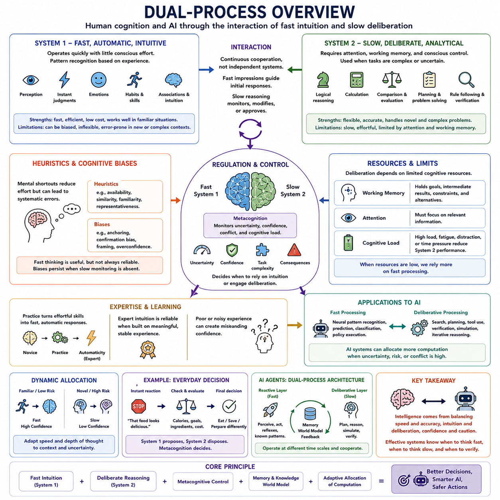
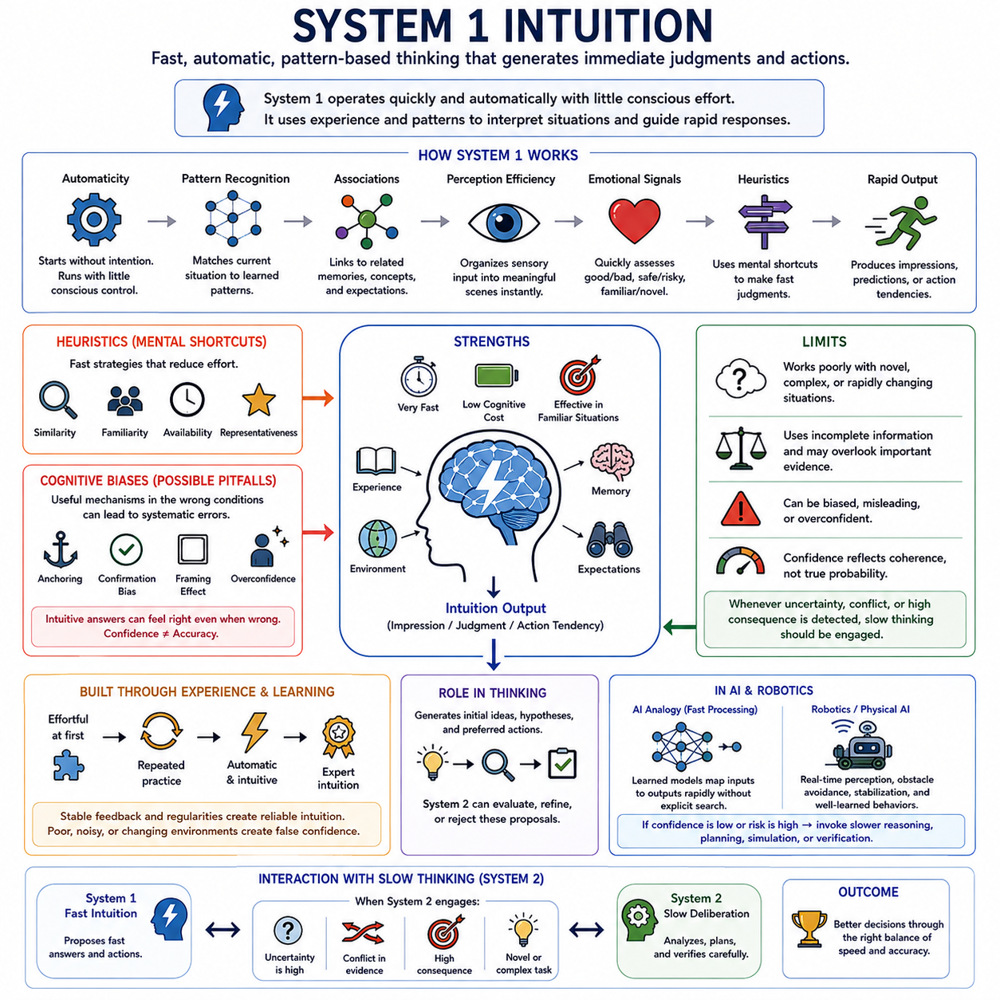
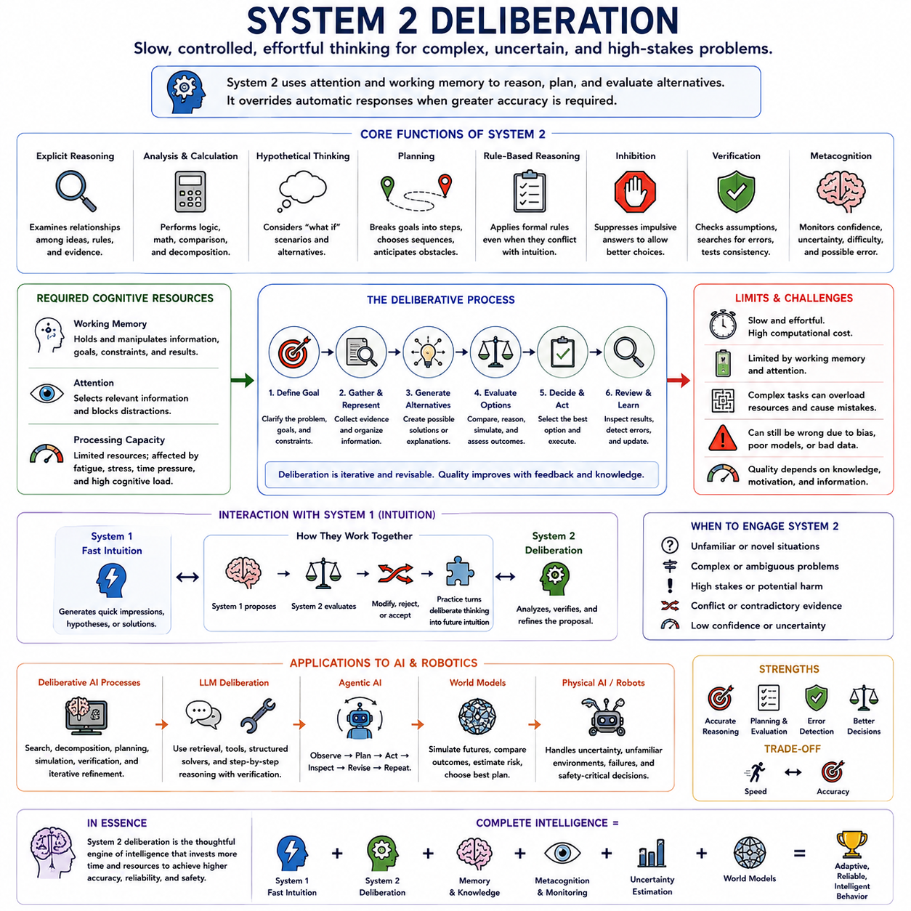
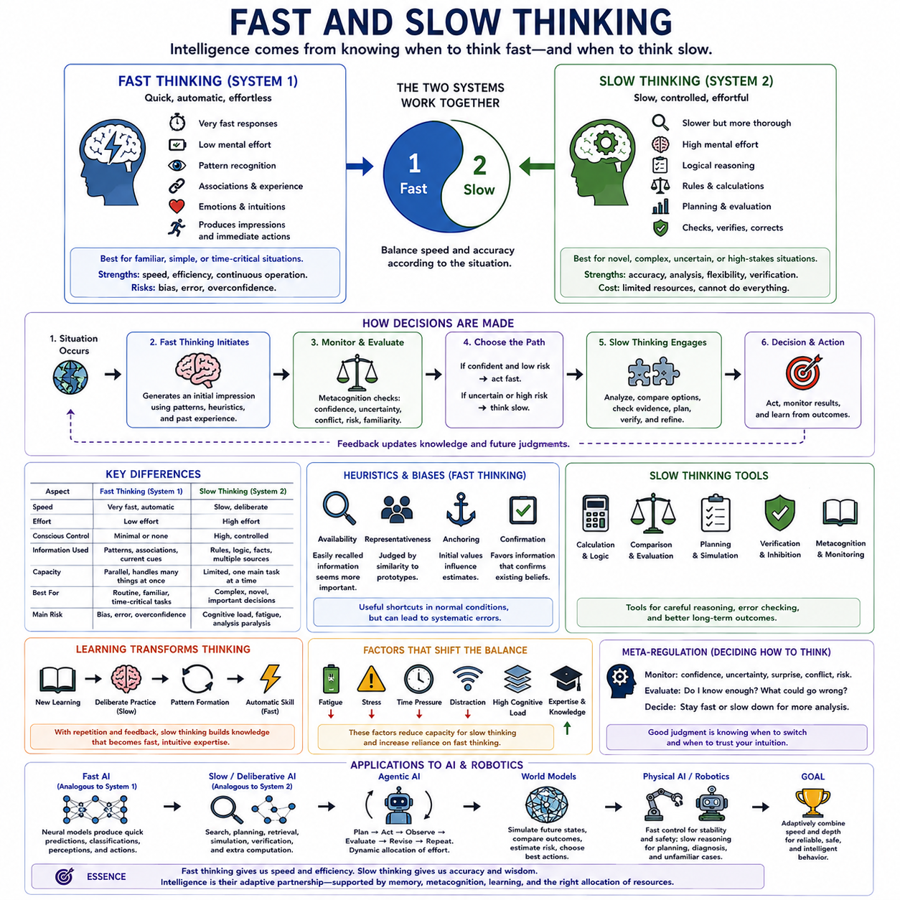
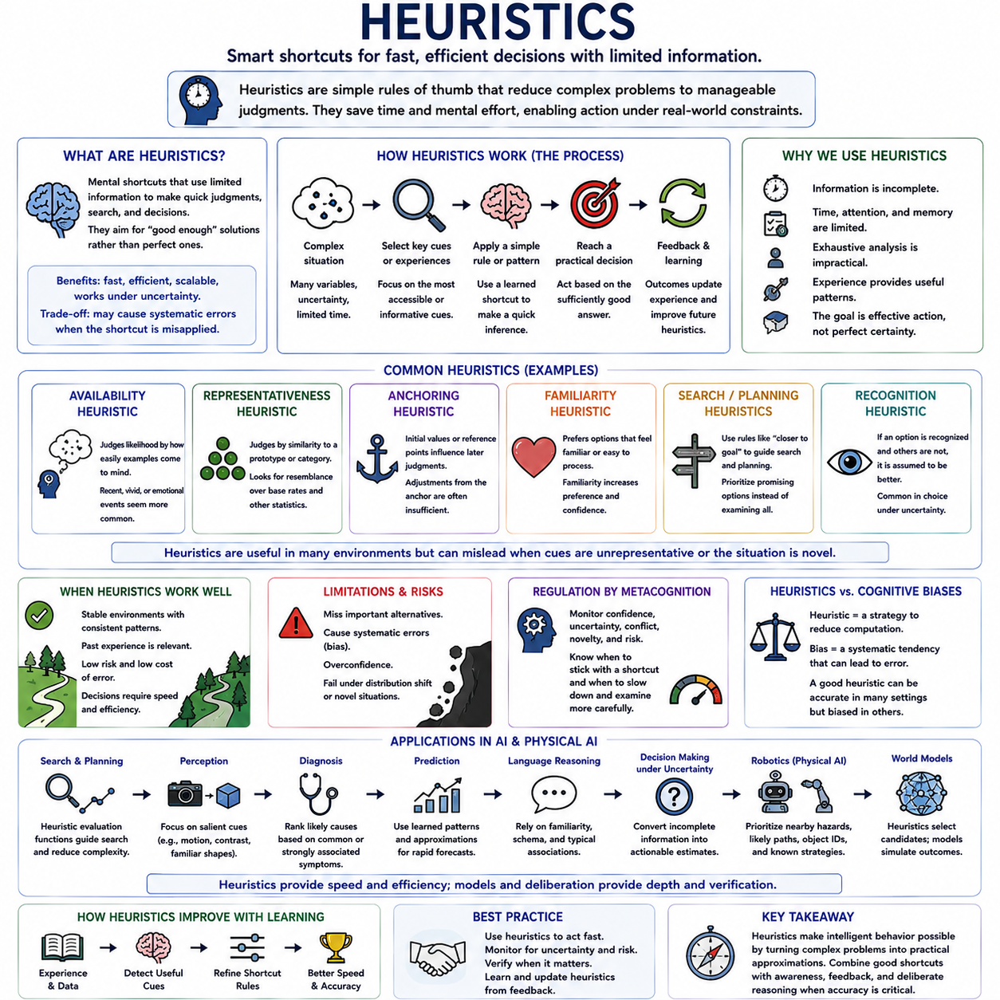
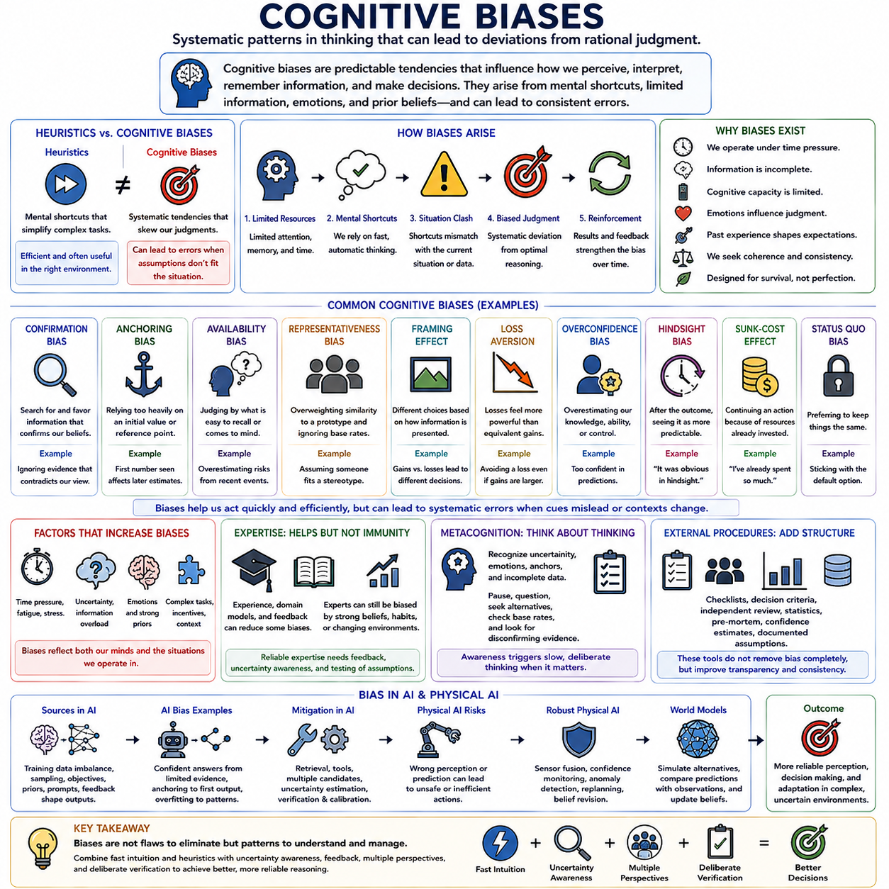
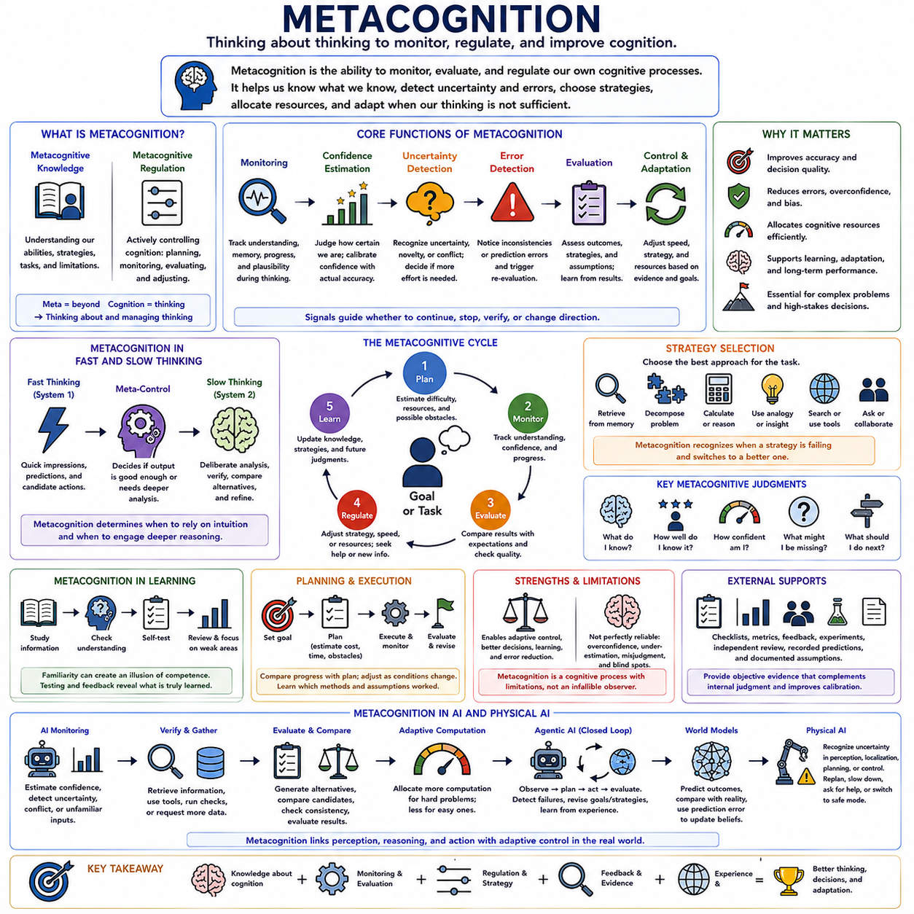
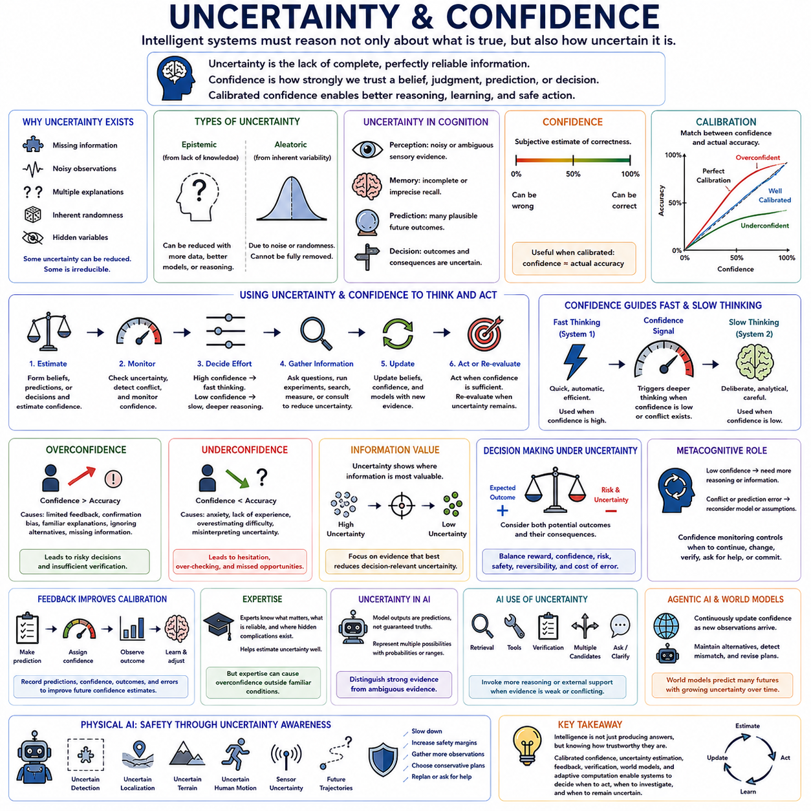
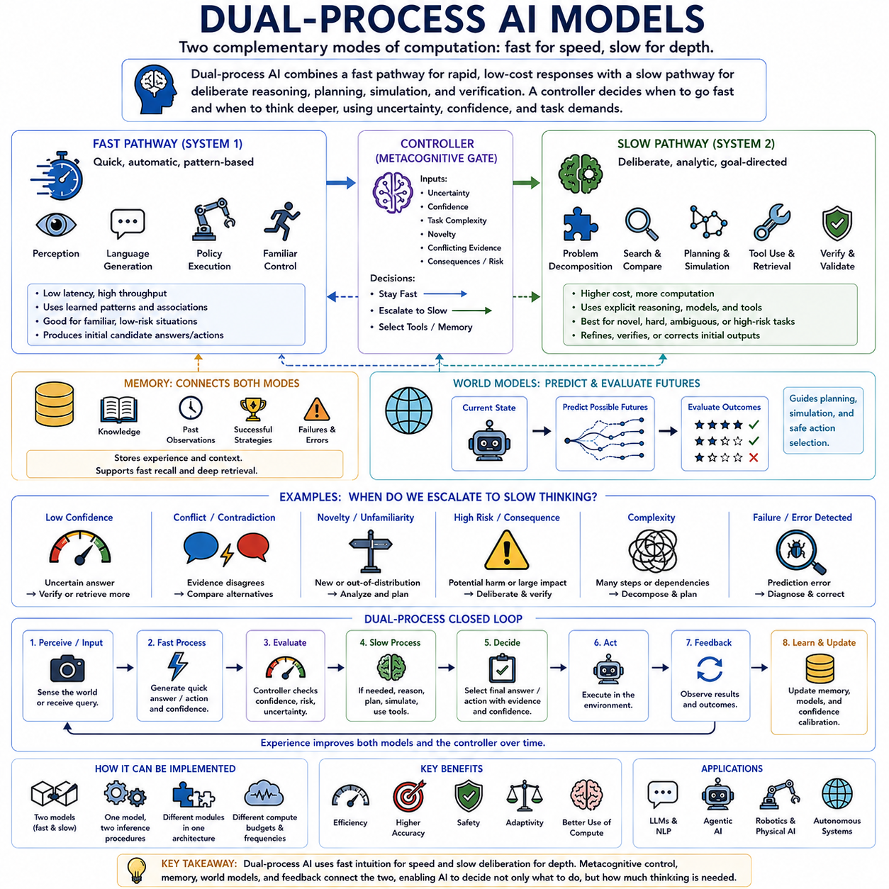
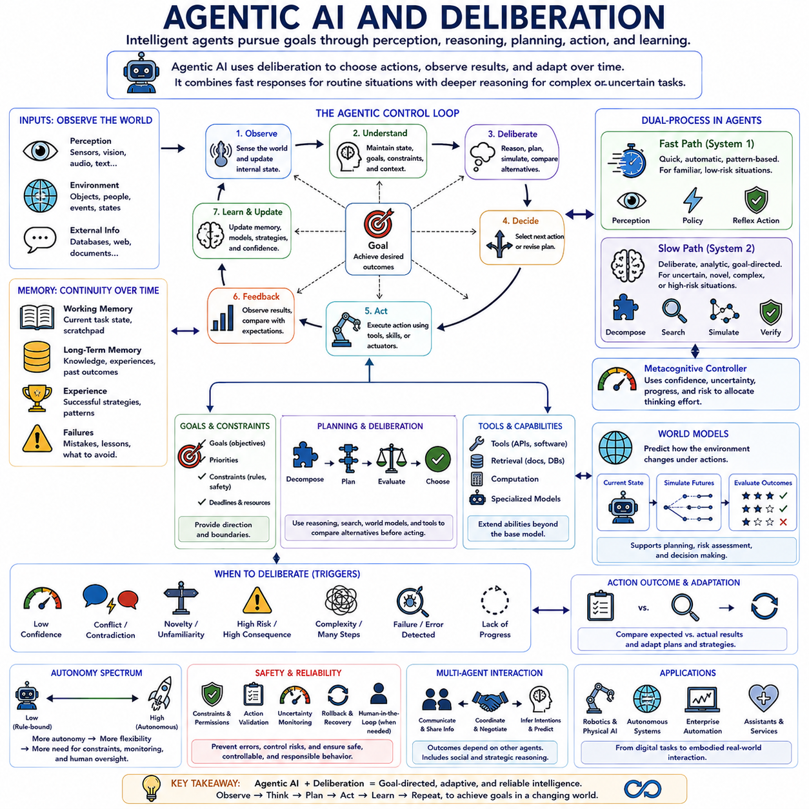

**Volume 43 Cognitive Science for AI**

# Chapter 05. Dual Process Theory

## 05.00 Dual Process Overview

{width="7.268055555555556in" height="7.268055555555556in"}

이중 처리 이론(Dual-process Theory)은 인간 인지(Human Cognition)를 두 가지 광범위한 정보 처리 방식(Information Processing Modes)의 상호작용으로 설명합니다. 하나의 방식은 빠르고 자동적이며 의식적인 노력이 거의 필요하지 않은 반면, 다른 방식은 더 느리고 숙고적이며 인지적 통제(Cognitive Control)에 의존합니다. 이러한 방식은 일반적으로 시스템 1(System 1)과 시스템 2(System 2)라고 불리지만, 뇌에서 물리적으로 분리된 두 시스템이라기보다 기능적 범주(Functional Categories)로 이해해야 합니다.

시스템 1(System 1)은 빠르고 대부분 자동적인 처리(Automatic Processing)를 나타냅니다. 이는 즉각적인 지각(Perception), 패턴 인식(Pattern Recognition), 익숙한 행동, 직관적 판단(Intuitive Judgments), 감정적 반응(Emotional Reactions), 빠른 연상(Rapid Associations)을 지원합니다. 사람이 얼굴을 알아보거나, 익숙한 표현을 이해하거나, 다가오는 물체를 감지하거나, 무언가 이상하다는 것을 즉시 느낄 때 인지는 모든 중간 계산 단계를 의식적으로 검토하지 않고도 반응을 만들어낼 수 있습니다.

시스템 2(System 2)는 더 느리고 통제된 처리(Controlled Processing)를 나타냅니다. 과제가 명시적 추론(Explicit Reasoning), 계산(Calculation), 비교(Comparison), 계획(Planning), 규칙 준수(Rule Following), 대안에 대한 신중한 평가를 요구할 때 중요해집니다. 익숙하지 않은 수학 문제를 해결하거나, 논증이 논리적으로 타당한지 확인하거나, 복잡한 선택지를 비교하거나, 일련의 행동을 계획하는 작업은 일반적으로 직관적 처리보다 더 많은 작업 기억(Working Memory) 용량과 지속적인 주의(Sustained Attention)를 요구합니다.

빠른 처리(Fast Processing)와 느린 처리(Slow Processing)의 구분이 한 시스템은 지능적이고 다른 시스템은 신뢰할 수 없다는 것을 의미하지는 않습니다. 시스템 1은 축적된 경험을 통해 유용한 패턴을 빠르게 인식할 수 있기 때문에 익숙한 환경에서 매우 효과적입니다. 시스템 2는 익숙한 반응만으로 충분하지 않을 때 유연성(Flexibility)을 제공하지만, 숙고적 추론(Deliberative Reasoning)은 계산 비용이 크고 느리며 제한된 주의와 작업 기억의 제약을 받습니다.

두 처리 방식은 독립적으로 작동하기보다 지속적으로 상호작용합니다. 빠른 처리 과정은 인상(Impressions), 후보 해석(Candidate Interpretations), 기대(Expectations), 가능한 행동을 생성하고, 느린 처리 과정은 이를 검사하고 수정하거나 거부하거나 승인할 수 있습니다. 많은 일상적인 상황에서는 직관적인 반응이 충분히 신뢰할 수 있기 때문에 그대로 받아들여집니다. 그러나 불확실성(Uncertainty), 충돌(Conflict), 새로움(Novelty), 위험(Risk), 예상하지 못한 증거가 추가적인 추론의 필요성을 나타낼 때 숙고적 처리가 더욱 중요해집니다.

휴리스틱(Heuristics)은 빠른 인지(Fast Cognition)의 효율성을 잘 보여줍니다. 사람들은 가능한 모든 변수를 평가하는 대신 유사성(Similarity), 가용성(Availability), 친숙성(Familiarity), 이전에 성공했던 경험에 기반한 단순화된 전략을 자주 사용합니다. 이러한 지름길(Shortcuts)은 계산 요구량을 줄이고 빠르게 유용한 결정을 내릴 수 있도록 합니다. 그러나 환경 조건이 해당 휴리스틱이 일반적으로 효과적으로 작동하던 조건과 달라질 경우 동일한 메커니즘이 체계적인 오류(Systematic Errors)를 만들어낼 수 있습니다.

따라서 인지 편향(Cognitive Biases)은 효율적이지만 불완전한 정보 처리에서 발생할 수 있습니다. 앵커링(Anchoring), 확증 편향(Confirmation Bias), 가용성 효과(Availability Effects), 프레이밍 효과(Framing Effects), 과신(Overconfidence)은 초기 정보, 기억하기 쉬운 사례, 정보의 제시 방식, 기존 믿음에 의해 판단이 어떻게 영향을 받을 수 있는지를 보여줍니다. 이중 처리 이론은 직관적인 반응이 빠르게 생성되고 숙고적인 모니터링(Deliberative Monitoring)이 이를 항상 감지하거나 수정하지 못하기 때문에 일부 편향이 지속될 수 있다고 설명합니다.

작업 기억(Working Memory)과 주의(Attention)는 숙고적 인지(Deliberative Cognition)에서 특히 중요합니다. 복잡한 추론에는 목표(Goals), 중간 결과(Intermediate Results), 제약 조건(Constraints), 대안적 가능성을 일시적으로 저장하는 능력이 필요합니다. 이러한 인지 자원(Cognitive Resources)은 제한되어 있기 때문에 주의 분산(Distraction), 피로(Fatigue), 시간 압박(Time Pressure), 과도한 인지 부하(Cognitive Load)가 발생하면 시스템 2의 수행 능력이 저하될 수 있습니다. 충분한 숙고적 평가를 위한 자원을 사용할 수 없을수록 빠른 처리의 영향력이 증가합니다.

메타인지(Metacognition)는 인지가 자신의 처리 과정을 평가할 수 있도록 함으로써 또 다른 계층을 추가합니다. 사람은 불확실성을 인식하거나, 충돌을 감지하거나, 자신감(Confidence)을 추정하거나, 직관적인 답변에 검증(Verification)이 필요하다는 사실을 깨달을 수 있습니다. 효과적인 메타인지는 언제 추가적인 추론을 활성화해야 하는지를 결정할 수 있습니다. 이러한 관점에서 지능적 행동(Intelligent Behavior)은 빠른 처리와 느린 처리뿐 아니라 각각의 처리 전략이 언제 우세해야 하는지를 조절하는 메커니즘에도 의존합니다.

불확실성(Uncertainty)은 이러한 조절 과정에서 중요한 역할을 합니다. 자신감이 높고 상황이 익숙한 경우 빠른 반응이 적절할 수 있습니다. 반대로 관찰이 모호하거나, 결과의 중요성이 크거나, 예측이 기대와 충돌하는 경우에는 추가적인 계산이 더욱 가치 있게 됩니다. 따라서 적응형 인지 시스템(Adaptive Cognitive System)은 반응 속도(Response Speed), 계산 비용(Computational Cost), 자신감(Confidence), 불확실성, 오류가 초래할 수 있는 잠재적 결과 사이에서 균형을 유지해야 합니다.

전문성(Expertise)은 학습을 통해 자동 처리와 숙고적 처리 사이의 경계가 변화할 수 있음을 보여줍니다. 처음에는 집중적인 주의를 필요로 하는 과제도 충분한 연습을 거치면 점점 자동화될 수 있습니다. 읽기, 익숙한 경로에서의 운전, 기술적 패턴 인식, 숙련된 운동 시퀀스(Motor Sequences)의 수행은 점차 빠른 처리 방식으로 이동할 수 있습니다. 따라서 전문성은 반복적으로 해결한 문제들이 효율적인 내부 패턴과 절차(Procedures)로 전환되는 과정의 일부로 이해할 수 있습니다.

그러나 전문가의 직관(Expert Intuition)은 경험이 의미 있는 피드백(Meaningful Feedback)과 안정적인 규칙성(Stable Regularities)을 제공할 때에만 신뢰할 수 있습니다. 예측 가능한 환경에서 발달한 직관은 매우 정확해질 수 있지만, 잡음이 많거나 빠르게 변화하는 환경에서 형성된 자신감은 잘못된 판단으로 이어질 수 있습니다. 따라서 이중 처리 이론은 빠른 전문적 판단을 주관적인 자신감만으로 평가하기보다 학습 경험(Learning Experience)의 질에 따라 평가해야 한다는 점을 강조합니다.

이중 처리 개념(Dual-process Ideas)은 인간 인지와 인공지능(Artificial Intelligence)을 비교하기 위한 유용한 개념적 프레임워크(Conceptual Framework)를 제공합니다. 많은 인공지능 시스템은 학습된 신경 표상(Neural Representations)을 통해 빠른 패턴 인식을 수행하며, 이는 직관적 처리와 관련된 일부 기능적 특성과 유사합니다. 이미지 인식(Image Recognition), 언어 예측(Language Prediction), 이상 탐지(Anomaly Detection), 학습된 정책 실행(Learned Policy Execution)은 모든 결정에서 명시적인 기호 검색(Symbolic Search)을 수행하지 않고도 복잡한 입력을 빠르게 출력으로 변환할 수 있습니다.

보다 숙고적인 인공지능 처리(Deliberative AI Processing)는 탐색(Search), 계획(Planning), 논리적 추론(Logical Reasoning), 시뮬레이션(Simulation), 외부 도구(External Tools), 검증(Verification), 반복적 추론(Iterative Inference), 추가적인 계산 단계를 포함할 수 있습니다. 인공지능 시스템은 모델이 처음 생성한 답변을 그대로 받아들이는 대신 여러 대안을 평가하고, 증거를 검색하고, 제약 조건을 검사하고, 결과를 시뮬레이션하고, 응답을 수정할 수 있습니다. 기본적인 계산 메커니즘은 인간의 시스템 2 인지와 다르지만 이러한 과정은 숙고(Deliberation)의 기능적 역할과 유사합니다.

대규모 언어 모델(Large Language Models)은 이러한 구분을 특히 중요하게 만듭니다. 모델은 학습된 통계적 구조(Statistical Structure)를 기반으로 즉각적인 답변을 생성할 수 있지만, 어려운 문제에서는 문제 분해(Decomposition), 검색(Retrieval), 도구 사용(Tool Use), 검증(Verification), 반복적 추론의 도움을 받을 수 있습니다. 따라서 추론 시점(Inference Time)에 계산량을 증가시키는 것은 하나의 통합된 인공지능 시스템 안에서 빠른 응답 생성과 느린 숙고적 처리 사이에 실용적인 구분을 만들어낼 수 있습니다.

에이전트형 인공지능(Agentic AI)은 목표(Goals), 기억(Memory), 계획(Planning), 환경 피드백(Environmental Feedback), 반복적인 의사결정 주기(Decision Cycles)를 도입함으로써 이러한 아키텍처를 확장합니다. 에이전트(Agent)는 먼저 가능성이 높은 행동을 생성하고, 불확실성이나 위험을 추정한 다음, 필요한 경우 추가적인 추론을 실행할 수 있습니다. 이러한 시스템은 과제의 복잡성(Task Complexity), 자신감, 예상되는 결과에 따라 계산 자원을 동적으로 할당하는 이중 처리 이론의 공학적 해석(Engineering Interpretation)을 제시합니다.

피지컬 인공지능(Physical AI)에서는 지능형 기계가 안전성을 유지하면서도 빠르게 반응해야 하기 때문에 이러한 구분이 특히 중요합니다. 이동 로봇(Mobile Robot)은 빠른 지각--행동 메커니즘(Perception--Action Mechanisms)을 통해 장애물을 즉시 회피해야 하는 동시에, 경로 계획(Route Planning), 불확실성 분석(Uncertainty Analysis), 과제 해석(Task Interpretation), 익숙하지 않은 상황에서의 복구(Recovery)를 위해 더 느린 처리 과정을 사용할 수 있습니다. 따라서 실시간 제어(Real-time Control)와 숙고적 계획(Deliberative Planning)은 서로 다르지만 조정된 시간 척도(Temporal Scales)에서 작동합니다.

월드 모델(World Model)은 느린 추론 과정이 행동을 실행하기 전에 가능한 미래(Possible Futures)를 시뮬레이션할 수 있도록 함으로써 이러한 조정을 강화할 수 있습니다. 빠른 정책(Fast Policies)은 익숙한 상황을 처리하고, 예측 및 계획 메커니즘은 불확실하거나 새로운 조건을 평가할 수 있습니다. 예측된 결과가 위험이나 충돌을 나타낼 경우 시스템은 추가적인 계산을 할당하고, 계획을 재검토하거나, 행동을 실행하기 전에 외부 정보를 요청할 수 있습니다.

이중 처리 이론(Dual-process Theory)을 모든 인지 연산이 두 시스템 가운데 하나에만 배타적으로 속한다는 엄격한 주장으로 해석해서는 안 됩니다. 인간 인지에는 자동성(Automaticity), 의식(Awareness), 통제(Control), 계산 요구량(Computational Demand)의 서로 다른 수준에서 작동하는 다양한 상호작용 과정이 존재합니다. 이 이론의 핵심적인 가치는 빠른 패턴 기반 처리(Pattern-based Processing)와 자원 집약적인 숙고(Resource-intensive Deliberation)를 구분하고, 이러한 처리 방식들이 어떻게 협력하는지를 살펴보는 데 있습니다.

인공지능 설계(AI Design)의 관점에서 이러한 구분은 지능(Intelligence)이 모든 문제에 동일한 양의 계산을 적용할 필요가 없다는 점을 시사합니다. 효율적인 시스템은 익숙한 상황을 빠르게 해결하면서 어렵거나 불확실한 상황에 대해서만 비용이 높은 추론, 탐색, 시뮬레이션, 검증을 사용할 수 있습니다. 이러한 원리를 기억(Memory), 메타인지(Metacognition), 자신감 추정(Confidence Estimation), 월드 모델(World Models), 적응형 제어(Adaptive Control)와 결합하면 더욱 유연한 인지 시스템(Cognitive Systems)과 인공지능 시스템을 설계하기 위한 유용한 기반을 제공할 수 있습니다.

## 05.01 System 1 Intuition [w/Code]

{width="7.268055555555556in" height="7.268055555555556in"}

시스템 1 직관(System 1 Intuition)은 의식적인 노력이 거의 없이 인상(Impressions), 판단(Judgments), 기대(Expectations), 행동 경향(Action Tendencies)을 빠르고 자동적으로 생성하는 인지 방식(Cognitive Mode)을 의미합니다. 모든 가능성을 명시적 추론(Explicit Reasoning)을 통해 하나씩 검토하기보다 현재 상황을 이전 경험에서 학습한 패턴과 빠르게 대조하여 해석합니다. 이를 통해 사람은 익숙하거나 시간에 민감한 상황에 효율적으로 대응할 수 있습니다.

시스템 1(System 1)의 작동은 자동성(Automaticity)과 밀접하게 관련되어 있습니다. 많은 지각 및 인지 과정은 의도적인 개입 없이 시작되고 지속적인 의식적 감독 없이 진행됩니다. 익숙한 얼굴을 알아보거나, 간단한 문장을 이해하거나, 화난 목소리를 감지하거나, 갑작스러운 움직임을 알아차리는 일은 거의 즉각적으로 이루어질 수 있습니다. 그 결과는 종종 일련의 추론 단계가 아니라 이미 형성된 인상으로 의식에 나타납니다.

패턴 인식(Pattern Recognition)은 직관적 인지(Intuitive Cognition)를 구성하는 핵심 메커니즘 가운데 하나입니다. 반복적인 노출을 통해 인지 시스템은 객체, 상황, 행동, 결과 사이의 규칙성(Regularities)에 민감해집니다. 유사한 패턴이 다시 나타나면 이전에 학습된 연관성이 빠르게 활성화될 수 있습니다. 따라서 직관은 무작위적이거나 순전히 감정적인 반응이라기보다 경험을 통해 축적된 지식이 압축된 형태로 나타나는 경우가 많습니다.

연상 처리(Associative Processing)는 시스템 1이 하나의 표상(Representation)을 관련된 기억, 개념, 감정, 기대와 연결할 수 있도록 합니다. 연기(Smoke)를 보면 불(Fire), 위험(Danger), 열(Heat), 회피(Avoidance)와 관련된 개념이 숙고적 추론보다 먼저 활성화될 수 있습니다. 이러한 연상은 기억 네트워크(Memory Networks) 전체로 빠르게 확산되어 불완전한 정보만으로도 상황에 대한 일관된 해석을 형성하고 다음에 일어날 가능성이 높은 사건을 예측하도록 합니다.

지각(Perception)은 시스템 1의 효율성을 특히 분명하게 보여줍니다. 시각 시스템(Visual System)은 각 특징을 의식적으로 계산하지 않고도 색상, 경계(Edges), 움직임(Motion), 깊이(Depth), 객체, 공간적 관계(Spatial Relationships)를 지속적으로 조직하여 의미 있는 장면을 구성합니다. 유사한 자동 처리 과정은 음성 인식(Speech Recognition)과 다른 감각 영역에서도 작동합니다. 따라서 즉각적인 자각으로 보이는 많은 부분은 숙고적 추론이 시작되기 전에 이루어진 광범위한 처리에 의존합니다.

감정적 반응(Emotional Responses)도 직관적 처리와 강하게 상호작용합니다. 위협적인 자극은 사람이 위험의 원인을 의식적으로 분석하기 전에 두려움(Fear), 생리적 준비(Physiological Preparation), 회피 경향(Avoidance Tendencies)을 유발할 수 있습니다. 감정 신호는 상황이 유익한지, 해로운지, 익숙한지, 불확실한지를 빠르게 나타내고 주의와 의사결정에 영향을 줍니다. 그러나 감정의 강도가 직관적 판단의 정확성을 의미하는 것은 아닙니다.

휴리스틱(Heuristics)은 시스템 1이 계산 부담을 줄이면서 빠른 판단을 수행할 수 있도록 합니다. 가능한 모든 변수를 평가하는 대신 인지는 유사성(Similarity), 친숙성(Familiarity), 접근 가능성(Accessibility), 대표적인 사례(Representative Examples)에 의존할 수 있습니다. 이러한 지름길은 실제 환경에서 제한된 시간과 불완전한 정보 속에서 결정을 내려야 하는 경우가 많기 때문에 적응적(Adaptive)일 수 있습니다. 직관적 인지는 체계적 오류의 가능성이 있음에도 일상적인 기능에 필수적입니다.

가용성 휴리스틱(Availability Heuristic)은 쉽게 떠올릴 수 있는 정보를 더 가능성이 높거나 더 중요한 것으로 판단하게 하는 대표적인 사례입니다. 따라서 극적이거나 최근에 발생한 사건은 실제 확률보다 판단에 더 큰 영향을 줄 수 있습니다. 대표성 휴리스틱(Representativeness Heuristic)은 상황이 익숙한 범주(Category)나 원형(Prototype)과 얼마나 유사한지를 바탕으로 판단합니다. 이러한 전략은 빠른 근사치를 제공하지만 통계적 정보나 다른 설명 가능성을 무시할 수 있습니다.

시스템 1(System 1)은 불완전한 증거만으로도 일관된 해석을 자주 구성합니다. 상황의 일부만 보일 때 인지는 이용 가능한 정보와 사전 지식(Prior Knowledge), 기대(Expectations)를 결합하여 그럴듯한 전체를 만들어내는 경향이 있습니다. 이 능력은 불확실한 환경에서 빠른 이해를 가능하게 하지만 성급한 결론(Premature Conclusions)을 유발할 수도 있습니다. 중요한 증거가 빠져 있어도 내부적으로 일관된 해석은 매우 설득력 있게 느껴질 수 있습니다.

따라서 직관적 인지에서 자신감(Confidence)과 정확성(Accuracy)은 동일하지 않습니다. 활성화된 패턴이 강하고 내부적으로 일관되면 실제 증거가 약하더라도 답이 즉시 맞는 것처럼 느껴질 수 있습니다. 주관적인 자신감(Subjective Confidence)은 객관적인 정확성의 추정보다 이용 가능한 정보의 일관성(Coherence)을 더 많이 반영하는 경우가 있습니다. 이러한 차이는 반대되는 증거가 나타난 이후에도 직관적 판단이 계속 설득력을 가질 수 있는 이유를 설명합니다.

인지 편향(Cognitive Biases)은 일반적으로 유용한 직관적 메커니즘이 부적절한 조건에 적용될 때 발생할 수 있습니다. 앵커링(Anchoring)은 초기 값이 이후의 추정에 영향을 주게 하며, 확증 편향(Confirmation Bias)은 기존 해석과 일치하는 정보를 더 선호하도록 할 수 있습니다. 프레이밍(Framing)은 동일한 정보를 어떻게 표현하느냐에 따라 결정을 변화시킬 수 있습니다. 이러한 효과는 효율적인 패턴 기반 인지가 의식적인 인식 없이도 판단을 체계적으로 형성할 수 있음을 보여줍니다.

그렇다고 시스템 1을 단순히 비합리적(Irrational)이거나 숙고적 추론보다 열등한 것으로 간주해서는 안 됩니다. 반복적인 경험과 신뢰할 수 있는 피드백이 존재하는 안정적인 환경에서는 직관이 매우 정확해질 수 있습니다. 숙련된 운전자, 엔지니어, 의사, 운동선수와 같은 전문가는 관련된 모든 단서를 명시적으로 설명하기 전에 의미 있는 패턴을 인식할 수 있습니다. 따라서 빠른 판단은 적절한 학습 조건이 갖추어질 경우 고도로 발달된 전문성(Expertise)의 표현일 수 있습니다.

전문가의 직관(Expert Intuition)은 경험, 피드백(Feedback), 기억(Memory)의 반복적인 상호작용을 통해 발달합니다. 처음에는 어려운 과제가 숙고적인 주의(Deliberate Attention)를 요구할 수 있지만, 반복되는 패턴은 점차 효율적인 절차와 표상으로 부호화됩니다. 이후에는 인식과 반응이 점점 적은 인지적 노력으로 이루어질 수 있습니다. 즉 학습은 이전에 많은 노력이 필요했던 처리의 일부를 더 빠른 자동 메커니즘으로 전환하여 효율성과 사용 가능한 인지 용량을 증가시킵니다.

그러나 전문성(Expertise)이 자동적으로 신뢰할 수 있는 직관을 보장하는 것은 아닙니다. 환경이 매우 예측 불가능하거나, 피드백이 지연되거나 왜곡되어 있거나, 관련 패턴이 시간에 따라 변한다면 경험은 정확한 인식보다 근거 없는 자신감(Unjustified Confidence)을 형성할 수 있습니다. 신뢰할 수 있는 직관을 위해서는 단서(Cues)와 결과(Outcomes) 사이에 충분히 안정적인 관계가 존재해야 합니다. 따라서 경험의 기간보다 경험의 질과 구조가 더 중요합니다.

시스템 1(System 1)은 숙고적 추론을 위한 후보 해법(Candidate Solutions)을 생성하는 데에도 중요한 역할을 합니다. 문제를 마주하면 사람은 대안을 의식적으로 분석하기 전에 즉각적인 해석, 가설(Hypothesis), 선호 행동을 경험하는 경우가 많습니다. 시스템 2(System 2)는 이후 이러한 제안을 검토할 수 있지만, 초기 탐색 방향은 시스템 1이 결정하는 경우가 많습니다. 따라서 직관(Intuition)과 숙고(Deliberation)는 서로 배타적인 인지 과정이 아니라 상호 보완적인 과정입니다.

시간 압박(Time Pressure)이 증가하면 숙고적 추론이 즉각적인 행동에 비해 너무 느릴 수 있기 때문에 직관적 처리의 중요성도 커집니다. 빠르게 접근하는 물체를 피하거나, 운전 중 불안정성에 대응하거나, 예상하지 못한 환경적 위험에 반응하는 경우 빠른 지각--행동 결합(Perception--Action Coupling)이 필요합니다. 이러한 상황에서는 완전한 분석을 기다리는 것이 충분히 신뢰할 수 있는 직관적 추정에 따라 행동하는 것보다 오히려 더 위험할 수 있습니다.

인공지능(Artificial Intelligence)의 관점에서 시스템 1은 복잡한 입력을 빠르게 예측이나 행동으로 변환하는 학습 모델을 이해하기 위한 유용한 유사 개념을 제공합니다. 신경망(Neural Networks)은 모든 가능성을 명시적으로 탐색하지 않고도 학습된 표상(Learned Representations)을 이용하여 객체를 인식하고, 상황을 분류하고, 언어 시퀀스를 예측하며, 익숙한 행동을 선택할 수 있습니다. 따라서 이러한 추론(Inference)은 패턴 기반 직관적 인지의 기능적 효율성과 유사한 특성을 보일 수 있습니다.

피지컬 인공지능(Physical AI)에서 시스템 1과 유사한 처리는 실시간 지각(Real-time Perception)과 제어(Control)에 특히 중요합니다. 로봇은 보행자(Pedestrians)를 빠르게 인식하고, 장애물(Obstacles)을 감지하고, 주행 가능한 공간(Traversable Space)을 추정하고, 움직임을 안정화하며, 충분히 학습된 행동을 실행해야 할 수 있습니다. 이러한 과정은 엄격한 시간 제약(Timing Constraints) 아래에서 작동하며 항상 광범위한 계획을 기다릴 수 없습니다. 학습된 정책(Learned Policies)과 반응형 제어(Reactive Control) 메커니즘은 이러한 빠른 운영 계층을 제공할 수 있습니다.

빠른 처리(Fast Processing)는 불확실성 추정(Uncertainty Estimation)과 익숙하지 않은 조건을 감지하는 메커니즘이 결합될 때 더 강건해질 수 있습니다. 자신감이 감소하거나, 관찰 결과가 서로 충돌하거나, 잠재적인 결과가 심각할 경우 시스템은 더 많은 제어권을 느린 추론, 계획(Planning), 시뮬레이션(Simulation), 검증(Verification) 과정으로 넘길 수 있습니다. 이를 통해 직관은 일상적인 상황을 처리하고 추가 계산은 어려운 사례에만 사용되는 적응형 아키텍처(Adaptive Architecture)를 구성할 수 있습니다.

따라서 시스템 1 직관(System 1 Intuition)은 효율적인 지능(Intelligence)을 위한 근본적인 전략을 나타냅니다. 즉 축적된 경험을 빠른 패턴 기반 해석(Pattern-based Interpretation)과 행동으로 변환하는 것입니다. 그 강점은 속도, 낮은 인지 비용(Low Cognitive Cost), 익숙한 환경에서의 효과적인 수행이며, 약점은 편향(Bias), 과신(Overconfidence), 익숙하지 않은 조건에 대한 취약성입니다. 지능적 인지는 이러한 효율성을 활용하면서 동시에 언제 직관에 숙고적인 검증이 필요한지를 인식하는 능력에 의존합니다.

## 05.02 System 2 Deliberation [w/Code]

{width="7.268055555555556in" height="7.268055555555556in"}

시스템 2 숙고(System 2 Deliberation)는 자동적인 반응만으로 문제를 해결하기에 충분하지 않을 때 사용되는 느리고, 통제되며, 노력이 필요한 인지 방식(Cognitive Mode)을 의미합니다. 이는 명시적 추론(Explicit Reasoning), 신중한 비교(Careful Comparison), 계획(Planning), 계산(Calculation), 대안 평가(Evaluation of Alternatives)를 지원합니다. 빠른 직관과 달리 숙고는 지속적인 주의(Sustained Attention)를 필요로 하며, 가능한 결론을 구성하고 검증하며 수정하는 동안 관련 정보를 능동적으로 유지합니다.

시스템 2(System 2)는 사람이 익숙하지 않거나, 복잡하거나, 모호하거나, 결과의 중요성이 큰 상황을 마주할 때 특히 중요해집니다. 익숙한 과제는 자동적으로 처리할 수 있지만 새로운 문제는 목표(Goals), 증거(Evidence), 제약 조건(Constraints), 가능한 행동을 의식적으로 검토해야 하는 경우가 많습니다. 숙고(Deliberation)는 최초의 해석이 충분히 신뢰할 수 없을 때 즉각적인 반응을 중단하고 추가적인 처리 자원(Processing Resources)을 할당할 수 있도록 합니다.

작업 기억(Working Memory)은 추론 과정에서 여러 정보가 일시적으로 접근 가능한 상태로 유지되어야 하는 경우가 많기 때문에 숙고적 인지(Deliberative Cognition)의 핵심입니다. 수학 문제를 해결하거나 대안을 비교할 때 사람은 중간 결과(Intermediate Results), 가정(Assumptions), 제약 조건, 목표를 동시에 유지해야 할 수 있습니다. 따라서 작업 기억의 한계는 외부적인 보조 수단 없이 효율적으로 수행할 수 있는 추론의 복잡성을 제한합니다.

주의(Attention)는 시스템 2 처리(System 2 Processing)를 위한 또 하나의 필수적인 자원입니다. 숙고 과정에서는 관련된 정보를 선택하고 유지하는 동시에 주의를 분산시키는 요소를 억제해야 합니다. 따라서 지속적인 집중(Sustained Concentration)이 필요한 과제들을 동시에 수행하면 서로 간섭할 수 있습니다. 이러한 제한된 주의 용량(Attentional Capacity)은 방해, 피로(Fatigue), 스트레스, 시간 압박(Time Pressure), 과도한 인지 부하(Cognitive Load) 상황에서 복잡한 추론이 더욱 어려워지는 이유를 설명합니다.

시스템 2의 주요 기능 가운데 하나는 분석적 추론(Analytical Reasoning)입니다. 숙고적 인지는 주로 유사성이나 즉각적인 연상에 의존하는 대신 명제(Propositions), 변수(Variables), 규칙(Rules), 증거 사이의 명시적인 관계를 검토할 수 있습니다. 이를 통해 논리적 추론(Logical Inference), 수학적 계산(Mathematical Calculation), 구조화된 비교(Structured Comparison), 체계적인 문제 분해(Systematic Problem Decomposition)가 가능합니다. 이러한 과정은 직관적 인식보다 느리지만 즉각적으로 드러나지 않는 관계를 발견할 수 있습니다.

숙고(Deliberation)는 가설적 추론(Hypothetical Reasoning)과 반사실적 추론(Counterfactual Reasoning)도 지원합니다. 사람은 현재 실제로 발생하고 있지 않은 상황을 고려하고 서로 다른 가정이나 행동 아래에서 어떤 일이 발생할 수 있는지를 질문할 수 있습니다. 가능한 미래(Possible Futures)를 비교하고, 대안적인 설명을 평가하며, 하나의 조건이 변경될 경우 결과가 어떻게 달라질 수 있는지를 상상할 수 있습니다. 이러한 능력은 계획, 과학적 추론(Scientific Reasoning), 진단(Diagnosis), 전략적 의사결정(Strategic Decision Making)의 기본적인 요소입니다.

계획(Planning)은 숙고적 추론을 시간적으로 확장합니다. 실행을 시작하기 전에 하나의 목표를 중간 목표(Intermediate Objectives), 의존 관계(Dependencies), 행동(Actions), 점검 지점(Checkpoints)으로 분해할 수 있습니다. 시스템 2는 여러 대안적 시퀀스를 비교하고 각각의 단계가 의도된 결과를 향해 시스템을 이동시키는지를 검토할 수 있습니다. 따라서 장기 계획(Long-horizon Planning)은 현재 조건, 미래 상태(Future States), 사용 가능한 자원, 잠재적 장애물 사이의 관계를 유지하는 능력에 의존합니다.

규칙 기반 추론(Rule-based Reasoning)은 숙고적 처리의 또 다른 특징적인 기능입니다. 사람은 규칙이 즉각적인 직관적 반응과 충돌하더라도 형식적인 지침(Formal Instructions)을 의식적으로 적용할 수 있습니다. 수학적 절차(Mathematical Procedures), 법적 규칙(Legal Rules), 공학적 제약(Engineering Constraints), 안전 프로토콜(Safety Protocols), 논리적 원칙(Logical Principles)은 명시적인 표상을 통해 행동을 안내할 수 있습니다. 이러한 능력은 인지가 이전에 학습한 연상에만 의존하지 않고 추상적인 기준(Abstract Standards)에 따라 작동할 수 있도록 합니다.

시스템 2는 인지적 억제(Cognitive Inhibition)에도 기여합니다. 직관적인 답변이 즉시 떠오를 수 있지만 숙고적 처리는 그것이 최종적인 반응으로 이어지는 것을 막을 수 있습니다. 이는 익숙한 패턴이 잘못된 방향으로 이끌거나 상황에 서로 충돌하는 증거가 포함되어 있을 때 특히 중요합니다. 억제(Inhibition)는 대안적인 해석을 검토할 시간을 제공하고 부적절한 반응이 실행되기 전에 행동을 수정할 수 있도록 합니다.

따라서 검증(Verification)은 숙고의 가장 중요한 역할 가운데 하나입니다. 사람은 가정을 검사하고, 결과를 다시 계산하고, 반대되는 증거(Contradictory Evidence)를 찾고, 일관성(Consistency)을 검토하거나, 결론을 알려진 제약 조건과 비교할 수 있습니다. 검증이 정확성을 보장하는 것은 아닙니다. 숙고적 추론 자체도 실패할 수 있기 때문입니다. 그러나 검증은 빠른 직관적 처리가 놓칠 수 있는 오류를 발견할 수 있는 메커니즘을 제공합니다.

메타인지(Metacognition)는 자신감(Confidence), 불확실성(Uncertainty), 난이도(Difficulty), 잠재적 오류(Possible Error)를 점검함으로써 이러한 과정을 조절하는 데 도움을 줍니다. 문제가 익숙하지 않거나 모순되는 것처럼 느껴질 때 인지는 추가적인 노력이 필요하다는 것을 인식할 수 있습니다. 따라서 효과적인 숙고는 외부 문제에 대한 추론뿐 아니라 자신의 추론 품질을 평가하는 과정도 포함합니다. 이러한 모니터링은 추가적인 분석, 정보 또는 검증이 필요한지를 결정하는 데 도움을 줍니다.

시스템 2의 주요 단점은 계산 비용(Computational Cost)입니다. 지속적인 추론은 제한된 인지 자원(Cognitive Resources)을 소비하며 계속해서 유지하기 어렵습니다. 따라서 사람은 일상적인 모든 결정을 의식적으로 분석하지 않습니다. 자동 처리(Automatic Processing)가 많은 익숙한 상황을 처리하고, 추가적인 비용을 정당화할 수 있는 경우에만 노력이 필요한 추론이 선택적으로 활성화됩니다. 효율적인 인지는 숙고가 충분한 이점을 제공하는 상황에 숙고를 적절하게 할당하는 능력에 의존합니다.

피로(Fatigue)와 인지 부하(Cognitive Load)는 숙고적 추론의 효과를 감소시킬 수 있습니다. 작업 기억이나 주의가 과부하되면 사람은 문제를 지나치게 단순화하거나, 제약 조건을 놓치거나, 충분한 검토 없이 직관적인 반응을 받아들일 수 있습니다. 이는 시스템 2가 무제한적인 추론 엔진(Unlimited Reasoning Engine)이 아니라는 것을 보여줍니다. 그 수행 능력은 사용 가능한 인지 자원, 과제 구조(Task Structure), 지식(Knowledge), 동기(Motivation), 평가되는 정보의 품질에 의존합니다.

지식(Knowledge)과 전문성(Expertise)은 숙고 능력을 크게 향상시킬 수 있습니다. 전문가는 관련 변수를 식별하고 가능성이 낮은 대안을 더욱 효율적으로 제거할 수 있도록 하는 구조화된 개념적 표상(Structured Conceptual Representations)을 보유합니다. 따라서 숙고는 이전 학습(Prior Learning)과 독립적인 것이 아닙니다. 강력한 도메인 지식(Domain Knowledge)은 탐색 공간(Search Space)을 줄이고 가능성을 평가하기 위한 더 나은 모델을 제공하여 숙고적 추론을 더욱 빠르고 신뢰할 수 있게 합니다.

시스템 1(System 1)과 시스템 2(System 2)는 문제 해결 과정 전체에서 협력합니다. 직관(Intuition)은 후보 해석이나 해결책을 빠르게 생성하고, 이후 숙고가 그 타당성(Validity)을 평가할 수 있습니다. 시스템 2는 해당 제안을 받아들이거나, 수정하거나, 거부하거나, 추가적인 대안을 생성할 수 있습니다. 반대로 반복적인 숙고적 연습(Deliberate Practice)은 이후 자동화되는 패턴을 형성하여 이전에 많은 노력이 필요했던 추론이 미래의 직관에 기여하도록 할 수 있습니다.

이러한 상호작용은 속도(Speed)와 정확성(Accuracy) 사이의 동적인 균형을 형성합니다. 일상적인 상황에서는 빠른 처리가 유리한 경우가 많지만, 불확실하거나 중요한 결과를 초래하는 상황에서는 추가적인 계산이 정당화됩니다. 지능적 인지(Intelligent Cognition)는 항상 최대 수준의 숙고를 수행하는 것을 요구하지 않습니다. 대신 빠른 반응으로 충분한 경우와 더 느린 분석이 추가적인 인지 비용을 지불할 가치가 있는 경우를 적절하게 판단하는 메커니즘이 필요합니다.

인공지능(Artificial Intelligence)의 관점에서 시스템 2는 탐색(Search), 분해(Decomposition), 계획(Planning), 시뮬레이션(Simulation), 검증(Verification), 반복적 개선(Iterative Refinement)을 포함하는 계산 과정에 대한 유용한 유사 개념을 제공합니다. 모델은 초기 예측을 빠르게 생성한 다음 추가적인 계산을 실행하여 여러 대안을 평가할 수 있습니다. 인공 시스템이 인간 추론의 생물학적 메커니즘을 그대로 구현하는 것은 아니지만 이러한 기능적 구분은 숙고적 인지와 유사합니다.

대규모 언어 모델(Large Language Model) 시스템은 추가적인 추론 시점 계산(Inference-time Computation), 검색(Retrieval), 외부 도구(External Tools), 구조화된 해결기(Structured Solvers), 반복적인 평가를 통해 숙고와 유사한 행동을 구현할 수 있습니다. 어려운 과제는 더 작은 구성 요소로 분해할 수 있고, 관련 증거를 검색할 수 있으며, 계산을 적절한 도구에 위임하고, 후보 출력을 제약 조건과 비교하여 확인할 수 있습니다. 따라서 학습된 생성(Learned Generation)을 명시적인 검증 메커니즘과 결합함으로써 신뢰성을 향상시킬 수 있습니다.

에이전트형 인공지능(Agentic AI)은 여러 번의 의사결정 주기(Decision Cycles)에 걸쳐 숙고를 확장합니다. 에이전트(Agent)는 목표를 유지하고, 환경을 관찰하고, 계획을 구성하고, 행동을 실행한 다음 결과를 검사하고 이후의 행동을 수정할 수 있습니다. 하나의 응답만 생성하는 대신 시스템은 예상 상태(Expected States)와 관찰된 상태(Observed States)를 반복적으로 비교합니다. 숙고는 추론, 기억(Memory), 도구(Tools), 환경 피드백(Environmental Feedback), 행동(Action)을 연결하는 지속적인 제어 과정(Control Process)이 됩니다.

월드 모델(World Models)은 행동이 실행되기 전에 가능한 미래 상태(Possible Future States)를 시뮬레이션할 수 있도록 함으로써 숙고적 인공지능(Deliberative AI)을 더욱 강화할 수 있습니다. 지능형 시스템은 여러 행동의 예상 결과(Predicted Consequences)를 비교하고, 위험(Risk)을 추정하고, 충돌을 식별하며, 예상되는 결과에 따라 계획을 선택할 수 있습니다. 이를 통해 숙고는 순수한 언어적 추론에서 환경 동역학(Environmental Dynamics) 모델에 접지된 예측적 추론(Predictive Reasoning)으로 확장됩니다.

피지컬 인공지능(Physical AI)에서 시스템 2와 유사한 처리는 로봇이 불확실성, 익숙하지 않은 지형(Unfamiliar Terrain), 서로 충돌하는 센서 정보(Conflicting Sensor Information), 과제 실패(Task Failure), 안전이 중요한 의사결정(Safety-critical Decisions)을 마주할 때 특히 중요합니다. 빠른 제어(Fast Control)는 일반적인 내비게이션을 처리할 수 있지만, 느린 추론은 경로를 재검토하고, 비정상적인 조건을 해석하고, 대안을 시뮬레이션하고, 실패를 진단하거나, 지원을 요청할 수 있습니다. 숙고는 즉각적인 지각--행동 루프(Perception--Action Loops) 위에서 작동하는 감독 계층(Supervisory Layer)을 제공합니다.

따라서 시스템 2 숙고(System 2 Deliberation)는 적응형 지능(Adaptive Intelligence)에서 자원 집약적인 측면을 나타냅니다. 그 강점은 명시적 추론(Explicit Reasoning), 계획(Planning), 억제(Inhibition), 검증(Verification), 대안 평가(Evaluation of Alternatives)에 있으며, 한계는 높은 계산 비용과 제한된 인지 자원에서 발생합니다. 빠른 직관(Fast Intuition), 기억(Memory), 메타인지(Metacognition), 불확실성 추정(Uncertainty Estimation), 예측적 월드 모델(Predictive World Models)과 결합될 때 숙고는 자동 처리만으로 충분하지 않은 상황에서 지능형 시스템이 더욱 신중하게 대응할 수 있도록 합니다.

## 05.03 Fast and Slow Thinking [w/Code]

{width="7.268055555555556in" height="7.268055555555556in"}

빠른 사고와 느린 사고(Fast and Slow Thinking)는 인지(Cognition)가 즉각적인 패턴 기반 반응(Pattern-based Responses)과 더 느리고 노력이 필요한 분석(Effortful Analysis) 사이에서 어떻게 균형을 이루는지를 설명합니다. 빠른 사고(Fast Thinking)는 학습된 경험으로부터 신속한 인상과 행동을 생성하고, 느린 사고(Slow Thinking)는 증거, 규칙, 대안, 결과를 검토합니다. 효과적인 지능(Effective Intelligence)은 하나의 방식을 영구적으로 선택하는 것이 아니라 상황의 요구에 따라 두 방식을 조정하는 능력에 의존합니다.

빠른 사고(Fast Thinking)는 의식적인 통제(Conscious Control)가 거의 필요하지 않은 자동 처리(Automatic Processes)에 의존하기 때문에 효율적입니다. 익숙한 객체, 감정 표현, 일반적인 단어, 환경적 위험(Environmental Hazards), 숙련된 행동은 거의 즉각적으로 인식될 수 있습니다. 이러한 속도는 모든 지각이나 결정에 숙고적 추론(Deliberative Reasoning)을 할당하지 않고도 복잡한 환경에서 인지가 지속적으로 작동할 수 있도록 합니다.

느린 사고(Slow Thinking)는 자동적인 반응이 불확실하거나, 서로 충돌하거나, 충분하지 않을 때 중요해집니다. 느린 사고는 주의(Attention)와 작업 기억(Working Memory)을 사용하여 관계를 검토하고 가능성을 비교하는 동안 정보를 유지합니다. 익숙하지 않은 문제를 해결하거나, 계산을 확인하거나, 경쟁하는 설명을 평가하거나, 여러 단계 앞을 계획하는 작업에는 일반적으로 이러한 자원 집약적인 처리(Resource-intensive Processing)가 필요합니다.

두 사고 방식은 부분적으로 계산 비용(Computational Cost)에서 차이가 있습니다. 빠른 사고는 최소한의 노력으로 유용한 반응을 생성할 수 있으므로 많은 일상적인 결정을 다른 활동과 동시에 수행할 수 있도록 합니다. 느린 사고는 제한된 인지 자원(Cognitive Resources)을 소비하기 때문에 모든 상황에 지속적으로 적용할 수 없습니다. 인간 인지(Human Cognition)는 추가적인 분석이 의미 있는 가치를 제공하는 문제에 비용이 높은 숙고(Deliberation)를 선택적으로 할당해야 합니다.

빠른 사고는 초기 해석(Initial Interpretation)을 생성함으로써 의사결정 과정(Decision Process)을 시작하는 경우가 많습니다. 명시적인 추론이 시작되기 전에 어떤 상황이 즉각적으로 안전하거나, 위험하거나, 익숙하거나, 의심스럽거나, 쉽거나, 어렵게 느껴질 수 있습니다. 이후 느린 사고는 이러한 첫인상(First Impression)을 검토하고 그것을 받아들일지, 수정할지, 거부할지를 결정할 수 있습니다. 따라서 많은 결정은 하나의 고립된 처리 과정이 아니라 두 과정의 순차적인 협력(Sequential Cooperation)을 통해 형성됩니다.

휴리스틱(Heuristics)은 어려운 판단을 단순화하기 때문에 빠른 사고와 밀접하게 관련됩니다. 인지는 가능한 모든 결과를 계산하는 대신 친숙성(Familiarity), 유사성(Similarity), 최근 기억(Recent Memories), 대표적인 사례(Representative Examples)에 의존할 수 있습니다. 이러한 지름길(Shortcuts)은 일반적인 환경에서 효과적으로 작동하는 경우가 많지만 중요한 변수가 누락되거나 현재 상황이 이전 경험과 다를 경우 체계적인 오류(Systematic Errors)를 발생시킬 수도 있습니다.

느린 사고는 명시적인 규칙(Explicit Rules)을 적용하고 증거(Evidence)를 확인함으로써 일부 직관적 오류(Intuitive Errors)를 수정할 수 있습니다. 즉각적인 답변이 설득력 있게 느껴지더라도 결과를 계산하거나, 대안적인 설명을 검토하거나, 반대되는 정보를 찾을 수 있습니다. 따라서 숙고는 감시 및 수정 메커니즘(Monitoring and Correction Mechanism)으로 기능합니다. 그러나 추론 자체도 지식, 편향(Bias), 불완전한 데이터의 영향을 받을 수 있기 때문에 숙고가 항상 정확성을 보장하는 것은 아닙니다.

작업 기억(Working Memory)은 느린 사고를 강하게 제한합니다. 복잡한 추론은 연산을 수행하는 동안 목표(Goals), 가정(Assumptions), 중간 결과(Intermediate Results), 대안(Alternatives)을 일시적으로 저장해야 합니다. 인지 부하(Cognitive Load)가 지나치게 높아지면 수행 능력이 저하되고 사람은 더 단순한 직관적 전략(Intuitive Strategies)으로 돌아갈 수 있습니다. 따라서 피로(Fatigue), 주의 분산(Distraction), 스트레스, 시간 압박(Time Pressure)은 숙고적 분석에서 빠른 처리로 균형을 이동시킬 수 있습니다.

학습(Learning)은 빠른 사고와 느린 사고 사이의 관계를 변화시킵니다. 처음에는 세심한 주의가 필요한 과제도 반복과 피드백(Feedback)을 통해 점차 자동화될 수 있습니다. 숙련된 수행(Skilled Performance)은 반복적으로 해결된 문제가 인식 가능한 패턴으로 표상되면서 이러한 전환을 보여주는 경우가 많습니다. 따라서 숙고적 연습(Deliberate Practice)은 느린 처리의 일부를 효율적인 빠른 반응으로 전환하면서 전문성(Expertise)을 기억에 유지할 수 있습니다.

전문가의 직관(Expert Intuition)은 환경에 안정적인 패턴(Stable Patterns)이 존재하고 의미 있는 피드백을 제공할 때 가장 신뢰할 수 있습니다. 경험이 풍부한 전문가는 판단에 이르는 모든 단계를 명시적으로 설명하기 전에 중요한 단서(Cues)를 인식할 수 있습니다. 그러나 예측하기 어렵거나 제대로 관찰할 수 없는 환경에서의 경험은 정확성 없이 자신감만 만들어낼 수 있습니다. 따라서 빠른 전문성(Fast Expertise)은 단순한 반복이 아니라 학습 환경(Learning Environment)의 품질에 의존합니다.

메타인지(Metacognition)는 인지가 언제 빠른 상태를 유지하고 언제 속도를 늦추어야 하는지를 결정하는 데 도움을 줍니다. 불확실성(Uncertainty), 놀라움(Surprise), 충돌(Conflict), 낮은 자신감(Low Confidence), 높은 위험(High Risk), 익숙하지 않음(Unfamiliarity)과 같은 신호는 초기 반응에 추가적인 검토가 필요하다는 것을 나타낼 수 있습니다. 따라서 잘 조절된 인지 시스템은 외부 문제뿐 아니라 현재 자신의 해석과 의사결정 과정의 신뢰성(Reliability)도 함께 모니터링합니다.

빠른 사고와 느린 사고는 서로 다른 시간 범위(Time Horizons)에서도 작동할 수 있습니다. 즉각적인 지각과 운동 반응(Motor Responses)은 밀리초 단위의 결정을 요구할 수 있는 반면, 전략적 계획(Strategic Planning)은 수분, 수일 또는 수년에 걸쳐 이루어질 수 있습니다. 인지는 이러한 시간 척도(Temporal Scales)를 분리함으로써 빠른 제어가 현재 행동을 유지하는 동안 느린 처리 과정이 장기 목표(Long-term Goals), 미래 결과(Future Consequences), 더 넓은 대안을 고려할 수 있도록 합니다.

이러한 구분은 인공지능(Artificial Intelligence)을 이해하는 데에도 유용한 유사 개념을 제공합니다. 신경 모델(Neural Models)은 입력을 예측, 분류 또는 행동으로 빠르게 매핑할 수 있으며, 이는 빠른 사고의 기능적 역할과 유사합니다. 보다 숙고적인 인공지능(Deliberative AI)은 탐색(Search), 계획(Planning), 검색(Retrieval), 시뮬레이션(Simulation), 검증(Verification), 추가적인 추론 시점 계산(Inference-time Computation)을 사용할 수 있습니다. 이러한 과정은 더 많은 자원을 소비하지만 즉각적인 모델 출력만으로 충분하지 않을 때 신뢰성을 향상시킬 수 있습니다.

에이전트형 인공지능(Agentic AI)은 반복적인 의사결정 주기(Decision Cycles) 안에서 두 가지 방식을 결합할 수 있습니다. 빠른 모델은 초기 행동이나 가설(Hypothesis)을 생성하고, 더 느린 과정은 불확실성을 평가하고, 정보를 검색하고, 제약 조건(Constraints)을 확인하거나, 계획을 수정할 수 있습니다. 따라서 계산 노력(Computational Effort)을 동적으로 할당하여 일상적인 사례는 효율적으로 처리하면서 어렵거나 위험성이 높은 상황에는 더욱 깊은 분석을 적용할 수 있습니다.

월드 모델(World Models)은 행동을 수행하기 전에 가능한 미래 상태(Possible Future States)를 시뮬레이션할 수 있도록 함으로써 느린 추론을 강화합니다. 빠른 정책(Fast Policies)은 익숙한 상황을 처리하고, 예측 모델(Predictive Model)은 불확실한 대안과 그 결과를 평가할 수 있습니다. 예상된 결과가 충돌이나 위험을 나타낼 경우 시스템은 계산량을 증가시키거나, 계획을 수정하거나, 추가적인 증거를 확보할 때까지 행동을 지연할 수 있습니다.

피지컬 인공지능(Physical AI)에서는 로봇이 안전성과 장기적인 과제 수행(Long-term Task Performance)을 유지하면서도 빠르게 반응해야 하기 때문에 이러한 구분이 특히 중요합니다. 장애물 회피(Obstacle Avoidance), 안정화(Stabilization), 즉각적인 지각은 빠른 처리를 요구할 수 있는 반면, 경로 재계획(Route Replanning), 실패 진단(Failure Diagnosis), 위험 분석(Risk Analysis), 익숙하지 않은 상황은 더 느린 숙고를 요구할 수 있습니다. 두 방식은 공통된 지각--행동 루프(Perception--Action Loop) 안에서 서로 조정되어야 합니다.

따라서 빠른 사고와 느린 사고(Fast and Slow Thinking)는 지능적 행동(Intelligent Behavior)을 위한 상호 보완적인 전략을 나타냅니다. 빠른 처리는 속도(Speed), 효율성(Efficiency), 패턴 기반 능력(Pattern-based Competence)을 제공하고, 느린 처리는 분석(Analysis), 유연성(Flexibility), 검증(Verification), 장기 계획(Long-horizon Planning)을 제공합니다. 지능(Intelligence)은 기억(Memory), 메타인지(Metacognition), 불확실성 추정(Uncertainty Estimation), 학습(Learning), 그리고 추가적인 계산이 그 비용만큼 가치가 있는 시점을 결정하는 메커니즘의 지원을 받아 두 사고 방식이 적응적으로 조정될 때 나타납니다.

## 05.04 Heuristics [w/Code]

{width="7.268055555555556in" height="7.268055555555556in"}

휴리스틱(Heuristics)은 가능한 모든 대안을 평가하는 대신 제한된 정보를 활용하여 판단(Judgment), 추론(Reasoning), 탐색(Search), 의사결정(Decision Making)을 단순화하는 효율적인 인지 전략(Cognitive Strategies)입니다. 휴리스틱은 유용한 결론에 도달하기 위해 필요한 계산량을 줄이며, 시간, 주의(Attention), 기억(Memory), 정보가 제한되어 있을 때 특히 가치가 있습니다. 따라서 휴리스틱은 지능적 행동(Intelligent Behavior)을 계산적으로 관리 가능한 수준으로 만드는 실용적인 지름길(Practical Shortcuts)을 의미합니다.

휴리스틱 처리(Heuristic Processing)는 많은 지름길이 경험을 통해 학습된 이후 자동적으로 작동하기 때문에 빠르고 직관적인 인지(Fast and Intuitive Cognition)와 밀접하게 관련되어 있습니다. 인지는 모든 상황에 대해 완전한 분석 모델(Analytical Model)을 구성하는 대신 익숙한 단서(Cues)를 인식하고 가능성이 높은 해석이나 반응을 빠르게 활성화할 수 있습니다. 이를 통해 신속한 의사결정이 가능해지고 비용이 높은 숙고적 추론(Deliberative Reasoning)은 더욱 어려운 문제를 위해 남겨둘 수 있습니다.

휴리스틱의 효율성은 계산 비용(Computational Cost)과 의사결정 품질(Decision Quality) 사이의 근본적인 절충 관계(Trade-off)를 반영합니다. 모든 가능성을 철저하게 평가하면 때로는 더 좋은 답을 얻을 수 있지만 필요한 시간과 자원 때문에 이러한 분석이 비현실적일 수 있습니다. 휴리스틱은 반드시 이론적으로 최적인 해결책(Optimal Solution)을 찾는 것이 아니라 충분히 유용한 해결책을 탐색함으로써 현실 세계의 자원 제약(Resource Constraints) 아래에서도 인지가 효과적으로 작동하도록 합니다.

가용성 휴리스틱(Availability Heuristic)은 관련된 사례를 기억에서 얼마나 쉽게 검색할 수 있는지에 따라 가능성이나 중요성을 부분적으로 추정합니다. 최근에 발생했거나, 생생하거나, 감정적이거나, 자주 논의되는 사건은 실제보다 더 흔한 것처럼 보일 수 있습니다. 기억 접근성(Memory Accessibility)이 환경에서의 실제 빈도를 반영할 때 이러한 전략은 유용하지만, 기억하기 쉬운 사례가 통계적으로 대표성이 없을 경우 판단을 왜곡할 수 있습니다.

대표성 휴리스틱(Representativeness Heuristic)은 객체, 사건 또는 사람이 익숙한 범주(Category)나 원형(Prototype)과 얼마나 유사한지를 기준으로 평가합니다. 어떤 대상이 특정 범주의 전형적인 구성원과 매우 유사하면 사람은 그것이 해당 범주에 속한다고 빠르게 판단할 수 있습니다. 이는 효율적인 분류(Classification)를 지원하지만 유사성이 매우 강하게 느껴질 경우 기저율(Base Rates)이나 다른 통계적 정보가 충분히 고려되지 않을 수 있습니다.

앵커링(Anchoring)은 초기 값, 추정치 또는 기준점(Reference Point)이 이후의 판단에 영향을 미치는 현상을 설명합니다. 하나의 앵커(Anchor)가 제시되면 이후의 추론은 그 값에서 벗어나도록 조정되더라도 충분히 멀리 조정되지 않을 수 있습니다. 따라서 최초의 값이 불완전하거나 관련성이 없더라도 이후의 추정에 영향을 줄 수 있습니다. 앵커링은 휴리스틱 추론이 탐색 공간(Search Space)을 줄이는 동시에 진지하게 검토되는 대안의 범위를 제한할 수 있음을 보여줍니다.

친숙성(Familiarity) 자체도 하나의 휴리스틱으로 기능할 수 있습니다. 이전에 경험한 객체, 전략, 설명 또는 환경은 익숙하지 않은 대안보다 더 유창하게 처리되는 경우가 많으며, 이러한 처리의 용이성(Ease of Processing)이 선호나 자신감(Confidence)에 영향을 줄 수 있습니다. 반복적인 경험은 관련성이나 신뢰성을 나타내는 경우가 많기 때문에 친숙성은 유용하지만 새로운 접근 방식이 더 적절한 상황에서도 익숙한 해결책을 선호하게 만들 수 있습니다.

휴리스틱은 실제 환경에서 완전한 정보를 이용할 수 있는 경우가 드물기 때문에 불확실성(Uncertainty) 아래에서 특히 유용합니다. 의사결정자는 부분적인 증거만을 이용하여 숨겨진 상태(Hidden States)를 추론하고, 결과를 예측하고, 행동을 선택해야 하는 경우가 많습니다. 이전 경험, 두드러진 단서(Salient Cues), 근사 확률(Approximate Probabilities), 학습된 연관성(Learned Associations)은 빠른 지침을 제공합니다. 따라서 휴리스틱 추론은 철저한 확률 계산 없이도 불완전한 정보를 행동 가능한 추정(Actionable Estimates)으로 변환합니다.

탐색(Search)과 계획(Planning) 역시 휴리스틱 평가(Heuristic Evaluation)에 자주 의존합니다. 가능한 상태나 행동이 매우 많으면 모든 경로를 조사하는 것이 계산적으로 불가능해질 수 있습니다. 휴리스틱은 어떤 대안이 목표에 더 가까워 보이는지를 추정하고 이를 추가적인 검토 대상으로 우선순위화할 수 있습니다. 이러한 의미에서 휴리스틱은 인간의 판단만을 설명하는 개념이 아니라 인공지능(Artificial Intelligence)에서 탐색 복잡도(Search Complexity)를 줄이는 핵심적인 계산 기법이기도 합니다.

지각(Perception)에서도 모든 신호를 동일한 중요도로 처리하기보다 두드러지거나 유용한 단서에 우선순위를 부여하는 휴리스틱과 유사한 전략을 사용할 수 있습니다. 시각적 주의(Visual Attention)는 움직임(Motion), 대비(Contrast), 익숙한 형태, 과제와 관련된 객체에 집중할 수 있습니다. 이러한 우선순위화는 복잡한 장면을 빠르게 해석할 수 있도록 하지만 환경이 학습된 기대와 다를 경우 상대적으로 덜 두드러진 증거를 놓칠 수도 있습니다.

진단(Diagnosis)은 휴리스틱 추론의 또 다른 사례를 제공합니다. 의사, 엔지니어 또는 기술자는 관찰된 증상과 흔하거나, 익숙하거나, 강하게 연관된 원인을 우선적으로 검토할 수 있습니다. 이는 즉시 조사해야 하는 가설(Hypotheses)의 수를 크게 줄여줍니다. 그러나 초기 휴리스틱 탐색 이후에도 증거가 일관되지 않을 경우 체계적인 검증(Systematic Verification)을 수행하지 않으면 드물지만 중요한 원인을 놓칠 수 있습니다.

휴리스틱(Heuristics)과 인지 편향(Cognitive Biases)은 서로 관련되어 있지만 동일한 개념으로 취급해서는 안 됩니다. 휴리스틱은 계산을 단순화하기 위한 전략인 반면, 인지 편향은 특정한 판단이나 오류 패턴을 향한 체계적인 경향(Systematic Tendency)입니다. 유용한 휴리스틱은 많은 환경에서 정확한 결정을 만들어내면서도 특정 조건에서는 편향을 발생시킬 수 있습니다. 따라서 다음 주제인 인지 편향(Cognitive Biases)은 휴리스틱 자체를 단순히 오류로 재정의하는 것이 아니라 휴리스틱 처리에서 발생할 수 있는 결과를 살펴보는 것입니다.

휴리스틱의 품질은 그것이 적용되는 환경에 크게 의존합니다. 신뢰할 수 있는 피드백(Feedback)이 존재하는 안정적인 환경에서 학습된 지름길은 중요한 단서가 관련 결과를 지속적으로 예측하기 때문에 매우 효과적으로 발전할 수 있습니다. 그러나 환경적 관계가 변화하면 동일한 휴리스틱이 잘못된 방향으로 이끌 수 있습니다. 따라서 적응형 지능(Adaptive Intelligence)은 이전에 성공적이었던 지름길이 현재의 조건에서도 여전히 적절한지를 판단할 수 있어야 합니다.

전문성(Expertise)은 학습을 통해 정교한 휴리스틱이 어떻게 형성될 수 있는지를 보여줍니다. 경험이 풍부한 전문가는 반복적인 경험을 통해 어떤 단서가 중요한지를 학습했기 때문에 패턴을 인식하고 탐색 공간을 빠르게 좁힐 수 있습니다. 겉으로는 노력이 거의 필요하지 않은 직관(Intuition)처럼 보이는 판단이 실제로는 고도로 압축된 도메인 지식(Domain Knowledge)을 반영할 수 있습니다. 전문가 휴리스틱(Expert Heuristics)은 광범위한 경험과 의미 있는 피드백에 의해 뒷받침될 때 매우 강력할 수 있습니다.

메타인지(Metacognition)는 자신감(Confidence), 불확실성(Uncertainty), 새로움(Novelty), 충돌(Conflict), 잠재적 결과(Potential Consequences)를 모니터링함으로써 휴리스틱 사용을 조절할 수 있습니다. 익숙하고 위험성이 낮은 상황에서 휴리스틱이 높은 자신감의 답을 제공한다면 추가적인 분석의 이점은 크지 않을 수 있습니다. 반대로 자신감이 낮거나 결과가 심각할 경우 느린 숙고(Slow Deliberation)를 통해 가정을 검토하고, 대안을 탐색하고, 해당 지름길이 여전히 적절한지를 검증할 수 있습니다.

인공지능(Artificial Intelligence) 역시 휴리스틱 원리(Heuristic Principles)를 광범위하게 활용합니다. 탐색 알고리즘(Search Algorithms)은 평가 함수(Evaluation Functions)를 사용하여 가능성이 높은 상태에 우선순위를 부여하고, 계획 시스템(Planning Systems)은 유용한 경로를 추정하며, 진단 시스템(Diagnostic Systems)은 가능성이 높은 원인을 순위화하고, 학습 모델(Learned Models)은 통계적 규칙성(Statistical Regularities)을 이용하여 빠른 예측을 생성합니다. 인공지능과 피지컬 인공지능(Physical AI) 전반에서 휴리스틱은 불확실성 아래의 탐색, 지각, 진단, 예측, 언어 추론(Language Reasoning), 의사결정을 지원할 수 있습니다.

인공지능 시스템에서도 휴리스틱의 효율성은 인간 인지에서 관찰되는 것과 동일한 일반적인 절충 관계를 만듭니다. 탐색을 가능성이 높은 대안으로 제한하면 계산량을 크게 줄일 수 있지만 지나치게 좁은 휴리스틱은 더 좋은 해결책을 놓칠 수 있습니다. 또한 학습된 지름길은 실제 운용 조건(Deployment Conditions)이 학습 조건(Training Conditions)과 다를 때 실패할 수 있습니다. 따라서 강건한 시스템(Robust Systems)은 새로움, 불확실성, 분포 변화(Distribution Shift), 일관되지 않은 증거를 감지하는 메커니즘을 필요로 합니다.

월드 모델(World Models)은 휴리스틱의 효율성과 더욱 깊은 평가(Deeper Evaluation)를 결합하는 방법을 제공합니다. 빠른 휴리스틱이 먼저 가능성이 높은 소수의 행동을 식별하고, 이후 예측 모델(Predictive Model)이 그 행동들의 가능한 결과를 시뮬레이션할 수 있습니다. 모든 행동을 철저하게 평가하는 대신 시스템은 선택된 후보에 비용이 높은 계산을 집중합니다. 이는 빠른 직관적 처리(Fast Intuitive Processing)와 더 느린 모델 기반 숙고(Model-based Deliberation)를 연결하는 실용적인 방법을 제공합니다.

피지컬 인공지능(Physical AI)에서는 로봇이 시간, 에너지, 계산 능력, 센서 정보의 엄격한 제약 아래에서 작동해야 하기 때문에 휴리스틱이 필수적입니다. 로봇은 가능한 모든 해석을 평가하는 대신 가까운 위험 요소, 주행 가능성이 높은 경로(Likely Traversable Paths), 가능성이 높은 객체의 정체, 익숙한 조작 전략(Manipulation Strategies)에 우선순위를 부여할 수 있습니다. 이러한 지름길은 실시간 동작(Real-time Operation)을 가능하게 하지만 안전이 중요한 상황에서는 더 깊은 분석이 필요한 시점을 인식하는 메커니즘이 필요합니다.

따라서 휴리스틱(Heuristics)은 어려운 계산 문제를 관리 가능한 근사(Manageable Approximations)로 변환함으로써 지능(Intelligence)을 실현 가능하게 합니다. 그 강점은 속도(Speed), 효율성(Efficiency), 확장성(Scalability), 제한된 정보의 효과적인 활용에 있으며, 위험 요소에는 대안 누락(Missed Alternatives), 체계적인 오류(Systematic Errors), 과신(Overconfidence), 낮은 일반화 성능(Poor Generalization)이 포함됩니다. 신뢰할 수 있는 지능(Reliable Intelligence)은 유용한 휴리스틱을 불확실성 추정(Uncertainty Estimation), 검증(Verification), 피드백, 학습(Learning), 그리고 더 높은 정확성이 필요한 상황에서의 숙고적 추론(Deliberative Reasoning)과 결합합니다.

## 05.05 Cognitive Biases [w/Code]

{width="7.268055555555556in" height="7.268055555555556in"}

인지 편향(Cognitive Biases)은 판단(Judgment), 해석(Interpretation), 기억(Memory), 의사결정(Decision Making)에서 나타나는 체계적인 경향으로, 추론이 규범적 기준(Normative Standards)이나 이용 가능한 증거에서 벗어나도록 만들 수 있습니다. 이는 단순한 무작위적 실수를 의미하지 않습니다. 오히려 편향은 제한된 주의(Limited Attention), 불완전한 지식(Incomplete Knowledge), 사전 기대(Prior Expectations), 감정적 영향(Emotional Influence), 효율적인 인지적 지름길(Cognitive Shortcuts)에 대한 의존 등 인간 정보 처리의 예측 가능한 특성에서 발생하는 경우가 많습니다.

휴리스틱(Heuristics)과 인지 편향(Cognitive Biases)의 관계는 중요하지만 두 개념은 신중하게 구분해야 합니다. 휴리스틱은 어려운 판단이나 탐색 문제를 단순화하는 전략인 반면, 인지 편향은 그 결과로 나타나는 판단에 체계적으로 영향을 줄 수 있는 경향을 의미합니다. 휴리스틱은 적절한 환경에서 매우 효과적인 결정을 만들어낼 수 있지만, 그 기본 가정이 현재 상황과 일치하지 않을 경우 편향에 기여할 수 있습니다.

확증 편향(Confirmation Bias)은 기존의 믿음이나 가설(Hypothesis)을 지지하는 정보를 찾고, 해석하고, 기억하거나 강조하려는 경향을 설명합니다. 하나의 초기 설명이 그럴듯하게 받아들여지면 그것과 일치하는 증거가 반대되는 증거보다 더 많은 주의를 받을 수 있습니다. 이는 다른 해석의 가능성이 남아 있음에도 자신감을 강화할 수 있으므로, 반증 증거(Disconfirming Evidence)를 의도적으로 탐색하는 과정이 특히 중요합니다.

앵커링 편향(Anchoring Bias)은 초기 값, 추정치, 진술 또는 기준점(Reference Point)이 이후의 판단에 지나치게 큰 영향을 미칠 때 발생합니다. 이후의 추정은 앵커(Anchor)를 기준으로 조정될 수 있지만 그 값에서 충분히 벗어나지 못하는 경우가 많습니다. 앵커는 관련 정보, 임의의 값, 이전 경험 또는 초기 모델 출력에서 발생할 수 있으므로 더 넓은 가능성의 범위를 충분히 고려하기 전에 추론을 제한할 수 있습니다.

가용성 편향(Availability Bias)은 쉽게 기억하거나 상상할 수 있는 정보가 판단에 지나치게 큰 영향을 미칠 때 발생합니다. 최근에 발생했거나, 생생하거나, 감정적으로 강렬하거나, 반복적으로 접한 사건은 인지적으로 쉽게 접근할 수 있기 때문에 실제보다 더 가능성이 높거나 중요하게 느껴질 수 있습니다. 기억 접근성(Memory Accessibility)이 실제 빈도를 반영할 때는 합리적인 판단이 가능하지만, 기억하기 쉬운 사례가 실제 통계적 분포와 다를 경우 판단을 왜곡할 수 있습니다.

대표성 편향(Representativeness Bias)은 익숙한 범주(Category), 고정관념(Stereotype), 원형(Prototype)과의 유사성이 통계적 정보보다 더 큰 비중을 차지할 때 발생합니다. 어떤 관찰 결과가 특정 범주의 전형적인 사례와 매우 유사하면 해당 범주의 기저율(Base Rate)이 낮더라도 즉각적인 분류가 이루어질 수 있습니다. 패턴 인식(Pattern Recognition)은 빠른 인지에 유용하지만 유사성만으로 신뢰할 수 있는 확률적 판단을 수행하기에는 충분하지 않을 수 있습니다.

프레이밍 효과(Framing Effects)는 동일한 정보라도 어떻게 표현되는지에 따라 의사결정이 달라질 수 있음을 보여줍니다. 어떤 결과를 잠재적인 이득(Potential Gains)의 관점에서 설명할 때와 동일한 결과를 잠재적인 손실(Potential Losses)의 관점에서 설명할 때 서로 다른 선호가 나타날 수 있습니다. 이는 판단이 객관적인 정보뿐 아니라 기준점, 표현 방식, 문맥(Context), 정보 제시를 통해 형성된 정신적 표상(Mental Representation)의 영향을 받는다는 것을 보여줍니다.

손실 회피(Loss Aversion)는 많은 의사결정 상황에서 잠재적인 손실이 동일한 크기의 이득보다 더 강한 심리적 영향을 미치는 경향을 의미합니다. 이러한 비대칭성(Asymmetry)은 위험, 투자, 협상, 변화와 관련된 선택에 영향을 줄 수 있습니다. 인지된 손실을 피하는 것이 동일한 수준의 이익을 얻는 것보다 중요하게 느껴질 수 있으며, 이는 다른 행동이 더 유리한 예상 결과를 제공하는 경우에도 지나친 신중함이나 변화에 대한 저항을 유발할 수 있습니다.

과신(Overconfidence)은 주관적인 확신(Subjective Certainty)이 이용 가능한 증거가 정당화하는 정확성보다 높은 경우 발생합니다. 특히 일관된 설명을 쉽게 구성할 수 있을 때 사람은 자신의 지식, 예측 능력 또는 결과에 대한 통제력을 과대평가할 수 있습니다. 따라서 높은 자신감(Confidence)을 자동적으로 높은 신뢰성(Reliability)으로 해석해서는 안 됩니다. 효과적인 추론은 자신감을 증거, 불확실성(Uncertainty), 피드백(Feedback), 실제 예측 성능과 비교하여 보정할 필요가 있습니다.

사후 확신 편향(Hindsight Bias)은 결과가 이미 발생한 이후 그 결과가 이전부터 더 쉽게 예측할 수 있었던 것처럼 느껴지게 합니다. 결과를 알게 되면 사람은 이전 정보를 재구성하여 최종 사건이 거의 필연적이었던 것처럼 인식할 수 있습니다. 이는 결과가 발생하기 전에 실제로 존재했던 불확실성을 과소평가하게 만들어 학습을 왜곡할 수 있습니다. 따라서 정확한 평가를 위해서는 최초의 의사결정 시점에 무엇을 알고 있었고, 무엇을 예측했으며, 무엇이 불확실했는지를 보존해야 합니다.

매몰 비용 효과(Sunk-cost Effect)는 이미 사용한 자원이 어떤 활동을 계속해야 하는지에 영향을 줄 때 나타날 수 있습니다. 과거에 투자한 시간, 돈, 노력은 일반적으로 회수할 수 없지만 이러한 투자가 미래의 비용이 예상되는 이익보다 크더라도 지속적인 투입을 유도할 수 있습니다. 합리적인 평가는 주로 미래의 결과(Future Consequences)에 초점을 맞추어야 하지만, 이전 투자에 대한 심리적 애착(Psychological Attachment)은 중단을 어렵게 만들 수 있습니다.

현상 유지 편향(Status Quo Bias)은 다른 대안을 검토할 가치가 있는 경우에도 기존 상태를 유지하는 것을 선호하는 경향입니다. 친숙성(Familiarity), 불확실성, 전환 비용(Switching Costs), 손실 회피, 인식된 책임(Perceived Responsibility) 등이 이러한 선호에 기여할 수 있습니다. 현재 상태를 유지하는 것이 합리적인 경우도 있지만 이를 자동적으로 더 안전하거나 우수하다고 판단하면 환경 조건, 기술, 목표 또는 이용 가능한 정보가 변화했을 때 적응을 방해할 수 있습니다.

인지 편향은 문맥(Context)의 영향을 크게 받습니다. 시간 압박(Time Pressure), 피로(Fatigue), 스트레스, 불확실성, 정보 과부하(Information Overload), 제한된 작업 기억(Working Memory)은 숙고적 평가(Deliberative Evaluation)에 사용할 수 있는 자원을 감소시킬 수 있습니다. 이러한 조건에서는 익숙한 패턴과 초기 인상에 더 강하게 의존할 수 있습니다. 따라서 편향은 개인적인 경향뿐 아니라 과제, 환경, 인센티브(Incentives), 정보, 이용 가능한 인지 자원의 구조도 반영합니다.

전문성(Expertise)은 더 나은 도메인 모델(Domain Models), 관련 경험, 중요한 변수에 대한 지식을 제공함으로써 일부 편향을 감소시킬 수 있습니다. 그러나 전문가도 편향된 판단에서 자유로운 것은 아닙니다. 강한 사전 믿음(Prior Beliefs), 습관적인 전략, 선택적인 경험, 변화하는 환경은 자신감은 높지만 시대에 뒤떨어진 해석을 만들어낼 수 있습니다. 전문성은 의미 있는 피드백, 명시적인 불확실성, 가정을 증거와 비교하여 검증할 기회가 함께 제공될 때 가장 신뢰할 수 있습니다.

메타인지(Metacognition)는 편향을 조절하기 위한 중요한 메커니즘을 제공합니다. 어떤 판단이 불확실하거나, 감정의 영향을 받았거나, 앵커에 고정되었거나, 불완전한 증거에 기반하고 있음을 인식하면 추가적인 분석을 시작할 수 있습니다. 이후 숙고적 추론(Deliberative Reasoning)을 통해 대안적 설명을 탐색하고, 기저율을 검토하고, 가정을 시험하거나, 반대되는 증거를 찾을 수 있습니다. 따라서 편향을 줄이는 능력은 직관적인 답을 자동적으로 받아들이기보다 언제 검증이 필요한지를 인식하는 능력에 부분적으로 의존합니다.

개인이 자신의 편향을 항상 신뢰성 있게 감지할 수 있는 것은 아니므로 외부 절차(External Procedures)가 메타인지를 보완할 수 있습니다. 체크리스트(Checklists), 구조화된 의사결정 기준(Structured Decision Criteria), 독립적인 검토(Independent Review), 통계 모델(Statistical Models), 사전 실패 분석(Pre-mortem Analysis), 명시적인 자신감 추정(Confidence Estimates), 문서화된 가정(Documented Assumptions)은 추론 과정을 더욱 투명하게 만들 수 있습니다. 이러한 방법이 편향을 완전히 제거하지는 못하지만 검토되지 않은 직관에 대한 의존도를 낮추고 반복되는 의사결정의 일관성을 향상시킬 수 있습니다.

인공지능 시스템(Artificial Intelligence Systems)은 내부 메커니즘이 인간의 인지와 다르더라도 인지 편향과 기능적으로 유사한 현상을 나타낼 수 있습니다. 학습 데이터 불균형(Training-data Imbalance), 샘플링 효과(Sampling Effects), 목적 함수(Objective Functions), 프롬프트 프레이밍(Prompt Framing), 모델 사전분포(Model Priors), 피드백 과정은 출력에 체계적인 영향을 줄 수 있습니다. 따라서 인공지능 편향(AI Bias)은 인간의 심리적 편향과 기계의 오류가 동일한 메커니즘에서 발생한다고 가정하기보다 별도의 기술적 분석이 필요합니다.

대규모 언어 모델(Large Language Models) 역시 불완전하거나 모호한 증거로부터 높은 자신감의 응답을 생성할 수 있으므로 결과의 중요성이 높은 응용 분야에서는 검증(Verification)이 중요합니다. 초기 답변이 이후의 추론에 앵커링과 유사한 영향을 줄 수 있으며, 학습 데이터에 반복적으로 존재하는 패턴이 가능성이 높은 해석을 형성할 수도 있습니다. 검색(Retrieval), 외부 도구(External Tools), 다중 후보 평가(Multiple Candidate Evaluation), 불확실성 추정, 독립적인 검증을 통해 하나의 생성된 가설에 지나치게 의존하는 문제를 줄일 수 있습니다.

피지컬 인공지능(Physical AI)에서는 체계적인 판단 오류가 지각(Perception), 예측(Prediction), 계획(Planning), 행동(Action)에 직접적인 영향을 미칠 수 있습니다. 로봇이 초기의 객체 분류(Object Classification)나 환경 해석에 지나치게 고정되면 서로 모순되는 센서 증거를 무시할 수 있습니다. 따라서 강건한 시스템(Robust Systems)은 지속적인 관찰, 센서 융합(Sensor Fusion), 신뢰도 모니터링(Confidence Monitoring), 이상 탐지(Anomaly Detection), 재계획(Replanning), 그리고 물리적 세계가 예측과 일치하지 않을 때 내부 믿음(Internal Beliefs)을 수정하는 메커니즘을 필요로 합니다.

월드 모델(World Models)은 행동 전에 여러 대안적 가설(Alternative Hypotheses)과 미래 결과(Future Outcomes)를 평가할 수 있도록 함으로써 성급한 판단을 줄이는 또 다른 메커니즘을 제공합니다. 지능형 시스템은 즉각적으로 가장 그럴듯한 하나의 해석에만 의존하는 대신 예측 결과를 실제 관찰과 비교하고 내부 상태(Internal State)를 업데이트할 수 있습니다. 지속적인 예측 오류(Prediction Error)는 가정, 모델 또는 계획된 행동을 다시 검토해야 한다는 신호가 될 수 있습니다.

따라서 인지 편향(Cognitive Biases)은 효율적인 지능(Efficient Intelligence)의 중요한 한계를 보여줍니다. 빠른 해석을 가능하게 하는 메커니즘은 동시에 체계적인 왜곡(Systematic Distortion)을 만들어낼 수도 있습니다. 신뢰할 수 있는 추론(Reliable Reasoning)을 위해 직관(Intuition), 휴리스틱(Heuristics), 사전 지식(Prior Knowledge)을 제거할 필요는 없습니다. 이러한 메커니즘은 효율적인 인지에 필수적이기 때문입니다. 대신 지능형 시스템은 빠른 판단을 불확실성 인식(Uncertainty Awareness), 피드백, 대안적 가설, 숙고적 검증(Deliberate Verification), 그리고 증거가 변화할 때 기존 믿음을 수정할 수 있는 능력과 결합해야 합니다.

## 05.06 Meta Cognition [w/Code]

{width="7.268055555555556in" height="7.268055555555556in"}

메타인지(Metacognition)는 자신의 인지 과정(Cognitive Processes)을 모니터링하고, 평가하며, 조절하는 능력을 의미합니다. 흔히 '생각에 대한 생각(Thinking about Thinking)'이라고 설명되지만, 그 기능은 단순한 자기 인식(Self-awareness)을 넘어섭니다. 메타인지는 인지 시스템이 자신이 무엇을 알고 있는지 추정하고, 불확실성(Uncertainty)을 인식하며, 잠재적인 오류를 감지하고, 진행 상황을 평가하며, 현재의 추론이나 행동이 충분하지 않을 때 전략을 수정할 수 있도록 합니다.

메타인지 지식(Metacognitive Knowledge)과 메타인지 조절(Metacognitive Regulation)은 유용하게 구분할 수 있습니다. 메타인지 지식은 자신의 능력, 전략, 과제, 한계에 대한 이해를 의미하며, 메타인지 조절은 인지 과정을 능동적으로 통제하는 것을 의미합니다. 사람은 특정 문제가 신중한 분석을 요구한다는 것을 알고 의도적으로 사고 속도를 늦추거나, 추가 정보를 수집하거나, 가정을 재검토하거나, 다른 문제 해결 전략을 선택할 수 있습니다.

모니터링(Monitoring)은 메타인지의 기본적인 구성 요소입니다. 학습이나 추론 과정에서 인지는 정보가 제대로 이해되었는지, 기억이 신뢰할 수 있는지, 해결책이 타당해 보이는지, 목표를 향한 진행이 이루어지고 있는지를 추정할 수 있습니다. 이러한 내부 평가는 완벽하지 않지만 현재의 처리를 계속할지, 중단할지, 또는 방향을 변경할지를 결정하는 데 도움이 되는 신호를 제공합니다.

자신감 추정(Confidence Estimation)은 메타인지 모니터링의 중요한 형태입니다. 판단을 내린 후 사람은 일반적으로 자신의 판단이 얼마나 정확한지에 대해 어느 정도의 확신을 갖습니다. 이상적으로는 자신감이 실제 정확성과 대응하여 적절한 보정(Calibration)을 이루어야 합니다. 자신감이 지속적으로 실제 정확성을 초과하면 과신(Overconfidence)이 발생하며, 지나치게 낮은 자신감은 충분한 증거가 있음에도 불필요한 재확인이나 행동 실패로 이어질 수 있습니다.

불확실성(Uncertainty)은 추가적인 인지적 노력이 가치가 있을 수 있음을 나타내기 때문에 메타인지적 통제(Metacognitive Control)에서 핵심적인 역할을 합니다. 높은 자신감을 가진 익숙한 문제는 추가적인 분석이 거의 필요하지 않을 수 있지만, 서로 충돌하는 증거나 익숙하지 않은 상황에서는 더욱 깊은 추론이 필요할 수 있습니다. 따라서 메타인지는 예상 난이도, 불확실성, 위험(Risk), 잠재적인 결과에 따라 제한된 인지 자원(Cognitive Resources)을 할당하는 데 도움을 줍니다.

오류 감지(Error Detection)는 또 하나의 핵심적인 메타인지 기능입니다. 사람은 정확한 문제가 무엇인지 파악하기 전에도 답변, 행동 또는 해석이 일관되지 않는다고 느낄 수 있습니다. 기대(Expectations)와 관찰된 결과 사이의 충돌은 추가적인 주의와 검증(Verification)을 유발할 수 있습니다. 이러한 모니터링은 무언가 잘못되었을 가능성을 증거가 나타낼 때 인지가 초기 반응을 자동적으로 계속하기보다 다시 검토할 수 있도록 합니다.

메타인지는 빠른 사고와 느린 사고(Fast and Slow Thinking)의 상호작용과 밀접하게 연결됩니다. 빠른 인지(Fast Cognition)는 인상, 예측, 후보 행동을 신속하게 생성할 수 있으며, 메타인지적 신호(Metacognitive Signals)는 이러한 출력이 숙고적인 검토를 받을 필요가 있는지를 결정할 수 있습니다. 불확실성, 새로움(Novelty), 충돌(Conflict), 높은 위험이 감지되면 더 느린 시스템 2 처리(System 2 Processing)가 활성화되어 대안을 분석하고 초기 반응을 검증할 수 있습니다.

전략 선택(Strategy Selection)은 메타인지의 조절적 측면을 보여줍니다. 서로 다른 문제는 기억에서의 검색(Retrieval), 문제 분해(Decomposition), 계산(Calculation), 유추(Analogy), 시뮬레이션(Simulation), 외부 검색(External Search), 다른 사람과의 협의 등 서로 다른 접근 방식으로부터 이점을 얻습니다. 효과적인 추론자는 단순히 여러 전략을 보유하는 것에 그치지 않고 하나의 접근 방식이 실패하고 있음을 인식하고 문제의 구조에 더 적합한 다른 전략으로 전환할 수 있습니다.

메타인지는 학습자가 자신이 무엇을 이해하고 있으며 무엇을 추가로 학습해야 하는지를 판단해야 하기 때문에 학습(Learning)에서 특히 중요합니다. 효과적인 모니터링은 학습 자료의 복습, 어려운 개념의 연습, 기억 테스트, 추가 설명 탐색에 대한 결정을 안내할 수 있습니다. 그러나 친숙성(Familiarity)은 능력의 착각(Illusion of Competence)을 만들 수 있으며, 독립적으로 회상하거나 적용할 수 있기 때문이 아니라 단순히 반복적으로 접했다는 이유만으로 정보를 이해했다고 느끼게 할 수 있습니다.

자기 테스트(Self-testing)는 메타인지 조절의 강력한 사례를 제공합니다. 답을 보지 않고 정보를 회상하려고 시도하면 실제로 무엇을 학습했는지에 대한 증거를 얻을 수 있습니다. 학습자는 자신이 알고 있다고 예상한 내용과 실제로 입증된 수행 능력을 비교한 후 취약한 영역으로 학습을 다시 집중할 수 있습니다. 피드백(Feedback)은 부정확한 자신감을 수정하고 이후의 판단이 더 정확하게 보정되도록 함으로써 이러한 과정을 향상시킵니다.

계획(Planning) 역시 메타인지에 의존합니다. 복잡한 과제를 시작하기 전에 인지는 난이도, 필요한 지식, 이용 가능한 자원, 예상 시간, 잠재적인 장애물을 추정할 수 있습니다. 실행 과정에서는 진행 상황을 최초 계획과 비교하고 조건이 변화하면 전략을 조정할 수 있습니다. 과제를 완료한 이후에는 어떤 가정과 방법이 성공적이었으며 어떤 부분을 수정해야 하는지를 결정하기 위해 결과를 평가할 수 있습니다.

메타인지 능력(Metacognitive Ability)이 완벽하게 신뢰할 수 있는 것은 아닙니다. 사람은 잘못된 믿음에 높은 자신감을 가질 수 있고, 자신의 능력을 과소평가하거나, 과제의 난이도를 잘못 판단하거나, 이해의 공백을 발견하지 못할 수 있습니다. 자기 성찰(Introspection)은 생각과 의사결정을 생성하는 모든 메커니즘에 완전한 접근을 제공하지 않습니다. 따라서 메타인지는 마음을 완벽하게 관찰하는 오류 없는 관찰자가 아니라 자체적인 한계를 가진 또 하나의 인지 과정으로 이해해야 합니다.

외부 정보(External Information)는 내부 판단을 보완하는 객관적인 증거를 제공함으로써 메타인지를 강화할 수 있습니다. 체크리스트(Checklists), 문서화된 가정(Written Assumptions), 자신감 점수(Confidence Scores), 성능 지표(Performance Metrics), 독립적인 검토(Independent Review), 실험(Experiments), 기록된 예측(Recorded Predictions)은 사람이 예상한 것과 실제 발생한 것 사이의 차이를 드러낼 수 있습니다. 이러한 메커니즘은 인지 모니터링이 기억과 주관적인 인상에만 의존하지 않도록 합니다.

전문성(Expertise)은 도메인 지식(Domain Knowledge)을 통해 전문가가 중요한 불확실성을 인식하고 상황이 익숙한 패턴과 다른 시점을 식별할 수 있도록 하므로 메타인지 조절 능력을 향상시킬 수 있습니다. 그러나 성공적인 경험이 지나치게 광범위하게 일반화될 경우 전문성은 과도한 자신감을 만들어낼 수도 있습니다. 따라서 신뢰할 수 있는 전문가 추론은 도메인 지식과 함께 가정, 증거의 품질, 환경 변화(Environmental Change), 예측 오류(Prediction Errors)에 대한 명시적인 모니터링을 결합해야 합니다.

메타인지는 중요한 사회적 차원(Social Dimension)도 가지고 있습니다. 개인은 자신의 추론을 다른 사람이 제공하는 설명, 비판(Criticism), 증거, 대안적인 관점과 비교할 수 있습니다. 협력적 추론(Collaborative Reasoning)은 자신의 관점 내부에서는 인식하기 어려운 가정을 발견할 수 있도록 합니다. 따라서 독립적인 평가(Independent Evaluation)는 성급한 확신을 검토하고 집단 의사결정(Collective Decision Making)을 향상시키는 외부 메타인지 계층(External Metacognitive Layer)으로 기능할 수 있습니다.

인공지능(Artificial Intelligence)에서 메타인지는 시스템이 자신의 출력을 평가하고 추가적인 계산이 필요한지를 결정하는 기능적 프레임워크(Functional Framework)를 제공합니다. 인공지능 시스템은 자신감을 추정하고, 서로 충돌하는 증거를 감지하고, 익숙하지 않은 입력을 식별하고, 중간 결과를 평가하거나, 과제가 현재의 능력을 초과한다는 것을 인식할 수 있습니다. 이러한 신호는 시스템이 즉시 답변할지 아니면 추가적인 처리를 실행할지를 결정하는 데 영향을 줄 수 있습니다.

대규모 언어 모델(Large Language Model) 시스템은 불확실성 추정(Uncertainty Estimation), 검증(Verification), 검색(Retrieval), 도구 사용(Tool Use), 다중 후보 생성(Multiple Candidate Generation), 중간 또는 최종 출력 평가를 통해 메타인지와 유사한 메커니즘을 구현할 수 있습니다. 최초로 생성된 응답을 그대로 받아들이는 대신 사실적 주장을 확인하고, 계산을 외부 도구로 수행하고, 대안적인 해결책을 비교하거나, 중요한 불확실성이 남아 있을 경우 추가 정보를 요청할 수 있습니다.

메타인지는 적응형 추론 시점 계산(Adaptive Inference-time Computation)을 위한 메커니즘도 제공합니다. 쉽고 익숙한 문제에는 비교적 적은 계산을 사용할 수 있지만 어려운 문제에는 추가적인 추론, 탐색(Search), 시뮬레이션, 검증을 할당할 수 있습니다. 이는 하나의 답변을 확정하기 전에 어느 정도의 노력을 투입해야 하는지를 결정하는 계산적 제어기(Computational Controller)와 유사하며, 효율성(Efficiency)과 예상 신뢰성(Expected Reliability) 사이의 균형을 조절합니다.

에이전트형 인공지능(Agentic AI)은 이러한 개념을 반복적인 지각(Perception), 추론(Reasoning), 행동(Action) 주기 전체로 확장합니다. 에이전트(Agent)는 현재 계획이 성공적으로 진행되는지 평가하고, 관찰된 결과와 예상 결과를 비교하며, 실패를 식별하고, 목표나 전략을 수정할 수 있습니다. 기억(Memory)은 이전의 오류와 성공적인 수정 사례를 보존하여 이후의 메타인지적 의사결정이 각각의 상황을 독립적으로 처리하는 대신 과거 경험을 활용할 수 있도록 합니다.

월드 모델(World Models)은 실제 관찰 결과와 비교할 수 있는 예측(Predictions)을 제공함으로써 메타인지를 지원할 수 있습니다. 예측된 상태와 관찰된 상태 사이에 큰 차이가 발생하면 예측 오류(Prediction Error)는 내부 모델(Internal Model), 현재의 믿음(Current Belief), 계획된 행동(Planned Action)이 신뢰하기 어려울 수 있음을 나타낼 수 있습니다. 시스템은 이후 추가적인 계산을 할당하고, 새로운 관찰을 수집하고, 가설을 재검토하거나, 환경에 대한 내부 표상(Internal Representation)을 업데이트할 수 있습니다.

피지컬 인공지능(Physical AI)에서는 행동이 물리적 세계에서 실제 결과를 발생시키기 때문에 메타인지가 특히 중요합니다. 로봇은 지각이 불확실하거나, 위치 추정(Localization)이 신뢰하기 어렵거나, 지형이 익숙하지 않거나, 조작 시도(Manipulation Attempt)가 실패하고 있거나, 계획된 움직임이 안전 제약(Safety Constraints)을 위반할 가능성이 있는 상황을 이상적으로 인식해야 합니다. 근거 없는 자신감으로 행동을 계속하는 대신 속도를 낮추고, 다시 관찰하고, 재계획(Replanning)하고, 지원을 요청하거나, 더 안전한 운용 모드(Safe Operating Mode)로 전환할 수 있습니다.

따라서 메타인지(Metacognition)는 인지와 적응형 제어(Adaptive Control)를 연결하는 감독 메커니즘(Supervisory Mechanism)으로 기능합니다. 핵심 기능에는 지식 모니터링(Knowledge Monitoring), 자신감 추정(Confidence Estimation), 불확실성과 오류 감지, 진행 상황 평가, 전략 선택, 인지 자원 할당(Cognitive Resource Allocation)이 포함됩니다. 기억, 빠른 처리와 느린 처리(Fast and Slow Processing), 피드백, 검증, 월드 모델, 학습(Learning)과 결합된 메타인지는 지능형 시스템이 무엇을 생각하고 무엇을 행동할지뿐 아니라 언제 자신의 현재 추론을 다시 검토해야 하는지를 결정하도록 돕습니다.

## 05.07 Uncertainty and Confidence [w/Code]

{width="7.268055555555556in" height="7.268055555555556in"}

불확실성(Uncertainty)은 지능형 시스템이 세계에 대한 완전하고 완벽하게 신뢰할 수 있는 정보를 보유하는 경우가 거의 없기 때문에 인지(Cognition)의 근본적인 조건입니다. 지각(Perception)에는 잡음이 포함될 수 있고, 기억(Memory)은 불완전할 수 있으며, 미래 사건은 본질적으로 불확실하고, 숨겨진 변수(Hidden Variables)가 결과에 영향을 미칠 수 있습니다. 따라서 효과적인 인지는 무엇이 사실로 보이는지뿐 아니라 그러한 해석에 어느 정도의 불확실성이 남아 있는지도 표현해야 합니다.

자신감(Confidence)은 하나의 믿음(Belief), 판단(Judgment), 예측(Prediction), 의사결정(Decision)을 어느 정도 신뢰해야 하는지에 대한 인지적 추정(Cognitive Estimate)입니다. 자신감은 정확성(Correctness)과 다릅니다. 사람은 높은 자신감을 가지고도 틀릴 수 있으며, 불확실하다고 느끼면서도 실제로는 정확할 수 있습니다. 주관적 확신(Subjective Certainty)이 판단이나 예측의 실제 정확도와 합리적으로 대응하도록 보정(Calibration)될 때 자신감은 유용한 정보를 제공합니다.

불확실성(Uncertainty)은 여러 가지 서로 다른 원인에서 발생할 수 있습니다. 정보가 부족하거나, 관찰에 잡음(Noise)이 포함되거나, 동일한 증거에 여러 설명이 가능하거나, 환경 자체가 예측하기 어려운 방식으로 동작할 수 있습니다. 이러한 원인을 구분하는 것은 중요합니다. 부족한 지식에서 발생하는 불확실성은 추가적인 관찰을 통해 감소할 수 있지만, 본질적인 무작위성(Inherent Randomness)에서 발생하는 불확실성은 많은 정보를 수집한 이후에도 남아 있을 수 있기 때문입니다.

지각적 불확실성(Perceptual Uncertainty)은 감각적 증거(Sensory Evidence)만으로 환경에 무엇이 존재하는지를 하나로 결정할 수 없을 때 발생합니다. 낮은 조도, 가림(Occlusion), 배경 소음, 모호한 형태, 서로 충돌하는 감각 신호는 동시에 여러 해석을 가능하게 할 수 있습니다. 인지는 이용 가능한 증거를 사전 지식(Prior Knowledge)과 통합하면서도 추가적인 정보가 제공되었을 때 기존 해석을 수정할 수 있도록 충분한 불확실성을 유지해야 합니다.

기억(Memory) 역시 기억된 정보가 항상 완전하거나 정확하지 않기 때문에 또 다른 형태의 불확실성을 발생시킵니다. 사람은 사건의 전체적인 의미는 기억하면서도 구체적인 세부 사항에 대해서는 확신하지 못할 수 있습니다. 효과적인 메타인지(Metacognition)는 친숙성(Familiarity)과 신뢰할 수 있는 회상(Reliable Recollection)을 구분하여 모든 기억된 인상을 동일하게 신뢰하는 대신 기억의 품질에 따라 자신감이 달라질 수 있도록 합니다.

예측 불확실성(Predictive Uncertainty)은 미래 상태(Future States)에 대해 추론할 때 특히 중요해집니다. 현재 상황을 잘 이해하고 있더라도 미래의 결과는 환경 동역학(Environmental Dynamics), 다른 에이전트(Other Agents), 숨겨진 변수, 가능한 행동 사이의 상호작용에 따라 달라집니다. 따라서 지능적인 예측은 하나의 예측된 미래가 반드시 발생한다고 가정하기보다 가능한 결과들의 분포(Distributions) 또는 범위(Ranges)를 다루어야 합니다.

자신감 추정(Confidence Estimation)은 빠른 사고와 느린 사고(Fast and Slow Thinking) 사이의 전환을 조절하는 데 도움을 줍니다. 익숙한 상황에서 높은 자신감의 해석이 생성되면 추가적인 분석을 거의 수행하지 않고 초기 반응을 받아들일 수 있습니다. 반대로 자신감이 낮거나 증거가 서로 충돌하면 더 느린 숙고(Deliberation)를 활성화하여 가정을 검토하고, 대안을 비교하고, 정보를 검색하거나, 추가적인 관찰을 수집한 후 의사결정을 확정할 수 있습니다.

보정(Calibration)은 표현된 자신감과 실제 정확성 사이의 관계를 설명합니다. 잘 보정된 추론자가 여러 유사한 판단에 대해 약 80퍼센트의 자신감을 표현한다면 실제로도 대략 80퍼센트 정도 정확해야 합니다. 따라서 보정은 단순한 자신감의 크기보다 자신감의 품질을 평가하는 데 더욱 의미 있는 척도를 제공합니다. 확신의 정도가 실제로 입증된 신뢰성(Demonstrated Reliability)과 대응하는지를 평가하기 때문입니다.

과신(Overconfidence)은 자신감이 실제 정확성을 체계적으로 초과할 때 발생합니다. 제한된 피드백(Feedback), 확증 편향(Confirmation Bias), 익숙한 설명, 대안에 대한 불충분한 검토, 누락된 정보를 인식하지 못하는 문제가 과신을 발생시킬 수 있습니다. 과신은 검증(Verification)을 억제하고 불확실성이 충분히 평가되기 전에 행동을 촉진할 수 있기 때문에 결과의 중요성이 높은 의사결정에서 특히 위험합니다.

과소 자신감(Underconfidence)은 신뢰할 수 있는 지식이나 예측에 실제 정확성이 정당화하는 수준보다 낮은 자신감을 부여하는 반대의 불일치입니다. 지나친 불확실성은 반복적인 확인, 의사결정 지연, 불필요한 계산, 또는 이용 가능한 증거가 이미 충분한 상황에서도 행동하지 못하는 결과를 초래할 수 있습니다. 따라서 지능적 행동(Intelligent Behavior)은 최대의 자신감이나 최대의 신중함이 아니라 증거에 적절하게 보정된 자신감을 필요로 합니다.

불확실성은 추가적인 증거가 가장 큰 기대 가치(Expected Value)를 제공할 수 있는 영역을 식별함으로써 정보 수집(Information Gathering)을 안내할 수 있습니다. 여러 가설(Hypotheses)이 여전히 가능하다면 인지는 이들을 구별할 수 있는 관찰을 선택적으로 탐색할 수 있습니다. 따라서 질문, 실험(Experiments), 측정(Measurements), 외부 검색(External Search), 다른 사람과의 협의는 특정한 목적 없이 단순히 정보를 더 많이 축적하는 것이 아니라 의사결정과 관련된 불확실성을 감소시키는 능력에 따라 선택될 수 있습니다.

불확실성 아래의 의사결정(Decision Making under Uncertainty)은 가능한 결과뿐 아니라 그 결과가 가져오는 영향까지 함께 고려해야 합니다. 가장 높은 예측 보상(Predicted Reward)을 가진 행동이라도 그 예측을 둘러싼 불확실성이 매우 크거나 실패의 잠재적 결과가 심각하다면 항상 적절한 선택은 아닐 수 있습니다. 따라서 위험 민감 추론(Risk-sensitive Reasoning)은 예상 결과, 자신감, 불확실성, 안전 여유(Safety Margins), 가역성(Reversibility), 잘못된 판단의 비용을 함께 고려합니다.

메타인지(Metacognition)는 불확실성과 자신감을 내부적인 제어 신호(Control Signals)로 활용합니다. 낮은 자신감은 추가적인 추론이 필요하다는 것을 나타낼 수 있으며, 예측과 관찰 사이의 예상하지 못한 충돌은 내부 모델(Internal Model)을 다시 검토해야 한다는 신호가 될 수 있습니다. 따라서 자신감 모니터링(Confidence Monitoring)은 인지가 처리를 계속할지, 전략을 변경할지, 도움을 요청할지, 또는 현재의 결론을 확정할지를 결정하는 데 도움을 줍니다.

피드백(Feedback)은 자신감 보정(Confidence Calibration)을 향상시키는 데 필수적입니다. 이전의 예측과 의사결정이 정확했는지를 관찰하지 못한다면 인지 시스템은 자신의 자신감 추정이 신뢰할 수 있는지를 학습할 근거가 거의 없습니다. 예측, 자신감 수준, 실제 결과, 오류를 기록하면 예상 성능과 실제 성능을 체계적으로 비교할 수 있으며 이후의 자신감 판단을 점진적으로 조정할 수 있습니다.

전문성(Expertise)은 전문가가 어떤 변수가 중요하고, 어떤 측정이 신뢰할 수 있으며, 어떤 상황에 숨겨진 복잡성이 존재하는지를 알고 있는 경우가 많기 때문에 불확실성 추정을 향상시킬 수 있습니다. 그러나 익숙한 패턴을 그것이 학습된 조건의 범위를 벗어나 적용하면 전문성이 지나친 자신감을 만들어낼 수도 있습니다. 따라서 신뢰할 수 있는 전문성은 새로움(Novelty), 환경 변화(Environmental Change), 기존 지식의 경계(Boundaries of Existing Knowledge)에 대한 민감성을 필요로 합니다.

인공지능(Artificial Intelligence)에서 불확실성 추정(Uncertainty Estimation)은 모델의 출력이 보장된 진실이 아니라 예측이기 때문에 중요합니다. 분류기(Classifier)는 여러 클래스에 확률을 할당할 수 있고, 언어 모델(Language Model)은 여러 개의 가능한 후속 시퀀스를 마주할 수 있으며, 계획 시스템(Planning System)은 다양한 미래 상태를 예측할 수 있습니다. 신뢰할 수 있는 인공지능은 강력한 증거와 모호한 증거를 구분하고 모든 생성 결과를 동일하게 신뢰하지 않아야 합니다.

인공지능은 제한된 지식에서 발생하는 불확실성과 환경의 변동성에서 발생하는 불확실성을 모두 마주합니다. 이러한 불확실성은 개념적으로 인식론적 불확실성(Epistemic Uncertainty)과 우연적 불확실성(Aleatoric Uncertainty)으로 설명되는 경우가 많습니다. 이 구분은 추가적인 데이터나 향상된 모델이 시스템이 알지 못하는 것에 대한 불확실성을 감소시킬 수 있는 반면, 본질적인 무작위성이나 관찰 잡음은 완전히 제거되지 않을 수 있다는 점에서 유용합니다.

대규모 언어 모델(Large Language Model) 시스템은 자신감과 관련된 메커니즘을 활용하여 언제 검색(Retrieval), 도구(Tools), 검증, 추가적인 추론을 실행해야 하는지를 결정할 수 있습니다. 증거가 약하거나 서로 충돌하는 경우 시스템은 외부 정보를 검색하고, 후보 답변을 비교하고, 계산을 수행하거나, 불확실성을 명시적으로 인정할 수 있습니다. 이러한 메커니즘은 신뢰성이 중요한 상황에서 빠른 생성(Rapid Generation)과 더욱 숙고적인 검증(Deliberate Verification)을 구분하는 데 도움을 줍니다.

에이전트형 인공지능(Agentic AI)은 불확실성 관리를 연속적인 행동 시퀀스 전체로 확장합니다. 에이전트(Agent)는 새로운 관찰이 들어올 때마다 자신감을 지속적으로 업데이트하고, 기존 가정이 더 이상 환경과 일치하지 않는 시점을 감지하며, 이에 따라 계획을 수정할 수 있습니다. 초기 해석에 영구적으로 고정되는 대신 여러 대안적 가설(Alternative Hypotheses)을 유지하고 환경과의 상호작용을 통해 불확실성을 점진적으로 감소시킬 수 있습니다.

월드 모델(World Models)에서는 예측이 더 먼 미래로 확장될수록 신뢰성이 감소하기 때문에 불확실성이 특히 중요합니다. 추정된 상태나 동역학(Dynamics)의 작은 오류도 여러 예측 단계를 거치면서 누적되어 점점 더 다양한 가능한 미래를 만들어낼 수 있습니다. 따라서 유용한 월드 모델은 예측된 상태뿐 아니라 해당 예측에 대한 불확실성도 함께 표현해야 하며, 특히 장기 계획(Long-horizon Planning)에서는 이러한 능력이 중요합니다.

피지컬 인공지능(Physical AI)에서 불확실성은 안전(Safety)에 직접적인 영향을 미칩니다. 로봇은 불확실한 객체 탐지(Object Detection), 위치 추정(Localization), 지형 특성(Terrain Properties), 인간의 움직임(Human Motion), 센서 신뢰성(Sensor Reliability), 미래 궤적(Future Trajectories)을 고려하여 추론해야 합니다. 낮은 자신감을 인식한 로봇은 근거 없는 확신으로 행동하는 대신 속도를 줄이고, 안전 여유를 증가시키고, 추가적인 센서 관찰을 수집하고, 보수적인 경로를 선택하고, 재계획(Replanning)하거나 인간의 지원을 요청할 수 있습니다.

따라서 불확실성과 자신감(Uncertainty and Confidence)은 지각, 추론(Reasoning), 메타인지, 예측, 행동(Action)을 연결하는 다리를 제공합니다. 지능(Intelligence)은 단순히 답을 생성하거나 행동을 선택하는 것만으로 충분하지 않으며, 그 결과를 어느 정도 신뢰할 수 있는지도 추정해야 합니다. 보정된 자신감(Calibrated Confidence), 불확실성 추정, 피드백, 검증, 월드 모델, 적응형 계산(Adaptive Computation)을 결합함으로써 지능형 시스템은 언제 행동하고, 언제 추가적으로 조사하며, 언제 불확실한 상태를 유지해야 하는지를 결정할 수 있습니다.

## 05.08 Dual Process AI Models [w/Code]

{width="7.268055555555556in" height="7.268055555555556in"}

이중 처리 인공지능 모델(Dual-process AI Models)은 인공지능(Artificial Intelligence)을 두 가지 상호 보완적인 계산 방식으로 구성합니다. 하나는 빠른 예측과 행동을 위한 신속한 경로(Fast Pathway)이고, 다른 하나는 숙고적 추론(Deliberative Reasoning), 계획(Planning), 시뮬레이션(Simulation), 검증(Verification)을 위한 느린 경로(Slower Pathway)입니다. 이 개념은 인간 인지(Human Cognition)의 이중 처리 이론(Dual-process Theories)에서 영감을 받았지만, 인공 시스템이 인간의 정신적 메커니즘을 그대로 재현한다는 주장이 아니라 공학적인 추상화(Engineering Abstraction)로 이해해야 합니다.

빠른 경로(Fast Pathway)는 기능적으로 시스템 1(System 1)에 대응합니다. 이 경로는 학습 과정에서 획득한 표상(Representations)과 패턴을 활용하여 비교적 적은 추가 계산으로 입력을 예측이나 행동으로 변환합니다. 지각(Perception), 분류(Classification), 언어 생성(Language Generation), 정책 실행(Policy Execution), 익숙한 제어 행동을 수행하는 신경망(Neural Networks)은 이러한 방식으로 작동할 수 있으며, 일상적인 상황에서 높은 처리량(High Throughput)과 낮은 지연시간(Low Latency)을 제공합니다.

느린 경로(Slower Pathway)는 기능적으로 시스템 2(System 2)에 대응하며, 즉각적인 패턴 매칭(Pattern Matching)만으로 신뢰성 있게 처리하기 어려운 계산을 수행합니다. 문제를 분해하고, 대안을 탐색하며, 외부 정보를 검색하고, 명시적인 제약 조건(Explicit Constraints)을 적용하고, 계획을 구성하고, 결과를 시뮬레이션하며, 도구(Tools)를 사용하거나 후보 답변을 검증할 수 있습니다. 이러한 과정은 더 많은 계산을 필요로 하지만 새롭고, 모호하고, 어렵거나, 위험성이 높은 과제에서 성능을 향상시킬 수 있습니다.

이중 처리 아키텍처(Dual-process Architecture)가 반드시 완전히 독립된 두 개의 인공지능 모델을 필요로 하는 것은 아닙니다. 빠른 계산과 느린 계산은 서로 다른 모델, 하나의 아키텍처 내부의 서로 다른 모듈(Module), 또는 동일한 파운데이션 모델(Foundation Model)에 적용되는 서로 다른 추론 절차(Inference Procedures)로 구현할 수 있습니다. 핵심적인 특성은 비용이 낮은 즉각적인 처리와 더 깊은 분석이 유용할 때 선택적으로 활성화되는 추가 계산 사이의 기능적 분리(Functional Separation)입니다.

빠른 처리(Fast Processing)는 일반적으로 최초의 후보 해석이나 행동을 제공합니다. 지각 모델은 객체를 식별하고, 언어 모델(Language Model)은 초기 답변을 생성하며, 로봇 정책(Robot Policy)은 움직임을 제안할 수 있습니다. 상황이 익숙하고 자신감(Confidence)이 충분히 높다면 시스템은 즉시 진행할 수 있습니다. 이는 지연시간을 최소화하고 이미 신뢰할 수 있는 해결책이 존재하는 문제에 비용이 높은 계산 자원을 소비하지 않도록 합니다.

느린 처리(Slow Processing)는 초기 출력이 불확실하거나, 모순되거나, 익숙하지 않거나, 잠재적으로 위험할 때 가치가 높아집니다. 시스템은 최초의 결과를 즉시 확정하는 대신 여러 대안을 생성하고 이를 증거나 제약 조건과 비교할 수 있습니다. 따라서 탐색(Search), 계획, 시뮬레이션, 검색(Retrieval), 도구 사용(Tool Use), 반복적 추론(Iterative Reasoning)은 추가적인 추론의 기대 가치가 높을 때 계산 깊이(Computational Depth)를 증가시키는 메커니즘으로 기능합니다.

어떤 처리 방식이 우선적으로 작동해야 하는지를 결정하기 위해서는 제어 메커니즘(Control Mechanism)이 필요합니다. 불확실성(Uncertainty), 자신감, 과제 복잡도(Task Complexity), 새로움(Novelty), 서로 충돌하는 증거, 잠재적인 결과와 같은 메타인지적 신호(Metacognitive Signals)가 이러한 결정을 조절할 수 있습니다. 익숙하고 위험성이 낮은 상황은 빠른 경로에 유지할 수 있는 반면, 낮은 자신감이나 높은 위험이 존재하는 상황은 더 깊은 계산을 활성화할 수 있습니다. 이를 통해 추론 자원이 고정적으로 할당되는 것이 아니라 동적으로 할당됩니다.

자신감 추정(Confidence Estimation)은 두 처리 방식 사이의 라우팅(Routing)에 특히 유용합니다. 빠른 모델이 강력한 근거를 가진 예측을 생성하면 추가적인 분석은 큰 이점을 제공하지 않을 수 있습니다. 반대로 자신감이 적절한 임계값(Threshold) 아래로 떨어지면 시스템은 해당 과제를 숙고적 처리(Deliberative Process)로 전환할 수 있습니다. 임계값 자체도 상황에 따라 달라질 수 있는데, 안전이 중요한 의사결정(Safety-critical Decisions)은 일반적인 저위험 의사결정보다 더 강한 증거를 요구해야 하기 때문입니다.

불확실성(Uncertainty)은 어떤 종류의 느린 처리를 활성화해야 하는지도 결정할 수 있습니다. 사실적 지식(Factual Knowledge)이 부족하면 검색을 실행하고, 수치적 불확실성(Numerical Uncertainty)이 있으면 계산을 수행하며, 서로 충돌하는 해석이 존재하면 비교를 수행하고, 미래 결과가 불확실하면 시뮬레이션을 사용할 수 있습니다. 따라서 숙고(Deliberation)는 하나의 단일 연산이 아니라 빠른 경로가 충분하지 않다고 판단된 이유에 따라 선택되는 여러 계산 전략의 집합입니다.

기억(Memory)은 지식, 이전 관찰, 성공적인 전략, 과거의 실패를 보존함으로써 두 처리 방식을 연결합니다. 빠른 처리는 학습된 연관성(Learned Associations)이나 캐시된 해결책(Cached Solutions)을 활용할 수 있으며, 느린 처리는 상세한 정보를 검색하고 관련 문맥(Context)을 재구성할 수 있습니다. 숙고가 반복되는 문제를 성공적으로 해결하면 그 결과로 얻은 지식은 이후 더 빠른 반응을 지원하여 숙고적 연습(Deliberate Practice)이 자동화된 전문성(Automatic Expertise)으로 전환되는 것과 유사한 계산적 과정을 만들 수 있습니다.

월드 모델(World Models)은 빠른 처리와 느린 처리를 연결하는 또 하나의 중요한 다리를 제공합니다. 빠른 정책(Fast Policy)은 현재 상태에서 직접 행동을 제안할 수 있고, 월드 모델은 실행 전에 가능한 미래 결과(Future Consequences)를 예측할 수 있습니다. 여러 대안이 가능할 경우 시스템은 후보 궤적(Candidate Trajectories)을 시뮬레이션하고 예상 결과를 비교할 수 있습니다. 이를 통해 모델 기반 숙고(Model-based Deliberation)가 빠른 정책 기반 행동을 감독하거나 개선할 수 있습니다.

따라서 두 처리 방식의 상호작용은 단순한 단방향 파이프라인(One-way Pipeline)이 아니라 폐루프(Closed Loop)를 형성할 수 있습니다. 빠른 처리가 해석이나 행동을 제안하고, 느린 처리가 이를 평가하며, 환경 피드백(Environmental Feedback)이 실제 결과를 제공하고, 기억이 미래 행동을 업데이트합니다. 반복적으로 성공한 결정은 숙고의 필요성을 감소시킬 수 있는 반면, 예측 오류(Prediction Errors)나 예상하지 못한 결과는 더 느린 추론이 활성화될 가능성을 높일 수 있습니다.

계산 효율성(Computational Efficiency)은 이중 처리 인공지능을 사용하는 가장 중요한 이유 가운데 하나입니다. 모든 입력에 최대 수준의 추론 노력을 적용하면 지연시간, 에너지 소비(Energy Consumption), 하드웨어 요구사항(Hardware Requirements)이 증가합니다. 반대로 항상 가장 저렴한 추론 경로만 선택하면 어려운 과제에서 신뢰성이 감소할 수 있습니다. 적응형 계산(Adaptive Computation)은 불확실성, 복잡도 또는 예상 결과가 추가 비용을 정당화할 때만 처리 깊이를 증가시키는 중간 지점을 추구합니다.

대규모 언어 모델(Large Language Model) 시스템은 이러한 접근법을 적용하기에 자연스러운 환경을 제공합니다. 모델은 단순한 요청에는 직접적인 응답을 빠르게 생성할 수 있는 반면, 어려운 과제에서는 검색, 외부 도구(External Tools), 구조화된 문제 분해(Structured Decomposition), 반복적인 평가, 추가적인 추론 시점 계산(Inference-time Computation)을 활성화할 수 있습니다. 따라서 아키텍처는 빠른 학습 기반 생성(Learned Generation)과 최종 답변을 생성하기 전에 증거, 제약 조건, 중간 결과, 후보 해결책을 검토하는 비용이 높은 절차를 분리할 수 있습니다.

도구 사용(Tool Use)은 느린 경로의 능력을 신경 모델 내부의 기능을 넘어 확장합니다. 시스템은 산술 계산을 계산기(Calculator)에 위임하고, 데이터베이스에서 최신 정보를 검색하고, 코드를 실행하고, 문서를 검사하거나, 전문화된 모델(Specialized Models)에 질의할 수 있습니다. 이 경우 숙고는 어떤 정보가 부족한지, 어떤 연산을 통해 그 정보를 얻을 수 있는지, 그리고 얻어진 증거가 의사결정을 뒷받침하기에 충분한지를 판단하는 오케스트레이션 문제(Orchestration Problem)가 됩니다.

계획 시스템(Planning Systems) 역시 빠른 휴리스틱(Fast Heuristics)과 느린 탐색(Slower Search)을 결합할 수 있습니다. 학습된 모델은 가능성이 높은 행동의 순위를 정하거나 어떤 상태가 목표에 도달할 가능성이 높은지를 추정하여 탐색 공간(Search Space)을 줄일 수 있습니다. 이후 비용이 높은 계획 과정은 모든 가능성을 조사하는 대신 이러한 후보에 집중할 수 있습니다. 따라서 휴리스틱과 학습된 직관(Learned Intuition)은 숙고의 대안이 아니라 숙고를 가속하는 계산적 가속기(Computational Accelerators)가 됩니다.

에이전트형 인공지능(Agentic AI)은 이중 처리 계산을 반복적인 의사결정 주기(Decision Cycles) 전체로 확장합니다. 에이전트(Agent)는 관찰을 빠르게 해석하고 익숙한 행동을 수행하면서 진행이 정체되거나 문제가 발생할 경우 계획이나 검증을 활성화할 수 있습니다. 결과적으로 이러한 아키텍처는 반응형 행동(Reactive Behavior)과 더 긴 시간 범위(Longer Time Horizons)에 걸친 숙고적 제어(Deliberative Control)를 결합합니다.

피지컬 인공지능(Physical AI)에서는 실시간 상호작용(Real-time Interaction)이 지속적으로 광범위한 추론을 기다릴 수 없기 때문에 빠른 처리와 느린 처리의 분리가 특히 중요합니다. 안정화(Stabilization), 장애물 회피(Obstacle Avoidance), 객체 추적(Object Tracking), 익숙한 운동 정책(Motor Policies)은 빠른 경로를 통해 작동할 수 있습니다. 반면 경로 재계획(Route Replanning), 실패 진단(Failure Diagnosis), 익숙하지 않은 지형 분석, 과제 분해(Task Decomposition), 안전이 중요한 의사결정은 조건에 따라 더 느린 추론 과정을 활성화할 수 있습니다.

서로 다른 계산 하드웨어(Computational Hardware)를 사용하면 이러한 아키텍처적 분리를 더욱 강화할 수 있습니다. 실시간 제어기(Real-time Controllers)와 엣지 추론 모듈(Edge Inference Modules)은 빠른 지각 및 제어 루프를 실행하고, 더 강력한 프로세서는 계획, 멀티모달 추론(Multimodal Reasoning), 월드 모델 예측, 복잡한 최적화(Optimization)를 수행할 수 있습니다. 그러나 빠른 처리와 느린 처리는 서로 다른 주기와 계산 예산(Computational Budgets)을 사용하면서 동일한 하드웨어에서도 공존할 수 있기 때문에 이러한 구분은 본질적으로 기능적인 것입니다.

안전(Safety)은 두 경로 가운데 하나만 독립적으로 작동하도록 하기보다 두 경로를 결합해야 하는 중요한 이유를 제공합니다. 순수한 반응형 시스템(Purely Reactive Systems)은 빠르게 대응할 수 있지만 조건이 학습 경험과 달라지면 실패할 수 있습니다. 반대로 순수한 숙고형 시스템(Purely Deliberative Systems)은 광범위한 추론을 수행할 수 있지만 즉각적인 위험에 너무 느리게 반응할 수 있습니다. 따라서 강건한 피지컬 인공지능 아키텍처(Robust Physical AI Architecture)는 빠른 안전 대응과 함께 불확실성, 충돌, 익숙하지 않은 상황을 더 깊은 분석으로 전환하는 메커니즘을 필요로 합니다.

학습(Learning)은 두 처리 방식 사이의 자원 할당을 점진적으로 개선할 수 있습니다. 시스템은 어떤 상황에서 숙고가 필요했는지, 어떤 빠른 예측이 신뢰할 수 있었는지, 추가적인 계산이 최종 결정을 어디에서 변화시켰는지를 기록할 수 있습니다. 시간이 지나면서 반복적으로 해결되는 사례는 더 낮은 비용으로 처리할 수 있으며, 이미 알려진 실패 영역(Known Failure Regions)은 자동적으로 더 깊은 처리를 활성화할 수 있습니다. 따라서 경험은 개별 모델뿐 아니라 계산 노력을 할당하는 제어기 자체도 향상시킵니다.

궁극적으로 이중 처리 인공지능 모델(Dual-process AI Models)은 적응형 계산(Adaptive Computation)을 위한 아키텍처를 나타냅니다. 빠른 학습 기반 처리(Fast Learned Processing)는 속도, 확장성(Scalability), 즉각적인 능력을 제공하며, 느린 숙고(Slow Deliberation)는 탐색, 계획, 시뮬레이션, 도구 사용, 검증을 제공합니다. 기억, 월드 모델, 자신감 추정(Confidence Estimation), 불확실성 모니터링(Uncertainty Monitoring), 메타인지적 제어(Metacognitive Control)는 이러한 능력을 연결하여 인공지능 시스템이 어떤 답이나 행동을 생성할 것인지뿐 아니라 그것을 확정하기 전에 얼마나 많은 계산을 투입해야 하는지도 결정할 수 있도록 합니다.

## 05.09 Agentic AI and Deliberation [w/Code]

{width="7.268055555555556in" height="7.268055555555556in"}

에이전트형 인공지능(Agentic AI)은 단순히 개별적인 응답만 생성하는 것이 아니라 지각(Perception), 추론(Reasoning), 의사결정(Decision Making), 행동(Action)의 연속적인 과정을 통해 목표를 추구하는 인공지능 시스템을 의미합니다. 에이전트(Agent)는 자신의 목표와 환경에 관한 정보를 유지하고, 진행 상황을 평가하며, 행동을 선택하고, 그 결과를 관찰한 후 이후의 행동을 적응적으로 수정합니다. 숙고(Deliberation)는 이러한 과정이 즉각적인 자극--반응(Stimulus-response) 행동을 넘어 목적을 가진 다단계 활동(Multi-step Activity)으로 확장되도록 합니다.

일반적인 예측 모델(Predictive Model)과 에이전트형 시스템(Agentic System)의 핵심적인 차이는 모델을 둘러싼 의사결정 루프(Decision Loop)에 있습니다. 예측 모델은 어떤 일이 발생할 가능성을 추정하거나 입력으로부터 적절한 출력을 생성할 수 있습니다. 에이전트는 이러한 예측을 다음에 무엇을 해야 하는지를 결정하기 위한 정보로 활용합니다. 따라서 에이전트의 지능은 관찰(Observation), 내부 상태(Internal State), 목표(Goals), 추론, 행동, 환경 피드백(Environmental Feedback)을 연결하는 반복적인 주기에서 나타납니다.

목표(Goals)는 바람직한 상태나 결과를 정의함으로써 에이전트형 행동(Agentic Behavior)에 방향성을 제공합니다. 단순한 에이전트는 하나의 명시적인 목표를 추구할 수 있지만, 정교한 시스템은 여러 목표, 제약 조건(Constraints), 우선순위(Priorities), 마감시간(Deadlines)을 동시에 관리할 수 있습니다. 목표가 서로 경쟁하거나 여러 행동 시퀀스가 동일한 목표를 달성할 수 있는 경우 에이전트는 최초로 이용 가능한 행동을 즉시 선택하기보다 대안을 비교해야 하므로 숙고가 필요해집니다.

계획(Planning)은 목표를 구조화된 행동 시퀀스(Action Sequences)로 변환합니다. 에이전트는 복잡한 목표를 중간 상태(Intermediate States)로 분해하고, 의존 관계(Dependencies)를 식별하며, 어떤 행동이 먼저 수행되어야 하는지를 결정하고, 실행에 필요한 자원을 추정할 수 있습니다. 계획은 짧은 행동 시퀀스에서부터 과제(Task)와 하위 목표(Subgoals)를 포함하는 계층적 구조(Hierarchical Structures)에 이르기까지 다양할 수 있습니다. 실제 환경은 초기 계획대로 정확하게 진행되는 경우가 드물기 때문에 효과적인 에이전트는 유연성도 유지해야 합니다.

숙고(Deliberation)는 에이전트가 행동을 확정하기 전에 가능한 행동을 평가할 수 있도록 합니다. 시스템은 즉각적으로 반응하는 대신 후보 전략(Candidate Strategies)을 생성하고, 그 결과를 추정하며, 비용과 이익을 비교하고, 제약 조건을 위반하는 대안을 제거할 수 있습니다. 탐색 알고리즘(Search Algorithms), 계획 방법(Planning Methods), 추론 모델(Reasoning Models), 시뮬레이션(Simulations), 외부 도구(External Tools)는 모두 이러한 과정에 기여하여 디지털 또는 물리적인 행동을 실행하기 전에 가능성을 검토할 수 있는 계산 메커니즘을 제공합니다.

에이전트형 인공지능은 자연스럽게 이중 처리 아키텍처(Dual-process Architectures)를 확장합니다. 빠른 경로(Fast Pathway)는 익숙한 관찰, 일상적인 의사결정, 충분히 학습된 행동을 처리할 수 있고, 느린 경로(Slow Pathway)는 상황이 불확실하거나, 새롭거나, 복잡하거나, 위험할 때 숙고적 추론(Deliberative Reasoning)을 수행할 수 있습니다. 에이전트는 모든 단계에서 최대 수준의 추론을 수행할 필요가 없습니다. 대신 자신감(Confidence), 과제 난이도(Task Difficulty), 예상 결과(Expected Consequences), 이용 가능한 자원에 따라 계산 노력을 동적으로 할당할 수 있습니다.

메타인지적 제어(Metacognitive Control)는 에이전트가 현재의 추론이 충분한지를 결정해야 하기 때문에 중요합니다. 자신감 추정(Confidence Estimates), 불확실성(Uncertainty), 예측 오류(Prediction Errors), 서로 충돌하는 증거, 진행 부족(Lack of Progress)은 더 깊은 숙고를 활성화하는 신호로 사용될 수 있습니다. 자신감이 높으면 빠른 정책(Fast Policy)을 계속 사용할 수 있지만, 내부 모니터링이 현재 전략의 신뢰성이 낮다고 판단하면 계획, 검색(Retrieval), 시뮬레이션, 검증(Verification), 인간 지원(Human Assistance)을 활성화할 수 있습니다.

기억(Memory)은 에이전트형 시스템에 시간에 걸친 연속성(Continuity)을 제공합니다. 작업 기억(Working Memory)은 현재 과제에 필요한 정보를 유지할 수 있으며, 장기 기억(Long-term Memory)은 이전의 관찰, 계획, 결과, 실패, 성공적인 전략을 보존할 수 있습니다. 기억이 없다면 각각의 의사결정 주기는 거의 독립적으로 시작될 것입니다. 기억을 활용하면 에이전트는 이전 경험을 통해 반복적인 실수를 피하고, 관련된 문맥(Context)을 복원하며, 장기간의 상호작용에 걸쳐 의사결정을 향상시킬 수 있습니다.

도구 사용(Tool Use)은 에이전트의 능력을 기반 모델(Underlying Model) 내부에 인코딩된 정보의 범위를 넘어 크게 확장합니다. 에이전트는 데이터베이스를 검색하고, 문서를 검색하며, 계산을 수행하고, 소프트웨어를 실행하고, 외부 서비스(External Services)와 상호작용하거나, 전문화된 모델(Specialized Models)을 호출할 수 있습니다. 숙고는 어떤 도구가 적절한지, 어떤 정보를 요청해야 하는지, 반환된 결과를 어떻게 해석해야 하는지, 그리고 다음 단계로 진행하기 전에 추가적인 연산이 필요한지를 결정합니다.

에이전트형 행동의 중요한 특성 가운데 하나는 행동의 결과를 관찰하고 이를 기대한 결과와 비교할 수 있는 능력입니다. 행동이 실패하거나, 불완전한 결과를 생성하거나, 예상하지 못한 방식으로 환경을 변화시킬 수 있습니다. 효과적인 에이전트는 미리 정해진 행동 시퀀스를 맹목적으로 계속하는 대신 내부 상태를 업데이트하고 계획을 수정합니다. 따라서 피드백(Feedback)은 정적인 계획(Static Planning)을 적응형 폐루프 행동(Adaptive Closed-loop Behavior)으로 변환합니다.

월드 모델(World Models)은 대안적인 행동에 따라 환경이 어떻게 변화할지를 예측함으로써 에이전트의 숙고를 강화할 수 있습니다. 비용이 높거나 되돌릴 수 없는 행동(Irreversible Action)을 실행하기 전에 에이전트는 가능한 미래 상태(Future States)를 시뮬레이션하고 그것이 목표 달성에 도움이 되는지를 평가할 수 있습니다. 따라서 월드 모델은 행동을 확정하기 전에 후보 행동을 검토할 수 있는 내부 예측 환경(Internal Predictive Environment)을 제공하며, 모델 기반 계획(Model-based Planning)과 위험 민감 의사결정(Risk-sensitive Decision Making)을 지원합니다.

장기 범위 과제(Long-horizon Tasks)는 시간이 지날수록 불확실성과 예측 오류가 누적되기 때문에 추가적인 어려움을 발생시킵니다. 처음에는 적절해 보였던 계획도 새로운 정보가 들어오거나 환경 조건이 변화하면 더 이상 유효하지 않을 수 있습니다. 따라서 에이전트형 시스템은 가까운 미래의 행동은 더 높은 정밀도로 계획하면서 장기적인 목표는 전체적인 방향을 제공하고, 실행이 진행됨에 따라 반복적으로 다시 검토하는 이동 지평 추론(Receding-horizon Reasoning)을 활용할 수 있습니다.

계층적 추론(Hierarchical Reasoning)은 전략적 의사결정(Strategic Decisions)과 운영적 의사결정(Operational Decisions)을 분리함으로써 이러한 복잡성을 관리하는 데 도움을 줍니다. 상위 수준 과정(High-level Process)은 어떤 목표를 어떤 순서로 달성해야 하는지를 결정하고, 하위 수준 과정(Lower-level Processes)은 개별 행동을 어떻게 실행해야 하는지를 결정할 수 있습니다. 이러한 분해는 추론 복잡도(Reasoning Complexity)를 줄이고 장기 과제 계획에서 즉각적인 상호작용에 필요한 빠른 반응까지 서로 다른 시간 척도(Temporal Scales)가 공존할 수 있도록 합니다.

다중 에이전트 환경(Multi-agent Environments)에서는 결과가 다른 에이전트의 행동에도 의존하기 때문에 숙고가 더욱 복잡해집니다. 에이전트는 다른 주체의 의도(Intentions)를 추론하고, 정보를 전달하고, 과제를 조정하며, 공유 자원(Shared Resources)을 협상하거나, 다른 에이전트가 어떻게 반응할지를 예측해야 할 수 있습니다. 따라서 계획은 물리적 동역학(Physical Dynamics)을 넘어 다른 지능형 개체가 의사결정 문제의 상태를 지속적으로 변화시키는 사회적 및 전략적 동역학(Social and Strategic Dynamics)까지 포함하게 됩니다.

에이전트 자율성(Agent Autonomy)은 전부 아니면 전무(All-or-nothing)의 속성이 아니라 연속적인 스펙트럼(Spectrum)으로 이해해야 합니다. 일부 에이전트는 엄격하게 제한된 워크플로(Workflow)를 실행하는 반면, 다른 에이전트는 도구를 선택하고, 계획을 수정하고, 하위 목표를 생성하며, 장기간에 걸쳐 동작할 수 있습니다. 자율성이 증가하면 유연성은 향상될 수 있지만 제약 조건, 모니터링, 검증, 권한 경계(Authorization Boundaries), 인간의 개입이 필요한 시점을 결정하는 메커니즘의 중요성도 함께 증가합니다.

안전(Safety)은 에이전트형 시스템이 모델의 출력을 실제 결과를 발생시키는 행동으로 변환할 수 있기 때문에 특히 중요합니다. 수동적인 시스템의 잘못된 답변은 정보 수준에 머물 수 있지만, 에이전트는 잘못된 가정을 여러 의사결정과 작업에 연속적으로 전파할 수 있습니다. 따라서 안전한 에이전트형 아키텍처(Safe Agentic Architectures)는 명시적인 제약 조건, 권한 제어(Permission Controls), 행동 검증(Action Validation), 불확실성 모니터링, 롤백 메커니즘(Rollback Mechanisms), 되돌릴 수 없거나 영향이 큰 행동에 대한 신중한 처리를 필요로 합니다.

검증(Verification)은 행동 전과 행동 후 모두 수행할 수 있습니다. 실행 전에는 제안된 행동이 규칙, 안전 제약 조건(Safety Constraints), 자원 제한(Resource Limits), 목표 요구사항을 만족하는지를 검사할 수 있습니다. 실행 후에는 관찰된 결과를 예상된 결과와 비교할 수 있습니다. 이러한 반복적인 검증은 숙고가 단순히 많은 추론을 수행하는 것에 머물지 않도록 하며, 실제 과제의 진행에서 얻은 측정 가능한 증거와 추론 품질을 연결합니다.

대규모 언어 모델(Large Language Models)은 언어가 목표, 계획, 명령, 관찰, 도구 인터페이스(Tool Interfaces)를 표현할 수 있는 유연한 수단을 제공하기 때문에 에이전트형 아키텍처 내부에서 추론 및 조정 구성 요소(Reasoning and Coordination Components)로 사용될 수 있습니다. 그러나 언어 생성(Language Generation)만으로 신뢰할 수 있는 에이전트성이 만들어지는 것은 아닙니다. 효과적인 시스템은 언어 모델 주변에 구조화된 상태 관리(Structured State Management), 기억, 환경 피드백, 도구 실행, 검증, 제어 메커니즘을 필요로 합니다.

학습(Learning)은 반복적으로 성공한 추론 패턴을 더욱 효율적인 행동으로 변환함으로써 에이전트형 숙고를 향상시킬 수 있습니다. 유사한 문제를 반복적으로 해결한 전략은 재사용 가능한 정책(Reusable Policies)이나 저장된 절차(Stored Procedures)로 전환되어 이후의 탐색 요구량을 감소시킬 수 있습니다. 반대로 실패 경험은 더 깊은 분석이 필요한 상황을 식별할 수 있습니다. 따라서 경험은 행동 선택뿐 아니라 어떤 상황에 어느 정도의 숙고가 필요한지를 결정하는 메타인지적 제어기(Metacognitive Controller)도 향상시킬 수 있습니다.

피지컬 인공지능(Physical AI)에서 에이전트형 숙고(Agentic Deliberation)는 상위 수준 지능(High-level Intelligence)과 체화된 상호작용(Embodied Interaction)을 연결합니다. 로봇은 목표를 입력받고, 주변 환경을 관찰하고, 과제 계획(Task Plan)을 구성하고, 관련 위치로 이동하고, 객체를 조작하고, 실행을 모니터링하며, 예상하지 못한 사건으로부터 복구할 수 있습니다. 빠른 제어 루프(Fast Control Loops)는 즉각적인 물리적 안정성을 유지하고, 더 느린 에이전트형 과정은 목표, 과제 순서, 재계획(Replanning), 월드 모델 예측, 협업(Coordination)을 관리합니다.

피지컬 인공지능 에이전트(Physical AI Agent)는 물리적 현실이 내부적으로 생성된 가정을 무효화할 수 있기 때문에 숙고를 지속적으로 센서 관찰(Sensor Observations)에 그라운딩(Grounding)해야 합니다. 객체가 움직이거나, 지형이 지도와 다르거나, 위치 추정(Localization)에 드리프트(Drift)가 발생하거나, 인간이 예상과 다르게 행동하거나, 조작 시도가 실패할 수 있습니다. 따라서 효과적인 에이전트성(Agency)은 계획을 지속적으로 현실 세계와 비교하여 검증해야 하는 가설로 취급하는 반복적인 지각--추론--행동(Perception--Reasoning--Action) 주기를 필요로 합니다.

궁극적으로 에이전트형 인공지능과 숙고(Agentic AI and Deliberation)는 지능(Intelligence)을 고립된 추론(Isolated Inference)에서 적응적인 목표 지향적 상호작용(Adaptive Goal-directed Interaction)으로 전환합니다. 핵심 아키텍처는 목표, 기억, 빠른 처리와 느린 처리(Fast and Slow Processing), 계획, 도구, 불확실성 추정(Uncertainty Estimation), 월드 모델, 행동, 피드백을 하나의 지속적인 폐루프(Continuous Closed Loop) 안에서 결합합니다. 이러한 시스템은 단순히 무엇이 사실일 가능성이 높은지를 판단하는 데 그치지 않고, 다음에 무엇을 해야 하는지를 반복적으로 결정하고, 실제로 어떤 결과가 발생했는지를 평가하며, 그에 따라 자신의 행동을 수정합니다.
