**Volume 43 Cognitive Science for AI**

# Chapter 06. Cognitive Architectures

## 06.00 Cognitive Architecture Overview

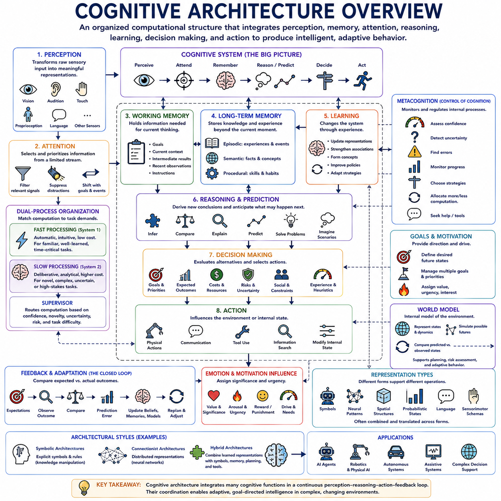{width="7.268055555555556in" height="7.268055555555556in"}

Cognitive architecture refers to the organized computational structure through which an intelligent system integrates perception, memory, attention, reasoning, learning, decision making, and action. Rather than treating intelligence as a collection of isolated abilities, cognitive architecture examines how these functions interact over time to produce coherent behavior. It therefore provides a system-level framework for understanding both natural and artificial intelligence.

A cognitive architecture defines not only which cognitive components exist but also how information moves among them. Sensory inputs may enter through perceptual processes, become selectively prioritized by attention, interact with working memory and stored knowledge, contribute to reasoning and prediction, and eventually influence decisions and actions. Feedback from those actions then changes subsequent perception, memory, and learning.

Perception provides the architecture with information about external and internal states. Visual, auditory, tactile, proprioceptive, linguistic, and other signals must be transformed from raw sensory patterns into representations that can support higher-level cognition. Perception is therefore not merely an input interface but an active interpretation process that continuously connects the cognitive system with its environment.

Attention regulates which information receives limited processing resources. Real environments contain more sensory and internal information than a cognitive system can analyze with equal depth. Attention selects relevant signals, suppresses distractions, shifts according to goals or unexpected events, and helps determine what enters working memory. It consequently acts as an important control mechanism connecting perception with higher cognitive processes.

Working memory maintains information that is immediately relevant to current cognition. It can preserve temporary goals, intermediate reasoning results, recent observations, instructions, and task context while operations are being performed. Because working memory has limited capacity, cognitive architectures require mechanisms for prioritizing, compressing, retrieving, and replacing information as tasks develop over time.

Long-term memory provides persistent knowledge beyond the immediate processing cycle. Episodic memory can preserve experiences and events, semantic memory can represent facts and concepts, and procedural memory can encode skills and action patterns. These memory systems allow current cognition to benefit from previous learning, enabling recognition, prediction, reasoning, planning, and behavior to build upon accumulated experience.

Learning changes the architecture through experience. New observations can modify representations, strengthen associations, create concepts, improve policies, update world knowledge, and refine strategies. Learning may occur gradually through repeated exposure or rapidly from important individual experiences. A cognitive architecture must therefore support both immediate information processing and longer-term adaptation of the mechanisms that produce behavior.

Reasoning operates on available representations to derive conclusions that are not directly present in current sensory input. It can combine prior knowledge with observations, compare alternatives, infer hidden causes, evaluate relationships, and solve unfamiliar problems. Reasoning may range from rapid associative processing to explicit multi-step deliberation, depending on task complexity, uncertainty, and available cognitive resources.

Prediction allows cognition to extend beyond the present state. An intelligent system continuously anticipates what may happen next, how objects or agents may behave, and what consequences different actions could produce. Prediction supports perception by creating expectations and supports planning by providing estimates of future states. Prediction errors can then drive attention, learning, belief revision, and adaptation.

Decision making converts competing possibilities into selected commitments. The architecture may evaluate goals, expected outcomes, costs, risks, uncertainty, social constraints, and previous experience before choosing an action. Some decisions can be generated rapidly through learned policies or heuristics, whereas others require deliberate comparison. Effective architectures must determine when immediate action is sufficient and when deeper evaluation is justified.

Dual-process organization provides one framework for coordinating these different computational demands. Fast processing can support familiar perception, intuitive judgment, routine language processing, and practiced actions. Slow processing can support planning, verification, complex reasoning, and unfamiliar problems. A supervisory mechanism can allocate computation between these modes according to confidence, novelty, uncertainty, risk, and task difficulty.

Metacognition adds another control layer by allowing the system to evaluate its own cognitive state. It can estimate confidence, detect uncertainty, recognize errors, monitor progress, and determine whether additional reasoning is required. Metacognitive signals can trigger memory retrieval, deeper analysis, strategy changes, external information gathering, or requests for assistance, making cognition more adaptive than a fixed processing pipeline.

Goals organize cognition around desired future states. They influence attention, memory retrieval, reasoning, planning, and action selection by defining what information and outcomes are currently relevant. Complex systems may maintain multiple goals simultaneously and resolve conflicts among them according to priorities and constraints. Goal management therefore provides direction across otherwise separate cognitive functions.

Planning connects goals with future action sequences. Rather than selecting only the next immediate response, a cognitive system can construct intermediate objectives, examine dependencies, predict consequences, and organize actions across time. Hierarchical planning can separate abstract strategic objectives from detailed operational actions, allowing cognition to reason across multiple temporal and conceptual scales.

Action closes the cognitive loop by allowing internal representations and decisions to influence the environment. Actions may include physical movement, communication, tool use, information search, or modification of internal computational states. Once an action occurs, its consequences become new observations. Cognition therefore operates as a continuous perception--reasoning--action cycle rather than a one-directional sequence from input to output.

Feedback enables the architecture to compare expected and actual outcomes. Successful predictions can reinforce models and strategies, while unexpected outcomes generate prediction errors that indicate incomplete knowledge or inappropriate assumptions. Feedback can modify confidence, redirect attention, update memory, initiate learning, and trigger replanning. Closed-loop feedback is therefore fundamental to adaptive intelligent behavior.

Emotion and motivational processes also influence cognitive architecture by assigning significance and urgency to events, goals, and possible outcomes. In biological cognition, these processes affect attention, memory, learning, risk evaluation, and action selection. Computational architectures may implement analogous functional mechanisms through reward signals, priorities, utility functions, drives, or dynamically changing goal values without reproducing biological emotion itself.

Cognitive architectures must also address the problem of representation. Information may be represented through symbols, distributed neural patterns, spatial structures, probabilistic states, language, sensory features, or combinations of these forms. Different representations support different operations, so integrated intelligence may require mechanisms that translate or align information across symbolic, neural, linguistic, perceptual, and action-oriented representations.

Classical cognitive architectures often emphasize explicit symbolic representations and structured rules for manipulating knowledge. Connectionist approaches instead emphasize distributed representations learned through networks of interacting computational units. Modern architectures increasingly combine these traditions, using learned neural representations for perception and prediction while incorporating memory, planning, tools, constraints, or structured reasoning for higher-level control.

Artificial intelligence provides a practical environment for implementing cognitive architectural principles. Foundation models can supply broad perceptual, linguistic, and reasoning capabilities, while external memory, retrieval systems, planners, tools, evaluators, and controllers provide complementary functions. The resulting architecture can transform a powerful predictive model into a larger system capable of persistent, adaptive, goal-directed behavior.

Agentic AI illustrates this architectural integration particularly clearly. An agent maintains goals and state, observes its environment, retrieves relevant knowledge, reasons about alternatives, selects tools or actions, evaluates outcomes, and updates future behavior. Agency therefore emerges not from a single cognitive component but from coordinated interactions among multiple functions operating within repeated closed-loop decision cycles.

World models can serve as internal predictive components of cognitive architectures. They represent aspects of the environment and estimate how states may evolve through time or under different actions. By simulating possible futures, a cognitive system can evaluate candidate plans before execution. Differences between predicted and observed states then provide signals for updating beliefs, models, strategies, and confidence.

For Physical AI, cognitive architecture must connect high-level intelligence with real-time embodied control. Perception, localization, world modeling, memory, task reasoning, motion planning, manipulation, safety monitoring, and low-level control operate at different frequencies and computational scales. The architecture must coordinate these processes while preserving rapid responses to immediate hazards and deeper reasoning for complex goals.

An embodied cognitive architecture must remain grounded in continuous interaction with the physical world. Internal beliefs can become outdated as objects move, people act, sensors drift, or environmental conditions change. Consequently, perception must repeatedly correct internal representations, actions must be evaluated through feedback, and plans must remain revisable. Intelligence becomes a continuous process of maintaining useful alignment between internal models and external reality.

Cognitive architecture ultimately provides the organizational foundation through which separate cognitive capabilities become an integrated intelligent system. Perception supplies evidence, attention prioritizes it, memory preserves experience, reasoning interprets possibilities, prediction anticipates futures, planning organizes actions, metacognition supervises processing, and feedback supports learning. Their coordinated interaction creates adaptive cognition capable of pursuing goals in changing environments.

## 06.01 SOAR [w/Code]

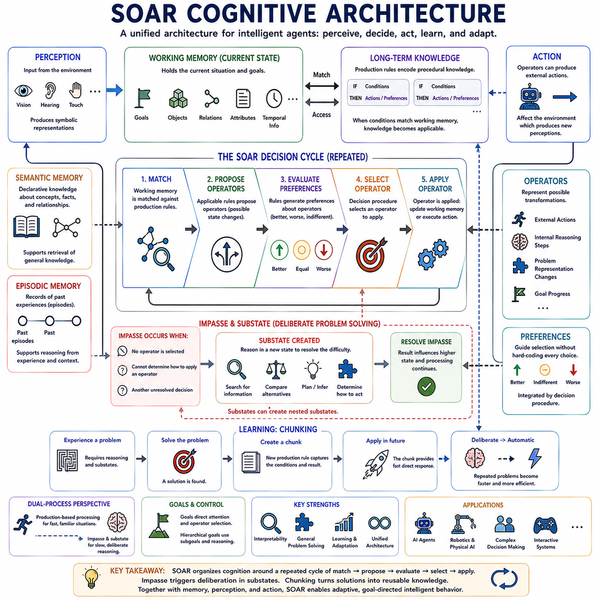{width="7.268055555555556in" height="7.268055555555556in"}

SOAR is a cognitive architecture designed to model general intelligent behavior through a unified computational framework for problem solving, reasoning, learning, memory, and action. Rather than constructing separate systems for every cognitive task, SOAR organizes cognition around common mechanisms that can operate across different domains. Its central objective is to explain how an intelligent agent can select actions, solve problems, acquire knowledge, and improve through experience.

The architecture originated from research on human cognition and artificial intelligence and was developed as an attempt to formulate a general theory of cognition. SOAR treats intelligence as the coordinated operation of persistent architectural mechanisms rather than as a collection of unrelated algorithms. Knowledge can vary between tasks, while the underlying mechanisms for decision making, learning, memory access, and problem solving remain relatively stable.

SOAR represents an agent\'s current situation through a working memory containing symbolic structures that describe states, goals, objects, relationships, and other task-relevant information. Working memory changes continuously as perception introduces new information and internal reasoning generates additional structures. It therefore provides the active context within which the architecture evaluates possible actions and determines what should happen next.

Long-term knowledge is primarily represented through production rules that specify relationships between conditions and actions. When conditions represented in working memory match the conditions of a production, that knowledge becomes applicable to the current situation. Multiple productions can match simultaneously, allowing different pieces of knowledge to contribute in parallel before the architecture selects among possible operators.

Operators are central to SOAR because they represent possible transformations of the current state. An operator may correspond to an external action, an internal reasoning step, a change in problem representation, or progress toward a goal. Cognition repeatedly proposes operators, evaluates them, selects an appropriate operator, and applies it, creating a structured decision cycle through which behavior unfolds over time.

The decision cycle provides the basic rhythm of processing within SOAR. Knowledge in long-term memory matches the current working-memory state, productions generate preferences concerning possible operators, and the architecture evaluates those preferences to select an operator. The selected operator is then applied, potentially changing working memory or producing an external action, after which the cycle begins again with the updated state.

Preferences allow knowledge to influence operator selection without requiring every decision to be encoded as a rigid sequence. Productions can indicate that an operator is acceptable, preferable, worse than another, or otherwise related to competing alternatives. The decision procedure integrates these preferences to determine whether sufficient information exists to make a choice, separating domain knowledge from the architectural mechanism responsible for selection.

A distinctive feature of SOAR is its treatment of situations in which normal knowledge is insufficient to make progress. If the architecture cannot select an operator, cannot determine how an operator should be applied, or encounters another unresolved decision, an impasse occurs. Instead of treating the impasse merely as failure, SOAR automatically creates a substate in which additional reasoning can be performed to resolve the difficulty.

Substates provide a mechanism for deliberate problem solving. The architecture can reason about why the higher-level decision cannot proceed, search for missing information, compare alternatives, or determine how an operator should be implemented. Because substates can themselves encounter impasses, SOAR can create nested reasoning structures. Complex problem solving can therefore emerge recursively from the same basic architectural mechanisms used for ordinary decisions.

Once reasoning within a substate resolves an impasse, the resulting knowledge can influence the higher-level state and allow processing to continue. This organization provides a natural relationship between routine behavior and deliberation. Familiar situations can proceed through rapid operator selection, whereas difficult situations automatically generate additional reasoning when existing knowledge is insufficient to determine the next step.

Chunking is SOAR\'s characteristic learning mechanism for converting problem-solving experience into reusable knowledge. When reasoning in a substate produces a useful result, SOAR can construct a new production rule that captures the conditions responsible for that result. If a similar situation occurs later, the learned production can generate the result directly, reducing or eliminating the need to repeat the original deliberative reasoning process.

This learning process illustrates an important relationship between deliberate and automatic cognition. A problem may initially require several reasoning steps and nested substates, but after successful experience, chunking can compile the relevant result into production knowledge. Repeated problems can therefore become faster and more direct over time, providing an architectural explanation for how deliberate problem solving can develop into efficient skilled behavior.

SOAR also includes mechanisms beyond procedural production knowledge. Semantic memory can preserve general declarative knowledge about concepts, facts, and relationships, while episodic memory can store information associated with previous experiences. These memory systems allow an agent to retrieve knowledge that is not necessarily available through immediate production matching and to use previous states or events during current reasoning.

Semantic memory supports access to relatively context-independent knowledge. An agent may retrieve properties of objects, conceptual relationships, or previously learned facts when such information becomes relevant to a task. This extends cognition beyond the knowledge currently active in working memory and allows reasoning to incorporate persistent declarative information without requiring every fact to be encoded directly into procedural rules.

Episodic memory provides access to previous experiences represented as sequences or snapshots of earlier states. When an agent encounters a new problem, retrieval of related episodes can provide information about what occurred in similar situations. Episodic memory can therefore support reasoning from experience, reconstruction of previous contexts, and decisions that depend on knowledge of earlier interactions rather than only generalized facts.

Perception and action connect SOAR with an external environment. Perceptual systems introduce representations of environmental conditions into working memory, while selected operators can generate commands that affect the environment. The consequences of those actions produce new perceptual information, creating a continuous closed loop between cognition and the world rather than limiting the architecture to abstract symbolic problem solving.

SOAR can be interpreted through a dual-process perspective even though its original organization is not simply identical to System 1 and System 2. Production-based processing can support rapid responses when appropriate knowledge already exists, while impasses and substates introduce additional reasoning when direct processing cannot resolve a decision. Chunking then allows solutions discovered through slower reasoning to become available as faster procedural knowledge in future situations.

Goals are represented within the evolving cognitive state and influence which operators are relevant to current behavior. Complex objectives can produce sequences of intermediate decisions, while impasses can generate subordinate reasoning processes needed to continue toward the objective. SOAR therefore supports goal-directed cognition without requiring every complete action sequence to be predetermined before execution.

SOAR\'s symbolic organization provides interpretability because states, operators, preferences, production rules, and goals can often be examined explicitly. Researchers can investigate why particular operators were proposed, what knowledge influenced a decision, and how learned productions changed later behavior. This transparency distinguishes traditional cognitive architectures from many large neural models whose internal representations are distributed across learned parameters.

At the same time, symbolic cognitive architectures face challenges when processing high-dimensional sensory information such as images, speech, and complex continuous environments. Modern intelligent systems can therefore combine neural perception with symbolic cognitive mechanisms. Neural models may transform raw sensory data into structured representations, while SOAR-like mechanisms can manage goals, reasoning, memory, decisions, and learned procedural knowledge at a higher level.

This possibility makes SOAR conceptually relevant to contemporary hybrid AI architectures. Deep learning can provide powerful representation learning and pattern recognition, while cognitive architecture provides persistent state, explicit goals, structured memory, decision cycles, and mechanisms for deliberate problem solving. The two approaches address different aspects of intelligence and can potentially be integrated rather than treated as mutually exclusive alternatives.

For agentic AI, SOAR offers an important historical and conceptual example of intelligence organized around repeated perception--decision--action cycles. An agent does not merely generate a response to a single prompt but maintains state, evaluates alternatives, encounters difficulties, performs additional reasoning, learns from solutions, and continues acting. These principles closely resemble many requirements now associated with persistent autonomous AI agents.

SOAR is also relevant to Physical AI because embodied robots require coordination among perception, internal state, goals, decision making, memory, learning, and action. Fast learned behaviors can handle familiar situations, while unresolved conditions can trigger additional reasoning or planning. A hybrid robotic architecture could therefore combine neural perception and control with cognitive mechanisms inspired by SOAR for task-level reasoning and adaptive behavior.

The broader importance of SOAR lies in its attempt to explain intelligence through reusable architectural mechanisms rather than isolated task-specific solutions. Working memory represents the current cognitive state, production rules provide procedural knowledge, operators structure possible actions, preferences guide selection, impasses trigger deeper reasoning, substates support problem solving, and chunking converts successful deliberation into reusable knowledge.

SOAR ultimately demonstrates how cognition can be organized as a continuous interaction among representation, decision, reasoning, memory, learning, and action. Its architecture shows how an intelligent system can respond efficiently when knowledge is sufficient, deliberate when knowledge is insufficient, and learn from that deliberation so future behavior becomes more effective. These ideas remain relevant when designing hybrid, agentic, and embodied AI systems that must operate adaptively over extended periods.

## 06.02 ACT R [w/Code]

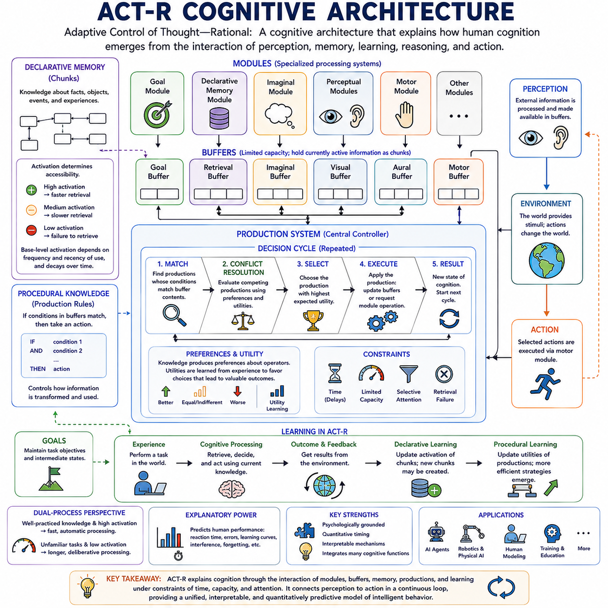{width="7.268055555555556in" height="7.268055555555556in"}

ACT-R, or Adaptive Control of Thought---Rational, is a cognitive architecture developed to explain how human cognition emerges from interactions among perception, memory, learning, reasoning, and action. It proposes that diverse cognitive activities can be understood through a relatively stable set of computational mechanisms. Rather than modeling each task independently, ACT-R provides a unified architecture in which task-specific knowledge operates through common cognitive processes.

The architecture is strongly connected to experimental cognitive psychology and attempts to describe cognition at a level that can generate measurable behavioral predictions. ACT-R models can predict quantities such as response time, memory retrieval latency, error patterns, and learning effects. This emphasis distinguishes cognitive architecture from purely functional AI because the objective is not only successful task performance but also an explanation of how human-like cognitive processing unfolds over time.

ACT-R organizes cognition into specialized modules that perform different functions while communicating through a central production system. Modules can represent perceptual processing, motor activity, goals, declarative memory, and other cognitive capabilities. Each module maintains a limited interface called a buffer, allowing information to become available to the rest of the architecture without requiring unrestricted access to all internal module states.

Buffers are therefore critical communication structures within ACT-R. A buffer normally contains a small amount of currently active information represented as a chunk. The visual system may place information about a perceived object into a visual buffer, declarative memory may return retrieved knowledge through a retrieval buffer, and a goal buffer can maintain information relevant to the current objective. This limited availability reflects constraints on human cognitive processing.

Chunks are structured units used to represent declarative information. A chunk may encode an object, fact, event, relationship, goal state, or other meaningful knowledge through attributes and values. Declarative memory contains many chunks accumulated through experience, but only a small subset becomes active during a particular cognitive operation. Cognition therefore depends not merely on storing information but on efficiently retrieving relevant chunks when they are needed.

Declarative memory represents knowledge that can be explicitly retrieved, including facts and previous experiences. When the production system requests information, the memory system attempts to retrieve a chunk that satisfies the specified conditions. Retrieval is not treated as an instantaneous database lookup. Instead, ACT-R models memory accessibility quantitatively, allowing retrieval speed and probability to depend on previous use, recency, frequency, and contextual relevance.

Activation is a central concept governing declarative memory retrieval. Chunks with greater activation are generally easier and faster to retrieve, while chunks with low activation may require more time or fail to be recalled. Activation can reflect a history of previous encounters and current contextual influences. This provides a computational explanation for familiar psychological effects in which frequently or recently used information becomes more accessible.

Base-level activation captures how the history of using a memory influences its current accessibility. Knowledge that has been encountered repeatedly or used recently tends to maintain greater activation than rarely used or old information. However, activation gradually decreases over time. ACT-R therefore provides mechanisms for modeling both practice effects and forgetting as consequences of the changing accessibility of stored declarative knowledge.

Procedural knowledge is represented differently from declarative knowledge. Instead of chunks, ACT-R uses production rules that specify what cognitive operation should occur when particular conditions are satisfied. A production can inspect information currently available in buffers and initiate operations such as requesting a memory, shifting attention, updating a goal, or performing an action. Procedural cognition therefore controls how information is transformed and used.

The production system repeatedly evaluates which rules match the current buffer contents. When several productions are applicable, a conflict-resolution mechanism determines which production should execute. The selected production then changes buffers or requests operations from modules, producing a new cognitive state. Cognition unfolds as repeated cycles of matching conditions, selecting productions, executing operations, and responding to their consequences.

Production selection can incorporate utility, allowing the architecture to prefer actions that have historically produced valuable outcomes. A production associated with greater expected benefit can become more likely to be selected when several alternatives compete. Utility learning therefore provides a mechanism through which experience modifies procedural decision making, enabling the architecture to gradually favor strategies that have performed successfully.

Goals provide task-level direction within ACT-R. The goal buffer can maintain information describing the current objective or intermediate state of problem solving. Production rules inspect this information together with perceptual and memory contents to determine appropriate operations. As tasks progress, productions can modify the goal representation, effectively moving cognition through a sequence of intermediate states toward completion.

Perceptual modules connect cognition with incoming environmental information. Visual and auditory mechanisms can represent aspects of external stimuli and make selected information available through corresponding buffers. Attention determines which environmental information becomes available for further processing. This architecture allows perception to interact dynamically with goals and memory rather than functioning as an isolated preprocessing stage.

Motor modules allow cognitive decisions to produce observable behavior. Once procedural processing determines that an external response should occur, motor mechanisms execute the required action. Because perceptual, cognitive, and motor processes have temporal characteristics, ACT-R can model the total time required for tasks involving observation, memory retrieval, decision making, and physical response rather than treating cognition as instantaneous computation.

ACT-R places considerable emphasis on cognitive timing. Memory retrieval requires time, perceptual shifts require time, production execution requires time, and motor responses require time. These constraints allow models to generate detailed predictions about human performance. Differences of hundreds of milliseconds can become theoretically meaningful because they reveal how different cognitive operations contribute to the overall structure of behavior.

Learning occurs in both declarative and procedural components. Declarative learning changes the availability and activation of chunks as experience accumulates, while procedural learning can modify production utilities and develop more efficient strategies. Repeated performance can therefore transform slow and effortful task execution into faster behavior as relevant knowledge becomes more accessible and effective procedural choices become better established.

This transition can be interpreted in relation to automaticity. A novice may need several memory retrievals and intermediate cognitive steps to solve a problem, whereas an experienced individual may reach the appropriate response through a shorter sequence of well-practiced operations. ACT-R provides computational mechanisms for describing how repeated experience changes the timing, accessibility, and selection of cognitive processes without requiring an entirely different architecture.

ACT-R also provides an important model of bounded cognition. Memory retrieval can fail, attention is selective, buffers contain limited information, and cognitive operations require time. Intelligence is therefore modeled under resource constraints rather than assuming unlimited memory access and instantaneous reasoning. These limitations are essential for explaining errors, delays, interference, and other characteristics of actual human cognitive performance.

The architecture differs from conventional deep learning because much of its structure and knowledge organization is explicit. Chunks, buffers, production rules, activation values, utilities, and module interactions can be inspected and related to theoretical cognitive mechanisms. Deep neural networks instead learn distributed representations from large datasets. The approaches therefore emphasize different levels and mechanisms of intelligence.

Modern hybrid systems can potentially combine these strengths. Neural networks can provide perception, representation learning, language understanding, and prediction from high-dimensional data, while ACT-R-inspired mechanisms can provide structured working interfaces, explicit goals, memory retrieval, procedural control, and cognitive resource management. Such integration could connect learned representations with more interpretable task-level cognitive organization.

ACT-R is also relevant to contemporary memory-augmented and agentic AI. An artificial agent must maintain goals, retrieve relevant information, decide which operation to perform, observe results, and update subsequent behavior. These requirements resemble the interaction among goal buffers, declarative memory, productions, and perceptual or motor modules. ACT-R therefore provides useful historical principles for designing persistent goal-directed agents.

From a dual-process perspective, well-practiced production sequences and highly accessible memories can support relatively rapid processing, whereas unfamiliar tasks may require repeated retrieval, intermediate goals, and longer sequences of cognitive operations. ACT-R is not simply a System 1/System 2 architecture, but its mechanisms demonstrate how differences in practice, memory accessibility, and procedural organization can generate different levels of cognitive effort and processing speed.

For Physical AI, ACT-R offers conceptual lessons about coordinating perception, memory, goals, decision mechanisms, and action under limited resources. A robot similarly receives sensory information, maintains task state, retrieves relevant knowledge, selects operations, and executes physical responses. Modern robotic systems operate through different computational technologies, but the architectural problem of coordinating these functions remains closely related.

An embodied architecture inspired by ACT-R could combine neural perception with explicit task memory and procedural control. Sensor models could produce structured representations, memory systems could retrieve task-relevant knowledge, goal structures could maintain mission context, and learned policies or rules could select actions. Feedback from execution would then update the system, forming a continuous perception--cognition--action loop grounded in the physical environment.

The broader importance of ACT-R lies in its attempt to connect cognitive theory with executable computational models. Declarative chunks represent knowledge, activation controls accessibility, production rules represent procedural knowledge, utilities influence selection, buffers constrain communication, modules provide specialized functions, and learning modifies performance through experience. These mechanisms together create a detailed account of how multiple cognitive functions can cooperate.

ACT-R ultimately demonstrates that intelligent behavior can be understood as coordinated processing among specialized components operating under constraints of memory, attention, time, and experience. Its value extends beyond modeling individual psychological experiments because it provides a systematic framework for studying integrated cognition. The architecture remains relevant to discussions of hybrid AI, agentic systems, cognitive robotics, and artificial systems designed to combine memory, goals, reasoning, learning, and action.

## 06.03 CLARION [w/Code]

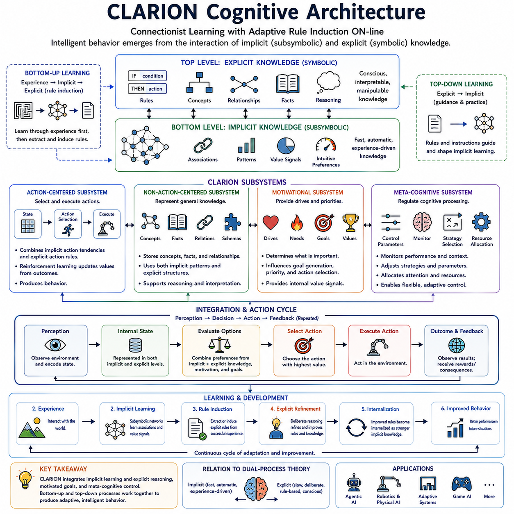{width="7.268055555555556in" height="7.268055555555556in"}

CLARION, or the Connectionist Learning with Adaptive Rule Induction ON-line architecture, is a cognitive architecture designed to explain intelligent behavior through the interaction of implicit and explicit cognitive processes. Its central idea is that cognition cannot be adequately represented by either symbolic rules or distributed neural processing alone. Instead, intelligence emerges from coordinated learning and processing across multiple representational levels.

A defining characteristic of CLARION is its distinction between implicit knowledge and explicit knowledge. Implicit knowledge is represented primarily through distributed subsymbolic structures that can support intuitive, automatic, and experience-driven behavior. Explicit knowledge is represented through symbolic rules and structures that can be consciously accessible, verbally expressible, or deliberately manipulated during reasoning and decision making.

These two forms of knowledge are organized into different representational levels rather than isolated systems. The bottom level generally represents implicit knowledge through connectionist mechanisms, while the top level represents explicit knowledge through symbolic structures. Information can influence behavior from both levels simultaneously, allowing learned patterns and explicit rules to cooperate or compete when the system selects an action.

The bottom level is especially important for learning from experience. Instead of requiring knowledge to be specified in advance as symbolic rules, subsymbolic networks can gradually acquire associations between states, actions, and outcomes. Through repeated interaction with an environment, the system develops patterns that support increasingly effective behavior even when it cannot explicitly describe the knowledge responsible for its performance.

The top level provides explicit representations that can support structured reasoning and more interpretable knowledge. Rules may specify relationships between conditions and actions or describe concepts and relationships that can be directly manipulated. Because these representations are explicit, they can support deliberate cognition, communication, explanation, and the transfer of knowledge across situations where purely implicit pattern matching may be insufficient.

CLARION emphasizes interaction between the two levels rather than treating them as independent cognitive pathways. Explicit rules can guide behavior while implicit knowledge supplies additional preferences based on accumulated experience. Their outputs can be integrated when selecting actions. This allows cognition to combine the efficiency and flexibility of learned intuition with the structure and interpretability of symbolic reasoning.

Bottom-up learning is one of CLARION\'s characteristic mechanisms. Knowledge may first be acquired implicitly through experience at the bottom level and later become represented explicitly through rule extraction or rule induction. A person or artificial agent may therefore learn how to perform a task before being able to articulate why a particular strategy works. Explicit knowledge can emerge gradually from successful implicit behavior.

Top-down learning operates in the opposite direction. Explicit knowledge supplied as instructions, rules, or prior knowledge can influence subsymbolic processing and guide learning at the bottom level. Repeated application of an explicit rule may gradually strengthen corresponding implicit representations. Behavior that initially requires deliberate rule following can therefore become increasingly automatic as experience accumulates.

The interaction between bottom-up and top-down learning provides a computational account of skill development. A learner may discover successful behavior through trial and error, extract an explicit rule from repeated experience, deliberately refine that rule, and eventually internalize the improved strategy as implicit knowledge. Learning therefore becomes a continuous exchange between experience-driven adaptation and explicit cognitive structure.

CLARION organizes cognition into several major subsystems that address different functional requirements. The Action-Centered Subsystem is concerned with selecting and executing actions, the Non-Action-Centered Subsystem handles general knowledge, the Motivational Subsystem provides drives and motivational influences, and the Meta-Cognitive Subsystem regulates cognitive processing. Their interaction creates a broader architecture for adaptive goal-directed behavior.

The Action-Centered Subsystem focuses on procedural knowledge and behavior selection. It maps information about the current state onto possible actions and evaluates alternatives using both implicit and explicit knowledge. The bottom level can learn action tendencies from experience, while the top level can contain explicit action rules. Their combined influence determines which behavior is selected under particular environmental conditions.

Reinforcement learning can play an important role within this action-centered processing. Actions produce outcomes, and feedback from those outcomes changes the values associated with future choices. Through repeated state--action--reward interactions, implicit representations can learn effective policies. Explicit rules can complement this process by incorporating prior knowledge, constraints, or strategies that would otherwise require extensive experience to discover.

The Non-Action-Centered Subsystem represents knowledge that is not primarily concerned with immediate action selection. It can support concepts, facts, relationships, and other forms of general knowledge required for reasoning and interpretation. As with procedural processing, implicit and explicit representations can coexist, allowing conceptual knowledge to include both distributed learned patterns and more structured symbolic descriptions.

The Motivational Subsystem provides internal drives that influence which goals and actions receive priority. Cognition does not operate independently of motivation because different environmental states may have different significance depending on current needs. Drives can therefore influence action selection, learning, and goal formation, providing internal value signals that help organize behavior rather than relying only on external stimuli.

The Meta-Cognitive Subsystem provides higher-level regulation of cognitive activity. It can influence processing strategies, allocate resources, modify parameters, regulate goals, and respond to changing task demands. This introduces a supervisory dimension in which the architecture not only processes information but can also alter how processing is performed according to internal states, environmental conditions, or performance requirements.

Goal structures connect motivational and cognitive processes. Motivational signals can encourage the formation or prioritization of goals, while cognitive mechanisms determine how those goals can be pursued. Goals then influence action selection and information processing. This creates a continuous relationship among motivation, cognition, decision making, and behavior rather than treating goals as externally supplied commands disconnected from the architecture.

CLARION\'s implicit--explicit distinction has a natural relationship with dual-process theories of cognition. Implicit subsymbolic processing resembles important characteristics associated with fast, intuitive processing, while explicit symbolic processing resembles deliberate and rule-based cognition. The correspondence is not exact, but CLARION provides a concrete computational framework for studying interactions between automatic and controlled forms of processing.

Automaticity can emerge as explicit processing becomes supported by increasingly strong implicit knowledge. A novice may initially rely heavily on instructions and explicit rules, requiring attention and deliberate processing. With practice, subsymbolic representations become better adapted to recurring situations, allowing behavior to be produced more rapidly and with less dependence on explicit reasoning. Expertise can therefore develop through changes in the balance between levels.

The reverse process is also important when automatic behavior becomes inadequate. Novel situations, conflicts, errors, or changing environmental conditions may require greater reliance on explicit knowledge and deliberate reasoning. Explicit processing can modify strategies or introduce new rules, after which continued experience can again reshape implicit knowledge. Adaptive cognition therefore depends on movement in both directions between automatic and deliberate processing.

CLARION differs from purely symbolic cognitive architectures because it gives subsymbolic learning a fundamental role rather than treating all important knowledge as explicitly encoded rules. It also differs from purely connectionist approaches because symbolic representations remain an important component of cognition. The architecture consequently represents an early and influential form of hybrid cognitive modeling that attempts to integrate symbolic and neural principles.

This hybrid organization is particularly relevant to modern artificial intelligence. Deep neural networks provide powerful mechanisms for perception, pattern recognition, representation learning, and policy acquisition, while symbolic or structured mechanisms can provide explicit constraints, rules, goals, reasoning, and interpretable knowledge. CLARION demonstrates conceptually how these capabilities can interact rather than requiring one representational paradigm to replace the other.

The architecture is also relevant to agentic AI because autonomous agents require both learned behavior and explicit control. An agent may develop policies from experience while simultaneously following instructions, constraints, plans, and goals. Meta-cognitive mechanisms can regulate these processes, motivational structures can determine priorities, and environmental feedback can continuously modify learned behavior. This produces a persistent adaptive decision loop.

For Physical AI, the implicit level can be related conceptually to learned perception and control policies that operate rapidly from sensor information, while explicit mechanisms can support task rules, constraints, planning, and higher-level reasoning. A robot may execute familiar behavior through learned policies but invoke structured reasoning when facing unusual situations, conflicts, safety constraints, or new task requirements.

Embodied interaction is particularly important because CLARION emphasizes learning through experience. An intelligent robot can observe environmental states, select actions, receive consequences, update implicit knowledge, and gradually construct more effective behavior. Explicit knowledge can accelerate this process by supplying task instructions or safety constraints, while experience can reveal patterns that were never completely specified by designers.

CLARION also highlights that cognition involves more than prediction or reasoning alone. Motivation determines what matters, meta-cognition regulates how processing occurs, knowledge systems represent what is known, and action mechanisms determine what is done. Intelligence therefore emerges from coordination among multiple subsystems operating across implicit and explicit levels rather than from a single general-purpose computational mechanism.

The broader significance of CLARION lies in its attempt to explain how learned intuition, explicit knowledge, motivation, meta-cognition, and action can coexist within one cognitive system. Bottom-up learning can transform implicit experience into explicit knowledge, while top-down learning can transform explicit instruction into increasingly automatic behavior. These reciprocal processes provide a framework for understanding adaptation, skill acquisition, and cognitive flexibility.

Ultimately, CLARION presents cognition as a hybrid, multi-level, continuously learning architecture. Implicit connectionist representations provide adaptive pattern-based competence, explicit symbolic structures provide deliberate and interpretable knowledge, motivational processes establish priorities, and meta-cognitive processes regulate cognition. Their coordinated interaction offers an important architectural model for understanding human cognition and designing adaptive, agentic, and embodied artificial intelligence.

## 06.04 LIDA [w/Code]

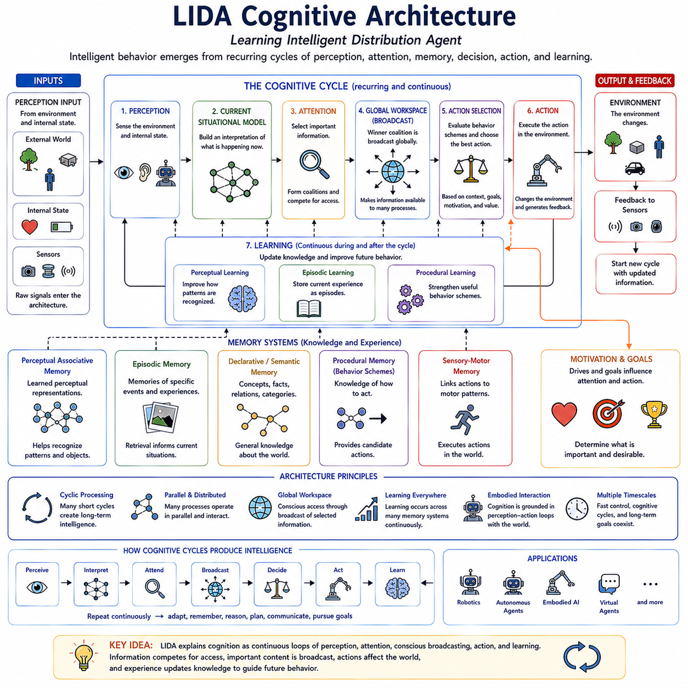{width="7.268055555555556in" height="7.268055555555556in"}

LIDA, or the Learning Intelligent Distribution Agent architecture, is a cognitive architecture designed to model integrated cognition through recurring cycles of perception, attention, memory, learning, decision making, and action. Rather than treating cognition as a single sequential computation, LIDA describes intelligent behavior as the coordinated activity of multiple specialized processes operating continuously and partly in parallel within an embodied agent.

A central principle of LIDA is the cognitive cycle, a recurring sequence through which an agent perceives its environment, constructs an interpretation of the current situation, selects information for conscious processing, chooses an appropriate action, and learns from the resulting experience. Each cycle is relatively short, while complex cognition emerges from many interacting cycles unfolding continuously over longer periods of time.

The cognitive cycle provides a bridge between moment-to-moment processing and extended intelligent behavior. Individual cycles can respond to immediate environmental changes, while sequences of cycles support activities such as reasoning, planning, problem solving, communication, and goal pursuit. Cognition is therefore understood as an ongoing stream of coordinated processing rather than as isolated responses to individual inputs.

Perception begins when sensory information enters the architecture from the environment or the agent\'s internal state. Specialized perceptual processes analyze incoming signals and identify features, objects, events, and relationships that may be relevant. Perception is not simply passive recording because previously learned knowledge influences how sensory information is interpreted and which structures become meaningful within the current context.

The Perceptual Associative Memory contains learned representations that help recognize meaningful patterns in incoming information. Current sensory data can activate related perceptual structures, allowing the architecture to categorize objects and situations according to previous experience. This interaction between sensory input and learned representations transforms raw information into cognitively useful content that can participate in subsequent processing.

The Current Situational Model represents the architecture\'s evolving interpretation of what is happening now. It integrates perceptual information with relevant knowledge retrieved from memory, creating a structured representation of objects, events, relationships, and contextual conditions. Because environments continually change, this model must also change from cycle to cycle as new information becomes available.

Workspace mechanisms allow information from perception and memory to interact during construction of the current situation. Relevant episodes, concepts, expectations, and relationships can contribute to interpretation. The resulting representation is therefore not determined solely by present sensory input. It reflects an interaction among current evidence, previous experience, contextual knowledge, and the agent\'s ongoing cognitive state.

Attention is essential because only a portion of the information represented within the architecture can receive prioritized processing. Attention codelets detect information that may be important because of novelty, relevance, urgency, goals, or other factors. These processes form coalitions of related content that compete for access to the architecture\'s global broadcasting mechanism.

Competition among attentional coalitions determines which content becomes globally available. Different perceptual events, memories, goals, or internal concerns may simultaneously demand processing resources. LIDA therefore models attention as a competitive selection process rather than an unrestricted flow of all available information. The winning coalition gains a privileged role in coordinating subsequent cognitive activity.

LIDA is strongly influenced by Global Workspace Theory, which proposes that consciousness involves the widespread broadcasting of selected information across otherwise specialized cognitive processes. In LIDA, the content that wins the attentional competition enters the Global Workspace and is broadcast throughout the architecture. This broadcast makes selected information available to multiple memory, learning, evaluation, and action-related mechanisms.

Conscious broadcast does not imply that every cognitive process is conscious. Much of LIDA\'s processing occurs outside global awareness through specialized mechanisms operating automatically. Conscious content represents information that has temporarily achieved broad accessibility because it is sufficiently important to influence multiple systems. The architecture therefore combines extensive unconscious processing with limited but globally influential conscious processing.

The global broadcast can activate several forms of learning simultaneously. Perceptual learning can modify how environmental patterns are recognized, episodic learning can preserve aspects of current experience, and procedural learning can change the likelihood of selecting particular behaviors. Conscious processing therefore acts not merely as an informational endpoint but as an important coordination mechanism for adaptation across the architecture.

Episodic memory allows information about previous experiences to influence current cognition. When the current situation resembles earlier events, relevant episodes can be retrieved and incorporated into the situational model. Past experience can consequently affect interpretation, expectations, decisions, and behavior. New experiences can also be encoded, creating a continuing relationship between present processing and accumulated personal history.

Declarative and semantic forms of knowledge provide more generalized information beyond individual episodes. Concepts, relationships, categories, and learned regularities can influence interpretation of current events. Together with episodic information, this knowledge allows cognition to move beyond immediate sensory evidence and use accumulated experience to construct richer models of situations and possible outcomes.

Procedural memory contains schemes for possible actions. When information is globally broadcast, relevant behavior schemes can become activated according to the current situation, goals, expectations, and learned associations. Multiple schemes may become candidates for execution. The architecture must therefore move from conscious information availability toward action selection rather than assuming that awareness automatically determines behavior.

Action selection evaluates competing behavior schemes and determines which action should be executed. Selection can depend on activation levels, contextual relevance, motivational influences, expected consequences, and previously learned values. The chosen scheme is then instantiated into an executable action. This creates a transition from perception and conscious evaluation to concrete interaction with the environment.

Sensory-motor memory supports the execution of selected actions by connecting higher-level behavior choices with appropriate motor patterns. Once an action has been chosen, lower-level mechanisms translate the selected behavior into operations capable of affecting the environment. The resulting environmental change generates new sensory input, beginning another cognitive cycle and closing the perception--cognition--action loop.

Learning occurs continuously throughout repeated cognitive cycles. Experiences alter perceptual associations, episodic memories, procedural structures, and other internal representations. Consequently, the architecture that processes a situation today may respond differently to a similar situation later. LIDA therefore treats learning as an integral property of cognition rather than as a separate training phase performed before intelligent behavior begins.

Motivation influences which information becomes important and which behaviors become attractive. Internal drives, needs, goals, and affective values can modify attention and action selection. The same environmental event may therefore produce different cognitive consequences depending on the agent\'s current state. Intelligent behavior emerges from the interaction between external conditions and internally generated priorities.

LIDA\'s organization illustrates how fast automatic processing and more globally coordinated cognition can coexist. Many specialized processes operate rapidly and unconsciously, while attentional competition occasionally selects content for global broadcast. This resembles some aspects of dual-process cognition, although LIDA is not simply divided into System 1 and System 2. Complex cognition instead emerges from repeated coordination across many cycles.

Extended reasoning can arise through sequences of cognitive cycles rather than requiring one exceptionally long processing operation. A conclusion reached during one cycle can modify the situational model and become input to subsequent cycles. Step-by-step reasoning, planning, and problem solving can therefore emerge as intermediate representations are repeatedly constructed, attended to, broadcast, evaluated, and transformed.

This cyclic organization is particularly relevant to agentic AI. Persistent agents must repeatedly observe changing conditions, update internal state, identify important information, retrieve relevant memories, choose actions, evaluate consequences, and learn. LIDA provides a conceptual architecture in which these capabilities are coordinated through recurring cycles instead of being treated as independent modules invoked only when explicitly requested.

Modern neural models could potentially provide several capabilities required within a LIDA-inspired system. Deep networks can support perception and representation learning, language models can contribute semantic interpretation and reasoning, and learned policies can assist action selection. Memory systems, attentional control, global information sharing, and explicit agent state can then organize these learned components within a persistent cognitive loop.

LIDA is especially relevant to Physical AI because embodied intelligence must operate continuously in environments that change while actions are being executed. A robot cannot complete perception once and then reason indefinitely from a frozen world representation. It must repeatedly perceive, update its situational model, allocate attention, select behavior, execute actions, observe consequences, and revise its knowledge as the physical world evolves.

For robotic systems, the Current Situational Model can be conceptually related to an evolving world state assembled from cameras, LiDAR, proprioception, localization, language, and other sensory information. Attention can prioritize hazards, goals, people, objects, or unexpected events. Action-selection mechanisms can then coordinate navigation, manipulation, communication, or other behaviors according to the currently broadcast information.

The architecture also highlights the importance of different temporal scales. Low-level sensor and motor control may operate much faster than complete cognitive cycles, while planning and complex problem solving may extend across many cycles. An effective embodied architecture therefore requires coordination among rapid reactive control, intermediate cognitive processing, and longer-term goals without forcing every function to operate at the same frequency.

LIDA\'s broader significance lies in its attempt to explain cognition through continuous interaction among specialized processes rather than through a single reasoning engine. Perception constructs meaningful representations, memory contributes previous knowledge, attention selects important content, global broadcasting coordinates processing, procedural memory proposes behaviors, action selection chooses responses, and learning modifies future cognition.

Ultimately, LIDA presents intelligence as an ongoing sequence of perception--attention--broadcast--action--learning cycles embedded within continuous interaction with an environment. Individual mechanisms perform specialized functions, but adaptive cognition emerges from their repeated coordination. This perspective provides a useful conceptual bridge among cognitive science, consciousness research, agentic AI, and Physical AI systems that must perceive, remember, decide, learn, and act continuously.

## 06.05 Global Workspace Theory [w/Code]

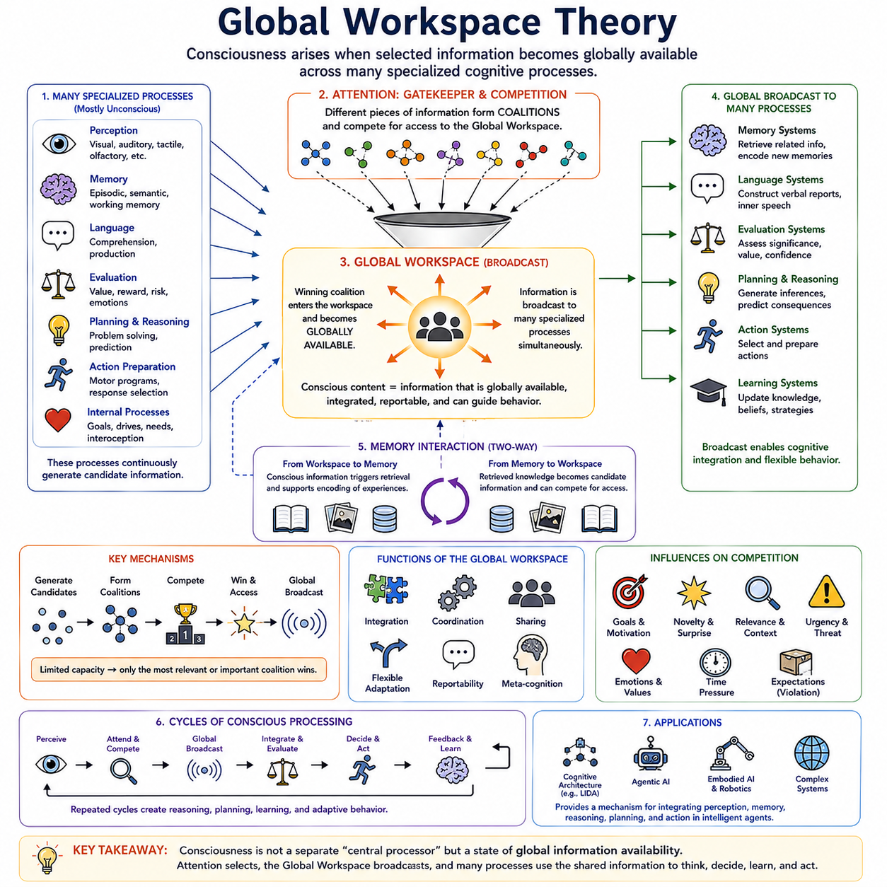{width="7.268055555555556in" height="7.268055555555556in"}

Global Workspace Theory proposes that conscious cognition emerges when selected information becomes globally available to many otherwise specialized cognitive processes. Instead of assuming that consciousness is produced by a single central processor, the theory describes the mind as a distributed collection of specialized systems. Most processes operate locally and unconsciously, while a limited amount of selected information gains widespread access across the cognitive system.

The theory is closely associated with Bernard Baars, who introduced the global workspace as a functional framework for understanding consciousness and cognitive integration. The central problem addressed by the theory is how numerous specialized processes involved in perception, memory, language, attention, evaluation, and action can coordinate their activities. A shared workspace provides a mechanism through which selected information can influence many systems simultaneously.

A common metaphor compares the global workspace to a theater. Conscious information resembles the content illuminated on a stage, while numerous unconscious processes operate behind the scenes. Attention determines which information reaches the illuminated stage, and the selected content is then made available to a large audience of specialized cognitive systems. The metaphor emphasizes limited conscious capacity combined with extensive unconscious processing.

Most cognitive processing occurs outside the global workspace. Visual analysis, auditory processing, memory activation, emotional evaluation, motor preparation, and other specialized operations can proceed without becoming conscious. These processes continuously generate interpretations and candidate contents. Only a small fraction becomes sufficiently important or relevant to compete successfully for access to the global workspace.

Competition is therefore a fundamental mechanism within Global Workspace Theory. Different representations may simultaneously compete for global availability because cognitive capacity is limited. A sudden sound, a relevant memory, an unresolved goal, an unexpected visual event, or an internally generated thought may each become candidates. Attention and contextual relevance help determine which coalition of information becomes dominant.

Coalitions are groups of related cognitive contents that cooperate during competition for access to the workspace. Rather than individual signals competing independently, perceptual representations, memories, goals, emotions, and contextual information can combine into coherent structures. A sufficiently strong coalition may win the competition and enter the global workspace, allowing its integrated content to become widely accessible.

Once information gains access to the global workspace, it is globally broadcast to many specialized processes. Memory systems may encode or retrieve related information, language mechanisms may construct verbal descriptions, evaluative systems may estimate significance, planning processes may consider future consequences, and motor systems may prepare responses. Broadcasting therefore enables coordinated cognition without requiring direct connections among every specialized subsystem.

The global broadcast provides a solution to the problem of cognitive integration. Specialized processors may possess different forms of information, but globally available content creates a shared context that can influence them simultaneously. This allows perception to affect memory, memory to affect decision making, goals to influence attention, and conscious evaluation to modify action. Complex cognition emerges from this coordinated exchange.

Conscious access is limited compared with the enormous amount of unconscious processing occurring at any moment. This bottleneck is not necessarily a weakness. By allowing only selected information to become globally available, the architecture can prioritize information requiring broad coordination while leaving routine operations to specialized unconscious mechanisms. Consciousness can therefore function as a scarce coordination resource.

Attention and consciousness are closely related within the framework but should not be treated as identical. Attention helps amplify, select, and organize information that may gain access to the global workspace. Consciousness refers more specifically to the broad availability produced when selected content is globally broadcast. Attentional mechanisms can therefore be viewed as important contributors to determining what becomes globally accessible.

Working memory is also closely connected with global workspace processing. Information that becomes globally available can remain active long enough to influence reasoning, planning, comparison, and decision making. Recurrent processing may maintain or refresh selected representations across successive cognitive moments. The workspace consequently supports temporary integration of information required for complex cognitive operations.

Long-term memory interacts bidirectionally with globally available information. A conscious representation can trigger retrieval of related concepts, facts, or previous experiences, while retrieved memories can themselves become candidates for global access. Conscious processing can also promote memory encoding. The global workspace therefore creates a dynamic bridge between immediate cognitive activity and accumulated knowledge.

Perception can be understood as a progression from extensive unconscious processing toward selective global access. Sensory systems initially analyze many features and patterns in parallel. Some representations become sufficiently salient or task-relevant to attract attention and participate in competition. When selected and broadcast, perceptual content becomes available for explicit recognition, reporting, reasoning, and deliberate action.

Goals strongly influence workspace competition because information relevant to current objectives can receive greater priority. The same sensory event may become globally significant in one context and remain largely ignored in another. Goal-directed attention therefore modifies the competition among candidate contents, allowing cognition to allocate its limited global processing capacity according to current behavioral requirements.

Novelty and unexpected events can also capture global access. When environmental information violates expectations, specialized systems may generate strong signals indicating that existing models are insufficient. Such information can interrupt ongoing processing and become globally broadcast. This enables the cognitive system to reorient attention, retrieve relevant knowledge, revise expectations, and select a more appropriate response.

Global Workspace Theory provides an important account of flexible behavior. Routine actions can often be controlled by specialized automatic processes without requiring global access. Difficult, novel, ambiguous, or conflicting situations require broader coordination among memory, evaluation, reasoning, and action systems. Global broadcasting becomes especially valuable under these conditions because information must influence several cognitive functions at once.

This distinction has similarities with dual-process theories. Fast and familiar behavior can often proceed through specialized automatic mechanisms, while difficult problems may require globally coordinated processing. However, Global Workspace Theory is not simply a System 1 and System 2 model. Its emphasis is on information availability and cognitive integration rather than dividing cognition into exactly two independent processing systems.

Reasoning can unfold through repeated episodes of global broadcasting. A representation becomes globally available, activates relevant memories and processes, and generates new candidate information. Some of this new information then competes for the next broadcast. Multi-step reasoning can therefore emerge as a sequence of globally accessible states in which intermediate conclusions repeatedly modify the context for subsequent processing.

Planning can operate in a similar manner. A goal becomes globally available and activates possible actions, memories, constraints, and predictions. Candidate consequences can then enter the workspace and influence subsequent evaluation. Through repeated broadcasts, the system can construct and compare possible future trajectories. Deliberation consequently emerges from successive cycles of selection, broadcasting, evaluation, and updating.

Global Workspace Theory also provides a useful perspective on meta-cognition. Information about uncertainty, errors, conflicts, or performance can itself become globally available. Once broadcast, these signals can influence reasoning strategies, attention allocation, memory retrieval, and action selection. The system can therefore regulate aspects of its own processing by making internally generated information accessible to multiple cognitive mechanisms.

The theory has influenced computational cognitive architectures, particularly systems that model cognition as recurring cycles of competition and broadcast. LIDA is a prominent example in which attention coalitions compete for access to a global workspace and winning information is distributed throughout the architecture. Such computational interpretations demonstrate how abstract principles of global availability can be translated into mechanisms for integrated cognitive processing.

Global Workspace Theory is also conceptually relevant to modern artificial intelligence. Contemporary AI systems often contain specialized components for perception, language, memory, planning, reasoning, and action. A workspace-like mechanism could provide a shared representational context through which selected information becomes available to multiple components, helping coordinate otherwise separate capabilities within a persistent intelligent agent.

In agentic AI, global broadcasting can be interpreted as a mechanism for coordinating goals, observations, memories, plans, tool results, and internal evaluations. Not every piece of information needs to influence every process continuously. Instead, important information can be selected and placed into a shared context, allowing planning, reasoning, memory, and action systems to respond coherently to changing circumstances.

The concept is particularly relevant to Physical AI because embodied agents continuously receive far more sensory information than can be processed through high-level reasoning. Cameras, LiDAR, audio, proprioception, tactile sensors, and internal system states may generate enormous streams of data. Attention mechanisms must identify important events, while workspace-like processing can distribute selected information to planning, memory, reasoning, and control systems.

A robot encountering an unexpected obstacle illustrates this principle. Low-level perception may detect the object automatically, but information about the obstacle can become globally significant when it threatens the current goal. Broadcasting this information can activate localization, world modeling, risk assessment, path planning, memory retrieval, and action-selection processes, enabling coordinated adaptation rather than an isolated perceptual response.

Modern neural architectures provide possible mechanisms for implementing portions of these ideas, although they should not automatically be equated with Global Workspace Theory. Attention mechanisms, multimodal representations, recurrent state, memory systems, and shared latent spaces can facilitate information integration. A complete workspace-inspired architecture additionally requires mechanisms for competition, selective access, broadcasting, persistent context, and coordinated downstream influence.

The broader importance of Global Workspace Theory lies in explaining how a system composed of many specialized processes can nevertheless behave as an integrated cognitive agent. Extensive unconscious processing generates candidate information, attention organizes competition, selected content enters a limited workspace, global broadcasting distributes that content, and specialized systems use the shared information to guide memory, reasoning, learning, and action.

Ultimately, Global Workspace Theory presents consciousness as a mechanism of global information availability and cognitive coordination. Intelligence does not require every process to access every piece of information continuously. Instead, selective broadcasting allows important information to temporarily organize distributed cognitive activity. This principle provides a powerful conceptual bridge among consciousness research, cognitive architecture, agentic AI, and embodied Physical AI.

## 06.06 Predictive Processing [w/Code]

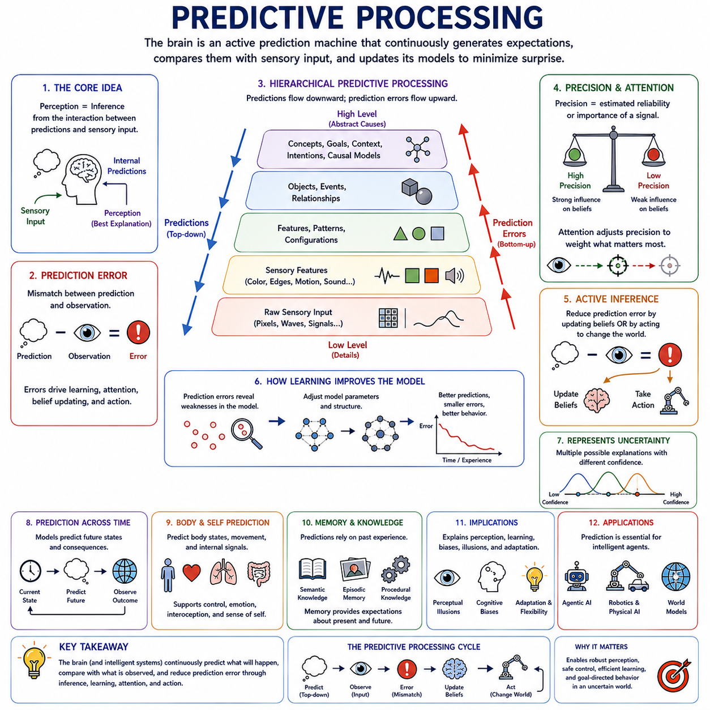{width="7.268055555555556in" height="7.268055555555556in"}

Predictive processing is a theoretical framework in cognitive science that describes the brain as an active prediction system rather than a passive receiver of sensory information. According to this view, perception emerges from continuous interaction between internally generated predictions and incoming sensory signals. The brain attempts to anticipate the causes of sensory input and updates its internal models whenever observations differ from what was expected.

A central idea of predictive processing is that the nervous system maintains generative models of the world. These models represent hypotheses about objects, events, relationships, bodily states, and environmental dynamics that could produce particular sensory patterns. Instead of reconstructing reality entirely from incoming data, the brain uses these models to predict likely sensory input and compares those predictions with actual observations.

The difference between predicted sensory information and observed sensory information is called prediction error. Prediction errors indicate that the current internal model does not completely explain the available evidence. These error signals can propagate through the processing hierarchy and encourage changes in beliefs, representations, attention, or behavior. Cognition therefore becomes a continuous process of predicting, comparing, correcting, and predicting again.

Predictive processing is commonly described through hierarchical organization. Higher levels represent relatively abstract and temporally extended causes, while lower levels represent increasingly detailed sensory properties. Predictions flow downward through this hierarchy, whereas prediction errors generally provide information upward. Repeated interaction between these directions allows abstract expectations and detailed sensory evidence to constrain each other.

Hierarchical prediction helps explain how perception can remain stable despite noisy, incomplete, or ambiguous sensory signals. Higher-level expectations provide contextual information that helps interpret uncertain lower-level input. At the same time, sufficiently strong prediction errors can challenge existing expectations. Perception therefore depends neither entirely on sensory evidence nor entirely on prior beliefs, but on their continuously changing interaction.

This relationship is closely connected to Bayesian interpretations of cognition. Prior beliefs represent expectations about possible causes of observations, while sensory evidence provides likelihood information. Their combination produces updated beliefs about what is most likely occurring. Predictive processing does not require every neural computation to explicitly perform Bayesian equations, but Bayesian inference provides an important mathematical framework for understanding the underlying logic.

Not every prediction error should have equal influence. Sensory signals differ in reliability, and predictions differ in confidence. Predictive processing therefore introduces the concept of precision, which represents the estimated reliability or importance of a signal. Highly precise prediction errors can strongly modify beliefs, whereas uncertain or noisy errors may receive less influence. Precision weighting consequently becomes essential for adaptive inference.

Attention can be interpreted partly as the selective regulation of precision. When a stimulus, location, feature, or task becomes important, the cognitive system can increase the effective weight assigned to relevant sensory evidence or prediction errors. This allows selected information to exert greater influence over inference. Attention therefore helps determine not only what information is processed, but how strongly particular evidence modifies internal models.

Predictive processing provides a different interpretation of perception from classical bottom-up models. Sensory information does not simply travel upward until an object is recognized. Higher-level hypotheses continuously generate expectations about lower-level representations. Incoming signals mainly provide evidence about mismatches. Perception can therefore be understood as inference about the hidden causes most capable of explaining sensory observations.

Visual perception illustrates this interaction clearly. The brain may predict shapes, boundaries, motion, depth, objects, and scene structure before all sensory details have been fully resolved. Context can help interpret ambiguous visual information, while unexpected features generate errors requiring model revision. Recognition consequently emerges from recurrent interaction between expectations and evidence rather than from a purely feedforward sequence.

Prediction also extends beyond immediate perception into time. Internal models can estimate what is likely to happen next based on current state, previous experience, and learned environmental dynamics. Temporal prediction enables anticipation of moving objects, other agents, future sensory consequences, and possible outcomes of actions. This capability connects predictive processing directly with planning, control, and adaptive behavior.

The body itself is an important target of prediction. The nervous system receives continuous information about posture, movement, internal physiological conditions, and bodily sensations. Predictive mechanisms can estimate expected proprioceptive and interoceptive states and compare them with actual signals. This makes predictive processing relevant not only to external perception but also to bodily regulation, emotion, movement, and sense of self.

Action introduces an important extension known as active inference. Prediction errors can sometimes be reduced by changing internal beliefs, but they can also be reduced by acting on the environment so that observations become more consistent with predicted or desired states. An agent therefore does not merely update its internal model to fit the world; it can also change the world through action.

Active inference creates a tight relationship among perception, prediction, and control. Suppose an agent predicts that its body should occupy a particular state. Motor actions can change the physical state until proprioceptive observations become consistent with that prediction. More broadly, goal-directed behavior can be interpreted as selecting actions that move the agent toward expected or preferred future states.

Learning improves the generative models responsible for prediction. Repeated prediction errors reveal systematic weaknesses in existing representations and environmental dynamics. Over time, model parameters and structures can be adjusted so that future observations become more accurately predicted. Learning therefore changes the expectations used in subsequent perception, producing a continuous feedback relationship among prediction, error, adaptation, and experience.

Prediction errors can arise at multiple levels of abstraction. A low-level error might involve unexpected color, motion, sound, or position, while a higher-level error might indicate that an object, event, intention, or causal relationship differs from expectation. Hierarchical processing allows these different errors to influence appropriate levels of representation rather than forcing every mismatch to modify the entire cognitive model.

Novelty and surprise are naturally important within predictive processing. An event is surprising when it is poorly predicted by the current model. Unexpected observations generate larger prediction errors and may attract additional processing resources. Persistent surprise can indicate that the existing model is inadequate, encouraging learning or behavioral exploration. Prediction therefore provides a computational basis for detecting meaningful changes in the environment.

Uncertainty is equally important because an intelligent system rarely knows the world with complete confidence. Predictions can represent multiple possible interpretations or future states rather than one deterministic answer. As evidence accumulates, confidence can change. Effective cognition therefore requires not only predicting what may happen but estimating uncertainty about those predictions and deciding when additional information is necessary.

Predictive processing can also contribute to an understanding of cognitive biases and perceptual illusions. Strong prior expectations may dominate when sensory evidence is weak or ambiguous, causing perception to favor an expected interpretation. Conversely, highly weighted sensory errors can override prior knowledge. Many cognitive phenomena can therefore be analyzed as consequences of how priors, evidence, uncertainty, and precision are balanced.

Memory plays an important role because predictions depend on previously learned regularities. Semantic knowledge provides expectations about objects and relationships, episodic memory supplies information from previous experiences, and procedural knowledge contributes expectations about actions and outcomes. Memory is therefore not merely a historical record but an important source for constructing predictions about present and future situations.

Predictive processing has significant connections with world models in artificial intelligence. A world model attempts to represent environmental state and dynamics so that an agent can estimate how situations may evolve. Predictions can include future observations, latent states, rewards, risks, or consequences of candidate actions. Prediction errors generated during learning can then improve the model\'s ability to represent environmental dynamics.

Modern generative models provide computational mechanisms that resemble portions of this framework. Learned latent representations can encode hidden causes of observations, while generative components can reconstruct or predict sensory information. Sequence models can estimate future states from previous states and actions. However, predictive processing is broader than any single neural architecture because it proposes an integrated theory of perception, learning, attention, and action.

For agentic AI, predictive processing suggests that an intelligent agent should continuously maintain expectations about its environment, its own actions, and future outcomes. The agent can compare predicted states with observations, detect deviations, update its internal representation, and reconsider plans when necessary. This creates a closed cognitive loop in which prediction becomes a mechanism for monitoring both the external world and the agent\'s own behavior.

Predictive processing is particularly relevant to Physical AI because robots operate in dynamic environments where sensory information is incomplete, noisy, delayed, and uncertain. A robot can combine cameras, LiDAR, radar, proprioception, localization, and other sensors with predictions generated from an internal world model. Expected observations provide context, while mismatches reveal environmental changes or failures in the current model.

A mobile robot, for example, can predict the future positions of pedestrians, vehicles, obstacles, and itself. As new sensor measurements arrive, observed states can be compared with predicted trajectories. Small errors may be absorbed through normal state estimation, whereas significant errors can trigger model updates, replanning, or emergency responses. Prediction thus connects perception directly with safe navigation and adaptive control.

Different prediction horizons can operate simultaneously within an embodied system. Millisecond-scale predictions may support motor control, short-term predictions may estimate object motion, intermediate predictions may support navigation and manipulation, and longer-term predictions may contribute to task planning. Hierarchical temporal models can coordinate these horizons so that immediate control remains connected with broader goals and expected future states.

The broader significance of predictive processing lies in treating intelligence as continuous model-based interaction with an uncertain world. Perception estimates hidden causes, prediction anticipates future sensory states, prediction errors reveal mismatches, precision determines their influence, learning improves the model, and action changes the environment. These processes form a recurring loop rather than isolated cognitive functions.

Ultimately, predictive processing presents cognition as prediction-driven adaptation. An intelligent system continuously asks, implicitly, what state of the world would explain its observations, what is likely to happen next, how confident those expectations are, and what should change when reality differs from prediction. This framework provides an important conceptual bridge among neuroscience, cognitive science, world models, agentic AI, and embodied Physical AI.

## 06.07 Symbolic Cognitive Models [w/Code]

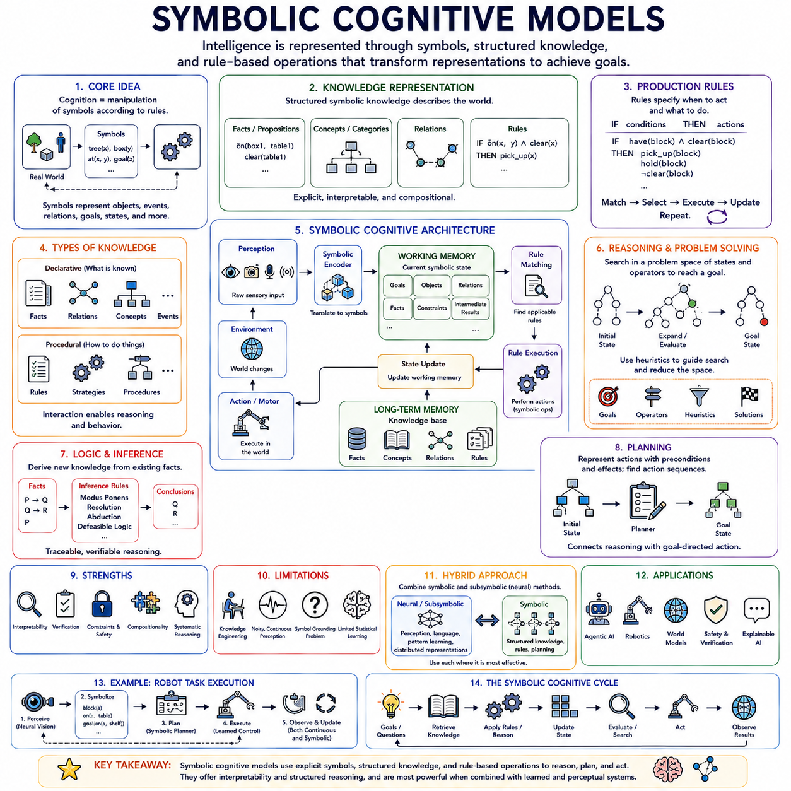{width="7.268055555555556in" height="7.268055555555556in"}

Symbolic cognitive models represent intelligence through explicit symbols, structured knowledge, and operations that manipulate those representations according to defined rules. A symbol may represent an object, concept, event, relationship, goal, or state of the world. Cognition is modeled as transformations among symbolic structures, allowing reasoning processes to be described in an explicit and interpretable computational form.

The symbolic approach is closely associated with the physical symbol system hypothesis, which argues that intelligent behavior can emerge from systems capable of creating, modifying, combining, and interpreting symbolic expressions. Under this view, cognition depends not simply on numerical computation but on structured representations whose components have functional relationships. Reasoning becomes a process of operating systematically on these representations.

Knowledge representation is therefore fundamental to symbolic cognitive modeling. Facts may be encoded as propositions, concepts may be organized into categories, relationships may connect entities, and rules may describe how one state implies another. Structured representations allow a cognitive system to distinguish objects, properties, actions, causes, goals, and constraints while preserving relationships that can be directly inspected and manipulated.

Production rules are a common mechanism for representing procedural knowledge. A production typically contains conditions describing when the rule is applicable and actions specifying what should happen when those conditions are satisfied. Cognitive processing can proceed by matching current symbolic states against available rules, selecting an appropriate production, executing it, and updating the internal state before another processing cycle begins.

Rule-based processing provides a natural mechanism for representing skills, strategies, and decision procedures. A system can encode knowledge such as selecting an action when particular conditions occur or applying a transformation when a problem reaches a specific state. Complex behavior can emerge from sequences of relatively simple rules whose execution progressively transforms the current representation toward a desired goal.

Symbolic models often distinguish declarative knowledge from procedural knowledge. Declarative knowledge describes what the system knows, including facts, concepts, relationships, and events. Procedural knowledge describes how operations should be performed. Maintaining this distinction allows cognitive architectures to model the interaction between retrieving information and applying procedures, an organization visible in architectures such as ACT-R and SOAR.

Working memory provides a temporary symbolic representation of the current cognitive situation. It may contain active goals, perceived objects, intermediate conclusions, task constraints, and retrieved knowledge. Rules inspect this information to determine which operations are currently relevant. As processing continues, working memory changes, providing an evolving context that guides subsequent reasoning and action.

Long-term memory stores more persistent symbolic knowledge that can be retrieved when required. A reasoning process may recognize that information is missing, retrieve relevant facts or rules, and incorporate them into the active problem representation. Memory retrieval therefore supports reasoning by connecting the immediate cognitive state with previously acquired knowledge rather than requiring all information to remain continuously active.

Search is another important principle in symbolic cognition. Many cognitive tasks can be represented as movement through a problem space containing possible states and operations. A system begins with an initial state, applies available operators, evaluates resulting states, and searches for a path toward a goal. Problem solving consequently becomes structured exploration over explicitly represented possibilities.

The problem-space perspective became especially important in classical artificial intelligence and cognitive psychology. Chess, puzzles, theorem proving, planning, and logical problems can all be described in terms of states, operators, goals, and constraints. Different search strategies determine which possibilities are examined first, allowing symbolic models to explain how knowledge and heuristics reduce otherwise enormous spaces of possible solutions.

Heuristics provide practical guidance when exhaustive search is computationally impossible. Rather than exploring every possible state, symbolic systems can apply rules that estimate which alternatives are more promising. Human problem solving similarly appears to rely on structured strategies and domain knowledge. Symbolic cognitive models can represent these heuristics explicitly, making their influence on reasoning comparatively easy to analyze.

Logic provides another foundation for symbolic reasoning. Propositions can express facts, predicates can represent relationships, and inference rules can derive conclusions from existing knowledge. Deductive reasoning can preserve logical validity, while other symbolic frameworks can support uncertain, defeasible, or abductive reasoning. Explicit representations make it possible to trace which premises and operations produced a particular conclusion.

Planning extends symbolic reasoning into future action. Goals can be represented explicitly, possible actions can be described through preconditions and effects, and a planner can search for sequences of operations that transform an initial state into a desired state. This framework provides a powerful connection between abstract reasoning and goal-directed behavior because the same symbolic structures can represent both knowledge and possible actions.

Symbolic models are particularly strong when tasks require compositionality. Complex representations can be constructed from simpler components while preserving relationships among them. A system that understands symbols for objects, actions, locations, and properties can combine them into new configurations without learning every combination independently. This supports systematic reasoning and generalization across structurally related problems.

Compositional representation also supports variable binding, which allows abstract relationships to be applied to different entities. A rule may describe a relationship between variables rather than specific objects, enabling the same reasoning structure to operate across many situations. This capacity is important for language, mathematics, planning, analogy, and other domains in which relational structure matters more than particular surface features.

Interpretability is one of the major strengths of symbolic cognitive models. Because knowledge and reasoning steps are represented explicitly, researchers can often inspect which facts were retrieved, which rules were selected, and how intermediate conclusions were produced. This makes symbolic systems useful for studying cognitive mechanisms and for applications where explanations, verification, traceability, or explicit constraints are important.

However, symbolic systems face important limitations. Constructing explicit knowledge bases and rules can require substantial human effort, and manually specified representations may become difficult to maintain as environments grow complex. Real-world perception also produces noisy, continuous, high-dimensional information that does not naturally arrive as clean symbols. Transforming raw sensory data into reliable symbolic structures therefore presents a major challenge.

The symbol grounding problem highlights this limitation. Symbols manipulated internally by a cognitive system must ultimately acquire meaning through relationships with perception, action, experience, or other grounded processes. Merely defining one symbol through additional symbols can create an endless network of formal relationships without explaining how those representations connect to the external world.

Learning presents another challenge for traditional symbolic approaches. Human cognition can acquire categories, patterns, motor skills, and perceptual representations from large amounts of experience without receiving explicit rules for every situation. Classical symbolic models are less naturally suited to this form of statistical learning than modern connectionist systems, which can automatically learn distributed representations from examples.

Connectionist models take a substantially different approach by representing knowledge through patterns of activation and learned parameters distributed across neural networks. They are particularly effective for perception, pattern recognition, language modeling, and learning from high-dimensional data. However, their internal representations can be less directly interpretable, and explicit multi-step symbolic manipulation may be difficult to guarantee.

These complementary strengths have motivated hybrid cognitive models that combine symbolic and subsymbolic processing. Neural components can transform sensory observations into learned representations, while symbolic components can manipulate structured concepts, goals, rules, and constraints. The objective is not necessarily to replace one paradigm with another but to allow each representation type to operate where its computational characteristics are most useful.

CLARION illustrates this principle through explicit and implicit representational levels, while ACT-R combines explicit symbolic structures with quantitative activation and learning mechanisms. Other cognitive architectures similarly attempt to integrate structured reasoning with adaptive processing. Such systems demonstrate that the boundary between symbolic and subsymbolic cognition can be treated as an architectural interface rather than an absolute division.

Modern language models have renewed interest in the relationship between distributed representations and symbolic reasoning. Neural models can produce behavior resembling rule application, planning, abstraction, and compositional reasoning without relying exclusively on traditional symbolic representations. Nevertheless, reliable reasoning, constraint satisfaction, verification, and persistent structured knowledge remain areas where explicit symbolic mechanisms can provide important advantages.

Agentic AI provides a natural setting for combining these approaches. An autonomous agent may use neural models to interpret language and perception while maintaining explicit representations of goals, plans, constraints, tool states, and task progress. Symbolic structures can organize long-horizon activity, while learned models provide flexible interpretation and prediction. Their interaction can support more coherent and controllable behavior.

Symbolic cognition is also relevant to world models. A purely continuous latent world model can efficiently encode complex sensory states, but an agent may additionally benefit from explicit representations of objects, agents, relationships, causal rules, goals, and constraints. Combining latent dynamics with structured symbolic state can support both prediction and higher-level reasoning about how the environment may change.

For Physical AI, this hybrid organization is particularly useful because robots must connect continuous sensor information with discrete tasks and decisions. Neural perception can identify objects, terrain, people, motion, and environmental conditions, while symbolic representations can encode mission goals, safety rules, spatial relationships, task sequences, and operational constraints. Planning can then operate over structures grounded in physical observations.

A robot performing a manipulation task, for example, may perceive objects through neural vision while representing relationships such as object identity, location, graspability, destination, and task order symbolically. A planner can reason over these relationships to determine an action sequence, while learned control policies execute physical movements. Sensor feedback then updates both continuous state estimates and symbolic task representations.

Symbolic cognitive models therefore remain important even as artificial intelligence becomes increasingly neural and data-driven. Their greatest contribution is the explicit representation of structure: concepts can be named, relationships can be preserved, rules can be applied, goals can be maintained, and reasoning paths can be inspected. These properties complement rather than necessarily compete with the strengths of learned distributed representations.

Ultimately, symbolic cognitive models describe cognition as structured manipulation of meaningful representations. Symbols provide explicit knowledge, rules transform cognitive states, memory supplies relevant information, search explores possibilities, heuristics guide problem solving, and planning connects reasoning with action. Combined with modern neural learning and grounded world models, these principles remain highly relevant to cognitive architectures, agentic AI, and embodied Physical AI.

## 06.08 Neural Cognitive Models [w/Code]

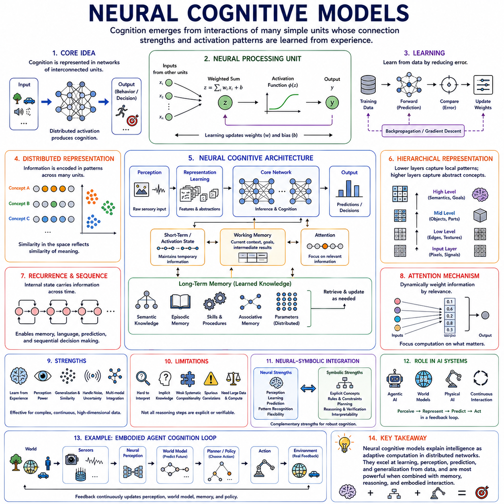{width="7.268055555555556in" height="7.268055555555556in"}

Neural cognitive models explain cognition through networks of interconnected processing units whose behavior emerges from patterns of activation and learned connection strengths. Instead of representing knowledge primarily through explicit symbols and hand-designed rules, these models encode information in distributed numerical representations. Cognitive functions emerge from interactions among many simple computational elements operating collectively.

The approach is strongly influenced by biological neural systems, where cognition results from coordinated activity across populations of neurons rather than from a single central processor. Artificial neural models simplify biological mechanisms substantially, but they preserve the principle of distributed computation. Perception, memory, learning, categorization, prediction, and decision making can therefore emerge from patterns distributed across interconnected processing structures.

A fundamental concept is the artificial neuron or processing unit. Each unit receives signals from other units, combines them according to connection weights, applies a transformation, and produces an output. Individually these operations are simple, but large networks can implement highly complex mappings. Intelligence emerges from the collective organization of many units rather than from explicit instructions stored within any individual component.

Connection weights determine how strongly activity in one unit influences another. Learning modifies these weights so that the network gradually develops useful internal representations. Rather than manually specifying every relationship, a neural model discovers statistical regularities from experience. Knowledge is consequently embedded within the distributed configuration of parameters and activation patterns that develops during training.

Distributed representation is one of the defining characteristics of neural cognitive models. A concept is usually not represented by one dedicated unit but by a pattern of activity across many dimensions. Individual units can participate in representing many different concepts. This organization allows neural systems to encode similarity, context, uncertainty, and overlapping properties within continuous representational spaces.

Learning allows these representations to adapt through experience. A model receives examples, produces outputs or predictions, measures discrepancies using an objective function, and adjusts its parameters to reduce future errors. Repeated optimization gradually reorganizes internal representations. Cognitive capabilities can therefore emerge from exposure to data instead of requiring researchers to explicitly encode every rule or category beforehand.

Error-driven learning provides an important mechanism for this adaptation. When a model\'s prediction differs from the desired or observed outcome, an error signal indicates how its behavior should change. Algorithms such as backpropagation distribute information about this error through the network and modify relevant parameters. Repeated corrections allow complex behaviors to emerge from large numbers of relatively small numerical adjustments.

Neural cognitive models are particularly effective for perception because sensory information is continuous, noisy, high-dimensional, and often ambiguous. Networks can learn useful features directly from images, sound, language, tactile signals, or multimodal observations. Hierarchical representations can progressively transform raw input into increasingly abstract structures, allowing recognition to emerge without requiring manually constructed symbolic descriptions of every sensory pattern.

Hierarchical representation is therefore another important principle. Lower layers may encode local or relatively simple patterns, while higher layers combine them into increasingly abstract representations. In visual processing, for example, early representations may capture edges and textures while later representations encode shapes, objects, relationships, or scene-level information. Similar hierarchical organization can occur in language, audio, and sensor fusion.

Recurrent neural models extend processing across time by allowing previous internal states to influence current computation. This enables a system to represent temporal context and sequential dependencies. Recurrent neural networks, gated architectures, and related mechanisms have been used to model language, memory, motor sequences, prediction, and decision making where current cognition depends on information accumulated from previous moments.

Attention mechanisms provide another way to dynamically control information processing. Rather than treating every representation as equally relevant, a model can assign different weights to different inputs or internal states according to the current context. Attention allows information from distant positions or modalities to interact selectively and has become a central mechanism in modern neural architectures, particularly Transformer-based models.

Transformers significantly expanded the capabilities of neural cognitive modeling by enabling large-scale learning of relationships across sequences. Self-attention allows each representation to incorporate information from other relevant representations. When trained on sufficiently large datasets, Transformer models can acquire rich statistical structures supporting language understanding, generation, abstraction, contextual interpretation, and forms of multi-step reasoning.

Memory in neural cognitive models can take several forms. Information may be stored implicitly in learned parameters, temporarily represented through activation states, or maintained through explicit external memory mechanisms. Parameter memory provides accumulated statistical knowledge, while contextual or working representations support immediate tasks. More sophisticated architectures can add episodic retrieval systems that preserve and recover information from specific previous experiences.

Associative memory is particularly compatible with neural computation. Partial or noisy input can activate representations corresponding to previously learned patterns. Instead of requiring exact symbolic keys, retrieval can occur according to similarity within representational space. This property helps explain pattern completion, recognition under uncertainty, and context-sensitive recall, all of which are important characteristics of biological cognition.

Neural models also provide a natural framework for probabilistic and uncertain cognition. Continuous activation values and learned probability distributions can represent multiple possible interpretations rather than requiring one fixed symbolic state. A system can estimate confidence, compare alternatives, and update predictions as new evidence arrives. This makes neural representations useful in environments where information is incomplete or ambiguous.

Representation learning reduces the need for manually engineered features. Earlier artificial intelligence systems often depended heavily on human-designed representations describing which properties of data were important. Deep neural networks can instead learn useful features jointly with the task itself. The resulting representations may capture structures that are difficult to specify explicitly but highly effective for prediction, recognition, or control.

A major strength of neural cognitive models is graceful generalization. Because related experiences can occupy nearby regions of a learned representational space, knowledge acquired from one example may transfer to similar examples. Neural systems can therefore respond meaningfully to inputs that were never encountered exactly during training. The quality of this generalization, however, depends strongly on training data, architecture, objectives, and distributional similarity.

Neural systems can also integrate multiple modalities within shared or aligned representational spaces. Vision, language, audio, proprioception, and other sensory streams can be encoded into representations that interact during inference. Multimodal learning allows a system to associate words with objects, actions with observations, and sensory events with semantic descriptions, providing an important foundation for grounded and embodied cognition.

Despite these strengths, neural cognitive models have important limitations. Knowledge is distributed across many parameters, making individual reasoning steps difficult to inspect. A network may produce an effective answer without providing a reliable account of how the conclusion was derived. Interpretability, causal understanding, systematic reasoning, verification, and predictable behavior therefore remain significant research challenges.

Another limitation concerns systematic compositionality. Humans can often combine familiar concepts and rules in novel ways, even when a particular combination has never been observed. Neural systems can demonstrate substantial compositional behavior, but performance may degrade when tasks require combinations far outside the training distribution. Explicit symbolic representations can sometimes provide stronger guarantees for such systematic manipulation.

Neural models can also learn unintended correlations. If training data contains biases, shortcuts, or spurious relationships, optimization may exploit them because they help reduce training error. Successful performance therefore does not necessarily imply that the system learned the intended causal structure. Robust cognitive modeling requires careful evaluation of what representations actually encode and how they behave under changing conditions.

These limitations motivate neural-symbolic cognitive architectures. Neural systems can provide perception, representation learning, pattern recognition, prediction, and flexible language processing, while symbolic systems provide explicit concepts, rules, constraints, planning structures, and verifiable reasoning. Combining these capabilities can create systems that learn efficiently from complex data while preserving structured mechanisms for higher-level cognition.

Neural cognitive models are strongly related to predictive processing because networks can learn internal models that anticipate sensory states or future events. A model can predict upcoming observations, compare them with actual input, and use discrepancies for learning or state correction. Hierarchical neural representations can support prediction across different levels of abstraction and different temporal horizons.

They are similarly important for world models. Neural world models encode observations into latent states and learn how those states change through time and action. Instead of predicting every sensory detail directly, the system can model compact representations capturing task-relevant environmental dynamics. Such models allow an agent to predict possible futures and evaluate actions before physically executing them.

Agentic AI extends neural cognition from passive inference toward persistent interaction. Neural models can interpret observations, retrieve relevant information, generate candidate plans, predict outcomes, and evaluate possible actions. When combined with memory, goals, tools, feedback, and repeated reasoning cycles, they can participate in agents that continually update their internal state rather than responding independently to isolated prompts.

Neural cognitive models are particularly important to Physical AI because embodied systems must process enormous quantities of continuous sensor information in real time. Cameras, LiDAR, radar, microphones, tactile sensors, proprioception, and localization systems produce complex data that is difficult to represent manually. Neural networks can transform these signals into learned representations suitable for perception, prediction, planning, and control.

A robot can use neural perception to identify objects and terrain, multimodal fusion to construct an environmental representation, a world model to predict future states, and learned policies to generate candidate actions. Feedback from sensors can then update the internal state and modify subsequent decisions. Cognition becomes a continuous perception--representation--prediction--action loop grounded in physical interaction.

Different neural components can operate at different temporal scales. Fast networks may support motor control and obstacle avoidance, intermediate models may track objects and predict local motion, while larger models may contribute semantic interpretation and long-horizon planning. Coordinating these components enables embodied intelligence to connect millisecond-level control with goals extending over seconds, minutes, or longer periods.

Modern cognitive architectures may therefore benefit from treating neural processing not as a replacement for all previous cognitive models but as a powerful computational substrate. Neural representations provide learning, generalization, perception, prediction, and flexible association, while explicit memory, symbolic reasoning, global coordination, and structured planning can provide complementary capabilities needed for persistent intelligent behavior.

Ultimately, neural cognitive models describe cognition as adaptive computation emerging from distributed learned representations. Networks transform sensory information, learning changes connection strengths, hierarchical representations construct abstractions, attention selects relevant relationships, memory preserves experience, and prediction anticipates future states. Combined with symbolic reasoning and embodied interaction, these principles provide a major foundation for cognitive architectures, world models, agentic AI, and Physical AI.

## 06.09 Hybrid Cognitive Architectures [w/Code]

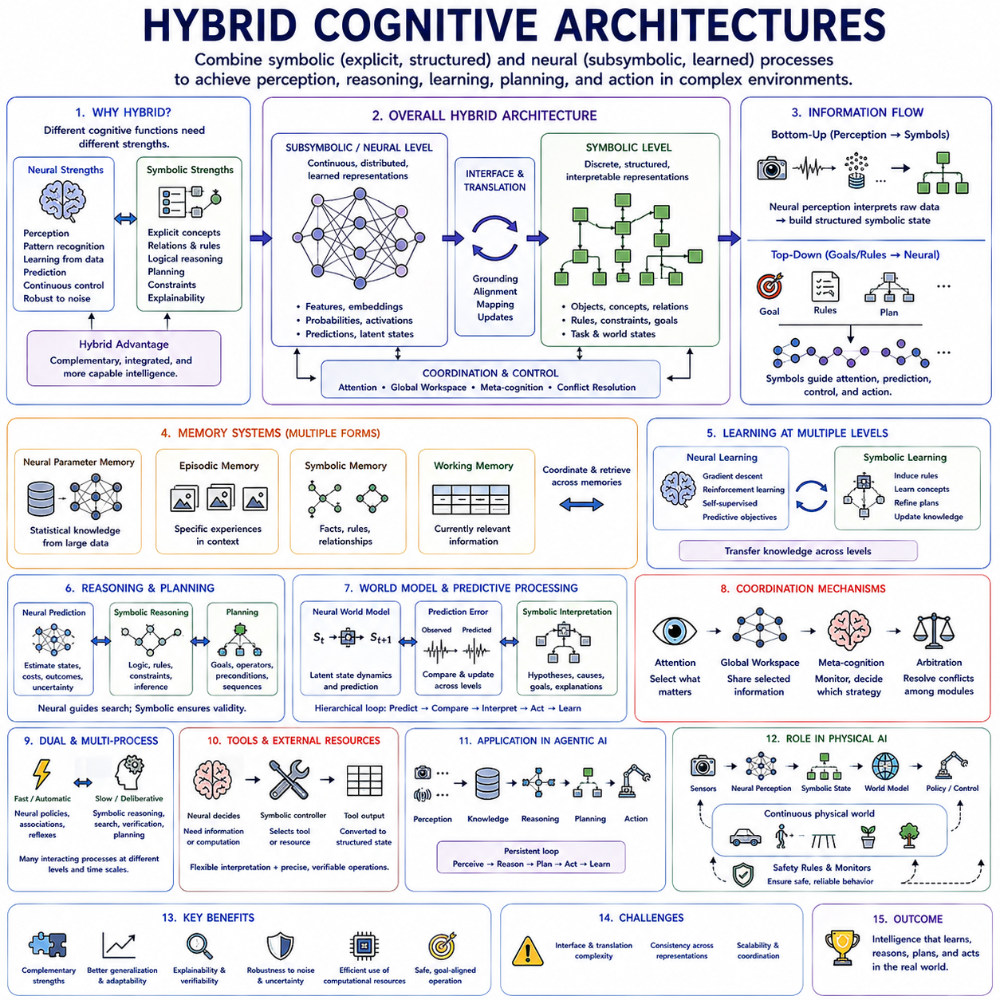{width="7.268055555555556in" height="7.268055555555556in"}

Hybrid cognitive architectures combine multiple computational paradigms within a unified system so that different forms of cognition can be handled by mechanisms suited to their characteristics. Instead of assuming that intelligence should be explained entirely through symbolic reasoning or entirely through neural computation, hybrid architectures integrate complementary approaches for perception, memory, learning, reasoning, planning, decision making, and action.

The motivation for hybrid cognition arises from the diversity of cognitive functions required by intelligent agents. Perception must interpret noisy and high-dimensional sensory information, while reasoning often requires explicit relationships, constraints, and compositional structures. Learning must adapt from experience, whereas planning must maintain goals and evaluate future alternatives. A single representational mechanism may not efficiently support all these requirements.

Symbolic processing provides one major component of hybrid architectures. Symbols can explicitly represent objects, concepts, relationships, goals, rules, and task states. Structured representations make logical inference, constraint satisfaction, planning, and explanation comparatively transparent. Symbolic mechanisms are therefore particularly useful when cognition requires precise manipulation of relationships or explicit control over reasoning procedures.

Neural or subsymbolic processing provides a complementary capability. Neural networks learn distributed representations from data and are highly effective for perception, pattern recognition, prediction, language processing, and continuous control. Rather than requiring every rule to be manually specified, neural systems can discover statistical regularities through experience. This makes them suitable for complex environments where explicit symbolic modeling would be difficult.

A hybrid architecture attempts to connect these capabilities rather than simply placing them beside each other. Neural representations must influence symbolic reasoning, and symbolic goals or constraints must influence neural processing. The interface between representational levels is therefore a central architectural problem. Effective integration requires mechanisms for translating, aligning, grounding, or jointly maintaining information across different computational forms.

One common organization separates cognition into subsymbolic and symbolic levels. The subsymbolic level processes continuous signals, learned features, probabilities, activation strengths, and latent representations. The symbolic level represents discrete concepts, relationships, rules, and goals. Information can move between these levels so that perceptual evidence becomes structured knowledge and symbolic intentions influence lower-level processing and action.

Bottom-up information flow typically begins with sensory or learned representations. Neural perception may identify objects, events, locations, actions, or environmental properties from raw data. These representations can then be transformed into symbolic structures describing the current situation. Higher-level reasoning can operate on this structured state without processing every pixel, waveform, or sensor measurement directly.

Top-down information flow operates in the opposite direction. Goals, expectations, rules, and plans represented at a symbolic level can guide neural attention, perception, prediction, or control. A task requiring a particular object can increase processing priority for relevant visual features, while a planned action can constrain which predictions are important. Hybrid cognition therefore creates recurrent interaction between abstract intention and detailed sensory processing.

Memory can also be organized across multiple representational forms. Neural parameter memory may encode statistical regularities learned from large datasets, while episodic memory preserves particular experiences and symbolic memory stores explicit facts, rules, and relationships. Working memory can maintain currently relevant information from several sources. Coordinating these memory systems allows both flexible retrieval and structured reasoning over accumulated knowledge.

Learning within hybrid architectures can occur at several levels. Neural components can improve through gradient-based optimization, reinforcement learning, self-supervised learning, or predictive objectives. Symbolic components can acquire new rules, concepts, or problem-solving strategies. Information discovered by one level may eventually be transferred to another, enabling learned patterns to become explicit knowledge or symbolic guidance to shape subsequent learning.

CLARION provides an important example of hybrid cognitive organization by distinguishing explicit and implicit knowledge representations. Its architecture models interactions between processes that operate through accessible symbolic structures and processes represented through distributed subsymbolic mechanisms. This organization reflects the idea that human cognition often combines conscious rule-based reasoning with implicit skills and associations acquired through experience.

ACT-R also demonstrates hybrid characteristics despite its strong symbolic foundation. Declarative chunks and production rules provide explicit cognitive structures, while activation equations, retrieval probabilities, timing mechanisms, and learning processes introduce quantitative subsymbolic dynamics. Cognitive behavior emerges from interaction between structured symbolic representations and numerical mechanisms that influence which knowledge becomes available and when.

SOAR similarly combines symbolic problem solving with learning mechanisms that modify future behavior. Working memory represents the current situation, production rules propose and select operators, and learning can create new knowledge from previous problem-solving episodes. Modern extensions can connect such architectures with perceptual, probabilistic, and neural components, illustrating how classical cognitive systems can participate in broader hybrid designs.

Hybrid architectures are especially valuable for reasoning under uncertainty. Neural systems can estimate probabilities, confidence, similarities, or possible future states from incomplete evidence, while symbolic systems can enforce logical constraints and explicit rules. A decision process can therefore combine uncertain predictions with structured requirements, allowing an agent to reason flexibly without abandoning safety conditions or task constraints.

Planning provides another natural integration point. Symbolic planners can represent goals, preconditions, effects, and action sequences explicitly, while neural models can estimate costs, success probabilities, environmental dynamics, or likely consequences. Neural predictions can guide search toward promising plans, and symbolic constraints can prevent invalid actions. Planning becomes a cooperative process between learned prediction and structured search.

World models can serve as an important bridge between neural and symbolic cognition. A neural world model can encode complex sensory observations into compact latent states and predict how those states evolve. A symbolic layer can represent objects, agents, causal relationships, goals, and constraints derived from those states. Together they support both detailed prediction and abstract reasoning about possible futures.

Predictive processing also fits naturally within hybrid architectures. Neural components can continuously predict sensory or latent states and generate prediction errors, while higher-level symbolic models represent hypotheses, goals, or causal interpretations. Unexpected observations can trigger updates at several levels. This creates a hierarchical loop connecting perception, prediction, interpretation, reasoning, and adaptive action.

Attention and global workspace mechanisms can provide coordination across heterogeneous components. Specialized neural and symbolic processes may generate competing information, while an attention mechanism selects content that is currently important. A shared workspace can then distribute selected information to memory, reasoning, planning, language, and action systems. Hybrid cognition therefore requires not only multiple components but mechanisms for coordinating them.

Meta-cognition becomes particularly important when several reasoning mechanisms are available. An intelligent system must determine whether a problem should be handled through fast learned responses, explicit symbolic reasoning, additional information retrieval, simulation, or extended planning. Monitoring confidence, uncertainty, conflicts, and task difficulty can help select the appropriate cognitive strategy and allocate computational resources accordingly.

This organization has a strong relationship with dual-process theories. Fast processing can be supported by neural policies, learned associations, and automatic perception, while slower processing can involve symbolic reasoning, search, verification, and planning. However, hybrid architectures need not divide cognition into exactly two systems. Instead, they can contain multiple interacting mechanisms operating at different levels of abstraction and temporal scale.

Modern large language models provide powerful neural components for hybrid cognitive systems. They can interpret instructions, generate hypotheses, summarize information, produce candidate plans, and interact through natural language. However, persistent memory, exact constraint enforcement, reliable calculation, formal verification, and long-term task management may benefit from external structured components rather than relying entirely on neural parameter representations.

Agentic AI therefore provides a major application area for hybrid architectures. An agent can use neural models for perception and language, symbolic structures for goals and task states, databases or retrieval systems for memory, world models for prediction, planners for action sequencing, and external tools for specialized operations. A coordination mechanism can combine these capabilities into a persistent perception--reasoning--action loop.

Tool use further demonstrates the advantages of hybrid organization. A neural model may recognize that additional information or computation is required, while an explicit controller determines which tool can satisfy the requirement. Tool outputs can be converted into structured state and incorporated into subsequent reasoning. This separates flexible interpretation from deterministic operations that may require higher precision or external verification.

Hybrid architectures are particularly relevant to Physical AI because embodied agents operate simultaneously in continuous physical environments and discrete task structures. Sensor measurements, motor commands, trajectories, and dynamics are naturally continuous, while mission goals, safety rules, object relationships, task sequences, and operational constraints often benefit from explicit representations. A robot must connect these domains continuously.

A Physical AI system may use neural perception to interpret cameras, LiDAR, radar, audio, and proprioception. Sensor fusion can create a latent environmental representation, while symbolic structures identify objects, semantic relationships, goals, and constraints. A world model predicts possible future states, a planner evaluates alternatives, and learned control policies convert selected actions into continuous physical motion.

Safety provides a particularly important reason for hybrid design. Learned policies can adapt effectively to complex environments but may behave unpredictably outside familiar conditions. Explicit safety rules, constraint monitors, verification layers, and fallback controllers can supervise neural decisions. Hybrid systems can therefore combine adaptive intelligence with mechanisms designed to prevent actions that violate defined operational boundaries.

Temporal hierarchy is also important in embodied hybrid cognition. Low-level neural controllers may operate at millisecond timescales, perception and tracking at tens or hundreds of milliseconds, local planning over seconds, and symbolic task reasoning over minutes or longer. Coordinating these timescales allows immediate physical reactions to remain consistent with long-term goals and mission-level constraints.

The major challenge is architectural complexity. Combining multiple representations, memories, learning methods, reasoning systems, and control loops creates difficult interface problems. Information can become inconsistent across components, translation between representations can lose meaning, and different modules may produce conflicting recommendations. Effective hybrid systems therefore require carefully designed coordination, synchronization, arbitration, and state-management mechanisms.

Another challenge concerns learning across boundaries. A neural component may discover useful patterns that are difficult to express symbolically, while symbolic rules may be difficult to translate into differentiable learning objectives. Research in neural-symbolic learning, differentiable reasoning, program induction, structured latent representations, and grounded language attempts to reduce this gap and enable more integrated learning.

Despite these challenges, hybrid cognitive architectures offer a compelling direction for advanced artificial intelligence. Purely symbolic systems provide structure but struggle with complex perception and large-scale learning, while purely neural systems provide adaptability but may lack explicit reasoning guarantees and transparent control. Combining them allows an architecture to exploit different computational strengths according to the demands of each cognitive function.

Ultimately, hybrid cognitive architectures describe intelligence as coordinated interaction among multiple representational and computational systems. Neural processing supplies learning, perception, prediction, and flexible generalization; symbolic processing supplies structure, rules, goals, and explicit reasoning; memory preserves experience; world models anticipate futures; and coordination mechanisms connect these capabilities to planning and action. This integration provides a powerful foundation for cognitive architectures, agentic AI, world-model-based intelligence, and embodied Physical AI.

## 06.10 Cognitive Agents [w/Code]

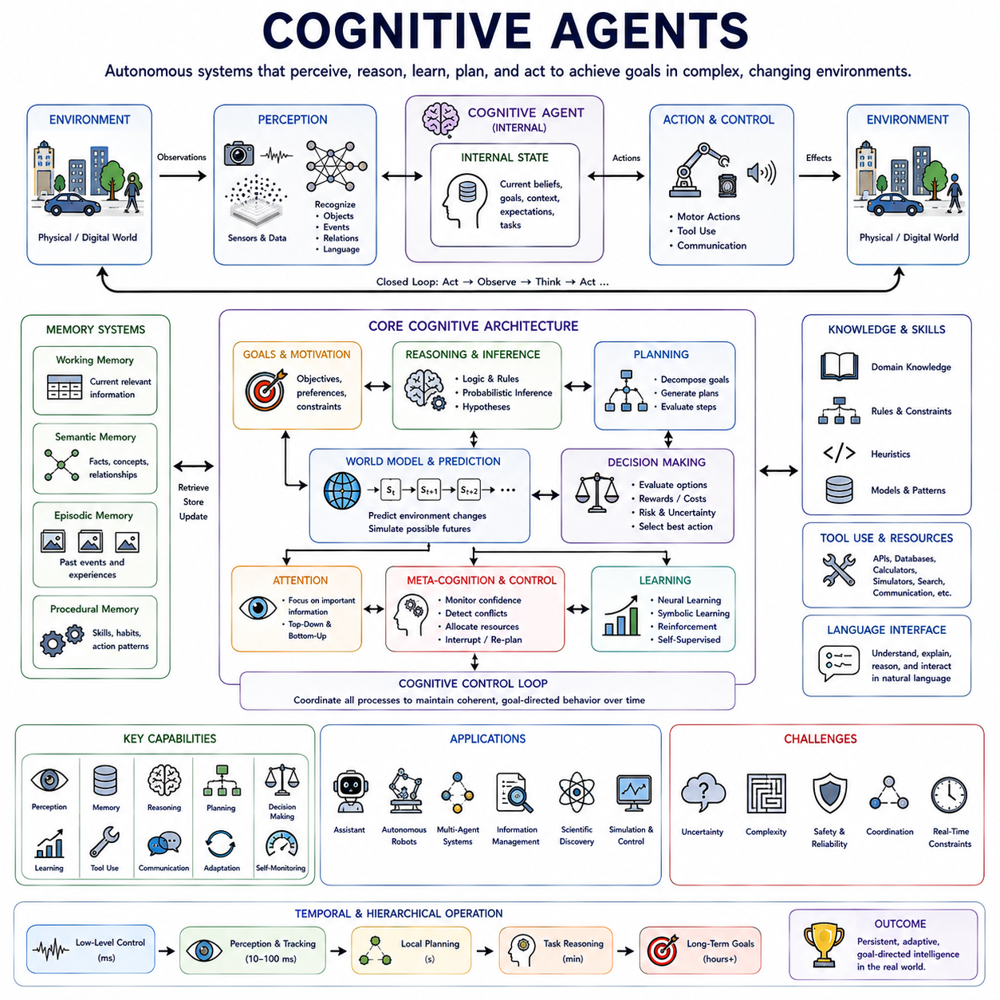{width="7.268055555555556in" height="7.268055555555556in"}

Cognitive agents are autonomous systems designed to perceive environments, maintain internal representations, reason about situations, pursue goals, and select actions over time. Unlike simple reactive systems that map observations directly to responses, cognitive agents maintain information about previous events, current conditions, and possible futures. Their behavior emerges from continuous interaction among perception, memory, reasoning, learning, planning, and action.

The concept of a cognitive agent originates from attempts to model intelligence as an integrated process rather than as isolated algorithms. Human cognition does not perform perception, memory retrieval, reasoning, and action independently. These functions continually influence one another. Cognitive agents adopt the same principle by organizing specialized cognitive mechanisms into an architecture capable of maintaining coherent behavior across changing situations.

An agent can be described through the perception--cognition--action cycle. Sensors or information channels provide observations about the environment, cognitive mechanisms interpret those observations, and the agent selects actions that modify either the environment or its own information state. New observations then reflect the consequences of previous actions, creating a recurrent closed loop through which intelligent behavior develops over time.

Perception provides the interface between an agent and its environment. Raw sensory signals or digital observations must be transformed into representations useful for cognition. Neural perception systems may recognize objects, people, events, language, spatial relationships, or environmental conditions. The resulting information becomes part of the agent\'s internal state and provides evidence for subsequent reasoning, prediction, and decision making.

Internal state distinguishes cognitive agents from purely reactive mechanisms. The agent maintains information that is not directly available from the current observation, including previous events, inferred conditions, active goals, unresolved tasks, and expectations about the future. This state provides temporal continuity, allowing behavior to depend on accumulated experience rather than only on the immediately available input.

Working memory maintains information that is currently relevant to ongoing cognition. It may contain perceived entities, active goals, intermediate reasoning results, retrieved knowledge, candidate actions, and task constraints. Because computational resources are limited, not every available piece of information can remain equally active. Attention and control mechanisms therefore determine which information receives priority during each cognitive cycle.

Long-term memory provides persistent knowledge accumulated across experiences. Semantic memory can preserve concepts, facts, and relationships, while episodic memory can retain information about particular events and interactions. Procedural memory can encode learned skills and action patterns. Cognitive agents can retrieve information from these different memory systems according to the requirements of the current situation.

Memory retrieval allows previous experience to influence present reasoning. When an agent encounters a new problem, it may search for similar situations, relevant facts, successful strategies, or previous failures. Retrieved information can modify the current internal state and reduce the need to solve every problem from the beginning. Memory therefore provides an important foundation for adaptive and persistent intelligence.

Goals organize cognition around desired outcomes. A cognitive agent may maintain one or several goals describing states it attempts to achieve or preserve. Goals influence attention, information retrieval, reasoning, planning, and action selection. Higher-level goals can also be decomposed into subgoals, allowing complex activities to be organized into manageable structures that can be executed and monitored progressively.

Reasoning transforms available information into conclusions that are useful for action. Symbolic mechanisms may apply rules and logical relationships, while neural mechanisms may generate hypotheses, estimate similarities, or infer likely interpretations. Hybrid agents can combine these processes so that flexible learned representations support structured reasoning when tasks require explicit relationships, constraints, or verification.

Planning extends reasoning into the future. Instead of selecting only the immediately attractive action, an agent can construct candidate sequences and evaluate how they may affect future states. Plans may represent goals, subgoals, preconditions, actions, expected effects, costs, risks, and dependencies. This enables behavior to remain coherent across multiple steps and supports long-horizon goal-directed activity.

World models provide cognitive agents with mechanisms for predicting environmental change. A world model represents relevant aspects of the environment and estimates how states may evolve through time or in response to actions. By simulating possible futures internally, an agent can compare alternatives before acting. Prediction therefore connects perception of the present with planning for future consequences.

Decision making selects among competing alternatives. An agent may evaluate expected rewards, costs, uncertainty, risk, safety constraints, and compatibility with current goals. Some decisions can be generated rapidly through learned policies or heuristics, while difficult situations may require extended reasoning and simulation. Cognitive agents can therefore employ multiple decision mechanisms according to task complexity.

Uncertainty is unavoidable because observations are incomplete and predictions are imperfect. Cognitive agents must distinguish between what is known, inferred, predicted, or uncertain. Confidence estimates can influence whether an agent acts immediately, gathers additional information, retrieves more knowledge, performs deeper reasoning, or requests external assistance. Managing uncertainty is therefore central to reliable autonomous behavior.

Meta-cognition allows an agent to reason about its own cognitive processes. The system can monitor confidence, detect contradictions, recognize failed plans, evaluate progress, and determine whether additional computation is necessary. Rather than merely reasoning about the external environment, a meta-cognitive agent also evaluates how well its own reasoning process is functioning and adapts its strategy accordingly.

Attention determines which information should receive computational priority. Environments may contain far more information than an agent can process simultaneously, making selective processing necessary. Attention can be influenced by perceptual salience, current goals, uncertainty, expected value, or detected anomalies. Effective attention connects bottom-up environmental signals with top-down task requirements.

Learning allows cognitive agents to improve through interaction. Neural components can learn representations, predictions, and policies from data, while symbolic mechanisms can acquire rules, concepts, or task procedures. Reinforcement learning can modify behavior according to outcomes, and self-supervised learning can exploit unlabeled experience. Continual learning enables adaptation as environments, tasks, and available knowledge change.

Cognitive control coordinates competing processes and determines which operations should occur next. Perception may reveal urgent information while planning is underway, memory retrieval may introduce contradictory evidence, or several goals may compete for resources. Control mechanisms resolve these conflicts, allocate computational effort, interrupt obsolete processes, and maintain coherent progression toward important objectives.

Global workspace concepts provide one possible mechanism for cognitive coordination. Specialized modules can process information independently, while selected content becomes globally available to other systems. A representation identified as important may therefore influence memory, reasoning, language, planning, and action simultaneously. Such broadcasting can help otherwise specialized cognitive processes contribute to unified behavior.

Dual-process organization provides another useful perspective. Fast processing can rely on learned associations, heuristics, pattern recognition, and automatic policies, while slower processing can perform explicit reasoning, search, verification, and planning. Cognitive agents can dynamically move between these modes, using inexpensive automatic responses for familiar situations and allocating additional computation when uncertainty or complexity increases.

Language provides a powerful interface for cognitive agents because it can represent instructions, goals, explanations, plans, observations, and knowledge. Large language models can interpret natural-language tasks and generate candidate reasoning or actions. However, persistent agency requires additional mechanisms for memory, state management, verification, tool use, planning, and environmental interaction beyond isolated language generation.

Tool use extends an agent\'s cognitive capabilities beyond its internal models. An agent may recognize that a task requires external information, precise calculation, database access, simulation, communication, or specialized software. It can select an appropriate tool, formulate an operation, interpret the returned result, and incorporate that information into its internal state before continuing the cognitive process.

Agentic AI can therefore be understood as a modern implementation direction for cognitive agents. A language or multimodal foundation model may provide flexible interpretation and reasoning, while external memory preserves persistent information, planners organize tasks, tools perform specialized operations, and control mechanisms maintain execution state. Together these components create a persistent loop rather than a single input--output response.

Multiple cognitive agents can also cooperate. Each agent may maintain its own observations, goals, knowledge, and capabilities while exchanging information with other agents. Cooperation requires communication, task allocation, shared representations, negotiation, and coordination. Multi-agent cognition can distribute complex problems across specialized agents but also introduces challenges involving conflicting beliefs, goals, and decisions.

Embodiment adds another dimension by connecting cognition directly to physical interaction. An embodied cognitive agent receives continuous sensory information, generates motor actions, and experiences physical consequences. Concepts such as distance, force, object permanence, affordance, and causality can therefore be grounded through interaction rather than represented only abstractly. This connection is fundamental to Physical AI.

A robotic cognitive agent may combine cameras, LiDAR, radar, audio, tactile sensing, proprioception, and localization information to estimate its current environment. Neural perception transforms these signals into useful representations, while memory preserves context and symbolic structures maintain goals and constraints. World models predict possible changes, planners select actions, and controllers execute physical motion.

Physical environments impose strict timing requirements. Low-level control may operate at millisecond scales, perception and tracking at tens or hundreds of milliseconds, local planning across seconds, and task-level reasoning over minutes or longer periods. A cognitive agent must coordinate these temporal layers so that immediate reactions remain compatible with long-term goals and safety constraints.

Safety is particularly important for cognitive agents operating in the physical world. Learned predictions and policies may fail under unfamiliar conditions, making independent monitoring mechanisms necessary. Explicit safety constraints, collision avoidance, uncertainty thresholds, verification processes, fallback behaviors, and emergency control can supervise higher-level cognition and prevent unacceptable actions from reaching physical actuators.

Cognitive agents must also maintain persistent task state during long-running activities. Real environments change while plans are being executed, actions may fail, and new information may invalidate previous assumptions. The agent must therefore repeatedly compare expected and observed states, identify discrepancies, update its beliefs, revise plans, and continue from the new situation rather than blindly following a fixed sequence.

This produces a continual cognitive loop of perceive, interpret, remember, predict, reason, plan, act, observe, and learn. The loop is not strictly linear because information can move between components in multiple directions. Predictions can guide perception, goals can guide memory retrieval, unexpected observations can interrupt plans, and learning can modify future decisions. Intelligence emerges from coordination across the entire loop.

Ultimately, cognitive agents represent intelligence as persistent goal-directed interaction between an autonomous system and its environment. Perception constructs the current state, memory preserves experience, reasoning interprets relationships, world models predict possible futures, planning organizes actions, meta-cognition monitors reliability, and learning improves behavior. Their integration provides a foundation for agentic AI, autonomous robots, and advanced Physical AI systems.

## 06.11 Internal Models and World Models [w/Code]

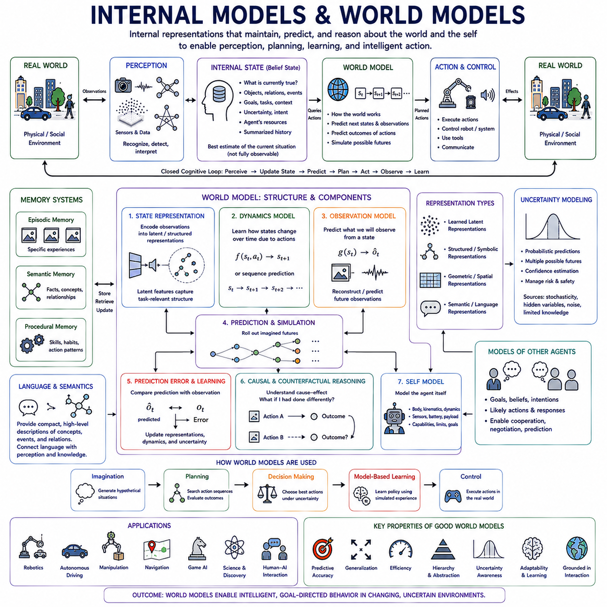{width="7.268055555555556in" height="7.268055555555556in"}

Internal models are cognitive representations that allow an intelligent system to maintain information about itself, its environment, and the relationships connecting actions to consequences. Rather than responding only to immediate sensory input, a system equipped with internal models can represent conditions that are temporarily unobservable, interpret ongoing events, anticipate changes, and use predicted outcomes to guide future behavior.

An internal model does not need to reproduce every physical detail of reality. Its purpose is to preserve information that is useful for cognition and action. Depending on the task, it may represent objects, spatial relationships, agents, motion, causal dependencies, goals, uncertainty, or action possibilities. Effective internal models therefore emphasize task-relevant structure while compressing or ignoring unnecessary environmental detail.

The idea is closely related to the distinction between reactive and model-based behavior. A purely reactive agent maps current observations directly to actions, whereas a model-based agent maintains an internal state that summarizes relevant information accumulated over time. This state allows the agent to reason about situations in which the current observation alone does not contain enough information for an appropriate decision.

Internal state estimation is necessary because observations rarely provide a complete description of the environment. Sensors may be noisy, objects may become occluded, and important variables may not be directly measurable. An intelligent system must therefore combine current observations with previous states and learned expectations. The resulting internal representation becomes the system\'s best estimate of what is currently happening.

World models extend this principle by representing how an environment behaves and changes. A world model describes relationships among states, observations, actions, and future outcomes. Given a representation of the current situation and a possible action, the model attempts to estimate what may happen next. This predictive capability allows cognition to extend beyond interpretation of the present toward simulation of possible futures.

A simple world model can be expressed as a transition relationship from a current state and action to a predicted next state. More sophisticated models can predict sequences of future states over multiple time steps. Instead of asking only what will happen immediately, an agent can estimate trajectories of possible futures and compare how different actions may influence the evolution of the environment.

State representation is therefore central to world-model design. Raw sensory observations such as images, audio, LiDAR measurements, or tactile signals are often too large and redundant for efficient prediction. Neural encoders can transform these observations into compact latent states that preserve important information. Prediction can then operate within this latent space rather than reconstructing every detail of the original sensory input.

Latent representations allow world models to capture environmental structure at useful levels of abstraction. A latent state may encode object identity, location, velocity, interaction, scene context, or other task-relevant properties without explicitly assigning a human-readable symbol to every dimension. Learning determines which structures become useful for predicting future observations, rewards, events, or consequences of actions.

World models may also contain explicit structured representations. Objects, agents, relationships, maps, semantic categories, causal dependencies, and physical constraints can be represented symbolically or geometrically. Such structures make some forms of reasoning easier because an agent can manipulate meaningful entities directly. Modern systems can therefore combine learned latent representations with explicit structured knowledge.

Prediction is the fundamental operation connecting an internal model to future-oriented cognition. The system uses its current state and candidate actions to estimate possible future states. Prediction can occur over short horizons for immediate control or over longer horizons for planning. Different predictive components may operate simultaneously at several temporal and representational scales.

Prediction error provides an important learning signal. When the observed future differs from the predicted future, the discrepancy indicates that the internal model is incomplete or inaccurate. The system can use this error to update representations, transition dynamics, or uncertainty estimates. Repeated prediction and correction allow the model to become increasingly aligned with regularities encountered through experience.

This process connects world models directly with predictive processing. Perception can be interpreted not only as extracting information from sensory input but also as comparing incoming observations with internally generated expectations. Predictions flow toward expected observations, while prediction errors provide corrective information. Cognition consequently becomes an ongoing interaction between expectation and sensory evidence.

Dynamics models represent how states evolve through time. In embodied systems, dynamics can include the effects of motion, forces, object interactions, environmental changes, and actions performed by the agent. Learned dynamics models can approximate these relationships from experience. Accurate dynamics are particularly important when an agent must anticipate the consequences of physical actions before executing them.

World models can be deterministic when similar states and actions are expected to produce approximately predictable outcomes. Real environments, however, frequently contain uncertainty, hidden variables, other agents, and stochastic events. Probabilistic world models can represent multiple possible futures and assign different likelihoods to them. This allows planning to consider uncertainty rather than relying on a single predicted trajectory.

Uncertainty can arise from several sources. The environment itself may be stochastic, observations may be incomplete, or the model may encounter situations outside its previous experience. A capable world model should distinguish confident predictions from uncertain ones. This information can influence whether an agent proceeds with an action, gathers additional observations, reduces speed, selects a safer alternative, or requests assistance.

Memory and world models are deeply connected. Episodic memory preserves specific previous experiences, while semantic memory stores more generalized knowledge about the world. A world model can use both forms of information when estimating future states. Conversely, prediction errors and surprising events can determine which experiences are important enough to preserve for later retrieval and learning.

Causal representation provides a deeper level of internal modeling than statistical association alone. Predicting that two events commonly occur together is different from understanding how an intervention changes an outcome. Agents that interact with environments can learn from actions as interventions. This creates opportunities to discover relationships between causes, effects, controllable variables, and external events.

Counterfactual reasoning extends internal simulation beyond straightforward prediction. An agent can ask what might have happened if a different action had been selected or if some condition had changed. Counterfactual models support learning from alternatives that were not actually executed and can improve planning, explanation, diagnosis, and decision making by comparing observed outcomes with hypothetical possibilities.

Planning uses world models to search through possible futures. Candidate actions can be applied within the internal model rather than immediately in the physical environment. Predicted states are evaluated according to goals, costs, rewards, risks, and constraints. The agent can then select actions whose simulated consequences appear most favorable, converting prediction into purposeful decision making.

Model-based reinforcement learning applies this idea to learned behavior. Instead of learning only a direct mapping from observations to actions, an agent learns a model of environmental dynamics and uses that model to evaluate behavior. Simulated experience can supplement real interaction, potentially reducing the number of costly or dangerous physical trials required to discover effective policies.

Imagination can be understood computationally as the generation of internally simulated states that are not currently being observed. A world model allows an agent to construct hypothetical situations, roll forward possible trajectories, and evaluate outcomes without physically experiencing every alternative. This capability creates an important connection between prediction, planning, creativity, and goal-directed cognition.

Hierarchical world models represent environments at several levels of abstraction. Low-level models may predict immediate sensor or motion changes, intermediate models may represent objects and local interactions, and higher-level models may describe events, tasks, intentions, or long-term consequences. Hierarchical organization allows detailed physical prediction to coexist with efficient reasoning over extended time horizons.

Temporal abstraction is particularly important because predicting every small physical change far into the future is computationally expensive and increasingly uncertain. Higher-level models can instead reason about meaningful events or subgoals. An agent might predict precise motion for the next few seconds while representing later stages through semantic states such as reaching a location, completing a task, or interacting with an object.

Internal models can also include models of the agent itself. A self-model may represent the agent\'s body, capabilities, available resources, knowledge, uncertainty, goals, and limitations. For robots, this can include kinematics, dynamics, sensor configurations, battery state, payload, reachability, or damage conditions. Effective planning requires understanding not only the external world but also what the agent can actually do within it.

Models of other agents become important in social and multi-agent environments. An intelligent system may estimate another agent\'s goals, beliefs, intentions, capabilities, or likely future actions. These models enable cooperation, negotiation, collision avoidance, prediction of human behavior, and coordinated planning. Multi-agent world models therefore extend environmental prediction to include interacting decision-making entities.

Language can contribute semantic structure to internal models. Linguistic descriptions provide compact representations of objects, relationships, events, goals, and causal explanations that may be difficult to derive from sensory signals alone. Multimodal models can connect language with visual and physical observations, allowing internal representations to combine perceptual grounding with abstract conceptual knowledge.

Large neural models provide powerful mechanisms for learning world representations from extensive datasets, but prediction alone does not guarantee an accurate understanding of physical reality. Models may reproduce statistical patterns while failing under unfamiliar interventions or long prediction horizons. Grounding through observation, interaction, feedback, and physical constraints remains important for developing reliable internal models.

World models are especially important for cognitive agents because they provide a shared predictive substrate for several cognitive functions. Perception updates the current state, memory supplies relevant experience, reasoning interprets relationships, planning generates alternatives, and decision making evaluates predicted outcomes. The world model connects these processes by providing a representation of what exists and how it may change.

For Physical AI, world models must connect multimodal perception with physical dynamics and action. Cameras, LiDAR, radar, tactile sensors, proprioception, and localization systems provide observations of the environment and robot state. These observations can be fused into a world representation from which the system predicts object motion, terrain changes, interactions, collisions, and consequences of robot actions.

A robotic world model can support navigation by predicting free space and moving obstacles, manipulation by predicting object responses to contact, and task planning by estimating how actions change semantic states. Instead of treating perception, planning, and control as completely separate pipelines, the model can provide a common predictive representation linking what the robot observes with what it expects to happen.

Real-time operation requires world models to balance accuracy with computational efficiency. Short-horizon predictions may need rapid updates for control and safety, while long-horizon planning can use slower and more abstract simulations. Hierarchical architectures can distribute computation across these timescales, allowing immediate responses to remain synchronized with broader task objectives and future expectations.

The reliability of an internal model must be continuously evaluated because environments change and learned assumptions can become invalid. Agents should compare predictions with observations, monitor uncertainty, detect distribution shifts, and recognize when simulation is unreliable. Meta-cognitive mechanisms can then determine whether to replan, gather more information, switch models, or adopt conservative behavior.

Ultimately, internal models and world models transform intelligent behavior from immediate reaction into predictive interaction. Internal states preserve information beyond current observations, learned representations organize environmental structure, dynamics models predict change, uncertainty represents alternative futures, and simulation allows actions to be evaluated before execution. These capabilities provide a central foundation for cognitive agents, planning, model-based learning, robotics, and advanced Physical AI.

## 06.12 State Space and Temporal Representation [w/Code]

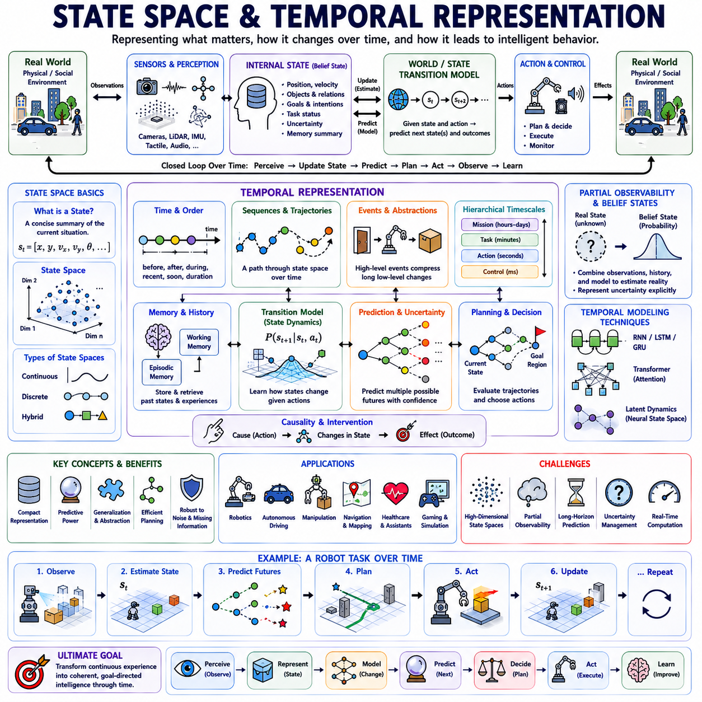{width="7.268055555555556in" height="7.268055555555556in"}

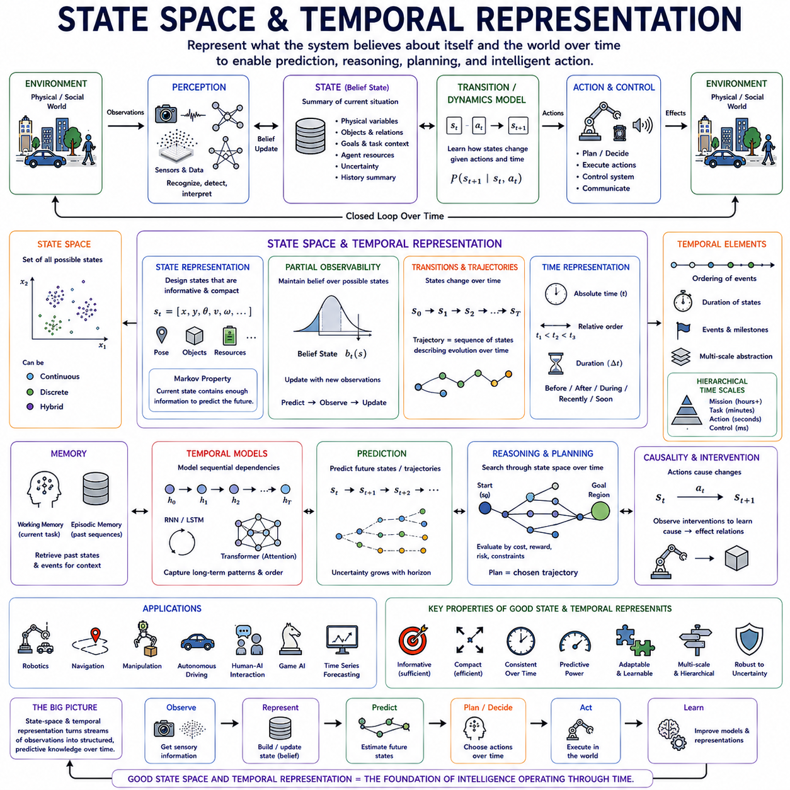{width="7.268055555555556in" height="7.268055555555556in"}

State-space representation provides a formal way to describe what an intelligent system believes about itself and its environment at a particular moment. Instead of storing every raw observation independently, cognition organizes relevant variables into a state that summarizes the current situation. This representation becomes the foundation for prediction, reasoning, planning, decision making, and control across time.

A state can contain many kinds of information depending on the task. For a robot, it may include position, orientation, velocity, nearby objects, terrain properties, battery condition, active goals, and uncertainty. For a cognitive agent, it may additionally represent beliefs, intentions, remembered events, task progress, and relationships among entities. State design therefore determines what information is available for subsequent cognition.

The state space is the collection of all states that a system can represent. Each state corresponds to one possible configuration of relevant variables, while transitions describe movement from one state to another. A simple system may have a small discrete state space, whereas realistic environments can produce enormous continuous spaces containing physical, semantic, cognitive, and social variables simultaneously.

Continuous state spaces are common in physical systems because quantities such as position, velocity, force, temperature, and time vary continuously. Discrete state spaces are useful for representing categories, task stages, symbolic conditions, or logical relationships. Cognitive and Physical AI systems often require hybrid state spaces that combine continuous physical variables with discrete semantic and task-level information.

State representations must balance completeness and efficiency. A representation containing too little information may fail to distinguish situations that require different actions, while one containing every observable detail can become computationally impractical. Useful states preserve information required for future prediction and decision making while compressing irrelevant details. Representation learning can discover compact states automatically from high-dimensional observations.

The Markov property provides an important conceptual principle for state representation. Ideally, the current state should contain enough information to predict the relevant future without requiring the entire observation history. If two situations appear identical in the current observation but have different hidden histories that affect future outcomes, the observation itself is not a sufficient state and additional memory must be incorporated.

Real environments are frequently partially observable. A robot may temporarily lose sight of an object, a sensor may provide incomplete measurements, or another agent\'s intention may remain hidden. Under partial observability, the system cannot directly know the true environmental state. It must maintain a belief state that combines current evidence, previous information, uncertainty, and learned dynamics to estimate what is likely to be true.

Belief states provide probability distributions or confidence-weighted representations over possible states rather than committing to a single interpretation. As new observations arrive, the system updates these beliefs. This allows uncertainty to persist explicitly through time and enables decisions to account for several plausible explanations of the current situation rather than assuming that perception is always complete and correct.

Temporal representation extends state representation by describing how information changes across time. A single state provides a snapshot, but intelligent behavior depends on sequences, durations, trends, events, and causal relationships. Temporal cognition therefore requires mechanisms that connect past states to the present and represent possible future states, transforming isolated observations into structured trajectories of change.

A state transition describes how a system moves from one state to another. In a passive environment, transitions may result from natural dynamics, while in an interactive system they also depend on actions. A transition model can therefore be expressed conceptually as a relationship between the current state, an action, and the next state. Learning this relationship is fundamental to predictive world models.

Sequences of state transitions form trajectories. A trajectory describes how a system or environment evolves over an interval rather than at a single instant. Navigation paths, manipulation procedures, conversations, task execution, and human activities can all be represented as trajectories through appropriate state spaces. Comparing trajectories allows an agent to evaluate alternative ways of reaching a desired state.

Time itself can be represented in several ways. Absolute time identifies when an event occurred, relative time describes ordering or separation between events, and duration describes how long a state or activity persists. Many cognitive tasks depend more strongly on relationships such as before, after, during, recently, or soon than on exact clock values, making temporal structure more important than timestamps alone.

Temporal ordering enables an agent to distinguish sequences that contain the same events but occur in different arrangements. Picking up an object before opening a container differs from performing the actions in the opposite order. Correct ordering is essential for procedural reasoning, causal inference, planning, language comprehension, and task execution because many outcomes depend on the sequence in which conditions and actions occur.

Duration also carries important information. Two states that contain similar variables may have different meanings depending on how long they persist. A temporary obstacle may require waiting, while a persistent blockage may require replanning. Temporal representations that encode duration allow agents to distinguish transient conditions from stable changes and to choose behavior according to how environmental conditions evolve.

Event representations provide a higher-level abstraction over continuous state change. Instead of describing every intermediate sensor value, an agent can represent meaningful transitions such as an object appearing, a door opening, a robot reaching a destination, or a task being completed. Events compress long streams of low-level information into structures that are easier to use for reasoning, memory, and planning.

Temporal abstraction allows cognition to operate simultaneously at multiple timescales. Low-level control may reason in milliseconds, perception and tracking across fractions of a second, local planning over seconds, task planning over minutes, and mission reasoning over much longer periods. Representing every cognitive process at the same temporal resolution would be inefficient and often unnecessary.

Hierarchical temporal representation addresses this problem by organizing states and events across multiple levels. Fine-grained states describe immediate physical changes, intermediate representations describe actions and interactions, and higher-level representations describe tasks, goals, or episodes. Information can move between these levels so that detailed control remains coordinated with long-term objectives.

Memory provides access to states that are no longer directly observable. Working memory preserves information relevant to the current task, while episodic memory can store sequences of previous states and events. Retrieved memories can provide historical context when the current state is ambiguous. Temporal representation therefore connects perception with memory by maintaining continuity across observations separated in time.

Recurrent neural networks introduced an important computational mechanism for representing temporal dependencies. Their hidden state summarizes information accumulated from previous inputs and influences processing of the current input. Long short-term memory and gated recurrent architectures improve the ability to preserve information over extended sequences, making them useful for temporal signals, behavior sequences, and dynamic environments.

Transformers provide another approach by using attention to relate information across different positions in a sequence. Instead of compressing the entire past into a single recurrent state, attention mechanisms can selectively access relevant previous representations. Positional and temporal encodings provide information about ordering, allowing the model to distinguish identical observations appearing at different points in a sequence.

Modern temporal models can combine recurrence, attention, memory, and learned latent dynamics. The appropriate architecture depends on the temporal horizon, computational constraints, and structure of the task. Short-horizon control may require compact rapidly updated states, while long-horizon reasoning may benefit from explicit memory and selective retrieval rather than continuously processing the entire historical sequence.

Temporal prediction uses previous and current states to estimate what may happen next. A model may predict a single next state, several future states, or a distribution over possible trajectories. Short-term prediction is often more precise, whereas uncertainty typically increases with prediction horizon. Long-horizon prediction therefore benefits from representing multiple alternatives rather than assuming one deterministic future.

Multi-step prediction introduces the problem of accumulated error. Small inaccuracies in an early predicted state can affect later predictions, causing simulated trajectories to drift away from reality. World models must therefore learn robust representations, estimate uncertainty, periodically incorporate new observations, and replan when predictions diverge significantly from actual environmental evolution.

Hierarchical prediction can reduce some difficulties of long horizons. Instead of predicting every low-level state far into the future, a model can predict detailed dynamics over short intervals and higher-level events over longer periods. For example, a robot may estimate exact trajectories for the next few seconds while predicting later outcomes as semantic events such as reaching a waypoint or completing an operation.

Temporal representation is closely connected with causality. Temporal order alone does not establish causal relationships, but causes must generally precede their effects. By observing transitions and interventions across repeated experiences, an agent can learn which changes reliably influence later states. Actions provide particularly valuable information because they allow the system to test how deliberate interventions alter future outcomes.

Planning can be interpreted as search through a state space over time. The agent begins from an estimated current state, considers available actions, predicts resulting transitions, and evaluates candidate future states according to goals and constraints. A plan is therefore a temporally organized path through possible states, connecting present conditions to desired future configurations.

Goals themselves can be represented as desired regions of state space rather than single exact states. A navigation goal may allow several acceptable positions, while a manipulation goal may require an object to satisfy particular semantic relationships. This flexibility allows planning to search for multiple valid trajectories and select one according to efficiency, safety, uncertainty, or other criteria.

Physical AI requires especially rich state representations because embodied systems must integrate many asynchronous information streams. Cameras, LiDAR, radar, IMU, GNSS, tactile sensors, proprioception, maps, language instructions, and task information may update at different rates. The system must synchronize and fuse these observations into a temporally coherent representation of the robot and its environment.

For mobile robots, state may include pose, velocity, acceleration, free space, obstacles, terrain, nearby agents, planned paths, and localization uncertainty. Temporal information distinguishes stationary structures from moving objects and enables estimation of velocity and future trajectories. Without temporal representation, perception provides only isolated scenes and cannot reliably support prediction of dynamic interactions.

Manipulation introduces additional temporal structure involving contact, force, object motion, grasp state, and sequential task constraints. The same visual scene can require different actions depending on whether an object has already been grasped, moved, released, or inspected. Internal state must therefore preserve task history and interaction status that may not be directly visible in the current sensory observation.

State-space models also provide a bridge between classical control and modern AI. Control theory has long represented dynamical systems using states and transition equations, while machine learning can learn states and transitions directly from complex data. Combining these perspectives allows Physical AI systems to integrate established principles of estimation and control with neural representation learning and predictive world models.

Ultimately, state-space and temporal representation provide the structural foundation for intelligence that operates through time. State summarizes what is currently believed, memory preserves relevant history, transition models describe change, temporal structures organize sequences and events, and prediction extends cognition toward possible futures. Together they enable world models, cognitive agents, planning, autonomous robotics, and Physical AI to transform continuous experience into coherent goal-directed behavior.

## 06.13 Sensorimotor Cognitive Loops [w/Code]

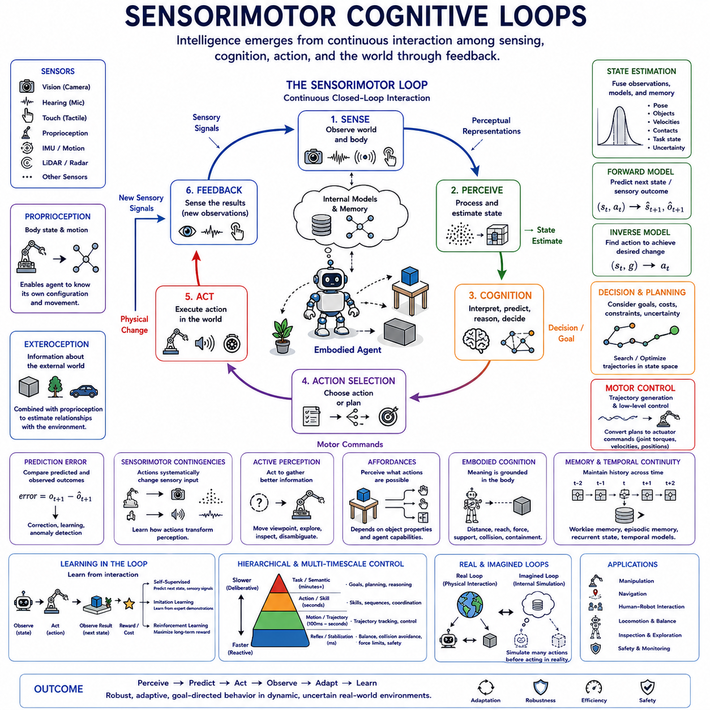{width="7.268055555555556in" height="7.268055555555556in"}

Sensorimotor cognitive loops describe intelligence as a continuous interaction between sensing, internal processing, and physical action. An embodied agent does not simply perceive the environment and then produce an isolated response. Its actions modify the world, body, or viewpoint, producing new sensory information that influences the next decision. Cognition therefore develops within a recurrent perception--action cycle.

The sensorimotor perspective emphasizes that perception and action are deeply interdependent. Visual, auditory, tactile, proprioceptive, vestibular, and other sensory signals provide information about both the environment and the agent\'s body. Motor commands then change physical relationships between the agent and its surroundings. Every movement consequently creates new observations and changes the information available for subsequent cognition.

A basic sensorimotor loop begins when sensors observe the current environment and body state. Perceptual processes transform these signals into useful representations, cognitive mechanisms interpret the situation, and action-selection systems determine an appropriate response. Motor controllers execute the selected action, changing the physical state. Sensors then measure the resulting conditions, closing the loop through continuous feedback.

Feedback distinguishes sensorimotor cognition from open-loop behavior. In an open-loop system, an action sequence may execute without continuously considering its consequences. Closed-loop systems repeatedly compare expected and observed results and modify behavior when necessary. This feedback enables correction of disturbances, adaptation to uncertainty, compensation for modeling errors, and robust interaction with environments that cannot be perfectly predicted.

Proprioception provides information about the agent\'s own physical configuration and motion. In humans it contributes information about joint position, muscle state, and movement, while robots obtain related information from joint encoders, motor currents, inertial sensors, and other internal measurements. Proprioceptive information allows cognition to distinguish changes in the external environment from changes produced by the agent\'s own movement.

Exteroception provides information about the external world through modalities such as vision, hearing, touch, LiDAR, radar, or proximity sensing. Combining exteroceptive and proprioceptive information enables an embodied agent to estimate relationships between itself and surrounding objects. Sensor fusion therefore supports a unified state representation connecting environmental structure with body configuration, motion, and potential interaction.

Internal state estimation becomes necessary because sensor measurements are incomplete and noisy. A cognitive system combines current observations with previous estimates and models of expected change to infer the most likely present state. This estimated state may contain body pose, object locations, velocities, contacts, task conditions, uncertainty, and other variables required for selecting and controlling actions.

Motor commands transform cognitive decisions into physical change. High-level cognition may specify an objective such as reaching an object, while intermediate processes generate trajectories and low-level controllers produce actuator commands. Sensorimotor architectures therefore connect multiple levels of abstraction, translating semantic goals into increasingly concrete actions while feedback continuously reports whether execution is progressing as expected.

Forward models predict the sensory or physical consequences of actions. Given the current state and a motor command, a forward model estimates what the next state or observation should be. The prediction can be compared with actual sensory feedback after the action occurs. Differences between expected and observed outcomes provide information for correction, learning, anomaly detection, and adaptation.

Inverse models address the complementary problem of determining which action can produce a desired change. Given a current state and target state, an inverse model estimates an appropriate motor command or action sequence. Sensorimotor control can combine inverse models for generating actions with forward models for predicting their consequences, creating a powerful mechanism for goal-directed physical interaction.

Prediction error plays a central role in closed-loop cognition. When predicted sensory consequences differ from observations, the system must determine whether the difference results from external disturbance, inaccurate perception, incorrect dynamics, or execution error. The discrepancy can trigger immediate control correction or longer-term model learning. Repeated prediction and correction progressively improve the agent\'s sensorimotor competence.

Sensorimotor contingencies describe systematic relationships between actions and changes in sensory input. Moving the head changes visual perspective, touching an object produces characteristic tactile signals, and moving toward a sound modifies its spatial properties. By learning these regularities, an agent develops knowledge about how its actions transform perception, grounding environmental understanding in interactive experience.

Active perception follows naturally from this principle. An agent does not need to treat sensing as a passive process because actions can be selected specifically to obtain better information. A robot may move its camera to resolve an occluded object, approach a surface for inspection, or reposition itself to improve localization. Action therefore serves both physical goals and information-gathering objectives.

Attention can also participate in sensorimotor loops by allocating sensing and computation according to current goals. Instead of processing every signal with equal priority, the agent can focus resources on task-relevant regions, objects, modalities, or unexpected events. Actions may subsequently change the sensory viewpoint, producing a coordinated cycle between attention, perception, movement, and renewed attention.

Affordances connect perception directly with possible actions. Rather than representing an object only through its appearance or category, an embodied system can represent what interactions the object permits, such as grasping, pushing, traversing, opening, or avoiding. Affordance representations are relational because possible actions depend on both environmental properties and the physical capabilities of the agent.

Embodied cognition extends this relationship by proposing that intelligent representations are strongly influenced by the body\'s ability to interact with the world. Concepts such as distance, reachability, support, collision, force, and containment have direct sensorimotor significance. Physical interaction provides grounding that connects abstract representations with measurable consequences of actions in real environments.

Temporal continuity is essential because sensorimotor interaction unfolds as sequences rather than isolated observations. The agent must connect previous actions with subsequent sensory effects and distinguish delayed consequences from unrelated events. Working memory, recurrent states, attention mechanisms, and temporal models can preserve relevant history so that cognition can interpret ongoing interactions coherently.

Sensorimotor learning emerges through repeated experience with these temporal relationships. The agent observes states, performs actions, measures consequences, and gradually learns mappings among perception, action, and environmental change. Supervised, self-supervised, imitation, and reinforcement learning can contribute different forms of knowledge, while prediction errors provide naturally occurring learning signals during continuous interaction.

Self-supervised learning is particularly compatible with sensorimotor loops because physical interaction continuously generates structured training data. Current observations and actions provide context, while later observations provide targets for prediction. An embodied system can therefore learn motion, object persistence, contact effects, spatial relationships, and action consequences without requiring explicit human labels for every interaction.

Reinforcement learning adds goal-directed evaluation to the loop. Actions produce both environmental transitions and rewards or costs that indicate whether behavior supports an objective. The agent can improve its policy by relating actions and states to long-term outcomes. When combined with a learned world model, reinforcement learning can also evaluate simulated sensorimotor experiences before executing actions physically.

Hierarchical control is necessary because sensorimotor cognition operates across several timescales. Motor stabilization may require millisecond-level feedback, trajectory control may operate over fractions of seconds, local actions may unfold across seconds, and task reasoning may span minutes or longer. Higher levels establish goals and constraints while lower levels continuously adapt execution to rapidly changing sensory feedback.

Reflexive behavior represents the fastest layer of sensorimotor control. Some situations require responses before extensive deliberation is possible, such as maintaining balance, avoiding imminent collision, or limiting excessive force. These fast loops can operate alongside slower cognitive processes. Deliberative mechanisms can establish broader objectives while reflexive mechanisms preserve stability and safety during execution.

Dual-process organization can therefore be observed within embodied control. Fast pathways handle familiar or urgent sensorimotor patterns through learned policies and control laws, whereas slower pathways support planning, uncertainty analysis, simulation, and problem solving. A capable cognitive system can shift computational resources toward deliberation when routine sensorimotor behavior becomes unreliable or encounters unfamiliar conditions.

World models extend sensorimotor loops by allowing consequences to be evaluated internally before physical execution. The model receives a representation of the current state and candidate action and predicts possible future states. Planning can compare these simulated trajectories and select promising actions. Real sensory feedback subsequently determines whether the prediction was accurate and updates the model when necessary.

This produces an interaction between real and imagined sensorimotor loops. Real loops generate observations through physical actions, whereas imagined loops generate predicted observations through internal simulation. Planning can execute many hypothetical actions within a world model before selecting one for reality. Physical experience then provides grounding and correction, preventing internal simulation from becoming disconnected from actual environmental dynamics.

Manipulation provides a clear example of sensorimotor cognition. A robot observes an object, estimates its pose, selects a grasp, approaches it, detects contact, regulates force, lifts the object, and monitors whether the grasp remains stable. Each stage changes both the physical state and available sensory information. Successful manipulation therefore depends on continuous feedback rather than a single perception followed by a fixed motion sequence.

Mobile robotics demonstrates the same principle at larger spatial scales. Cameras, LiDAR, radar, IMU, GNSS, wheel encoders, and other sensors continuously estimate robot motion and environmental structure. Navigation generates actions that change the robot\'s position and viewpoint, producing new observations. Localization, mapping, obstacle prediction, planning, and control consequently operate as interconnected sensorimotor loops.

Unexpected environmental changes reveal why these loops are essential. A planned trajectory may become invalid when a person enters the path, an object moves, terrain changes, or localization confidence decreases. Continuous sensing detects the discrepancy, state estimation updates the internal representation, planning revises the intended behavior, and control executes the new action. Autonomy emerges through repeated correction rather than fixed execution.

Human--robot interaction introduces additional feedback because human behavior responds to robot behavior. A robot\'s motion, speech, or gesture changes the human\'s subsequent actions, which become new observations for the robot. The sensorimotor loop therefore extends across multiple interacting agents. Effective behavior requires prediction not only of physical dynamics but also of socially responsive actions and intentions.

Safety must remain integrated throughout the sensorimotor loop. Independent monitoring can enforce limits on velocity, force, proximity, stability, and uncertainty even when higher-level predictions are incorrect. When observations indicate dangerous divergence from expected behavior, safety mechanisms can interrupt planned actions and initiate fallback responses. Reliable Physical AI therefore requires feedback at both cognitive and safety-control levels.

Meta-cognition can supervise these loops by evaluating whether perception, prediction, and action are functioning reliably. Persistent prediction errors may indicate sensor failure, model mismatch, unfamiliar terrain, or an inappropriate strategy. The system can respond by gathering additional observations, slowing movement, switching control modes, replanning, or requesting assistance rather than continuing with unjustified confidence.

Ultimately, sensorimotor cognitive loops transform intelligence into an ongoing process of perceiving, predicting, acting, observing consequences, and adapting. Sensory signals ground internal representations, forward models predict consequences, inverse models support action generation, feedback corrects behavior, and learning improves future interaction. Their integration forms a fundamental mechanism for embodied cognition, autonomous robotics, cognitive agents, and advanced Physical AI.
