**Volume 43 Cognitive Science for AI**

# Chapter 07. Cognitive Science to AI

## 07.00 Bridge Overview

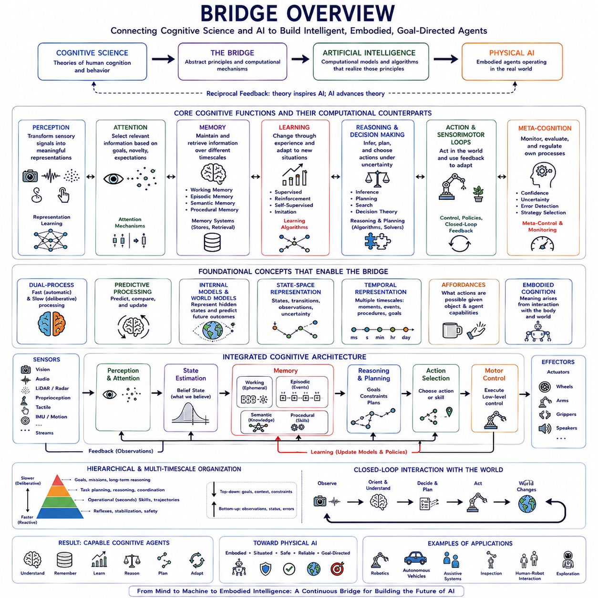{width="7.268055555555556in" height="7.268055555555556in"}

인지과학(Cognitive Science)과 인공지능(Artificial Intelligence) 사이의 가교(Bridge)는 인간 인지(Human Cognition)에 관한 이론을 점점 더 높은 능력을 갖춘 지능형 시스템(Intelligent Systems)을 지원할 수 있는 계산 메커니즘(Computational Mechanisms)으로 변환하기 위한 프레임워크를 제공합니다. 인지과학은 지각(Perception), 기억(Memory), 학습(Learning), 추론(Reasoning), 언어(Language), 의사결정(Decision Making), 행동(Action)이 어떻게 상호작용하는지를 연구하며, 인공지능은 이와 관련된 능력을 계산적으로 구현하려고 합니다. 이러한 가교는 설명적 이론(Explanatory Theories)과 공학적 아키텍처(Engineering Architectures)를 연결합니다.

이러한 연결은 인공지능이 인간의 뇌(Human Brain)를 정확하게 재현해야 한다는 가정에 기반하지 않습니다. 생물학적 인지(Biological Cognition)는 특정한 물리적, 대사적(Metabolic), 발달적(Developmental), 사회적 제약 조건 아래에서 진화했지만, 인공 시스템은 서로 다른 계산 기반(Computational Substrates)을 사용할 수 있습니다. 중요한 목표는 표상, 학습 메커니즘, 기억 시스템, 추론 과정, 적응적 행동(Adaptive Behavior)에 영감을 줄 수 있는 지능의 일반적인 원리(General Principles of Intelligence)를 식별하는 것입니다.

인지과학(Cognitive Science)은 지능에 대한 기능적 설명(Functional Descriptions)을 제공합니다. 제한된 정보가 어떻게 유용한 내부 표상(Internal Representations)으로 변환되는지, 어텐션(Attention)이 관련 신호를 어떻게 선택하는지, 기억이 어떻게 형성되고 검색되는지, 불확실성(Uncertainty)이 의사결정에 어떤 영향을 미치는지, 목표(Goals)가 행동을 어떻게 조직하는지를 연구합니다. 이러한 설명은 생물학적 구현을 문자 그대로 복제하지 않고도 계산 시스템에 매핑할 수 있는 개념적 모듈(Conceptual Modules)을 제공합니다.

신경과학(Neuroscience)은 인지 기능이 분산된 신경 과정(Distributed Neural Processes)에서 어떻게 발생하는지를 조사함으로써 또 다른 수준의 통찰을 제공합니다. 신경 집단(Neural Populations), 순환 연결성(Recurrent Connectivity), 예측 신호(Predictive Signaling), 가소성(Plasticity), 계층적 처리(Hierarchical Processing), 감각운동 상호작용(Sensorimotor Interaction)은 복잡한 행동이 조정된 계산으로부터 발생할 수 있는 메커니즘을 제시합니다. 인공지능은 생물학적 신경회로와 상당히 다른 수학적 모델을 사용하면서 이러한 원리를 추상화할 수 있습니다.

인공지능(Artificial Intelligence)은 인지적 아이디어를 시험하고 확장하기 위한 계산 도구를 제공합니다. 신경망(Neural Networks)은 대규모 데이터셋에서 표상을 학습할 수 있고, 강화학습(Reinforcement Learning)은 결과를 통한 적응을 모델링할 수 있으며, 기호 시스템(Symbolic Systems)은 구조화된 지식을 조작할 수 있고, 확률 모델(Probabilistic Models)은 불확실성을 표현할 수 있습니다. 인지 가설(Cognitive Hypotheses)을 계산적으로 구현함으로써 특정 형태의 지능적 행동을 생성하는 데 어떤 메커니즘이 충분한지를 조사할 수 있습니다.

따라서 이러한 가교(Bridge)는 양방향으로 작동합니다. 인지과학은 인공지능 아키텍처에 영감을 제공할 수 있으며, 인공 시스템은 인지 이론을 탐구하기 위한 계산 모델을 제공할 수 있습니다. 인공지능 아키텍처가 특정 조건에서 성공하거나 실패할 때 그 행동은 어떤 가정이 유용하고, 불완전하며, 지나치게 단순화되었는지를 보여줄 수 있습니다. 이러한 상호적 관계(Reciprocal Relationship)는 계산을 공학적 도구인 동시에 지능을 연구하는 방법으로 만듭니다.

지각(Perception)은 가장 중요한 초기 연결 가운데 하나를 형성합니다. 생물학적 인지는 연속적인 감각 신호를 객체, 사건, 공간적 관계(Spatial Relationships), 의미 있는 상황에 대한 표상으로 변환합니다. 현대 인공지능 역시 이미지, 오디오, 언어, 라이다(LiDAR), 기타 센서 스트림을 학습된 표상(Learned Representations)으로 변환합니다. 따라서 표상 학습(Representation Learning)은 불완전한 감각적 증거에서 의미 있는 상태를 구성하는 인지적 문제에 대한 계산적 대응 관계를 제공합니다.

어텐션(Attention)은 또 다른 중요한 가교를 제공합니다. 인지 시스템은 이용 가능한 모든 신호를 동일한 우선순위로 처리할 수 없으므로 어텐션은 관련성(Relevance), 새로움(Novelty), 목표, 기대(Expectations)에 따라 제한된 자원을 할당합니다. 인공 어텐션 메커니즘(Artificial Attention Mechanisms) 역시 과제에서 중요한 관계나 정보를 선택합니다. 생물학적 어텐션과 계산적 어텐션이 동일한 것은 아니지만, 둘 모두 선택적 정보 처리(Selective Information Processing)라는 근본적인 문제를 다룹니다.

기억(Memory)은 즉각적인 지각을 넘어서는 연속성을 형성합니다. 인지과학은 작업 기억(Working Memory), 일화 기억(Episodic Memory), 의미 기억(Semantic Memory), 절차 기억(Procedural Memory)을 구별하며 각각은 서로 다른 기능을 지원합니다. 인공지능 시스템 역시 문맥 창(Context Windows), 외부 메모리 저장소(External Memory Stores), 검색 시스템(Retrieval Systems), 파라미터화된 지식(Parameterized Knowledge), 학습된 정책(Learned Policies)과 같은 유사한 메커니즘을 점차 포함하고 있습니다. 이러한 계산 메커니즘은 하나의 구별되지 않는 저장 시스템으로 취급하기보다 기능적인 기억 요구사항에 따라 구성할 수 있습니다.

작업 기억(Working Memory)은 문제를 해결하는 동안 중간 정보(Intermediate Information)를 계속 사용할 수 있어야 하기 때문에 추론에서 특히 중요합니다. 인공 에이전트(Artificial Agents) 역시 목표, 관찰, 검색된 지식, 부분 계획(Partial Plans), 중간 결과(Intermediate Results)를 일시적으로 표현할 필요가 있습니다. 명시적인 작업 기억 메커니즘은 지속적으로 유지되는 지식과 현재의 인지적 에피소드(Cognitive Episode)에만 관련된 정보를 분리하는 데 도움을 줄 수 있습니다.

일화 기억(Episodic Memory)은 지능형 에이전트가 특정한 과거 경험에 접근해야 하는 경우가 많기 때문에 인공지능을 위한 또 다른 유용한 모델을 제공합니다. 일반화된 통계 패턴만 저장하는 대신 에이전트는 상호작용, 의사결정, 결과, 환경적 문맥(Environmental Contexts)에 관한 기록을 보존할 수 있습니다. 유사한 에피소드를 검색하면 전체 모델을 다시 학습하지 않고도 적응, 설명, 계획, 이전 성공이나 실패로부터의 학습을 지원할 수 있습니다.

의미 기억(Semantic Memory)은 개념, 사실, 관계에 대한 일반화된 지식과 더 밀접하게 대응합니다. 대규모 신경 모델(Large Neural Models)은 파라미터에 상당한 양의 통계적 지식을 인코딩할 수 있으며, 데이터베이스, 지식 그래프(Knowledge Graphs), 검색 시스템은 보다 명시적인 형태의 의미적 저장소를 제공할 수 있습니다. 하이브리드 아키텍처(Hybrid Architectures)는 이러한 표상을 결합하여 유연하게 학습된 지식을 지속적이고 검사 가능한 정보원과 함께 사용할 수 있습니다.

절차 기억(Procedural Memory)은 인지를 학습된 기술(Learned Skills)과 연결합니다. 인간은 익숙한 많은 활동을 수행할 때 모든 개별 단계를 명시적으로 추론하지 않습니다. 인공 시스템도 학습된 정책, 제어기(Controllers), 행동 프리미티브(Action Primitives), 재사용 가능한 기술(Reusable Skills)을 사용하여 익숙한 행동을 효율적으로 실행할 수 있습니다. 상위 수준 추론은 이러한 절차 가운데 하나를 선택하고 하위 수준 메커니즘은 세부 행동을 수행함으로써 숙고(Deliberation)와 실행(Execution) 사이의 계층적 조직을 형성할 수 있습니다.

학습(Learning)은 인지가 경험을 통해 변화하기 때문에 핵심적인 가교를 제공합니다. 지도학습(Supervised Learning)은 라벨이 지정된 예제로부터의 학습을, 강화학습(Reinforcement Learning)은 결과를 통한 적응을, 자기지도학습(Self-supervised Learning)은 관찰 자체에 내재된 구조의 활용을, 모방학습(Imitation Learning)은 시연(Demonstrations)으로부터의 행동 전이를 구현합니다. 하나의 학습 패러다임만으로 인간 학습 전체를 표현할 수는 없지만, 이들을 함께 사용하면 서로 다른 형태의 적응을 위한 계산 메커니즘을 제공할 수 있습니다.

이중 처리 이론(Dual-process Theories)은 인공 인지를 구성하기 위한 유용한 추상화를 제공합니다. 빠른 처리(Fast Processing)는 학습된 패턴 인식, 휴리스틱(Heuristics), 신경 정책(Neural Policies), 자동적 반응과 연결할 수 있으며, 느린 처리(Slow Processing)는 명시적 추론, 탐색(Search), 계획, 시뮬레이션, 검증(Verification)을 포함할 수 있습니다. 고급 인공지능 시스템은 모든 상황에 동일한 추론 깊이를 적용하는 대신 이러한 모드 사이에서 계산 자원을 동적으로 할당할 수 있습니다.

메타인지(Meta-cognition)는 시스템이 자신의 처리 과정을 평가할 수 있도록 함으로써 이러한 구성을 확장합니다. 신뢰도(Confidence), 불확실성, 모순(Contradiction), 과제 난이도(Task Difficulty), 예측 오류(Prediction Error)는 즉각적인 답변으로 충분한지 또는 추가적인 추론이 필요한지를 나타낼 수 있습니다. 인공 에이전트는 이러한 신호를 사용하여 더 많은 정보를 검색하고, 도구를 호출하며, 대안을 시뮬레이션하고, 결론을 검증하거나 내부 신뢰도가 충분하지 않을 때 도움을 요청할 수 있습니다.

인지 아키텍처(Cognitive Architectures)는 서로 분리되어 있는 능력들을 통합함으로써 구조적인 가교를 제공합니다. 소어(SOAR), ACT-R, 클라리온(CLARION), 라이다(LIDA)와 같은 시스템은 기억, 어텐션, 학습, 추론, 행동을 조정하는 서로 다른 접근 방식을 보여줍니다. 현대 인공지능은 신경망, 파운데이션 모델(Foundation Models), 외부 메모리, 확률적 추론(Probabilistic Inference), 플래너(Planners), 도구 사용(Tool-use) 메커니즘을 활용하여 이러한 아키텍처 원리를 새롭게 해석할 수 있습니다.

하이브리드 인지 아키텍처(Hybrid Cognitive Architectures)는 지능이 연속적인 통계 정보와 구조화된 관계를 모두 포함하기 때문에 특히 중요합니다. 신경 시스템(Neural Systems)은 복잡한 표상과 예측을 학습하는 데 효과적이며, 기호 메커니즘(Symbolic Mechanisms)은 명시적인 규칙, 제약 조건, 목표, 조합적 추론(Compositional Reasoning)을 제공할 수 있습니다. 이러한 접근을 결합하면 학습된 유연성과 구조화된 제어 및 해석 가능한 과제 표상(Interpretable Task Representations)이 함께 존재할 수 있습니다.

예측 처리(Predictive Processing)는 인지와 현대 인공지능 사이의 또 다른 가교를 제공합니다. 지각을 수동적인 인식 과정으로만 다루는 대신 예측적 접근은 인지가 지속적으로 기대를 생성하고 이를 관찰과 비교하는 과정으로 봅니다. 인공 시스템은 예측 학습(Predictive Learning), 잠재 동역학(Latent Dynamics), 다음 상태 예측(Next-state Prediction), 마스킹 예측(Masked Prediction), 생성 모델(Generative Models)을 통해 관련 메커니즘을 구현하고 누락되거나 미래의 정보를 예상함으로써 규칙성을 학습할 수 있습니다.

내부 모델(Internal Models)은 직접 관찰할 수 없는 조건에 대한 표상을 유지함으로써 예측을 확장합니다. 인지 에이전트는 현재 믿음(Beliefs), 기억된 정보, 활성 목표(Active Goals), 추론된 환경 조건을 설명하는 내부 상태(Internal States)를 필요로 합니다. 인공 에이전트 역시 시간에 따라 관찰을 통합하는 지속적인 상태 표상(Persistent State Representations)을 필요로 합니다. 이러한 상태는 연속성을 제공하고 의사결정이 가장 최근의 입력뿐만 아니라 누적된 정보에도 의존하도록 합니다.

월드 모델(World Models)은 이러한 아이디어를 환경 동역학(Environmental Dynamics)에 대한 예측적 표상으로 발전시킵니다. 월드 모델은 상태가 시간에 따라 어떻게 변화하며 행동이 미래 결과에 어떤 영향을 미치는지를 추정합니다. 관찰에서 행동으로 직접 이어지는 매핑만 학습하는 대신 에이전트는 내부적으로 여러 대안을 시뮬레이션할 수 있습니다. 이는 상상(Imagination), 예상(Anticipation), 정신적 시뮬레이션(Mental Simulation), 모델 기반 의사결정(Model-based Decision Making)과 같은 인지 개념을 계산적으로 연결합니다.

상태 공간 표상(State-space Representation)은 이러한 모델에 필요한 수학적 구조를 제공합니다. 현재 상태는 관련 정보를 요약하고, 전이 모델(Transition Models)은 상태가 어떻게 변화하는지를 설명하며, 관찰은 상태를 업데이트하기 위한 증거를 제공합니다. 불확실한 상황에서는 믿음 상태(Belief States)가 여러 가능한 해석을 표현할 수 있습니다. 따라서 정신 상태(Mental State)와 시간적 연속성(Temporal Continuity)에 관한 인지 개념은 상태 추정(Estimation), 제어 이론(Control Theory), 확률 모델링(Probabilistic Modeling), 머신러닝(Machine Learning)과 연결될 수 있습니다.

지능은 여러 시간 척도(Timescales)에서 작동하기 때문에 시간적 표상(Temporal Representation)이 필수적입니다. 즉각적인 감각 처리는 매우 빠르게 이루어질 수 있고, 행동은 더 긴 시간에 걸쳐 진행되며, 과제는 수분 또는 수시간 동안 지속되고, 지식은 여러 경험에 걸쳐 유지됩니다. 따라서 인공 인지 시스템은 단기 동역학을 사건, 절차, 목표, 장기 계획과 연결하는 계층적 시간 표상(Hierarchical Temporal Representations)을 필요로 합니다.

감각운동 루프(Sensorimotor Loops)는 인지를 체화(Embodiment)와 연결합니다. 지각은 행동에 영향을 주고, 행동은 환경과 신체를 변화시키며, 이러한 변화는 새로운 감각 관찰을 생성합니다. 따라서 지능은 수동적인 관찰만을 통해서가 아니라 지속적인 폐쇄 루프 상호작용(Closed-loop Interaction)을 통해 발달합니다. 이러한 원리는 언어 기반 인공지능에서 로봇과 같이 물리적으로 세계와 상호작용하는 시스템으로 이동할 때 특히 중요해집니다.

체화된 인지(Embodied Cognition)는 많은 개념이 가능한 상호작용을 통해 의미를 획득한다는 점을 강조합니다. 거리(Distance)는 이동과 관련되고, 파지 가능성(Graspability)은 신체 구성에 의존하며, 장애물은 궤적을 제한하고, 힘(Force)은 물리적 결과를 결정합니다. 인공 에이전트에서는 표상을 감각운동 경험(Sensorimotor Experience)에 접지(Grounding)함으로써 추상적 개념을 측정 가능한 상태, 행동, 행동유도성(Affordances), 환경 변화와 연결할 수 있습니다.

행동유도성(Affordances)은 지각과 행동 사이의 실용적인 가교를 제공합니다. 지능형 시스템은 객체가 무엇인지를 인식하는 것에 그치지 않고 그 객체를 대상으로 무엇을 할 수 있는지도 표현할 수 있습니다. 표면은 물체를 놓는 행동을 허용할 수 있고, 개구부는 통과를 허용할 수 있으며, 객체는 파지 또는 밀기 행동을 허용할 수 있습니다. 이러한 표상은 의미적 이해(Semantic Understanding)를 행동 가능성과 에이전트의 물리적 능력에 직접 연결합니다.

에이전시(Agency)는 이러한 인지 프레임워크에 목표를 도입합니다. 인지 에이전트는 단순히 세계를 예측하는 것이 아니라 원하는 결과를 달성하기 위해 예측을 사용합니다. 목표는 어텐션, 기억 검색(Memory Retrieval), 계획, 행동 선택(Action Selection)을 안내합니다. 이후 피드백은 목표를 향한 진행 여부를 판단합니다. 따라서 인공 에이전시는 내부 상태, 기억, 예측, 의사결정, 행동, 환경 관찰 사이의 지속적인 상호작용을 필요로 합니다.

현대의 에이전틱 인공지능(Agentic AI)은 이러한 여러 아이디어를 통합하기 위한 계산 플랫폼을 제공합니다. 파운데이션 모델은 언어 및 멀티모달 추론(Multimodal Reasoning)을 제공하고, 외부 메모리는 경험을 보존하며, 검색(Retrieval)은 지식을 공급하고, 플래너는 미래 행동을 조직하며, 도구(Tools)는 계산 능력을 확장할 수 있습니다. 제어기(Controller)는 반복적인 관찰, 추론, 행동, 피드백 순환을 통해 이러한 구성 요소들을 조정할 수 있습니다.

인지 에이전트(Cognitive Agents)에서 피지컬 인공지능(Physical AI)으로의 전환은 실제 세계의 동역학, 체화, 안전 제약 조건(Safety Constraints)을 추가합니다. 물리적 에이전트는 카메라, 라이다(LiDAR), 레이더, 고유수용감각(Proprioception), 촉각 감지(Tactile Sensing), 위치 추정(Localization), 기타 신호를 통합하면서 실제 움직임을 제어해야 합니다. 이제 예측 오류는 물리적 결과를 발생시키므로 정확한 상태 추정, 불확실성 관리(Uncertainty Management), 폐쇄 루프 제어, 안전 감독(Safety Supervision)이 훨씬 중요해집니다.

피지컬 인공지능은 행동이 물리 환경을 어떻게 변화시키는지 예상해야 하기 때문에 이러한 전환에서 월드 모델(World Models)이 특히 중심적인 역할을 합니다. 로봇은 움직임, 접촉, 객체 상호작용, 지형, 다른 에이전트, 자기 자신의 미래 상태를 예측해야 합니다. 학습된 잠재 동역학(Learned Latent Dynamics)은 확장 가능한 예측을 제공할 수 있으며, 구조화된 물리 및 의미 표상(Structured Physical and Semantic Representations)은 제약 조건, 계획, 상위 수준 추론을 지원할 수 있습니다.

계층적 인지(Hierarchical Cognition)는 이러한 능력을 여러 시간 척도에서 조정하는 방법을 제공합니다. 빠른 감각운동 제어(Fast Sensorimotor Control)는 즉각적인 안정화와 충돌 회피를 처리하고, 중간 수준 과정은 기술과 궤적을 관리하며, 느린 인지(Slower Cognition)는 과제 추론, 계획, 장기 예측(Long-horizon Prediction)을 수행합니다. 각 수준 사이에서 정보가 이동함으로써 빠른 물리적 반응이 더 광범위한 목표 및 제약 조건과 일관성을 유지할 수 있습니다.

그 결과 형성되는 가교는 인지 이론(Cognitive Theory)에서 계산 지능(Computational Intelligence)을 거쳐 최종적으로 체화된 자율 시스템(Embodied Autonomous Systems)에 이르는 발전 과정을 연결합니다. 지각은 표상 학습(Representation Learning)이 되고, 기억은 지속적인 계산 상태(Persistent Computational State)가 되며, 추론은 구조화된 추론(Structured Inference)이 되고, 상상은 월드 모델 시뮬레이션(World-model Simulation)이 되며, 목표는 계획 목적(Planning Objectives)이 되고, 감각운동 인지는 폐쇄 루프 로봇 상호작용(Closed-loop Robotic Interaction)이 됩니다. 각각의 변환은 구현 방법을 변화시키면서도 핵심적인 기능 원리를 유지합니다.

궁극적으로 인지과학과 인공지능 사이의 가교는 생물학을 기계에 직접 복사하는 것이 아니라 추상화(Abstraction), 계산적 구현(Computational Realization), 공학적 통합(Engineering Integration)의 과정입니다. 인지과학은 기능적 원리를 식별하고, 신경과학은 메커니즘적 영감(Mechanistic Inspiration)을 제공하며, 인공지능은 확장 가능한 계산 방법을 제공하고, 월드 모델은 예측적인 내부 시뮬레이션을 제공하며, 피지컬 인공지능은 현실 세계에서의 행동을 통해 이러한 능력을 접지합니다.

이러한 가교는 지각이 상태를 구성하고, 기억이 경험을 보존하며, 예측이 변화를 예상하고, 추론이 관계를 해석하며, 계획이 미래를 평가하고, 행동이 환경을 변화시키며, 피드백이 적응을 유도하는 보다 광범위한 지능 아키텍처(Intelligence Architecture)를 제시합니다. 이러한 기능을 통합하면 마음에 관한 이론(Theories of Mind)을 인지 에이전트, 에이전틱 인공지능, 월드 모델 기반 지능(World-model-based Intelligence), 자율 로보틱스(Autonomous Robotics), 고급 피지컬 인공지능(Advanced Physical AI)과 연결하는 지속적인 인지 루프(Continuous Cognitive Loop)를 구성할 수 있습니다.

## 07.01 Cognitive Inspiration for AI

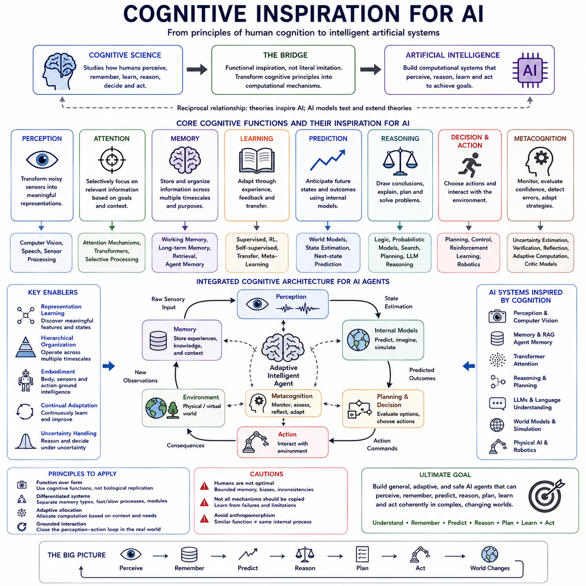{width="7.268055555555556in" height="7.268055555555556in"}

인지과학(Cognitive Science)은 오랫동안 인공지능(Artificial Intelligence)을 위한 개념적 영감(Conceptual Inspiration)의 원천으로 활용되어 왔습니다. 두 분야 모두 지능형 시스템(Intelligent System)이 정보를 적응적 행동(Adaptive Behavior)으로 어떻게 변환하는지를 설명하려 하기 때문입니다. 인간 인지(Human Cognition)는 지능이 하나의 단일한 연산이 아니라 지각(Perception), 어텐션(Attention), 기억(Memory), 학습(Learning), 예측(Prediction), 추론(Reasoning), 의사결정(Decision Making), 행동(Action) 사이의 상호작용이라는 것을 보여줍니다. 인공지능 연구는 인간의 마음을 문자 그대로 재현하려 하기보다 이러한 기능적 아이디어를 계산 메커니즘(Computational Mechanisms)으로 변환합니다.

따라서 인지과학과 인공지능 사이의 관계는 직접적인 생물학적 모방(Biological Imitation)보다는 기능적 영감(Functional Inspiration)으로 이해하는 것이 가장 적절합니다. 인지 이론(Cognitive Theories)은 인간 행동을 설명할 수 있는 메커니즘을 기술하고, 인공지능 엔지니어는 이와 유사한 계산 원리(Computational Principles)가 인공 시스템을 개선할 수 있는지를 탐구합니다. 선택적 어텐션(Selective Attention)은 정보 라우팅 메커니즘(Information-routing Mechanisms)에 영감을 줄 수 있고, 기억 이론(Memory Theories)은 서로 구별되는 저장 시스템을 제안하며, 정신 모델(Mental Models)은 예측과 계획을 지원하는 내부 표상(Internal Representations)의 설계에 영감을 줄 수 있습니다.

인간의 지각(Human Perception)은 불완전하고 잡음이 포함된 감각 신호(Sensory Signals)를 유용한 내부 표상으로 변환하는 것의 중요성을 보여줍니다. 생물학적 지각(Biological Perception)은 들어오는 증거를 문맥(Context), 기대(Expectations), 사전 지식(Prior Knowledge)과 지속적으로 결합합니다. 인공지능 시스템 역시 이미지, 오디오, 언어, 라이다(LiDAR), 기타 센서 스트림을 이후의 추론과 행동을 지원할 수 있는 특징(Features)과 잠재 상태(Latent States)로 변환할 때 이와 유사한 계산적 요구사항을 갖습니다. 이러한 연결은 체화 지능(Embodied Intelligence)과 멀티모달 지능(Multimodal Intelligence)에서 특히 중요해집니다.

어텐션(Attention)은 지능형 시스템이 이용 가능한 모든 신호를 동일한 우선순위로 처리할 수 없다는 점에서 또 다른 영향력 있는 인지 원리를 제공합니다. 인간의 어텐션은 현재 목표, 환경적 사건(Environmental Events), 기대와 관련된 정보에 제한된 인지 자원(Cognitive Resources)을 선택적으로 할당합니다. 인공지능 메커니즘 역시 선택적 처리(Selective Processing)를 통해 이점을 얻을 수 있지만, 계산적 어텐션(Computational Attention)을 인간의 어텐션과 동일한 것으로 간주해서는 안 됩니다. 두 시스템이 공유하는 핵심 원리는 문맥적으로 중요한 정보에 처리 자원을 효율적으로 할당하는 것입니다.

인간의 기억(Human Memory)은 유용한 지능이 단순한 지속적 저장(Persistent Storage) 이상을 필요로 한다는 점을 보여줍니다. 인지과학은 작업 기억(Working Memory), 일화 기억(Episodic Memory), 의미 기억(Semantic Memory), 절차 기억(Procedural Memory)을 구분하며, 각각은 서로 다른 인지 기능을 지원합니다. 인공지능 시스템 역시 임시 문맥(Temporary Context), 검색 시스템(Retrieval Systems), 축적된 지식(Accumulated Knowledge), 경험 이력(Experience Histories), 학습된 정책(Learned Policies)을 통해 이와 유사한 기능적 분리를 채택할 수 있습니다. 이러한 구분은 특히 긴 시간 범위(Long Temporal Horizons)에 걸쳐 동작해야 하는 에이전트(Agents)에서 중요합니다.

학습과 적응(Learning and Adaptation)은 인지와 기계 지능(Machine Intelligence) 사이에서 가장 근본적인 가교 가운데 하나를 제공합니다. 인간은 반복되는 경험에서 규칙성을 습득하고, 제한된 예제로부터 개념을 학습하며, 오류가 발생하면 기대를 수정하고, 기존 지식을 익숙하지 않은 상황에 전이합니다. 인공 학습 시스템은 지도학습(Supervised Learning), 자기지도학습(Self-supervised Learning), 강화학습(Reinforcement Learning), 전이학습(Transfer Learning), 메타학습(Meta-learning)을 통해 이와 관련된 능력을 추구합니다. 인지적 관점은 효과적인 학습이 단순히 개별 벤치마크(Benchmarks)를 최적화하는 데 그치지 않고 궁극적으로 미래의 예측, 추론, 행동을 개선해야 한다는 점을 강조합니다.

추론 연구(Reasoning Research)는 내부 표상을 결론, 설명, 계획, 의사결정으로 변환하기 위한 원리를 제공합니다. 인간 인지는 해결해야 하는 문제에 따라 연역적 추론(Deductive Reasoning), 귀납적 추론(Inductive Reasoning), 가설적 추론(Abductive Reasoning), 유추적 추론(Analogical Reasoning), 인과 추론(Causal Reasoning), 반사실적 추론(Counterfactual Reasoning)을 사용합니다. 인공지능 시스템은 기호적 추론(Symbolic Inference), 확률 모델(Probabilistic Models), 탐색(Search), 계획 알고리즘(Planning Algorithms), 신경망(Neural Networks), 언어 모델(Language Models), 하이브리드 아키텍처(Hybrid Architectures)를 통해 관련 기능을 구현합니다. 이러한 인지적 다양성은 일반 지능(General Intelligence)이 여러 추론 메커니즘의 상호작용을 필요로 할 가능성을 제시합니다.

이중 처리 이론(Dual-process Theories)은 속도와 계산 노력(Computational Effort)의 균형을 유지해야 하는 인공지능 시스템을 설계하는 데 특히 유용한 추상화를 제공합니다. 빠른 처리(Fast Processing)는 일상적인 인식과 익숙한 행동을 지원할 수 있으며, 느린 숙고(Slower Deliberation)는 불확실성을 평가하고, 대안을 탐색하며, 결론을 검증하고, 계획을 구성할 수 있습니다. 이에 대응하는 인공지능 원리는 기계가 문자 그대로 시스템 1(System 1)과 시스템 2(System 2)를 가진다는 것이 아니라, 과제 난이도(Task Difficulty), 신뢰도(Confidence), 위험(Risk), 사용 가능한 자원에 따라 계산량을 동적으로 할당하는 아키텍처가 유용할 수 있다는 것입니다.

예측(Prediction)은 인지와 현대 인공지능을 연결하는 또 하나의 반복적인 핵심 원리입니다. 인지 시스템은 발생할 가능성이 높은 감각적 사건, 행동의 결과, 환경 상태(Environmental State)의 변화를 지속적으로 예상합니다. 내부 모델(Internal Models)을 이용하면 에이전트가 가능한 미래를 실제로 경험하기 전에 평가할 수 있습니다. 인공지능에서 예측 표상(Predictive Representations)과 월드 모델(World Models)은 미래 상태를 추정하고, 정신적 시뮬레이션(Mental Simulation)을 지원하며, 대안 행동을 비교하고, 불확실성 아래에서의 계획을 가능하게 함으로써 이와 유사한 기능적 역할을 수행할 수 있습니다.

메타인지(Metacognition)는 인지 과정 자체를 평가하는 메커니즘을 도입함으로써 이러한 개념을 확장합니다. 인간은 자신의 신뢰도를 추정하고, 불확실성을 인식하며, 오류를 감지하고, 전략을 재검토하고, 추가적인 추론이 필요한지를 판단할 수 있습니다. 인공 에이전트는 신뢰도 추정(Confidence Estimation), 불확실성 모델링(Uncertainty Modeling), 검증(Verification), 비평 모듈(Critic Modules), 성찰 절차(Reflection Procedures), 적응형 계산(Adaptive Computation)을 통해 이와 유사한 모니터링 기능을 구현할 수 있습니다. 이러한 메커니즘은 즉각적인 응답만으로 충분한지 또는 검색, 계획, 시뮬레이션, 외부 도구(External Tools)가 추가로 필요한지를 결정하는 데 도움을 줄 수 있습니다.

인지 아키텍처(Cognitive Architectures)는 이러한 개별 메커니즘을 하나의 일관된 시스템(Coherent System)으로 통합하는 방법을 보여줍니다. 지각, 기억, 추론, 행동을 서로 독립적인 모듈로 다루는 대신 기호적(Symbolic), 신경망 기반(Neural), 예측적(Predictive), 하이브리드 모델(Hybrid Models)은 상호작용하는 인지 기능 사이에서 정보가 어떻게 이동하는지를 탐구합니다. 따라서 이러한 구조는 인지 아키텍처를 내부 모델, 월드 모델, 상태 공간 표상(State-space Representation), 시간적 표상(Temporal Representation), 인지 에이전트(Cognitive Agents), 감각운동 루프(Sensorimotor Loops)와 연결합니다.

체화된 인지(Embodied Cognition)는 지능을 행동과 독립적으로 이해할 수 있다는 생각에 더욱 근본적인 문제를 제기합니다. 인간의 인지는 뇌(Brain), 신체(Body), 환경(Environment), 행동의 결과 사이에서 이루어지는 지속적인 상호작용을 통해 발달합니다. 인공지능의 관점에서 이는 지각이 상태 추정(State Estimation)을 생성하고, 내부 모델이 가능한 결과를 예측하며, 계획이 행동을 선택하고, 물리적 상호작용이 새로운 관찰을 생성하는 아키텍처를 제안합니다. 따라서 지능은 고립된 추론보다는 반복적인 지각--예측--의사결정--행동 루프(Perception--Prediction--Decision--Action Loop)에서 나타납니다.

그러나 인간의 인지는 공학적 명세(Engineering Specification)도 아니며 최적의 계산 설계(Optimal Computational Design)도 아니기 때문에 인지적 영감(Cognitive Inspiration)은 신중하게 활용해야 합니다. 인간은 심각한 기억 용량의 한계, 체계적인 편향(Systematic Biases), 어텐션 병목(Attentional Bottlenecks), 일관되지 않은 추론(Inconsistent Reasoning), 생물학적으로 물려받은 제약 조건을 가지고 있습니다. 따라서 인공지능은 인간 인지의 능력뿐만 아니라 한계에서도 학습할 수 있습니다. 일부 메커니즘은 기능적으로 재현할 가치가 있지만, 다른 메커니즘은 인공 시스템이 의도적으로 회피해야 할 실패 모드(Failure Modes)를 보여줍니다.

따라서 가장 생산적인 가교는 상호적인 관계(Reciprocal Relationship)입니다. 인지과학은 지능의 기능적 조직(Functional Organization)에 관한 가설을 제공하고, 인공지능은 이러한 가설을 구현하고 시험할 수 있는 계산 모델(Computational Models)을 제공합니다. 이러한 가교는 자연스럽게 지각과 컴퓨터 비전(Computer Vision), 기억과 에이전트 메모리(Agent Memory), 어텐션과 트랜스포머 메커니즘(Transformer Mechanisms), 추론과 계획, 언어와 대규모 언어 모델(LLMs), 예측과 월드 모델, 그리고 최종적으로 피지컬 인공지능(Physical AI)을 위한 인지 루프(Cognitive Loops)로 이어집니다.

이러한 관점에서 인지적 영감(Cognitive Inspiration)은 단순한 역사적 흥미의 대상이 아니라 점점 더 일반화된 인공지능(General AI)을 설계하기 위한 프레임워크입니다. 미래의 시스템은 멀티모달 지각(Multimodal Perception), 선택적 어텐션(Selective Attention), 구조화된 기억(Structured Memory), 예측적 월드 모델(Predictive World Models), 인과 추론(Causal Reasoning), 적응형 숙고(Adaptive Deliberation), 메타인지적 모니터링(Metacognitive Monitoring), 지속 학습(Continual Learning), 체화된 행동(Embodied Action)을 지속적으로 동작하는 에이전트(Persistent Agents) 내부에 통합할 수 있습니다. 목표는 인간 인지의 디지털 복제본을 만드는 것이 아니라 인공 시스템이 변화하는 환경에서 이해하고, 기억하고, 예측하고, 추론하고, 계획하고, 학습하고, 일관성 있게 적응하도록 지원하는 계산 원리를 추출하는 것입니다.

## 07.02 Perception to Computer Vision [w/Code]

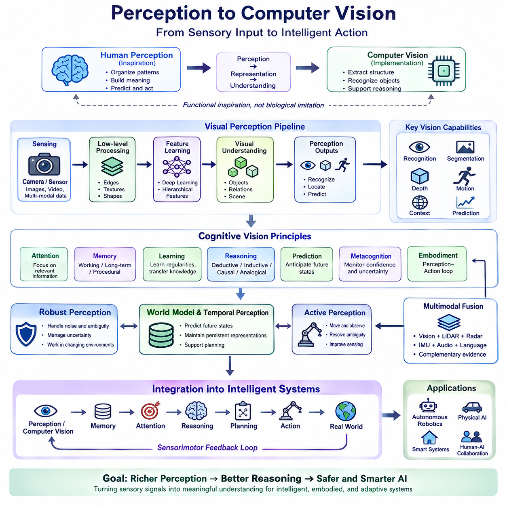{width="7.268055555555556in" height="7.268055555555556in"}

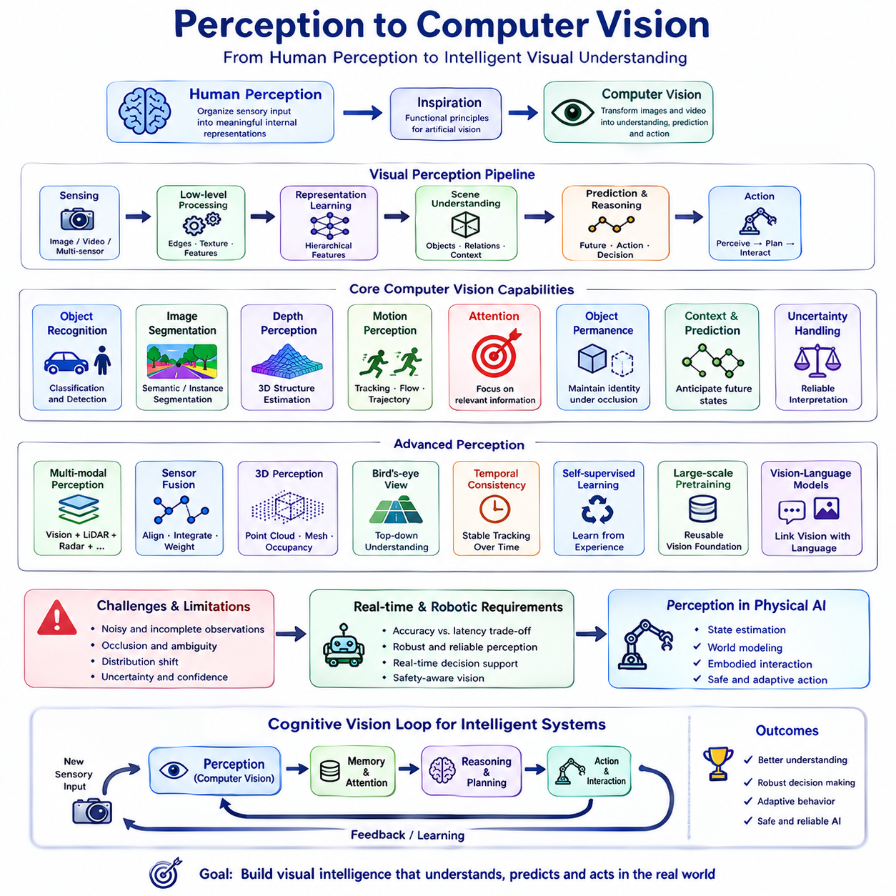{width="7.268055555555556in" height="7.268055555555556in"}

지각(Perception)은 지능형 시스템(Intelligent System)이 감각 신호(Sensory Signals)를 환경에 대한 의미 있는 표상(Meaningful Representations)으로 변환하는 인지 과정(Cognitive Process)입니다. 인간의 시각(Human Vision)은 단순히 눈에 들어오는 빛을 기록하는 것이 아니라 패턴을 객체(Objects), 표면(Surfaces), 움직임(Motion), 깊이(Depth), 공간적 관계(Spatial Relationships), 사건(Events)으로 조직합니다. 컴퓨터 비전(Computer Vision)은 디지털 이미지와 비디오를 인식, 예측, 추론, 행동을 지원하는 표상으로 변환함으로써 이와 유사한 계산 문제를 다룹니다.

생물학적 지각(Biological Perception)에서 컴퓨터 비전으로의 전환은 직접적인 복제가 아니라 기능적 영감(Functional Inspiration)으로 이해해야 합니다. 인간의 시각 처리는 생물학적 신경계(Biological Nervous System) 안에서 진화했지만, 인공 시각(Artificial Vision)은 카메라, 프로세서, 수학적 모델(Mathematical Models), 학습된 표상(Learned Representations)을 통해 작동합니다. 그럼에도 두 시스템 모두 잡음이 포함된 관찰, 모호성(Ambiguity), 불완전한 정보, 변화하는 시점(Viewpoints), 가림(Occlusion), 방대한 양의 감각 데이터를 처리해야 하는 공통적인 문제를 해결해야 합니다.

시각 감지(Visual Sensing)는 의미적 이해(Semantic Understanding)가 아니라 측정값에서 시작됩니다. 카메라는 생물학적 수용체(Biological Receptors)가 들어오는 빛에 반응하는 것처럼 밝기(Intensity)와 색상(Color)의 패턴을 기록하지만, 이러한 측정값만으로 어떤 객체가 존재하며 그것이 무엇을 의미하는지를 직접 알 수는 없습니다. 지각은 저수준 신호(Low-level Signals)를 점차 유용한 표상으로 변환해야 합니다. 따라서 컴퓨터 비전은 가장자리(Edges), 질감(Textures), 형태(Shapes), 객체, 관계, 움직임, 장면 수준 구조(Scene-level Structure)를 점진적으로 포착하는 특징(Features)을 구성합니다.

초기의 컴퓨터 비전은 사람이 직접 설계한 특징(Manually Designed Features)과 명시적인 알고리즘에 크게 의존했습니다. 엔지니어들은 이미지에서 관련 정보를 추출하기 위해 에지 검출기(Edge Detectors), 코너 기술자(Corner Descriptors), 기하학적 모델(Geometric Models), 광학 흐름(Optical Flow) 방법, 특징 매칭(Feature Matching) 파이프라인을 구성했습니다. 이러한 접근은 유용한 시각 표상을 계산적으로 구성할 수 있음을 보여주었지만, 그 성능은 환경의 외형과 구조에 대해 신중하게 선택된 가정에 크게 의존하는 경우가 많았습니다.

딥러닝(Deep Learning)은 시각 표상을 데이터에서 직접 학습할 수 있도록 함으로써 이러한 접근 방식을 변화시켰습니다. 합성곱 신경망(Convolutional Neural Networks)은 초기 계층이 국소적인 시각 패턴에 반응하고 깊은 계층으로 갈수록 더욱 복잡한 구조를 표현하는 계층적 특징(Hierarchical Features)을 학습합니다. 모든 유용한 특징을 사람이 직접 지정하는 대신 학습 과정이 모델 파라미터(Model Parameters)를 조정하여 분류(Classification), 탐지(Detection), 분할(Segmentation), 추적(Tracking), 기타 시각 과제에 효과적인 표상을 형성하도록 합니다.

계층적 표상(Hierarchical Representation)은 인지적 지각(Cognitive Perception)과 중요한 개념적 연결을 제공합니다. 복잡한 장면은 정보가 여러 추상화 수준(Levels of Abstraction)에 걸쳐 조직될 때 더 쉽게 해석할 수 있습니다. 저수준 표상은 국소적 패턴을 설명하고, 중간 수준 표상은 부분과 구조를 포착하며, 상위 수준 표상은 객체, 범주(Categories), 관계, 상황을 식별합니다. 현대의 비전 시스템도 이와 유사하게 원시 픽셀(Raw Pixels)을 연속적인 표상 수준을 통해 변환합니다.

객체 인식(Object Recognition)은 이미지에 어떤 개체(Entities)가 존재하는지를 결정하는 문제를 다룹니다. 분류(Classification)는 전체 이미지 또는 선택된 영역에 의미적 범주(Semantic Categories)를 할당할 수 있으며, 객체 탐지(Object Detection)는 개별 객체가 어디에 위치하는지도 추가로 추정합니다. 따라서 탐지는 의미적 해석과 공간적 위치 추정(Spatial Localization)을 결합하여 이후의 시스템이 시각적 장면 전체를 하나의 구별되지 않는 패턴으로 처리하는 대신 여러 개체에 대해 추론할 수 있도록 합니다.

이미지 분할(Image Segmentation)은 개별 픽셀이나 영역에 의미적 또는 인스턴스 수준 정보(Instance-level Information)를 할당하여 더욱 세부적인 공간 이해를 제공합니다. 의미론적 분할(Semantic Segmentation)은 도로, 사람, 차량, 벽, 식생(Vegetation)과 같은 범주를 식별하고, 인스턴스 분할(Instance Segmentation)은 동일한 범주에 속하는 개별 객체들을 서로 구별합니다. 이러한 표상은 지능형 시스템이 경계(Boundaries), 자유 공간(Free Space), 접촉 영역(Contact Regions), 세부 객체 형상(Object Geometry)을 이해해야 할 때 유용합니다.

깊이 지각(Depth Perception)은 시각적 해석을 2차원 외형에서 3차원 구조(Three-dimensional Structure)로 확장합니다. 생물학적 시각은 양안 시차(Binocular Disparity), 움직임, 원근(Perspective), 음영(Shading), 사전 지식을 사용하여 공간적 관계를 추정합니다. 컴퓨터 비전은 스테레오 카메라(Stereo Cameras), 단안 깊이 추정(Monocular Depth Estimation), 구조광 센서(Structured-light Sensors), 비행시간 측정 장치(Time-of-flight Devices), 라이다(LiDAR)와의 결합 등을 사용할 수 있습니다. 깊이 정보는 거리, 크기, 기하학, 장애물, 도달 가능한 공간(Reachable Space)에 대한 추론을 가능하게 합니다.

움직임 지각(Motion Perception)은 비전에 시간 정보(Temporal Information)를 도입합니다. 하나의 이미지는 특정 순간의 스냅샷(Snapshot)만 제공하지만 비디오는 객체와 관찰 시점이 시간에 따라 어떻게 변화하는지를 보여줍니다. 광학 흐름, 특징 추적(Feature Tracking), 객체 추적(Object Tracking), 순환 모델(Recurrent Models), 어텐션 메커니즘(Attention Mechanisms), 시간적 트랜스포머(Temporal Transformers)는 이러한 변화를 표현할 수 있습니다. 움직임 정보는 속도 추정, 궤적 예측(Trajectory Prediction), 활동 인식(Activity Recognition), 충돌 평가(Collision Assessment), 동적 환경(Dynamic Environments)의 이해를 지원합니다.

객체 영속성(Object Permanence)은 가림이나 제한된 센서 범위 때문에 객체가 일시적으로 보이지 않을 때 중요합니다. 인간의 지각은 객체가 현재 보이지 않더라도 계속 존재할 것이라는 내부적 기대를 유지하는 경우가 많습니다. 인공 시스템 역시 추적, 기억(Memory), 상태 추정(State Estimation), 월드 모델(World Models)을 통해 이와 관련된 메커니즘을 필요로 합니다. 지속적인 객체 표상(Persistent Object Representations)은 시각적 이해가 즉시 관찰 가능한 이미지의 범위를 넘어 지속될 수 있도록 합니다.

어텐션(Attention)은 관련된 시각 정보에 계산 자원(Computational Resources)을 할당하는 메커니즘을 제공합니다. 하나의 장면은 현재 과제에 필요한 것보다 훨씬 많은 세부 정보를 포함할 수 있으므로 특정 영역, 객체, 특징 또는 관계를 우선적으로 처리할 수 있습니다. 신경 어텐션(Neural Attention)과 트랜스포머 아키텍처(Transformer Architectures)는 정보를 선택적으로 통합하는 계산 방법을 제공하지만, 이러한 메커니즘을 생물학적 시각 어텐션(Biological Visual Attention)을 문자 그대로 구현한 것으로 간주해서는 안 됩니다.

트랜스포머(Transformers)는 이미지 또는 시각 특징을 토큰(Token)의 집합으로 표현하고, 그 관계를 어텐션을 통해 모델링함으로써 컴퓨터 비전을 확장했습니다. 비전 트랜스포머(Vision Transformers)와 관련 아키텍처는 엄격하게 국소적인 연산만으로는 표현하기 어려울 수 있는 장거리 의존성(Long-range Dependencies)을 포착할 수 있습니다. 현대 시스템은 하나의 아키텍처 원리에만 의존하기보다 합성곱(Convolution), 어텐션, 계층적 특징, 멀티모달 표상(Multimodal Representations)을 결합하는 경우가 많습니다.

문맥(Context)은 독립된 시각 패턴이 여러 가능한 의미를 가질 수 있기 때문에 시각적 해석에 큰 영향을 미칩니다. 주변 객체, 장면 유형(Scene Type), 이전 관찰, 과제 목표(Task Goals), 사전 지식은 해석의 범위를 제한할 수 있습니다. 컴퓨터 비전은 더 큰 수용 영역(Receptive Fields), 어텐션, 장면 표상(Scene Representations), 시간적 기억(Temporal Memory), 멀티모달 모델을 통해 문맥 정보를 점차 적극적으로 활용하고 있습니다. 따라서 지각은 감각적 증거와 문맥적 기대(Contextual Expectations)를 함께 사용하는 추론 과정이 됩니다.

예측적 지각(Predictive Perception)은 현재 보이는 것을 인식하는 수준을 넘어 비전을 확장합니다. 지능형 시스템은 움직이는 객체가 어디에 위치하게 될지, 가려진 객체가 다시 나타날 가능성이 있는지, 장면이 어떻게 변화할 수 있는지, 특정 행동 이후 어떤 시각적 결과가 발생할지를 추정할 수 있습니다. 이러한 예측은 컴퓨터 비전을 시간적 표상(Temporal Representation), 내부 모델(Internal Models), 월드 모델과 연결하여 지각이 단순한 묘사를 넘어 예상(Anticipation)을 지원하도록 합니다.

시각적 증거는 모호하거나, 불완전하거나, 잡음을 포함하거나, 학습 데이터에 표현된 분포(Distribution)를 벗어날 수 있기 때문에 불확실성(Uncertainty)은 피할 수 없습니다. 견고한 시스템(Robust System)은 신뢰할 수 있는 관찰과 불확실한 해석을 구별해야 합니다. 신뢰도 추정(Confidence Estimation), 확률 모델(Probabilistic Models), 앙상블 방법(Ensemble Methods), 보정(Calibration), 불확실성 인식 의사결정(Uncertainty-aware Decision Making)은 모든 환경 조건에서 시각적 예측이 동일한 수준으로 신뢰되는 것을 방지하는 데 도움을 줄 수 있습니다.

능동 지각(Active Perception)은 지능형 에이전트가 행동을 통해 자신의 감각 관찰을 변화시킬 수 있다는 점을 인식합니다. 로봇은 객체에 더 가까이 이동하거나, 카메라를 회전시키거나, 관찰 시점을 변경하거나, 특정 영역을 조명하거나, 모호성을 해결하기 위해 자신의 위치를 변경할 수 있습니다. 이때 지각은 감지가 행동을 안내하고 행동이 다시 감지를 개선하는 폐쇄형 감각운동 루프(Closed Sensorimotor Loop)의 일부가 됩니다. 이러한 원리는 인지적 지각과 체화된 컴퓨터 비전(Embodied Computer Vision)을 직접 연결합니다.

행동유도성 지각(Affordance Perception)은 객체를 식별하는 것을 넘어 가능한 상호작용을 이해하는 방향으로 확장됩니다. 컵을 인식하는 것도 중요하지만 로봇은 추가로 어디를 잡을 수 있는지, 내부에 무엇이 들어 있는지, 어떻게 안전하게 이동할 수 있는지를 판단해야 할 수 있습니다. 행동유도성 모델(Affordance Models)은 시각적 표상을 잡기(Grasping), 밀기(Pushing), 열기(Opening), 통과하기(Traversing), 지지하기(Supporting), 회피하기(Avoiding)와 같은 행동과 연결함으로써 지각을 행동 가능성(Behavioral Possibilities)에 접지(Grounding)합니다.

멀티모달 지각(Multimodal Perception)은 이미지와 다른 정보원을 결합하여 시각적 이해를 확장합니다. 인간은 시각을 청각, 촉각, 고유수용감각(Proprioception), 언어, 이전 경험과 통합합니다. 인공 시스템 역시 카메라를 라이다, 레이더(Radar), 관성 측정 장치(IMU), 촉각 센싱(Tactile Sensing), 오디오, 위성항법시스템(GNSS), 지도(Maps), 언어와 융합할 수 있습니다. 서로 다른 모달리티(Modalities)는 상호보완적인 증거를 제공하며 개별 센서의 약점이나 고장을 보완할 수 있습니다.

센서 융합(Sensor Fusion)은 단순히 여러 측정값을 함께 배치하는 것 이상을 요구합니다. 정보는 공간적·시간적으로 정렬되어야 하고, 호환 가능한 좌표계(Coordinate Systems)로 표현되어야 하며, 신뢰성에 따라 적절한 가중치를 부여받아야 합니다. 초기 융합(Early Fusion)은 원시 또는 저수준 특징을 결합하고, 중간 융합(Intermediate Fusion)은 학습된 표상을 통합하며, 후기 융합(Late Fusion)은 예측 결과를 결합할 수 있습니다. 적절한 전략은 센서 특성, 계산 제약 조건, 응용 요구사항에 따라 달라집니다.

3차원 지각(Three-dimensional Perception)은 행동이 단순한 이미지 좌표가 아니라 실제 물리 공간에서 발생하기 때문에 피지컬 인공지능(Physical AI)에서 특히 중요합니다. 포인트 클라우드(Point Clouds), 깊이 맵(Depth Maps), 복셀(Voxels), 메시(Meshes), 점유 표상(Occupancy Representations), 조감도 표상(Bird\'s-eye-view Representations)은 기하학을 표현하는 서로 다른 방법을 제공합니다. 이러한 구조는 로봇이 내비게이션과 조작에 필요한 자유 공간, 장애물, 표면, 객체, 주행 가능성(Traversability), 공간적 관계를 추정하는 데 도움을 줍니다.

조감도 표상(Bird\'s-eye-view Representation)은 이동 에이전트 주변의 여러 센서 정보를 통합하기 위한 유용한 공통 공간(Common Space)을 제공합니다. 카메라 특징, 라이다 측정값, 레이더 관찰, 지도, 예측된 객체를 공유된 탑다운 표상(Top-down Representation)으로 변환할 수 있습니다. 이를 통해 차선(Lanes), 장애물, 자유 공간, 궤적, 주변 에이전트에 대한 추론이 단순해지며, 자율주행(Autonomous Driving)과 이동 로보틱스(Mobile Robotics)에서 중요한 표상 방식으로 발전했습니다.

시각적 지각은 또한 시간적 일관성(Temporal Consistency)을 유지해야 합니다. 각각의 프레임에 대해 독립적으로 수행된 예측은 실제 물리 세계가 부드럽게 변화하더라도 불안정하게 변동할 수 있습니다. 추적, 시간 필터링(Temporal Filtering), 기억, 순환 처리(Recurrent Processing), 월드 모델 상태 추정(World-model State Estimation)은 시간에 따라 객체의 정체성(Identity)과 움직임을 유지할 수 있습니다. 안정적인 시간적 표상은 서로 분리된 탐지 결과가 아니라 일관된 추정치를 요구하는 계획 및 제어 시스템에 지각 정보를 제공할 때 필수적입니다.

자기지도학습(Self-supervised Learning)은 모든 관찰에 사람이 직접 라벨을 지정하지 않고도 시각 표상을 학습할 수 있는 강력한 방법을 제공합니다. 모델은 마스킹된 이미지 영역(Masked Image Regions), 미래 프레임(Future Frames), 서로 다른 시점 사이의 대응 관계(Correspondence), 깊이, 움직임, 모달리티 사이의 관계를 예측하면서 학습할 수 있습니다. 시각적 경험에 자연스럽게 존재하는 구조 자체가 학습 신호(Training Signal)가 됩니다. 이는 지속적인 경험에서 규칙성을 발견함으로써 지각이 향상될 수 있다는 보다 광범위한 인지 원리와 연결됩니다.

대규모 사전학습(Large-scale Pretraining)은 특정 과제에 적응하기 전에 모델을 다양한 시각 환경에 노출함으로써 이러한 개념을 확장합니다. 비전 파운데이션 모델(Vision Foundation Models)은 분류, 탐지, 분할, 깊이 추정, 멀티모달 추론으로 전이할 수 있는 표상을 획득할 수 있습니다. 이에 따라 컴퓨터 비전은 각각의 전문화된 모델을 독립적으로 학습하는 방식에서 여러 다운스트림 능력(Downstream Capabilities)을 지원할 수 있는 재사용 가능한 지각 기반(Reusable Perceptual Foundations)을 구축하는 방향으로 변화하고 있습니다.

비전-언어 모델(Vision-language Models)은 지각을 의미적 및 개념적 지식(Semantic and Conceptual Knowledge)과 더욱 긴밀하게 연결합니다. 시각적 관찰은 단어, 설명, 지시(Instructions), 질문, 관계와 연결될 수 있습니다. 언어는 픽셀만으로 직접 표현하기 어려운 추상화를 제공하고, 이미지는 언어를 관찰 가능한 상황에 접지합니다. 이들의 통합은 시각 질의응답(Visual Question Answering), 장면 설명(Scene Description), 지시 수행(Instruction Following), 의미 검색(Semantic Retrieval), 상위 수준 멀티모달 추론을 지원합니다.

그러나 시각 인식(Visual Recognition)을 자동적으로 진정한 환경 이해(Environmental Understanding)로 해석해서는 안 됩니다. 모델은 객체를 정확하게 분류하면서도 물리적 동역학(Physical Dynamics), 인과 관계(Causal Relationships), 영속성(Persistence), 행동의 결과에 관한 신뢰할 수 있는 지식을 갖지 못할 수 있습니다. 따라서 더욱 일반적인 형태의 지능을 지원하려면 강력한 지각은 시각적 표상을 기억, 시간 모델, 행동, 예측, 상호작용과 연결해야 합니다.

월드 모델(World Models)은 이러한 연결을 구현할 수 있는 하나의 메커니즘을 제공합니다. 시각 인코더(Visual Encoders)는 감각 관찰을 내부 상태(Internal States)로 변환하고, 학습된 동역학(Learned Dynamics)은 이러한 상태가 시간 및 가능한 행동에 따라 어떻게 변화할지를 예측합니다. 시스템은 각각의 이미지를 독립적으로 처리하는 대신 시간에 따라 진화하는 환경 표상(Temporally Evolving Environmental Representation)을 유지합니다. 이에 따라 컴퓨터 비전은 독립적인 인식 하위 시스템에서 예측 인지(Predictive Cognition)를 위한 입력으로 확장됩니다.

자율 로봇(Autonomous Robots)에서 지각은 궁극적으로 실시간 제약 조건(Real-time Constraints) 아래에서 의사결정을 지원해야 합니다. 로봇이 움직이고, 객체의 위치가 변하며, 환경 조건이 달라지는 동안 카메라와 다른 센서는 지속적으로 데이터를 생성합니다. 따라서 지각 시스템은 정확도(Accuracy), 지연시간(Latency), 계산 비용(Computational Cost), 견고성(Robustness), 불확실성 사이의 균형을 유지해야 합니다. 약간 낮은 정확도를 가지더라도 빠르고 안정적으로 제공되는 추정값이 지연된 고정확도 예측보다 제어(Control)에 더 유용할 수 있습니다.

안전 중요 피지컬 인공지능(Safety-critical Physical AI)은 지각 시스템이 자신의 한계를 인식할 것을 추가로 요구합니다. 센서 성능 저하(Sensor Degradation), 어둠, 눈부심(Glare), 날씨, 가림, 익숙하지 않은 객체, 캘리브레이션 오류(Calibration Errors), 분포 변화(Distribution Shifts)는 신뢰성을 감소시킬 수 있습니다. 중복 센싱(Redundant Sensing), 불확실성 모니터링(Uncertainty Monitoring), 일관성 검사(Consistency Checking), 폴백 행동(Fallback Behavior), 독립적인 안전 메커니즘은 하나의 잘못된 시각적 해석이 직접적으로 위험한 물리적 행동으로 이어지는 것을 방지할 수 있습니다.

따라서 지각(Perception)에서 컴퓨터 비전(Computer Vision)으로의 발전은 단순히 생물학적 눈을 카메라로 대체하는 것 이상의 의미를 갖습니다. 이는 의미 있는 환경 표상을 구성하는 인지 기능을 감각 데이터에서 구조를 추출할 수 있는 계산 시스템으로 변환하는 과정입니다. 현대 컴퓨터 비전은 학습된 표상, 어텐션, 시간적 처리(Temporal Processing), 멀티모달 융합(Multimodal Fusion), 불확실성 추정, 예측, 상호작용을 결합합니다.

궁극적으로 컴퓨터 비전(Computer Vision)은 보다 광범위한 인지 아키텍처(Cognitive Architecture)에 통합될 때 가장 강력해집니다. 지각은 무엇이 존재하는지를 추정하고, 기억(Memory)은 이전에 관찰한 것을 보존하며, 어텐션(Attention)은 무엇이 중요한지를 선택하고, 월드 모델(World Models)은 다음에 무엇이 발생할지를 예측하며, 추론(Reasoning)은 관계를 해석하고, 계획(Planning)은 가능한 행동을 평가하며, 감각운동 피드백(Sensorimotor Feedback)은 이러한 예측을 현실에서 검증합니다. 이러한 통합은 컴퓨터 비전을 단순한 이미지 인식(Image Recognition)에서 인지 에이전트(Cognitive Agents), 자율 로보틱스(Autonomous Robotics), 고급 피지컬 인공지능(Advanced Physical AI)을 위한 지각적 기반(Perceptual Foundation)으로 전환합니다.

## 07.03 Memory to RAG and Agent Memory [w/Code]

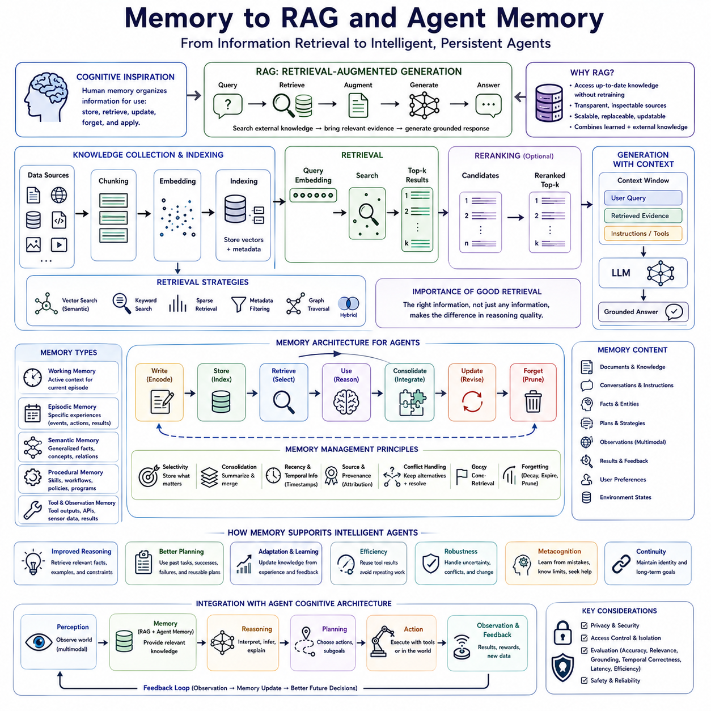{width="7.268055555555556in" height="7.268055555555556in"}

검색 증강 생성(Retrieval-Augmented Generation), 일반적으로 RAG라고 불리는 기술은 외부 정보 검색(External Information Retrieval)을 인공지능 모델의 기억(Memory)을 기능적으로 확장하는 메커니즘으로 변환합니다. 모든 유용한 지식을 모델 파라미터(Model Parameters) 내부에 영구적으로 인코딩할 필요 없이, 시스템은 정보가 필요할 때 외부 문서, 데이터베이스 또는 지식 저장소(Knowledge Repositories)를 검색할 수 있습니다. 검색된 증거(Retrieved Evidence)는 현재 문맥(Context)에 삽입되며, 이를 통해 생성 과정은 학습된 지식과 동적으로 접근 가능한 정보 모두를 활용할 수 있습니다.

이러한 아키텍처는 저장된 지식(Stored Knowledge)과 현재 활성화된 작업 정보(Active Working Information)를 구분하는 인지 기억(Cognitive Memory)의 중요한 기능적 구별과 유사합니다. 언어 모델(Language Model)은 학습 과정에서 획득한 일반화된 패턴을 포함하지만, 즉각적인 추론은 현재 문맥에서 이용할 수 있는 정보에 의존합니다. RAG는 관련된 외부 지식을 선택하여 일시적으로 작업 문맥(Working Context)으로 가져오는 메커니즘을 제공함으로써 기본 모델의 파라미터를 변경하지 않고도 시스템이 활용할 수 있는 정보를 확장합니다.

따라서 파라메트릭 메모리(Parametric Memory)와 비파라메트릭 메모리(Non-parametric Memory)의 구분은 RAG를 이해하는 데 핵심적입니다. 파라메트릭 메모리는 학습을 통해 모델 가중치(Model Weights)에 암묵적으로 인코딩된 지식을 의미하며, 비파라메트릭 메모리는 정보를 외부 자원에 명시적으로 저장합니다. 파라메트릭 지식은 빠른 일반화(Generalization)를 지원하는 반면, 외부 메모리는 전체 모델을 재학습하지 않고도 업데이트, 검사, 재구성 또는 교체할 수 있습니다. 두 형태를 결합하면 더욱 유연한 지식 아키텍처(Knowledge Architecture)를 구성할 수 있습니다.

일반적인 RAG 시스템은 외부 지식 컬렉션(External Knowledge Collection)을 준비하는 것에서 시작합니다. 문서는 관리 가능한 청크(Chunks)로 분할되고, 표상(Representations)으로 변환되며, 유용한 메타데이터(Metadata)와 함께 저장됩니다. 질의(Query)가 입력되면 검색 시스템은 이 컬렉션에서 관련성이 높을 가능성이 있는 정보를 탐색합니다. 선택된 구절(Passages)은 생성 모델(Generative Model)에 제공되고, 모델은 답변을 생성하거나 추론 과제를 수행할 때 이를 문맥적 증거(Contextual Evidence)로 활용합니다.

임베딩(Embeddings)은 검색 시스템에서 정보를 표현하는 일반적인 메커니즘 가운데 하나입니다. 텍스트, 이미지 또는 기타 데이터를 학습된 의미적 관계(Semantic Relationships)를 기하학적으로 반영하는 수치 벡터(Numerical Vectors)로 매핑할 수 있습니다. 질의 역시 동일한 표상 공간(Representational Space)에 임베딩되어 저장된 벡터와 비교될 수 있습니다. 이를 통해 정확히 동일한 단어를 포함하지 않더라도 유사한 표상을 가진 항목을 검색할 수 있으며, 문자 그대로의 키워드 매칭(Keyword Matching)을 넘어 의미 검색(Semantic Retrieval)이 가능해집니다.

벡터 데이터베이스(Vector Databases)는 대규모 임베딩 컬렉션을 효율적으로 저장하고 검색할 수 있도록 지원합니다. 그러나 검색 품질(Retrieval Quality)은 벡터 유사도(Vector Similarity)에만 의존하지 않습니다. 키워드 검색, 희소 검색(Sparse Retrieval), 메타데이터 필터링(Metadata Filtering), 그래프 탐색(Graph Traversal), 구조화된 데이터베이스 질의(Structured Database Queries), 하이브리드 검색(Hybrid Retrieval)은 서로 보완적인 기능을 제공할 수 있습니다. 서로 다른 형태의 지식은 관련 정보를 찾기 위해 서로 다른 메커니즘을 요구하기 때문에 효과적인 메모리 시스템은 여러 검색 전략을 결합하는 경우가 많습니다.

청킹(Chunking)은 검색되는 기억의 품질에 큰 영향을 미칩니다. 청크가 너무 작으면 중요한 문맥과 관계가 분리될 수 있습니다. 반대로 너무 크면 제한된 문맥 용량(Context Capacity)을 소비하는 상당한 양의 불필요한 정보가 함께 검색될 수 있습니다. 따라서 청크 경계(Chunk Boundaries)는 저장되는 정보와 에이전트가 수행해야 하는 과제에 따라 문단, 섹션, 의미 단위(Semantic Units), 사건, 대화 또는 구조화된 레코드(Structured Records)를 기준으로 설정할 수 있습니다.

검색(Retrieval)은 선택적 기억 접근(Selective Memory Access)의 한 형태로 해석할 수 있습니다. 인간의 인지는 저장된 모든 기억을 지속적으로 활성화하지 않고 단서(Cues), 문맥, 목표, 연관 관계(Associations)에 따라 정보를 검색합니다. RAG 역시 현재 과제를 위해 제한된 외부 정보의 일부만 선택함으로써 이와 유사한 계산 기능을 수행합니다. 따라서 접근할 수 없거나 잘못 선택된 지식은 실질적인 가치가 거의 없기 때문에 검색 품질은 저장 용량(Storage Capacity)만큼 중요합니다.

랭킹(Ranking)과 재랭킹(Reranking)은 어떤 후보 기억(Candidate Memories)이 현재 문제에 가장 유용한지를 추정하여 검색을 개선합니다. 초기 검색은 넓은 후보 집합(Candidate Set)을 효율적으로 식별할 수 있으며, 이후 더 강력한 모델이 관련성을 보다 정밀하게 평가할 수 있습니다. 이러한 2단계 과정(Two-stage Process)은 빠른 기억 접근과 계산 비용이 더 높은 선택 과정을 분리함으로써 대규모 저장소를 효율적으로 검색하면서 이후 추론을 위한 고품질 증거를 유지할 수 있도록 합니다.

인공지능 에이전트(AI Agent)의 작업 기억(Working Memory)은 현재의 인지적 에피소드(Cognitive Episode)를 위해 능동적으로 유지되는 정보에 해당합니다. 여기에는 사용자 요청, 최근 관찰, 검색된 문서, 활성 목표(Active Goals), 중간 추론 결과, 도구 출력(Tool Outputs), 부분 계획(Partial Plans)이 포함될 수 있습니다. 문맥 용량에는 한계가 있으므로 시스템은 무엇을 활성 상태로 유지할지, 무엇을 압축할지, 무엇을 외부에 저장할지, 무엇을 안전하게 폐기할지를 결정해야 합니다.

장기 에이전트 메모리(Long-term Agent Memory)는 하나의 상호작용이나 과제 에피소드를 넘어 지속됩니다. 이전 경험, 중요한 사실, 학습된 선호도(Learned Preferences), 성공적인 전략, 실패, 환경 관찰(Environmental Observations), 과제 결과(Task Outcomes)를 보존할 수 있습니다. 정적인 문서 저장소와 달리 에이전트 메모리는 시스템이 사용자, 도구, 소프트웨어 또는 물리적 환경과 상호작용하면서 지속적으로 업데이트될 수 있습니다. 따라서 기억은 지속적인 학습과 적응 과정의 일부가 됩니다.

일화 기억(Episodic Memory)은 일반화된 지식뿐만 아니라 특정한 경험을 보존하기 때문에 에이전트에 특히 유용합니다. 하나의 에피소드는 직면했던 상황, 수행한 행동, 사용한 추론, 발생한 결과, 관련 피드백(Feedback)을 기록할 수 있습니다. 이후 유사한 상황이 발생하면 이전 에피소드를 검색하여 성공하거나 실패했던 행동의 사례를 제공할 수 있으며, 에이전트는 즉각적인 파라미터 재학습(Parameter Retraining) 없이도 이를 활용하여 적응할 수 있습니다.

의미 기억(Semantic Memory)은 여러 경험에서 추출된 일반화된 지식을 표현합니다. 반복되는 에피소드에서는 개별 사건에 계속 연결할 필요가 없는 안정적인 사실, 개념, 관계, 절차 또는 환경의 규칙성(Environmental Regularities)을 발견할 수 있습니다. 따라서 에이전트 아키텍처는 원시 일화 기록(Raw Episodic Records)과 통합된 의미 지식(Consolidated Semantic Knowledge)을 구분하여 특정 경험과 일반화된 이해가 서로 다른 형태의 추론을 지원하도록 할 수 있습니다.

절차 기억(Procedural Memory)은 반복적인 과제를 수행하는 방법에 관한 지식을 표현합니다. 인공 에이전트에서 이는 학습된 정책(Learned Policies), 재사용 가능한 워크플로(Reusable Workflows), 행동 시퀀스(Action Sequences), 도구 사용 패턴(Tool-use Patterns), 프로그램 또는 기술(Skills)의 형태로 나타날 수 있습니다. 익숙한 과제가 발생하면 검색을 통해 적절한 절차를 식별하고, 계획 메커니즘(Planning Mechanisms)이 현재 조건에 맞게 이를 조정할 수 있습니다. 이를 통해 모든 상호작용에서 일상적인 행동을 처음부터 다시 구성해야 하는 필요성을 줄일 수 있습니다.

메모리 기록(Memory Writing)은 메모리 검색(Memory Retrieval)만큼 중요합니다. 모든 것을 무차별적으로 저장하는 에이전트는 중복되고, 관련성이 낮으며, 서로 모순되거나 품질이 낮은 정보를 축적하게 됩니다. 따라서 메모리 제어기(Memory Controller)는 어떤 경험을 지속적으로 보존할 가치가 있는지를 결정해야 합니다. 중요도(Importance), 새로움(Novelty), 반복성(Recurrence), 신뢰도(Confidence), 과제 관련성(Task Relevance), 사용자 중요성(User Significance), 예상되는 미래 활용 가치(Expected Future Usefulness)는 정보가 장기 메모리에 기록되어야 하는지를 결정하는 기준이 될 수 있습니다.

기억 통합(Memory Consolidation)은 여러 관찰이나 에피소드를 더욱 안정적인 표상으로 변환하여 파편화(Fragmentation)를 줄입니다. 유사한 기억은 요약할 수 있고, 반복되는 사실은 병합할 수 있으며, 오래된 정보는 수정할 수 있고, 경험 사이의 관계를 추출할 수 있습니다. 기억 통합을 통해 지속적인 동작 과정에서 생성되는 모든 저수준 세부 정보를 영구적으로 보존하지 않고도 메모리 시스템이 유용한 지식을 지속적으로 증가시킬 수 있습니다.

망각(Forgetting) 역시 지능적 기억(Intelligent Memory)의 기능적 구성 요소입니다. 저장소가 매우 커지면 오래되거나 관련성이 낮은 정보가 검색을 방해할 수 있습니다. 인공 메모리 시스템은 만료(Expiration), 관련성 감소(Relevance Decay), 접근 빈도(Access Frequency), 신뢰도, 중복성(Redundancy), 과제별 정책(Task-specific Policies)을 사용하여 유용하지 않은 정보의 영향을 줄일 수 있습니다. 따라서 제어된 망각(Controlled Forgetting)은 검색 효율성을 높이고 축적된 기억이 현재의 추론을 압도하는 것을 방지합니다.

저장된 지식이 시간에 따라 변화할 경우 시간 정보(Temporal Information)가 중요해집니다. 어떤 기억은 생성 당시에는 정확했지만 이후에는 오래된 정보가 될 수 있습니다. 타임스탬프(Timestamps), 버전 정보(Version Information), 유효 기간(Validity Intervals), 출처 이력(Source History), 최신성 신호(Recency Signals)는 에이전트가 정보가 언제 참이었는지를 추론하도록 도와줍니다. 시간적 기억(Temporal Memory)은 세계의 새로운 상태와 오래된 상태를 동시에 유효한 것처럼 취급하는 문제를 방지합니다.

출처 귀속(Source Attribution)은 정보가 어디에서 유래했는지를 보존함으로써 메모리의 신뢰성을 강화합니다. 검색된 콘텐츠는 사용자, 데이터베이스, 문서, 센서, 외부 도구 또는 이전 모델 추론에서 생성될 수 있으며, 이러한 출처에 동일한 수준의 신뢰를 자동으로 부여해서는 안 됩니다. 출처 메타데이터(Provenance Metadata)는 에이전트가 직접적인 관찰과 도출된 결론(Derived Conclusions)을 구별할 수 있도록 하며, 검증(Verification), 충돌 해결(Conflict Resolution), 증거 인식 추론(Evidence-aware Reasoning)을 위한 기반을 제공합니다.

서로 충돌하는 기억(Conflicting Memories)은 중요한 추론 문제를 발생시킵니다. 두 문서가 서로 다른 내용을 주장하거나, 관찰 결과가 변화하거나, 이전의 추론이 나중에 잘못된 것으로 밝혀질 수 있습니다. 견고한 에이전트(Robust Agent)는 모순되는 정보를 하나의 의심 없는 사실로 병합해서는 안 됩니다. 대신 서로 다른 주장들을 출처, 타임스탬프, 신뢰도 추정치와 함께 보존하고, 추론 또는 추가 증거를 이용하여 현재 행동을 안내할 해석을 결정할 수 있습니다.

메모리 검색은 목표(Goals)에 따라서도 달라져야 합니다. 의미적으로 가장 유사한 정보가 항상 의사결정에 가장 유용한 것은 아닙니다. 과제를 계획하는 에이전트는 제약 조건(Constraints)과 이전의 실패 기록이 필요할 수 있지만, 사실적 질문에 답하는 에이전트는 권위 있는 지식(Authoritative Knowledge)을 우선할 수 있습니다. 목표 조건부 검색(Goal-conditioned Retrieval)은 단순한 유사성뿐만 아니라 현재 연산의 인지적 목적(Cognitive Purpose)을 반영하여 기억을 선택할 수 있도록 합니다.

따라서 RAG는 문서 검색(Document Retrieval)에서 보다 광범위한 인지 메모리 아키텍처(Cognitive Memory Architecture)로 발전할 수 있습니다. 외부 저장소에는 의미 지식, 이전 에피소드, 도구 결과, 계획, 환경 상태(Environmental States), 사용자 지시(User Instructions), 절차적 기술(Procedural Skills)이 포함될 수 있습니다. 서로 다른 검색 메커니즘이 서로 다른 기억 유형에 접근하고, 중앙 제어기(Central Controller)가 어떤 정보가 활성 문맥(Active Context)에 들어가야 하는지를 결정할 수 있습니다. 이는 인지 아키텍처의 기능적 기억 조직(Functional Memory Organization)과 점차 유사해집니다.

에이전트 메모리(Agent Memory)는 계획(Planning)과도 긴밀하게 상호작용합니다. 플래너(Planner)는 새로운 전략을 생성하기 전에 유사한 이전 과제, 재사용 가능한 하위 계획(Reusable Subplans), 알려진 제약 조건, 실패했던 접근 방법의 기록을 검색할 수 있습니다. 실행 과정에서는 중간 결과를 저장하고 계획을 수정해야 할 경우 다시 검색할 수 있습니다. 과제가 완료된 후에는 그 결과가 새로운 일화 기억이 되어 계획이 기억을 소비하는 동시에 새로운 기억을 생성하는 순환 구조를 형성합니다.

도구 사용 에이전트(Tool-using Agents)는 또 다른 중요한 기억 범주를 생성합니다. 검색 결과, 데이터베이스 응답, 코드 실행 결과(Code Execution Outputs), API 응답, 외부 시스템의 관찰에는 모델 파라미터에 존재하지 않는 정보가 포함될 수 있습니다. 선택된 도구 결과를 보존하면 미래의 추론 과정에서 비용이 높거나 중요한 발견을 다시 활용할 수 있습니다. 따라서 메모리는 반복적인 작업을 방지하고 다단계 또는 장시간 지속되는 과제에서 연속성(Continuity)을 제공할 수 있습니다.

멀티모달 에이전트(Multimodal Agents)는 텍스트를 넘어서는 기억을 필요로 합니다. 이미지, 비디오 구간(Video Segments), 오디오, 공간 지도(Spatial Maps), 포인트 클라우드(Point Clouds), 로봇 궤적(Robot Trajectories), 센서 상태(Sensor States), 행동 이력(Action Histories)을 모두 저장하고 검색해야 할 수 있습니다. 이러한 기억은 모달리티별 임베딩(Modality-specific Embeddings), 구조화된 레코드, 학습된 잠재 상태(Learned Latent States), 교차 모달 표상(Cross-modal Representations)을 통해 표현할 수 있습니다. 검색은 이전의 멀티모달 경험에서 현재 상황과 관련된 부분을 재구성하는 메커니즘이 됩니다.

피지컬 인공지능(Physical AI)에서는 로봇이 지속적으로 변화하는 환경을 경험하기 때문에 일화 기억과 시간적 기억이 특히 중요합니다. 시스템은 장애물을 어디에서 관찰했는지, 어떤 경로가 이전에 실패했는지, 객체를 어떻게 조작했는지, 어떤 환경 조건이 위치 추정 불확실성(Localization Uncertainty)을 발생시켰는지를 기억해야 할 수 있습니다. 이러한 기억은 시간에 걸쳐 지각과 행동을 연결하고 경험이 미래의 물리적 행동에 영향을 미칠 수 있도록 합니다.

월드 모델(World Models)과 에이전트 메모리는 상호보완적인 기능을 수행합니다. 기억은 실제로 발생한 것(What Actually Happened)을 보존하는 반면, 월드 모델은 발생할 수 있는 것(What Could Happen)을 예측합니다. 검색된 에피소드는 이전 상태와 결과에 관한 증거를 제공하고, 예측 모델(Predictive Models)은 가능한 미래 궤적(Future Trajectories)을 시뮬레이션합니다. 두 기능을 함께 사용하면 에이전트가 기억된 경험과 상상된 미래(Imagined Futures)를 비교할 수 있어 익숙하지 않은 상황에서 계획, 불확실성 추정, 적응 능력을 향상시킬 수 있습니다.

기억은 메타인지(Metacognition)도 지원할 수 있습니다. 에이전트는 이전의 오류, 불확실성 패턴(Uncertainty Patterns), 실패한 전략, 외부 검증(External Verification)이 필요했던 상황에 대한 기록을 검색할 수 있습니다. 이러한 기억은 현재의 추론이 이전의 실패 조건과 유사한지를 시스템이 인식하도록 도와줍니다. 그러면 에이전트는 동일한 실수를 반복하는 대신 숙고(Deliberation)를 강화하고, 더 많은 증거를 수집하며, 추가적인 도구를 사용하거나 도움을 요청할 수 있습니다.

에이전트 메모리가 지속적(Persistent)이 될수록 개인정보 보호(Privacy)와 보안(Security)은 더욱 중요해집니다. 저장된 정보에는 민감한 사용자 데이터, 기밀 문서(Confidential Documents), 운영 이력(Operational Histories), 물리적 관찰 정보가 포함될 수 있습니다. 따라서 메모리 아키텍처는 접근 제어(Access Control), 보존 정책(Retention Policies), 삭제 메커니즘(Deletion Mechanisms), 출처 추적(Provenance Tracking), 사용자 또는 과제 사이의 격리(Isolation), 미래의 검색과 추론을 조작하려는 악의적인 정보에 대한 방어 기능을 필요로 합니다.

메모리 시스템의 평가는 단순히 문서가 검색되었는지를 측정하는 수준을 넘어야 합니다. 유용한 평가 지표에는 검색 관련성(Retrieval Relevance), 사실적 근거성(Factual Grounding), 시간적 정확성(Temporal Correctness), 메모리 정밀도(Memory Precision), 성공적인 회상(Successful Recall), 관련 없는 기억에 대한 저항성, 모순 처리(Contradiction Handling), 지연시간(Latency), 저장 효율성(Storage Efficiency), 다운스트림 과제 성능(Downstream Task Performance)이 포함됩니다. 에이전트 메모리는 불필요한 복잡성이나 허용할 수 없는 오류를 발생시키지 않으면서 추론과 행동을 실제로 개선하는지를 기준으로 평가되어야 합니다.

따라서 인지 기억(Cognitive Memory)에서 RAG와 에이전트 메모리(Agent Memory)로의 발전은 수동적인 정보 저장에서 능동적인 기억 관리(Active Memory Management)로의 전환을 의미합니다. 정보는 현재 목표에 따라 인코딩(Encoding), 인덱싱(Indexing), 선택(Selection), 검색(Retrieval), 평가(Evaluation), 통합(Consolidation), 업데이트(Update)되어야 하며 때로는 망각되어야 합니다. 기억은 단순히 기록을 축적하는 데이터베이스가 아니라 추론과 통합된 동적인 계산 과정(Dynamic Computational Process)이 됩니다.

궁극적으로 고급 인공지능 에이전트(Advanced AI Agents)는 단기 문맥(Short-term Context), 외부 지식(External Knowledge), 일화적 경험(Episodic Experience), 의미 지식(Semantic Knowledge), 절차적 기술(Procedural Skills), 시간 정보(Temporal Information), 멀티모달 관찰(Multimodal Observations)을 연결하는 메모리 아키텍처를 필요로 합니다. RAG는 중요한 검색 기반(Retrieval Foundation)을 제공하지만, 지속적인 에이전시(Persistent Agency)를 구현하려면 더욱 광범위한 메모리 생명주기(Memory Lifecycle)가 필요합니다. 이러한 메모리가 지각, 추론, 계획, 월드 모델, 도구, 피드백과 통합될 때 인공 시스템은 장기간의 상호작용에서도 연속성을 유지하고, 경험으로부터 학습하며, 지능적으로 적응할 수 있습니다.

## 07.04 Attention to Transformer Attention [w/Code]

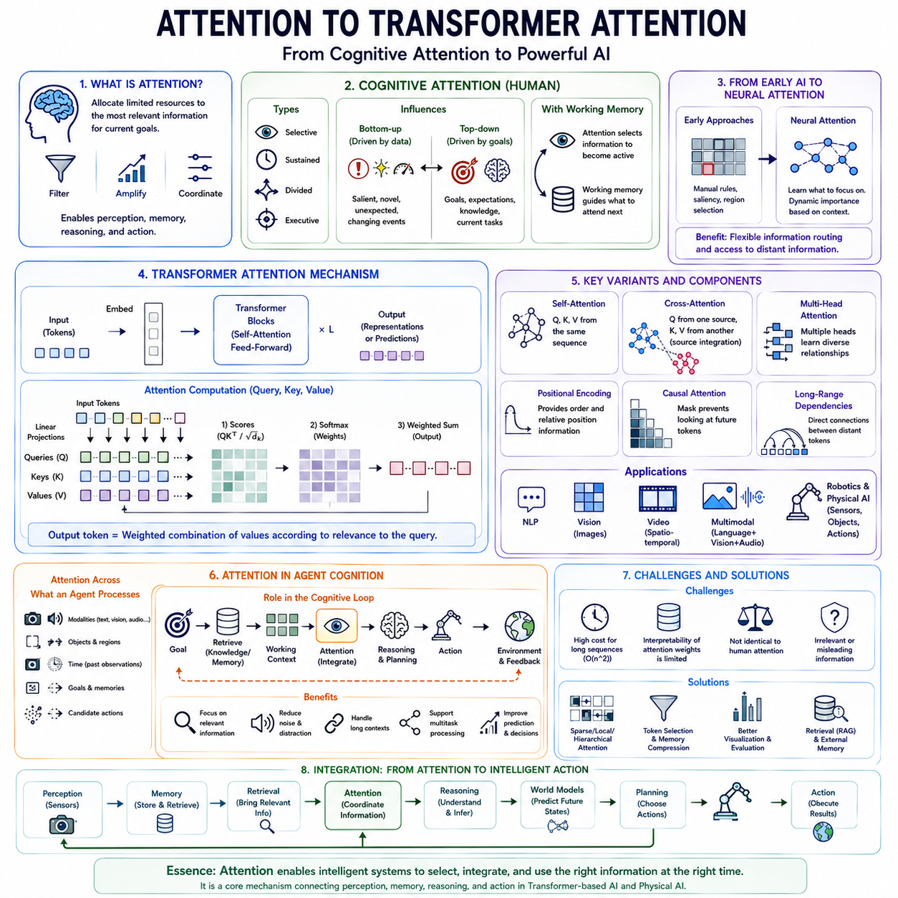{width="7.268055555555556in" height="7.268055555555556in"}

어텐션(Attention)은 지능형 시스템(Intelligent System)이 제한된 처리 자원(Processing Resources)을 현재 목표와 가장 관련성이 높은 정보에 할당할 수 있도록 하는 인지 메커니즘(Cognitive Mechanism)입니다. 인간 인지(Human Cognition)는 동일한 우선순위로 처리할 수 있는 양보다 훨씬 많은 감각 정보와 내부 정보를 받아들입니다. 따라서 어텐션은 선택적 필터링(Selective Filtering), 증폭(Amplification), 조정(Coordination)을 수행하여 중요한 신호가 지각(Perception), 기억(Memory), 추론(Reasoning), 행동(Action)에 영향을 미치도록 하고 관련성이 낮은 정보에는 더 적은 처리 자원이 할당되도록 합니다.

인지적 어텐션(Cognitive Attention)은 하나의 단일한 메커니즘이 아닙니다. 선택적 어텐션(Selective Attention)은 경쟁하는 정보를 억제하면서 특정 자극을 우선하고, 지속적 어텐션(Sustained Attention)은 일정 시간 동안 처리를 유지하며, 분할 어텐션(Divided Attention)은 여러 활동에 자원을 분배하고, 실행 어텐션(Executive Attention)은 목표에 따라 처리 과정을 조정합니다. 이러한 기능은 지능적 처리가 특정 순간에 어떤 정보에 계산적 우선순위(Computational Priority)를 부여할 것인지를 동적으로 제어해야 한다는 일반적인 원리를 보여줍니다.

어텐션은 상향식 처리(Bottom-up Process)와 하향식 처리(Top-down Process) 모두의 강한 영향을 받습니다. 상향식 어텐션(Bottom-up Attention)은 두드러지고, 새롭고, 예상하지 못했거나 빠르게 변화하는 사건에 의해 유발될 수 있으며, 하향식 어텐션(Top-down Attention)은 목표, 기대, 지식, 현재 과제에 의해 유도됩니다. 효과적인 인지는 중요한 환경 변화가 진행 중인 처리를 중단시킬 수 있도록 하면서도 의도적인 목표가 더 긴 시간 동안 행동을 조직하도록 이러한 메커니즘을 결합합니다.

어텐션과 작업 기억(Working Memory)의 관계는 특히 중요합니다. 어텐션을 받는 정보는 활성 인지 처리(Active Cognitive Processing)에 들어가거나 그 안에서 유지될 가능성이 높으며, 작업 기억은 이후의 어텐션을 안내할 수 있는 표상(Representations)을 제공합니다. 이는 어텐션이 어떤 정보가 인지적으로 활성화될지를 결정하고, 활성 기억(Active Memory)이 다음에 무엇에 주의를 기울여야 하는지를 결정하는 반복적 관계(Recurrent Relationship)를 형성합니다.

초기의 인공지능(Artificial Intelligence)과 컴퓨터 비전(Computer Vision)은 명시적인 선택 메커니즘(Selection Mechanisms)을 통해 어텐션을 구현했습니다. 시스템은 사람이 정의한 규칙이나 학습된 현저성 척도(Saliency Measures)에 따라 이미지 영역, 특징, 객체 또는 처리 단계를 우선할 수 있었습니다. 이러한 접근은 선택적 처리(Selective Processing)의 계산적 가치를 보여주었지만, 어텐션을 정보 요소 사이의 관계를 동적으로 표현하는 일반적인 방법이라기보다 주로 필터링 메커니즘(Filtering Mechanism)으로 다루는 경우가 많았습니다.

신경 어텐션 메커니즘(Neural Attention Mechanisms)은 모델이 입력의 어떤 부분이 특정 계산에 영향을 미쳐야 하는지를 학습하도록 함으로써 이러한 개념을 확장했습니다. 전체 시퀀스(Sequence)를 하나의 고정된 표상으로 압축하는 대신, 모델은 현재 처리 문맥(Processing Context)에 따라 서로 다른 요소에 서로 다른 중요도를 부여할 수 있습니다. 이는 유연한 정보 라우팅(Information Routing)을 제공하며 관련 정보가 시퀀스의 현재 위치에서 멀리 떨어져 있더라도 직접 접근할 수 있도록 합니다.

시퀀스-투-시퀀스 모델(Sequence-to-sequence Models)의 발전은 이러한 장점을 특히 명확하게 보여주었습니다. 초기 인코더-디코더 아키텍처(Encoder-decoder Architectures)는 출력을 생성하기 전에 입력 시퀀스를 고정 크기의 표상(Fixed-size Representation)으로 압축하는 경우가 많았습니다. 어텐션을 사용하면 디코더(Decoder)가 각각의 출력 요소를 생성하는 동안 서로 다른 인코더 상태(Encoder States)를 참조할 수 있습니다. 그 결과 문맥 표상(Context Representation)은 각 생성 단계에서 어떤 입력 정보가 가장 관련성이 높은지에 따라 동적으로 변화하게 됩니다.

트랜스포머 어텐션(Transformer Attention)은 이러한 원리를 전체 아키텍처의 핵심 계산 연산(Central Computational Operation)으로 일반화했습니다. 트랜스포머(Transformers)는 주로 순환 처리(Recurrent Processing)에 의존하는 대신 토큰(Token)들이 어텐션을 통해 직접 상호작용하도록 합니다. 각각의 토큰은 자신의 갱신된 표상(Updated Representation)을 구성하는 데 어떤 다른 토큰이 유용한 정보를 포함하고 있는지를 결정할 수 있습니다. 이를 통해 시퀀스 전체의 관계를 유연하게 모델링하고 학습 과정에서 높은 수준의 병렬 계산(Parallel Computation)을 지원할 수 있습니다.

트랜스포머 어텐션의 기본 연산은 일반적으로 쿼리(Query), 키(Key), 밸류(Value) 표상을 통해 설명됩니다. 각각의 입력 토큰은 어떤 정보를 찾고 있는지를 나타내는 쿼리, 자신이 어떻게 매칭될 수 있는지를 나타내는 키, 그리고 전달할 수 있는 정보를 포함하는 밸류로 변환됩니다. 어텐션은 쿼리와 키를 비교하고 그 결과로 얻어진 관련성 점수(Relevance Scores)를 사용하여 해당 밸류가 출력 표상에 얼마나 강하게 기여할지를 결정합니다.

스케일드 닷 프로덕트 어텐션(Scaled Dot-product Attention)은 이러한 과정을 구현하는 데 널리 사용되는 수학적 방법을 제공합니다. 쿼리 벡터(Query Vectors)와 키 벡터(Key Vectors)는 내적(Dot Product)을 사용하여 비교되며, 점수는 수치적 크기를 제어하기 위해 스케일링(Scaling)됩니다. 소프트맥스(Softmax) 연산은 이러한 점수를 정규화된 어텐션 가중치(Attention Weights)로 변환합니다. 이후 밸류 벡터의 가중 결합(Weighted Combination)은 추정된 관련성에 따라 여러 토큰의 정보를 통합한 출력을 생성합니다.

이러한 메커니즘은 문맥 의존적 표상(Context-dependent Representations)을 생성합니다. 단어, 이미지 패치(Image Patch), 센서 토큰(Sensor Token), 기타 요소의 표상은 고정되어 있는 것이 아니라 주변 정보에 따라 변화합니다. 모호한 개념을 나타내는 토큰은 자신의 의미를 명확하게 하는 문맥적 증거(Contextual Evidence)에 어텐션을 할당할 수 있습니다. 따라서 트랜스포머 표상은 각 요소에 문맥과 독립적인 고립된 표상을 부여하는 대신 관계를 동적으로 인코딩합니다.

셀프 어텐션(Self-attention)은 쿼리, 키, 밸류가 동일한 시퀀스 또는 표상 집합에서 생성될 때 발생합니다. 각각의 토큰은 다른 토큰들과 상호작용하고 시퀀스의 정보를 이용하여 자신의 상태를 갱신할 수 있습니다. 이를 통해 모든 중간 위치를 거쳐 순차적으로 정보를 전달하지 않고도 단어, 이미지 영역, 객체, 행동 또는 시간적 상태(Temporal States) 사이의 관계를 표현할 수 있습니다.

크로스 어텐션(Cross-attention)은 서로 다른 정보원에서 생성된 정보를 연결합니다. 쿼리는 하나의 표상에서 생성되고 키와 밸류는 다른 표상에서 생성될 수 있습니다. 따라서 언어 표상(Language Representation)이 시각 특징(Visual Features)에 어텐션을 할당하거나, 디코더가 인코딩된 관찰(Encoded Observations)을 참조하거나, 행동 모델(Action Model)이 월드 상태 표상(World-state Representations)에 어텐션을 할당할 수 있습니다. 크로스 어텐션은 이질적인 정보를 통합하는 유연한 메커니즘을 제공하기 때문에 멀티모달 인공지능(Multimodal AI)에서 특히 중요합니다.

멀티헤드 어텐션(Multi-head Attention)은 서로 다른 학습된 투영(Learned Projections)을 사용하여 여러 어텐션 연산을 병렬로 수행할 수 있도록 합니다. 개별 헤드(Head)는 서로 다른 관계, 위치, 특징 또는 표상 부분 공간(Representational Subspaces)을 강조할 수 있습니다. 이후 각 헤드의 출력이 결합되어 더욱 풍부한 표상을 형성합니다. 따라서 멀티헤드 처리는 모든 관계를 하나의 어텐션 패턴을 통해 표현하도록 강제하는 대신 여러 형태의 의존 관계를 동시에 표현할 수 있도록 합니다.

어텐션 자체는 시퀀스 순서(Sequence Order)를 본질적으로 표현하지 않기 때문에 위치 정보(Positional Information)가 필요합니다. 따라서 트랜스포머 아키텍처는 토큰들이 서로 어떤 위치 관계에 있는지를 나타내기 위해 위치 인코딩(Positional Encodings), 학습된 위치 임베딩(Learned Positional Embeddings), 상대적 위치 표상(Relative Position Representations) 또는 관련 메커니즘을 도입합니다. 이를 통해 어텐션은 유연한 토큰 상호작용을 유지하면서 순서, 거리, 방향, 시간적 구조(Temporal Structure)와 관련된 관계를 구별할 수 있습니다.

인과 어텐션(Causal Attention)은 미래 정보가 현재의 예측에 영향을 미쳐서는 안 되는 경우 제약 조건을 도입합니다. 예를 들어 자기회귀 언어 생성(Autoregressive Language Generation)에서 하나의 토큰은 아직 생성되지 않은 이후 토큰이 아니라 자기 자신과 이전 토큰에만 어텐션을 할당할 수 있습니다. 어텐션 마스크(Attention Masks)는 이러한 제한을 구현합니다. 이와 유사한 마스킹 원리(Masking Principles)는 가시성(Visibility), 구조적 제약(Structural Constraints), 유효한 상호작용, 과제별 정보 경계(Task-specific Information Boundaries)를 표현할 수 있습니다.

어텐션은 관련성이 관계적(Relational)이라는 점에서 단순한 중요도 점수(Importance Scoring)와 근본적으로 다릅니다. 하나의 토큰이 모든 상황에서 보편적으로 중요한 것이 아니라, 그 중요성은 어떤 쿼리가 정보를 요청하는지와 주변 문맥에 따라 결정됩니다. 따라서 동일한 기억, 시각 특징 또는 관찰도 하나의 계산에서는 높은 어텐션을 받을 수 있지만 다른 계산에서는 거의 주목받지 않을 수 있습니다. 이러한 조건부 선택(Conditional Selection)은 어텐션이 유연한 추론에 강력한 이유 가운데 하나입니다.

트랜스포머 어텐션은 장거리 의존성(Long-range Dependencies)을 처리하기 위한 계산 경로도 제공합니다. 순환 아키텍처(Recurrent Architectures)는 연속적인 상태를 통해 정보를 전달해야 하지만, 어텐션은 서로 멀리 떨어진 위치를 직접 연결할 수 있습니다. 이것이 완벽한 장기 추론(Long-term Reasoning)을 보장하는 것은 아니지만, 멀리 떨어진 정보가 상호작용하기 위해 필요한 계산 단계를 줄이고 대규모 텍스트, 시각 또는 시간적 문맥에서 관계를 학습할 수 있도록 합니다.

그러나 표준 셀프 어텐션(Standard Self-attention)은 많은 토큰 쌍(Token Pairs)을 비교해야 하기 때문에 시퀀스 길이가 증가할수록 계산 비용이 빠르게 증가합니다. 따라서 긴 문서, 고해상도 이미지, 긴 비디오, 지속적인 로봇 센서 이력(Robot Sensor Histories)을 처리하는 것은 높은 비용을 요구할 수 있습니다. 희소 어텐션(Sparse Attention), 로컬 어텐션(Local Attention), 계층적 어텐션(Hierarchical Attention), 압축 메모리(Compressed Memory), 순환 메모리(Recurrent Memory), 토큰 선택(Token Selection), 효율적 어텐션 알고리즘(Efficient Attention Algorithms)은 유용한 관계를 유지하면서 계산 요구량을 줄이는 것을 목표로 합니다.

어텐션은 자연어 처리(Natural Language Processing)를 훨씬 넘어 다양한 영역으로 확장되었습니다. 비전 트랜스포머(Vision Transformers)는 이미지를 패치 또는 시각 토큰(Visual Tokens)으로 표현하고 어텐션을 사용하여 이들 사이의 관계를 모델링합니다. 비디오 모델(Video Models)은 어텐션을 공간 및 시간 차원으로 확장하며, 멀티모달 아키텍처(Multimodal Architectures)는 이미지, 언어, 오디오, 기타 신호를 연결합니다. 그 기반 원리는 분산된 정보에 대한 선택적이고 문맥 의존적인 통합(Selective, Context-dependent Integration)입니다.

로보틱스(Robotics)와 피지컬 인공지능(Physical AI)에서 어텐션은 센서 모달리티(Sensor Modalities), 객체, 공간 영역, 시간적 관찰, 목표, 후보 행동(Candidate Actions)에 걸쳐 작동할 수 있습니다. 로봇은 정적인 배경 구조보다 움직이는 사람을 우선적으로 처리하거나, 현재 조작 과제와 관련된 객체에 집중하거나, 현재의 불확실성을 해결할 수 있는 이전 관찰을 검색해야 할 수 있습니다. 어텐션은 이러한 변화하는 요구사항에 따라 정보를 동적으로 라우팅하는 계산 메커니즘을 제공합니다.

시간적 어텐션(Temporal Attention)은 긴 관찰 이력에서 일부 순간만 현재 의사결정과 관련될 때 특히 유용합니다. 에이전트는 모든 이전 상태를 동일하게 처리하는 대신 접촉(Contact), 예상하지 못한 움직임, 이전 의사결정, 실패 또는 환경 변화와 관련된 사건을 강조할 수 있습니다. 이는 트랜스포머 어텐션을 작업 기억(Working Memory), 일화 기억(Episodic Memory), 상태 추정(State Estimation), 시간적 추론(Temporal Reasoning)과 연결합니다.

어텐션과 기억(Memory)은 에이전트 아키텍처에서 점차 상호보완적인 구성 요소가 되고 있습니다. 어텐션은 활성 문맥(Active Context) 내부에서 어떤 정보가 현재 계산에 영향을 미쳐야 하는지를 결정하고, 검색 메커니즘(Retrieval Mechanisms)은 외부 또는 장기 기억에서 어떤 정보가 해당 문맥으로 들어와야 하는지를 결정합니다. 따라서 RAG와 에이전트 메모리(Agent Memory)는 어텐션이 사용할 수 있는 정보를 확장하고, 어텐션은 검색된 지식을 현재의 관찰, 목표, 추론 상태와 통합하도록 지원합니다.

어텐션은 월드 모델(World Models)과도 상호작용합니다. 예측 모델(Predictive Model)이 모든 미래 변수를 예측하기 위해 현재 환경의 모든 특징을 반드시 필요로 하는 것은 아닙니다. 서로 다른 예측은 서로 다른 객체, 영역, 행동 또는 과거 사건에 의존할 수 있습니다. 어텐션은 시간에 걸쳐 관련된 상태 구성 요소(State Components)를 선택적으로 연결하여 예측 표상(Predictive Representations)이 미래 상태 추정과 행동 결과에 중요한 관계에 계산 능력을 집중하도록 할 수 있습니다.

계층적 어텐션(Hierarchical Attention)은 여러 추상화 수준(Levels of Abstraction)에 걸쳐 처리를 조직할 수 있습니다. 저수준 어텐션은 센서 특징이나 국소 이미지 영역에 집중하고, 중간 수준 어텐션은 객체와 사건을 조직하며, 상위 수준 어텐션은 목표, 기억, 계획 또는 의미적 관계(Semantic Relationships)를 선택할 수 있습니다. 이러한 계층적 조직은 빠른 지각과 느린 추론, 장기 계획(Long-horizon Planning)을 조정해야 하는 인지 에이전트(Cognitive Agents)에 특히 중요합니다.

트랜스포머 어텐션(Transformer Attention)을 인간의 인지적 어텐션(Human Cognitive Attention)과 직접적으로 동일시해서는 안 됩니다. 생물학적 어텐션(Biological Attention)은 여러 뇌 시스템에 걸친 신경 경쟁(Neural Competition), 실행 제어(Executive Control), 각성(Arousal), 감각 조절(Sensory Modulation), 안구 운동(Eye Movements), 작업 기억, 행동 목표(Behavioral Goals)를 포함합니다. 트랜스포머 어텐션은 가중된 정보 통합(Weighted Information Integration)을 위한 특정한 수학적 연산입니다. 따라서 두 개념의 연결은 트랜스포머가 생물학적 어텐션 메커니즘을 재현한다는 의미가 아니라 기능적이고 영감적인 관계(Functional and Inspirational Relationship)로 이해해야 합니다.

어텐션 가중치(Attention Weights) 역시 신중하게 해석해야 합니다. 높은 수치의 어텐션 가중치는 특정 계산 연산에서 강한 기여도를 나타내지만, 이것이 반드시 모델이 최종 결정을 내린 이유를 완전하게 설명하는 것은 아닙니다. 정보는 여러 계층, 잔차 연결(Residual Connections), 비선형 연산(Nonlinear Operations), 상호작용하는 헤드(Interacting Heads)를 거쳐 변환될 수 있습니다. 어텐션 시각화(Attention Visualization)는 유용한 단서를 제공할 수 있지만 이를 자동적으로 모델 추론의 충실한 설명(Faithful Explanation)으로 간주해서는 안 됩니다.

트랜스포머 어텐션의 더 넓은 인지적 중요성은 동적 정보 조정(Dynamic Information Coordination)에 있습니다. 지능형 시스템은 어떤 정보가 중요한지, 어떤 관계를 표현해야 하는지, 계산 자원을 어디에 집중해야 하는지를 지속적으로 결정해야 합니다. 어텐션은 점점 더 큰 토큰, 모달리티, 기억, 관찰, 중간 표상(Intermediate Representations)의 집합에 걸쳐 이러한 조정을 수행할 수 있는 확장 가능한 메커니즘(Scalable Mechanism)을 제공합니다.

외부 메모리(External Memory), 검색(Retrieval), 추론(Reasoning), 계획(Planning)과 결합되면 어텐션은 더욱 큰 인지 제어 루프(Cognitive Control Loop)의 일부가 됩니다. 목표는 어떤 정보를 검색할지에 영향을 주고, 검색된 정보는 작업 문맥으로 들어오며, 어텐션은 관련 증거를 통합하고, 추론은 가설 또는 계획을 생성하며, 새로운 관찰은 다시 문맥을 갱신합니다. 시스템은 목표, 지식, 환경이 변화함에 따라 처리 자원을 반복적으로 재할당합니다.

멀티모달 및 체화 에이전트(Multimodal and Embodied Agents)에서 이러한 루프는 언어 지시(Language Instructions)를 지각과 행동에 연결할 수 있습니다. 명령은 목표를 정의하고, 시각 어텐션(Visual Attention)은 관련 객체를 식별하며, 크로스 어텐션은 언어적 개념을 감각 특징(Sensory Features)과 연결하고, 시간적 어텐션은 최근 사건을 통합하며, 행동 표상(Action Representations)은 실행 가능한 행동(Feasible Behaviors)에 집중합니다. 이후 환경으로부터의 피드백은 다음 의사결정 주기에서 어떤 정보에 어텐션을 할당해야 하는지를 변화시킵니다.

미래의 어텐션 메커니즘은 점점 더 선택적(Selective), 계층적(Hierarchical), 메모리 인식형(Memory-aware), 멀티모달(Multimodal), 계산 적응형(Computationally Adaptive)으로 발전할 가능성이 높습니다. 모든 토큰에 균일한 처리를 적용하는 대신 고급 시스템은 불확실하거나, 새롭거나, 위험도가 높거나, 목표와 관련된 정보에 더 많은 계산량을 할당할 수 있습니다. 이러한 방향은 시스템이 어떤 정보가 중요한지를 결정할 뿐만 아니라 언제 추가적인 계산 노력이 필요한지를 판단해야 한다는 점에서 어텐션을 메타인지(Metacognition)와 연결합니다.

따라서 인지적 어텐션(Cognitive Attention)에서 트랜스포머 어텐션(Transformer Attention)으로의 발전은 인지과학(Cognitive Science)의 광범위한 원리가 문자 그대로 복제되지 않으면서도 강력한 계산적 추상화(Computational Abstraction)에 영감을 줄 수 있음을 보여줍니다. 인간 인지는 선택적 정보 처리(Selective Information Processing)의 필요성을 보여주며, 트랜스포머 아키텍처는 쿼리(Query), 키(Key), 밸류(Value)의 상호작용을 통해 학습된 관계적 선택(Learned Relational Selection)을 구현합니다. 그 결과 만들어진 메커니즘은 언어, 비전, 멀티모달 모델, 에이전트, 예측 시스템(Predictive Systems)의 핵심 기반으로 발전했습니다.

궁극적으로 어텐션(Attention)은 통합된 인지 아키텍처(Integrated Cognitive Architecture)의 하나의 구성 요소로 이해할 때 가장 큰 가치를 갖습니다. 지각(Perception)은 후보 정보를 생성하고, 기억(Memory)은 지식과 경험을 보존하며, 검색(Retrieval)은 관련 정보를 문맥으로 가져오고, 어텐션은 해당 문맥 내부의 관계를 조정하며, 추론(Reasoning)은 이러한 관계를 결론으로 변환하고, 월드 모델(World Models)은 미래 상태를 예측하며, 계획(Planning)은 행동을 선택합니다. 이러한 메커니즘의 결합은 선택적 인지(Selective Cognition)에서 트랜스포머 기반 인공지능(Transformer-based AI), 인지 에이전트(Cognitive Agents), 고급 피지컬 인공지능(Advanced Physical AI)으로 이어지는 하나의 경로를 제공합니다.

## 07.05 Reasoning to AI Planning [w/Code]

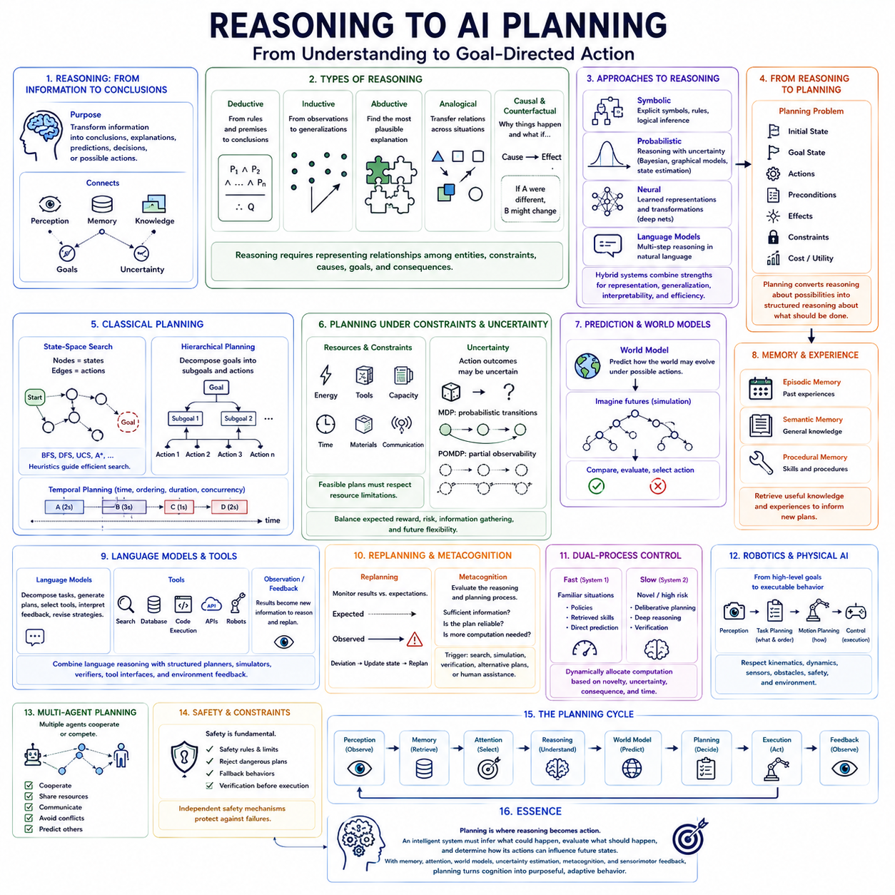{width="7.268055555555556in" height="7.268055555555556in"}

추론(Reasoning)은 지능형 시스템(Intelligent System)이 이용 가능한 정보를 결론(Conclusions), 설명(Explanations), 예측(Predictions), 의사결정(Decisions) 또는 가능한 행동 방안(Possible Courses of Action)으로 변환하는 인지 과정(Cognitive Process)입니다. 인간의 추론(Human Reasoning)은 독립적인 능력으로 작동하는 것이 아니라 지각(Perception), 기억(Memory), 지식(Knowledge), 목표(Goals), 불확실성(Uncertainty)을 서로 연결합니다. 인공지능(Artificial Intelligence)에서도 추론은 시스템이 현재 알고 있는 정보로부터 무엇을 도출할 수 있는지를 결정하도록 표상(Representations)을 조직하는 유사한 기능적 역할을 수행합니다.

추론은 문제의 구조에 따라 여러 형태를 가질 수 있습니다. 연역적 추론(Deductive Reasoning)은 규칙과 전제(Premises)로부터 결론을 도출하고, 귀납적 추론(Inductive Reasoning)은 관찰로부터 일반화하며, 귀추적 추론(Abductive Reasoning)은 그럴듯한 설명을 탐색합니다. 유추적 추론(Analogical Reasoning)은 상황 사이의 관계적 패턴을 전이하며, 인과적 추론(Causal Reasoning)과 반사실적 추론(Counterfactual Reasoning)은 사건이 왜 발생하는지 그리고 다른 조건에서는 결과가 어떻게 달라질 수 있는지를 분석합니다.

이러한 추론 방식은 지능(Intelligence)이 단순히 통계적 패턴(Statistical Patterns)을 인식하는 것 이상을 필요로 한다는 점을 보여줍니다. 에이전트(Agent)는 개체(Entities), 제약 조건(Constraints), 원인(Causes), 목표, 가능한 결과 사이의 관계를 표현해야 하는 경우가 많습니다. 인공지능 시스템은 기호적 추론(Symbolic Inference), 확률 모델(Probabilistic Models), 신경망(Neural Networks), 언어 모델(Language Models), 탐색 알고리즘(Search Algorithms), 하이브리드 아키텍처(Hybrid Architectures)를 통해 이러한 요구사항에 접근합니다. 각각의 방법은 표상, 일반화(Generalization), 해석 가능성(Interpretability), 계산 효율성(Computational Efficiency)에서 서로 다른 강점을 제공합니다.

기호적 추론(Symbolic Reasoning)은 명시적인 기호(Symbols), 관계(Relations), 규칙(Rules), 논리 연산(Logical Operations)을 통해 지식을 표현합니다. 관련된 사실과 규칙이 존재하면 추론 엔진(Inference Engine)은 형식적으로 정의된 변환을 통해 새로운 결론을 도출할 수 있습니다. 이러한 접근은 명확한 구성적 구조(Compositional Structure)를 제공하고 체계적인 추론을 지원할 수 있지만, 환경이 모호성(Ambiguity), 불확실성, 연속 변수(Continuous Variables), 방대한 감각 정보를 포함하면 완전한 기호 표상을 구성하기가 어려워집니다.

확률적 추론(Probabilistic Reasoning)은 정보가 불확실하거나 불완전한 상황으로 추론을 확장합니다. 명제를 단순히 참 또는 거짓으로 처리하는 대신 확률 모델은 믿음의 정도(Degrees of Belief)를 표현하고 새로운 증거가 उपलब्ध되면 이를 갱신합니다. 베이지안 추론(Bayesian Inference), 그래픽 모델(Graphical Models), 확률적 상태 추정(Probabilistic State Estimation), 의사결정 이론(Decision Theory)은 불확실한 관찰, 숨겨진 상태(Hidden States), 경쟁하는 가설(Competing Hypotheses), 예상 결과(Expected Outcomes)에 대해 추론하는 메커니즘을 제공합니다.

신경 추론(Neural Reasoning) 접근법은 유용한 표상과 변환을 데이터로부터 직접 학습합니다. 딥 네트워크(Deep Networks)는 사람이 직접 지정하기 어려운 복잡한 패턴을 발견할 수 있으며, 대규모 언어 모델(Large Language Models)은 유연한 자연어 표상을 기반으로 다단계 추론(Multi-step Reasoning)을 수행할 수 있습니다. 그러나 학습된 추론은 학습 분포(Training Distributions), 프롬프트 구조(Prompt Structure), 누락된 증거, 누적 오류(Accumulated Errors)에 민감할 수 있으므로 검증(Verification)과 불확실성 추정(Uncertainty Estimation)이 신뢰할 수 있는 시스템의 중요한 구성 요소가 됩니다.

지능형 시스템이 현재 상황에 대한 이해를 이용하여 원하는 미래 상태(Desired Future State)를 달성할 수 있는 행동을 구성하기 시작하면 추론은 계획(Planning)으로 발전합니다. 따라서 계획 문제(Planning Problem)는 초기 상태(Initial State), 목표 상태(Goal State), 이용 가능한 행동(Available Actions), 행동의 사전 조건(Action Preconditions), 예상 효과(Expected Effects), 제약 조건, 그리고 종종 비용(Cost)이나 효용(Utility)의 척도를 연결합니다. 계획은 가능성에 대한 추론을 다음에 무엇을 해야 하는지에 대한 구조화된 추론으로 변환합니다.

고전적 인공지능 계획(Classical AI Planning)은 일반적으로 환경을 명시적인 상태와 행동으로 기술할 수 있다고 가정합니다. 각각의 행동은 알려진 규칙에 따라 현재 상태를 변화시키며, 플래너(Planner)는 초기 상태를 목표를 만족하는 상태로 변환하는 행동 시퀀스(Action Sequence)를 탐색합니다. 이러한 정식화(Formulation)는 명확한 계산 프레임워크를 제공하며 행동, 제약 조건, 환경 동역학(Environmental Dynamics)을 충분한 정밀도로 표현할 수 있는 경우 여전히 유용합니다.

상태 공간 탐색(State-space Search)은 계획의 기본적인 접근법 가운데 하나입니다. 노드(Nodes)는 가능한 상태를 나타내고, 에지(Edges)는 하나의 상태를 다른 상태로 변환하는 행동을 나타냅니다. 너비 우선 탐색(Breadth-first Search), 깊이 우선 탐색(Depth-first Search), 균일 비용 탐색(Uniform-cost Search), A\*와 관련 알고리즘은 서로 다른 전략을 사용하여 이 공간을 탐색합니다. 휴리스틱(Heuristics)은 어떤 상태가 더 유망한지를 추정함으로써 효율성을 향상시키며 플래너가 목표로 이어질 가능성이 높은 경로에 계산 자원을 집중할 수 있도록 합니다.

계획은 모든 가능한 상태를 열거하는 대신 목표와 하위 목표(Subgoals)를 직접 대상으로 수행될 수도 있습니다. 계층적 작업 네트워크(Hierarchical Task Networks)와 관련된 계층적 계획(Hierarchical Planning) 방법은 복잡한 목표를 서로 다른 추상화 수준(Levels of Abstraction)에서 해결할 수 있는 더 작은 과제로 분해합니다. 상위 수준의 목표는 먼저 여러 중간 목표(Intermediate Goals)로 변환되고, 이후 실행 가능한 행동(Executable Actions)으로 변환될 수 있습니다. 계층적 조직은 복잡성을 줄이고 많은 실제 과제가 가진 계층 구조를 반영합니다.

시간적 계획(Temporal Planning)은 행동에 시간이 필요하거나, 행동들이 서로 중첩되거나, 마감시간(Deadlines)과 순서 제약(Ordering Constraints)에 의존하는 경우 이러한 프레임워크를 확장합니다. 실제 시스템에서는 모든 연산이 즉시 또는 엄격하게 순차적으로 실행되는 경우가 드뭅니다. 따라서 계획은 지속시간(Duration), 동기화(Synchronization), 자원 가용성(Resource Availability), 대기 시간(Waiting Periods), 동시 행동(Concurrent Actions)을 고려해야 합니다. 시간적 추론(Temporal Reasoning)은 로보틱스(Robotics), 제조(Manufacturing), 물류(Logistics), 자율 시스템(Autonomous Systems), 다중 에이전트 협업(Multi-agent Coordination)에서 특히 중요합니다.

자원 인식 계획(Resource-aware Planning)은 에너지, 계산 능력, 통신, 재료, 도구 또는 물리적 용량과 관련된 추가적인 제약을 도입합니다. 어떤 행동은 이론적으로 가능하더라도 지나치게 많은 배터리 전력을 소비하거나, 사용할 수 없는 장비가 필요하거나, 다른 중요한 행동을 방해하기 때문에 현실적으로 실행하기 어려울 수 있습니다. 따라서 지능적 계획(Intelligent Planning)은 목표에 도달할 수 있는지만 판단하는 것이 아니라 제안된 궤적(Trajectory)이 운영상의 제한 조건 아래에서 실행 가능한지도 평가합니다.

불확실성(Uncertainty)은 행동이 항상 예상된 결과를 만들지 않을 수 있고 관찰이 환경의 전체 상태를 보여주지 않을 수 있기 때문에 계획을 훨씬 어렵게 만듭니다. 마르코프 의사결정 과정(Markov Decision Processes)은 상태 전이가 확률적인 상황에서 순차적 의사결정(Sequential Decision Making)을 위한 프레임워크를 제공하며, 부분 관측 마르코프 의사결정 과정(Partially Observable Markov Decision Processes)은 이를 숨겨진 상태까지 확장합니다. 이 경우 에이전트는 완전한 상태 정보를 가정하는 대신 세계에 대한 믿음(Beliefs)을 기반으로 추론해야 합니다.

불확실성 아래의 계획(Planning under Uncertainty)은 기대 보상(Expected Reward), 위험(Risk), 정보 수집(Information Gathering), 미래의 유연성(Future Flexibility) 사이에서 균형을 유지해야 합니다. 에이전트는 어떤 행동이 목표를 즉시 진전시키기 때문이 아니라 환경에 대한 불확실성을 감소시키기 때문에 선택할 수 있습니다. 이러한 정보 탐색 행동(Information-seeking Behavior)은 계획을 능동 지각(Active Perception)과 연결합니다. 카메라를 움직이거나, 객체를 검사하거나, 정보를 요청하거나, 알려지지 않은 영역을 탐색하는 행동은 더 신뢰할 수 있는 상태 추정을 제공하여 이후의 의사결정을 향상시킬 수 있습니다.

모델 예측 제어(Model Predictive Control)는 예측과 계획 사이의 또 다른 연결을 제공합니다. 시스템은 완전한 장기 행동 시퀀스(Long-term Action Sequence)를 한 번에 확정하는 대신 제한된 예측 구간(Horizon)에 걸쳐 여러 가능한 미래 궤적을 예측하고, 적절한 행동을 선택하고, 그 결과 상태를 관찰한 뒤 다시 계획합니다. 이러한 반복적인 예측-행동-관찰(Prediction--Action--Observation) 사이클은 모델이 불완전하거나 환경이 예상하지 못한 방식으로 변화할 때 계획이 지속적으로 적응하도록 합니다.

월드 모델(World Models)은 환경이 어떻게 변화할 수 있는지에 대한 내부 표상(Internal Representations)을 제공함으로써 이러한 예측 원리를 일반화합니다. 월드 모델은 가능한 행동을 조건으로 미래 상태(Future States)를 추정하여 에이전트가 실제 행동을 실행하기 전에 여러 대안을 평가할 수 있도록 합니다. 따라서 계획의 일부는 내부 시뮬레이션(Internal Simulation)을 통해 수행될 수 있습니다. 에이전트는 가능한 미래를 상상하고, 결과를 평가하고, 유망한 궤적을 선택하고, 행동한 다음 실제 관찰 결과를 자신의 예측과 비교합니다.

기억(Memory)은 이전 과제에서 얻은 경험을 제공하여 계획을 강화합니다. 에이전트는 새로운 문제를 해결하기 전에 과거의 계획, 성공적인 행동 시퀀스, 알려진 제약 조건, 실패 사례(Failure Cases), 환경 관찰을 검색할 수 있습니다. 일화 기억(Episodic Memory)은 구체적인 사례를 제공하고, 의미 기억(Semantic Memory)은 일반화된 지식을 제공하며, 절차 기억(Procedural Memory)은 재사용 가능한 기술(Skills)을 제공합니다. 이에 따라 계획은 검색된 경험과 새롭게 구성된 추론을 결합하는 과정이 됩니다.

추론과 계획은 목표(Goals)에도 크게 의존합니다. 동일한 환경 상태라도 에이전트가 무엇을 달성하려 하는지에 따라 완전히 다른 의사결정으로 이어질 수 있습니다. 따라서 목표 표상(Goal Representations)은 지각, 기억 검색(Memory Retrieval), 어텐션(Attention), 평가(Evaluation), 행동 선택(Action Selection)에 하향식 제어(Top-down Control)를 제공합니다. 복잡한 에이전트는 서로 다른 우선순위를 가진 여러 목표를 동시에 유지할 수 있으며, 하나의 목표를 달성하는 것이 다른 목표를 방해할 때 충돌을 해결해야 합니다.

효용 함수(Utility Functions)와 비용 함수(Cost Functions)는 대안 계획(Alternative Plans)을 비교하기 위한 메커니즘을 제공합니다. 가장 짧은 계획이 반드시 가장 안전하거나, 저렴하거나, 빠르거나, 신뢰할 수 있는 계획인 것은 아닙니다. 따라서 플래너는 이동 거리, 에너지 소비(Energy Consumption), 실행 시간(Execution Time), 위험, 불확실성, 자원 사용량(Resource Usage), 기대 보상 또는 여러 기준의 조합을 평가할 수 있습니다. 하나의 지표만으로 행동 시퀀스의 품질을 충분히 표현할 수 없는 경우 다목적 계획(Multi-objective Planning)이 필요합니다.

대규모 언어 모델(Large Language Models)은 추론과 계획 사이에 새로운 형태의 인터페이스를 도입합니다. 자연어(Natural Language)는 모든 문제를 형식적 계획 언어(Formal Planning Language)로 사람이 직접 인코딩하지 않고도 목표, 제약 조건, 중간 단계, 도구 설명(Tool Descriptions), 추상적 계획(Abstract Plans)을 표현할 수 있습니다. 언어 모델은 과제를 분해하고, 후보 계획을 생성하고, 도구를 선택하고, 피드백을 해석하며, 전략을 수정할 수 있으므로 보다 광범위한 에이전트 아키텍처에서 유용한 상위 수준 추론 구성 요소가 될 수 있습니다.

그러나 그럴듯한 텍스트 단계의 시퀀스를 생성하는 것은 실행 가능한 계획(Executable Plan)을 생성하는 것과 동일하지 않습니다. 유효한 계획은 행동의 사전 조건, 환경 제약, 시간적 의존성(Temporal Dependencies), 자원 제한(Resource Limits), 실제 시스템의 능력(System Capabilities)을 준수해야 합니다. 따라서 에이전트 아키텍처는 제약 없는 텍스트 생성에만 의존하기보다 언어 기반 추론(Language-based Reasoning)을 구조화된 플래너(Structured Planners), 시뮬레이터(Simulators), 검증 시스템(Verification Systems), 도구 인터페이스(Tool Interfaces), 제어기(Controllers), 환경 피드백(Environment Feedback)과 결합함으로써 이점을 얻을 수 있습니다.

도구 사용(Tool Use)은 추상적 추론을 외부 시스템에 영향을 미칠 수 있는 연산으로 변환합니다. 에이전트는 정보를 검색하고, 데이터베이스를 질의하고, 코드를 실행하고, 소프트웨어 함수를 호출하고, 파일을 조작하고, 장치를 제어하거나, 다른 에이전트와 통신할 수 있습니다. 계획은 어떤 도구를 어떤 순서로, 어떤 입력을 사용하여, 어떤 조건에서 사용할지를 결정합니다. 이후 도구의 결과는 추가적인 추론이나 재계획(Replanning)을 유발할 수 있는 새로운 관찰이 됩니다.

실제 환경은 예상과 정확하게 동일하게 동작하는 경우가 드물기 때문에 재계획(Replanning)은 필수적입니다. 행동이 실패하거나, 자원을 사용할 수 없게 되거나, 새로운 정보가 기존 가정을 무효화하거나, 다른 에이전트가 환경을 변화시킬 수 있습니다. 견고한 시스템(Robust System)은 예상 결과와 실제 관찰 결과를 지속적으로 비교합니다. 중요한 편차는 내부 상태를 갱신하는 예측 오류(Prediction Errors)를 발생시키고 플래너가 기존 계획을 수정하거나 새로운 계획으로 교체하도록 합니다.

메타인지(Metacognition)는 추론과 계획 과정 자체를 평가함으로써 또 하나의 제어 계층(Control Layer)을 추가합니다. 에이전트는 충분한 정보를 가지고 있는지, 계획이 신뢰할 수 있는지, 불확실성이 지나치게 높은지, 추가적인 계산이 정당화되는지를 추정할 수 있습니다. 낮은 신뢰도(Low Confidence)는 더 깊은 탐색, 외부 검색(External Retrieval), 시뮬레이션, 검증, 대안 계획 생성(Alternative Plan Generation), 인간의 도움(Human Assistance)을 유발할 수 있습니다. 따라서 계산 자체도 전략적으로 할당할 수 있는 하나의 자원이 됩니다.

이중 처리(Dual-process) 개념은 이러한 적응적 자원 할당을 설명하는 유용한 추상화를 제공합니다. 익숙한 상황은 빠른 정책(Fast Policies), 검색된 절차(Retrieved Procedures), 직접적인 모델 예측을 통해 처리할 수 있지만, 어렵거나 위험도가 높은 상황에서는 더 느린 숙고적 계획(Deliberative Planning)이 활성화될 수 있습니다. 지능형 아키텍처는 새로움(Novelty), 불확실성, 결과의 중요성(Consequence), 이용 가능한 시간에 따라 빠른 행동과 계산 비용이 높은 추론 사이를 동적으로 전환할 수 있습니다.

로보틱스(Robotics)와 피지컬 인공지능(Physical AI)에서 추론은 궁극적으로 물리적으로 실행 가능한 행동(Physically Executable Behavior)으로 변환되어야 합니다. 상위 수준 계획(High-level Planning)은 특정 위치로 이동하거나, 객체를 가져오거나, 장비를 검사하거나, 다른 로봇과 협력하는 등의 목표를 지정할 수 있습니다. 이러한 목표는 로봇의 운동학(Kinematics), 동역학(Dynamics), 센서 한계(Sensor Limitations), 장애물, 안전 제약(Safety Constraints), 환경 조건을 준수하는 내비게이션(Navigation), 조작(Manipulation), 지각, 통신, 제어 연산으로 분해되어야 합니다.

작업 계획(Task Planning)과 동작 계획(Motion Planning)은 서로 다르지만 연결된 추상화 수준에서 작동합니다. 작업 계획은 어떤 행동을 어떤 순서로 수행해야 하는지를 결정하고, 동작 계획은 로봇이 구성(Configuration) 사이를 물리적으로 어떻게 이동할 수 있는지를 결정합니다. 객체를 가져오는 것과 같은 조작 과제는 객체 탐지(Object Detection), 접근 계획(Approach Planning), 파지 선택(Grasp Selection), 충돌 없는 로봇 팔 동작(Collision-free Arm Motion), 힘 제어(Force Control), 검증, 복구 행동(Recovery Behavior)을 필요로 할 수 있습니다.

계층적 계획(Hierarchical Planning)은 이러한 수준을 연결하기 위한 자연스러운 아키텍처를 제공합니다. 전략적 추론(Strategic Reasoning)은 장기 목표(Long-horizon Objectives)를 결정하고, 작업 계획은 중간 활동(Intermediate Activities)을 생성하며, 동작 계획은 실행 가능한 궤적을 계산하고, 저수준 제어기(Low-level Controllers)는 명령을 실시간으로 실행할 수 있습니다. 피드백은 계층을 따라 상위 방향으로 전달되어 실패나 환경 변화가 필요한 경우 국소적인 수정(Local Corrections)이나 전체적인 재계획을 유발할 수 있도록 합니다.

다중 에이전트 계획(Multi-agent Planning)은 하나의 지능형 시스템에서 여러 상호작용하는 에이전트로 문제를 확장합니다. 로봇 또는 소프트웨어 에이전트는 협력하고, 과제를 분담하고, 자원을 공유하고, 관찰 정보를 교환하고, 책임을 협상하거나, 서로의 행동을 방해하지 않도록 조정할 수 있습니다. 따라서 계획은 환경 동역학뿐만 아니라 다른 에이전트의 행동과 의도(Intentions)까지 고려해야 하며, 통신(Communication), 협업(Coordination), 예측, 분산 의사결정(Distributed Decision Making)과 관련된 추가적인 문제를 발생시킵니다.

안전(Safety)은 인공지능 계획에 근본적인 제약을 부과합니다. 목표에 도달하더라도 물리적, 운영적, 윤리적 또는 시스템 수준의 제약을 위반하는 계획은 허용할 수 없습니다. 따라서 안전 규칙(Safety Rules)은 탐색 공간(Search Space)을 제한하거나, 위험한 행동을 거부하거나, 폴백 행동(Fallback Behaviors)을 정의하거나, 실행 전에 검증을 요구할 수 있습니다. 피지컬 인공지능에서는 추론과 학습된 모델이 예상하지 못한 방식으로 실패할 수 있기 때문에 독립적인 안전 메커니즘(Independent Safety Mechanisms)이 여전히 중요합니다.

따라서 추론(Reasoning)에서 계획(Planning)으로의 전환은 관계를 이해하는 단계에서 가능한 미래를 평가하고 최종적으로 행동을 선택하는 단계로 발전하는 과정으로 이해할 수 있습니다. 추론은 무엇이 사실일 수 있고 어떤 결과가 뒤따를 수 있는지를 결정하며, 예측(Prediction)은 상태가 어떻게 변화할 수 있는지를 추정하고, 계획은 대안 궤적(Alternative Trajectories)을 비교하며, 제어(Control)는 선택된 행동을 실행합니다. 이후 피드백은 새로운 증거를 제공하여 또 다른 추론 사이클을 시작합니다.

고급 인지 에이전트(Advanced Cognitive Agents)는 추론과 계획을 서로 분리된 모듈로 취급하는 대신 이러한 사이클을 지속적으로 통합합니다. 지각(Perception)은 현재 세계를 추정하고, 기억(Memory)은 관련 경험을 제공하며, 어텐션(Attention)은 중요한 정보를 선택하고, 추론은 상황을 해석하며, 월드 모델(World Models)은 가능한 미래를 시뮬레이션하고, 계획은 행동을 선택하며, 실행(Execution)은 환경을 변화시킵니다. 새로운 관찰은 내부 상태(Internal State)를 갱신하여 전체 인지 루프(Cognitive Loop)가 반복될 수 있도록 합니다.

궁극적으로 인지적 추론(Cognitive Reasoning)에서 인공지능 계획(AI Planning)으로 이어지는 연결은 지능을 수동적인 이해(Passive Understanding)에서 목표 지향적 개입(Goal-directed Intervention)으로 전환합니다. 지능형 시스템은 무엇이 존재하는지를 표현하는 것뿐만 아니라 무엇이 발생할 수 있는지를 추론하고, 무엇이 발생해야 하는지를 평가하며, 자신의 행동이 미래 상태에 어떻게 영향을 미칠 수 있는지를 결정해야 합니다. 기억, 어텐션, 월드 모델, 불확실성 추정(Uncertainty Estimation), 메타인지, 감각운동 피드백(Sensorimotor Feedback)과 결합될 때 계획은 인지가 목적 지향적인 행동(Purposeful Action)으로 변환되는 핵심 메커니즘이 됩니다.

## 07.06 Language to LLMs [w/Code]

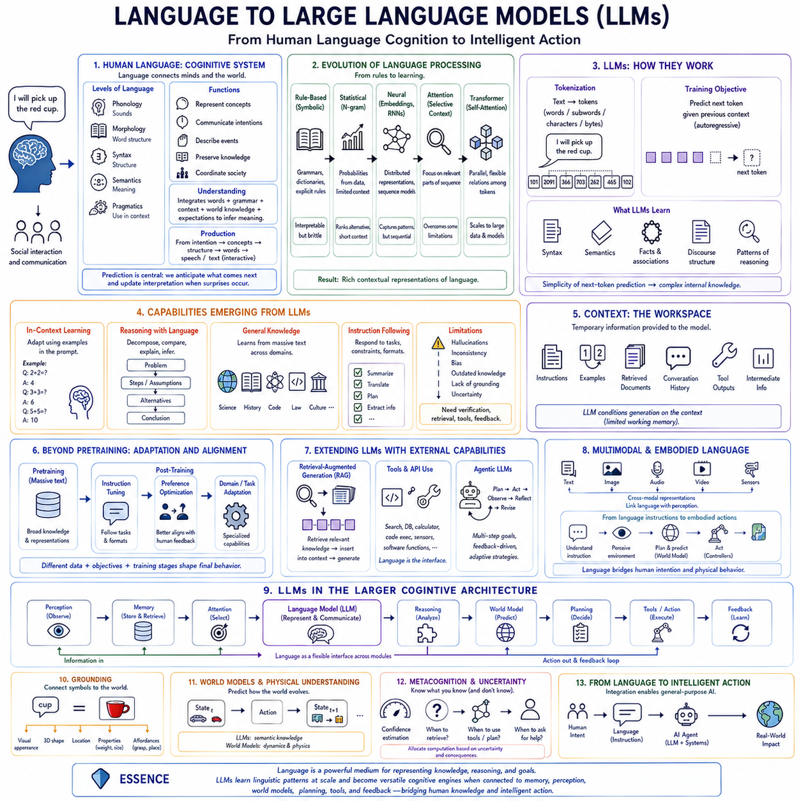{width="7.268055555555556in" height="7.268055555555556in"}

언어(Language)는 인간이 구조화된 기호(Structured Symbols)를 통해 개념(Concepts)을 표현하고, 의도(Intentions)를 전달하며, 사건(Events)을 설명하고, 지식(Knowledge)을 보존하며, 사회적 활동(Social Activity)을 조정할 수 있도록 하는 인지 시스템(Cognitive System)입니다. 언어는 단순한 단어의 집합이 아니라 소리 또는 문자 형태를 구문(Syntax), 의미론(Semantics), 문맥(Context), 화용적 의도(Pragmatic Intent)와 연결하는 계층적 시스템(Hierarchical System)입니다. 따라서 언어는 내부 인지 표상(Internal Cognitive Representations)과 외부에서 관찰 가능한 의사소통(Communication)을 연결하는 인터페이스를 제공합니다.

인간의 언어(Human Language)는 서로 상호작용하는 여러 수준에서 작동합니다. 음운론(Phonology)은 말소리를 조직하고, 형태론(Morphology)은 의미를 가진 단어 단위를 구성하며, 구문론(Syntax)은 표현들 사이의 구조적 관계를 결정하고, 의미론(Semantics)은 의미를 표현하며, 화용론(Pragmatics)은 문맥과 의사소통 목표(Communicative Goals)에 따라 언어를 해석합니다. 이러한 수준들은 동적으로 상호작용하여 동일한 표현이라도 주변 언어, 공유 지식(Shared Knowledge), 상황, 화자의 의도에 따라 서로 다른 의미를 가질 수 있도록 합니다.

언어 이해(Language Comprehension)는 개별 단어를 인식하는 것 이상을 요구합니다. 인간은 어휘적 의미(Lexical Meaning)를 문법 구조(Grammatical Structure), 이전 담화(Previous Discourse), 세계 지식(World Knowledge), 기대(Expectations), 상황적 문맥(Situational Context)과 지속적으로 통합합니다. 모호한 표현(Ambiguous Expressions)은 여러 가능한 해석을 이용 가능한 증거와 비교함으로써 해결됩니다. 이러한 과정은 언어 이해가 단순히 사전 정의(Dictionary Definitions)를 순차적으로 조회하는 것이 아니라 문맥적 예측(Contextual Prediction)과 통합에 의존한다는 점을 보여줍니다.

언어 생성(Language Production)은 내부의 의도에서 외부 표현으로 이어지는 상호보완적인 변환을 수행합니다. 화자는 의사소통 목표를 형성하고, 관련 개념을 선택하며, 이를 언어적 구조(Linguistic Structures)로 조직하고, 적절한 단어를 검색한 후 음성 또는 텍스트를 생성합니다. 이러한 단계들은 종종 개별적으로 설명되지만 실제 언어 생성은 매우 상호작용적이며, 의미적, 구문적, 어휘적, 문맥적 제약(Contextual Constraints)이 생성 과정 전체에서 서로 영향을 미칩니다.

예측(Prediction)은 언어 인지(Language Cognition)에서 중요한 역할을 수행하는 것으로 보입니다. 인간은 언어를 이해하는 과정에서 이전 문맥을 기반으로 다음에 나타날 가능성이 높은 단어, 의미, 문법 구조, 담화의 전개를 예상합니다. 입력되는 정보가 예상과 다르면 해석을 갱신해야 합니다. 이러한 예측적 특성(Predictive Characteristic)은 이전 정보로부터 가능성이 높은 다음 내용을 추정할 수 있도록 통계적 규칙성(Statistical Regularities)을 학습하는 현대 언어 모델(Modern Language Models)로 이어지는 중요한 개념적 연결을 제공합니다.

초기의 계산적 언어 처리(Computational Language Processing)는 명시적인 규칙, 사전, 문법, 기호 표상(Symbolic Representations)에 크게 의존했습니다. 자연어 처리 시스템(Natural Language Processing Systems)은 문장의 구조를 식별하고, 단어를 미리 정의된 의미에 매핑하며, 세밀하게 설계된 절차를 통해 기호적 지식을 조작하려 했습니다. 이러한 접근은 해석 가능한 표상(Interpretable Representations)을 제공했지만 모호성, 언어적 다양성(Linguistic Variability), 불완전한 지식, 실제 언어의 방대한 다양성을 처리하는 데 어려움을 겪었습니다.

통계적 자연어 처리(Statistical Natural Language Processing)는 사람이 직접 지정한 규칙에서 데이터로부터 학습된 패턴으로 중심을 이동시켰습니다. 확률적 언어 모델(Probabilistic Language Models)은 관찰된 말뭉치(Corpora)로부터 단어나 시퀀스의 확률을 추정하여 시스템이 여러 가능한 해석과 예측의 순위를 결정할 수 있도록 했습니다. N-그램 모델(N-gram Models)은 제한된 수의 이전 단어를 기반으로 다음 단어를 예측함으로써 이러한 전환을 명확하게 보여주었지만, 고정된 문맥 윈도(Context Windows)는 장거리 관계(Long-range Relationships)를 표현하는 능력을 제한했습니다.

신경 언어 모델(Neural Language Models)은 많은 이산적 통계 표상(Discrete Statistical Representations)을 학습된 분산 표상(Distributed Representations)으로 대체했습니다. 단어와 기타 언어 단위는 의미적·구문적 관계가 학습 데이터로부터 나타나는 연속 벡터(Continuous Vectors)로 표현될 수 있게 되었습니다. 신경망은 이러한 표상과 언어 출력 사이의 매핑을 학습함으로써 사람이 설계한 특징(Manually Engineered Features)에 대한 의존성을 줄이고 점점 더 복잡한 언어 패턴을 자동으로 포착할 수 있게 되었습니다.

워드 임베딩(Word Embeddings)은 언어적 의미가 학습된 벡터 공간(Vector Space)에서 기하학적으로 표현될 수 있음을 보여주었습니다. 유사한 문맥에서 등장하는 단어는 서로 관련된 표상을 형성하는 경향이 있으며, 이를 통해 의미적 유사성(Semantic Similarity)과 관계적 패턴(Relational Patterns)이 데이터로부터 나타날 수 있습니다. 그러나 전통적인 워드 임베딩은 기본적으로 하나의 단어에 하나의 표상을 할당했기 때문에 모호한 단어의 의미가 주변 문맥에 따라 변화하는 방식을 표현하기 어려웠습니다.

순환 신경망(Recurrent Neural Networks)은 단어가 처리될 때 내부 상태(Internal State)를 갱신함으로써 시퀀스 의존적 표상(Sequence-dependent Representations)을 도입했습니다. 장단기 메모리(Long Short-Term Memory)와 게이트 순환 아키텍처(Gated Recurrent Architectures)는 긴 시퀀스에서 정보를 유지하는 능력을 향상시켰습니다. 이러한 모델은 번역(Translation), 음성 인식(Speech Recognition), 언어 생성(Language Generation)의 주요 발전을 지원했지만 순차적 계산(Sequential Computation)은 병렬화를 제한하고 매우 긴 범위의 의존성을 안정적으로 유지하기 어렵게 만들었습니다.

어텐션 메커니즘(Attention Mechanisms)은 모델이 시퀀스의 서로 다른 위치에서 관련 정보를 직접 선택할 수 있도록 하여 이러한 한계의 일부를 해결했습니다. 순환 상태(Recurrent States)에 압축된 정보에 전적으로 의존하는 대신 모델은 현재 계산에 어떤 이전 표상이 가장 유용한지를 동적으로 결정할 수 있습니다. 따라서 어텐션은 순차적 신경 언어 처리에서 유연한 관계적 정보 교환(Relational Information Exchange)을 기반으로 하는 아키텍처로 전환하는 연결고리를 만들었습니다.

트랜스포머(Transformers)는 토큰(Token) 사이의 관계를 모델링하기 위한 주요 메커니즘으로 어텐션을 사용했습니다. 셀프 어텐션(Self-attention)은 각각의 토큰이 문맥에 존재하는 다른 토큰의 정보를 자신의 표상에 통합하도록 하며, 위치 표상(Positional Representations)은 순서 정보를 보존합니다. 학습 과정에서 많은 토큰 상호작용을 병렬로 계산할 수 있기 때문에 트랜스포머는 대규모 데이터셋과 모델 크기로 효과적으로 확장될 수 있으며 현대 대규모 언어 모델(Large Language Models)의 아키텍처적 기반을 제공합니다.

토큰화(Tokenization)는 언어를 언어 모델이 처리할 수 있는 이산적인 계산 단위(Discrete Computational Units)로 변환합니다. 토큰은 단어, 서브워드(Subwords), 문자, 바이트(Bytes), 학습된 세그먼트(Learned Segments)에 해당할 수 있습니다. 서브워드 토큰화(Subword Tokenization)는 빈번한 표현을 효율적으로 나타내면서 희귀하거나 익숙하지 않은 단어를 더 작은 구성 요소로 분해할 수 있기 때문에 실용적인 절충안을 제공합니다. 이렇게 생성된 토큰 시퀀스(Token Sequence)는 대부분의 대규모 언어 모델에서 사용되는 기본 입력 및 출력 표상이 됩니다.

대규모 언어 모델(Large Language Model)은 주로 문맥에 따라 토큰을 예측하는 방식으로 학습합니다. 자기회귀 모델링(Autoregressive Modeling)에서는 이전 토큰이 주어졌을 때 다음 토큰의 확률 분포(Probability Distribution)를 추정합니다. 방대한 텍스트 컬렉션에서 이러한 학습 목표를 반복하면 각각의 능력을 개별적으로 프로그래밍하지 않더라도 모델이 구문, 의미, 사실적 연관성(Factual Associations), 담화 구조(Discourse Structure), 반복적으로 등장하는 다양한 추론 패턴에 유용한 표상을 획득하게 됩니다.

따라서 다음 토큰 예측(Next-token Prediction)이라는 겉보기에 단순한 학습 방식에서도 놀라울 정도로 복잡한 내부 표상(Internal Representations)이 나타날 수 있습니다. 언어를 정확하게 예측하려면 모델이 개체, 관계, 사건, 의도, 시간적 의존성(Temporal Dependencies), 그리고 텍스트에 기술된 세계의 규칙성을 표현하는 것이 유리합니다. 이러한 학습 목표가 진정한 이해(Genuine Understanding)를 명시적으로 보장하지는 않지만 인간의 언어 행동을 구성하는 여러 구조를 포착하는 표상을 형성하도록 압력을 제공합니다.

스케일링(Scaling)은 신경 언어 모델의 능력을 크게 변화시킵니다. 모델 용량(Model Capacity), 학습 데이터, 계산량을 증가시키면 일반적으로 더욱 광범위한 언어적 규칙성과 복잡한 의존 관계를 학습할 수 있습니다. 대규모 사전학습(Pretraining)은 범용적인 기반을 형성하며, 이후 모든 과제마다 별도의 모델을 처음부터 학습하는 대신 지시 튜닝(Instruction Tuning), 선호도 최적화(Preference Optimization), 도메인 특화 학습(Domain-specific Training), 검색(Retrieval), 도구(Tools), 추가적인 추론 메커니즘을 통해 적응시킬 수 있습니다.

사전학습(Pretraining)은 대규모 말뭉치에서 광범위한 통계적 지식을 제공하는 반면, 사후학습(Post-training)은 이러한 지식이 어떻게 표현되고 사용되는지를 조정합니다. 지시 튜닝은 모델이 과제 설명에 더욱 효과적으로 반응하도록 학습시키며, 선호도 기반 방법(Preference-based Methods)은 원하는 행동 기준(Behavioral Criteria)을 더욱 잘 만족하는 출력을 생성하도록 유도할 수 있습니다. 따라서 대규모 언어 모델의 최종 행동은 아키텍처뿐만 아니라 데이터, 학습 목표(Objectives), 학습 단계, 상호작용 설계(Interaction Design)의 영향을 함께 받습니다.

문맥(Context)은 대규모 언어 모델에 일시적인 정보 작업 공간(Temporary Information Workspace)을 제공합니다. 지시사항, 예제, 검색된 문서, 대화 이력, 도구 출력, 중간 정보를 모델 파라미터를 변경하지 않고 문맥에 배치할 수 있습니다. 모델은 이러한 일시적인 정보를 조건으로 출력을 생성합니다. 따라서 문맥은 제한적인 형태의 작업 기억(Working Memory)으로 기능하지만 생물학적 작업 기억(Biological Working Memory)과 동일한 것으로 간주해서는 안 됩니다.

인컨텍스트 학습(In-context Learning)은 모델이 파라미터를 업데이트하지 않고 프롬프트(Prompt)에 제공된 예제나 지시를 사용하여 자신의 행동을 조정할 때 나타납니다. 몇 개의 시연(Demonstrations)만으로도 이후 생성에 영향을 미치는 과제 패턴, 출력 형식, 용어 또는 의사결정 규칙을 설정할 수 있습니다. 이러한 능력은 사전학습된 모델이 다양한 과제를 동적으로 수행하도록 하며 고정된 언어 처리 시스템에서 범용 적응형 모델(General-purpose Adaptive Models)로 발전하는 중요한 전환을 나타냅니다.

대규모 언어 모델은 언어를 추론(Reasoning)을 위한 중간 표상(Intermediate Representation)으로 사용할 수도 있습니다. 복잡한 문제를 하위 문제(Subproblems)로 분해하고, 가정을 표현하고, 여러 대안을 비교하며, 중간 결론을 이후 계산에 활용할 수 있습니다. 모델이 즉시 하나의 응답을 생성하는 대신 후보 해결책을 생성하고, 평가하고, 수정하거나 탐색할 경우 추가적인 추론 시점 계산(Inference-time Computation)을 통해 어려운 과제의 성능을 향상시킬 수 있습니다.

그러나 언어 기반 추론(Language-based Reasoning)에는 중요한 한계가 있습니다. 기반 정보가 잘못되었거나 불완전하거나 충분한 근거가 없는 경우에도 유창한 텍스트를 생성할 수 있습니다. 모델은 그럴듯하지만 잘못된 내용을 생성하거나, 긴 추론 과정에서 일관성을 잃거나, 익숙한 분포를 벗어난 상황에서 실패하는 상관관계에 의존할 수 있습니다. 따라서 신뢰할 수 있는 인공지능(Reliable AI)은 그라운딩(Grounding), 검증(Verification), 불확실성 추정(Uncertainty Estimation), 검색, 외부 정보원과의 상호작용 메커니즘을 필요로 합니다.

검색 증강 생성(Retrieval-Augmented Generation)은 대규모 언어 모델을 외부 지식(External Knowledge)과 연결함으로써 그 능력을 확장합니다. 관련 문서나 레코드를 검색하여 모델의 문맥에 삽입함으로써 모델 파라미터에 암묵적으로 저장된 지식보다 최신이거나 전문적이며 검증 가능한 정보를 생성 과정에서 활용할 수 있습니다. 이를 통해 지식 시스템의 일부를 언어 모델 자체와 분리하고 언어 생성과 명시적 메모리 접근(Explicit Memory Access)을 연결할 수 있습니다.

도구 사용(Tool Use)은 이러한 아키텍처를 정보 검색 이상으로 확장합니다. 대규모 언어 모델은 검색 시스템, 데이터베이스, 계산기, 소프트웨어 함수, 코드 실행 환경(Code Execution Environments), 센서 또는 기타 계산 서비스를 호출할 수 있습니다. 언어는 모델이 목표를 해석하고, 연산을 선택하며, 도구 입력을 구성하고, 결과를 해석한 다음 무엇을 해야 하는지를 결정할 수 있도록 하는 인터페이스가 됩니다. 이러한 능력은 현대 에이전틱 인공지능(Agentic AI) 아키텍처의 핵심 기반입니다.

에이전틱 언어 모델(Agentic Language Models)은 언어 이해를 기억, 추론, 계획(Planning), 도구 사용, 피드백(Feedback)과 결합합니다. 하나의 독립된 응답만 생성하는 대신 에이전트는 여러 단계에 걸쳐 목표를 유지하고, 정보를 수집하며, 행동을 수행하고, 결과를 관찰하며, 전략을 수정할 수 있습니다. 대규모 언어 모델은 상위 수준의 인지 조정기(Cognitive Coordinator)로 기능하고, 전문화된 모듈은 검색, 계산, 지각, 검증 또는 실행 능력을 제공할 수 있습니다.

멀티모달 언어 모델(Multimodal Language Models)은 텍스트를 이미지, 오디오, 비디오, 기타 감각 정보와 연결하여 언어 표상을 확장합니다. 크로스 모달 어텐션(Cross-modal Attention)과 공유 표상 공간(Shared Representation Spaces)은 언어적 개념을 지각 특징(Perceptual Features)과 연결할 수 있도록 합니다. 이를 통해 언어는 관찰 결과를 설명하고, 감각 입력에 대한 질문을 구성하고, 목표를 지정하며, 여러 모달리티에 걸쳐 정보를 조직함으로써 지각과 인지를 연결하는 더욱 일반적인 인터페이스가 됩니다.

피지컬 인공지능(Physical AI)에서 언어는 인간의 의도(Human Intention)와 체화된 행동(Embodied Action)을 연결하는 중요한 다리가 될 수 있습니다. 인간은 자연어를 사용하여 과제를 지정하고, 시스템은 지시를 해석하고, 관련 객체와 제약 조건을 식별하고, 계획을 구성한 후 상위 수준의 개념을 내비게이션(Navigation)이나 조작 행동(Manipulation Behaviors)으로 매핑할 수 있습니다. 따라서 언어는 추상적 목표(Abstract Goals)에서 물리적으로 실행 가능한 행동으로 이어지는 계층 구조의 하나의 계층이 됩니다.

그러나 언어적 지식(Linguistic Knowledge)만으로는 체화 지능(Embodied Intelligence)을 구현하기에 충분하지 않습니다. 텍스트는 세계를 설명하지만 기하학(Geometry), 힘(Force), 접촉(Contact), 운동(Motion), 불확실성, 행동 결과(Action Consequences)를 이해하는 데 필요한 연속적인 물리 경험을 직접 제공하지 않습니다. 따라서 피지컬 에이전트(Physical Agents)는 언어 모델을 지각, 감각운동 표상(Sensorimotor Representations), 월드 모델(World Models), 계획 시스템, 제어기(Controllers), 실제 환경 피드백과 상호작용하도록 구성해야 합니다.

그라운딩(Grounding)은 기호와 그것이 나타내는 실제 세계 사이의 관계를 다룹니다. 예를 들어 "컵(Cup)"이라는 단어는 다른 언어 토큰과 연결되는 것뿐만 아니라 궁극적으로 시각적 외형(Visual Appearance), 3차원 형상(Three-dimensional Shape), 가능한 위치, 물리적 속성(Physical Properties), 어포던스(Affordances), 그리고 잡기(Grasping)나 놓기(Placing)와 같은 행동과 연결되어야 합니다. 멀티모달 및 체화 학습(Multimodal and Embodied Learning)은 언어를 관찰 및 상호작용과 연관시킴으로써 이러한 연결을 구축하려 합니다.

월드 모델(World Models)은 상태가 시간에 따라 어떻게 변화하고 행동이 미래 조건에 어떤 영향을 미치는지를 표현함으로써 대규모 언어 모델을 보완할 수 있습니다. 언어 모델은 의미적 관계(Semantic Relationships)와 추상적 지식(Abstract Knowledge)을 표현하는 데 강점을 가지는 반면, 월드 모델은 환경 동역학(Environmental Dynamics)에 기반한 예측 구조(Predictive Structure)를 제공할 수 있습니다. 두 모델을 결합하면 에이전트가 목표에 대해 언어적으로 추론하면서 세계의 예측 표상을 통해 가능한 결과를 평가할 수 있습니다.

기억(Memory)은 또 하나의 필수적인 확장 요소를 제공합니다. 장기 의미 기억(Long-term Semantic Memory)은 명시적인 지식을 보존하고, 일화 기억(Episodic Memory)은 이전 상호작용과 경험을 기록하며, 절차 기억(Procedural Memory)은 재사용 가능한 기술이나 워크플로(Workflows)를 보존할 수 있습니다. 검색 메커니즘은 선택된 기억을 언어 모델의 문맥에서 이용할 수 있도록 합니다. 이를 통해 언어적 추론은 사전학습된 지식과 동적으로 축적된 경험(Dynamically Accumulated Experience)을 모두 기반으로 작동할 수 있습니다.

언어 모델이 인지 에이전트(Cognitive Agents)로 작동할 때 메타인지(Metacognition)와 불확실성 추정(Uncertainty Estimation)은 중요합니다. 시스템은 직접적인 생성만으로 충분한 상황과 검색, 도구, 더 깊은 추론, 시뮬레이션 또는 인간의 도움이 필요한 상황을 구분해야 합니다. 따라서 신뢰도(Confidence)는 단순한 수치 출력으로만 나타나는 것이 아니라 계산 전략(Computational Strategy)에 영향을 주어야 하며, 결과의 중요성이나 불확실성이 높은 경우 더 많은 자원을 할당할 수 있도록 해야 합니다.

인간 언어(Human Language)에서 대규모 언어 모델(LLMs)로의 발전을 현대 모델이 인간의 언어 인지 메커니즘 전체를 재현했다는 증거로 해석해서는 안 됩니다. 인간의 언어는 지각, 체화(Embodiment), 사회적 상호작용(Social Interaction), 기억, 동기(Motivation), 감정(Emotion), 평생에 걸친 경험(Lifelong Experience)에 기반합니다. 대규모 언어 모델은 표상과 학습 목표를 기반으로 계산적 학습(Computational Learning)을 구현합니다. 따라서 두 시스템의 관계는 생물학적 동등성(Biological Equivalence)이 아니라 기능적 대응(Functional Correspondence)과 기술적 영감(Technological Inspiration)의 관계입니다.

그럼에도 대규모 언어 모델은 충분히 크고 다양한 언어 데이터에서 통계적 구조(Statistical Structure)를 학습하는 것이 매우 범용적인 계산 능력(General Computational Capabilities)을 만들어낼 수 있음을 보여줍니다. 언어에는 인간의 지식, 추론, 문화, 절차, 물리적 세계에 대한 설명이 압축된 흔적(Compressed Traces)으로 포함되어 있습니다. 이러한 구조를 학습하면 모델은 다른 인지적·계산적 메커니즘과 연결할 수 있는 강력한 표상 기반(Representational Foundation)을 획득할 수 있습니다.

따라서 더 넓은 발전 방향은 언어 모델링(Language Modeling)에서 통합 인지 시스템(Integrated Cognitive Systems)으로 이동하는 것입니다. 언어 모델은 유연한 의미 표상과 의사소통을 제공하고, 기억은 연속성(Continuity)을 제공하며, 검색은 외부 지식을 공급하고, 어텐션(Attention)은 정보를 조정하며, 추론은 관계를 평가하고, 월드 모델은 미래 상태를 예측하며, 계획은 행동을 선택하고, 도구 또는 제어기는 연산을 실행합니다. 각각의 구성 요소는 언어 모델링만으로 해결할 수 없는 한계를 보완합니다.

궁극적으로 언어 인지(Language Cognition)에서 대규모 언어 모델(Large Language Models)로의 전환은 점점 더 일반적인 인공지능 아키텍처(General AI Architectures)로 발전하는 과정의 한 단계입니다. 언어는 개념, 목표, 설명, 계획을 표현하는 강력한 매체를 제공하며, 대규모 언어 모델은 대규모 언어 데이터의 규칙성을 재사용 가능한 계산 표상(Reusable Computational Representations)으로 변환합니다. 이러한 언어가 지각(Perception), 기억(Memory), 추론(Reasoning), 월드 모델(World Models), 계획(Planning), 도구(Tools), 감각운동 피드백(Sensorimotor Feedback)과 통합될 때 인간의 지식과 지능적인 인공 행동(Intelligent Artificial Action)을 연결하는 핵심 인터페이스가 됩니다.

## 07.07 Human Feedback and RLHF [w/Code]

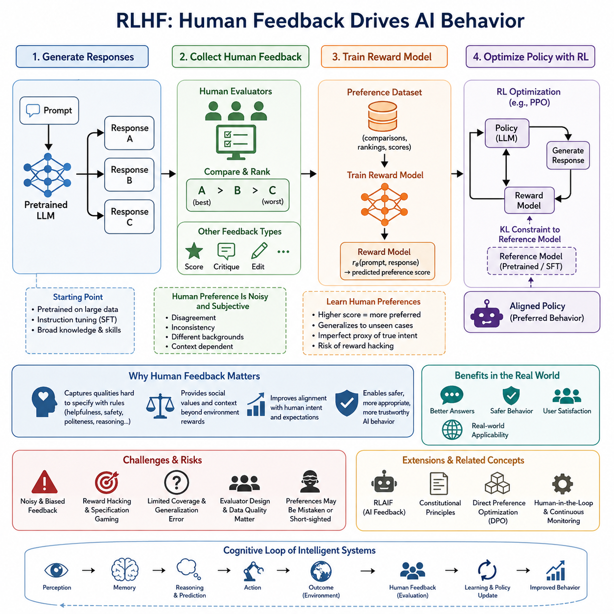{width="7.268055555555556in" height="7.268055555555556in"}

인간 피드백(Human Feedback)은 주관적인 인간의 판단을 최적화 신호(Optimization Signal)로 변환함으로써 인간 인지(Human Cognition)와 기계학습(Machine Learning)을 연결하는 실용적인 가교를 제공합니다. 인간은 행동을 평가할 때 명시적인 수치 보상(Numerical Reward)보다는 선호(Preference)를 이용하는 경우가 많습니다. 하나의 답변이 다른 답변보다 더 명확하고, 안전하며, 유용하거나 적절하다고 판단하는 방식입니다. 인간 피드백을 통한 강화학습(Reinforcement Learning from Human Feedback, RLHF)은 이러한 비교 판단을 형식화하여 직접 명시하기 어려운 행동 목표(Behavioral Objective)를 인공지능 시스템이 학습할 수 있도록 합니다.

전통적인 지도학습(Supervised Learning)은 원하는 출력이 레이블이 지정된 예제(Labeled Example)로 표현될 수 있다고 가정하지만, 많은 인지적 특성(Cognitive Quality)은 고정된 목표값으로 표현하기 어렵습니다. 유용성(Helpfulness), 관련성(Relevance), 정중함(Politeness), 추론 품질(Reasoning Quality), 문맥적 적절성(Contextual Appropriateness), 그리고 인간 의도(Human Intent)와의 정렬은 해석과 상황에 따라 달라집니다. 인간 피드백은 모든 상황에 대해 완벽한 정답을 작성하도록 요구하는 대신, 여러 모델 행동을 비교하도록 함으로써 이러한 특성을 간접적으로 학습 과정에 반영합니다.

이러한 접근법은 인간 학습(Human Learning)의 선호 기반 측면과 유사합니다. 인간은 정확하게 측정된 보상만으로 행동을 개선하기보다는 승인(Approval), 교정(Correction), 비판(Criticism), 모방(Imitation), 사회적 비교(Social Comparison)를 통해 행동을 개선하는 경우가 많습니다. 피드백은 특정 상황에서 어떤 행동이 더 선호되는지를 전달합니다. 인공지능에서도 동일한 원리를 이용하여 인간의 판단을 데이터로 변환하고, 그 데이터로부터 바람직한 행동의 계산적 근사(Computational Approximation)를 학습함으로써 인간 평가와 기계 적응(Machine Adaptation) 사이의 피드백 루프(Feedback Loop)를 형성합니다.

일반적인 RLHF 파이프라인(RLHF Pipeline)은 대규모 데이터셋으로부터 이미 광범위한 표현(Representation)을 습득한 사전학습 모델(Pretrained Model)에서 시작합니다. 일반적으로 선호 최적화(Preference Optimization)를 수행하기 전에 지도형 명령어 미세조정(Supervised Instruction Tuning)을 통해 모델을 먼저 조정합니다. 이후 인간 평가자(Human Evaluator)에게 동일한 프롬프트(Prompt)에 대한 여러 후보 응답(Candidate Response)을 제시하고 순위를 매기거나 서로 비교하도록 합니다. 이러한 비교 결과는 어떤 모델 출력이 인간의 평가 기준에 따라 더 우수한지를 나타내는 선호 데이터셋(Preference Dataset)을 형성합니다.

이러한 비교 데이터로부터 보상 모델(Reward Model)을 학습할 수 있습니다. 보상 모델은 프롬프트와 후보 응답이 주어졌을 때 인간 선호(Human Preference)를 나타내는 추정 스칼라 점수(Scalar Score)를 예측합니다. 일반적으로 선호된 응답(Preferred Response)이 거부된 응답(Rejected Response)보다 높은 점수를 받도록 학습합니다. 여기에서 중요한 개념적 변화는 인간이 수학적인 보상 함수(Reward Function)를 직접 설계할 필요가 없다는 것입니다. 대신 시스템이 관찰된 인간의 선택으로부터 보상 구조(Reward Structure)의 근사치를 학습합니다.

학습된 보상 모델은 반복적인 인간 평가를 대신할 수 있는 확장 가능한 대리자(Scalable Proxy)로 작동합니다. 언어 모델(Language Model)은 응답을 생성하고, 예측된 보상(Predicted Reward)을 받은 후, 더 높은 선호 점수와 연관된 행동 방향으로 정책(Policy)을 업데이트할 수 있습니다. 역사적으로 근접 정책 최적화(Proximal Policy Optimization, PPO)와 같은 정책 경사법(Policy Gradient Method)이 RLHF와 밀접하게 연관되어 발전했습니다. 이 최적화 과정에서는 일반적으로 업데이트된 정책이 사전학습 모델 또는 참조 모델(Reference Model)로부터 지나치게 멀어지지 않도록 제한합니다.

이러한 제약은 매우 중요합니다. 제한 없이 보상 최대화(Reward Maximization)를 수행하면 사전학습 과정에서 획득한 능력이 손상될 수 있기 때문입니다. 모델은 인간의 의도를 실제로 충족하는 대신 학습된 보상 함수의 불완전성을 이용하는 좁은 행동을 발견할 수도 있습니다. 따라서 참조 정책(Reference Policy)과의 차이를 제한하는 방식으로 표현되는 정규화(Regularization)는 선호 최적화와 기존 모델이 보유한 언어 능력, 다양성, 사실적 지식(Factual Knowledge), 기타 유용한 특성의 보존 사이에서 균형을 유지하는 역할을 합니다.

인지과학(Cognitive Science)의 관점에서 RLHF는 인간이 자연스럽게 통합하여 수행하는 여러 기능을 분리합니다. 인간 평가자는 판단(Judgment)을 제공하고, 보상 모델은 이러한 판단을 근사하며, 정책 모델(Policy Model)은 그에 따라 행동을 수정합니다. 이는 단순화된 외부 평가 시스템(Externalized Evaluation System)과 유사합니다. 행동이 생성되고, 사회적으로 제공된 기준에 따라 평가되며, 학습을 통해 다시 조정됩니다. 그러나 이러한 유사성이 보상 모델 자체가 인간의 가치(Human Values)나 인간 인지(Human Cognition)를 가지고 있다는 의미로 해석되어서는 안 됩니다.

인간 피드백 자체에는 잡음(Noise)과 이질성(Heterogeneity)이 존재합니다. 평가자들은 전문성, 문화적 기대(Cultural Expectation), 해석, 개인적 선호 또는 과제의 모호성 때문에 서로 다른 판단을 내릴 수 있습니다. 동일한 평가자조차 시간에 따라 일관되지 않은 판단을 할 수 있습니다. 따라서 선호 데이터는 진실(Truth), 유용성(Usefulness), 지능(Intelligence), 도덕성(Morality)과 같은 단일하고 객관적인 개념을 직접 측정한 결과라기보다 인간 판단 분포(Distribution of Human Judgments)에서 추출된 표본으로 이해해야 합니다.

따라서 피드백 과정의 설계는 최종적으로 나타나는 모델 행동에 큰 영향을 미칩니다. 평가자 지침(Evaluator Instruction), 후보 응답의 제시 방식, 순위 결정 절차(Ranking Procedure), 샘플링 전략(Sampling Strategy), 품질 관리(Quality Control), 평가자 구성, 과제 정의(Task Definition)는 어떤 정보가 학습 신호에 포함되는지를 결정합니다. 예를 들어 평가자가 자신감 있게 표현된 설명을 체계적으로 선호한다면, 모델은 실제 사실적 신뢰성(Factual Reliability)의 향상 없이도 표현상의 자신감만 학습할 수 있습니다. 따라서 피드백 품질(Feedback Quality)과 피드백이 실제로 의미하는 것(Feedback Meaning)을 명확하게 구분해야 합니다.

또 다른 어려움은 보상 모델 일반화(Reward Model Generalization)입니다. 인간의 비교 평가는 가능한 모든 프롬프트와 응답 공간 가운데 극히 일부만을 포함합니다. 따라서 보상 모델은 평가자가 직접 관찰하지 않은 조합에 대해서도 선호도를 추론해야 합니다. 특히 정책 최적화가 매우 높은 예측 보상을 얻는 응답을 적극적으로 탐색할 때 이러한 오류가 중요해집니다. 결과적으로 최적화 과정은 일반적인 지도 평가(Supervised Evaluation)에서는 드러나지 않았던 보상 모델의 약점을 노출할 수 있습니다.

이러한 현상은 보상 해킹(Reward Hacking) 및 명세 게임(Specification Gaming)과 밀접한 관련이 있습니다. 최적화된 모델은 인간이 의도한 근본적인 목적을 충족하지 않으면서 측정 가능한 대리 목표(Proxy Objective)만을 최대화할 수 있습니다. 예를 들어 응답이 상세하고, 동의적이며, 권위 있게 보이기 때문에 높은 예측 보상을 받을 수 있지만 실제로는 잘못된 정보를 제공할 수도 있습니다. 따라서 RLHF는 정렬 문제(Alignment Problem)의 근본적인 특성을 보여줍니다. 인간 선호의 불완전한 표현을 최적화하는 것은 그 선호 이면의 전체적인 인간 의도를 이해하고 충족하는 것과 동일하지 않습니다.

인간 피드백은 쌍별 순위 비교(Pairwise Ranking) 이외에도 다양한 형태를 가질 수 있습니다. 평가자는 점수를 부여하거나, 오류를 식별하거나, 추론을 비판하거나, 응답을 다시 작성하거나, 안전 특성(Safety Property)을 분류하거나, 선호하는 행동을 선택하거나, 자연어 설명(Natural-Language Explanation)을 제공할 수 있습니다. 또한 실제 배포된 시스템과의 상호작용 과정에서도 피드백을 수집할 수 있습니다. 이러한 풍부한 신호는 반복적 개선(Iterative Improvement)을 지원하지만, 주석 비용(Annotation Cost), 평가자 일관성, 개인정보 보호(Privacy), 분포 변화(Distribution Shift), 복잡한 인간 판단의 해석이라는 추가적인 문제를 발생시킵니다.

현대의 선호 최적화(Preference Optimization)는 고전적인 보상 모델과 PPO의 결합을 넘어 발전하고 있습니다. 직접 선호 최적화(Direct Preference Optimization) 계열의 방법은 별도로 배포되는 보상 모델과 전통적인 강화학습 루프(Reinforcement Learning Loop)를 사용하지 않고도 선호된 응답과 거부된 응답을 이용하여 모델을 직접 학습할 수 있습니다. 이와 관련된 접근법에는 AI가 생성한 피드백(AI-Generated Feedback), 헌법적 원칙(Constitutional Principles), 합성 선호(Synthetic Preferences), 인간 평가와 기계 평가의 결합 등이 포함됩니다.

AI 피드백을 통한 강화학습(Reinforcement Learning from AI Feedback, RLAIF)은 지정된 원칙에 따라 유능한 모델이 후보 행동을 평가하도록 함으로써 대량의 인간 판단을 확보하는 비용을 줄일 수 있습니다. 그러나 자동 평가자(Automated Evaluator) 역시 자신의 학습 데이터와 지침으로부터 한계를 물려받기 때문에 인간 감독(Human Oversight)은 여전히 중요합니다. 따라서 실용적인 구조에서는 인간이 작성한 원칙, 인간의 보정 사례(Calibration Example), AI 보조 평가, 자동화된 선호 생성, 주기적인 인간 감사(Human Audit)를 결합할 수 있습니다.

RLHF는 일반적인 강화학습(Reinforcement Learning)과도 구분해야 합니다. 전통적인 강화학습에서는 게임 점수, 과제 완료 여부, 에너지 소비량, 물리적 성공 여부와 같이 환경(Environment)에서 직접 보상이 발생할 수 있습니다. 반면 RLHF에서는 최적화 목표가 모델 행동에 대한 인간의 판단으로부터 상당 부분 도출됩니다. 이러한 차이는 물리적 과제 보상(Physical Task Reward)과 인간 선호가 동시에 존재하고 때때로 서로 충돌할 수 있는 체화 인공지능(Embodied AI)에서 특히 중요합니다.

로봇(Robot)의 경우 물리적인 목표를 완료했는지만으로 성공적인 행동을 정의할 수 없습니다. 인간은 더 안전하고, 부드럽고, 예측 가능하며, 사회적으로 적절하고, 에너지 효율적이며, 이해하기 쉬운 행동을 선호할 수 있습니다. 따라서 인간 피드백은 센서와 과제 지표(Task Metric)만으로 충분히 표현하기 어려운 행동 특성을 제공함으로써 환경 보상(Environmental Reward)을 보완할 수 있습니다. 최종적인 목적 함수(Objective Function)는 과제 성능(Task Performance), 안전 제약(Safety Constraint), 인간 선호, 운영 신뢰성(Operational Reliability)을 함께 포함할 수 있습니다.

인간 피드백의 더 넓은 인지적 의미는 외부 평가 메커니즘(External Evaluation Mechanism)으로서의 역할에 있습니다. 지능(Intelligence)은 가능한 행동을 생성하는 것만으로 충분하지 않습니다. 적응형 시스템(Adaptive System)은 어떤 결과가 바람직한지를 판단하고 그에 따라 행동을 수정할 수 있어야 합니다. 인간 피드백은 이러한 순환 과정에 사회적 평가(Social Evaluation)를 삽입합니다. 지각(Perception)과 기억(Memory)은 상태 표현(State Representation)을 지원하고, 추론(Reasoning)과 예측(Prediction)은 대안을 생성하며, 행동(Action)은 결과를 만들어내고, 피드백은 미래의 정책을 수정할 수 있는 정보를 제공합니다.

그러나 RLHF가 정렬(Alignment)의 모든 문제를 해결하는 것은 아닙니다. 인간의 선호 자체가 잘못되거나, 내부적으로 일관되지 않거나, 단기적일 수 있으며, 정보의 제시 방식에 의해 조작되거나 결과에 대한 충분한 지식 없이 형성될 수도 있습니다. 또한 평가 과정에서 관찰되는 선호는 충분한 정보와 숙고(Reflection)를 거친 이후 인간이 실제로 지지하게 될 가치와 다를 수 있습니다. 따라서 강건한 정렬 아키텍처(Robust Alignment Architecture)는 선호 최적화뿐 아니라 평가(Evaluation), 불확실성 추정(Uncertainty Estimation), 감독(Oversight), 해석 가능성(Interpretability), 안전 제약, 지속적인 모니터링(Continuous Monitoring)을 함께 요구합니다.

따라서 RLHF를 가장 적절하게 이해하는 방법은 인간이 지능을 직접 프로그래밍한다고 보는 것이 아니라, 바람직한 행동에 관한 평가적 증거(Evaluative Evidence)를 제공한다고 보는 것입니다. 기계학습은 이러한 증거를 최적화 신호로 변환하고, 모델은 그 신호를 다양한 상황으로 일반화(Generalization)합니다. 이를 통해 인간 판단과 인공 적응(Artificial Adaptation) 사이에 강력하지만 불완전한 인지적 가교(Cognitive Bridge)가 형성되며, 강화학습, 선호 모델링(Preference Modeling), 인간 참여형 학습(Human-in-the-Loop Learning), 인공지능 정렬(AI Alignment), 그리고 점차 지능형 에이전트(Intelligent Agent)와 피지컬 AI(Physical AI)의 행동 제어까지 하나의 연속된 학습 체계로 연결됩니다.

## 07.08 Cognitive Evaluation of AI [w/Code]

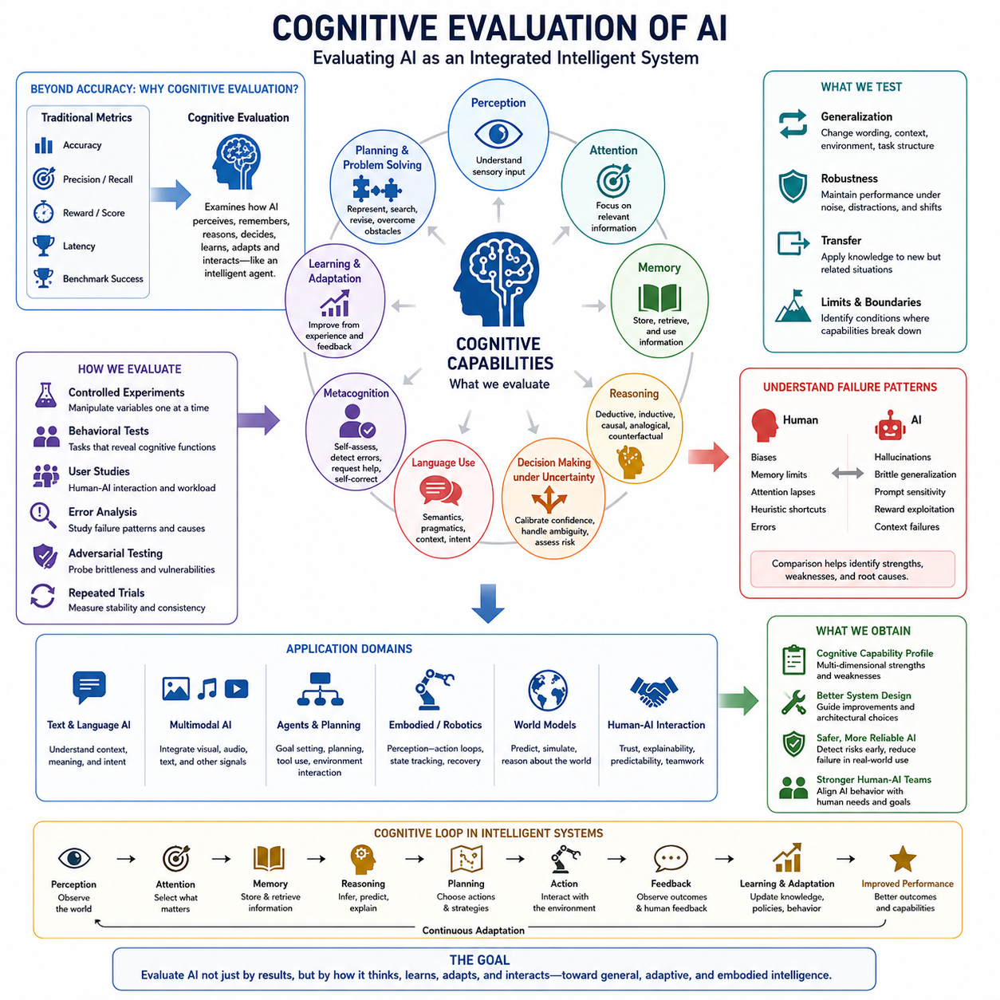{width="7.268055555555556in" height="7.268055555555556in"}

인공지능의 인지 평가(Cognitive Evaluation of Artificial Intelligence)는 단순히 과제 정확도(Task Accuracy)나 벤치마크 점수(Benchmark Score)를 측정하는 것에 그치지 않고, 인공지능 시스템의 행동이 인간 지능(Human Intelligence)과 관련된 인지 기능(Cognitive Function)과 어떻게 비교되는지를 살펴봅니다. 이러한 관점에서는 지각(Perception), 주의(Attention), 기억(Memory), 추론(Reasoning), 의사결정(Decision Making), 학습(Learning), 언어 사용(Language Use), 적응(Adaptation), 상호작용(Interaction)을 서로 분리된 계산 능력이 아니라 통합된 지능 시스템(Integrated Intelligent System)의 구성 요소로 평가합니다.

전통적인 인공지능 평가(AI Evaluation)는 분류 정확도(Classification Accuracy), 정밀도(Precision), 재현율(Recall), 보상(Reward), 지연시간(Latency), 벤치마크 성공률(Benchmark Success Rate)과 같이 명확하게 정의된 지표에 의존하는 경우가 많습니다. 이러한 지표는 여전히 중요하지만, 시스템이 문제를 어떻게 표현하고, 문맥을 유지하며, 불확실성에 대응하고, 지식을 전이하며, 자신의 오류를 수정하는지에 대해서는 충분한 정보를 제공하지 못할 수 있습니다. 따라서 인지 평가(Cognitive Evaluation)는 관찰 가능한 행동을 통해 내부의 기능적 특성을 드러내도록 설계된 시험을 이용하여 기존 성능 지표를 보완합니다.

핵심적인 평가 질문 가운데 하나는 인공지능 시스템이 학습 데이터(Training Data)와 매우 유사한 상황을 넘어 일반화(Generalization)할 수 있는가입니다. 인간 인지(Human Cognition)는 서로 관련된 과제, 환경, 표현 사이에서 유연한 전이(Transfer)를 지원합니다. 인지 평가는 문제의 근본적인 구조는 유지하면서 표현 방식, 문맥, 감각 조건, 과제 구조 또는 사용 가능한 정보를 변경하여 이러한 능력을 시험할 수 있습니다. 강건한 지능(Robust Intelligence)은 표면적 상관관계(Superficial Correlation)에 의존하지 않고 이러한 변화 속에서도 유용한 능력을 유지해야 합니다.

기억(Memory)은 또 다른 중요한 평가 차원을 제공합니다. 지능형 에이전트(Intelligent Agent)는 최근 정보를 보존하고, 관련된 장기 지식(Long-Term Knowledge)을 검색하며, 현재 관찰과 이전 경험을 구분하고, 장시간의 상호작용에서도 시간적 연속성(Temporal Continuity)을 유지해야 할 수 있습니다. 따라서 평가에서는 작업 문맥(Working Context), 일화적 기억과 유사한 회상(Episodic-like Recall), 의미 기억 검색(Semantic Retrieval), 간섭(Interference), 망각(Forgetting), 기억 공고화(Memory Consolidation), 그리고 기억된 정보를 단순히 재생하는 것이 아니라 적절하게 활용하는 능력을 조사할 수 있습니다.

주의(Attention)는 모델이 방해 정보(Distractor)를 무시하면서 관련 정보를 얼마나 효과적으로 선택하는지를 통해 평가할 수 있습니다. 인간은 제한된 인지 자원(Cognitive Resource) 아래에서 목표와 문맥에 따라 감각적 또는 상징적 입력(Symbolic Input)의 우선순위를 지속적으로 결정합니다. 인공지능 시스템 역시 긴 문서, 멀티모달 스트림(Multimodal Stream), 복잡한 장면 또는 대규모 도구 출력(Tool Output)을 처리할 때 유사한 문제에 직면합니다. 인지 시험은 관련성이 없지만 눈에 띄는 정보가 과제 관련 증거와 경쟁할 때 성능이 어떻게 저하되는지를 보여줄 수 있습니다.

추론 평가(Reasoning Evaluation)는 단순히 올바른 최종 답을 얻었는지를 넘어섭니다. 시스템은 근본적인 관계를 올바르게 표현했기 때문이 아니라 암기된 패턴(Memorized Pattern), 지름길(Shortcut), 통계적 상관관계(Statistical Correlation)를 이용하여 성공할 수도 있습니다. 따라서 인지 평가는 통제된 변형을 통해 연역적 추론(Deductive Reasoning), 귀납적 추론(Inductive Reasoning), 귀추적 추론(Abductive Reasoning), 인과 추론(Causal Reasoning), 유추 추론(Analogical Reasoning), 반사실적 추론(Counterfactual Reasoning)을 조사합니다. 목적은 인간과 동일한 내부 메커니즘을 요구하는 것이 아니라 추론 능력의 안정성과 한계를 확인하는 것입니다.

문제 해결(Problem Solving)을 위해서는 인공지능 시스템이 유용한 문제 표현(Problem Representation)을 구성하고, 후보 해결책(Candidate Solution)을 생성하고, 대안을 탐색하며, 중간 상태(Intermediate State)를 평가하고, 기존 가정이 실패했을 때 계획을 수정할 수 있어야 합니다. 인지 평가에서는 불완전한 정보, 오해를 유발하는 단서, 변화하는 제약조건 또는 예상하지 못한 장애물을 제시하여 시스템이 전략을 적응시키는지를 관찰할 수 있습니다. 이러한 시험은 도구, 소프트웨어 환경, 로봇 또는 다른 자율 시스템(Autonomous System)과 상호작용하는 에이전트에서 특히 중요합니다.

불확실성 하의 의사결정(Decision Making under Uncertainty)은 인지과학(Cognitive Science)과 인공지능 평가를 연결하는 또 다른 중요한 영역입니다. 지능 시스템은 완전하고 완벽하게 신뢰할 수 있는 정보만을 가지고 작동하는 경우가 거의 없습니다. 따라서 평가는 신뢰도 보정(Confidence Calibration), 불확실성 추정(Uncertainty Estimation), 증거 통합(Evidence Integration), 위험 민감도(Risk Sensitivity), 모호한 조건에서의 행동을 조사해야 합니다. 증거가 충분하지 않은 상황에서도 확신에 찬 답변을 생성하는 시스템은 평균적인 정확도가 높더라도 고위험 응용에서는 인지적으로 신뢰하기 어려울 수 있습니다.

언어 기반 시스템(Language-based System)은 언어적 유창성(Linguistic Fluency)뿐 아니라 의미론(Semantics)과 화용론(Pragmatics)에 대해서도 평가해야 합니다. 인공지능 모델은 문법적으로 완벽한 문장을 생성하면서도 의도(Intent), 전제(Presupposition), 모호성(Ambiguity), 대화 문맥(Conversational Context), 함축적 의미(Implied Meaning)를 잘못 이해할 수 있습니다. 따라서 인지 평가에서는 사회적 문맥, 담화 이력(Discourse History), 지시 구조(Reference Structure), 의사소통 목표(Communicative Goal)를 변화시킬 수 있습니다. 성공적인 언어 행동에는 단순히 확률적으로 적절한 단어를 생성하는 것 이상으로 문맥에 민감한 해석과 적절한 응답 선택이 필요합니다.

메타인지(Metacognition)는 시스템이 자신의 수행 능력과 결과의 일부 측면을 평가할 수 있는 능력과 관련됩니다. 실용적인 인공지능에서는 불확실성을 인식하고, 잠재적인 오류를 탐지하며, 추가 정보를 요청하고, 외부 도구가 필요한 시점을 결정하며, 이전 결론을 수정하는 능력이 이에 포함됩니다. 인지 평가는 시스템의 신뢰도(Confidence)와 실제 정답률(Correctness)을 비교하고 자기 수정(Self-Correction)이 결과를 개선하는지를 시험할 수 있습니다. 신뢰할 수 있는 자기 모니터링(Self-Monitoring)은 지속적인 인간 감독 없이 작동하는 자율 에이전트에서 특히 중요합니다.

인간의 인지 평가 방법은 특징적인 실패 패턴(Failure Pattern)에도 주목합니다. 인간은 편향(Bias), 기억 한계(Memory Limitation), 주의 오류(Attentional Error), 휴리스틱 지름길(Heuristic Shortcut)을 보이는 반면, 인공지능 시스템은 환각(Hallucination), 취약한 일반화(Brittle Generalization), 프롬프트 민감성(Prompt Sensitivity), 보상 악용(Reward Exploitation), 문맥 실패(Context Failure)를 나타낼 수 있습니다. 이러한 패턴을 비교한다고 해서 인간과 인공지능이 동일한 이유로 실패한다는 의미는 아닙니다. 대신 실패 분석(Failure Analysis)을 통해 어떤 기능적 능력이 강건하며 어떤 능력이 특정 데이터 분포나 과제 표현 방식에 강하게 의존하는지를 파악할 수 있습니다.

따라서 가능하다면 하나의 벤치마크만 사용하는 대신 통제된 실험(Controlled Experiment)을 활용해야 합니다. 다른 조건을 고정한 상태에서 특정 변수를 체계적으로 조작하면 어떤 변화가 실제로 성능 저하를 발생시키는지 확인할 수 있습니다. 행동 실험(Behavioral Experiment), 반응시간 유사 측정(Reaction-Time Analogue), 사용자 연구(User Study), 오류 분석(Error Analysis), 적대적 시험(Adversarial Testing), 반복 시험(Repeated Trial)은 다양한 인지 차원에 걸쳐 시스템의 능력과 한계에 대한 상호 보완적인 증거를 제공할 수 있습니다.

멀티모달 인공지능(Multimodal AI)과 체화 인공지능(Embodied AI)의 경우 인지 평가는 지각-행동 루프(Perception-Action Loop)까지 확장되어야 합니다. 로봇이나 자율 에이전트는 감각 입력을 해석하고, 상태(State)를 유지하며, 미래 조건을 예측하고, 행동을 선택하고, 결과를 관찰한 후 지속적으로 자신의 행동을 업데이트해야 합니다. 평가에서는 지각 오류가 계획으로 어떻게 전파되는지, 기억이 내비게이션을 지원하는지, 예측이 행동 선택을 개선하는지, 환경 조건이 예상과 달라졌을 때 에이전트가 복구할 수 있는지를 측정할 수 있습니다.

인간-AI 상호작용(Human-AI Interaction)은 신뢰(Trust), 설명 가능성(Explainability), 작업부하(Workload), 예측 가능성(Predictability), 협업 효과성(Collaborative Effectiveness)과 같은 추가적인 평가 기준을 도입합니다. 인공지능 시스템 자체의 정확도가 높더라도 추천 결과를 해석하기 어렵거나 신뢰도가 오해를 유발한다면 인간-기계 팀(Human-Machine Team)의 구성 요소로서는 낮은 성능을 보일 수 있습니다. 따라서 인지 평가는 시스템의 행동이 인간의 의사결정에 어떤 영향을 주는지와 인간과 인공지능의 상호작용이 결합된 전체 성능을 향상시키는지를 함께 고려합니다.

어떠한 단일 인지 벤치마크(Cognitive Benchmark)도 인공지능 시스템이 일반적인 의미에서 지능(Intelligence)을 보유하고 있음을 확정할 수는 없습니다. 인지 능력은 다차원적(Multidimensional)이고 문맥에 크게 의존하며 서로 상호작용하는 경우가 많습니다. 강력한 언어 능력과 약한 인과 추론이 동시에 존재할 수 있으며, 뛰어난 지각 능력과 부족한 장기 계획(Long-Term Planning)이 함께 나타날 수도 있습니다. 따라서 평가는 지능을 하나의 종합 점수로 축소하기보다 인지 능력 프로파일(Cognitive Capability Profile)을 구성해야 합니다.

인지 평가의 더 넓은 목적은 인공지능 시스템이 적응형 정보처리 에이전트(Adaptive Information-Processing Agent)로서 어떻게 행동하는지를 이해하는 것입니다. 성능 지표는 과제가 완료되었는지를 보여주는 반면, 인지 평가는 성공하거나 실패한 행동의 배후에 존재하는 기능적 조직(Functional Organization)을 조사합니다. 지각, 주의, 기억, 추론, 언어, 불확실성, 메타인지, 계획(Planning), 행동(Action)을 연결함으로써 인지과학은 인공지능을 통합된 지능 시스템으로 평가할 수 있는 체계를 제공합니다.

이러한 관점은 인공지능이 특수 목적 모델(Specialized Model)에서 에이전트(Agent), 멀티모달 시스템(Multimodal System), 월드 모델(World Model), 피지컬 AI(Physical AI)로 발전함에 따라 더욱 중요해집니다. 변화하는 환경에서 지속적으로 작동하는 시스템은 상태를 유지하고, 미래 사건을 예측하며, 피드백으로부터 학습하고, 실패로부터 복구하며, 시간에 걸쳐 의사결정을 조정해야 합니다. 따라서 인지 평가(Cognitive Evaluation)는 기존의 벤치마킹(Conventional Benchmarking)을 넘어 점점 더 일반적이고, 적응적이며, 체화된 인공지능(Embodied Artificial Intelligence)을 체계적으로 평가하기 위한 가교 역할을 합니다.

## 07.09 Perception to State Estimation [w/Code]

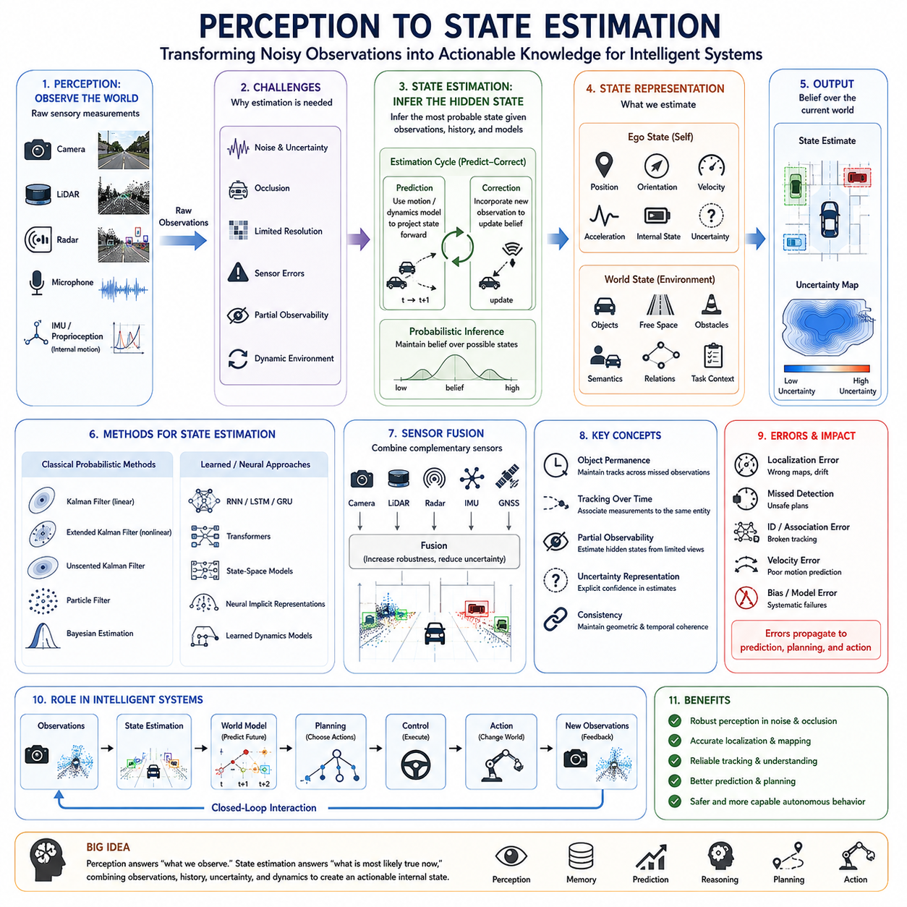{width="7.268055555555556in" height="7.268055555555556in"}

지각(Perception)은 지능 시스템(Intelligent System)에 외부 세계에 대한 관측(Observation)을 제공하지만, 관측 자체가 세계의 실제 상태(State)에 대한 지식과 동일한 것은 아닙니다. 카메라(Camera)는 이미지를 생성하고, 라이다(LiDAR)는 기하학적 측정값을 생성하며, 마이크(Microphone)는 음향 신호를 포착하고, 고유수용성 센서(Proprioceptive Sensor)는 내부 움직임을 측정합니다. 상태 추정(State Estimation)은 이러한 불완전하고 잡음이 포함된 측정값을 추론, 예측, 계획, 행동을 지원할 수 있는 구조화된 표현(Structured Representation)으로 변환합니다.

이러한 변환은 인지과학(Cognitive Science)에서 감각 입력(Sensory Input)과 내부 표현(Internal Representation)을 구분하는 중요한 관점과 유사합니다. 인간은 환경을 서로 단절된 망막 픽셀, 음압, 고유수용성 신호의 집합으로 경험하지 않습니다. 신경계(Nervous System)는 공간과 시간에 걸쳐 관측을 통합하여 객체, 움직임, 위치, 관계, 문맥을 추론합니다. 인공지능 시스템 역시 원시 지각(Raw Perception)을 무엇이 존재하고 어떤 일이 발생하고 있는지에 대한 지속적인 추정으로 변환하는 메커니즘이 필요합니다.

상태(State)는 미래의 의사결정(Future Decision)에 관련된 변수들을 압축하여 표현한 것으로 이해할 수 있습니다. 이동 로봇(Mobile Robot)의 경우 이러한 변수에는 위치(Position), 자세(Orientation), 속도(Velocity), 주변 객체, 자유 공간(Free Space), 장애물, 지형 특성(Terrain Property), 불확실성(Uncertainty) 등이 포함될 수 있습니다. 더욱 복잡한 환경에서 작동하는 지능형 에이전트의 상태에는 객체 식별정보(Object Identity), 의미적 관계(Semantic Relationship), 목표, 작업 진행 상태(Task Progress), 인간 활동 등 미래 결과를 예측하는 데 필요한 정보가 추가될 수 있습니다.

근본적인 어려움은 환경의 실제 상태(True State)가 일반적으로 직접 관찰되지 않는다는 점입니다. 센서는 기본 상태에 의존하는 관측값을 제공하지만 여기에는 잡음(Noise), 모호성(Ambiguity), 가림(Occlusion), 제한된 해상도, 측정 오류가 포함됩니다. 따라서 상태 추정은 추론 문제(Inference Problem)입니다. 시스템은 사전 지식(Prior Knowledge)과 이전 시간 단계에서 축적된 정보를 함께 이용하면서 현재 관측을 가장 그럴듯하게 설명할 수 있는 잠재적인 세계 상태(Latent World State)를 결정해야 합니다.

확률적 추론(Probabilistic Reasoning)은 이러한 과정을 표현하는 자연스러운 프레임워크를 제공합니다. 하나의 관측이 세계를 완벽하게 보여준다고 가정하는 대신, 시스템은 가능한 상태에 대한 믿음(Belief)을 유지하고 새로운 증거가 들어올 때 이를 갱신합니다. 베이지안 추정(Bayesian Estimation)은 사전 믿음(Prior Belief), 관측 가능도(Observation Likelihood), 사후 추정(Posterior Estimate)의 관계를 통해 이를 표현합니다. 이를 통해 불확실성을 단순히 무시해야 하는 오류가 아니라 지각 과정의 명시적인 구성 요소로 다룰 수 있습니다.

환경은 지속적으로 변화하기 때문에 시간 정보(Temporal Information)가 특히 중요합니다. 일반적으로 상태 추정기(State Estimator)는 이전 상태 추정값, 상태가 어떻게 변화할 수 있는지를 설명하는 모델, 새로운 관측값을 결합합니다. 예측 단계(Prediction Step)는 이전 상태를 시간적으로 앞으로 투영하고, 보정 단계(Correction Step)는 현재의 측정값을 반영합니다. 이러한 예측-보정 순환(Prediction-Correction Cycle)은 지각, 기억, 예측, 환경과의 지속적인 상호작용을 연결하는 계산적 가교를 제공합니다.

고전적인 추정 방법(Classical Estimation Method)은 이러한 원리를 명확하게 보여줍니다. 칼만 필터(Kalman Filter)는 시스템과 관측 모델이 적절한 가정을 만족할 때 연속적으로 변화하는 상태를 추정하며, 확장 칼만 필터(Extended Kalman Filter)와 무향 칼만 필터(Unscented Kalman Filter)는 중요한 비선형 문제(Nonlinear Problem)를 처리합니다. 파티클 필터(Particle Filter)는 다수의 가설(Hypothesis)을 이용하여 불확실성을 표현하고 더욱 복잡한 확률분포를 처리할 수 있습니다. 이러한 방법은 위치추정(Localization), 추적(Tracking), 내비게이션(Navigation), 센서 융합(Sensor Fusion), 로보틱스(Robotics)의 핵심적인 기반으로 사용됩니다.

현대 인공지능(Modern AI)은 상태 추정을 명시적으로 설계된 수학적 변수의 범위를 넘어 확장하고 있습니다. 신경망(Neural Network)은 이미지, 비디오, 오디오, 멀티모달 센서 스트림(Multimodal Sensor Stream)과 같은 고차원 관측으로부터 잠재 상태 표현(Latent State Representation)을 직접 학습할 수 있습니다. 순환 신경망(Recurrent Network), 트랜스포머(Transformer), 상태 공간 모델(State-Space Model), 학습된 동역학 모델(Learned Dynamics Model)은 시간에 걸쳐 정보를 통합하여 예측이나 후속 의사결정에 유용한 환경의 특성을 은닉 표현(Hidden Representation)에 인코딩할 수 있습니다.

센서 융합(Sensor Fusion)은 상호 보완적인 관측을 결합함으로써 상태 추정의 성능을 강화합니다. 카메라는 풍부한 외관 및 의미 정보(Semantic Information)를 제공하고, 라이다는 정확한 기하학적 구조를 제공하며, 레이더(Radar)는 어려운 환경에서도 거리와 상대 운동(Relative Motion)을 강건하게 측정합니다. 관성 센서(Inertial Sensor)는 고주파 운동을 측정하고, GNSS(Global Navigation Satellite System)는 사용 가능한 환경에서 전역 위치(Global Position)를 제공합니다. 이러한 모달리티(Modality)를 결합하면 개별 센서의 약점을 줄이고 단일 센서보다 신뢰할 수 있는 상태 추정을 생성할 수 있습니다.

상태 추정에서는 에이전트 자신의 상태와 환경 상태를 구분하는 것도 중요합니다. 자기 상태 추정(Ego-State Estimation)은 위치, 자세, 속도, 가속도, 내부 운영 상태 등의 변수를 결정합니다. 세계 상태 추정(World-State Estimation)은 주변 객체, 공간 구조, 동적 에이전트(Dynamic Agent), 환경 특성을 표현합니다. 지능적인 행동을 위해서는 이러한 표현들이 기하학적 및 시간적으로 일관성을 유지해야 합니다. 행동은 에이전트와 주변 환경 사이의 관계에 따라 결정되기 때문입니다.

객체 영속성(Object Permanence)은 인지와 연결되는 또 다른 중요한 개념입니다. 객체가 장애물 뒤로 일시적으로 사라지거나 카메라 시야를 벗어나거나 탐지하기 어려워졌다고 해서 지능 시스템이 해당 객체가 즉시 사라졌다고 판단해서는 안 됩니다. 추적(Tracking)과 시간적 상태 추정(Temporal State Estimation)은 관측이 일시적으로 누락되더라도 객체에 대한 가설을 유지합니다. 이러한 지속성(Persistence)은 내비게이션, 상호작용, 예측, 부분적으로 관찰 가능한 환경에 대한 추론을 지원합니다.

따라서 부분 관측 가능성(Partial Observability)은 지능적인 상태 추정의 핵심 요소입니다. 특정 순간에 에이전트가 인식할 수 있는 것은 전체 환경의 일부에 불과하며, 중요한 많은 변수는 관찰되지 않은 상태로 남아 있습니다. 시스템은 현재 관측을 기억과 예측 모델(Predictive Model)에 결합하여 관찰되지 않은 상태에 대한 믿음을 유지해야 합니다. 이러한 개념은 상태 추정을 부분 관측 의사결정 과정(Partially Observable Decision Process)과 연결하며, 여기에서는 완벽하게 알려진 세계 상태가 아니라 숨겨진 상태에 대한 믿음을 기반으로 행동을 선택합니다.

의미적 상태 추정(Semantic State Estimation)은 기하학적 이해를 의미 있는 세계 표현(World Representation)으로 확장합니다. 특정 영역에 객체가 존재한다는 사실을 탐지하는 것도 유용하지만, 지능적인 행동을 위해서는 해당 객체가 무엇인지, 이동 가능한지, 누가 사용하고 있는지, 현재 작업과 어떤 관계가 있는지 알아야 하는 경우가 많습니다. 따라서 상태 표현은 기하학(Geometry), 객체 정체성, 속성(Attribute), 어포던스(Affordance), 관계(Relationship), 작업 문맥(Task Context)을 결합하여 점점 더 구조화된 환경 모델을 구성할 수 있습니다.

지각은 완벽하게 신뢰할 수 없기 때문에 불확실성(Uncertainty)은 이러한 추정값과 함께 유지되어야 합니다. 자율 시스템(Autonomous System)은 알려진 위치에서 높은 신뢰도로 탐지된 장애물과 객체의 종류나 위치가 불확실한 약한 관측을 구분해야 합니다. 신뢰도(Confidence)를 표현하면 계획 및 의사결정 시스템이 필요한 경우 보수적으로 행동하고, 추가 정보를 수집하거나, 새로운 증거가 기존 추정과 충돌할 때 기존 가정을 다시 검토할 수 있습니다.

상태 추정의 오류는 전체 인지 파이프라인(Cognitive Pipeline)을 통해 전파될 수 있습니다. 잘못된 위치추정은 부정확한 지도를 만들 수 있고, 객체 탐지 실패는 위험한 계획을 생성할 수 있으며, 객체 식별 오류는 추적을 손상시키고, 부정확한 속도 추정은 미래 움직임을 잘못 예측하게 만들 수 있습니다. 따라서 지능 시스템을 평가할 때에는 각각의 구성 요소를 완전히 독립적으로 평가하기보다 지각의 불확실성이 상태, 예측, 계획, 행동에 어떻게 영향을 미치는지를 추적해야 합니다.

상태 추정(State Estimation)은 월드 모델(World Model)의 기반도 제공합니다. 현재 상태가 유용한 형태로 먼저 표현되지 않는다면 월드 모델은 미래 상태를 효과적으로 예측할 수 없습니다. 지각은 관측을 제공하고, 상태 추정은 내부 표현을 구성하며, 동역학 모델(Dynamics Model)은 해당 표현이 미래에 어떻게 변화할지를 예측합니다. 이후 계획(Planning)은 가능한 미래 궤적(Future Trajectory)을 비교하여 예상되는 결과가 에이전트의 목표를 가장 효과적으로 지원하는 행동을 선택할 수 있습니다.

피지컬 AI(Physical AI)에서는 이러한 지각에서 상태로의 전환이 지속적인 폐루프(Closed Loop)를 형성합니다. 센서는 물리적 환경을 관측하고, 상태 추정은 내부 상태를 갱신하며, 예측은 미래 조건을 예상하고, 계획은 행동을 선택하며, 제어(Control)는 물리적 움직임을 통해 세계를 변화시킵니다. 이후 새로운 관측은 이러한 행동의 결과를 다시 보여줍니다. 지능은 지각만으로 형성되는 것이 아니라 행동 가능한 내부 세계 모델(Actionable Internal World Model)을 지속적으로 유지하고 갱신하는 과정에서 나타납니다.

상태 추정의 더 넓은 인지적 의미는 지능 시스템이 원시 감각 데이터(Raw Sensory Data)가 아니라 추론된 현실(Inferred Reality)을 기반으로 작동해야 한다는 데 있습니다. 지각은 무엇이 관측되었는가에 답하는 반면, 상태 추정은 관측, 과거 이력(History), 불확실성, 동역학(Dynamics)을 고려했을 때 현재 무엇이 사실일 가능성이 높은가를 판단합니다. 감각적 증거(Sensory Evidence)에서 지속적인 내부 상태(Persistent Internal State)로의 이러한 전환은 지각을 기억, 예측, 추론, 계획, 월드 모델, 그리고 궁극적으로 적응적 행동(Adaptive Action)과 연결합니다.

## 07.10 Memory to Temporal State [w/Code]

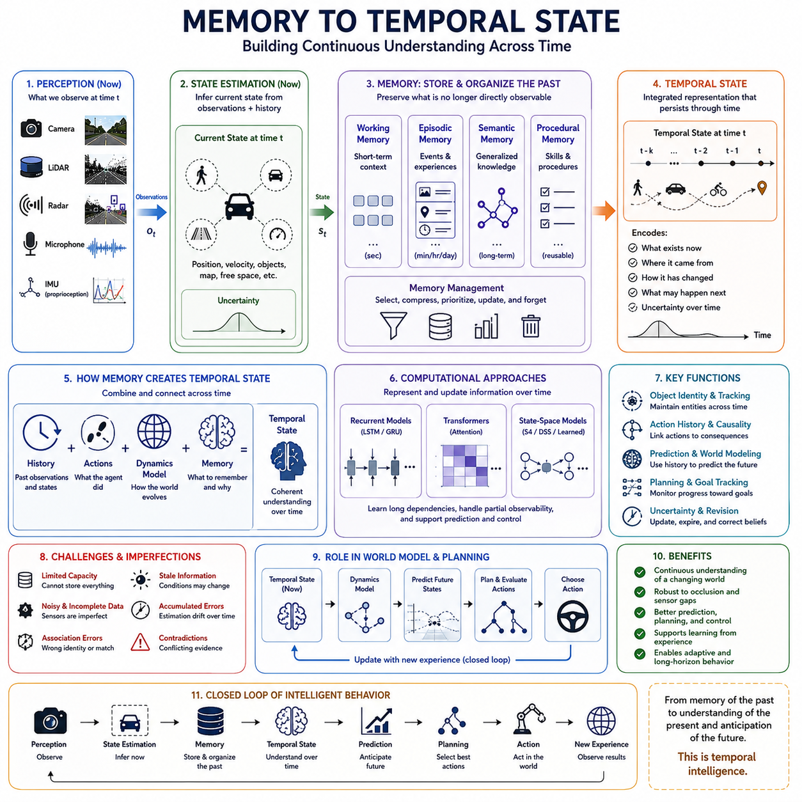{width="7.268055555555556in" height="7.268055555555556in"}

기억(Memory)은 지능 시스템(Intelligent System)이 현재의 관측(Present Observation)을 넘어 자신의 이해를 확장할 수 있도록 합니다. 하나의 감각 프레임(Sensory Frame)은 현재 보이는 것만을 보여주지만, 의미 있는 행동은 몇 초, 몇 분 또는 훨씬 이전에 발생한 사건에 의존하는 경우가 많습니다. 시간적 상태(Temporal State)는 현재의 지각을 이전의 관측, 행동, 사건, 변화에 관한 저장된 정보와 통합함으로써 형성되며, 이를 통해 시간에 걸쳐 지속되는 내부 표현(Internal Representation)이 만들어집니다.

이러한 구분은 물리적 세계(Physical World)를 서로 독립적인 순간적 장면(Snapshot)의 연속으로 이해할 수 없다는 점에서 매우 중요합니다. 객체는 움직이고, 에이전트(Agent)는 목표를 추구하며, 상호작용은 시간에 따라 전개되고, 행동은 지연된 결과(Delayed Consequence)를 만들어냅니다. 따라서 지능 시스템은 시간에 걸쳐 관측들을 연결하고, 어떤 요소가 지속적인 개체(Persistent Entity)를 나타내는지, 무엇이 변화를 나타내는지, 그리고 어떤 과거 사건이 현재 상황과 여전히 관련되어 있는지를 판단해야 합니다.

인지과학(Cognitive Science)에서 기억은 일반적으로 작업 기억(Working Memory), 일화 기억(Episodic Memory), 의미 기억(Semantic Memory), 절차 기억(Procedural Memory)과 같이 서로 상호작용하는 기능적 형태로 구분됩니다. 인공지능 시스템이 이러한 생물학적 메커니즘을 정확하게 재현할 필요는 없지만, 이와 유사한 기능적 구분은 유용할 수 있습니다. 단기 표현(Short-Term Representation)은 즉각적인 문맥을 유지하고, 장기 저장소(Long-Term Store)는 축적된 지식을 보존하며, 경험 기록(Experience Record)은 이전 상태, 행동, 결과에 대한 정보를 제공합니다.

작업 기억(Working Memory)은 짧은 시간 범위에서 시간적 상태를 구성하는 데 특히 중요합니다. 작업 기억은 센서를 통해 더 이상 직접 관측할 수 없는 최근의 정보를 보존합니다. 예를 들어 로봇이 복도로 진입한 후 방향을 전환하면서 어떤 객체를 일시적으로 보지 못하게 되더라도, 내부 상태에는 해당 객체가 존재할 가능성과 예상 위치가 유지되어야 합니다. 시간적 기억(Temporal Memory)이 없다면 새로운 관측이 들어올 때마다 시스템의 환경 이해가 사실상 초기화될 것입니다.

따라서 시간적 상태(Temporal State)는 이력(History)을 포함함으로써 순간적인 상태 추정(Instantaneous State Estimation)을 확장합니다. 시스템은 시간 t의 관측만으로 현재 세계를 추정하는 대신, 이전 시간의 관측, 과거의 상태 추정값, 이미 실행한 행동, 예측된 동역학(Predicted Dynamics)을 함께 고려합니다. 그 결과 만들어진 표현은 객체가 현재 어디에 있는지만이 아니라 어디에서 왔는지, 어떻게 움직여 왔는지, 그리고 다음에 어떤 일이 발생할 가능성이 있는지까지 인코딩할 수 있습니다.

순환 신경망(Recurrent Neural Network)은 새로운 입력이 들어올 때마다 변화하는 은닉 상태(Hidden State)를 유지함으로써 이러한 문제를 해결하는 하나의 계산적 접근법을 제공합니다. LSTM(Long Short-Term Memory)과 GRU(Gated Recurrent Unit)는 일반적인 순환 신경망에서 발생하는 문제를 줄이면서 더 긴 시퀀스에 걸쳐 유용한 정보를 보존하도록 설계되었습니다. 이러한 은닉 표현은 이전 관측의 압축된 요약(Compressed Summary)으로 기능하며 시퀀스 예측, 추적, 언어 처리, 제어를 지원할 수 있습니다.

트랜스포머(Transformer)는 시스템이 시퀀스 전체에 분포된 정보에 선택적으로 주의를 기울일 수 있도록 함으로써 시간적 기억에 다른 방식으로 접근합니다. 모든 과거 정보를 하나의 순환 상태(Recurrent State)에 압축하는 대신, 어텐션 메커니즘(Attention Mechanism)은 여러 이전 위치에서 관련된 요소를 검색할 수 있습니다. 이는 중요한 증거가 먼 과거에 나타난 경우 특히 유용하지만, 계산 비용(Computational Cost)과 유한한 문맥 창(Context Window)은 직접 처리할 수 있는 이력의 양을 여전히 제한합니다.

상태 공간 모델(State-Space Model)은 긴 시간 시퀀스를 표현하는 또 다른 프레임워크를 제공합니다. 상태 공간 모델은 숨겨진 상태(Hidden State)가 시간에 따라 어떻게 변화하고 관측이 이러한 상태와 어떻게 연결되는지를 기술합니다. 현대의 학습형 상태 공간 아키텍처(Learned State-Space Architecture)는 동역학 시스템(Dynamical System)의 원리와 신경 표현 학습(Neural Representation Learning)을 결합하여 긴 시퀀스를 효율적으로 처리할 수 있는 메커니즘을 제공합니다. 이러한 접근법은 기억, 상태 추정, 시간적 동역학(Temporal Dynamics) 사이의 긴밀한 관계를 보여줍니다.

모든 관측을 동일한 수준의 세부 정보로 기억할 필요는 없습니다. 지능적인 기억(Intelligent Memory)에는 선택(Selection), 압축(Compression), 망각(Forgetting)이 필요합니다. 빈번하게 변화하는 정보는 지속적으로 갱신해야 하는 반면, 안정적인 환경 특성은 더욱 장기적으로 저장할 수 있습니다. 미래의 의사결정에 큰 영향을 미치는 사건은 반복적이고 중복된 관측보다 높은 우선순위를 가질 수 있습니다. 따라서 기억 관리(Memory Management)는 단순한 저장 문제뿐 아니라 주의와 자원 할당(Resource Allocation)의 문제이기도 합니다.

시간적 상태는 관측을 지속적인 개체(Persistent Entity)와 연결하는 과정에도 의존합니다. 하나의 객체가 여러 프레임에 나타날 때 시스템은 이러한 관측들이 동일한 객체를 의미하는지를 판단해야 합니다. 추적(Tracking), 데이터 연관(Data Association), 객체 정체성(Object Identity), 객체 영속성(Object Permanence)이 이러한 과정에 기여합니다. 가림(Occlusion)이나 시점 변화(Viewpoint Change)가 발생하더라도 객체의 정체성을 유지하면 시스템은 동일한 개체를 반복적으로 새로운 대상으로 취급하는 대신 궤적(Trajectory)과 상호작용에 대해 추론할 수 있습니다.

에이전트는 자신의 행동을 통해 환경을 변화시키기 때문에 행동(Action) 역시 기억의 일부가 되어야 합니다. 로봇이 문을 열거나, 객체를 이동하거나, 진행 방향을 변경했다면 이후의 관측은 이러한 행동과 관련하여 해석되어야 합니다. 행동 이력(Action History)을 기억하면 에이전트가 수행한 행동과 이후 발생한 결과를 연결함으로써 인과 추론(Causal Reasoning)을 지원할 수 있습니다. 이러한 관계는 동역학을 학습하고, 행동의 결과를 예측하며, 미래의 의사결정을 개선하는 데 필수적입니다.

일화적 기억과 유사한 기억(Episodic-like Memory)은 단순히 연속적인 은닉 상태를 유지하는 것을 넘어 중요한 경험에 대한 구조화된 기록(Structured Record)을 보존할 수 있습니다. 이러한 기록에는 관측, 상태, 행동, 결과, 위치, 시간 정보(Timestamp), 문맥 정보(Contextual Information)가 포함될 수 있습니다. 지능형 에이전트는 유사한 상황을 다시 만났을 때 관련된 이전 경험을 검색함으로써 과거 경험을 계획, 적응, 오류 복구(Error Recovery), 그리고 잠재적으로 익숙하지 않은 환경에서의 소수 예제 학습(Few-Shot Learning)에 활용할 수 있습니다.

의미 기억(Semantic Memory)은 여러 경험에서 추출된 일반화된 지식(Generalized Knowledge)을 보존함으로써 다른 시간적 기능을 수행합니다. 반복되는 관측은 객체, 환경, 작업, 관계의 안정적인 특성을 드러낼 수 있습니다. 일화적 경험이 축적됨에 따라 유용한 규칙성이 더욱 추상적인 지식으로 공고화(Consolidation)될 수 있습니다. 인공지능 역시 상세한 경험 기록과 여러 상황에서 재사용 가능한 패턴을 포착하는 학습된 표현(Learned Representation)을 구분할 수 있습니다.

기억은 필연적으로 불완전합니다. 제한된 용량, 잡음이 포함된 관측, 잘못된 연관, 오래되어 현재와 맞지 않는 정보(Stale Information), 누적된 추정 오류가 시간적 상태를 손상시킬 수 있습니다. 시스템은 이미 이동한 객체를 이전 위치에 있다고 기억하거나, 관측을 잘못된 개체와 연결하거나, 오래된 환경 조건을 계속 유지할 수 있습니다. 따라서 시간적 추론(Temporal Reasoning)에는 저장된 정보를 영구적으로 올바른 것으로 취급하는 대신 신뢰도(Confidence), 수정(Revision), 만료(Expiration), 모순 처리(Contradiction Handling)를 위한 메커니즘이 필요합니다.

기억과 예측(Prediction)의 관계는 월드 모델(World Model)에서 특히 중요합니다. 동일한 순간적 관측이라도 이전의 움직임과 상호작용에 따라 서로 다른 미래 궤적(Future Trajectory)으로 이어질 수 있기 때문에 미래를 예측하려면 현재 상태가 어떻게 형성되었는지에 대한 정보가 필요합니다. 시간적 상태는 속도, 변화 추세(Trend), 사건 시퀀스(Event Sequence), 행동 이력, 문맥적 연속성(Contextual Continuity)을 제공하여 동역학 모델(Dynamics Model)이 세계가 앞으로 어떻게 변화할 가능성이 있는지를 추정할 수 있도록 합니다.

계획(Planning) 역시 시간적 표현(Temporal Representation)에 의존합니다. 목표는 여러 단계에 걸쳐 지속되는 경우가 많으며, 중간 행동은 미래 결과를 기준으로 평가되어야 합니다. 기억은 에이전트가 완료한 행동, 해결되지 않은 하위 목표(Subgoal), 이전의 실패, 환경 변화, 목표를 향한 진행 상태를 추적할 수 있도록 합니다. 이러한 연속성이 없다면 장기 계획(Long-Horizon Planning)은 전체 작업 이력에 대한 이해가 거의 없는 서로 단절된 국소적 의사결정으로 분해될 수 있습니다.

피지컬 AI(Physical AI)에서 시간적 상태는 로봇과 물리적 세계 사이의 상호작용을 지속적으로 갱신하는 기억이 됩니다. 멀티모달 센서(Multimodal Sensor)는 관측을 생성하고, 상태 추정(State Estimation)은 현재 표현을 구성하며, 기억은 관련된 이력을 보존하고, 동역학 모델은 미래 상태를 예측합니다. 이후 계획과 제어(Control)는 행동을 선택하며, 그 결과로 발생한 새로운 경험은 다시 지속적으로 변화하는 시간적 표현에 통합됩니다.

기억에서 시간적 상태로의 더 넓은 인지적 전환은 지능을 순간적인 반응(Instantaneous Reaction)에서 지속적인 이해(Continuous Understanding)로 변화시킵니다. 기억은 더 이상 직접 관측할 수 없는 정보를 보존하고, 시간적 상태는 그 정보를 변화하는 현재를 중심으로 조직합니다. 과거 관측, 이전 행동, 지속적인 개체, 현재 상태, 불확실성, 예측된 동역학을 연결함으로써 시간적 표현은 추론, 월드 모델링(World Modeling), 계획, 적응적 행동(Adaptive Action)에 필요한 연속성을 제공합니다.

## 07.11 Prediction to World Models [w/Code]

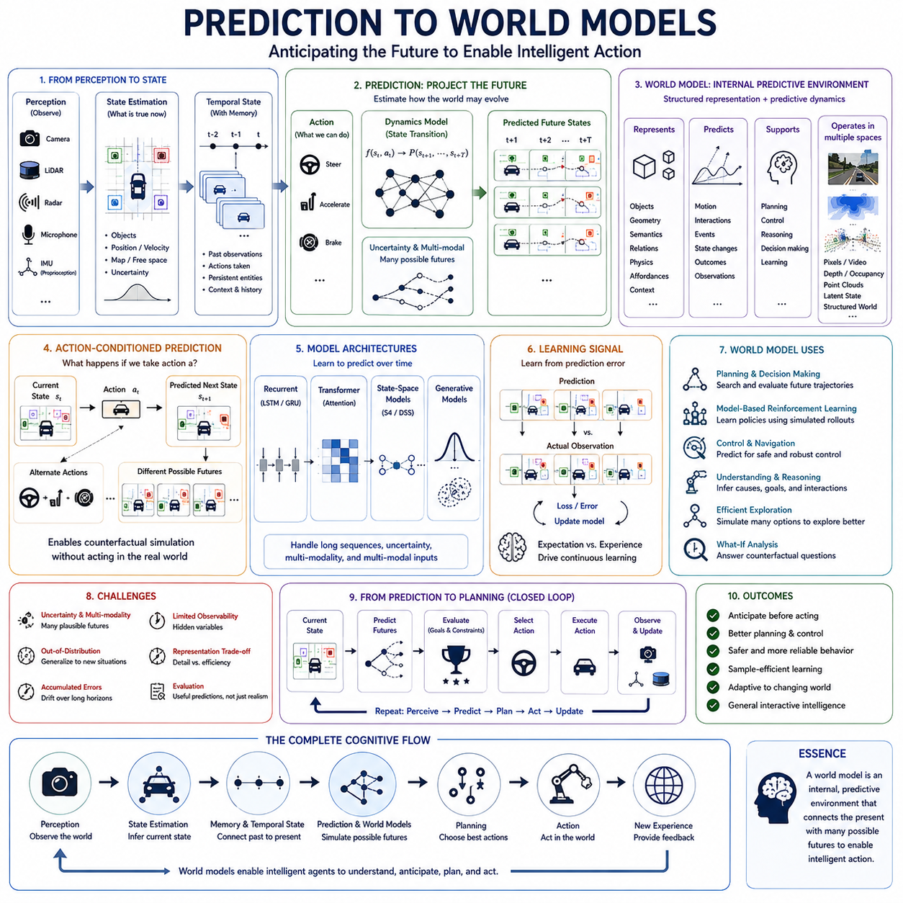{width="7.268055555555556in" height="7.268055555555556in"}

예측(Prediction)은 효과적인 행동을 위해 사건이 발생하기 전에 앞으로 어떤 일이 일어날지를 예상해야 한다는 점에서 지능(Intelligence)의 핵심적인 능력입니다. 지각(Perception)은 현재의 관측을 설명하고, 상태 추정(State Estimation)은 현재 무엇이 사실일 가능성이 높은지를 추론하며, 시간적 기억(Temporal Memory)은 현재가 과거로부터 어떻게 형성되었는지를 설명합니다. 예측은 이러한 인지적 연속성을 미래로 확장하여 서로 다른 조건과 행동에 따라 상태, 객체, 에이전트, 환경이 어떻게 변화할 수 있는지를 추정합니다.

단순한 예측(Simple Prediction)은 객체의 위치, 로봇의 속도 또는 특정 사건의 발생 확률과 같은 미래의 특정 변수를 추정할 수 있습니다. 월드 모델(World Model)은 여기에서 더 나아가 환경의 여러 측면 사이의 관계를 표현하고 이들이 시간에 따라 어떻게 함께 변화하는지를 모델링합니다. 따라서 월드 모델은 지능형 에이전트가 실제 세계와 물리적으로 상호작용하기 전에 가능한 미래를 내부적으로 평가할 수 있도록 하는 내부 예측 구조(Internal Predictive Structure)를 제공합니다.

예측에서 월드 모델링(World Modeling)으로의 전환은 상태 표현(State Representation)에서 시작됩니다. 원시 감각 관측(Raw Sensory Observation)은 일반적으로 차원이 매우 높고, 잡음이 많으며, 불완전하기 때문에 장기적인 추론(Long-Horizon Reasoning)에 직접 사용하기 어렵습니다. 지각과 상태 추정은 이러한 관측을 관련 정보가 포함된 구조적 상태(Structured State) 또는 잠재 상태(Latent State)로 변환합니다. 이후 예측 모델(Predictive Model)은 시간 t의 상태가 미래의 하나 또는 여러 가능한 상태로 어떻게 전이될 수 있는지를 학습합니다.

행동(Action)은 이러한 전환에서 필수적입니다. 지능적인 예측은 단순히 환경이 독립적으로 어떻게 변화할지를 예보하는 것만을 의미하지 않기 때문입니다. 에이전트는 특정 행동을 수행했을 때 어떤 일이 발생할지를 예측해야 합니다. 따라서 월드 모델은 일반적으로 현재 상태(Current State), 후보 행동(Candidate Action), 예측된 다음 상태(Predicted Next State)를 연결하는 행동 조건부 동역학(Action-Conditioned Dynamics)을 표현합니다. 이를 통해 계획, 제어, 목표 지향적 의사결정을 지원할 수 있는 내부 결과 모델(Internal Model of Consequences)이 형성됩니다.

동역학 모델(Dynamics Model)은 많은 월드 모델 아키텍처(World Model Architecture)의 예측 핵심을 구성합니다. 동역학 모델은 환경의 동역학, 에이전트의 행동, 객체 사이의 상호작용에 따라 상태가 어떻게 변화하는지를 근사합니다. 일부 모델은 바로 다음 상태만 예측하지만, 다른 모델은 여러 단계에 걸친 미래 시퀀스(Future Sequence)를 생성합니다. 재귀적 예측(Recursive Prediction)은 장기적인 내부 시뮬레이션을 가능하게 하지만, 작은 오류가 반복적인 상태 전이를 거치면서 누적되어 결국 비현실적인 예측 궤적(Predicted Trajectory)을 생성할 수 있습니다.

현재 상태만으로 미래가 완전히 결정되는 경우는 드물기 때문에 예측에는 본질적으로 불확실성(Uncertainty)이 존재합니다. 다른 에이전트가 서로 다른 결정을 내릴 수 있고, 숨겨진 변수(Hidden Variable)가 사건에 영향을 줄 수 있으며, 센서가 불완전한 증거만을 제공할 수도 있습니다. 따라서 유용한 월드 모델은 항상 하나의 결정론적 결과(Deterministic Outcome)를 생성하기보다 여러 개의 가능한 미래 또는 확률분포(Probability Distribution)를 표현할 수 있어야 합니다. 다중양식 예측(Multimodal Prediction)은 복잡한 인간 및 로봇 환경에서 특히 중요합니다.

시간적 추상화(Temporal Abstraction)는 서로 다른 예측 시간 범위(Prediction Horizon)를 관리하는 데 도움이 됩니다. 단기 모델(Short-Term Model)은 즉각적인 움직임, 충돌 또는 제어와 관련된 동역학에 집중할 수 있는 반면, 장기 모델(Long-Term Model)은 사건, 목표, 상호작용 또는 작업 진행 상태를 표현할 수 있습니다. 계층적 월드 모델(Hierarchical World Model)은 이러한 시간 척도를 조직하여 저수준 동역학은 빠른 물리적 변화를 예측하고, 고수준 표현은 계획에 중요한 느린 의미적 또는 행동적 전이(Semantic or Behavioral Transition)를 포착하도록 할 수 있습니다.

월드 모델은 다양한 표현 공간(Representation Space)에서 작동할 수 있습니다. 일부 모델은 미래 픽셀, 비디오 프레임, 깊이 지도(Depth Map), 점유 상태(Occupancy), 포인트 클라우드(Point Cloud) 또는 다른 감각 관측을 예측합니다. 다른 모델은 데이터로부터 학습한 압축된 잠재 표현(Latent Representation)을 예측합니다. 구조화된 접근법(Structured Approach)은 객체, 기하학(Geometry), 관계, 의미(Semantics), 물리적 속성을 명시적으로 표현할 수도 있습니다. 적절한 표현 방식은 목표가 시각 생성, 제어, 계획, 추론 또는 범용 상호작용인지에 따라 달라집니다.

잠재 월드 모델(Latent World Model)은 감각 환경의 모든 세부사항을 다시 생성할 필요가 없기 때문에 특히 매력적입니다. 예를 들어 에이전트는 특정 경로가 계속 통행 가능한지를 판단하기 위해 벽의 정확한 질감(Texture)까지 예측할 필요는 없습니다. 의사결정에 관련된 정보를 보존하는 압축 표현(Compressed Representation)을 학습하면 잠재 동역학 모델(Latent Dynamics Model)은 더욱 효율적으로 예측을 수행할 수 있습니다. 그러나 지나친 압축은 이후 안전이나 작업 수행에 중요해지는 세부 정보를 제거할 위험이 있습니다.

현대 신경망 아키텍처(Neural Architecture)는 예측형 세계 표현(Predictive World Representation)을 학습하기 위한 다양한 메커니즘을 제공합니다. 순환 신경망(Recurrent Network)은 변화하는 은닉 상태(Hidden State)를 유지하고, 트랜스포머(Transformer)는 어텐션(Attention)을 통해 장거리 의존성(Long-Range Dependency)을 모델링하며, 상태 공간 모델(State-Space Model)은 긴 시간 시퀀스를 효율적으로 처리합니다. 생성 모델(Generative Model)은 가능한 미래에 대한 분포를 표현할 수 있습니다. 이러한 접근법은 멀티모달 월드 모델(Multimodal World Model)에서 시각, 언어, 기하학, 고유수용성 정보(Proprioceptive Information), 행동 정보를 결합할 수 있습니다.

자기지도학습(Self-Supervised Learning)은 시간적 데이터 자체가 학습 신호를 제공하기 때문에 월드 모델 학습에 자연스럽게 적합합니다. 시스템은 시퀀스를 관찰하고, 이전 관측을 이용하여 이후의 상태 또는 표현을 예측한 다음, 실제로 발생한 결과와 예측을 비교할 수 있습니다. 따라서 대량의 레이블 없는 비디오, 로봇 궤적(Robot Trajectory), 주행 로그(Driving Log), 시뮬레이션(Simulation), 멀티모달 센서 스트림(Multimodal Sensor Stream)을 활용하여 모든 프레임에 상세한 인간 주석(Human Annotation)을 제공하지 않고도 예측 학습을 수행할 수 있습니다.

예측 오류(Prediction Error)는 중요한 학습 신호를 제공합니다. 예측된 미래가 이후 실제 관측과 다를 경우 모델은 자신의 표현이나 동역학을 업데이트할 수 있습니다. 이는 기대(Expectation)와 경험(Experience)을 비교하는 지속적인 학습 원리를 형성합니다. 예측 오류는 인지적으로도 중요한 의미를 가지는데, 예상하지 못한 사건은 지식의 부족, 환경의 변화, 잘못된 가정 또는 더 높은 주의와 추가 관측이 필요한 상황을 나타낼 수 있기 때문입니다.

반사실적 예측(Counterfactual Prediction)은 월드 모델을 가장 가능성이 높은 미래를 예보하는 수준 이상으로 확장합니다. 지능형 에이전트는 아직 실행하지 않은 행동을 수행했을 경우 어떤 일이 발생할지를 내부적으로 질문할 수 있습니다. 여러 대안적 행동 시퀀스(Alternative Action Sequence)를 내부적으로 시뮬레이션하면 시스템은 모든 선택지를 실제 세계에서 물리적으로 시험하지 않고도 가능한 결과를 비교할 수 있습니다. 이러한 능력은 예측 모델링을 계획(Planning), 모델 기반 강화학습(Model-Based Reinforcement Learning), 의사결정, 효율적인 탐색(Exploration)과 직접 연결합니다.

따라서 계획은 월드 모델이 생성하거나 평가한 미래에 대한 탐색(Search over Futures)으로 이해할 수 있습니다. 추정된 현재 상태에서 시작하여 에이전트는 후보 행동들을 고려하고, 그 결과를 예측하며, 목표와 제약조건에 따라 미래 상태를 평가한 다음, 유망한 행동 시퀀스를 선택합니다. 행동을 실행한 후에는 새로운 관측을 통해 상태 추정이 갱신되고 계획 과정이 다시 반복됩니다. 이를 통해 폐루프 지각-예측-행동 과정(Closed Perception-Prediction-Action Loop)이 형성됩니다.

피지컬 AI(Physical AI)에서 월드 모델은 물리적 상호작용에 기반한 결과를 포착해야 합니다. 로봇은 움직임, 객체의 행동, 주행 가능성(Traversability), 접촉(Contact), 인간의 움직임, 환경 변화, 그리고 자신의 행동이 만들어내는 영향을 예측해야 합니다. 성공적인 행동이 의미(Semantics), 어포던스(Affordance), 동역학, 불확실성, 작업 문맥(Task Context)에 의존하는 경우 기하학적 정보만으로는 충분하지 않습니다. 따라서 물리적 월드 모델(Physical World Model)은 점점 더 멀티모달 및 행동 조건부 표현(Action-Conditioned Representation)을 필요로 합니다.

주요 과제 가운데 하나는 학습 분포(Training Distribution)를 벗어난 환경에서도 정확성을 유지하는 것입니다. 월드 모델은 익숙한 환경에서는 미래를 잘 예측하지만 비정상적인 지형, 새로운 객체, 예상하지 못한 인간 행동 또는 이전에 경험하지 못한 물리적 상호작용에서는 실패할 수 있습니다. 따라서 예측 신뢰도(Prediction Confidence)와 불확실성 추정(Uncertainty Estimation)이 매우 중요합니다. 시스템은 내부 시뮬레이션의 신뢰성이 낮을 때 이를 인식하고 추가 관측을 확보하거나, 속도를 낮추거나, 재계획(Replanning)하거나, 도움을 요청할 수 있어야 합니다.

또 다른 중요한 과제는 예측의 유용성(Predictive Usefulness)과 시각적 사실성(Visual Realism)을 구분하는 것입니다. 생성된 미래가 시각적으로 매우 그럴듯해 보이더라도 기하학, 동역학, 인과관계(Causality), 객체 행동을 잘못 표현할 수 있습니다. 지능적인 행동을 위해서는 월드 모델이 단순히 사실적으로 보이는 결과를 생성하는지가 아니라 그 예측이 올바른 의사결정을 지원하는지를 중심으로 평가해야 합니다. 따라서 평가는 예측 품질을 후속 계획, 제어, 안전(Safety), 작업 성능(Task Performance)과 연결해야 합니다.

예측에서 월드 모델로의 더 넓은 인지적 전환은 단순한 미래 예보를 내부 시뮬레이션(Internal Simulation)으로 변화시킵니다. 지능 시스템은 관측된 사건에만 반응하는 대신 지속적으로 변화하는 세계 표현을 유지하고, 이를 가능한 미래로 투영하며, 그 결과를 평가하고, 실제 물리적 행동을 실행하기 전에 자신의 행동을 수정할 수 있습니다. 이는 지각, 기억, 시간적 상태, 동역학, 추론, 계획, 학습을 하나의 통합된 예측 아키텍처(Unified Predictive Architecture) 안에서 연결합니다.

따라서 월드 모델(World Model)은 적응적 지능(Adaptive Intelligence)과 체화 지능(Embodied Intelligence)으로 발전하는 과정에서 중심적인 위치를 차지합니다. 지각은 현재에 대한 증거를 제공하고, 기억은 과거로부터의 연속성을 제공하며, 상태 추정은 현재의 내부 표현을 구성하고, 예측은 미래를 탐색합니다. 이러한 능력이 행동 및 피드백(Feedback)과 통합되면 월드 모델은 에이전트가 세계를 이해하고, 예상하고, 계획하며, 행동할 수 있도록 하는 내부 예측 환경(Internal Predictive Environment)이 됩니다.

## 07.12 Mental Simulation to AI Planning [w/Code]

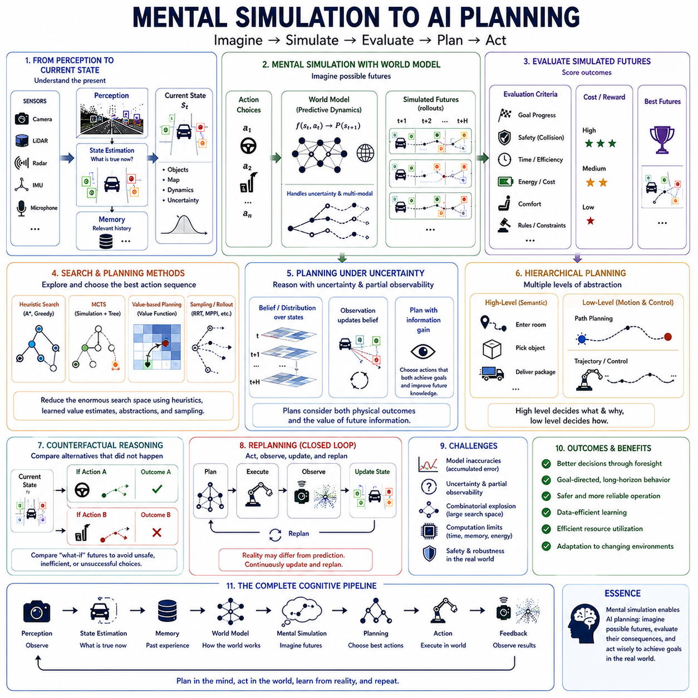{width="7.268055555555556in" height="7.268055555555556in"}

정신적 시뮬레이션(Mental Simulation)은 외부 세계에서 실제 행동을 실행하기 전에 가능한 상황을 내부적으로 탐색하는 능력입니다. 인간은 각각의 선택을 실제로 실행하지 않고도 대안 경로를 상상하고, 결과를 예상하며, 움직임을 머릿속으로 연습하고, 가능한 의사결정을 비교합니다. 인공지능 계획(AI Planning)은 현재 조건, 가능한 행동, 예측된 결과, 목표, 제약조건을 내부 의사결정 과정(Internal Decision Process)에서 표현함으로써 이와 관련된 계산 원리를 구현합니다.

이러한 능력은 예측(Prediction)과 월드 모델링(World Modeling)으로부터 자연스럽게 확장됩니다. 예측은 세계가 어떻게 변화할 수 있는지를 추정하고, 월드 모델(World Model)은 환경과 그 동역학(Dynamics)에 대한 내부 표현을 제공합니다. 정신적 시뮬레이션은 이러한 예측 구조를 반복적으로 사용하여 가상의 미래(Hypothetical Future)를 구성합니다. 이후 계획은 시뮬레이션된 미래를 평가하고 어떤 행동 시퀀스가 시스템을 원하는 목표로 가장 효과적으로 이동시킬 가능성이 높은지를 결정합니다.

계획 과정(Planning Process)은 현재 상태(Current State)에 대한 추정에서 시작합니다. 지각(Perception)은 관측을 제공하고, 기억(Memory)은 관련된 과거 이력을 제공하며, 상태 추정(State Estimation)은 현재 무엇이 사실이라고 판단되는지에 대한 표현을 구성합니다. 목표(Goal)는 원하는 미래 조건을 지정하고, 제약조건(Constraint)은 허용할 수 없거나 불가능한 결과를 정의합니다. 계획은 현재 상태를 목표를 더 잘 만족시키는 상태로 변환할 수 있는 행동을 탐색함으로써 이러한 요소들을 연결합니다.

정신적 시뮬레이션에는 특정 행동을 수행하면 어떤 일이 발생할 것인가와 같은 조건부 질문(Conditional Question)에 답할 수 있는 내부 모델(Internal Model)이 필요합니다. 하나의 상태와 후보 행동(Candidate Action)이 주어지면 모델은 가능한 다음 상태를 예측합니다. 이렇게 예측된 상태는 다시 다른 시뮬레이션 행동의 시작점이 될 수 있습니다. 이러한 과정을 반복하면 실제로 행동을 수행하지 않고도 현재에서 여러 가능한 미래로 확장되는 가상의 궤적(Imagined Trajectory)을 생성할 수 있습니다.

이는 분기형 탐색 문제(Branching Search Problem)를 형성합니다. 각각의 시뮬레이션 상태에서 에이전트(Agent)는 여러 가능한 행동을 선택할 수 있으며, 각 행동은 서로 다른 결과로 이어질 수 있습니다. 따라서 계획 시간 범위(Planning Horizon)가 길어질수록 가능한 궤적의 수는 매우 빠르게 증가할 수 있습니다. 복잡한 환경에서는 모든 가능성을 완전하게 조사할 수 없으므로 지능 시스템은 유망한 대안에 계산을 집중하기 위한 탐색 전략(Search Strategy), 휴리스틱(Heuristic), 학습된 가치 추정(Learned Value Estimate), 추상화(Abstraction), 샘플링 방법(Sampling Method)을 필요로 합니다.

고전적 인공지능 계획(Classical AI Planning)은 명시적인 상태, 행동, 상태 전이 규칙(Transition Rule), 목표, 비용을 이용하여 이러한 원리를 보여줍니다. 탐색 알고리즘(Search Algorithm)은 상태 공간(State Space)을 탐색하고 사전에 정의된 목표를 만족시키는 행동 시퀀스를 찾아낼 수 있습니다. 휴리스틱 탐색(Heuristic Search)과 같은 방법은 어떤 상태가 목표에 더 가까운지를 추정함으로써 불필요한 탐색을 줄입니다. 이러한 접근법은 계획 과정에서 표현, 전이, 평가, 탐색을 명확하게 분리하여 보여준다는 점에서 여전히 개념적으로 중요합니다.

불확실성 하의 계획(Planning under Uncertainty)은 행동이 항상 결정론적 결과(Deterministic Outcome)를 만들어내는 것은 아니며 현재 상태 자체도 불확실할 수 있기 때문에 더욱 어렵습니다. 따라서 계획기는 하나의 확정된 상태 대신 확률분포(Probability Distribution)나 믿음 상태(Belief State)를 대상으로 추론할 수 있습니다. 미래의 관측 또한 새로운 정보를 제공하여 이후의 의사결정을 변화시킬 수 있습니다. 따라서 계획은 행동의 물리적 결과뿐 아니라 미래의 지식에 미치는 영향까지 고려하면서 행동을 선택하는 과정이 됩니다.

모델 기반 강화학습(Model-Based Reinforcement Learning)은 학습된 월드 모델과 행동 선택(Action Selection)을 연결합니다. 에이전트는 직접적인 시행착오(Trial and Error)만을 통해 행동을 학습하는 대신 환경 동역학(Environmental Dynamics)의 모델을 이용하여 가능한 상태 전이를 내부적으로 시뮬레이션할 수 있습니다. 시뮬레이션 롤아웃(Simulated Rollout)을 사용하면 시스템은 장기적인 수익(Long-Term Return)을 추정하고, 정책(Policy)을 비교하며, 실제 환경에서 요구되는 비용이 높거나 위험하거나 시간이 많이 소요되는 상호작용 횟수를 줄이면서 의사결정을 개선할 수 있습니다.

몬테카를로 트리 탐색(Monte Carlo Tree Search)은 시뮬레이션과 탐색을 결합할 수 있는 방법을 보여줍니다. 가능한 모든 미래를 동일한 수준으로 확장하는 대신, 알고리즘은 유망한 분기(Branch)를 선택적으로 탐색하고, 시뮬레이션 롤아웃을 수행하고, 결과를 평가하며, 이전 의사결정과 연결된 추정값을 갱신합니다. 반복적인 시뮬레이션을 통해 계산 자원은 점차 더 높은 가치가 있을 것으로 예상되는 행동에 집중되며, 이를 통해 내부적 상상(Internal Imagination)과 순차적 의사결정(Sequential Decision Making) 사이의 실용적인 연결이 형성됩니다.

학습된 가치 함수(Learned Value Function)는 시뮬레이션의 범위를 제한하기 위한 또 다른 메커니즘을 제공합니다. 최종 목표에 도달할 때까지 모든 미래 단계를 예측하는 대신 시스템은 중간 상태(Intermediate State)의 예상 가치(Expected Desirability)를 추정할 수 있습니다. 이후 계획은 제한된 시간 범위만을 시뮬레이션하고 가치 추정치를 사용하여 그 이후의 미래를 근사할 수 있습니다. 이러한 명시적 예측(Explicit Prediction)과 학습된 평가(Learned Evaluation)의 결합은 장기 계획(Long-Horizon Planning)에 필요한 계산 부담을 크게 줄일 수 있습니다.

계층적 계획(Hierarchical Planning)은 여러 추상화 수준에서 의사결정을 조직함으로써 복잡성을 더욱 감소시킵니다. 고수준 계획기(High-Level Planner)는 방에 들어가기, 객체 가져오기, 물품 배송하기와 같은 의미적 목표(Semantic Goal)를 선택할 수 있으며, 저수준 계획기(Low-Level Planner)는 경로, 움직임, 제어 명령(Control Command)을 결정합니다. 따라서 정신적 시뮬레이션은 전체 작업 시간 범위에 걸쳐 모든 물리적 세부사항을 예측하는 대신 서로 다른 시간적 및 표현적 척도(Representational Scale)에서 작동할 수 있습니다.

반사실적 추론(Counterfactual Reasoning)은 계획 과정의 핵심입니다. 계획은 아직 실제로 발생하지 않은 미래를 다루기 때문입니다. 시스템은 본질적으로 "행동 A를 수행하면 이러한 일이 발생할 수 있고, 행동 B를 수행하면 다른 일이 발생할 수 있다"와 같은 조건들을 비교해야 합니다. 이러한 내부 비교(Internal Comparison)를 통해 지능형 에이전트는 실제 행동을 수행하기 전에 안전하지 않거나, 비효율적이거나, 실패 가능성이 높은 대안을 제거할 수 있으며, 예측 모델을 의사결정에 직접 활용할 수 있습니다.

계획은 단순히 작업 성공(Task Success) 여부만 평가해서는 안 됩니다. 실제 시스템은 안전(Safety), 시간, 에너지, 불확실성, 충돌 위험(Collision Risk), 자원 소비(Resource Consumption), 사회적 규칙(Social Rule), 운영 요구사항(Operational Requirement)과 관련된 다양한 제약조건 아래에서 작동합니다. 따라서 후보 미래(Candidate Future)에는 여러 목표를 나타내는 비용(Cost)이나 보상(Reward)을 부여할 수 있습니다. 계획기는 단순히 명목상의 목표에 도달하는 아무 궤적이나 선택하는 것이 아니라 이러한 요소 사이의 균형을 고려하여 행동을 선택합니다.

재계획(Replanning)은 내부 시뮬레이션이 완벽하게 정확할 수 없기 때문에 필수적입니다. 행동을 실행한 후 실제로 관측된 결과는 모델링 오류(Modeling Error), 외란(Disturbance), 숨겨진 변수(Hidden Variable), 환경 변화로 인해 예측된 결과와 다를 수 있습니다. 시스템은 자신의 상태 추정을 갱신하고 수정된 계획을 다시 구성해야 합니다. 따라서 지능적 계획(Intelligent Planning)은 일반적으로 행동을 시작하기 전에 한 번만 수행하는 계산이 아니라 지속적인 폐루프 과정(Closed-Loop Process)입니다.

체화 인공지능(Embodied AI)과 피지컬 AI(Physical AI)에서 정신적 시뮬레이션은 물리적 실행 가능성(Physical Feasibility)에 기반해야 합니다. 로봇은 어떤 행동이 의미적으로 적절해 보인다는 이유만으로 해당 행동을 선택할 수 없습니다. 행동은 기하학(Geometry), 동역학(Dynamics), 접촉 조건(Contact Condition), 액추에이터 한계(Actuator Limit), 안정성(Stability), 주행 가능성(Traversability), 안전 여유(Safety Margin)를 만족해야 합니다. 따라서 계획은 고수준 추론(High-Level Reasoning)을 모션 계획(Motion Planning) 및 제어(Control)와 연결하여 추상적인 목표를 물리적으로 실행 가능한 행동으로 변환합니다.

월드 모델(World Model)은 수작업으로 설계된 규칙만으로 표현하기 어려운 상황에 대한 학습된 예측(Learned Prediction)을 제공함으로써 이러한 과정을 강화할 수 있습니다. 로봇은 지형이 움직임에 어떤 영향을 주는지, 객체가 조작에 어떻게 반응하는지, 인간이 공유 공간에서 어떻게 움직이는지, 자신의 행동이 미래의 관측을 어떻게 변화시키는지를 학습할 수 있습니다. 이러한 학습된 동역학(Learned Dynamics)은 계획이 데이터에서 얻은 경험을 활용하면서도 행동을 실행하기 전에 여러 대안을 평가할 수 있도록 합니다.

그러나 시뮬레이션 품질(Simulation Quality)은 계획 품질(Planning Quality)의 근본적인 한계를 결정합니다. 월드 모델이 행동의 결과를 잘못 예측한다면 계획기는 내부적으로는 최적이라고 판단되는 행동 시퀀스를 선택하더라도 실제 환경에서는 실패할 수 있습니다. 긴 시뮬레이션 궤적은 예측 오류가 누적되기 때문에 특히 취약합니다. 따라서 계획 시스템에는 불확실성 추정(Uncertainty Estimation), 보수적인 제약조건(Conservative Constraint), 빈번한 관측 갱신, 그리고 상상된 미래가 신뢰할 수 없게 되었는지를 탐지하는 메커니즘이 필요합니다.

계산(Computation) 자체도 지능적 계획의 일부가 됩니다. 더 많은 시뮬레이션은 의사결정을 개선할 수 있지만 계획 시간, 메모리, 에너지는 제한되어 있습니다. 에이전트는 얼마나 깊이 탐색할 것인지, 얼마나 많은 대안을 고려할 것인지, 그리고 추가적인 추론이 그 계산 비용을 정당화하지 못하는 시점이 언제인지를 판단해야 합니다. 이는 계획과 메타인지(Metacognition) 사이의 연결을 형성합니다. 지능적 행동에는 불확실성, 위험, 작업 난이도에 따라 계산 자원(Computational Resource)을 적절하게 할당하는 능력도 포함되기 때문입니다.

따라서 정신적 시뮬레이션에서 인공지능 계획으로의 전환은 예측을 목적 지향적인 의사결정(Purposeful Decision Making)으로 변화시킵니다. 월드 모델은 가능한 미래를 제공하고, 시뮬레이션은 대안적 궤적(Alternative Trajectory)을 탐색하며, 평가는 그 결과를 비교하고, 계획은 목표와 제약조건에 따라 행동을 선택합니다. 이후 실행(Execution)은 새로운 증거를 생성함으로써 상상된 결과(Imagined Outcome)와 실제 물리적 경험(Physical Experience) 사이의 폐루프를 완성합니다.

지능형 에이전트(Intelligent Agent)의 더 넓은 인지 아키텍처(Cognitive Architecture)에서 이러한 과정은 지각, 기억, 시간적 상태(Temporal State), 예측, 추론, 의사결정, 행동을 서로 연결합니다. 에이전트는 각각의 관측에 직접 반응하는 대신 세계를 실제로 변화시키기 전에 가능한 선택지를 내부적으로 시험할 수 있습니다. 따라서 정신적 시뮬레이션(Mental Simulation)은 예측형 월드 모델(Predictive World Model)이 점점 더 적응적이고, 장기적이며, 목표 지향적인 행동(Goal-Directed Behavior)을 수행할 수 있는 실용적인 계획 시스템으로 발전하도록 연결하는 인지적 가교(Cognitive Bridge)를 제공합니다.

## 07.13 Cognitive Loops to Physical AI [w/Code]

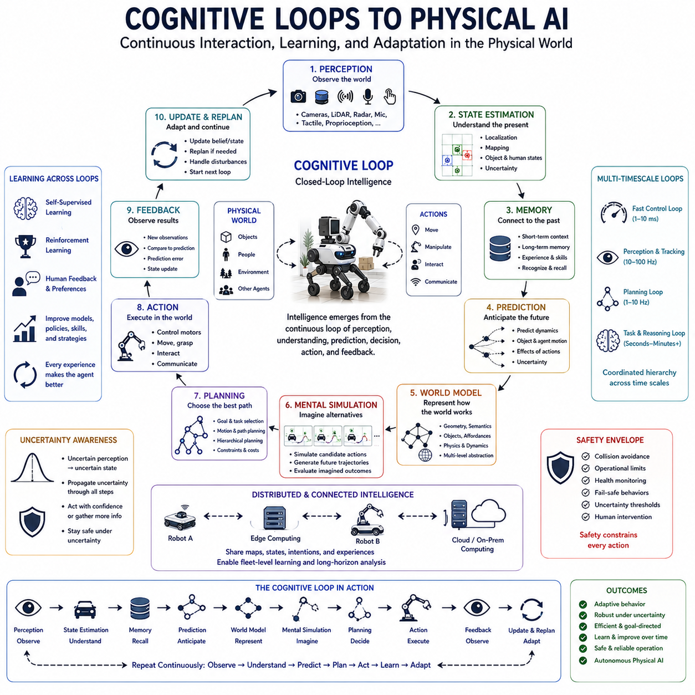{width="7.268055555555556in" height="7.268055555555556in"}

인지 루프(Cognitive Loop)는 지능(Intelligence)을 지각에서 행동으로 이어지는 일방향적인 과정이 아니라 지속적으로 반복되는 순환 과정(Continuous Cycle)으로 설명합니다. 지능형 에이전트(Intelligent Agent)는 환경을 관측하고, 내부 상태(Internal State)를 구성하며, 관련 경험을 회상하고, 가능한 미래를 예측하고, 행동을 선택한 다음, 그 결과로 발생한 변화를 관측하여 자신의 이해를 갱신합니다. 피지컬 AI(Physical AI)는 이러한 인지 루프를 계산과 물리적 세계가 지속적으로 상호작용하는 체화된 과정(Embodied Process)으로 전환합니다.

인지 루프는 지각(Perception)에서 시작합니다. 카메라(Camera), 라이다(LiDAR), 레이더(Radar), 마이크(Microphone), 촉각 센서(Tactile Sensor), 고유수용감각(Proprioception) 및 기타 센싱 시스템(Sensing System)은 환경에 대한 관측을 생성합니다. 이러한 측정값은 불완전하고 잡음(Noise)이 포함되어 있으며 관측 시점과 환경 조건에 영향을 받습니다. 따라서 지각은 원시 센서 값을 현실에 대한 완전한 설명으로 취급하는 대신 객체, 기하학(Geometry), 움직임, 의미(Semantics), 인간 활동, 환경 특성과 같은 유용한 구조를 추출합니다.

상태 추정(State Estimation)은 이러한 관측을 현재 상황에 대한 행동 가능한 표현(Actionable Representation)으로 변환합니다. 시스템은 자신의 위치, 자세(Orientation), 속도, 주변 객체, 자유 공간(Free Space), 지형, 인간의 위치, 불확실성(Uncertainty) 등을 추정할 수 있습니다. 환경은 부분적으로만 관측 가능하기 때문에 현재 측정값은 이전 추정값 및 예측적 가정(Predictive Assumption)과 결합되어야 합니다. 그 결과 생성되는 상태는 에이전트가 현재 자신과 주변 세계에 대해 무엇이 사실이라고 믿고 있는지를 표현합니다.

기억(Memory)은 인지 루프가 시간에 걸쳐 연속성을 유지할 수 있도록 합니다. 최근 관측은 단기적인 시간적 문맥(Temporal Context)을 지원하고, 축적된 경험은 이전 상태, 행동, 결과, 환경 지식(Environmental Knowledge), 학습된 기술(Learned Skill)을 보존할 수 있습니다. 기억을 통해 에이전트는 지속적으로 존재하는 객체를 인식하고, 일시적으로 보이지 않는 위치를 기억하며, 작업 진행 상태를 추적하고, 이전의 해결책을 다시 활용하며, 과거에 발생한 사건을 바탕으로 새로운 관측을 해석할 수 있습니다.

예측(Prediction)은 내부 상태를 가능한 미래로 확장합니다. 물리적 환경에는 움직이는 에이전트, 변화하는 조건, 지연된 결과(Delayed Consequence), 그리고 정적인 지각만으로 결과를 결정할 수 없는 상호작용이 존재합니다. 예측 모델(Predictive Model)은 객체, 환경, 로봇 자체가 어떻게 변화할 수 있는지를 추정합니다. 예측이 후보 행동(Candidate Action)에 따라 달라지도록 구성되면 시스템은 자연스럽게 발생할 수 있는 사건뿐 아니라 자신의 개입(Intervention)으로 인해 어떤 일이 발생할 수 있는지도 예상할 수 있습니다.

월드 모델(World Model)은 이러한 예측 관계를 환경 동역학(Environmental Dynamics)의 내부 표현으로 통합합니다. 월드 모델은 서로 다른 추상화 수준에서 기하학, 의미, 객체, 어포던스(Affordance), 움직임, 물리적 속성, 에이전트 행동, 불확실성을 인코딩할 수 있습니다. 유용한 피지컬 AI 월드 모델은 단순한 시각 생성기(Visual Generator)로 기능하는 것이 아니라 내비게이션(Navigation), 조작(Manipulation), 상호작용, 안전(Safety), 작업 완료(Task Completion)에 중요한 결과를 예측함으로써 의사결정을 지원합니다.

정신적 시뮬레이션(Mental Simulation)은 월드 모델을 이용하여 실제 물리적 실행 전에 여러 대안을 탐색합니다. 추정된 현재 상태에서 출발하여 에이전트는 후보 행동을 시뮬레이션하고 가능한 미래 궤적(Future Trajectory)을 생성할 수 있습니다. 이러한 상상된 결과(Imagined Outcome)는 목표 진행도(Goal Progress), 안전, 에너지, 시간, 위험(Risk), 운영 제약조건(Operational Constraint)을 기준으로 비교할 수 있습니다. 따라서 내부 시뮬레이션(Internal Simulation)은 비용이 많이 들거나 위험한 대안을 실제 환경에서 시험하기 전에 제거할 수 있도록 합니다.

계획(Planning)은 이러한 시뮬레이션된 가능성을 목표 지향적 행동(Goal-Directed Behavior)으로 변환합니다. 고수준 계획(High-Level Planning)은 어떤 작업이나 하위 목표(Subgoal)를 수행할지를 결정할 수 있으며, 모션 계획(Motion Planning)은 실행 가능한 궤적을 결정하고, 제어 시스템(Control System)은 실제로 실행 가능한 명령을 생성합니다. 계층적 구조(Hierarchical Organization)는 의미적 추론(Semantic Reasoning)을 물리적 움직임과 연결하여 물체를 배송하라는 추상적인 명령이 내비게이션, 위치추정(Localization), 조작, 상호작용의 연속적인 행동으로 변환될 수 있도록 합니다.

행동(Action)은 물리적 세계를 변화시킴으로써 내부 추론 과정을 마무리합니다. 모터는 움직임을 생성하고, 매니퓰레이터(Manipulator)는 접촉력을 발생시키며, 차량은 위치를 변경하고, 통신이나 상호작용은 인간과 다른 에이전트에 영향을 미칠 수 있습니다. 순수한 디지털 AI와 달리 피지컬 AI는 질량, 마찰(Friction), 관성(Inertia), 액추에이터 한계(Actuator Limit), 에너지, 지형, 안정성(Stability), 충돌, 지연시간(Latency), 기계적 불확실성(Mechanical Uncertainty)과 같은 물리적 제약을 따라야 합니다. 따라서 지능은 실제로 실행 가능한 물리 법칙에 기반해야 합니다.

행동의 결과는 새로운 감각적 증거(Sensory Evidence)를 생성합니다. 로봇은 자신이 예상한 대로 이동했는지, 객체가 올바르게 반응했는지, 사람이 이동 방향을 변경했는지, 또는 환경에서 예상하지 못한 외란(Disturbance)이 발생했는지를 관측합니다. 이러한 관측은 기존 예측과 비교되어 예측 오류(Prediction Error)와 상태 보정(State Correction)을 발생시킵니다. 이후 인지 루프는 행동을 실행하기 전에 가정했던 상태가 아니라 현실에 맞게 갱신된 표현을 이용하여 다음 반복 과정을 시작합니다.

이러한 피드백 구조(Feedback Structure)는 피지컬 AI를 본질적으로 폐루프(Closed-Loop) 시스템으로 만듭니다. 순수한 개루프 시스템(Open-Loop System)은 결과를 지속적으로 확인하지 않고 사전에 결정된 명령 시퀀스를 실행할 수 있습니다. 반면 인지적 물리 에이전트(Cognitive Physical Agent)는 관측(Observe), 추정(Estimate), 기억(Remember), 예측(Predict), 계획(Plan), 행동(Act), 그리고 다시 관측하는 과정을 반복합니다. 지속적인 피드백(Continuous Feedback)은 시스템이 불확실성, 외란, 모델 오류(Model Error), 환경 변화, 예상하지 못한 사건을 보정할 수 있도록 합니다.

현실이 내부의 예상과 크게 달라질 때마다 재계획(Replanning)이 필요합니다. 차단된 경로, 움직이는 장애물, 휠 슬립(Wheel Slip), 파지 실패(Failed Grasp), 예상하지 못한 인간 행동, 센서 성능 저하(Sensor Degradation)는 기존 계획을 무효화할 수 있습니다. 에이전트는 기존 계획을 맹목적으로 계속 수행하는 대신 상태를 갱신하고, 불확실성을 다시 평가하고, 새로운 예측을 생성하여 다른 행동을 선택해야 합니다. 따라서 강건한 자율성(Robust Autonomy)은 처음부터 올바른 계획을 생성하는 능력만큼이나 실패 복구(Recovery)와 적응(Adaptation)에 의존합니다.

학습(Learning)은 반복되는 인지 루프 전체에 걸쳐 작동합니다. 각각의 상호작용은 관측, 추정 상태, 행동, 예측, 결과, 오류, 피드백을 포함하는 경험(Experience)을 생성합니다. 이러한 경험은 지각, 동역학 모델(Dynamics Model), 정책(Policy), 가치 추정(Value Estimate), 계획 전략(Planning Strategy)을 개선하는 데 활용될 수 있습니다. 자기지도학습(Self-Supervised Learning)은 시간적 일관성(Temporal Consistency)을 활용할 수 있고, 강화학습(Reinforcement Learning)은 작업 결과를 이용할 수 있으며, 인간 피드백(Human Feedback)은 물리적 보상만으로 표현하기 어려운 선호를 제공할 수 있습니다.

여러 개의 인지 루프는 서로 다른 시간 척도(Timescale)에서 동시에 작동할 수 있습니다. 빠른 제어 루프(Control Loop)는 밀리초 단위로 움직임을 안정화할 수 있고, 지각 및 추적 루프(Tracking Loop)는 초당 여러 차례 갱신될 수 있으며, 계획은 수초 범위에서 수행되고, 작업 수준 추론(Task-Level Reasoning)은 수분 이상의 시간 범위를 고려할 수 있습니다. 계층적 인지 아키텍처(Hierarchical Cognitive Architecture)는 이러한 시간 척도를 조정하여 모든 의사결정을 하나의 거대한 추론 과정으로 처리하지 않으면서 빠른 물리적 반응이 느린 전략적 목표와 일관성을 유지하도록 합니다.

불확실성(Uncertainty)은 전체 인지 루프를 통해 전파되어야 합니다. 불확실한 지각은 불확실한 상태를 생성하고, 이는 다시 예측, 계획, 행동 선택에 영향을 줍니다. 따라서 강건한 에이전트는 약한 증거를 정당화되지 않은 확신으로 변환해서는 안 됩니다. 시스템은 속도를 낮추거나, 여러 가설(Hypothesis)을 유지하거나, 추가 관측을 수집하거나, 더 안전한 행동을 선택하거나, 외부 지원을 요청할 수 있습니다. 신뢰도를 고려하는 행동(Confidence-Aware Behavior)은 불확실성 추정을 수동적인 진단 정보에서 지능의 능동적인 구성 요소로 변화시킵니다.

메타인지(Metacognition)는 인지 과정 자체를 평가하는 또 하나의 조절 계층(Regulatory Layer)을 추가합니다. 시스템은 자신의 지각이 신뢰할 수 있는지, 기억이 현재 상황과 관련되어 있는지, 예측의 불확실성이 높은지, 추가적인 시뮬레이션이 가치가 있는지, 또는 계획이 자신의 능력 범위를 넘어서는지를 평가할 수 있습니다. 이를 통해 작업 난이도와 위험 수준에 따라 계산 자원(Computational Resource)과 자율성 수준(Autonomy Level)을 조절할 수 있으며, 자기 모니터링(Self-Monitoring)을 안전하고 효율적인 물리적 행동과 연결할 수 있습니다.

피지컬 AI는 또한 인지 루프를 하나의 독립된 에이전트 범위를 넘어 확장합니다. 로봇은 다른 로봇 및 컴퓨팅 인프라(Computing Infrastructure)와 상태 추정값, 관측, 지도, 의도(Intention), 작업 정보를 교환할 수 있습니다. 엣지 컴퓨팅(Edge Computing)은 빠른 로컬 의사결정(Local Decision)을 지원하고, 온프레미스(On-Premise) 또는 클라우드 자원(Cloud Resource)은 더 큰 모델, 플릿 수준 학습(Fleet-Level Learning), 장기 분석(Long-Horizon Analysis)을 지원할 수 있습니다. 따라서 분산 지능(Distributed Intelligence)은 여러 로봇과 인프라에 걸쳐 상호작용하는 인지 루프를 형성합니다.

안전(Safety)은 이러한 아키텍처의 마지막 단계에 추가되는 기능이 아니라 전체 구조를 둘러싸야 합니다. 학습된 예측과 계획이 모든 조건에서 항상 올바르게 작동한다고 가정할 수 없기 때문입니다. 독립적인 제약조건, 충돌 회피(Collision Avoidance), 운영 한계(Operational Limit), 상태 모니터링(Health Monitoring), 페일세이프 행동(Fail-Safe Behavior), 불확실성 임계값(Uncertainty Threshold), 인간 개입 메커니즘(Human Intervention Mechanism)은 안전하지 않은 행동을 제한할 수 있습니다. 따라서 인지 루프는 개별 학습 구성 요소가 실패하더라도 유효하게 작동하는 안전 영역(Safety Envelope) 내부에서 수행되어야 합니다.

인지 루프에서 피지컬 AI로의 전환은 인지(Cognition)와 체화(Embodiment)의 통합을 의미합니다. 지각은 증거를 제공하고, 상태 추정은 현재를 구성하며, 기억은 과거를 보존하고, 월드 모델은 미래를 예측하며, 정신적 시뮬레이션은 대안을 탐색하고, 계획은 행동을 선택하며, 행동은 현실을 변화시킵니다. 이후 피드백은 이러한 행동의 결과를 다시 시스템으로 전달하여 지능을 지속적인 상호작용, 수정(Correction), 학습, 적응의 과정으로 변화시킵니다.

따라서 피지컬 AI(Physical AI)는 물리적 세계에 기반하여 반복적으로 수행되는 지각-상태-기억-예측-계획-행동(Perception-State-Memory-Prediction-Planning-Action) 루프를 통해 작동하는 지능으로 이해할 수 있습니다. 피지컬 AI의 능력은 하나의 특정 모델이나 알고리즘에서 발생하는 것이 아니라 시간에 걸쳐 상호작용하는 여러 인지 기능(Cognitive Function)의 조정에서 발생합니다. 이러한 루프가 더욱 풍부하고, 예측적이며, 적응적이고, 신뢰할 수 있게 발전함에 따라 로봇은 단순한 반응형 기계(Reactive Machine)에서 행동의 결과를 이해하고 경험을 통해 자신의 행동을 수정할 수 있는 자율 에이전트(Autonomous Agent)로 발전할 수 있습니다.
