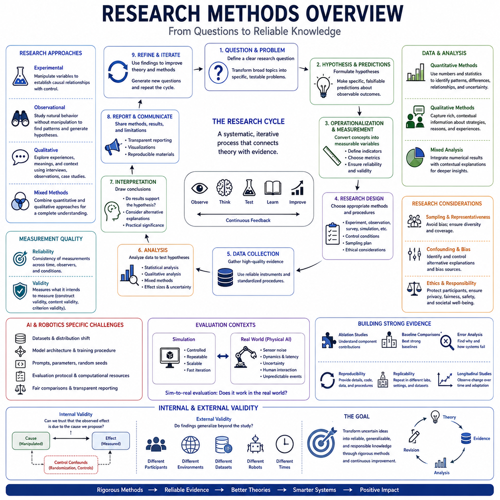
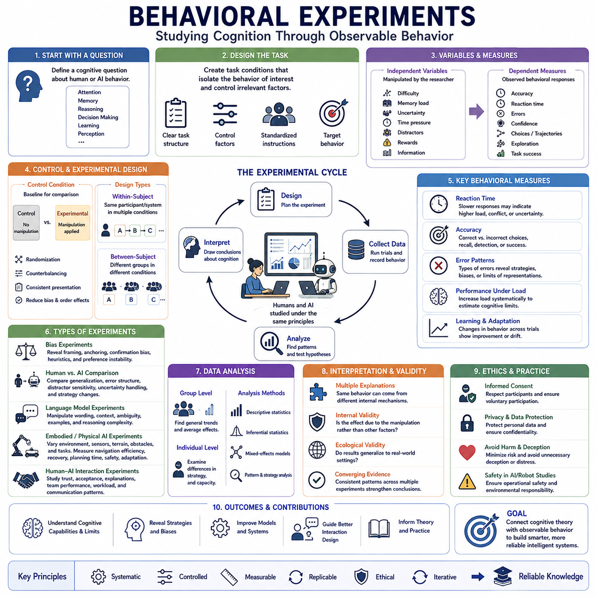
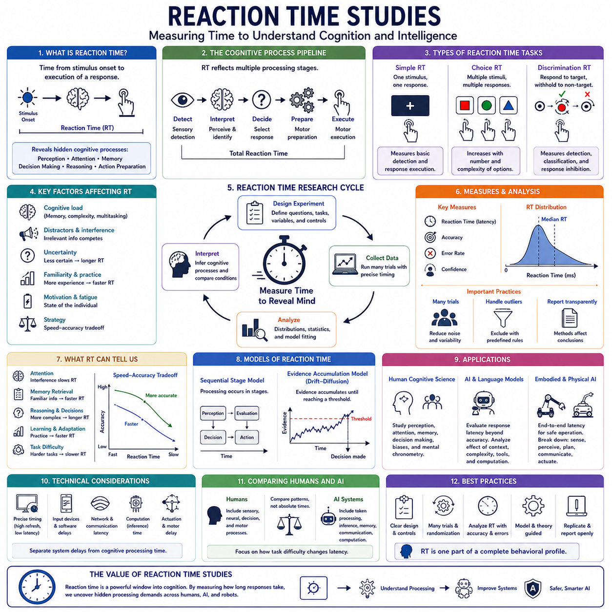
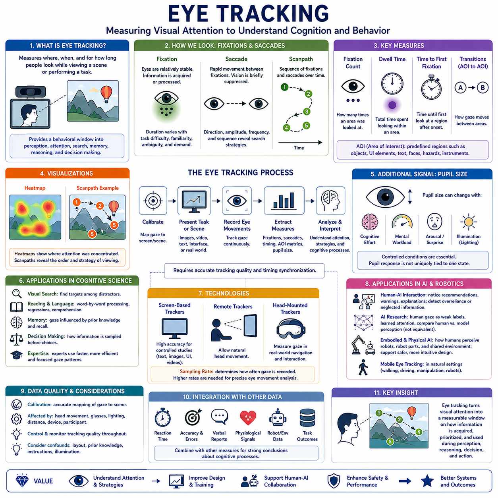
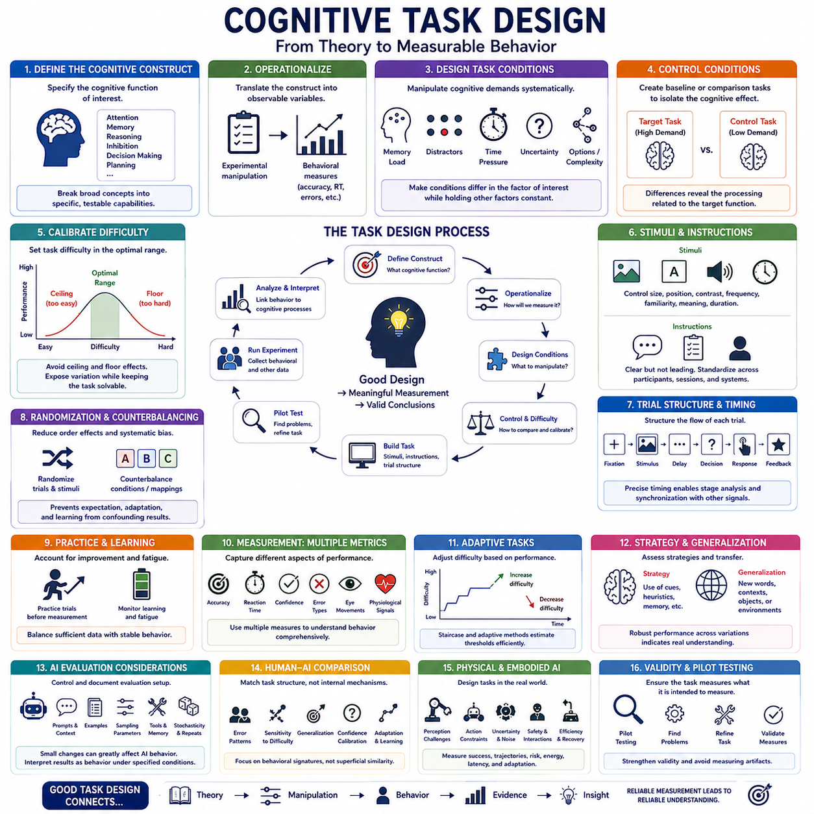
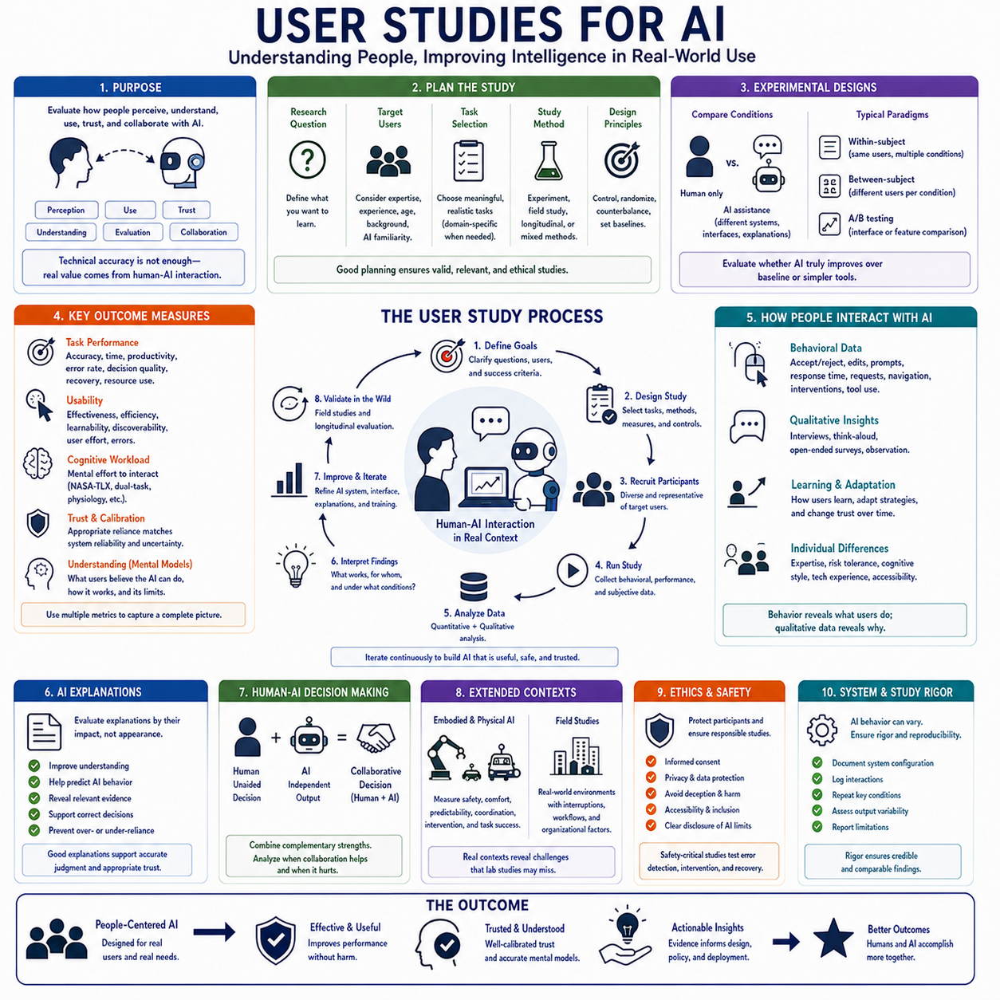
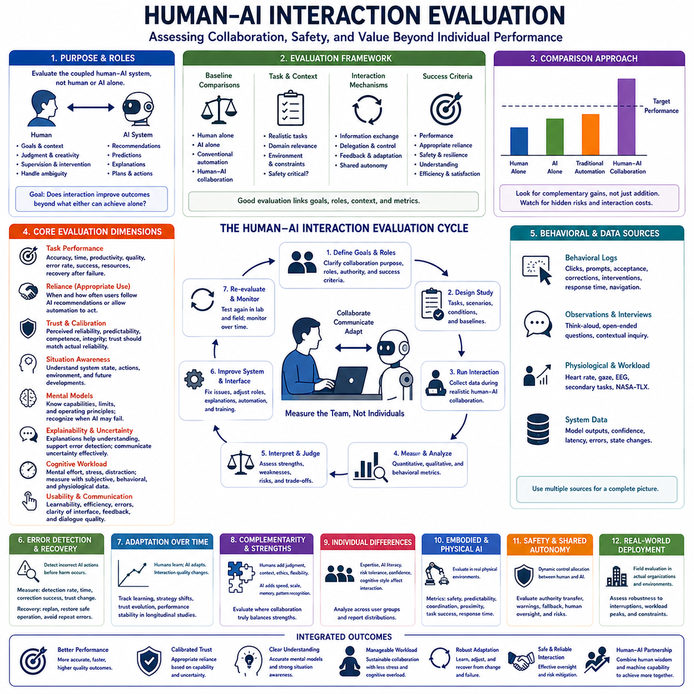
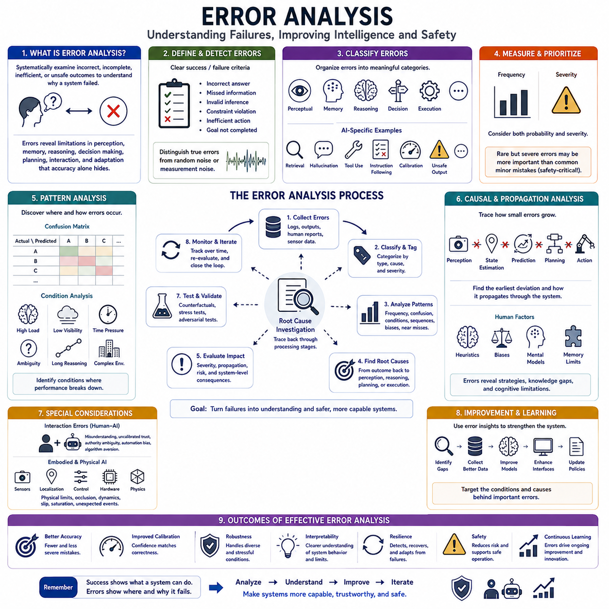
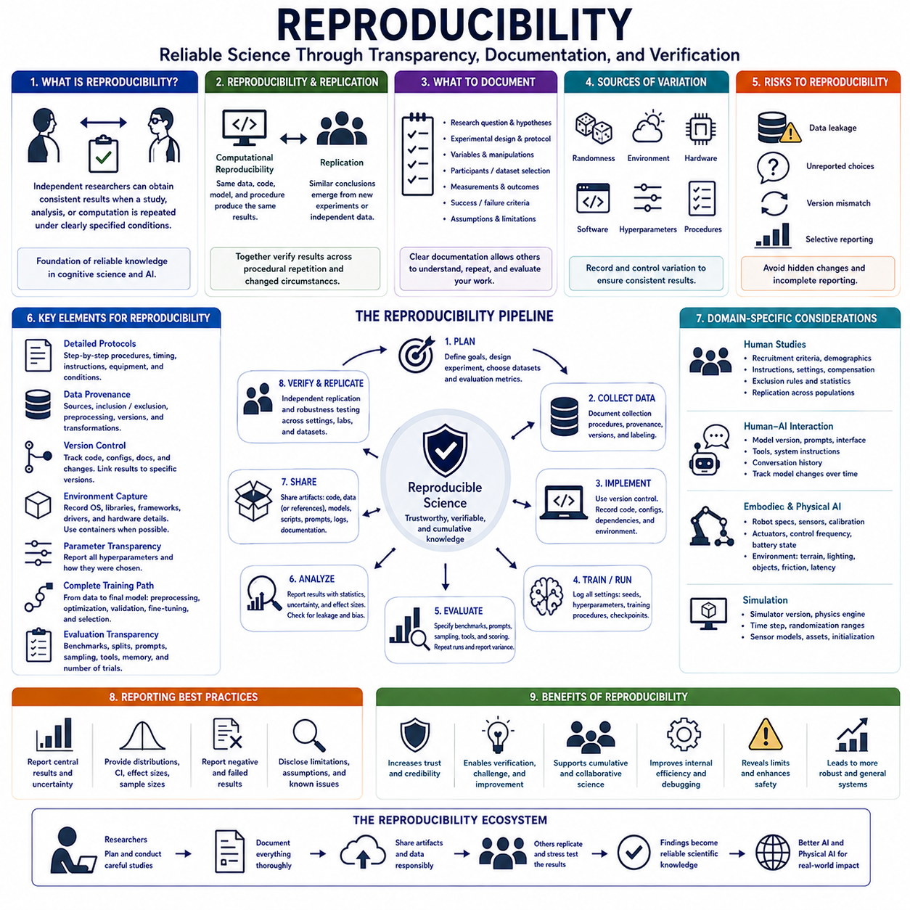

**Volume 43 Cognitive Science for AI**


# Chapter 08. Experimental Methods

##  

## 08.00 Research Methods Overview

{width="7.268055555555556in" height="7.268055555555556in"}

Research methods provide the systematic principles through which questions about cognition, intelligence, behavior, and artificial systems can be transformed into testable scientific investigations. Rather than relying on intuition or isolated observations, research methodology defines how evidence is collected, measured, analyzed, interpreted, and reproduced. Its purpose is to connect theoretical claims with observations in ways that allow alternative explanations to be evaluated.

A research process typically begins with a clearly formulated question. Broad questions about intelligence must be converted into specific problems concerning perception, memory, learning, reasoning, decision making, language, or action. Researchers then identify relevant variables and formulate hypotheses that generate observable predictions. A useful hypothesis must be sufficiently precise that empirical evidence could support, modify, or challenge the proposed explanation.

Operationalization converts abstract theoretical concepts into measurable variables. Concepts such as attention, memory capacity, cognitive load, uncertainty, trust, or intelligence cannot usually be observed directly. Researchers therefore define observable indicators such as accuracy, response time, recall performance, error frequency, confidence, physiological signals, or task success. The quality of these operational definitions strongly influences what conclusions can legitimately be drawn.

Experimental research investigates causal relationships by systematically manipulating one or more independent variables while measuring their effects on dependent variables. Control conditions and standardized procedures help isolate the influence of the manipulated factor. Randomization can reduce systematic bias, while repeated measurements reveal variability. Carefully designed experiments therefore provide one of the strongest approaches for testing causal hypotheses about cognition and intelligent systems.

Observational research is valuable when direct experimental manipulation is impossible, unethical, or likely to distort natural behavior. Researchers may observe humans, robots, organizations, or environments while recording patterns of activity and interaction. Such studies can reveal important relationships and generate hypotheses, but correlation alone does not establish causation. Confounding variables and alternative explanations must therefore be considered carefully.

Quantitative methods represent observations numerically and use statistical analysis to identify patterns, differences, relationships, and uncertainty. Measurements may include accuracy, latency, trajectory error, task completion time, physiological responses, model performance, or interaction frequency. Statistical methods help determine whether observed effects are likely to reflect systematic relationships rather than random variation, although statistical significance alone does not establish practical importance.

Qualitative methods investigate experiences, strategies, meanings, explanations, and contextual factors that may be difficult to reduce to numerical variables. Interviews, think-aloud protocols, open-ended observations, case studies, and interaction analysis can reveal how people understand tasks or collaborate with intelligent systems. Qualitative evidence is especially useful for discovering unexpected phenomena and explaining why particular quantitative patterns may have occurred.

Mixed-method research combines quantitative and qualitative approaches to obtain complementary evidence. Numerical performance measurements may show that one system performs better than another, while interviews or behavioral observations reveal why the difference occurs. In human-AI interaction, for example, objective task performance can be combined with subjective trust, workload, usability, and strategy reports to produce a more complete understanding of system effectiveness.

Measurement quality depends strongly on reliability and validity. Reliability concerns whether a measurement produces sufficiently consistent results across repetitions, observers, or equivalent conditions. Validity concerns whether the measurement actually captures the construct that researchers intend to study. A benchmark may produce highly repeatable scores while still measuring only a narrow proxy for reasoning, intelligence, autonomy, or real-world capability.

Internal validity concerns whether an observed effect can reasonably be attributed to the proposed cause rather than uncontrolled factors. External validity concerns whether findings generalize beyond the particular participants, datasets, environments, robots, or tasks used in the study. Research often involves a tradeoff between experimental control and ecological realism. Highly controlled experiments isolate mechanisms, while realistic environments reveal whether those mechanisms remain effective under complex conditions.

Sampling determines which observations, participants, environments, or datasets become part of a study. Poor sampling can introduce systematic bias even when later analysis is statistically sophisticated. Human studies require attention to participant diversity and selection procedures, while AI research must consider dataset composition, domain coverage, class imbalance, sensor conditions, and distribution shift. Representative sampling improves the credibility of broader generalizations.

Research on artificial intelligence introduces additional methodological challenges because datasets, training procedures, model architectures, prompts, random seeds, evaluation protocols, and computational resources can all influence outcomes. Fair comparison requires controlling these factors or reporting them transparently. Benchmark results should therefore be interpreted as measurements obtained under specified experimental conditions rather than permanent properties of a model independent of context.

Ablation studies help determine which components of a complex system contribute to observed performance. Researchers systematically remove, replace, or modify elements such as sensors, memory modules, attention mechanisms, training objectives, data sources, or planning components. Changes in performance provide evidence about functional contribution. However, interactions among components mean that the effect of removing one module may depend strongly on the configuration of the remaining system.

Baseline comparisons provide reference points for evaluating whether a proposed method actually improves upon simpler or established alternatives. A sophisticated model should not be considered successful merely because it performs well in isolation. Researchers compare it with relevant baselines under equivalent conditions and report multiple metrics where appropriate. Strong baselines reduce the risk of attributing improvements to complexity when simpler explanations or methods are sufficient.

Reproducibility and replicability are essential for cumulative scientific progress. Research should provide enough information about data, preprocessing, model configuration, experimental procedures, evaluation criteria, and statistical analysis for others to examine the findings. Repeated experiments across different laboratories, datasets, environments, or hardware platforms can reveal whether a result represents a robust phenomenon or an accidental property of a particular implementation.

Error analysis complements aggregate performance metrics by examining how and why a system fails. Two systems with identical average accuracy may exhibit very different failure patterns. Errors can be categorized according to environmental conditions, task difficulty, object type, uncertainty, reasoning structure, or interaction context. Understanding systematic failures often provides more useful scientific information than a small improvement in a single benchmark score.

Research involving embodied and Physical AI requires evaluation across simulation and the physical world. Simulation enables controlled, repeatable, and scalable experiments, while real-world testing exposes systems to sensor noise, mechanical variation, latency, environmental uncertainty, human behavior, and unexpected interactions. Sim-to-real evaluation therefore examines whether conclusions obtained under controlled virtual conditions remain valid when intelligence is physically embodied.

Longitudinal methods become important when intelligent systems learn or adapt over time. A single evaluation may capture initial capability but fail to reveal improvement, degradation, catastrophic forgetting, behavioral drift, or changing human trust. Repeated observations across extended periods allow researchers to examine how models, robots, users, and environments influence one another. This becomes increasingly important for continually learning autonomous systems.

Ethical research methods consider how experiments affect people, organizations, environments, and society. Human participation requires informed consent, privacy protection, appropriate data governance, and careful assessment of potential harm. AI experiments may additionally involve safety, bias, transparency, accountability, and deployment risks. Methodological rigor therefore includes not only obtaining accurate results but also ensuring that evidence is collected and applied responsibly.

The broader purpose of research methodology is to create a disciplined cycle between theory and evidence. Theory generates hypotheses, experiments and observations produce data, analysis evaluates predictions, and results modify existing explanations or motivate new questions. Through repeated cycles of measurement, criticism, replication, and refinement, uncertain ideas can gradually become more reliable scientific knowledge.

For cognitive science, artificial intelligence, and Physical AI, no single research method is sufficient. Controlled experiments reveal mechanisms, observational studies reveal natural behavior, quantitative analysis measures patterns, qualitative investigation explains context, simulation enables scalable testing, and physical experiments establish real-world validity. Integrating these approaches provides the methodological foundation for studying increasingly complex intelligent systems scientifically.

연구 방법(Research Methods)은 인지(Cognition), 지능(Intelligence), 행동(Behavior), 인공 시스템(Artificial Systems)에 관한 질문을 검증 가능한 과학적 연구(Testable Scientific Investigation)로 전환하기 위한 체계적인 원리를 제공합니다. 연구 방법론(Research Methodology)은 직관이나 개별적인 관찰에 의존하는 대신 증거를 어떻게 수집하고, 측정하고, 분석하고, 해석하며, 재현할 것인지를 정의합니다. 그 목적은 이론적 주장(Theoretical Claim)을 관측과 연결하여 서로 다른 대안적 설명(Alternative Explanation)을 평가할 수 있도록 하는 것입니다.

연구 과정(Research Process)은 일반적으로 명확하게 정의된 연구 질문(Research Question)에서 시작합니다. 지능에 관한 광범위한 질문은 지각(Perception), 기억(Memory), 학습(Learning), 추론(Reasoning), 의사결정(Decision Making), 언어(Language), 행동(Action)에 관한 구체적인 문제로 변환되어야 합니다. 이후 연구자는 관련 변수(Variable)를 식별하고 관찰 가능한 예측을 생성하는 가설(Hypothesis)을 수립합니다. 유용한 가설은 경험적 증거(Empirical Evidence)를 통해 제안된 설명을 지지하거나, 수정하거나, 반박할 수 있을 정도로 충분히 구체적이어야 합니다.

조작적 정의(Operationalization)는 추상적인 이론적 개념을 측정 가능한 변수로 변환합니다. 주의(Attention), 기억 용량(Memory Capacity), 인지 부하(Cognitive Load), 불확실성(Uncertainty), 신뢰(Trust), 지능과 같은 개념은 일반적으로 직접 관찰할 수 없습니다. 따라서 연구자는 정확도(Accuracy), 반응시간(Response Time), 회상 성능(Recall Performance), 오류 빈도(Error Frequency), 신뢰도(Confidence), 생리적 신호(Physiological Signal), 작업 성공(Task Success)과 같은 관찰 가능한 지표를 정의합니다. 이러한 조작적 정의의 품질은 연구 결과로부터 정당하게 도출할 수 있는 결론의 범위에 큰 영향을 미칩니다.

실험 연구(Experimental Research)는 하나 이상의 독립변수(Independent Variable)를 체계적으로 조작하면서 종속변수(Dependent Variable)에 미치는 영향을 측정하여 인과관계(Causal Relationship)를 조사합니다. 통제 조건(Control Condition)과 표준화된 절차(Standardized Procedure)는 조작된 요인의 영향을 분리하는 데 도움이 됩니다. 무작위화(Randomization)는 체계적 편향(Systematic Bias)을 줄일 수 있으며, 반복 측정(Repeated Measurement)은 변동성(Variability)을 보여줍니다. 따라서 신중하게 설계된 실험은 인지와 지능 시스템에 관한 인과적 가설(Causal Hypothesis)을 검증하는 가장 강력한 방법 가운데 하나입니다.

관찰 연구(Observational Research)는 직접적인 실험 조작이 불가능하거나, 윤리적으로 적절하지 않거나, 자연스러운 행동을 왜곡할 가능성이 있을 때 유용합니다. 연구자는 인간, 로봇, 조직 또는 환경을 관찰하면서 활동과 상호작용의 패턴을 기록할 수 있습니다. 이러한 연구는 중요한 관계를 발견하고 새로운 가설을 생성할 수 있지만, 상관관계(Correlation)만으로 인과관계(Causation)를 확립할 수는 없습니다. 따라서 교란 변수(Confounding Variable)와 대안적 설명을 신중하게 고려해야 합니다.

정량적 방법(Quantitative Methods)은 관측을 수치로 표현하고 통계 분석(Statistical Analysis)을 사용하여 패턴, 차이, 관계, 불확실성을 파악합니다. 측정값에는 정확도, 지연시간(Latency), 궤적 오차(Trajectory Error), 작업 완료 시간(Task Completion Time), 생리적 반응, 모델 성능(Model Performance), 상호작용 빈도 등이 포함될 수 있습니다. 통계적 방법은 관찰된 효과가 무작위 변동(Random Variation)이 아니라 체계적인 관계를 반영할 가능성이 있는지를 판단하는 데 도움을 주지만, 통계적 유의성(Statistical Significance)만으로 실질적인 중요성(Practical Importance)이 입증되는 것은 아닙니다.

정성적 방법(Qualitative Methods)은 수치 변수로 환원하기 어려운 경험, 전략, 의미, 설명, 문맥적 요인(Contextual Factor)을 조사합니다. 인터뷰(Interview), 사고구술 프로토콜(Think-Aloud Protocol), 개방형 관찰(Open-Ended Observation), 사례 연구(Case Study), 상호작용 분석(Interaction Analysis)은 사람들이 과제를 어떻게 이해하거나 지능 시스템과 어떻게 협력하는지를 보여줄 수 있습니다. 정성적 증거(Qualitative Evidence)는 예상하지 못한 현상을 발견하고 특정 정량적 패턴이 왜 발생했는지를 설명하는 데 특히 유용합니다.

혼합 방법 연구(Mixed-Method Research)는 정량적 접근과 정성적 접근을 결합하여 상호 보완적인 증거를 확보합니다. 수치적 성능 측정은 하나의 시스템이 다른 시스템보다 더 높은 성능을 보인다는 사실을 보여줄 수 있지만, 인터뷰나 행동 관찰은 그러한 차이가 왜 발생했는지를 설명할 수 있습니다. 예를 들어 인간-AI 상호작용(Human-AI Interaction)에서는 객관적인 작업 성능을 주관적인 신뢰, 작업부하(Workload), 사용성(Usability), 전략 보고와 결합하여 시스템 효과성(System Effectiveness)을 더욱 완전하게 이해할 수 있습니다.

측정 품질(Measurement Quality)은 신뢰도(Reliability)와 타당도(Validity)에 크게 의존합니다. 신뢰도는 반복 측정, 서로 다른 관찰자 또는 동등한 조건에서 측정 결과가 충분히 일관되게 나타나는지를 의미합니다. 타당도는 측정값이 연구자가 실제로 연구하고자 하는 구성개념(Construct)을 제대로 측정하는지를 의미합니다. 하나의 벤치마크(Benchmark)가 매우 반복 가능한 점수를 생성하더라도 추론, 지능, 자율성(Autonomy), 실제 세계의 능력(Real-World Capability)을 나타내는 좁은 대리 지표(Proxy)만을 측정할 수도 있습니다.

내적 타당도(Internal Validity)는 관찰된 효과를 통제되지 않은 다른 요인이 아니라 제안된 원인에 합리적으로 귀속시킬 수 있는지를 의미합니다. 외적 타당도(External Validity)는 연구 결과가 특정 연구 참여자, 데이터셋, 환경, 로봇 또는 과제를 넘어 일반화(Generalization)될 수 있는지를 의미합니다. 연구에서는 실험적 통제(Experimental Control)와 생태학적 현실성(Ecological Realism) 사이에 절충이 필요한 경우가 많습니다. 고도로 통제된 실험은 특정 메커니즘을 분리하는 데 유리하고, 현실적인 환경은 해당 메커니즘이 복잡한 조건에서도 효과적으로 작동하는지를 보여줍니다.

표본 추출(Sampling)은 어떤 관측, 연구 참여자, 환경 또는 데이터셋이 연구에 포함될지를 결정합니다. 잘못된 표본 추출은 이후의 분석이 통계적으로 정교하더라도 체계적인 편향을 발생시킬 수 있습니다. 인간 대상 연구에서는 참여자의 다양성과 선정 절차에 주의를 기울여야 하며, 인공지능 연구에서는 데이터셋 구성(Dataset Composition), 도메인 범위(Domain Coverage), 클래스 불균형(Class Imbalance), 센서 조건, 분포 변화(Distribution Shift)를 고려해야 합니다. 대표성 있는 표본 추출(Representative Sampling)은 보다 광범위한 일반화의 신뢰성을 높입니다.

인공지능 연구는 데이터셋, 학습 절차(Training Procedure), 모델 아키텍처(Model Architecture), 프롬프트(Prompt), 난수 시드(Random Seed), 평가 프로토콜(Evaluation Protocol), 계산 자원(Computational Resource)이 모두 결과에 영향을 미칠 수 있기 때문에 추가적인 방법론적 문제를 제기합니다. 공정한 비교를 위해서는 이러한 요인을 통제하거나 투명하게 보고해야 합니다. 따라서 벤치마크 결과는 문맥과 무관한 모델의 영구적인 특성이 아니라 명시된 실험 조건에서 얻어진 측정 결과로 해석해야 합니다.

절제 연구(Ablation Study)는 복잡한 시스템의 어떤 구성 요소가 관찰된 성능에 기여하는지를 판단하는 데 도움을 줍니다. 연구자는 센서, 기억 모듈(Memory Module), 어텐션 메커니즘(Attention Mechanism), 학습 목적함수(Training Objective), 데이터 소스(Data Source), 계획 구성 요소(Planning Component) 등을 체계적으로 제거하거나 교체하거나 수정합니다. 이에 따른 성능 변화는 각 요소의 기능적 기여(Functional Contribution)에 대한 증거를 제공합니다. 그러나 구성 요소 간 상호작용 때문에 하나의 모듈을 제거한 효과는 나머지 시스템의 구성에 따라 크게 달라질 수 있습니다.

기준선 비교(Baseline Comparison)는 제안된 방법이 더 단순하거나 기존에 확립된 대안보다 실제로 개선되었는지를 평가하기 위한 기준점을 제공합니다. 복잡한 모델이 독립적으로 높은 성능을 보인다는 이유만으로 성공적인 방법이라고 판단해서는 안 됩니다. 연구자는 동등한 조건에서 관련 기준선과 비교하고 필요한 경우 여러 평가 지표(Metric)를 함께 보고합니다. 강력한 기준선은 더 단순한 설명이나 방법으로 충분한 상황에서 복잡성 자체를 성능 향상의 원인으로 잘못 해석할 위험을 줄여줍니다.

재현성(Reproducibility)과 반복 검증 가능성(Replicability)은 과학적 지식이 누적되어 발전하기 위한 핵심 조건입니다. 연구는 다른 연구자가 결과를 검토할 수 있도록 데이터, 전처리(Preprocessing), 모델 구성(Model Configuration), 실험 절차, 평가 기준(Evaluation Criteria), 통계 분석에 관한 충분한 정보를 제공해야 합니다. 서로 다른 연구실, 데이터셋, 환경 또는 하드웨어 플랫폼에서 실험을 반복하면 특정 결과가 강건한 현상(Robust Phenomenon)인지 아니면 특정 구현의 우연한 특성인지를 확인할 수 있습니다.

오류 분석(Error Analysis)은 시스템이 어떻게 그리고 왜 실패하는지를 조사함으로써 종합적인 성능 지표(Aggregate Performance Metric)를 보완합니다. 평균 정확도가 동일한 두 시스템이라도 매우 다른 실패 패턴(Failure Pattern)을 나타낼 수 있습니다. 오류는 환경 조건, 과제 난이도(Task Difficulty), 객체 유형, 불확실성, 추론 구조(Reasoning Structure), 상호작용 문맥에 따라 분류할 수 있습니다. 체계적인 실패를 이해하는 것은 하나의 벤치마크 점수를 소폭 향상시키는 것보다 더 유용한 과학적 정보를 제공하는 경우가 많습니다.

체화 인공지능(Embodied AI)과 피지컬 AI(Physical AI)에 관한 연구는 시뮬레이션(Simulation)과 실제 물리 세계(Physical World) 모두에서 평가를 수행해야 합니다. 시뮬레이션은 통제되고 반복 가능하며 확장 가능한 실험을 가능하게 하는 반면, 실제 환경의 시험은 시스템을 센서 잡음, 기계적 편차(Mechanical Variation), 지연시간, 환경 불확실성, 인간 행동, 예상하지 못한 상호작용에 노출시킵니다. 따라서 시뮬레이션-현실 평가(Sim-to-Real Evaluation)는 통제된 가상 환경에서 얻은 결론이 지능이 실제 물리적 시스템에 체화되었을 때에도 유효한지를 검증합니다.

종단적 방법(Longitudinal Methods)은 지능 시스템이 시간에 따라 학습하거나 적응할 때 중요해집니다. 한 번의 평가는 초기 능력을 측정할 수 있지만 이후의 성능 향상, 성능 저하(Degradation), 치명적 망각(Catastrophic Forgetting), 행동 드리프트(Behavioral Drift), 인간 신뢰의 변화를 포착하지 못할 수 있습니다. 장기간에 걸친 반복 관측은 모델, 로봇, 사용자, 환경이 서로에게 어떤 영향을 미치는지를 조사할 수 있게 합니다. 이러한 방법은 지속적으로 학습하는 자율 시스템(Continually Learning Autonomous System)에서 더욱 중요해집니다.

윤리적 연구 방법(Ethical Research Methods)은 실험이 인간, 조직, 환경, 사회에 어떠한 영향을 미치는지를 고려합니다. 인간이 참여하는 연구에는 사전 동의(Informed Consent), 개인정보 보호(Privacy Protection), 적절한 데이터 거버넌스(Data Governance), 잠재적인 피해에 대한 신중한 평가가 필요합니다. 인공지능 실험에서는 추가적으로 안전, 편향(Bias), 투명성(Transparency), 책임성(Accountability), 배포 위험(Deployment Risk)을 고려해야 합니다. 따라서 방법론적 엄밀성(Methodological Rigor)은 정확한 결과를 얻는 것뿐 아니라 증거가 책임 있는 방식으로 수집되고 활용되도록 하는 것까지 포함합니다.

연구 방법론의 더 넓은 목적은 이론(Theory)과 증거(Evidence) 사이에 엄격하고 체계적인 순환 구조를 만드는 것입니다. 이론은 가설을 생성하고, 실험과 관찰은 데이터를 생성하며, 분석은 예측을 평가하고, 연구 결과는 기존 설명을 수정하거나 새로운 질문을 만들어냅니다. 측정, 비판적 검토(Criticism), 반복 검증, 개선(Refinement)의 순환이 지속되면서 불확실한 아이디어는 점차 더욱 신뢰할 수 있는 과학적 지식(Scientific Knowledge)으로 발전할 수 있습니다.

인지과학(Cognitive Science), 인공지능(Artificial Intelligence), 피지컬 AI(Physical AI)를 연구하기 위해서는 하나의 연구 방법만으로 충분하지 않습니다. 통제 실험(Controlled Experiment)은 메커니즘을 밝혀내고, 관찰 연구는 자연스러운 행동을 보여주며, 정량적 분석은 패턴을 측정하고, 정성적 연구는 문맥을 설명하며, 시뮬레이션은 확장 가능한 시험을 가능하게 하고, 물리적 실험(Physical Experiment)은 실제 세계에서의 타당성을 검증합니다. 이러한 접근법을 통합하는 것은 점점 더 복잡해지는 지능 시스템을 과학적으로 연구하기 위한 방법론적 기반(Methodological Foundation)을 제공합니다.

##  

## 08.01 Behavioral Experiments [w/Code]

{width="7.268055555555556in" height="7.268055555555556in"}

Behavioral experiments investigate cognition by observing how people or intelligent systems respond under carefully designed task conditions. Rather than directly measuring internal mental processes, researchers infer them from patterns of choices, actions, errors, response times, and task performance. In cognitive science for AI, behavioral experiments provide a bridge between theoretical claims about intelligence and measurable evidence about how an agent actually behaves.

A behavioral experiment begins with a clearly defined question about a cognitive function such as attention, memory, reasoning, decision making, learning, or perception. The researcher then constructs a task that isolates relevant behavior while controlling unrelated influences. The central objective is to create conditions in which changes in observable behavior can be meaningfully associated with differences in the cognitive process being studied.

Experimental variables determine how the task is structured. An independent variable is deliberately manipulated, while a dependent variable records the resulting behavioral response. Researchers may vary stimulus difficulty, memory load, uncertainty, time pressure, distractors, reward structure, or available information. Dependent measures may include accuracy, reaction time, number of errors, confidence, trajectory choice, exploration behavior, or successful task completion.

Control conditions are essential because observed behavior can be influenced by many factors unrelated to the hypothesis. A control condition provides a baseline against which the effect of an experimental manipulation can be compared. Randomization, counterbalancing, standardized instructions, and consistent task presentation help reduce systematic bias and order effects, improving the internal validity of the experiment.

Reaction time is one of the most widely used behavioral measures because processing difficulty often affects how quickly a response can be produced. Longer response times may indicate increased cognitive load, uncertainty, conflict, or additional reasoning requirements. However, reaction time should not be interpreted in isolation because speed can trade off against accuracy, motivation, motor behavior, and individual differences.

Accuracy provides another fundamental measure of behavioral performance. Researchers can examine whether participants or AI systems select the correct option, recall information, detect targets, solve reasoning problems, or complete a task successfully. Patterns of errors can reveal more than overall accuracy because different error types may indicate distinct strategies, biases, misunderstandings, or limitations in underlying representations.

Behavioral experiments often manipulate cognitive load to determine how performance changes when processing demands increase. Memory tasks may vary the number of items that must be retained, attention experiments may add competing distractors, and reasoning tasks may increase the number of constraints. Performance degradation under increasing load can help estimate the practical limits of working memory, attention, planning, or other cognitive resources.

Within-subject designs expose the same participant or system to multiple experimental conditions. This approach reduces variability caused by stable individual differences because each participant serves as their own comparison. Between-subject designs assign different groups to different conditions and can reduce learning or carryover effects. The appropriate design depends on the research question and the possibility that earlier trials may influence later behavior.

Repeated trials are necessary because behavior contains natural variability. A single response may reflect noise, misunderstanding, distraction, or chance rather than a stable cognitive property. By presenting multiple trials under controlled conditions, researchers can estimate average performance, variability, learning effects, and consistency. Trial order can be randomized or systematically balanced to prevent sequence effects from distorting conclusions.

Behavioral data are often analyzed at both group and individual levels. Group averages can reveal general trends, while individual analyses expose differences in strategy, expertise, response style, or cognitive capacity. This distinction is important because identical average performance can arise from very different behavioral patterns. AI evaluation can similarly benefit from analyzing performance across prompts, tasks, environments, and repeated runs rather than reporting only a single aggregate score.

Cognitive biases can be studied experimentally by designing situations in which intuitive responses conflict with normative solutions. Framing effects, anchoring, confirmation bias, loss sensitivity, or heuristic shortcuts can emerge through systematic patterns of choice. Similar experiments can be applied to AI systems to examine prompt sensitivity, preference instability, reasoning shortcuts, or dependence on superficial contextual features.

Behavioral experiments are particularly useful for comparing humans and AI because both can be presented with equivalent task structures while their response patterns are analyzed separately. The purpose is not necessarily to determine whether AI reproduces human cognition internally. Instead, researchers can compare generalization, error structure, sensitivity to distractors, uncertainty handling, adaptation, and strategy changes under matched behavioral conditions.

For language models, behavioral experiments can manipulate wording, context, memory demands, ambiguity, examples, or reasoning complexity while preserving the underlying task. If small surface changes cause large variations in performance, the results may indicate brittle representations or dependence on prompt form. Controlled behavioral testing therefore provides richer evidence than evaluating a model only on a fixed benchmark dataset.

Behavioral methods also apply to embodied and Physical AI. A robot may be tested under changes in obstacle density, visibility, terrain, sensor availability, task complexity, or human interaction. Researchers can measure navigation efficiency, hesitation, recovery behavior, collision avoidance, planning time, or adaptation after failure. These observations reveal how cognitive mechanisms operate when intelligence is coupled to physical perception and action.

Human-AI interaction experiments extend behavioral analysis to teams rather than isolated agents. Researchers can examine how people respond to AI recommendations, when they accept or reject advice, how trust changes after errors, and whether explanations affect decisions. Performance measures can be combined with workload, response time, correction frequency, and communication patterns to understand collaborative behavior.

Learning can be studied by observing how behavior changes across repeated exposure. Improvement may indicate adaptation, strategy formation, or skill acquisition, while persistent errors may reveal stable limitations. Researchers can compare early and late trials, examine transfer to related tasks, and test whether learning survives delays or environmental changes. Similar approaches can evaluate continual learning in adaptive AI systems.

Behavioral experiments require careful interpretation because the same observable response can arise from different internal mechanisms. A participant may answer correctly through reasoning, memorization, guessing, or a learned shortcut. Researchers therefore design converging experiments in which multiple task variations test competing explanations. Strong evidence usually emerges from consistent behavioral patterns across several controlled conditions rather than from one experiment alone.

Ecological validity is another important consideration. Highly simplified laboratory tasks make variables easier to control but may not capture behavior in realistic environments. Complex real-world experiments provide greater realism but introduce more confounding factors. Cognitive research therefore often combines tightly controlled behavioral tasks with naturalistic studies, simulations, or field experiments to determine whether identified effects remain meaningful outside the laboratory.

Ethical and practical issues also influence behavioral research. Human studies require informed consent, appropriate treatment of participants, privacy protection, and avoidance of unnecessary harm or deception. Experiments involving autonomous systems must consider operational safety and environmental risk. Good experimental methodology treats ethical design as part of scientific rigor rather than as a separate administrative requirement.

Behavioral experiments ultimately create a disciplined connection between cognitive theory and observable performance. A hypothesis predicts how behavior should change under controlled conditions, the experiment produces measurable responses, and analysis determines whether the predicted pattern appears. Repeated experimentation then refines the explanation, revealing both the capabilities and the limitations of the proposed cognitive mechanism.

Within cognitive science for AI, behavioral experimentation is therefore a foundational evaluation method. It enables systematic investigation of perception, memory, attention, reasoning, decision making, learning, language, interaction, and embodied action through measurable behavior. By manipulating conditions and analyzing responses, researchers can move beyond headline benchmark scores toward a deeper understanding of how intelligent systems behave, adapt, and fail.

행동 실험(Behavioral Experiments)은 신중하게 설계된 과제 조건(Task Condition)에서 사람이나 지능 시스템(Intelligent System)이 어떻게 반응하는지를 관찰함으로써 인지(Cognition)를 연구합니다. 연구자는 내부의 정신 과정(Mental Process)을 직접 측정하는 대신 선택, 행동, 오류, 반응시간(Response Time), 과제 수행 성능(Task Performance)의 패턴을 통해 이를 추론합니다. 인공지능을 위한 인지과학(Cognitive Science for AI)에서 행동 실험은 지능에 관한 이론적 주장(Theoretical Claim)과 에이전트가 실제로 어떻게 행동하는지에 대한 측정 가능한 증거(Measurable Evidence)를 연결하는 가교를 제공합니다.

행동 실험은 주의(Attention), 기억(Memory), 추론(Reasoning), 의사결정(Decision Making), 학습(Learning), 지각(Perception)과 같은 인지 기능(Cognitive Function)에 관한 명확하게 정의된 질문에서 시작합니다. 이후 연구자는 관련 행동을 분리하면서 불필요한 영향을 통제할 수 있도록 과제를 구성합니다. 핵심적인 목적은 관찰 가능한 행동의 변화가 연구 대상이 되는 인지 과정의 차이와 의미 있게 연결될 수 있는 조건을 만드는 것입니다.

실험 변수(Experimental Variable)는 과제가 어떻게 구성되는지를 결정합니다. 독립변수(Independent Variable)는 의도적으로 조작되며, 종속변수(Dependent Variable)는 그 결과로 나타나는 행동 반응을 기록합니다. 연구자는 자극 난이도(Stimulus Difficulty), 기억 부하(Memory Load), 불확실성(Uncertainty), 시간 압박(Time Pressure), 방해 자극(Distractor), 보상 구조(Reward Structure), 이용 가능한 정보 등을 변화시킬 수 있습니다. 종속 측정값에는 정확도(Accuracy), 반응시간, 오류 수, 신뢰도(Confidence), 궤적 선택(Trajectory Choice), 탐색 행동(Exploration Behavior), 성공적인 과제 완료 등이 포함될 수 있습니다.

통제 조건(Control Condition)은 관찰되는 행동이 가설과 관련되지 않은 여러 요인의 영향을 받을 수 있기 때문에 필수적입니다. 통제 조건은 실험적 조작(Experimental Manipulation)의 효과를 비교할 수 있는 기준선(Baseline)을 제공합니다. 무작위화(Randomization), 균형화(Counterbalancing), 표준화된 지시(Standardized Instruction), 일관된 과제 제시는 체계적 편향(Systematic Bias)과 순서 효과(Order Effect)를 줄이는 데 도움을 주며 실험의 내적 타당도(Internal Validity)를 향상시킵니다.

반응시간(Response Time)은 처리 난이도(Processing Difficulty)가 반응을 생성하는 속도에 영향을 미치는 경우가 많기 때문에 가장 널리 사용되는 행동 측정값 가운데 하나입니다. 긴 반응시간은 인지 부하(Cognitive Load), 불확실성, 갈등(Conflict), 추가적인 추론 요구를 나타낼 수 있습니다. 그러나 속도는 정확도, 동기(Motivation), 운동 행동(Motor Behavior), 개인차(Individual Difference)와 상충 관계를 가질 수 있으므로 반응시간만을 독립적으로 해석해서는 안 됩니다.

정확도(Accuracy)는 행동 성능을 평가하는 또 다른 기본적인 측정값입니다. 연구자는 참여자 또는 AI 시스템이 올바른 선택지를 선택하는지, 정보를 회상하는지, 목표를 탐지하는지, 추론 문제를 해결하는지, 또는 과제를 성공적으로 완료하는지를 조사할 수 있습니다. 오류 패턴(Error Pattern)은 전체 정확도보다 더 많은 정보를 제공할 수 있는데, 서로 다른 오류 유형이 서로 다른 전략, 편향(Bias), 오해 또는 내부 표현(Internal Representation)의 한계를 나타낼 수 있기 때문입니다.

행동 실험에서는 처리 요구량이 증가할 때 성능이 어떻게 변화하는지를 확인하기 위해 인지 부하를 조작하는 경우가 많습니다. 기억 과제에서는 유지해야 하는 항목의 수를 변화시킬 수 있고, 주의 실험에서는 경쟁하는 방해 자극을 추가할 수 있으며, 추론 과제에서는 제약조건(Constraint)의 수를 증가시킬 수 있습니다. 부하가 증가하면서 발생하는 성능 저하는 작업 기억(Working Memory), 주의, 계획(Planning) 또는 다른 인지 자원(Cognitive Resource)의 실질적인 한계를 추정하는 데 도움을 줄 수 있습니다.

피험자 내 설계(Within-Subject Design)는 동일한 참여자 또는 시스템을 여러 실험 조건에 노출시킵니다. 각 참여자가 자신의 비교 기준 역할을 하기 때문에 안정적인 개인차로 인해 발생하는 변동성을 줄일 수 있습니다. 피험자 간 설계(Between-Subject Design)는 서로 다른 집단을 각각 다른 조건에 배정하며 학습 효과(Learning Effect)나 이월 효과(Carryover Effect)를 줄일 수 있습니다. 적절한 설계는 연구 질문과 이전 시행이 이후 행동에 영향을 줄 가능성에 따라 결정됩니다.

행동에는 자연적인 변동성(Natural Variability)이 존재하기 때문에 반복 시행(Repeated Trial)이 필요합니다. 하나의 반응은 안정적인 인지 특성보다는 잡음(Noise), 오해, 주의 분산, 우연을 반영할 수 있습니다. 통제된 조건에서 여러 차례 시행함으로써 연구자는 평균 성능, 변동성, 학습 효과, 일관성을 추정할 수 있습니다. 시행 순서는 순서 효과(Sequence Effect)가 결론을 왜곡하지 않도록 무작위화하거나 체계적으로 균형화할 수 있습니다.

행동 데이터(Behavioral Data)는 흔히 집단 수준(Group Level)과 개인 수준(Individual Level) 모두에서 분석됩니다. 집단 평균은 일반적인 경향을 보여줄 수 있는 반면, 개인별 분석은 전략, 전문성(Expertise), 반응 방식(Response Style), 인지 능력(Cognitive Capacity)의 차이를 보여줍니다. 동일한 평균 성능이 매우 다른 행동 패턴으로부터 나타날 수 있기 때문에 이러한 구분은 중요합니다. AI 평가에서도 하나의 종합 점수(Aggregate Score)만 보고하는 대신 프롬프트(Prompt), 과제, 환경, 반복 실행에 따른 성능을 분석하는 것이 유용합니다.

인지 편향(Cognitive Bias)은 직관적인 반응과 규범적인 해결책(Normative Solution)이 충돌하도록 상황을 설계하여 실험적으로 연구할 수 있습니다. 프레이밍 효과(Framing Effect), 앵커링(Anchoring), 확증 편향(Confirmation Bias), 손실 민감성(Loss Sensitivity), 휴리스틱 지름길(Heuristic Shortcut)은 체계적인 선택 패턴을 통해 나타날 수 있습니다. 이와 유사한 실험을 AI 시스템에도 적용하여 프롬프트 민감성(Prompt Sensitivity), 선호의 불안정성(Preference Instability), 추론 지름길(Reasoning Shortcut), 표면적인 문맥 특징에 대한 의존성을 조사할 수 있습니다.

행동 실험은 인간과 AI에 동일한 과제 구조(Task Structure)를 제시하고 각각의 반응 패턴을 분석할 수 있기 때문에 인간과 AI를 비교하는 데 특히 유용합니다. 그 목적이 반드시 AI가 내부적으로 인간의 인지 과정을 재현하는지를 확인하는 것은 아닙니다. 대신 연구자는 동일한 행동 조건에서 일반화(Generalization), 오류 구조(Error Structure), 방해 자극에 대한 민감성, 불확실성 처리, 적응(Adaptation), 전략 변화(Strategy Change)를 비교할 수 있습니다.

언어 모델(Language Model)의 경우 행동 실험은 기본적인 과제를 유지하면서 표현 방식(Wording), 문맥(Context), 기억 요구량, 모호성(Ambiguity), 예제, 추론 복잡성(Reasoning Complexity)을 변화시킬 수 있습니다. 작은 표면적 변화가 성능에 큰 차이를 발생시킨다면 이는 취약한 표현(Brittle Representation)이나 프롬프트 형태(Prompt Form)에 대한 의존성을 나타낼 수 있습니다. 따라서 통제된 행동 시험(Controlled Behavioral Testing)은 고정된 벤치마크 데이터셋만으로 모델을 평가하는 것보다 더욱 풍부한 증거를 제공합니다.

행동 연구 방법(Behavioral Methods)은 체화 인공지능(Embodied AI)과 피지컬 AI(Physical AI)에도 적용할 수 있습니다. 로봇은 장애물 밀도(Obstacle Density), 가시성(Visibility), 지형(Terrain), 센서 가용성(Sensor Availability), 과제 복잡성, 인간과의 상호작용 조건을 변화시키면서 시험할 수 있습니다. 연구자는 내비게이션 효율성(Navigation Efficiency), 주저 행동(Hesitation), 복구 행동(Recovery Behavior), 충돌 회피(Collision Avoidance), 계획 시간(Planning Time), 실패 이후의 적응 등을 측정할 수 있습니다. 이러한 관찰은 지능이 물리적 지각 및 행동과 결합되었을 때 인지 메커니즘이 어떻게 작동하는지를 보여줍니다.

인간-AI 상호작용 실험(Human-AI Interaction Experiment)은 행동 분석의 범위를 독립된 에이전트에서 인간-AI 팀으로 확장합니다. 연구자는 사람들이 AI의 추천에 어떻게 반응하는지, 언제 조언을 수용하거나 거부하는지, 오류 발생 이후 신뢰가 어떻게 변화하는지, 설명(Explanation)이 의사결정에 영향을 미치는지를 조사할 수 있습니다. 성능 측정값을 작업부하(Workload), 반응시간, 수정 빈도(Correction Frequency), 의사소통 패턴(Communication Pattern)과 결합하여 협업 행동(Collaborative Behavior)을 이해할 수 있습니다.

학습(Learning)은 반복적인 경험에 따라 행동이 어떻게 변화하는지를 관찰하여 연구할 수 있습니다. 성능 향상은 적응, 전략 형성(Strategy Formation), 기술 습득(Skill Acquisition)을 나타낼 수 있으며, 지속적으로 반복되는 오류는 안정적인 한계를 보여줄 수 있습니다. 연구자는 초기 시행과 후기 시행을 비교하고, 관련 과제로의 전이(Transfer)를 조사하며, 시간이 지나거나 환경이 변화한 이후에도 학습 효과가 유지되는지를 시험할 수 있습니다. 이와 유사한 접근법을 이용하여 적응형 AI 시스템(Adaptive AI System)의 지속 학습(Continual Learning)을 평가할 수 있습니다.

행동 실험은 동일한 관찰 가능한 반응이 서로 다른 내부 메커니즘(Internal Mechanism)에서 발생할 수 있기 때문에 신중한 해석이 필요합니다. 참여자는 추론, 암기(Memorization), 추측(Guessing), 학습된 지름길을 통해 동일한 정답을 생성할 수 있습니다. 따라서 연구자는 여러 과제 변형(Task Variation)을 통해 서로 경쟁하는 설명을 검증하는 수렴적 실험(Converging Experiment)을 설계합니다. 강력한 증거는 일반적으로 하나의 실험이 아니라 여러 통제 조건에서 일관되게 나타나는 행동 패턴을 통해 형성됩니다.

생태학적 타당도(Ecological Validity)도 중요한 고려사항입니다. 매우 단순화된 실험실 과제(Laboratory Task)는 변수를 통제하기 쉽지만 현실적인 환경에서 나타나는 행동을 충분히 반영하지 못할 수 있습니다. 복잡한 실제 환경 실험(Real-World Experiment)은 현실성이 높지만 더 많은 교란 요인을 포함합니다. 따라서 인지 연구에서는 엄격하게 통제된 행동 과제를 자연주의적 연구(Naturalistic Study), 시뮬레이션(Simulation), 현장 실험(Field Experiment)과 결합하여 발견된 효과가 실험실 밖에서도 의미 있게 유지되는지를 확인하는 경우가 많습니다.

윤리적 및 실용적 문제(Ethical and Practical Issues)도 행동 연구에 영향을 미칩니다. 인간 대상 연구에서는 사전 동의(Informed Consent), 참여자에 대한 적절한 대우, 개인정보 보호(Privacy Protection), 불필요한 피해나 기만(Deception)의 방지가 필요합니다. 자율 시스템(Autonomous System)을 대상으로 하는 실험에서는 운영 안전(Operational Safety)과 환경 위험(Environmental Risk)을 고려해야 합니다. 좋은 실험 방법론은 윤리적 설계(Ethical Design)를 과학적 엄밀성(Scientific Rigor)과 분리된 행정적 요구사항이 아니라 그 자체의 중요한 구성 요소로 취급합니다.

궁극적으로 행동 실험은 인지 이론(Cognitive Theory)과 관찰 가능한 성능(Observable Performance) 사이에 체계적인 연결을 형성합니다. 가설은 통제된 조건에서 행동이 어떻게 변화해야 하는지를 예측하고, 실험은 측정 가능한 반응을 생성하며, 분석은 예상된 패턴이 실제로 나타났는지를 판단합니다. 이후 반복적인 실험은 설명을 지속적으로 개선하면서 제안된 인지 메커니즘의 능력과 한계를 모두 밝혀냅니다.

따라서 인공지능을 위한 인지과학에서 행동 실험(Behavioral Experimentation)은 핵심적인 평가 방법(Foundational Evaluation Method)입니다. 행동 실험은 측정 가능한 행동을 통해 지각, 기억, 주의, 추론, 의사결정, 학습, 언어, 상호작용, 체화된 행동(Embodied Action)을 체계적으로 연구할 수 있도록 합니다. 연구자는 조건을 조작하고 반응을 분석함으로써 단순한 대표 벤치마크 점수(Headline Benchmark Score)를 넘어 지능 시스템이 어떻게 행동하고, 적응하며, 실패하는지에 대한 더욱 깊은 이해로 발전할 수 있습니다.

##  

## 08.02 Reaction Time Studies [w/Code]

{width="7.268055555555556in" height="7.268055555555556in"}

Reaction time studies investigate the temporal structure of cognition by measuring how long an individual or intelligent system takes to respond after receiving a stimulus or task. Because many internal cognitive processes cannot be observed directly, response latency provides an indirect behavioral measure of processing demands. Differences in reaction time can reveal changes in perception, attention, memory retrieval, decision making, reasoning, and action preparation.

A typical reaction time experiment presents a stimulus and records the interval between stimulus onset and a predefined response. The measurement appears simple, but the observed latency usually represents several processing stages. The participant must detect the stimulus, interpret relevant information, select an appropriate response, prepare an action, and execute it. Reaction time therefore reflects a processing pipeline rather than a single isolated cognitive mechanism.

Simple reaction time tasks require one predetermined response whenever a stimulus appears. For example, a participant may press a key immediately after detecting a visual signal. Because little response selection is required, these tasks primarily measure sensory detection and basic response execution. They provide a useful baseline against which more complex tasks involving discrimination, choice, memory, or reasoning can be compared.

Choice reaction time tasks introduce multiple stimuli and possible responses. The participant must identify the stimulus and select the corresponding action before responding. As the number or complexity of alternatives increases, reaction time often becomes longer because additional information must be processed. Such experiments allow researchers to investigate how decision complexity and uncertainty influence the time required to transform perception into action.

Discrimination tasks occupy an intermediate position between simple and choice reaction paradigms. Participants respond only when a target stimulus appears and withhold responses to irrelevant stimuli. Successful performance therefore requires stimulus detection, classification, and response inhibition. These tasks are useful for examining selective attention, perceptual discrimination, inhibitory control, and the ability to separate task-relevant information from distracting signals.

The relationship between reaction time and accuracy must be considered carefully. Participants can sometimes respond more quickly by accepting a greater probability of error, while slower responses may permit additional evidence accumulation and verification. This speed-accuracy tradeoff means that faster performance is not automatically better performance. Reaction time studies therefore commonly analyze response latency together with accuracy and error patterns.

Cognitive load can systematically alter response latency. When working memory requirements, task complexity, distractors, uncertainty, or competing goals increase, additional processing may be required before a response is selected. Longer reaction times can therefore provide evidence of increased cognitive demand. However, interpretation requires controlled comparisons because fatigue, motivation, motor ability, familiarity, and strategy can also influence response speed.

Mental chronometry uses reaction time to investigate the duration and organization of internal cognitive operations. Researchers compare carefully designed task conditions that differ in a specific processing requirement. If one condition consistently requires more time, the additional latency can provide evidence about the extra cognitive operation. This approach historically established reaction time as an important tool for studying otherwise invisible stages of information processing.

Sequential processing models describe cognition as a series of stages such as stimulus encoding, evidence evaluation, response selection, and motor execution. Reaction time differences can be used to estimate how experimental manipulations influence particular stages. Although real cognitive processing may involve parallel and recurrent interactions rather than a perfectly linear sequence, stage-based analysis remains useful for constructing experimentally testable explanations.

Evidence accumulation models provide a more dynamic interpretation of reaction time and decision making. Instead of assuming that a decision occurs instantaneously, these models propose that noisy evidence is accumulated over time until it reaches a decision threshold. Strong evidence may reach the threshold quickly, while ambiguous or conflicting evidence requires longer processing. The framework naturally connects response speed, accuracy, uncertainty, and decision confidence.

Repeated trials are particularly important in reaction time research because individual responses contain substantial variability. A single unusually fast or slow response may result from anticipation, distraction, measurement noise, or temporary changes in attention. Researchers therefore collect many trials and analyze distributions rather than relying exclusively on individual observations. Median values are often informative because reaction time distributions commonly contain long tails.

Outliers require careful treatment because extremely short responses may represent anticipation while extremely long responses may indicate distraction or interruption. Researchers typically define exclusion criteria before analyzing the results rather than removing observations simply because they are inconvenient. Transparent preprocessing is important because different filtering procedures can substantially change estimated reaction time effects and consequently influence scientific conclusions.

Experimental timing must also be controlled precisely. Display refresh rates, input devices, operating systems, software frameworks, network communication, and sensor latency can introduce delays unrelated to cognition. In laboratory studies, these technical delays should be measured or minimized. In AI and robotics research, computational latency must similarly be separated from communication, sensing, actuation, and hardware delays when interpreting system response times.

Reaction time can reveal attention allocation through interference experiments. When irrelevant information competes with task-relevant information, responses may become slower even when accuracy remains relatively high. Such interference effects indicate that distracting information influenced processing. By systematically manipulating distractors, researchers can investigate selective attention, conflict resolution, automatic processing, and the cognitive cost of suppressing irrelevant information.

Memory retrieval can also be examined through response latency. Familiar or recently accessed information may be retrieved more rapidly than weakly represented or competing information. Researchers can manipulate memory set size, delay, familiarity, or semantic relationships and observe how these factors change response time. Such experiments help characterize how information is stored, accessed, compared, and selected during cognitive processing.

Reaction time studies can investigate reasoning and decision complexity by controlling the number of rules, constraints, alternatives, or inferential steps required by a task. More demanding problems often require longer responses, but latency alone cannot prove that additional reasoning occurred. Researchers therefore combine reaction time with accuracy, error analysis, confidence, and carefully matched task conditions to distinguish genuine reasoning costs from unrelated difficulty.

For artificial intelligence, response latency provides an additional dimension of evaluation beyond answer correctness. Two systems may achieve similar accuracy while requiring substantially different computational time. Researchers can examine how latency changes with context length, reasoning complexity, memory requirements, tool use, search depth, or additional inference computation. Such measurements connect cognitive-style experimentation with computational efficiency.

Comparisons between human and AI reaction times require particular caution because their underlying mechanisms and hardware are fundamentally different. Human latency includes sensory, neural, decision, and motor processes, whereas AI latency may include token processing, memory access, model inference, communication, and external computation. Meaningful comparison therefore focuses on how task difficulty changes latency patterns rather than treating absolute response times as directly equivalent.

In embodied and Physical AI, reaction time becomes closely connected to operational safety. A robot must detect hazards, estimate the situation, select an appropriate response, generate commands, and produce physical action within acceptable time limits. End-to-end response latency may determine whether a mobile robot can avoid an obstacle or whether a manipulator can respond safely to unexpected human movement. Timing therefore becomes both a cognitive and engineering variable.

Physical AI requires decomposition of latency across the complete perception-action loop. Sensor acquisition introduces delay, perception models require inference time, state estimation and prediction consume computation, planning selects actions, communication transfers commands, and actuators require time to generate physical responses. Measuring each component helps identify bottlenecks and distinguishes cognitive processing limitations from hardware or system integration problems.

Adaptive systems introduce another research question: whether reaction time changes with experience. Repeated exposure may reduce latency as perception becomes more efficient, representations improve, or frequently used responses become easier to select. Conversely, unfamiliar environments or distribution shifts may increase response time. Tracking these changes can provide evidence about learning, adaptation, skill acquisition, and changes in computational strategy.

Reaction time studies are most informative when latency is interpreted as one component of a broader behavioral profile. Accuracy, confidence, error structure, task difficulty, uncertainty, learning, and environmental context provide essential information for explaining why responses become faster or slower. Combining these measures prevents simplistic interpretations and allows temporal behavior to contribute to a more complete model of cognitive processing.

Reaction time research therefore transforms time itself into a measurable window on intelligence. By carefully manipulating task conditions and observing changes in response latency, researchers can investigate hidden processing demands that are difficult to observe directly. Applied to humans, AI systems, and embodied robots, reaction time studies provide a common methodological principle for examining how perception, cognition, decision, and action unfold through time.

반응시간 연구(Reaction Time Studies)는 개인이나 지능 시스템(Intelligent System)이 자극(Stimulus)이나 과제(Task)를 받은 후 반응하기까지 걸리는 시간을 측정함으로써 인지(Cognition)의 시간적 구조(Temporal Structure)를 연구합니다. 많은 내부 인지 과정(Internal Cognitive Process)은 직접 관찰할 수 없기 때문에 반응 지연(Response Latency)은 처리 요구량(Processing Demand)을 간접적으로 측정하는 행동 지표가 됩니다. 반응시간의 차이는 지각(Perception), 주의(Attention), 기억 인출(Memory Retrieval), 의사결정(Decision Making), 추론(Reasoning), 행동 준비(Action Preparation)의 변화를 보여줄 수 있습니다.

일반적인 반응시간 실험(Reaction Time Experiment)은 자극을 제시하고 자극이 시작된 시점부터 사전에 정의된 반응이 발생할 때까지의 시간 간격을 기록합니다. 측정 자체는 단순해 보이지만 관찰되는 지연시간은 일반적으로 여러 처리 단계(Processing Stage)를 포함합니다. 참여자는 자극을 감지하고, 관련 정보를 해석하고, 적절한 반응을 선택하며, 행동을 준비한 다음 이를 실행해야 합니다. 따라서 반응시간은 하나의 독립된 인지 메커니즘이 아니라 처리 파이프라인(Processing Pipeline) 전체를 반영합니다.

단순 반응시간 과제(Simple Reaction Time Task)는 자극이 나타날 때마다 사전에 결정된 하나의 반응을 요구합니다. 예를 들어 참여자는 시각적 신호를 감지하는 즉시 키를 누를 수 있습니다. 이러한 과제에서는 복잡한 반응 선택(Response Selection)이 거의 필요하지 않으므로 주로 감각적 탐지(Sensory Detection)와 기본적인 반응 실행(Response Execution)을 측정합니다. 이는 변별, 선택, 기억 또는 추론을 포함하는 더 복잡한 과제와 비교할 수 있는 유용한 기준선(Baseline)을 제공합니다.

선택 반응시간 과제(Choice Reaction Time Task)는 여러 자극과 가능한 반응을 제시합니다. 참여자는 자극을 식별하고 이에 대응하는 행동을 선택한 후 반응해야 합니다. 대안의 수나 복잡성이 증가하면 추가적인 정보를 처리해야 하기 때문에 반응시간이 길어지는 경우가 많습니다. 이러한 실험을 통해 연구자는 의사결정 복잡성(Decision Complexity)과 불확실성(Uncertainty)이 지각을 행동으로 변환하는 데 필요한 시간에 어떤 영향을 주는지를 조사할 수 있습니다.

변별 과제(Discrimination Task)는 단순 반응과 선택 반응 패러다임의 중간적인 위치에 있습니다. 참여자는 목표 자극(Target Stimulus)이 나타날 때만 반응하고 관련 없는 자극에는 반응을 억제해야 합니다. 따라서 성공적인 수행에는 자극 탐지, 분류(Classification), 반응 억제(Response Inhibition)가 필요합니다. 이러한 과제는 선택적 주의(Selective Attention), 지각적 변별(Perceptual Discrimination), 억제 통제(Inhibitory Control), 과제 관련 정보와 방해 신호를 구분하는 능력을 연구하는 데 유용합니다.

반응시간과 정확도(Accuracy)의 관계는 신중하게 고려해야 합니다. 참여자는 때때로 더 높은 오류 가능성을 감수함으로써 빠르게 반응할 수 있으며, 반대로 느린 반응은 추가적인 증거 축적(Evidence Accumulation)과 검증(Verification)을 가능하게 할 수 있습니다. 이러한 속도-정확도 상충관계(Speed-Accuracy Tradeoff)는 빠른 수행이 자동적으로 더 우수한 수행을 의미하지 않는다는 것을 보여줍니다. 따라서 반응시간 연구에서는 일반적으로 반응 지연과 함께 정확도 및 오류 패턴(Error Pattern)을 분석합니다.

인지 부하(Cognitive Load)는 반응 지연에 체계적인 영향을 줄 수 있습니다. 작업 기억(Working Memory)의 요구량, 과제 복잡성(Task Complexity), 방해 자극(Distractor), 불확실성 또는 경쟁하는 목표가 증가하면 반응을 선택하기 전에 추가적인 처리가 필요할 수 있습니다. 따라서 긴 반응시간은 증가된 인지적 요구(Cognitive Demand)의 증거가 될 수 있습니다. 그러나 피로(Fatigue), 동기(Motivation), 운동 능력(Motor Ability), 익숙함(Familiarity), 전략(Strategy) 역시 반응 속도에 영향을 줄 수 있으므로 통제된 비교가 필요합니다.

정신 시간측정법(Mental Chronometry)은 반응시간을 이용하여 내부 인지 작용(Internal Cognitive Operation)의 지속시간과 조직을 연구합니다. 연구자는 특정한 처리 요구사항에서 차이가 발생하도록 신중하게 설계된 과제 조건들을 비교합니다. 하나의 조건에서 일관되게 더 많은 시간이 필요하다면 추가된 지연시간은 해당 조건에서 요구되는 추가적인 인지 작용에 대한 증거를 제공할 수 있습니다. 이러한 접근법은 역사적으로 반응시간을 직접 관찰할 수 없는 정보처리 단계(Information Processing Stage)를 연구하기 위한 중요한 도구로 확립했습니다.

순차 처리 모델(Sequential Processing Model)은 인지를 자극 부호화(Stimulus Encoding), 증거 평가(Evidence Evaluation), 반응 선택, 운동 실행(Motor Execution)과 같은 일련의 단계로 설명합니다. 반응시간의 차이를 이용하면 실험적 조작이 특정 처리 단계에 어떤 영향을 주는지를 추정할 수 있습니다. 실제 인지 처리는 완전히 선형적인 순서가 아니라 병렬적(Parallel)이고 반복적인 상호작용을 포함할 수 있지만, 단계 기반 분석(Stage-Based Analysis)은 실험적으로 검증 가능한 설명을 구성하는 데 여전히 유용합니다.

증거 축적 모델(Evidence Accumulation Model)은 반응시간과 의사결정에 대해 보다 동적인 해석을 제공합니다. 이러한 모델은 의사결정이 순간적으로 이루어진다고 가정하는 대신 잡음이 포함된 증거가 의사결정 임계값(Decision Threshold)에 도달할 때까지 시간에 따라 축적된다고 설명합니다. 강한 증거는 빠르게 임계값에 도달할 수 있지만 모호하거나 상충되는 증거는 더 긴 처리 시간을 요구합니다. 이러한 프레임워크는 반응 속도, 정확도, 불확실성, 의사결정 신뢰도(Decision Confidence)를 자연스럽게 연결합니다.

개별 반응에는 상당한 변동성(Variability)이 존재하기 때문에 반복 시행(Repeated Trial)은 반응시간 연구에서 특히 중요합니다. 비정상적으로 빠르거나 느린 하나의 반응은 안정적인 인지 특성이 아니라 예상 반응(Anticipation), 주의 분산(Distraction), 측정 잡음(Measurement Noise), 일시적인 주의 변화에 의해 발생할 수 있습니다. 따라서 연구자는 많은 시행 데이터를 수집하고 개별 관측에만 의존하지 않고 반응시간의 분포(Distribution)를 분석합니다. 반응시간 분포는 일반적으로 긴 꼬리(Long Tail)를 가지므로 중앙값(Median)이 유용한 지표가 되는 경우가 많습니다.

이상치(Outlier)는 매우 짧은 반응이 예상 반응을 나타낼 수 있고 매우 긴 반응은 주의 분산이나 중단(Interruption)을 나타낼 수 있기 때문에 신중하게 처리해야 합니다. 연구자는 일반적으로 분석 결과에 불편하다는 이유로 관측값을 제거하는 대신 분석 전에 제외 기준(Exclusion Criteria)을 정의합니다. 서로 다른 필터링 절차(Filtering Procedure)는 추정된 반응시간 효과를 크게 변화시키고 결과적으로 과학적 결론에도 영향을 줄 수 있으므로 투명한 전처리(Transparent Preprocessing)가 중요합니다.

실험의 시간 측정(Experimental Timing) 역시 정밀하게 통제되어야 합니다. 디스플레이 재생률(Display Refresh Rate), 입력 장치(Input Device), 운영체제(Operating System), 소프트웨어 프레임워크(Software Framework), 네트워크 통신(Network Communication), 센서 지연(Sensor Latency)은 인지와 관련되지 않은 지연을 발생시킬 수 있습니다. 실험실 연구에서는 이러한 기술적 지연을 측정하거나 최소화해야 합니다. AI 및 로봇 연구에서도 시스템의 반응시간을 해석할 때 계산 지연(Computational Latency)을 통신, 센싱, 액추에이션(Actuation), 하드웨어 지연과 구분해야 합니다.

반응시간은 간섭 실험(Interference Experiment)을 통해 주의 할당(Attention Allocation)을 보여줄 수 있습니다. 관련 없는 정보가 과제 관련 정보와 경쟁할 경우 정확도가 비교적 높게 유지되더라도 반응이 느려질 수 있습니다. 이러한 간섭 효과(Interference Effect)는 방해 정보가 처리 과정에 영향을 미쳤다는 것을 의미합니다. 방해 자극을 체계적으로 조작함으로써 연구자는 선택적 주의, 갈등 해결(Conflict Resolution), 자동 처리(Automatic Processing), 관련 없는 정보를 억제하는 데 필요한 인지 비용(Cognitive Cost)을 연구할 수 있습니다.

기억 인출(Memory Retrieval) 역시 반응 지연을 통해 연구할 수 있습니다. 익숙하거나 최근에 접근한 정보는 약하게 표현되어 있거나 다른 정보와 경쟁하는 정보보다 빠르게 인출될 수 있습니다. 연구자는 기억 집합 크기(Memory Set Size), 지연시간, 친숙도(Familiarity), 의미적 관계(Semantic Relationship)를 조작하고 이러한 요인이 반응시간을 어떻게 변화시키는지를 관찰할 수 있습니다. 이러한 실험은 인지 처리 과정에서 정보가 어떻게 저장되고, 접근되고, 비교되고, 선택되는지를 이해하는 데 도움을 줍니다.

반응시간 연구는 과제에서 요구되는 규칙, 제약조건(Constraint), 대안 또는 추론 단계(Inferential Step)의 수를 통제하여 추론 및 의사결정 복잡성을 조사할 수 있습니다. 더 어려운 문제는 일반적으로 더 긴 반응시간을 요구하지만 지연시간만으로 추가적인 추론이 실제로 발생했다고 입증할 수는 없습니다. 따라서 연구자는 반응시간을 정확도, 오류 분석(Error Analysis), 신뢰도, 신중하게 대응시킨 과제 조건과 결합하여 실제 추론 비용(Reasoning Cost)과 다른 종류의 난이도를 구분합니다.

인공지능(Artificial Intelligence)에서 반응 지연(Response Latency)은 답변의 정확성을 넘어서는 추가적인 평가 차원을 제공합니다. 두 시스템이 비슷한 정확도를 달성하더라도 필요한 계산 시간(Computational Time)은 크게 다를 수 있습니다. 연구자는 문맥 길이(Context Length), 추론 복잡성, 기억 요구량, 도구 사용(Tool Use), 탐색 깊이(Search Depth), 추가적인 추론 계산(Inference Computation)에 따라 지연시간이 어떻게 변화하는지를 조사할 수 있습니다. 이러한 측정은 인지적 실험 방법과 계산 효율성(Computational Efficiency)을 연결합니다.

인간과 AI의 반응시간을 비교할 때는 내부 메커니즘과 하드웨어가 근본적으로 다르기 때문에 특별한 주의가 필요합니다. 인간의 지연시간에는 감각, 신경 처리(Neural Processing), 의사결정, 운동 과정이 포함되는 반면 AI의 지연시간에는 토큰 처리(Token Processing), 메모리 접근(Memory Access), 모델 추론(Model Inference), 통신, 외부 계산이 포함될 수 있습니다. 따라서 의미 있는 비교는 절대적인 반응시간을 직접 동일시하기보다 과제 난이도 변화에 따라 지연 패턴(Latency Pattern)이 어떻게 달라지는지에 초점을 맞춥니다.

체화 인공지능(Embodied AI)과 피지컬 AI(Physical AI)에서 반응시간은 운영 안전(Operational Safety)과 밀접하게 연결됩니다. 로봇은 허용 가능한 시간 안에 위험을 감지하고, 상황을 추정하고, 적절한 반응을 선택하고, 명령을 생성하여 물리적 행동을 수행해야 합니다. 종단간 반응 지연(End-to-End Response Latency)은 이동 로봇이 장애물을 피할 수 있는지 또는 매니퓰레이터(Manipulator)가 예상하지 못한 인간의 움직임에 안전하게 대응할 수 있는지를 결정할 수 있습니다. 따라서 시간은 인지 변수이면서 동시에 공학적 변수(Engineering Variable)가 됩니다.

피지컬 AI에서는 전체 지각-행동 루프(Perception-Action Loop)에 걸친 지연시간을 세분화해야 합니다. 센서 획득(Sensor Acquisition)은 지연을 발생시키고, 지각 모델은 추론 시간을 필요로 하며, 상태 추정(State Estimation)과 예측(Prediction)은 계산 자원을 소비하고, 계획(Planning)은 행동을 선택하며, 통신은 명령을 전달하고, 액추에이터(Actuator)는 실제 물리적 반응을 생성하는 데 시간이 필요합니다. 각 구성 요소의 지연을 측정하면 병목현상(Bottleneck)을 파악하고 인지 처리 한계와 하드웨어 또는 시스템 통합(System Integration) 문제를 구분할 수 있습니다.

적응형 시스템(Adaptive System)은 경험에 따라 반응시간이 변화하는지라는 또 다른 연구 질문을 제시합니다. 반복적인 경험은 지각 처리가 더욱 효율적으로 변하고, 내부 표현이 개선되며, 자주 사용하는 반응을 더 쉽게 선택할 수 있게 되면서 지연시간을 감소시킬 수 있습니다. 반대로 익숙하지 않은 환경이나 분포 변화(Distribution Shift)는 반응시간을 증가시킬 수 있습니다. 이러한 변화를 추적하면 학습(Learning), 적응(Adaptation), 기술 습득(Skill Acquisition), 계산 전략(Computational Strategy)의 변화에 대한 증거를 얻을 수 있습니다.

반응시간 연구는 지연시간을 더 광범위한 행동 프로파일(Behavioral Profile)의 하나의 구성 요소로 해석할 때 가장 많은 정보를 제공합니다. 정확도, 신뢰도, 오류 구조(Error Structure), 과제 난이도, 불확실성, 학습, 환경적 문맥(Environmental Context)은 반응이 왜 빨라지거나 느려지는지를 설명하는 데 필수적인 정보를 제공합니다. 이러한 측정값을 결합하면 지나치게 단순한 해석을 방지하고 시간적 행동(Temporal Behavior)을 인지 처리의 더욱 완전한 모델을 구성하는 데 활용할 수 있습니다.

따라서 반응시간 연구(Reaction Time Research)는 시간 자체를 지능을 관찰하기 위한 측정 가능한 창(Measurable Window)으로 변화시킵니다. 과제 조건을 신중하게 조작하고 반응 지연의 변화를 관찰함으로써 연구자는 직접 관찰하기 어려운 숨겨진 처리 요구량(Hidden Processing Demand)을 조사할 수 있습니다. 인간, AI 시스템, 체화된 로봇(Embodied Robot)에 적용되는 반응시간 연구는 지각, 인지, 의사결정, 행동이 시간에 따라 어떻게 전개되는지를 연구하기 위한 공통적인 방법론적 원리(Methodological Principle)를 제공합니다.

##  

## 08.03 Eye Tracking [w/Code]

{width="7.268055555555556in" height="7.268055555555556in"}

Eye tracking is a research method that measures where, when, and for how long a person directs visual attention while observing a scene or performing a task. Because eye movements are closely related to information acquisition, their temporal and spatial patterns provide indirect evidence about perception, attention, search, memory, reasoning, and decision making. Eye tracking therefore offers a behavioral window into how visual information is selected and processed.

Human vision does not process every part of a visual scene with equal detail. High-resolution information is primarily obtained near the fovea, while peripheral vision provides broader but less detailed information. To inspect an environment, the eyes repeatedly move between locations. These movements create measurable patterns that reveal how observers distribute limited visual processing resources across objects, regions, and events.

A fixation occurs when the eyes remain relatively stable around a location for a short period. Fixations are commonly interpreted as periods during which visual information is being acquired or processed. Their duration can vary with task difficulty, familiarity, ambiguity, and cognitive demand. Longer fixation does not automatically indicate greater importance, however, because it may reflect interest, confusion, difficulty, verification, or several processes simultaneously.

Saccades are rapid eye movements that shift gaze from one fixation location to another. Visual sensitivity is reduced during these movements, allowing attention to be redirected efficiently across a scene. Saccade direction, amplitude, frequency, and sequence can provide information about visual search strategies. Together, fixations and saccades form scanpaths that describe how visual attention unfolds over time.

Areas of interest, often called AOIs, are predefined regions used to organize eye-tracking analysis. Researchers may define objects, interface elements, text regions, hazards, faces, instruments, or environmental features as separate AOIs. Measures such as fixation count, dwell time, first-fixation latency, and transitions between AOIs can then reveal which regions attracted attention and how visual processing moved between them.

Time to first fixation measures how long it takes an observer to look at a particular region after a stimulus appears or a task begins. Shorter times may indicate that an object is visually salient, expected, or strongly relevant to the task. This metric is useful for studying attention capture and search efficiency, although interpretation must consider starting gaze position, visual layout, prior knowledge, and task instructions.

Dwell time represents the accumulated time spent looking within a particular area. Longer dwell time may indicate sustained attention or increased processing requirements. Researchers can compare dwell times across regions, task conditions, or expertise levels to investigate how information priorities change. As with fixation duration, dwell time should be interpreted together with task performance rather than treated as a direct measurement of thought.

Scanpath analysis examines the sequence through which gaze moves among locations. Two observers may spend similar total time looking at the same objects while following very different visual strategies. Experts may inspect diagnostically important regions earlier or use more efficient sequences, whereas novices may search broadly. Scanpaths therefore provide information about the organization and temporal progression of visual exploration.

Heatmaps provide an aggregated visualization of where observers concentrated their gaze. Regions receiving more or longer fixations appear more prominent, making broad patterns of visual attention easy to recognize. Heatmaps are useful for communication and exploratory analysis but can hide temporal order and individual differences. Quantitative measures and scanpath analysis are therefore needed when precise conclusions about cognitive processing are required.

Pupil size can provide an additional physiological signal during eye-tracking experiments. Pupil dilation may change with illumination, emotional arousal, surprise, cognitive effort, or mental workload. When lighting and other confounding variables are carefully controlled, pupillometry can complement gaze measures by providing evidence about processing demands. However, pupil responses are not uniquely associated with any single cognitive state.

Eye-tracking experiments require accurate calibration so that measured gaze coordinates correspond reliably to visual locations. Calibration quality can be affected by head movement, glasses, contact lenses, viewing distance, lighting, device characteristics, and participant behavior. Researchers typically validate calibration before important trials and monitor tracking quality throughout the experiment because measurement error can substantially distort conclusions about visual attention.

Different eye-tracking technologies support different research environments. Screen-based systems are widely used for controlled studies involving text, images, websites, interfaces, or videos. Remote trackers permit relatively natural head movement, while head-mounted devices allow gaze to be measured during navigation and physical interaction. The appropriate technology depends on required accuracy, sampling frequency, mobility, task complexity, and environmental conditions.

Sampling rate determines how frequently an eye tracker estimates gaze position. Higher sampling frequencies are particularly important when researchers need precise measurements of rapid eye movements, fixation timing, or saccade dynamics. Lower-frequency systems may still be adequate for broader measures such as approximate dwell time or interface attention. Measurement requirements should therefore determine equipment selection rather than assuming that higher frequency is always necessary.

Eye tracking is especially valuable in studies of visual search. Researchers can examine how quickly participants detect a target among distractors and which locations they inspect before making a decision. By manipulating target visibility, distractor similarity, scene complexity, or prior expectations, experiments can reveal how bottom-up visual salience and top-down knowledge interact to guide attention toward behaviorally relevant information.

Reading research has extensively used eye tracking to investigate language processing. Readers typically alternate between fixations on words and saccades that move through a sentence, while difficult or unexpected material can produce longer fixations or regressions to earlier text. These patterns provide evidence about lexical access, syntactic processing, semantic integration, prediction, and comprehension without requiring readers to continuously report their internal reasoning.

Memory and eye movements are also closely related. Previously viewed objects or locations can influence later gaze even when observers cannot explicitly report remembering them. Researchers can compare viewing patterns for familiar and unfamiliar scenes or examine whether gaze returns to locations associated with relevant information. Eye tracking can therefore reveal interactions between visual attention, working memory, episodic memory, and learned expectations.

Decision-making studies use gaze to examine how information is sampled before a choice is made. Observers may alternate between alternatives, attributes, prices, risks, or evidence sources while forming a decision. The timing and sequence of these observations can help researchers understand how evidence is accumulated. However, looking at an option does not necessarily mean preferring it, so gaze measures should be combined with actual choices and confidence.

Human expertise can produce characteristic gaze patterns. Experienced operators often identify relevant information more quickly, ignore irrelevant regions more effectively, and organize visual search differently from novices. Eye tracking has therefore been applied to driving, aviation, medicine, manufacturing, sports, and other skilled activities. Comparing expert and novice gaze can help identify perceptual strategies that support efficient performance and training.

Human-AI interaction provides another important application. Researchers can measure whether users notice AI recommendations, explanations, warnings, confidence indicators, or uncertainty information and how attention shifts between automated guidance and primary task information. Eye tracking can reveal overreliance, neglected warnings, inefficient interface design, or excessive monitoring, complementing measures of trust, workload, accuracy, and decision quality.

Eye tracking can also contribute to research on artificial intelligence itself. Human gaze patterns may provide weak supervisory signals for identifying task-relevant regions, learning visual attention, or analyzing differences between human and machine perception. Comparisons with model attention mechanisms must be made cautiously, however, because computational attention weights and biological gaze measurements represent fundamentally different processes and should not be treated as equivalent.

In embodied and Physical AI research, gaze can reveal how humans perceive and interact with robots operating in shared environments. Researchers can investigate whether pedestrians notice approaching robots, which robot components attract attention, when operators inspect sensor information, or how gaze changes during collaborative manipulation. These observations can support safer interfaces, more understandable robot behavior, and improved human-robot coordination.

Mobile eye tracking extends this approach into natural environments where participants walk, drive, manipulate objects, or interact with robots. Such studies provide greater ecological validity than stationary laboratory tasks but introduce additional challenges including head motion, changing illumination, moving objects, synchronization, and uncertain scene geometry. Robust analysis often requires combining gaze data with video, motion tracking, task events, or environmental sensing.

Synchronization is particularly important when gaze is analyzed together with other data streams. Eye position may need to be aligned with stimulus presentation, behavioral responses, physiological measurements, robot states, sensor recordings, or environmental events. Even small timing errors can produce incorrect interpretations of what a participant was viewing when an event occurred. Accurate timestamps and shared temporal references therefore strengthen multimodal experiments.

Eye-tracking results are most informative when interpreted as part of a broader behavioral and cognitive profile. Gaze indicates where visual information may have been sampled, but it does not directly reveal the complete content of thought or intention. Combining eye tracking with reaction time, accuracy, verbal reports, task outcomes, physiological signals, and experimental manipulation provides stronger evidence about the cognitive processes underlying observed behavior.

Eye tracking therefore transforms patterns of visual attention into measurable scientific evidence. Fixations reveal periods of visual sampling, saccades reveal shifts between information sources, scanpaths reveal search strategies, and pupil responses can provide complementary information about cognitive demand. Across cognitive science, AI evaluation, human-AI interaction, and Physical AI, these measurements help explain how intelligent agents acquire and prioritize visual information during perception, reasoning, decision, and action.

시선 추적(Eye Tracking)은 사람이 장면을 관찰하거나 과제를 수행하는 동안 어디를, 언제, 얼마나 오랫동안 바라보는지를 측정하는 연구 방법입니다. 안구 운동(Eye Movement)은 정보 획득과 밀접하게 관련되어 있기 때문에 그 시간적 및 공간적 패턴은 지각(Perception), 주의(Attention), 탐색(Search), 기억(Memory), 추론(Reasoning), 의사결정(Decision Making)에 대한 간접적인 증거를 제공합니다. 따라서 시선 추적은 시각 정보가 어떻게 선택되고 처리되는지를 관찰할 수 있는 행동적 창(Behavioral Window)을 제공합니다.

인간의 시각(Human Vision)은 시각 장면의 모든 부분을 동일한 세부 수준으로 처리하지 않습니다. 고해상도 정보는 주로 중심와(Fovea) 주변에서 획득되며, 주변 시야(Peripheral Vision)는 더 넓지만 세부 정보는 적은 시각 정보를 제공합니다. 환경을 조사하기 위해 눈은 여러 위치 사이를 반복적으로 이동합니다. 이러한 움직임은 관찰자가 제한된 시각 처리 자원(Visual Processing Resource)을 객체, 영역, 사건 사이에 어떻게 배분하는지를 보여주는 측정 가능한 패턴을 형성합니다.

고정(Fixation)은 눈이 짧은 시간 동안 특정 위치 주변에 비교적 안정적으로 머무르는 현상을 의미합니다. 고정은 일반적으로 시각 정보가 획득되거나 처리되는 기간으로 해석됩니다. 고정 지속시간(Fixation Duration)은 과제 난이도, 익숙함(Familiarity), 모호성(Ambiguity), 인지적 요구(Cognitive Demand)에 따라 달라질 수 있습니다. 그러나 긴 고정이 자동적으로 더 높은 중요성을 의미하는 것은 아니며, 관심, 혼란, 난이도, 검증 또는 여러 과정이 동시에 작동한 결과일 수 있습니다.

도약 안구운동(Saccade)은 한 고정 위치에서 다른 위치로 시선을 빠르게 이동시키는 안구 운동입니다. 이러한 움직임 동안 시각 민감도(Visual Sensitivity)는 감소하며, 이를 통해 주의를 장면의 다른 위치로 효율적으로 이동시킬 수 있습니다. 도약 안구운동의 방향, 진폭(Amplitude), 빈도, 순서는 시각 탐색 전략(Visual Search Strategy)에 대한 정보를 제공할 수 있습니다. 고정과 도약 안구운동이 결합되어 시간에 따라 시각적 주의가 어떻게 전개되는지를 나타내는 시선 경로(Scanpath)를 형성합니다.

관심 영역(Area of Interest, AOI)은 시선 추적 분석을 체계적으로 구성하기 위해 사전에 정의된 영역입니다. 연구자는 객체, 사용자 인터페이스 요소, 텍스트 영역, 위험 요소, 얼굴, 계기판, 환경 특징 등을 서로 다른 AOI로 정의할 수 있습니다. 이후 고정 횟수(Fixation Count), 체류 시간(Dwell Time), 최초 고정까지의 시간(First-Fixation Latency), AOI 사이의 전이(Transition) 등을 측정함으로써 어떤 영역이 주의를 끌었는지와 시각 처리가 영역 사이에서 어떻게 이동했는지를 분석할 수 있습니다.

최초 고정까지의 시간(Time to First Fixation)은 자극이 나타나거나 과제가 시작된 이후 관찰자가 특정 영역을 처음 바라보기까지 걸리는 시간을 측정합니다. 더 짧은 시간은 해당 객체가 시각적으로 두드러지거나, 예상되거나, 과제와 강하게 관련되어 있음을 의미할 수 있습니다. 이 지표는 주의 포착(Attention Capture)과 탐색 효율성(Search Efficiency)을 연구하는 데 유용하지만, 시작 시선 위치, 시각적 배치, 사전 지식(Prior Knowledge), 과제 지시(Task Instruction)를 함께 고려해야 합니다.

체류 시간(Dwell Time)은 특정 영역 내부를 바라본 누적 시간을 의미합니다. 긴 체류 시간은 지속적인 주의(Sustained Attention) 또는 증가된 처리 요구를 나타낼 수 있습니다. 연구자는 서로 다른 영역, 과제 조건, 전문성 수준(Expertise Level) 사이의 체류 시간을 비교하여 정보 우선순위가 어떻게 달라지는지를 조사할 수 있습니다. 고정 지속시간과 마찬가지로 체류 시간도 생각을 직접 측정하는 지표로 취급하기보다 과제 성능과 함께 해석해야 합니다.

시선 경로 분석(Scanpath Analysis)은 시선이 여러 위치 사이를 어떤 순서로 이동하는지를 조사합니다. 두 관찰자가 동일한 객체를 비슷한 총 시간 동안 바라보더라도 전혀 다른 시각 전략을 사용할 수 있습니다. 전문가는 진단적으로 중요한 영역을 더 일찍 확인하거나 더욱 효율적인 탐색 순서를 사용할 수 있는 반면, 초보자(Novice)는 더 넓고 비효율적으로 탐색할 수 있습니다. 따라서 시선 경로는 시각 탐색의 조직 방식과 시간적 진행에 대한 정보를 제공합니다.

히트맵(Heatmap)은 관찰자들이 시선을 집중한 위치를 집계하여 시각적으로 표현합니다. 더 많은 고정이나 더 긴 고정을 받은 영역은 더욱 두드러지게 표시되어 전반적인 시각적 주의 패턴을 쉽게 파악할 수 있습니다. 히트맵은 의사소통과 탐색적 분석(Exploratory Analysis)에 유용하지만 시간적 순서와 개인차를 숨길 수 있습니다. 따라서 인지 처리에 대한 정밀한 결론을 도출하려면 정량적 측정과 시선 경로 분석을 함께 사용해야 합니다.

동공 크기(Pupil Size)는 시선 추적 실험에서 추가적인 생리적 신호(Physiological Signal)를 제공할 수 있습니다. 동공 확장(Pupil Dilation)은 조명, 정서적 각성(Emotional Arousal), 놀람(Surprise), 인지적 노력(Cognitive Effort), 정신적 작업부하(Mental Workload)에 따라 변화할 수 있습니다. 조명과 기타 교란 변수(Confounding Variable)가 잘 통제된다면 동공 측정(Pupillometry)은 처리 요구량에 대한 보완적인 증거를 제공할 수 있습니다. 그러나 동공 반응은 특정한 하나의 인지 상태와만 고유하게 연결되는 지표는 아닙니다.

시선 추적 실험은 측정된 시선 좌표가 실제 시각적 위치와 정확하게 대응하도록 정밀한 보정(Calibration)이 필요합니다. 보정 품질은 머리 움직임, 안경, 콘택트렌즈, 관찰 거리, 조명, 장치 특성, 참여자 행동에 영향을 받을 수 있습니다. 연구자는 일반적으로 중요한 시행 전에 보정 상태를 검증하고 실험 전체에서 추적 품질을 모니터링합니다. 측정 오류가 시각적 주의에 관한 결론을 크게 왜곡할 수 있기 때문입니다.

서로 다른 시선 추적 기술(Eye-Tracking Technology)은 서로 다른 연구 환경을 지원합니다. 화면 기반 시스템(Screen-Based System)은 텍스트, 이미지, 웹사이트, 사용자 인터페이스, 비디오를 사용하는 통제된 연구에 널리 활용됩니다. 원격 시선 추적기(Remote Eye Tracker)는 비교적 자연스러운 머리 움직임을 허용하며, 머리 착용형 장치(Head-Mounted Device)는 내비게이션이나 물리적 상호작용 중에도 시선을 측정할 수 있습니다. 적절한 기술의 선택은 필요한 정확도, 샘플링 주파수(Sampling Frequency), 이동성, 과제 복잡성, 환경 조건에 따라 달라집니다.

샘플링 속도(Sampling Rate)는 시선 추적기가 시선 위치를 얼마나 자주 추정하는지를 결정합니다. 빠른 안구 운동, 고정 시점, 도약 안구운동 동역학(Saccade Dynamics)을 정밀하게 측정하려면 높은 샘플링 주파수가 특히 중요합니다. 낮은 주파수의 시스템도 대략적인 체류 시간이나 인터페이스 주의와 같은 비교적 거친 측정에는 충분할 수 있습니다. 따라서 장비 선택은 무조건 높은 주파수를 추구하기보다 실제 측정 요구사항에 따라 결정되어야 합니다.

시선 추적은 시각 탐색(Visual Search) 연구에서 특히 가치가 높습니다. 연구자는 참여자가 방해 자극 가운데 목표를 얼마나 빠르게 탐지하는지와 의사결정 전에 어떤 위치를 살펴보는지를 조사할 수 있습니다. 목표의 가시성, 방해 자극의 유사성, 장면 복잡성, 사전 기대(Prior Expectation)를 조작함으로써 실험은 상향식 시각적 현저성(Bottom-Up Visual Salience)과 하향식 지식(Top-Down Knowledge)이 어떻게 상호작용하여 행동적으로 중요한 정보로 주의를 유도하는지를 보여줄 수 있습니다.

읽기 연구(Reading Research)는 언어 처리(Language Processing)를 연구하기 위해 시선 추적을 광범위하게 활용해 왔습니다. 독자는 일반적으로 단어에 고정한 후 문장 내 다른 위치로 도약 안구운동을 수행하며, 어렵거나 예상하지 못한 내용은 더 긴 고정이나 이전 텍스트로의 회귀(Regressions)를 유발할 수 있습니다. 이러한 패턴은 독자가 자신의 내부 추론을 지속적으로 보고하지 않더라도 어휘 접근(Lexical Access), 구문 처리(Syntactic Processing), 의미 통합(Semantic Integration), 예측, 이해(Comprehension)에 대한 증거를 제공합니다.

기억과 안구 운동도 밀접하게 관련되어 있습니다. 이전에 본 객체나 위치는 관찰자가 이를 명시적으로 기억한다고 보고하지 못하는 경우에도 이후의 시선 행동에 영향을 줄 수 있습니다. 연구자는 익숙한 장면과 익숙하지 않은 장면에서의 시선 패턴을 비교하거나, 관련 정보와 연결된 위치로 시선이 다시 돌아가는지를 조사할 수 있습니다. 따라서 시선 추적은 시각적 주의, 작업 기억(Working Memory), 일화 기억(Episodic Memory), 학습된 기대(Learned Expectation) 사이의 상호작용을 보여줄 수 있습니다.

의사결정 연구(Decision-Making Study)는 선택이 이루어지기 전에 정보가 어떻게 수집되는지를 조사하기 위해 시선을 이용합니다. 관찰자는 결정을 형성하는 과정에서 여러 대안, 속성(Attribute), 가격, 위험, 증거 소스 사이를 번갈아 바라볼 수 있습니다. 이러한 관측의 시점과 순서는 증거가 어떻게 축적되는지를 이해하는 데 도움을 줄 수 있습니다. 그러나 특정 선택지를 바라본다고 해서 반드시 그것을 선호한다는 의미는 아니므로 시선 지표는 실제 선택과 신뢰도(Confidence)와 함께 분석해야 합니다.

인간의 전문성(Human Expertise)은 특징적인 시선 패턴을 만들어낼 수 있습니다. 숙련된 작업자는 일반적으로 관련 정보를 더 빠르게 식별하고, 관련 없는 영역을 더 효과적으로 무시하며, 초보자와 다른 방식으로 시각 탐색을 조직합니다. 따라서 시선 추적은 운전(Driving), 항공(Aviation), 의료(Medicine), 제조(Manufacturing), 스포츠(Sports) 및 기타 숙련 활동에 적용되어 왔습니다. 전문가와 초보자의 시선을 비교하면 효율적인 수행과 훈련을 지원하는 지각 전략(Perceptual Strategy)을 파악하는 데 도움을 줄 수 있습니다.

인간-AI 상호작용(Human-AI Interaction)은 또 하나의 중요한 응용 분야입니다. 연구자는 사용자가 AI 추천(Recommendation), 설명(Explanation), 경고(Warning), 신뢰도 표시(Confidence Indicator), 불확실성 정보(Uncertainty Information)를 실제로 확인하는지와 자동화된 안내와 주요 과제 정보 사이에서 주의가 어떻게 이동하는지를 측정할 수 있습니다. 시선 추적은 과도한 의존(Overreliance), 무시된 경고, 비효율적인 인터페이스 설계, 과도한 모니터링을 밝혀내며 신뢰, 작업부하, 정확도, 의사결정 품질 측정을 보완할 수 있습니다.

시선 추적은 인공지능 자체의 연구에도 기여할 수 있습니다. 인간의 시선 패턴은 과제 관련 영역을 식별하거나, 시각적 주의(Visual Attention)를 학습하거나, 인간과 기계 지각(Machine Perception)의 차이를 분석하기 위한 약한 감독 신호(Weak Supervisory Signal)를 제공할 수 있습니다. 그러나 계산적 어텐션 가중치(Computational Attention Weight)와 생물학적 시선 측정은 근본적으로 서로 다른 과정을 나타내므로 이를 동일한 것으로 취급해서는 안 되며 신중한 비교가 필요합니다.

체화 인공지능(Embodied AI)과 피지컬 AI(Physical AI) 연구에서 시선은 인간이 공유 환경에서 작동하는 로봇을 어떻게 인식하고 상호작용하는지를 보여줄 수 있습니다. 연구자는 보행자가 접근하는 로봇을 인식하는지, 로봇의 어떤 구성 요소가 주의를 끄는지, 운영자가 언제 센서 정보를 확인하는지, 협업 조작(Collaborative Manipulation) 중 시선이 어떻게 변화하는지를 조사할 수 있습니다. 이러한 관찰은 더 안전한 인터페이스, 더 이해하기 쉬운 로봇 행동, 향상된 인간-로봇 협력(Human-Robot Coordination)을 지원할 수 있습니다.

모바일 시선 추적(Mobile Eye Tracking)은 참여자가 걷거나, 운전하거나, 객체를 조작하거나, 로봇과 상호작용하는 자연스러운 환경으로 연구 범위를 확장합니다. 이러한 연구는 정적인 실험실 과제보다 높은 생태학적 타당도(Ecological Validity)를 제공하지만 머리 움직임, 변화하는 조명, 이동 객체, 동기화(Synchronization), 불확실한 장면 기하학(Scene Geometry)과 같은 추가적인 문제를 발생시킵니다. 강건한 분석에는 시선 데이터와 비디오, 모션 추적(Motion Tracking), 과제 이벤트(Task Event), 환경 센싱(Environmental Sensing)을 결합해야 하는 경우가 많습니다.

시선을 다른 데이터 스트림(Data Stream)과 함께 분석할 때는 동기화가 특히 중요합니다. 시선 위치는 자극 제시(Stimulus Presentation), 행동 반응, 생리 측정값, 로봇 상태, 센서 기록, 환경 사건과 시간적으로 정렬되어야 할 수 있습니다. 아주 작은 시간 오차도 특정 사건이 발생했을 때 참여자가 무엇을 바라보고 있었는지를 잘못 해석하게 만들 수 있습니다. 따라서 정확한 타임스탬프(Timestamp)와 공유된 시간 기준(Shared Temporal Reference)은 멀티모달 실험(Multimodal Experiment)의 신뢰성을 높입니다.

시선 추적 결과는 더 광범위한 행동 및 인지 프로파일(Behavioral and Cognitive Profile)의 일부로 해석할 때 가장 많은 정보를 제공합니다. 시선은 시각 정보가 어디에서 획득되었을 가능성이 있는지를 보여주지만 사고 내용이나 의도(Intention) 전체를 직접적으로 보여주지는 않습니다. 시선 추적을 반응시간(Reaction Time), 정확도, 언어적 보고(Verbal Report), 과제 결과(Task Outcome), 생리적 신호, 실험적 조작과 결합하면 관찰된 행동의 기반이 되는 인지 과정에 대해 더 강력한 증거를 얻을 수 있습니다.

따라서 시선 추적(Eye Tracking)은 시각적 주의의 패턴을 측정 가능한 과학적 증거(Measurable Scientific Evidence)로 변환합니다. 고정은 시각 정보가 획득되는 시기를 보여주고, 도약 안구운동은 정보 소스 사이의 주의 이동을 보여주며, 시선 경로는 탐색 전략을 나타내고, 동공 반응(Pupil Response)은 인지적 요구에 대한 보완 정보를 제공할 수 있습니다. 인지과학, AI 평가, 인간-AI 상호작용, 피지컬 AI 전반에서 이러한 측정은 지각, 추론, 의사결정, 행동 과정에서 지능형 에이전트가 시각 정보를 어떻게 획득하고 우선순위를 부여하는지를 이해하는 데 도움을 줍니다.

##  

## 08.04 Cognitive Task Design [w/Code]

{width="7.268055555555556in" height="7.268055555555556in"}

Cognitive task design is the systematic process of creating experimental activities that isolate, manipulate, and measure specific cognitive functions. A well-designed task transforms an abstract concept such as attention, memory, reasoning, inhibition, or decision making into observable behavior. The objective is not simply to make a difficult problem, but to construct conditions in which performance differences can be meaningfully related to the cognitive mechanism under investigation.

The process begins by defining the cognitive construct that the experiment intends to measure. Broad concepts such as intelligence or reasoning are usually too general for direct experimental testing. Researchers therefore decompose them into more specific capabilities, such as working-memory maintenance, selective attention, response inhibition, evidence accumulation, spatial reasoning, or planning. This decomposition establishes a clear relationship between theory and measurable performance.

Operationalization translates the selected cognitive construct into observable variables. If the target is working memory, researchers might manipulate the amount of information that must be retained and measure recall accuracy or response time. If the target is inhibition, they may create trials requiring a dominant response to be suppressed. The task must therefore produce behavioral measurements that are theoretically connected to the underlying cognitive process.

Task conditions are designed so that relevant cognitive demands can be manipulated systematically. Researchers may vary stimulus complexity, memory load, ambiguity, distractor density, time pressure, uncertainty, number of alternatives, or planning depth. Ideally, experimental conditions differ primarily in the factor of interest. This allows changes in behavior to be attributed more confidently to the manipulated cognitive demand rather than unrelated differences between tasks.

Control conditions provide essential reference points for interpreting experimental effects. A complex reasoning task, for example, may be compared with a perceptually similar condition requiring little reasoning. The difference between conditions can help isolate the additional processing associated with the target function. Without an appropriate control, poor performance may reflect sensory difficulty, unfamiliar instructions, motor demands, or other factors unrelated to the intended cognitive construct.

Task difficulty must be carefully calibrated. If a task is too easy, most participants or systems may achieve near-perfect performance, producing a ceiling effect that hides meaningful differences. If it is too difficult, performance may approach chance or complete failure, creating a floor effect. Effective task design places difficulty within a range that exposes variation while remaining solvable enough to reveal strategies, learning, and changes in cognitive demand.

Stimulus design strongly influences cognitive experiments because irrelevant perceptual differences can become unintended cues. Researchers must consider size, position, contrast, frequency, familiarity, semantic content, and presentation duration. When different conditions use different stimuli, these properties should be matched or systematically controlled. Otherwise, apparent cognitive effects may actually result from perceptual salience, stimulus frequency, or prior experience.

Instructions are another critical experimental variable. Participants must understand what they are expected to do without receiving information that unintentionally changes the strategy being studied. Ambiguous instructions increase unexplained variability, while overly detailed instructions may constrain natural problem solving. Standardized instructions improve comparability across participants, experimental sessions, AI systems, and repeated studies.

Trial structure determines how information and responses unfold through time. A trial may include fixation, stimulus presentation, delay, decision period, response, feedback, and inter-trial intervals. Precise timing allows researchers to separate stages of cognitive processing and synchronize behavioral measurements with eye tracking, physiological signals, or neural recordings. For AI systems, equivalent task phases can help separate input processing, reasoning, tool use, and final response generation.

Randomization reduces systematic relationships between trial order and experimental condition. If difficult trials always follow easy trials, observed performance may be influenced by expectation or adaptation rather than difficulty alone. Researchers therefore randomize stimuli, conditions, or response mappings where appropriate. Counterbalancing can additionally distribute order effects across participants when complete randomization would interfere with the experimental structure.

Practice effects must be considered because participants often improve simply by becoming familiar with a task. Researchers may include practice trials before formal measurement or compare performance across repeated blocks to quantify learning. Excessive repetition can also produce fatigue, boredom, or strategic adaptation. Cognitive task design therefore balances the need for sufficient data with the possibility that the measurement process itself changes behavior.

Dependent measures should capture multiple aspects of performance whenever possible. Accuracy indicates whether responses are correct, reaction time measures processing speed, confidence reflects subjective certainty, and error types can reveal systematic strategies or misconceptions. Eye movements, physiological signals, verbal reports, or action trajectories may provide complementary evidence. Multiple measures reduce dependence on any single behavioral indicator.

Speed-accuracy tradeoffs illustrate why multidimensional measurement is important. One participant may respond rapidly while making more errors, whereas another may respond slowly but accurately. Comparing accuracy alone or reaction time alone could therefore produce misleading conclusions. Task design should specify whether speed, accuracy, or both are important and analyze how participants balance these competing performance objectives.

Adaptive task designs dynamically adjust difficulty according to performance. When a participant succeeds consistently, the task can become harder; when performance deteriorates excessively, difficulty can decrease. Staircase procedures and related adaptive methods can estimate thresholds efficiently while avoiding prolonged ceiling or floor performance. Similar mechanisms can evaluate AI systems across capability levels without requiring entirely separate benchmarks.

Cognitive tasks can also be designed to reveal strategies rather than only final performance. Researchers may manipulate available information, introduce misleading cues, change problem structure, or ask participants to transfer knowledge to new situations. Differences in error patterns and generalization can indicate whether success results from genuine task understanding, memorization, heuristics, or exploitation of superficial regularities.

Generalization tests are particularly important when cognitive tasks are applied to artificial intelligence. A system may achieve high performance when test examples resemble training data but fail when irrelevant surface features change. Researchers can preserve the underlying cognitive structure while modifying wording, visual appearance, object identity, context, or environmental configuration. Robust performance across such variations provides stronger evidence of transferable capability.

AI cognitive evaluation also requires careful control of prompts, context, examples, sampling parameters, tool access, and memory. Small changes in these factors may substantially influence behavior. A cognitive task for AI should therefore document the complete evaluation protocol and repeat trials when outputs are stochastic. Performance should be interpreted as behavior under specified conditions rather than as an unconditional property of the model.

Human-AI comparison requires matched task structure without assuming identical internal mechanisms. Humans and AI may receive equivalent information and pursue the same objective while differing fundamentally in sensory processing, memory, computation, and response generation. Useful comparisons therefore focus on behavioral signatures such as error patterns, sensitivity to difficulty, generalization, confidence calibration, and adaptation rather than superficial similarity.

Physical AI introduces additional dimensions to cognitive task design because perception, reasoning, and action occur through a physical body. Tasks may manipulate visibility, terrain complexity, obstacle motion, sensor degradation, uncertainty, interaction distance, or manipulation difficulty. Performance can then be measured through task success, trajectory efficiency, collision risk, recovery behavior, energy consumption, planning latency, and adaptation.

Embodied tasks must distinguish cognitive limitations from physical limitations. A robot may fail because it misunderstood a situation, generated a poor plan, lacked sufficient actuator capability, experienced wheel slip, or received inaccurate sensor data. Experimental design should isolate these possibilities where feasible. Logging perception, state estimation, planning, control, and physical outcomes helps identify which stage produced the observed failure.

Ecological validity determines whether a task captures meaningful behavior outside the experimental setting. Highly simplified tasks provide strong control but may omit important features of real cognition. Realistic tasks provide richer behavior but make causal interpretation more difficult. Researchers can address this tension by combining controlled laboratory tasks, simulation, realistic scenarios, and physical-world experiments at progressively increasing levels of complexity.

Pilot testing is essential before a cognitive task becomes a formal experiment or benchmark. Small preliminary studies can reveal unclear instructions, inappropriate difficulty, technical timing problems, unexpected strategies, or ineffective manipulations. Researchers can then revise the task before collecting large datasets. Pilot testing reduces the risk that experimental resources are spent measuring artifacts created by the task rather than the intended cognitive function.

A strong cognitive task therefore creates a disciplined mapping from theory to experimental manipulation and from manipulation to measurable behavior. Construct definition, operationalization, controls, difficulty, stimuli, timing, instructions, randomization, and measurement must work together. Weakness in any one element can undermine interpretation even when the resulting dataset is large or statistically sophisticated.

For cognitive science, artificial intelligence, and Physical AI, cognitive task design is consequently more than an experimental preparation step. It determines what capability is actually being measured and which conclusions the evidence can support. Carefully designed tasks allow researchers to move from vague claims about intelligence toward reproducible tests of how agents perceive, remember, reason, decide, plan, adapt, and act.

인지 과제 설계(Cognitive Task Design)는 특정 인지 기능(Cognitive Function)을 분리하고, 조작하며, 측정할 수 있도록 실험 활동을 체계적으로 구성하는 과정입니다. 잘 설계된 과제는 주의(Attention), 기억(Memory), 추론(Reasoning), 억제(Inhibition), 의사결정(Decision Making)과 같은 추상적인 개념을 관찰 가능한 행동(Observable Behavior)으로 변환합니다. 그 목적은 단순히 어려운 문제를 만드는 것이 아니라 수행 성능의 차이를 연구 대상이 되는 인지 메커니즘(Cognitive Mechanism)과 의미 있게 연결할 수 있는 조건을 구성하는 것입니다.

이 과정은 실험에서 측정하고자 하는 인지 구성개념(Cognitive Construct)을 정의하는 것에서 시작합니다. 지능(Intelligence)이나 추론과 같은 광범위한 개념은 일반적으로 직접적인 실험 검증을 수행하기에는 지나치게 포괄적입니다. 따라서 연구자는 이를 작업 기억 유지(Working-Memory Maintenance), 선택적 주의(Selective Attention), 반응 억제(Response Inhibition), 증거 축적(Evidence Accumulation), 공간 추론(Spatial Reasoning), 계획(Planning)과 같은 보다 구체적인 능력으로 분해합니다. 이러한 분해는 이론과 측정 가능한 수행 성능 사이의 명확한 관계를 확립합니다.

조작적 정의(Operationalization)는 선택된 인지 구성개념을 관찰 가능한 변수(Observable Variable)로 변환합니다. 연구 대상이 작업 기억(Working Memory)이라면 연구자는 유지해야 하는 정보의 양을 조절하고 회상 정확도(Recall Accuracy)나 반응시간(Response Time)을 측정할 수 있습니다. 연구 대상이 억제라면 우세한 반응(Dominant Response)을 억제해야 하는 시행을 구성할 수 있습니다. 따라서 과제는 기반이 되는 인지 과정과 이론적으로 연결된 행동 측정값(Behavioral Measurement)을 생성해야 합니다.

과제 조건(Task Condition)은 관련된 인지적 요구(Cognitive Demand)를 체계적으로 조작할 수 있도록 설계됩니다. 연구자는 자극 복잡성(Stimulus Complexity), 기억 부하(Memory Load), 모호성(Ambiguity), 방해 자극 밀도(Distractor Density), 시간 압박(Time Pressure), 불확실성(Uncertainty), 대안의 수, 계획 깊이(Planning Depth)를 변화시킬 수 있습니다. 이상적으로 실험 조건들은 주된 관심 요인에서만 차이를 보여야 합니다. 이를 통해 행동 변화가 과제 사이의 관련 없는 차이가 아니라 조작된 인지적 요구에서 발생했다고 보다 신뢰성 있게 판단할 수 있습니다.

통제 조건(Control Condition)은 실험 효과를 해석하기 위한 필수적인 기준점을 제공합니다. 예를 들어 복잡한 추론 과제는 지각적으로는 유사하지만 추론 요구가 거의 없는 조건과 비교할 수 있습니다. 조건 사이의 차이는 목표 인지 기능과 관련된 추가적인 처리를 분리하는 데 도움을 줄 수 있습니다. 적절한 통제 조건이 없다면 낮은 수행 성능이 감각적 난이도(Sensory Difficulty), 익숙하지 않은 지시, 운동 요구(Motor Demand) 또는 의도된 인지 구성개념과 무관한 다른 요인 때문에 발생한 것일 수 있습니다.

과제 난이도(Task Difficulty)는 신중하게 조정되어야 합니다. 과제가 지나치게 쉬우면 대부분의 참여자나 시스템이 거의 완벽한 수행을 달성하여 의미 있는 차이를 숨기는 천장 효과(Ceiling Effect)가 발생할 수 있습니다. 반대로 지나치게 어려우면 수행 성능이 우연 수준이나 완전한 실패에 가까워져 바닥 효과(Floor Effect)가 발생할 수 있습니다. 효과적인 과제 설계는 전략, 학습, 인지적 요구의 변화를 확인할 수 있을 정도로 해결 가능하면서도 수행 차이가 나타나는 범위에 난이도를 배치합니다.

자극 설계(Stimulus Design)는 관련 없는 지각적 차이가 의도하지 않은 단서(Unintended Cue)가 될 수 있기 때문에 인지 실험에 큰 영향을 미칩니다. 연구자는 크기, 위치, 대비(Contrast), 빈도, 친숙도(Familiarity), 의미적 내용(Semantic Content), 제시 시간(Presentation Duration)을 고려해야 합니다. 서로 다른 조건에서 다른 자극을 사용할 경우 이러한 속성을 일치시키거나 체계적으로 통제해야 합니다. 그렇지 않으면 인지 효과처럼 보이는 결과가 실제로는 지각적 현저성(Perceptual Salience), 자극 빈도 또는 사전 경험(Prior Experience)에서 발생할 수 있습니다.

지시사항(Instructions) 역시 중요한 실험 변수입니다. 참여자는 무엇을 수행해야 하는지를 명확하게 이해해야 하지만 연구 대상이 되는 전략을 의도하지 않게 변화시키는 정보를 제공받아서는 안 됩니다. 모호한 지시는 설명되지 않는 변동성(Variability)을 증가시키며, 지나치게 상세한 지시는 자연스러운 문제 해결(Natural Problem Solving)을 제한할 수 있습니다. 표준화된 지시(Standardized Instructions)는 참여자, 실험 세션, AI 시스템, 반복 연구 사이의 비교 가능성을 향상시킵니다.

시행 구조(Trial Structure)는 정보와 반응이 시간에 따라 어떻게 전개되는지를 결정합니다. 하나의 시행에는 고정(Fixation), 자극 제시(Stimulus Presentation), 지연(Delay), 의사결정 구간(Decision Period), 반응(Response), 피드백(Feedback), 시행 간 간격(Inter-Trial Interval)이 포함될 수 있습니다. 정밀한 시간 제어는 연구자가 인지 처리 단계를 분리하고 행동 측정값을 시선 추적(Eye Tracking), 생리적 신호(Physiological Signal), 신경 기록(Neural Recording)과 동기화할 수 있도록 합니다. AI 시스템에서도 이에 상응하는 과제 단계를 구성하면 입력 처리(Input Processing), 추론, 도구 사용(Tool Use), 최종 응답 생성을 구분하는 데 도움을 줄 수 있습니다.

무작위화(Randomization)는 시행 순서와 실험 조건 사이에 체계적인 관계가 형성되는 것을 줄여줍니다. 어려운 시행이 항상 쉬운 시행 이후에 제시된다면 관찰된 수행은 난이도 자체보다 기대(Expectation)나 적응(Adaptation)의 영향을 받을 수 있습니다. 따라서 연구자는 필요한 경우 자극, 조건 또는 반응 매핑(Response Mapping)을 무작위화합니다. 완전한 무작위화가 실험 구조를 방해하는 경우에는 균형화(Counterbalancing)를 통해 순서 효과(Order Effect)가 참여자 전체에 고르게 분산되도록 할 수 있습니다.

연습 효과(Practice Effect)는 참여자가 단순히 과제에 익숙해지는 것만으로도 수행 능력이 향상되는 경우가 많기 때문에 반드시 고려해야 합니다. 연구자는 공식적인 측정 전에 연습 시행(Practice Trial)을 포함하거나 반복 블록(Repeated Block) 사이의 성능을 비교하여 학습 효과를 정량화할 수 있습니다. 반면 지나친 반복은 피로(Fatigue), 지루함(Boredom), 전략적 적응(Strategic Adaptation)을 발생시킬 수 있습니다. 따라서 인지 과제 설계에서는 충분한 데이터를 확보해야 한다는 요구와 측정 과정 자체가 행동을 변화시킬 가능성 사이에서 균형을 유지해야 합니다.

종속 측정값(Dependent Measure)은 가능한 경우 수행 성능의 여러 측면을 포착해야 합니다. 정확도(Accuracy)는 반응이 올바른지를 나타내고, 반응시간은 처리 속도(Processing Speed)를 측정하며, 신뢰도(Confidence)는 주관적인 확실성(Subjective Certainty)을 반영하고, 오류 유형(Error Type)은 체계적인 전략이나 잘못된 이해를 보여줄 수 있습니다. 안구 운동(Eye Movement), 생리적 신호, 언어적 보고(Verbal Report), 행동 궤적(Action Trajectory)도 보완적인 증거를 제공할 수 있습니다. 여러 측정값을 함께 사용하면 하나의 행동 지표에 지나치게 의존하는 문제를 줄일 수 있습니다.

속도-정확도 상충관계(Speed-Accuracy Tradeoff)는 다차원적인 측정이 중요한 이유를 보여줍니다. 한 참여자는 빠르게 반응하면서 더 많은 오류를 발생시킬 수 있는 반면, 다른 참여자는 느리지만 높은 정확도로 반응할 수 있습니다. 따라서 정확도만 비교하거나 반응시간만 비교하면 잘못된 결론에 도달할 수 있습니다. 과제 설계에서는 속도와 정확도 가운데 어느 것이 중요한지 또는 둘 모두가 중요한지를 명시하고, 참여자가 이러한 경쟁적인 수행 목표를 어떻게 조정하는지를 분석해야 합니다.

적응형 과제 설계(Adaptive Task Design)는 수행 결과에 따라 난이도를 동적으로 조정합니다. 참여자가 지속적으로 성공하면 과제를 더 어렵게 만들 수 있고, 수행 성능이 지나치게 저하되면 난이도를 낮출 수 있습니다. 계단 절차(Staircase Procedure) 및 관련 적응형 방법은 장기간의 천장 효과나 바닥 효과를 피하면서 임계값(Threshold)을 효율적으로 추정할 수 있습니다. 유사한 메커니즘을 이용하면 능력 수준이 서로 다른 AI 시스템을 완전히 별개의 벤치마크 없이도 평가할 수 있습니다.

인지 과제는 최종 성능만이 아니라 전략(Strategy)을 밝혀낼 수 있도록 설계할 수도 있습니다. 연구자는 이용 가능한 정보를 조작하거나, 오해를 유도하는 단서(Misleading Cue)를 추가하거나, 문제 구조를 변경하거나, 참여자가 새로운 상황으로 지식을 전이(Transfer)하도록 요구할 수 있습니다. 오류 패턴과 일반화(Generalization)의 차이는 성공이 실제 과제 이해(Task Understanding), 암기(Memorization), 휴리스틱(Heuristic), 또는 표면적인 규칙성(Superficial Regularity)의 활용에서 발생한 것인지를 판단하는 데 도움을 줄 수 있습니다.

일반화 시험(Generalization Test)은 인지 과제를 인공지능에 적용할 때 특히 중요합니다. 시스템은 시험 사례가 학습 데이터와 유사할 경우 높은 성능을 보이면서도 관련 없는 표면적 특징이 변화하면 실패할 수 있습니다. 연구자는 기반이 되는 인지 구조를 유지하면서 표현 방식(Wording), 시각적 외형(Visual Appearance), 객체 정체성(Object Identity), 문맥(Context), 환경 구성(Environmental Configuration)을 변화시킬 수 있습니다. 이러한 변화에서도 강건한 성능(Robust Performance)을 유지한다면 전이 가능한 능력(Transferable Capability)에 대한 더 강력한 증거를 얻을 수 있습니다.

AI 인지 평가(AI Cognitive Evaluation)에서는 프롬프트(Prompt), 문맥, 예제, 샘플링 파라미터(Sampling Parameter), 도구 접근(Tool Access), 기억을 신중하게 통제해야 합니다. 이러한 요소의 작은 변화도 행동에 상당한 영향을 미칠 수 있습니다. 따라서 AI를 위한 인지 과제는 전체 평가 프로토콜(Evaluation Protocol)을 기록해야 하며 출력이 확률적인 경우 반복 시행을 수행해야 합니다. 성능은 모델의 무조건적인 고유 속성이 아니라 명시된 조건에서 나타난 행동으로 해석해야 합니다.

인간-AI 비교(Human-AI Comparison)는 동일한 내부 메커니즘을 가정하지 않으면서도 서로 대응되는 과제 구조(Matched Task Structure)를 필요로 합니다. 인간과 AI는 동일한 정보를 받고 동일한 목표를 추구할 수 있지만 감각 처리(Sensory Processing), 기억, 계산(Computation), 반응 생성(Response Generation) 방식은 근본적으로 다를 수 있습니다. 따라서 유용한 비교는 표면적인 유사성보다 오류 패턴, 난이도에 대한 민감성, 일반화, 신뢰도 보정(Confidence Calibration), 적응과 같은 행동적 특징(Behavioral Signature)에 초점을 맞춥니다.

피지컬 AI(Physical AI)는 지각, 추론, 행동이 물리적인 신체(Physical Body)를 통해 이루어지기 때문에 인지 과제 설계에 추가적인 차원을 도입합니다. 과제에서는 가시성(Visibility), 지형 복잡성(Terrain Complexity), 장애물 움직임(Obstacle Motion), 센서 성능 저하(Sensor Degradation), 불확실성, 상호작용 거리(Interaction Distance), 조작 난이도(Manipulation Difficulty)를 변화시킬 수 있습니다. 이후 과제 성공률, 궤적 효율성(Trajectory Efficiency), 충돌 위험(Collision Risk), 복구 행동(Recovery Behavior), 에너지 소비(Energy Consumption), 계획 지연시간(Planning Latency), 적응을 통해 성능을 측정할 수 있습니다.

체화된 과제(Embodied Task)는 인지적 한계(Cognitive Limitation)와 물리적 한계(Physical Limitation)를 구분해야 합니다. 로봇은 상황을 잘못 이해했거나, 잘못된 계획을 생성했거나, 액추에이터 능력(Actuator Capability)이 부족했거나, 휠 슬립(Wheel Slip)이 발생했거나, 부정확한 센서 데이터를 수신했기 때문에 실패할 수 있습니다. 실험 설계는 가능한 경우 이러한 가능성을 분리해야 합니다. 지각, 상태 추정(State Estimation), 계획, 제어(Control), 물리적 결과(Physical Outcome)를 기록하면 관찰된 실패가 어느 단계에서 발생했는지를 파악하는 데 도움이 됩니다.

생태학적 타당도(Ecological Validity)는 과제가 실험 환경 밖에서도 의미 있는 행동을 포착하는지를 결정합니다. 매우 단순화된 과제는 강력한 통제력을 제공하지만 실제 인지의 중요한 특징을 제외할 수 있습니다. 현실적인 과제는 더욱 풍부한 행동을 제공하지만 인과적 해석(Causal Interpretation)을 어렵게 만듭니다. 연구자는 통제된 실험실 과제, 시뮬레이션(Simulation), 현실적인 시나리오, 물리적 세계 실험(Physical-World Experiment)을 점진적으로 증가하는 복잡성 수준에서 결합하여 이러한 긴장을 해결할 수 있습니다.

파일럿 시험(Pilot Testing)은 인지 과제가 공식적인 실험이나 벤치마크가 되기 전에 반드시 필요합니다. 소규모의 예비 연구(Preliminary Study)를 통해 불명확한 지시, 부적절한 난이도, 기술적인 시간 측정 문제, 예상하지 못한 전략, 효과적이지 않은 실험 조작을 발견할 수 있습니다. 연구자는 대규모 데이터셋을 수집하기 전에 이러한 문제를 바탕으로 과제를 수정할 수 있습니다. 파일럿 시험은 연구 자원이 의도된 인지 기능이 아니라 과제 자체에서 발생한 인공적인 효과(Artifact)를 측정하는 데 소비될 위험을 줄여줍니다.

따라서 강력한 인지 과제(Strong Cognitive Task)는 이론에서 실험적 조작으로, 그리고 실험적 조작에서 측정 가능한 행동으로 이어지는 체계적인 대응 관계를 형성합니다. 구성개념 정의(Construct Definition), 조작적 정의, 통제, 난이도, 자극, 시간 구성(Timing), 지시, 무작위화, 측정이 서로 유기적으로 작동해야 합니다. 이러한 요소 가운데 하나라도 취약하면 생성된 데이터셋이 크거나 통계적으로 정교하더라도 결과의 해석 가능성(Interpretability)이 약화될 수 있습니다.

따라서 인지과학(Cognitive Science), 인공지능(Artificial Intelligence), 피지컬 AI에서 인지 과제 설계는 단순한 실험 준비 단계 이상의 의미를 가집니다. 인지 과제 설계는 실제로 어떤 능력(Capability)을 측정하고 있으며 수집된 증거를 통해 어떤 결론을 지지할 수 있는지를 결정합니다. 신중하게 설계된 과제는 지능에 관한 모호한 주장으로부터 벗어나 에이전트가 어떻게 지각하고, 기억하고, 추론하고, 의사결정하고, 계획하고, 적응하며, 행동하는지를 재현 가능한 방식으로 검증할 수 있도록 합니다.

##  

## 08.05 User Studies for AI [w/Code]

{width="7.268055555555556in" height="7.268055555555556in"}

User studies for AI investigate how people perceive, understand, use, trust, evaluate, and collaborate with artificial intelligence systems. Technical benchmarks can measure model accuracy or computational performance, but they cannot fully determine whether an AI system is useful in practice. User studies therefore examine intelligence as part of a human-centered interaction in which system capability, interface design, user expectations, and real-world context jointly influence outcomes.

The first step in an AI user study is defining the research question and target users. Researchers may investigate whether AI improves task performance, whether explanations help users make better decisions, how quickly people learn to operate a system, or when they accept or reject AI recommendations. The participant population should reflect the intended users because expertise, experience, age, professional background, and familiarity with AI can substantially influence interaction behavior.

Task selection determines whether the study captures meaningful human-AI interaction. Artificial laboratory tasks offer experimental control, while realistic tasks provide greater ecological validity. Researchers should design activities that represent important decisions, information needs, or workflows that users are likely to encounter. For professional AI systems, domain-specific tasks are often necessary because general users may interact with the same system very differently from trained specialists.

Controlled experiments can compare different AI systems, interfaces, explanation methods, or levels of automation under standardized conditions. Participants may complete equivalent tasks with and without AI assistance or interact with alternative system designs. Randomization and counterbalancing reduce order effects, while baseline conditions reveal whether AI assistance actually improves performance relative to unaided human work or simpler computational tools.

Task performance provides an important objective measure of AI usefulness. Depending on the application, researchers may measure accuracy, completion time, productivity, error rate, decision quality, successful recovery, or resource consumption. AI assistance should not be evaluated only by whether users complete tasks faster. A system that increases speed while introducing serious errors or reducing users\' ability to detect failures may provide little practical benefit.

Usability concerns how effectively and efficiently people can operate an AI system. Researchers can examine whether controls are understandable, whether users can discover important functions, how many errors occur during interaction, and how much effort is required to accomplish a task. Usability problems may prevent technically capable AI from delivering value because users cannot reliably translate the system\'s capabilities into successful outcomes.

Cognitive workload measures the mental effort required to interact with AI. A system intended to assist users may paradoxically increase workload if people must continuously verify outputs, interpret confusing explanations, manage complex prompts, or monitor uncertain automation. Workload can be assessed through questionnaires, task performance, reaction time, physiological signals, or secondary-task methods, depending on the experimental context.

Trust is a central variable in AI user studies because effective collaboration requires users to rely on systems appropriately rather than maximally. Insufficient trust can cause useful recommendations to be ignored, while excessive trust can produce automation bias and uncritical acceptance of incorrect outputs. Researchers therefore examine whether users\' reliance changes appropriately according to actual system reliability and observable uncertainty.

Trust calibration describes the correspondence between user trust and system capability. Ideally, people should rely more heavily on an AI system when it is likely to be correct and become cautious when uncertainty or failure risk increases. Studies can manipulate system accuracy, confidence information, explanations, or previous failures and observe changes in reliance. Well-calibrated trust is more important than simply maximizing users\' positive attitudes toward AI.

AI explanations can be evaluated through their effects on human understanding and decisions rather than through appearance alone. Researchers may test whether explanations help users predict system behavior, identify errors, understand relevant evidence, or decide when recommendations should be rejected. An explanation that users rate as convincing but that increases inappropriate reliance may be less useful than a simpler explanation that supports accurate judgment.

Mental models describe users\' internal understanding of how an AI system behaves, what it can do, and where it may fail. Poor mental models can cause people to apply AI outside its capabilities or misinterpret uncertain outputs. User studies can investigate mental models through interviews, predictions of system behavior, scenario judgments, or error explanations. Interface design and training can then be adjusted to support more accurate expectations.

Human-AI decision making can be studied by comparing unaided human decisions, independent AI outputs, and decisions produced through collaboration. The combined system does not automatically outperform its strongest component because humans may accept bad recommendations or reject good ones. Researchers therefore analyze when collaboration produces complementary performance and which interaction mechanisms allow human judgment and machine capability to compensate for one another\'s limitations.

Behavioral measures reveal how users actually interact with AI rather than relying exclusively on what they report. Researchers can record recommendation acceptance, corrections, prompt revisions, response times, information requests, tool usage, navigation paths, or intervention frequency. Behavioral logs often reveal patterns that questionnaires miss, such as repeated verification, hidden confusion, overreliance, abandonment, or development of efficient interaction strategies.

Qualitative methods provide deeper explanations for observed behavior. Interviews, think-aloud protocols, open-ended questionnaires, contextual inquiry, and observation can reveal why users trusted a recommendation, misunderstood an interface, changed strategies, or abandoned a feature. These methods are especially valuable during early development because unexpected user behavior can expose assumptions that designers did not recognize when constructing the system.

Quantitative and qualitative evidence are often most powerful when combined. Performance measurements may show that an AI assistant reduces completion time, while interviews reveal that users feel uncertain about verifying its outputs. Conversely, subjective satisfaction may be high even when objective error rates increase. Mixed-method studies therefore provide a more complete picture of effectiveness, usability, understanding, trust, and user experience.

Longitudinal studies examine how human-AI interaction changes after repeated use. Initial impressions may differ substantially from behavior after days or months of experience. Users can learn effective prompting strategies, discover failure modes, develop automation habits, or change their level of trust. Longitudinal evaluation is particularly important for adaptive systems because both the user and AI may change during continued interaction.

Expertise can strongly influence AI use. Novices may depend on AI because they lack independent knowledge for evaluating its recommendations, whereas experts may use AI selectively as an additional information source. In some domains, expertise enables effective error detection; in others, experienced users may resist unfamiliar automation. Studies should therefore analyze how prior knowledge interacts with AI assistance rather than treating all users as a homogeneous population.

Individual differences also affect interaction outcomes. People vary in risk tolerance, cognitive style, technology experience, confidence, accessibility needs, and preferred working strategies. An interface that supports one population effectively may disadvantage another. Inclusive user studies therefore seek diverse participants and examine whether system benefits and failures are distributed unevenly across user groups rather than relying only on average performance.

AI user studies must account for system variability. Generative models may produce different responses to identical inputs, and their behavior can change with prompts, context, memory, sampling settings, or tool access. Researchers should document system configurations, preserve interaction logs, repeat relevant conditions, and characterize output variability. Otherwise, apparent differences between users may partly reflect uncontrolled differences in AI behavior.

Safety-critical applications require particular attention to failure interaction. Researchers can introduce controlled errors or uncertain recommendations to examine whether users notice problems and intervene appropriately. Measures may include detection time, correction success, reliance after failure, and recovery behavior. Such studies help determine whether interfaces support effective human oversight when AI predictions or actions become unreliable.

User studies for embodied and Physical AI extend evaluation from digital interfaces into shared physical environments. Participants may interact with mobile robots, manipulators, autonomous vehicles, or assistive systems while researchers measure task success, comfort, perceived safety, intervention, interpersonal distance, predictability, and coordination. Physical movement introduces additional consequences because misunderstanding can affect not only information quality but also physical safety.

Human-robot interaction requires attention to legibility and predictability of robot behavior. People need to infer where a robot is moving, what it intends to manipulate, whether it has detected them, and when they should intervene. Motion trajectories, speed, signals, gaze-like cues, displays, or verbal communication can influence these judgments. User studies can determine whether robot behavior communicates enough information for safe and efficient coordination.

Field studies complement laboratory experiments by examining AI under realistic organizational and environmental conditions. Real deployment introduces interruptions, competing goals, social norms, legacy workflows, environmental uncertainty, and organizational constraints that controlled experiments may omit. Field observations can reveal whether benefits demonstrated in laboratory settings survive when AI becomes part of everyday work and physical activity.

Ethical considerations are fundamental because user studies collect information about human behavior and may expose participants to AI-generated content or autonomous actions. Researchers must consider informed consent, privacy, data protection, potential deception, accessibility, and participant safety. Studies should also avoid presenting experimental AI systems in ways that cause participants to misunderstand their reliability or authority.

The ultimate objective of AI user studies is not merely to determine whether users like an intelligent system. The deeper question is whether interaction enables people to accomplish meaningful goals accurately, efficiently, safely, and with an appropriate understanding of system limitations. Satisfaction is important, but it must be interpreted alongside performance, trust calibration, workload, error detection, learning, and real-world consequences.

User studies therefore connect technical AI capability with practical human value. They reveal how model performance is transformed by interfaces, expectations, expertise, trust, context, and physical interaction. By combining controlled experiments, behavioral measurements, qualitative investigation, longitudinal observation, and realistic deployment, researchers can evaluate not only what an AI system can do in isolation, but what humans and intelligent systems can accomplish together.

AI 사용자 연구(User Studies for AI)는 사람들이 인공지능 시스템(Artificial Intelligence System)을 어떻게 인식하고, 이해하고, 사용하고, 신뢰하고, 평가하며, 협력하는지를 연구합니다. 기술적 벤치마크(Technical Benchmark)는 모델 정확도(Model Accuracy)나 계산 성능(Computational Performance)을 측정할 수 있지만 AI 시스템이 실제 환경에서 유용한지를 완전히 판단할 수는 없습니다. 따라서 사용자 연구는 시스템 능력(System Capability), 인터페이스 설계(Interface Design), 사용자 기대(User Expectation), 실제 세계의 문맥(Real-World Context)이 함께 결과에 영향을 미치는 인간 중심 상호작용(Human-Centered Interaction)의 관점에서 지능을 평가합니다.

AI 사용자 연구의 첫 번째 단계는 연구 질문(Research Question)과 목표 사용자(Target User)를 정의하는 것입니다. 연구자는 AI가 과제 수행 성능(Task Performance)을 향상시키는지, 설명(Explanation)이 사용자의 의사결정을 개선하는지, 사람들이 시스템 사용법을 얼마나 빠르게 학습하는지, 또는 언제 AI 추천(Recommendation)을 수용하거나 거부하는지를 조사할 수 있습니다. 전문성(Expertise), 경험, 연령, 직업적 배경(Professional Background), AI에 대한 친숙도(Familiarity)가 상호작용 행동에 상당한 영향을 미칠 수 있으므로 참여자 집단(Participant Population)은 실제 목표 사용자를 반영해야 합니다.

과제 선택(Task Selection)은 연구가 의미 있는 인간-AI 상호작용(Human-AI Interaction)을 포착할 수 있는지를 결정합니다. 인위적인 실험실 과제(Artificial Laboratory Task)는 높은 실험적 통제(Experimental Control)를 제공하는 반면 현실적인 과제(Realistic Task)는 더 높은 생태학적 타당도(Ecological Validity)를 제공합니다. 연구자는 사용자가 실제로 접할 가능성이 높은 중요한 의사결정, 정보 요구(Information Need), 업무 흐름(Workflow)을 나타내는 활동을 설계해야 합니다. 전문적인 AI 시스템의 경우 일반 사용자와 숙련된 전문가가 동일한 시스템과 매우 다르게 상호작용할 수 있으므로 도메인 특화 과제(Domain-Specific Task)가 필요한 경우가 많습니다.

통제 실험(Controlled Experiment)은 표준화된 조건에서 서로 다른 AI 시스템, 인터페이스, 설명 방법(Explanation Method), 자동화 수준(Level of Automation)을 비교할 수 있습니다. 참여자는 AI 지원이 있는 경우와 없는 경우에 동일한 과제를 수행하거나 서로 다른 시스템 설계와 상호작용할 수 있습니다. 무작위화(Randomization)와 균형화(Counterbalancing)는 순서 효과(Order Effect)를 줄이며, 기준선 조건(Baseline Condition)은 AI 지원이 사람의 독립적인 작업이나 보다 단순한 계산 도구와 비교하여 실제로 성능을 향상시키는지를 보여줍니다.

과제 수행 성능은 AI의 유용성(Usefulness)을 평가하기 위한 중요한 객관적 측정값(Objective Measure)을 제공합니다. 응용 분야에 따라 연구자는 정확도(Accuracy), 완료 시간(Completion Time), 생산성(Productivity), 오류율(Error Rate), 의사결정 품질(Decision Quality), 성공적인 복구(Recovery), 자원 소비(Resource Consumption)를 측정할 수 있습니다. AI 지원은 단순히 사용자가 과제를 더 빠르게 완료하는지만으로 평가해서는 안 됩니다. 속도는 향상시키지만 심각한 오류를 증가시키거나 사용자의 실패 탐지 능력(Failure Detection Capability)을 감소시키는 시스템은 실질적인 이점을 거의 제공하지 못할 수 있습니다.

사용성(Usability)은 사람들이 AI 시스템을 얼마나 효과적이고 효율적으로 사용할 수 있는지와 관련됩니다. 연구자는 제어 기능(Control)이 이해하기 쉬운지, 사용자가 중요한 기능을 발견할 수 있는지, 상호작용 과정에서 얼마나 많은 오류가 발생하는지, 과제를 수행하는 데 어느 정도의 노력이 필요한지를 조사할 수 있습니다. 사용성 문제는 기술적으로 뛰어난 AI라도 사용자가 시스템 능력을 성공적인 결과로 안정적으로 연결하지 못하게 하여 실제 가치를 제공하지 못하도록 만들 수 있습니다.

인지적 작업부하(Cognitive Workload)는 AI와 상호작용하는 데 필요한 정신적 노력(Mental Effort)을 측정합니다. 사용자를 지원하도록 설계된 시스템이라도 사람이 출력을 지속적으로 검증하거나, 혼란스러운 설명을 해석하거나, 복잡한 프롬프트(Prompt)를 관리하거나, 불확실한 자동화(Automation)를 감시해야 한다면 오히려 작업부하를 증가시킬 수 있습니다. 실험 환경에 따라 작업부하는 설문지(Questionnaire), 과제 수행 성능, 반응시간(Reaction Time), 생리적 신호(Physiological Signal), 이중 과제 방법(Secondary-Task Method) 등을 통해 평가할 수 있습니다.

신뢰(Trust)는 효과적인 협력을 위해 사용자가 시스템에 최대한 많이 의존하는 것이 아니라 적절하게 의존해야 한다는 점에서 AI 사용자 연구의 핵심 변수입니다. 신뢰가 부족하면 유용한 추천이 무시될 수 있는 반면, 지나친 신뢰는 자동화 편향(Automation Bias)과 잘못된 출력에 대한 무비판적 수용(Uncritical Acceptance)을 발생시킬 수 있습니다. 따라서 연구자는 실제 시스템 신뢰성(System Reliability)과 관찰 가능한 불확실성에 따라 사용자의 의존도(Reliance)가 적절하게 변화하는지를 조사합니다.

신뢰 보정(Trust Calibration)은 사용자의 신뢰와 시스템 능력 사이의 대응 관계를 의미합니다. 이상적으로 사용자는 AI 시스템이 정확할 가능성이 높을 때 더 많이 의존하고, 불확실성이나 실패 위험(Failure Risk)이 증가할 때는 더욱 신중해져야 합니다. 연구에서는 시스템 정확도, 신뢰도 정보(Confidence Information), 설명, 이전의 실패 경험을 조작하고 의존도가 어떻게 변화하는지를 관찰할 수 있습니다. 단순히 AI에 대한 사용자의 긍정적인 태도를 극대화하는 것보다 적절하게 보정된 신뢰가 더 중요합니다.

AI 설명(AI Explanation)은 단순히 외형적으로 그럴듯한지를 평가하는 것이 아니라 인간의 이해와 의사결정에 미치는 영향을 통해 평가할 수 있습니다. 연구자는 설명이 사용자가 시스템 행동(System Behavior)을 예측하고, 오류를 발견하고, 관련 증거를 이해하고, 추천을 언제 거부해야 하는지를 판단하는 데 도움을 주는지를 시험할 수 있습니다. 사용자가 설득력 있다고 평가하지만 부적절한 의존을 증가시키는 설명은 정확한 판단을 지원하는 더 단순한 설명보다 오히려 유용성이 낮을 수 있습니다.

정신 모델(Mental Model)은 AI 시스템이 어떻게 행동하고, 무엇을 할 수 있으며, 어떤 상황에서 실패할 수 있는지에 대한 사용자의 내부적인 이해를 의미합니다. 부정확한 정신 모델은 사람이 AI를 능력 범위를 벗어난 상황에 적용하거나 불확실한 출력을 잘못 해석하도록 만들 수 있습니다. 사용자 연구에서는 인터뷰(Interview), 시스템 행동 예측, 시나리오 판단(Scenario Judgment), 오류 설명(Error Explanation)을 통해 정신 모델을 조사할 수 있습니다. 이후 인터페이스 설계와 교육(Training)을 조정하여 보다 정확한 기대를 형성하도록 지원할 수 있습니다.

인간-AI 의사결정(Human-AI Decision Making)은 AI 지원이 없는 인간의 의사결정, 독립적인 AI 출력, 인간-AI 협업을 통해 생성된 의사결정을 비교하여 연구할 수 있습니다. 인간이 잘못된 추천을 받아들이거나 올바른 추천을 거부할 수 있기 때문에 결합된 시스템이 자동적으로 가장 강력한 구성 요소보다 높은 성능을 보장하는 것은 아닙니다. 따라서 연구자는 협력이 언제 상호보완적 성능(Complementary Performance)을 만들어내는지와 인간의 판단 및 기계 능력이 서로의 한계를 보완할 수 있도록 하는 상호작용 메커니즘을 분석합니다.

행동 측정(Behavioral Measure)은 사용자의 자기보고(Self-Report)에만 의존하지 않고 실제로 AI와 어떻게 상호작용하는지를 보여줍니다. 연구자는 추천 수용(Recommendation Acceptance), 수정(Correction), 프롬프트 변경, 반응시간, 정보 요청(Information Request), 도구 사용(Tool Usage), 탐색 경로(Navigation Path), 개입 빈도(Intervention Frequency)를 기록할 수 있습니다. 행동 로그(Behavioral Log)는 반복적인 검증, 숨겨진 혼란, 과도한 의존, 사용 포기(Abandonment), 효율적인 상호작용 전략의 형성과 같이 설문조사에서 발견하기 어려운 패턴을 보여주는 경우가 많습니다.

정성적 방법(Qualitative Methods)은 관찰된 행동에 대한 보다 깊은 설명을 제공합니다. 인터뷰, 사고구술 프로토콜(Think-Aloud Protocol), 개방형 설문(Open-Ended Questionnaire), 맥락적 조사(Contextual Inquiry), 관찰(Observation)은 사용자가 왜 특정 추천을 신뢰했는지, 인터페이스를 잘못 이해했는지, 전략을 변경했는지, 또는 특정 기능의 사용을 중단했는지를 보여줄 수 있습니다. 이러한 방법은 예상하지 못한 사용자 행동이 시스템 설계 과정에서 개발자가 인식하지 못했던 가정을 드러낼 수 있기 때문에 개발 초기 단계에서 특히 가치가 높습니다.

정량적 증거(Quantitative Evidence)와 정성적 증거(Qualitative Evidence)는 결합할 때 더욱 강력한 경우가 많습니다. 성능 측정은 AI 보조 시스템이 과제 완료 시간을 감소시킨다는 사실을 보여줄 수 있지만, 인터뷰에서는 사용자가 출력을 검증하는 방법에 대해 불확실성을 느끼고 있음을 발견할 수 있습니다. 반대로 객관적인 오류율이 증가했음에도 주관적인 만족도(Subjective Satisfaction)는 높을 수 있습니다. 따라서 혼합 방법 연구(Mixed-Method Study)는 효과성, 사용성, 이해, 신뢰, 사용자 경험(User Experience)을 더욱 완전하게 파악할 수 있도록 합니다.

종단 연구(Longitudinal Study)는 반복적인 사용에 따라 인간-AI 상호작용이 어떻게 변화하는지를 조사합니다. 초기 인상(Initial Impression)은 수일 또는 수개월 동안 경험한 이후의 행동과 상당히 다를 수 있습니다. 사용자는 효과적인 프롬프트 전략(Prompting Strategy)을 학습하고, 실패 유형(Failure Mode)을 발견하고, 자동화 사용 습관(Automation Habit)을 형성하거나, 신뢰 수준을 변화시킬 수 있습니다. 사용자와 AI 모두가 지속적인 상호작용 과정에서 변화할 수 있기 때문에 종단 평가는 적응형 시스템(Adaptive System)에서 특히 중요합니다.

전문성(Expertise)은 AI 사용 방식에 큰 영향을 미칠 수 있습니다. 초보자(Novice)는 AI 추천을 독립적으로 평가할 지식이 부족하여 AI에 의존할 수 있는 반면, 전문가는 AI를 추가적인 정보 소스로 선택적으로 사용할 수 있습니다. 일부 분야에서는 전문성이 효과적인 오류 탐지(Error Detection)를 가능하게 하지만, 다른 분야에서는 경험이 많은 사용자가 익숙하지 않은 자동화에 저항할 수도 있습니다. 따라서 연구에서는 모든 사용자를 동질적인 집단으로 취급하기보다 사전 지식(Prior Knowledge)이 AI 지원과 어떻게 상호작용하는지를 분석해야 합니다.

개인차(Individual Difference) 역시 상호작용 결과에 영향을 줍니다. 사람들은 위험 감수 성향(Risk Tolerance), 인지 스타일(Cognitive Style), 기술 경험(Technology Experience), 자신감, 접근성 요구(Accessibility Need), 선호하는 작업 전략에서 차이를 보입니다. 하나의 사용자 집단을 효과적으로 지원하는 인터페이스가 다른 집단에는 불리하게 작용할 수 있습니다. 따라서 포용적인 사용자 연구(Inclusive User Study)는 다양한 참여자를 포함하고 평균적인 성능에만 의존하지 않으면서 시스템의 이점과 실패가 사용자 집단 사이에 불균등하게 분포하는지를 조사합니다.

AI 사용자 연구에서는 시스템 변동성(System Variability)을 고려해야 합니다. 생성형 모델(Generative Model)은 동일한 입력에서도 서로 다른 응답을 생성할 수 있으며 프롬프트, 문맥(Context), 기억(Memory), 샘플링 설정(Sampling Setting), 도구 접근(Tool Access)에 따라 행동이 변화할 수 있습니다. 연구자는 시스템 구성을 기록하고, 상호작용 로그를 보존하며, 관련 조건을 반복하고, 출력 변동성(Output Variability)을 특성화해야 합니다. 그렇지 않으면 사용자 사이에서 나타난 차이가 실제로는 통제되지 않은 AI 행동 차이에서 부분적으로 발생했을 수 있습니다.

안전 필수 응용(Safety-Critical Application)에서는 실패와의 상호작용(Failure Interaction)에 특별한 주의를 기울여야 합니다. 연구자는 통제된 오류 또는 불확실한 추천을 도입하여 사용자가 문제를 발견하고 적절하게 개입하는지를 조사할 수 있습니다. 측정 항목에는 탐지 시간(Detection Time), 수정 성공(Correction Success), 실패 이후의 의존도, 복구 행동(Recovery Behavior)이 포함될 수 있습니다. 이러한 연구는 AI의 예측이나 행동이 신뢰할 수 없게 되었을 때 인터페이스가 효과적인 인간 감독(Human Oversight)을 지원하는지를 판단하는 데 도움을 줍니다.

체화 인공지능(Embodied AI)과 피지컬 AI(Physical AI)의 사용자 연구는 디지털 인터페이스에서 공유된 물리적 환경(Shared Physical Environment)으로 평가 범위를 확장합니다. 참여자는 이동 로봇(Mobile Robot), 매니퓰레이터(Manipulator), 자율주행차(Autonomous Vehicle), 보조 시스템(Assistive System)과 상호작용할 수 있으며 연구자는 과제 성공, 편안함(Comfort), 인지된 안전성(Perceived Safety), 개입, 대인 거리(Interpersonal Distance), 예측 가능성(Predictability), 협응(Coordination)을 측정할 수 있습니다. 물리적 움직임이 포함되면 오해가 정보 품질뿐 아니라 실제 물리적 안전에도 영향을 미칠 수 있습니다.

인간-로봇 상호작용(Human-Robot Interaction)에서는 로봇 행동의 명료성(Legibility)과 예측 가능성에 주의를 기울여야 합니다. 사람은 로봇이 어디로 이동하고 있는지, 무엇을 조작하려 하는지, 자신을 감지했는지, 언제 개입해야 하는지를 추론할 수 있어야 합니다. 이동 궤적(Motion Trajectory), 속도, 신호, 시선과 유사한 단서(Gaze-Like Cue), 디스플레이 또는 언어적 의사소통이 이러한 판단에 영향을 미칠 수 있습니다. 사용자 연구를 통해 로봇 행동이 안전하고 효율적인 협력을 위해 충분한 정보를 전달하는지를 확인할 수 있습니다.

현장 연구(Field Study)는 현실적인 조직 및 환경 조건에서 AI를 조사함으로써 실험실 실험을 보완합니다. 실제 배포(Real Deployment)에서는 통제 실험에서 제외될 수 있는 업무 중단(Interruption), 경쟁하는 목표, 사회적 규범(Social Norm), 기존 업무 흐름(Legacy Workflow), 환경 불확실성, 조직적 제약(Organizational Constraint)이 발생합니다. 현장 관찰(Field Observation)은 실험실에서 입증된 이점이 AI가 일상적인 업무와 물리적 활동의 일부가 되었을 때에도 유지되는지를 보여줄 수 있습니다.

사용자 연구는 인간의 행동에 관한 정보를 수집하고 참여자를 AI 생성 콘텐츠(AI-Generated Content)나 자율적인 행동(Autonomous Action)에 노출시킬 수 있기 때문에 윤리적 고려(Ethical Consideration)가 기본적으로 요구됩니다. 연구자는 사전 동의(Informed Consent), 개인정보 보호(Privacy), 데이터 보호(Data Protection), 잠재적인 기만(Deception), 접근성(Accessibility), 참여자 안전(Participant Safety)을 고려해야 합니다. 또한 실험적인 AI 시스템을 참여자가 시스템의 신뢰성이나 권한(Authority)을 잘못 이해하도록 만드는 방식으로 제시해서는 안 됩니다.

AI 사용자 연구의 궁극적인 목적은 단순히 사용자가 지능 시스템을 좋아하는지를 판단하는 것이 아닙니다. 더 중요한 질문은 시스템과의 상호작용이 사람들이 시스템의 한계를 적절하게 이해하면서 의미 있는 목표를 정확하고, 효율적이며, 안전하게 달성하도록 지원하는가입니다. 만족도(Satisfaction)는 중요하지만 수행 성능, 신뢰 보정, 작업부하, 오류 탐지, 학습, 실제 세계에서의 결과(Real-World Consequence)와 함께 해석해야 합니다.

따라서 사용자 연구(User Studies)는 기술적인 AI 능력(Technical AI Capability)을 실질적인 인간 가치(Practical Human Value)와 연결합니다. 사용자 연구는 모델 성능이 인터페이스, 기대, 전문성, 신뢰, 문맥, 물리적 상호작용을 통해 어떻게 변화하는지를 보여줍니다. 통제 실험, 행동 측정, 정성적 조사, 종단 관찰(Longitudinal Observation), 현실적인 배포를 결합함으로써 연구자는 AI 시스템이 독립적으로 무엇을 할 수 있는지를 넘어 인간과 지능 시스템이 함께 무엇을 달성할 수 있는지를 평가할 수 있습니다.

##  

## 08.06 Human AI Interaction Evaluation [w/Code]

{width="7.268055555555556in" height="7.268055555555556in"}

Human-AI interaction evaluation examines how people and artificial intelligence systems influence one another while performing tasks, making decisions, solving problems, or controlling physical processes. The unit of analysis is not the human or AI alone, but the coupled human-AI system. Effective evaluation therefore asks whether interaction improves performance, understanding, coordination, safety, and adaptation beyond what either participant could achieve independently.

Evaluation begins by defining the purpose of collaboration and the roles assigned to each participant. AI may provide recommendations, predictions, explanations, generated content, plans, or autonomous actions, while humans may specify goals, provide contextual knowledge, supervise behavior, resolve ambiguity, or intervene during failures. Clear role definitions make it possible to determine whether responsibility and authority are distributed appropriately.

Human-AI performance should be compared against meaningful baselines. Researchers may evaluate unaided human performance, independent AI performance, conventional automation, and collaborative human-AI performance under equivalent task conditions. The comparison reveals whether collaboration produces complementary intelligence or merely adds interaction overhead. A successful system should create measurable value beyond simply placing a human and an AI in the same workflow.

Task performance provides one important evaluation dimension. Depending on the application, researchers can measure accuracy, completion time, productivity, decision quality, error rate, mission success, resource consumption, or recovery after failure. However, high aggregate performance can conceal dangerous interaction patterns. A team may achieve good average accuracy while failing catastrophically whenever the human accepts an incorrect AI recommendation without verification.

Reliance measures how frequently and under what conditions people follow AI recommendations or permit automated actions to continue. Appropriate reliance depends on actual system capability and situational uncertainty. Users should accept reliable assistance while becoming more cautious when evidence is weak or conditions fall outside the system\'s competence. Evaluation therefore focuses on calibrated reliance rather than maximizing acceptance of AI outputs.

Trust is related to reliance but represents a broader psychological expectation about system behavior. Researchers can examine perceived reliability, predictability, competence, integrity, and confidence in future performance. Trust may develop through repeated successful interactions and decline after failures. Importantly, high trust is not always desirable; excessive trust can create automation bias, while insufficient trust can prevent users from benefiting from capable AI assistance.

Trust calibration evaluates whether user confidence corresponds to actual AI reliability. Researchers can manipulate model accuracy, uncertainty, explanation quality, or failure frequency and observe whether human reliance changes appropriately. Well-calibrated interaction occurs when users increase supervision as risk rises and reduce unnecessary monitoring when the system is demonstrably reliable. This balance is particularly important in safety-critical applications.

Situation awareness describes how well users understand the current environment, system state, ongoing actions, and likely future developments. Automation can improve situation awareness by integrating complex information, but it can also reduce awareness if important processing occurs invisibly. Evaluation may therefore test whether users can identify what the AI is doing, explain why an action occurred, recognize abnormal states, and predict what the system is likely to do next.

Mental models represent users\' internal understanding of AI capabilities, limitations, and operating principles. Accurate mental models support appropriate expectations and better intervention decisions. Researchers can ask users to predict system responses, identify situations where AI may fail, or explain observed behavior. Differences between user expectations and actual system behavior reveal areas where interfaces, explanations, or training may require improvement.

Explainability evaluation examines whether AI-generated explanations improve human understanding and decision quality. Explanations should help users identify relevant evidence, anticipate system behavior, recognize uncertainty, and detect errors. A persuasive explanation is not necessarily a useful explanation. If an explanation increases confidence without improving judgment, it may amplify overreliance rather than support effective collaboration.

Uncertainty communication is closely connected to explainability. AI systems often operate with incomplete information or probabilistic predictions, yet users may interpret outputs as definitive answers. Evaluation can compare confidence scores, probability ranges, verbal uncertainty, warnings, or alternative hypotheses to determine how presentation affects decisions. Effective uncertainty communication should support appropriate caution without overwhelming users with unnecessary complexity.

Cognitive workload measures the mental effort required to collaborate with AI. Automation may reduce workload by handling repetitive processing, but poorly designed systems can increase it through constant verification, excessive alerts, complex interfaces, or unpredictable behavior. Evaluation can combine subjective workload ratings with reaction time, secondary-task performance, physiological measurements, interaction logs, and observable task errors.

Usability evaluates whether users can efficiently operate the AI system and understand its controls, feedback, and available actions. Important measures include learnability, task efficiency, error frequency, discoverability, recovery from mistakes, and user satisfaction. Usability is particularly important for AI because users may need to formulate prompts, interpret probabilistic outputs, manage automation levels, or understand when human intervention is necessary.

Communication quality becomes important when collaboration involves repeated exchanges between humans and AI. Researchers can examine whether instructions are understood, whether responses remain relevant, how clarification is handled, and whether communication efficiently resolves ambiguity. In conversational systems, evaluation may additionally consider consistency across turns, preservation of context, responsiveness to correction, and the ability to communicate limitations.

Interaction efficiency measures the effort required to achieve a useful outcome. A highly capable AI may still produce inefficient collaboration if users must repeatedly reformulate requests, inspect irrelevant information, or correct predictable mistakes. Researchers can measure the number of interaction turns, corrections, interventions, information requests, or interface operations required to complete a task. Efficient collaboration minimizes unnecessary coordination cost.

Error detection is a critical property of human-AI teams. When AI produces an incorrect recommendation, users must recognize the problem before it propagates into harmful action. Evaluation can deliberately introduce controlled failures and measure detection probability, detection time, correction success, and subsequent trust. Such experiments reveal whether interface design and explanations support meaningful human oversight rather than merely nominal supervision.

Recovery behavior examines what happens after an error or unexpected event occurs. Effective systems should allow humans and AI to identify failure, reassess the situation, generate alternatives, and restore safe operation. Recovery evaluation can measure time to stabilization, number of corrective actions, residual task degradation, and recurrence of similar failures. Resilience therefore becomes an important complement to normal-condition performance.

Adaptation occurs when humans or AI modify their behavior through continued interaction. Users may learn effective prompting strategies, discover model limitations, or change how closely they supervise automation. AI systems may personalize recommendations or adjust policies based on feedback. Longitudinal evaluation is required to understand these dynamics because interaction quality after extended use may differ substantially from first-use performance.

Human-AI complementarity asks whether each participant contributes capabilities that compensate for the other\'s weaknesses. Humans may provide contextual reasoning, ethical judgment, flexible goals, and uncommon-case recognition, while AI may provide rapid computation, large-scale memory, pattern recognition, or continuous monitoring. Evaluation should identify where collaboration genuinely combines strengths rather than assuming that adding AI automatically improves human performance.

Individual differences influence collaboration because users vary in expertise, AI literacy, risk tolerance, confidence, cognitive style, and prior experience. Experts may detect subtle AI errors that novices overlook, while novices may benefit more from structured guidance. Evaluation should therefore examine performance distributions and interaction strategies across different user populations instead of relying exclusively on average results.

Human-AI interaction evaluation becomes more complex in embodied and Physical AI because communication is expressed through both information and physical action. Humans must interpret robot motion, speed, direction, intent, proximity, and task progress while simultaneously monitoring the environment. Evaluation may measure perceived safety, predictability, intervention frequency, coordination efficiency, interpersonal distance, task success, and physical response time.

Robot behavior should be legible enough for people to infer intended actions before they are completed. A manipulator approaching an object or a mobile robot entering a shared pathway should communicate its likely trajectory through predictable motion or explicit signals. Evaluation can test whether humans correctly anticipate robot actions and whether uncertainty in robot intent causes hesitation, unnecessary avoidance, or unsafe coordination.

Shared autonomy introduces dynamic allocation of control between human and machine. The AI may autonomously handle routine behavior while transferring authority when uncertainty, risk, or unusual conditions increase. Evaluation should examine whether control transitions occur at appropriate times, whether users understand who currently has authority, and whether they can regain effective control quickly when intervention becomes necessary.

Safety evaluation must consider both direct system failures and failures created by interaction. Even when an AI component satisfies technical accuracy requirements, unclear communication or delayed human intervention may create unsafe outcomes. Safety-oriented studies therefore examine hazard recognition, warning effectiveness, response latency, fallback behavior, authority transfer, and recovery under degraded conditions rather than evaluating nominal performance alone.

Field evaluation is necessary because laboratory studies cannot reproduce every organizational, social, and environmental factor affecting collaboration. Real deployments introduce interruptions, workload fluctuations, changing goals, communication constraints, environmental uncertainty, and established work practices. Observing interaction under these conditions reveals whether laboratory improvements translate into durable operational benefits.

A comprehensive evaluation combines objective performance, behavioral measures, subjective reports, qualitative observations, and system logs. No single metric adequately describes human-AI interaction. Accuracy may improve while workload rises, users may report high satisfaction while becoming overreliant, or trust may decline even as system reliability improves. Multiple measures reveal these tradeoffs and support more defensible conclusions.

Human-AI interaction evaluation ultimately determines whether artificial intelligence becomes an effective partner rather than merely an isolated technical capability. The strongest systems support accurate performance, calibrated trust, manageable workload, clear mental models, efficient communication, robust error recovery, and safe adaptation. Evaluating these properties across realistic tasks enables AI and Physical AI systems to evolve toward collaboration in which human and machine capabilities genuinely reinforce one another.

인간-AI 상호작용 평가(Human-AI Interaction Evaluation)는 사람과 인공지능 시스템(Artificial Intelligence System)이 과제를 수행하고, 의사결정을 내리고, 문제를 해결하거나, 물리적 프로세스를 제어하는 과정에서 서로에게 어떤 영향을 미치는지를 평가합니다. 분석 단위(Unit of Analysis)는 인간이나 AI 어느 한쪽만이 아니라 결합된 인간-AI 시스템(Coupled Human-AI System)입니다. 따라서 효과적인 평가는 상호작용이 각 참여자가 독립적으로 수행할 때보다 성능, 이해, 협응(Coordination), 안전, 적응(Adaptation)을 향상시키는지를 조사합니다.

평가는 협업(Collaboration)의 목적과 각 참여자에게 할당된 역할(Role)을 정의하는 것에서 시작합니다. AI는 추천(Recommendation), 예측(Prediction), 설명(Explanation), 생성된 콘텐츠(Generated Content), 계획(Plan), 자율 행동(Autonomous Action)을 제공할 수 있으며, 인간은 목표를 지정하고, 맥락적 지식(Contextual Knowledge)을 제공하고, 행동을 감독하며, 모호성(Ambiguity)을 해결하거나, 실패 상황에서 개입할 수 있습니다. 명확한 역할 정의는 책임(Responsibility)과 권한(Authority)이 적절하게 배분되어 있는지를 판단할 수 있도록 합니다.

인간-AI 성능(Human-AI Performance)은 의미 있는 기준선(Baseline)과 비교해야 합니다. 연구자는 동일한 과제 조건에서 AI 지원이 없는 인간의 성능, 독립적인 AI 성능, 기존 자동화(Conventional Automation), 인간-AI 협업 성능을 평가할 수 있습니다. 이러한 비교는 협업이 상호보완적 지능(Complementary Intelligence)을 만들어내는지 아니면 단순히 상호작용 부담(Interaction Overhead)을 추가하는지를 보여줍니다. 성공적인 시스템은 단순히 인간과 AI를 동일한 업무 흐름(Workflow)에 배치하는 것 이상의 측정 가능한 가치를 만들어야 합니다.

과제 수행 성능(Task Performance)은 중요한 평가 차원 가운데 하나입니다. 응용 분야에 따라 연구자는 정확도(Accuracy), 완료 시간(Completion Time), 생산성(Productivity), 의사결정 품질(Decision Quality), 오류율(Error Rate), 임무 성공(Mission Success), 자원 소비(Resource Consumption), 실패 이후의 복구(Recovery)를 측정할 수 있습니다. 그러나 높은 종합 성능(Aggregate Performance)이 위험한 상호작용 패턴을 숨길 수 있습니다. 평균 정확도가 높더라도 인간이 잘못된 AI 추천을 검증 없이 받아들일 때마다 치명적으로 실패한다면 해당 팀은 안전하다고 평가하기 어렵습니다.

의존도(Reliance)는 사람들이 AI 추천을 얼마나 자주 따르는지 또는 어떤 조건에서 자동화된 행동이 계속되도록 허용하는지를 측정합니다. 적절한 의존은 실제 시스템 능력(System Capability)과 상황적 불확실성(Situational Uncertainty)에 따라 달라집니다. 사용자는 신뢰할 수 있는 지원은 수용하면서 증거가 약하거나 상황이 시스템의 능력 범위를 벗어날 경우 더욱 신중해져야 합니다. 따라서 평가는 AI 출력의 수용률을 최대화하는 것이 아니라 보정된 의존(Calibrated Reliance)에 초점을 맞춥니다.

신뢰(Trust)는 의존도와 관련되어 있지만 시스템 행동에 대한 보다 광범위한 심리적 기대(Psychological Expectation)를 나타냅니다. 연구자는 인지된 신뢰성(Perceived Reliability), 예측 가능성(Predictability), 능력(Competence), 무결성(Integrity), 미래 성능에 대한 확신을 조사할 수 있습니다. 신뢰는 반복적인 성공적 상호작용을 통해 증가하고 실패 이후 감소할 수 있습니다. 중요한 것은 높은 신뢰가 항상 바람직한 것은 아니라는 점입니다. 지나친 신뢰는 자동화 편향(Automation Bias)을 만들 수 있으며, 신뢰가 지나치게 낮으면 사용자가 유능한 AI 지원의 이점을 활용하지 못할 수 있습니다.

신뢰 보정(Trust Calibration)은 사용자의 신뢰 수준이 실제 AI 신뢰성(AI Reliability)에 대응하는지를 평가합니다. 연구자는 모델 정확도(Model Accuracy), 불확실성(Uncertainty), 설명 품질(Explanation Quality), 실패 빈도(Failure Frequency)를 조작하고 인간의 의존도가 적절하게 변화하는지를 관찰할 수 있습니다. 잘 보정된 상호작용에서는 위험이 증가하면 사용자가 감독(Supervision)을 강화하고, 시스템이 충분히 신뢰할 수 있음이 입증되면 불필요한 모니터링을 줄입니다. 이러한 균형은 안전 필수 응용(Safety-Critical Application)에서 특히 중요합니다.

상황 인식(Situation Awareness)은 사용자가 현재 환경, 시스템 상태(System State), 진행 중인 행동, 예상되는 미래 전개를 얼마나 잘 이해하고 있는지를 나타냅니다. 자동화는 복잡한 정보를 통합함으로써 상황 인식을 향상시킬 수 있지만 중요한 처리 과정이 보이지 않게 수행되면 오히려 상황 인식을 감소시킬 수 있습니다. 따라서 평가는 사용자가 AI가 무엇을 하고 있는지 식별하고, 특정 행동이 발생한 이유를 설명하며, 비정상 상태(Abnormal State)를 인식하고, 시스템이 다음에 수행할 행동을 예측할 수 있는지를 시험할 수 있습니다.

정신 모델(Mental Model)은 AI의 능력, 한계(Limitation), 작동 원리(Operating Principle)에 대한 사용자의 내부적인 이해를 나타냅니다. 정확한 정신 모델은 적절한 기대와 더 나은 개입 결정(Intervention Decision)을 지원합니다. 연구자는 사용자에게 시스템의 반응을 예측하거나, AI가 실패할 가능성이 높은 상황을 식별하거나, 관찰된 행동을 설명하도록 요구할 수 있습니다. 사용자의 기대와 실제 시스템 행동 사이의 차이는 인터페이스, 설명 또는 교육(Training)을 개선해야 할 영역을 보여줍니다.

설명 가능성 평가(Explainability Evaluation)는 AI가 생성한 설명이 인간의 이해와 의사결정 품질을 향상시키는지를 조사합니다. 설명은 사용자가 관련 증거(Relevant Evidence)를 식별하고, 시스템 행동을 예상하며, 불확실성을 인식하고, 오류를 발견할 수 있도록 지원해야 합니다. 설득력 있는 설명(Persuasive Explanation)이 반드시 유용한 설명인 것은 아닙니다. 설명이 판단 능력을 향상시키지 않으면서 신뢰만 증가시킨다면 효과적인 협업을 지원하기보다 과도한 의존(Overreliance)을 강화할 수 있습니다.

불확실성 전달(Uncertainty Communication)은 설명 가능성과 밀접하게 연결됩니다. AI 시스템은 불완전한 정보(Incomplete Information)나 확률적 예측(Probabilistic Prediction)을 기반으로 작동하는 경우가 많지만 사용자는 출력을 확정적인 답변으로 해석할 수 있습니다. 평가는 신뢰도 점수(Confidence Score), 확률 범위(Probability Range), 언어적 불확실성(Verbal Uncertainty), 경고(Warning), 대안 가설(Alternative Hypothesis)을 비교하여 표현 방식이 의사결정에 미치는 영향을 조사할 수 있습니다. 효과적인 불확실성 전달은 사용자를 불필요한 복잡성으로 압도하지 않으면서 적절한 주의를 유도해야 합니다.

인지적 작업부하(Cognitive Workload)는 AI와 협업하는 데 필요한 정신적 노력(Mental Effort)을 측정합니다. 자동화는 반복적인 처리를 담당하여 작업부하를 감소시킬 수 있지만 잘못 설계된 시스템은 지속적인 검증, 과도한 경고, 복잡한 인터페이스 또는 예측하기 어려운 행동으로 인해 작업부하를 증가시킬 수 있습니다. 평가는 주관적 작업부하 평가(Subjective Workload Rating)를 반응시간(Reaction Time), 이중 과제 성능(Secondary-Task Performance), 생리적 측정(Physiological Measurement), 상호작용 로그(Interaction Log), 관찰된 과제 오류와 결합할 수 있습니다.

사용성(Usability)은 사용자가 AI 시스템을 효율적으로 조작하고 시스템의 제어 기능, 피드백(Feedback), 이용 가능한 행동을 이해할 수 있는지를 평가합니다. 중요한 측정 항목에는 학습 용이성(Learnability), 과제 효율성(Task Efficiency), 오류 빈도(Error Frequency), 기능 발견 가능성(Discoverability), 실수로부터의 복구, 사용자 만족도(User Satisfaction)가 포함됩니다. AI에서는 사용자가 프롬프트(Prompt)를 작성하고, 확률적인 출력을 해석하고, 자동화 수준(Level of Automation)을 관리하거나, 언제 인간의 개입이 필요한지를 이해해야 할 수 있기 때문에 사용성이 특히 중요합니다.

의사소통 품질(Communication Quality)은 인간과 AI 사이에 반복적인 정보 교환이 이루어지는 협업에서 중요해집니다. 연구자는 지시가 올바르게 이해되는지, 응답이 관련성을 유지하는지, 명확화(Clarification)가 어떻게 처리되는지, 의사소통이 모호성을 효율적으로 해결하는지를 조사할 수 있습니다. 대화형 시스템(Conversational System)의 경우 여러 대화 차례에 걸친 일관성(Consistency), 문맥 유지(Context Preservation), 수정에 대한 반응성(Responsiveness to Correction), 시스템 한계를 전달하는 능력도 평가할 수 있습니다.

상호작용 효율성(Interaction Efficiency)은 유용한 결과를 얻는 데 필요한 노력을 측정합니다. 높은 능력을 가진 AI라도 사용자가 요청을 반복적으로 다시 작성하거나, 관련 없는 정보를 검토하거나, 예측 가능한 오류를 지속적으로 수정해야 한다면 비효율적인 협업을 만들 수 있습니다. 연구자는 과제를 완료하기 위해 필요한 상호작용 횟수, 수정 횟수, 개입 횟수, 정보 요청, 인터페이스 조작 횟수를 측정할 수 있습니다. 효율적인 협업은 불필요한 협응 비용(Coordination Cost)을 최소화합니다.

오류 탐지(Error Detection)는 인간-AI 팀의 핵심적인 특성입니다. AI가 잘못된 추천을 생성하면 사용자는 문제가 유해한 행동으로 확산되기 전에 이를 인식해야 합니다. 평가는 의도적으로 통제된 실패(Controlled Failure)를 도입하고 탐지 확률(Detection Probability), 탐지 시간(Detection Time), 수정 성공률(Correction Success), 이후의 신뢰 변화를 측정할 수 있습니다. 이러한 실험은 인터페이스 설계와 설명이 명목적인 감독(Nominal Supervision)이 아니라 실질적인 인간 감독(Human Oversight)을 지원하는지를 보여줍니다.

복구 행동(Recovery Behavior)은 오류나 예상하지 못한 사건이 발생한 이후에 무엇이 일어나는지를 조사합니다. 효과적인 시스템은 인간과 AI가 실패를 식별하고, 상황을 다시 평가하며, 대안을 생성하고, 안전한 운영(Safe Operation)을 복원할 수 있도록 해야 합니다. 복구 평가에서는 안정화까지 걸리는 시간(Time to Stabilization), 수정 행동의 수, 잔여 과제 성능 저하(Residual Task Degradation), 유사한 실패의 재발을 측정할 수 있습니다. 따라서 회복탄력성(Resilience)은 정상 조건에서의 성능을 보완하는 중요한 평가 요소가 됩니다.

적응(Adaptation)은 인간 또는 AI가 지속적인 상호작용을 통해 자신의 행동을 변화시킬 때 발생합니다. 사용자는 효과적인 프롬프트 전략(Prompting Strategy)을 학습하거나, 모델의 한계를 발견하거나, 자동화를 얼마나 세밀하게 감독할지를 변화시킬 수 있습니다. AI 시스템은 피드백을 기반으로 추천을 개인화(Personalization)하거나 정책(Policy)을 조정할 수 있습니다. 장기간 사용 이후의 상호작용 품질은 최초 사용 시점과 크게 달라질 수 있기 때문에 이러한 동역학을 이해하려면 종단 평가(Longitudinal Evaluation)가 필요합니다.

인간-AI 상호보완성(Human-AI Complementarity)은 각 참여자가 상대방의 약점을 보완할 수 있는 능력을 제공하는지를 평가합니다. 인간은 맥락적 추론(Contextual Reasoning), 윤리적 판단(Ethical Judgment), 유연한 목표 설정(Flexible Goal Setting), 드문 사례의 인식(Uncommon-Case Recognition)을 제공할 수 있으며, AI는 빠른 계산, 대규모 기억(Large-Scale Memory), 패턴 인식(Pattern Recognition), 지속적인 모니터링을 제공할 수 있습니다. 평가는 AI를 추가하는 것만으로 인간의 성능이 자동으로 향상된다고 가정하지 않고 협업이 실제로 서로의 강점을 결합하는 영역을 식별해야 합니다.

개인차(Individual Difference)는 사용자의 전문성(Expertise), AI 리터러시(AI Literacy), 위험 감수 성향(Risk Tolerance), 자신감, 인지 스타일(Cognitive Style), 이전 경험이 서로 다르기 때문에 협업에 영향을 미칩니다. 전문가는 초보자가 놓치는 미세한 AI 오류를 발견할 수 있으며, 초보자는 구조화된 안내(Structured Guidance)에서 더 큰 도움을 받을 수 있습니다. 따라서 평가는 평균적인 결과에만 의존하지 않고 서로 다른 사용자 집단에서 나타나는 성능 분포(Performance Distribution)와 상호작용 전략을 조사해야 합니다.

체화 인공지능(Embodied AI)과 피지컬 AI(Physical AI)에서는 의사소통이 정보뿐만 아니라 물리적 행동을 통해서도 표현되기 때문에 인간-AI 상호작용 평가가 더욱 복잡해집니다. 인간은 환경을 동시에 모니터링하면서 로봇의 움직임, 속도, 방향, 의도(Intent), 근접성(Proximity), 과제 진행 상태를 해석해야 합니다. 평가에서는 인지된 안전성(Perceived Safety), 예측 가능성, 개입 빈도(Intervention Frequency), 협응 효율성(Coordination Efficiency), 대인 거리(Interpersonal Distance), 과제 성공, 물리적 반응시간(Physical Response Time)을 측정할 수 있습니다.

로봇 행동(Robot Behavior)은 사람이 행동이 완료되기 전에 로봇의 의도된 행동을 추론할 수 있을 정도로 충분한 명료성(Legibility)을 가져야 합니다. 객체에 접근하는 매니퓰레이터(Manipulator)나 공유 경로에 진입하는 이동 로봇(Mobile Robot)은 예측 가능한 움직임 또는 명시적인 신호(Explicit Signal)를 통해 예상 궤적을 전달해야 합니다. 평가는 사람이 로봇 행동을 올바르게 예상하는지와 로봇 의도의 불확실성이 주저(Hesitation), 불필요한 회피(Unnecessary Avoidance), 안전하지 않은 협응을 발생시키는지를 시험할 수 있습니다.

공유 자율성(Shared Autonomy)은 인간과 기계 사이에서 제어 권한(Control Authority)을 동적으로 배분합니다. AI는 일상적인 행동을 자율적으로 처리하면서 불확실성, 위험 또는 비정상적인 조건이 증가할 경우 권한을 인간에게 이전할 수 있습니다. 평가는 제어 전환(Control Transition)이 적절한 시점에 발생하는지, 사용자가 현재 누가 제어 권한을 가지고 있는지를 이해하는지, 개입이 필요할 때 효과적인 제어권을 신속하게 회복할 수 있는지를 조사해야 합니다.

안전 평가(Safety Evaluation)는 시스템 자체의 직접적인 실패뿐만 아니라 상호작용으로 인해 발생하는 실패도 고려해야 합니다. AI 구성 요소가 기술적 정확도 요구사항을 충족하더라도 불명확한 의사소통이나 지연된 인간 개입(Delayed Human Intervention)이 위험한 결과를 발생시킬 수 있습니다. 따라서 안전 중심 연구에서는 정상적인 성능만을 평가하지 않고 위험 탐지(Hazard Recognition), 경고 효과(Warning Effectiveness), 반응 지연(Response Latency), 대체 행동(Fallback Behavior), 권한 이전(Authority Transfer), 성능 저하 조건에서의 복구를 조사합니다.

현장 평가(Field Evaluation)는 실험실 연구만으로 협업에 영향을 미치는 모든 조직적, 사회적, 환경적 요인을 재현할 수 없기 때문에 필요합니다. 실제 배포(Real Deployment)에서는 업무 중단(Interruption), 작업부하 변동(Workload Fluctuation), 변화하는 목표, 의사소통 제약(Communication Constraint), 환경 불확실성(Environmental Uncertainty), 기존 업무 관행(Established Work Practice)이 나타납니다. 이러한 조건에서 상호작용을 관찰하면 실험실에서 확인된 개선 효과가 실제 운영에서도 지속적인 이점으로 이어지는지를 확인할 수 있습니다.

포괄적인 평가(Comprehensive Evaluation)는 객관적인 성능(Objective Performance), 행동 측정(Behavioral Measure), 주관적 보고(Subjective Report), 정성적 관찰(Qualitative Observation), 시스템 로그(System Log)를 결합합니다. 하나의 지표만으로 인간-AI 상호작용을 충분히 설명할 수는 없습니다. 정확도가 향상되는 동시에 작업부하가 증가할 수 있고, 사용자가 높은 만족도를 보고하면서도 AI에 과도하게 의존할 수 있으며, 시스템 신뢰성이 향상되었음에도 신뢰는 감소할 수 있습니다. 여러 측정값을 함께 사용하면 이러한 상충관계(Tradeoff)를 파악하고 보다 타당한 결론을 도출할 수 있습니다.

궁극적으로 인간-AI 상호작용 평가(Human-AI Interaction Evaluation)는 인공지능이 독립적인 기술적 능력(Isolated Technical Capability)에 머무르지 않고 효과적인 협력자(Effective Partner)가 될 수 있는지를 판단합니다. 가장 강력한 시스템은 정확한 성능, 보정된 신뢰(Calibrated Trust), 관리 가능한 작업부하(Manageable Workload), 명확한 정신 모델, 효율적인 의사소통, 강건한 오류 복구(Robust Error Recovery), 안전한 적응(Safe Adaptation)을 지원합니다. 이러한 특성을 현실적인 과제에서 평가함으로써 AI와 피지컬 AI 시스템은 인간과 기계의 능력이 실질적으로 서로를 강화하는 협업 형태로 발전할 수 있습니다.

##  

## 08.07 Error Analysis [w/Code]

{width="7.268055555555556in" height="7.268055555555556in"}

Error analysis is the systematic examination of incorrect, incomplete, inefficient, or unsafe outcomes in order to understand why a cognitive or artificial intelligence system failed. Rather than treating errors only as negative performance scores, researchers analyze their structure, frequency, context, and causes. Errors can reveal limitations in perception, memory, reasoning, decision making, planning, interaction, and adaptation that aggregate accuracy alone may conceal.

A useful error analysis begins with a clear definition of what constitutes an error. Depending on the task, failure may mean selecting an incorrect answer, missing relevant information, producing an invalid inference, violating a constraint, choosing an inefficient action, or failing to complete a goal. Explicit success and failure criteria are necessary because ambiguous definitions make comparisons across participants, systems, and experimental conditions unreliable.

Errors should first be separated from random variability and measurement noise. A participant may press the wrong button accidentally, a sensor may temporarily produce corrupted data, or an AI system may generate a rare stochastic output. Repeated patterns are generally more informative than isolated failures. Researchers therefore examine whether errors recur under similar conditions and whether they can be reproduced through controlled changes in task difficulty, context, or input.

Error classification organizes failures into meaningful categories. Cognitive studies may distinguish perceptual, attentional, memory, reasoning, decision, and motor errors. AI evaluation can additionally identify retrieval failures, hallucinations, incorrect tool use, instruction-following failures, planning errors, calibration problems, and unsafe outputs. A useful taxonomy should reflect the processing stages and capabilities that the experiment is intended to evaluate.

Frequency analysis determines which errors occur most often, but frequency alone does not determine importance. A rare failure may be far more consequential than a common minor mistake. Researchers therefore consider both probability and severity. This distinction is especially important in safety-critical systems, where an uncommon navigation, medical, industrial, or robotic error may create unacceptable consequences despite strong average performance.

Confusion matrices provide a structured method for analyzing classification errors. They reveal which categories are correctly identified and which are systematically confused with one another. Two systems with identical overall accuracy can have very different confusion patterns. These patterns can expose representational similarity, ambiguous class boundaries, imbalanced training data, or specific categories that require additional sensing, data, or modeling capability.

Error rates should also be examined across task conditions rather than only across the complete dataset. Performance may deteriorate under high cognitive load, low visibility, unfamiliar contexts, time pressure, ambiguity, long reasoning chains, or increased environmental complexity. Conditional analysis identifies where system competence begins to break down and helps distinguish broad limitations from failures triggered by particular operating conditions.

Root cause analysis attempts to move beyond the visible failure to identify the process that produced it. An incorrect final decision may originate from inaccurate perception, missing information, faulty state estimation, incorrect reasoning, poor planning, or execution failure. Without tracing the causal chain, developers may attempt to improve the wrong component. Effective error analysis therefore connects observed outcomes with intermediate processing stages whenever those stages can be measured.

Error propagation is particularly important in sequential systems. A small mistake early in processing can influence every later stage. Incorrect object detection may corrupt state estimation, which produces an inaccurate prediction, which then generates a poor plan and unsafe action. Evaluating only the final outcome obscures this chain. Intermediate logging and timestamped system states help researchers determine where the initial deviation occurred and how it propagated.

Human cognitive errors can also reveal the strategies used to solve a task. Systematic mistakes may indicate reliance on heuristics, incomplete knowledge, attentional biases, incorrect mental models, or limitations in working memory. Errors are therefore not merely failures but behavioral evidence about internal processing. Comparing error patterns across task conditions can reveal how strategies change as difficulty, uncertainty, experience, or available information changes.

AI errors similarly provide information about learned representations and decision mechanisms. A model may succeed when familiar surface patterns are present but fail after irrelevant wording, viewpoint, object identity, or context changes. Such failures suggest dependence on superficial correlations rather than transferable structure. Error analysis can therefore complement generalization testing by revealing which variations expose brittle or shortcut-based behavior.

Hallucination analysis is important for generative AI systems because outputs may be fluent and plausible while containing unsupported information. Researchers can distinguish factual fabrication, incorrect attribution, inconsistent reasoning, invented references, or unsupported certainty. Evaluating only linguistic quality can miss these problems. Error analysis should therefore examine whether generated claims are grounded in available evidence and whether uncertainty is communicated appropriately.

Calibration errors occur when confidence does not correspond to correctness. A system that is uncertain when wrong may allow effective human verification, whereas a system that expresses high confidence in incorrect outputs can create greater risk. Researchers can compare predicted confidence with observed accuracy across conditions. Overconfidence and underconfidence are therefore distinct error characteristics that influence both autonomous decision making and human-AI collaboration.

Temporal error analysis examines how failures change across sequences or repeated interactions. Errors may cluster after long tasks, during transitions, following unexpected events, or after earlier incorrect decisions. Human fatigue, memory decay, model context limitations, accumulated state-estimation drift, and cascading planning errors can all produce temporal patterns. Sequence-level analysis can reveal vulnerabilities that independent trial evaluation cannot detect.

Error analysis should distinguish systematic bias from general noise. If failures disproportionately affect particular categories, environments, viewpoints, languages, hardware configurations, or user populations, the system may contain structured performance disparities. Researchers should investigate whether these patterns arise from data imbalance, representation limitations, evaluation design, sensor characteristics, or deployment conditions rather than assuming uniform capability.

Human-AI systems introduce interaction errors that cannot be attributed entirely to either participant. A user may misunderstand an AI recommendation, the AI may fail to communicate uncertainty, or responsibility may be unclear during a control transition. Such failures emerge from coordination between components. Error analysis must therefore examine communication, trust, authority, interface design, and timing in addition to the technical accuracy of the AI model.

Automation bias represents one important interaction failure. Users may accept AI recommendations even when contradictory evidence is available because they assume automated outputs are reliable. Conversely, algorithm aversion can cause users to reject useful assistance after observing failures. Analyzing acceptance and rejection errors helps determine whether human reliance is calibrated to actual system capability rather than driven by inappropriate expectations.

Near misses deserve attention even when the final outcome is successful. A robot may narrowly avoid a collision, a user may correct an AI error immediately before action, or a system may recover from an unstable plan. Treating these cases as ordinary successes loses valuable information about latent risk. Near-miss analysis can reveal weaknesses before they develop into observable failures during real-world deployment.

Counterfactual analysis asks whether a failure would have occurred if a specific condition had been different. Researchers may modify one input feature, remove a distractor, provide additional information, change a prompt, or alter environmental conditions while preserving the rest of the task. If the outcome changes dramatically, the manipulated factor may be causally important. Counterfactual testing therefore helps move error analysis from description toward explanation.

Adversarial and stress testing deliberately create difficult conditions to discover failure boundaries. Inputs may contain ambiguity, noise, occlusion, unusual combinations, distribution shifts, conflicting instructions, or unexpected environmental events. The objective is not simply to reduce benchmark scores but to identify where assumptions fail. Controlled stress tests are particularly useful for discovering rare errors before systems are deployed in uncontrolled environments.

For embodied and Physical AI, errors can originate from perception, localization, state estimation, world modeling, planning, control, hardware, or physical interaction. A robot may correctly understand its objective but fail because of wheel slip, actuator saturation, sensor occlusion, inaccurate geometry, or unexpected object dynamics. Detailed logs must therefore connect cognitive decisions with sensor states, control commands, trajectories, and physical outcomes.

Recovery analysis evaluates how effectively a system responds after recognizing failure. Robust intelligence requires more than avoiding errors because unexpected conditions are inevitable in complex environments. Researchers can measure detection latency, replanning time, correction success, residual performance loss, and whether similar failures recur. Systems that recover safely from errors may be operationally more valuable than systems with slightly higher nominal accuracy but poor resilience.

Error analysis can also guide dataset and model improvement. Failure clusters may identify missing training examples, poorly represented environments, ambiguous labels, inadequate sensors, weak reasoning procedures, or insufficient evaluation coverage. Instead of adding data indiscriminately, developers can target the conditions associated with important errors. This creates a feedback loop in which evaluation directly informs data collection, model development, and system redesign.

Visualization supports the interpretation of large error datasets. Confusion matrices, distributions, timelines, trajectory overlays, failure clusters, and conditional performance plots can reveal structures that are difficult to recognize from aggregate statistics. Visual analysis should be combined with examination of individual cases because statistical patterns reveal where problems occur, while detailed examples often explain how those failures actually developed.

A rigorous error analysis ultimately connects failure detection, classification, causal investigation, severity assessment, and corrective action. The objective is not to eliminate every possible mistake, which is rarely realistic, but to understand the system\'s failure landscape. Researchers need to know which errors occur, under what conditions they appear, how serious they are, how they propagate, and whether they can be detected and recovered from safely.

For cognitive science, artificial intelligence, and Physical AI, errors are therefore a source of scientific information rather than merely undesirable outcomes. Success reveals what a system can accomplish, while structured failure reveals the boundaries and mechanisms of that capability. By converting errors into evidence, researchers can build systems that are not only more accurate, but also better calibrated, more interpretable, more resilient, and safer under real-world uncertainty.

오류 분석(Error Analysis)은 인지 시스템(Cognitive System)이나 인공지능 시스템(Artificial Intelligence System)이 왜 실패했는지를 이해하기 위해 부정확하거나, 불완전하거나, 비효율적이거나, 안전하지 않은 결과를 체계적으로 조사하는 과정입니다. 연구자는 오류를 단순히 부정적인 성능 점수로 취급하지 않고 오류의 구조, 빈도, 문맥(Context), 원인을 분석합니다. 오류는 종합 정확도(Aggregate Accuracy)만으로는 드러나지 않는 지각(Perception), 기억(Memory), 추론(Reasoning), 의사결정(Decision Making), 계획(Planning), 상호작용(Interaction), 적응(Adaptation)의 한계를 보여줄 수 있습니다.

유용한 오류 분석은 무엇을 오류로 정의할 것인지 명확하게 설정하는 것에서 시작합니다. 과제에 따라 실패는 잘못된 답을 선택하거나, 관련 정보를 놓치거나, 유효하지 않은 추론(Invalid Inference)을 생성하거나, 제약조건(Constraint)을 위반하거나, 비효율적인 행동을 선택하거나, 목표를 완료하지 못하는 것을 의미할 수 있습니다. 성공 및 실패 기준(Success and Failure Criteria)을 명확하게 정의해야 참여자, 시스템, 실험 조건 사이에서 신뢰할 수 있는 비교가 가능합니다.

오류는 먼저 무작위 변동성(Random Variability)과 측정 잡음(Measurement Noise)으로부터 구분되어야 합니다. 참여자가 실수로 잘못된 버튼을 누르거나, 센서가 일시적으로 손상된 데이터를 생성하거나, AI 시스템이 드물게 확률적인 출력(Stochastic Output)을 생성할 수 있습니다. 일반적으로 반복되는 패턴이 고립된 실패보다 더 많은 정보를 제공합니다. 따라서 연구자는 유사한 조건에서 오류가 반복되는지와 과제 난이도, 문맥 또는 입력을 통제하여 변경했을 때 오류를 재현할 수 있는지를 조사합니다.

오류 분류(Error Classification)는 실패를 의미 있는 범주로 체계화합니다. 인지 연구에서는 지각 오류(Perceptual Error), 주의 오류(Attentional Error), 기억 오류(Memory Error), 추론 오류(Reasoning Error), 의사결정 오류(Decision Error), 운동 오류(Motor Error)를 구분할 수 있습니다. AI 평가에서는 검색 실패(Retrieval Failure), 환각(Hallucination), 잘못된 도구 사용(Incorrect Tool Use), 지시 이행 실패(Instruction-Following Failure), 계획 오류(Planning Error), 보정 문제(Calibration Problem), 안전하지 않은 출력(Unsafe Output)을 추가로 식별할 수 있습니다. 유용한 분류 체계(Taxonomy)는 실험에서 평가하려는 처리 단계와 능력을 반영해야 합니다.

빈도 분석(Frequency Analysis)은 어떤 오류가 가장 자주 발생하는지를 판단하지만 빈도만으로 오류의 중요성이 결정되는 것은 아닙니다. 드물게 발생하는 실패가 자주 발생하는 사소한 실수보다 훨씬 심각한 결과를 초래할 수 있습니다. 따라서 연구자는 발생 확률(Probability)과 심각도(Severity)를 함께 고려합니다. 이러한 구분은 드문 내비게이션(Navigation), 의료, 산업 또는 로봇 오류가 높은 평균 성능에도 불구하고 허용할 수 없는 결과를 만들 수 있는 안전 필수 시스템(Safety-Critical System)에서 특히 중요합니다.

혼동 행렬(Confusion Matrix)은 분류 오류(Classification Error)를 구조적으로 분석하는 방법을 제공합니다. 혼동 행렬은 어떤 범주가 올바르게 식별되고 어떤 범주가 서로 체계적으로 혼동되는지를 보여줍니다. 전체 정확도가 동일한 두 시스템도 매우 다른 혼동 패턴(Confusion Pattern)을 가질 수 있습니다. 이러한 패턴은 표현적 유사성(Representational Similarity), 모호한 클래스 경계(Ambiguous Class Boundary), 불균형한 학습 데이터(Imbalanced Training Data), 추가적인 센싱이나 데이터 또는 모델링 능력이 필요한 특정 범주를 드러낼 수 있습니다.

오류율(Error Rate)은 전체 데이터셋에 대해서만 분석하지 않고 서로 다른 과제 조건(Task Condition)에 따라서도 분석해야 합니다. 높은 인지 부하(Cognitive Load), 낮은 가시성(Visibility), 익숙하지 않은 문맥, 시간 압박(Time Pressure), 모호성(Ambiguity), 긴 추론 과정(Long Reasoning Chain), 증가된 환경 복잡성(Environmental Complexity)에서는 성능이 저하될 수 있습니다. 조건부 분석(Conditional Analysis)은 시스템의 능력이 어느 조건에서 무너지기 시작하는지를 식별하고 전반적인 한계와 특정 운영 조건에 의해 유발되는 실패를 구분하는 데 도움을 줍니다.

근본 원인 분석(Root Cause Analysis)은 눈에 보이는 실패를 넘어 그 실패를 만들어낸 처리 과정을 식별하려는 시도입니다. 잘못된 최종 의사결정은 부정확한 지각, 누락된 정보, 잘못된 상태 추정(State Estimation), 부정확한 추론, 잘못된 계획 또는 실행 실패(Execution Failure)에서 시작될 수 있습니다. 인과적 연결(Causal Chain)을 추적하지 않으면 개발자는 잘못된 구성 요소를 개선하려 할 수 있습니다. 따라서 효과적인 오류 분석은 가능한 경우 관찰된 결과와 중간 처리 단계(Intermediate Processing Stage)를 연결해야 합니다.

오류 전파(Error Propagation)는 순차 시스템(Sequential System)에서 특히 중요합니다. 처리 초기 단계에서 발생한 작은 실수가 이후의 모든 단계에 영향을 미칠 수 있습니다. 잘못된 객체 탐지(Object Detection)가 상태 추정을 손상시키고, 이것이 부정확한 예측(Prediction)을 만들며, 다시 잘못된 계획과 안전하지 않은 행동으로 이어질 수 있습니다. 최종 결과만 평가하면 이러한 연쇄 과정을 파악하기 어렵습니다. 중간 로그(Intermediate Logging)와 타임스탬프가 기록된 시스템 상태(Timestamped System State)를 활용하면 최초의 편차가 어디에서 발생했고 이후 어떻게 전파되었는지를 판단할 수 있습니다.

인간의 인지 오류(Human Cognitive Error)는 과제를 해결하는 데 사용된 전략(Strategy)을 보여줄 수도 있습니다. 체계적인 실수는 휴리스틱(Heuristic)에 대한 의존, 불완전한 지식, 주의 편향(Attentional Bias), 잘못된 정신 모델(Mental Model), 작업 기억(Working Memory)의 한계를 나타낼 수 있습니다. 따라서 오류는 단순한 실패가 아니라 내부 처리에 대한 행동적 증거(Behavioral Evidence)가 됩니다. 과제 조건에 따른 오류 패턴을 비교하면 난이도, 불확실성, 경험, 이용 가능한 정보의 변화에 따라 전략이 어떻게 달라지는지를 확인할 수 있습니다.

AI 오류 역시 학습된 표현(Learned Representation)과 의사결정 메커니즘에 관한 정보를 제공합니다. 모델은 익숙한 표면적 패턴(Surface Pattern)이 존재할 때 성공하지만 관련 없는 표현 방식, 시점(Viewpoint), 객체 정체성(Object Identity), 문맥이 변화하면 실패할 수 있습니다. 이러한 실패는 전이 가능한 구조(Transferable Structure)가 아니라 표면적인 상관관계(Superficial Correlation)에 의존하고 있음을 나타낼 수 있습니다. 따라서 오류 분석은 어떤 변화가 취약하거나 지름길 기반의 행동(Shortcut-Based Behavior)을 드러내는지를 보여줌으로써 일반화 시험(Generalization Testing)을 보완할 수 있습니다.

환각 분석(Hallucination Analysis)은 출력이 유창하고 그럴듯해 보이면서도 근거가 없는 정보를 포함할 수 있기 때문에 생성형 AI(Generative AI) 시스템에서 중요합니다. 연구자는 사실적 조작(Factual Fabrication), 잘못된 출처 귀속(Incorrect Attribution), 일관되지 않은 추론(Inconsistent Reasoning), 존재하지 않는 참고문헌(Invented Reference), 근거 없는 확신(Unsupported Certainty)을 구분할 수 있습니다. 언어적 품질만 평가하면 이러한 문제를 놓칠 수 있습니다. 따라서 오류 분석은 생성된 주장이 이용 가능한 증거에 근거하는지와 불확실성이 적절하게 전달되는지를 조사해야 합니다.

보정 오류(Calibration Error)는 시스템의 신뢰도(Confidence)가 실제 정확성과 일치하지 않을 때 발생합니다. 시스템이 틀렸을 때 스스로 불확실성을 나타낸다면 인간이 효과적으로 검증할 수 있지만, 잘못된 출력에 높은 확신을 표현하는 시스템은 더 큰 위험을 만들 수 있습니다. 연구자는 여러 조건에서 예측된 신뢰도(Predicted Confidence)와 실제 관찰된 정확도를 비교할 수 있습니다. 따라서 과신(Overconfidence)과 과소신뢰(Underconfidence)는 자율적인 의사결정과 인간-AI 협업(Human-AI Collaboration)에 영향을 미치는 서로 다른 오류 특성입니다.

시간적 오류 분석(Temporal Error Analysis)은 연속적인 과정이나 반복적인 상호작용에 따라 실패가 어떻게 변화하는지를 조사합니다. 오류는 긴 과제 이후, 전환 과정(Transition), 예상하지 못한 사건 이후 또는 이전의 잘못된 의사결정 이후에 집중될 수 있습니다. 인간의 피로(Fatigue), 기억 감쇠(Memory Decay), 모델 문맥의 한계(Context Limitation), 누적된 상태 추정 드리프트(State-Estimation Drift), 연쇄적인 계획 오류(Cascading Planning Error)는 모두 시간적 패턴을 발생시킬 수 있습니다. 시퀀스 수준 분석(Sequence-Level Analysis)은 독립적인 시행 평가에서는 발견하기 어려운 취약점을 보여줄 수 있습니다.

오류 분석에서는 체계적 편향(Systematic Bias)과 일반적인 잡음(General Noise)을 구분해야 합니다. 특정 범주, 환경, 시점, 언어, 하드웨어 구성(Hardware Configuration), 사용자 집단에서 불균형하게 실패가 발생한다면 시스템에 구조적인 성능 격차(Structured Performance Disparity)가 존재할 수 있습니다. 연구자는 시스템 능력이 균일하다고 가정하기보다 이러한 패턴이 데이터 불균형(Data Imbalance), 표현의 한계, 평가 설계(Evaluation Design), 센서 특성 또는 배포 조건(Deployment Condition)에서 발생하는지를 조사해야 합니다.

인간-AI 시스템(Human-AI System)에서는 어느 한쪽에만 완전히 귀속할 수 없는 상호작용 오류(Interaction Error)가 발생합니다. 사용자가 AI 추천을 잘못 이해하거나, AI가 불확실성을 제대로 전달하지 못하거나, 제어 권한 전환(Control Transition) 과정에서 책임이 불명확할 수 있습니다. 이러한 실패는 구성 요소 사이의 협응(Coordination) 과정에서 발생합니다. 따라서 오류 분석에서는 AI 모델의 기술적 정확도뿐만 아니라 의사소통(Communication), 신뢰(Trust), 권한(Authority), 인터페이스 설계(Interface Design), 타이밍(Timing)도 함께 조사해야 합니다.

자동화 편향(Automation Bias)은 중요한 상호작용 실패 가운데 하나입니다. 사용자는 자동화된 출력이 신뢰할 수 있다고 가정하여 반대되는 증거가 존재하는 경우에도 AI 추천을 받아들일 수 있습니다. 반대로 알고리즘 회피(Algorithm Aversion)는 사용자가 AI의 실패를 경험한 이후 유용한 지원까지 거부하게 만들 수 있습니다. 수용 및 거부 오류(Acceptance and Rejection Error)를 분석하면 인간의 의존도가 부적절한 기대가 아니라 실제 시스템 능력에 맞게 보정되어 있는지를 판단할 수 있습니다.

근접 사고(Near Miss)는 최종 결과가 성공적이더라도 중요하게 분석해야 합니다. 로봇이 충돌을 간신히 피했거나, 사용자가 실제 행동 직전에 AI 오류를 수정했거나, 시스템이 불안정한 계획에서 가까스로 복구했을 수 있습니다. 이러한 사례를 일반적인 성공으로 취급하면 잠재 위험(Latent Risk)에 관한 중요한 정보를 잃게 됩니다. 근접 사고 분석(Near-Miss Analysis)은 실제 환경에 배포된 이후 명확한 실패로 발전하기 전에 시스템의 취약점을 발견하는 데 도움을 줄 수 있습니다.

반사실적 분석(Counterfactual Analysis)은 특정 조건이 달랐다면 동일한 실패가 발생했을지를 조사합니다. 연구자는 과제의 나머지 부분은 유지하면서 하나의 입력 특징(Input Feature)을 변경하거나, 방해 자극을 제거하거나, 추가 정보를 제공하거나, 프롬프트를 변경하거나, 환경 조건을 수정할 수 있습니다. 결과가 크게 변화한다면 조작된 요인이 인과적으로 중요할 가능성이 있습니다. 따라서 반사실적 시험(Counterfactual Testing)은 오류 분석을 단순한 기술(Description)에서 설명(Explanation)의 단계로 발전시키는 데 도움을 줍니다.

적대적 시험 및 스트레스 시험(Adversarial and Stress Testing)은 실패 경계(Failure Boundary)를 발견하기 위해 의도적으로 어려운 조건을 생성합니다. 입력에는 모호성, 잡음(Noise), 가림(Occlusion), 비정상적인 조합(Unusual Combination), 분포 변화(Distribution Shift), 상충되는 지시(Conflicting Instruction), 예상하지 못한 환경 사건이 포함될 수 있습니다. 목적은 단순히 벤치마크 점수를 낮추는 것이 아니라 시스템의 가정이 어디에서 무너지는지를 파악하는 것입니다. 통제된 스트레스 시험은 시스템이 통제되지 않은 환경에 배포되기 전에 드문 오류를 발견하는 데 특히 유용합니다.

체화 인공지능(Embodied AI)과 피지컬 AI(Physical AI)에서는 지각, 위치 추정(Localization), 상태 추정, 월드 모델링(World Modeling), 계획, 제어(Control), 하드웨어, 물리적 상호작용(Physical Interaction)에서 오류가 발생할 수 있습니다. 로봇이 목표를 정확하게 이해했더라도 휠 슬립(Wheel Slip), 액추에이터 포화(Actuator Saturation), 센서 가림(Sensor Occlusion), 부정확한 기하학(Inaccurate Geometry), 예상하지 못한 객체 동역학(Object Dynamics) 때문에 실패할 수 있습니다. 따라서 상세한 로그는 인지적 의사결정(Cognitive Decision)을 센서 상태, 제어 명령(Control Command), 궤적(Trajectory), 물리적 결과와 연결해야 합니다.

복구 분석(Recovery Analysis)은 시스템이 실패를 인식한 이후 얼마나 효과적으로 대응하는지를 평가합니다. 복잡한 환경에서는 예상하지 못한 조건을 완전히 제거할 수 없기 때문에 강건한 지능(Robust Intelligence)은 단순히 오류를 피하는 것 이상의 능력을 필요로 합니다. 연구자는 탐지 지연(Detection Latency), 재계획 시간(Replanning Time), 수정 성공(Correction Success), 잔여 성능 손실(Residual Performance Loss), 유사한 실패의 재발 여부를 측정할 수 있습니다. 오류에서 안전하게 복구하는 시스템은 명목 정확도(Nominal Accuracy)가 약간 더 높지만 회복탄력성(Resilience)이 낮은 시스템보다 실제 운영에서 더 높은 가치를 가질 수 있습니다.

오류 분석은 데이터셋(Dataset)과 모델 개선(Model Improvement)을 직접적으로 안내할 수도 있습니다. 실패 클러스터(Failure Cluster)는 부족한 학습 사례, 충분히 표현되지 않은 환경, 모호한 라벨(Ambiguous Label), 불충분한 센서, 취약한 추론 절차(Reasoning Procedure), 부족한 평가 범위를 식별할 수 있습니다. 개발자는 무작정 데이터를 추가하는 대신 중요한 오류와 연결된 조건을 집중적으로 보강할 수 있습니다. 이를 통해 평가가 데이터 수집(Data Collection), 모델 개발, 시스템 재설계(System Redesign)에 직접 피드백을 제공하는 순환 구조를 만들 수 있습니다.

시각화(Visualization)는 대규모 오류 데이터셋을 해석하는 데 도움을 줍니다. 혼동 행렬, 분포(Distribution), 타임라인(Timeline), 궤적 오버레이(Trajectory Overlay), 실패 클러스터, 조건별 성능 그래프(Conditional Performance Plot)는 종합 통계만으로 파악하기 어려운 구조를 보여줄 수 있습니다. 통계적 패턴은 문제가 어디에서 발생하는지를 보여주는 반면 개별 사례에 대한 상세 분석은 그러한 실패가 실제로 어떻게 발생했는지를 설명하는 경우가 많기 때문에 시각적 분석과 개별 사례 검토를 함께 수행해야 합니다.

엄밀한 오류 분석(Rigorous Error Analysis)은 궁극적으로 실패 탐지(Failure Detection), 분류(Classification), 인과적 조사(Causal Investigation), 심각도 평가(Severity Assessment), 수정 조치(Corrective Action)를 하나의 과정으로 연결합니다. 목표는 현실적으로 거의 불가능한 모든 오류의 완전한 제거가 아니라 시스템의 실패 지형(Failure Landscape)을 이해하는 것입니다. 연구자는 어떤 오류가 발생하고, 어떤 조건에서 나타나며, 얼마나 심각하고, 어떻게 전파되며, 안전하게 탐지하고 복구할 수 있는지를 이해해야 합니다.

따라서 인지과학(Cognitive Science), 인공지능(Artificial Intelligence), 피지컬 AI에서 오류는 단순히 바람직하지 않은 결과가 아니라 과학적 정보(Scientific Information)의 원천입니다. 성공은 시스템이 무엇을 수행할 수 있는지를 보여주는 반면 구조화된 실패(Structured Failure)는 그 능력의 경계와 메커니즘을 보여줍니다. 오류를 증거(Evidence)로 변환함으로써 연구자는 단순히 정확도가 높은 시스템을 넘어 더 잘 보정되고(Better Calibrated), 더 해석 가능하며(Interpretable), 더 높은 회복탄력성을 가지고, 실제 세계의 불확실성(Real-World Uncertainty)에서도 더욱 안전하게 작동하는 시스템을 구축할 수 있습니다.

##  

## 08.08 Reproducibility [w/Code]

{width="7.268055555555556in" height="7.268055555555556in"}

Reproducibility is the ability of independent researchers to obtain consistent results when an experiment, analysis, or computational procedure is repeated under clearly specified conditions. It is a foundation of reliable scientific knowledge because a result should not depend entirely on one researcher, laboratory, computer, or undocumented configuration. In cognitive science and AI, reproducibility connects experimental evidence with confidence that reported findings represent stable phenomena.

Reproducibility is closely related to replication, but the concepts can emphasize different forms of verification. Computational reproducibility often asks whether the same data, code, model, and analysis procedure produce the reported results. Replication may ask whether similar conclusions emerge from a new experiment or independently collected data. Together, these approaches test whether findings survive both procedural repetition and changes in experimental circumstances.

A reproducible study begins with precise documentation of the research question, hypotheses, experimental design, and evaluation criteria. Researchers should explain what was measured, which variables were manipulated, how participants or datasets were selected, and which outcomes were considered successful. Without this information, another researcher may reproduce superficial aspects of an experiment while unknowingly changing assumptions that materially affect the result.

Experimental protocols should describe procedures in enough detail for another team to reconstruct the study. Cognitive experiments may require stimulus presentation times, trial sequences, instructions, response mappings, exclusion criteria, equipment settings, and environmental conditions. Small procedural differences can influence reaction time, attention, memory, or decision behavior. Standardized protocols therefore reduce hidden variability between laboratories and experimental sessions.

Data provenance records where data originated and how they were transformed before analysis. Researchers should document collection procedures, inclusion and exclusion decisions, labeling processes, preprocessing operations, normalization, filtering, augmentation, and dataset versions. In AI research, apparently minor differences in preprocessing or dataset composition can substantially change model performance, making provenance essential for meaningful comparison.

Version control supports reproducibility by preserving the history of code, configuration files, documentation, and experimental changes. A result should ideally be associated with a specific version of the software used to generate it. Without version information, later modifications may make it impossible to reconstruct the original experiment. Version-controlled workflows also make differences between successful and unsuccessful experimental configurations easier to investigate.

Software environments must be documented because computational results depend on more than source code. Programming-language versions, libraries, frameworks, drivers, operating systems, and hardware-specific software can influence execution. Dependency files, environment specifications, and containerized environments can reduce these differences. Reproducibility improves when another researcher can reconstruct not only the algorithm but also the computational environment in which it operated.

Randomness is another important source of variation. Machine-learning training may depend on parameter initialization, data shuffling, augmentation, sampling, and stochastic optimization. Researchers should record random seeds where appropriate and repeat experiments across multiple seeds when variability is meaningful. Reporting only the best run can create an unrealistic impression of stability, whereas distributions across runs reveal the reliability of the observed performance.

Hyperparameters should be reported together with the method used to select them. Learning rates, batch sizes, optimization algorithms, regularization, model dimensions, training duration, decoding settings, and stopping criteria can strongly influence AI results. Reproducibility requires distinguishing parameters chosen before evaluation from those tuned after observing test performance. Otherwise, hidden optimization may make reported results difficult to reproduce independently.

Model architecture should be specified with enough precision to reconstruct the implemented system. Naming a general architecture such as a Transformer is insufficient when layer counts, hidden dimensions, attention configuration, normalization, activation functions, positional representations, or output heads differ. Architectural diagrams can help, but machine-readable configuration files and implementation details provide stronger foundations for exact computational reproduction.

Training procedures should document the complete path from input data to the final model. This includes preprocessing, batching, optimization schedules, checkpoint selection, validation procedures, early stopping, fine-tuning, and post-training modifications. For foundation models, researchers should also distinguish pretraining, instruction tuning, preference optimization, reinforcement learning, and inference-time procedures because each stage can influence final behavior.

Evaluation protocols require the same level of precision as training procedures. Researchers should specify benchmark versions, test splits, prompts, demonstrations, scoring rules, sampling parameters, tool access, memory settings, and the number of repeated trials. Generative AI systems are especially sensitive to evaluation configuration. Small prompt or decoding changes can alter outputs, so reproducibility requires treating evaluation settings as part of the experimental method.

Data leakage can create apparently strong but irreproducible conclusions about model capability. Test examples may appear directly or indirectly in training data, preprocessing pipelines, prompt examples, or model-selection procedures. Researchers should investigate contamination and separate training, validation, and evaluation information carefully. Reproducible evaluation requires confidence that performance reflects generalization rather than unintended exposure to test information.

Statistical reporting should communicate both central performance and uncertainty. Means, medians, standard deviations, confidence intervals, effect sizes, and distributions can provide more information than a single score. Statistical tests should be accompanied by assumptions and sample sizes. Reporting variability is particularly important when differences between systems are small, because apparent improvements may disappear when experiments are repeated.

Negative results and failed experiments can also improve reproducibility. If only successful configurations are reported, other researchers may repeatedly explore approaches that have already failed or misunderstand how sensitive a method is to particular choices. Recording unsuccessful runs, unexpected behavior, and known limitations provides a more complete representation of the experimental landscape and reduces selective reporting.

Reproducibility benefits from automated experimental pipelines. Data preparation, training, evaluation, metric calculation, and report generation can be connected through scripts or workflow systems rather than performed through undocumented manual steps. Automation reduces accidental differences between runs and makes large experimental matrices easier to verify. Logs should preserve configurations, timestamps, outputs, checkpoints, and relevant system information.

Artifact sharing enables independent researchers to inspect and repeat computational work. Useful artifacts may include source code, configuration files, datasets or dataset references, trained checkpoints, evaluation scripts, prompts, logs, and documentation. When full sharing is impossible because of privacy, licensing, security, or computational constraints, researchers should describe those limitations and provide the most complete reproducibility information that can responsibly be released.

Reproducibility in human-subject research presents additional challenges because participants cannot be recreated like software environments. Researchers should therefore document recruitment criteria, demographic characteristics relevant to the study, instructions, experimental settings, compensation, exclusion rules, and statistical procedures. Replication across different participant populations can then determine whether findings generalize beyond the original sample.

Human-AI interaction studies require documentation of both human experimental procedures and AI system states. Researchers should record model versions, prompts, interface configurations, available tools, conversation history, system instructions, and relevant sampling settings. If the underlying AI service changes during a study, identical user behavior may produce different outputs. Temporal changes in deployed models therefore become an important reproducibility concern.

Embodied and Physical AI introduce further sources of variation because results depend on hardware and environmental conditions. Robot mass, sensors, calibration, actuator properties, battery state, controller frequency, terrain, lighting, weather, friction, object placement, and communication latency may affect performance. Reproducible robotics experiments should document these physical variables rather than describing only the learning algorithm or planning architecture.

Simulation improves experimental control but does not automatically guarantee reproducibility. Simulator versions, physics engines, time steps, numerical settings, randomization ranges, sensor models, environment assets, and initialization conditions should be recorded. Two experiments described as using the same simulator may produce different results when these settings differ. Simulation configurations should therefore be treated as experimental artifacts.

Real-world robotics requires repeated trials because physical environments contain unavoidable variability. A single successful navigation or manipulation demonstration provides limited evidence about robustness. Researchers should repeat trials across different initial states, environmental conditions, objects, and disturbances while reporting both success and failure distributions. This allows others to understand not only average capability but also operational variability.

Benchmark reproducibility depends on stable task definitions and transparent scoring procedures. If benchmark datasets, evaluation servers, or scoring rules change without clear versioning, results from different studies may become incomparable. Benchmark maintainers should preserve version histories and document modifications. Researchers should report exactly which benchmark release and evaluation protocol were used rather than referring only to the benchmark name.

Reproducibility also requires distinguishing deterministic reproduction from robust reproduction. An experiment may reproduce exactly when every condition is identical yet fail under minor implementation or environmental changes. Stronger evidence emerges when conclusions remain stable across hardware, random seeds, datasets, laboratories, or reasonable methodological variations. Robust reproducibility therefore tests whether the finding reflects a general phenomenon rather than a fragile configuration.

Independent replication provides one of the strongest tests of scientific reliability. Researchers who did not develop the original system may interpret documentation differently, encounter hidden assumptions, or test conditions overlooked by the original team. Successful independent replication increases confidence in the result, while unsuccessful replication can reveal missing methodological details, unrecognized dependencies, or claims that were more conditional than originally understood.

Reproducibility should ultimately be treated as part of system engineering rather than an administrative task performed after experimentation. Experiments designed from the beginning with versioning, logging, configuration management, automated evaluation, data provenance, and repeatable pipelines are easier to debug and compare. These practices improve internal development efficiency while simultaneously strengthening external scientific verification.

For cognitive science, artificial intelligence, and Physical AI, reproducibility transforms individual experimental results into cumulative knowledge. Transparent methods allow findings to be verified, challenged, extended, and integrated with later work. A reproducible result is not merely one that can be repeated mechanically, but one whose assumptions, conditions, uncertainty, and limitations are sufficiently clear for others to determine when and why the result should hold.

재현 가능성(Reproducibility)은 명확하게 규정된 조건에서 실험, 분석 또는 계산 절차를 반복했을 때 독립적인 연구자들이 일관된 결과를 얻을 수 있는 능력을 의미합니다. 이는 신뢰할 수 있는 과학적 지식(Reliable Scientific Knowledge)의 기반이며, 연구 결과가 특정 연구자, 연구실, 컴퓨터 또는 문서화되지 않은 설정에만 의존해서는 안 된다는 원칙을 포함합니다. 인지과학(Cognitive Science)과 AI에서 재현 가능성은 실험적 증거(Experimental Evidence)를 보고된 결과가 안정적인 현상을 나타낸다는 신뢰와 연결합니다.

재현 가능성은 반복 검증(Replication)과 밀접하게 관련되어 있지만 두 개념은 서로 다른 형태의 검증을 강조할 수 있습니다. 계산적 재현 가능성(Computational Reproducibility)은 동일한 데이터, 코드, 모델, 분석 절차를 사용했을 때 보고된 결과를 다시 얻을 수 있는지를 주로 확인합니다. 반복 검증은 새로운 실험이나 독립적으로 수집된 데이터를 사용했을 때 유사한 결론이 나타나는지를 확인할 수 있습니다. 이 두 접근법을 함께 사용하면 연구 결과가 절차적 반복과 실험 조건의 변화 모두에서도 유지되는지를 검증할 수 있습니다.

재현 가능한 연구(Reproducible Study)는 연구 질문(Research Question), 가설(Hypothesis), 실험 설계(Experimental Design), 평가 기준(Evaluation Criteria)을 정확하게 문서화하는 것에서 시작합니다. 연구자는 무엇을 측정했는지, 어떤 변수를 조작했는지, 참여자 또는 데이터셋을 어떻게 선정했는지, 어떤 결과를 성공으로 간주했는지를 설명해야 합니다. 이러한 정보가 없다면 다른 연구자가 실험의 표면적인 요소는 재현하면서도 결과에 실질적인 영향을 미치는 가정을 자신도 모르게 변경할 수 있습니다.

실험 프로토콜(Experimental Protocol)은 다른 연구팀이 연구를 다시 구성할 수 있을 정도로 절차를 상세하게 설명해야 합니다. 인지 실험(Cognitive Experiment)에서는 자극 제시 시간(Stimulus Presentation Time), 시행 순서(Trial Sequence), 지시사항(Instructions), 반응 매핑(Response Mapping), 제외 기준(Exclusion Criteria), 장비 설정(Equipment Setting), 환경 조건(Environmental Condition)이 필요할 수 있습니다. 작은 절차적 차이도 반응시간(Reaction Time), 주의(Attention), 기억(Memory), 의사결정 행동에 영향을 미칠 수 있습니다. 따라서 표준화된 프로토콜(Standardized Protocol)은 연구실과 실험 세션 사이에서 발생하는 숨겨진 변동성을 줄여줍니다.

데이터 출처 추적(Data Provenance)은 데이터가 어디에서 생성되었으며 분석 이전에 어떻게 변환되었는지를 기록합니다. 연구자는 수집 절차(Collection Procedure), 포함 및 제외 결정, 라벨링 과정(Labeling Process), 전처리(Preprocessing), 정규화(Normalization), 필터링(Filtering), 데이터 증강(Data Augmentation), 데이터셋 버전(Dataset Version)을 문서화해야 합니다. AI 연구에서는 전처리 방식이나 데이터셋 구성의 사소해 보이는 차이도 모델 성능을 크게 변화시킬 수 있으므로 데이터 출처 추적은 의미 있는 비교를 위해 필수적입니다.

버전 관리(Version Control)는 코드, 설정 파일(Configuration File), 문서, 실험 변경 사항의 이력을 보존함으로써 재현 가능성을 지원합니다. 연구 결과는 이상적으로 해당 결과를 생성하는 데 사용된 특정 소프트웨어 버전과 연결되어야 합니다. 버전 정보가 없으면 이후의 수정으로 인해 원래 실험을 다시 구성하는 것이 불가능해질 수 있습니다. 버전 관리 기반 업무 흐름(Version-Controlled Workflow)은 성공한 실험 설정과 실패한 실험 설정 사이의 차이를 조사하는 것도 더욱 쉽게 만들어줍니다.

계산 결과는 소스 코드(Source Code)만이 아니라 다양한 환경 요소에 의존하기 때문에 소프트웨어 환경(Software Environment)을 문서화해야 합니다. 프로그래밍 언어 버전, 라이브러리(Library), 프레임워크(Framework), 드라이버(Driver), 운영체제(Operating System), 하드웨어 특화 소프트웨어가 실행 결과에 영향을 미칠 수 있습니다. 의존성 파일(Dependency File), 환경 명세(Environment Specification), 컨테이너화된 환경(Containerized Environment)은 이러한 차이를 줄일 수 있습니다. 다른 연구자가 알고리즘뿐 아니라 해당 알고리즘이 실행되었던 계산 환경까지 다시 구성할 수 있을 때 재현 가능성은 향상됩니다.

무작위성(Randomness)도 중요한 변동 원인입니다. 머신러닝(Machine Learning) 학습은 파라미터 초기화(Parameter Initialization), 데이터 셔플링(Data Shuffling), 증강, 샘플링(Sampling), 확률적 최적화(Stochastic Optimization)에 영향을 받을 수 있습니다. 연구자는 필요한 경우 난수 시드(Random Seed)를 기록하고 변동성이 중요한 경우 여러 시드에서 실험을 반복해야 합니다. 가장 좋은 하나의 실행 결과만 보고하면 안정성에 대한 비현실적인 인상을 줄 수 있는 반면 여러 실행의 분포를 제시하면 관찰된 성능의 신뢰성을 보여줄 수 있습니다.

하이퍼파라미터(Hyperparameter)는 이를 선택한 방법과 함께 보고해야 합니다. 학습률(Learning Rate), 배치 크기(Batch Size), 최적화 알고리즘(Optimization Algorithm), 정규화(Regularization), 모델 차원(Model Dimension), 학습 시간(Training Duration), 디코딩 설정(Decoding Setting), 종료 기준(Stopping Criteria)은 AI 결과에 큰 영향을 줄 수 있습니다. 재현 가능성을 확보하려면 평가 전에 결정된 파라미터와 시험 성능을 확인한 이후 조정된 파라미터를 구분해야 합니다. 그렇지 않으면 숨겨진 최적화(Hidden Optimization)로 인해 보고된 결과를 독립적으로 재현하기 어려울 수 있습니다.

모델 아키텍처(Model Architecture)는 구현된 시스템을 다시 구성할 수 있을 정도로 정확하게 명시해야 합니다. 트랜스포머(Transformer)와 같은 일반적인 아키텍처의 이름만 제시하는 것으로는 레이어 수(Layer Count), 은닉 차원(Hidden Dimension), 어텐션 구성(Attention Configuration), 정규화 방식, 활성화 함수(Activation Function), 위치 표현(Positional Representation), 출력 헤드(Output Head)의 차이를 설명할 수 없습니다. 아키텍처 다이어그램은 이해에 도움을 줄 수 있지만 기계 판독 가능한 설정 파일(Machine-Readable Configuration File)과 구현 세부사항이 정확한 계산적 재현을 위한 더욱 강력한 기반을 제공합니다.

학습 절차(Training Procedure)는 입력 데이터에서 최종 모델에 이르는 전체 과정을 문서화해야 합니다. 여기에는 전처리, 배치 구성(Batching), 최적화 스케줄(Optimization Schedule), 체크포인트 선택(Checkpoint Selection), 검증 절차(Validation Procedure), 조기 종료(Early Stopping), 미세조정(Fine-Tuning), 학습 후 수정(Post-Training Modification)이 포함됩니다. 파운데이션 모델(Foundation Model)의 경우 사전학습(Pretraining), 지시 미세조정(Instruction Tuning), 선호도 최적화(Preference Optimization), 강화학습(Reinforcement Learning), 추론 시점 절차(Inference-Time Procedure)를 구분해야 합니다. 각각의 단계가 최종 행동에 영향을 미칠 수 있기 때문입니다.

평가 프로토콜(Evaluation Protocol) 역시 학습 절차와 동일한 수준의 정확성이 필요합니다. 연구자는 벤치마크 버전(Benchmark Version), 시험 분할(Test Split), 프롬프트(Prompt), 시연 예제(Demonstration), 채점 규칙(Scoring Rule), 샘플링 파라미터(Sampling Parameter), 도구 접근(Tool Access), 기억 설정(Memory Setting), 반복 시행 횟수를 명시해야 합니다. 생성형 AI(Generative AI) 시스템은 평가 설정에 특히 민감합니다. 작은 프롬프트나 디코딩 방식의 변화도 출력을 변경할 수 있으므로 평가 설정 자체를 실험 방법의 일부로 취급해야 합니다.

데이터 누출(Data Leakage)은 모델 능력에 대해 겉보기에는 강력하지만 실제로는 재현하기 어려운 결론을 만들 수 있습니다. 시험 사례(Test Example)가 학습 데이터, 전처리 파이프라인, 프롬프트 예제 또는 모델 선택 절차에 직접적 또는 간접적으로 포함될 수 있습니다. 연구자는 오염(Contamination)을 조사하고 학습, 검증(Validation), 평가 정보를 신중하게 분리해야 합니다. 재현 가능한 평가는 성능이 시험 정보에 대한 의도하지 않은 노출이 아니라 일반화(Generalization)를 반영한다는 신뢰를 필요로 합니다.

통계 보고(Statistical Reporting)는 중심적인 성능뿐 아니라 불확실성(Uncertainty)도 전달해야 합니다. 평균(Mean), 중앙값(Median), 표준편차(Standard Deviation), 신뢰구간(Confidence Interval), 효과 크기(Effect Size), 분포(Distribution)는 하나의 점수보다 더 많은 정보를 제공할 수 있습니다. 통계 검정(Statistical Test)은 사용된 가정과 표본 크기(Sample Size)를 함께 제시해야 합니다. 시스템 사이의 차이가 작을 경우 반복 실험에서 개선 효과가 사라질 수 있기 때문에 변동성을 보고하는 것이 특히 중요합니다.

부정적 결과(Negative Result)와 실패한 실험(Failed Experiment) 역시 재현 가능성을 향상시킬 수 있습니다. 성공한 설정만 보고하면 다른 연구자가 이미 실패한 접근법을 반복적으로 탐색하거나 특정 선택에 대한 방법의 민감성을 잘못 이해할 수 있습니다. 실패한 실행, 예상하지 못한 행동, 알려진 한계(Known Limitation)를 기록하면 실험 영역(Experimental Landscape)을 보다 완전하게 표현할 수 있으며 선택적 보고(Selective Reporting)를 줄일 수 있습니다.

자동화된 실험 파이프라인(Automated Experimental Pipeline)은 재현 가능성을 향상시킵니다. 데이터 준비(Data Preparation), 학습, 평가, 메트릭 계산(Metric Calculation), 보고서 생성을 문서화되지 않은 수동 작업 대신 스크립트(Script)나 워크플로 시스템(Workflow System)을 통해 연결할 수 있습니다. 자동화는 실행 사이의 우발적인 차이를 줄이고 대규모 실험 조합을 더욱 쉽게 검증할 수 있도록 합니다. 로그(Log)는 설정, 타임스탬프(Timestamp), 출력, 체크포인트(Checkpoint), 관련 시스템 정보를 보존해야 합니다.

아티팩트 공유(Artifact Sharing)는 독립적인 연구자가 계산 연구를 조사하고 반복할 수 있도록 합니다. 유용한 아티팩트에는 소스 코드, 설정 파일, 데이터셋 또는 데이터셋 참조 정보, 학습된 체크포인트, 평가 스크립트(Evaluation Script), 프롬프트, 로그, 문서가 포함될 수 있습니다. 개인정보 보호(Privacy), 라이선스(Licensing), 보안(Security), 계산 자원 제약으로 인해 전체 공유가 불가능하다면 연구자는 이러한 한계를 설명하고 책임 있게 공개할 수 있는 범위에서 가장 완전한 재현 가능성 정보를 제공해야 합니다.

인간 대상 연구(Human-Subject Research)의 재현 가능성에는 참여자를 소프트웨어 환경처럼 동일하게 다시 생성할 수 없다는 추가적인 어려움이 존재합니다. 따라서 연구자는 모집 기준(Recruitment Criteria), 연구와 관련된 인구통계학적 특성(Demographic Characteristics), 지시사항, 실험 환경, 보상(Compensation), 제외 규칙, 통계 절차를 문서화해야 합니다. 이후 서로 다른 참여자 집단에서 반복 검증을 수행하여 연구 결과가 최초 표본을 넘어 일반화되는지를 확인할 수 있습니다.

인간-AI 상호작용 연구(Human-AI Interaction Study)에서는 인간 실험 절차와 AI 시스템 상태를 모두 문서화해야 합니다. 연구자는 모델 버전(Model Version), 프롬프트, 인터페이스 설정(Interface Configuration), 사용 가능한 도구, 대화 기록(Conversation History), 관련 샘플링 설정을 기록해야 합니다. 연구가 진행되는 동안 기반 AI 서비스가 변경되면 동일한 사용자 행동에서도 서로 다른 출력이 발생할 수 있습니다. 따라서 실제 배포된 모델의 시간적 변화(Temporal Change)는 중요한 재현 가능성 문제가 됩니다.

체화 인공지능(Embodied AI)과 피지컬 AI(Physical AI)는 결과가 하드웨어 및 환경 조건에 의존하기 때문에 추가적인 변동 원인을 도입합니다. 로봇 질량(Robot Mass), 센서, 보정(Calibration), 액추에이터 특성(Actuator Property), 배터리 상태(Battery State), 제어기 주파수(Controller Frequency), 지형(Terrain), 조명(Lighting), 날씨(Weather), 마찰(Friction), 객체 배치(Object Placement), 통신 지연(Communication Latency)이 성능에 영향을 미칠 수 있습니다. 재현 가능한 로봇 실험에서는 학습 알고리즘이나 계획 아키텍처뿐 아니라 이러한 물리적 변수도 문서화해야 합니다.

시뮬레이션(Simulation)은 실험적 통제를 향상시키지만 자동적으로 재현 가능성을 보장하지는 않습니다. 시뮬레이터 버전(Simulator Version), 물리 엔진(Physics Engine), 시간 간격(Time Step), 수치 설정(Numerical Setting), 무작위화 범위(Randomization Range), 센서 모델(Sensor Model), 환경 자산(Environment Asset), 초기화 조건(Initialization Condition)을 기록해야 합니다. 동일한 시뮬레이터를 사용했다고 설명된 두 실험도 이러한 설정이 다르면 서로 다른 결과를 생성할 수 있습니다. 따라서 시뮬레이션 설정은 실험 아티팩트(Experimental Artifact)로 취급해야 합니다.

실제 세계 로보틱스(Real-World Robotics)는 물리적 환경에 피할 수 없는 변동성이 존재하기 때문에 반복 시행(Repeated Trial)이 필요합니다. 단 한 번의 성공적인 내비게이션이나 조작 시연(Manipulation Demonstration)은 강건성(Robustness)에 대해 제한적인 증거만 제공합니다. 연구자는 서로 다른 초기 상태(Initial State), 환경 조건, 객체, 외란(Disturbance)에서 시행을 반복하면서 성공과 실패의 분포를 모두 보고해야 합니다. 이를 통해 다른 연구자는 평균적인 능력뿐 아니라 운영상의 변동성(Operational Variability)도 이해할 수 있습니다.

벤치마크 재현 가능성(Benchmark Reproducibility)은 안정적인 과제 정의(Task Definition)와 투명한 채점 절차에 의존합니다. 벤치마크 데이터셋, 평가 서버(Evaluation Server), 채점 규칙이 명확한 버전 관리 없이 변경되면 서로 다른 연구의 결과를 비교하기 어려워질 수 있습니다. 벤치마크 관리자는 버전 이력을 보존하고 변경 사항을 문서화해야 합니다. 연구자는 단순히 벤치마크 이름만 언급하지 않고 정확히 어떤 벤치마크 릴리스(Benchmark Release)와 평가 프로토콜을 사용했는지를 보고해야 합니다.

재현 가능성에서는 결정론적 재현(Deterministic Reproduction)과 강건한 재현(Robust Reproduction)을 구분할 필요가 있습니다. 모든 조건이 동일할 때 실험 결과를 정확하게 재현할 수 있더라도 구현이나 환경이 조금만 변화하면 결과가 유지되지 않을 수 있습니다. 하드웨어, 난수 시드, 데이터셋, 연구실 또는 합리적인 방법론적 변화(Methodological Variation)에서도 결론이 안정적으로 유지될 때 더욱 강력한 증거를 얻을 수 있습니다. 따라서 강건한 재현 가능성은 연구 결과가 취약한 특정 설정이 아니라 일반적인 현상을 반영하는지를 검증합니다.

독립적 반복 검증(Independent Replication)은 과학적 신뢰성(Scientific Reliability)을 검증하는 가장 강력한 방법 가운데 하나입니다. 원래 시스템을 개발하지 않은 연구자는 문서를 다르게 해석하거나, 숨겨진 가정(Hidden Assumption)을 발견하거나, 원래 연구팀이 고려하지 못했던 조건을 시험할 수 있습니다. 독립적 반복 검증이 성공하면 결과에 대한 신뢰가 높아지는 반면 실패할 경우 누락된 방법론적 세부사항, 인식되지 않았던 의존성(Unrecognized Dependency), 또는 처음 생각했던 것보다 더 조건적인 주장(Conditional Claim)을 발견할 수 있습니다.

재현 가능성은 실험이 끝난 후 수행하는 행정적 작업(Administrative Task)이 아니라 시스템 엔지니어링(System Engineering)의 일부로 취급해야 합니다. 처음부터 버전 관리, 로깅(Logging), 설정 관리(Configuration Management), 자동화된 평가(Automated Evaluation), 데이터 출처 추적, 반복 가능한 파이프라인(Repeatable Pipeline)을 고려하여 설계된 실험은 디버깅(Debugging)과 비교가 훨씬 쉽습니다. 이러한 실천은 내부 개발 효율성(Development Efficiency)을 높이는 동시에 외부의 과학적 검증(Scientific Verification)을 강화합니다.

인지과학, 인공지능, 피지컬 AI에서 재현 가능성(Reproducibility)은 개별적인 실험 결과를 축적 가능한 지식(Cumulative Knowledge)으로 변환합니다. 투명한 방법(Transparent Method)은 연구 결과가 검증되고, 반박되고, 확장되며, 이후 연구와 통합될 수 있도록 합니다. 재현 가능한 결과란 단순히 기계적으로 반복할 수 있는 결과가 아니라 다른 연구자가 그 결과가 어떤 조건에서 왜 성립해야 하는지를 판단할 수 있을 정도로 가정(Assumption), 조건, 불확실성, 한계가 충분히 명확하게 제시된 결과를 의미합니다.
