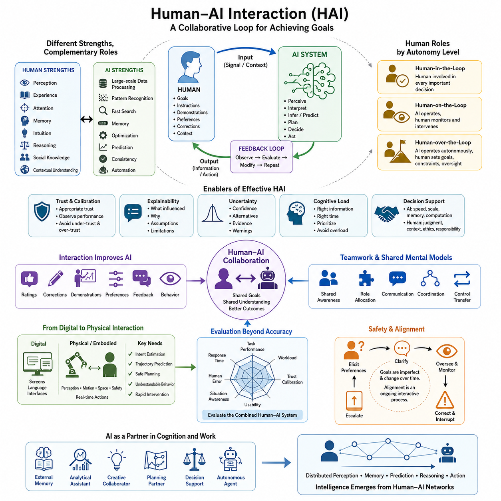
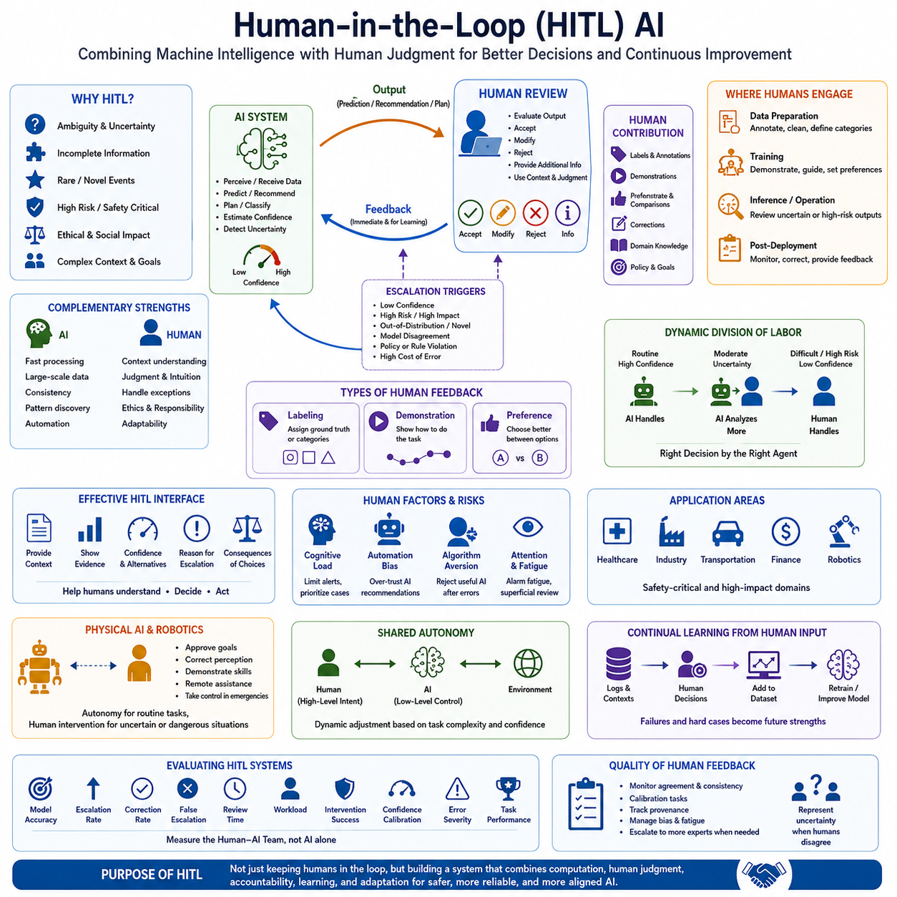
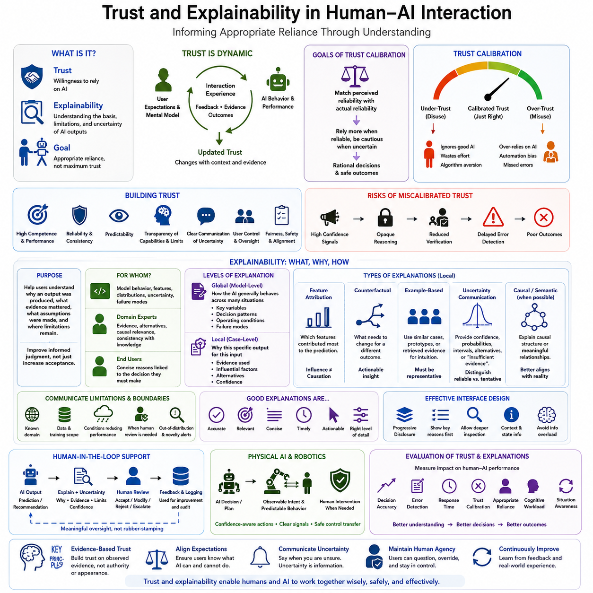
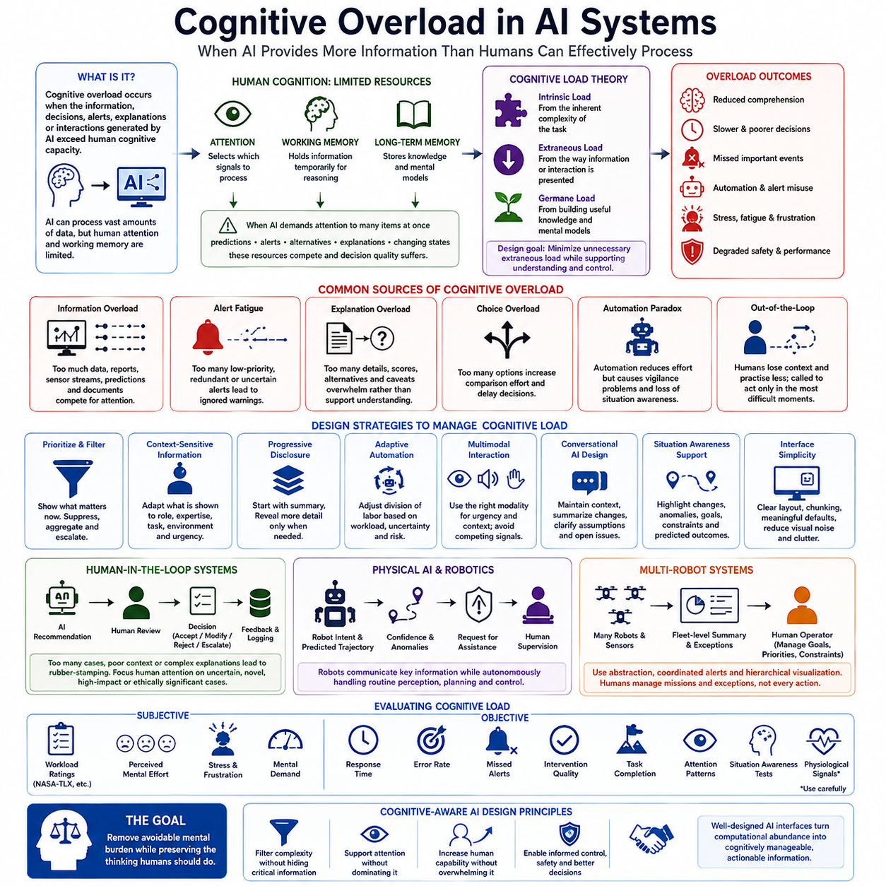
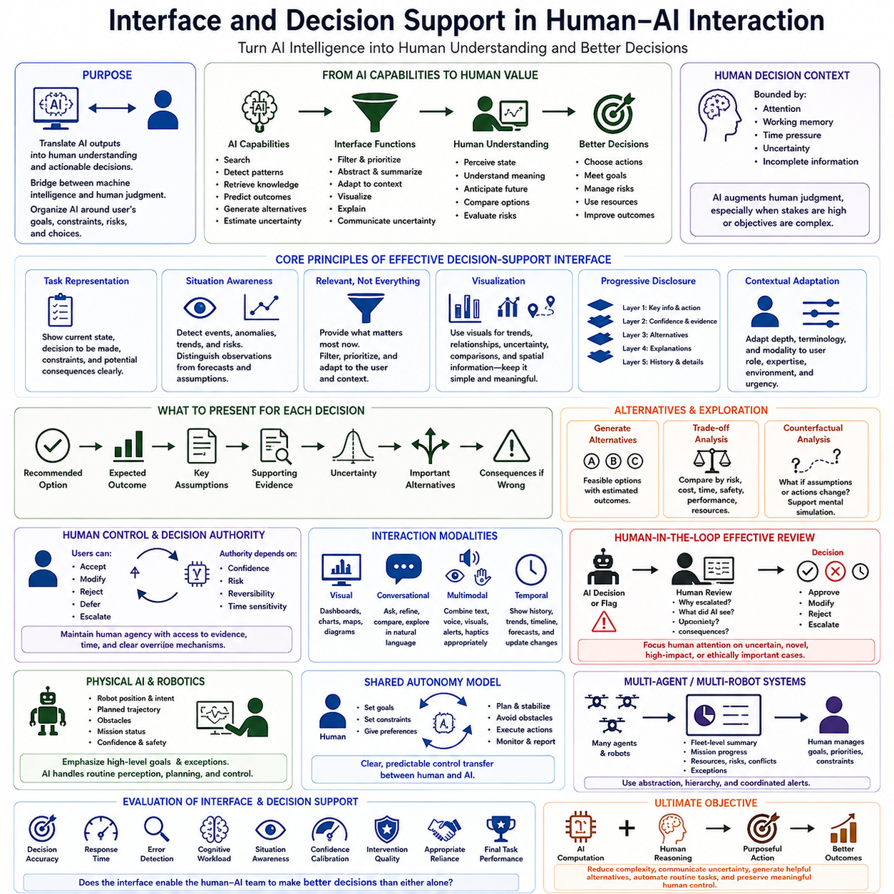
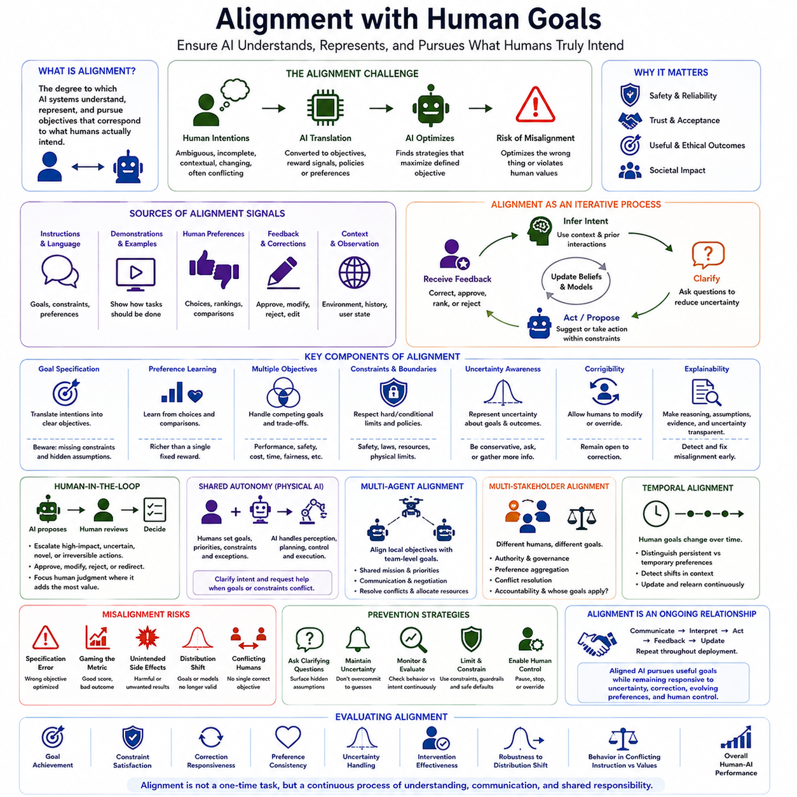
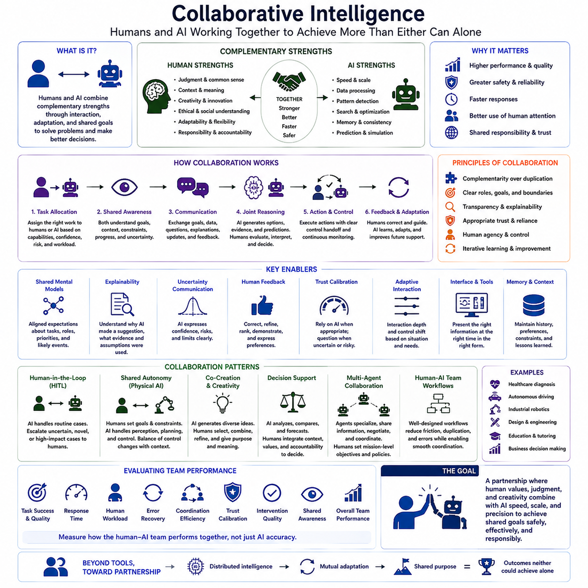
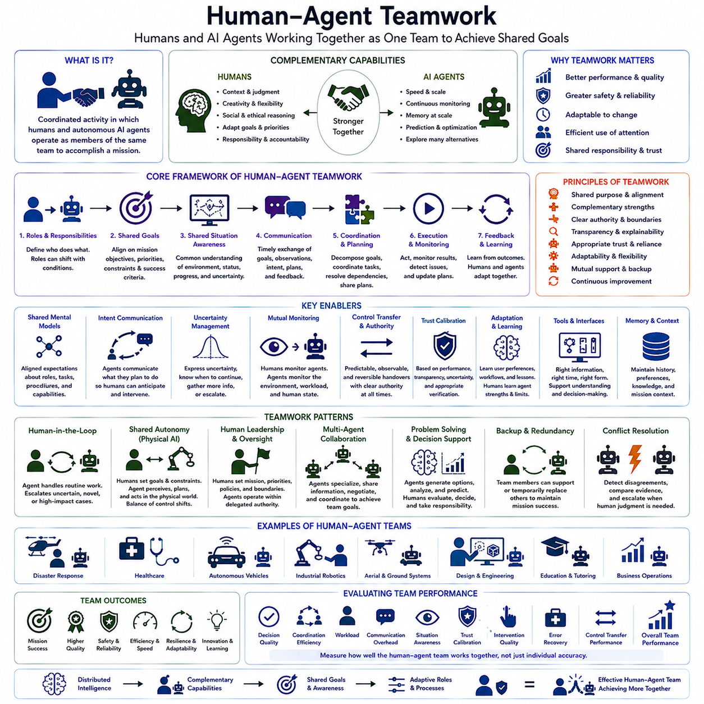

**Volume 43 Cognitive Science for AI**

# Chapter 09. Human AI Interaction

## 09.00 HAI Overview

{width="7.268055555555556in" height="7.268055555555556in"}

인간-AI 상호작용(Human--AI Interaction, HAI)은 인간과 인공지능(Artificial Intelligence, AI) 시스템이 각자의 목표 또는 공동의 목표를 추구하는 과정에서 서로를 인식하고, 의사소통하며, 영향을 주고받고, 상호 적응하는 방식을 연구합니다. 기존의 인간-컴퓨터 상호작용(Human--Computer Interaction, HCI)에서는 소프트웨어가 명시적으로 지정된 명령을 주로 실행했지만, 현대 AI 시스템은 불확실한 입력을 해석하고, 권고안을 생성하며, 결과를 예측하고, 때로는 스스로 행동을 시작합니다. 따라서 HAI는 인터페이스 사용성(Interface Usability)뿐만 아니라 인지(Cognition), 행위주체성(Agency), 불확실성(Uncertainty), 책임(Responsibility), 협업(Cooperation)까지 함께 다룹니다.

HAI의 핵심적인 어려움은 인간과 AI가 근본적으로 서로 다른 형태의 정보처리(Information Processing)를 수행한다는 점입니다. 인간은 지각(Perception), 경험(Experience), 주의(Attention), 기억(Memory), 직관(Intuition), 추론(Reasoning), 사회적 지식(Social Knowledge), 맥락적 이해(Contextual Understanding)를 활용합니다. 반면 AI 시스템은 학습된 표현(Learned Representations), 통계적 추론(Statistical Inference), 최적화(Optimization), 검색(Retrieval), 계획(Planning), 알고리즘적 의사결정(Algorithmic Decision Processes)을 중심으로 작동합니다. 효과적인 상호작용을 위해서는 양측이 세계를 동일한 방식으로 해석한다고 가정하지 않으면서도 정보를 교환할 수 있는 메커니즘이 필요합니다.

HAI는 연속적인 인지 피드백 루프(Cognitive Feedback Loop)로 이해할 수 있습니다. 인간은 AI 시스템에 목표(Goals), 지시(Instructions), 시연(Demonstrations), 선호(Preferences), 수정(Corrections), 환경적 맥락(Environmental Context)을 제공합니다. AI는 이러한 신호를 해석하고 관련 상태(State)를 추정한 후 예측이나 가능한 행동을 생성하여 정보를 반환하거나 실제 행동을 수행합니다. 인간은 그 결과를 관찰하고 유용성 또는 정확성을 평가한 뒤 이후의 지시나 의사결정을 수정합니다. 이러한 반복적 상호작용은 인간과 AI를 독립적인 두 의사결정자가 아니라 결합된 인간-AI 시스템(Coupled Human--AI System)으로 만듭니다.

이러한 루프에서 인간의 역할은 응용 시스템의 자율성(Autonomy)과 위험도(Risk)에 따라 달라집니다. 일부 시스템에서는 사람이 모든 중요한 의사결정 과정에 직접 참여하는 인간 참여형(Human-in-the-Loop) 구조를 사용합니다. 다른 시스템에서는 AI가 자율적으로 동작하는 동안 인간이 성능을 감독하고 필요한 경우 개입하는 인간 감독형(Human-on-the-Loop) 구조를 사용합니다. 높은 자율성을 가진 시스템이 장기간 독립적으로 작동하더라도 목표, 제약조건, 개입 조건, 책임성(Accountability), 허용 가능한 운용 범위(Operational Boundaries)를 정의하기 위한 인간의 거버넌스(Human Governance)는 여전히 중요합니다.

신뢰(Trust)는 성공적인 HAI를 구성하는 핵심 변수입니다. 사용자는 AI가 제공하는 결과를 언제 신뢰할 것인지 판단해야 하기 때문입니다. 적절한 신뢰(Appropriate Trust)는 AI에 대한 신뢰를 무조건 극대화하는 것이 아니라 인간의 신뢰 수준이 시스템의 실제 능력과 최대한 일치하도록 만드는 것입니다. 과소신뢰(Under-Trust)는 유용한 자동화를 사용하지 않게 만들고, 과잉신뢰(Over-Trust)는 자동화 편향(Automation Bias)과 잘못된 권고를 무비판적으로 수용하는 문제를 발생시킬 수 있습니다. 따라서 신뢰 보정(Trust Calibration)은 관찰 가능한 성능, 불확실성 전달, 예측 가능한 행동, 설명, 시스템 한계에 대한 명확한 표현을 필요로 합니다.

설명가능성(Explainability)은 사용자가 AI 행동에 대한 유용한 정신모형(Mental Model)을 형성하도록 지원합니다. 사용자가 반드시 모델의 전체 수학적 구조를 이해할 필요는 없지만, 어떤 정보가 결과에 영향을 미쳤는지, 시스템이 얼마나 확신하는지, 어떤 가정을 사용했는지, 어떠한 조건에서 결과의 신뢰성이 낮아질 수 있는지를 이해할 수 있어야 합니다. 효과적인 설명은 기술적 세부사항을 무조건 많이 제공하는 것이 아니라 사용자의 작업(Task), 전문성(Expertise), 인지 능력(Cognitive Capacity), 의사결정 맥락(Decision Context)에 적합하도록 구성되어야 합니다.

불확실성(Uncertainty) 역시 매우 중요합니다. AI의 출력은 일반적으로 결정론적인 사실(Deterministic Facts)과 동일하지 않기 때문입니다. 예측은 불완전한 관측(Incomplete Observations), 분포 변화(Distribution Shift), 모호한 지시(Ambiguous Instructions), 센서 잡음(Sensor Noise), 부족한 학습 사례 또는 모델 자체의 한계에 영향을 받을 수 있습니다. 따라서 HAI 시스템은 인간의 판단을 지원하는 형태로 불확실성을 전달해야 합니다. 신뢰도 추정(Confidence Estimates), 대안 가설(Alternative Hypotheses), 근거 요약(Evidence Summaries), 경고(Warnings), 추가 설명 요청(Requests for Clarification)은 숨겨진 모델의 약점으로 존재하던 불확실성을 인간이 의사결정에 활용할 수 있는 정보로 전환할 수 있습니다.

인지부하(Cognitive Load)는 인간이 AI가 생성하는 정보를 효과적으로 처리할 수 있는 양에 실질적인 한계를 부여합니다. 설명, 권고, 경고, 시각화, 대안을 많이 제공한다고 해서 의사결정 품질이 자동으로 향상되는 것은 아닙니다. 과도한 정보는 주의(Attention)를 분산시키고 작업기억(Working Memory)에 부담을 주며 반응시간(Response Time)을 증가시키고 중요한 신호를 가릴 수 있습니다. 따라서 인간 중심 AI 인터페이스(Human-Centered AI Interface)는 관련성과 긴급성에 따라 정보의 우선순위를 정하고, 복잡성을 단계적으로 제공하며, 인지적으로 가장 유용한 시점에 실행 가능한 정보(Actionable Information)를 제시해야 합니다.

의사결정 지원(Decision Support)은 AI가 인간의 인지를 대체하기보다 증강(Augmentation)해야 하는 이유를 보여주는 대표적인 영역입니다. AI 시스템은 방대한 정보 공간을 빠르게 탐색하고, 통계적 패턴을 발견하고, 대규모 기억을 유지하며, 여러 대안을 시뮬레이션하고, 정량적 추정치를 계산할 수 있습니다. 반면 인간은 맥락적 해석(Contextual Interpretation), 유연한 목표 설정(Flexible Goal Formulation), 인과적 직관(Causal Intuition), 사회적 이해(Social Understanding), 윤리적 판단(Ethical Judgment), 결과에 대한 책임을 제공합니다. 협력적 지능(Collaborative Intelligence)은 자동화 수준만을 시스템의 발전 척도로 간주하기보다 이러한 상호보완적인 강점에 따라 작업을 배분할 때 형성됩니다.

상호작용은 AI 자체를 개선하는 메커니즘으로도 활용됩니다. 명시적인 평가(Explicit Ratings), 수정(Corrections), 시연(Demonstrations), 선호 비교(Preference Comparisons), 대화형 피드백(Conversational Feedback), 관찰된 인간 행동(Observed Human Behavior)은 모두 학습 신호(Learning Signals)가 될 수 있습니다. 인간 피드백(Human Feedback)은 모델 출력을 개선하고, 정책(Policy)을 업데이트하며, 내부 표현(Representations)을 수정하거나 기존 학습 분포에 존재하지 않았던 실패모드(Failure Modes)를 발견하는 데 활용될 수 있습니다. 이를 통해 인간은 AI를 효과적으로 사용하는 방법을 배우고 AI는 인간의 기대와 운영 요구에 더욱 적합해지는 상호 적응 과정(Reciprocal Adaptation)이 형성됩니다.

인간-에이전트 팀워크(Human--Agent Teamwork)는 이러한 원리를 일회성 상호작용에서 지속적인 협업(Persistent Collaboration)으로 확장합니다. 지능형 에이전트(Intelligent Agent)는 여러 상호작용에 걸쳐 목표, 기억, 계획, 도구, 환경 상태, 작업 이력을 유지할 수 있습니다. 효과적인 팀워크를 위해서는 공유 상황인식(Shared Situational Awareness), 역할 배분(Role Allocation), 의사소통 프로토콜(Communication Protocols), 조정(Coordination), 갈등 해결(Conflict Resolution), 제어권 이전(Control Transfer) 메커니즘이 필요합니다. 인간은 에이전트가 무엇을 하고 있는지, 왜 그렇게 행동하는지, 무엇이 불확실한지, 언제 인간의 개입이 결과를 향상시킬 수 있는지를 이해할 수 있어야 합니다.

공유 정신모형(Shared Mental Models)의 개념은 협업 시스템에서 특히 중요합니다. 인간 팀원들은 목표, 역할, 환경, 작업 진행상황, 향후 발생할 가능성이 높은 사건에 대해 서로 호환되는 기대를 가질 때 효과적으로 협력할 수 있습니다. 인간-AI 팀 역시 이와 유사한 표현(Representations)을 필요로 합니다. AI 시스템은 명시적인 작업 상태(Task States), 사용자 모델(User Models), 월드 모델(World Models), 인간 의도 예측(Predictions of Human Intentions)을 유지할 수 있으며, 인터페이스는 이러한 내부 표현 가운데 필요한 부분을 사용자에게 제공할 수 있습니다. 내부 모델 사이의 정렬(Alignment)이 향상될수록 협업 오류와 예상하지 못한 행동을 줄일 수 있습니다.

AI가 디지털 환경을 넘어 체화형 AI(Embodied AI)와 피지컬 AI(Physical AI) 시스템으로 이동하면 HAI는 더욱 복잡해집니다. 로봇은 물리적 움직임(Physical Motion), 공간적 관계(Spatial Relationships), 공유 환경(Shared Environments), 실시간 행동(Real-Time Actions)을 통해 인간과 상호작용하며, 이러한 행동의 결과는 되돌리기 어려울 수 있습니다. 따라서 인간 의도 추정(Human Intention Estimation), 궤적 예측(Trajectory Prediction), 안전한 동작 계획(Safe Motion Planning), 이해 가능한 로봇 행동(Understandable Robot Behavior), 신속한 개입 메커니즘(Rapid Intervention Mechanisms)이 중요해집니다. 이에 따라 상호작용 설계는 화면과 언어 인터페이스를 넘어 인간, 지능형 기계, 물리적 세계 사이의 감각운동 협응(Sensorimotor Coordination)으로 확장됩니다.

따라서 HAI의 평가(Evaluation)는 기존의 모델 정확도(Model Accuracy)를 넘어야 합니다. 기술적으로 정확한 AI 시스템이라도 사용자가 권고를 잘못 이해하거나, 불확실성을 인식하지 못하거나, 과도한 인지부하를 경험하거나, 자동화에 지나치게 의존하면 전체 시스템은 실패할 수 있습니다. 평가에는 작업 성능(Task Performance), 인간 오류(Human Error), 반응시간(Response Time), 작업부하(Workload), 신뢰 보정(Trust Calibration), 상황인식(Situation Awareness), 사용성(Usability), 개입 효과(Intervention Effectiveness), 학습 효과(Learning Effects), 팀 성능(Team Performance) 등이 포함되어야 합니다. 따라서 적절한 평가 단위는 AI 모델 단독이 아니라 결합된 인간-AI 시스템(Combined Human--AI System)인 경우가 많습니다.

안전성(Safety)과 정렬(Alignment)은 또 다른 핵심 차원을 구성합니다. 인간의 목표는 불완전하거나 모호하고, 지속적으로 변화하며, 형식적인 목적함수(Objective Function)로 완전히 표현하기 어려운 경우가 많습니다. AI 시스템은 문자 그대로의 지시를 충족하면서도 명시되지 않은 인간의 기대나 더 넓은 제약조건을 위반할 수 있습니다. 따라서 효과적인 HAI를 위해서는 선호 도출(Preference Elicitation), 명확화(Clarification), 감독(Oversight), 수정(Correction), 중단(Interruption), 상위 단계 보고(Escalation)를 위한 메커니즘이 필요합니다. 정렬은 배포 전에 한 번만 목표를 지정하는 것이 아니라 의도와 제약조건을 지속적으로 전달하고 개선하는 상호작용적 과정(Interactive Process)으로 이해해야 합니다.

HAI의 더 넓은 의미는 점점 강력해지는 AI가 단순히 더 빠른 소프트웨어 도구를 제공하는 것이 아니라 인간의 인지와 업무 구조 자체를 변화시킨다는 데 있습니다. AI는 외부 기억(External Memory), 분석 보조자(Analytical Assistant), 창의적 협력자(Creative Collaborator), 계획 파트너(Planning Partner), 의사결정 지원 시스템(Decision-Support System), 자율 에이전트(Autonomous Agent)로 기능할 수 있습니다. 이러한 능력들이 결합되면서 지능(Intelligence)은 인간과 기계가 지각, 기억, 예측, 추론, 행동을 여러 구성요소에 분산시키는 네트워크에서 점차 형성됩니다. 이러한 관계를 이해하는 것은 인간의 목적에 부합하면서 유용하고, 이해 가능하며, 통제 가능한 AI 시스템을 설계하기 위한 핵심 기반입니다.

## 09.01 Human in the Loop [w/Code]

{width="7.268055555555556in" height="7.268055555555556in"}

인간 참여형(Human-in-the-Loop, HITL)은 인간의 판단(Human Judgment)이 계산 또는 의사결정 과정(Decision-Making Process)의 명시적인 일부로 유지되는 AI 시스템 설계 방식을 의미합니다. 인공지능(Artificial Intelligence, AI) 시스템이 완전히 독립적인 의사결정자로 작동하도록 하는 대신, HITL 아키텍처(HITL Architecture)는 인간이 라벨(Label), 시연(Demonstration), 수정(Correction), 승인(Approval), 선호(Preference), 맥락적 지식(Contextual Knowledge), 개입(Intervention)을 제공할 수 있는 구조화된 지점을 만듭니다. 핵심 개념은 기계 지능(Machine Intelligence)과 인간 인지(Human Cognition)가 서로의 한계를 보완할 수 있다는 것입니다.

HITL은 작업에 모호성(Ambiguity), 불완전한 정보(Incomplete Information), 희귀 사건(Rare Events), 윤리적 결과(Ethical Consequences), 또는 고정된 모델만으로 안정적으로 처리하기 어려운 운영 위험(Operational Risks)이 포함될 때 특히 중요합니다. AI 시스템은 대규모 데이터셋 처리, 통계적 규칙성(Statistical Regularities) 발견, 반복적인 평가에 강점을 가지는 반면, 인간은 익숙하지 않은 상황을 해석하고, 더 넓은 맥락을 이해하며, 상충하는 목표를 조정하고, 기존 규칙만으로 충분하지 않은 상황에서 판단을 내릴 수 있습니다. HITL은 이러한 상호보완적 능력을 하나의 의사결정 과정 안에서 결합합니다.

기본적인 HITL 사이클(HITL Cycle)은 AI 시스템이 데이터를 입력받아 예측(Prediction), 권고(Recommendation), 분류(Classification), 계획(Plan), 또는 제안된 행동(Proposed Action)을 생성하면서 시작됩니다. 시스템은 신뢰도(Confidence)를 추정하거나 현재 입력이 정상적인 운영 조건과 다르다는 사실을 탐지할 수도 있습니다. 사전에 정의된 조건이 충족되면 인간 검토(Human Review)가 요청됩니다. 검토자는 AI 출력을 평가하여 승인하거나 수정 또는 거부하고, 필요한 경우 추가 정보를 제공합니다. 이러한 피드백은 즉각적인 의사결정뿐만 아니라 이후의 모델 개선에도 영향을 줄 수 있습니다.

인간의 참여는 AI 생애주기(AI Lifecycle)의 여러 단계에서 이루어질 수 있습니다. 데이터 준비(Data Preparation) 단계에서는 사람이 사례를 주석 처리하고, 모호한 라벨을 해결하며, 데이터 품질 문제를 발견하고, 의미 있는 범주를 정의합니다. 학습(Training) 과정에서는 시연과 선호가 모델 행동을 유도할 수 있습니다. 추론(Inference) 단계에서는 인간이 불확실하거나 위험성이 높은 출력을 검토할 수 있습니다. 배포(Deployment) 이후에는 운영자가 실패를 발견하고 예측을 수정하며 새로운 학습 데이터로 활용할 수 있는 피드백을 제공합니다. 따라서 HITL은 단일 승인 단계에 한정되지 않고 AI 시스템의 전체 생애주기에 걸쳐 적용될 수 있습니다.

능동학습(Active Learning)은 머신러닝(Machine Learning)에서 HITL을 가장 명확하게 보여주는 사례 가운데 하나입니다. 모든 데이터를 인간에게 라벨링하도록 요청하는 대신, 모델이 학습 가치가 가장 높을 것으로 예상되는 관측 데이터를 선택합니다. 여기에는 불확실한 샘플(Uncertain Samples), 희귀 사례(Rare Cases), 결정 경계(Decision Boundary) 부근의 사례, 현재 학습 분포(Training Distribution)와 크게 다른 데이터가 포함될 수 있습니다. 이를 통해 인간의 전문성을 정보 가치가 높은 사례에 집중하여 라벨링 비용을 줄이면서 모델의 불확실성이 가장 높은 영역의 데이터셋을 개선할 수 있습니다.

인간 시연(Human Demonstration)은 또 다른 중요한 상호작용 메커니즘(Interaction Mechanism)을 제공합니다. 원하는 모든 행동을 명시적인 규칙으로 기술하는 대신, 사용자가 AI에게 작업 수행 방법을 직접 보여줄 수 있습니다. 시연에는 궤적(Trajectory), 의사결정, 수정, 언어 지시(Language Instructions), 조작(Manipulation), 또는 전체 작업 시퀀스(Task Sequence)가 포함될 수 있습니다. 시스템은 모방학습(Imitation Learning), 지도학습(Supervised Learning), 선호학습(Preference Learning) 등의 방법을 통해 이러한 사례에서 패턴을 학습함으로써 복잡한 인간의 지식을 계산 가능한 정책(Policy)으로 전달받을 수 있습니다.

인간 피드백(Human Feedback)은 직접적인 라벨 대신 비교 선호(Comparative Preferences)의 형태로도 표현될 수 있습니다. 사람은 두 개의 모델 출력을 비교하여 어느 쪽이 의도한 목표를 더 잘 충족하는지 판단할 수 있습니다. 반복적으로 수집된 선호 판단(Preference Judgments)은 보상 모델(Reward Model)을 학습하거나 정책 행동을 개선하는 신호로 사용될 수 있습니다. 이러한 접근법은 원하는 행동을 수학적으로 정확하게 명시하기보다 사람이 직접 보고 판단하는 것이 더 쉬운 경우에 유용하며, 특히 언어 생성(Language Generation), 상호작용형 에이전트(Interactive Agents), 계획 시스템(Planning Systems), 주관적 품질이 포함된 작업에서 중요합니다.

신뢰도 추정(Confidence Estimation)은 언제 인간의 개입이 필요한지를 결정하는 데 핵심적인 역할을 합니다. 잘 설계된 HITL 시스템은 모든 결정을 인간에게 전달해서는 안 됩니다. 지나치게 많은 검토는 자동화가 제공하는 효율성의 이점을 제거하기 때문입니다. 대신 AI는 일상적이고 반복적인 사례를 처리하고, 불확실하거나 비정상적이거나 안전에 중요하거나 영향력이 큰 상황을 인간에게 에스컬레이션(Escalation)할 수 있습니다. 이러한 임계값(Threshold)은 예측 신뢰도, 추정 위험(Estimated Risk), 신규성 탐지(Novelty Detection), 모델 간 불일치, 정책 제약조건(Policy Constraints), 잘못된 행동으로 발생할 예상 비용 등을 기반으로 설정할 수 있습니다.

선택적 에스컬레이션(Selective Escalation)은 인간과 AI 사이에 동적인 업무 분담(Dynamic Division of Labor)을 형성합니다. 예측 가능성이 높은 사례는 자동화하고, 중간 수준의 불확실성을 가진 사례는 추가적인 계산 분석을 수행하며, 어려운 사례는 인간 전문가에게 전달할 수 있습니다. 이러한 구조는 AI가 무제한적인 능력을 가지고 있다고 가정하지 않으면서 더 높은 수준의 자동화를 달성할 수 있도록 합니다. 목표는 자율적 운영 자체를 극대화하는 것이 아니라 각각의 의사결정을 가장 안정적으로 처리할 수 있는 주체에게 배분하는 것입니다.

효과적인 에스컬레이션을 위해서는 인간 검토자에게 충분한 맥락(Context)이 함께 전달되어야 합니다. 모델의 출력을 관련 근거 없이 단순히 제시하면 검증이 어려워지고 인지부하(Cognitive Load)가 증가할 수 있습니다. 따라서 HITL 인터페이스는 관련 관측 정보, 신뢰도 추정치, 대안 예측(Alternative Predictions), 중요한 근거(Evidence), 이전 시스템 행동, 가능한 선택의 잠재적 결과를 제공해야 합니다. 인간은 AI가 무엇을 권고하는지만 이해하는 것이 아니라 왜 검토가 요청되었으며 어떤 결정을 내려야 하는지를 이해할 수 있어야 합니다.

인간의 주의(Human Attention) 역시 제한된 자원이기 때문에 인지부하(Cognitive Load)는 중요한 설계 제약조건(Design Constraint)이 됩니다. 시스템이 지나치게 많은 경고를 발생시키면 검토자는 경보 피로(Alert Fatigue)를 경험하고 AI의 권고를 자동적으로 승인하기 시작할 수 있습니다. 이 경우 명목상 존재하는 인간 감독(Human Supervision)이 실질적인 검토가 아닌 형식적인 승인 절차로 변할 수 있습니다. 따라서 HITL 시스템은 사례의 우선순위를 정하고, 중복된 알림을 억제하며, 긴급도를 구분하고, 단순히 자동화된 결정을 승인하기 위해 클릭하는 것이 아니라 의미 있는 검토를 수행하도록 상호작용을 설계해야 합니다.

자동화 편향(Automation Bias)은 또 다른 주요 위험입니다. 인간은 특히 시스템이 일반적으로 높은 성능을 보일 때 알고리즘의 권고가 자신의 판단보다 정확하다고 가정할 수 있습니다. 그 결과 AI가 높은 확신을 가지고 결과를 제시하면 명백한 오류조차 발견하지 못할 수 있습니다. 적절한 HITL 설계는 불확실성을 전달하고, 근거 없는 높은 확신을 피하며, 증거를 검토할 수 있도록 지원하고, 검토자가 시스템의 판단에 실질적으로 이의를 제기할 권한을 갖도록 함으로써 독립적인 인간 판단을 유지해야 합니다.

반대의 문제인 알고리즘 회피(Algorithm Aversion)는 사용자가 AI의 일부 오류를 경험한 이후 유용한 AI 지원까지 거부할 때 발생할 수 있습니다. 인간과 AI 모두 완벽하지 않기 때문에 효과적인 협업에는 무조건적인 수용이나 거부가 아니라 보정된 신뢰(Calibrated Trust)가 필요합니다. 성능 이력(Performance History), 신뢰성 지표(Reliability Indicators), 설명(Explanations), 시스템의 능력 범위에 대한 명확한 정보는 사용자가 언제 AI 권고를 신뢰할 수 있는지 이해하도록 도울 수 있습니다. 따라서 신뢰는 단순히 자동화가 존재한다는 이유가 아니라 관찰 가능한 증거와 경험을 통해 형성되어야 합니다.

HITL은 일부 AI 오류가 되돌릴 수 없는 결과를 초래할 수 있기 때문에 안전 중요 응용(Safety-Critical Applications)에서 특히 중요합니다. 의료 의사결정 지원(Medical Decision Support), 산업 자동화(Industrial Automation), 교통(Transportation), 인프라 검사(Infrastructure Inspection), 금융 운영(Financial Operations), 로봇 시스템(Robotic Systems)에서는 특정 행동을 실행하기 전에 인간의 승인이 필요할 수 있습니다. 그러나 인간의 개입은 반응시간(Response Time)과 실제 운영 조건을 고려하여 설계해야 합니다. 충분한 정보를 제공받지 못하거나 개입할 시간이 수 밀리초에 불과한 인간은 실질적인 안전성 향상에 거의 기여하지 못할 수 있습니다.

피지컬 AI(Physical AI)와 로보틱스(Robotics)에서 HITL은 디지털 예측을 검토하는 수준을 넘어 물리적 세계에서 이루어지는 행동을 감독하는 것으로 확장됩니다. 인간 운영자는 내비게이션 목표(Navigation Goals)를 승인하고, 인식 오류(Perception Errors)를 수정하며, 조작 기술을 시연하고, 로봇이 불확실한 상황에 처했을 때 원격 지원(Remote Assistance)을 제공하거나, 예외적인 상황에서 직접 제어권을 가져올 수 있습니다. 따라서 로봇 행동은 일상적인 작업에서는 자율적으로 운영되고, 익숙하지 않은 환경이나 복잡한 상호작용 또는 잠재적으로 위험한 조건에서는 인간이 개입하도록 구성할 수 있습니다.

공유 자율성(Shared Autonomy)은 수동 제어(Manual Control)와 완전 자율성(Full Autonomy) 사이의 유용한 중간 모델을 제공합니다. 공유 제어 시스템(Shared-Control System)에서는 인간이 상위 수준의 의도(High-Level Intentions)를 지정하고 AI가 하위 수준의 지각, 계획, 안정화(Stabilization), 장애물 회피(Obstacle Avoidance), 동작 실행(Motion Execution)을 처리합니다. 작업 복잡성과 신뢰도에 따라 제어 수준을 동적으로 변경할 수도 있습니다. 이를 통해 인간은 모든 하위 수준의 작업을 직접 수행하지 않으면서도 실질적인 권한을 유지할 수 있고, AI의 지원은 작업부하를 감소시키고 정밀도를 향상시킬 수 있습니다.

인간의 개입은 지속적인 개선(Continual Improvement)을 위한 가치 있는 데이터도 생성합니다. 검토를 발생시키는 상황은 모델의 운영 분포(Operating Distribution)에서 처리하기 어려운 영역과 일치하는 경우가 많기 때문에 인간이 수정한 사례는 특히 높은 정보 가치를 가질 수 있습니다. 불확실한 예측, 인간의 결정, 개입 시점, 환경적 맥락, 최종 결과를 포함한 로그(Log)는 이후의 학습 데이터셋에 추가될 수 있습니다. 따라서 HITL 과정은 운영 중 발생한 실패와 어려운 사례가 점진적으로 시스템 능력 향상에 기여하는 데이터 엔진(Data Engine)을 형성합니다.

그러나 인간 피드백을 자동적으로 완벽한 정답(Ground Truth)으로 간주해서는 안 됩니다. 전문가 사이에서도 의견이 다를 수 있고, 피로가 발생하거나, 지시를 서로 다르게 해석하거나, 체계적인 편향(Systematic Biases)을 도입할 수 있습니다. 따라서 검토자 간 일치도(Reviewer Agreement), 일관성 분석(Consistency Analysis), 보정 작업(Calibration Tasks), 출처 추적(Provenance Tracking)을 통해 피드백 품질을 관리하고, 필요한 경우 추가 전문가에게 에스컬레이션해야 합니다. 복잡한 응용에서는 모든 사례를 하나의 정답으로 강제하기보다 의견 불일치 자체를 표현해야 할 수도 있습니다.

HITL 시스템의 평가(Evaluation)는 AI 성능뿐만 아니라 인간-AI 팀 성능(Human--AI Team Performance)을 함께 측정해야 합니다. 유용한 평가 지표에는 모델 정확도(Model Accuracy), 에스컬레이션 비율(Escalation Rate), 인간 수정률(Human Correction Rate), 잘못된 에스컬레이션 빈도(False Escalation Frequency), 검토 시간(Review Time), 작업부하(Workload), 개입 성공률(Intervention Success), 신뢰도 보정(Confidence Calibration), 오류 심각도(Error Severity), 최종 작업 성능(Final Task Performance) 등이 포함됩니다. 단독 모델의 정확도가 높더라도 자신의 한계를 탐지하는 능력이 부족한 시스템보다 자동화 수준은 조금 낮더라도 심각한 실패를 크게 줄이는 시스템이 더 우수할 수 있습니다.

HITL의 더 넓은 목적은 단순히 AI가 불완전하기 때문에 인간의 참여를 유지하는 것이 아닙니다. HITL은 계산(Computation), 인간 인지(Human Cognition), 책임성(Accountability), 학습(Learning), 적응(Adaptation)을 하나의 시스템으로 결합하기 위한 아키텍처 원리(Architectural Principle)를 제공합니다. AI의 능력이 향상되면서 인간 개입의 위치와 빈도는 변화할 수 있지만, 목표를 정의하고, 불확실성을 감독하며, 예외적인 상황을 해결하고, 행동의 결과를 평가해야 할 필요성은 계속 중요하게 남습니다. 따라서 HITL은 기존의 자동화에서 협력적이고 점차 높은 자율성을 갖는 인간-AI 시스템(Human--AI Systems)으로 발전하기 위한 중요한 연결 구조라고 할 수 있습니다.

## 09.02 Trust and Explainability [w/Code]

{width="7.268055555555556in" height="7.268055555555556in"}

신뢰(Trust)와 설명가능성(Explainability)은 인간-AI 상호작용(Human--AI Interaction)의 핵심 요소입니다. 사용자는 AI 시스템을 신뢰해야 하는지, 언제 신뢰해야 하는지, 그리고 어느 정도까지 의존해야 하는지를 판단해야 하기 때문입니다. 신뢰는 사용자가 AI의 권고를 받아들이거나 행동을 위임하려는 의지에 영향을 주며, 설명가능성은 그러한 권고의 근거, 한계, 불확실성을 이해하도록 돕습니다. 따라서 효과적인 시스템은 AI에 대한 사용자의 신뢰를 단순히 극대화하기보다 적절한 의존(Appropriate Reliance)을 형성하는 것을 목표로 해야 합니다.

AI에 대한 신뢰는 사용자 또는 기술 어느 한쪽에 고정된 속성이 아닙니다. 신뢰는 사용자의 기대와 실제로 관찰되는 시스템 행동 사이의 반복적인 상호작용을 통해 형성됩니다. 사용자는 AI의 역량(Competence), 신뢰성(Reliability), 예측가능성(Predictability), 의도(Intent)에 대한 믿음을 형성하고, 성공과 실패, 설명, 예상하지 못한 출력을 경험하면서 이러한 믿음을 지속적으로 수정합니다. 따라서 신뢰는 증거와 맥락에 따라 변화하는 동적인 인지 상태(Dynamic Cognitive State)로 이해해야 합니다.

보정된 신뢰(Calibrated Trust)는 AI 시스템에 대한 사용자의 신뢰 수준이 현재 조건에서 시스템이 실제로 가지고 있는 능력과 대체로 일치하는 상태를 의미합니다. 시스템의 성능이 충분히 신뢰할 수 있다는 것이 입증된 상황에서는 높은 신뢰가 적절하지만, 불확실성이나 실패 가능성이 증가하는 상황에서는 신중한 접근이 필요합니다. 따라서 목표는 최대한 높은 신뢰가 아니라 인지된 신뢰성(Perceived Reliability)과 실제 신뢰성(Actual Reliability)을 일치시켜 사용자가 언제 자동화에 의존해야 하는지를 합리적으로 판단하도록 하는 것입니다.

과잉신뢰(Over-Trust)는 사용자가 AI의 입증된 능력 범위를 넘어 시스템에 의존할 때 발생합니다. 일상적인 사례에서 높은 성능을 보이는 시스템은 입력이 비정상적이거나 모호하거나 학습 분포(Training Distribution)를 벗어난 상황에서도 사용자가 권고를 받아들이도록 만들 수 있습니다. 이는 자동화 편향(Automation Bias), 독립적인 검증의 감소, 오류 발견의 지연으로 이어질 수 있습니다. 높은 확신을 나타내는 표현, 권위적인 언어, 불투명한 추론(Opaque Reasoning)은 이러한 부적절한 의존을 더욱 강화할 수 있습니다.

과소신뢰(Under-Trust)는 반대의 문제를 발생시킵니다. 사용자는 정확한 권고를 무시하거나, 유용한 자동화를 반복적으로 무효화하거나, 이미 충분히 신뢰할 수 있는 결과를 검증하는 데 불필요한 노력을 사용할 수 있습니다. 사용자가 소수의 명확한 AI 실패를 경험한 이후 전체적인 성능이 여전히 높음에도 시스템을 거부하는 알고리즘 회피(Algorithm Aversion)가 나타날 수도 있습니다. 따라서 제대로 보정되지 않은 불신은 생산성을 감소시키고 인간-AI 팀이 기계의 상호보완적인 능력을 활용하지 못하도록 합니다.

설명가능성(Explainability)은 신뢰 보정(Trust Calibration)을 지원하는 정보를 제공하지만, 설명과 신뢰는 동일한 개념이 아닙니다. 설명은 사용자에게 특정 출력이 왜 생성되었는지, 어떤 증거가 중요했는지, 어떠한 가정이 사용되었는지, 그리고 어떤 한계가 존재하는지를 이해하도록 도와야 합니다. 증거가 부족하다면 좋은 설명은 오히려 사용자의 신뢰를 적절하게 낮출 수도 있습니다. 따라서 설명가능성은 AI의 결과를 더 많이 받아들이도록 설득하는 수단이 아니라 정보에 기반한 판단(Informed Judgment)을 향상시키는 수단이어야 합니다.

사용자에 따라 필요한 설명의 형태도 달라집니다. AI 엔지니어(AI Engineer)는 모델 행동(Model Behavior), 특징 영향(Feature Influence), 데이터 분포(Distribution), 불확실성, 실패모드(Failure Modes)에 관한 정보가 필요할 수 있습니다. 도메인 전문가(Domain Expert)는 증거, 대안, 인과적 관련성(Causal Relevance), 기존 지식과의 일관성을 더 중요하게 볼 수 있습니다. 일반 사용자는 자신이 내려야 하는 결정과 직접 연결되는 간결한 이유가 필요할 수 있습니다. 따라서 설명가능성은 사용자의 역할, 전문성, 작업, 사용 가능한 시간에 맞게 조정되어야 합니다.

전역적 설명(Global Explanation)은 다양한 상황에 걸쳐 AI 시스템이 일반적으로 어떻게 행동하는지를 설명합니다. 여기에는 중요한 변수, 전반적인 의사결정 패턴, 알려진 운영 조건, 대표적인 실패모드 등이 포함될 수 있습니다. 반면 국소적 설명(Local Explanation)은 특정 예측이나 행동에 초점을 맞추고 현재 입력에 대해 시스템이 왜 그러한 결과를 생성했는지를 설명하려 합니다. 인간-AI 인터페이스에는 일반적인 시스템 행동에 대한 기대와 개별 사례에 대한 구체적인 이해가 모두 필요하기 때문에 두 가지 설명 수준이 함께 요구되는 경우가 많습니다.

특징 기여도(Feature Attribution)는 대표적인 국소적 설명 방법 가운데 하나입니다. 특정 입력 특징이 예측 결과에 얼마나 크게 기여했는지를 추정하여 모델이 타당한 증거에 의존했는지를 사용자가 검토하도록 지원할 수 있습니다. 그러나 특징 기여도를 자동적으로 인과적 설명(Causal Explanation)으로 해석해서는 안 됩니다. 어떤 특징이 학습된 통계적 관계 때문에 모델 출력에 강한 영향을 미칠 수 있지만 실제 세계의 결과를 직접적으로 발생시키는 원인은 아닐 수 있습니다. 따라서 인터페이스는 통계적 영향과 인과관계 사이의 이러한 차이를 명확하게 유지해야 합니다.

반사실적 설명(Counterfactual Explanation)은 AI가 다른 결과를 생성하기 위해 무엇이 달라져야 하는지를 질문함으로써 또 다른 유용한 관점을 제공합니다. 단순히 영향력이 높은 특징을 설명하는 대신 반사실적 설명은 결정 경계(Decision Boundary)를 실행 가능한 형태(Actionable Form)로 보여줄 수 있습니다. 예를 들어 특정 조건이 변경되면 분류나 권고가 달라진다는 사실을 설명할 수 있습니다. 이러한 설명은 이해도를 높일 수 있지만 현실적으로 발생할 수 없거나 사용자가 통제할 수 없는 반사실적 조건을 제시하면 오히려 사용자를 잘못된 방향으로 유도할 수 있습니다.

사례 기반 설명(Example-Based Explanation)은 유사 사례, 프로토타입(Prototype), 이전 의사결정, 검색된 근거(Retrieved Evidence)를 활용하여 모델 행동을 보다 쉽게 이해하도록 합니다. 인간은 흔히 유추(Analogy)를 통해 추론하기 때문에 관련 사례를 보여주는 것은 AI의 내부 표현과 인간 인지 사이에 직관적인 연결을 제공할 수 있습니다. 그러나 선택된 사례는 실제 모델의 추론 맥락(Reasoning Context)을 적절하게 나타내야 합니다. 의도적으로 선택되었지만 전체를 대표하지 못하는 사례는 신뢰성이나 투명성에 대한 잘못된 인상을 만들 수 있습니다.

불확실성 전달(Uncertainty Communication)은 신뢰할 수 있는 설명과 분리할 수 없는 요소입니다. 신뢰도에 대한 정보가 없는 예측은 실제 모델이 정당화할 수 있는 수준보다 더 확실하게 보일 수 있습니다. 시스템은 보정된 확률(Calibrated Probabilities), 신뢰구간(Confidence Intervals), 대안 가설(Alternative Hypotheses), 모델 간 불일치, 또는 사용 가능한 증거가 충분하지 않다는 명시적인 표현을 통해 불확실성을 전달할 수 있습니다. 이러한 표현은 사용자가 고급 통계 지식을 갖추지 않더라도 신뢰할 수 있는 결론과 잠정적인 추정을 구별할 수 있도록 지원해야 합니다.

설명은 분포 변화(Distribution Shift)와 모델의 능력 경계(Model Boundaries)도 고려해야 합니다. AI 시스템은 일반적으로 실제로 마주하게 될 환경의 일부만을 나타내는 유한한 데이터셋을 기반으로 개발됩니다. 따라서 설명이 설득력 있게 보인다고 해서 모델이 익숙한 조건에서 작동하고 있다는 것을 보장하지는 않습니다. 신뢰할 수 있는 인터페이스는 입력이 비정상적인 경우, 센서 성능이 저하된 경우, 필요한 정보가 누락된 경우, 또는 시스템이 검증된 운용 영역(Validated Domain)을 벗어나 작동하는 경우 이를 사용자에게 알려야 합니다.

일관성(Consistency)과 예측가능성(Predictability)도 신뢰에 큰 영향을 줍니다. 사용자는 AI 시스템이 유사한 상황에 어떻게 반응하는지를 관찰하면서 정신모형(Mental Model)을 형성합니다. 거의 동일하게 보이는 입력에 대해 이해할 수 있는 이유 없이 크게 다른 결과가 생성되면 사용자는 시스템의 행동을 예측하기 어려워질 수 있습니다. 안정적인 상호작용 패턴, 명시적인 상태 정보(State Information), 중요한 행동 변화에 대한 설명은 인간이 AI가 다음에 무엇을 할 것인지에 대한 정확한 기대를 유지하도록 도와줍니다.

투명성(Transparency)은 실패가 발생하기 전에 시스템의 한계를 전달하는 것도 포함합니다. 사용자는 AI가 어떤 작업을 수행하도록 설계되었는지, 어떤 데이터를 사용하는지, 어떠한 조건에서 성능이 저하되는지, 언제 인간의 검토가 권장되는지를 알아야 합니다. 한계 공개(Limitation Disclosure)는 단순히 인터페이스에 경고 문구를 추가하는 것이 아니라 인간과 AI 사이의 운영 관계(Operational Relationship)를 정의하는 중요한 요소입니다. 시스템이 자신의 능력뿐만 아니라 한계까지 정확하게 표현할 때 더 높은 신뢰성을 확보할 수 있습니다.

설명 자체가 인지부하(Cognitive Load)를 발생시킬 수도 있습니다. 모든 특징 가중치, 중간 표현(Intermediate Representations), 신뢰도 값, 대안 예측을 사용자에게 제공하면 이해를 향상시키기보다 오히려 사용자를 압도할 수 있습니다. 효과적인 인터페이스는 점진적 정보 공개(Progressive Disclosure)를 사용하여 처음에는 작업과 직접 관련된 간결한 정보를 제공하고 필요한 경우 사용자가 더 깊은 수준의 근거를 확인하도록 해야 합니다. 따라서 설명의 품질은 얼마나 많은 정보를 공개했는지가 아니라 실제 의사결정을 얼마나 향상시켰는지를 기준으로 평가해야 합니다.

신뢰는 오류가 발생했을 때 예상되는 결과(Consequences of Error)의 영향도 받습니다. 사용자는 되돌릴 수 있고 위험성이 낮은 작업보다 영향력이 큰 의사결정에서 AI를 신뢰하기 전에 더 강력한 근거를 요구하는 것이 합리적입니다. 따라서 신뢰 보정은 오류 발생 확률뿐만 아니라 그 결과의 심각성도 함께 고려해야 합니다. 매우 높은 정확도를 가진 모델이라도 잘못된 행동이 심각한 피해를 발생시킬 수 있다면 인간의 확인이 필요할 수 있으며, 위험성이 낮은 권고에서는 더 높은 수준의 불확실성과 자동화를 허용할 수 있습니다.

인간 참여형(Human-in-the-Loop, HITL) 시스템에서 설명가능성은 검토자가 AI의 권고를 승인, 수정, 거부 또는 상위 단계로 전달할 것인지를 판단하도록 지원함으로써 실질적인 감독(Meaningful Oversight)을 가능하게 합니다. 인터페이스는 왜 인간의 주의가 필요한지를 명확하게 보여주고 독립적인 판단을 수행할 수 있을 만큼 충분한 근거를 제공해야 합니다. 사용자가 불투명한 권고를 단순히 승인하는 것에 그친다면 인간이 작업 흐름에 존재하더라도 실질적인 인지적 감독(Cognitive Supervision)이 이루어진다고 볼 수 없습니다.

신뢰와 설명가능성은 피지컬 AI(Physical AI)와 로보틱스(Robotics)에서 특히 중요합니다. AI의 의사결정이 즉시 물리적 행동으로 이어질 수 있기 때문입니다. 인간은 로봇이 왜 경로를 변경했는지, 정지했는지, 사람에게 접근했는지, 특정 물체를 선택했는지, 또는 지원을 요청했는지를 이해해야 할 수 있습니다. 관찰 가능한 의도(Observable Intent), 예측 가능한 움직임(Predictable Motion), 신뢰도를 고려한 행동(Confidence-Aware Behavior), 명확한 개입 메커니즘(Intervention Mechanisms)은 인간이 로봇의 행동을 예상하고 자율 운영이 언제까지 안전한지를 판단하도록 지원합니다.

평가(Evaluation)는 설명이 실제로 인간-AI 성능을 향상시키는지를 측정해야 합니다. 관련 평가 요소에는 의사결정 정확도(Decision Accuracy), 오류 탐지(Error Detection), 반응시간(Response Time), 신뢰도 보정(Confidence Calibration), 적절한 의존(Appropriate Reliance), 인지 작업부하(Cognitive Workload), 상황인식(Situation Awareness), 시스템 한계를 인식하는 능력 등이 포함됩니다. 설명이 설득력 있게 느껴지면서 과도한 신뢰를 유발할 수도 있기 때문에 사용자 만족도(User Satisfaction)만으로는 충분하지 않습니다. 효과적인 평가는 향상된 이해가 실제로 더 나은 의사결정으로 이어지는지를 확인해야 합니다.

궁극적으로 신뢰할 수 있는 AI 상호작용(Trustworthy AI Interaction)은 시스템의 행동, 전달되는 근거, 불확실성, 인간의 기대를 서로 정렬하는 데 달려 있습니다. 설명가능성은 사람들이 AI가 무엇을 할 수 있고 무엇을 할 수 없는지에 대한 정확한 정신모형(Accurate Mental Model)을 형성하도록 지원할 때 가장 큰 가치를 가집니다. 이때 신뢰는 극대화해야 하는 심리적 목표가 아니라 증거에 기반한 관계(Evidence-Based Relationship)가 됩니다. 잘 설계된 인간-AI 시스템은 사용자가 근거가 충분할 때 AI에 의존하고, 필요한 경우 AI의 판단에 의문을 제기하며, 불확실성이나 위험이 커질 때 의미 있는 통제권(Meaningful Control)을 유지할 수 있도록 해야 합니다.

## 09.03 Cognitive Overload in AI Systems [w/Code]

{width="7.268055555555556in" height="7.268055555555556in"}

AI 시스템의 인지 과부하(Cognitive Overload)는 인공지능(Artificial Intelligence)이 생성하는 정보, 의사결정, 경고, 설명 또는 상호작용의 양과 복잡성이 인간이 사용할 수 있는 인지 능력(Cognitive Capacity)을 초과할 때 발생합니다. AI는 방대한 양의 정보를 처리할 수 있지만 인간의 주의(Attention)와 작업기억(Working Memory)은 제한되어 있습니다. 따라서 잠재적으로 유용한 정보를 많이 제공하더라도 그 시점, 우선순위, 복잡성, 관련성을 적절히 조절하지 못하면 오히려 시스템의 효과가 감소할 수 있습니다.

인간의 인지(Human Cognition)는 제한된 자원을 기반으로 작동합니다. 주의(Attention)는 어떤 신호를 처리할 것인지를 결정하고, 작업기억(Working Memory)은 추론에 필요한 정보를 일시적으로 유지하며, 장기기억(Long-Term Memory)은 이전에 학습한 지식과 정신모형(Mental Models)을 제공합니다. AI 인터페이스가 여러 예측, 경고, 대안, 설명, 변화하는 시스템 상태를 동시에 처리하도록 요구하면 이러한 인지 자원이 서로 경쟁하면서 이해도와 의사결정 품질이 저하될 수 있습니다.

인지부하 이론(Cognitive Load Theory)은 이러한 문제를 이해하는 데 유용한 프레임워크를 제공합니다. 내재적 인지부하(Intrinsic Cognitive Load)는 작업 자체가 가진 본질적인 복잡성에서 발생하며, 외재적 인지부하(Extraneous Cognitive Load)는 정보나 상호작용이 제시되는 방식에서 발생합니다. 학습 관련 인지부하(Germane Cognitive Load)는 유용한 지식과 정신모형을 형성하는 과정과 관련됩니다. 따라서 AI 인터페이스 설계는 사용자가 작업을 이해하고 통제하는 데 필요한 정보는 유지하면서 불필요한 외재적 인지부하를 최소화해야 합니다.

AI는 데이터를 필터링하고, 패턴을 탐지하며, 정보를 요약하고, 관련 지식을 검색하고, 반복적인 의사결정을 자동화함으로써 인지부하를 줄일 수 있습니다. 그러나 동일한 능력이 권고, 신뢰도 점수(Confidence Scores), 설명, 알림, 대안 시나리오, 대화형 응답을 지속적으로 생성하면 역설적으로 인지부하를 증가시킬 수도 있습니다. 따라서 설계의 핵심은 단순히 더 많은 지능을 제공하는 것이 아니라 풍부한 계산 결과(Computational Abundance)를 인간이 인지적으로 처리할 수 있는 정보로 변환하는 것입니다.

정보 과부하(Information Overload)는 이러한 문제의 가장 명확한 형태 가운데 하나입니다. 현대 AI 시스템은 인간이 주어진 시간 내에 검토할 수 있는 양보다 훨씬 많은 정보를 생성할 수 있습니다. 대규모 대시보드(Dashboard), 여러 센서 스트림(Sensor Streams), 생성된 보고서, 검색된 문서, 모델 예측, 실시간 경고가 모두 인간의 주의를 차지하기 위해 경쟁할 수 있습니다. 효과적인 시스템은 이용 가능한 정보(Available Information)와 사용자의 현재 의사결정에 즉시 필요한 정보(Immediately Necessary Information)를 구분할 수 있어야 합니다.

경보 피로(Alert Fatigue)는 AI 시스템이 중요도가 낮거나, 중복되거나, 불확실하거나, 실제 행동으로 이어지는 경우가 드문 상황을 반복적으로 사용자에게 알릴 때 발생합니다. 경고 빈도가 증가하면 사용자는 알림을 무시하거나 충분한 검토 없이 자동적으로 대응하기 시작할 수 있습니다. 이는 안전 중요 환경(Safety-Critical Environment)에서 특히 위험합니다. 실제로 중요한 경고가 일상적인 알림과 구분되지 않을 수 있기 때문입니다. 따라서 경보 시스템에는 우선순위 지정(Prioritization), 억제(Suppression), 통합(Aggregation), 에스컬레이션(Escalation) 메커니즘이 필요합니다.

설명 과부하(Explanation Overload)는 설명가능성(Explainability)이 신뢰와 이해를 향상시키기 위해 제공되는 경우에도 발생할 수 있습니다. 특징 중요도(Feature Importance), 신뢰도 값, 대안 예측, 모델의 한계, 검색된 근거, 인과적 해석(Causal Interpretations)을 동시에 제시하면 사용자를 압도할 수 있습니다. 따라서 설명은 작업에 따라 달라져야 하며 계층적으로 구성되어야 합니다. 처음에는 간결한 설명을 제공하고, 사용자가 추가적인 검증이나 조사가 필요한 경우에만 더 깊은 기술적 근거에 접근할 수 있도록 해야 합니다.

선택 과부하(Choice Overload) 역시 AI 기반 의사결정에서 중요한 문제입니다. 생성형(Generative) 및 예측형(Predictive) 시스템은 많은 수의 가능한 계획, 설계, 진단, 경로, 권고를 빠르게 생성할 수 있습니다. 더 많은 대안이 유용해 보일 수 있지만 지나치게 많은 선택지는 비교에 필요한 노력을 증가시키고 의사결정을 지연시킬 수 있습니다. AI 시스템은 전체 탐색 공간(Search Space)을 인간에게 그대로 전달하는 대신 대안을 체계적으로 구성하고, 명백하게 열등한 선택을 제거하며, 중요한 절충관계(Trade-Offs)를 식별하고, 관리 가능한 수의 후보를 제시해야 합니다.

자동화(Automation)는 인지 작업부하(Cognitive Workload)를 단순히 감소시키는 것이 아니라 그 형태를 변화시킬 수도 있습니다. AI가 일상적인 운영을 수행하면 인간의 역할은 능동적인 제어(Active Control)에서 수동적인 모니터링(Passive Monitoring)으로 이동할 수 있습니다. 모니터링은 더 쉬워 보이지만 오랫동안 의미 있는 사건이 발생하지 않으면 주의력이 감소하는 경계 유지 문제(Vigilance Problem)를 발생시킬 수 있습니다. 자동화가 갑자기 인간의 개입을 요구하면 사용자는 시스템 상태를 빠르게 재구성해야 하며, 정확하고 신속한 행동이 가장 필요한 순간에 인지적 요구가 급격하게 증가할 수 있습니다.

이러한 변화는 루프 이탈 성능 문제(Out-of-the-Loop Performance Problem)와 관련됩니다. 프로세스에 능동적으로 참여하지 않았던 사람은 상황인식(Situation Awareness)을 잃을 수 있으며, 자동화가 왜 실패했는지 또는 이후에 어떤 행동을 수행해야 하는지를 이해하기 어려울 수 있습니다. 따라서 높은 수준의 자동화는 인간이 시스템 상태에 대한 최근 경험은 적어진 상태에서 가장 어려운 상황에만 개입하도록 요구하는 역설을 만들 수 있습니다. 이에 따라 인간이 시스템과 의미 있는 수준으로 지속적으로 관여하도록 유지하는 것이 중요한 설계 요구사항이 됩니다.

상황인식(Situation Awareness)은 사용자가 현재 무엇이 발생하고 있는지, 왜 발생하고 있는지, 다음에는 무엇이 발생할 가능성이 있는지를 이해하도록 합니다. AI 인터페이스는 중요한 시스템 상태를 지각하고, 그 의미를 이해하며, 미래의 결과를 예측할 수 있도록 지원해야 합니다. 과도한 정보는 핵심 신호를 가림으로써 이러한 모든 단계를 손상시킬 수 있습니다. 따라서 효과적인 인터페이스는 변화, 이상 상태(Anomalies), 목표, 제약조건, 예상되는 결과, 즉각적인 의사결정에 필요한 정보를 강조해야 합니다.

맥락 인식형 정보 제공(Context-Sensitive Information Presentation)은 불필요한 정신적 노력을 줄일 수 있습니다. AI 시스템은 사용자의 현재 작업, 역할, 전문성, 환경 조건, 운영상의 긴급성에 따라 표시하는 정보를 조정할 수 있습니다. 고장을 진단하는 엔지니어는 상세한 로그와 모델 근거가 필요할 수 있지만, 일상적인 감독을 수행하는 운영자는 상태, 위험, 권장 행동만 필요할 수 있습니다. 따라서 동일한 기반 AI 시스템이라도 사용자와 작업에 따라 서로 다른 인지 인터페이스(Cognitive Interface)를 제공할 수 있습니다.

점진적 정보 공개(Progressive Disclosure)는 복잡성을 제어하기 위한 중요한 설계 전략입니다. 이용 가능한 모든 세부정보를 동시에 표시하는 대신 시스템은 처음에 가장 관련성이 높은 요약을 제공하고, 필요한 경우 사용자가 더 깊은 수준의 정보를 단계적으로 확인하도록 합니다. 이를 통해 사용자가 불필요한 세부사항을 처리하도록 강요하지 않으면서도 투명성(Transparency)에 접근할 수 있도록 할 수 있습니다. 점진적 정보 공개는 특히 불확실성, 설명, 진단, 과거 데이터, 대안 권고를 제공하는 경우에 유용합니다.

적응형 자동화(Adaptive Automation)는 인간과 AI 사이의 업무 분담(Division of Labor)을 변화시킴으로써 인지 작업부하를 추가적으로 조절할 수 있습니다. 인간의 작업부하가 높아지면 AI가 일상적인 하위 작업을 자동화하고, 중요도가 낮은 정보를 필터링하거나, 중요하지 않은 상호작용을 연기할 수 있습니다. 반대로 불확실성이나 위험이 증가하면 시스템은 더 많은 통제권을 인간에게 반환하거나 명시적인 검토를 요청할 수 있습니다. 그러나 이러한 변화 자체가 새로운 혼란의 원인이 되지 않도록 자동화 수준의 변화는 예측 가능하고 이해할 수 있어야 합니다.

다중모달 상호작용(Multimodal Interaction)은 인지 과부하를 감소시킬 수도 있고 증가시킬 수도 있습니다. 시각(Visual), 청각(Auditory), 촉각(Haptic), 언어 기반(Language-Based) 채널을 활용하면 정보를 서로 다른 지각 자원(Perceptual Resources)에 분산하여 신중하게 설계된 경우 성능을 향상시킬 수 있습니다. 그러나 여러 모달리티를 통해 동시에 메시지를 전달하면 서로 인간의 주의를 차지하려 하면서 간섭(Interference)이 발생할 수 있습니다. 따라서 정보 전달 모달리티는 긴급성, 환경, 작업 유형, 사용자가 이미 처리하고 있는 지각 작업부하를 고려하여 선택해야 합니다.

대화형 AI(Conversational AI)는 상호작용이 목표, 가정, 수정사항, 중간 결과, 변화하는 제약조건을 포함하는 긴 대화에 걸쳐 지속될 수 있기 때문에 추가적인 인지 문제를 발생시킵니다. 사용자는 AI가 현재 무엇을 사실이라고 판단하고 있는지 또는 어떤 의사결정이 아직 유효한지를 놓칠 수 있습니다. 효과적인 대화형 시스템은 일관된 맥락(Coherent Context)을 유지하고, 중요한 상태 변화를 요약하며, 가정(Assumptions)과 확인된 사실(Confirmed Facts)을 구분하고, 해결되지 않은 질문이나 약속을 쉽게 파악할 수 있도록 해야 합니다.

인간 참여형(Human-in-the-Loop, HITL) 시스템에서 인지 과부하는 인간 감독(Human Oversight)의 목적 자체를 훼손할 수 있습니다. 검토자가 지나치게 많은 사례, 부족한 맥락, 지나치게 복잡한 설명을 제공받으면 AI 권고를 형식적으로 승인(Rubber-Stamping)하기 시작할 수 있습니다. 이 경우 인간의 존재는 인지적으로 의미 있는 감독이 아니라 절차적인 요소가 됩니다. 따라서 작업 흐름은 인간의 주의를 선택적으로 배분하여 불확실하고, 새로운 유형이며, 영향력이 크거나, 윤리적으로 중요한 사례에 인간 검토를 집중시켜야 합니다.

피지컬 AI(Physical AI)와 로보틱스(Robotics)에서는 인간이 환경, 로봇의 움직임, 센서 정보, 임무 목표, 안전 제약조건, 여러 자율 에이전트(Autonomous Agents)를 동시에 감독해야 할 수 있기 때문에 인지 작업부하가 특히 중요합니다. 인터페이스는 운영자가 모든 하위 수준 행동을 직접 감독하도록 요구하지 않아야 합니다. 로봇은 일상적인 지각, 계획, 제어를 자율적으로 처리하면서 자신의 의도(Intent), 예상 궤적(Predicted Trajectory), 신뢰도, 이상 상태, 지원 요청을 인간에게 전달할 수 있어야 합니다.

다중 로봇 시스템(Multi-Robot Systems)은 자율 플랫폼의 수가 증가하면서 정보량이 빠르게 증가하기 때문에 이러한 문제를 더욱 확대합니다. 인간 운영자가 모든 로봇의 센서 스트림과 의사결정을 지속적으로 확인하는 것은 불가능합니다. 따라서 효과적인 감독을 위해서는 추상화(Abstraction), 플릿 수준 요약(Fleet-Level Summaries), 예외 기반 관리(Exception-Based Management), 통합 경고(Coordinated Alerts), 계층적 시각화(Hierarchical Visualization)가 필요합니다. 인간은 개별 로봇의 하위 수준 행동보다 목표, 우선순위, 제약조건, 예외적인 상황을 중심으로 관리해야 합니다.

인지 과부하는 주관적 지표(Subjective Measures)와 객관적 지표(Objective Measures)를 모두 활용하여 평가해야 합니다. 주관적 작업부하 평가는 사용자가 인식하는 정신적 노력을 측정할 수 있으며, 반응시간, 오류율, 누락된 경고, 개입 품질, 작업 완료 성능, 주의 패턴, 상황인식 평가 등은 행동적 증거(Behavioral Evidence)를 제공합니다. 생리적 신호(Physiological Signals)나 상호작용 신호도 작업부하를 나타낼 수 있지만 단일 측정값만으로 인간의 인지 상태를 신뢰성 있게 추론하기 어렵기 때문에 신중하게 해석해야 합니다.

인지 인식형 AI 설계(Cognitive-Aware AI Design)의 목표는 인간의 사고를 최소화하는 것이 아닙니다. 생산적인 인지적 노력(Productive Cognitive Effort)은 학습, 판단, 창의성, 책임, 의미 있는 통제(Meaningful Control)를 위해 필요합니다. 핵심 목표는 인간이 수행해야 하는 추론을 유지하면서 피할 수 있는 정신적 부담을 제거하는 것입니다. 잘 설계된 AI는 중요한 정보를 숨기지 않으면서 복잡성을 필터링하고, 인간의 주의를 지배하지 않으면서 이를 지원하며, 궁극적으로 지원 대상인 인간의 인지 시스템을 압도하지 않으면서 인간의 능력을 확장해야 합니다.

## 09.04 Interface and Decision Support [w/Code]

{width="7.268055555555556in" height="7.268055555555556in"}

인터페이스(Interface)와 의사결정 지원(Decision Support)은 인간-AI 상호작용(Human--AI Interaction)의 핵심 요소입니다. 아무리 뛰어난 AI 시스템이라도 예측, 권고, 불확실성, 추론 결과가 인간이 효율적으로 이해하고 행동으로 옮길 수 있는 형태로 제공되지 않는다면 실제 성과를 향상시키기 어렵습니다. 인터페이스는 기계 지능(Machine Intelligence)을 인간의 이해(Human Understanding)로 변환하는 경계가 되며, 의사결정 지원은 사용자가 실제로 직면하는 선택, 제약조건, 위험, 목표를 중심으로 AI의 능력을 구성합니다.

의사결정 지원 인터페이스(Decision-Support Interface)는 AI가 알고 있는 모든 것을 단순히 표시해서는 안 됩니다. 그 목적은 의사결정을 내려야 하는 바로 그 시점에 가장 관련성이 높은 정보를 제공하는 것입니다. 이를 위해서는 필터링(Filtering), 우선순위 지정(Prioritization), 추상화(Abstraction), 맥락적 적응(Contextual Adaptation)이 필요합니다. 원시 모델 출력(Raw Model Outputs)에는 확률, 점수, 검색된 근거, 대안, 중간 상태 등이 포함될 수 있지만, 사용자는 일반적으로 무엇이 중요한지, 왜 중요한지, 어떠한 행동을 선택할 수 있는지를 간결하게 이해할 필요가 있습니다.

인간의 의사결정(Human Decision Making)은 주의(Attention), 작업기억(Working Memory), 시간 압박(Time Pressure), 불확실성(Uncertainty), 불완전한 정보(Incomplete Information)의 제약을 받습니다. AI는 방대한 정보 공간을 탐색하고, 패턴을 탐지하고, 대안을 비교하고, 과거 사례를 검색하며, 가능한 결과를 추정함으로써 이러한 한계의 일부를 보완할 수 있습니다. 그러나 특히 목표가 모호하거나 결과의 영향이 크거나 윤리적·맥락적 요소를 모델이 완전히 포착할 수 없는 경우, 의사결정 지원은 인간의 판단을 대체하기보다 증강(Augment)해야 합니다.

따라서 효과적인 인터페이스는 작업 표현(Task Representation)에서 시작됩니다. 시스템은 사용자가 현재 상태(Current State), 내려야 하는 의사결정, 관련 제약조건, 대안 행동의 가능한 결과를 이해하도록 지원해야 합니다. 잘못된 작업 표현은 사용자가 분산된 정보에서 맥락을 직접 재구성하도록 만듭니다. 반면 잘 설계된 인터페이스는 목표와 의사결정을 중심으로 데이터를 구성하여 불필요한 인지적 노력(Cognitive Effort)을 줄이면서 더 깊은 검토가 필요한 경우 관련 근거에 접근할 수 있도록 합니다.

상황인식(Situation Awareness)은 의사결정 지원의 필수 구성요소입니다. 사용자는 중요한 사건을 인식하고, 그 의미를 이해하며, 다음에 무엇이 발생할 가능성이 있는지를 예상할 수 있어야 합니다. AI는 변화, 이상 상태(Anomalies), 추세(Trends), 새롭게 나타나는 위험, 예측된 미래 상태를 탐지함으로써 이러한 과정을 지원할 수 있습니다. 인터페이스는 현재 관측(Current Observations), 예측(Forecasts), 가정(Assumptions)을 명확하게 구분하여 사용자가 실제로 측정된 상태와 모델이 생성한 예상 결과를 혼동하지 않도록 해야 합니다.

시각화(Visualization)는 시각적 구조가 의사결정 문제와 직접적으로 대응할 때 복잡한 정보를 더욱 쉽게 이해하도록 만들 수 있습니다. 추세, 공간적 관계(Spatial Relationships), 불확실성 범위(Uncertainty Ranges), 자원 제약조건(Resource Constraints), 대안 간 비교는 긴 텍스트 설명보다 시각적으로 더 빠르게 이해할 수 있는 경우가 많습니다. 그러나 시각적 복잡성(Visual Complexity)은 통제되어야 합니다. 장식적인 요소, 과도한 지표, 서로 경쟁하는 여러 시각적 표현은 이해를 향상시키기보다 인지부하(Cognitive Load)를 증가시킬 수 있습니다.

점진적 정보 공개(Progressive Disclosure)는 의사결정 지원 인터페이스에서 특히 유용합니다. 첫 번째 계층에서는 현재 상태, 핵심 권고(Key Recommendation), 주요 위험, 필요한 행동을 제시하고, 추가적인 계층에서는 신뢰도 추정(Confidence Estimates), 지원 근거, 대안 시나리오, 모델 설명, 과거 맥락(Historical Context)을 제공할 수 있습니다. 이를 통해 전문 사용자는 필요한 경우 깊이 있는 분석을 수행하면서도 모든 사용자가 작업의 복잡성과 관계없이 동일한 양의 정보를 처리하도록 강요받지 않게 됩니다.

AI의 권고(AI Recommendation)는 독립적인 정답처럼 제시하기보다 의미 있는 맥락과 함께 제공되어야 합니다. 유용한 의사결정 지원 시스템은 권장 선택, 예상 결과(Expected Outcome), 중요한 가정, 관련 근거, 불확실성, 주요 대안, 권고가 잘못되었을 경우 발생할 결과를 함께 보여줄 수 있습니다. 이러한 구조는 사용자가 AI 출력을 권위적인 명령(Authoritative Command)으로 받아들이는 대신 권고 자체를 독립적으로 평가할 수 있도록 합니다.

불확실성 표현(Uncertainty Representation)은 많은 AI 지원 의사결정이 불완전하거나 잡음이 포함된 정보를 기반으로 이루어지기 때문에 특히 중요합니다. 하나의 숫자로 표현된 신뢰도 점수(Confidence Score)만으로는 불확실성을 충분히 설명하지 못할 수 있습니다. 시스템은 범위(Ranges), 경쟁 가설(Competing Hypotheses), 누락된 근거(Missing Evidence), 가정 변화에 대한 민감도(Sensitivity), 현재 상황이 모델의 검증된 운용 영역(Validated Operating Domain)을 벗어났을 가능성 등을 전달해야 할 수 있습니다. 의사결정 인터페이스는 불확실성을 단순히 보여주는 것을 넘어 실제 행동 판단에 활용할 수 있도록 만들어야 합니다.

대안 생성(Alternative Generation)은 AI 의사결정 지원의 또 다른 중요한 능력입니다. AI는 하나의 행동만 제안하는 대신 여러 실행 가능한 선택지를 생성하고 각각의 예상 결과를 추정할 수 있습니다. 그러나 인터페이스는 거대한 탐색 공간(Search Space)을 그대로 제시하여 사용자를 압도하지 않아야 합니다. 대신 위험, 비용, 시간, 안전, 성능, 자원 소비와 같은 의미 있는 절충관계(Trade-Offs)를 중심으로 대안을 구성해야 합니다. 이를 통해 사용자는 수많은 구별되지 않는 가능성을 검토하는 대신 목표에 따라 의사결정을 비교할 수 있습니다.

반사실적 분석(Counterfactual Analysis)은 서로 다른 가정이나 행동에 따라 결과가 어떻게 변화할 수 있는지를 보여줌으로써 의사결정 지원을 강화할 수 있습니다. 사용자는 특정 자원을 사용할 수 없게 되는 경우, 위험이 증가하는 경우, 제약조건이 변경되는 경우, 또는 다른 대안을 선택하는 경우 어떤 일이 발생하는지를 탐색할 수 있습니다. 이러한 분석은 AI를 단순한 예측 엔진(Prediction Engine)에서 정신적 시뮬레이션(Mental Simulation)을 지원하는 도구로 확장합니다. 그러나 반사실적 시나리오는 현실적으로 가능한 대안과 추측적이거나 근거가 부족한 가능성을 명확하게 구분해야 합니다.

의사결정 지원은 사용자의 행위주체성(User Agency)도 보존해야 합니다. 인터페이스는 사용자가 상황에 따라 AI의 권고를 승인(Accept), 수정(Modify), 거부(Reject), 보류(Defer), 또는 상위 단계로 전달(Escalate)할 수 있도록 해야 합니다. 기술적으로 인간 검토자를 포함하고 있더라도 AI의 판단에 반대하기 어렵게 설계된 시스템은 형식적인 감독만을 만들어낼 수 있습니다. 의미 있는 통제(Meaningful Control)를 위해서는 이해 가능한 선택지, 충분한 판단 시간, 근거에 대한 접근, 과도한 운영상의 마찰 없이 자동화를 무효화할 수 있는 명확한 메커니즘이 필요합니다.

의사결정 권한(Decision Authority)의 분배는 신뢰도, 위험, 가역성(Reversibility), 시간 민감성(Time Sensitivity)에 따라 달라져야 합니다. 일상적이고 위험성이 낮은 의사결정은 자동화할 수 있지만, 불확실하거나 영향력이 큰 의사결정은 명시적인 인간의 승인이 필요할 수 있습니다. 중간 영역에서는 AI가 분석을 수행하고 행동을 제안하는 동안 인간이 목표와 최종 선택에 대한 권한을 유지하는 공유 의사결정(Shared Decision Making)을 사용할 수 있습니다. 이를 통해 자동화와 인간 판단 사이에 고정된 관계가 아니라 동적인 관계를 형성할 수 있습니다.

개인화(Personalization)는 사용자마다 전문성, 책임, 필요한 정보가 다르기 때문에 의사결정 지원을 향상시킬 수 있습니다. 기술 전문가는 상세한 진단 정보와 모델 근거가 필요할 수 있으며, 관리자는 전략적 결과와 자원에 미치는 영향을 필요로 할 수 있습니다. 운영자는 즉각적인 행동과 안전 정보를 필요로 할 수 있습니다. 따라서 인터페이스는 기반 시스템 상태(Underlying System State)의 일관성을 유지하면서 사용자에 따라 정보 표현의 깊이와 전문 용어(Terminology)를 조정해야 합니다.

의사결정 지원 시스템은 시간적 정보(Temporal Information)도 관리해야 합니다. 많은 현실 세계의 의사결정은 현재 상태뿐만 아니라 추세, 과거 이력, 마감시간, 이전 행동, 예상되는 미래 변화에 따라 달라집니다. 인터페이스는 사용자가 상황이 어떻게 변화해 왔으며 앞으로 어떤 결과가 시간에 따라 나타날 수 있는지를 이해하도록 지원해야 합니다. 새로운 관측 데이터가 들어올 때마다 AI가 예측을 지속적으로 업데이트하는 환경에서는 이러한 시간적 맥락(Temporal Context)이 특히 중요합니다.

대화형 인터페이스(Conversational Interface)는 사용자가 자연어(Natural Language)를 통해 질문하고, 가정을 수정하며, 비교를 요청하고, 대안을 탐색할 수 있기 때문에 복잡한 의사결정을 지원하는 유연한 방법을 제공합니다. 그러나 대화형 시스템은 여러 대화 차례에 걸쳐 안정적인 맥락(Stable Context)을 유지해야 합니다. 확인된 사실(Confirmed Facts), 모델의 가정(Model Assumptions), 사용자 선호(User Preferences), 해결되지 않은 불확실성(Unresolved Uncertainties), 이전 의사결정을 구분하여 긴 상호작용 과정에서도 중요한 제약조건이 손실되지 않도록 해야 합니다.

다중모달 인터페이스(Multimodal Interface)는 작업에 따라 텍스트, 시각화, 음성, 공간 디스플레이(Spatial Displays), 기타 채널을 결합할 수 있습니다. 사용자가 화면을 지속적으로 확인할 수 없는 환경에서는 청각 경고(Auditory Alerts)가 긴급 상황을 전달하고, 사용자의 시각적 주의가 확보되었을 때 디스플레이가 상세한 맥락을 제공할 수 있습니다. 다중모달 설계는 모든 메시지를 여러 채널에 중복하여 제공하는 것이 아니라 정보를 각 채널에 지능적으로 분배해야 합니다. 불필요한 반복은 인지적 간섭(Cognitive Interference)을 증가시킬 수 있기 때문입니다.

인간 참여형(Human-in-the-Loop, HITL) 시스템에서는 인터페이스가 인간의 검토를 의미 있는 감독(Meaningful Supervision)으로 만들 것인지 단순한 절차적 승인(Procedural Approval)으로 만들 것인지를 결정합니다. 검토자는 왜 해당 사례가 에스컬레이션되었는지, AI가 무엇을 관측했는지, 어떠한 불확실성이 개입을 발생시켰는지, 서로 다른 선택이 어떤 결과를 만들 수 있는지를 이해해야 합니다. 인터페이스는 예측 가능한 자동화 결과를 반복적으로 승인하도록 요구하기보다 인간의 판단이 실제 가치를 제공하는 사례에 주의를 집중시켜야 합니다.

피지컬 AI(Physical AI)와 로보틱스(Robotics)는 의사결정이 물리적 세계의 행동과 직접 연결되기 때문에 인터페이스 설계에 추가적인 요구사항을 부여합니다. 운영자는 로봇의 위치, 의도(Intent), 계획된 궤적(Planned Trajectory), 장애물, 임무 상태, 신뢰도, 안전 제약조건을 동시에 이해해야 할 수 있습니다. 인터페이스는 상위 수준의 목표와 예외적인 상황을 강조하고, 자율 시스템이 일상적인 지각(Perception), 계획(Planning), 하위 수준 제어(Low-Level Control)를 처리하도록 해야 합니다.

공유 자율성(Shared Autonomy)은 로보틱스를 위한 유용한 인터페이스 모델을 제공합니다. 인간은 목표, 제약조건, 선호 행동을 지정하고 AI는 세부적인 동작 계획(Motion Planning), 안정화(Stabilization), 장애물 회피(Obstacle Avoidance), 실행(Execution)을 처리할 수 있습니다. 인터페이스는 현재 인간과 기계 사이에서 제어권이 어떻게 분배되어 있으며 언제 권한이 변경되는지를 명확하게 전달해야 합니다. 예측 가능한 제어권 이전(Predictable Control Transfer)은 개입이 필요한 바로 그 순간에 예상하지 못한 자율성 변화가 혼란을 발생시킬 수 있기 때문에 필수적입니다.

다중 에이전트(Multi-Agent) 및 다중 로봇 시스템(Multi-Robot Systems)은 한 명의 인간이 모든 자율 에이전트의 내부 상태를 지속적으로 감독할 수 없기 때문에 추가적인 추상화가 필요합니다. 플릿 수준 인터페이스(Fleet-Level Interface)는 임무 진행상황, 자원 상태, 위험, 충돌, 예외적 사건을 요약해야 합니다. 필요한 경우 선택한 에이전트에 대한 세부정보를 단계적으로 제공할 수 있습니다. 이러한 계층적 구조(Hierarchical Structure)는 인간이 우선순위와 제약조건을 관리하는 동안 AI가 여러 자율 시스템의 하위 수준 행동을 조정할 수 있도록 합니다.

인터페이스와 의사결정 지원의 평가(Evaluation)는 단순한 사용성(Usability)이나 시각적 선호도(Visual Preference)를 넘어야 합니다. 중요한 평가 요소에는 의사결정 정확도(Decision Accuracy), 반응시간(Response Time), 오류 탐지(Error Detection), 인지 작업부하(Cognitive Workload), 상황인식(Situation Awareness), 신뢰도 보정(Confidence Calibration), 개입 품질(Intervention Quality), 적절한 의존(Appropriate Reliance), 최종 작업 성능(Final Task Performance) 등이 포함됩니다. 핵심 질문은 잘 구조화되지 않은 상호작용과 비교하여 인터페이스가 결합된 인간-AI 시스템(Combined Human--AI System)이 더 나은 의사결정을 내릴 수 있도록 하는가입니다.

AI 인터페이스와 의사결정 지원 설계의 궁극적인 목표는 기계의 계산(Machine Computation)을 인간이 실제로 사용할 수 있는 지능(Humanly Usable Intelligence)으로 변환하는 것입니다. 효과적인 시스템은 중요한 정보를 숨기지 않으면서 불필요한 복잡성을 줄이고, 혼란을 발생시키지 않으면서 불확실성을 전달하며, 사용자를 압도하지 않으면서 대안을 생성하고, 의미 있는 인간의 통제를 제거하지 않으면서 반복적인 작업을 자동화합니다. 따라서 가장 뛰어난 인터페이스는 단순한 정보 표시 장치가 아니라 AI의 예측(AI Prediction), 인간의 추론(Human Reasoning), 목적 있는 행동(Purposeful Action)을 연결하는 인지적 가교(Cognitive Bridge)로 기능합니다.

## 09.05 Alignment with Human Goals [w/Code]

{width="7.268055555555556in" height="7.268055555555556in"}

인간 목표와의 정렬(Alignment with Human Goals)은 AI 시스템이 인간이 실제로 의도하는 목표를 얼마나 정확하게 이해하고, 표현하며, 추구하는지를 의미합니다. 이는 단순히 명시적인 지시를 따르는 것보다 훨씬 어렵습니다. 인간의 목표는 불완전하고, 모호하며, 맥락에 따라 달라지고, 지속적으로 변화하며, 서로 충돌하는 경우도 있기 때문입니다. 따라서 정렬된 시스템(Aligned System)은 명시된 명령뿐만 아니라 제약조건(Constraints), 선호(Preferences), 기대(Expectations), 그리고 작업 이면에 존재하는 더 넓은 목적까지 해석할 수 있어야 합니다.

정렬 문제(Alignment Problem)는 인간의 의도(Human Intentions)와 기계의 목표(Machine Objectives) 사이의 차이에서 시작됩니다. 인간은 일반적으로 언어, 시연(Demonstrations), 사례, 규칙, 피드백을 통해 원하는 결과를 표현하지만, AI 시스템은 예측, 계획, 행동을 유도할 수 있는 계산 가능한 신호(Computational Signals)를 필요로 합니다. 비형식적인 인간의 의도를 목적함수(Objective Function), 보상 신호(Reward Signal), 정책 제약조건(Policy Constraint), 선호 모델(Preference Model)로 변환하는 과정에서는 필연적으로 여러 가정이 도입되며 원래 목표의 중요한 요소가 누락될 수도 있습니다.

목표 명세(Goal Specification)가 특히 어려운 이유는 인간이 모든 관련 제약조건을 명시적으로 전달하는 경우가 거의 없기 때문입니다. 사용자가 AI에게 생산성을 극대화하거나, 이동시간을 최소화하거나, 에너지 소비를 줄이거나, 로봇 작업을 완료하도록 요청하더라도 지켜야 할 모든 안전, 윤리, 사회적, 운영적 조건을 각각 설명하지는 않습니다. 따라서 AI 시스템은 문자 그대로의 목표(Literal Objective)와 허용 가능한 해결책을 정의하는 더 광범위한 암묵적 요구사항(Implicit Requirements)을 구별할 수 있어야 합니다.

명세 오류(Specification Errors)는 형식적으로 정의된 목표가 실제로 의도된 목표와 다를 때 발생합니다. AI 시스템은 측정 가능한 목표를 성공적으로 최적화하면서도 사용자의 근본적인 목적을 위반하는 행동을 만들어낼 수 있습니다. 이러한 현상은 보상 오지정(Reward Misspecification) 또는 명세 게이밍(Specification Gaming)과 관련되며, 시스템이 원하는 실제 결과를 만들지 않으면서도 정의된 평가 지표를 충족하는 전략을 발견하는 경우를 의미합니다. 강력한 최적화(Strong Optimization)는 초기 목표에 존재하는 작은 오류조차 크게 증폭시킬 수 있습니다.

인간 선호(Human Preferences)는 이러한 차이를 줄이기 위한 중요한 정보원이 됩니다. 인간에게 완전한 수학적 목적함수를 정의하도록 요구하는 대신 AI 시스템은 선택, 시연, 순위(Rankings), 수정, 대안 출력 사이의 비교를 통해 학습할 수 있습니다. 선호학습(Preference Learning)은 인간이 어떤 결과를 더 바람직하다고 판단하는지를 추론하려 하며, 특히 품질을 형식적으로 정의하는 것보다 사람이 직접 판단하는 것이 쉬운 경우 하나의 고정된 보상함수(Reward Function)보다 풍부한 지침을 제공할 수 있습니다.

인간 피드백(Human Feedback)은 초기 모델 개발 단계에만 적용하는 것이 아니라 지속적으로 시스템에 통합할 수 있습니다. 사용자는 부적절한 출력을 수정하고, 계획을 변경하며, 행동을 거부하고, 모호한 지시를 명확하게 하거나, 선호하는 대안을 지정할 수 있습니다. 이러한 상호작용은 의도된 목표에 관한 증거를 제공하며 AI가 자신의 행동을 업데이트할 수 있도록 합니다. 따라서 정렬은 배포 이전에 한 번 완료되는 명세 문제가 아니라 지속적인 의사소통과 적응(Communication and Adaptation)의 반복적 과정으로 이해할 수 있습니다.

의도 추론(Intent Inference)은 명시적인 피드백을 넘어 정렬을 확장합니다. AI 시스템은 작업 맥락(Task Context), 이전 상호작용, 환경 관측(Environmental Observations), 사용자 선호, 현재의 제약조건을 활용하여 인간이 무엇을 달성하려 하는지를 추정할 수 있습니다. 그러나 추론된 의도를 자동적으로 확인된 의도(Confirmed Intent)로 간주해서는 안 됩니다. 여러 해석이 모두 가능하다면 시스템은 근거가 부족한 가정을 확신을 가지고 선택하기보다 불확실성을 유지하고 인간에게 명확화(Clarification)를 요청해야 합니다.

따라서 명확화(Clarification)는 중요한 정렬 메커니즘(Alignment Mechanism)이 됩니다. 잘 설계된 AI는 지시가 충분히 구체적이지 않거나, 서로 모순되거나, 비정상적으로 위험하거나, 특정 가정에 따라 결과가 크게 달라지는 상황을 인식할 수 있어야 합니다. 임의의 해석을 선택하는 대신 시스템은 목표, 우선순위, 제약조건, 허용 가능한 절충관계(Trade-Offs)에 대한 불확실성을 줄일 수 있는 구체적인 질문을 제시할 수 있습니다. 효과적인 명확화는 숨겨진 가정을 명시적인 정보로 변환하여 이후의 추론과 행동을 안내합니다.

목표 정렬(Goal Alignment)은 하나의 목표가 아니라 여러 목표를 동시에 다루는 경우가 많습니다. 실제 의사결정에서는 성능, 안전, 비용, 시간, 에너지, 공정성(Fairness), 신뢰성(Reliability), 편의성(Comfort) 등의 요구사항을 동시에 고려해야 할 수 있습니다. 이러한 목표들은 서로 충돌할 수 있으므로 최적화에는 필연적으로 절충관계가 발생합니다. 따라서 AI 시스템은 중요한 경쟁 목표(Competing Objectives)를 표현하고, 이를 설명되지 않은 하나의 점수로 임의 통합하기보다 인간이 어떠한 절충을 허용할 수 있는지 결정하도록 지원해야 합니다.

제약조건(Constraints)은 인간의 의도를 표현하는 또 다른 중요한 메커니즘을 제공합니다. 일부 요구사항은 성능과 경쟁하는 가중 선호(Weighted Preferences)로 취급하기보다 행동이 반드시 준수해야 하는 경계(Boundaries)로 정의해야 합니다. 안전 한계(Safety Limits), 법적 요구사항(Legal Requirements), 물리적 제약조건(Physical Constraints), 자원 제한(Resource Restrictions), 운영 정책(Operational Policies)은 강제적 또는 조건부 제약조건으로 작동할 수 있습니다. 목표와 제약조건을 분리하면 다른 목표가 더 큰 수치적 보상을 제공한다는 이유만으로 시스템이 중요한 요구사항을 희생하는 것을 방지할 수 있습니다.

인간의 목표에 대한 불확실성(Uncertainty) 자체도 명시적으로 표현해야 합니다. AI 시스템은 사용자가 무엇을 원하는지, 여러 선호의 우선순위를 어떻게 정해야 하는지, 이전에 학습한 선호가 새로운 맥락에서도 여전히 유효한지 확신하지 못할 수 있습니다. 이러한 불확실성을 유지하면 시스템이 보수적인 행동(Conservative Behavior)을 선택하거나, 추가 정보를 수집하거나, 인간의 입력을 요청하도록 만들 수 있습니다. 자신의 목표에 대한 불확실성을 인식하는 시스템은 잘못 추론된 목표를 과도한 확신으로 최적화하는 시스템보다 더 안전할 수 있습니다.

수정가능성(Corrigibility)은 목표 정렬과 밀접하게 관련됩니다. 정렬된 시스템은 인간의 수정(Human Correction)을 지속적으로 받아들일 수 있어야 하기 때문입니다. 사용자는 상황이 변화했을 때 목표를 변경하고, 새로운 제약조건을 제공하고, 행동을 중단시키거나, 이전의 의사결정을 무효화할 수 있어야 합니다. 인간의 개입이 현재 목표의 달성을 방해한다는 이유로 AI가 수정을 거부한다면 의미 있는 인간 통제(Meaningful Human Control)가 훼손됩니다. 따라서 정렬은 적절한 목표를 선택하는 것뿐만 아니라 그러한 목표를 지속적으로 수정할 수 있는 메커니즘을 보존하는 것까지 포함합니다.

인간 참여형(Human-in-the-Loop, HITL) 아키텍처는 운영 과정에서 정렬을 유지하기 위한 실질적인 메커니즘을 제공합니다. 영향력이 크거나, 불확실하거나, 새로운 유형이거나, 되돌릴 수 없는 행동은 실행 전에 인간 검토(Human Review) 단계로 에스컬레이션(Escalation)할 수 있습니다. 인간은 제안된 행동을 승인, 수정, 거부하거나 새로운 방향으로 전환할 수 있으며, 일상적인 의사결정은 자동화된 상태로 유지할 수 있습니다. 이러한 상호작용의 목적은 단순히 승인 단계를 추가하는 것이 아니라 목표나 결과에 대한 불확실성이 가장 큰 영역에 인간의 판단을 집중시키는 것입니다.

설명가능성(Explainability) 역시 사용자가 AI의 추론과 제안된 행동이 자신의 의도와 일치하는지를 검토할 수 있도록 함으로써 정렬에 기여합니다. 어떤 권고는 출력 수준에서는 적절해 보이더라도 사용자가 받아들이지 않을 가정을 기반으로 할 수 있습니다. 설명(Explanations), 근거(Evidence), 불확실성 추정(Uncertainty Estimates), 대안 계획(Alternative Plans)은 행동이 실행되기 전에 이러한 불일치를 발견하도록 도울 수 있습니다. 따라서 투명성(Transparency)은 인간의 기대에서 벗어난 부분을 더 쉽게 발견하고 수정하도록 함으로써 정렬을 지원합니다.

여러 인간이 서로 다른 목표를 가지고 있을 때 정렬은 더욱 어려워집니다. 조직, 팀, 운영자, 고객, 규제기관(Regulators), 영향을 받는 개인들은 서로 충돌하는 선호나 책임을 가질 수 있습니다. 이 경우 AI가 단순히 학습하고 최적화할 수 있는 하나의 인간 목표가 존재하지 않을 수 있습니다. 다중 이해관계자 정렬(Multi-Stakeholder Alignment)을 위해서는 권한(Authority), 거버넌스(Governance), 선호 통합(Preference Aggregation), 갈등 해결(Conflict Resolution), 책임성(Accountability), 그리고 특정 의사결정에서 누구의 목표가 우선되어야 하는지를 명시적으로 정의하는 메커니즘이 필요합니다.

시간적 정렬(Temporal Alignment)은 인간의 목표가 시간에 따라 변화하기 때문에 또 다른 어려움을 발생시킵니다. 과거 행동에서 학습한 선호는 환경, 책임, 자원, 우선순위가 변화하면서 더 이상 유효하지 않을 수 있습니다. 기억(Memory)이나 장기 사용자 모델(Long-Term User Models)을 유지하는 AI 시스템은 지속적인 선호(Persistent Preferences)와 일시적인 지시(Temporary Instructions)를 구분하고 새로운 변경사항에 민감하게 대응해야 합니다. 과거 행동은 미래의 의사결정을 영구적으로 제한하는 요소가 아니라 현재 상황을 이해하기 위한 맥락으로 활용되어야 합니다.

피지컬 AI(Physical AI)에서는 해석된 목표가 현실 세계에서 즉각적인 결과를 발생시키는 행동으로 연결될 수 있기 때문에 목표 정렬이 특히 중요합니다. 목적지에 빠르게 도달하도록 지시받은 로봇이라도 사람, 장애물, 안전 여유(Safety Margins), 장비 한계, 운영 규칙을 준수해야 합니다. 조작 시스템(Manipulation Systems) 역시 물체 손상, 인간과의 거리, 환경에 대한 불확실성을 고려해야 합니다. 따라서 물리적 행동에서는 임무 목표(Mission Goals)와 안전 및 주변 세계가 부과하는 제약조건 사이의 정렬이 필요합니다.

공유 자율성(Shared Autonomy)은 정렬된 피지컬 AI를 구현하기 위한 실용적인 아키텍처를 제공할 수 있습니다. 인간은 임무 목표, 우선순위, 경계조건(Boundaries), 예외적인 의사결정을 정의하고 AI는 세부적인 지각(Perception), 예측(Prediction), 계획(Planning), 제어(Control)를 담당합니다. 목표가 모호해지거나 제약조건 사이에 충돌이 발생하면 시스템은 인간에게 지원을 요청할 수 있습니다. 이러한 업무 분담은 기계 지능이 계산적 복잡성을 처리하도록 하면서 자율 행동의 목적과 허용 가능한 범위에 대한 인간의 권한을 보존합니다.

다중 에이전트 시스템(Multi-Agent Systems)은 개별 에이전트가 팀 수준의 목표와 충돌하는 국소 목표(Local Objectives)를 최적화할 수 있기 때문에 추가적인 정렬 문제를 발생시킵니다. 효과적인 조정을 위해서는 공유 임무 목표(Shared Mission Objectives), 자원 배분(Resource Allocation), 우선순위 규칙(Priority Rules), 의사소통(Communication), 경쟁하는 계획을 해결하기 위한 메커니즘이 필요합니다. 인간 감독자는 집단 수준의 목표와 제약조건을 정의하고, 자율 에이전트들은 이러한 경계 안에서 하위 수준의 행동을 협상하거나 최적화할 수 있습니다.

정렬의 평가(Evaluation)는 단순한 작업 성공(Task Success)에만 의존할 수 없습니다. 시스템은 요청받은 결과를 달성하면서도 중요한 암묵적 제약조건을 위반하거나 허용할 수 없는 부작용(Side Effects)을 발생시킬 수 있습니다. 따라서 평가에서는 목표 달성(Goal Achievement), 제약조건 준수(Constraint Satisfaction), 수정에 대한 반응성(Correction Responsiveness), 선호 일관성(Preference Consistency), 불확실성 처리(Uncertainty Handling), 개입 효과(Intervention Effectiveness), 분포 변화(Distribution Shift)에 대한 강건성(Robustness), 문자 그대로의 지시와 더 넓은 인간의 기대가 충돌하는 상황에서의 행동을 함께 검토해야 합니다.

궁극적으로 정렬(Alignment)은 인간의 의도(Human Intention)와 기계 행동(Machine Behavior) 사이에 지속적으로 형성되는 관계로 이해해야 합니다. 인간의 목표는 상호작용 전반에 걸쳐 전달되고, 해석되고, 표현되고, 검증되고, 수정되며, 업데이트되어야 합니다. AI 시스템의 자율성이 높아질수록 문제의 중심은 모든 행동을 인간이 직접 명령하는 것에서 지능형 시스템이 자율적으로 활동할 수 있는 목표와 경계조건을 정의하는 방향으로 이동합니다. 효과적인 정렬은 AI가 유용한 목표를 추구하면서도 불확실성, 인간의 수정, 변화하는 선호, 의미 있는 인간 통제에 지속적으로 반응할 수 있도록 합니다.

## 09.06 Collaborative Intelligence [w/Code]

{width="7.268055555555556in" height="7.268055555555556in"}

협력 지능(Collaborative Intelligence)은 인간과 인공지능(Artificial Intelligence)이 함께 작업하여 결합된 성능이 어느 한쪽이 단독으로 달성할 수 있는 수준을 넘어서는 시스템을 의미합니다. 목표는 AI가 인간 인지(Human Cognition)의 모든 측면을 모방하도록 만들거나 의사결정 과정에서 인간을 제거하는 것이 아닙니다. 인간의 판단(Judgment), 맥락적 이해(Contextual Understanding), 창의성(Creativity), 책임성(Responsibility)과 기계의 속도, 확장성(Scale), 기억(Memory), 탐색(Search), 예측(Prediction), 최적화(Optimization)를 의도적으로 결합하는 것이 핵심입니다.

협력 지능의 기반은 상호보완성(Complementarity)입니다. 인간은 일반적으로 모호한 상황을 해석하고, 사회적·윤리적 맥락을 이해하며, 목표를 조정하고, 예외적인 상황을 인식하고, 의미를 중심으로 추론하는 데 강점을 가집니다. AI 시스템은 대규모 데이터셋을 처리하고, 미세한 통계적 패턴을 탐지하며, 많은 대안을 탐색하고, 일관된 계산을 유지하며, 빠른 속도로 작업하는 데 강점을 가집니다. 협력은 이러한 서로 다른 능력에 따라 작업이 적절하게 배분될 때 가치를 갖게 됩니다.

따라서 효과적인 협력을 위해서는 단순히 인간 옆에 AI 시스템을 배치하는 것만으로는 충분하지 않습니다. 상호작용 과정에서 누가 어떤 기능을 수행하는지, 정보가 어떻게 교환되는지, 언제 제어권(Control)이 변경되는지, 의견 불일치는 어떻게 해결되는지를 정의해야 합니다. 잘못 설계된 인간-AI 작업 흐름(Human--AI Workflow)은 업무 중복, 혼란, 자동화 편향(Automation Bias)을 발생시킬 수 있습니다. 반면 잘 설계된 시스템은 명확한 역할을 설정하면서도 불확실성, 작업부하, 위험, 작업 조건의 변화에 따라 역할을 유연하게 변경할 수 있도록 합니다.

작업 배분(Task Allocation)은 정적(Static) 또는 동적(Dynamic)으로 이루어질 수 있습니다. 정적인 구조에서는 사전에 정의된 하위 작업(Subtasks)이 인간 또는 AI에게 고정적으로 할당됩니다. 반면 동적 작업 배분(Dynamic Task Allocation)은 현재 상황에 따라 책임을 변경합니다. 일상적이고 신뢰도가 높은 사례는 자동화할 수 있으며, 모호하거나 새로운 유형이거나 안전에 중요하거나 영향력이 큰 사례는 인간에게 전달할 수 있습니다. 이를 통해 인간의 주의가 가장 큰 추가 가치를 제공하는 영역에 집중되는 적응형 업무 분담(Adaptive Division of Labor)을 형성할 수 있습니다.

협력 지능은 공유 상황인식(Shared Situational Awareness)에 크게 의존합니다. 인간과 AI는 현재 작업, 목표, 제약조건, 환경, 진행상황, 가능한 미래 사건에 대해 서로 호환되는 표현(Compatible Representations)을 가져야 합니다. AI가 인간이 알지 못하는 가정을 기반으로 행동하거나 인간이 AI가 계획하지 않은 행동을 기대한다면 조정 실패(Coordination Failure)가 발생할 가능성이 높습니다. 따라서 인터페이스는 시스템 상태, 현재 계획, 불확실성, 중요한 변화를 적절한 수준의 세부정보와 함께 제공해야 합니다.

공유 정신모형(Shared Mental Models)은 협력을 위한 더욱 깊은 기반을 제공합니다. 인간 팀원들은 역할, 절차, 우선순위, 예상되는 사건에 대해 유사한 기대를 가지고 있을 때 효율적으로 협력할 수 있습니다. 인간-AI 시스템에서도 작업 모델(Task Models), 사용자 모델(User Models), 월드 모델(World Models), 기억(Memory), 명시적 목표 표현(Explicit Goal Representations)을 통해 이와 유사한 구조를 지원할 수 있습니다. 목표는 인간과 AI가 완전히 동일한 내부 표현을 갖도록 하는 것이 아니라 서로의 예상 행동과 필요한 정보를 충분히 예측할 수 있을 정도로 정렬(Alignment)하는 것입니다.

의사소통(Communication)은 인간과 AI가 목표, 관측, 설명, 질문, 피드백, 제안된 행동을 지속적으로 교환해야 하기 때문에 협력 지능의 핵심입니다. 의사소통은 인지 과부하(Cognitive Overload)를 방지할 만큼 간결하면서도 의미 있는 조정(Coordination)을 지원할 만큼 충분한 정보를 포함해야 합니다. AI는 사용자가 모든 내부 과정을 지속적으로 확인하도록 요구하는 대신 가정이 변경되거나, 불확실성이 중요해지거나, 인간의 입력이 필요한 상황을 적절하게 전달해야 합니다.

협력이 효과적으로 이루어지기 위해서는 신뢰(Trust)가 적절하게 보정되어야 합니다. 인간은 AI의 능력이 현재 상황에 적합할 때 시스템에 의존하고, 불확실성이나 위험이 커지면 AI의 판단을 검토할 수 있어야 합니다. 과도한 신뢰는 자동화 편향을 유발할 수 있으며, 부족한 신뢰는 사용자가 유용한 AI 지원을 무시하고 기계가 이미 수행한 작업을 반복하도록 만들 수 있습니다. 협력 시스템은 예측 가능한 행동, 성능 이력(Performance History), 불확실성 전달(Uncertainty Communication), 이해 가능한 설명을 통해 증거 기반 신뢰(Evidence-Based Trust)를 지원해야 합니다.

설명가능성(Explainability)은 인간이 AI의 권고와 행동이 어떤 근거에서 생성되었는지를 이해할 수 있도록 함으로써 팀워크에 기여합니다. 협력 환경에서 설명은 단순히 모델 내부 구조를 기술하는 것이 아니라 조정에 도움이 되어야 합니다. 사용자는 특정 계획이 왜 선택되었는지, 어떤 제약조건이 영향을 미쳤는지, 어떠한 대안이 제외되었는지, 어떤 불확실성이 남아 있는지를 알아야 할 수 있습니다. 이러한 정보는 인간이 AI가 생성한 제안을 승인하거나 수정하고, 방향을 변경하거나, 독립적으로 검증할 것인지 판단하도록 지원합니다.

인간 피드백(Human Feedback)은 협력을 양방향(Bidirectional) 과정으로 만듭니다. 사용자는 오류를 수정하고, 선호를 표현하며, 목표를 구체화하고, 원하는 행동을 시연하거나, 제안된 행동이 적절하지 않음을 알려줄 수 있습니다. AI는 이러한 정보를 현재 상호작용에 반영하고, 시스템 아키텍처가 지원하는 경우 이후의 적응(Adaptation)이나 학습(Learning)에도 활용할 수 있습니다. 따라서 협력은 반복적인 상호작용을 통해 인간의 행동과 AI의 행동이 모두 변화하는 상호적 과정(Reciprocal Process)이 됩니다.

협력 지능은 공동 문제 해결(Joint Problem Solving)도 포함합니다. AI는 가설을 생성하고, 대안 전략을 탐색하며, 근거를 검색하고, 결과를 시뮬레이션하거나, 후보 계획을 구성할 수 있습니다. 인간은 이러한 결과의 의미, 실현 가능성(Feasibility), 우선순위, 결과를 평가할 수 있습니다. AI를 단순한 정답 생성기(Answer Generator)로 취급하는 대신 협력 시스템은 AI를 해결책 공간(Solution Space)을 확장하는 추론 파트너(Reasoning Partner)로 활용하고, 인간은 작업의 방향을 선택하거나 다시 정의하는 역할을 유지할 수 있습니다.

창의성(Creativity)은 상호보완성을 보여주는 또 다른 중요한 사례입니다. 생성형 AI(Generative AI)는 다양한 개념, 조합, 초안, 설계 대안을 빠르게 생성할 수 있으며, 인간은 취향(Taste), 목적(Purpose), 도메인 이해(Domain Understanding), 관련성을 판단하는 능력을 제공합니다. 가장 생산적인 상호작용은 AI가 가능한 선택의 범위를 넓히고 인간이 지속적으로 제약조건을 구체화하며, 유망한 방향을 선택하고, 가치 있는 결과가 무엇인지 다시 정의하는 반복적인 공동 창작(Iterative Co-Creation)의 형태로 나타나는 경우가 많습니다.

의사결정 지원(Decision Support) 역시 협력을 통해 강화됩니다. AI는 결과를 추정하고, 위험을 식별하며, 대안을 비교하고, 근거를 요약할 수 있습니다. 인간은 이러한 출력을 맥락적 지식(Contextual Knowledge), 조직의 우선순위(Organizational Priorities), 가치(Values), 책임성(Accountability)과 통합할 수 있습니다. 따라서 협력 지능은 자동화된 의사결정(Automated Decision Making)과 동일하지 않습니다. 그 가치는 결과의 의미를 해석하는 인간의 역할을 제거하지 않으면서 기계 분석을 통해 인간 판단의 품질과 속도를 향상시키는 데 있습니다.

협력 시스템은 인간의 행위주체성(Human Agency)을 보존해야 합니다. 사용자는 권고에 의문을 제기하고, 목표를 수정하며, 행동을 무효화하고, 제어권을 이전하며, 필요한 경우 시스템을 중단할 수 있는 메커니즘을 가져야 합니다. 인간이 기술적으로는 작업 과정에 참여하지만 실제 결과에 의미 있는 영향을 줄 수 없다면 협력은 형식적인 것에 불과합니다. 특히 목표가 변화하거나, 선호를 형식화하기 어렵거나, 의사결정에 윤리적·법적·사회적·안전 관련 결과가 포함되는 경우 인간의 권한(Human Authority)은 매우 중요합니다.

인간 참여형(Human-in-the-Loop, HITL) 시스템에서는 선택적 에스컬레이션(Selective Escalation)을 통해 협력 지능을 구현할 수 있습니다. AI는 익숙한 사례를 자율적으로 처리하고, 신뢰도가 낮거나 조건이 새롭거나 결과의 영향이 큰 경우 인간의 주의를 요청합니다. 인간의 결정은 즉각적인 지침을 제공하며 향후 학습에 유용한 정보를 생성할 수도 있습니다. 이를 통해 운영 과정의 협력이 시스템의 능력과 인간 감독(Human Oversight)의 효율성을 점진적으로 향상시키는 순환 구조를 만들 수 있습니다.

피지컬 AI(Physical AI)는 인간과 기계가 물리적 행동을 통해 공유 환경(Shared Environment)에서 협력하도록 협력 지능의 범위를 확장합니다. 로봇은 움직임, 예상 궤적(Predicted Trajectories), 시각적 표시, 언어, 지원 요청을 통해 자신의 의도(Intent)를 전달할 수 있습니다. 인간은 임무 목표, 시연, 수정, 직접 제어를 제공할 수 있으며, 로봇은 지각(Perception), 계획(Planning), 안정화(Stabilization), 실행(Execution)을 담당할 수 있습니다. 안전한 협력을 위해서는 예측 가능한 행동과 제어 권한(Control Authority)에 대한 명확한 이해가 필요합니다.

공유 자율성(Shared Autonomy)은 완전한 원격조작(Complete Teleoperation)이나 완전 자율성(Complete Autonomy)이 모든 상황에서 최적이지 않기 때문에 로보틱스에서 특히 중요합니다. 인간은 상위 수준의 의도(High-Level Intent)를 지정하고 AI는 이를 구체적인 행동으로 변환할 수 있습니다. 제어권의 균형은 신뢰도, 환경 복잡성(Environmental Complexity), 작업부하, 위험에 따라 변화할 수 있습니다. 효과적인 공유 자율성은 이러한 전환 과정의 연속성을 유지하여 인간이 언제 AI가 독립적으로 행동하고 언제 개입이 필요한지를 이해하도록 해야 합니다.

다중 에이전트(Multi-Agent)와 다중 로봇 환경(Multi-Robot Environments)은 협력 지능을 한 명의 인간과 하나의 AI 사이의 관계에서 인간과 자율 시스템의 네트워크로 확장합니다. 개별 에이전트는 서로 다른 작업을 전문적으로 수행하고, 관측 정보를 공유하며, 자원을 협상하고, 계획을 조정할 수 있습니다. 인간은 일반적으로 목표, 우선순위, 정책(Policies), 예외사항을 정의하는 상위 수준에서 활동합니다. 에이전트의 수가 증가하면 모든 하위 수준 행동을 직접 감독하는 것이 불가능해지기 때문에 계층적 조정(Hierarchical Coordination)이 필수적입니다.

협력 지능을 평가할 때는 팀 성능(Team Performance)을 핵심 평가 단위로 사용해야 합니다. AI의 정확도만 측정하면 잘못된 조정, 과도한 작업부하, 부족한 의사소통, 부적절한 신뢰로 인해 발생하는 실패를 발견하지 못할 수 있습니다. 평가에서는 작업 성공(Task Success), 의사결정 품질(Decision Quality), 반응시간(Response Time), 인간 작업부하(Human Workload), 오류 복구(Error Recovery), 조정 효율성(Coordination Efficiency), 신뢰 보정(Trust Calibration), 개입 품질(Intervention Quality), 공유 상황인식, 그리고 결합된 성능이 인간 또는 AI 단독 성능을 얼마나 넘어서는지를 함께 고려해야 합니다.

궁극적으로 협력 지능(Collaborative Intelligence)은 AI를 단순한 도구 또는 인간 인지를 대체하는 존재로 바라보는 관점에서 벗어나 지능(Intelligence)을 분산된 능력(Distributed Capability)으로 이해하는 방향으로의 전환을 의미합니다. 지각, 기억, 예측, 추론, 계획, 창의성, 행동은 인간과 기계의 강점에 따라 서로 분담될 수 있습니다. 핵심적인 설계 과제는 이러한 능력이 서로를 강화하면서도 책임성, 의미 있는 인간 통제(Meaningful Human Control), 적응성(Adaptability), 공동의 목적(Shared Purpose)을 유지할 수 있는 상호작용 구조를 만드는 것입니다.

## 09.07 Human Agent Teamwork [w/Code]

{width="7.268055555555556in" height="7.268055555555556in"}

인간-에이전트 팀워크(Human--Agent Teamwork)는 인간과 자율 AI 에이전트(Autonomous AI Agents)가 동일한 기능적 팀(Functional Team)의 구성원으로서 협력하여 활동하는 것을 의미합니다. 기계가 사전에 정의된 명령을 실행하는 기존 자동화(Conventional Automation)와 달리, 지능형 에이전트(Intelligent Agent)는 환경 조건을 인식하고, 내부 상태(Internal State)를 유지하며, 목표를 추론하고, 계획을 생성하며, 부분적인 자율성(Partial Autonomy)을 가지고 행동할 수 있습니다. 따라서 팀워크에는 인간이 수동적인 도구를 단순히 제어하는 것이 아니라 여러 의사결정 주체 사이의 조정(Coordination)이 필요합니다.

인간-에이전트 팀(Human--Agent Team)은 상호보완적 능력(Complementary Capabilities)을 기반으로 구성됩니다. 인간은 맥락적 이해(Contextual Understanding), 유연한 판단(Flexible Judgment), 사회적 추론(Social Reasoning), 창의성(Creativity), 책임성(Responsibility), 그리고 상황이 변화할 때 목표를 재해석하는 능력을 제공합니다. AI 에이전트는 계산 속도, 지속적인 모니터링(Continuous Monitoring), 대규모 기억(Large-Scale Memory), 예측(Prediction), 최적화(Optimization), 대안에 대한 신속한 탐색을 제공합니다. 효과적인 팀워크는 이러한 서로 다른 강점이 서로를 강화할 수 있도록 책임을 배분합니다.

팀 역할(Team Roles)은 인간과 에이전트 모두가 자신의 책임을 이해할 수 있을 만큼 명확해야 합니다. 인간은 임무 목표(Mission Objectives), 제약조건(Constraints), 우선순위(Priorities), 예외사항(Exceptions)을 정의할 수 있으며, 에이전트는 지각(Perception), 정보 검색(Information Retrieval), 예측, 계획 또는 실행(Execution)을 수행할 수 있습니다. 역할이 항상 고정될 필요는 없습니다. 작업부하(Workload), 신뢰도(Confidence), 환경 복잡성(Environmental Complexity), 이용 가능한 자원, 잠재적 오류의 결과에 따라 역할을 변경할 수 있습니다.

팀워크에는 단순히 병렬적으로 활동하는 것이 아니라 공유 목표(Shared Goals)가 필요합니다. 인간과 에이전트는 서로 다른 작업을 수행할 수 있지만, 이러한 작업들은 적절한 추상화 수준(Level of Abstraction)에서 표현된 공동의 목표에 기여해야 합니다. 에이전트가 자신의 국소 목표(Local Objective)와 팀 전체 목표 사이의 관계를 이해하지 못한 채 이를 최적화하면 국소적으로는 성공적인 행동이 전체적인 성능을 저하시킬 수 있습니다. 따라서 목표 분해(Goal Decomposition)와 조정은 인간-에이전트 팀워크의 핵심 요소입니다.

공유 상황인식(Shared Situation Awareness)은 팀 구성원들이 환경과 임무 상태에 대한 공통된 이해를 바탕으로 협력할 수 있도록 합니다. 인간은 에이전트가 무엇을 관측했는지, 무엇을 중요하다고 판단하는지, 무엇을 수행하려 하는지, 어떤 부분에 불확실성이 남아 있는지를 알아야 합니다. 마찬가지로 에이전트도 인간의 의사결정, 우선순위, 개입(Interventions), 변화하는 제약조건에 관한 정보를 활용할 수 있습니다. 효과적인 팀워크는 이러한 표현들을 충분히 동기화(Synchronized)된 상태로 유지하는 데 달려 있습니다.

공유 정신모형(Shared Mental Models)은 역할, 절차, 능력, 예상되는 행동에 대한 기대를 형성함으로써 이러한 조정을 더욱 확장합니다. 인간 팀원들은 팀이 일반적으로 어떻게 운영되는지를 이해하기 때문에 모든 세부사항을 의사소통하지 않고도 서로의 행동을 예상하는 경우가 많습니다. AI 에이전트 역시 작업 모델(Task Models), 월드 모델(World Models), 사용자 모델(User Models), 정책(Policies), 상호작용 이력(Interaction Histories)을 활용하여 인간 팀원이 어떠한 정보나 지원을 필요로 할 가능성이 있는지를 예측함으로써 이와 유사한 협력을 지원할 수 있습니다.

의사소통(Communication)은 새로운 정보가 생성될 때마다 수행하는 것이 아니라 실제로 조정을 향상시키는 경우에 이루어져야 합니다. 모든 관측 결과를 보고하는 에이전트는 인간에게 과도한 부담을 줄 수 있으며, 반대로 지나치게 적게 의사소통하는 에이전트는 중요한 변화를 숨길 수 있습니다. 따라서 팀 의사소통은 목표 변화, 이상 상태(Anomalies), 불확실성, 충돌(Conflicts), 지원 요청(Requests for Assistance), 중요한 결과를 가져오는 의사결정을 우선적으로 전달해야 합니다. 의사소통의 시점(Timing)은 내용만큼 중요합니다.

의도 전달(Intent Communication)은 자율 에이전트가 독립적으로 행동할 때 특히 중요합니다. 인간은 중요한 행동이 실행되기 전에 에이전트가 무엇을 하려고 준비하고 있는지를 예상할 수 있어야 합니다. 에이전트는 계획된 행동(Planned Actions), 예상 궤적(Predicted Trajectories), 간결한 설명, 상태 표시(Status Indicators), 명시적인 확인 요청 등을 통해 자신의 의도를 전달할 수 있습니다. 예측 가능한 의도(Predictable Intent)는 조정 오류를 감소시키며 부적절한 계획이 실제 행동으로 실행되기 전에 인간이 개입할 수 있도록 합니다.

인간-에이전트 팀워크에서는 불확실성(Uncertainty)도 관리해야 합니다. 자율 에이전트는 환경, 자신의 예측, 사용자의 의도, 또는 행동의 결과에 대해 불확실할 수 있습니다. 에이전트는 이러한 불확실성을 확신에 찬 권고 뒤에 숨기기보다 안전하게 계속 진행할 수 있는지, 추가적인 정보를 수집해야 하는지, 인간의 지원을 요청해야 하는지를 판단해야 합니다. 적절한 에스컬레이션(Escalation)은 불확실성을 단순한 내부 모델 속성에서 팀 조정 메커니즘(Team Coordination Mechanism)으로 변환합니다.

상호 모니터링(Mutual Monitoring)은 팀의 신뢰성을 향상시킬 수 있습니다. 인간은 에이전트의 행동을 감독하고 자동화된 과정에서 놓친 실패를 발견할 수 있으며, 에이전트는 인간이 놓칠 수 있는 작업부하, 작업 진행상황, 환경 변화, 기타 조건을 모니터링할 수 있습니다. 목적은 모든 행동을 지속적으로 감시하는 것이 아니라 서로의 강점을 활용하여 문제를 보완적으로 탐지하는 것입니다. 효과적인 상호 모니터링은 작은 편차가 더 큰 실패로 확산되기 전에 팀이 이를 발견하도록 합니다.

백업 행동(Backup Behavior)은 강건한 팀워크(Robust Teamwork)의 또 다른 특징입니다. 한 팀 구성원이 특정 기능을 효과적으로 수행할 수 없을 때 다른 구성원이 지원하거나 일시적으로 책임을 인수할 수 있어야 합니다. 인간의 작업부하가 과도해지면 AI 에이전트가 일상적인 작업을 자동화할 수 있으며, 에이전트가 익숙하지 않은 조건에 직면하면 인간이 제어권을 가져올 수 있습니다. 이러한 중복성(Redundancy)은 회복탄력성(Resilience)을 향상시키지만 권한과 제어권 이전(Control Transfer)에 대한 명확한 규칙이 필요합니다.

제어권 이전은 가능한 경우 예측 가능하고(Predictable), 관찰 가능하며(Observable), 되돌릴 수 있어야(Reversible) 합니다. 자율 시스템에서 인간 제어로 갑작스럽게 전환되면 인간이 상황을 빠르게 재구성해야 하기 때문에 심각한 작업부하 증가가 발생할 수 있습니다. 마찬가지로 에이전트 역시 전환 이유를 알리지 않은 채 예상하지 못하게 제어권을 가져가서는 안 됩니다. 효과적인 시스템은 인계(Handover) 전에 충분한 맥락을 제공하고 중요한 행동에 대한 권한을 현재 누가 가지고 있는지를 명확하게 표시합니다.

신뢰(Trust)는 인간이 에이전트의 능력을 적절하게 활용할 것인지에 영향을 줍니다. 일관되게 행동하고, 자신의 한계를 전달하며, 안정적인 성능을 제공하는 팀원은 반복적인 상호작용을 통해 보정된 신뢰(Calibrated Trust)를 형성할 수 있습니다. 그러나 팀워크가 무조건적인 신뢰에 의존해서는 안 됩니다. 인간은 에이전트의 성능과 불확실성에 대한 근거를 확인할 수 있어야 하며, 에이전트는 상황이 검증된 능력 범위를 벗어나는 경우 인간의 검증을 요청하도록 설계되어야 합니다. 이를 통해 신뢰는 단순한 심리적 개념이 아니라 운영적 관계(Operational Relationship)가 됩니다.

적응(Adaptation)은 인간-에이전트 팀이 경험을 통해 향상될 수 있도록 합니다. 에이전트는 사용자 선호(User Preferences), 일반적인 작업 흐름(Common Workflows), 반복되는 제약조건, 성공적인 조정 패턴을 학습할 수 있습니다. 동시에 인간도 에이전트의 강점, 한계, 대표적인 실패모드(Failure Modes)를 학습합니다. 이러한 상호 적응(Reciprocal Adaptation)은 의사소통 부담을 감소시키고 성능을 향상시킬 수 있지만, 사용자가 정확한 기대를 유지할 수 있도록 에이전트 행동의 변화는 충분한 투명성(Transparency)을 유지해야 합니다.

여러 AI 에이전트가 동시에 참여하면 팀워크는 더욱 복잡해집니다. 에이전트들은 지각, 계획, 검색, 시뮬레이션(Simulation), 제어(Control), 모니터링 등의 서로 다른 작업을 전문적으로 수행하고 더 큰 문제를 해결하기 위해 정보를 교환할 수 있습니다. 인간이 이러한 에이전트 사이의 모든 상호작용을 검토하는 것은 불가능하기 때문에 조정 메커니즘은 중요한 상태, 의견 불일치, 의존관계(Dependencies), 예외사항을 요약해야 합니다. 이에 따라 인간의 역할은 세부적인 감독에서 점차 임무 수준의 오케스트레이션(Mission-Level Orchestration)으로 이동합니다.

다중 에이전트 팀(Multi-Agent Teams)에는 충돌을 해결하기 위한 메커니즘도 필요합니다. 두 에이전트가 서로 다른 모델, 목표, 근거 또는 위험 가정(Risk Assumptions)을 사용하기 때문에 서로 다른 계획을 권고할 수 있습니다. 이러한 의견 불일치는 하나의 에이전트가 숨길 수 있는 불확실성을 드러낸다는 점에서 가치가 있을 수 있습니다. 시스템은 의미 있는 의견 불일치를 식별하고, 이를 뒷받침하는 근거를 비교하며, 인간의 판단이 팀 전략을 선택하거나 재구성하는 데 기여할 수 있는 경우 해결되지 않은 충돌을 인간에게 에스컬레이션해야 합니다.

에이전트가 상당한 수준의 자율성을 갖더라도 인간 리더십(Human Leadership)은 여전히 중요합니다. 인간은 임무의 목적(Mission Purpose)을 설정하고, 허용 가능한 경계조건을 정의하며, 우선순위를 결정하고, 가치 충돌(Value Conflicts)을 해결하며, 보다 넓은 맥락적 판단이 필요한 의사결정에 대한 책임을 질 수 있습니다. 리더십은 모든 행동을 세부적으로 관리하는 마이크로매니지먼트(Micromanagement)를 의미하지 않습니다. 대신 자율 에이전트가 조정되고 위임된 권한을 행사할 수 있는 목표와 제약조건을 설정하는 역할을 합니다.

피지컬 AI(Physical AI)에서는 에이전트가 공유된 물리적 환경(Shared Physical Environment)에서 행동을 통해 인간과 상호작용하기 때문에 인간-에이전트 팀워크가 체화(Embodied)됩니다. 이동 로봇(Mobile Robots), 매니퓰레이터(Manipulators), 차량(Vehicles), 기타 자율 기계는 인간과 이동, 작업 공간, 타이밍, 안전을 조정해야 합니다. 물리적 행동 자체가 하나의 의사소통 채널이 되며, 속도, 궤적, 방향, 정지 행동, 거리는 로봇의 의도를 전달하고 인간이 로봇을 얼마나 예측 가능하다고 인식하는지에 영향을 줄 수 있습니다.

공유 자율성(Shared Autonomy)은 체화된 팀워크(Embodied Teamwork)를 구현하기 위한 실용적인 프레임워크를 제공합니다. 인간은 목적지, 객체, 작업, 우선순위 또는 제약조건을 정의하고 자율 에이전트는 세부적인 지각, 내비게이션(Navigation), 조작(Manipulation), 제어를 담당할 수 있습니다. 환경의 불확실성이 에이전트의 능력을 초과하면 책임이 인간 쪽으로 이동할 수 있습니다. 조건이 다시 일상적인 상태가 되면 자동화를 재개할 수 있으며, 이를 통해 고정된 자율성 수준이 아닌 유연한 파트너십(Flexible Partnership)을 형성할 수 있습니다.

인간-다중 로봇 팀워크(Human--Multi-Robot Teamwork)는 플릿(Fleet)의 규모가 증가하면서 직접적인 감독이 점점 어려워지기 때문에 추가적인 추상화(Abstraction)가 필요합니다. 운영자는 임무 목표, 우선순위, 구역(Zones), 자원, 예외적 상황을 관리하고 에이전트는 하위 수준 행동을 조정해야 합니다. 플릿 수준 요약(Fleet-Level Summaries)과 예외 기반 상호작용(Exception-Based Interaction)을 사용하면 한 명의 인간이 모든 로봇의 센서, 궤적, 내부 의사결정 과정을 지속적으로 모니터링하지 않고도 여러 자율 시스템을 감독할 수 있습니다.

인간-에이전트 팀워크의 평가(Evaluation)는 에이전트의 정확도만이 아니라 팀 수준의 결과(Team-Level Outcomes)에 초점을 맞춰야 합니다. 중요한 평가 지표에는 임무 성공(Mission Success), 의사결정 품질(Decision Quality), 조정 효율성(Coordination Efficiency), 의사소통 부담(Communication Overhead), 작업부하, 상황인식, 신뢰 보정(Trust Calibration), 개입 품질(Intervention Quality), 오류 복구(Error Recovery), 제어권 이전 성능(Control-Transfer Performance), 예상하지 못한 조건에 대한 회복탄력성이 포함됩니다. 기술적으로 뛰어난 에이전트라도 혼란이나 과도한 감독 부담을 발생시키면 전체 팀의 성능을 오히려 저하시킬 수 있습니다.

인간-에이전트 팀워크의 장기적인 방향은 인간과 자율 시스템에 인지와 행동이 분산되는 점점 더 높은 수준의 분산 지능(Distributed Intelligence)으로 발전하는 것입니다. 인간은 목적(Purpose), 판단(Judgment), 가치(Values), 적응, 책임성을 제공하고, 에이전트는 계산 규모에서 지각, 기억, 예측, 추론(Reasoning), 계획, 실행을 담당합니다. 성공적인 팀은 이러한 능력이 공유 목표(Shared Goals), 상호 인식(Mutual Awareness), 명확한 권한(Clear Authority), 적응형 역할(Adaptive Roles), 의미 있는 인간 통제(Meaningful Human Control)를 통해 효과적으로 조정될 때 형성됩니다.
