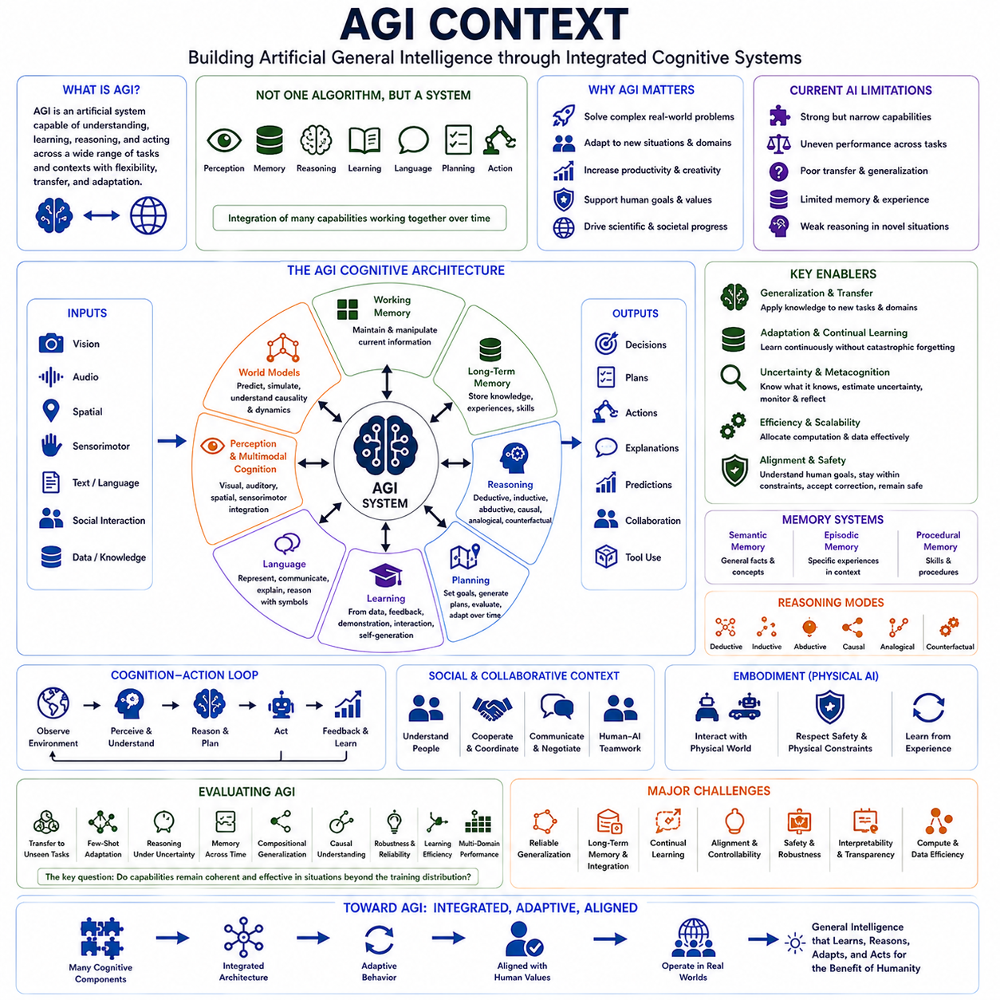
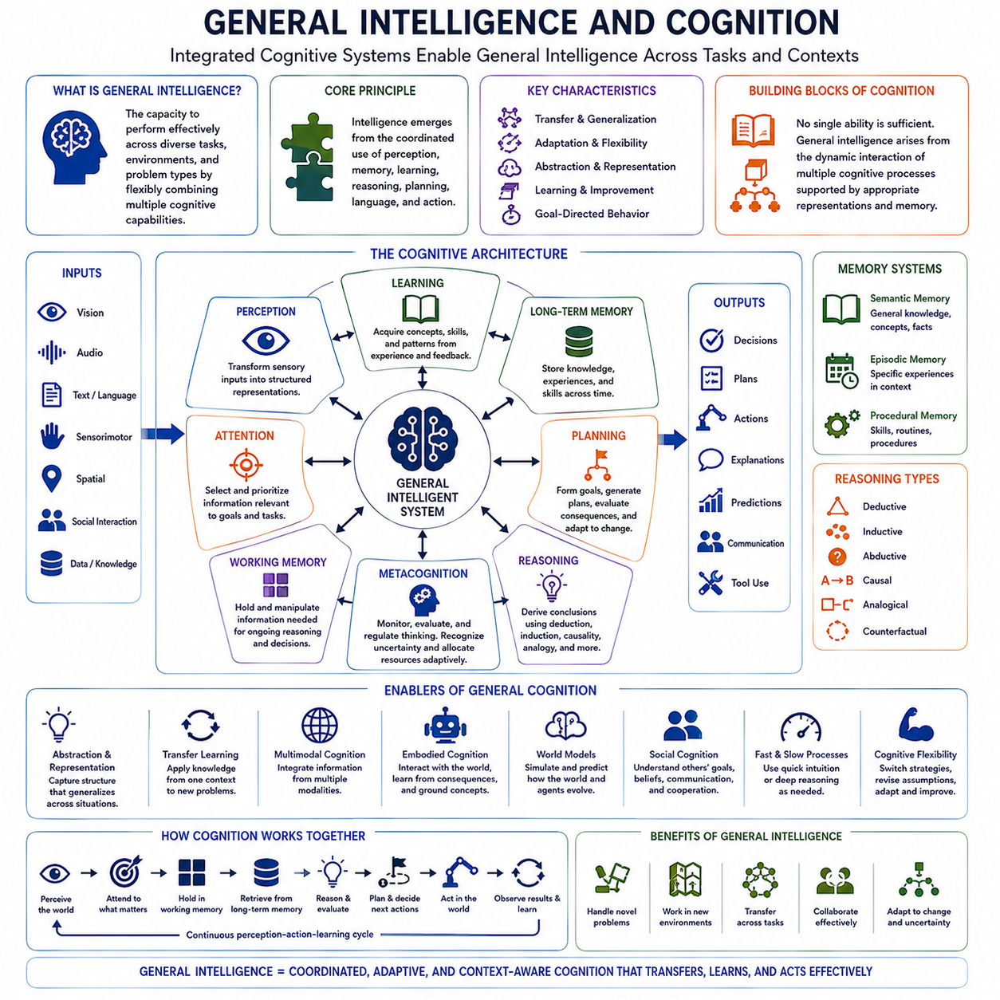
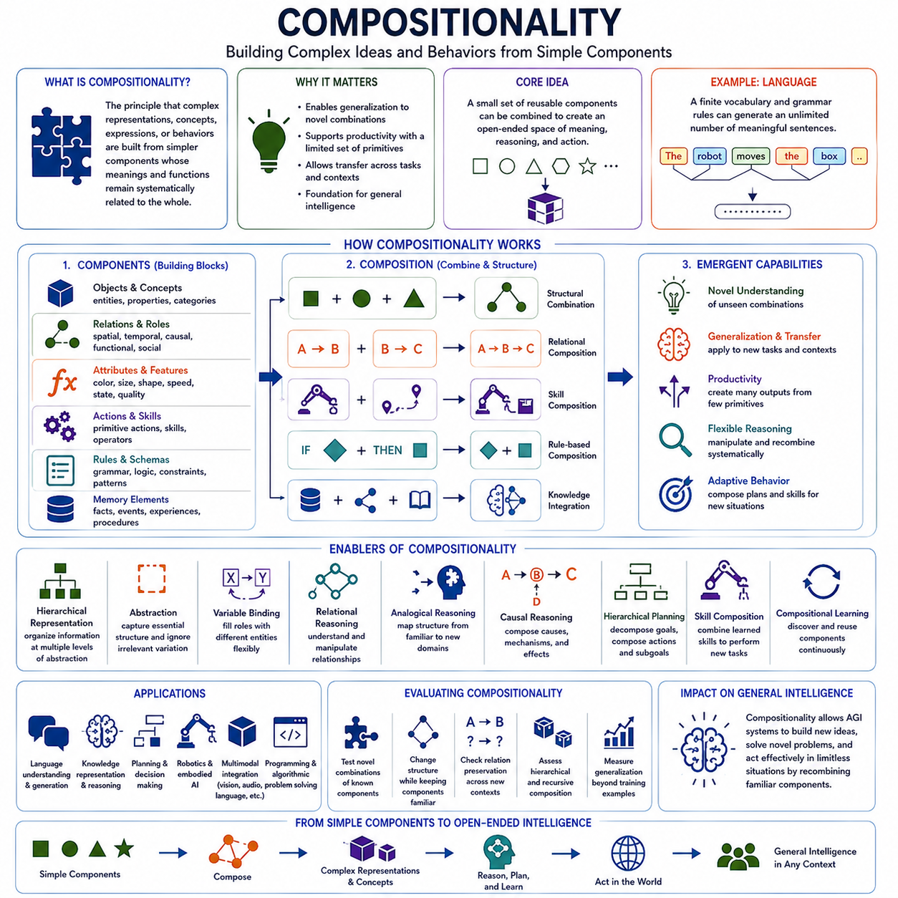
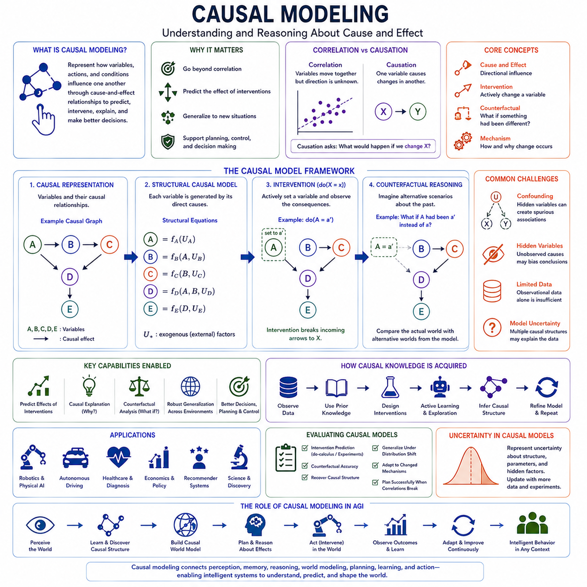
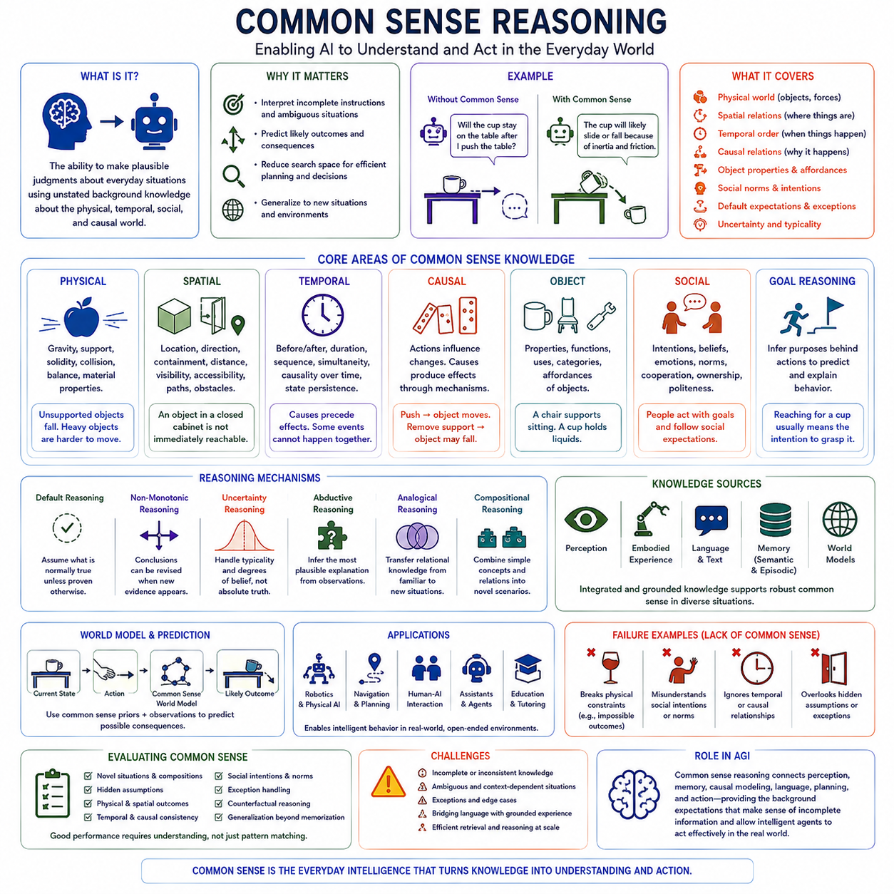
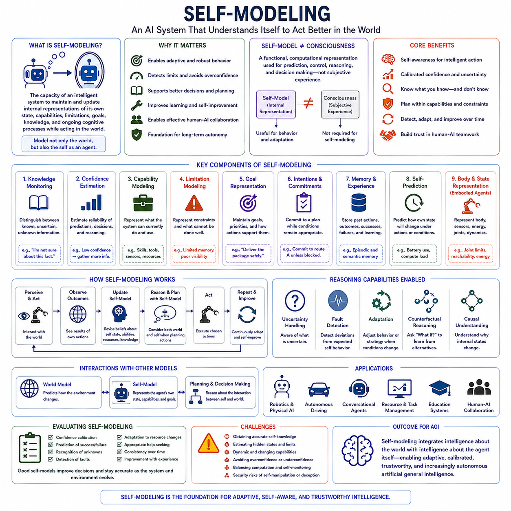
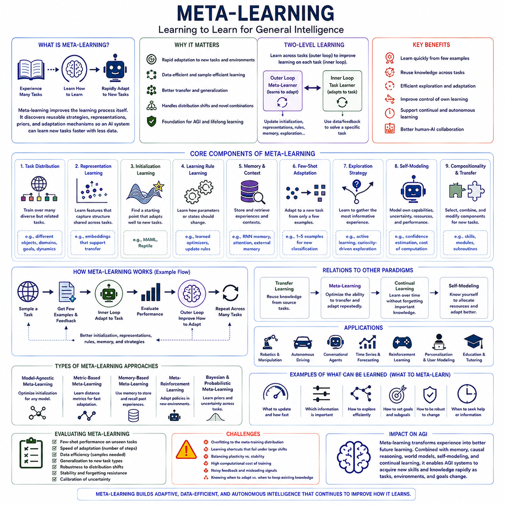
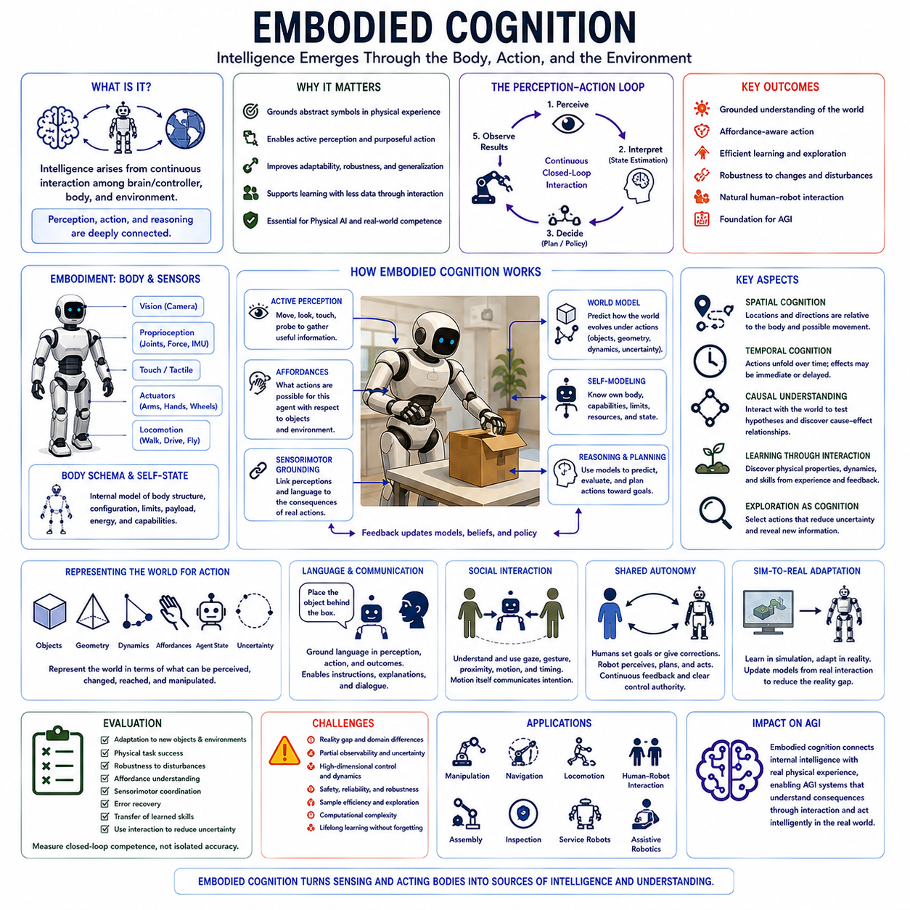
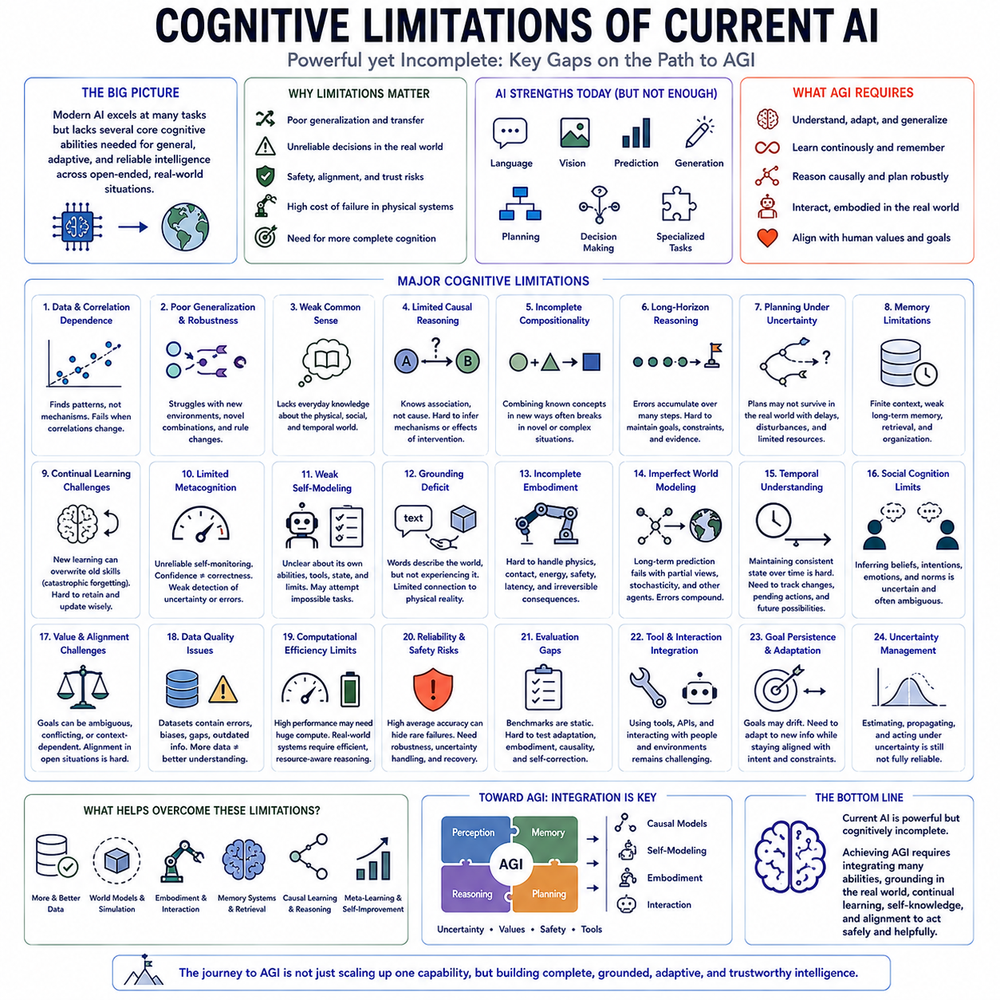

**Volume 43 Cognitive Science for AI**

# Chapter 10. Cognitive Science for AGI

## 10.00 AGI Context

{width="7.268055555555556in" height="7.268055555555556in"}

Artificial General Intelligence (AGI) refers to the idea of an artificial system capable of performing a broad range of cognitive tasks with flexibility, transfer, adaptation, and reasoning that are not limited to a single narrow domain. In the context of cognitive science, AGI is best understood not as one algorithm or benchmark, but as a systems-level objective requiring the integration of perception, memory, reasoning, learning, language, planning, and action.

Current AI systems can demonstrate impressive competence in language, vision, retrieval, prediction, coding, planning, and tool use, yet their abilities often remain uneven across tasks and contexts. High performance in one domain does not automatically imply general intelligence. AGI therefore raises the question of what kinds of representations, learning mechanisms, memory structures, reasoning processes, and adaptive behaviors are necessary for intelligence to transfer reliably across unfamiliar situations.

Cognitive science provides an important foundation for examining this question because human intelligence is itself the product of interacting cognitive subsystems. Humans combine perception, attention, working memory, long-term memory, episodic experience, semantic knowledge, procedural skills, reasoning, language, emotion, and action. AGI research can therefore draw insight from how these functions cooperate rather than assuming that general intelligence will emerge from scaling one isolated capability.

Generality requires more than storing large amounts of information. An intelligent system must determine which knowledge is relevant, retrieve it at the right time, combine it with current observations, and apply it to new problems. This connects AGI directly to representation learning, semantic memory, episodic memory, abstraction, and transfer. A useful internal representation should support reuse across tasks rather than encoding knowledge in a form that is tightly bound to one training distribution.

Working memory is also important because general problem solving requires temporary maintenance and manipulation of task-relevant information. Humans use working memory to hold intermediate goals, compare alternatives, follow multi-step reasoning, and update plans as new information arrives. AGI architectures similarly require mechanisms for maintaining temporary state across extended interactions so that reasoning does not collapse into isolated responses without continuity.

Long-term memory provides continuity beyond the current task. An AGI system may need to preserve facts, learned concepts, previous experiences, successful procedures, failures, and knowledge about users or environments. Different forms of memory can support different functions: semantic memory provides generalized knowledge, episodic memory supports learning from specific experiences, and procedural memory preserves reusable skills. Their coordination is likely to be as important as their individual capacity.

Reasoning represents another central requirement. General intelligence must operate when direct pattern matching is insufficient and when conclusions depend on relationships, constraints, uncertainty, causes, or hypothetical alternatives. Deductive, inductive, abductive, analogical, causal, and counterfactual reasoning provide complementary mechanisms. AGI therefore involves the ability to select or combine reasoning strategies according to the structure of the problem rather than relying on one universal procedure.

Planning connects reasoning to future-oriented behavior. A generally intelligent system should represent goals, generate possible action sequences, evaluate consequences, adapt plans when conditions change, and manage multiple timescales. Planning may involve explicit search, learned policies, simulation, world models, or combinations of these methods. The important capability is not producing a fixed plan, but continuously revising behavior as new evidence and constraints become available.

Learning must similarly extend beyond conventional offline training. AGI implies an ability to acquire new knowledge and skills from limited experience, feedback, demonstrations, interaction, and self-generated data. Meta-learning, few-shot adaptation, continual learning, reinforcement learning, and self-supervised learning all provide mechanisms relevant to this goal. A general system should improve from experience without repeatedly requiring complete retraining from the beginning.

Continual learning introduces the problem of maintaining old capabilities while acquiring new ones. If learning a new task destroys previously acquired knowledge, the system cannot accumulate competence over long periods. Memory consolidation, replay, modularity, parameter isolation, retrieval, and adaptive representations may help reduce catastrophic forgetting. General intelligence therefore requires not only rapid learning but also stable integration of new knowledge into an expanding internal structure.

Language is important because it provides a powerful medium for representing concepts, instructions, goals, explanations, and abstract relationships. Large language models demonstrate that extensive linguistic training can produce broad capabilities, but language alone does not necessarily provide complete grounding in the physical and social world. AGI must therefore address how linguistic representations connect to perception, action, memory, causality, and experience.

Multimodal cognition extends intelligence beyond text by integrating visual, auditory, spatial, sensorimotor, and other forms of information. Humans reason about objects, events, people, space, and actions using multiple perceptual channels. An AGI system may similarly require unified representations that allow information learned through one modality to influence reasoning in another. Cross-modal grounding is therefore important for building concepts that remain meaningful beyond a single input format.

Embodied cognition provides an additional perspective by emphasizing that intelligence develops through interaction with an environment. Perception and action form a continuous loop in which an agent observes conditions, predicts consequences, acts, and learns from results. Physical AI makes this relationship explicit because an intelligent robot must connect abstract goals with real-world dynamics, uncertainty, physical constraints, safety, and sensorimotor feedback.

World models may provide a bridge between perception, prediction, reasoning, and planning. By learning representations of how environments evolve, an intelligent system can mentally simulate possible futures before acting. Such internal models can support prediction, counterfactual reasoning, exploration, and long-horizon planning. For AGI, a world model may need to capture not only physical dynamics but also objects, agents, intentions, causal relationships, uncertainty, and changing context.

Metacognition adds the ability to reason about one\'s own cognition. A generally intelligent system should ideally estimate what it knows, recognize uncertainty, detect failures, allocate computational effort, and decide when additional information or external assistance is needed. This ability is closely connected to confidence calibration, self-monitoring, reflection, and adaptive reasoning. General intelligence becomes more reliable when the system can recognize the boundaries of its competence.

Dual-process perspectives offer another useful framework. Fast, learned, intuitive processing can efficiently handle familiar patterns, while slower deliberative reasoning can address difficult or novel problems. An AGI architecture may combine rapid neural inference with search, planning, verification, simulation, or test-time computation. The challenge is deciding when expensive deliberation is justified and how the results of deliberate reasoning can influence future fast responses.

Social intelligence is also relevant because many forms of human intelligence develop and operate within social environments. Understanding intentions, beliefs, communication, cooperation, norms, and conflicting goals becomes essential when an AI interacts with people or other agents. Human--AI interaction, collaborative intelligence, and human--agent teamwork therefore provide practical contexts in which general intelligence must demonstrate not only individual problem solving but effective coordination.

Alignment and safety become increasingly important as systems gain broader competence and autonomy. A generally capable AI must interpret human goals, operate under incomplete instructions, respect constraints, accept correction, and remain responsive to human oversight. General intelligence without reliable goal interpretation or controllability can amplify specification errors. AGI research must therefore treat alignment as an architectural requirement rather than an external layer added after capability development.

Evaluation of AGI is difficult because narrow benchmarks can reward specialized competence without measuring genuine generality. Useful evaluation must examine transfer to unseen tasks, adaptation from limited examples, reasoning under uncertainty, memory across time, compositionality, causal understanding, robustness, learning efficiency, and performance across multiple domains. The central question is whether capabilities remain coherent when the system faces situations outside the patterns most directly represented in training.

From a cognitive-science perspective, AGI is therefore less a single destination than a problem of integrating many forms of cognition into one adaptive architecture. Perception, memory, reasoning, learning, language, world models, metacognition, embodiment, and interaction must cooperate over time. The major challenge is to create systems whose abilities generalize, accumulate, coordinate, and remain aligned as environments and goals change, forming a foundation for increasingly general artificial intelligence.

## 10.01 General Intelligence and Cognition [w/Code]

{width="7.268055555555556in" height="7.268055555555556in"}

General intelligence refers to the capacity of an intelligent system to perform effectively across diverse tasks, environments, and problem types rather than being optimized for only one narrow function. From a cognitive perspective, generality emerges from the coordinated use of perception, memory, learning, reasoning, planning, language, and action. Intelligence therefore depends not only on individual capabilities but on how flexibly those capabilities can be combined.

Human cognition provides an important reference for understanding general intelligence because people routinely transfer knowledge between situations that differ substantially in surface appearance. A concept learned in one context can influence reasoning in another, while previous experiences can guide behavior in unfamiliar environments. This capacity depends on abstraction, representation, analogy, memory retrieval, and the ability to identify relationships that remain stable across changing conditions.

General intelligence requires representations that capture meaningful structure rather than memorizing isolated observations. Useful representations describe objects, properties, relationships, events, goals, causes, and possible actions in forms that can support multiple cognitive functions. When knowledge is represented at an appropriate level of abstraction, it can be reused for prediction, reasoning, planning, communication, and learning instead of remaining tied to a specific task.

Perception contributes to general cognition by transforming sensory information into structured internal representations. Intelligent systems must identify relevant entities, events, spatial relationships, changes, and uncertainties while ignoring irrelevant variation. General perception is therefore more than classification. It requires connecting observations to persistent concepts and integrating information across modalities so that perception can support reasoning and action in changing environments.

Attention provides a mechanism for selecting which information should receive cognitive resources. Both biological and artificial systems face more information than can be processed with equal depth at every moment. Attention prioritizes observations, memories, goals, and intermediate reasoning states according to their relevance. General intelligence requires flexible attention because the information that matters can change rapidly as tasks, environments, and objectives evolve.

Working memory supports cognition by maintaining information that is immediately relevant to an ongoing task. It allows an intelligent system to preserve intermediate results, compare alternatives, track goals, and integrate evidence across multiple reasoning steps. Without an effective working memory mechanism, complex cognition can fragment into disconnected operations. General intelligence therefore requires temporary representations that can be dynamically updated as reasoning progresses.

Long-term memory allows intelligence to accumulate across experience. Semantic memory stores generalized concepts and knowledge, episodic memory preserves specific experiences and contextual events, and procedural memory supports reusable skills and action patterns. General cognition depends on retrieving the appropriate form of memory at the appropriate time and integrating retrieved information with current observations rather than treating memory as a passive database.

Learning enables cognitive systems to modify their representations and behavior in response to experience. General intelligence requires more than learning a fixed mapping from inputs to outputs. It involves discovering concepts, acquiring skills, identifying regularities, adapting to new tasks, and updating beliefs when evidence changes. Learning must therefore interact continuously with perception, memory, reasoning, and action rather than existing as an isolated training stage.

Transfer learning is a defining characteristic of general intelligence because knowledge acquired in one task should improve performance on related but previously unseen problems. Effective transfer depends on identifying which aspects of prior knowledge remain relevant and which should be modified. Excessively specific representations limit transfer, while overly abstract representations may omit important detail. General cognition requires balancing reusable structure with task-specific adaptation.

Reasoning allows an intelligent system to derive conclusions that are not directly available from immediate observations. Different problems may require deduction, induction, analogy, causal reasoning, abduction, or counterfactual thinking. General intelligence cannot assume that one reasoning strategy is optimal for every situation. It must recognize problem structure and select, combine, or revise reasoning processes according to available evidence, goals, uncertainty, and computational resources.

Causal cognition is especially important for generalization because statistical correlation alone may fail when environments change. Understanding that one event influences another allows an intelligent system to predict the effects of interventions and distinguish causal mechanisms from incidental associations. Causal models also support explanation, planning, diagnosis, and counterfactual reasoning, enabling knowledge to remain useful when superficial patterns differ from those observed during learning.

Planning extends cognition into the future by connecting goals with sequences of possible actions. A general intelligent system must consider alternative futures, evaluate consequences, manage constraints, and revise plans when new information appears. Planning can involve explicit search, learned policies, hierarchical decomposition, simulation, or combinations of these approaches. Flexibility is more important than commitment to any single planning mechanism.

Problem solving integrates many cognitive processes into goal-directed activity. The system must represent the problem, identify relevant knowledge, generate candidate strategies, evaluate progress, detect failure, and change approach when necessary. General problem solving therefore requires cognitive flexibility rather than repetitive application of a familiar procedure. Novel problems often demand recombination of previously learned concepts and skills in configurations not encountered during training.

Metacognition allows an intelligent system to monitor and regulate its own cognitive processes. It includes recognizing uncertainty, estimating whether a solution is reliable, detecting contradictions, deciding whether additional reasoning is necessary, and determining when external information should be requested. General intelligence benefits from this self-monitoring because cognitive resources can be allocated according to difficulty rather than applied uniformly to every problem.

Cognitive flexibility is closely related to metacognition and adaptation. Intelligent behavior requires switching between strategies, revising assumptions, abandoning unsuccessful plans, and reorganizing knowledge when circumstances change. A system that performs well only while its original assumptions remain valid lacks genuine generality. Flexible cognition instead treats internal models as revisable structures that can be updated when observations contradict previous expectations.

Language expands general cognition by providing a symbolic medium for representing abstract concepts, relationships, instructions, and explanations. Through language, knowledge can be transferred without direct physical experience and complex goals can be communicated efficiently. However, linguistic competence becomes more useful when grounded in perception, memory, action, and world knowledge, allowing symbols to connect with entities, events, and consequences beyond the language itself.

Multimodal cognition strengthens general intelligence by combining information from vision, sound, language, spatial relationships, and sensorimotor interaction. Different modalities provide complementary evidence about the same world. Integrating them can produce more robust representations than relying on any single channel. Cross-modal learning also allows knowledge acquired through one form of experience to influence understanding and behavior in another.

Embodied cognition emphasizes that intelligence is shaped by the relationship between an agent and its environment. Actions change the world, new observations reveal the consequences of those actions, and the resulting experience modifies future behavior. This perception--action cycle provides grounding for concepts such as space, objects, causality, affordances, and agency. Physical AI makes these relationships central because cognition must operate under real-world dynamics and constraints.

World models can support general cognition by representing how environments, objects, agents, and events evolve over time. An internal predictive model allows an intelligent system to simulate possible outcomes before committing to an action. World models can therefore connect perception with memory, causal understanding, planning, and decision making. Their generality depends on representing reusable structure rather than merely reproducing familiar sequences.

Social cognition introduces another dimension of general intelligence. Intelligent agents operating with humans must interpret intentions, beliefs, preferences, communication, cooperation, and social constraints. Other agents cannot be treated simply as passive physical objects because their behavior depends on internal goals and information. General cognition therefore includes models of other decision makers and mechanisms for adapting behavior during interaction and collaboration.

General intelligence also depends on integrating fast and slow cognitive processes. Familiar situations may be handled efficiently through learned patterns and rapid inference, while unfamiliar or consequential problems may require deliberate search, verification, simulation, and extended reasoning. A capable cognitive architecture should allocate computation adaptively, using fast responses when appropriate and deeper processing when uncertainty, novelty, or risk justifies additional effort.

Ultimately, general intelligence emerges from coordinated cognition rather than from a single dominant capability. Perception provides structured observations, attention selects relevant information, memory preserves knowledge and experience, learning enables adaptation, reasoning discovers relationships, planning organizes future action, and metacognition regulates the entire process. Generality arises when these functions cooperate flexibly, allowing intelligence to transfer, adapt, and remain effective across changing tasks and environments.

## 10.02 Compositionality [w/Code]

{width="7.268055555555556in" height="7.268055555555556in"}

Compositionality is the principle that complex representations, concepts, expressions, or behaviors can be constructed from simpler components whose meanings and functions remain systematically related to the whole. In cognition, this allows a limited set of reusable elements to generate an enormous range of thoughts and actions. For general intelligence, compositionality provides a mechanism for creating new capabilities without learning every possible combination independently.

Human cognition demonstrates compositionality most clearly in language. A finite vocabulary and a limited collection of grammatical structures can generate an effectively unlimited number of meaningful sentences. People can understand sentences they have never encountered before because they combine knowledge about individual words, relationships, and structural rules. This systematic reuse of familiar components is an important foundation for productive and flexible intelligence.

Compositionality extends beyond language into concepts and reasoning. Complex concepts can often be understood through combinations of simpler properties, objects, relations, and events. A person who understands the concepts of a red object, a container, and spatial inclusion can interpret a novel description such as a red object inside a container without requiring previous experience with that exact configuration. Existing knowledge is recombined to construct a new representation.

Representation is therefore central to compositional intelligence. Internal representations must preserve enough structure for components to be identified, manipulated, and recombined. If information is encoded only as indivisible patterns, systematic recombination becomes difficult. Structured representations instead make relationships between entities explicit, allowing cognitive systems to transform known elements into new configurations while preserving important semantic relationships.

Systematic generalization is closely connected to compositionality. An intelligent system that learns a relation in one context should ideally apply the same relation when familiar components appear in a new arrangement. For example, learning how one action affects one class of objects may provide knowledge that can be transferred to related objects or environments. Such generalization reduces dependence on exhaustive training examples and supports performance outside previously observed combinations.

Productivity is another consequence of compositional structure. A relatively small set of primitives can support a very large space of possible representations and behaviors when those primitives can be recursively combined. This principle appears in language, mathematics, programming, planning, and motor behavior. General intelligence can therefore achieve expressive power through reusable structure rather than storing a separate solution for every possible situation.

Hierarchical representation strengthens compositionality by organizing information at multiple levels of abstraction. Low-level features can combine into objects, objects into relations, relations into events, and events into larger situations or plans. Similar hierarchies can organize actions into skills, skills into subtasks, and subtasks into missions. Hierarchical composition allows reasoning to operate at the level most appropriate to the current problem.

Abstraction enables components to transfer across contexts. A concept such as support, containment, movement, ownership, or causation can apply to many different entities and environments. By separating relational structure from specific surface details, cognitive systems can reuse knowledge in unfamiliar situations. Effective abstraction does not eliminate detail completely; it preserves the information necessary for the concept to remain useful while ignoring irrelevant variation.

Variable binding is important when compositional representations contain roles that can be filled by different entities. A relation such as "A gives B to C" preserves its structure even when different people or objects occupy the corresponding roles. Cognitive systems must distinguish the relational pattern from the particular values assigned to it. Flexible variable binding therefore supports relational reasoning, language understanding, planning, and transfer across structurally similar situations.

Relational reasoning builds directly on compositional representations. Many problems cannot be solved by recognizing isolated objects because the important information lies in how those objects are connected. Spatial relationships, temporal order, causal dependencies, social roles, and logical relations all require structured reasoning. Compositional cognition allows these relationships to be represented and manipulated independently from the specific entities involved.

Analogical reasoning provides a powerful example of compositional generalization. An analogy identifies structural similarity between situations that may appear very different at the surface level. If relationships among components are represented explicitly, knowledge from a familiar domain can be mapped onto a new domain. This allows previous solutions, causal models, or strategies to guide reasoning even when the objects and circumstances are different.

Causal reasoning also benefits from compositional structure because complex events can be decomposed into interacting causes, mechanisms, conditions, and effects. Instead of memorizing entire event sequences, an intelligent system can learn reusable causal relationships and recombine them when analyzing new situations. Such representations can support intervention, diagnosis, prediction, and counterfactual reasoning when the environment differs from previously observed examples.

Planning is inherently compositional because complex goals are often achieved through combinations of smaller actions and subgoals. A long-horizon task can be decomposed into manageable stages, each of which may invoke reusable skills or policies. Hierarchical planning reduces the complexity of searching directly over every possible low-level action. It also enables previously learned skills to be reorganized into new plans when goals or environmental conditions change.

Procedural knowledge can similarly be composed from reusable skills. A robot that independently learns navigation, grasping, object recognition, door manipulation, and placement can potentially combine these capabilities to perform tasks not represented as single demonstrations during training. Skill composition is therefore important for Physical AI, where the number of possible tasks and environmental configurations makes exhaustive end-to-end training impractical.

Compositional learning attempts to discover reusable components rather than treating every task as unrelated. These components may include concepts, features, skills, policies, subroutines, object representations, or relational structures. Learning becomes more efficient when previously acquired components can be reused instead of reconstructed from the beginning. New tasks can then be represented partly as new combinations of existing knowledge and partly as genuinely new information.

Neural networks can acquire distributed representations that exhibit some compositional properties, but systematic composition remains challenging. Models may perform well on combinations similar to those present during training while failing when familiar elements appear in unfamiliar structures. This gap highlights the difference between statistical interpolation and stronger compositional generalization. Architecture, training data, objectives, memory, and reasoning mechanisms can all influence this capability.

Neuro-symbolic approaches explore one way of combining flexible learned representations with explicit structured operations. Neural components can support perception, representation learning, and pattern recognition, while symbolic or structured mechanisms can support variables, rules, relations, and systematic manipulation. The objective is not necessarily to reproduce classical symbolic AI, but to obtain representations that combine statistical learning with reusable and interpretable structure.

Language models demonstrate significant compositional abilities because they can generate and interpret novel combinations of concepts, instructions, and linguistic structures. However, successful linguistic composition does not guarantee reliable compositional reasoning in every domain. Models may still be sensitive to superficial patterns, unfamiliar combinations, or changes in problem structure. Evaluating compositionality therefore requires deliberately testing combinations that differ from those emphasized during training.

World models can benefit from compositional representations of objects, agents, relationships, dynamics, and events. Rather than representing an environment as one undifferentiated state, a structured world model can describe entities and their interactions separately. Such factorization may help predictions transfer when familiar objects appear in new configurations. It can also support planning by allowing simulated futures to be constructed from reusable models of interaction and change.

Multimodal cognition introduces the additional challenge of composing information across modalities. A concept may connect a linguistic description with visual appearance, spatial location, sound, physical properties, and possible actions. Cross-modal composition allows an intelligent system to combine these different sources into a coherent representation. This is particularly important for embodied agents that must translate language instructions into perception, planning, and physical behavior.

Compositionality is especially valuable for general intelligence because the real world contains far more possible situations than any training dataset can enumerate. An intelligent system must therefore solve novel problems by reorganizing previously acquired knowledge. Concepts, relations, memories, skills, and plans become reusable cognitive building blocks. Generalization then depends not only on recognizing familiar patterns but on constructing appropriate new combinations from familiar components.

Evaluating compositionality requires testing systematic novelty rather than ordinary held-out examples alone. Useful evaluations can separate familiar components from unfamiliar combinations and examine whether the system preserves learned relationships when structure changes. Tests may involve novel linguistic constructions, new object--relation combinations, unseen sequences of skills, altered causal structures, or tasks requiring known capabilities to be assembled in previously unobserved ways.

Ultimately, compositionality provides a bridge between limited experience and open-ended intelligence. By representing knowledge as reusable components and relationships, cognitive systems can generate new concepts, interpretations, plans, and behaviors without learning each possibility independently. For AGI, this capacity is fundamental to abstraction, transfer, systematic generalization, reasoning, planning, and continual learning, enabling intelligence to construct solutions for situations that were never explicitly represented during training.

## 10.03 Causal Modeling [w/Code]

{width="7.268055555555556in" height="7.268055555555556in"}

Causal modeling is the process of representing how events, variables, actions, and environmental conditions influence one another through cause-and-effect relationships. Unlike purely statistical modeling, which can identify associations between observations, causal modeling attempts to describe the mechanisms responsible for change. For general intelligence, this distinction is essential because intelligent behavior often requires predicting what will happen when an agent actively intervenes in the world.

Correlation alone cannot determine whether changing one variable will produce a change in another. Two variables may appear together because one causes the other, because the causal direction is reversed, or because both are influenced by a hidden factor. Causal reasoning therefore asks a stronger question than whether variables are related. It asks what would happen if a specific variable were deliberately changed while relevant aspects of the system were controlled.

A causal model represents variables together with directional relationships that describe how they influence one another. These relationships are often expressed using causal graphs, where nodes represent variables and directed edges represent causal dependencies. Such structures allow an intelligent system to distinguish causes from consequences and to reason about pathways through which an intervention may propagate across a larger system.

Structural causal models provide a formal framework for describing these relationships. Variables are connected through structural equations that specify how each variable is generated from its direct causes and other relevant factors. This representation separates the causal mechanism from the particular observations collected from the system. As a result, the model can support reasoning about situations that differ from those directly represented in observational data.

Intervention is a central concept in causal modeling. Observing that two events occur together is fundamentally different from actively changing one of them and measuring the consequences. Intervention-based reasoning asks how the system would behave if an agent modified a variable, selected an action, or imposed a new condition. This capability connects causal modeling directly to decision making, experimentation, planning, and control.

Counterfactual reasoning extends causal analysis by considering alternative versions of events that have already occurred. A system may ask what would have happened if a different action had been taken, if an environmental condition had changed, or if a particular cause had been absent. Counterfactuals support explanation, diagnosis, responsibility analysis, and learning from experience because they compare observed outcomes with plausible alternatives generated by a causal model.

Causal discovery attempts to infer causal structure from data, interventions, prior knowledge, or combinations of these sources. This task is difficult because observational data alone may be compatible with several different causal explanations. Temporal ordering, independence relationships, domain constraints, experiments, and active exploration can reduce ambiguity. Intelligent systems should therefore represent uncertainty about causal structure rather than treating every discovered relationship as certain.

Confounding is one of the major challenges in causal inference. A hidden or uncontrolled variable can influence both an apparent cause and an observed outcome, creating a misleading association. If such confounding factors are ignored, an intelligent system may select interventions that fail when deployed. Causal modeling therefore requires careful consideration of which variables are observed, which are controlled, and which may remain latent.

Temporal reasoning contributes important information because causes normally precede their effects, although temporal order alone does not establish causality. Dynamic systems may contain delayed effects, feedback loops, accumulated influences, and interactions operating at multiple timescales. Causal models for intelligent agents must therefore represent not only which variables influence one another but also when and over what duration those influences become significant.

Mechanistic understanding strengthens causal generalization. If an intelligent system understands why a relationship occurs, it can determine whether that mechanism is likely to remain valid when the surrounding environment changes. Statistical patterns may disappear under distribution shift, while underlying physical or functional mechanisms can remain stable. Causal representations can therefore support more robust transfer across environments than associations based only on surface regularities.

Causal abstraction allows complex systems to be represented at different levels of detail. Low-level physical interactions may be summarized as higher-level events, while detailed sequences of actions may be represented as functional causal relationships. The appropriate abstraction depends on the task. Effective intelligence must move between levels when necessary, preserving the causal information required for prediction and intervention without modeling every microscopic detail.

Causal reasoning is closely related to compositionality because complex causal systems can often be decomposed into reusable mechanisms. An intelligent system can learn how individual components behave and then reason about new combinations of those components. If causal mechanisms remain sufficiently stable, previously learned relationships can be recomposed in unfamiliar configurations, supporting systematic generalization beyond situations directly encountered during training.

World models can incorporate causal structure to move beyond passive prediction. A predictive model may estimate the next state from previous observations, whereas a causal world model attempts to represent how states change because of actions, interactions, and environmental mechanisms. This distinction becomes important when an agent must choose among possible actions, because planning requires estimating the consequences of interventions rather than merely forecasting likely observations.

Planning naturally depends on causal models because actions are selected according to their expected effects. To achieve a goal, an agent must reason backward from desired outcomes toward actions capable of producing them and forward from candidate actions toward possible consequences. Causal structure reduces the search space by identifying which variables can influence the goal and which actions are unlikely to affect the desired outcome.

Reinforcement learning also interacts with causal modeling. Traditional reinforcement learning can learn successful policies through repeated interaction without explicitly representing causal structure. However, causal knowledge can improve sample efficiency, transfer, exploration, and adaptation by helping an agent understand why actions succeed or fail. Instead of treating every new environment as unrelated, the agent can reuse mechanisms that remain stable across tasks.

Active learning and experimentation provide powerful methods for acquiring causal knowledge. An intelligent agent can select actions not only to achieve immediate rewards but also to reduce uncertainty about how the environment works. Carefully chosen interventions can distinguish competing causal hypotheses more efficiently than passive observation. This creates a connection between curiosity, exploration, scientific reasoning, and autonomous learning.

Causal models are especially important in Physical AI because robots continuously intervene in the physical world. A robot must predict how pushing, grasping, accelerating, braking, turning, or manipulating an object will change its environment. These effects depend on physical properties, contact relationships, geometry, dynamics, and uncertainty. Reliable behavior therefore requires models that connect actions with their likely physical consequences.

Affordances can be understood partly through causal relationships between actions, objects, and outcomes. An object is graspable, movable, openable, or traversable because particular actions can produce particular state changes under appropriate conditions. Learning these relationships allows robots to reason about what can be done with unfamiliar objects or environments. Causal affordance models therefore connect perception directly with action possibilities and planning.

Multi-agent environments introduce causal relationships involving other decision-making entities. An agent\'s action can change what another agent observes, believes, intends, or does next. Modeling these interactions requires more than physical dynamics because other agents respond according to their own goals and information. Causal reasoning can help distinguish direct physical effects from strategic or social effects that emerge through interaction.

Causal models can also improve explainability because explanations often involve identifying which factors produced an outcome. Instead of reporting only that a prediction was made, a system can describe influential conditions, relevant causal pathways, and possible interventions that could change the result. Counterfactual explanations are particularly useful because they show how an outcome might differ if selected conditions or actions were changed.

Evaluation of causal modeling should test more than predictive accuracy on data drawn from the same distribution. A model may predict familiar observations accurately while representing the underlying causal structure incorrectly. Stronger evaluations include intervention prediction, counterfactual reasoning, transfer under distribution shifts, recovery of causal relationships, adaptation to modified mechanisms, and planning in situations where correlations from training no longer remain reliable.

Causal knowledge should also be represented with uncertainty because real environments rarely provide complete evidence about every mechanism. Multiple causal hypotheses may remain plausible, hidden variables may exist, and mechanisms may change over time. An intelligent system should therefore combine causal reasoning with probabilistic inference, uncertainty estimation, additional observation, and experimentation rather than committing prematurely to one explanation.

For AGI, causal modeling provides a foundation for moving from pattern recognition toward understanding how actions and events transform the world. General intelligence must not only recognize what tends to happen but also reason about why it happens, what would happen under intervention, and what might have happened under alternative conditions. Causal models connect perception, memory, reasoning, world models, planning, learning, and action into a framework for adaptive intelligence.

## 10.04 Common Sense Reasoning [w/Code]

{width="7.268055555555556in" height="7.268055555555556in"}

Common sense reasoning refers to the ability to make plausible judgments about everyday situations using background knowledge that people normally leave unstated. Humans routinely understand that unsupported objects may fall, containers can hold things, people usually act according to goals, and events have ordinary consequences. For AGI, common sense provides the implicit knowledge needed to interpret incomplete instructions and unfamiliar situations without requiring every fact to be explicitly specified.

Much of common sense knowledge is learned gradually from repeated interaction with the physical and social world. People acquire expectations about objects, space, time, actions, intentions, quantities, causes, and social behavior long before they can formally describe these principles. Such knowledge becomes a background model that supports rapid inference. Artificial systems require comparable mechanisms if they are to reason effectively outside narrowly defined tasks.

Common sense differs from encyclopedic knowledge because it concerns ordinary regularities rather than specialized facts. Knowing the chemical composition of water is factual knowledge, while understanding that spilled water can make a floor wet and potentially slippery is common sense. Intelligent systems must therefore represent not only explicit facts but also likely consequences, typical conditions, affordances, exceptions, and relationships that are rarely written down.

Physical common sense concerns how objects and environments normally behave. It includes expectations about gravity, solidity, support, containment, motion, collision, balance, distance, and material properties. A cup placed on a stable table normally remains there, while an unsupported object may fall. Physical AI depends heavily on such reasoning because robots must anticipate real-world consequences before manipulating objects or navigating through environments.

Spatial common sense allows an intelligent system to reason about locations, directions, containment, accessibility, visibility, and movement. Understanding that an object inside a closed cabinet may not be immediately reachable requires more than recognizing the object itself. Spatial reasoning must combine geometric information with practical constraints such as obstacles, openings, paths, orientation, and the actions required to change spatial relationships.

Temporal common sense concerns ordinary relationships between events over time. Causes generally precede effects, actions require duration, some events cannot occur simultaneously, and states may persist until changed. Intelligent systems must reason about what happened before, what is happening now, and what is likely to happen next. Temporal expectations also support planning by connecting current actions with delayed or long-term consequences.

Causal common sense helps systems understand why everyday events occur and what actions are likely to change them. Turning a handle may open a door, pushing an unstable object may cause it to move or fall, and removing support may change another object\'s position. Such reasoning does not require a complete physical simulation in every case. Approximate causal knowledge often provides sufficiently useful predictions for rapid decision making.

Object common sense involves knowledge about typical properties, functions, and affordances of familiar entities. A chair can usually support sitting, a container can hold objects, a door can provide access between spaces, and a tool may enable particular actions. These expectations allow intelligence to infer possible uses even when explicit instructions are incomplete. They also support transfer when unfamiliar objects share functional properties with known categories.

Social common sense addresses how people typically behave in interaction with others. Humans reason about intentions, beliefs, emotions, conventions, cooperation, ownership, politeness, promises, and social expectations. A system interacting with people must often infer what a person is likely to know, want, or consider appropriate. These inferences are uncertain and culturally dependent, so social common sense should support flexible expectations rather than rigid universal rules.

Goal reasoning is closely connected to social common sense because human actions are usually interpreted in relation to purposes. If a person reaches toward a cup, an observer may infer an intention to grasp or use it rather than treating the movement as an arbitrary trajectory. Intelligent systems can similarly use goals to explain observations and predict future actions. Such reasoning becomes important for collaboration, assistance, and human--agent teamwork.

Default reasoning allows common sense systems to make useful conclusions when complete information is unavailable. A default represents what is normally true unless evidence indicates otherwise. For example, a closed container may normally be assumed to retain its contents, but this expectation should be revised if a hole is detected. Common sense therefore requires reasoning that is defeasible, meaning conclusions can be withdrawn when new evidence contradicts them.

Non-monotonic reasoning formalizes this ability to revise conclusions. In classical monotonic logic, adding information does not invalidate previous deductions. Everyday reasoning works differently because new observations frequently change what should be believed. An intelligent agent may initially infer that a route is available and later reject that conclusion after detecting an obstacle. General intelligence requires this capacity to update beliefs without rebuilding its entire knowledge structure.

Uncertainty is fundamental to common sense because everyday knowledge usually describes tendencies rather than absolute laws. People normally walk through doors, objects generally remain where they are placed, and individuals often pursue consistent goals, but exceptions occur. Common sense reasoning should therefore combine qualitative expectations with uncertainty estimates, allowing systems to distinguish what is certain, probable, merely plausible, or unsupported.

Abduction plays an important role because common sense frequently requires inferring the most plausible explanation for an observation. If a floor is wet, several explanations may be possible, such as spilled water, cleaning, or rain entering through an opening. Abductive reasoning generates candidate explanations and evaluates them using contextual knowledge. This process supports diagnosis, interpretation, and recovery when events differ from expectations.

Analogical reasoning also supports common sense by transferring relational knowledge from familiar situations to new ones. An unfamiliar tool may be understood through similarity to previously encountered tools, while a new environment may be navigated using structural relationships learned elsewhere. Analogies allow systems to reason with limited experience because they reuse patterns of relationships rather than requiring exact matches with stored examples.

Compositionality strengthens common sense reasoning by allowing simple concepts and relations to be combined into novel situations. Knowledge about containers, fragile objects, movement, and support can be composed to reason about a new task involving placing a delicate item into a box. General intelligence requires this ability because the number of possible everyday situations is too large for any training dataset to enumerate individually.

World models can provide an important computational foundation for common sense. A world model represents entities, properties, relationships, agents, and likely dynamics, allowing an intelligent system to predict what may happen under different actions. Common sense can provide priors and structural assumptions for these models, while observations refine them. Together they support rapid prediction without requiring exhaustive simulation of every detail.

Memory is another essential component because common sense develops through accumulated experience. Semantic memory can preserve generalized knowledge about objects, actions, and relationships, while episodic memory can retain specific examples that illustrate exceptions or unusual situations. Retrieval allows current observations to activate relevant prior knowledge. Effective reasoning depends on selecting the right memories without allowing irrelevant experiences to dominate the current context.

Language models can acquire substantial common sense knowledge from large text corpora because language contains descriptions of everyday events, intentions, and consequences. However, textual patterns may be incomplete, inconsistent, or weakly grounded in physical experience. Reliable common sense therefore benefits from connecting language with perception, action, multimodal data, and interaction. Grounding allows symbolic descriptions to be tested against how the world actually behaves.

Embodied experience is particularly valuable for Physical AI because many common sense relationships arise directly from action and consequence. A robot can learn that certain surfaces are difficult to traverse, that objects require particular grasp strategies, or that pushing produces different effects depending on mass and friction. Interaction transforms abstract correlations into operational knowledge connected to real sensorimotor outcomes.

Common sense reasoning can reduce the search space in planning. Rather than evaluating every theoretically possible action, an intelligent system can eliminate options that violate ordinary physical, spatial, social, or goal-related expectations. This makes reasoning more efficient and produces plans that appear coherent to humans. Nevertheless, common sense assumptions should remain revisable because unusual situations may require actions that would normally be considered unlikely.

Failure of common sense is a major limitation of current AI systems. A model may produce a linguistically fluent answer while overlooking basic physical constraints, contradictory assumptions, impossible actions, or socially implausible consequences. Strong benchmark performance therefore does not guarantee reliable everyday reasoning. Evaluation must test whether systems preserve ordinary relationships when situations are described in unfamiliar ways or require several types of knowledge simultaneously.

Common sense evaluation should include novel situations, hidden assumptions, exception handling, physical consequences, social intentions, temporal relationships, and causal dependencies. Tests should distinguish memorized associations from genuine generalization by changing surface details while preserving underlying structure. Robust performance requires an AI system to infer unstated information, detect implausible conclusions, and revise its beliefs when new evidence changes the context.

For AGI, common sense reasoning functions as a connective layer between perception, memory, causal modeling, compositionality, planning, language, and action. It supplies the background expectations that make incomplete information interpretable and possible actions understandable. General intelligence requires not perfect knowledge of every situation, but sufficiently grounded, flexible, and revisable everyday models that enable an agent to reason sensibly when the world does not explicitly state everything it needs to know.

## 10.05 Self Modeling [w/Code]

{width="7.268055555555556in" height="7.268055555555556in"}

Self-modeling is the capacity of an intelligent system to maintain and update internal representations of its own state, capabilities, limitations, goals, knowledge, and ongoing cognitive processes. Rather than modeling only the external world, the system also represents itself as an agent operating within that world. For AGI, self-modeling can support adaptive behavior by allowing reasoning to incorporate both environmental conditions and the system's own ability to respond to them.

A self-model does not necessarily imply consciousness or subjective self-awareness. In computational terms, it can be understood as a functional representation that describes properties relevant to prediction, control, reasoning, and decision making. An autonomous system may model its available resources, current task state, confidence, sensor condition, memory contents, action capabilities, or remaining energy without possessing human-like subjective experience.

Self-modeling is closely connected to metacognition because both involve information about internal processes. Metacognition focuses on monitoring and regulating cognition, while self-modeling provides representations that make such monitoring possible. A system can estimate whether it understands a problem, whether its current strategy is working, or whether additional reasoning is required only if it has some representation of its own cognitive state and performance.

Knowledge monitoring is an important component of self-modeling. An intelligent system should distinguish between information it knows reliably, information it only partially understands, and information for which it lacks sufficient evidence. This distinction helps prevent unsupported conclusions and enables appropriate information-seeking behavior. Recognizing uncertainty is therefore not merely an output property but part of maintaining an accurate model of internal knowledge.

Confidence estimation provides one mechanism for representing uncertainty about predictions, decisions, or reasoning outcomes. A well-calibrated system should assign lower confidence when evidence is weak, ambiguous, unfamiliar, or contradictory. Confidence can then influence whether the system acts immediately, performs additional computation, requests information, retrieves memories, consults external tools, or transfers control to another agent or human operator.

Capability modeling concerns what the system can and cannot currently accomplish. An intelligent agent may possess different skills, tools, sensors, computational resources, and action possibilities depending on its configuration and environment. Maintaining an explicit or implicit representation of these capabilities prevents plans from assuming unavailable functions. It also enables the system to select strategies that match its actual resources rather than an idealized description of itself.

Limitation modeling is equally important because reliable intelligence requires recognizing boundaries. A system may face insufficient perception, limited memory, uncertain localization, incomplete knowledge, restricted computation, or physical constraints. If these limitations are represented internally, the system can compensate by gathering additional evidence, simplifying a task, changing strategies, requesting assistance, or avoiding actions whose risks exceed its current competence.

Goal representation forms another major part of the self-model. Intelligent behavior requires maintaining information about what the agent is trying to achieve, which objectives have priority, and how current actions contribute to those objectives. Multiple goals may compete for attention or resources, requiring mechanisms for prioritization and conflict resolution. Self-modeling allows goals to be treated as part of the agent's internal state rather than as isolated external commands.

Intentions connect goals with commitments to particular courses of action. A system may consider many possible plans but commit to only one while conditions remain appropriate. Representing current intentions helps maintain behavioral continuity across time and prevents unnecessary switching between alternatives. At the same time, intentions must remain revisable when new evidence indicates that a plan is ineffective, unsafe, impossible, or inconsistent with higher-level goals.

Memory contributes to self-modeling by preserving information about previous actions, decisions, successes, failures, and learning experiences. Episodic memory can provide examples of how the system behaved in particular situations, while semantic memory can preserve generalized knowledge about its capabilities and operating conditions. These memories allow the self-model to evolve from accumulated experience rather than remaining a static specification created before deployment.

Self-prediction extends self-modeling into the future. An intelligent system can estimate how its own state may change under different actions, workloads, environmental conditions, or resource constraints. A robot may predict battery consumption, computational load, localization degradation, mechanical limitations, or task completion probability. Such predictions allow planning to incorporate the consequences of actions for the agent itself as well as for the external environment.

Embodied agents require especially rich self-models because their physical bodies constrain perception and action. A robot may need representations of its geometry, joint limits, payload, reachability, sensor placement, mobility, energy state, and dynamic capabilities. These representations can change because of payload variation, damage, component degradation, or environmental conditions. Adaptive Physical AI therefore benefits from self-models that can be updated during operation.

Body schema is a related concept describing an internal representation of the body used for perception and action. Humans continuously estimate the position and configuration of their bodies, while robots can maintain analogous representations of joints, links, tools, and contact states. A body schema enables actions to be planned relative to the agent's own physical structure and can support adaptation when tools or attachments temporarily extend that structure.

Self-modeling can also support fault detection. If an intelligent system predicts how its sensors, actuators, internal processes, or behavior should normally operate, deviations from those expectations may indicate a failure. Comparing expected and observed internal states can reveal sensor degradation, actuator problems, computational anomalies, or unexpected performance loss. The self-model therefore becomes a reference for diagnosis as well as ordinary control.

Adaptation becomes possible when detected discrepancies lead to changes in behavior or internal representation. A robot with a weakened actuator might modify its motion strategy, while an AI system that detects poor performance on a task may allocate more reasoning resources or seek external information. Effective self-modeling is therefore dynamic: it must update when experience demonstrates that previous assumptions about the system are no longer accurate.

Learning about oneself can occur through interaction in much the same way that an agent learns about its environment. By observing the outcomes of its own actions, the system can estimate which skills are reliable, where failures occur, and how performance changes under different conditions. This creates a form of empirical self-knowledge in which capabilities are inferred from evidence rather than assumed entirely from design specifications.

Self-models can interact with world models to create a unified representation of agent--environment dynamics. A world model predicts how external states may evolve, while a self-model represents the agent that observes and influences those states. Planning then becomes reasoning about their interaction: what the world will do, what the agent can do, how actions will change both, and whether the resulting trajectory can satisfy the intended goal.

Causal modeling can strengthen self-modeling by representing why internal states or capabilities change. Instead of merely detecting that performance has decreased, an agent may reason that reduced perception quality is caused by sensor obstruction or that slower movement results from increased payload. Causal self-models can support diagnosis, intervention, and transfer by distinguishing underlying mechanisms from temporary correlations.

Counterfactual reasoning provides another useful capability. A system can ask whether a different strategy would have produced a better outcome, whether additional information would have prevented an error, or whether a failed task would have succeeded with different resources. These comparisons can improve future behavior by converting experience into structured knowledge about the relationship between the agent's decisions, capabilities, and outcomes.

Self-modeling also contributes to explainability. When a system can represent relevant aspects of its own reasoning state, uncertainty, goals, and constraints, it may provide more informative explanations of its decisions. It can indicate that an action was avoided because perception confidence was low, that a plan changed because a resource became unavailable, or that human assistance was requested because the task exceeded its estimated capability.

Human--AI collaboration benefits from accurate self-modeling because effective teamwork depends on communicating capabilities and limitations. An AI agent that reliably indicates uncertainty, unavailable functions, expected completion time, or need for assistance allows humans to allocate tasks more effectively. Overconfidence can lead to inappropriate reliance, while excessive uncertainty can reduce usefulness. Calibrated self-representation therefore contributes directly to appropriate human trust.

Multi-agent systems introduce the need to distinguish self-models from models of other agents. Each agent must represent its own capabilities and goals while estimating those of collaborators or competitors. Task allocation can then consider which agent is best suited to each role. Coordination improves when agents communicate accurate information about their state, resources, progress, and limitations rather than assuming that every participant has identical abilities.

Evaluation of self-modeling should examine whether internal estimates correspond to actual behavior and capability. Useful tests include confidence calibration, prediction of success and failure, recognition of unavailable skills, detection of internal faults, adaptation to changing resources, and appropriate requests for assistance. A self-model is valuable only when it improves decisions and remains sufficiently accurate as the system and environment change.

For AGI, self-modeling provides a bridge between intelligence about the world and intelligence about the agent acting within it. A generally capable system must reason not only about objects, events, causes, and other agents, but also about its own knowledge, goals, resources, capabilities, and limitations. Integrated with metacognition, memory, causal reasoning, world models, planning, and learning, self-modeling supports adaptive, calibrated, and increasingly autonomous intelligence.

## 10.06 Meta Learning [w/Code]

{width="7.268055555555556in" height="7.268055555555556in"}

Meta-learning is the capacity of an intelligent system to improve the process by which it learns, rather than merely improving performance on a single task. Often described as "learning to learn," it focuses on acquiring reusable strategies, representations, priors, or adaptation mechanisms from previous learning experiences. For AGI, meta-learning is important because an intelligent system must rapidly acquire new capabilities without requiring extensive retraining for every unfamiliar problem.

Conventional machine learning typically optimizes a model for a predefined task using a fixed training procedure. Meta-learning instead treats learning itself as an object of optimization. Experience across many tasks can teach a system which representations transfer well, which parameters should change quickly, which examples are informative, and which learning strategies are effective. The resulting system is designed not only to perform but also to adapt efficiently.

The central idea is that previous learning experiences should make future learning easier. Humans rarely approach every unfamiliar problem with no prior structure. They reuse concepts, strategies, expectations, and problem-solving patterns developed through earlier experiences. Meta-learning seeks a computational analogue of this capability by extracting knowledge that operates across tasks rather than remaining tied to one particular dataset or objective.

A meta-learning system commonly operates across two interacting levels. An inner learning process adapts to a particular task using task-specific observations or feedback, while an outer process improves how that adaptation occurs across a distribution of tasks. The outer process can optimize initialization, representations, learning rules, memory mechanisms, or exploration strategies so that future inner-loop adaptation becomes faster and more reliable.

Task distributions are therefore fundamental to meta-learning. Instead of assuming that training examples are independent samples from one fixed task, the system learns from a collection of related learning problems. The diversity and structure of these tasks determine what kinds of adaptation the system can acquire. If the meta-training distribution is too narrow, the learned adaptation strategy may fail when confronted with substantially different environments or objectives.

Few-shot learning is one of the most visible applications of meta-learning. A meta-learned system attempts to recognize or solve a new task using only a small number of examples. Rather than learning the task entirely from those examples, it combines them with knowledge accumulated across previous tasks. This allows limited evidence to produce meaningful adaptation and reduces the amount of task-specific data required for competent behavior.

One family of approaches learns useful parameter initializations. The objective is to discover a starting configuration from which a small number of optimization steps can produce strong performance on a new task. Instead of finding parameters that are optimal for one training problem, the system finds parameters that are broadly adaptable. This approach makes the geometry of the learned parameter space itself part of the meta-learning process.

Metric-based meta-learning takes a different approach by learning representations in which similarity becomes useful for rapid adaptation. New examples can be compared with previously observed examples or learned prototypes in an embedding space. Classification or decision making can then occur with relatively little additional optimization. The quality of the representation determines whether task-relevant relationships remain accessible when only limited new data are available.

Memory-based meta-learning uses recurrent networks, external memory, attention, or related mechanisms to preserve information about previous observations and learning episodes. Instead of encoding adaptation entirely through parameter updates, the system can modify its behavior by retrieving relevant experience from memory. This provides a fast adaptation pathway and creates a close connection between meta-learning, episodic memory, contextual reasoning, and in-context learning.

Learning rules themselves can also be learned. Rather than relying exclusively on a manually specified optimizer, a system may acquire mechanisms that determine how parameters, representations, or internal states should change in response to experience. Such learned optimizers can potentially exploit regularities across tasks that generic optimization algorithms ignore. However, they must generalize beyond the conditions under which the learning rule was originally trained.

Meta-learning is closely related to transfer learning, but the two concepts emphasize different objectives. Transfer learning reuses knowledge from one or more source tasks to improve a target task, whereas meta-learning explicitly optimizes the ability to perform such adaptation repeatedly. A meta-learner is therefore trained to become better at transfer itself, learning structures that make future task acquisition faster, more data-efficient, and more systematic.

Continual learning also interacts strongly with meta-learning. A continually learning agent encounters new tasks or environments over time and must incorporate new knowledge without destroying useful previous capabilities. Meta-learning can help determine which knowledge should remain stable, which components should adapt rapidly, and how new experiences should be integrated. This can support a balance between plasticity for learning and stability for retention.

Representation learning is critical because rapid adaptation depends on having features that capture reusable structure. If every new task requires rebuilding perception and conceptual organization from the beginning, few-shot adaptation becomes difficult. Meta-learning can encourage representations that expose factors shared across tasks while leaving adaptable components available for task-specific differences. Such factorization can improve both transfer efficiency and generalization.

Compositionality can further strengthen meta-learning by allowing previously acquired concepts, relations, and skills to be reorganized for new tasks. Instead of adapting an entire system as an indivisible unit, an intelligent agent can identify which reusable components are relevant and compose them into a new solution. Meta-learning may then operate partly by learning how to select, combine, modify, and coordinate existing cognitive or behavioral modules.

Causal knowledge can make meta-learning more robust under environmental change. Statistical regularities that support adaptation during training may fail when superficial correlations shift, whereas causal mechanisms may remain stable across tasks. A meta-learner that identifies reusable causal structure can adapt by determining which mechanisms are unchanged and which have been modified. This provides a path toward adaptation that depends less on surface similarity.

Meta-learning can also improve exploration. In unfamiliar environments, an agent must decide which observations or actions will provide the most useful information for rapid learning. Experience across previous tasks can teach exploration strategies that reduce uncertainty efficiently. The system learns not only how to act after understanding a task, but also how to gather evidence that reveals task structure, dynamics, goals, or constraints as quickly as possible.

Reinforcement learning provides a natural setting for this capability because an agent repeatedly encounters tasks in which useful behavior must be discovered through interaction. Meta-reinforcement learning can exploit experience across related environments to acquire priors about actions, rewards, dynamics, and exploration. When a new task appears, the agent can adapt its policy from relatively few interactions instead of beginning reinforcement learning entirely from scratch.

World models can participate in meta-learning by adapting their predictions to new environments. A system may learn general representations of objects, dynamics, interactions, and causal relationships while rapidly updating environment-specific parameters. This separation between reusable structure and adaptable details allows the agent to construct useful predictive models from limited experience and then use those models for planning and decision making.

Self-modeling introduces another dimension because an intelligent system can learn how its own capabilities change across tasks. Through repeated experience, it may discover which problems require more computation, which skills transfer reliably, where uncertainty tends to increase, or when external assistance is useful. Meta-learning can therefore improve not only models of the environment but also strategies for allocating the system's own cognitive and physical resources.

In Physical AI, meta-learning is particularly important because robots must operate across changing objects, terrains, payloads, users, tasks, and environmental conditions. Retraining a robot from the beginning whenever one factor changes is impractical. A meta-learned robot can instead use previous interaction experience to adapt perception, control, manipulation, navigation, or planning with relatively small amounts of new data and physical interaction.

Sim-to-real adaptation can also benefit from meta-learning. Simulation can expose an agent to diverse dynamics, sensor conditions, object properties, and environmental variations before deployment. Meta-learning can use this diversity to train adaptation mechanisms rather than a single fixed policy. When the real environment differs from simulation, the agent can infer relevant differences from limited observations and adjust its internal models or behavior accordingly.

Human interaction provides another source of rapid adaptation. Different users may express goals, preferences, instructions, or corrections in different ways. A meta-learning system can use experience across many interactions to learn how to infer user-specific patterns from limited evidence. This supports personalization without requiring complete retraining and can improve human--AI collaboration when preferences or working conditions change over time.

Evaluation of meta-learning must distinguish rapid adaptation from memorization. Strong performance on new examples is insufficient if those examples closely resemble tasks encountered during meta-training. Evaluation should include genuinely unseen tasks, limited adaptation data, distribution shifts, changing dynamics, and combinations of familiar components in unfamiliar configurations. Both final performance and the speed, stability, and data efficiency of adaptation should be measured.

Meta-learning also introduces challenges. A system may overfit to its meta-training task distribution, learn shortcuts that fail under larger shifts, or adapt too aggressively from noisy evidence. The computational cost of training across many tasks can also be substantial. Reliable meta-learning therefore requires appropriate task diversity, uncertainty estimation, regularization, memory management, and mechanisms that determine when adaptation is beneficial and when existing knowledge should remain unchanged.

For AGI, meta-learning provides a mechanism for transforming accumulated experience into improved future learning. Instead of treating intelligence as a fixed collection of capabilities, it allows the learning process itself to become increasingly effective. Integrated with memory, compositionality, causal modeling, world models, reinforcement learning, self-modeling, and continual learning, meta-learning supports intelligence that can acquire new knowledge and skills rapidly as tasks, environments, and goals change.

## 10.07 Embodied Cognition [w/Code]

{width="7.268055555555556in" height="7.268055555555556in"}

Embodied cognition is the view that intelligence emerges not only from internal computation but from continuous interaction among the brain or controller, the body, and the surrounding environment. Perception, action, and reasoning are therefore deeply connected rather than separate stages. For artificial intelligence, this perspective suggests that general cognition can be strengthened when systems learn through sensorimotor experience instead of relying only on abstract symbols or static data.

The body influences cognition because its structure determines what can be perceived and how actions can be performed. Human hands support grasping and manipulation, eyes constrain visual perspective, and locomotion determines which regions of the environment can be explored. Artificial agents likewise reason through specific sensors, actuators, joints, wheels, manipulators, and physical limits that shape the information and actions available to them.

Perception in embodied cognition is active rather than passive. An agent does not merely receive sensory data but moves, looks, touches, probes, and changes its viewpoint to obtain useful information. Actions can therefore serve both practical and informational purposes. A robot may reposition itself to improve visibility or physically interact with an object to determine its weight, mobility, or affordances when passive observation is insufficient.

The perception--action loop is a central mechanism of embodied intelligence. An agent perceives the environment, interprets the current state, selects an action, observes the resulting changes, and updates its internal representations. This continuous cycle allows behavior to be corrected as new information arrives. Intelligence becomes an ongoing closed-loop process rather than a sequence in which perception ends before planning and action begin.

Sensorimotor grounding connects abstract representations to physical experience. Concepts such as distance, support, containment, resistance, reachability, and balance gain operational meaning through interaction. A system can associate visual or linguistic descriptions with the consequences of real actions. Grounded representations are particularly valuable for Physical AI because predictions and plans must ultimately correspond to states that can actually occur in the physical world.

Affordances describe action possibilities that arise from relationships among an agent, an object, and an environment. A surface may be traversable for one robot but not another, while an object may be graspable only from certain orientations or with particular end effectors. Affordance reasoning therefore depends on both world properties and the agent's own capabilities, making it an important bridge between perception and action.

Embodied cognition emphasizes that objects should often be represented in relation to possible interaction. Recognizing a door is useful, but understanding that it can be opened, passed through, blocked, or used as a boundary provides richer functional knowledge. Similarly, identifying a container becomes more useful when the system understands that objects can be inserted, removed, transported, or protected through interaction with it.

Motor control itself can contribute to cognition because complex actions require continuous prediction and correction. Movements are influenced by feedback about position, force, contact, balance, and environmental change. Rather than planning every microscopic action in advance, intelligent systems can combine higher-level goals with fast feedback control. This reduces computational burden and allows behavior to adapt to disturbances during execution.

Body schema provides an internal representation of the agent's physical structure and configuration. It may include dimensions, joints, reachability, sensor placement, contact states, payload, and mobility constraints. Such a model allows actions to be planned relative to the agent itself. When tools, attachments, damage, or payload changes alter physical capabilities, the body schema may also need to adapt to preserve accurate control.

Proprioception contributes to embodied intelligence by providing information about the agent's own physical state. Joint angles, velocity, orientation, force, acceleration, and actuator condition help the system estimate how its body is currently configured. Combined with exteroceptive sensors such as cameras or LiDAR, proprioception enables the agent to reason simultaneously about itself and the external environment during interaction.

Spatial cognition is strongly grounded in embodiment because locations and directions are often understood relative to the agent's body and potential movement. Near, far, reachable, behind, above, traversable, and obstructed are not purely abstract properties. Their practical meaning depends on body geometry, orientation, movement capabilities, and environmental structure. Embodied agents therefore require spatial representations linked directly to possible actions.

Temporal cognition also emerges through interaction because actions unfold over time and their consequences may be immediate or delayed. An agent learns that acceleration changes velocity gradually, that manipulation requires ordered stages, and that some actions produce effects only after waiting. Experience with these temporal relationships supports prediction, sequencing, planning, and anticipation of future states during long-horizon behavior.

Causal understanding can be strengthened through embodiment because actions provide direct opportunities to test hypotheses. If an agent pushes an object and observes movement, it gains evidence about the relationship between force and state change. Repeated intervention can reveal how mass, friction, support, and geometry alter outcomes. Embodied interaction therefore turns causal reasoning from passive observation into active experimentation.

Learning through interaction can produce knowledge that is difficult to obtain from static datasets alone. A robot may discover how surfaces affect traction, how objects respond to different grasps, or how sensor readings change with viewpoint and lighting. Such experiences provide labels through consequences rather than manual annotation. Self-supervised and reinforcement learning can exploit these interaction-generated signals to improve embodied representations.

Exploration is therefore a cognitive process as well as a navigation problem. An embodied agent can deliberately select actions that reveal uncertain properties of the world. It may inspect an occluded region, approach an unfamiliar object, or test whether a path is traversable. Effective exploration balances immediate task progress with information gathering, allowing the agent to reduce uncertainty before committing to consequential actions.

World models are particularly important for embodied cognition because they represent how physical states evolve under actions. By predicting future observations and consequences, a world model allows an agent to mentally evaluate possible behaviors before execution. An embodied world model may integrate objects, geometry, dynamics, affordances, agent state, uncertainty, and causal relationships to support planning in interactive environments.

Self-modeling naturally complements embodied cognition because an agent must reason about its own body and capabilities while predicting the world. A robot may need to know whether it can fit through an opening, carry an object, reach a target, or complete a route with available energy. Embodied intelligence therefore depends on interaction between a world model describing the environment and a self-model describing the acting agent.

Common sense reasoning can also emerge from accumulated embodied experience. Expectations about support, collision, containment, motion, and tool use are grounded in recurring interactions with physical environments. Instead of treating common sense solely as textual knowledge, embodied systems can acquire operational regularities through action. This grounding can improve robustness when linguistic descriptions are incomplete or ambiguous.

Language becomes more meaningful when connected to embodied experience. Instructions such as "place the object behind the box" or "move carefully across the slippery surface" require spatial, physical, and action-related grounding. Multimodal systems can connect words with visual observations, proprioception, trajectories, forces, and outcomes. This enables language to function as a control and reasoning interface for Physical AI rather than only as symbolic description.

Social interaction is also embodied because humans communicate through position, motion, gaze, gesture, proximity, timing, and physical coordination in addition to language. Robots operating around people must interpret these signals and produce behavior that others can anticipate. Speed, trajectory, stopping distance, and orientation can communicate intention, making motion itself an important channel in human--robot interaction and collaboration.

Shared autonomy demonstrates how embodied intelligence can be distributed between humans and machines. Humans can specify goals or provide corrections while autonomous systems manage detailed perception, navigation, manipulation, and control. Physical feedback allows both sides to adapt continuously. The effectiveness of shared autonomy depends on maintaining clear control authority and ensuring that autonomous behavior remains predictable during transitions.

Sim-to-real learning is important because embodied systems are often trained partly in simulation before interacting with the physical world. Simulation can generate diverse experiences cheaply, but differences in dynamics, sensing, contact, and environment can produce a reality gap. Embodied adaptation requires systems to update models from real interaction, using physical feedback to correct assumptions learned in simulation and improve robustness after deployment.

Evaluation of embodied cognition should measure more than perception accuracy in isolated datasets. Useful tests include adaptation to new objects and environments, physical task success, robustness to disturbances, affordance understanding, sensorimotor coordination, recovery from errors, transfer of learned skills, and the ability to use interaction to reduce uncertainty. Performance should reflect closed-loop competence rather than disconnected component accuracy.

For AGI, embodied cognition provides a route from abstract intelligence toward agents that understand consequences through interaction with the world. Intelligence becomes grounded in what can be perceived, changed, reached, manipulated, and learned through action. Integrated with world models, self-modeling, causal reasoning, common sense, memory, planning, and meta-learning, embodiment supports adaptive intelligence that can connect internal cognition with real physical experience.

## 10.08 Cognitive Limitations of Current AI [w/Code]

{width="7.268055555555556in" height="7.268055555555556in"}

Current AI systems demonstrate remarkable performance in language, vision, prediction, generation, planning, and specialized decision making, yet these capabilities should not be confused with complete human-like cognition. Their competence is often uneven across tasks and contexts. A system may perform extremely well on complex benchmarks while failing on situations that require ordinary background knowledge, flexible adaptation, persistent memory, or reliable understanding of physical consequences.

One major limitation is the dependence of current AI on statistical regularities contained in training data. Modern models can discover highly sophisticated patterns, but correlation alone does not guarantee understanding of the mechanisms that produce those patterns. When familiar correlations disappear or environments change substantially, performance may deteriorate. Robust intelligence requires distinguishing stable structure from accidental relationships that happened to occur during training.

Generalization remains particularly difficult under distribution shift. AI models usually perform best when new inputs resemble the conditions represented during training. Unfamiliar environments, unusual combinations of known concepts, novel physical configurations, or changes in task rules can expose weaknesses. Human intelligence can often reuse prior knowledge compositionally, whereas current systems may require additional examples, fine-tuning, prompting, or external support to recover reliable performance.

Common sense reasoning is another persistent limitation. Everyday intelligence depends on large amounts of implicit knowledge about objects, people, space, time, physical processes, and ordinary consequences. Much of this information is rarely stated explicitly because humans assume that others already understand it. AI systems can acquire fragments of common sense from data, but they may still generate conclusions that violate simple physical, causal, temporal, or social expectations.

Causal reasoning remains less mature than pattern recognition. Predicting that two events frequently occur together is different from understanding whether one causes the other, what mechanism connects them, and what would happen under intervention. Current AI can perform forms of causal reasoning when suitable structures or examples are provided, but autonomous discovery of robust causal models from complex environments remains challenging. This limits reliable transfer when surface correlations change.

Compositional generalization also remains incomplete. Intelligence should be able to combine familiar concepts, skills, and relationships into configurations that were not explicitly encountered during training. Current models often display impressive compositional behavior, especially when supported by large-scale pretraining, but reliability can decline as combinations become more novel or constraints become more complex. True systematicity requires reusable components that remain stable across many contexts.

Long-horizon reasoning creates additional difficulty because errors can accumulate across multiple steps. A model may produce a plausible early inference but gradually drift from the original objective, overlook constraints, or introduce unsupported assumptions. Complex tasks require maintaining goals, intermediate states, dependencies, and evidence over extended sequences. Reliable AGI therefore requires mechanisms that preserve coherence while continuously checking whether intermediate reasoning remains consistent with reality.

Planning presents a related challenge. Generating a plausible sequence of actions is not equivalent to producing a plan that remains feasible when executed. Real environments contain uncertainty, delays, disturbances, resource limitations, and unexpected events. Current AI can support planning effectively in structured settings, but robust autonomous planning requires continuous interaction between prediction, action, monitoring, replanning, and recovery rather than a single open-loop sequence.

Memory limitations also constrain current cognition. Many AI systems operate primarily within a finite context and do not naturally maintain persistent, structured memories across long periods. Effective intelligence requires deciding what should be remembered, what can be forgotten, how experiences should be consolidated, and when relevant memories should be retrieved. Simply increasing context length does not fully solve these problems because memory requires organization, selection, updating, and relevance-aware retrieval.

Continual learning remains difficult because learning new information can interfere with previously acquired capabilities. This problem is commonly associated with catastrophic forgetting, although modern architectures can mitigate it through replay, modularity, parameter-efficient adaptation, or external memory. A generally intelligent system must continually acquire knowledge while preserving important prior skills and determining when old knowledge should be revised rather than simply retained.

Metacognition is another area where present systems remain limited. Reliable intelligence should monitor its own reasoning, detect uncertainty, recognize when it lacks sufficient information, and determine whether additional computation or assistance is required. Current models can sometimes express uncertainty or critique their own outputs, but verbal confidence does not always correspond to actual correctness. Effective metacognition requires internally calibrated monitoring rather than merely producing plausible statements about confidence.

Self-modeling is similarly incomplete. An autonomous system should maintain an accurate representation of its own capabilities, limitations, available tools, knowledge, resources, and current state. Current AI may incorrectly imply that it can perform unavailable actions or fail to recognize when a task exceeds its competence. A robust self-model would allow an agent to choose achievable strategies, request assistance appropriately, and avoid plans based on unrealistic assumptions about itself.

Grounding represents a fundamental challenge for systems trained primarily on symbolic or digital information. Language can describe weight, friction, balance, distance, danger, effort, and contact, but textual descriptions are not identical to experiencing these properties through action. Multimodal learning improves grounding by connecting language with images, video, audio, and other signals, yet Physical AI additionally requires sensorimotor grounding through direct interaction with environments.

Embodiment exposes limitations that may remain hidden in purely digital tasks. A robot must operate under physical constraints involving geometry, dynamics, latency, uncertainty, energy, wear, contact, and safety. An incorrect text prediction may be easily revised, whereas an incorrect physical action can have irreversible consequences. Embodied intelligence therefore demands stronger calibration, prediction, feedback control, failure detection, and recovery than many current AI benchmarks require.

World modeling remains incomplete as well. Intelligent agents need internal representations that predict how environments evolve and how actions influence future states. Current systems can learn powerful predictive representations, but long-term prediction becomes difficult when environments are partially observable, stochastic, interactive, or populated by other agents. Small prediction errors can compound over time, making uncertainty-aware and hierarchical world models important for long-horizon intelligence.

Temporal understanding presents related problems. AI systems can identify temporal patterns and reason about event sequences, yet maintaining consistent representations of changing states across long periods remains challenging. Real-world tasks require knowing what has changed, what remains true, which actions are still pending, and how earlier events constrain future possibilities. Temporal cognition therefore requires persistent state tracking rather than merely processing sequences of observations.

Social cognition introduces additional uncertainty because human behavior depends on beliefs, intentions, emotions, conventions, relationships, and cultural context. AI can model many linguistic and behavioral patterns, but inferring another person's internal state reliably is fundamentally uncertain. Systems that interact with humans must avoid treating social predictions as facts and should preserve uncertainty when interpreting goals, preferences, expectations, or likely future behavior.

Human values create an even deeper challenge because goals are often incomplete, ambiguous, conflicting, or context dependent. A literal interpretation of an instruction may not correspond to what a person actually intended. Alignment therefore requires reasoning about explicit objectives, implicit preferences, constraints, social norms, and potential consequences. Current AI can follow many forms of human guidance, but robust alignment across unfamiliar situations remains an open problem rather than a solved capability.

Data dependence creates another structural limitation. Large-scale models benefit from enormous datasets, but available data can contain errors, biases, duplication, missing perspectives, outdated information, and inconsistent labels. Increasing dataset size does not automatically eliminate these problems. Intelligent systems must evaluate evidence quality, distinguish reliable information from noise, recognize conflicts between sources, and update beliefs when better evidence becomes available.

Computational efficiency also constrains cognitive capability. Larger models and additional inference-time computation can improve performance, but intelligence that requires excessive energy, memory, latency, or hardware may be impractical for many applications. Physical AI makes this limitation especially visible because robots operate under power and thermal constraints. Efficient intelligence requires deciding when simple responses are sufficient and when expensive reasoning is justified.

Robustness and reliability remain central concerns because high average benchmark performance can conceal rare but consequential failures. An AI system may succeed on thousands of ordinary cases while failing unpredictably on unusual combinations or adversarial conditions. Safety-critical applications require understanding not only average accuracy but also failure distributions, uncertainty, boundary conditions, and recovery behavior when the system encounters situations outside its competence.

Evaluation itself is therefore a cognitive limitation of the current AI ecosystem. Static benchmarks can encourage optimization toward known test distributions and may fail to measure adaptation, causal understanding, persistent memory, embodied competence, or long-term autonomy. More comprehensive evaluation should include novel environments, interactive tasks, distribution shifts, changing goals, limited data, uncertainty, and opportunities for systems to recognize and recover from their own errors.

These limitations do not imply that current AI lacks meaningful intelligence. Rather, they show that intelligence is multidimensional and that strong performance in language generation or pattern recognition does not automatically provide causal understanding, grounded common sense, adaptive planning, self-knowledge, or continual learning. Different capabilities may advance at different rates, and future systems will likely combine multiple architectures, memories, tools, models, and learning mechanisms.

For AGI, the central challenge is therefore integration. General intelligence requires perception, memory, reasoning, causal modeling, common sense, planning, meta-learning, self-modeling, embodiment, and interaction to operate as a coherent adaptive system. Progress toward AGI may depend less on maximizing one isolated capability and more on creating architectures that coordinate these functions while recognizing uncertainty, learning from experience, and remaining robust when the world differs from training.
