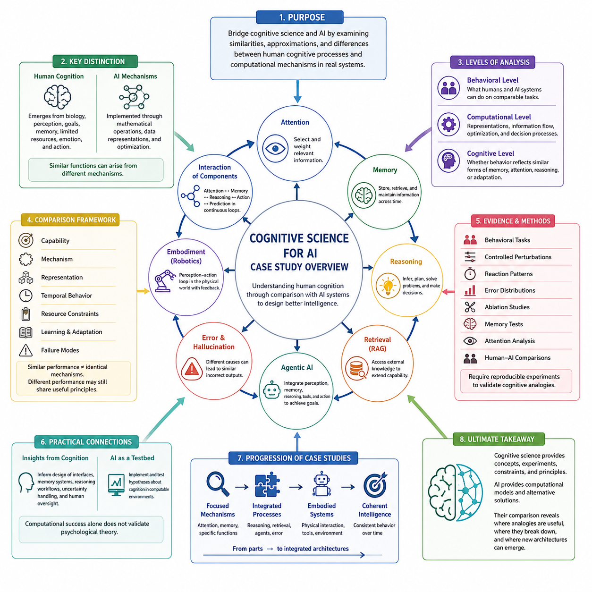
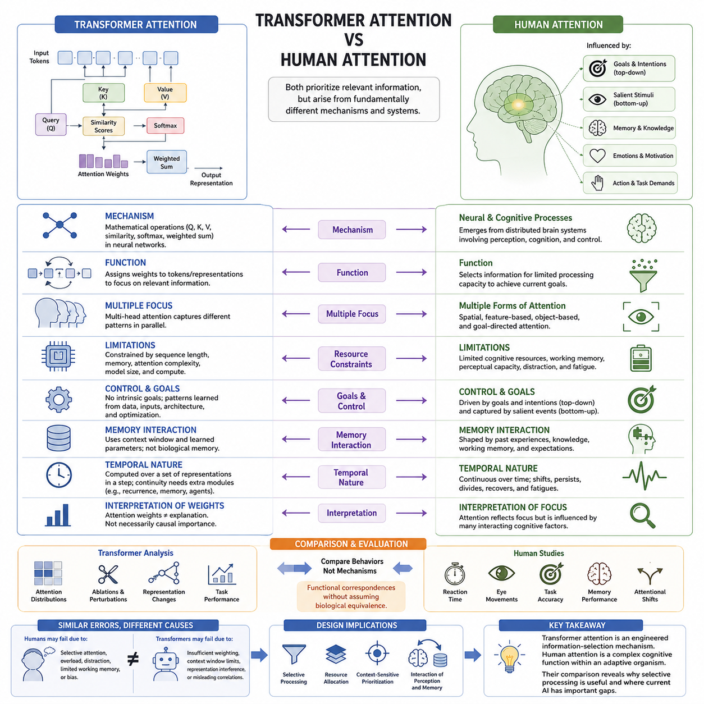
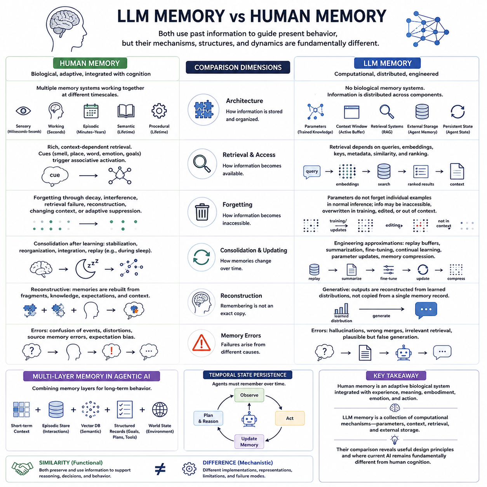
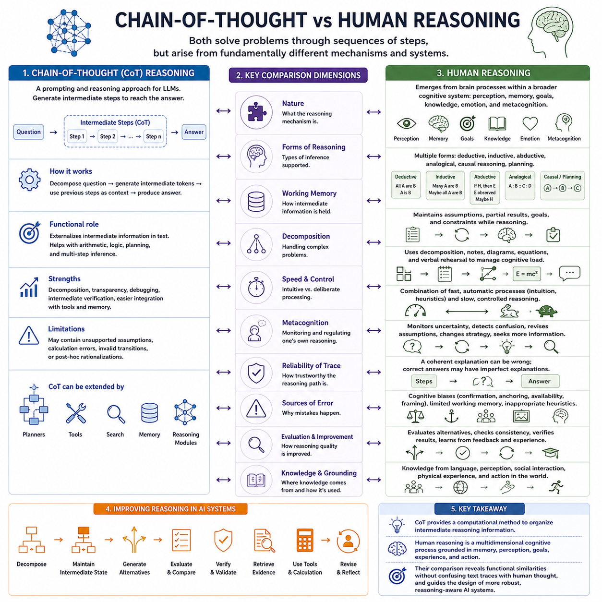
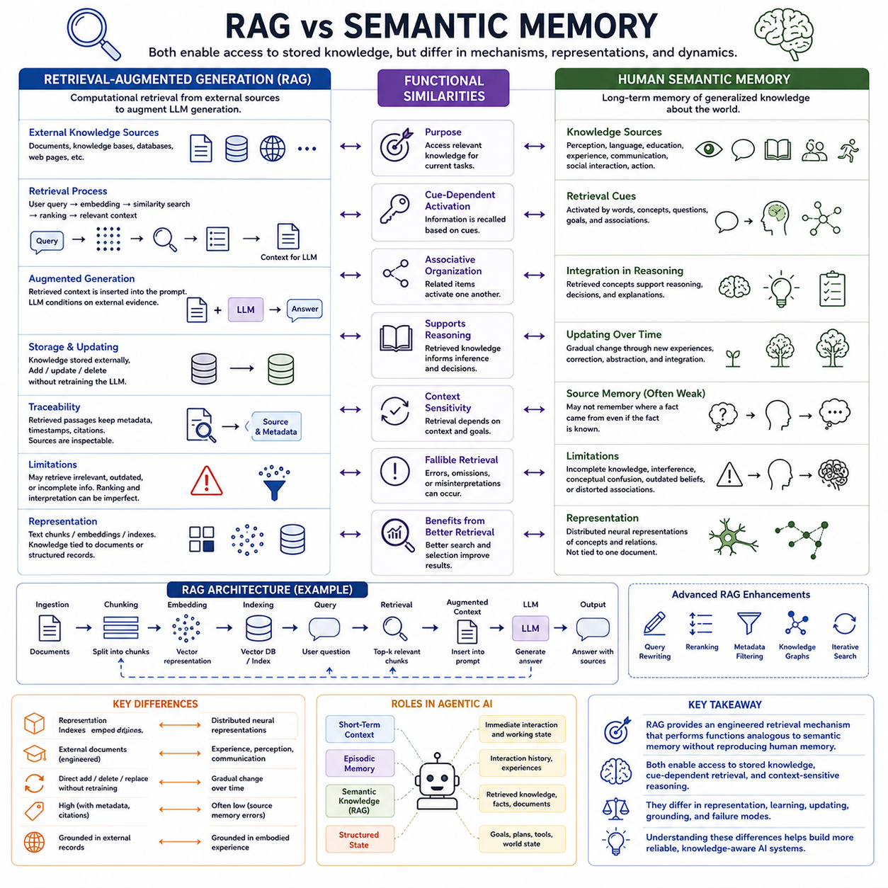
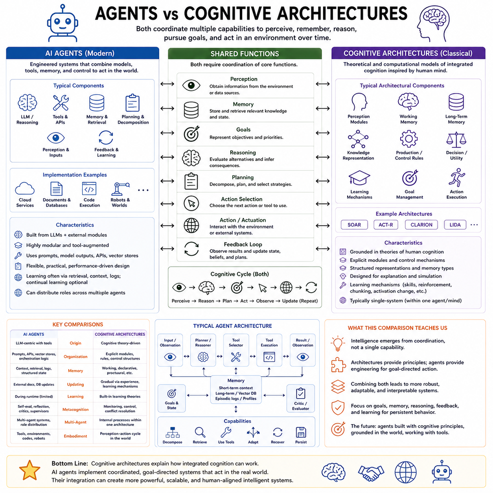
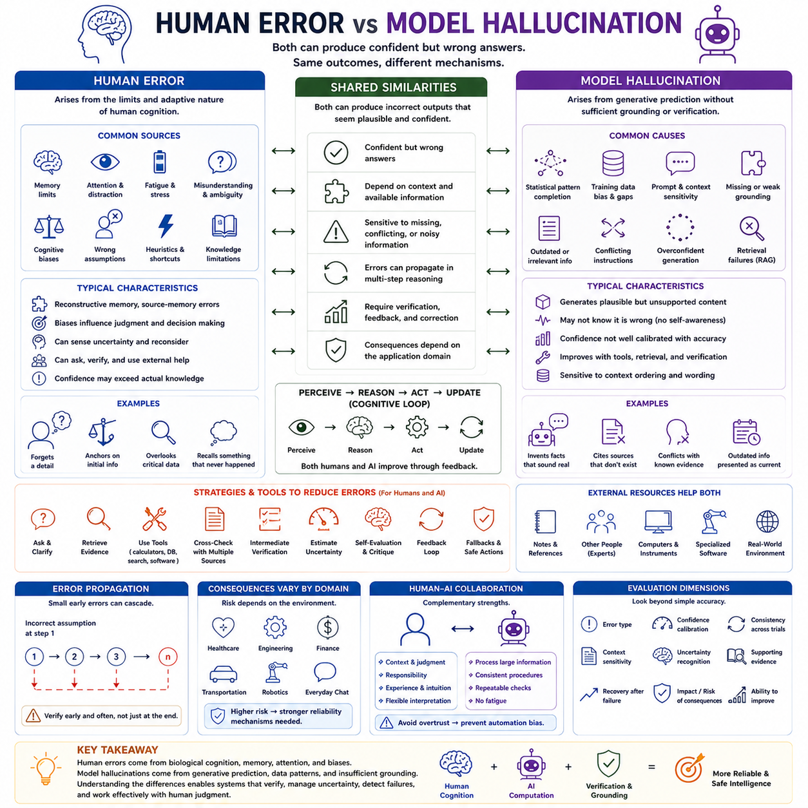
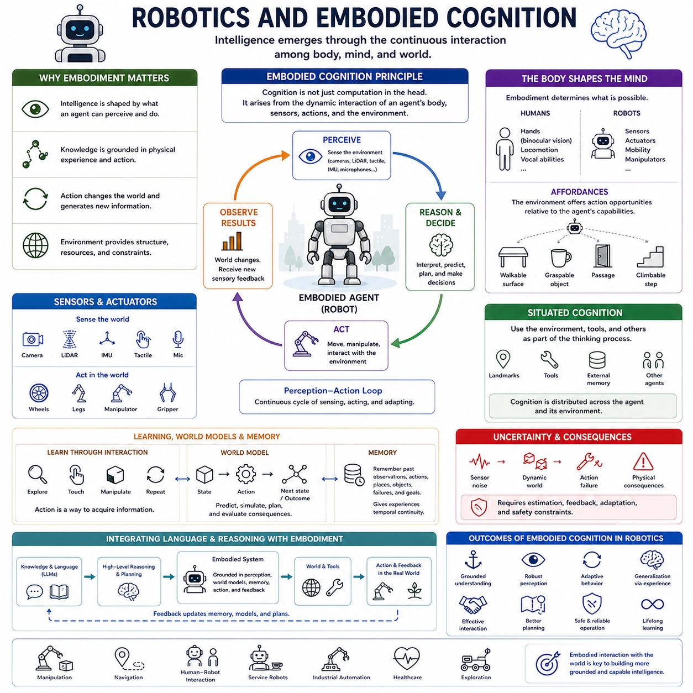

**Volume 43 Cognitive Science for AI**

# Chapter 11. Case Studies

## 11.00 Case Study Overview

{width="7.268055555555556in" height="7.268055555555556in"}

Case studies provide a practical bridge between cognitive science and artificial intelligence by examining how computational mechanisms resemble, approximate, or differ from human cognitive processes. Rather than treating AI concepts as isolated algorithms, a case-study approach places attention, memory, reasoning, retrieval, agency, error, and embodiment within concrete systems whose behavior can be observed and compared.

The purpose of these case studies is not to claim that artificial systems reproduce human cognition. Similar terminology can conceal fundamentally different mechanisms. Human attention emerges from biological perception, goals, memory, and limited cognitive resources, whereas attention in neural networks is a mathematical operation for weighting representations. Meaningful comparison therefore requires separating functional similarity from mechanistic equivalence.

Each case study can be understood through several complementary levels of analysis. At the behavioral level, the central question is what humans and AI systems can accomplish under comparable tasks. At the computational level, the focus shifts toward representations, information flow, optimization, and decision processes. At the cognitive level, the analysis asks whether observed behavior reflects comparable forms of memory, attention, reasoning, or adaptation.

Transformer attention and human attention provide a particularly useful example of this comparative method. Transformer attention dynamically assigns relevance among tokens or representations, enabling contextual information integration across sequences. Human attention also prioritizes information, but it is shaped by perception, goals, expectations, working-memory limits, emotion, and action. Their functional analogy is informative precisely because their mechanisms remain different.

Memory offers another important comparison. Human cognition includes sensory, working, episodic, semantic, and procedural forms of memory that interact across different timescales. AI systems distribute analogous functions across context windows, learned parameters, external databases, retrieval mechanisms, agent memory, and persistent state. Comparing these systems reveals both useful architectural correspondences and substantial differences in consolidation and experience.

Reasoning provides an especially challenging case because fluent outputs can create an impression of cognitive similarity. Chain-of-thought techniques expose intermediate textual steps that may improve performance on complex tasks, while human reasoning involves interacting processes such as working memory, mental models, inference, heuristics, metacognition, and uncertainty management. Observable reasoning traces therefore should not automatically be interpreted as direct representations of internal cognition.

Retrieval-Augmented Generation offers a useful engineering comparison with semantic memory. Human semantic memory supports access to accumulated conceptual knowledge without requiring conscious reconstruction of every learning episode. RAG systems retrieve relevant information from external stores and introduce it into the model\'s active context. The analogy clarifies how retrieval can extend limited internal state while also exposing differences in representation and grounding.

Agentic AI creates a broader comparison with cognitive architectures. Classical cognitive architectures attempt to integrate perception, memory, goals, reasoning, learning, and action within coordinated systems. Modern AI agents similarly combine language models with tools, retrieval, memory, planning, environmental observations, and feedback loops. Comparing these architectures helps identify which components are genuinely integrated and which remain loosely orchestrated modules.

Human error and model hallucination demonstrate why behavioral resemblance must be interpreted carefully. Humans can make errors because of incomplete knowledge, memory distortion, cognitive bias, limited attention, misleading context, or inappropriate heuristics. Generative models can produce unsupported outputs because probabilistic generation does not inherently guarantee factual grounding. Similar incorrect answers can therefore arise from very different underlying processes.

Robotics extends the comparison from abstract information processing to embodied cognition. An embodied agent must continuously connect perception, internal state, prediction, decision making, action, and environmental feedback. This perception-action loop makes cognition dependent on temporal continuity and physical consequences. Robotics therefore provides an important test of whether cognitive principles remain useful when intelligence must operate within a dynamic world.

The case studies also emphasize that cognition should be analyzed as an interacting system rather than as a collection of independent modules. Attention influences what enters working memory, memory affects reasoning, reasoning guides action, action changes future observations, and prediction connects present states with possible futures. AI architectures increasingly reproduce portions of this interaction through multimodal models, persistent memory, planning, tools, and world models.

A useful comparative framework must therefore consider capability, mechanism, representation, temporal behavior, resource constraints, learning, adaptation, and failure modes simultaneously. Two systems may achieve similar task accuracy while relying on completely different internal strategies. Conversely, systems with very different outward behavior may share useful computational principles. Case studies make these distinctions visible and discourage superficial one-to-one mappings between cognition and algorithms.

Experimental evidence is essential when evaluating such correspondences. Behavioral tasks, controlled perturbations, reaction patterns, error distributions, ablation studies, memory tests, attention analyses, and human-AI comparisons can reveal whether an apparent cognitive analogy has explanatory value. Reproducible experiments are particularly important because intuitive interpretations of complex AI behavior can easily exceed what observations actually demonstrate.

These comparisons also establish a practical connection between cognitive theory and AI engineering. Cognitive limitations suggest design requirements for interfaces, memory systems, reasoning workflows, uncertainty handling, and human oversight. Conversely, artificial systems provide computational environments in which hypotheses about attention, memory, reasoning, and coordinated cognition can be operationalized and tested, although computational success alone does not validate a psychological theory.

Across the chapter, the progression from attention and memory to reasoning, retrieval, agents, error, and embodiment gradually expands the unit of analysis. Early cases compare relatively focused mechanisms, while later cases examine integrated systems interacting with information, humans, tools, and physical environments. This progression reflects the broader movement from isolated cognitive functions toward architectures capable of maintaining coherent behavior over time.

Ultimately, these case studies provide a disciplined framework for learning from human cognition without assuming that artificial intelligence must imitate the human mind. Cognitive science supplies concepts, experiments, constraints, and organizational principles, while AI supplies computational models that can implement alternative solutions. Their comparison reveals where analogy is productive, where it breaks down, and where new architectures may emerge.

## 11.01 Transformer Attention vs Human Attention [w/Code]

{width="7.268055555555556in" height="7.268055555555556in"}

Transformer attention and human attention are often compared because both mechanisms prioritize information that is relevant to current processing. In transformers, attention assigns weights among tokens or representations so that some elements contribute more strongly to the next computation. Human attention similarly selects information, but it operates within a broader cognitive system involving perception, goals, memory, expectations, and action.

The similarity is primarily functional rather than mechanistic. Transformer attention is implemented through mathematical operations such as queries, keys, values, similarity scores, normalization, and weighted aggregation. Human attention emerges from interacting neural and cognitive processes distributed across the brain. Therefore, comparable selective behavior does not imply that transformers reproduce biological attention or conscious awareness.

Self-attention allows each token in a sequence to evaluate its relationship with other tokens and construct a context-sensitive representation. This mechanism enables transformers to capture dependencies that may span long textual or multimodal sequences. Human attention can also relate currently observed information to broader context, but it is constrained by working memory, perceptual capacity, prior knowledge, motivation, and task demands.

Multi-head attention further expands transformer processing by allowing several attention patterns to operate in parallel. Different heads may emphasize syntactic relations, positional dependencies, semantic associations, or other statistical structures learned during training. Human attention also supports multiple forms of selection, including spatial, feature-based, object-based, and goal-directed attention, although these processes are not equivalent to transformer heads.

Human attention is strongly influenced by competition for limited cognitive resources. When several stimuli or tasks demand processing simultaneously, performance may decline because attention must be allocated selectively. Transformers also operate under computational limitations, but their constraints are different. Sequence length, memory bandwidth, attention complexity, model size, and inference cost determine how much contextual information can be processed efficiently.

Another major difference concerns goals and control. Human attention can be influenced by deliberate intentions as well as automatically captured by salient events. Top-down processes prioritize information according to goals, while bottom-up processes respond to unexpected or prominent stimuli. Transformer attention does not independently possess goals in this cognitive sense; its weighting patterns are produced by learned representations, current inputs, architecture, and optimization.

Memory interacts continuously with human attention. Previous experiences, semantic knowledge, current working-memory contents, and expectations influence what receives attention and how information is interpreted. Transformer attention also depends on available context and learned parameters, but this relationship differs from biological memory. A model attends to representations inside its computational context rather than recalling experiences through human episodic or semantic memory systems.

Temporal behavior further distinguishes the two systems. Human attention unfolds continuously as perception, cognition, and action change over time. Attention can shift, persist, divide, recover after interruption, and become fatigued. Standard transformer attention is usually computed over a defined set of representations during a processing step. Temporal continuity must therefore be introduced through sequence context, recurrent interaction, memory modules, or agent architectures.

Attention weights are sometimes interpreted as explanations of model behavior, but this interpretation requires caution. A high attention score indicates computational weighting within a particular layer and head, not necessarily causal importance or human-like focus. Different attention patterns may produce similar outputs, and important information can also be transformed through residual pathways, feed-forward networks, embeddings, and interactions across multiple layers.

Experimental comparison should therefore examine behavior rather than rely only on visual similarity between attention maps. Human studies may measure reaction time, eye movements, task accuracy, distraction effects, memory performance, or attentional shifts. Transformer studies can analyze attention distributions, ablations, perturbations, representation changes, and task performance. Comparing these results can reveal functional correspondences without assuming biological equivalence.

The comparison becomes especially valuable when studying cognitive limitations. Humans may overlook information because of selective attention, overload, distraction, or limited working memory. Transformers may fail because relevant context receives insufficient weighting, information lies outside the context window, representations interfere, or learned correlations are misleading. Similar errors may therefore appear at the behavioral level while originating from fundamentally different mechanisms.

From an AI design perspective, human attention suggests useful principles such as selective processing, resource allocation, hierarchical focus, context-sensitive prioritization, and interaction between perception and memory. Transformer attention provides a computational realization of selective information integration, but it represents only one possible engineering solution. Cognitive science can inspire broader architectures that combine attention with memory, goals, uncertainty, and action.

The most productive comparison treats transformer attention as an engineered information-selection mechanism and human attention as a complex cognitive function embedded within an adaptive organism. Their similarities help explain why selective processing is useful for intelligent systems, while their differences reveal important gaps in current AI. Understanding both sides can guide the development of more efficient, context-aware, adaptive, and cognitively informed AI architectures.

## 11.02 LLM Memory vs Human Memory [w/Code]

{width="7.268055555555556in" height="7.268055555555556in"}

Large language model memory and human memory are often compared because both support the use of past information to influence present behavior. However, the resemblance is mainly functional. Human memory emerges from biological processes that encode, consolidate, retrieve, reconstruct, and sometimes forget experiences. LLM memory is distributed across model parameters, context windows, retrieval systems, external storage, and persistent agent states.

Human memory is not a single storage mechanism but a collection of interacting systems. Sensory memory briefly preserves incoming perceptual information, working memory maintains information needed for current reasoning, episodic memory stores personally experienced events, semantic memory represents concepts and knowledge, and procedural memory supports learned skills. These systems operate over different timescales and contribute differently to cognition.

An LLM does not naturally possess these biological memory systems. Information acquired during training is primarily embedded statistically in model parameters, where patterns learned from large datasets influence future predictions. This parameter-based knowledge is sometimes compared with long-term semantic memory because it supports access to general information, but the analogy is limited because the model does not retrieve stored experiences in the same way humans do.

The context window provides another memory-like mechanism. Tokens from the current interaction remain available to the model and can influence later outputs through attention. This resembles working memory at a functional level because temporarily available information supports ongoing processing. However, a context window is an explicit computational buffer, whereas human working memory is dynamically controlled, capacity-limited, and deeply integrated with attention, goals, perception, and long-term memory.

Human episodic memory contains records of events associated with temporal, spatial, perceptual, and contextual information. Recollection can involve reconstructing what happened, where it occurred, and how different experiences relate to one another. Standard LLMs do not inherently maintain autobiographical episodes. Persistent agent systems can approximate episodic functionality by storing interaction histories, observations, actions, timestamps, and summaries in external memory structures.

Semantic memory offers one of the strongest functional parallels between humans and language models. Humans accumulate conceptual knowledge that can be accessed independently of the original learning episode. LLM parameters also encode distributed statistical relationships among words, concepts, facts, and patterns. Yet human semantic memory is grounded in lifelong perception and action, while language models may acquire much of their knowledge from symbolic or multimodal training data.

Retrieval-Augmented Generation extends LLM memory beyond internal parameters. A system can search vector databases, documents, knowledge bases, or other external repositories and insert relevant information into the active context. This architecture resembles memory retrieval because stored knowledge becomes available when needed. Nevertheless, retrieval quality depends on indexing, embeddings, similarity functions, query formulation, ranking, and the reliability of the external information source.

Human memory retrieval is strongly cue-dependent. A smell, location, word, emotional state, or current goal can activate related memories through associative processes. Retrieval in AI systems is also dependent on cues, but these cues are computationally represented through queries, embeddings, keys, metadata, or symbolic conditions. This similarity is useful for engineering, yet it does not imply that artificial retrieval reproduces the biological processes responsible for human remembering.

Forgetting also differs significantly between humans and LLM systems. Human forgetting can result from decay, interference, retrieval failure, reconstruction, changing context, or adaptive suppression of irrelevant information. Model parameters generally do not forget individual training examples through ordinary inference. Instead, information may become inaccessible, overwritten during further training, removed through editing, or excluded because it falls outside the current context or retrieval process.

Memory consolidation is another important distinction. Human memory changes after learning as experiences are stabilized, reorganized, integrated with prior knowledge, and sometimes replayed during rest or sleep. Artificial systems can implement analogous processes through replay buffers, periodic summarization, fine-tuning, continual learning, parameter updates, or memory compression. These mechanisms are engineered approximations rather than direct equivalents of biological consolidation.

Reconstruction is central to human remembering. People do not always retrieve exact copies of past events; instead, memory can be rebuilt from fragments, expectations, semantic knowledge, and current context. LLM generation is also reconstructive in a broad computational sense because outputs are generated from learned distributions rather than copied from a dedicated memory record. This similarity partly explains why fluent recall does not necessarily guarantee factual accuracy.

Memory errors therefore arise differently in humans and language models. Humans may confuse events, distort details, forget sources, or incorporate expectations into remembered experiences. LLMs may hallucinate unsupported information, merge related patterns incorrectly, retrieve irrelevant documents, or generate plausible but false continuations. Similar behavioral failures can emerge even though the underlying mechanisms of error are fundamentally different.

Agentic AI systems increasingly combine multiple memory layers to support longer-term behavior. Short-term context can maintain immediate state, external episodic stores can preserve previous interactions, vector databases can provide semantic retrieval, and structured records can maintain goals, plans, tools, or environmental state. This modular organization resembles the idea that intelligent behavior benefits from multiple specialized memory systems rather than a single uniform store.

Temporal state persistence is especially important for AI agents and embodied systems. A capable agent must remember what it observed, what actions it performed, what goals remain unfinished, and how the environment has changed. Human cognition performs this integration naturally across perception, memory, reasoning, and action. Artificial systems usually require explicit mechanisms for state tracking, memory selection, retrieval, summarization, and updating to achieve comparable continuity.

The most useful comparison therefore treats human memory as an adaptive biological system and LLM memory as a collection of computational mechanisms serving similar information-preservation functions. Human memory integrates experience, meaning, embodiment, emotion, and action, whereas LLM memory relies on parameters, context, retrieval, and external storage. Their comparison reveals valuable design principles while also clarifying where current AI remains fundamentally different from human cognition.

## 11.03 Chain of Thought vs Human Reasoning [w/Code]

{width="7.268055555555556in" height="7.268055555555556in"}

Chain-of-Thought reasoning and human reasoning are often compared because both can express problem solving as a sequence of intermediate steps. A language model may decompose a question, generate intermediate propositions, evaluate possible relationships, and produce a final answer. Humans can also reason through sequential steps, but human reasoning arises from a broader cognitive system involving perception, memory, goals, knowledge, emotion, and metacognition.

Chain-of-Thought, commonly abbreviated as CoT, is a prompting and reasoning approach in which intermediate textual steps are generated before or alongside an answer. Instead of mapping a complex problem directly to a conclusion, the model can represent useful intermediate relationships within its generated sequence. This additional computational trajectory can improve performance on tasks involving arithmetic, logic, planning, and multi-step inference.

The apparent similarity between CoT and human reasoning should not be interpreted as mechanistic equivalence. Human reasoning involves neural processes whose internal operations are not simply sentences spoken internally. Language, imagery, concepts, spatial representations, memories, emotions, and implicit associations can all participate in reasoning. CoT, by contrast, represents reasoning-related computation through generated tokens and learned statistical relationships among representations.

Human reasoning is commonly described through multiple forms of inference. Deductive reasoning derives conclusions from premises, inductive reasoning generalizes from observations, abductive reasoning searches for plausible explanations, and analogical reasoning transfers relational structures between situations. Humans also use causal reasoning and planning. Language models can exhibit behavior corresponding to these forms, although success varies substantially with task structure, training, prompting, and available context.

Working memory plays a central role in human reasoning because intermediate information must often remain accessible while a problem is being solved. People maintain assumptions, partial results, goals, and constraints while shifting attention among them. CoT provides an artificial functional analogue by placing intermediate information into the generated context, where subsequent tokens can condition on previous reasoning steps and preserve a temporary computational trajectory.

This externalized intermediate representation can be particularly useful for decomposition. A difficult problem may be separated into smaller subproblems whose outputs become inputs to later stages. Human problem solvers similarly use decomposition, notes, diagrams, equations, or verbal rehearsal to reduce cognitive load. In LLM systems, decomposition can extend beyond a single CoT sequence through planners, tools, search procedures, external memory, and specialized reasoning modules.

Human reasoning is not always deliberate or sequential. Many judgments occur rapidly through learned patterns, heuristics, intuition, and automatic processes, while other problems require slower and more controlled reasoning. This distinction is often associated with dual-process theories of cognition. LLM behavior can also vary between direct responses and extended inference procedures, but this computational distinction should not automatically be identified with human intuitive and deliberative cognitive systems.

Metacognition provides another important difference. Humans can sometimes evaluate their own uncertainty, recognize confusion, reconsider assumptions, change strategies, and decide that additional information is necessary. LLM reasoning systems can approximate some of these functions through self-evaluation, critique, verification, reflection, or iterative generation. However, these procedures are engineered computational loops and should not automatically be interpreted as human-like self-awareness.

The reliability of a reasoning trace also requires careful interpretation. A coherent sequence of intermediate statements may lead to an incorrect conclusion, while a correct answer may sometimes be accompanied by an imperfect explanation. Generated reasoning can contain unsupported assumptions, arithmetic errors, invalid logical transitions, or post-hoc rationalizations. Consequently, the apparent plausibility of a textual reasoning chain is not sufficient evidence that the underlying computation is correct.

Human reasoning is similarly fallible, but its characteristic failures arise from cognitive mechanisms such as confirmation bias, anchoring, availability, framing effects, limited working memory, and inappropriate heuristics. LLMs may instead fail because of misleading statistical associations, inadequate context, representation errors, weak decomposition, accumulated generation errors, or unreliable intermediate steps. Similar incorrect conclusions can therefore originate from substantially different mechanisms.

Reasoning performance can be improved by introducing mechanisms that evaluate alternatives rather than committing immediately to one trajectory. AI systems may generate multiple candidate solutions, compare intermediate states, search among possible reasoning paths, use external tools, retrieve relevant evidence, or verify calculations. These approaches broaden reasoning beyond a single linear CoT and move toward architectures in which generation, evaluation, search, memory, and feedback interact.

Human reasoning also depends strongly on knowledge and grounding. People reason using concepts acquired through language, perception, social interaction, physical experience, and repeated action in the world. Language models acquire structured statistical knowledge from training data and may additionally receive multimodal inputs, retrieved documents, tool outputs, or environmental observations. Similar reasoning performance therefore does not imply equivalent experiential foundations or representations.

Experimental comparison should focus on observable capabilities and failure patterns rather than assuming that generated text directly reveals internal cognition. Researchers can compare accuracy, response consistency, sensitivity to problem formulation, intermediate errors, transfer across tasks, uncertainty calibration, and performance under limited information. Controlled perturbations and ablation studies can further reveal which contextual or computational components contribute to successful reasoning.

For AI engineering, the comparison with human reasoning suggests several useful principles: decompose complex problems, preserve relevant intermediate state, evaluate alternative hypotheses, verify uncertain conclusions, integrate external knowledge, and revise decisions when evidence changes. These principles can be implemented through CoT, retrieval, tool use, search, memory, planning, self-evaluation, or combinations of several mechanisms rather than relying on one reasoning technique alone.

The most useful interpretation is therefore that Chain-of-Thought provides a computational method for organizing intermediate reasoning-related information, while human reasoning is a multidimensional cognitive process embedded within memory, perception, goals, experience, and action. Comparing them helps identify functional similarities without confusing textual reasoning traces with human thought, and it provides a foundation for designing more robust reasoning-aware AI systems.

## 11.04 RAG vs Semantic Memory [w/Code]

{width="7.268055555555556in" height="7.268055555555556in"}

Retrieval-Augmented Generation, or RAG, and human semantic memory are often compared because both allow an intelligent system to access previously acquired knowledge when responding to a current task. RAG retrieves relevant information from external sources and places it into the model's active context, while semantic memory allows humans to access concepts, facts, meanings, and relationships accumulated across experience.

Human semantic memory is part of long-term memory and differs from episodic memory because it stores generalized knowledge rather than records of specific personal events. A person may know that water freezes near zero degrees Celsius without remembering when that fact was first learned. Semantic memory therefore supports stable conceptual knowledge that can be reused across many different situations and reasoning tasks.

RAG provides a computational mechanism that performs a somewhat similar function by separating stored knowledge from the language model's internal parameters. Documents, knowledge bases, databases, or other repositories can be indexed and searched when needed. Retrieved information is inserted into the context window so that the model can condition its generation on relevant external evidence rather than relying only on parametric knowledge.

The similarity between RAG and semantic memory is mainly functional rather than mechanistic. Human semantic knowledge is represented through distributed neural systems shaped by perception, language, action, education, and social experience. RAG instead depends on engineered components such as document segmentation, embeddings, indexes, similarity search, ranking, query generation, and context construction. Similar information-access behavior therefore arises from fundamentally different mechanisms.

Retrieval cues are important in both systems. Human semantic memory may be activated by words, concepts, questions, goals, or associations that bring related knowledge into awareness. In RAG systems, the user query or an automatically generated search query is converted into a computational representation used to retrieve matching information. The usefulness of retrieval depends strongly on whether the query activates the appropriate knowledge.

Association also provides an important point of comparison. Human semantic knowledge is organized through networks of related concepts, allowing one idea to activate related ideas through meaning and prior learning. Vector-based RAG approximates this behavior by mapping text into embedding spaces where semantically related items may appear near one another. Similarity in embedding space, however, is a mathematical approximation rather than a direct model of human conceptual organization.

Human semantic memory usually contains abstracted knowledge that has been integrated across many experiences. Repeated encounters with objects, language, categories, and relationships gradually support stable concepts that are not tied to one source document. RAG systems often preserve information in explicit external records, meaning that retrieval may return passages, chunks, or structured entries whose content remains closely associated with particular documents or databases.

Knowledge updating also differs substantially. Human semantic memory changes gradually as new experiences modify existing concepts, correct misconceptions, or introduce new relationships. RAG systems can update more directly by adding, deleting, or replacing external documents without retraining the underlying language model. This modularity is one of the major engineering advantages of retrieval-based architectures when knowledge changes frequently.

RAG can also improve traceability because retrieved passages can provide explicit evidence for generated answers. Human semantic memory often does not preserve a reliable record of where a fact originally came from, producing source-memory errors even when the knowledge itself is correct. In contrast, a well-designed RAG system can retain document identifiers, metadata, timestamps, or citations that help users inspect the origin of retrieved information.

However, retrieval does not guarantee correctness. A RAG system may retrieve irrelevant documents, miss important evidence, select outdated information, rank weak matches too highly, or provide context that the language model interprets incorrectly. Human semantic memory can also produce errors through incomplete knowledge, interference, conceptual confusion, outdated beliefs, or distorted associations. Similar failures may therefore appear despite different underlying causes.

The context window creates another important distinction. Retrieved information must normally be inserted into a limited active context before an LLM can use it effectively. Human semantic memory does not operate through a fixed textual context window, although attention and working memory constrain how much retrieved knowledge can be actively manipulated at once. RAG therefore separates long-term external storage from limited short-term computational access.

Advanced RAG architectures increasingly incorporate multiple retrieval stages, query rewriting, reranking, metadata filtering, knowledge graphs, memory stores, and iterative search. These mechanisms move RAG beyond simple nearest-neighbor retrieval toward more structured knowledge access. Human semantic retrieval is likewise influenced by context, goals, associations, and prior activation, suggesting that intelligent retrieval benefits from dynamic control rather than one-shot lookup.

For agentic AI, RAG can function as one layer within a larger memory architecture. Immediate context can represent short-term state, external interaction histories can approximate episodic memory, and retrieval systems can provide semantic knowledge. Structured databases may maintain goals, tools, plans, or world state. Combining these layers allows artificial agents to maintain more persistent and context-sensitive behavior across extended tasks.

The comparison between RAG and semantic memory also highlights the importance of grounding. Human concepts are shaped by embodied perception, communication, social interaction, and repeated encounters with the world. RAG can ground language-model outputs in external records, but those records remain computational representations. Multimodal retrieval, tool use, and environmental interaction can broaden this grounding, yet they still differ from human lived experience.

The most useful interpretation is therefore that RAG provides an engineered retrieval mechanism that performs some functions analogous to semantic memory without reproducing human memory itself. Both systems support access to stored knowledge, cue-dependent retrieval, and context-sensitive reasoning, but they differ in representation, learning, updating, grounding, and failure modes. Their comparison offers useful principles for designing more reliable knowledge-aware AI systems.

## 11.05 Agents vs Cognitive Architectures [w/Code]

{width="7.268055555555556in" height="7.268055555555556in"}

Modern AI agents and classical cognitive architectures are often compared because both attempt to coordinate multiple capabilities into systems that can perceive information, maintain state, pursue goals, reason about alternatives, and select actions. AI agents typically combine language models with tools, memory, planning, retrieval, and environmental feedback, while cognitive architectures were developed to model how integrated human-like cognition may emerge from interacting functional components.

A cognitive architecture is more than a collection of independent algorithms. Frameworks such as SOAR, ACT-R, CLARION, LIDA, and related approaches define organized mechanisms for memory, attention, learning, reasoning, goal management, and action selection. Their purpose is often explanatory as well as computational: they attempt to describe recurring structural principles of cognition rather than merely optimize performance on one task.

Modern AI agents are usually engineered from a different starting point. A foundation model or large language model often serves as the central reasoning and language component, while external modules provide retrieval, tool execution, planning, memory, perception, or control. The resulting system can interact with software services, documents, databases, simulated environments, or physical robots, enabling behavior that extends beyond a single model invocation.

The functional similarity between agents and cognitive architectures is strongest at the system level. Both approaches recognize that intelligent behavior requires coordination among specialized functions. Perception provides information, memory preserves relevant state, goals determine priorities, reasoning evaluates alternatives, and action changes the environment. Intelligence therefore emerges not from one isolated capability but from repeated interaction among multiple processes over time.

Their internal organization, however, can differ substantially. Cognitive architectures often specify explicit modules and control rules derived from theories of cognition. An AI agent may instead rely on prompts, model outputs, tool APIs, vector stores, planners, and orchestration logic. The architecture may be highly modular, but its components are usually selected for engineering effectiveness rather than for direct correspondence with psychological or neurological mechanisms.

Memory illustrates this contrast clearly. Cognitive architectures commonly distinguish working memory, declarative memory, procedural knowledge, and other specialized stores. Agentic AI may implement short-term context, vector databases, episodic interaction logs, structured state, and persistent profiles. These mechanisms can perform analogous roles, but the representations, updating processes, retrieval rules, and failure modes are often fundamentally different.

Goal management is another shared requirement. Cognitive architectures often maintain explicit goals, subgoals, production rules, or activation structures that determine what processing occurs next. AI agents can maintain objectives in prompts, plans, task graphs, state machines, or external memory. Complex tasks may be decomposed into subtasks, monitored for completion, and revised when tools fail or new information changes the situation.

Planning also reveals both similarity and difference. Classical cognitive systems may combine symbolic search, production systems, or procedural knowledge to determine actions. Contemporary agents frequently ask language models to propose plans, generate steps, select tools, or revise strategies. More advanced systems can incorporate explicit search, simulation, world models, constraint solvers, or reinforcement-learning policies rather than relying entirely on linguistic planning.

Action selection is central to both architectures because cognition becomes operational only when a system chooses what to do next. A cognitive architecture may use conflict resolution, activation levels, utility estimates, or procedural rules. An AI agent may select among API calls, retrieval operations, messages, code execution, navigation commands, or physical actions based on model outputs and external control logic.

Feedback closes the cognitive loop. After an action is performed, the resulting observation can update memory, alter beliefs, modify the plan, or change the next action. This perceive-reason-act-update cycle appears in both cognitive architectures and agentic AI. Persistent behavior requires repeated state transitions rather than a single input-output transformation, which is why temporal continuity is a defining property of both system types.

Learning introduces a major difference in many current implementations. Cognitive architectures often include explicit theories of skill acquisition, reinforcement, chunking, activation change, or memory adaptation. Many deployed AI agents use a largely fixed pretrained model during operation and adapt primarily through context, retrieval, or stored interaction history. Continual learning can be added, but it is often separated from real-time agent execution.

Metacognitive functions provide another useful comparison. Human-inspired architectures may include monitoring of goals, conflicts, uncertainty, or cognitive control. AI agents can approximate similar functions through self-evaluation, reflection, critic modules, verification stages, or supervisory agents. These mechanisms can detect failures and trigger replanning, although they remain engineered control processes rather than evidence of human-like self-awareness.

The comparison becomes especially interesting in multi-agent systems. Human cognition coordinates many functional processes within one organism, while agentic AI can distribute capabilities across several specialized agents. One agent may plan, another retrieve evidence, another execute tools, and another evaluate results. This distributed arrangement can increase modularity and parallelism, although coordination overhead and inconsistent internal state can introduce new failure modes.

Embodied agents bring the comparison even closer to cognitive architecture research because perception and action must operate continuously in a physical environment. A robot may integrate cameras, LiDAR, proprioception, world models, memory, planning, and control while pursuing goals under uncertainty. In such systems, cognition cannot be separated cleanly from timing, embodiment, environmental dynamics, and the consequences of physical action.

Evaluation should therefore consider architecture-level behavior rather than isolated benchmark accuracy. Important questions include whether the system maintains coherent goals, preserves relevant state, recovers from failed actions, adapts to changing conditions, selects appropriate tools, manages uncertainty, and avoids repeating errors. Cognitive architectures provide useful concepts for evaluating these properties because they emphasize integrated behavior across time.

For AI engineering, cognitive architectures offer organizational principles that can guide agent design without requiring literal imitation of the human mind. Specialized memory, explicit state representation, hierarchical goals, controlled attention, planning, feedback, learning, and metacognitive monitoring can all improve robustness. Modern foundation models can then serve as flexible components within broader architectures rather than being treated as complete cognitive systems by themselves.

The most useful interpretation is therefore that cognitive architectures provide theories and structural models of integrated cognition, while AI agents provide engineered systems for coordinated goal-directed computation and action. Their comparison reveals substantial functional overlap but different origins, representations, and design objectives. Combining insights from both can support more persistent, adaptive, interpretable, and cognitively organized artificial agents.

## 11.06 Human Error vs Model Hallucination [w/Code]

{width="7.268055555555556in" height="7.268055555555556in"}

Human error and model hallucination are often compared because both can produce outputs that are inaccurate, incomplete, misleading, or inconsistent with available evidence. At the behavioral level, a person and an AI model may confidently provide the same incorrect answer. However, the mechanisms producing these failures are fundamentally different, making it important to distinguish observable similarity from cognitive or computational equivalence.

Human error emerges from the limitations and adaptive characteristics of biological cognition. People operate with finite attention, working memory, knowledge, time, and perceptual capacity. Errors may result from forgetting, distraction, fatigue, misunderstanding, cognitive bias, incorrect assumptions, or inappropriate heuristics. In many situations, these mechanisms trade perfect accuracy for speed, efficiency, and the ability to make decisions under uncertainty.

Model hallucination refers broadly to generated content that appears plausible but is unsupported, inconsistent with evidence, or factually incorrect. A language model generates outputs by predicting tokens from learned statistical patterns and the available context. Unless additional mechanisms provide grounding or verification, fluent generation does not inherently guarantee factual correctness, source reliability, logical validity, or consistency with the external world.

Human memory is reconstructive rather than a perfect recording system, which creates an important source of error. People may combine fragments of actual experiences with expectations, semantic knowledge, later information, or contextual assumptions. This can produce distorted recollections or source-memory errors. Model hallucination can appear similarly reconstructive, but it arises from generative computation over learned representations rather than biological recollection.

Cognitive biases provide another major source of human error. Confirmation bias can favor evidence consistent with existing beliefs, anchoring can make initial information disproportionately influential, and availability can cause easily recalled examples to affect judgment. Models do not necessarily possess these human biases in the same psychological sense, but training distributions, prompts, context ordering, and learned correlations can create systematic response tendencies that resemble biased behavior.

Knowledge limitations affect both humans and models in different ways. A person may recognize that information is missing and explicitly say that they do not know, although confidence can also exceed actual knowledge. A language model may generate a plausible continuation even when reliable information is unavailable. This creates a calibration problem in which linguistic confidence, factual accuracy, and the model\'s actual evidential support may not correspond closely.

Context also plays a critical role in both forms of failure. Humans may misunderstand ambiguous instructions, overlook important details, or interpret information according to previous expectations. Models can likewise be sensitive to prompt wording, irrelevant context, conflicting instructions, missing evidence, and the ordering of information. Small contextual changes can therefore alter conclusions even when the underlying task appears essentially unchanged.

Human errors can sometimes be detected through metacognition. A person may experience uncertainty, reconsider an assumption, search for additional evidence, ask another person, or verify a calculation. AI systems can implement functionally similar procedures through uncertainty estimation, self-evaluation, critique, retrieval, external tools, multiple candidate generation, or verification models. These mechanisms can reduce errors without implying human-like awareness of being wrong.

Hallucination becomes particularly important when language models interact with external knowledge systems. Retrieval-Augmented Generation can provide documents that ground an answer in relevant evidence, but retrieval itself can fail. The system may select irrelevant, outdated, incomplete, or contradictory information. Consequently, reliable AI requires evaluation of both the generation process and the quality, provenance, and relevance of the information supplied to it.

Tool use provides another method for reducing model errors. Calculators can verify arithmetic, databases can provide structured records, search systems can retrieve current information, and specialized software can perform deterministic operations. Humans similarly rely on notebooks, instruments, references, computers, and other people to extend cognition. In both cases, external resources can improve reliability when they are selected appropriately and their outputs are interpreted correctly.

Error propagation is especially important in multi-step reasoning. A small incorrect assumption early in a human reasoning process can influence every later conclusion. Chain-of-Thought and agentic AI systems face a comparable computational problem because an incorrect intermediate result can become context for subsequent steps. Verification at intermediate stages can therefore be more effective than checking only the final answer after a long reasoning sequence has already developed.

The consequences of errors depend strongly on the environment in which they occur. An incorrect answer in casual conversation may have little impact, while errors in medicine, engineering, finance, transportation, or robotic control can create significant risks. Human-AI systems therefore require reliability mechanisms proportional to the consequences of failure, including validation, uncertainty handling, evidence tracking, redundancy, supervision, and safe fallback behavior.

Embodied AI makes this distinction particularly important because hallucination can move from information generation into physical action. A robot that incorrectly estimates an object\'s location, misunderstands an instruction, or constructs an inaccurate world state may choose an unsafe action. Physical AI therefore requires grounding through sensors, state estimation, world models, constraints, feedback, and continuous verification rather than relying solely on linguistic plausibility.

Human-machine collaboration can reduce some errors when the strengths and weaknesses of each participant are understood. Humans can contribute contextual judgment, responsibility, experiential knowledge, and flexible interpretation, while AI systems can process large information spaces, maintain consistent procedures, and perform repeated checks. However, humans may also overtrust automated outputs, creating automation bias when apparently authoritative AI responses are accepted without sufficient verification.

Evaluation should therefore examine more than simple error rates. Important dimensions include the type of error, confidence associated with the error, consistency across repeated trials, sensitivity to context, ability to recognize uncertainty, availability of supporting evidence, and capacity to recover after failure. Comparing these characteristics provides a richer understanding of reliability than merely asking whether humans or models produce more correct answers.

The most useful interpretation is that human error and model hallucination are distinct failure phenomena that can sometimes produce superficially similar outcomes. Human errors emerge from biological cognition, experience, memory, attention, and heuristics, whereas hallucinations emerge from generative computation, learned distributions, contextual limitations, and insufficient grounding. Understanding these differences supports the design of AI systems that verify evidence, manage uncertainty, detect failures, and cooperate effectively with human judgment.

## 11.07 Robotics and Embodied Cognition [w/Code]

{width="7.268055555555556in" height="7.268055555555556in"}

Robotics provides one of the clearest practical settings for studying embodied cognition because a robot must connect perception, internal processing, and physical action within a continuously changing environment. Embodied cognition argues that intelligence cannot be understood only as abstract computation inside an agent. Cognitive behavior emerges through ongoing interaction among the body, sensory systems, actions, and the surrounding world.

Traditional approaches to intelligence often describe cognition as a sequence in which information enters a system, internal representations are processed, and an output is produced. Embodied cognition challenges this separation between cognition and physical interaction. Human intelligence develops through active engagement with objects, spaces, tools, and other people, suggesting that knowledge is shaped by what an embodied agent can perceive and do.

The perception-action loop is therefore central to embodied cognition. Perception guides action, while action changes the environment and generates new sensory information. A robot approaching an object, for example, receives different visual, spatial, and tactile information as it moves. Intelligence develops through repeated cycles of sensing, interpretation, action, observation, and adaptation rather than through isolated processing of static inputs.

The physical structure of an agent also influences the kinds of knowledge it can acquire. Humans possess hands for dexterous manipulation, binocular vision for depth perception, and locomotion capabilities that determine how they explore environments. Robots likewise differ according to their cameras, LiDAR, tactile sensors, manipulators, wheels, legs, joints, and actuators. Different embodiments create different opportunities for learning and interaction.

This relationship between body and cognition is closely connected to the concept of affordances. An environment does not simply contain objects with fixed descriptions; it presents possibilities for action relative to the capabilities of an agent. A surface may support walking for one robot but not another, while an object may be graspable by one manipulator but inaccessible to another. Perception therefore becomes closely linked to possible actions.

Situated cognition extends this perspective by emphasizing that intelligent behavior depends on the context in which an agent operates. Cognitive processing can make use of environmental structures, tools, landmarks, external memory, and other agents rather than representing everything internally. A navigation robot using environmental markers, for example, incorporates features of the external world into its broader problem-solving process.

Robotics makes these ideas operational through sensors and actuators. Cameras provide visual observations, LiDAR measures spatial structure, IMUs estimate motion, tactile and force sensors capture physical contact, and microphones provide acoustic information. Motors, wheels, legs, and manipulators allow the robot to intervene in the environment. These components establish the physical interface through which perception and action become connected.

Grounded intelligence emerges when internal representations become systematically connected with sensory experience and physical consequences. The concept of grasping, for example, involves more than a linguistic definition. For an embodied robot, it can involve object geometry, relative pose, approach trajectory, gripper configuration, contact, force, stability, and task success. Repeated interaction connects abstract representations with actionable physical knowledge.

Learning through interaction provides information that passive observation alone may not reveal. A robot can move around an object to resolve visual ambiguity, touch a surface to estimate physical properties, manipulate an object to test its mobility, or repeat an action to estimate its consequences. Action therefore becomes a mechanism for acquiring information, making exploration an active component of perception, learning, and reasoning.

Embodied cognition also provides a useful foundation for understanding world models. Through repeated interaction, an agent can learn predictive relationships between states, actions, and outcomes. Such representations can capture expectations about object motion, contact, spatial change, or environmental dynamics. A world model can then support prediction, simulation, planning, and decision making by estimating possible consequences before physical actions are executed.

Memory gives these interactions temporal continuity. A robot operating in a changing environment must retain information about previous observations, actions, locations, objects, failures, and goals. Current perception becomes more useful when interpreted in relation to past experience. Embodied intelligence therefore benefits from architectures that connect perception, memory, prediction, planning, and control across multiple timescales.

Adaptive behavior emerges when feedback changes future decisions. If a grasp fails, a robot may alter its approach angle or force. If a planned route becomes blocked, it may update its environmental representation and select another path. These feedback-driven adjustments demonstrate why embodied cognition is fundamentally dynamic: intelligence involves maintaining effective interaction as both the agent and the environment change.

Large language models and foundation models can become components of embodied systems by providing semantic knowledge, language understanding, reasoning, or high-level planning. However, language alone does not provide direct physical experience. Embodied AI therefore seeks to connect symbolic and linguistic representations with perception, world models, memory, action, and feedback so that abstract knowledge can participate in physically grounded behavior.

Robotics also exposes the importance of uncertainty and physical consequences. Sensor measurements can be noisy, objects can move unexpectedly, surfaces can vary, and actions can fail. Unlike purely digital tasks, an incorrect decision may alter the physical state of the environment and cannot always be reversed. Reliable embodied systems therefore require continuous state estimation, feedback, adaptation, and constraints on potentially unsafe actions.

The connection between robotics and embodied cognition consequently extends beyond building machines that imitate human behavior. It provides a framework for understanding intelligence as an adaptive process distributed across perception, internal representations, bodily capabilities, action, and environmental structure. Sensorimotor intelligence, grounded learning, physical interaction, adaptive behavior, and integrated architectures become complementary parts of the same framework.

The broader implication is that increasingly capable artificial intelligence may require more than processing larger quantities of abstract information. Physical or simulated embodiment can provide opportunities to acquire knowledge through exploration, intervention, feedback, and consequences. Robotics therefore serves as both an engineering domain and an experimental platform for investigating how perception, action, memory, prediction, and learning can combine into more grounded and adaptive forms of intelligence.
