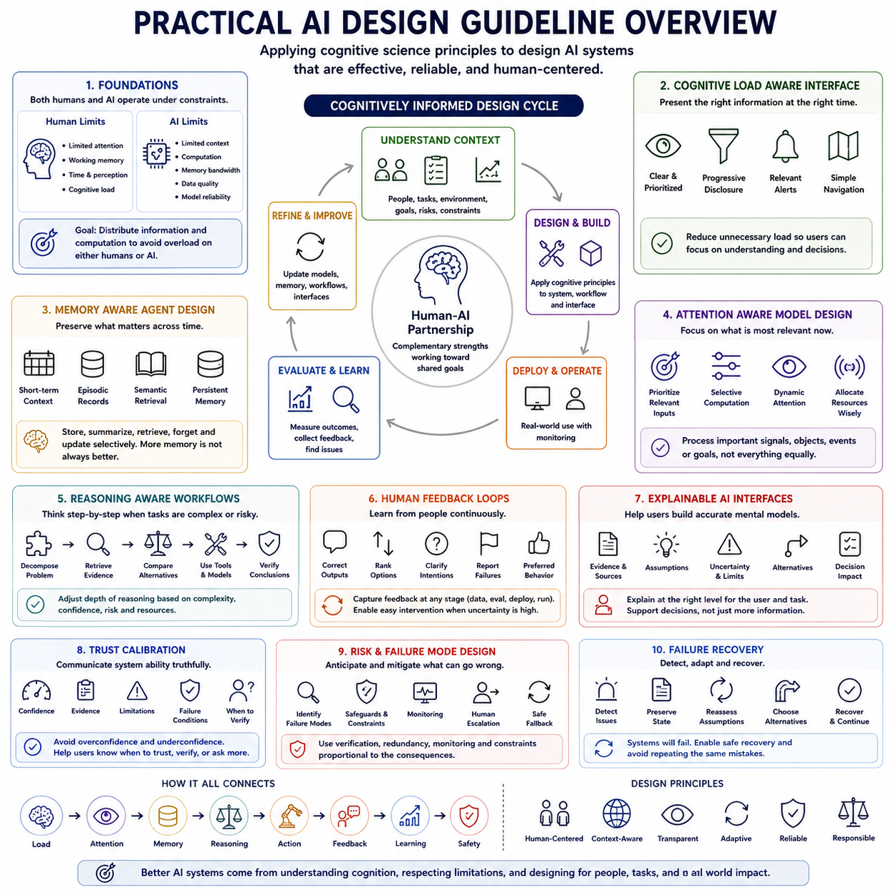
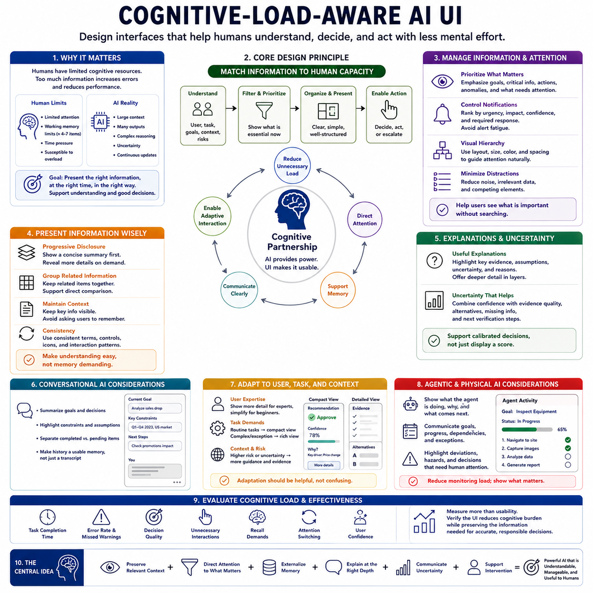
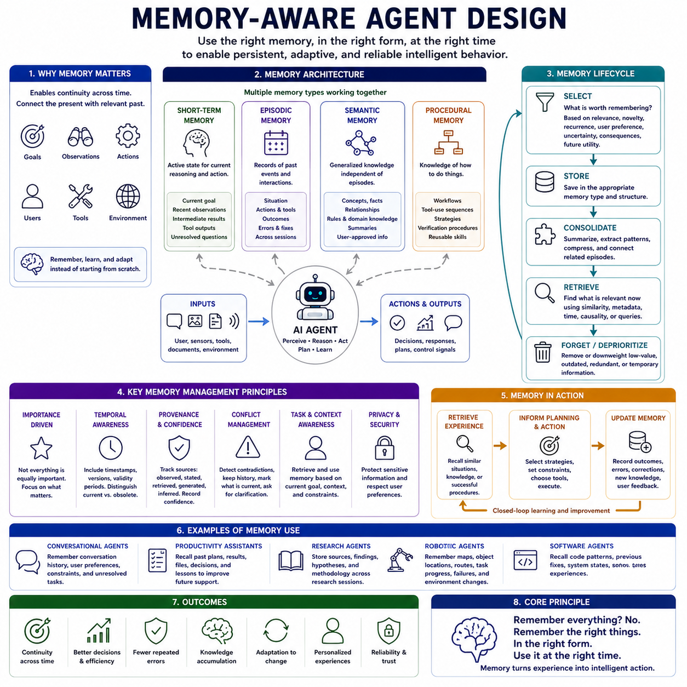
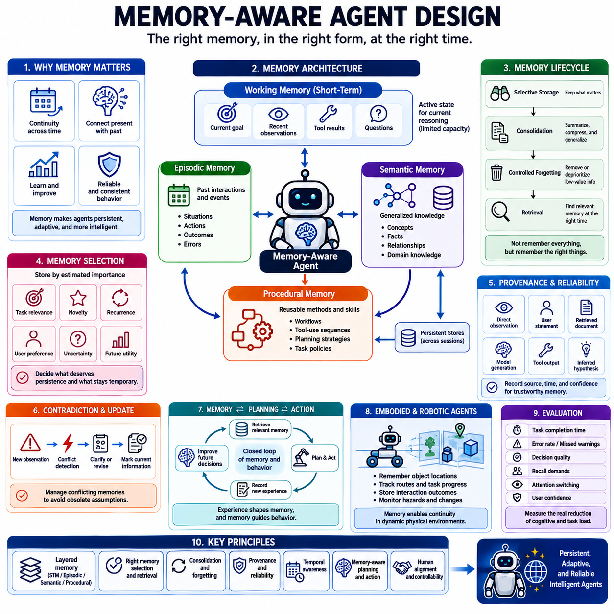
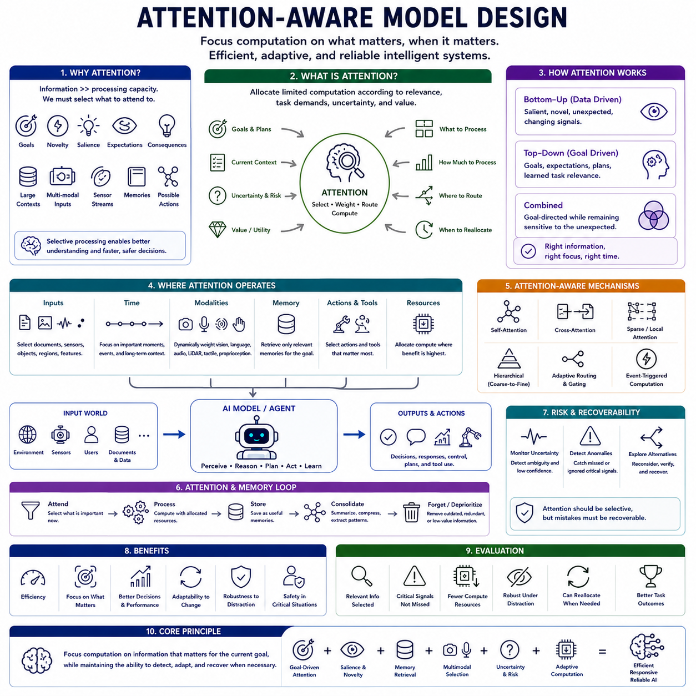
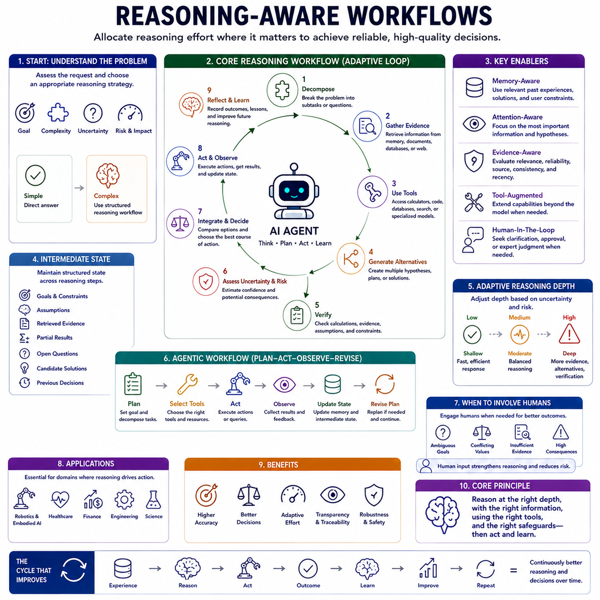
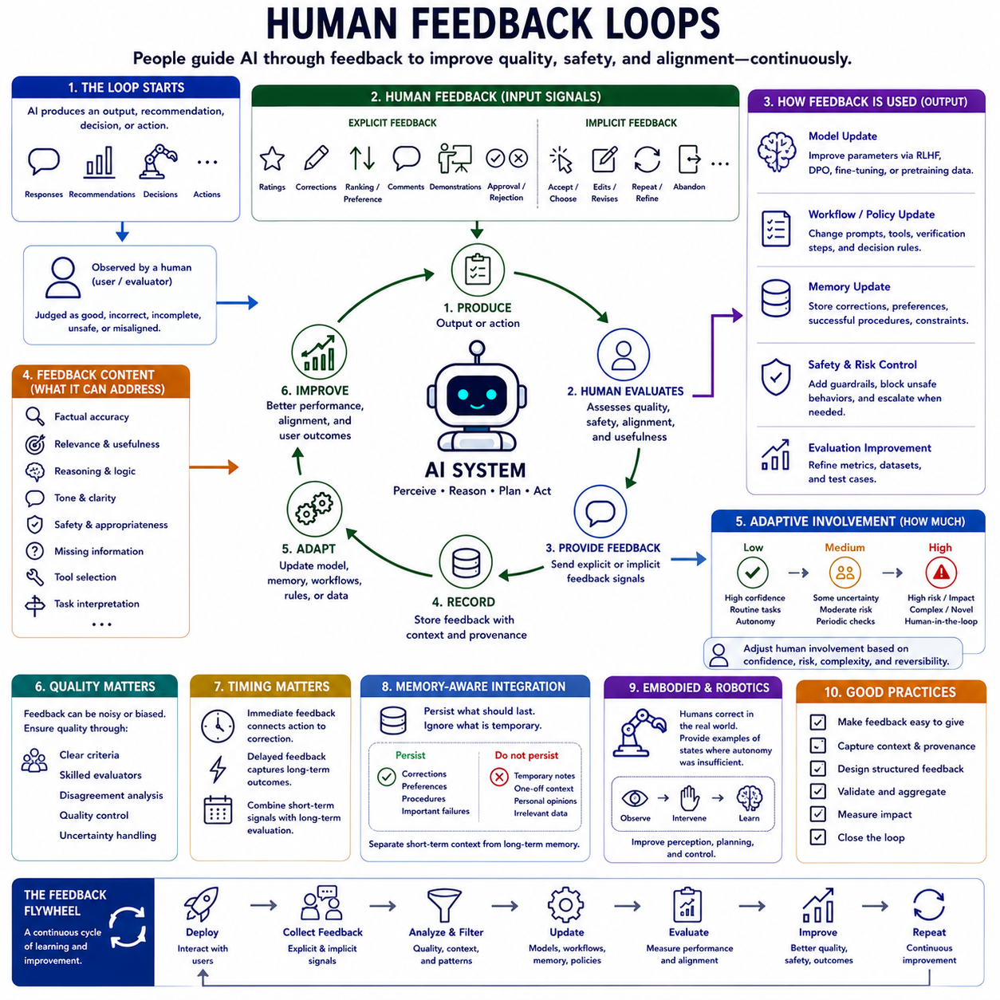
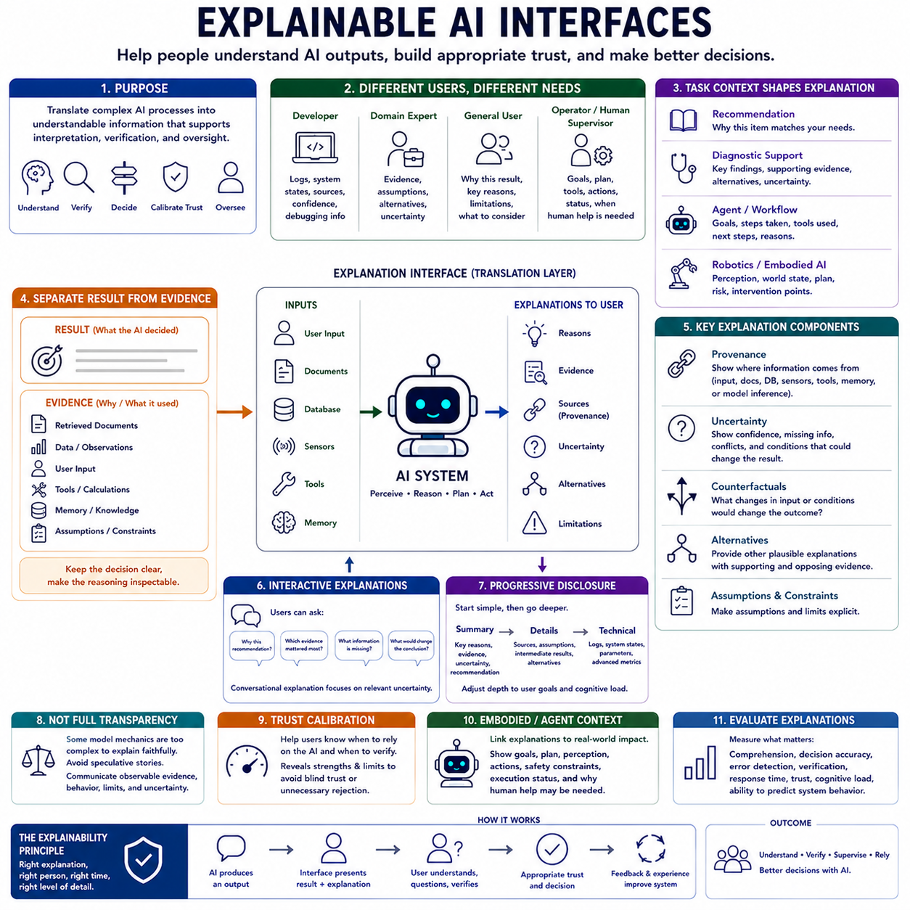
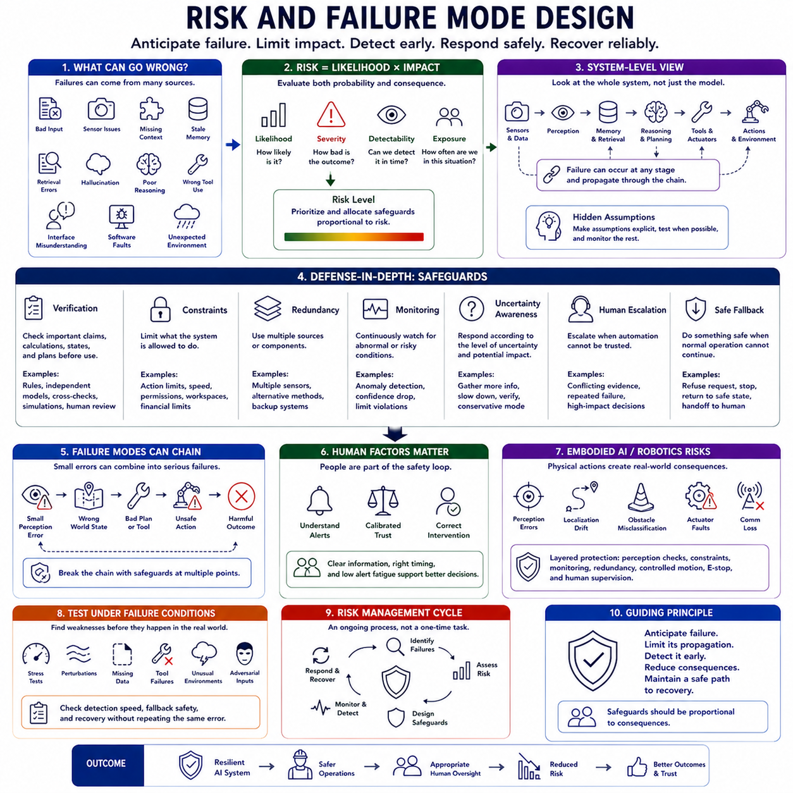

**Volume 43 Cognitive Science for AI**

# Chapter 12. Practical AI Design Guidelines

## 12.00 Design Guideline Overview

{width="7.268055555555556in" height="7.268055555555556in"}

Practical AI design guidelines translate principles from cognitive science into concrete engineering choices for artificial intelligence systems. The goal is not to imitate the human mind literally, but to use knowledge about attention, memory, reasoning, cognitive load, feedback, explanation, and error to design systems that interact with people more effectively and behave more reliably across changing conditions.

A cognitively informed design process begins by recognizing that both humans and AI systems operate under constraints. Humans have limited attention, working memory, time, and perceptual capacity, while AI systems have limited context, computation, memory bandwidth, data quality, and model reliability. Effective design therefore distributes information and computation so that neither the human nor the artificial component becomes unnecessarily overloaded.

Cognitive-load-aware interface design is one of the most direct applications of cognitive science. An AI interface should present information in forms that support comprehension, prioritization, and decision making rather than forcing users to interpret excessive detail. Important system states, uncertainties, actions, and warnings should be visible when needed, while secondary information can be progressively revealed according to task demands.

Good interface design also reduces unnecessary task switching and fragmented attention. When related information is distributed across multiple views, users must maintain additional intermediate state in working memory. Grouping related information, preserving consistent terminology, minimizing irrelevant alerts, and maintaining clear navigation can reduce extraneous cognitive load while allowing users to devote mental resources to understanding the actual problem.

Memory-aware agent design extends these principles from interfaces to autonomous AI systems. Agents operating over long tasks must preserve goals, previous observations, decisions, interactions, failures, and environmental changes. Immediate context may support short-term processing, while episodic records, semantic retrieval, structured state, and persistent memory can provide information across longer timescales.

However, more memory is not automatically better. Large undifferentiated histories can introduce irrelevant context, conflicting information, and inefficient retrieval. Memory systems should determine what to store, when to summarize, what to forget, and which information should be retrieved for the current task. Effective memory design therefore combines persistence with selection, consolidation, relevance estimation, and controlled updating.

Attention-aware model design follows the same principle of selective processing. Intelligent systems rarely need to process every available signal with equal importance. Attention mechanisms can prioritize relevant tokens, objects, sensor streams, events, or goals according to context. At the system level, selective computation can also determine which models, tools, memories, or sensors deserve additional processing at a particular moment.

Reasoning-aware workflows are important when tasks contain uncertainty, multiple constraints, or significant consequences. Instead of relying exclusively on a single direct model response, an AI workflow can decompose difficult problems, preserve intermediate state, retrieve evidence, compare alternatives, use external tools, and verify important conclusions. The depth of reasoning can be adjusted according to task complexity, confidence, risk, and available resources.

Human feedback provides another essential design mechanism because many objectives cannot be completely specified through fixed numerical metrics. Users can correct outputs, rank alternatives, clarify intentions, identify failures, and indicate preferred behavior. Effective feedback loops capture these signals and use them to improve future interactions while distinguishing temporary preferences from persistent requirements and task-specific corrections.

Feedback should also be designed as a continuous operational process rather than a one-time training activity. Human oversight may occur during data collection, model evaluation, deployment, or actual task execution. Systems should make it easy for people to intervene when uncertainty or risk becomes high, while avoiding unnecessary requests for confirmation when the system can safely handle routine situations on its own.

Explainable AI interfaces help users build appropriate mental models of what a system is doing and why. Explanation does not require exposing every internal parameter or computation. Instead, useful explanations communicate relevant evidence, assumptions, uncertainty, alternatives, data sources, and important limitations at a level appropriate to the user and task. Explanation should support decisions rather than merely increase the amount of displayed information.

Trust should therefore be calibrated rather than maximized. An interface that makes AI appear more certain or capable than it really is can encourage automation bias, while an interface that constantly emphasizes uncertainty may become difficult to use. Reliable systems communicate confidence, evidence, limitations, and failure conditions in ways that help users determine when to accept an output, verify it, or request additional analysis.

Risk and failure-mode design extends cognitive principles into system safety. Designers should identify how errors can arise from perception, memory, retrieval, reasoning, tools, user interaction, model hallucination, or changing environments. Higher-consequence applications require stronger safeguards such as independent verification, redundancy, monitoring, constrained action, human escalation, and safe fallback behavior.

Failure recovery is as important as failure prevention. Real systems will eventually encounter ambiguous inputs, unavailable tools, corrupted data, unexpected environments, or incorrect intermediate decisions. A robust AI architecture should detect abnormal conditions, preserve enough state to understand what happened, reconsider assumptions, select alternative strategies, and recover without repeatedly reproducing the same error.

These guidelines are most effective when applied together rather than as independent features. Cognitive load affects how explanations are presented, attention influences what enters memory, memory shapes reasoning, reasoning determines actions, feedback modifies future behavior, and risk determines how much verification is required. Practical AI design therefore benefits from treating interaction, cognition, computation, and safety as parts of one integrated architecture.

The broader principle is that cognitive science provides constraints and organizational ideas that can improve artificial systems without requiring biological imitation. AI systems should manage limited resources, preserve useful state, focus on relevant information, reason according to task demands, learn from feedback, communicate their behavior clearly, and recover safely from failure. These principles form the foundation for the practical design topics developed throughout this chapter.

## 12.01 Cognitive Load Aware AI UI [w/Code]

{width="7.268055555555556in" height="7.268055555555556in"}

A cognitive-load-aware AI user interface should be designed around the limited capacity of human attention and working memory. AI systems can generate large amounts of information quickly, but presenting everything at once may reduce rather than improve human performance. Effective interfaces therefore control information density, prioritize task-relevant content, and organize interaction so that users can understand system outputs without unnecessary mental effort.

Cognitive load can be understood as the mental effort required to process information and perform a task. Complex AI applications may require users to interpret recommendations, compare alternatives, examine evidence, monitor system state, and decide whether intervention is necessary. When these demands exceed available cognitive resources, users become more likely to overlook important information, misunderstand outputs, or make poor decisions.

A useful design principle is to distinguish information that is essential for the current decision from information that is merely available. AI systems often possess far more contextual data than a person needs at a particular moment. The interface should therefore emphasize the current objective, critical evidence, uncertainty, and required action while keeping secondary details accessible without allowing them to dominate the primary interaction.

Progressive disclosure provides an effective method for managing this information hierarchy. Instead of displaying complete reasoning, extensive evidence, configuration parameters, and historical records simultaneously, the interface can initially present a concise result and expose additional detail when requested. This allows novice users to operate efficiently while enabling expert users to inspect deeper information when necessary.

Working-memory limitations should also influence how information is distributed across the interface. Users should not be required to remember values, assumptions, previous outputs, or intermediate decisions while navigating between screens. Relevant information should remain visible or easily recoverable, and related items should be spatially grouped so that comparison can occur directly rather than through memory-intensive mental reconstruction.

Consistency reduces cognitive effort because users can reuse previously learned interaction patterns. Similar AI functions should use consistent terminology, controls, status indicators, confidence displays, and interaction sequences. When the same concept is represented differently across screens, users must repeatedly reinterpret the interface. Stable conventions therefore allow cognitive resources to remain focused on the task rather than interface mechanics.

Attention management is particularly important in AI systems that continuously generate notifications, recommendations, or warnings. Excessive alerts can produce alert fatigue, causing users to ignore even important signals. Interfaces should prioritize notifications according to urgency, consequence, confidence, and required response. Low-priority information can be summarized or deferred, while safety-critical conditions should remain immediately distinguishable.

Visual hierarchy can guide attention without requiring users to consciously search through every interface element. Important outputs, anomalies, unresolved decisions, and required actions should be perceptually prominent, while supporting information should remain subordinate. Layout, grouping, spacing, labels, and information order can communicate priority, reducing the amount of deliberate cognitive processing needed to understand the system state.

AI-generated explanations should also respect cognitive-load constraints. Providing more explanation does not necessarily produce greater understanding. A useful explanation should identify the key evidence, assumptions, uncertainty, and reasons relevant to the current decision. Additional technical detail can remain available through layered explanation so that users can move from a concise overview to deeper analysis according to expertise and task requirements.

Uncertainty presentation deserves special attention because poorly designed confidence information can increase confusion. A numerical probability alone may not communicate what is uncertain or what the user should do about it. Interfaces can combine confidence estimates with evidence quality, alternative interpretations, missing information, and recommended verification steps. The objective is to support calibrated decisions rather than simply display a score.

Conversational AI introduces additional cognitive-load considerations. Long dialogues can accumulate assumptions, decisions, corrections, and unresolved tasks that become difficult for users to track. Interfaces can reduce this burden by maintaining concise summaries, highlighting current goals, preserving important constraints, and distinguishing completed actions from pending ones. Conversation history should function as usable memory rather than merely as a chronological transcript.

Adaptive interfaces can further reduce cognitive load by adjusting information presentation to the user, task, and situation. A routine operation may require only a compact status display, while an unexpected failure may require diagnostic evidence and alternative actions. Adaptation should remain predictable, however, because interfaces that change excessively can create new cognitive demands by making users repeatedly relearn where information is located.

For agentic AI systems, interfaces must communicate not only information but also ongoing activity. Users may need to understand what the agent is attempting, which tools it is using, what has been completed, what remains pending, and when human intervention is required. Clear representations of goals, progress, dependencies, and exceptions can prevent users from mentally reconstructing the agent\'s internal workflow.

Cognitive-load-aware design becomes especially important in robotics and other physical AI applications. Operators may simultaneously monitor sensor information, robot state, environmental conditions, mission objectives, and safety constraints. Interfaces should therefore prioritize deviations, hazards, and decisions requiring human attention instead of continuously exposing raw sensor streams. Detailed telemetry can remain available for diagnosis when needed.

Evaluation of an AI interface should consequently measure more than usability or visual preference. Designers can examine task completion time, error rates, missed warnings, decision quality, unnecessary interactions, recall demands, attention switching, and user confidence. These measurements help determine whether the interface genuinely reduces cognitive burden while preserving the information required for accurate and responsible decisions.

The central design principle is that an AI interface should function as a cognitive partner rather than an additional source of mental workload. It should preserve relevant context, direct attention toward important information, externalize memory demands, provide explanations at appropriate depth, communicate uncertainty clearly, and support intervention when necessary. Cognitive-load-aware design ultimately allows powerful AI capabilities to remain understandable, manageable, and useful to human users.

## 12.02 Memory Aware Agent Design [w/Code]

{width="7.268055555555556in" height="7.268055555555556in"}

{width="7.268055555555556in" height="7.268055555555556in"}

Memory-aware agent design treats memory as an active computational resource rather than a passive archive of previous interactions. An intelligent agent operating across extended tasks must preserve information about goals, observations, actions, decisions, users, tools, and environmental changes. Effective memory enables continuity across time, allowing the agent to connect present situations with relevant past information instead of repeatedly solving every problem from the beginning.

A useful memory architecture separates information according to its role and expected lifetime. Immediate context can support short-term reasoning, while persistent stores preserve information across sessions or tasks. Episodic memory can represent previous interactions and events, semantic memory can maintain generalized knowledge, and procedural memory can capture reusable strategies, workflows, or skills. These layers should cooperate rather than function as isolated repositories.

Short-term memory provides the active state required for current reasoning and action. It may contain the present goal, recent observations, intermediate results, temporary assumptions, tool outputs, and unresolved questions. Because context capacity is limited, the agent must continuously decide which information remains active. Simply retaining every previous token can consume computational resources and introduce irrelevant information that interferes with current reasoning.

Episodic memory allows an agent to preserve meaningful records of what happened during previous interactions. An episode may include the situation, actions performed, tools used, outcomes obtained, errors encountered, and corrections applied. Such records can help the agent recognize recurring situations and avoid repeating previous failures. Episodic memory becomes especially valuable when tasks extend across many sessions or involve evolving environments.

Semantic memory represents generalized knowledge that can be reused independently of a specific episode. It may contain concepts, facts, relationships, user-approved rules, domain knowledge, or summaries derived from repeated experience. Retrieval systems, vector databases, knowledge graphs, and structured databases can provide semantic memory functions. The central challenge is retrieving information that is relevant to the current goal without introducing unrelated or outdated knowledge.

Procedural memory captures knowledge about how actions should be performed. For an AI agent, this may include workflows, tool-use sequences, planning strategies, verification procedures, or reusable task policies. Instead of reconstructing an effective procedure from scratch every time, the agent can retrieve and adapt previously successful methods. Procedural memory therefore supports efficiency, consistency, and the accumulation of reusable competence.

Memory selection is as important as memory storage. An agent should not preserve every observation with equal priority because large undifferentiated histories create retrieval noise and increase storage costs. Importance can be estimated from task relevance, novelty, recurrence, user preference, uncertainty, consequences, or future utility. Memory-aware systems therefore require policies that determine what deserves persistence and what can safely remain temporary.

Memory consolidation transforms detailed experiences into more compact and reusable representations. Multiple interaction records can be summarized into stable knowledge, recurring patterns can be extracted, and redundant information can be compressed. This process reduces memory growth while preserving information that remains useful. Consolidation can also connect related episodes so that future retrieval operates over meaningful knowledge rather than disconnected historical fragments.

Forgetting is therefore a necessary design capability rather than merely a system failure. Temporary information, outdated assumptions, redundant observations, and low-value records may need to be removed or deprioritized. Controlled forgetting prevents old information from dominating current reasoning and reduces contradictions between obsolete and updated knowledge. Effective memory management balances persistence with relevance instead of maximizing retention.

Retrieval determines whether stored information actually contributes to intelligent behavior. A memory system must identify which previous events, concepts, procedures, or constraints are relevant to the current state. Retrieval may use semantic similarity, keywords, metadata, temporal relationships, task identity, causal links, or structured queries. More advanced agents can combine several retrieval mechanisms and rerank results before inserting selected memories into active context.

Temporal information is particularly important for agents operating in dynamic environments. The same fact may have different validity depending on when it was observed or updated. Memory records can therefore include timestamps, versions, validity periods, provenance, and relationships between previous and current states. Temporal reasoning helps the agent distinguish persistent knowledge from information that may have become obsolete as conditions changed.

Memory provenance supports reliability by preserving where information originated. An agent should ideally distinguish direct observations, user statements, retrieved documents, model-generated conclusions, tool outputs, and inferred hypotheses. Without provenance, uncertain or generated information may gradually be treated as established fact. Recording source and confidence information allows later reasoning to evaluate memories according to their evidential strength.

Contradiction management becomes necessary as memory accumulates. New observations may conflict with earlier records, users may revise requirements, or external knowledge may change. A memory-aware agent should not simply store both versions without interpretation. It can preserve historical states while marking which information is current, identify unresolved conflicts, request clarification when necessary, and prevent obsolete assumptions from silently influencing future decisions.

Memory should also interact closely with planning and action. Retrieved experience can influence which strategy is selected, previous failures can modify constraints, and successful procedures can guide future execution. After an action is completed, its outcome can generate new memories that improve subsequent decisions. This creates a closed loop in which memory informs behavior and behavioral outcomes continuously reshape memory.

Embodied and robotic agents place especially strong demands on memory because their environments change continuously. A robot may need to remember object locations, previous routes, task progress, interaction outcomes, hazards, failures, and environmental changes. Combining episodic records with semantic maps, world models, and procedural skills allows physical agents to maintain continuity while adapting their behavior as the world evolves.

The central principle of memory-aware agent design is therefore not to remember everything, but to preserve the right information in the right form and retrieve it at the right time. Effective agents require coordinated mechanisms for short-term state, episodic experience, semantic knowledge, procedural competence, selection, consolidation, forgetting, provenance, and retrieval. Together, these mechanisms transform memory from passive storage into an active foundation for persistent, adaptive, and reliable intelligent behavior.

## 12.03 Attention Aware Model Design [w/Code]

{width="7.268055555555556in" height="7.268055555555556in"}

Attention-aware model design treats attention as a limited computational resource that should be allocated according to relevance, task demands, uncertainty, and expected value. Rather than processing every element of an input with equal importance, an intelligent system should identify which signals deserve greater representation and computation. This principle connects cognitive theories of selective attention with practical mechanisms for efficient and adaptive AI.

Human attention demonstrates why selective processing is necessary. The sensory environment contains far more information than the brain can process in detail at one time, so cognitive systems prioritize information according to goals, novelty, salience, expectations, and potential consequences. AI systems face an analogous engineering problem when large contexts, multimodal inputs, sensor streams, memories, and possible actions compete for finite computational resources.

In neural models, attention mechanisms provide a computational method for dynamically weighting information. Instead of representing every input independently with fixed importance, attention allows the model to estimate relationships among elements and emphasize those that are relevant to the current computation. Transformer architectures extend this principle through self-attention, enabling tokens or representations to exchange information according to learned contextual relationships.

Attention-aware design should nevertheless be understood more broadly than Transformer attention alone. At the system level, selective processing can determine which documents should be retrieved, which memories should enter active context, which sensors require detailed analysis, which objects deserve tracking, or which tools should be invoked. Attention can therefore operate across models, modules, modalities, timescales, and computational resources.

Task goals provide an important source of attentional control. The same input may contain different relevant information depending on what the system is trying to accomplish. A robot navigating through a corridor may prioritize free space, obstacles, and moving people, while the same robot performing inspection may prioritize equipment condition, anomalies, labels, and measurement locations. Attention should therefore remain conditioned on current objectives.

Bottom-up and top-down attention provide a useful design distinction. Bottom-up mechanisms prioritize signals because they are salient, novel, unexpected, or rapidly changing, while top-down mechanisms prioritize information according to goals, expectations, plans, and learned task relevance. Robust AI systems can combine both forms so that they remain goal-directed while still responding appropriately to unexpected events that may require immediate processing.

Temporal attention is essential when information unfolds over time. Not every previous observation contributes equally to a current decision, and recent information is not always the most important. Models may need to emphasize earlier events that establish causal context, detect changes across long sequences, or preserve rare but critical observations. Temporal selection can reduce unnecessary computation while maintaining information required for coherent behavior.

Multimodal AI introduces another attention-allocation problem because vision, language, audio, LiDAR, tactile sensing, proprioception, and other modalities may contribute differently according to the situation. An attention-aware architecture can dynamically change the relative importance of these sources. When visual perception becomes unreliable, for example, spatial or proprioceptive signals may deserve greater influence on the resulting state estimate or decision.

Attention and memory should be designed together because attention determines which information receives sufficient processing to become useful memory, while memory supplies previous information that may deserve renewed attention. Retrieval can be interpreted as a form of selective access to stored knowledge. An agent can use current goals and observations to retrieve a small set of relevant memories rather than inserting an entire historical record into active context.

Computational efficiency is another major motivation for attention-aware design. Large models can consume substantial resources when every token, image region, sensor measurement, or historical state receives full processing. Sparse attention, hierarchical processing, token selection, region selection, event-triggered computation, and adaptive model routing can concentrate resources where they provide the greatest expected benefit while reducing unnecessary computation.

Attention mechanisms can also support hierarchical reasoning. A system may first identify a small number of important regions, events, hypotheses, or subtasks and then allocate deeper reasoning to them. This resembles coarse-to-fine processing, in which inexpensive mechanisms establish priority before expensive computation is activated. Such architectures are useful when only a fraction of available information requires detailed analysis.

However, selective attention introduces the risk of missing important information. If an attention mechanism incorrectly assigns low priority to a critical signal, later reasoning may never receive the evidence required to correct the mistake. Attention-aware systems therefore need mechanisms for uncertainty monitoring, periodic reconsideration, anomaly detection, exploration, and alternative processing paths so that early selection errors do not become irreversible failures.

Attention should also interact with confidence and risk. Routine, high-confidence situations may require limited computation, while ambiguous or safety-critical conditions may justify broader attention and deeper analysis. A system can dynamically expand its processing when uncertainty increases, conflicting evidence appears, or potential consequences become severe. Computational effort can therefore become proportional to both difficulty and risk.

For embodied and robotic AI, attention must operate under real-time constraints. A robot cannot process every camera pixel, LiDAR return, map element, object hypothesis, and historical observation with unlimited computation before acting. It must prioritize obstacles, dynamic agents, task-relevant objects, uncertain regions, and safety-critical events while maintaining sufficient situational awareness to respond to environmental change.

Evaluation of attention-aware models should examine more than whether attention weights appear interpretable. Important questions include whether relevant information is consistently selected, critical signals are missed, computational resources are reduced, performance remains robust under distraction, and the system can redirect attention when goals or environmental conditions change. Behavioral effectiveness is ultimately more important than visually plausible attention patterns.

The central principle of attention-aware model design is therefore selective but recoverable computation. Intelligent systems should focus processing on information that matters while retaining mechanisms to detect when their current focus is incomplete or incorrect. By coordinating goal-driven attention, salience, memory retrieval, multimodal selection, uncertainty, risk, and adaptive computation, AI systems can become more efficient, responsive, and reliable without attempting to process everything equally.

## 12.04 Reasoning Aware Workflows [w/Code]

{width="7.268055555555556in" height="7.268055555555556in"}

Reasoning-aware workflows organize AI computation around the difficulty, uncertainty, and consequences of a task rather than treating every request as a single-step prediction problem. Simple questions may require only direct inference, while complex problems benefit from decomposition, evidence gathering, intermediate state, comparison, verification, and revision. The objective is to allocate reasoning effort where it improves reliability and decision quality.

A reasoning-aware system begins by estimating what kind of problem it is facing. Some tasks involve straightforward retrieval or transformation, whereas others contain ambiguous goals, interacting constraints, incomplete evidence, long causal chains, or high-risk decisions. Recognizing these differences allows the workflow to select an appropriate reasoning strategy instead of applying the same computational procedure to every situation.

Problem decomposition is particularly useful when a task contains several dependent components. Rather than attempting to solve the entire problem in one generation, the system can divide it into smaller questions, constraints, hypotheses, or subtasks. Each component can then be examined independently before the results are integrated. This reduces the probability that an early misunderstanding silently propagates through the complete solution.

Intermediate state provides continuity across these reasoning stages. A workflow may preserve assumptions, retrieved evidence, partial calculations, unresolved questions, candidate explanations, and previous decisions. Structured intermediate representations are often more reliable than repeatedly reconstructing the reasoning context from raw conversation history. They also make it easier to identify where an incorrect assumption or conclusion entered the process.

Evidence-aware reasoning connects inference with information that can support or challenge a conclusion. When internal model knowledge is insufficient, the workflow can retrieve documents, query databases, inspect structured records, or obtain current information from external systems. Retrieved evidence should not simply be inserted into context; its relevance, reliability, provenance, consistency, and temporal validity should also be considered before it influences a decision.

Tool use extends reasoning beyond the capabilities of a language model alone. Calculators can perform precise arithmetic, code execution can test algorithms, databases can return authoritative records, search systems can obtain current information, and specialized models can analyze particular modalities. A reasoning-aware workflow determines not only which tool to use but also when its output requires interpretation, cross-checking, or additional verification.

Alternative generation can improve reasoning when several explanations or solutions remain plausible. Instead of committing immediately to the first candidate, the system can construct multiple hypotheses, plans, or interpretations and compare them against available constraints. This is especially valuable when evidence is incomplete because considering alternatives can expose hidden assumptions and reduce premature convergence on an apparently plausible answer.

Verification should be integrated throughout the workflow rather than reserved exclusively for the final output. Intermediate calculations can be checked, retrieved claims can be compared with their sources, assumptions can be tested against constraints, and planned actions can be evaluated before execution. Early verification prevents small errors from accumulating into larger failures and can reduce the cost of correcting a completed but fundamentally flawed reasoning chain.

Uncertainty should influence how deeply the system reasons. High-confidence routine tasks may not justify extensive analysis, while conflicting evidence or ambiguous conditions can trigger additional retrieval, alternative generation, or verification. This creates adaptive reasoning depth, in which computational effort increases when the problem becomes difficult or uncertain rather than remaining fixed regardless of the situation.

Risk provides another dimension for controlling reasoning effort. Two tasks with similar complexity may require different levels of verification if the consequences of error differ substantially. A casual recommendation may tolerate some uncertainty, whereas decisions affecting safety, finance, engineering, healthcare, or physical control require stronger evidence and safeguards. Reasoning resources should therefore scale with both uncertainty and consequence.

Memory-aware reasoning enables previous experience to influence current workflows. An agent can retrieve earlier solutions, failures, corrections, user constraints, or successful procedures when they are relevant to a new task. This can improve efficiency and consistency, but remembered information must still be checked for current validity. Previous experience should guide reasoning without becoming an unquestioned substitute for present evidence.

Attention-aware reasoning complements this process by determining which information deserves deeper analysis. Large contexts may contain many documents, observations, memories, or hypotheses, but only a subset may materially affect the current decision. Selective processing can focus computational resources on important evidence while maintaining mechanisms for reconsidering information that was initially assigned lower priority.

Agentic workflows extend reasoning into planning and action. An agent may formulate a goal, decompose it into tasks, select tools, execute actions, observe results, update its state, and revise the plan. Reasoning therefore becomes part of a closed interaction loop rather than a one-time internal process. Unexpected results can trigger replanning, additional information gathering, or escalation to human supervision.

Human involvement becomes particularly important when objectives are ambiguous, values conflict, evidence remains insufficient, or actions have serious consequences. A reasoning-aware system should recognize conditions in which autonomous continuation is inappropriate. Instead of treating human intervention as failure, the workflow can use clarification, approval, expert judgment, or oversight as deliberate reasoning resources within the larger decision process.

Reasoning-aware workflows are especially important for robotics and embodied AI because reasoning eventually influences physical action. A robot may need to interpret sensory evidence, estimate world state, predict consequences, evaluate alternative plans, and verify safety constraints before acting. After execution, observed outcomes provide new evidence that updates the next reasoning cycle, linking perception, prediction, planning, control, and feedback.

The central principle of reasoning-aware workflow design is that intelligence should regulate how it thinks according to the problem it faces. Effective systems combine task assessment, decomposition, intermediate state, evidence, memory, attention, tools, alternatives, verification, uncertainty, risk, action, and feedback. By dynamically allocating reasoning effort and checking important conclusions before they propagate, AI workflows can become more efficient, adaptive, transparent, and reliable.

## 12.05 Human Feedback Loops [w/Code]

{width="7.268055555555556in" height="7.268055555555556in"}

Human feedback loops provide a mechanism for AI systems to improve through information supplied by people during development, evaluation, deployment, and operation. Human judgment can reveal qualities that are difficult to express through fixed metrics, including usefulness, relevance, safety, preference, clarity, and contextual appropriateness. Feedback therefore connects model behavior with human goals and creates a recurring cycle of observation, correction, adaptation, and reevaluation.

A feedback loop begins when an AI system produces an output, recommendation, decision, or action that can be evaluated by a person. The user or evaluator observes the result and provides information about whether it was acceptable, incorrect, incomplete, unsafe, or inconsistent with the intended objective. This information can then influence later model behavior, system configuration, memory, workflow rules, training data, or evaluation criteria.

Human feedback can be explicit or implicit. Explicit feedback includes ratings, corrections, rankings, written comments, demonstrations, approvals, or direct rejection of an output. Implicit feedback is inferred from behavior such as whether users accept recommendations, revise generated content, repeat a query, abandon an interaction, or choose one option over another. Explicit signals are usually easier to interpret, while implicit signals can be collected at greater scale but may contain substantial ambiguity.

Corrections provide especially valuable feedback because they indicate both that a failure occurred and how the result should change. A user may correct a factual statement, modify a generated plan, adjust a robot trajectory, or replace an inappropriate recommendation. Systems can preserve these corrections as evaluation examples, training data, memory updates, or reusable constraints so that similar errors become less likely in future interactions.

Preference feedback is useful when several outputs may all be technically valid but differ in quality or suitability. Humans can compare alternatives and indicate which response, plan, explanation, or behavior they prefer. Preference information can support ranking models, reward models, reinforcement learning from human feedback, or direct preference optimization, allowing systems to learn behavioral objectives that are difficult to define with manually constructed rules.

Demonstrations provide richer feedback by showing the system how a task should be performed rather than merely evaluating an existing result. In robotics, a person may demonstrate a manipulation trajectory or corrective action. In language systems, experts may provide high-quality examples of reasoning, classification, summarization, or decision support. Demonstrations can establish desired behavior while reducing the need to specify every action through explicit rules.

Feedback quality is as important as feedback quantity. Human judgments can be inconsistent, biased, incomplete, or influenced by misunderstanding and fatigue. Different evaluators may also disagree because they possess different expertise, preferences, or interpretations of the task. Reliable feedback pipelines therefore require clear criteria, appropriate evaluator selection, disagreement analysis, quality control, and mechanisms for distinguishing uncertain judgments from strong consensus.

Context should accompany feedback whenever possible. A negative rating without explanation may indicate that something was wrong but provide little information about the cause. More useful feedback can identify whether the problem involved factual accuracy, relevance, reasoning, tone, safety, missing evidence, tool selection, or task interpretation. Structured feedback enables the system to connect corrections with specific failure modes instead of treating every negative signal as equivalent.

Timing also affects the usefulness of feedback. Immediate feedback can connect a correction directly with the action that produced it, which is particularly important for interactive agents and robots. Delayed feedback may capture broader outcomes that cannot be evaluated immediately, such as whether a recommendation ultimately succeeded. Effective systems can combine short-term corrective signals with longer-term outcome-based evaluation.

Human-in-the-loop operation extends feedback beyond offline model training. A deployed system may request clarification when goals are ambiguous, seek approval before consequential actions, or escalate uncertain situations to a human expert. The human becomes an active component of the operational control loop rather than only a source of historical training data. This approach is especially important when errors cannot be safely corrected after execution.

The frequency of human intervention should be carefully controlled. Requiring confirmation for every routine action can increase cognitive load and reduce the benefits of automation, while excessive autonomy can allow uncertain or dangerous decisions to proceed without review. A well-designed system adjusts the level of human involvement according to confidence, novelty, risk, task complexity, and the reversibility of potential actions.

Feedback loops interact closely with memory-aware agent design. User corrections, stable preferences, successful procedures, and important failures may deserve persistence, while temporary comments or situation-specific instructions may not. The system must distinguish what should influence only the current interaction from what should become longer-term memory. Incorrect persistence can transform a temporary correction into an inappropriate permanent rule.

Feedback can also modify reasoning workflows without changing the underlying foundation model. Repeated failures may trigger stronger verification, additional retrieval, different tool selection, or human approval at particular workflow stages. In this way, system improvement can occur through orchestration, memory, prompts, policies, and safeguards as well as through model retraining. Human feedback therefore operates across multiple architectural layers.

In embodied AI and robotics, feedback is tightly connected to physical consequences. Human operators may correct navigation, manipulation, task sequencing, or safety decisions while observing the robot in real environments. These interventions can provide examples of states in which autonomous policies were insufficient. Combined with sensor observations and action histories, human corrections can become valuable data for improving future perception, planning, and control.

A mature feedback system forms a data flywheel in which deployment generates interactions, interactions reveal successes and failures, feedback identifies opportunities for improvement, and updated models or workflows return to operation. However, this cycle should not automatically treat all user behavior as ground truth. Feedback must be filtered, validated, aggregated, and evaluated so that improvement reflects reliable human objectives rather than noise or accidental behavior.

The central principle of human feedback loops is that AI improvement should remain connected to observable human needs and real operational outcomes. Effective systems make feedback easy to provide, preserve its context and provenance, evaluate its quality, determine where it should influence the architecture, and measure whether changes actually improve behavior. Human feedback then becomes a continuous control and learning mechanism linking users, AI systems, deployment experience, and iterative improvement.

## 12.06 Explainable AI Interfaces [w/Code]

{width="7.268055555555556in" height="7.268055555555556in"}

Explainable AI interfaces are designed to help people understand the outputs, recommendations, decisions, and actions produced by artificial intelligence systems. Their purpose is not necessarily to reveal every internal computation of a model, but to provide information that allows users to form an appropriate mental model of system behavior. Effective explanations support interpretation, verification, decision making, trust calibration, and responsible human oversight.

Explanation becomes particularly important when AI systems operate with substantial complexity. Modern models may contain billions of parameters and process information through representations that cannot be directly interpreted by users. An interface therefore acts as a translation layer between computational processes and human understanding, selecting explanations that communicate what matters for the current task without requiring users to understand the entire underlying model.

Different users require different kinds of explanations. A developer investigating model behavior may need technical evidence, logs, retrieved sources, confidence information, and intermediate system states. A domain expert may care more about evidence and assumptions supporting a recommendation, while an ordinary user may need a concise description of why a result was produced and what limitations should be considered. Explanation should therefore be audience-aware.

Task context also determines what constitutes a useful explanation. When an AI system recommends a document, the relevant explanation may identify matching topics or user requirements. In diagnostic support, users may need influential observations, alternative interpretations, and uncertainty. For autonomous agents, explanations may describe current goals, selected tools, completed actions, pending steps, and reasons for requesting human intervention.

A useful explainable interface separates the result from the evidence supporting it. The primary output should remain easy to identify, while supporting information can show relevant data, retrieved documents, observations, assumptions, or constraints. This separation prevents evidence from overwhelming the main decision while still allowing users to inspect the basis of the system\'s behavior when verification is necessary.

Provenance is an essential component of explanation because users need to know where important information originated. Interfaces can distinguish information derived from user input, external documents, databases, sensors, tools, stored memory, or model inference. Provenance becomes especially important when retrieved information and generated conclusions appear together, because users may otherwise incorrectly assume that every statement has the same evidential status.

Uncertainty should be communicated as part of explanation rather than hidden behind a confident presentation. A system may indicate confidence, missing information, conflicting evidence, alternative hypotheses, or conditions under which its conclusion could change. Effective uncertainty communication helps users recognize when an answer is sufficiently reliable for routine use and when additional evidence, verification, or expert judgment may be necessary.

Counterfactual explanations can help users understand how changes in input or conditions might alter an AI decision. Instead of describing internal model mechanics, the interface may explain that a different observation, constraint, threshold, or environmental condition would produce another result. This can make system behavior more actionable because users learn not only why the current outcome occurred but also which factors materially affect it.

Alternative explanations are valuable when uncertainty prevents a single interpretation from being strongly justified. An AI system can present several plausible hypotheses together with evidence supporting or contradicting each one. This reduces the risk that a single generated explanation will be mistaken for certainty. Comparing alternatives also supports human reasoning by revealing where additional information could resolve ambiguity.

Progressive disclosure is important because complete explanations can themselves create excessive cognitive load. The interface can initially provide a short explanation containing the most relevant evidence, uncertainty, and recommended action. Users who need deeper understanding can then inspect additional sources, assumptions, intermediate results, or technical details. Explanation depth should therefore expand according to user needs rather than remain uniformly maximal.

Interactive explanations extend this principle by allowing users to ask questions about the system\'s behavior. A user may ask why a particular recommendation was made, which evidence mattered most, what information is missing, what alternatives were considered, or what would change the conclusion. This conversational form of explanation can be more useful than a static report because users can investigate the specific uncertainty relevant to their decision.

Explainability should not be confused with complete transparency. Some model mechanisms are too complex to translate faithfully into simple human explanations, and simplified descriptions may create an illusion of understanding. Interfaces should avoid presenting speculative narratives as exact descriptions of internal reasoning. When the system cannot provide a faithful causal explanation, it is preferable to communicate observable evidence, system behavior, limitations, and uncertainty clearly.

Trust calibration is therefore a central objective of explainable interfaces. The goal is not to persuade users that the AI system is trustworthy, but to help them determine when reliance is appropriate. Explanations should reveal strengths and limitations in ways that discourage both blind acceptance and unnecessary rejection. A well-calibrated user understands when the system is operating within familiar conditions and when additional scrutiny is justified.

Explainability is especially important for agentic and embodied AI because system outputs may lead to external actions. Users may need visibility into an agent\'s objective, plan, tool usage, environmental interpretation, safety constraints, and execution status. In robotics, explanations can connect sensor observations, world-state estimates, planned trajectories, risk assessments, and human intervention points so that operators can supervise behavior without examining every low-level control signal.

Evaluation of explainable interfaces should focus on whether explanations actually improve human performance. Measures can include comprehension, decision accuracy, error detection, verification behavior, response time, appropriate trust, cognitive load, and the ability to predict system behavior. An explanation that appears sophisticated but does not help users make better decisions may have little practical value, regardless of how much technical information it contains.

The central principle of explainable AI interface design is to provide the right explanation, to the right person, at the right time, and at the right level of detail. Effective interfaces combine evidence, provenance, uncertainty, alternatives, interaction, progressive disclosure, and clear limitations. Explainability then becomes an operational bridge between complex AI computation and human judgment, enabling users to understand, verify, supervise, and appropriately rely on intelligent systems.

## 12.07 Risk and Failure Mode Design [w/Code]

{width="7.268055555555556in" height="7.268055555555556in"}

Risk and failure mode design treats failure as an expected property of complex AI systems rather than an exceptional event. Reliable systems should identify what can go wrong, estimate how serious the consequences may be, and design safeguards before deployment. In cognitively informed AI, risk management connects perception, memory, reasoning, tools, human interaction, and environmental uncertainty with verification, monitoring, constraints, escalation, and recovery.

A failure mode describes a specific way in which a system, component, workflow, or interaction can produce an undesirable result. AI failure modes may originate from incorrect inputs, sensor degradation, missing context, outdated memory, retrieval errors, hallucination, poor reasoning, inappropriate tool use, interface misunderstanding, software faults, or unexpected environmental conditions. Identifying these possibilities provides the foundation for systematic risk analysis.

Risk depends not only on whether a failure can occur but also on its likelihood, severity, detectability, and exposure. A low-probability error may still demand strong protection when its consequences are severe, while frequent low-impact failures may primarily require efficiency improvements. Risk-aware design therefore considers both probability and consequence instead of evaluating system quality only through average benchmark accuracy.

Failure analysis should begin from the complete system rather than the AI model alone. A model may perform correctly while incorrect sensor data, software integration, network failures, stale databases, user misunderstanding, or actuator faults produce unsafe outcomes. System boundaries, dependencies, interfaces, assumptions, data flows, and external services should therefore be examined together when identifying possible failure pathways.

Assumptions deserve particular attention because hidden assumptions often become latent sources of failure. A system may assume that sensors remain calibrated, documents are current, network connectivity is available, users provide valid input, or environmental conditions remain within training distributions. Risk-aware design makes important assumptions explicit, tests them when possible, and treats unverified assumptions as conditions requiring monitoring or safeguards.

Failure modes can interact rather than occur independently. A small perception error may alter world-state estimation, which can influence planning, tool selection, or physical action. Similarly, an incorrect retrieved document may become an assumption in a reasoning workflow and propagate through several later decisions. Understanding these chains is important because multiple individually minor failures can combine into a serious system-level event.

Verification provides one of the primary defenses against such propagation. Important claims, calculations, state estimates, decisions, or planned actions can be checked before they influence later stages. Verification may involve rules, independent models, external tools, redundant sensors, consistency checks, simulations, or human review. The strength of verification should increase with uncertainty, novelty, and the consequences of being wrong.

Constraints provide another important protection mechanism by limiting what an AI system is allowed to do even when its reasoning is imperfect. Constraints may restrict available tools, action ranges, speeds, permissions, financial transactions, robot workspaces, or mission states. In safety-critical systems, deterministic constraints can provide a protective layer outside probabilistic AI components so that plausible but unsafe outputs cannot directly become actions.

Redundancy can improve robustness when a single source or component cannot be trusted completely. Multiple sensors, alternative localization methods, independent calculations, diverse models, duplicated communication paths, or backup power systems can provide additional evidence or functionality. However, redundancy is useful only when failure dependencies are understood, because several components sharing the same weakness may fail simultaneously.

Continuous monitoring is necessary because not every failure can be prevented during design. Runtime monitoring can detect abnormal sensor values, confidence degradation, conflicting evidence, model drift, communication loss, memory inconsistencies, unexpected tool outputs, or behavior outside established limits. Monitoring transforms safety from a static predeployment property into an ongoing operational process that can respond as conditions change.

Uncertainty awareness should influence how the system responds to monitored conditions. When confidence is high and operating conditions remain familiar, normal autonomy may continue. When uncertainty increases, the system can slow execution, gather additional evidence, expand reasoning, activate redundant resources, request human review, or enter a safer state. The response should therefore become progressively more conservative as uncertainty and potential impact increase.

Human escalation is especially important when automated mechanisms cannot resolve ambiguity safely. Systems should define conditions under which responsibility is transferred or assistance is requested, such as conflicting evidence, repeated failure, unusual environments, high-impact decisions, or safety constraint violations. Escalation should provide the human with relevant context, evidence, system state, previous actions, and possible alternatives rather than simply presenting an unexplained alarm.

Safe fallback behavior provides a controlled response when normal operation cannot continue reliably. Depending on the application, fallback may involve refusing an uncertain request, switching to a simpler model, using conservative rules, stopping a robot, reducing speed, returning to a known location, preserving system state, or transferring control to a human. The objective is graceful degradation rather than attempting full capability under conditions the system cannot safely manage.

Risk design must also consider human factors because people can misunderstand alerts, overtrust AI outputs, ignore repetitive warnings, or intervene incorrectly under pressure. Interfaces should prioritize critical information, communicate uncertainty and failure conditions clearly, and avoid excessive alarms that create alert fatigue. Human operators should understand when the system is functioning normally, when verification is needed, and when immediate intervention is required.

Embodied AI and robotics make failure-mode design especially important because errors can produce physical consequences. Perception errors, localization drift, obstacle misclassification, communication loss, planning instability, actuator faults, or incorrect world models can affect motion in the real environment. Physical AI therefore requires layered protection combining perception checks, safety constraints, monitoring, redundant sensing, controlled motion, emergency behavior, and human supervision.

Evaluation should test systems under failure conditions rather than only under nominal operation. Stress tests, perturbations, sensor degradation, missing data, communication interruptions, conflicting information, tool failures, adversarial inputs, and unusual environments can reveal weaknesses that ordinary benchmarks miss. Testing should also examine whether failures are detected quickly, whether fallback behavior is safe, and whether the system can recover without repeatedly reproducing the same error.

The central principle of risk and failure mode design is to anticipate failure, limit its propagation, detect it early, reduce its consequences, and maintain a safe path to recovery. Effective systems combine failure analysis, explicit assumptions, verification, redundancy, constraints, monitoring, uncertainty awareness, human escalation, and safe fallback behavior. Safeguards should be proportional to consequences so that increasingly capable AI remains reliable when real-world conditions depart from expectations.
